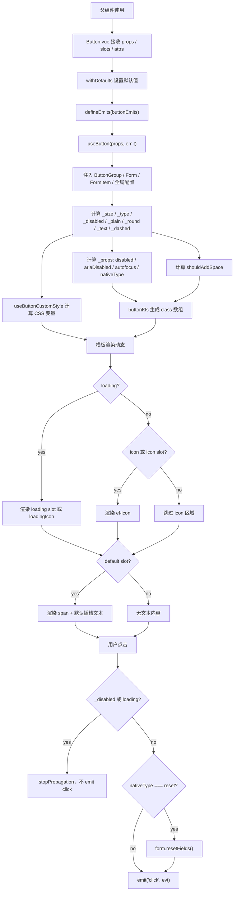

# Element Plus Button 组件源码学习

## 1. Button 组件入口文件

Button 组件的入口文件是：

```text
element-plus-dev/packages/components/button/index.ts
```

源码：

```ts
import { withInstall, withNoopInstall } from '@element-plus/utils'
import Button from './src/button.vue'
import ButtonGroup from './src/button-group.vue'

import type { SFCWithInstall } from '@element-plus/utils'

export const ElButton: SFCWithInstall<typeof Button> & {
  ButtonGroup: typeof ButtonGroup
} = withInstall(Button, {
  ButtonGroup,
})
export const ElButtonGroup: SFCWithInstall<typeof ButtonGroup> =
  withNoopInstall(ButtonGroup)
export default ElButton

export * from './src/button'
export * from './src/constants'
export type { ButtonInstance, ButtonGroupInstance } from './src/instance'
```

这个入口做了四件事：

1. 引入真正的 SFC：`src/button.vue`。
2. 引入附属组件：`src/button-group.vue`。
3. 用 `withInstall(Button, { ButtonGroup })` 把 `Button` 包装成可 `app.use(ElButton)` 的组件插件。
4. 导出 props、常量和实例类型。

因此，`ElButton` 并不是单纯的 `.vue` 文件导出，而是被增强后的组件对象：

```text
Button.vue
  ↓ withInstall
ElButton: Button + install(app) + ButtonGroup
```

## 2. Button 组件包含哪些源码文件

Button 目录如下：

```text
packages/components/button/
├── index.ts
├── __tests__/
│   └── button.test.tsx
├── src/
│   ├── button.vue
│   ├── button.ts
│   ├── use-button.ts
│   ├── button-custom.ts
│   ├── button-group.vue
│   ├── button-group.ts
│   ├── constants.ts
│   └── instance.ts
└── style/
    ├── index.ts
    └── css.ts
```

各文件作用：

| 文件 | 作用 |
| --- | --- |
| `index.ts` | 组件入口，导出 `ElButton`、`ElButtonGroup`，并处理安装能力 |
| `src/button.vue` | Button 组件主体，包含模板、props、emits、setup 逻辑、class 生成 |
| `src/button.ts` | Button props、emits、类型定义 |
| `src/use-button.ts` | Button 组合逻辑：size、type、disabled、点击处理、自动插入中文间距 |
| `src/button-custom.ts` | 自定义 `color` 时动态生成 CSS 变量 |
| `src/button-group.vue` | ButtonGroup 组件主体，通过 provide 向子 Button 传递 size/type |
| `src/button-group.ts` | ButtonGroup props 类型和运行时定义 |
| `src/constants.ts` | ButtonGroup provide/inject 的 key |
| `src/instance.ts` | Button 和 ButtonGroup 实例类型 |
| `style/index.ts` | Sass 源码样式入口 |
| `style/css.ts` | 构建后 CSS 样式入口 |
| `__tests__/button.test.tsx` | Button 行为测试 |

## 3. props 是如何定义的

Button 的 props 主要定义在：

```text
packages/components/button/src/button.ts
```

它现在有两套相关定义：

1. `ButtonProps`：当前 `button.vue` 实际使用的 TypeScript interface。
2. `buttonProps`：运行时 props 对象，源码里标记为 deprecated，保留用于兼容和公共类型导出。

### 3.1 ButtonProps 类型

核心类型：

```ts
export interface ButtonProps {
  size?: ComponentSize
  disabled?: boolean
  type?: ButtonType
  icon?: IconPropType
  nativeType?: ButtonNativeType
  loading?: boolean
  loadingIcon?: IconPropType
  plain?: boolean
  text?: boolean
  link?: boolean
  bg?: boolean
  autofocus?: boolean
  round?: boolean
  circle?: boolean
  dashed?: boolean
  color?: string
  dark?: boolean
  autoInsertSpace?: boolean
  tag?: string | Component
}
```

### 3.2 type 和 nativeType 的枚举

```ts
export const buttonTypes = [
  'default',
  'primary',
  'success',
  'warning',
  'info',
  'danger',
  'text',
  '',
] as const

export const buttonNativeTypes = ['button', 'submit', 'reset'] as const
```

`type` 决定视觉类型，例如：

```vue
<el-button type="primary" />
<el-button type="danger" />
```

最终会生成：

```text
el-button--primary
el-button--danger
```

`nativeType` 只在真实标签是 `button` 时绑定到原生 `type` 属性：

```html
<button type="submit"></button>
```

### 3.3 button.vue 中如何使用 props

`button.vue` 中使用的是：

```ts
const props = withDefaults(defineProps<ButtonProps>(), {
  disabled: undefined,
  type: '',
  nativeType: 'button',
  loadingIcon: markRaw(Loading),
  plain: undefined,
  text: undefined,
  round: undefined,
  dashed: undefined,
  autoInsertSpace: undefined,
  tag: 'button',
})
```

这里有几个关键点：

- `defineProps<ButtonProps>()` 用类型声明 props。
- `withDefaults()` 给部分 props 设置默认值。
- `loadingIcon` 默认是 `Loading` 图标，并用 `markRaw` 避免 Vue 把图标组件转成深层响应式对象。
- `disabled/plain/text/round/dashed/autoInsertSpace` 默认是 `undefined`，不是 `false`。

为什么这些布尔值要保留 `undefined`？

因为 Button 需要区分：

```text
用户没有传这个 prop
用户明确传了 false
```

例如 `dashed`：

```ts
const _dashed = computed(
  () => props.dashed ?? globalConfig.value?.dashed ?? false
)
```

如果用户没传 `dashed`，可以走全局配置。

如果用户明确传 `:dashed="false"`，就覆盖全局配置。

测试里也覆盖了这个优先级：

```tsx
<ConfigProvider button={{ dashed: globalDashed.value }}>
  <Button dashed={dashed.value}>Test</Button>
</ConfigProvider>
```

## 4. emits 是如何定义的

Button 的 emits 定义在 `button.ts`：

```ts
export const buttonEmits = {
  click: (evt: MouseEvent) => evt instanceof MouseEvent,
}
```

`button.vue` 中使用：

```ts
const emit = defineEmits(buttonEmits)
```

它只声明了一个事件：

```text
click
```

并且带运行时校验：

```ts
evt instanceof MouseEvent
```

点击事件不会无条件触发。`use-button.ts` 中的 `handleClick` 会先判断：

```ts
if (_disabled.value || props.loading) {
  evt.stopPropagation()
  return
}
```

也就是说：

- disabled 时不 emit click。
- loading 时不 emit click。
- `nativeType === 'reset'` 时，会先调用表单的 `resetFields()`。
- 正常状态才执行 `emit('click', evt)`。

## 5. 组件内部 setup 逻辑

Button 使用 `<script setup>`。

核心代码：

```ts
const buttonStyle = useButtonCustomStyle(props)
const ns = useNamespace('button')
const {
  _ref,
  _size,
  _type,
  _disabled,
  _props,
  _plain,
  _round,
  _text,
  _dashed,
  shouldAddSpace,
  handleClick,
} = useButton(props, emit)

const buttonKls = computed(() => [
  ns.b(),
  ns.m(_type.value),
  ns.m(_size.value),
  ns.is('disabled', _disabled.value),
  ns.is('loading', props.loading),
  ns.is('plain', _plain.value),
  ns.is('round', _round.value),
  ns.is('circle', props.circle),
  ns.is('text', _text.value),
  ns.is('dashed', _dashed.value),
  ns.is('link', props.link),
  ns.is('has-bg', props.bg),
])
```

可以把 setup 理解为五步：

1. 定义组件名：`ElButton`。
2. 定义 props 默认值。
3. 定义 emits。
4. 调用 `useButton` 计算行为状态。
5. 根据状态生成 class 和 style。

### 5.1 useButton 做了什么

`useButton(props, emit)` 是 Button 的行为中枢。

它做的事情：

1. 处理 `type="text"` 的废弃提示。
2. 注入 ButtonGroup 上下文。
3. 读取全局 Button 配置。
4. 读取 Form / FormItem 上下文。
5. 计算最终 size、type、disabled、plain、round、text、dashed。
6. 生成原生 button 需要绑定的属性。
7. 判断是否需要为两个中文字符增加间距。
8. 处理 click 事件。

### 5.2 size 的计算

源码：

```ts
const buttonGroupContext = inject(buttonGroupContextKey, undefined)
const _size = useFormSize(computed(() => buttonGroupContext?.size))
```

`useFormSize` 的优先级是：

```ts
size.value ||
unref(fallback) ||
formItem?.size ||
form?.size ||
globalConfig.value ||
''
```

对于 Button 来说，`fallback` 是 ButtonGroup 的 size。

所以 Button 的 size 优先级是：

```text
Button 自己的 size
  > ButtonGroup 的 size
  > FormItem 的 size
  > Form 的 size
  > 全局 size
  > ''
```

测试覆盖了：

- `<Button size="large" />` 生成 `el-button--large`。
- `<ButtonGroup size="small">` 下的 Button 生成 `el-button--small`。
- `FormItem size="small"` 会覆盖 `Form size="large"`。

### 5.3 disabled 的计算

源码：

```ts
const _disabled = useFormDisabled()
```

`useFormDisabled` 的逻辑：

```ts
disabled.value ?? unref(fallback) ?? form?.disabled ?? false
```

对于 Button 来说没有传 fallback，所以优先级是：

```text
Button 自己的 disabled
  > Form 的 disabled
  > false
```

注意这里使用的是 `??`。

这意味着：

- 用户没有传 `disabled`，可以继承 Form 的 disabled。
- 用户明确传 `:disabled="false"`，会覆盖 Form 的 disabled。

测试中也覆盖了这个行为：

```tsx
<Form disabled>
  <Button disabled={false}>...</Button>
</Form>
```

结果 Button 不会是 disabled。

### 5.4 type 的计算

源码：

```ts
const _type = computed(
  () =>
    props.type || buttonGroupContext?.type || globalConfig.value?.type || ''
)
```

优先级是：

```text
Button 自己的 type
  > ButtonGroup 的 type
  > 全局 button.type
  > ''
```

测试示例：

```tsx
<ButtonGroup type="warning">
  <Button type="primary">Prev</Button>
  <Button>Next</Button>
</ButtonGroup>
```

结果：

- 第一个 Button 是 `el-button--primary`。
- 第二个 Button 继承 ButtonGroup，是 `el-button--warning`。

### 5.5 plain / round / text / dashed 的计算

这些属性都支持全局配置兜底：

```ts
const _plain = computed(
  () => props.plain ?? globalConfig.value?.plain ?? false
)
const _round = computed(
  () => props.round ?? globalConfig.value?.round ?? false
)
const _text = computed(() => props.text ?? globalConfig.value?.text ?? false)
const _dashed = computed(
  () => props.dashed ?? globalConfig.value?.dashed ?? false
)
```

优先级：

```text
Button prop
  > ConfigProvider 全局 button 配置
  > false
```

### 5.6 _props 的计算

源码：

```ts
const _props = computed(() => {
  if (props.tag === 'button') {
    return {
      ariaDisabled: _disabled.value || props.loading,
      disabled: _disabled.value || props.loading,
      autofocus: props.autofocus,
      type: props.nativeType,
    }
  }
  return {}
})
```

如果 `tag === 'button'`，会绑定原生 button 属性：

- `ariaDisabled`
- `disabled`
- `autofocus`
- `type`

如果 `tag` 是 `a`、`div` 或自定义组件，则不绑定这些原生 button 属性。

但是点击保护仍然存在，因为 `handleClick` 会拦截 disabled/loading：

```ts
if (_disabled.value || props.loading) {
  evt.stopPropagation()
  return
}
```

测试中覆盖了自定义 tag 的场景：

```tsx
<Button tag="div" loading={isLoading.value} disabled={isDisabled.value} />
```

disabled 或 loading 时点击不会触发。

### 5.7 shouldAddSpace 的计算

源码：

```ts
const shouldAddSpace = computed(() => {
  const defaultSlot = slots.default?.()
  if (autoInsertSpace.value && defaultSlot?.length === 1) {
    const slot = defaultSlot[0]
    if (slot?.type === Text) {
      const text = slot.children as string
      return /^\p{Unified_Ideograph}{2}$/u.test(text.trim())
    }
  }
  return false
})
```

这个逻辑用于中文两个字的按钮：

```vue
<el-button auto-insert-space>中文</el-button>
```

如果默认插槽只有一个文本节点，并且 trim 后刚好是两个汉字，就给文本 span 增加：

```text
el-button__text--expand
```

样式中会增加字间距：

```scss
letter-spacing: 0.3em;
margin-right: -0.3em;
```

## 6. class 是如何生成的

Button 使用：

```ts
const ns = useNamespace('button')
```

`useNamespace` 的默认 namespace 是：

```ts
export const defaultNamespace = 'el'
```

因此：

| 调用 | 结果 |
| --- | --- |
| `ns.b()` | `el-button` |
| `ns.m('primary')` | `el-button--primary` |
| `ns.m('large')` | `el-button--large` |
| `ns.is('disabled', true)` | `is-disabled` |
| `ns.is('loading', true)` | `is-loading` |
| `ns.em('text', 'expand')` | `el-button__text--expand` |

Button 的 class 数组：

```ts
const buttonKls = computed(() => [
  ns.b(),
  ns.m(_type.value),
  ns.m(_size.value),
  ns.is('disabled', _disabled.value),
  ns.is('loading', props.loading),
  ns.is('plain', _plain.value),
  ns.is('round', _round.value),
  ns.is('circle', props.circle),
  ns.is('text', _text.value),
  ns.is('dashed', _dashed.value),
  ns.is('link', props.link),
  ns.is('has-bg', props.bg),
])
```

示例：

```vue
<el-button type="primary" size="large" loading round>
  保存
</el-button>
```

生成的核心 class 近似为：

```text
el-button
el-button--primary
el-button--large
is-loading
is-round
```

## 7. size、type、disabled、loading、icon 等属性如何影响渲染

### 7.1 size

`size` 影响 class：

```text
el-button--large
el-button--small
```

样式中通过 modifier 改变高度、padding、font-size、border-radius：

```scss
@each $size in (large, small) {
  @include m($size) {
    height: getCssVar('button', 'size');
    @include button-size(...);
  }
}
```

默认尺寸没有 `el-button--default` 的必要效果，基础 `.el-button` 已经设置了默认高度和 padding。

### 7.2 type

`type` 影响视觉类型 class：

```text
el-button--primary
el-button--success
el-button--warning
el-button--info
el-button--danger
```

样式中：

```scss
@each $type in (primary, success, warning, danger, info) {
  @include m($type) {
    @include button-variant($type);
  }
}
```

`button-variant($type)` 会写入对应的 CSS 变量，比如：

- text color
- background color
- border color
- hover color
- active color
- disabled color

### 7.3 disabled

`disabled` 影响两层：

第一，class：

```text
is-disabled
```

第二，原生属性：

```ts
disabled: _disabled.value || props.loading
```

样式中：

```scss
@include when(disabled) {
  &,
  &:hover {
    color: getCssVar('button', 'disabled', 'text-color');
    cursor: not-allowed;
    background-color: getCssVar('button', 'disabled', 'bg-color');
    border-color: getCssVar('button', 'disabled', 'border-color');
  }
}
```

行为上，disabled 会阻止 click emit：

```ts
if (_disabled.value || props.loading) {
  evt.stopPropagation()
  return
}
```

### 7.4 loading

`loading` 影响三层：

第一，class：

```text
is-loading
```

第二，渲染内容：

```vue
<template v-if="loading">
  <slot v-if="$slots.loading" name="loading" />
  <el-icon v-else :class="ns.is('loading')">
    <component :is="loadingIcon" />
  </el-icon>
</template>
```

如果有 `loading` 插槽，优先渲染插槽。

否则渲染 `loadingIcon`，默认是 `Loading` 图标。

第三，行为和原生属性：

- 原生 button 会被设置 `disabled`。
- click 不会 emit。
- 样式中 `is-loading` 会加遮罩并禁用 pointer events。

```scss
@include when(loading) {
  position: relative;
  pointer-events: none;

  &:before {
    content: '';
    position: absolute;
    background-color: getCssVar('mask-color', 'extra-light');
  }
}
```

### 7.5 icon

非 loading 时才会渲染普通 icon：

```vue
<el-icon v-else-if="icon || $slots.icon">
  <component :is="icon" v-if="icon" />
  <slot v-else name="icon" />
</el-icon>
```

优先级：

```text
loading
  > loading slot / loadingIcon
  > icon prop
  > icon slot
  > default slot 文本
```

也就是说，当 `loading=true` 时，普通 `icon` 不会渲染。

### 7.6 plain / round / circle / text / dashed / link / bg

这些属性主要影响 class：

| prop | class |
| --- | --- |
| `plain` | `is-plain` |
| `round` | `is-round` |
| `circle` | `is-circle` |
| `text` | `is-text` |
| `dashed` | `is-dashed` |
| `link` | `is-link` |
| `bg` | `is-has-bg` |

样式中用 `@include when(...)` 匹配这些状态。

### 7.7 color / dark

`color` 不直接生成 class，而是生成 inline style 中的 CSS 变量。

逻辑在 `button-custom.ts`：

```ts
const buttonStyle = useButtonCustomStyle(props)
```

`useButtonCustomStyle` 会根据：

- `props.color`
- `props.dark`
- `props.plain`
- `props.link`
- `props.text`
- 当前 disabled 状态

计算出类似下面的 CSS 变量：

```text
--el-button-bg-color
--el-button-text-color
--el-button-border-color
--el-button-hover-bg-color
--el-button-active-bg-color
```

模板中绑定：

```vue
:style="buttonStyle"
```

## 8. 样式文件和 BEM 命名规则

### 8.1 Button 样式入口

Sass 源码入口：

```text
packages/components/button/style/index.ts
```

源码：

```ts
import '@element-plus/components/base/style'
import '@element-plus/theme-chalk/src/button.scss'
```

构建后 CSS 入口：

```text
packages/components/button/style/css.ts
```

源码：

```ts
import '@element-plus/components/base/style/css'
import '@element-plus/theme-chalk/el-button.css'
```

### 8.2 Button 样式主体

Button 样式主体：

```text
packages/theme-chalk/src/button.scss
```

ButtonGroup 样式：

```text
packages/theme-chalk/src/button-group.scss
```

### 8.3 BEM 命名规则

Element Plus 的 Sass BEM 配置：

```scss
$namespace: 'el' !default;
$common-separator: '-' !default;
$element-separator: '__' !default;
$modifier-separator: '--' !default;
$state-prefix: 'is-' !default;
```

所以：

```text
block:    el-button
element:  el-button__text
modifier: el-button--primary
state:    is-disabled
```

Sass mixin 示例：

```scss
@include b(button) {
  ...
}

@include m(primary) {
  ...
}

@include when(disabled) {
  ...
}

@include e(text) {
  @include m(expand) {
    ...
  }
}
```

对应生成：

```css
.el-button {}
.el-button--primary {}
.el-button.is-disabled {}
.el-button__text--expand {}
```

### 8.4 runtime class 与 Sass class 对应关系

运行时：

```ts
ns.b()
ns.m(_type.value)
ns.is('disabled', _disabled.value)
```

样式：

```scss
@include b(button)
@include m($type)
@include when(disabled)
```

二者使用同一套命名约定。

这就是 Button 可以通过 props 生成 class，再由 theme-chalk 命中样式的原因。

## 9. Button 组件渲染流程



## 10. 简化版 MyButton 组件

下面写一个简化版 `MyButton.vue`，模拟 Element Plus Button 的核心设计：

- 使用 props 控制 type、size、disabled、loading、icon。
- 使用 computed 生成 BEM class。
- loading 优先于 icon。
- disabled/loading 时不触发 click。
- 支持 `tag` 动态标签。
- 保留一个简化版 `withInstall`。

### 10.1 MyButton.vue

```vue
<template>
  <component
    :is="tag"
    ref="buttonRef"
    v-bind="nativeProps"
    :class="buttonClass"
    @click="handleClick"
  >
    <span v-if="loading" class="my-button__loading">
      <slot name="loading">Loading</slot>
    </span>

    <span v-else-if="icon || $slots.icon" class="my-button__icon">
      <component :is="icon" v-if="icon" />
      <slot v-else name="icon" />
    </span>

    <span v-if="$slots.default" class="my-button__text">
      <slot />
    </span>
  </component>
</template>

<script setup lang="ts">
import { computed, ref } from 'vue'

type ButtonType = '' | 'default' | 'primary' | 'success' | 'warning' | 'danger'
type ButtonSize = '' | 'default' | 'large' | 'small'
type NativeType = 'button' | 'submit' | 'reset'

const props = withDefaults(
  defineProps<{
    type?: ButtonType
    size?: ButtonSize
    nativeType?: NativeType
    disabled?: boolean
    loading?: boolean
    icon?: any
    round?: boolean
    circle?: boolean
    tag?: string
  }>(),
  {
    type: '',
    size: '',
    nativeType: 'button',
    disabled: false,
    loading: false,
    round: false,
    circle: false,
    tag: 'button',
  }
)

const emit = defineEmits<{
  click: [evt: MouseEvent]
}>()

const buttonRef = ref<HTMLElement>()

const ns = {
  b: () => 'my-button',
  m: (name?: string) => (name ? `my-button--${name}` : ''),
  is: (name: string, state?: boolean) => (state ? `is-${name}` : ''),
}

const nativeProps = computed(() => {
  if (props.tag !== 'button') return {}

  return {
    type: props.nativeType,
    disabled: props.disabled || props.loading,
    ariaDisabled: props.disabled || props.loading,
  }
})

const buttonClass = computed(() => [
  ns.b(),
  ns.m(props.type),
  ns.m(props.size),
  ns.is('disabled', props.disabled),
  ns.is('loading', props.loading),
  ns.is('round', props.round),
  ns.is('circle', props.circle),
])

function handleClick(evt: MouseEvent) {
  if (props.disabled || props.loading) {
    evt.stopPropagation()
    return
  }

  emit('click', evt)
}

defineExpose({
  ref: buttonRef,
})
</script>
```

### 10.2 MyButton 样式

```scss
.my-button {
  display: inline-flex;
  align-items: center;
  justify-content: center;
  height: 32px;
  padding: 8px 15px;
  border: 1px solid #dcdfe6;
  border-radius: 4px;
  background: #fff;
  color: #606266;
  cursor: pointer;
  line-height: 1;
}

.my-button + .my-button {
  margin-left: 12px;
}

.my-button--primary {
  color: #fff;
  border-color: #409eff;
  background: #409eff;
}

.my-button--success {
  color: #fff;
  border-color: #67c23a;
  background: #67c23a;
}

.my-button--warning {
  color: #fff;
  border-color: #e6a23c;
  background: #e6a23c;
}

.my-button--danger {
  color: #fff;
  border-color: #f56c6c;
  background: #f56c6c;
}

.my-button--large {
  height: 40px;
  padding: 12px 19px;
}

.my-button--small {
  height: 24px;
  padding: 5px 11px;
  font-size: 12px;
}

.my-button.is-disabled,
.my-button.is-loading {
  cursor: not-allowed;
  opacity: 0.6;
}

.my-button.is-round {
  border-radius: 999px;
}

.my-button.is-circle {
  width: 32px;
  padding: 8px;
  border-radius: 50%;
}

.my-button__icon + .my-button__text,
.my-button__loading + .my-button__text {
  margin-left: 6px;
}
```

### 10.3 简化版 withInstall

```ts
import type { App, Component } from 'vue'
import MyButton from './MyButton.vue'

type ComponentWithInstall<T> = T & {
  install(app: App): void
}

export function withInstall<T extends Component>(
  component: T
): ComponentWithInstall<T> {
  const target = component as ComponentWithInstall<T>

  target.install = (app: App) => {
    if (component.name) {
      app.component(component.name, component)
    }
  }

  return target
}

export const ElMyButton = withInstall(MyButton)
export default ElMyButton
```

如果要像 Element Plus 一样支持 ButtonGroup，可以扩展成：

```ts
export function withInstall<T extends Component>(
  component: T,
  extra?: Record<string, Component>
): ComponentWithInstall<T> {
  const target = component as ComponentWithInstall<T>

  target.install = (app: App) => {
    const components = [component, ...Object.values(extra ?? {})]

    components.forEach((item) => {
      if (item.name) app.component(item.name, item)
    })
  }

  if (extra) {
    Object.assign(target, extra)
  }

  return target
}
```

## 11. 总结

Button 组件的设计可以概括为：

```text
button.ts
  定义 props / emits / 类型

button.vue
  定义模板和 setup
  调 useButton 合成状态
  调 useNamespace 生成 BEM class
  调 useButtonCustomStyle 生成 CSS 变量

use-button.ts
  合并 prop / ButtonGroup / Form / FormItem / 全局配置
  处理点击事件和中文间距

button-custom.ts
  根据 color / dark / plain / link / text / disabled 动态生成样式变量

theme-chalk/src/button.scss
  根据 el-button、el-button--type、is-disabled 等 class 应用样式

index.ts
  用 withInstall 包装成 ElButton
```

最值得学习的点：

1. **props 默认值设计**：部分布尔值保持 `undefined`，用于区分“未传”和“明确 false”。
2. **状态合成**：组件自身、ButtonGroup、Form、FormItem、全局配置共同决定最终状态。
3. **BEM 一致性**：运行时 `useNamespace` 和 Sass mixin 使用同一套命名规则。
4. **渲染优先级清晰**：loading 优先于 icon，icon 优先于文本辅助展示。
5. **行为保护**：disabled/loading 不只是样式，还会阻止 click emit。
6. **安装包装**：入口层通过 `withInstall` 让组件同时支持按需 import 和 `app.use()`。

