# Element Plus DatePicker 组件源码系统分析

本文按 9 个层次系统拆解 Element Plus 的 `DatePicker` 组件：

1. 学习目标
2. 文件结构
3. 入口链路
4. Props / Emits / Slots
5. 内部状态
6. 核心流程
7. 关键源码解释
8. 设计思想
9. 可借鉴点

最后包含：

- 核心调用链图
- 文件职责表
- 简化版 `MiniDatePicker` 实现

说明：用户需求最后写的是“简化版 MiniDialog 实现”，结合本篇主题应为笔误，本文整理为 `MiniDatePicker`。

## 1. 学习目标

DatePicker 很适合学习复杂表单控件的源码设计。它不是一个单文件组件，而是由三层共同完成：

```text
ElDatePicker
  对外入口，负责导出、默认 format、暴露 focus/blur/open/close

CommonPicker
  通用输入框与 popper 容器，负责输入框、下拉显隐、格式化、清空、事件派发

ElDatePickerPanel
  面板分发器，根据 type 选择 date / range / monthrange / yearrange 面板

具体 Panel / Table
  负责日历网格、年月切换、范围选择、快捷选项、时间选择、键盘交互
```

适合重点学习这些源码思想：

1. 如何把“输入框 + 下拉面板 + 值解析”抽成通用容器。
2. 如何把单选、多选、范围、日期时间等模式统一到一套 API。
3. 如何用 `provide/inject` 串起跨层状态。
4. 如何把外部 `modelValue` 转换为内部 `Dayjs` 状态。
5. 如何处理用户输入字符串、面板点击、快捷项、清空、键盘选择等多入口交互。
6. 如何让日期面板既可嵌在 DatePicker 里，也可作为独立 `DatePickerPanel` 使用。
7. 如何用小型状态机管理 range 选择中的 `minDate/maxDate/selecting/endDate`。

## 2. 文件结构

DatePicker 相关源码分布在三个组件包里：

```text
packages/components/date-picker/
packages/components/date-picker-panel/
packages/components/time-picker/
```

`date-picker` 本体：

```text
packages/components/date-picker/
├── index.ts
├── style/
│   ├── index.ts
│   └── css.ts
├── __tests__/
│   ├── date-picker.test.ts
│   └── date-time-picker.test.tsx
└── src/
    ├── date-picker.tsx
    ├── props.ts
    └── instance.ts
```

`date-picker-panel` 面板层：

```text
packages/components/date-picker-panel/
├── index.ts
├── style/
│   ├── index.ts
│   └── css.ts
└── src/
    ├── date-picker-panel.tsx
    ├── panel-utils.ts
    ├── utils.ts
    ├── constants.ts
    ├── types.ts
    ├── date-picker-com/
    │   ├── panel-date-pick.vue
    │   ├── panel-date-range.vue
    │   ├── panel-month-range.vue
    │   ├── panel-year-range.vue
    │   ├── basic-date-table.vue
    │   ├── basic-month-table.vue
    │   ├── basic-year-table.vue
    │   └── basic-cell-render.tsx
    ├── composables/
    │   ├── use-basic-date-table.ts
    │   ├── use-range-picker.ts
    │   ├── use-panel-date-range.ts
    │   ├── use-shortcut.ts
    │   ├── use-month-range-header.ts
    │   └── use-year-range-header.ts
    └── props/
        ├── date-picker-panel.ts
        ├── panel-date-pick.ts
        ├── panel-date-range.ts
        ├── panel-month-range.ts
        ├── panel-year-range.ts
        ├── basic-date-table.ts
        ├── basic-month-table.ts
        ├── basic-year-table.ts
        ├── basic-cell.ts
        └── shared.ts
```

`time-picker` 复用基础设施：

```text
packages/components/time-picker/
├── index.ts
└── src/
    ├── common/
    │   ├── picker.vue
    │   ├── props.ts
    │   └── picker-range-trigger.vue
    ├── composables/
    │   ├── use-common-picker.ts
    │   ├── use-time-picker.ts
    │   └── use-time-panel.ts
    ├── time-picker-com/
    │   ├── panel-time-pick.vue
    │   ├── panel-time-range.vue
    │   └── basic-time-spinner.vue
    ├── props/
    ├── utils.ts
    └── constants.ts
```

文件职责表：

| 文件 | 作用 |
| --- | --- |
| `date-picker/index.ts` | 导出 `ElDatePicker`，并导出 props 和实例类型 |
| `date-picker/src/date-picker.tsx` | DatePicker 入口组件，包装 `CommonPicker` 和 `ElDatePickerPanel` |
| `date-picker/src/props.ts` | 在 `timePickerDefaultProps` 基础上追加 `type` |
| `date-picker/src/instance.ts` | 定义暴露方法类型：`focus/blur/handleOpen/handleClose` |
| `date-picker/style/index.ts` | Sass 样式入口，依赖 `date-picker-panel` 和 popper 样式 |
| `date-picker-panel/index.ts` | 导出可独立使用的 `ElDatePickerPanel` |
| `date-picker-panel/src/date-picker-panel.tsx` | 面板分发器，根据 `type` 选择具体 panel |
| `date-picker-panel/src/panel-utils.ts` | `getPanel(type)`，把类型映射到具体面板组件 |
| `date-picker-panel/src/date-picker-com/panel-date-pick.vue` | 单值日期面板，支持 date/dates/week/month/year/datetime 等 |
| `date-picker-panel/src/date-picker-com/panel-date-range.vue` | 日期范围和日期时间范围面板 |
| `date-picker-panel/src/date-picker-com/basic-date-table.vue` | 日期网格表格 |
| `date-picker-panel/src/composables/use-basic-date-table.ts` | 生成日期单元格、处理点击/hover/键盘焦点 |
| `date-picker-panel/src/composables/use-range-picker.ts` | 范围选择核心状态：`minDate/maxDate/rangeState` |
| `date-picker-panel/src/composables/use-panel-date-range.ts` | 范围面板左右日历的年月视图切换 |
| `date-picker-panel/src/utils.ts` | 日期范围校验、默认值、表格构建、用户输入解析 |
| `date-picker-panel/src/types.ts` | `DatePickerType`、`DateCell` 类型 |
| `time-picker/src/common/picker.vue` | 通用 Picker 容器，负责 input、range input、tooltip popper、显隐、输入解析、事件 |
| `time-picker/src/composables/use-common-picker.ts` | 通用值状态：`parsedValue/userInput/pickerVisible/onPick/emitInput` |
| `time-picker/src/common/props.ts` | DatePicker/TimePicker 共用 props |
| `time-picker/src/utils.ts` | `parseDate/formatter/valueEquals/extractDateFormat/extractTimeFormat` |
| `time-picker/src/constants.ts` | picker injection key 和默认 format |

## 3. 入口链路

入口文件：

```ts
// packages/components/date-picker/index.ts
import { withInstall } from '@element-plus/utils'
import DatePicker from './src/date-picker'

export const ElDatePicker = withInstall(DatePicker)
export default ElDatePicker
export * from './src/props'
export type { DatePickerInstance } from './src/instance'
```

导出链路：

```text
packages/components/date-picker/index.ts
  -> import DatePicker from ./src/date-picker
  -> withInstall(DatePicker)
  -> export ElDatePicker
  -> export default ElDatePicker
  -> export props / instance type
```

`src/date-picker.tsx` 不是直接渲染日历，而是组合：

```tsx
<CommonPicker {...props} format={format} type={props.type}>
  {{
    default: (scopedProps) => (
      <ElDatePickerPanel {...scopedProps}>
        {slots}
      </ElDatePickerPanel>
    ),
    'range-separator': slots['range-separator'],
  }}
</CommonPicker>
```

真实调用链：

```text
ElDatePicker
  -> CommonPicker
    -> input / range input / tooltip popper
    -> slot scopedProps
      -> ElDatePickerPanel
        -> getPanel(type)
          -> panel-date-pick.vue
          -> panel-date-range.vue
          -> panel-month-range.vue
          -> panel-year-range.vue
```

## 4. Props / Emits / Slots

### 4.1 Props 设计

`datePickerProps` 很薄：

```ts
export const datePickerProps = buildProps({
  ...timePickerDefaultProps,
  type: {
    type: definePropType<DatePickerType>(String),
    default: 'date',
  },
} as const)
```

这说明 DatePicker 的大部分公开 props 来自 `time-picker/src/common/props.ts`。

常用 props 可以分组理解：

| 分类 | props |
| --- | --- |
| 值控制 | `modelValue`、`valueFormat` |
| 显示格式 | `format`、`dateFormat`、`timeFormat` |
| 类型 | `type` |
| 输入框 | `placeholder`、`startPlaceholder`、`endPlaceholder`、`editable`、`readonly`、`disabled`、`size`、`id`、`name` |
| 清空 | `clearable`、`clearIcon`、`emptyValues`、`valueOnClear` |
| 下拉 | `popperClass`、`popperStyle`、`popperOptions`、`placement`、`fallbackPlacements`、`automaticDropdown` |
| 日期逻辑 | `defaultValue`、`defaultTime`、`disabledDate`、`cellClassName`、`shortcuts` |
| 范围选择 | `rangeSeparator`、`unlinkPanels`、`singlePanel` |
| 时间选择 | `disabledHours`、`disabledMinutes`、`disabledSeconds`、`arrowControl` |
| 表单联动 | `validateEvent` |
| 页脚 | `showNow`、`showConfirm`、`showFooter` |
| 可访问性 | `ariaLabel`、`tabindex` |

`type` 支持：

```ts
type DatePickerType =
  | 'year'
  | 'years'
  | 'month'
  | 'months'
  | 'date'
  | 'dates'
  | 'week'
  | 'datetime'
  | 'datetimerange'
  | 'daterange'
  | 'monthrange'
  | 'yearrange'
```

### 4.2 Emits 设计

`ElDatePicker` 自己声明：

```ts
emits: [UPDATE_MODEL_EVENT]
```

但它内部的 `CommonPicker` 会继续发出更多事件：

```ts
defineEmits([
  'update:modelValue',
  'change',
  'focus',
  'blur',
  'clear',
  'calendar-change',
  'panel-change',
  'visible-change',
  'keydown',
])
```

常用事件：

| 事件 | 含义 |
| --- | --- |
| `update:modelValue` | 值更新，支持 `v-model` |
| `change` | 用户完成一次真实变化后触发 |
| `focus` | 输入框聚焦 |
| `blur` | 输入框失焦 |
| `clear` | 点击清空 |
| `calendar-change` | range 选择过程中日历临时值变化 |
| `panel-change` | 面板年月切换 |
| `visible-change` | 下拉面板显示隐藏 |
| `keydown` | 输入框键盘事件 |

### 4.3 Slots 设计

DatePicker 的 slots 会被一路透传到 `ElDatePickerPanel`。

常见 slots：

| slot | 作用 |
| --- | --- |
| `default` | 自定义日期单元格内容，参数是 `DateCell` |
| `range-separator` | 自定义范围输入框中间分隔符 |
| `sidebar` | 面板侧边栏 |
| `prev-year` | 自定义上一年图标 |
| `prev-month` | 自定义上一月图标 |
| `next-month` | 自定义下一月图标 |
| `next-year` | 自定义下一年图标 |

默认单元格渲染在 `basic-cell-render.tsx`：

```tsx
return renderSlot(slots, 'default', { ...cell }, () => [
  <div class={ns.b()}>
    <span class={ns.e('text')}>{cell?.renderText ?? cell?.text}</span>
  </div>,
])
```

所以用户可以写：

```vue
<el-date-picker v-model="value">
  <template #default="{ text, isCurrent }">
    <div :class="{ current: isCurrent }">{{ text }}</div>
  </template>
</el-date-picker>
```

## 5. 内部状态

### 5.1 ElDatePicker 入口状态

`date-picker.tsx` 里的状态很少：

```ts
const isDefaultFormat = computed(() => !props.format)
const commonPicker = ref<InstanceType<typeof CommonPicker>>()
```

它通过 provide 下发两个东西：

```ts
provide(ROOT_PICKER_IS_DEFAULT_FORMAT_INJECTION_KEY, isDefaultFormat)
provide(PICKER_POPPER_OPTIONS_INJECTION_KEY, reactive(toRef(props, 'popperOptions')))
```

并暴露实例方法：

```ts
focus()
blur()
handleOpen()
handleClose()
```

这些方法实际委托给 `CommonPicker`。

### 5.2 CommonPicker 状态

`use-common-picker.ts` 是通用状态核心：

```ts
const pickerVisible = ref(false)
const pickerActualVisible = ref(false)
const userInput = ref<UserInput>(null)
const pickerOptions = ref<Partial<PickerOptions>>({})
```

重要 computed：

```ts
valueIsEmpty
parsedValue
```

`parsedValue` 把外部 `modelValue` 转成内部 `Dayjs`：

```text
modelValue
  -> parseDate(value, valueFormat, lang)
  -> Dayjs 或 Dayjs[]
```

如果面板提供 `getRangeAvailableTime`，还会校正不可用时间。

### 5.3 CommonPicker 容器状态

`common/picker.vue` 负责输入框和下拉：

```ts
const refPopper = ref<TooltipInstance>()
const inputRef = ref<InputInstance>()
const valueOnOpen = ref(modelValue)
const hovering = ref(false)
const isFocused = useFocusController(...)
```

核心状态：

| 状态 | 作用 |
| --- | --- |
| `pickerVisible` | 控制 tooltip popper 是否可见 |
| `pickerActualVisible` | popper before-show/hide 阶段的实际状态 |
| `userInput` | 用户正在输入但还没提交的字符串 |
| `valueOnOpen` | 打开时的值，用于判断关闭时是否触发 `change` |
| `displayValue` | 输入框展示字符串 |
| `showClearBtn` | 是否显示清空图标 |
| `isRangeInput` | 是否渲染范围输入框 |

### 5.4 DatePickerPanel provide/inject

`date-picker-panel.tsx` 接收 `CommonPicker` 传下来的 scoped props，然后：

```ts
const pickerInjection = inject(PICKER_BASE_INJECTION_KEY, undefined)
if (isUndefined(pickerInjection)) {
  provide(PICKER_BASE_INJECTION_KEY, { props: reactive(toRefs(props)) })
}

provide(ROOT_PICKER_INJECTION_KEY, {
  slots,
  pickerNs: ns,
})
```

这有两个目的：

1. 如果面板嵌在 `CommonPicker` 内，就复用外层 provide。
2. 如果面板被独立使用，也能自己 provide 基础上下文。

它还会 inject：

```ts
const commonPicker = inject(ROOT_COMMON_PICKER_INJECTION_KEY, () => useCommonPicker(props, emit), true)
```

这让 DatePickerPanel 既能依附于 CommonPicker，也能独立运行。

### 5.5 单日期面板状态

`panel-date-pick.vue` 里的核心状态：

```ts
const innerDate = ref(dayjs().locale(lang.value))
const currentView = ref('date')
const selectableRange = ref([])
const userInputDate = ref<string | null>(null)
const userInputTime = ref<string | null>(null)
const timePickerVisible = ref(false)
```

核心 computed：

```ts
selectionMode
keyboardMode
showTime
footerVisible
disabledConfirm
visibleDate
visibleTime
dateFormat
timeFormat
```

### 5.6 范围面板状态

`panel-date-range.vue` 和 `use-range-picker.ts` 管理：

```ts
const leftDate = ref(dayjs())
const rightDate = ref(dayjs().add(1, 'month'))
const minDate = ref<Dayjs>()
const maxDate = ref<Dayjs>()
const rangeState = ref({
  endDate: null,
  selecting: false,
})
```

`use-panel-date-range.ts` 管理左右面板视图：

```ts
leftCurrentView = ref('date')
rightCurrentView = ref('date')
leftCurrentViewRef
rightCurrentViewRef
leftYear / rightYear
leftMonth / rightMonth
```

范围选择的临时 hover 状态在 `rangeState.endDate` 中。

## 6. 核心流程

### 6.1 打开下拉流程

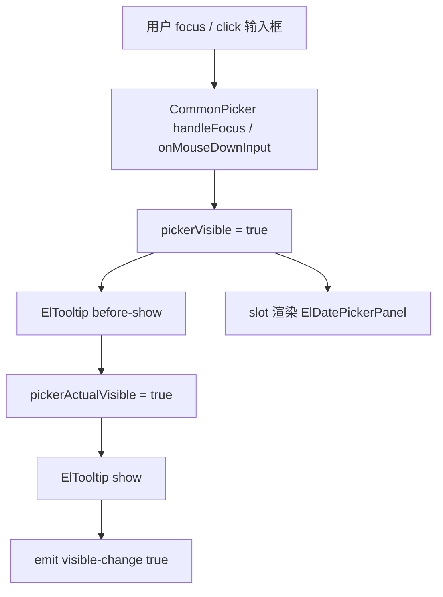

### 6.2 外部值到面板值流程

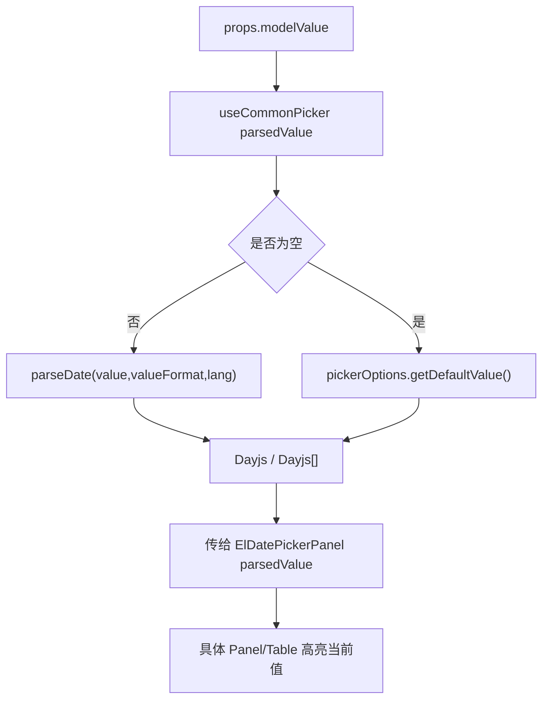

### 6.3 点击日期单元格流程

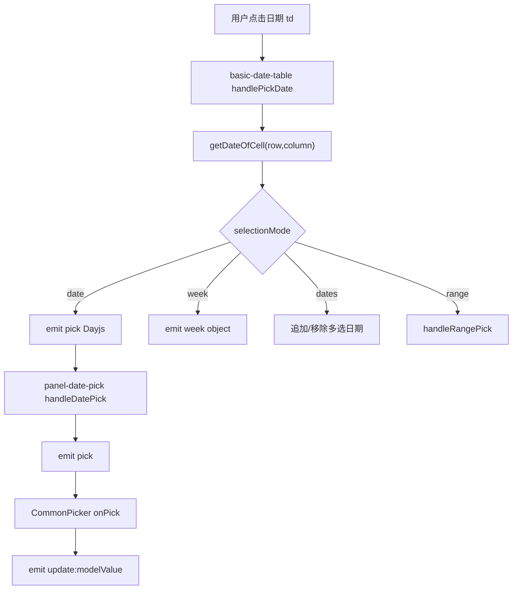

### 6.4 用户输入字符串流程

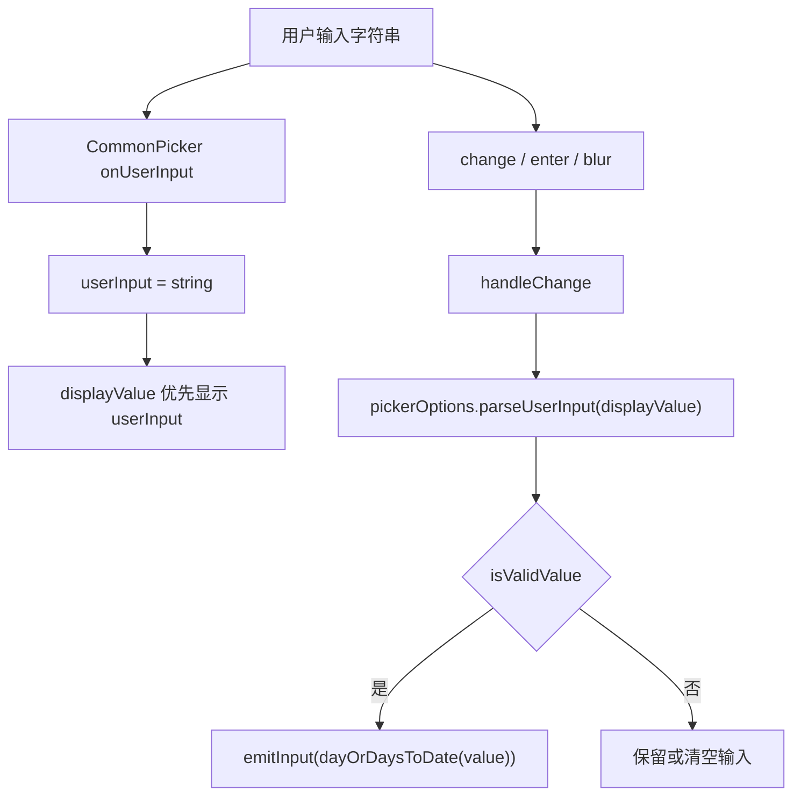

### 6.5 范围选择流程

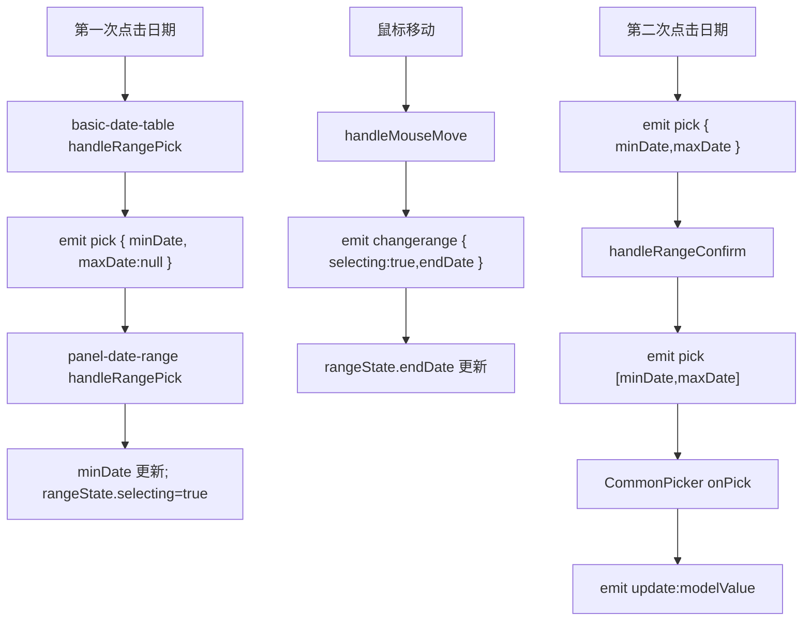

### 6.6 清空流程

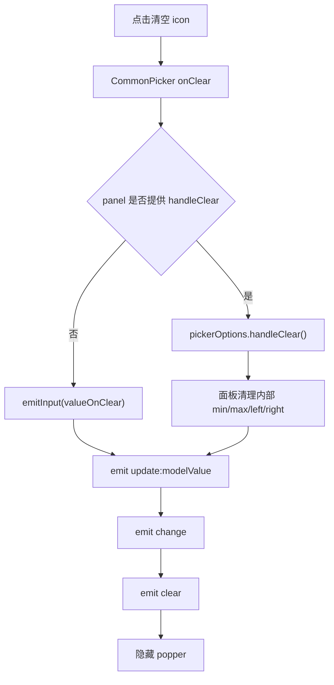

## 7. 关键源码解释

### 7.1 DatePicker 是薄包装层

源码：

```tsx
const format =
  props.format ??
  (DEFAULT_FORMATS_DATEPICKER[props.type] || DEFAULT_FORMATS_DATE)

return (
  <CommonPicker
    {...props}
    format={format}
    type={props.type}
    ref={commonPicker}
    onUpdate:modelValue={onModelValueUpdated}
  >
    {{
      default: (scopedProps) => (
        <ElDatePickerPanel
          disabled={props.disabled}
          editable={props.editable}
          border={false}
          {...scopedProps}
        >
          {slots}
        </ElDatePickerPanel>
      ),
      'range-separator': slots['range-separator'],
    }}
  </CommonPicker>
)
```

逐行解释：

```text
props.format ?? ...
  用户没传 format 时，根据 type 选择默认格式。

<CommonPicker {...props}>
  DatePicker 把大部分输入框、popper、显隐、清空逻辑交给 CommonPicker。

onUpdate:modelValue={onModelValueUpdated}
  CommonPicker 选中值后，DatePicker 继续向外 emit update:modelValue。

default: (scopedProps) => ...
  CommonPicker 把 parsedValue、visible、format、pick 回调等传给面板。

<ElDatePickerPanel {...scopedProps}>
  面板只处理日历 UI 和选择逻辑。

{slots}
  用户自定义单元格、导航图标、sidebar 等 slot 继续传给面板。
```

### 7.2 useCommonPicker 的 emitInput

源码：

```ts
const emitInput = (input) => {
  if (!valueEquals(props.modelValue, input)) {
    let formatted
    if (isArray(input)) {
      formatted = input.map((item) =>
        formatter(item, props.valueFormat, lang.value)
      )
    } else if (input) {
      formatted = formatter(input, props.valueFormat, lang.value)
    }
    const emitVal = input ? formatted : input
    emit(UPDATE_MODEL_EVENT, emitVal, lang.value)
  }
}
```

逐行解释：

```text
valueEquals(props.modelValue, input)
  避免重复 emit 同一个值。

isArray(input)
  range 类型会返回 [Date, Date]，需要逐个格式化。

formatter(item, valueFormat, lang)
  如果用户传 value-format，就输出字符串或时间戳；否则保留 Date。

emitVal = input ? formatted : input
  清空时保留 null / empty value。

emit(update:modelValue)
  真正驱动 v-model 更新。
```

### 7.3 parsedValue 把外部值转成 Dayjs

源码：

```ts
const parsedValue = computed(() => {
  let dayOrDays
  if (valueIsEmpty.value) {
    if (pickerOptions.value.getDefaultValue) {
      dayOrDays = pickerOptions.value.getDefaultValue()
    }
  } else {
    if (isArray(props.modelValue)) {
      dayOrDays = props.modelValue.map((d) =>
        parseDate(d, props.valueFormat, lang.value)
      )
    } else {
      dayOrDays = parseDate(props.modelValue ?? '', props.valueFormat, lang.value)
    }
  }
  return dayOrDays
})
```

逐行解释：

```text
valueIsEmpty
  没有值时不直接返回空，而是允许面板提供默认展示日期。

pickerOptions.getDefaultValue()
  由具体 panel 注册，CommonPicker 不知道默认日历该显示哪天。

props.modelValue 是数组
  range 模式，转成 Dayjs[]。

parseDate(...)
  根据 valueFormat 和 locale 解析外部值。

return dayOrDays
  下游面板统一面对 Dayjs，而不是 string/number/Date 混合类型。
```

### 7.4 DatePickerPanel 是面板分发器

源码：

```tsx
const Component = getPanel(props.type)
return (
  <Component
    {...omit(attrs, 'onPick')}
    {...props}
    parsedValue={parsedValue.value}
    onSet-picker-option={onSetPickerOption}
    onCalendar-change={onCalendarChange}
    onPanel-change={onPanelChange}
    onClear={() => emit('clear')}
    onPick={onPick}
  >
    {slots}
  </Component>
)
```

逐行解释：

```text
getPanel(props.type)
  根据 type 选择具体面板。

parsedValue={parsedValue.value}
  面板接收已经解析好的 Dayjs 值。

onSet-picker-option
  面板把 parseUserInput、isValidValue、handleClear 等能力注册给 CommonPicker。

onPick={onPick}
  面板选中日期后，统一回到 CommonPicker 的 onPick。
```

### 7.5 getPanel 根据 type 选择面板

源码：

```ts
export const getPanel = function (type: DatePickerType) {
  switch (type) {
    case 'daterange':
    case 'datetimerange':
      return DateRangePickPanel
    case 'monthrange':
      return MonthRangePickPanel
    case 'yearrange':
      return YearRangePickPanel
    default:
      return DatePickPanel
  }
}
```

解释：

```text
daterange / datetimerange
  使用双日历范围面板。

monthrange / yearrange
  使用专门的月范围/年范围面板。

default
  date、datetime、week、month、year、dates、months、years 都走单值面板。
```

这是一种非常清晰的策略分发。

### 7.6 日期表格如何生成 6x7 网格

核心在 `use-basic-date-table.ts`：

```ts
const rows = computed(() => {
  buildPickerTable({ row: 6, column: 7 }, rows_, {
    startDate: minDate,
    nextEndDate: rangeState.endDate || maxDate || ...,
    now: dayjs().locale(lang).startOf('day'),
    unit: 'day',
    relativeDateGetter: (idx) => startDate.add(idx - offset, 'day'),
    setCellMetadata,
    setRowMetadata,
  })
  return rows_
})
```

逐行解释：

```text
row: 6, column: 7
  日期面板固定 6 行 7 列。

startDate / nextEndDate
  用于计算 range 高亮。

now
  用于标记 today。

relativeDateGetter
  根据单元格 index 算出对应日期。

setCellMetadata
  给 cell 补 text、type、disabled、current、selected、customClass。

setRowMetadata
  week 模式下整行高亮。
```

### 7.7 点击单元格如何区分模式

源码：

```ts
switch (props.selectionMode) {
  case 'range':
    handleRangePick(newDate)
    break
  case 'date':
    emit('pick', newDate, isKeyboardMovement)
    break
  case 'week':
    handleWeekPick(newDate)
    break
  case 'dates':
    handleDatesPick(newDate, !!cell.selected)
    break
}
```

解释：

```text
range
  第一次点击设置 minDate，第二次点击设置 maxDate。

date
  直接选中单个日期。

week
  生成 week 对象和显示值。

dates
  多选日期，点击已选日期时移除。
```

同一个日期表格组件通过 `selectionMode` 复用多种选择行为。

### 7.8 Range 状态机

`use-range-picker.ts`：

```ts
const minDate = ref<Dayjs>()
const maxDate = ref<Dayjs>()
const rangeState = ref({
  endDate: null,
  selecting: false,
})
```

范围确认：

```ts
const handleRangeConfirm = (visible = false) => {
  if (isValidRange([minDate.value, maxDate.value])) {
    emit('pick', [minDate.value, maxDate.value], visible)
  }
}
```

解释：

```text
minDate
  已选择的起始日期。

maxDate
  已选择的结束日期。

rangeState.selecting
  是否正在选择范围。

rangeState.endDate
  鼠标 hover 到的临时结束日期，用于范围预览。

handleRangeConfirm
  只有合法范围才向外 pick。
```

## 8. 设计思想

### 8.1 薄入口，厚基础设施

`ElDatePicker` 本身很薄，因为它把可复用问题拆出去了：

```text
输入框 / popper / 显隐 / 清空 / v-model
  -> CommonPicker

日期面板分发
  -> DatePickerPanel

日期表格
  -> BasicDateTable

范围状态
  -> useRangePicker
```

这样 DatePicker 和 TimePicker 可以共享很多逻辑。

### 8.2 外部值和内部值分离

外部值可能是：

```text
Date
string
number
[Date, Date]
[string, string]
[number, number]
null
```

内部面板只想处理：

```text
Dayjs
Dayjs[]
```

所以源码设计了清晰转换层：

```text
外部 modelValue
  -> parseDate
  -> parsedValue: Dayjs / Dayjs[]
  -> 面板选择
  -> dayOrDaysToDate
  -> formatter(valueFormat)
  -> update:modelValue
```

### 8.3 面板能力反向注册

CommonPicker 不知道具体面板如何：

- 校验值是否合法
- 解析用户输入
- 获取默认值
- 清空
- 键盘聚焦

所以面板通过：

```ts
emit('set-picker-option', ['isValidValue', isValidValue])
emit('set-picker-option', ['parseUserInput', parseUserInput])
emit('set-picker-option', ['handleClear', handleClear])
```

把能力注册回 CommonPicker。

这是一种“容器和面板解耦”的设计。

### 8.4 用 selectionMode 复用基础表格

`basic-date-table.vue` 可以支持：

```text
date
dates
week
range
```

它不是为每种模式写一套表格，而是在点击时根据 `selectionMode` 分发行为。

### 8.5 范围选择是一个状态机

范围选择不是简单两个日期值，它有过程状态：

```text
未选择
  -> 第一次点击，确定 minDate，selecting=true
  -> hover，更新 endDate 预览范围
  -> 第二次点击，确定 maxDate，selecting=false
  -> confirm，emit [minDate,maxDate]
```

源码用 `rangeState` 显式表达这个过程，所以交互更可控。

## 9. 可借鉴点

业务组件开发可以借鉴：

1. 把输入框和弹层容器抽成通用层。
2. 把复杂面板作为 slot 交给容器渲染。
3. 把外部值和内部运行时值分离。
4. 用 `provide/inject` 连接深层组件，避免层层透传。
5. 用 `set-picker-option` 这种反向注册，让容器调用面板能力。
6. 用状态机表达范围选择、hover 预览、确认提交。
7. 对用户输入字符串使用单独的 `userInput` 状态，不要立即污染正式值。
8. 把 `change` 和 `update:modelValue` 区分开。
9. 让 `DatePickerPanel` 能独立使用，提高复用性。
10. 用 `Dayjs` 作为内部统一日期模型，降低 Date/string/number 混用复杂度。

## 核心调用链图

### 入口到渲染链路

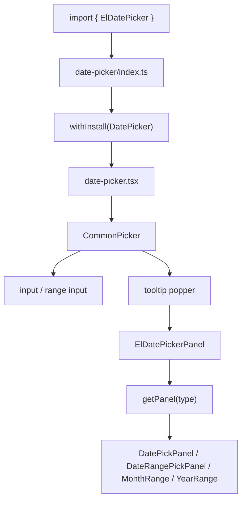

### 值更新链路

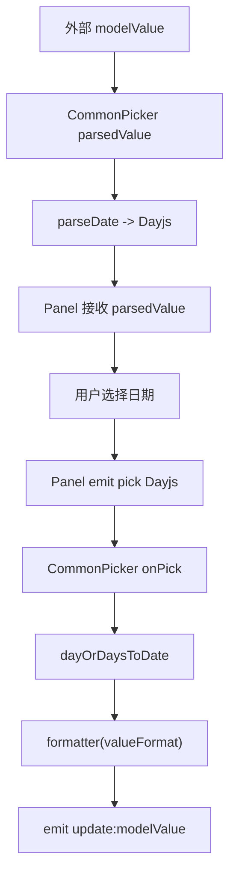

### 输入框交互链路

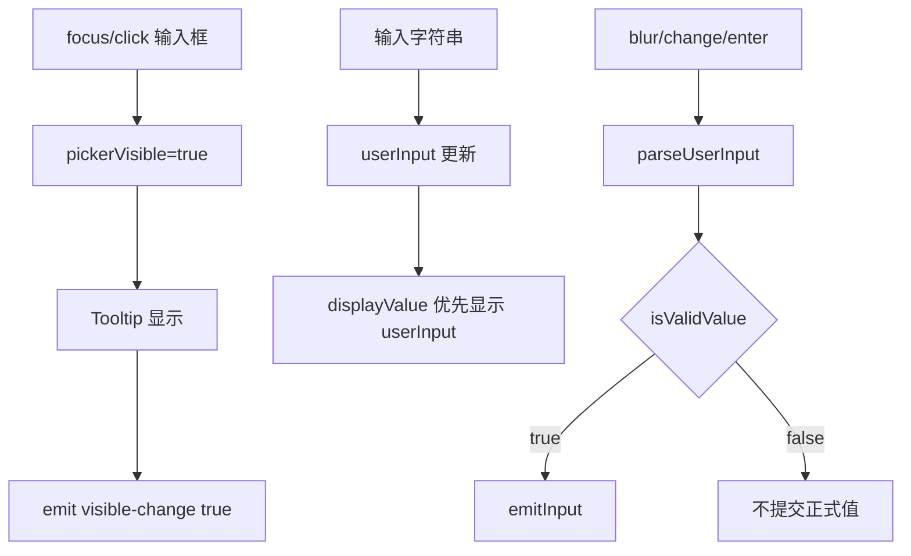

### Range 选择链路

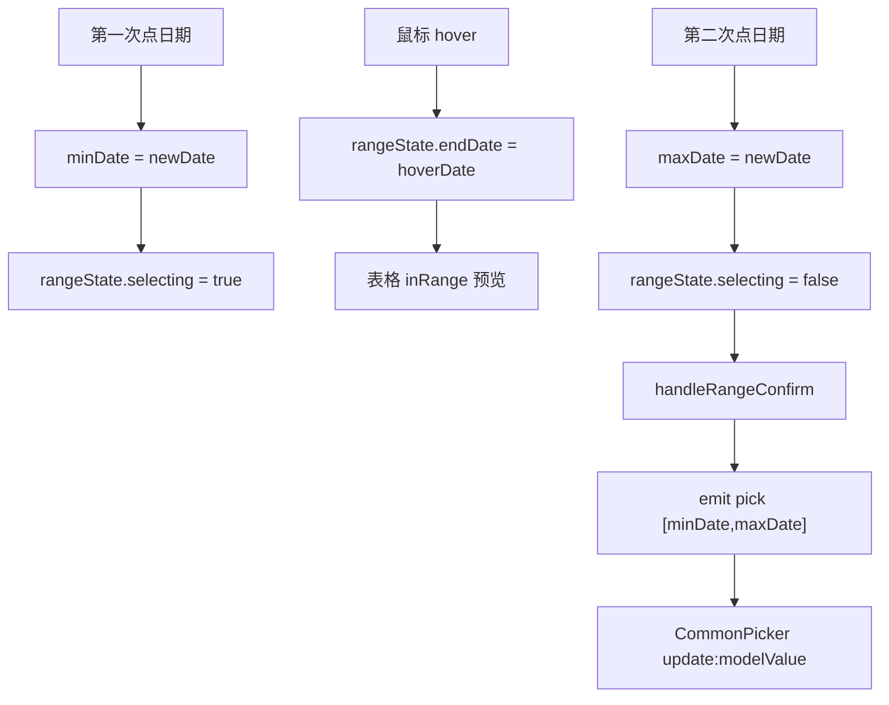

### Panel 能力注册链路

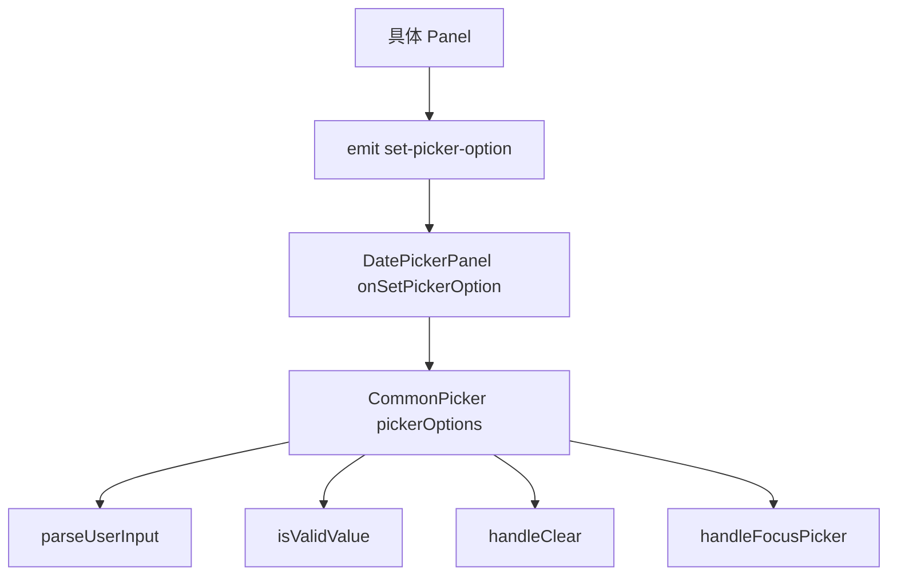

## 简化版 MiniDatePicker 实现

下面实现一个简化版 `MiniDatePicker`，保留核心设计：

- `modelValue` 受控
- 输入框展示格式化日期
- 点击输入框打开面板
- 面板生成 6x7 日期表格
- 点击日期更新 `v-model`
- 支持清空
- 支持外部字符串输入解析

### useMiniDatePicker.ts

```ts
import { computed, ref, watch } from 'vue'

export function useMiniDatePicker(
  props: {
    modelValue?: Date | string | number | null
    format?: string
    clearable?: boolean
  },
  emit: (event: string, ...args: any[]) => void
) {
  const visible = ref(false)
  const userInput = ref<string | null>(null)
  const panelDate = ref(new Date())

  const parsedValue = computed(() => {
    if (!props.modelValue) return null
    const date = new Date(props.modelValue)
    return Number.isNaN(date.getTime()) ? null : date
  })

  watch(
    parsedValue,
    (value) => {
      if (value) panelDate.value = value
    },
    { immediate: true }
  )

  const displayValue = computed(() => {
    if (userInput.value !== null) return userInput.value
    if (!parsedValue.value) return ''
    return formatDate(parsedValue.value)
  })

  const open = () => {
    visible.value = true
  }

  const close = () => {
    visible.value = false
    userInput.value = null
  }

  const pick = (date: Date) => {
    emit('update:modelValue', date)
    emit('change', date)
    close()
  }

  const clear = () => {
    emit('update:modelValue', null)
    emit('change', null)
    emit('clear')
    close()
  }

  const commitInput = () => {
    if (userInput.value === null) return
    if (userInput.value === '') {
      clear()
      return
    }
    const date = new Date(userInput.value)
    if (!Number.isNaN(date.getTime())) {
      pick(date)
    }
    userInput.value = null
  }

  return {
    visible,
    userInput,
    panelDate,
    parsedValue,
    displayValue,
    open,
    close,
    pick,
    clear,
    commitInput,
  }
}

function formatDate(date: Date) {
  const year = date.getFullYear()
  const month = `${date.getMonth() + 1}`.padStart(2, '0')
  const day = `${date.getDate()}`.padStart(2, '0')
  return `${year}-${month}-${day}`
}
```

### MiniDatePanel.vue

```vue
<script setup lang="ts">
import { computed } from 'vue'

const props = defineProps<{
  date: Date
  value?: Date | null
}>()

const emit = defineEmits<{
  pick: [date: Date]
  changePanel: [date: Date]
}>()

const year = computed(() => props.date.getFullYear())
const month = computed(() => props.date.getMonth())

const rows = computed(() => {
  const firstDay = new Date(year.value, month.value, 1)
  const start = new Date(firstDay)
  start.setDate(1 - firstDay.getDay())

  return Array.from({ length: 6 }, (_, row) =>
    Array.from({ length: 7 }, (_, column) => {
      const date = new Date(start)
      date.setDate(start.getDate() + row * 7 + column)
      return {
        date,
        text: date.getDate(),
        currentMonth: date.getMonth() === month.value,
        today: isSameDay(date, new Date()),
        selected: props.value ? isSameDay(date, props.value) : false,
      }
    })
  )
})

const moveMonth = (offset: number) => {
  emit('changePanel', new Date(year.value, month.value + offset, 1))
}

function isSameDay(a: Date, b: Date) {
  return (
    a.getFullYear() === b.getFullYear() &&
    a.getMonth() === b.getMonth() &&
    a.getDate() === b.getDate()
  )
}
</script>

<template>
  <div class="mini-date-panel">
    <header class="mini-date-panel__header">
      <button type="button" @click="moveMonth(-1)">‹</button>
      <span>{{ year }}-{{ month + 1 }}</span>
      <button type="button" @click="moveMonth(1)">›</button>
    </header>

    <table class="mini-date-panel__table">
      <thead>
        <tr>
          <th v-for="week in ['Su', 'Mo', 'Tu', 'We', 'Th', 'Fr', 'Sa']" :key="week">
            {{ week }}
          </th>
        </tr>
      </thead>
      <tbody>
        <tr v-for="(row, rowIndex) in rows" :key="rowIndex">
          <td
            v-for="cell in row"
            :key="cell.date.toISOString()"
            :class="{
              'is-muted': !cell.currentMonth,
              'is-today': cell.today,
              'is-selected': cell.selected,
            }"
            @click="emit('pick', cell.date)"
          >
            {{ cell.text }}
          </td>
        </tr>
      </tbody>
    </table>
  </div>
</template>
```

### MiniDatePicker.vue

```vue
<script setup lang="ts">
import { onBeforeUnmount, ref } from 'vue'
import MiniDatePanel from './MiniDatePanel.vue'
import { useMiniDatePicker } from './useMiniDatePicker'

const props = withDefaults(
  defineProps<{
    modelValue?: Date | string | number | null
    placeholder?: string
    clearable?: boolean
  }>(),
  {
    placeholder: 'Select date',
    clearable: true,
  }
)

const emit = defineEmits<{
  'update:modelValue': [value: Date | null]
  change: [value: Date | null]
  clear: []
  'visible-change': [visible: boolean]
}>()

const rootRef = ref<HTMLElement>()

const picker = useMiniDatePicker(props, (event, ...args) => {
  emit(event as never, ...args)
  if (event === 'update:modelValue') {
    emit('visible-change', picker.visible.value)
  }
})

const onDocumentClick = (event: MouseEvent) => {
  if (!rootRef.value?.contains(event.target as Node)) {
    picker.close()
    emit('visible-change', false)
  }
}

document.addEventListener('mousedown', onDocumentClick)

onBeforeUnmount(() => {
  document.removeEventListener('mousedown', onDocumentClick)
})

const open = () => {
  picker.open()
  emit('visible-change', true)
}

const onInput = (event: Event) => {
  picker.userInput.value = (event.target as HTMLInputElement).value
}

defineExpose({
  focus: () => rootRef.value?.querySelector('input')?.focus(),
  blur: () => rootRef.value?.querySelector('input')?.blur(),
  handleOpen: open,
  handleClose: picker.close,
})
</script>

<template>
  <div ref="rootRef" class="mini-date-picker">
    <div class="mini-date-picker__input">
      <input
        :value="picker.displayValue.value"
        :placeholder="placeholder"
        @focus="open"
        @input="onInput"
        @change="picker.commitInput"
        @keydown.enter.prevent="picker.commitInput"
        @keydown.esc.prevent="picker.close"
      />
      <button
        v-if="clearable && picker.parsedValue.value"
        type="button"
        @click.stop="picker.clear"
      >
        x
      </button>
    </div>

    <div v-if="picker.visible.value" class="mini-date-picker__popper">
      <MiniDatePanel
        :date="picker.panelDate.value"
        :value="picker.parsedValue.value"
        @pick="picker.pick"
        @change-panel="picker.panelDate.value = $event"
      />
    </div>
  </div>
</template>
```

这个简化版和 Element Plus DatePicker 的差距：

- 没有 range/datetime/month/year/week 模式。
- 没有 Dayjs 和 locale。
- 没有 Popper/Tooltip 定位。
- 没有 disabledDate、shortcuts、cell slot。
- 没有 FormItem 校验联动。
- 没有键盘网格导航。
- 没有 `valueFormat`。

但核心思想一致：

```text
外部 modelValue
  -> 内部 parsedValue
  -> 输入框 displayValue
  -> 面板选择
  -> emit update:modelValue
```

## 学习总结

DatePicker 的主线可以记成：

```text
ElDatePicker 是薄入口
CommonPicker 是输入框和弹层容器
useCommonPicker 是值转换中枢
ElDatePickerPanel 是面板分发器
具体 Panel 是选择状态机
BasicDateTable 是日期网格
```

推荐阅读顺序：

1. `packages/components/date-picker/index.ts`
2. `packages/components/date-picker/src/date-picker.tsx`
3. `packages/components/time-picker/src/common/picker.vue`
4. `packages/components/time-picker/src/composables/use-common-picker.ts`
5. `packages/components/date-picker-panel/src/date-picker-panel.tsx`
6. `packages/components/date-picker-panel/src/panel-utils.ts`
7. `packages/components/date-picker-panel/src/date-picker-com/panel-date-pick.vue`
8. `packages/components/date-picker-panel/src/date-picker-com/basic-date-table.vue`
9. `packages/components/date-picker-panel/src/composables/use-basic-date-table.ts`
10. `packages/components/date-picker-panel/src/date-picker-com/panel-date-range.vue`
11. `packages/components/date-picker-panel/src/composables/use-range-picker.ts`
