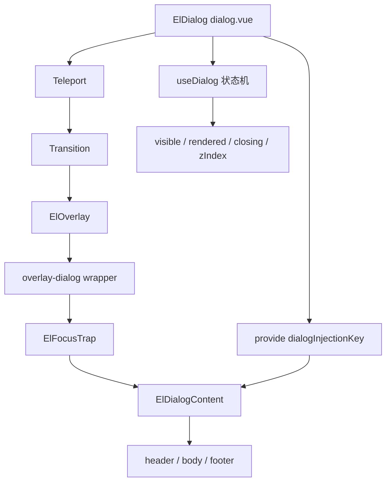
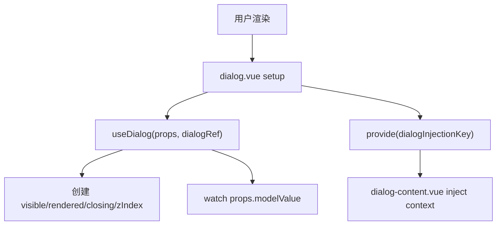
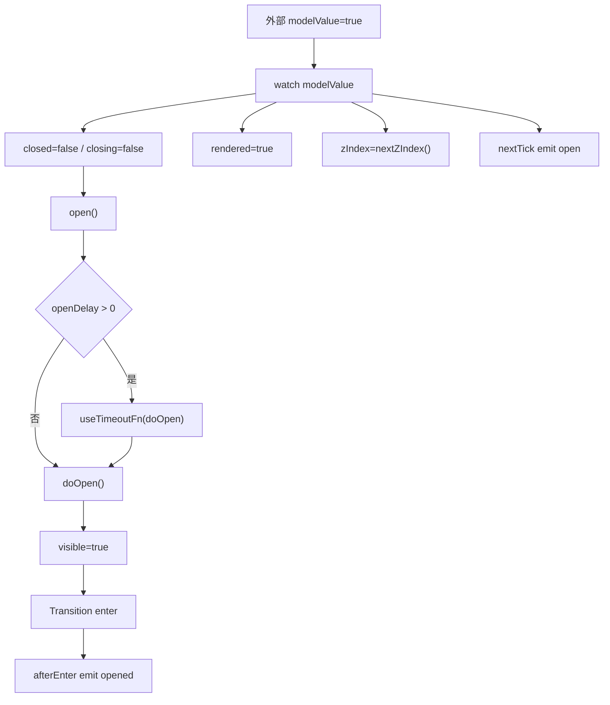
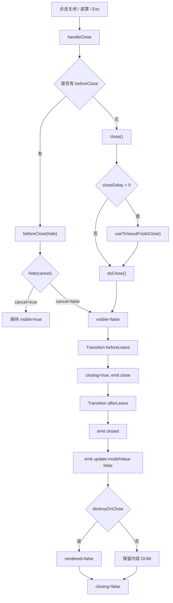
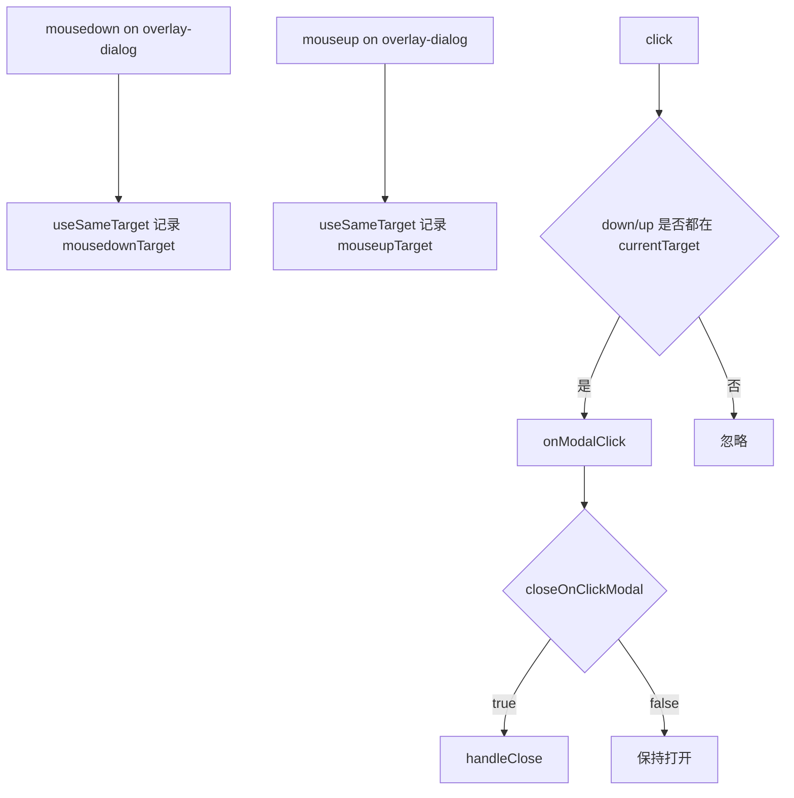
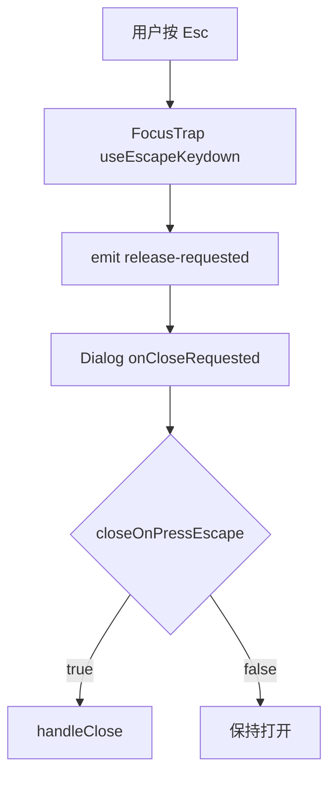
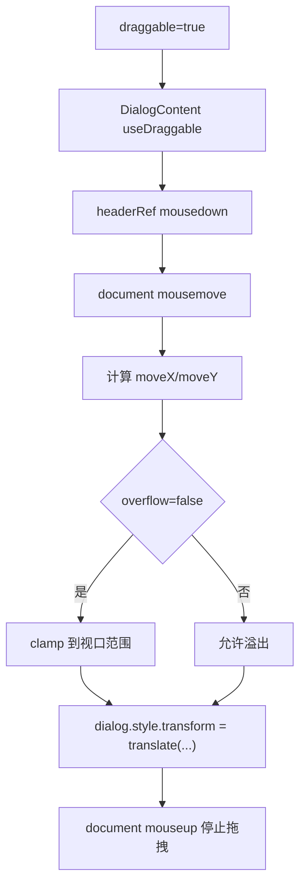

# Element Plus Dialog 组件源码系统分析

本文按五层拆解 Element Plus 的 `Dialog` 组件：

1. 整体架构
2. 数据流
3. 渲染流程
4. 交互逻辑
5. 性能和设计思想

源码入口位于：

```text
element-plus-dev/packages/components/dialog/
```

核心结论：

```text
Dialog 不是单纯的“弹出一个 div”。

它是一个受控弹层组件，核心能力包括：

modelValue 受控状态
Teleport 挂载位置
Overlay 遮罩层
Transition 过渡生命周期
FocusTrap 焦点管理
useLockscreen 锁定页面滚动
useZIndex 管理层级
useDraggable 拖拽
beforeClose 关闭拦截
destroyOnClose 延迟销毁内容
```

## 第一层：整体架构

### 1.1 Dialog 由哪些文件组成

```text
packages/components/dialog/
├── index.ts
├── style/
│   ├── index.ts
│   └── css.ts
├── __tests__/
│   └── dialog.test.tsx
└── src/
    ├── dialog.vue
    ├── dialog.ts
    ├── use-dialog.ts
    ├── dialog-content.vue
    ├── dialog-content.ts
    └── constants.ts
```

文件职责表：

| 文件 | 职责 |
| --- | --- |
| `index.ts` | 组件入口，用 `withInstall(Dialog)` 导出 `ElDialog` |
| `src/dialog.vue` | Dialog 主组件，组合 Teleport、Transition、Overlay、FocusTrap、DialogContent |
| `src/dialog.ts` | Dialog props、emits、默认值、类型定义 |
| `src/use-dialog.ts` | Dialog 状态机，管理打开、关闭、延迟、z-index、生命周期事件、锁滚动 |
| `src/dialog-content.vue` | Dialog 内容结构，渲染 header/body/footer/close，并接入拖拽 |
| `src/dialog-content.ts` | 内容层 props 和 close emit |
| `src/constants.ts` | provide/inject key、默认 transition 名称 |
| `style/index.ts` | Sass 样式入口 |
| `style/css.ts` | 构建后 CSS 样式入口 |
| `__tests__/dialog.test.tsx` | 行为测试，覆盖关闭、遮罩、beforeClose、destroyOnClose、无障碍、transition 等 |

### 1.2 入口文件

入口文件：

```ts
// packages/components/dialog/index.ts
import { withInstall } from '@element-plus/utils'
import Dialog from './src/dialog.vue'

export const ElDialog = withInstall(Dialog)
export default ElDialog

export * from './src/use-dialog'
export * from './src/dialog'
export * from './src/constants'
```

这说明 `ElDialog` 是被 `withInstall` 增强过的 Vue 组件对象，可以：

```ts
import { ElDialog } from 'element-plus'

app.use(ElDialog)
```

也可以按需 import：

```ts
import { ElDialog } from 'element-plus'
```

### 1.3 主组件分层

`dialog.vue` 是外层装配器，它不把所有逻辑塞进模板，而是把职责拆给多个模块：

```text
dialog.vue
  -> useDialog(props, dialogRef)
  -> provide(dialogInjectionKey)
  -> Teleport
  -> Transition
  -> ElOverlay
  -> ElFocusTrap
  -> ElDialogContent
```

结构图：



### 1.4 DialogContent 的定位

`dialog-content.vue` 是内容层，负责真正的 `.el-dialog` DOM：

```text
div.el-dialog
  header.el-dialog__header
    title slot / title prop
    close button
  div.el-dialog__body
    default slot
  footer.el-dialog__footer
    footer slot
```

它还接入：

- `useDraggable`
- `FOCUS_TRAP_INJECTION_KEY`
- `dialogInjectionKey`

也就是说，DialogContent 不关心 `modelValue` 如何打开关闭，它只关心“内容如何显示、关闭按钮如何发出 close、拖拽如何绑定”。

## 第二层：数据流

### 2.1 props 如何进入 Dialog

`dialog.ts` 定义了两类 props：

1. Dialog 外层行为 props
2. DialogContent 内容 props

`DialogProps` 继承了 `DialogContentProps`：

```ts
export interface DialogProps extends DialogContentProps {
  appendToBody?: boolean
  appendTo?: string | HTMLElement
  beforeClose?: DialogBeforeCloseFn
  destroyOnClose?: boolean
  closeOnClickModal?: boolean
  closeOnPressEscape?: boolean
  lockScroll?: boolean
  modal?: boolean
  modalPenetrable?: boolean
  openDelay?: number
  closeDelay?: number
  top?: string
  modelValue?: boolean
  modalClass?: string
  width?: string | number
  zIndex?: number
  trapFocus?: boolean
  headerAriaLevel?: string
  transition?: DialogTransition
}
```

内容层 props 在 `dialog-content.ts`：

```ts
export interface DialogContentProps {
  center?: boolean
  alignCenter?: boolean
  closeIcon?: IconPropType
  draggable?: boolean
  overflow?: boolean
  fullscreen?: boolean
  headerClass?: string
  bodyClass?: string
  footerClass?: string
  showClose?: boolean
  title?: string
  ariaLevel?: string
}
```

### 2.2 modelValue 到 visible 的流转

`modelValue` 是用户侧的受控状态，内部用 `visible` 控制实际显示：

```ts
const visible = ref(false)
const rendered = ref(false)
const closing = ref(false)
```

`use-dialog.ts` 监听 `props.modelValue`：

```text
modelValue = true
  -> closed = false
  -> closing = false
  -> open()
  -> rendered = true
  -> zIndex = props.zIndex ?? nextZIndex()
  -> nextTick emit('open')

modelValue = false
  -> 如果当前 visible 为 true
  -> close()
```

`open()` 和 `close()` 会处理延迟：

```text
open()
  -> 清理 closeTimer/openTimer
  -> 如果 openDelay > 0，延迟 doOpen()
  -> 否则 doOpen()

close()
  -> 清理 openTimer/closeTimer
  -> 如果 closeDelay > 0，延迟 doClose()
  -> 否则 doClose()
```

真正改变 DOM 显示的是：

```ts
function doOpen() {
  visible.value = true
}

function doClose() {
  visible.value = false
}
```

### 2.3 rendered 的作用

`visible` 控制 Overlay 显示：

```vue
<el-overlay v-show="visible">
```

`rendered` 控制 DialogContent 是否创建：

```vue
<el-dialog-content v-if="rendered">
```

它们不是同一个概念：

| 状态 | 作用 |
| --- | --- |
| `visible` | 控制弹层是否显示 |
| `rendered` | 控制内容 DOM 是否存在 |

打开时：

```text
modelValue = true
  -> rendered = true
  -> visible = true
```

关闭动画结束后：

```text
afterLeave()
  -> emit('closed')
  -> emit('update:modelValue', false)
  -> 如果 destroyOnClose，rendered = false
  -> closing = false
```

这就是 `destroyOnClose` 的实现关键：不是一关闭就销毁，而是等离场动画结束后销毁。

### 2.4 zIndex 的数据流

Dialog 使用 `useZIndex()`：

```ts
const { nextZIndex } = useZIndex()
const zIndex = ref(props.zIndex ?? nextZIndex())
```

打开时会重新计算：

```ts
zIndex.value = props.zIndex ?? nextZIndex()
```

如果用户传了 `zIndex`，它受 props 控制；如果没传，就由全局递增 z-index 管理。

`modalPenetrable` 场景下，点击 Dialog 会调用 `bringToFront()`：

```ts
function bringToFront() {
  if (!visible.value || !penetrable.value || props.zIndex !== undefined) return
  zIndex.value = nextZIndex()
}
```

这让多个可穿透 Dialog 被点击时可以浮到最上层。

### 2.5 computed 派生状态

`useDialog` 里有几个重要 computed：

```ts
style
_draggable
_alignCenter
_overflow
penetrable
overlayDialogStyle
transitionConfig
```

`style` 负责把 `top` 和 `width` 转成 CSS 变量：

```text
top -> --el-dialog-margin-top
width -> --el-dialog-width
```

`_draggable/_alignCenter/_overflow` 会合并组件 props 和全局配置：

```text
props.draggable ?? globalConfig.dialog.draggable ?? false
```

`penetrable` 的条件：

```text
modalPenetrable && !modal && !fullscreen
```

也就是只有“没有遮罩、不是全屏”的 Dialog 才能真正穿透点击。

## 第三层：渲染流程

### 3.1 外层渲染结构

`dialog.vue` 的模板结构：

```vue
<teleport :to="appendTo" :disabled="...">
  <transition v-bind="transitionConfig">
    <el-overlay v-show="visible" :mask="modal" :z-index="zIndex">
      <div role="dialog" class="el-overlay-dialog">
        <el-focus-trap :trapped="visible">
          <el-dialog-content v-if="rendered">
            ...
          </el-dialog-content>
        </el-focus-trap>
      </div>
    </el-overlay>
  </transition>
</teleport>
```

渲染层级：

```text
Teleport
  Transition
    ElOverlay
      div[role=dialog].el-overlay-dialog
        ElFocusTrap
          ElDialogContent
            .el-dialog
```

### 3.2 Teleport 如何工作

Teleport 的目标由 `appendTo` 决定，默认是 `body`：

```ts
appendTo: 'body'
```

模板中：

```vue
<teleport
  :to="appendTo"
  :disabled="appendTo !== 'body' ? false : !appendToBody"
>
```

含义：

```text
appendTo 不是 body
  -> 一定启用 teleport 到指定容器

appendTo 是 body
  -> 只有 appendToBody 为 true 才 teleport 到 body
```

这兼容了历史 API：`append-to-body` 默认不是总开启，但用户传 `append-to` 时应该生效。

### 3.3 Overlay 如何渲染

Dialog 使用 `ElOverlay`：

```vue
<el-overlay
  v-show="visible"
  custom-mask-event
  :mask="modal"
  :overlay-class="[modalClass, 'el-modal-dialog', ns.is('penetrable', penetrable)]"
  :z-index="zIndex"
>
```

关键点：

- `v-show="visible"`：保留 overlay DOM，用显示隐藏配合 transition。
- `mask="modal"`：`modal=false` 时没有遮罩样式，但仍有 fixed 外层。
- `custom-mask-event`：Dialog 自己处理遮罩点击，而不是让 Overlay emit click。
- `z-index`：由 `useZIndex` 或 props 控制。

`Overlay` 的 `mask=false` 分支会渲染一个 fixed 容器，但没有 `el-overlay` class。

### 3.4 FocusTrap 如何渲染

Dialog 用 `ElFocusTrap` 包住内容：

```vue
<el-focus-trap
  loop
  :trapped="visible"
  focus-start-el="container"
  @focus-after-trapped="onOpenAutoFocus"
  @focus-after-released="onCloseAutoFocus"
  @focusout-prevented="onFocusoutPrevented"
  @release-requested="onCloseRequested"
>
```

它的作用：

1. 打开时把焦点限制在 Dialog 内。
2. `Tab` 到边界时循环。
3. 关闭时释放焦点。
4. 按 `Esc` 时发出 `release-requested`，Dialog 再决定是否关闭。

### 3.5 DialogContent 如何渲染

`dialog-content.vue` 模板：

```vue
<div :ref="composedDialogRef" :class="dialogKls" :style="style" tabindex="-1">
  <header ref="headerRef" class="el-dialog__header">
    <slot name="header">
      <span role="heading">{{ title }}</span>
    </slot>
    <button v-if="showClose" @click="$emit('close')">
      <el-icon><component :is="closeIcon || Close" /></el-icon>
    </button>
  </header>

  <div :id="bodyId" class="el-dialog__body">
    <slot />
  </div>

  <footer v-if="$slots.footer" class="el-dialog__footer">
    <slot name="footer" />
  </footer>
</div>
```

class 生成：

```ts
const dialogKls = computed(() => [
  ns.b(),
  ns.is('fullscreen', props.fullscreen),
  ns.is('draggable', draggable.value),
  ns.is('dragging', isDragging.value),
  ns.is('align-center', !!props.alignCenter),
  { [ns.m('center')]: props.center },
])
```

对应 class：

```text
el-dialog
is-fullscreen
is-draggable
is-dragging
is-align-center
el-dialog--center
```

### 3.6 slot 渲染

Dialog 支持：

- 默认 slot：body 内容
- `header` slot：新推荐的头部 slot
- `title` slot：旧 API，源码里用 `useDeprecated` 提示将来移除
- `footer` slot：底部内容

`header` slot 还能拿到：

```text
close
titleId
titleClass
```

这让用户可以自定义 header，同时保留关闭能力和 aria id。

## 第四层：交互逻辑

### 4.1 打开流程

打开由 `modelValue` 驱动：

```text
用户设置 v-model = true
  -> props.modelValue 变化
  -> watch(modelValue)
  -> closed = false
  -> closing = false
  -> open()
  -> rendered = true
  -> zIndex = props.zIndex ?? nextZIndex()
  -> nextTick emit('open')
  -> transition after-enter
  -> emit('opened')
```

如果配置了 `openDelay`：

```text
open()
  -> useTimeoutFn(doOpen, openDelay)
```

### 4.2 关闭流程

关闭入口有多个：

- 点击右上角关闭按钮
- 点击遮罩
- 按 Esc
- 调用暴露出来的 `handleClose`
- 外部把 `modelValue` 设为 false

关闭按钮路径：

```text
点击 close button
  -> DialogContent emit('close')
  -> dialog.vue handleClose()
  -> beforeClose ? beforeClose(hide) : close()
  -> visible = false
  -> transition before-leave
  -> closing = true
  -> emit('close')
  -> transition after-leave
  -> emit('closed')
  -> emit('update:modelValue', false)
  -> destroyOnClose ? rendered = false
  -> closing = false
```

注意 `close` 事件不是在点击按钮时立即 emit，而是在 transition 的 `beforeLeave` 钩子里 emit。

### 4.3 beforeClose 如何拦截关闭

`handleClose()` 中：

```ts
function handleClose() {
  function hide(shouldCancel?: boolean) {
    if (shouldCancel) return
    closed.value = true
    visible.value = false
  }

  if (props.beforeClose) {
    props.beforeClose(hide)
  } else {
    close()
  }
}
```

使用方式：

```ts
beforeClose(done) {
  done()
}
```

如果用户取消：

```ts
beforeClose(done) {
  done(true)
}
```

那么 `visible` 不会被设为 false。

### 4.4 遮罩点击如何关闭

Dialog 不直接使用 Overlay 的 click emit，而是自己给 `.el-overlay-dialog` 绑定：

```vue
@click="overlayEvent.onClick"
@mousedown="overlayEvent.onMousedown"
@mouseup="overlayEvent.onMouseup"
```

`overlayEvent` 来自：

```ts
const overlayEvent = useSameTarget(onModalClick)
```

`useSameTarget` 的关键判断：

```text
mousedown.target === currentTarget
mouseup.target === currentTarget
click 时两者都成立
  -> 才认为是点击遮罩
```

这样可以避免一种常见误关：

```text
用户在 Dialog 内容中按下鼠标
拖到遮罩上松开
触发 click
```

这种情况下不会关闭。

最终：

```ts
function onModalClick() {
  if (props.closeOnClickModal) {
    handleClose()
  }
}
```

### 4.5 Esc 如何关闭

Esc 由 `FocusTrap` 监听。

`focus-trap.vue` 内部使用 `useEscapeKeydown`，当 trapped 且没有 pause 时：

```text
Esc
  -> emit('release-requested')
```

Dialog 接收：

```vue
@release-requested="onCloseRequested"
```

`onCloseRequested`：

```ts
function onCloseRequested() {
  if (props.closeOnPressEscape) {
    handleClose()
  }
}
```

所以 `closeOnPressEscape=false` 时，FocusTrap 仍然感知 Esc，但 Dialog 不关闭。

### 4.6 拖拽如何实现

`DialogContent` 中：

```ts
const draggable = computed(() => !!props.draggable)
const overflow = computed(() => !!props.overflow)

const { resetPosition, updatePosition, isDragging } = useDraggable(
  dialogRef,
  headerRef,
  draggable,
  overflow
)
```

`useDraggable` 的核心：

```text
headerRef mousedown
  -> document mousemove
  -> 计算 moveX / moveY
  -> targetRef.style.transform = translate(x, y)
  -> document mouseup
  -> 停止拖拽
```

如果 `overflow=false`，移动范围会被限制在视口内。

`fullscreen` 时 `_draggable` 会变成 false：

```ts
const _draggable = computed(
  () => (props.draggable ?? globalConfig.value?.draggable ?? false) && !props.fullscreen
)
```

### 4.7 锁滚动如何实现

`useDialog` 中：

```ts
if (props.lockScroll) {
  useLockscreen(visible)
}
```

`useLockscreen` 监听 `visible`：

```text
visible = true
  -> body 添加 el-popup-parent--hidden
  -> 根据滚动条宽度调整 body width

visible = false
  -> 延迟清理 body class 和 width
```

这避免 Dialog 打开时页面背景滚动，也避免滚动条消失导致页面横向跳动。

### 4.8 可访问性如何处理

外层 wrapper：

```vue
<div
  role="dialog"
  aria-modal="true"
  :aria-label="title || undefined"
  :aria-labelledby="!title ? titleId : undefined"
  :aria-describedby="bodyId"
>
```

规则：

- 如果有 `title` prop，则用 `aria-label`。
- 如果没有 `title`，则用 `aria-labelledby` 指向 header slot 的标题 id。
- `aria-describedby` 指向 body id。
- `FocusTrap` 负责打开后的焦点进入和关闭后的焦点释放。

### 4.9 transition 如何接入生命周期

`transitionConfig` 可以是字符串，也可以是对象。

默认：

```ts
DEFAULT_DIALOG_TRANSITION = 'dialog-fade'
```

基础钩子：

```text
onAfterEnter -> emit('opened')
onBeforeLeave -> closing = true; emit('close')
onAfterLeave -> emit('closed'); emit('update:modelValue', false); cleanup
```

如果用户传对象形式 transition，源码会合并用户钩子和内部钩子，确保用户动画配置不会丢掉 Dialog 自己的生命周期逻辑。

## 第五层：性能和设计思想

### 5.1 为什么 Dialog 要拆 useDialog

Dialog 的状态不是一个简单 `visible = modelValue`。

它还要同时处理：

- 延迟打开
- 延迟关闭
- 过渡钩子
- `close` / `closed` / `opened` 事件时机
- `update:modelValue`
- `destroyOnClose`
- `zIndex`
- `lockScroll`
- `beforeClose`
- `fullscreen` 对拖拽 transform 的影响

这些都放进模板会很难读。`useDialog` 把 Dialog 变成了一个清晰的状态机。

### 5.2 为什么 DialogContent 要单独拆出来

`dialog.vue` 关注弹层行为，`dialog-content.vue` 关注内容结构。

拆分后的好处：

1. 外层可以专心处理 Teleport/Overlay/FocusTrap。
2. 内容层可以专心处理 header/body/footer/close。
3. 拖拽只需要绑定 content 的 `dialogRef` 和 `headerRef`。
4. provide/inject 让内容层不用接收一大串内部 ref。

### 5.3 为什么要用 rendered + visible 两个状态

如果只用 `visible`：

- 关闭时内容会立刻消失，过渡动画无法完整播放。
- `destroyOnClose` 很难在动画结束后再销毁。

所以 Element Plus 拆成：

```text
rendered
  控制是否存在 DOM

visible
  控制是否显示
```

这是一种很常见的弹层组件设计。

### 5.4 为什么遮罩点击要用 useSameTarget

弹层组件里，“点击遮罩关闭”很容易误判。

Element Plus 的做法是：只有 mousedown、mouseup、click 都发生在同一个遮罩容器上，才触发关闭。

这比单纯监听 `click.self` 更稳，因为它覆盖了拖拽、选中文本、按下后移出等边界场景。

### 5.5 可以借鉴到业务组件库的设计

可以直接借鉴：

1. 用 `modelValue` 作为外部受控状态，用内部 `visible` 管动画状态。
2. 用 `rendered` 支持懒渲染和关闭后销毁。
3. 关闭流程统一走 `handleClose`，让按钮、遮罩、Esc 共享同一套 `beforeClose` 逻辑。
4. 把 `close` 和 `closed` 区分开：前者表示开始关闭，后者表示关闭动画结束。
5. 用 `Teleport` 解决弹层被父容器裁剪的问题。
6. 用 `FocusTrap` 保证键盘用户不会迷失焦点。
7. 用 `z-index` 管理多弹层层级。
8. 用 CSS 变量控制宽度和 top，而不是频繁拼内联样式。
9. 把内容结构和弹层行为拆开，降低组件复杂度。

## 核心调用链图

### 初始化链路



### 打开链路



### 关闭链路



### 遮罩点击链路



### Esc 链路



### 拖拽链路



## 简化版 MiniDialog 实现

下面实现一个简化版，只保留 Element Plus Dialog 的核心设计：

- `modelValue` 受控
- `visible/rendered/closing`
- `beforeClose`
- `closeOnClickModal`
- `closeOnPressEscape`
- `destroyOnClose`
- `Teleport`
- `Transition`
- 简单锁滚动

### useMiniDialog.ts

```ts
import { computed, nextTick, onBeforeUnmount, watch, ref } from 'vue'

type Done = (cancel?: boolean) => void

export interface MiniDialogProps {
  modelValue: boolean
  beforeClose?: (done: Done) => void
  destroyOnClose?: boolean
  closeOnClickModal?: boolean
  closeOnPressEscape?: boolean
  lockScroll?: boolean
  width?: string | number
  top?: string
}

export function useMiniDialog(
  props: MiniDialogProps,
  emit: (event: string, ...args: any[]) => void
) {
  const visible = ref(false)
  const rendered = ref(false)
  const closing = ref(false)

  const style = computed(() => ({
    width: typeof props.width === 'number' ? `${props.width}px` : props.width,
    marginTop: props.top,
  }))

  const lockBody = () => {
    if (!props.lockScroll) return
    document.body.style.overflow = 'hidden'
  }

  const unlockBody = () => {
    if (!props.lockScroll) return
    document.body.style.overflow = ''
  }

  const open = async () => {
    rendered.value = true
    visible.value = true
    lockBody()
    await nextTick()
    emit('open')
  }

  const close = () => {
    visible.value = false
  }

  const handleClose = () => {
    const done: Done = (cancel) => {
      if (cancel) return
      close()
    }

    if (props.beforeClose) {
      props.beforeClose(done)
    } else {
      done()
    }
  }

  const onAfterEnter = () => {
    emit('opened')
  }

  const onBeforeLeave = () => {
    closing.value = true
    emit('close')
  }

  const onAfterLeave = () => {
    closing.value = false
    unlockBody()
    emit('closed')
    emit('update:modelValue', false)
    if (props.destroyOnClose) {
      rendered.value = false
    }
  }

  const onModalClick = () => {
    if (props.closeOnClickModal) {
      handleClose()
    }
  }

  const onKeydown = (event: KeyboardEvent) => {
    if (event.key === 'Escape' && props.closeOnPressEscape && visible.value) {
      handleClose()
    }
  }

  watch(
    () => props.modelValue,
    (value) => {
      if (value) {
        open()
      } else if (visible.value) {
        close()
      }
    },
    { immediate: true }
  )

  watch(visible, (value) => {
    if (value) {
      document.addEventListener('keydown', onKeydown)
    } else {
      document.removeEventListener('keydown', onKeydown)
    }
  })

  onBeforeUnmount(() => {
    document.removeEventListener('keydown', onKeydown)
    unlockBody()
  })

  return {
    visible,
    rendered,
    closing,
    style,
    handleClose,
    onModalClick,
    onAfterEnter,
    onBeforeLeave,
    onAfterLeave,
  }
}
```

### MiniDialog.vue

```vue
<script setup lang="ts">
import { useMiniDialog } from './useMiniDialog'

const props = withDefaults(
  defineProps<{
    modelValue: boolean
    title?: string
    beforeClose?: (done: (cancel?: boolean) => void) => void
    destroyOnClose?: boolean
    closeOnClickModal?: boolean
    closeOnPressEscape?: boolean
    lockScroll?: boolean
    width?: string | number
    top?: string
    appendTo?: string
    showClose?: boolean
  }>(),
  {
    appendTo: 'body',
    showClose: true,
    closeOnClickModal: true,
    closeOnPressEscape: true,
    lockScroll: true,
    width: '50%',
    top: '15vh',
  }
)

const emit = defineEmits<{
  'update:modelValue': [value: boolean]
  open: []
  opened: []
  close: []
  closed: []
}>()

const {
  visible,
  rendered,
  closing,
  style,
  handleClose,
  onModalClick,
  onAfterEnter,
  onBeforeLeave,
  onAfterLeave,
} = useMiniDialog(props, emit)

const onWrapperClick = (event: MouseEvent) => {
  if (event.target === event.currentTarget) {
    onModalClick()
  }
}

defineExpose({
  visible,
  handleClose,
})
</script>

<template>
  <Teleport :to="appendTo">
    <Transition
      name="mini-dialog-fade"
      @after-enter="onAfterEnter"
      @before-leave="onBeforeLeave"
      @after-leave="onAfterLeave"
    >
      <div
        v-show="visible"
        class="mini-dialog-overlay"
        :class="{ 'is-closing': closing }"
        @click="onWrapperClick"
      >
        <section
          v-if="rendered"
          class="mini-dialog"
          :style="style"
          role="dialog"
          aria-modal="true"
        >
          <header class="mini-dialog__header">
            <slot name="header">
              <h2 class="mini-dialog__title">{{ title }}</h2>
            </slot>
            <button
              v-if="showClose"
              type="button"
              class="mini-dialog__close"
              aria-label="Close"
              @click="handleClose"
            >
              x
            </button>
          </header>

          <div class="mini-dialog__body">
            <slot />
          </div>

          <footer v-if="$slots.footer" class="mini-dialog__footer">
            <slot name="footer" />
          </footer>
        </section>
      </div>
    </Transition>
  </Teleport>
</template>

<style scoped>
.mini-dialog-overlay {
  position: fixed;
  inset: 0;
  z-index: 2000;
  overflow: auto;
  background: rgb(0 0 0 / 45%);
}

.mini-dialog-overlay.is-closing .mini-dialog {
  pointer-events: none;
}

.mini-dialog {
  position: relative;
  box-sizing: border-box;
  margin: 15vh auto 50px;
  padding: 20px;
  width: 50%;
  background: #fff;
  border-radius: 4px;
  box-shadow: 0 12px 32px rgb(0 0 0 / 18%);
}

.mini-dialog__header {
  display: flex;
  align-items: center;
  justify-content: space-between;
  padding-bottom: 16px;
}

.mini-dialog__title {
  margin: 0;
  font-size: 18px;
}

.mini-dialog__close {
  border: 0;
  background: transparent;
  cursor: pointer;
  font-size: 18px;
}

.mini-dialog__footer {
  padding-top: 16px;
  text-align: right;
}

.mini-dialog-fade-enter-active,
.mini-dialog-fade-leave-active {
  transition: opacity 0.2s ease;
}

.mini-dialog-fade-enter-from,
.mini-dialog-fade-leave-to {
  opacity: 0;
}
</style>
```

### MiniDialog 使用示例

```vue
<script setup lang="ts">
import { ref } from 'vue'
import MiniDialog from './MiniDialog.vue'

const visible = ref(false)
</script>

<template>
  <button @click="visible = true">Open</button>

  <MiniDialog v-model="visible" title="Mini Dialog" destroy-on-close>
    <p>Hello MiniDialog</p>

    <template #footer>
      <button @click="visible = false">Cancel</button>
      <button @click="visible = false">Confirm</button>
    </template>
  </MiniDialog>
</template>
```

这个 MiniDialog 和 Element Plus Dialog 的差距：

- 没有 FocusTrap
- 没有 `useZIndex`
- 没有 `useSameTarget` 的严谨遮罩点击判断
- 没有拖拽
- 没有全局 config 合并
- 没有 `modalPenetrable`
- 没有 aria id 自动生成

但核心设计一致：

```text
modelValue 控制入口
visible 控制显示
rendered 控制 DOM 存在
handleClose 统一关闭协议
Transition 生命周期派发 close/closed
destroyOnClose 在 afterLeave 后销毁内容
```

## 学习总结

Dialog 最值得抓住的主线是：

1. `dialog.vue` 负责装配弹层结构。
2. `useDialog` 负责状态机和生命周期。
3. `dialog-content.vue` 负责内容 DOM、关闭按钮、拖拽。
4. `modelValue` 是外部受控状态，`visible/rendered/closing` 是内部运行状态。
5. 所有关闭入口最终都收敛到 `handleClose`。
6. `beforeClose` 是关闭协议的拦截点。
7. `Transition` 决定 `open/opened/close/closed/update:modelValue` 的事件时机。
8. `FocusTrap` 和 aria 属性让 Dialog 具备基础可访问性。

推荐阅读顺序：

1. `index.ts`
2. `dialog.ts`
3. `dialog.vue`
4. `use-dialog.ts`
5. `dialog-content.vue`
6. `dialog-content.ts`
7. `constants.ts`
8. `theme-chalk/src/dialog.scss`
9. `__tests__/dialog.test.tsx`

