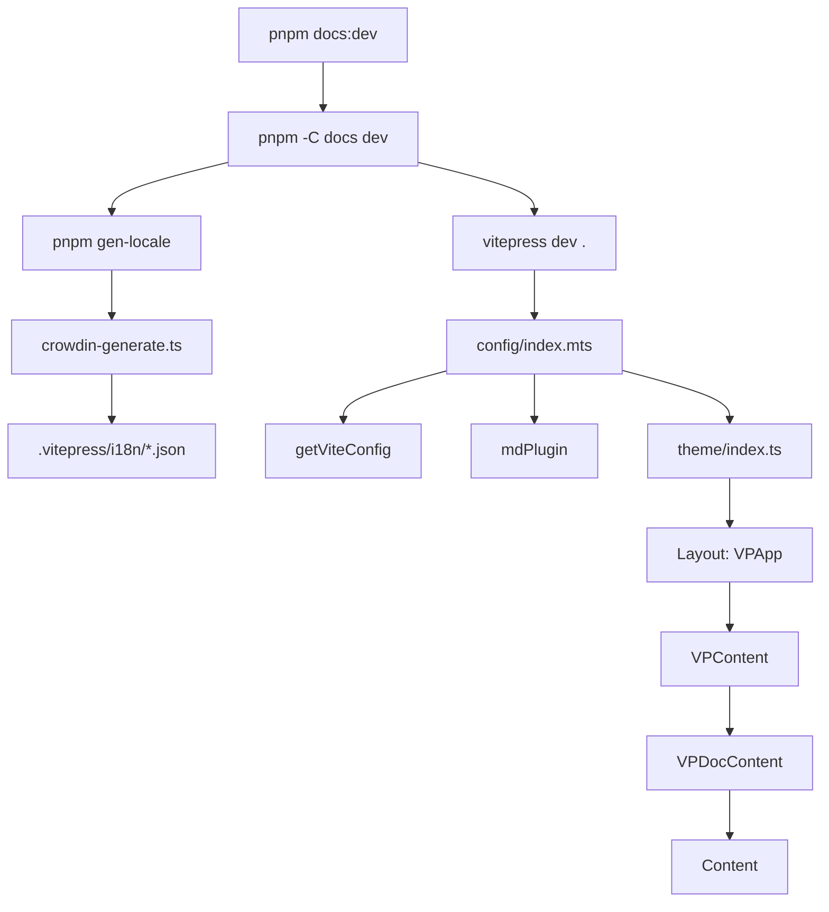
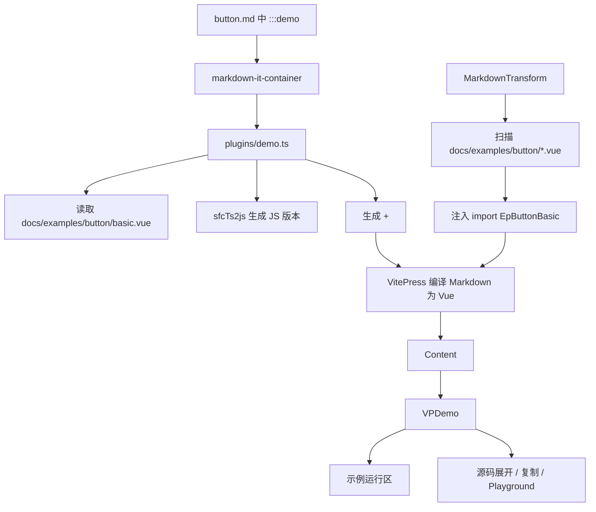
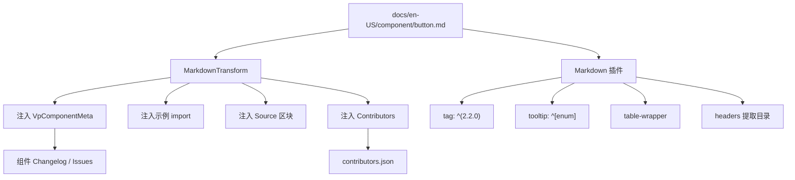

# Element Plus 文档站点源码分析

> 源码位置：`element-plus-dev/docs`
>
> VitePress 配置入口：`docs/.vitepress/config/index.mts`
>
> 自定义主题入口：`docs/.vitepress/theme/index.ts`
>
> 自定义站点组件：`docs/.vitepress/vitepress`
>
> 核心关键词：VitePress、自定义主题、Markdown 插件、Demo 容器、组件示例、国际化、DocSearch、Changelog、Contributors、LLM 文档生成。

Element Plus 的文档站不是普通的 Markdown 静态站，而是基于 VitePress 深度定制出来的组件库文档系统。它负责把 Markdown 文档、Vue 示例、API 表格、源码链接、贡献者、组件变更记录、国际化文案、搜索和主题样式组合成一个完整站点。

一句话概括：

```text
Element Plus 文档站以 VitePress 为底座，用自定义 theme 接管页面骨架，用 Markdown 插件把组件文档增强成可交互 Demo 和 API 页面。
```

## 1. 学习目标

这部分源码适合学习这些设计思想：

| 学习点 | 说明 |
| --- | --- |
| 文档站工程化 | 如何把 Markdown、Vue 示例、主题组件、构建脚本组织成站点 |
| VitePress 深度定制 | 如何覆盖默认 Layout、NotFound、导航、侧边栏、内容区 |
| Markdown 编译增强 | 如何在 Markdown 编译阶段注入脚本、Demo、源码链接、贡献者 |
| 组件示例系统 | `:::demo` 如何变成可运行 Demo、源码预览、复制、Playground 链接 |
| 国际化 | Crowdin JSON 如何生成运行时 i18n 数据 |
| 组件库文档体验 | API 表格、类型 tooltip、版本 tag、组件 changelog、贡献者如何组合 |
| 开发/生产差异 | 开发时 alias 到源码，生产时使用发布包 |
| 搜索系统 | DocSearch 如何按语言过滤和接管路由跳转 |
| 构建辅助产物 | `llms.txt` / `llms-full.txt` 如何从文档和示例生成 |

理解文档站时，要抓住四条主线：

```text
站点主线：docs/package.json -> vitepress -> config/index.mts -> theme/index.ts -> VPApp
内容主线：en-US/component/*.md -> MarkdownTransform -> Content -> VPDocContent
示例主线：:::demo -> plugins/demo.ts -> examples/*.vue -> Demo/VPDemo
配置主线：crowdin JSON -> i18n -> nav/sidebars/useLocale/useLang
```

## 2. 文件结构

与文档站实现相关的核心文件：

```text
docs
├── package.json
├── components.d.ts
├── en-US
│   ├── index.md
│   ├── component
│   │   ├── button.md
│   │   ├── table.md
│   │   └── ...
│   ├── guide
│   │   ├── installation.md
│   │   ├── quickstart.md
│   │   └── ...
│   └── resource
│       └── index.md
├── examples
│   ├── button
│   │   ├── basic.vue
│   │   ├── disabled.vue
│   │   └── ...
│   └── ...
└── .vitepress
    ├── config
    │   ├── index.mts
    │   ├── vite.ts
    │   ├── plugins.ts
    │   ├── nav.ts
    │   ├── sidebars.ts
    │   ├── head.ts
    │   ├── analytics.ts
    │   └── sponsors.ts
    ├── plugins
    │   ├── demo.ts
    │   ├── markdown-transform.ts
    │   ├── api-table.ts
    │   ├── component-changelog.ts
    │   ├── headers.ts
    │   ├── tooltip.ts
    │   ├── tag.ts
    │   ├── table-wrapper.ts
    │   └── external-link-icon.ts
    ├── theme
    │   ├── index.ts
    │   └── style.css
    ├── vitepress
    │   ├── index.ts
    │   ├── constant.ts
    │   ├── components
    │   │   ├── vp-app.vue
    │   │   ├── vp-content.vue
    │   │   ├── vp-doc-content.vue
    │   │   ├── vp-demo.vue
    │   │   ├── navbar
    │   │   ├── sidebar
    │   │   ├── doc-content
    │   │   └── globals
    │   ├── composables
    │   │   ├── lang.ts
    │   │   ├── locale.ts
    │   │   ├── sidebar.ts
    │   │   ├── nav.ts
    │   │   ├── source-code.ts
    │   │   └── use-playground.ts
    │   ├── styles
    │   │   ├── app.scss
    │   │   ├── css-vars.scss
    │   │   ├── navbar.scss
    │   │   ├── sidebar.scss
    │   │   └── content.scss
    │   └── utils
    │       └── index.ts
    ├── build
    │   ├── crowdin-generate.ts
    │   ├── crowdin-credentials.ts
    │   └── generate-llms.ts
    ├── utils
    │   ├── lang.ts
    │   ├── ts2js.ts
    │   └── changelog-parser.ts
    ├── crowdin
    │   └── en-US
    └── i18n
        └── 由 gen-locale 生成
```

## 3. 启动和构建入口

### 3.1 根脚本

根 `package.json` 把文档站命令转发到 `docs`：

```json
{
  "scripts": {
    "docs:dev": "pnpm run -C docs dev",
    "docs:build": "pnpm run -C docs build",
    "docs:serve": "pnpm run -C docs serve",
    "docs:gen-locale": "pnpm run -C docs gen-locale"
  }
}
```

### 3.2 docs 脚本

`docs/package.json`：

```json
{
  "scripts": {
    "dev": "pnpm gen-locale && vitepress dev .",
    "build": "pnpm gen-llms && NODE_ENV=production && vitepress build .",
    "serve": "NODE_ENV=production vitepress serve . --port 5001",
    "gen-llms": "tsx .vitepress/build/generate-llms.ts",
    "gen-locale": "rimraf .vitepress/i18n && tsx .vitepress/build/crowdin-generate.ts"
  }
}
```

这里可以看出三条流程：

| 命令 | 流程 |
| --- | --- |
| `docs:dev` | 先生成 `.vitepress/i18n`，再启动 VitePress dev server |
| `docs:build` | 先生成 `llms.txt` / `llms-full.txt`，再执行 VitePress build |
| `docs:serve` | 预览构建后的静态站点 |

## 4. VitePress 配置入口

`docs/.vitepress/config/index.mts` 是 VitePress 的主配置。

核心结构：

```ts
const config = {
  title: 'Element Plus',
  description: 'A Vue 3 based component library for designers and developers',
  lastUpdated: true,
  head,
  themeConfig: {
    repo: REPO_PATH,
    docsBranch: REPO_BRANCH,
    docsDir: docsDirName,
    logo: '/images/element-plus-logo.svg',
    logoSmall: '/images/element-plus-logo-small.svg',
    sidebars,
    nav,
    agolia: {
      apiKey: '...',
      appId: '...',
    },
    features,
    langs: languages,
  },
  cleanUrls: true,
  sitemap: {
    hostname: 'https://element-plus.org',
  },
  locales,
  vite: getViteConfig(configEnv),
  markdown: {
    config: (md) => mdPlugin(md),
  },
}
```

它主要负责：

| 配置 | 作用 |
| --- | --- |
| `themeConfig` | 给自定义主题提供 repo、导航、侧边栏、语言、搜索等数据 |
| `locales` | 生成多语言站点路径，如 `/en-US` |
| `vite` | 注入 Vite 插件、alias、optimizeDeps |
| `markdown.config` | 注册自定义 Markdown 插件 |
| `vue.template.compilerOptions.directiveTransforms` | 让若干 Element Plus 指令在文档构建中正常工作 |
| `postRender` | 处理 SSR teleport 的 popper 容器 |

### 4.1 指令 transform

配置中手动声明了这些指令：

```ts
const directives = [
  'infinite-scroll',
  'loading',
  'popover',
  'click-outside',
  'repeat-click',
  'trap-focus',
  'mousewheel',
  'resize',
]
```

它们会转成：

```ts
{
  props: [],
  needRuntime: true,
}
```

这说明文档站的 Markdown 示例里可能直接使用 Element Plus 指令。VitePress 编译 Vue 模板时，需要知道这些自定义指令需要运行时处理。

### 4.2 SSR teleport 处理

`postRender()` 里有一段处理：

```ts
if (context.teleports) {
  const body = Object.entries(context.teleports).reduce(
    (all, [key, value]) => {
      if (key.startsWith('#el-popper-container-')) {
        return `${all}<div id="${key.slice(1)}">${value}</div>`
      }
      return all
    },
    context.teleports.body || ''
  )

  context.teleports = { ...context.teleports, body }
}
```

Element Plus 的 Popper、Tooltip、Dropdown 等组件常用 Teleport。SSR 构建时，如果 Teleport 内容没有被正确注入到 HTML，示例组件的弹层可能丢失或水合异常。

所以文档站把 `#el-popper-container-*` 的 teleport 内容收集后补进 body。

## 5. Vite 配置

`docs/.vitepress/config/vite.ts` 负责 Vite 层扩展。

### 5.1 alias

```ts
const alias = [
  {
    find: '~/',
    replacement: `${path.resolve(__dirname, '../vitepress')}/`,
  },
  ...(process.env.DOC_ENV === 'production'
    ? []
    : [
        {
          find: /^element-plus(\/(es|lib))?$/,
          replacement: path.resolve(projRoot, 'packages/element-plus/index.ts'),
        },
        {
          find: /^element-plus\/(es|lib)\/(.*)$/,
          replacement: `${path.resolve(projRoot, 'packages')}/$2`,
        },
      ]),
]
```

这段很关键：

| 场景 | 解析方式 |
| --- | --- |
| 开发环境 | `element-plus` 指向本仓库源码 |
| 生产环境 | 不加源码 alias，按真实包解析 |
| 站点内部别名 | `~/` 指向 `.vitepress/vitepress` |

所以开发文档站时，示例里的 `<el-button>` 使用的是当前源码，而不是 npm 上的旧版本。

### 5.2 Vite 插件

核心插件：

```ts
plugins: [
  vueJsx(),
  Components({
    dirs: ['.vitepress/vitepress/components'],
    allowOverrides: true,
    resolvers: [IconsResolver()],
    include: [/\.vue$/, /\.vue\?vue/, /\.md$/],
  }),
  Icons({ autoInstall: true }),
  UnoCSS({ inspector: false }),
  MarkdownTransform(),
  ComponentChangelogPlugin(),
  Inspect(),
  groupIconVitePlugin(),
  env.HTTPS ? mkcert() : undefined,
]
```

职责表：

| 插件 | 作用 |
| --- | --- |
| `vueJsx` | 支持文档站内部 TSX/JSX |
| `unplugin-vue-components` | 自动导入 `.vitepress/vitepress/components` 下的文档站组件 |
| `unplugin-icons` | 自动导入 Iconify 图标，如 `<i-ri-code-line />` |
| `UnoCSS` | 支持原子化 CSS class |
| `MarkdownTransform` | 编译 Markdown 前注入示例 import、组件元信息、源码链接等 |
| `ComponentChangelogPlugin` | 生成虚拟模块 `virtual:component-changelog-data` |
| `Inspect` | 调试 Vite 插件转换结果 |
| `groupIconVitePlugin` | 代码块分组图标 |
| `mkcert` | HTTPS 本地开发 |

### 5.3 optimizeDeps

文档站会合并 Element Plus 包和 docs 包的依赖：

```ts
const { dependencies: epDeps } = getPackageDependencies(epPackage)
const { dependencies: docsDeps } = getPackageDependencies(docPackage)
const optimizeDeps = [...new Set([...epDeps, ...docsDeps])]
```

然后排除类型包、metadata、element-plus 自身等，再交给 Vite 预构建。

这能减少 dev server 冷启动和依赖解析成本。

## 6. 自定义主题入口

`docs/.vitepress/theme/index.ts`：

```ts
import ElementPlus, {
  ID_INJECTION_KEY,
  ZINDEX_INJECTION_KEY,
} from 'element-plus'
import VPApp, { NotFound, globals } from '../vitepress'
import './style.css'
import 'vitepress/dist/client/theme-default/styles/components/vp-code-group.css'
import 'virtual:group-icons.css'

export default define<Theme>({
  NotFound,
  Layout: VPApp,
  enhanceApp: async ({ app, router }) => {
    app.use(ElementPlus as any)
    app.provide(ID_INJECTION_KEY, { prefix: 1024, current: 0 })
    app.provide(ZINDEX_INJECTION_KEY, { current: 0 })
    Object.entries(globals).forEach(([name, Comp]) => {
      app.component(name, Comp)
    })
    if (!isClient) return
    const nprogress = await import('nprogress')
    router.onBeforeRouteChange = nprogress.start
    router.onAfterRouteChange = nprogress.done
  },
})
```

它做了几件事：

| 动作 | 作用 |
| --- | --- |
| `Layout: VPApp` | 用自定义布局替换 VitePress 默认布局 |
| `NotFound` | 自定义 404 页面 |
| `app.use(ElementPlus)` | 文档站全局注册 Element Plus 组件 |
| `provide(ID_INJECTION_KEY)` | 控制 Element Plus 组件 ID 生成 |
| `provide(ZINDEX_INJECTION_KEY)` | 控制弹层 z-index 起点 |
| 注册 `globals` | 让 Markdown 可以直接使用 `<Demo>`、`<Overview>`、`<ApiTyping>` 等组件 |
| `nprogress` | 路由切换时显示顶部进度条 |

## 7. 自定义站点主题

`docs/.vitepress/vitepress/index.ts` 是文档站自定义主题的聚合入口。

```ts
import 'normalize.css'
import '../../../packages/theme-chalk/src/reset.scss'
import '../../../packages/theme-chalk/src/index.scss'
import '../../../packages/theme-chalk/src/dark/css-vars.scss'

import './styles/css-vars.scss'
import './styles/app.scss'
import 'uno.css'

import VPApp from './components/vp-app.vue'
import VPDemo from './components/vp-demo.vue'
import ApiTyping from './components/globals/vp-api-typing.vue'
// ...

export default VPApp
export const globals = {
  Demo: VPDemo,
  Overview,
  IconList,
  ApiTyping,
  FunctionType: ApiFunctionType,
  EnumType: ApiEnumType,
  BooleanType: ApiBooleanType,
  StringType: ApiStringType,
  NumberType: ApiNumberType,
  RefType: ApiRefType,
  ExternalType: ApiExternalType,
}
```

这里能看出文档站不是只使用 Element Plus CSS，而是在开发时直接引入源码样式：

```text
packages/theme-chalk/src/reset.scss
packages/theme-chalk/src/index.scss
packages/theme-chalk/src/dark/css-vars.scss
```

这让文档站始终展示当前源码里的最新样式。

### 7.1 页面骨架

`VPApp` 是整个页面外壳：

```text
VPApp
├── VPSkipLink
├── VPOverlay
├── VPNav
├── VPSubNav
├── VPSidebar
│   └── VPSponsors
└── VPContent
    ├── VPHeroContent
    ├── VPDocContent
    └── VPFooter
```

`vp-app.vue` 还处理：

| 逻辑 | 说明 |
| --- | --- |
| 侧边栏打开关闭 | 移动端菜单 |
| ESC 关闭侧边栏 | 使用 `EVENT_CODE.esc` |
| resize 后关闭侧边栏 | 大屏时自动收起移动侧栏状态 |
| 注销 service worker | 避免旧缓存影响文档站 |

### 7.2 内容区判断

`vp-content.vue`：

```ts
const isNotFound = computed(() => route.component === VPNotFound)
const isHeroPost = computed(() => frontmatter.value.page === true)
```

渲染规则：

```text
404 页面 -> VPNotFound
首页/自定义 page -> VPHeroContent
普通文档页 -> VPDocContent
```

### 7.3 普通文档页

`vp-doc-content.vue`：

```vue
<div class="doc-content-wrapper">
  <div class="doc-content-container">
    <Content class="doc-content" />
    <VPPageFooter />
    <VPPageNav />
  </div>
  <VPTableOfContent v-if="page.headers" />
</div>
```

`<Content />` 是 VitePress 提供的组件，负责渲染当前 Markdown 编译后的 Vue 内容。

## 8. Markdown 插件系统

`docs/.vitepress/config/plugins.ts`：

```ts
export const mdPlugin = (md) => {
  md.use(headers)
  md.use(externalLinkIcon)
  md.use(tableWrapper)
  md.use(tooltip)
  md.use(tag)
  md.use(mdContainer, 'demo', createDemoContainer(md))
  md.use(ApiTableContainer)
  md.use(groupIconMdPlugin)
}
```

这些插件决定了组件文档的写法。

### 8.1 `headers`

`headers.ts` 重写 renderer，在渲染 tokens 时提取标题：

```ts
env.headers = resolveHeadersFromTokens(tokens, {
  level: [2, 3, 4, 5, 6],
  shouldAllowHtml: true,
  shouldAllowNested: false,
  shouldEscapeText: false,
  slugify,
})
```

提取出的 headers 会被右侧目录组件 `VPTableOfContent` 使用。

### 8.2 `external-link-icon`

它给所有链接加 `vp-link` class，并给外链追加图标：

```text
[xxx](https://example.com)
  -> <a class="vp-link">xxx<i-ri-external-link-line /></a>
```

### 8.3 `table-wrapper`

把 Markdown 表格包一层容器：

```html
<div class="vp-table"><table>
```

这样可以统一处理 API 表格滚动、边框和响应式样式。

### 8.4 `tag`

文档中这种写法：

```md
text ^(2.2.0)
```

会被转成：

```html
<span class="vp-tag ml-1">2.2.0</span>
```

特殊 tag 如 `beta`、`deprecated`、`a11y`、`required` 会加额外 class。

### 8.5 `tooltip`

文档 API 表里的类型写法：

```md
^[enum]`'large' | 'default' | 'small'`
```

会被转成：

```html
<api-typing type="enum" details="'large' | 'default' | 'small'" />
```

然后由全局组件 `ApiTyping` 决定如何展示类型提示。

### 8.6 `api-table`

`api-table.ts` 对 fenced code 做特殊处理：

```md
```api
...
```
```

如果代码块语言是 `api`，它不会按普通代码块渲染，而是把代码块内容再次交给 Markdown 解析和渲染。

## 9. Demo 容器机制

组件文档里常见写法：

```md
:::demo Use `type`, `plain`, `round`, `dashed` and `circle` to define Button's style.

button/basic

:::
```

这由 `plugins/demo.ts` 处理。

### 9.1 读取示例源文件

插件会把 `button/basic` 解析成：

```text
docs/examples/button/basic.vue
```

核心逻辑：

```ts
source = fs.readFileSync(
  path.resolve(docRoot, 'examples', `${sourceFile}.vue`),
  'utf-8'
)
```

### 9.2 同时生成 TS 和 JS 源码

```ts
jsSource = sfcTs2js(source)
```

文档站会展示两份源码：

| 版本 | 来源 |
| --- | --- |
| TS | 原始 `.vue` 示例 |
| JS | 通过 `sfcTs2js()` 从 TS 转换得到 |

### 9.3 转成 Demo 组件

插件最终生成类似：

```vue
<Demo
  :sources="[...]"
  path="button/basic"
  :raw-sources="[...]"
  description="..."
>
  <template #source>
    <ep-button-basic />
  </template>
</Demo>
```

其中 `<ep-button-basic />` 来自 MarkdownTransform 自动注入的 import。

## 10. MarkdownTransform

`plugins/markdown-transform.ts` 是文档站最核心的 Vite 插件之一。

它在 Vite transform 阶段处理 `.md` 文件：

```ts
async transform(code, id) {
  if (!id.endsWith('.md')) return

  const componentId = path.basename(id, '.md')
  const append = {
    headers: [],
    footers: [],
    scriptSetups: getExampleImports(componentId),
  }

  code = transformVpScriptSetup(code, append)

  if (compPaths.some((compPath) => id.startsWith(compPath))) {
    code = transformComponentMarkdown(id, componentId, code, append)
  }

  return combineMarkdown(
    code,
    [combineScriptSetup(append.scriptSetups), ...append.headers],
    append.footers
  )
}
```

### 10.1 自动导入示例组件

对 `button.md` 来说，它会扫描：

```text
docs/examples/button/*.vue
```

生成：

```ts
import EpButtonBasic from '../../examples/button/basic.vue'
import EpButtonDisabled from '../../examples/button/disabled.vue'
```

组件名规则：

```ts
const name = camelize(`Ep-${componentId}-${file}`)
```

因此：

```text
button/basic.vue -> EpButtonBasic -> <ep-button-basic />
```

这正好和 `demo.ts` 生成的 `<ep-button-basic />` 对上。

### 10.2 支持 `<vp-script setup>`

Markdown 里可以写：

```vue
<vp-script setup>
const foo = 'bar'
</vp-script>
```

插件会把它取出并合并到最终的：

```vue
<script setup>
...
</script>
```

这是为了避免直接在 Markdown 中写多个 `<script setup>` 导致编译冲突。

### 10.3 注入组件元信息

组件文档页会在 H1 标题后自动注入：

```vue
<VpComponentMeta component="button" />
```

它负责显示组件 changelog 和 open issues 入口。

### 10.4 注入源码链接和贡献者

文档末尾会自动追加：

```md
## Source

[Component](...) • [Style](...) • [Docs](...)

## Contributors

<Contributors id="button" />
```

这意味着组件文档作者不需要手写这些通用区域。

## 11. VPDemo 组件

`vp-demo.vue` 是 Demo 容器真正的运行时组件。

它接收：

```ts
const props = defineProps<{
  sources: [string, string]
  path: string
  rawSources: [string, string]
  description: string
}>()
```

功能包括：

| 功能 | 实现 |
| --- | --- |
| 展示示例 | `<slot name="source" />` |
| 展示描述 | `v-html="decodedDescription"` |
| TS / JS 切换 | `ElSegmented` + `useLocalStorage('epJsOrTs')` |
| 复制源码 | `useClipboard` |
| 查看源码 | `ElCollapseTransition` 展开 `SourceCode` |
| GitHub 编辑示例 | `useSourceCode(path)` |
| Playground | `usePlayground(decodedRawSource)` |

渲染结构：

```text
VPDemo
├── description
├── example-showcase
│   └── 示例组件 slot
├── 操作栏
│   ├── TS/JS 切换
│   ├── Playground
│   ├── GitHub
│   ├── Copy
│   └── Code Toggle
└── SourceCode
    └── 高亮后的源码 HTML
```

## 12. 示例从 Markdown 到页面的完整链路

以 Button 基础示例为例。

### 12.1 Markdown 编写

`docs/en-US/component/button.md`：

```md
:::demo Use `type`, `plain`, `round`, `dashed` and `circle` to define Button's style.

button/basic

:::
```

### 12.2 示例文件

`docs/examples/button/basic.vue`：

```vue
<template>
  <el-button>Default</el-button>
  <el-button type="primary">Primary</el-button>
</template>
```

### 12.3 MarkdownTransform 注入 import

生成类似：

```vue
<script setup>
import EpButtonBasic from '../../examples/button/basic.vue'
</script>
```

### 12.4 demo 插件生成 Demo 标签

生成类似：

```vue
<Demo path="button/basic" :sources="..." :raw-sources="...">
  <template #source>
    <ep-button-basic />
  </template>
</Demo>
```

### 12.5 VitePress 编译 Markdown

Markdown 最终被编译成 Vue 组件，交给 VitePress 的 `<Content />` 渲染。

### 12.6 VPDocContent 渲染页面

```text
VPDocContent
  -> <Content class="doc-content" />
  -> Demo
  -> EpButtonBasic
  -> el-button
```

## 13. 国际化机制

### 13.1 语言来源

`docs/.vitepress/utils/lang.ts`：

```ts
export const languages = fs.readdirSync(path.resolve(__dirname, '../crowdin'))
```

语言列表来自：

```text
docs/.vitepress/crowdin/*
```

例如：

```text
docs/.vitepress/crowdin/en-US
```

### 13.2 生成运行时 i18n

`crowdin-generate.ts` 会把多语言 JSON 合并到 `.vitepress/i18n`：

```text
.vitepress/crowdin/en-US/component/demo-block.json
.vitepress/crowdin/zh-CN/component/demo-block.json
  -> .vitepress/i18n/component/demo-block.json
```

输出格式大概是：

```json
{
  "en-US": { "...": "..." },
  "zh-CN": { "...": "..." }
}
```

### 13.3 运行时语言判断

`useLang()` 根据当前路由相对路径判断语言：

```ts
const path = route.data?.relativePath
lang = path.split('/').shift() || defaultLang
```

例如：

```text
en-US/component/button.md -> en-US
```

`useLocale()` 根据当前语言返回对应文案：

```ts
export const useLocale = (localeJson) => {
  const lang = useLang()
  return computed(() => localeJson[lang.value])
}
```

### 13.4 导航和侧边栏

`nav.ts` 从 i18n 页面配置生成导航：

```ts
navLocale -> ensureLang(lang) + link
```

`sidebars.ts` 从 guide/component 的 locale JSON 生成侧边栏：

```text
guideLocale -> /en-US/guide/...
componentLocale -> /en-US/component/...
```

运行时 `useSidebar()` 根据当前路径选择侧边栏配置。

## 14. 搜索实现

`vp-search.vue` 使用 Algolia DocSearch：

```ts
docsearch({
  container: '#docsearch',
  indexName: 'element-plus',
  placeholder: algoliaLocale.placeholder,
  translations: algoliaLocale.translations,
  searchParameters: {
    facetFilters: [`language:${lang.value}`],
  },
})
```

关键点：

| 逻辑 | 说明 |
| --- | --- |
| `facetFilters` | 多语言站点按当前语言过滤搜索结果 |
| `getMissingResultsUrl` | 搜不到时引导用户提 GitHub issue |
| `navigator.navigate` | 搜索结果跳转接入 VitePress router |
| `transformItems` | 把绝对 URL 转成相对路径 |
| `hitComponent` | 自定义搜索结果点击行为 |

## 15. Changelog 和组件元信息

### 15.1 构建时生成虚拟模块

`ComponentChangelogPlugin()`：

```ts
const VIRTUAL_MODULE_ID = 'virtual:component-changelog-data'

async buildStart() {
  const data = await loadChangelog()
  changelogData = JSON.stringify(data)
}

load(id) {
  if (id === RESOLVED_VIRTUAL_MODULE_ID) {
    return `export default ${changelogData}`
  }
}
```

它把 `CHANGELOG.en-US.md` 解析成组件维度的数据，然后通过虚拟模块暴露。

### 15.2 解析 changelog

`changelog-parser.ts` 会识别类似：

```md
- [button]: fix something (#123 by @user)
```

并按组件名归类。

它还维护了一个别名表：

```ts
const ALIAS_MAP = {
  'button-group': 'button',
  'form-item': 'form',
  'table-column': 'table',
  // ...
}
```

这样子组件的变更可以归到父组件页面。

### 15.3 运行时展示

`VpComponentMeta`：

```ts
import allChangelogs from 'virtual:component-changelog-data'

const changelogs = computed(
  () => allChangelogs[props.component] || []
)
```

它显示：

| 内容 | 来源 |
| --- | --- |
| Changelog 抽屉 | `virtual:component-changelog-data` |
| Open issues 数量 | `useIssueCount(component)` |
| Release 链接 | GitHub release URL |

## 16. Contributors 机制

`MarkdownTransform` 在组件文档底部注入：

```vue
<Contributors id="button" />
```

运行时组件 `contributors.vue`：

```ts
import _contributors from '@element-plus/metadata/dist/contributors.json'
```

贡献者 JSON 由 `internal/metadata/src/contributor.ts` 生成。它会从 GitHub commit history 中按组件收集贡献者，统计路径包括：

```text
packages/components/{component}
packages/theme-chalk/src/{component}.scss
docs/examples/{component}
docs/en-US/component/{component}.md
```

所以文档页展示的贡献者不是只看组件源码，也包含样式、示例和文档贡献。

## 17. 样式系统

文档站样式分两部分：

| 样式 | 作用 |
| --- | --- |
| `theme-chalk/src/*.scss` | Element Plus 组件自身样式 |
| `.vitepress/vitepress/styles/*.scss` | 文档站布局、导航、侧栏、内容、代码块样式 |
| `.vitepress/theme/style.css` | 少量 VitePress theme 层样式，如 nprogress |
| `uno.css` | 原子化样式 |
| `vp-code-group.css` | VitePress 默认代码组样式 |
| `virtual:group-icons.css` | 代码块分组图标样式 |

`css-vars.scss` 把文档站变量桥接到 Element Plus CSS 变量：

```scss
:root {
  --text-color: var(--el-text-color-primary);
  --brand-color: var(--el-color-primary);
  --bg-color: var(--el-bg-color);
  --border-color: var(--el-border-color);
}
```

这样文档站自己的导航、侧边栏、内容区和 Element Plus 组件能共享主题色、文字色、背景色和暗色模式。

## 18. LLM 文档生成

`generate-llms.ts` 在 build 前执行：

```json
{
  "build": "pnpm gen-llms && NODE_ENV=production && vitepress build ."
}
```

它扫描：

```text
en-US/**/*.md
examples/**/*.vue
```

生成：

```text
public/llms.txt
public/llms-full.txt
```

处理逻辑：

| 文件 | 内容 |
| --- | --- |
| `llms.txt` | 文档索引，包含标题和 URL |
| `llms-full.txt` | 文档正文，组件文档还会附带 Vue 示例代码 |

这是一种面向 AI / LLM 的文档索引产物，让外部工具更容易消费 Element Plus 文档。

## 19. 核心调用链图



## 20. Demo 调用链图



## 21. 文档页增强链路图



## 22. 文件职责表

| 文件 | 职责 |
| --- | --- |
| `docs/package.json` | 文档站 dev/build/serve/gen-locale/gen-llms 脚本 |
| `docs/.vitepress/config/index.mts` | VitePress 主配置，组织主题、导航、Markdown、Vite、SSR 后处理 |
| `docs/.vitepress/config/vite.ts` | Vite 插件、alias、预构建依赖、本地服务配置 |
| `docs/.vitepress/config/plugins.ts` | 注册 Markdown-it 插件 |
| `docs/.vitepress/config/nav.ts` | 根据 i18n JSON 生成导航 |
| `docs/.vitepress/config/sidebars.ts` | 根据 i18n JSON 生成 guide/component 侧栏 |
| `docs/.vitepress/config/head.ts` | favicon、OG、统计脚本、字体脚本等 head 配置 |
| `docs/.vitepress/theme/index.ts` | VitePress 自定义主题入口，注册 Layout、Element Plus、全局组件 |
| `docs/.vitepress/theme/style.css` | theme 层补充样式，如 nprogress |
| `docs/.vitepress/vitepress/index.ts` | 自定义主题组件和样式聚合入口 |
| `docs/.vitepress/vitepress/components/vp-app.vue` | 页面总外壳，导航、侧栏、内容、遮罩、赞助位 |
| `docs/.vitepress/vitepress/components/vp-content.vue` | 根据页面类型选择 404、首页或文档内容 |
| `docs/.vitepress/vitepress/components/vp-doc-content.vue` | 普通文档页布局，渲染 `<Content />`、页脚、页内目录 |
| `docs/.vitepress/vitepress/components/vp-demo.vue` | Demo 展示、源码切换、复制、Playground、GitHub 链接 |
| `docs/.vitepress/plugins/demo.ts` | 把 `:::demo` 转成 `<Demo>` 组件和示例 slot |
| `docs/.vitepress/plugins/markdown-transform.ts` | 注入示例 import、组件元信息、源码链接、贡献者 |
| `docs/.vitepress/plugins/api-table.ts` | 特殊处理 `api` 代码块 |
| `docs/.vitepress/plugins/component-changelog.ts` | 生成组件 changelog 虚拟模块 |
| `docs/.vitepress/utils/changelog-parser.ts` | 解析 `CHANGELOG.en-US.md` 并按组件归类 |
| `docs/.vitepress/plugins/headers.ts` | 提取 Markdown 标题给目录使用 |
| `docs/.vitepress/plugins/tooltip.ts` | 把 `^[type]` API 类型语法转成组件 |
| `docs/.vitepress/plugins/tag.ts` | 把 `^(version)` 转成版本 tag |
| `docs/.vitepress/plugins/table-wrapper.ts` | 包装 Markdown 表格 |
| `docs/.vitepress/plugins/external-link-icon.ts` | 给外链加图标 |
| `docs/.vitepress/build/crowdin-generate.ts` | 把 Crowdin 多语言 JSON 合并成运行时 i18n |
| `docs/.vitepress/build/generate-llms.ts` | 生成 `llms.txt` 和 `llms-full.txt` |
| `docs/.vitepress/vitepress/composables/lang.ts` | 根据路由判断当前语言 |
| `docs/.vitepress/vitepress/composables/locale.ts` | 根据当前语言读取 locale JSON |
| `docs/.vitepress/vitepress/composables/sidebar.ts` | 根据路径和语言计算当前侧栏 |
| `docs/.vitepress/vitepress/composables/source-code.ts` | 生成示例源码 GitHub 编辑链接 |
| `docs/.vitepress/vitepress/composables/use-playground.ts` | 把示例源码编码成 Playground 链接 |
| `docs/en-US/component/*.md` | 组件文档内容 |
| `docs/examples/*/*.vue` | 组件示例源码 |
| `docs/components.d.ts` | `unplugin-vue-components` 生成的全局组件类型声明 |

## 23. 简化版 MiniDocsSite 实现

下面用一个极简版本模拟 Element Plus 文档站的核心设计。

### 23.1 目录结构

```text
mini-docs
├── package.json
├── guide
│   └── quickstart.md
├── component
│   └── button.md
├── examples
│   └── button
│       └── basic.vue
└── .vitepress
    ├── config.ts
    ├── theme
    │   └── index.ts
    ├── plugins
    │   ├── demo.ts
    │   └── markdown-transform.ts
    └── theme-components
        ├── Layout.vue
        └── Demo.vue
```

### 23.2 VitePress 配置

```ts
// .vitepress/config.ts
import { defineConfig } from 'vitepress'
import mdContainer from 'markdown-it-container'
import { DemoContainer } from './plugins/demo'
import { MarkdownTransform } from './plugins/markdown-transform'

export default defineConfig({
  title: 'Mini Docs',
  themeConfig: {
    nav: [{ text: 'Guide', link: '/guide/quickstart' }],
    sidebar: {
      '/component/': [
        { text: 'Button', link: '/component/button' },
      ],
    },
  },
  markdown: {
    config(md) {
      md.use(mdContainer, 'demo', DemoContainer(md))
    },
  },
  vite: {
    plugins: [MarkdownTransform()],
  },
})
```

### 23.3 自定义主题

```ts
// .vitepress/theme/index.ts
import DefaultTheme from 'vitepress/theme'
import Layout from '../theme-components/Layout.vue'
import Demo from '../theme-components/Demo.vue'

export default {
  ...DefaultTheme,
  Layout,
  enhanceApp({ app }) {
    app.component('Demo', Demo)
  },
}
```

### 23.4 Demo 插件

```ts
// .vitepress/plugins/demo.ts
import fs from 'node:fs'
import path from 'node:path'

export function DemoContainer(md) {
  return {
    validate(params: string) {
      return params.trim().startsWith('demo')
    },
    render(tokens, idx) {
      if (tokens[idx].nesting === 1) {
        const sourceFile = tokens[idx + 2].children?.[0].content
        const filePath = path.resolve(process.cwd(), 'examples', `${sourceFile}.vue`)
        const source = fs.readFileSync(filePath, 'utf-8')
        const encoded = encodeURIComponent(
          md.render(`\`\`\`vue\n${source}\n\`\`\``)
        )
        const componentName = `demo-${sourceFile.replaceAll('/', '-')}`

        return `<Demo source="${encoded}">
  <template #preview><${componentName} /></template>`
      }

      return '</Demo>'
    },
  }
}
```

### 23.5 MarkdownTransform

```ts
// .vitepress/plugins/markdown-transform.ts
import fs from 'node:fs'
import path from 'node:path'

export function MarkdownTransform() {
  return {
    name: 'mini-docs-md-transform',
    enforce: 'pre',
    transform(code: string, id: string) {
      if (!id.endsWith('.md')) return

      const componentId = path.basename(id, '.md')
      const exampleDir = path.resolve(process.cwd(), 'examples', componentId)
      if (!fs.existsSync(exampleDir)) return code

      const imports = fs
        .readdirSync(exampleDir)
        .filter((file) => file.endsWith('.vue'))
        .map((file) => {
          const name = `Demo${componentId}${file.replace('.vue', '')}`
          return `import ${name} from '../../examples/${componentId}/${file}'`
        })

      return `
<script setup>
${imports.join('\n')}
</script>

${code}
`
    },
  }
}
```

### 23.6 Demo 运行时组件

```vue
<!-- .vitepress/theme-components/Demo.vue -->
<script setup lang="ts">
import { computed, ref } from 'vue'

const props = defineProps<{ source: string }>()
const visible = ref(false)
const decoded = computed(() => decodeURIComponent(props.source))
</script>

<template>
  <div class="demo">
    <div class="demo-preview">
      <slot name="preview" />
    </div>
    <button @click="visible = !visible">
      {{ visible ? 'Hide source' : 'Show source' }}
    </button>
    <div v-if="visible" class="demo-source" v-html="decoded" />
  </div>
</template>
```

### 23.7 Markdown 写法

```md
# Button

:::demo Basic button.

button/basic

:::
```

这个 Mini 版本保留了 Element Plus 文档站的核心思想：

```text
Markdown 只写内容和示例路径
Vite 插件自动注入示例组件 import
Markdown-it 插件把 :::demo 转成 Demo 组件
运行时 Demo 组件负责预览、源码展示和交互
```

## 24. 设计思想

### 24.1 文档内容和示例代码分离

组件文档只引用：

```md
button/basic
```

示例源码单独放在：

```text
docs/examples/button/basic.vue
```

好处是示例可以被真实编译、真实运行，不只是 Markdown 里的代码片段。

### 24.2 编译期自动注入通用内容

源码链接、贡献者、组件元信息、示例 import 都由插件注入。

这样组件文档作者只需要关心正文，不需要每篇文档重复写模板内容。

### 24.3 自定义主题接管产品体验

VitePress 默认主题适合通用文档，但组件库需要：

```text
组件预览
源码展开
API 类型渲染
右侧目录
组件概览
搜索
多语言
贡献者
changelog
```

所以 Element Plus 用 VitePress 做基础能力，用自定义 `VPApp` 接管用户看到的站点体验。

### 24.4 开发站点直接指向源码

开发环境 alias 到：

```text
packages/element-plus/index.ts
packages/*
```

这让文档站天然成为组件源码的调试环境。改一个组件，文档示例立刻能看到效果。

### 24.5 API 表格不是普通 Markdown 表格

通过 `tooltip`、`tag`、`api-table` 等插件，普通 Markdown 表格被增强成组件库 API 文档。

这比手写复杂 Vue 页面轻很多，也比纯 Markdown 表格更可交互、更结构化。

## 25. 可借鉴点

| 场景 | 可借鉴设计 |
| --- | --- |
| 业务组件库文档 | 使用 VitePress + 自定义 theme，不必从零写站点 |
| 组件示例 | 示例代码独立 `.vue` 文件，文档只引用路径 |
| Demo 展示 | 用 Markdown container 生成运行时 Demo 组件 |
| API 文档 | 自定义 Markdown inline 语法渲染类型、版本、状态 |
| 多语言 | 文案 JSON 化，通过路由推导当前语言 |
| 文档自动补全 | 编译时注入源码链接、贡献者、变更记录 |
| 开发调试 | 文档站 alias 到本地源码，组件变更可直接预览 |
| 大型文档站 | 导航、侧边栏、页面布局、内容增强分层维护 |
| AI 友好文档 | 构建时生成 `llms.txt` 和 `llms-full.txt` |

## 总结

Element Plus 文档站的实现可以压缩成一个模型：

```text
VitePress 提供路由、Markdown、SSG 基础能力

config/index.mts 负责组织站点配置
config/vite.ts 负责 Vite 插件和源码 alias
theme/index.ts 负责注册自定义 Layout 和全局能力
vitepress/components 负责页面骨架和运行时交互
plugins/*.ts 负责把 Markdown 编译成更强的组件文档
examples/*.vue 负责真实可运行的示例
i18n/crowdin 负责多语言文案
```

它最值得借鉴的地方是：文档作者面对的是非常轻的 Markdown 语法，但构建系统会在背后自动补齐示例组件、源码展示、API 类型、导航、目录、贡献者和变更记录。也就是说，复杂度被放进了工具链，日常写文档的心智负担被压到了很低。
