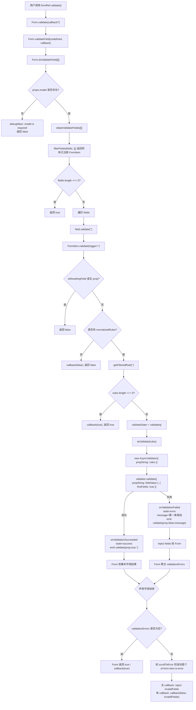

# Element Plus Form / FormItem 源码分析

## 1. Form 和 FormItem 的关系

Element Plus 的表单系统由两个核心组件组成：

```text
ElForm
  负责整体表单上下文、model、rules、字段集合、全局方法

ElFormItem
  负责单个字段的 label、prop、rules、校验状态、错误信息、字段注册
```

入口文件：

```text
packages/components/form/index.ts
```

源码：

```ts
import { withInstall, withNoopInstall } from '@element-plus/utils'
import Form from './src/form.vue'
import FormItem from './src/form-item.vue'

export const ElForm = withInstall(Form, {
  FormItem,
})
export default ElForm
export const ElFormItem = withNoopInstall(FormItem)

export * from './src/form'
export * from './src/form-item'
export * from './src/types'
export * from './src/constants'
export * from './src/hooks'
```

这说明：

- `ElForm` 是主组件。
- `ElFormItem` 是附属组件。
- 执行 `app.use(ElForm)` 时会同时注册 `ElForm` 和 `ElFormItem`。

典型使用：

```vue
<el-form ref="formRef" :model="form" :rules="rules">
  <el-form-item label="用户名" prop="name">
    <el-input v-model="form.name" />
  </el-form-item>
</el-form>
```

结构关系：

```text
Form
  provide FormContext
  管理 fields: FormItemContext[]
  暴露 validate / resetFields / clearValidate

FormItem
  inject FormContext
  根据 prop 绑定 model 字段
  根据 prop 合并 rules
  onMounted 时注册到 Form
  onBeforeUnmount 时从 Form 移除

Input / Select / Checkbox 等子组件
  inject FormItemContext
  在 blur/change 时触发 formItem.validate(...)
```

## 2. Form 如何通过 provide 向子组件提供上下文

Form 的主体文件：

```text
packages/components/form/src/form.vue
```

上下文 key 定义在：

```text
packages/components/form/src/constants.ts
```

源码：

```ts
export const formContextKey: InjectionKey<FormContext> =
  Symbol('formContextKey')
export const formItemContextKey: InjectionKey<FormItemContext | undefined> =
  Symbol('formItemContextKey')
```

Form 中的 provide：

```ts
provide(
  formContextKey,
  reactive({
    ...toRefs(props),
    emit,

    resetFields,
    clearValidate,
    validateField,
    getField,
    addField,
    removeField,
    setInitialValues,

    ...useFormLabelWidth(),
  })
)
```

Form provide 出去的内容包含三类。

### 2.1 Form props

通过：

```ts
...toRefs(props)
```

子组件可以拿到响应式的：

- `model`
- `rules`
- `labelPosition`
- `labelWidth`
- `labelSuffix`
- `inline`
- `inlineMessage`
- `statusIcon`
- `showMessage`
- `validateOnRuleChange`
- `hideRequiredAsterisk`
- `scrollToError`
- `scrollIntoViewOptions`
- `size`
- `disabled`

### 2.2 Form 方法

```ts
resetFields
clearValidate
validateField
getField
addField
removeField
setInitialValues
```

这些方法是 FormItem 注册字段、触发校验、重置字段的基础。

### 2.3 labelWidth 管理能力

```ts
...useFormLabelWidth()
```

提供：

```ts
autoLabelWidth
registerLabelWidth
deregisterLabelWidth
```

用于 `label-width="auto"` 时统一计算所有 label 的最大宽度。

## 3. FormItem 如何 inject Form 上下文

FormItem 的主体文件：

```text
packages/components/form/src/form-item.vue
```

它在 setup 中注入两个上下文：

```ts
const formContext = inject(formContextKey, undefined)
const parentFormItemContext = inject(formItemContextKey, undefined)
```

含义：

- `formContext`：来自外层 `ElForm`。
- `parentFormItemContext`：来自外层 `ElFormItem`，用于识别嵌套 FormItem。

FormItem 自己也会 provide：

```ts
provide(formItemContextKey, context)
```

这样内部的 `ElInput`、`ElSelect`、`ElCheckboxGroup` 等子组件可以通过 `useFormItem()` 拿到当前字段上下文。

`useFormItem()` 定义在：

```text
packages/components/form/src/hooks/use-form-item.ts
```

源码：

```ts
export const useFormItem = () => {
  const form = inject(formContextKey, undefined)
  const formItem = inject(formItemContextKey, undefined)
  return {
    form,
    formItem,
  }
}
```

子组件示例：`ElInput` 中使用：

```ts
const { form: elForm, formItem: elFormItem } = useFormItem()
```

然后在 blur/change 时触发表单校验：

```ts
afterBlur() {
  if (props.validateEvent) {
    elFormItem?.validate?.('blur').catch(NOOP)
  }
}
```

```ts
watch(
  () => props.modelValue,
  () => {
    if (props.validateEvent) {
      elFormItem?.validate?.('change').catch(NOOP)
    }
  }
)
```

## 4. model、rules、prop 是如何关联的

Form 和 FormItem 通过 `prop` 把 `model` 和 `rules` 对齐。

示例：

```vue
<el-form :model="form" :rules="rules">
  <el-form-item prop="user.name">
    <el-input v-model="form.user.name" />
  </el-form-item>
</el-form>
```

对应数据：

```ts
const form = reactive({
  user: {
    name: '',
  },
})

const rules = {
  'user.name': [
    { required: true, message: '请输入用户名', trigger: 'blur' },
  ],
}
```

### 4.1 propString

FormItem 支持字符串 prop，也支持数组路径：

```ts
export type FormItemProp = Arrayable<string>
```

FormItem 中会规范成字符串：

```ts
const propString = computed(() => {
  if (!props.prop) return ''
  return isArray(props.prop) ? props.prop.join('.') : props.prop
})
```

所以：

```ts
prop="user.name"
prop={['user', 'name']}
```

最终都可以变成：

```text
user.name
```

### 4.2 fieldValue：从 model 取字段值

FormItem 的字段值：

```ts
const fieldValue = computed(() => {
  const model = formContext?.model
  if (!model || !props.prop) {
    return
  }
  return getProp(model, props.prop).value
})
```

`getProp` 是 Element Plus 的工具函数：

```ts
export const getProp = <T = any>(
  obj: Record<string, any>,
  path: Arrayable<string>,
  defaultValue?: any
): { value: T } => {
  return {
    get value() {
      return get(obj, path, defaultValue)
    },
    set value(val: any) {
      set(obj, path, val)
    },
  }
}
```

它基于 lodash 的 `get/set`，可以读写深层路径。

### 4.3 rules：从 Form 和 FormItem 合并规则

FormItem 的规则计算：

```ts
const normalizedRules = computed(() => {
  const { required } = props

  const rules: FormItemRule[] = []

  if (props.rules) {
    rules.push(...ensureArray(props.rules))
  }

  const formRules = formContext?.rules
  if (formRules && props.prop) {
    const _rules = getProp<Arrayable<FormItemRule> | undefined>(
      formRules,
      props.prop
    ).value
    if (_rules) {
      rules.push(...ensureArray(_rules))
    }
  }

  if (required !== undefined) {
    const requiredRules = rules
      .map((rule, i) => [rule, i] as const)
      .filter(([rule]) => 'required' in rule)

    if (requiredRules.length > 0) {
      for (const [rule, i] of requiredRules) {
        if (rule.required === required) continue
        rules[i] = { ...rule, required }
      }
    } else {
      rules.push({ required })
    }
  }

  return rules
})
```

规则来源优先合并为：

```text
FormItem 自己的 rules
  + Form.rules[prop]
  + FormItem.required 转换出的 required rule
```

注意：这里不是覆盖关系，而是合并数组。

### 4.4 required 如何影响规则

如果 `FormItem` 设置了：

```vue
<el-form-item prop="name" required>
```

它会：

- 如果已有规则里有 `required` 字段，就修改该规则的 required 值。
- 如果没有，就新增 `{ required: true }`。

这也是 `isRequired` 的来源：

```ts
const isRequired = computed(() =>
  normalizedRules.value.some((rule) => rule.required)
)
```

`isRequired` 会影响 class：

```ts
ns.is('required', isRequired.value || props.required)
```

最终显示必填星号。

## 5. 表单校验是如何触发的

Element Plus 的表单校验有四类触发入口。

### 5.1 手动触发整个表单校验

用户调用：

```ts
await formRef.value.validate()
```

Form 内部：

```ts
const validate = async (
  callback?: FormValidateCallback
): FormValidationResult => validateField(undefined, callback)
```

也就是说，`validate()` 本质是：

```text
validateField(undefined)
```

即校验所有已注册字段。

### 5.2 手动触发部分字段校验

用户调用：

```ts
await formRef.value.validateField('name')
await formRef.value.validateField(['name', 'age'])
await formRef.value.validateField([['obj', 'name']])
```

Form 内部通过 `filterFields` 筛选字段：

```ts
const filteredFields = filterFields(fields, props)
```

`filterFields` 会把数组路径转成点路径：

```ts
const normalized = ensureArray(props).map((prop) =>
  isArray(prop) ? prop.join('.') : prop
)
```

### 5.3 子组件 blur/change 自动触发

例如 Input：

```ts
afterBlur() {
  if (props.validateEvent) {
    elFormItem?.validate?.('blur').catch(NOOP)
  }
}
```

以及：

```ts
watch(
  () => props.modelValue,
  () => {
    if (props.validateEvent) {
      elFormItem?.validate?.('change').catch(NOOP)
    }
  }
)
```

这对应规则中的：

```ts
trigger: 'blur'
trigger: 'change'
```

### 5.4 rules 改变时触发

Form 监听 `props.rules`：

```ts
watch(
  () => props.rules,
  () => {
    if (props.validateOnRuleChange) {
      validate().catch(NOOP)
    }
  },
  { deep: true, flush: 'post' }
)
```

如果 `validateOnRuleChange` 为 true，规则变化后会重新校验整个表单。

## 6. validate、resetFields、clearValidate 等方法如何实现

这些方法定义在 `form.vue`，并通过 `defineExpose` 暴露给用户：

```ts
defineExpose({
  validate,
  validateField,
  resetFields,
  clearValidate,
  scrollToField,
  getField,
  fields,
  setInitialValues,
})
```

### 6.1 validate

```ts
const validate = async (
  callback?: FormValidateCallback
): FormValidationResult => validateField(undefined, callback)
```

`validate()` 是 `validateField()` 的全量版本。

### 6.2 validateField

核心源码：

```ts
const validateField: FormContext['validateField'] = async (
  modelProps = [],
  callback
) => {
  let result = false
  const shouldThrow = !isFunction(callback)
  try {
    result = await doValidateField(modelProps)
    if (result === true) {
      await callback?.(result)
    }
    return result
  } catch (e) {
    if (e instanceof Error) throw e

    const invalidFields = e as ValidateFieldsError

    if (props.scrollToError) {
      if (formRef.value) {
        const formItem = formRef.value.querySelector(`.${ns.b()}-item.is-error`)
        formItem?.scrollIntoView(props.scrollIntoViewOptions)
      }
    }
    !result && (await callback?.(false, invalidFields))
    return shouldThrow && Promise.reject(invalidFields)
  }
}
```

行为总结：

- 有 callback：失败时调用 callback，不抛出 rejected Promise。
- 无 callback：失败时返回 rejected Promise，错误对象是 `invalidFields`。
- 如果 `scrollToError` 为 true，会滚动到第一个 `.el-form-item.is-error`。

### 6.3 doValidateField

```ts
const doValidateField = async (
  props: Arrayable<FormItemProp> = []
): Promise<boolean> => {
  if (!isValidatable.value) return false

  const fields = obtainValidateFields(props)
  if (fields.length === 0) return true

  let validationErrors: ValidateFieldsError = {}
  for (const field of fields) {
    try {
      await field.validate('')
      if (field.validateState === 'error' && !field.error) field.resetField()
    } catch (fields) {
      validationErrors = {
        ...validationErrors,
        ...(fields as ValidateFieldsError),
      }
    }
  }

  if (Object.keys(validationErrors).length === 0) return true
  return Promise.reject(validationErrors)
}
```

它会逐个调用字段的：

```ts
field.validate('')
```

这里传空字符串 `''`，意味着不按 blur/change 过滤，所有规则都参与校验。

### 6.4 resetFields

Form 层：

```ts
const resetFields: FormContext['resetFields'] = (properties = []) => {
  if (!props.model) {
    debugWarn(COMPONENT_NAME, 'model is required for resetFields to work.')
    return
  }

  filterFields(fields, properties).forEach((field) => field.resetField())

  const activePropStrings = new Set(
    fields.map((f) => f.propString).filter(Boolean)
  )
  const propsToCheck =
    properties.length > 0
      ? ensureArray(properties).map((p) => (isArray(p) ? p.join('.') : p))
      : [...initialValues.keys()]

  for (const propString of propsToCheck) {
    if (!activePropStrings.has(propString) && initialValues.has(propString)) {
      getProp(props.model, propString).value = cloneDeep(
        initialValues.get(propString)
      )
    }
  }
}
```

它做两件事：

1. 对当前活跃字段调用 `field.resetField()`。
2. 对已经卸载或动态切换 prop 的字段，根据 `initialValues` 缓存恢复 model 值。

FormItem 层的 `resetField`：

```ts
const resetField: FormItemContext['resetField'] = async () => {
  const model = formContext?.model
  if (!model || !props.prop) return

  const computedValue = getProp(model, props.prop)

  isResettingField = true

  computedValue.value = cloneDeep(initialValue)

  await nextTick()
  clearValidate()

  isResettingField = false
}
```

关键点：

- 重置值来自 `initialValue`。
- `isResettingField = true` 用于避免重置过程中触发校验。
- 重置后调用 `clearValidate()` 清掉错误信息和状态。

### 6.5 clearValidate

Form 层：

```ts
const clearValidate: FormContext['clearValidate'] = (props = []) => {
  filterFields(fields, props).forEach((field) => field.clearValidate())
}
```

FormItem 层：

```ts
const clearValidate: FormItemContext['clearValidate'] = () => {
  setValidationState('')
  validateMessage.value = ''
  isResettingField = false
}
```

它只清状态，不改 model 值。

### 6.6 scrollToField / getField / setInitialValues

`scrollToField`：

```ts
const scrollToField = (prop: FormItemProp) => {
  const field = getField(prop)
  if (field) {
    field.$el?.scrollIntoView(props.scrollIntoViewOptions)
  }
}
```

`getField`：

```ts
const getField = (prop) => {
  return filterFields(fields, [prop])[0]
}
```

`setInitialValues`：

```ts
const setInitialValues = (initModel) => {
  for (const key of initialValues.keys()) {
    initialValues.set(key, cloneDeep(getProp(initModel, key).value))
  }
  fields.forEach((field) => {
    if (field.prop) {
      field.setInitialValue(getProp(initModel, field.prop).value)
    }
  })
}
```

它允许用户重新指定后续 `resetFields()` 使用的初始值。

## 7. FormItem 是如何收集和管理字段的

字段收集由 Form 和 FormItem 共同完成。

### 7.1 Form 维护 fields

Form 中：

```ts
const fields = reactive<FormItemContext[]>([])
const initialValues = new Map<string, any>()
```

`fields` 保存当前已挂载、且有 `prop` 的 FormItem。

`initialValues` 保存字段初始值，支持 reset。

### 7.2 FormItem mount 时注册字段

FormItem 中：

```ts
onMounted(() => {
  if (props.prop) {
    setInitialValue(fieldValue.value)
    formContext?.addField(context)
  }
})
```

只有设置了 `prop` 的 FormItem 才会被注册。

### 7.3 Form.addField

```ts
const addField: FormContext['addField'] = (field) => {
  if (!fields.includes(field)) {
    fields.push(field)
  }
  if (field.propString) {
    if (initialValues.has(field.propString)) {
      field.setInitialValue(initialValues.get(field.propString))
    } else {
      initialValues.set(field.propString, cloneDeep(field.fieldValue))
    }
  }
}
```

含义：

- 避免重复注册。
- 如果之前缓存过该 prop 的初始值，则恢复到 FormItem。
- 否则把当前 fieldValue clone 一份作为初始值。

### 7.4 FormItem unmount 时移除字段

```ts
onBeforeUnmount(() => {
  formContext?.removeField(context)
})
```

Form 中：

```ts
const removeField: FormContext['removeField'] = (field, oldPropString?) => {
  if (oldPropString) {
    initialValues.delete(oldPropString)
    return
  }
  const idx = fields.indexOf(field)
  if (idx > -1) {
    fields.splice(idx, 1)
    if (field.propString) {
      initialValues.set(field.propString, cloneDeep(field.getInitialValue()))
    }
  }
}
```

卸载时：

- 从 `fields` 数组移除。
- 把初始值缓存回 `initialValues`，为未来动态 remount 或 reset 保留信息。

### 7.5 prop 动态变化时重新注册

FormItem 监听 `propString`：

```ts
watch(propString, (newPropString, oldPropString) => {
  if (!formContext || !oldPropString) return
  formContext.removeField(context, oldPropString)
  if (newPropString) {
    setInitialValue(fieldValue.value)
    formContext.addField(context)
  }
})
```

当一个 FormItem 的 prop 从 `name` 切换到 `name2`：

1. 删除旧 prop 的初始值缓存。
2. 用新字段值设置 initialValue。
3. 重新 addField。

这让动态表单字段也能正确 reset。

## 8. labelWidth、error、validateState 是如何维护的

### 8.1 labelWidth

Form 有一个全局 `labelWidth` prop：

```ts
labelWidth?: string | number
```

FormItem 自己也可以传：

```ts
labelWidth?: string | number
```

FormItem 的 label 样式：

```ts
const labelStyle = computed<CSSProperties>(() => {
  if (labelPosition.value === 'top') {
    return {}
  }

  const labelWidth = addUnit(props.labelWidth ?? formContext?.labelWidth)
  return { width: labelWidth }
})
```

内容区域样式：

```ts
const contentStyle = computed<CSSProperties>(() => {
  if (labelPosition.value === 'top' || formContext?.inline) {
    return {}
  }
  if (!props.label && !props.labelWidth && isNested) {
    return {}
  }
  const labelWidth = addUnit(props.labelWidth ?? formContext?.labelWidth)
  if (!props.label && !slots.label) {
    return { marginLeft: labelWidth }
  }
  return {}
})
```

当 `labelWidth="auto"` 时，`FormLabelWrap` 会测量 label 实际宽度，并向 Form 注册：

```ts
formContext?.registerLabelWidth(val, oldVal)
```

Form 中 `useFormLabelWidth()` 维护所有 label 宽度：

```ts
const potentialLabelWidthArr = ref<number[]>([])

const autoLabelWidth = computed(() => {
  if (!potentialLabelWidthArr.value.length) return '0'
  const max = Math.max(...potentialLabelWidthArr.value)
  return max ? `${max}px` : ''
})
```

最终每个 auto label 根据最大宽度计算 margin，使一组 label 对齐。

### 8.2 error

FormItem 有一个外部可控的 `error` prop：

```ts
error?: string
```

监听逻辑：

```ts
watch(
  () => props.error,
  (val) => {
    validateMessage.value = val || ''
    setValidationState(val ? 'error' : '')
  },
  { immediate: true }
)
```

这意味着用户可以手动设置错误：

```vue
<el-form-item prop="email" :error="manualErrors.email">
```

只要 `error` 有值，FormItem 立刻进入 `error` 状态并展示该消息。

### 8.3 validateStatus

FormItem 还有外部可控状态：

```ts
validateStatus?: '' | 'error' | 'validating' | 'success'
```

监听逻辑：

```ts
watch(
  () => props.validateStatus,
  (val) => setValidationState(val || '')
)
```

它允许用户手动指定校验状态。

### 8.4 validateState / validateMessage

内部状态：

```ts
const validateState = ref<FormItemValidateState>('')
const validateStateDebounced = refDebounced(validateState, 100)
const validateMessage = ref('')
```

状态枚举：

```ts
export const formItemValidateStates = [
  '',
  'error',
  'validating',
  'success',
] as const
```

状态变化：

```ts
const setValidationState = (state: FormItemValidateState) => {
  validateState.value = state
}
```

校验失败：

```ts
setValidationState('error')
validateMessage.value = errors
  ? (errors?.[0]?.message ?? `${props.prop} is required`)
  : ''
```

校验成功：

```ts
setValidationState('success')
```

错误是否展示：

```ts
const shouldShowError = computed(
  () =>
    validateStateDebounced.value === 'error' &&
    props.showMessage &&
    (formContext?.showMessage ?? true)
)
```

注意这里用了 `refDebounced(validateState, 100)`，错误信息展示会有 100ms 防抖。

### 8.5 class 如何体现状态

FormItem class：

```ts
const formItemClasses = computed(() => [
  ns.b(),
  ns.m(_size.value),
  ns.is('error', validateState.value === 'error'),
  ns.is('validating', validateState.value === 'validating'),
  ns.is('success', validateState.value === 'success'),
  ns.is('required', isRequired.value || props.required),
  ns.is('no-asterisk', formContext?.hideRequiredAsterisk),
  formContext?.requireAsteriskPosition === 'right'
    ? 'asterisk-right'
    : 'asterisk-left',
  {
    [ns.m('feedback')]: formContext?.statusIcon,
    [ns.m(`label-${labelPosition.value}`)]: labelPosition.value,
  },
])
```

典型结果：

```text
el-form-item
el-form-item--default
is-error
is-required
asterisk-left
el-form-item--label-right
```

样式中 `.is-error` 会影响内部 input/select/textarea 的边框颜色，并展示 `.el-form-item__error`。

## 9. async-validator 是如何接入的

FormItem 直接引入 async-validator：

```ts
import AsyncValidator from 'async-validator'
```

校验核心：

```ts
const doValidate = async (rules: RuleItem[]): Promise<true> => {
  const modelName = propString.value
  const validator = new AsyncValidator({
    [modelName]: rules,
  })
  return validator
    .validate({ [modelName]: fieldValue.value }, { firstFields: true })
    .then(() => {
      onValidationSucceeded()
      return true as const
    })
    .catch((err: FormValidateFailure) => {
      onValidationFailed(err)
      return Promise.reject(err)
    })
}
```

接入方式可以拆成四步：

1. FormItem 根据 trigger 得到要参与本次校验的规则：

   ```ts
   const rules = getFilteredRule(trigger)
   ```

2. 创建 async-validator 实例：

   ```ts
   new AsyncValidator({
     [modelName]: rules,
   })
   ```

3. 把当前字段值传进去：

   ```ts
   validator.validate({ [modelName]: fieldValue.value }, { firstFields: true })
   ```

4. 根据成功或失败更新状态：

   ```ts
   onValidationSucceeded()
   onValidationFailed(err)
   ```

### 9.1 trigger 过滤

```ts
const getFilteredRule = (trigger: string) => {
  const rules = normalizedRules.value
  return (
    rules
      .filter((rule) => {
        if (!rule.trigger || !trigger) return true
        if (isArray(rule.trigger)) {
          return rule.trigger.includes(trigger)
        } else {
          return rule.trigger === trigger
        }
      })
      .map(({ trigger, ...rule }): RuleItem => rule)
  )
}
```

逻辑：

- 如果 rule 没有 trigger，任何触发方式都校验。
- 如果本次 trigger 为空字符串，所有规则都校验。
- 如果 rule.trigger 是数组，则包含本次 trigger 才校验。
- 传给 async-validator 前会去掉 `trigger` 字段，因为它不是 async-validator 的校验规则字段。

### 9.2 成功处理

```ts
const onValidationSucceeded = () => {
  setValidationState('success')
  formContext?.emit('validate', props.prop!, true, '')
}
```

### 9.3 失败处理

```ts
const onValidationFailed = (error: FormValidateFailure) => {
  const { errors, fields } = error
  if (!errors || !fields) {
    console.error(error)
  }

  setValidationState('error')
  validateMessage.value = errors
    ? (errors?.[0]?.message ?? `${props.prop} is required`)
    : ''

  formContext?.emit('validate', props.prop!, false, validateMessage.value)
}
```

失败后会：

- 设置 `validateState = 'error'`。
- 设置 `validateMessage` 为第一条错误消息。
- 通过 Form emit `validate` 事件。
- reject 给 Form 聚合错误。

## 10. 一次 validate() 的完整调用链



## 11. 简化版 Form / FormItem 实现

下面是一个简化版实现，只保留 Element Plus Form 的核心思想：

- Form provide 上下文。
- FormItem inject Form 上下文。
- Form 收集字段。
- FormItem 根据 prop 读取 model 和 rules。
- 使用 async-validator 校验字段。
- 暴露 validate / resetFields / clearValidate。

### 11.1 form-context.ts

```ts
import type { InjectionKey, Ref } from 'vue'
import type { RuleItem, ValidateFieldsError } from 'async-validator'

export type Rule = RuleItem & {
  trigger?: string | string[]
}

export type FormRules = Record<string, Rule | Rule[]>

export type ValidateState = '' | 'validating' | 'success' | 'error'

export interface MyFormItemContext {
  prop: string
  fieldValue: any
  validateState: Ref<ValidateState>
  validateMessage: Ref<string>
  validate(trigger?: string): Promise<boolean>
  resetField(): void
  clearValidate(): void
}

export interface MyFormContext {
  model: Record<string, any>
  rules?: FormRules
  addField(field: MyFormItemContext): void
  removeField(field: MyFormItemContext): void
  validateField(prop?: string | string[]): Promise<boolean>
  resetFields(prop?: string | string[]): void
  clearValidate(prop?: string | string[]): void
}

export const myFormContextKey: InjectionKey<MyFormContext> =
  Symbol('myFormContextKey')
```

### 11.2 MyForm.vue

```vue
<template>
  <form class="my-form" @submit.prevent>
    <slot />
  </form>
</template>

<script setup lang="ts">
import { provide, reactive } from 'vue'
import { myFormContextKey } from './form-context'

import type { MyFormContext, MyFormItemContext, FormRules } from './form-context'

const props = defineProps<{
  model: Record<string, any>
  rules?: FormRules
}>()

const fields = reactive<MyFormItemContext[]>([])

function normalizeProps(prop?: string | string[]) {
  if (!prop) return []
  return Array.isArray(prop) ? prop : [prop]
}

function getFields(prop?: string | string[]) {
  const props = normalizeProps(prop)
  return props.length
    ? fields.filter((field) => props.includes(field.prop))
    : fields
}

function addField(field: MyFormItemContext) {
  if (!fields.includes(field)) {
    fields.push(field)
  }
}

function removeField(field: MyFormItemContext) {
  const index = fields.indexOf(field)
  if (index > -1) fields.splice(index, 1)
}

async function validateField(prop?: string | string[]) {
  const targetFields = getFields(prop)
  const errors: Record<string, unknown> = {}

  for (const field of targetFields) {
    try {
      await field.validate('')
    } catch (err) {
      errors[field.prop] = err
    }
  }

  if (Object.keys(errors).length) {
    return Promise.reject(errors)
  }

  return true
}

function resetFields(prop?: string | string[]) {
  getFields(prop).forEach((field) => field.resetField())
}

function clearValidate(prop?: string | string[]) {
  getFields(prop).forEach((field) => field.clearValidate())
}

const context: MyFormContext = {
  model: props.model,
  rules: props.rules,
  addField,
  removeField,
  validateField,
  resetFields,
  clearValidate,
}

provide(myFormContextKey, context)

defineExpose({
  fields,
  validate: () => validateField(),
  validateField,
  resetFields,
  clearValidate,
})
</script>
```

### 11.3 MyFormItem.vue

```vue
<template>
  <div
    class="my-form-item"
    :class="{
      'is-error': validateState === 'error',
      'is-validating': validateState === 'validating',
      'is-success': validateState === 'success',
    }"
  >
    <label v-if="label" class="my-form-item__label">
      {{ label }}
    </label>

    <div class="my-form-item__content">
      <slot />
      <div v-if="validateState === 'error'" class="my-form-item__error">
        {{ validateMessage }}
      </div>
    </div>
  </div>
</template>

<script setup lang="ts">
import { computed, inject, onBeforeUnmount, onMounted, provide, ref } from 'vue'
import AsyncValidator from 'async-validator'
import { myFormContextKey } from './form-context'

import type { MyFormItemContext, Rule, ValidateState } from './form-context'

const props = defineProps<{
  label?: string
  prop?: string
  rules?: Rule | Rule[]
}>()

const form = inject(myFormContextKey)

const validateState = ref<ValidateState>('')
const validateMessage = ref('')
let initialValue: any

const fieldValue = computed(() => {
  if (!form || !props.prop) return undefined
  return form.model[props.prop]
})

const normalizedRules = computed<Rule[]>(() => {
  const rules: Rule[] = []

  if (props.rules) {
    rules.push(...(Array.isArray(props.rules) ? props.rules : [props.rules]))
  }

  if (form?.rules && props.prop) {
    const formRules = form.rules[props.prop]
    if (formRules) {
      rules.push(...(Array.isArray(formRules) ? formRules : [formRules]))
    }
  }

  return rules
})

function getFilteredRules(trigger = '') {
  return normalizedRules.value
    .filter((rule) => {
      if (!rule.trigger || !trigger) return true
      return Array.isArray(rule.trigger)
        ? rule.trigger.includes(trigger)
        : rule.trigger === trigger
    })
    .map(({ trigger, ...rule }) => rule)
}

async function validate(trigger = '') {
  if (!props.prop) return false

  const rules = getFilteredRules(trigger)
  if (!rules.length) return true

  validateState.value = 'validating'

  const validator = new AsyncValidator({
    [props.prop]: rules,
  })

  try {
    await validator.validate(
      { [props.prop]: fieldValue.value },
      { firstFields: true }
    )
    validateState.value = 'success'
    validateMessage.value = ''
    return true
  } catch (err: any) {
    validateState.value = 'error'
    validateMessage.value = err.errors?.[0]?.message || '校验失败'
    return Promise.reject(err.fields)
  }
}

function clearValidate() {
  validateState.value = ''
  validateMessage.value = ''
}

function resetField() {
  if (!form || !props.prop) return
  form.model[props.prop] = initialValue
  clearValidate()
}

const context: MyFormItemContext = {
  prop: props.prop || '',
  get fieldValue() {
    return fieldValue.value
  },
  validateState,
  validateMessage,
  validate,
  resetField,
  clearValidate,
}

onMounted(() => {
  if (form && props.prop) {
    initialValue = fieldValue.value
    form.addField(context)
  }
})

onBeforeUnmount(() => {
  form?.removeField(context)
})

provide(Symbol('myFormItemContext'), context)

defineExpose({
  validate,
  resetField,
  clearValidate,
  validateState,
  validateMessage,
})
</script>
```

### 11.4 简化版使用示例

```vue
<template>
  <MyForm ref="formRef" :model="form" :rules="rules">
    <MyFormItem label="用户名" prop="name">
      <input v-model="form.name" />
    </MyFormItem>

    <button type="button" @click="submit">提交</button>
  </MyForm>
</template>

<script setup lang="ts">
import { reactive, ref } from 'vue'
import MyForm from './MyForm.vue'
import MyFormItem from './MyFormItem.vue'

const formRef = ref()

const form = reactive({
  name: '',
})

const rules = {
  name: [
    { required: true, message: '请输入用户名' },
    { min: 3, message: '至少 3 个字符' },
  ],
}

async function submit() {
  try {
    await formRef.value.validate()
    console.log('submit', form)
  } catch (fields) {
    console.log('invalid', fields)
  }
}
</script>
```

## 12. 总结

Form / FormItem 的核心设计可以概括为：

```text
Form
  持有 model / rules
  provide FormContext
  维护 fields[]
  暴露 validate / validateField / resetFields / clearValidate

FormItem
  inject FormContext
  通过 prop 绑定 model[prop]
  合并 props.rules + form.rules[prop] + required
  注册自己到 Form.fields
  维护 validateState / validateMessage / initialValue
  调用 async-validator 完成单字段校验

Input / Select / Checkbox 等表单控件
  inject FormItemContext
  在 blur/change 时调用 formItem.validate(trigger)
```

最关键的源码思想：

1. **上下文传递**：Form 通过 provide 把全局表单能力交给后代，FormItem 再 provide 单字段上下文给输入组件。
2. **字段注册表**：Form 不主动扫描 DOM，而是由 FormItem 生命周期主动 add/remove。
3. **prop 是连接点**：`prop` 同时连接 `model` 的字段值和 `rules` 的校验规则。
4. **校验职责下沉**：Form 负责遍历和聚合结果，真正的单字段校验在 FormItem 内完成。
5. **状态可控也可自动**：`error` 和 `validateStatus` 支持外部控制，async-validator 支持内部自动控制。
6. **reset 依赖初始值快照**：FormItem 挂载时记录 initialValue，Form 额外用 Map 支持动态字段。
7. **labelWidth auto 通过测量聚合**：每个 label 上报宽度，Form 取最大值做对齐。

