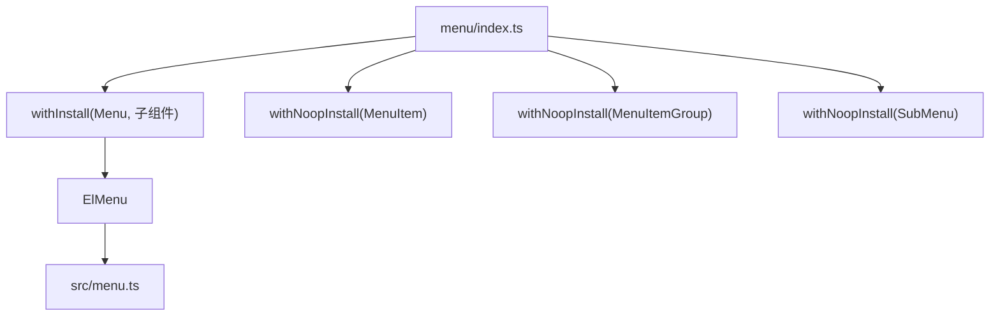
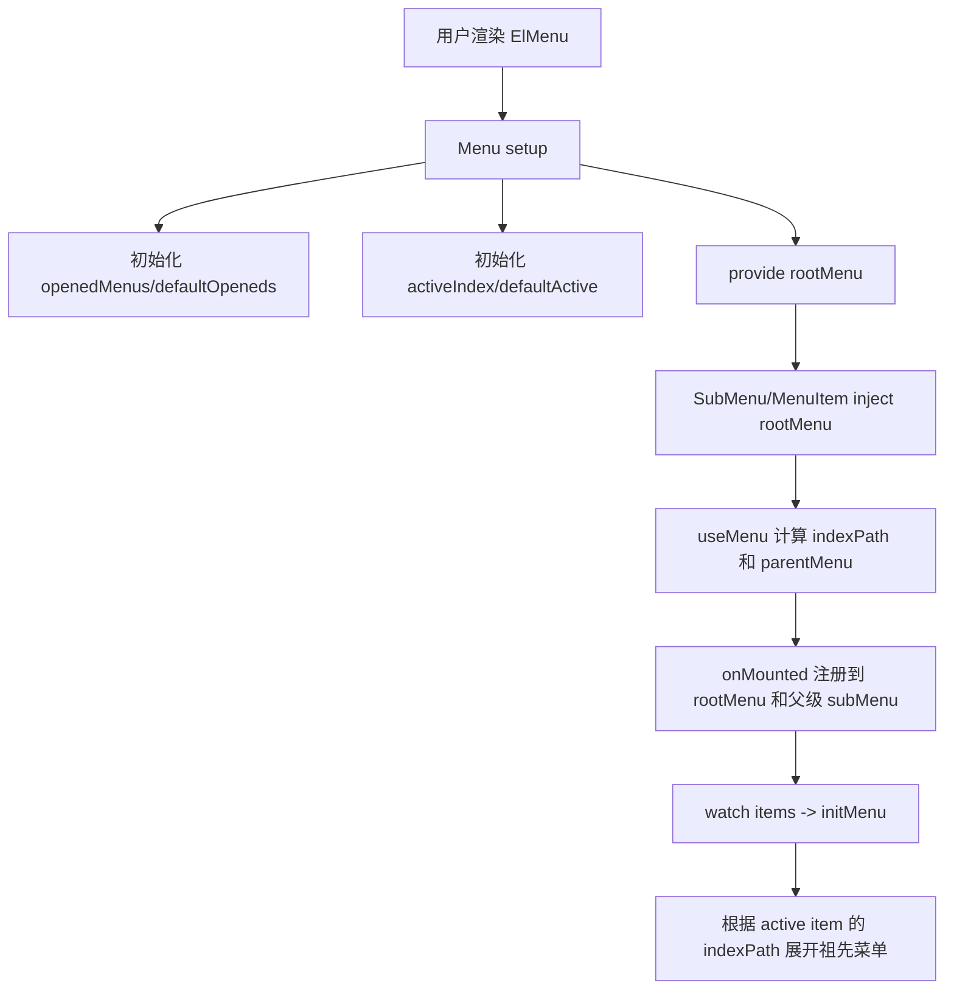
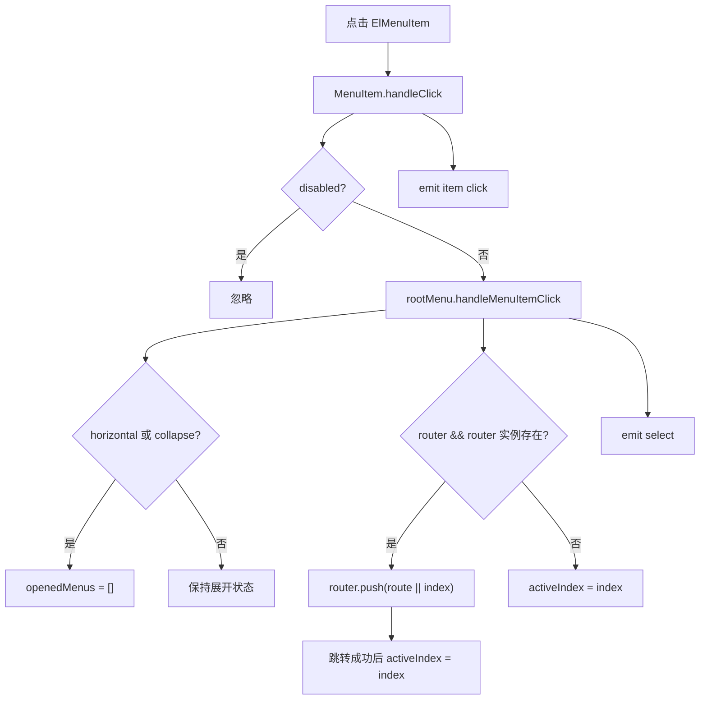
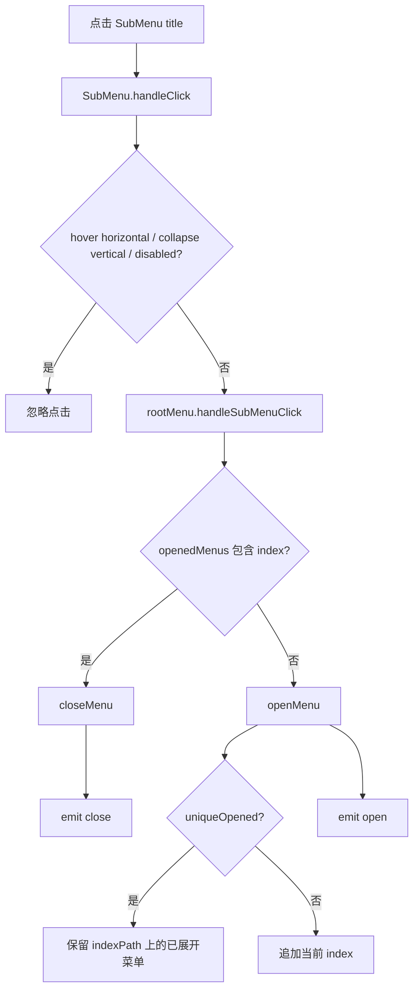
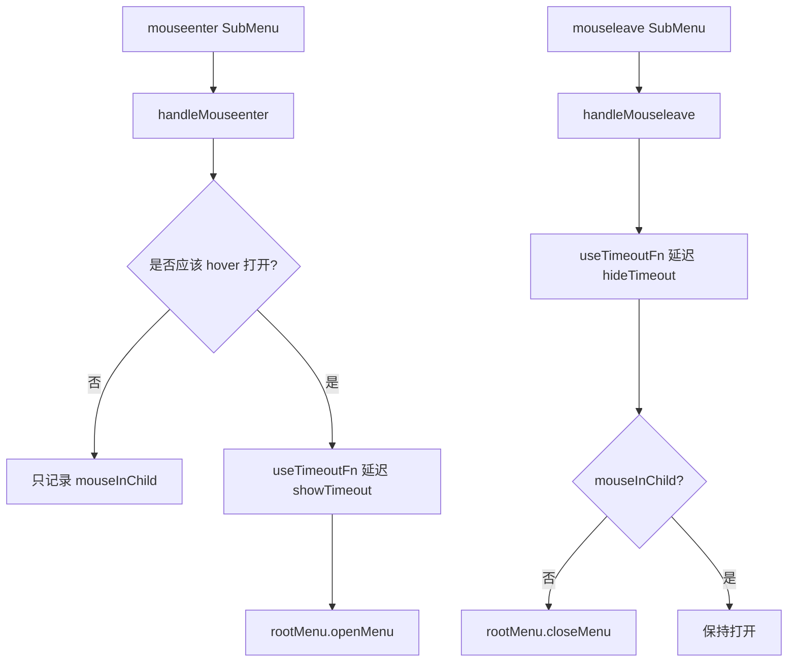
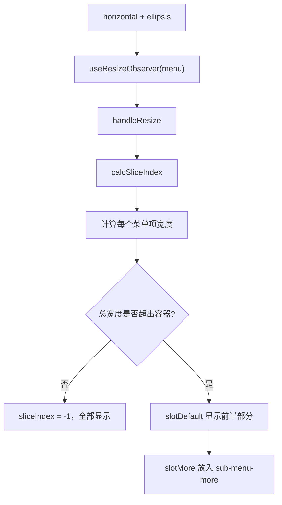
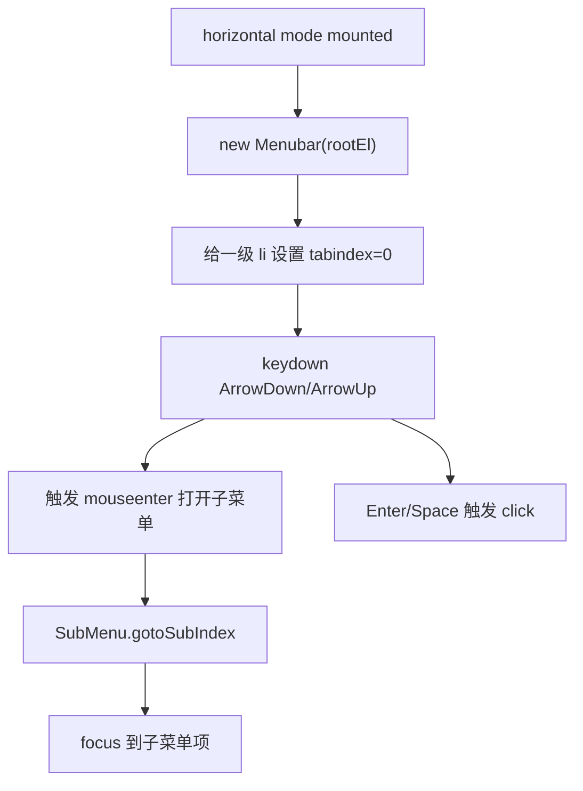
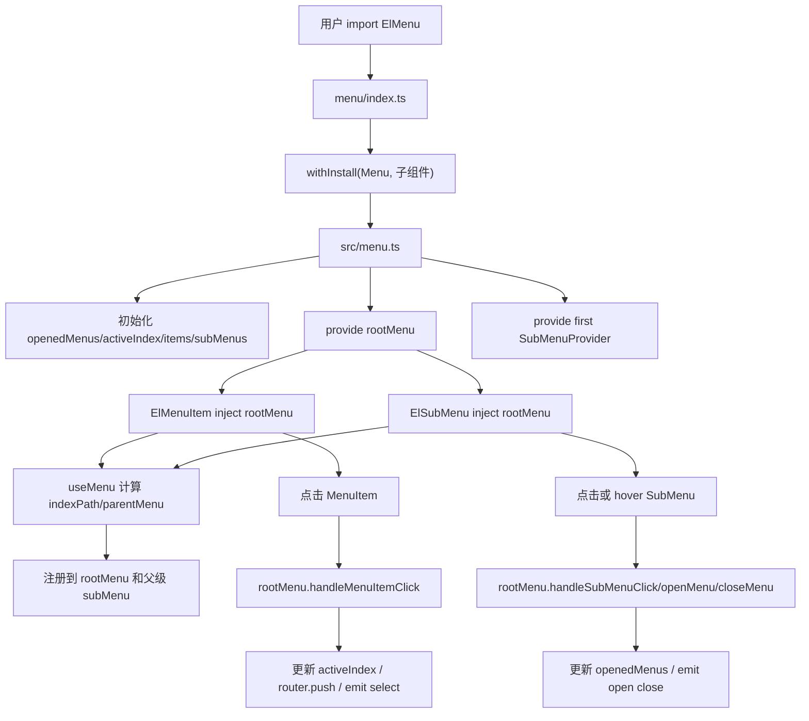

# Element Plus Menu 组件源码分析

> 源码位置：`element-plus-dev/packages/components/menu`
>
> 样式位置：`element-plus-dev/packages/theme-chalk/src/menu.scss`
>
> 主要导出：`ElMenu`、`ElMenuItem`、`ElMenuItemGroup`、`ElSubMenu`
>
> 核心关键词：父子注册、provide/inject、递归菜单、展开状态、激活状态、路由联动、横向折叠、键盘导航。

`Menu` 是一个典型的“父组件统一管理状态，子组件递归注册”的复杂组件。它不像 Button 那样只处理自身渲染，也不像 TableV2 那样重点在虚拟滚动；Menu 的核心是维护一棵菜单树，并把“当前选中项、展开的子菜单、父子路径、鼠标/键盘交互、路由跳转”串起来。

一句话概括：

```text
ElMenu 维护全局菜单状态；ElSubMenu / ElMenuItem 通过 provide/inject 注册到父级和根菜单；点击或 hover 后由根菜单统一更新 activeIndex 和 openedMenus。
```

## 1. 学习目标

Menu 适合学习这些源码思想：

| 学习点 | 说明 |
| --- | --- |
| 组件树通信 | 根 Menu 和任意深度子菜单通过 provide/inject 共享上下文 |
| 父子注册机制 | MenuItem/SubMenu 挂载时注册，卸载时反注册 |
| 递归组件设计 | SubMenu 内部可以继续放 SubMenu，形成多级菜单 |
| 路径计算 | 每个菜单项都有 `indexPath`，表示从根到当前项的路径 |
| 受控与非受控状态 | `defaultActive`、`defaultOpeneds` 初始化内部状态，后续通过点击和 watch 更新 |
| 路由集成 | `router=true` 时，点击菜单项会调用 `vue-router.push` |
| 横向菜单溢出 | horizontal + ellipsis 时，把放不下的菜单项收进 “more” 子菜单 |
| 弹出层复用 | 弹出型子菜单使用 Tooltip/Popper 实现 |
| 可访问性 | 使用 `role="menubar"`、`role="menuitem"`、键盘方向键导航 |

学习 Menu 源码时，最重要的是抓住两条线：

```text
状态线：items / subMenus / activeIndex / openedMenus
结构线：ElMenu -> ElSubMenu -> ElMenuItem / ElSubMenu
```

## 2. 文件结构

源码文件：

```text
packages/components/menu
├── index.ts
├── src
│   ├── menu.ts
│   ├── menu-item.vue
│   ├── menu-item.ts
│   ├── menu-item-group.vue
│   ├── menu-item-group.ts
│   ├── sub-menu.ts
│   ├── tokens.ts
│   ├── types.ts
│   ├── instance.ts
│   ├── use-menu.ts
│   ├── use-menu-css-var.ts
│   ├── use-menu-color.ts
│   ├── menu-collapse-transition.vue
│   └── utils
│       ├── menu-bar.ts
│       ├── menu-item.ts
│       └── submenu.ts
├── style
│   ├── index.ts
│   └── css.ts
└── __tests__
    └── menu.test.ts
```

文件职责表：

| 文件 | 职责 |
| --- | --- |
| `index.ts` | 统一导出 `ElMenu`，并把 `MenuItem`、`MenuItemGroup`、`SubMenu` 作为子组件挂到安装对象上 |
| `src/menu.ts` | 根菜单组件，维护 active/opened/items/subMenus，提供上下文，处理 select/open/close |
| `src/menu-item.vue` | 菜单叶子项，处理点击、激活状态、折叠 tooltip、注册/反注册 |
| `src/menu-item.ts` | `MenuItem` props 和 click emits 类型 |
| `src/sub-menu.ts` | 子菜单组件，处理展开/收起、弹出层、递归注册、子项激活状态 |
| `src/menu-item-group.vue` | 菜单分组组件，只负责标题和 slot 结构 |
| `src/use-menu.ts` | 计算当前组件的 `parentMenu` 和 `indexPath` |
| `src/use-menu-css-var.ts` | 根据 props 和层级生成 CSS 变量 |
| `src/use-menu-color.ts` | 根据 background color 计算 hover 背景色 |
| `src/menu-collapse-transition.vue` | 垂直菜单 collapse 展开/收起动画 |
| `src/tokens.ts` | `MENU_INJECTION_KEY` 和 `SUB_MENU_INJECTION_KEY` |
| `src/types.ts` | 根菜单 provider、子菜单 provider、注册项类型 |
| `src/instance.ts` | 对外实例方法类型，如 `open`、`close`、`updateActiveIndex` |
| `src/utils/*` | horizontal 模式键盘导航辅助类 |
| `style/index.ts` | SCSS 样式入口 |
| `style/css.ts` | 构建产物 CSS 样式入口 |
| `theme-chalk/src/menu.scss` | Menu、MenuItem、SubMenu、Group 的全部 BEM 样式 |
| `__tests__/menu.test.ts` | 点击、默认激活、默认展开、禁用、横向菜单、溢出 more 等测试 |

注意：`theme-chalk/src/menu-item.scss`、`sub-menu.scss`、`menu-item-group.scss` 文件存在但内容为空，实际样式集中在 `menu.scss`。

## 3. 入口链路

入口文件：`packages/components/menu/index.ts`

核心代码：

```ts
export const ElMenu = withInstall(Menu, {
  MenuItem,
  MenuItemGroup,
  SubMenu,
})

export const ElMenuItem = withNoopInstall(MenuItem)
export const ElMenuItemGroup = withNoopInstall(MenuItemGroup)
export const ElSubMenu = withNoopInstall(SubMenu)
```

入口链路：



为什么 `ElMenu` 安装时带子组件？

```text
app.use(ElMenu) 时，Menu、MenuItem、MenuItemGroup、SubMenu 会一起注册；
而按需导入 ElMenuItem / ElSubMenu 时，它们也能作为独立组件使用。
```

## 4. Props / Emits / Slots

### 4.1 ElMenu props

`menuProps` 定义在 `src/menu.ts`。

| prop | 说明 |
| --- | --- |
| `mode` | 菜单模式，`vertical` 或 `horizontal`，默认 `vertical` |
| `defaultActive` | 页面加载时默认激活的菜单项 index |
| `defaultOpeneds` | 默认展开的子菜单 index 数组 |
| `uniqueOpened` | 是否只允许一个子菜单展开 |
| `router` | 是否启用 vue-router 模式 |
| `menuTrigger` | 横向模式下子菜单触发方式，`hover` 或 `click` |
| `collapse` | 垂直菜单是否折叠 |
| `backgroundColor` | 背景色，已标记 deprecated，推荐 CSS 变量 |
| `textColor` | 文本色，已标记 deprecated |
| `activeTextColor` | 激活文本色，已标记 deprecated |
| `closeOnClickOutside` | 点击外部时是否收起已展开菜单 |
| `collapseTransition` | 垂直 collapse 是否启用动画 |
| `ellipsis` | 横向模式下是否启用溢出折叠 |
| `popperOffset` | 弹出层偏移 |
| `ellipsisIcon` | 横向溢出 more 图标 |
| `popperEffect` | collapse tooltip 主题 |
| `popperClass` | 所有弹出菜单 class |
| `popperStyle` | 所有弹出菜单 style |
| `showTimeout` | hover 打开延迟 |
| `hideTimeout` | hover 关闭延迟 |
| `persistent` | 弹出菜单关闭后是否保留 DOM |

### 4.2 ElMenu emits

`menuEmits`：

| 事件 | 参数 | 触发时机 |
| --- | --- | --- |
| `open` | `(index, indexPath)` | 子菜单展开 |
| `close` | `(index, indexPath)` | 子菜单收起 |
| `select` | `(index, indexPath, item, routerResult?)` | 菜单项被选中 |

`select` 在 router 模式下会多传一个 `routerResult`：

```ts
emit('select', index, indexPath, { index, indexPath, route }, routerResult)
```

### 4.3 ElSubMenu props

`subMenuProps` 定义在 `src/sub-menu.ts`。

| prop | 说明 |
| --- | --- |
| `index` | 子菜单唯一标识，必填 |
| `showTimeout` | 当前子菜单打开延迟，覆盖根菜单配置 |
| `hideTimeout` | 当前子菜单关闭延迟，覆盖根菜单配置 |
| `popperClass` | 当前弹出菜单 class |
| `popperStyle` | 当前弹出菜单 style |
| `disabled` | 是否禁用 |
| `teleported` | 弹出菜单是否 teleport 到 body |
| `popperOffset` | 当前弹出菜单 offset |
| `expandCloseIcon` / `expandOpenIcon` | 展开模式下的关闭/打开图标 |
| `collapseCloseIcon` / `collapseOpenIcon` | 折叠模式下的关闭/打开图标 |

### 4.4 ElMenuItem props / emits

`menuItemProps`：

| prop | 说明 |
| --- | --- |
| `index` | 菜单项唯一标识，必填 |
| `route` | router 模式下跳转目标 |
| `disabled` | 是否禁用 |

`menuItemEmits`：

| 事件 | 参数 |
| --- | --- |
| `click` | 当前注册项 `{ index, indexPath, active }` |

### 4.5 Slots

| 组件 | slot | 说明 |
| --- | --- | --- |
| `ElMenu` | default | 菜单内容 |
| `ElSubMenu` | title | 子菜单标题 |
| `ElSubMenu` | default | 子菜单内容 |
| `ElMenuItem` | default | 菜单项图标/文本 |
| `ElMenuItem` | title | 折叠 tooltip 内容，也可作为标题文本 |
| `ElMenuItemGroup` | title | 分组标题 |
| `ElMenuItemGroup` | default | 分组内菜单项 |

## 5. 内部状态

### 5.1 根菜单状态

`ElMenu` 内部维护 4 组核心状态：

```ts
const openedMenus = ref(props.defaultOpeneds && !props.collapse ? props.defaultOpeneds.slice(0) : [])
const activeIndex = ref(props.defaultActive)
const items = ref({})
const subMenus = ref({})
```

| 状态 | 作用 |
| --- | --- |
| `openedMenus` | 当前展开的 SubMenu index 数组 |
| `activeIndex` | 当前激活的 MenuItem index |
| `items` | 所有已注册 MenuItem，key 是 index |
| `subMenus` | 所有已注册 SubMenu，key 是 index |

这四个状态就是 Menu 的“小型 store”。

### 5.2 provide / inject

`ElMenu` provide 根上下文：

```ts
provide(MENU_INJECTION_KEY, reactive({
  props,
  openedMenus,
  items,
  subMenus,
  activeIndex,
  isMenuPopup,
  addMenuItem,
  removeMenuItem,
  addSubMenu,
  removeSubMenu,
  openMenu,
  closeMenu,
  handleMenuItemClick,
  handleSubMenuClick,
}))
```

`ElMenu` 同时 provide 第一层 SubMenu 上下文：

```ts
provide(`${SUB_MENU_INJECTION_KEY}${instance.uid}`, {
  addSubMenu,
  removeSubMenu,
  mouseInChild,
  level: 0,
})
```

`ElSubMenu` 会继续 provide 下一层：

```ts
provide(`${SUB_MENU_INJECTION_KEY}${instance.uid}`, {
  addSubMenu,
  removeSubMenu,
  handleMouseleave,
  mouseInChild,
  level: subMenu.level + 1,
})
```

这里最巧的是 key：

```text
SUB_MENU_INJECTION_KEY + parentMenu.uid
```

这样每个子组件都能准确注入“最近的菜单父级”，而不是误注入到根或其他分支。

### 5.3 useMenu

`useMenu(instance, currentIndex)` 做两件事：

```ts
const indexPath = computed(() => {
  let parent = instance.parent!
  const path = [currentIndex.value]
  while (parent.type.name !== 'ElMenu') {
    if (parent.props.index) {
      path.unshift(parent.props.index as string)
    }
    parent = parent.parent!
  }
  return path
})
```

`indexPath` 示例：

```text
ElMenu
  ElSubMenu index="1"
    ElSubMenu index="1-4"
      ElMenuItem index="1-4-1"

indexPath = ["1", "1-4", "1-4-1"]
```

另一个 computed 是 `parentMenu`：

```text
向上找最近的 ElMenu 或 ElSubMenu
```

它用于决定当前组件应该注册到哪个父级 provider。

### 5.4 子组件注册

`MenuItem` 挂载时：

```ts
onMounted(() => {
  subMenu.addSubMenu(item)
  rootMenu.addMenuItem(item)
})
```

卸载时：

```ts
onBeforeUnmount(() => {
  subMenu.removeSubMenu(item)
  rootMenu.removeMenuItem(item)
})
```

`SubMenu` 挂载时：

```ts
onMounted(() => {
  rootMenu.addSubMenu(item)
  subMenu.addSubMenu(item)
})
```

也就是说：

```text
每个 MenuItem 会注册到根菜单 items，也会注册到最近父级 subMenu；
每个 SubMenu 会注册到根菜单 subMenus，也会注册到最近父级 subMenu。
```

根菜单用于全局查找，父级菜单用于计算父菜单是否 active。

## 6. 核心流程

### 6.1 初始化流程



### 6.2 点击 MenuItem 流程



### 6.3 点击 SubMenu 流程



### 6.4 Hover 弹出流程



### 6.5 横向菜单 ellipsis 流程



### 6.6 键盘导航流程



## 7. 关键源码解释

### 7.1 根菜单 provide 的设计

根菜单提供的上下文可以分成三类：

| 类型 | 字段 |
| --- | --- |
| 状态 | `openedMenus`、`items`、`subMenus`、`activeIndex`、`isMenuPopup` |
| 注册方法 | `addMenuItem`、`removeMenuItem`、`addSubMenu`、`removeSubMenu` |
| 行为方法 | `openMenu`、`closeMenu`、`handleMenuItemClick`、`handleSubMenuClick` |

这个设计让子组件不需要层层 emit：

```text
MenuItem 点击后直接调用 rootMenu.handleMenuItemClick；
SubMenu 点击后直接调用 rootMenu.handleSubMenuClick。
```

### 7.2 activeIndex 如何生效

`MenuItem` 内部：

```ts
const active = computed(() => props.index === rootMenu.activeIndex)
```

模板：

```vue
<li :class="[nsMenuItem.b(), nsMenuItem.is('active', active)]">
```

点击后：

```ts
rootMenu.handleMenuItemClick({
  index: props.index,
  indexPath: indexPath.value,
  route: props.route,
})
```

根菜单中：

```ts
activeIndex.value = index
emit('select', index, indexPath, { index, indexPath })
```

所以选中流程是：

```text
点击 MenuItem -> 根菜单更新 activeIndex -> MenuItem active computed 更新 -> class 变成 is-active
```

### 7.3 默认激活项如何展开父菜单

根菜单有 `initMenu`：

```ts
const activeItem = activeIndex.value && items.value[activeIndex.value]
if (!activeItem || props.mode === 'horizontal' || props.collapse) return

const indexPath = activeItem.indexPath
indexPath.forEach((index) => {
  const subMenu = subMenus.value[index]
  subMenu && openMenu(index, subMenu.indexPath)
})
```

含义：

```text
如果默认激活的是某个深层 MenuItem，
垂直非折叠模式下，会自动展开它路径上的所有 SubMenu。
```

例如：

```text
default-active="2-2"
indexPath = ["2", "2-2"]
Menu 会自动 open index="2" 的 SubMenu
```

### 7.4 uniqueOpened 如何保证只展开一条路径

`openMenu` 中：

```ts
if (props.uniqueOpened) {
  openedMenus.value = openedMenus.value.filter((index) =>
    indexPath.includes(index)
  )
}
openedMenus.value.push(index)
```

这里不是简单清空所有已展开菜单，而是保留当前路径上的祖先菜单。

这样多级菜单中：

```text
打开 1 -> 1-4 时，1 会保留；
打开另一个顶级菜单 3 时，不在新路径上的 1 / 1-4 会被收起。
```

### 7.5 SubMenu 如何判断自己 active

`SubMenu` 内部：

```ts
const active = computed(() =>
  [...Object.values(items.value), ...Object.values(subMenus.value)].some(
    ({ active }) => active
  )
)
```

SubMenu 自己不直接比较 `activeIndex`，而是看它的子 MenuItem 或子 SubMenu 是否 active。

这就是为什么：

```text
选中深层 MenuItem 时，所有祖先 SubMenu 都会带上 is-active。
```

### 7.6 SubMenu 为什么有两套渲染

`SubMenu` 根据 `rootMenu.isMenuPopup` 决定渲染方式：

```text
horizontal 模式：弹出菜单
vertical + collapse：弹出菜单
vertical + 非 collapse：内联展开菜单
```

弹出模式使用 `ElTooltip`：

```tsx
<ElTooltip visible={opened.value} placement={currentPlacement.value}>
  {{
    content: () => <ul class="el-menu el-menu--popup">...</ul>,
    default: () => <div class="el-sub-menu__title">...</div>,
  }}
</ElTooltip>
```

内联模式使用 `ElCollapseTransition` + `vShow`：

```tsx
<ElCollapseTransition>
  <ul v-show={opened.value} class="el-menu el-menu--inline">
    {slots.default?.()}
  </ul>
</ElCollapseTransition>
```

### 7.7 closeOnClickOutside

根菜单渲染时会根据 `closeOnClickOutside` 加指令：

```ts
const directives = props.closeOnClickOutside
  ? [[vClickoutside, () => { openedMenus.value = [] }]]
  : []
```

实际逻辑还会检查 `mouseInChild`，避免鼠标在子弹层中时误关闭。

### 7.8 横向菜单 more 计算

核心状态：

```ts
const sliceIndex = ref(-1)
let moreItemWidth = 64
```

`calcSliceIndex` 会遍历根 `ul` 的子节点，累加每个菜单项宽度：

```text
如果累计宽度 <= menuWidth - moreItemWidth，则继续显示；
否则从当前下标开始切到 more 子菜单里。
```

渲染时：

```text
slotDefault = originalSlot.slice(0, sliceIndex)
slotMore = originalSlot.slice(sliceIndex)
slotMore 被放进 index="sub-menu-more" 的 ElSubMenu
```

测试里也覆盖了注释节点过滤，避免注释被算成菜单项。

### 7.9 collapse tooltip

`MenuItem` 在垂直折叠且有 `title` slot 时，会用 `ElTooltip` 包住内容：

```vue
<el-tooltip
  v-if="parentMenu.type.name === 'ElMenu' && rootMenu.props.collapse && $slots.title"
  placement="right"
>
  <template #content>
    <slot name="title" />
  </template>
  <div class="el-menu-tooltip__trigger">
    <slot />
  </div>
</el-tooltip>
```

这就是折叠菜单只显示图标，hover 后显示标题的来源。

## 8. 样式和 BEM

样式入口：

```ts
import '@element-plus/components/base/style'
import '@element-plus/theme-chalk/src/menu.scss'
import '@element-plus/components/tooltip/style'
```

主要 BEM class：

| class | 作用 |
| --- | --- |
| `.el-menu` | 根菜单 |
| `.el-menu--vertical` | 垂直模式 |
| `.el-menu--horizontal` | 横向模式 |
| `.el-menu--collapse` | 折叠模式 |
| `.el-menu--popup` | 弹出菜单 |
| `.el-menu--inline` | 内联子菜单 |
| `.el-menu-item` | 菜单项 |
| `.el-menu-item.is-active` | 激活菜单项 |
| `.el-menu-item.is-disabled` | 禁用菜单项 |
| `.el-sub-menu` | 子菜单 |
| `.el-sub-menu__title` | 子菜单标题 |
| `.el-sub-menu__icon-arrow` | 子菜单展开箭头 |
| `.el-sub-menu.is-opened` | 已展开子菜单 |
| `.el-sub-menu.is-active` | 子级有激活项的子菜单 |
| `.el-menu-item-group` | 菜单分组 |
| `.el-menu-item-group__title` | 分组标题 |

CSS 变量由 `useMenuCssVar` 注入：

| CSS 变量 | 来源 |
| --- | --- |
| `--el-menu-text-color` | `textColor` |
| `--el-menu-hover-text-color` | `textColor` |
| `--el-menu-bg-color` | `backgroundColor` |
| `--el-menu-hover-bg-color` | `backgroundColor` shade 后的颜色 |
| `--el-menu-active-color` | `activeTextColor` |
| `--el-menu-level` | 当前菜单层级 |

垂直多级缩进：

```scss
padding-left: calc(
  var(--el-menu-base-level-padding) +
  var(--el-menu-level) * var(--el-menu-level-padding)
);
```

这说明缩进不是写死在组件里，而是通过层级 CSS 变量交给样式层计算。

## 9. 设计思想

### 9.1 为什么要注册 items / subMenus

Menu 需要回答这些问题：

```text
当前 activeIndex 对应哪个 MenuItem？
某个 MenuItem 的 indexPath 是什么？
某个 SubMenu 是否打开？
选中深层 MenuItem 时，哪些祖先 SubMenu 要 active 或 opened？
```

这些问题都不能只靠 slot 静态结构解决，因为菜单可能动态增删。

所以它使用注册表：

```text
items[index] = MenuItemRegistered
subMenus[index] = MenuItemRegistered
```

动态菜单更新时，挂载/卸载生命周期会自动维护注册表。

### 9.2 为什么 SubMenuProvider 的 key 要带 uid

如果所有 SubMenu 都用同一个 injection key，那么深层子项可能拿不到正确父级。

Element Plus 使用：

```text
subMenu:${parentMenu.uid}
```

让每个父菜单都有自己的 provider key。子组件先通过 `useMenu` 找到最近父级 `parentMenu`，再用这个父级 uid 去 inject。

这个设计解决了递归组件里的“我应该注册给谁”的问题。

### 9.3 为什么 horizontal 使用 Tooltip/Popper

横向菜单的子菜单不能把内容撑开在文档流里，而应该浮在导航条下方。

所以 SubMenu 在 popup 模式使用 `ElTooltip`：

```text
title 是触发器；
content 是子菜单 ul；
placement 根据层级和模式决定。
```

这复用了 Element Plus 已有的浮层能力，包括定位、teleport、fallback placement、transition、persistent。

### 9.4 为什么 defaultOpeneds 后续变化不会自动同步

测试里有一个行为：

```text
default-openeds 初始为 ["2", "3"]；
后续改成 ["2"]；
submenu2 仍然保持 opened。
```

这符合 `default*` 命名：它只用于初始化内部状态，不是受控 prop。

`defaultActive` 比较特殊，源码 watch 了它：

```ts
watch(() => props.defaultActive, updateActiveIndex)
```

所以 `defaultActive` 的变化会影响当前激活项。

### 9.5 为什么有单独键盘导航工具类

horizontal 菜单需要支持方向键进入子菜单、上下移动、Enter/Space 激活。

这部分直接依赖 DOM focus 和 keydown：

```text
Menubar -> MenuItem -> SubMenu
```

把它放在 `utils` 类里，可以避免主组件 render/setup 里混入大量 DOM 键盘逻辑。

## 10. 可借鉴点

| 可借鉴点 | 业务组件中的用法 |
| --- | --- |
| 根组件 provider | 复杂父子组件可以让根组件统一维护状态和行为 |
| 生命周期注册表 | 动态子组件可以在 mounted/unmounted 时注册和反注册 |
| indexPath | 树形结构里用路径数组表达祖先链路 |
| provider key 带 uid | 递归组件中准确找到最近父级 |
| default props 初始化内部状态 | 区分默认值和受控值 |
| 子组件主动调用根方法 | 减少多层 emit 传递 |
| 弹出/内联双渲染 | 同一组件根据模式选择不同展示策略 |
| 样式层级 CSS 变量 | 多级缩进交给 CSS 计算，组件只提供 level |
| 溢出 more | 横向导航可用 ResizeObserver + slice 策略处理空间不足 |

## 11. 核心调用链图



## 12. MiniMenu 实现

下面写一个简化版 `MiniMenu`，模拟 Element Plus Menu 的设计：根组件 provide 状态，子组件注册，点击后更新 active，SubMenu 根据 opened 展开。

### 12.1 mini-menu-context.ts

```ts
import type { ComputedRef, InjectionKey, Ref } from 'vue'

export type MiniMenuItem = {
  index: string
  indexPath: ComputedRef<string[]>
  active: ComputedRef<boolean>
}

export type MiniMenuProvider = {
  activeIndex: Ref<string>
  openedMenus: Ref<string[]>
  items: Ref<Record<string, MiniMenuItem>>
  subMenus: Ref<Record<string, MiniMenuItem>>
  addItem: (item: MiniMenuItem) => void
  removeItem: (item: MiniMenuItem) => void
  addSubMenu: (item: MiniMenuItem) => void
  removeSubMenu: (item: MiniMenuItem) => void
  selectItem: (index: string, indexPath: string[]) => void
  toggleSubMenu: (index: string, indexPath: string[]) => void
}

export type MiniSubMenuProvider = {
  addSubMenu: (item: MiniMenuItem) => void
  removeSubMenu: (item: MiniMenuItem) => void
  level: number
}

export const miniMenuKey: InjectionKey<MiniMenuProvider> = Symbol('miniMenu')
export const miniSubMenuKey = 'miniSubMenu:'
```

### 12.2 MiniMenu.vue

```vue
<template>
  <ul class="mini-menu" role="menubar">
    <slot />
  </ul>
</template>

<script setup lang="ts">
import { getCurrentInstance, provide, reactive, ref } from 'vue'
import { miniMenuKey, miniSubMenuKey } from './mini-menu-context'
import type { MiniMenuItem } from './mini-menu-context'

const props = withDefaults(defineProps<{
  defaultActive?: string
  defaultOpeneds?: string[]
  uniqueOpened?: boolean
}>(), {
  defaultActive: '',
  defaultOpeneds: () => [],
})

const emit = defineEmits<{
  select: [index: string, indexPath: string[]]
  open: [index: string, indexPath: string[]]
  close: [index: string, indexPath: string[]]
}>()

const instance = getCurrentInstance()!
const activeIndex = ref(props.defaultActive)
const openedMenus = ref([...props.defaultOpeneds])
const items = ref<Record<string, MiniMenuItem>>({})
const subMenus = ref<Record<string, MiniMenuItem>>({})

function addItem(item: MiniMenuItem) {
  items.value[item.index] = item
}

function removeItem(item: MiniMenuItem) {
  delete items.value[item.index]
}

function addSubMenu(item: MiniMenuItem) {
  subMenus.value[item.index] = item
}

function removeSubMenu(item: MiniMenuItem) {
  delete subMenus.value[item.index]
}

function openMenu(index: string, indexPath: string[]) {
  if (openedMenus.value.includes(index)) return

  if (props.uniqueOpened) {
    openedMenus.value = openedMenus.value.filter((opened) =>
      indexPath.includes(opened)
    )
  }

  openedMenus.value.push(index)
  emit('open', index, indexPath)
}

function closeMenu(index: string, indexPath: string[]) {
  openedMenus.value = openedMenus.value.filter((opened) => opened !== index)
  emit('close', index, indexPath)
}

function toggleSubMenu(index: string, indexPath: string[]) {
  if (openedMenus.value.includes(index)) {
    closeMenu(index, indexPath)
  } else {
    openMenu(index, indexPath)
  }
}

function selectItem(index: string, indexPath: string[]) {
  activeIndex.value = index
  emit('select', index, indexPath)
}

provide(miniMenuKey, reactive({
  activeIndex,
  openedMenus,
  items,
  subMenus,
  addItem,
  removeItem,
  addSubMenu,
  removeSubMenu,
  selectItem,
  toggleSubMenu,
}))

provide(`${miniSubMenuKey}${instance.uid}`, {
  addSubMenu,
  removeSubMenu,
  level: 0,
})
</script>
```

### 12.3 useMiniMenu.ts

```ts
import { computed } from 'vue'
import type { ComponentInternalInstance, Ref } from 'vue'

export function useMiniMenu(
  instance: ComponentInternalInstance,
  currentIndex: Ref<string>
) {
  const parentMenu = computed(() => {
    let parent = instance.parent
    while (parent && !['MiniMenu', 'MiniSubMenu'].includes(parent.type.name!)) {
      parent = parent.parent
    }
    return parent!
  })

  const indexPath = computed(() => {
    const path = [currentIndex.value]
    let parent = instance.parent!

    while (parent.type.name !== 'MiniMenu') {
      if (parent.props.index) {
        path.unshift(parent.props.index as string)
      }
      parent = parent.parent!
    }

    return path
  })

  return {
    parentMenu,
    indexPath,
  }
}
```

### 12.4 MiniMenuItem.vue

```vue
<template>
  <li
    class="mini-menu-item"
    :class="{ 'is-active': active, 'is-disabled': disabled }"
    role="menuitem"
    @click="handleClick"
  >
    <slot />
  </li>
</template>

<script setup lang="ts">
import {
  computed,
  getCurrentInstance,
  inject,
  onBeforeUnmount,
  onMounted,
  reactive,
  toRef,
} from 'vue'
import { miniMenuKey, miniSubMenuKey } from './mini-menu-context'
import { useMiniMenu } from './useMiniMenu'

defineOptions({ name: 'MiniMenuItem' })

const props = defineProps<{
  index: string
  disabled?: boolean
}>()

const instance = getCurrentInstance()!
const rootMenu = inject(miniMenuKey)!
const { parentMenu, indexPath } = useMiniMenu(instance, toRef(props, 'index'))
const parentSubMenu = inject(`${miniSubMenuKey}${parentMenu.value.uid}`)!

const active = computed(() => rootMenu.activeIndex.value === props.index)
const item = reactive({
  index: props.index,
  indexPath,
  active,
})

function handleClick() {
  if (props.disabled) return
  rootMenu.selectItem(props.index, indexPath.value)
}

onMounted(() => {
  rootMenu.addItem(item)
  parentSubMenu.addSubMenu(item)
})

onBeforeUnmount(() => {
  rootMenu.removeItem(item)
  parentSubMenu.removeSubMenu(item)
})
</script>
```

### 12.5 MiniSubMenu.vue

```vue
<template>
  <li
    class="mini-sub-menu"
    :class="{ 'is-opened': opened, 'is-active': active, 'is-disabled': disabled }"
    role="menuitem"
    aria-haspopup="true"
    :aria-expanded="opened"
  >
    <div class="mini-sub-menu__title" @click="handleClick">
      <slot name="title" />
      <span class="mini-sub-menu__arrow">{{ opened ? 'up' : 'down' }}</span>
    </div>

    <ul v-show="opened" class="mini-menu mini-menu--inline" role="menu">
      <slot />
    </ul>
  </li>
</template>

<script setup lang="ts">
import {
  computed,
  getCurrentInstance,
  inject,
  onBeforeUnmount,
  onMounted,
  provide,
  reactive,
  ref,
  toRef,
} from 'vue'
import { miniMenuKey, miniSubMenuKey } from './mini-menu-context'
import { useMiniMenu } from './useMiniMenu'
import type { MiniMenuItem } from './mini-menu-context'

defineOptions({ name: 'MiniSubMenu' })

const props = defineProps<{
  index: string
  disabled?: boolean
}>()

const instance = getCurrentInstance()!
const rootMenu = inject(miniMenuKey)!
const { parentMenu, indexPath } = useMiniMenu(instance, toRef(props, 'index'))
const parentSubMenu = inject(`${miniSubMenuKey}${parentMenu.value.uid}`)!

const items = ref<Record<string, MiniMenuItem>>({})
const subMenus = ref<Record<string, MiniMenuItem>>({})
const opened = computed(() => rootMenu.openedMenus.value.includes(props.index))
const active = computed(() =>
  [...Object.values(items.value), ...Object.values(subMenus.value)].some(
    (item) => item.active.value
  )
)

const item = reactive({
  index: props.index,
  indexPath,
  active,
})

function addSubMenu(item: MiniMenuItem) {
  subMenus.value[item.index] = item
}

function removeSubMenu(item: MiniMenuItem) {
  delete subMenus.value[item.index]
}

function handleClick() {
  if (props.disabled) return
  rootMenu.toggleSubMenu(props.index, indexPath.value)
}

provide(`${miniSubMenuKey}${instance.uid}`, {
  addSubMenu,
  removeSubMenu,
  level: parentSubMenu.level + 1,
})

onMounted(() => {
  rootMenu.addSubMenu(item)
  parentSubMenu.addSubMenu(item)
})

onBeforeUnmount(() => {
  rootMenu.removeSubMenu(item)
  parentSubMenu.removeSubMenu(item)
})
</script>
```

Mini 版和 Element Plus 版的差距：

| 能力 | MiniMenu | Element Plus Menu |
| --- | --- | --- |
| 根菜单状态 | 支持 | 支持 |
| 子项注册 | 支持 | 支持 |
| 多级路径 | 支持 | 支持 |
| active/opened | 支持 | 支持 |
| uniqueOpened | 支持 | 支持 |
| router | 不支持 | 支持 |
| horizontal | 不支持 | 支持 |
| collapse | 不支持 | 支持 |
| tooltip/popper | 不支持 | 支持 |
| ellipsis more | 不支持 | 支持 |
| 键盘导航 | 不支持 | 支持 |
| CSS 变量 | 简化 | 完整支持 |

## 总结

Menu 源码的主线可以概括为：

```text
ElMenu 提供 rootMenu 上下文
  -> ElSubMenu / ElMenuItem 计算 indexPath
  -> 子组件 mounted 注册到 rootMenu 和最近父级
  -> 点击/hover 调用 rootMenu 方法
  -> activeIndex / openedMenus 更新
  -> class 和渲染状态自动响应
```

它最值得借鉴的是递归组件的注册设计：

```text
根组件维护全局状态；
每个子树维护自己的局部 children；
通过 uid 拼接 injection key 找到正确父级；
通过 indexPath 把树形关系显式化。
```

如果把 Form 看作“父子字段注册”的代表，那么 Menu 就是“父子树节点注册 + 层级路径管理”的代表。
