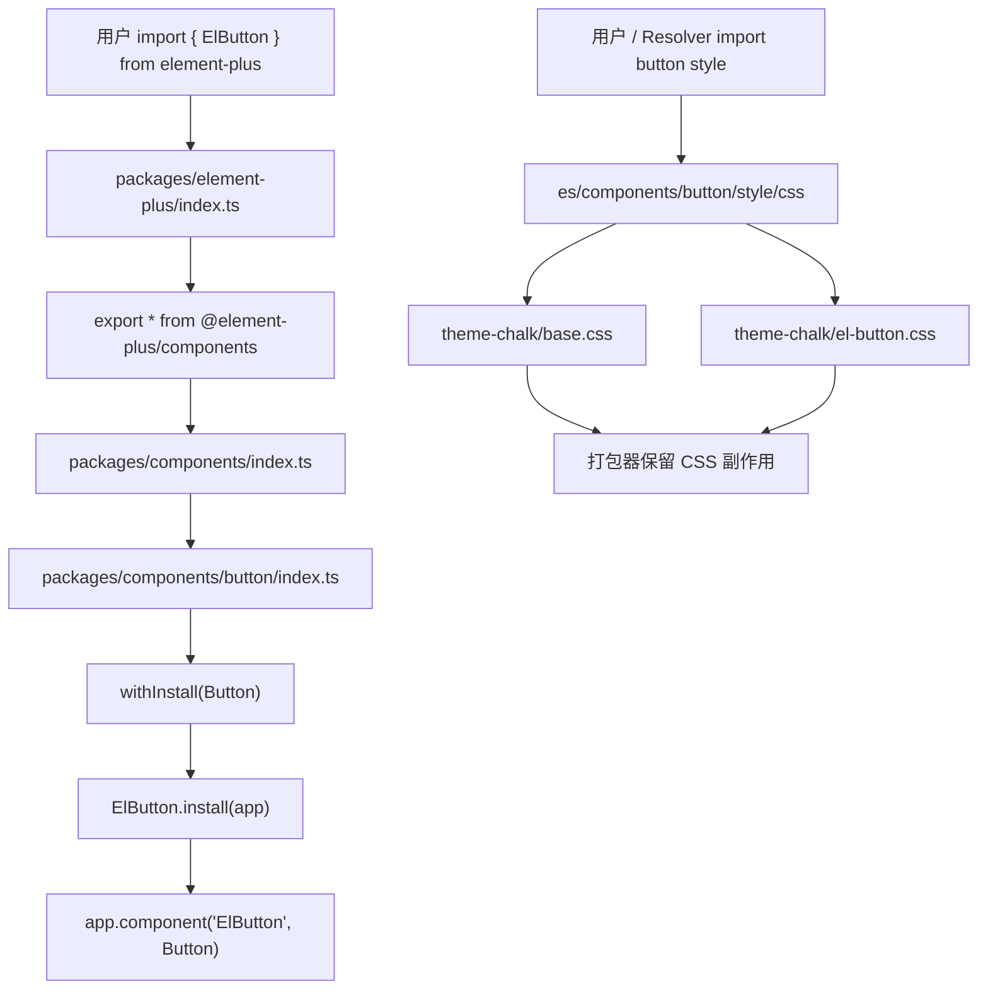
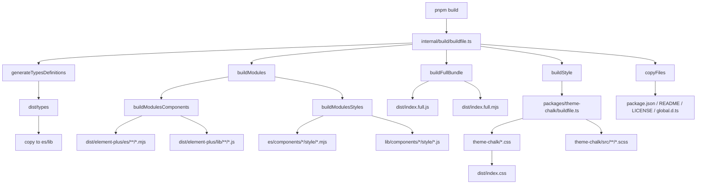
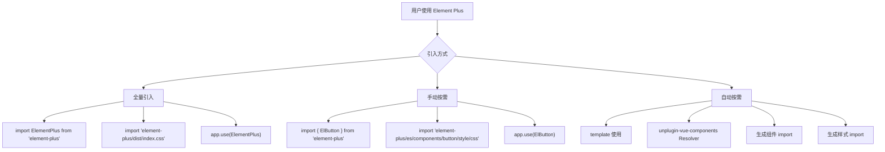

# Element Plus 按需引入和构建机制源码分析

> 源码位置：`element-plus-dev`
>
> 核心入口：`packages/element-plus/index.ts`
>
> 构建入口：`internal/build/buildfile.ts`
>
> 样式构建入口：`packages/theme-chalk/buildfile.ts`
>
> 核心关键词：按需引入、Tree Shaking、sideEffects、preserveModules、样式副作用、ESM/CJS、全量 bundle、theme-chalk、unplugin-vue-components。

Element Plus 的按需引入不是某一个文件完成的，而是一整套“源码组织 + 构建产物 + package.json 声明 + 样式入口 + 外部自动导入插件”共同配合的结果。

一句话概括：

```text
Element Plus 通过 ESM 命名导出、组件级 style 入口、sideEffects 白名单和 preserveModules 构建产物，让用户既能全量 app.use(ElementPlus)，也能只 import 某个组件及其样式。
```

## 1. 学习目标

这部分源码适合学习这些设计思想：

| 学习点 | 说明 |
| --- | --- |
| 组件库发布结构 | 一个源码仓库如何输出 `es`、`lib`、`dist`、`theme-chalk` 多种产物 |
| 按需引入设计 | 为什么组件要独立入口，样式也要独立入口 |
| Tree Shaking | 如何让打包器只保留用户实际用到的组件代码 |
| 副作用声明 | 为什么样式入口必须出现在 `sideEffects` 中 |
| 全量安装和按需安装共存 | `ElementPlus` 默认插件与 `ElButton` 单组件插件如何同时支持 |
| 样式自动引入 | `style/index.ts` 和 `style/css.ts` 为什么分成两套 |
| 构建拆分 | 为什么源码构建和样式构建分开做 |
| 发布包设计 | `exports`、`main`、`module`、`types`、`style` 如何服务不同使用方式 |
| 构建工具插件 | alias 插件如何把源码内部路径改成发布包路径 |

最关键的是理解三条链路：

```text
JS 链路：packages/components/button/index.ts -> packages/element-plus/index.ts -> dist/element-plus/es
样式链路：components/button/style/css.ts -> theme-chalk/el-button.css -> sideEffects 保留
构建链路：internal/build/buildfile.ts -> es/lib/dist/theme-chalk/package.json/types
```

## 2. 文件结构

与按需引入和构建机制相关的核心文件：

```text
element-plus-dev
├── package.json
├── tsconfig.base.json
├── play
│   └── vite.config.mts
├── packages
│   ├── element-plus
│   │   ├── index.ts
│   │   ├── defaults.ts
│   │   ├── component.ts
│   │   ├── plugin.ts
│   │   ├── make-installer.ts
│   │   └── package.json
│   ├── components
│   │   ├── index.ts
│   │   ├── button
│   │   │   ├── index.ts
│   │   │   └── style
│   │   │       ├── index.ts
│   │   │       └── css.ts
│   │   ├── table
│   │   │   ├── index.ts
│   │   │   └── style
│   │   │       ├── index.ts
│   │   │       └── css.ts
│   │   └── ...
│   ├── theme-chalk
│   │   ├── buildfile.ts
│   │   ├── package.json
│   │   └── src
│   │       ├── index.scss
│   │       ├── base.scss
│   │       ├── button.scss
│   │       └── ...
│   ├── utils
│   │   └── vue
│   │       ├── install.ts
│   │       └── typescript.ts
│   ├── hooks
│   ├── constants
│   ├── directives
│   └── locale
├── internal
│   ├── build
│   │   ├── buildfile.ts
│   │   └── src
│   │       ├── build-info.ts
│   │       ├── tasks
│   │       │   ├── full-bundle.ts
│   │       │   ├── modules.ts
│   │       │   ├── types-definitions.ts
│   │       │   └── helper.ts
│   │       ├── plugins
│   │       │   ├── element-plus-alias.ts
│   │       │   └── supply-validator.ts
│   │       └── utils
│   │           └── rolldown.ts
│   └── build-utils
│       └── src
│           ├── paths.ts
│           └── pkg.ts
└── scripts
    └── gc.sh
```

## 3. 入口链路

### 3.1 发布包入口

`packages/element-plus/index.ts` 是最终用户从 `element-plus` 包 import 时的总入口：

```ts
import installer from './defaults'

export * from '@element-plus/components'
export * from '@element-plus/constants'
export * from '@element-plus/directives'
export * from '@element-plus/hooks'
export * from './make-installer'

export const install = installer.install
export const version = installer.version
export default installer

export { default as dayjs } from 'dayjs'
```

它做了三件事：

| 动作 | 作用 |
| --- | --- |
| `export * from '@element-plus/components'` | 暴露 `ElButton`、`ElTable` 等命名导出，支持按需 import |
| `export default installer` | 暴露全量插件，支持 `app.use(ElementPlus)` |
| `export const install = installer.install` | 让包本身也符合 Vue 插件约定 |

所以用户可以同时这样用：

```ts
// 全量
import ElementPlus from 'element-plus'
app.use(ElementPlus)

// 按需
import { ElButton } from 'element-plus'
app.use(ElButton)
```

### 3.2 全量安装入口

`packages/element-plus/defaults.ts`：

```ts
import { makeInstaller } from './make-installer'
import Components from './component'
import Plugins from './plugin'

export default makeInstaller([...Components, ...Plugins])
```

`component.ts` 手动列出所有组件：

```ts
import { ElButton, ElButtonGroup } from '@element-plus/components/button'
import { ElTable, ElTableColumn } from '@element-plus/components/table'
// ...

export default [
  ElButton,
  ElButtonGroup,
  ElTable,
  ElTableColumn,
  // ...
] as Plugin[]
```

`plugin.ts` 手动列出函数式服务、指令、服务类插件：

```ts
import { ElLoading } from '@element-plus/components/loading'
import { ElMessage } from '@element-plus/components/message'
import { ElNotification } from '@element-plus/components/notification'

export default [
  ElLoading,
  ElMessage,
  ElNotification,
] as Plugin[]
```

全量安装的本质是：

```text
ElementPlus.install(app)
  -> 遍历 Components + Plugins
  -> app.use(ElButton)
  -> app.use(ElTable)
  -> app.use(ElMessage)
  -> ...
```

### 3.3 单组件入口

以 Button 为例，`packages/components/button/index.ts`：

```ts
import { withInstall, withNoopInstall } from '@element-plus/utils'
import Button from './src/button.vue'
import ButtonGroup from './src/button-group.vue'

export const ElButton = withInstall(Button, {
  ButtonGroup,
})

export const ElButtonGroup = withNoopInstall(ButtonGroup)
export default ElButton
```

这里有两个关键点：

| 设计 | 作用 |
| --- | --- |
| `ElButton` 是命名导出 | 支持 `import { ElButton } from 'element-plus'` |
| `withInstall(Button)` 给组件挂 `install` | 支持 `app.use(ElButton)` |

`ButtonGroup` 是 Button 的附属组件，所以挂在 `ElButton.ButtonGroup` 上，并在 `ElButton.install` 时一起注册。

## 4. package.json 如何服务按需引入

### 4.1 `main` / `module` / `types`

`packages/element-plus/package.json`：

```json
{
  "main": "lib/index.js",
  "module": "es/index.mjs",
  "types": "es/index.d.ts"
}
```

含义：

| 字段 | 作用 |
| --- | --- |
| `main` | CommonJS 用户或旧工具默认读取 `lib/index.js` |
| `module` | ESM 工具读取 `es/index.mjs`，更利于 tree-shaking |
| `types` | TypeScript 类型入口 |

### 4.2 `exports`

`exports` 声明了不同子路径怎么解析：

```json
{
  ".": {
    "types": "./es/index.d.ts",
    "import": "./es/index.mjs",
    "require": "./lib/index.js"
  },
  "./es/*": {
    "types": [
      "./es/*.d.ts",
      "./es/*/index.d.ts"
    ],
    "import": "./es/*.mjs"
  },
  "./lib/*": {
    "types": [
      "./lib/*.d.ts",
      "./lib/*/index.d.ts"
    ],
    "require": "./lib/*.js"
  },
  "./*": "./*"
}
```

它支持这些访问方式：

```ts
import { ElButton } from 'element-plus'
import { ElButton } from 'element-plus/es'
import 'element-plus/es/components/button/style/css'
import 'element-plus/theme-chalk/el-button.css'
```

`"./*": "./*"` 是兜底出口，让 `theme-chalk`、`dist`、局部文件等发布包子路径能够被访问。

### 4.3 `style`

```json
{
  "style": "dist/index.css"
}
```

这个字段指向全量 CSS：

```ts
import 'element-plus/dist/index.css'
```

它对应构建脚本中的 `copyFullStyle()`：

```ts
copyFile(
  path.resolve(epOutput, 'theme-chalk/index.css'),
  path.resolve(epOutput, 'dist/index.css')
)
```

也就是说：

```text
theme-chalk/index.css -> dist/index.css
```

全量使用时，通常会配合：

```ts
import ElementPlus from 'element-plus'
import 'element-plus/dist/index.css'

app.use(ElementPlus)
```

### 4.4 `sideEffects`

`packages/element-plus/package.json`：

```json
{
  "sideEffects": [
    "dist/*",
    "theme-chalk/**/*.css",
    "theme-chalk/src/**/*.scss",
    "es/components/*/style/*",
    "lib/components/*/style/*"
  ]
}
```

这是按需样式能工作的关键。

打包器做 tree-shaking 时，会删除“看起来没有返回值、没有被使用”的模块。样式入口通常长这样：

```ts
import '@element-plus/theme-chalk/el-button.css'
```

这种模块没有 JS 导出，但它有副作用：把 CSS 注入或打进最终产物。如果没有 `sideEffects` 白名单，打包器可能把它当成无用代码删掉。

因此 Element Plus 明确告诉打包器：

```text
这些路径虽然没有导出值，但是不能删，因为它们会产生样式副作用。
```

## 5. 按需样式入口

每个组件通常有两套样式入口：

```text
packages/components/button/style
├── index.ts
└── css.ts
```

### 5.1 `style/index.ts`

Button 的 SCSS 入口：

```ts
import '@element-plus/components/base/style'
import '@element-plus/theme-chalk/src/button.scss'
```

它导入源码级 SCSS，适合需要 Sass 变量定制的场景。

```text
importStyle: 'sass'
  -> element-plus/es/components/button/style/index
  -> @element-plus/theme-chalk/src/button.scss
```

### 5.2 `style/css.ts`

Button 的 CSS 入口：

```ts
import '@element-plus/components/base/style/css'
import '@element-plus/theme-chalk/el-button.css'
```

它导入已经编译好的 CSS，适合多数业务项目，构建更直接。

```text
importStyle: 'css'
  -> element-plus/es/components/button/style/css
  -> element-plus/theme-chalk/el-button.css
```

### 5.3 为什么样式入口也要记录依赖

复杂组件的样式不只依赖自己的 CSS。

Table 的样式入口：

```ts
import '@element-plus/components/base/style'
import '@element-plus/theme-chalk/src/table.scss'
import '@element-plus/components/checkbox/style'
import '@element-plus/components/tooltip/style'
import '@element-plus/components/scrollbar/style'
```

Table 内部会渲染 Checkbox、Tooltip、Scrollbar 等组件，所以只引入 `el-table.css` 不够。Element Plus 把这些样式依赖写在 Table 的 style 入口里。

按需导入 Table 样式时，会连带导入：

```text
base
table
checkbox
tooltip
scrollbar
```

这就是为什么样式入口不能只看组件自己的 `.scss` 文件，而要表达组件渲染依赖。

### 5.4 `base/style` 的意义

`packages/components/base/style/css.ts`：

```ts
import '@element-plus/theme-chalk/base.css'
```

`base.css` 包含基础变量、reset、过渡、弹层等全局样式。几乎所有组件样式入口都会先导入它。

## 6. 自动按需引入

Element Plus 源码仓库本身没有实现 `ElementPlusResolver`，它来自外部包 `unplugin-vue-components/resolvers`。但 Element Plus 的 `play/vite.config.mts` 展示了官方开发环境如何使用它：

```ts
import Components from 'unplugin-vue-components/vite'
import { ElementPlusResolver } from 'unplugin-vue-components/resolvers'

Components({
  resolvers: ElementPlusResolver({
    version: '2.0.0-dev.1',
    importStyle: 'sass',
  }),
})
```

从 Element Plus 这边看，它需要为自动按需引入提供稳定的目标路径：

| Resolver 需要生成的内容 | Element Plus 提供的路径 |
| --- | --- |
| 组件 JS import | `element-plus/es` 或 `element-plus/es/components/button` |
| CSS 样式 import | `element-plus/es/components/button/style/css` |
| SCSS 样式 import | `element-plus/es/components/button/style` |
| 全量 CSS 路径 | `element-plus/dist/index.css` |
| theme-chalk 文件 | `element-plus/theme-chalk/el-button.css` |

因此自动按需引入大概会把模板：

```vue
<template>
  <el-button>OK</el-button>
</template>
```

转换成类似：

```ts
import { ElButton } from 'element-plus'
import 'element-plus/es/components/button/style/css'
```

如果配置 `importStyle: 'sass'`，则样式入口变成：

```ts
import 'element-plus/es/components/button/style'
```

注意：上面的转换代码是基于 resolver 工作方式的说明性伪代码；具体生成路径由外部 `unplugin-vue-components` 实现决定。Element Plus 源码主要负责让这些路径存在并可被构建工具解析。

## 7. 构建总流程

构建入口是根 `package.json`：

```json
{
  "scripts": {
    "build": "pnpm run -C internal/build start",
    "build:theme": "pnpm run -C packages/theme-chalk build"
  }
}
```

`internal/build/buildfile.ts` 是主构建脚本：

```ts
async function build() {
  await makeOutput()
  buildHelper()
  await Promise.all([
    execCommand(generateTypesDefinitions),
    execCommand(buildModules),
    execCommand(buildFullBundle),
    execCommand(buildStyle),
    execCommand(copyFiles),
  ])
  await execCommand(copyTypesDefinitions)
  await execCommand(cleanupTypesDefinitions)
}
```

构建过程可以拆成六类任务：

| 任务 | 函数 | 产物 |
| --- | --- | --- |
| 清理并创建输出目录 | `makeOutput()` | `dist/element-plus` |
| 生成辅助元信息 | `buildHelper()` | `tags.json`、`web-types.json` 等 |
| 生成类型声明 | `generateTypesDefinitions()` | 临时 `dist/types` |
| 构建模块产物 | `buildModules()` | `dist/element-plus/es`、`dist/element-plus/lib` |
| 构建全量 bundle | `buildFullBundle()` | `dist/element-plus/dist/index.full.*` |
| 构建样式 | `buildStyle()` | `dist/element-plus/theme-chalk`、`dist/index.css` |
| 复制包文件 | `copyFiles()` | `package.json`、`README.md`、`LICENSE` 等 |

最终发布目录大概是：

```text
dist/element-plus
├── package.json
├── README.md
├── LICENSE
├── global.d.ts
├── es
│   ├── index.mjs
│   ├── index.d.ts
│   └── components
│       └── button
│           ├── index.mjs
│           ├── index.d.ts
│           └── style
│               ├── index.mjs
│               └── css.mjs
├── lib
│   ├── index.js
│   └── components
│       └── button
│           └── style
│               ├── index.js
│               └── css.js
├── dist
│   ├── index.css
│   ├── index.full.js
│   ├── index.full.min.js
│   ├── index.full.mjs
│   └── index.full.min.mjs
└── theme-chalk
    ├── index.css
    ├── base.css
    ├── el-button.css
    ├── dark
    │   └── css-vars.css
    └── src
        ├── button.scss
        └── ...
```

## 8. 模块构建机制

### 8.1 构建目标

`internal/build/src/build-info.ts` 定义两个模块产物：

```ts
export const buildConfig = {
  esm: {
    format: 'esm',
    ext: 'mjs',
    output: {
      name: 'es',
      path: path.resolve(epOutput, 'es'),
    },
  },
  cjs: {
    format: 'cjs',
    ext: 'js',
    output: {
      name: 'lib',
      path: path.resolve(epOutput, 'lib'),
    },
  },
}
```

也就是说，同一份源码会输出两套模块：

```text
ESM -> dist/element-plus/es/**/*.mjs
CJS -> dist/element-plus/lib/**/*.js
```

### 8.2 组件 JS 构建

`internal/build/src/tasks/modules.ts` 中的 `buildModulesComponents()`：

```ts
const input = excludeFiles(
  await glob(['**/*.{js,ts,vue}', '!**/style/(index|css).{js,ts,vue}'], {
    cwd: pkgRoot,
    absolute: true,
    onlyFiles: true,
  })
)
```

它扫描 `packages` 下所有 JS/TS/Vue 文件，但排除样式入口：

```text
packages/**/*.ts
packages/**/*.vue
排除 packages/**/style/index.ts
排除 packages/**/style/css.ts
```

然后使用 `preserveModules` 输出：

```ts
{
  preserveModules: true,
  preserveModulesRoot: epRoot,
  entryFileNames: `[name].${config.ext}`,
}
```

`preserveModules` 的意义是保留源码模块边界。这样构建后仍然存在：

```text
es/components/button/index.mjs
es/components/table/index.mjs
es/components/dialog/index.mjs
```

如果不保留模块边界，所有组件可能被打进一个大文件，用户按需 import 的收益会下降。

### 8.3 样式入口单独构建

`buildModulesStyles()` 专门处理样式入口：

```ts
const input = excludeFiles(
  await glob('**/style/(index|css).{js,ts,vue}', {
    cwd: pkgRoot,
    absolute: true,
    onlyFiles: true,
  })
)
```

这里没有排除 style 文件，而是只构建 style 文件。

关键配置：

```ts
const bundle = await rolldown({
  input,
  plugins,
  treeshake: false,
})
```

样式入口要保持副作用导入，因此这里 `treeshake: false`。

这会输出：

```text
es/components/button/style/index.mjs
es/components/button/style/css.mjs
lib/components/button/style/index.js
lib/components/button/style/css.js
```

### 8.4 外部依赖处理

`generateExternal({ full: false })`：

```ts
const packages = [...peerDependencies]
if (!options.full) {
  packages.push('@vue', ...dependencies)
}
```

模块构建时，Vue、@vue、依赖包都作为 external，不会被打进组件模块里。

这样按需 import `ElButton` 时，不会把 `vue`、`dayjs`、`lodash` 等重复打进去，而是由用户项目自己的依赖解析。

### 8.5 源码路径到发布路径的 alias

源码样式入口写的是：

```ts
import '@element-plus/theme-chalk/src/button.scss'
```

但发布包中，用户应该访问：

```ts
import 'element-plus/theme-chalk/src/button.scss'
```

`ElementPlusAlias()` 负责在构建时改写路径：

```ts
handler(id) {
  return {
    id: id.replaceAll('@element-plus/theme-chalk', 'element-plus/theme-chalk'),
    external: 'absolute',
  }
}
```

这一步很重要。它让源码内部的 workspace 包名在发布产物中变成用户可安装包名。

## 9. 全量 bundle 构建机制

`internal/build/src/tasks/full-bundle.ts` 负责构建浏览器全量包：

```ts
const bundle = await rolldown({
  input: path.resolve(epRoot, 'index.ts'),
  external: generateExternal({ full: true }),
  treeshake: true,
})
```

输出两种格式：

```ts
{
  format: 'umd',
  file: 'dist/index.full.js',
  name: 'ElementPlus',
}

{
  format: 'esm',
  file: 'dist/index.full.mjs',
}
```

同时还会输出 minified 版本：

```text
index.full.js
index.full.min.js
index.full.mjs
index.full.min.mjs
```

`generateExternal({ full: true })` 只把 peerDependencies 外置，主要是 Vue：

```text
full bundle 内含 Element Plus 自身依赖，但不打入 Vue。
```

这适合 CDN 场景：

```html
<script src="https://unpkg.com/vue"></script>
<script src="https://unpkg.com/element-plus/dist/index.full.js"></script>
```

## 10. 样式构建机制

样式构建入口：`packages/theme-chalk/buildfile.ts`。

### 10.1 构建组件 CSS

```ts
const scssFiles = await glob('src/*.scss', {
  cwd: __dirname,
  absolute: true,
})
```

它只扫描 `src/*.scss`，例如：

```text
src/index.scss
src/base.scss
src/button.scss
src/table.scss
```

每个 SCSS 会经过：

```text
sass-embedded compileAsync
  -> lightningcss transform minify
  -> 写入 dist
```

输出命名规则：

```ts
const noElPrefixFile = /(index|base|display)/

const outputName = noElPrefixFile.test(baseName)
  ? `${baseName}.css`
  : `el-${baseName}.css`
```

所以：

```text
index.scss  -> index.css
base.scss   -> base.css
display.scss -> display.css
button.scss -> el-button.css
table.scss  -> el-table.css
```

### 10.2 构建暗色变量

```ts
const darkFile = path.resolve(__dirname, 'src/dark/css-vars.scss')
```

输出：

```text
theme-chalk/dark/css-vars.css
```

用户可以这样启用暗色变量：

```ts
import 'element-plus/theme-chalk/dark/css-vars.css'
```

### 10.3 复制 SCSS 源码

```ts
const destDir = path.resolve(distBundle, 'src')
```

构建时会把 `packages/theme-chalk/src` 复制到发布包：

```text
dist/element-plus/theme-chalk/src/**/*.scss
```

这就是为什么 `style/index.ts` 可以在发布包里继续引用：

```ts
import 'element-plus/theme-chalk/src/button.scss'
```

如果不复制 SCSS 源码，`importStyle: 'sass'` 就无法工作。

### 10.4 复制样式产物到发布包

```ts
const distBundle = path.resolve(epOutput, 'theme-chalk')
```

`copyThemeChalkBundle()` 把 `packages/theme-chalk/dist` 复制到：

```text
dist/element-plus/theme-chalk
```

主构建脚本随后又复制：

```text
theme-chalk/index.css -> dist/index.css
```

最终形成两种入口：

```text
element-plus/theme-chalk/index.css
element-plus/dist/index.css
```

## 11. 类型声明构建

`types-definitions.ts` 使用 `rolldown-plugin-dts`：

```ts
const input = excludeFiles(
  await glob(['**/*.{ts,tsx,vue}', '!**/style/*.ts'], {
    cwd: pkgRoot,
    absolute: true,
    onlyFiles: true,
  })
)
```

它会排除样式入口：

```text
!**/style/*.ts
```

原因是样式入口只是副作用 import，不需要生成对外类型声明。

生成的类型先输出到：

```text
dist/types
```

然后 `copyTypesDefinitions()` 把类型复制到：

```text
dist/element-plus/es
dist/element-plus/lib
```

所以用户不管从 `element-plus`、`element-plus/es` 还是 `element-plus/lib` 引入，都能拿到类型。

## 12. 一个组件从源码到按需使用

以 `ElButton` 为例。

### 12.1 源码阶段

```text
packages/components/button/src/button.vue
  -> packages/components/button/index.ts
  -> withInstall(Button)
  -> export const ElButton
```

### 12.2 总入口阶段

```text
packages/components/index.ts
  -> export * from './button'

packages/element-plus/index.ts
  -> export * from '@element-plus/components'
```

因此源码层支持：

```ts
import { ElButton } from 'element-plus'
```

### 12.3 构建阶段

`buildModulesComponents()` 保留模块输出：

```text
packages/components/button/index.ts
  -> dist/element-plus/es/components/button/index.mjs
  -> dist/element-plus/lib/components/button/index.js
```

`generateTypesDefinitions()` 输出类型：

```text
dist/element-plus/es/components/button/index.d.ts
dist/element-plus/lib/components/button/index.d.ts
```

### 12.4 样式阶段

源码样式入口：

```text
packages/components/button/style/css.ts
  -> import '@element-plus/components/base/style/css'
  -> import '@element-plus/theme-chalk/el-button.css'
```

构建后：

```text
dist/element-plus/es/components/button/style/css.mjs
  -> import 'element-plus/theme-chalk/base.css'
  -> import 'element-plus/theme-chalk/el-button.css'
```

### 12.5 用户项目阶段

手动按需：

```ts
import { ElButton } from 'element-plus'
import 'element-plus/es/components/button/style/css'

app.use(ElButton)
```

自动按需：

```vue
<el-button>OK</el-button>
```

构建插件识别 `el-button` 后生成组件和样式 import：

```ts
import { ElButton } from 'element-plus'
import 'element-plus/es/components/button/style/css'
```

打包器最终只会保留 Button 相关 JS 和 CSS 依赖。

## 13. 为什么按需引入能减少体积

按需引入能生效，依赖四个条件：

| 条件 | Element Plus 的实现 |
| --- | --- |
| 组件必须是命名导出 | `packages/components/index.ts` 和 `packages/element-plus/index.ts` 统一 re-export |
| 构建产物必须保留模块边界 | `preserveModules: true` |
| 包入口必须指向 ESM | `module: "es/index.mjs"` |
| 样式副作用不能被删 | `sideEffects` 保留 style 路径 |

如果用户只写：

```ts
import { ElButton } from 'element-plus'
```

理论上打包器可以从 ESM 静态导出中分析出只使用了 `ElButton`，然后删除其它未使用组件。

但样式不会自动出现，所以还需要：

```ts
import 'element-plus/es/components/button/style/css'
```

或者使用自动导入插件帮你补这一句。

## 14. 为什么要分 `style` 和 `style/css`

两套入口面向不同用户：

| 入口 | 导入内容 | 适合场景 |
| --- | --- | --- |
| `style/index.ts` | `theme-chalk/src/*.scss` | 需要 Sass 变量覆盖、主题编译定制 |
| `style/css.ts` | `theme-chalk/*.css` | 直接使用官方编译好的 CSS |

例子：

```ts
// SCSS 入口
import 'element-plus/es/components/button/style'

// CSS 入口
import 'element-plus/es/components/button/style/css'
```

SCSS 入口的好处是主题定制能力强，坏处是用户项目必须能处理 Sass。

CSS 入口的好处是稳定直接，坏处是只能通过 CSS 变量或覆盖样式做运行时主题调整。

## 15. 为什么组件 install 和按需构建有关

按需引入不是只为了打包体积，还要让单组件可以独立安装：

```ts
import { ElButton } from 'element-plus'

app.use(ElButton)
```

这要求 `ElButton` 本身就是一个 Vue 插件。

`withInstall()` 做的事：

```ts
;(main as SFCWithInstall<T>).install = (app): void => {
  for (const comp of [main, ...Object.values(extra ?? {})]) {
    app.component(comp.name, comp)
  }
}
```

所以：

```text
ElButton 是组件对象
ElButton.install 是插件安装函数
app.use(ElButton) 调用 ElButton.install(app)
ElButton.install 内部调用 app.component('ElButton', Button)
```

这让一个对象同时具备两种身份：

```text
模板局部组件：components: { ElButton }
Vue 插件：app.use(ElButton)
```

## 16. 核心源码解释

### 16.1 `makeInstaller`

```ts
export const makeInstaller = (components: Plugin[] = []) => {
  const install = (app: App, options?: ConfigProviderContext) => {
    if (app[INSTALLED_KEY]) return

    app[INSTALLED_KEY] = true
    components.forEach((c) => app.use(c))

    if (options) provideGlobalConfig(options, app, true)
  }

  return {
    version,
    install,
  }
}
```

逐步理解：

```text
makeInstaller([...组件和插件])
  -> 返回 { version, install }
  -> install(app)
  -> 防止重复安装
  -> 遍历所有插件
  -> app.use(每一个组件/服务/指令)
  -> 注入全局配置
```

它是全量安装的核心。

### 16.2 `buildModulesComponents`

```ts
await glob(['**/*.{js,ts,vue}', '!**/style/(index|css).{js,ts,vue}'])
```

组件代码和样式入口分开构建。原因是组件代码希望 tree-shaking，样式入口希望保留副作用。

```ts
treeshake: { moduleSideEffects: false }
```

组件模块默认没有副作用，更利于删除未使用代码。

```ts
preserveModules: true
```

保留模块结构，让用户能按组件路径引入。

### 16.3 `buildModulesStyles`

```ts
await glob('**/style/(index|css).{js,ts,vue}')
```

只处理样式入口。

```ts
treeshake: false
```

样式入口的 import 是副作用，不能被 tree-shaking 删除。

### 16.4 `sideEffects`

```json
[
  "theme-chalk/**/*.css",
  "theme-chalk/src/**/*.scss",
  "es/components/*/style/*",
  "lib/components/*/style/*"
]
```

它和 `buildModulesStyles()` 是一组配套设计：

```text
buildModulesStyles 负责生成 style 入口文件
sideEffects 负责告诉用户打包器这些入口不能删
```

### 16.5 `ElementPlusAlias`

```ts
id.replaceAll('@element-plus/theme-chalk', 'element-plus/theme-chalk')
```

源码中使用 workspace 包名，发布后使用真实 npm 包名。这是 monorepo 组件库常见处理。

## 17. 核心调用链图



## 18. 构建产物链路图



## 19. 按需引入决策图



## 20. 文件职责表

| 文件 | 职责 |
| --- | --- |
| `packages/element-plus/index.ts` | 发布包总入口，暴露默认安装器和全部命名导出 |
| `packages/element-plus/defaults.ts` | 把组件列表和插件列表交给 `makeInstaller` |
| `packages/element-plus/component.ts` | 全量安装组件清单 |
| `packages/element-plus/plugin.ts` | 全量安装服务/指令插件清单 |
| `packages/element-plus/make-installer.ts` | 创建全量 Vue 插件安装器 |
| `packages/element-plus/package.json` | 声明发布入口、exports、style、sideEffects、依赖 |
| `packages/components/index.ts` | re-export 所有组件和插件 |
| `packages/components/*/index.ts` | 单组件入口，通常通过 `withInstall` 导出 `ElXxx` |
| `packages/components/*/style/index.ts` | 单组件 SCSS 样式入口 |
| `packages/components/*/style/css.ts` | 单组件 CSS 样式入口 |
| `packages/components/base/style/*` | 基础样式入口 |
| `packages/utils/vue/install.ts` | `withInstall`、`withNoopInstall`、`withInstallFunction`、`withInstallDirective` |
| `packages/theme-chalk/buildfile.ts` | 编译 SCSS、压缩 CSS、复制 CSS/SCSS 到发布包 |
| `internal/build/buildfile.ts` | 总构建编排 |
| `internal/build/src/build-info.ts` | 定义 ESM/CJS 输出配置 |
| `internal/build/src/tasks/modules.ts` | 构建模块化 JS 和样式入口 |
| `internal/build/src/tasks/full-bundle.ts` | 构建 CDN 全量 bundle |
| `internal/build/src/tasks/types-definitions.ts` | 生成 `.d.ts` 类型声明 |
| `internal/build/src/tasks/helper.ts` | 生成组件辅助元信息，如 web-types/tags |
| `internal/build/src/plugins/element-plus-alias.ts` | 构建时改写 theme-chalk 包路径 |
| `internal/build/src/utils/rolldown.ts` | external 规则、写 bundle、产物命名 |
| `internal/build-utils/src/paths.ts` | 定义仓库和构建路径 |
| `internal/build-utils/src/pkg.ts` | 读取 package、依赖、排除构建文件 |
| `play/vite.config.mts` | 展示开发环境中如何使用 `ElementPlusResolver` 自动按需引入 |
| `scripts/gc.sh` | 新组件脚手架，自动生成组件 style 入口 |

## 21. 简化版 MiniElementPlus 实现

下面用一个极简组件库模拟 Element Plus 的按需引入和构建设计。

### 21.1 目录结构

```text
mini-plus
├── package.json
├── src
│   ├── index.ts
│   ├── make-installer.ts
│   └── components
│       ├── index.ts
│       └── button
│           ├── index.ts
│           ├── Button.vue
│           └── style
│               ├── index.ts
│               └── css.ts
└── theme
    ├── button.scss
    └── el-button.css
```

### 21.2 `withInstall`

```ts
import type { App, Plugin } from 'vue'

export type SFCWithInstall<T> = T & Plugin

export function withInstall<T extends { name?: string }>(component: T) {
  ;(component as SFCWithInstall<T>).install = (app: App) => {
    if (!component.name) return
    app.component(component.name, component)
  }

  return component as SFCWithInstall<T>
}
```

### 21.3 单组件入口

```ts
// src/components/button/index.ts
import { withInstall } from '../../with-install'
import Button from './Button.vue'

export const MiniButton = withInstall(Button)
export default MiniButton
```

### 21.4 组件总出口

```ts
// src/components/index.ts
export * from './button'
```

### 21.5 全量安装器

```ts
// src/make-installer.ts
import type { App, Plugin } from 'vue'

export function makeInstaller(components: Plugin[]) {
  return {
    install(app: App) {
      components.forEach((component) => app.use(component))
    },
  }
}
```

```ts
// src/index.ts
import { makeInstaller } from './make-installer'
import { MiniButton } from './components'

export * from './components'

export default makeInstaller([MiniButton])
```

### 21.6 样式入口

```ts
// src/components/button/style/index.ts
import '../../../../theme/button.scss'
```

```ts
// src/components/button/style/css.ts
import '../../../../theme/el-button.css'
```

### 21.7 package.json

```json
{
  "name": "mini-plus",
  "main": "lib/index.js",
  "module": "es/index.mjs",
  "types": "es/index.d.ts",
  "exports": {
    ".": {
      "types": "./es/index.d.ts",
      "import": "./es/index.mjs",
      "require": "./lib/index.js"
    },
    "./es/*": {
      "types": "./es/*.d.ts",
      "import": "./es/*.mjs"
    },
    "./*": "./*"
  },
  "style": "dist/index.css",
  "sideEffects": [
    "dist/*",
    "theme/**/*.css",
    "theme/**/*.scss",
    "es/components/*/style/*",
    "lib/components/*/style/*"
  ],
  "peerDependencies": {
    "vue": "^3.3.0"
  }
}
```

### 21.8 用户使用

全量：

```ts
import MiniPlus from 'mini-plus'
import 'mini-plus/dist/index.css'

app.use(MiniPlus)
```

按需：

```ts
import { MiniButton } from 'mini-plus'
import 'mini-plus/es/components/button/style/css'

app.use(MiniButton)
```

这个 Mini 版本保留了 Element Plus 的核心思想：

```text
组件对象挂 install
总入口 re-export 命名组件
全量入口 makeInstaller
样式入口独立存在
sideEffects 保留样式副作用
ESM 产物支持 tree-shaking
```

## 22. 设计思想

### 22.1 源码层不直接等于发布层

Element Plus 源码使用 monorepo workspace 包名：

```ts
@element-plus/components
@element-plus/theme-chalk
```

发布后用户使用：

```ts
element-plus/es
element-plus/theme-chalk
```

中间靠构建脚本和 alias 插件完成转换。

### 22.2 组件 JS 和样式必须分开

组件 JS 希望被 tree-shaking：

```text
没用到的组件删掉
```

样式入口希望保留副作用：

```text
只要用户 import 了样式，就不能被删
```

所以构建脚本把两者拆开：

```text
buildModulesComponents -> treeshake
buildModulesStyles -> treeshake: false
```

### 22.3 按需引入不是“自动”的

Element Plus 提供的是可按需引入的包结构。

真正的自动扫描模板、自动生成 import，是外部构建插件做的，比如 `unplugin-vue-components`。

两者关系是：

```text
Element Plus：提供稳定路径和样式入口
Resolver：根据组件名生成这些路径的 import
```

### 22.4 组件样式入口记录真实依赖

Table 依赖 Checkbox、Tooltip、Scrollbar，它的 style 入口就显式导入这些依赖样式。

这种方式让样式依赖跟着组件走，而不是要求用户知道内部实现细节。

### 22.5 全量和按需使用同一套组件对象

全量安装不是另一套组件，仍然是调用每个 `ElXxx.install`：

```text
ElementPlus.install
  -> app.use(ElButton)
  -> ElButton.install
```

这保证全量和按需的注册逻辑一致。

## 23. 可借鉴点

| 场景 | 可借鉴设计 |
| --- | --- |
| 业务组件库 | 每个组件独立 `index.ts`，并挂 `install` |
| 需要按需样式 | 给每个组件提供 `style/index.ts` 和 `style/css.ts` |
| 需要主题定制 | 发布 CSS 产物时也发布 SCSS 源码 |
| 需要 tree-shaking | 输出 ESM，并使用 `preserveModules` 保留模块边界 |
| 需要防止样式丢失 | 在 `package.json` 中配置 `sideEffects` |
| 组件有内部依赖 | 在组件 style 入口中导入依赖组件样式 |
| 同时支持 CDN | 额外构建 `dist/index.full.js` 和全量 CSS |
| TypeScript 友好 | 类型声明和 JS 模块结构保持一致 |
| monorepo 发布 | 构建时把 workspace 内部路径转换为真实包路径 |

## 总结

Element Plus 的按需引入和构建机制可以压缩成一个模型：

```text
源码层：
  每个组件独立入口 + withInstall + 独立 style 入口

构建层：
  preserveModules 输出 es/lib + 单独构建 style 入口 + 编译 theme-chalk

发布层：
  package.json exports/module/types/style/sideEffects 描述如何被消费

使用层：
  用户手动 import，或由 Resolver 自动生成组件 import 和样式 import
```

它真正高明的地方不是“有一个按需插件”，而是整个包结构天然支持按需：组件、样式、类型、构建产物和 Vue 插件机制都被组织成可以独立消费的小单元。
