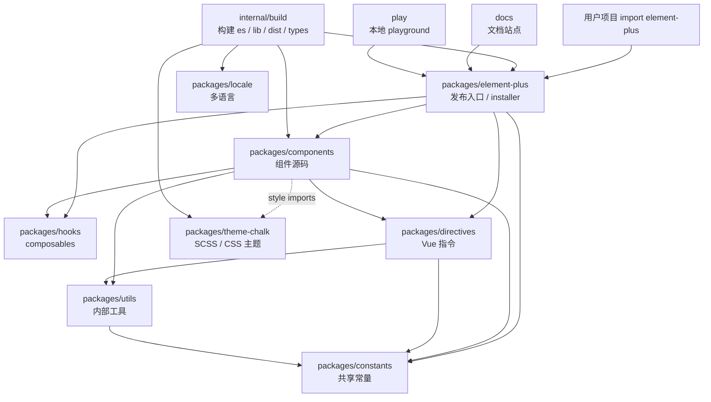

# Element Plus 源码整体项目结构分析

## 1. 项目类型

`element-plus-dev` 是一个 Vue 3 UI 组件库源码仓库。

直接证据：

- `element-plus-dev/README.md` 写明：`Element Plus - A Vue.js 3 UI library`。
- `packages/element-plus/package.json` 中 `description` 为 `A Component Library for Vue 3`。
- 根目录脚本包含 `build`、`docs:dev`、`docs:build`、`test`、`typecheck` 等典型组件库工程命令。

因此，这不是单应用项目，而是一个用于开发、构建、测试、文档发布和 npm 发布的 Vue 3 组件库 monorepo。

## 2. Monorepo 结构

该仓库使用 pnpm workspace 管理多个子包。

根目录 `package.json`：

```json
{
  "private": true,
  "packageManager": "pnpm@11.1.2",
  "workspaces": [
    "packages/*",
    "play",
    "docs"
  ]
}
```

`pnpm-workspace.yaml`：

```yaml
packages:
  - packages/*
  - docs
  - play
  - internal/*
```

整体结构可以理解为：

| 目录 | 作用 |
| --- | --- |
| `packages/` | 组件库源码包，包含组件、hooks、utils、主题、指令、常量、locale、最终发布入口等 |
| `internal/` | 内部构建工具、构建常量、metadata、eslint 配置等工程基础设施 |
| `docs/` | VitePress 文档站点 |
| `play/` | 本地开发 playground，用于调试组件 |
| `ssr-testing/` | SSR 测试用例 |
| `scripts/` | 版本、locale、生成器、发布等维护脚本 |
| `breakings/` | breaking change 记录 |
| `typings/` | 全局类型声明 |

核心结论：

- `packages/*` 是库源码主体。
- `packages/element-plus` 是最终对用户发布的 npm 包入口。
- `internal/build` 负责把源码构建成 `es`、`lib`、`dist`、类型声明和主题 CSS。
- `docs`、`play`、`ssr-testing` 是围绕组件库开发体验、文档和验证建立的辅助 workspace。

## 3. packages 目录模块总览

`packages` 下主要模块如下：

| 包 | 作用 |
| --- | --- |
| `components` | 所有组件源码和组件级入口 |
| `element-plus` | 最终 npm 发布包入口，聚合组件、hooks、directives、constants，并提供全量安装器 |
| `hooks` | Element Plus 内部复用的 Vue composables |
| `utils` | 内部工具函数，包括 DOM、Vue、对象、字符串、类型、安装包装等 |
| `theme-chalk` | 默认主题样式包，维护 SCSS 源码并构建 CSS |
| `constants` | 跨组件共享常量 |
| `directives` | Vue 指令集合 |
| `locale` | 国际化语言包 |
| `test-utils` | 测试辅助工具，私有包 |

## 4. 重点模块说明

### 4.1 packages/components

`packages/components` 是组件库源码的核心目录。

它的 `package.json` 描述为：

```json
{
  "name": "@element-plus/components",
  "description": "all components are settled here"
}
```

典型组件目录结构，以 Button 为例：

```text
packages/components/button/
├── index.ts
├── src/
│   ├── button.vue
│   ├── button.ts
│   ├── use-button.ts
│   ├── button-group.vue
│   └── ...
├── style/
│   ├── index.ts
│   └── css.ts
└── __tests__/
```

职责拆分：

- `src/*.vue`：组件 SFC 实现。
- `src/*.ts`：props、emits、类型、组合逻辑。
- `index.ts`：组件对外入口，通常用 `withInstall` 包装成可安装组件。
- `style/index.ts`：引入 SCSS 源码，供开发或按需 Sass 样式使用。
- `style/css.ts`：引入构建后的 CSS，供按需 CSS 样式使用。
- `__tests__`：组件测试。

以 `button/index.ts` 为例：

```ts
import { withInstall, withNoopInstall } from '@element-plus/utils'
import Button from './src/button.vue'
import ButtonGroup from './src/button-group.vue'

export const ElButton = withInstall(Button, {
  ButtonGroup,
})
export const ElButtonGroup = withNoopInstall(ButtonGroup)
export default ElButton
```

`packages/components/index.ts` 再统一导出所有组件：

```ts
export * from './affix'
export * from './alert'
export * from './button'
// ...
```

### 4.2 packages/element-plus

`packages/element-plus` 是最终发布给用户使用的主包。

其 `package.json` 定义：

```json
{
  "name": "element-plus",
  "main": "lib/index.js",
  "module": "es/index.mjs",
  "types": "es/index.d.ts",
  "style": "dist/index.css"
}
```

入口 `packages/element-plus/index.ts`：

```ts
import installer from './defaults'

export * from '@element-plus/components'
export * from '@element-plus/constants'
export * from '@element-plus/directives'
export * from '@element-plus/hooks'
export * from './make-installer'

export const install = installer.install
export const version = installer.version
export default installer
```

它主要做三件事：

1. 聚合导出组件、常量、指令、hooks。
2. 提供默认 installer，让用户可以 `app.use(ElementPlus)`。
3. 通过 `package.json` exports 映射对外暴露 ESM、CJS、类型声明、样式资源等构建产物。

`defaults.ts` 把组件和插件合并为全量安装器：

```ts
import { makeInstaller } from './make-installer'
import Components from './component'
import Plugins from './plugin'

export default makeInstaller([...Components, ...Plugins])
```

`make-installer.ts` 中的 `install` 会遍历所有组件或插件：

```ts
components.forEach((c) => app.use(c))
```

### 4.3 packages/hooks

`packages/hooks` 是 Element Plus 内部 composables 集合。

`package.json` 描述为：

```json
{
  "name": "@element-plus/hooks",
  "description": "Element Plus composables"
}
```

入口 `packages/hooks/index.ts` 导出大量组合式函数：

```ts
export * from './use-attrs'
export * from './use-locale'
export * from './use-namespace'
export * from './use-z-index'
export * from './use-floating'
export * from './use-size'
// ...
```

典型用途：

- `useNamespace`：统一生成 BEM class name。
- `useSize` / `useSizeProp`：统一处理组件尺寸。
- `useLocale`：国际化。
- `useZIndex`：弹层 z-index 管理。
- `usePopper` / `useFloating`：浮层定位相关逻辑。
- `useModelToggle`：弹窗、抽屉等显隐模型复用。

例如 Button 组件中使用：

```ts
import { useNamespace } from '@element-plus/hooks'
```

### 4.4 packages/utils

`packages/utils` 是内部工具函数包。

入口文件开头明确标注：

```ts
// Internal code, don't use in your app!
```

它导出：

```ts
export * from './dom'
export * from './vue'
export * from './arrays'
export * from './browser'
export * from './error'
export * from './functions'
export * from './i18n'
export * from './objects'
export * from './strings'
export * from './typescript'
```

其中非常关键的是 Vue 安装工具 `withInstall`：

```ts
export const withInstall = <T, E extends Record<string, any>>(
  main: T,
  extra?: E
) => {
  ;(main as SFCWithInstall<T>).install = (app): void => {
    for (const comp of [main, ...Object.values(extra ?? {})]) {
      app.component(comp.name, comp)
    }
  }

  return main as SFCWithInstall<T> & E
}
```

这使得单个组件既能被命名导入，也能被 `app.use(ElButton)` 安装。

### 4.5 packages/theme-chalk

`packages/theme-chalk` 是默认样式主题包。

其 `package.json` 描述为：

```json
{
  "name": "@element-plus/theme-chalk",
  "description": "Element component chalk theme.",
  "main": "index.css",
  "style": "index.css"
}
```

核心源码目录：

```text
packages/theme-chalk/src/
├── index.scss
├── base.scss
├── button.scss
├── input.scss
├── dialog.scss
├── common/
├── dark/
├── mixins/
└── ...
```

`src/index.scss` 汇总所有组件样式：

```scss
@use './base.scss';
@use './button.scss';
@use './input.scss';
@use './dialog.scss';
// ...
```

组件按需样式入口示例：

```ts
// packages/components/button/style/index.ts
import '@element-plus/components/base/style'
import '@element-plus/theme-chalk/src/button.scss'
```

```ts
// packages/components/button/style/css.ts
import '@element-plus/components/base/style/css'
import '@element-plus/theme-chalk/el-button.css'
```

构建脚本 `packages/theme-chalk/buildfile.ts` 会：

1. 扫描 `src/*.scss`。
2. 使用 `sass-embedded` 编译 SCSS。
3. 使用 `lightningcss` 压缩 CSS。
4. 输出 `el-组件名.css`。
5. 复制源码和构建结果到最终发布包的 `theme-chalk` 目录。

### 4.6 packages/constants

`packages/constants` 是共享常量包。

入口：

```ts
export * from './aria'
export * from './date'
export * from './event'
export * from './key'
export * from './size'
export * from './column-alignment'
export * from './form'
```

它通常不包含复杂逻辑，只维护跨组件共用的稳定枚举、常量和类型。

典型使用方：

- `components`
- `utils`
- `directives`
- `element-plus/make-installer`

例如 `make-installer.ts` 使用 `INSTALLED_KEY` 避免重复安装。

### 4.7 packages/directives

`packages/directives` 是 Vue 指令集合。

入口：

```ts
export { default as ClickOutside } from './click-outside'
export { vRepeatClick } from './repeat-click'
export { default as TrapFocus } from './trap-focus'
export { default as Mousewheel } from './mousewheel'
```

包含的指令：

| 指令 | 作用 |
| --- | --- |
| `ClickOutside` | 检测元素外部点击 |
| `vRepeatClick` | 鼠标长按重复触发 |
| `TrapFocus` | 焦点陷阱 |
| `Mousewheel` | 鼠标滚轮处理 |

`package.json` 显示它依赖：

```json
{
  "dependencies": {
    "@element-plus/constants": "workspace:^",
    "@element-plus/utils": "workspace:^",
    "normalize-wheel-es": "catalog:"
  }
}
```

## 5. 模块依赖关系图



## 6. 组件从源码到用户 import 的流程

以 `ElButton` 为例。

### 6.1 编写组件源码

组件主体位于：

```text
packages/components/button/src/button.vue
```

相关 props、emits、类型位于：

```text
packages/components/button/src/button.ts
```

组合逻辑可能继续拆到：

```text
packages/components/button/src/use-button.ts
packages/components/button/src/button-custom.ts
```

### 6.2 组件被包装为可安装插件

`packages/components/button/index.ts`：

```ts
import { withInstall, withNoopInstall } from '@element-plus/utils'
import Button from './src/button.vue'
import ButtonGroup from './src/button-group.vue'

export const ElButton = withInstall(Button, {
  ButtonGroup,
})

export const ElButtonGroup = withNoopInstall(ButtonGroup)
export default ElButton
```

这里的关键是 `withInstall`。

它给组件挂上 `install(app)` 方法，使组件可以被 Vue 应用安装：

```ts
app.component(comp.name, comp)
```

### 6.3 组件进入 components 总入口

`packages/components/index.ts`：

```ts
export * from './button'
```

这样 `@element-plus/components` 可以导出 `ElButton`。

### 6.4 element-plus 主包重新导出组件

`packages/element-plus/index.ts`：

```ts
export * from '@element-plus/components'
```

因此用户可以：

```ts
import { ElButton } from 'element-plus'
```

### 6.5 全量安装时进入 installer

`packages/element-plus/component.ts` 会把所有组件导入并放进数组：

```ts
import { ElButton, ElButtonGroup } from '@element-plus/components/button'

export default [
  ElButton,
  ElButtonGroup,
  // ...
]
```

`packages/element-plus/defaults.ts` 合并组件和插件：

```ts
export default makeInstaller([...Components, ...Plugins])
```

`packages/element-plus/make-installer.ts`：

```ts
const install = (app: App, options?: ConfigProviderContext) => {
  if (app[INSTALLED_KEY]) return

  app[INSTALLED_KEY] = true
  components.forEach((c) => app.use(c))
}
```

所以用户全量安装：

```ts
import ElementPlus from 'element-plus'

app.use(ElementPlus)
```

最终会把所有组件注册到 Vue 应用。

### 6.6 样式链路

Button 的样式入口有两种：

开发 / Sass 源码入口：

```ts
import '@element-plus/components/base/style'
import '@element-plus/theme-chalk/src/button.scss'
```

构建后 CSS 入口：

```ts
import '@element-plus/components/base/style/css'
import '@element-plus/theme-chalk/el-button.css'
```

用户按需使用时可能是：

```ts
import { ElButton } from 'element-plus'
import 'element-plus/es/components/button/style/css'
```

全量样式入口由 `packages/element-plus/package.json` 指向：

```json
{
  "style": "dist/index.css"
}
```

用户全量引入：

```ts
import 'element-plus/dist/index.css'
```

### 6.7 构建输出

根目录构建命令：

```json
{
  "build": "pnpm run -C internal/build start"
}
```

`internal/build/buildfile.ts` 的构建流程大致为：

1. 清理并创建 `dist/element-plus` 输出目录。
2. 生成类型声明。
3. 构建 ESM 模块。
4. 构建 CJS 模块。
5. 构建全量 UMD / ESM bundle。
6. 构建 theme-chalk 样式。
7. 复制 `package.json`、`README.md`、`LICENSE`、全局类型等文件。

模块构建配置：

```ts
export const buildConfig = {
  esm: {
    format: 'esm',
    ext: 'mjs',
    output: {
      name: 'es'
    }
  },
  cjs: {
    format: 'cjs',
    ext: 'js',
    output: {
      name: 'lib'
    }
  }
}
```

最终用户通过 `packages/element-plus/package.json` 中的字段拿到对应产物：

```json
{
  "main": "lib/index.js",
  "module": "es/index.mjs",
  "types": "es/index.d.ts",
  "exports": {
    ".": {
      "types": "./es/index.d.ts",
      "import": "./es/index.mjs",
      "require": "./lib/index.js"
    }
  }
}
```

## 7. 总结

Element Plus 的源码结构可以概括为：

```text
组件源码 packages/components
  ↓
内部复用能力 hooks / utils / constants / directives
  ↓
主题样式 theme-chalk
  ↓
主发布入口 packages/element-plus
  ↓
internal/build 构建为 es / lib / dist / types
  ↓
用户项目 import element-plus
```

其中：

- `components` 负责组件本体。
- `hooks` 负责组合式逻辑复用。
- `utils` 负责内部工具和安装包装。
- `constants` 负责跨模块共享常量。
- `directives` 负责 Vue 指令能力。
- `theme-chalk` 负责样式系统。
- `element-plus` 负责最终发布入口和全量安装能力。

这个 monorepo 的核心设计是：源码包分层清晰，最终由 `packages/element-plus` 聚合，并由 `internal/build` 统一构建成用户可消费的 npm 包。
