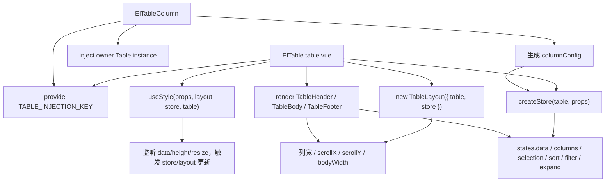
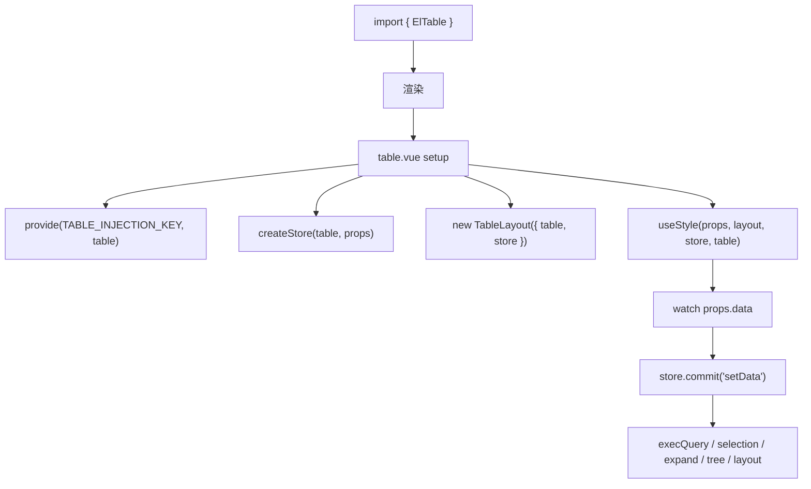
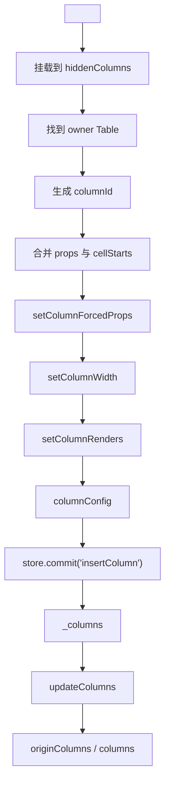
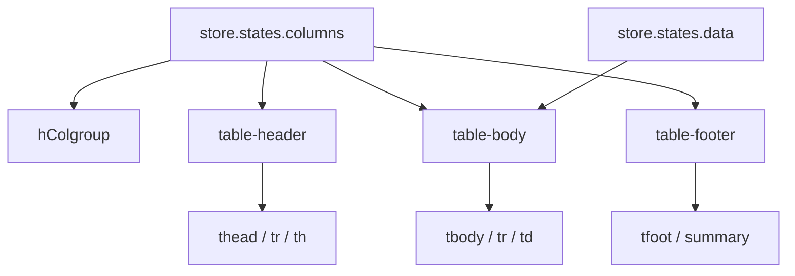
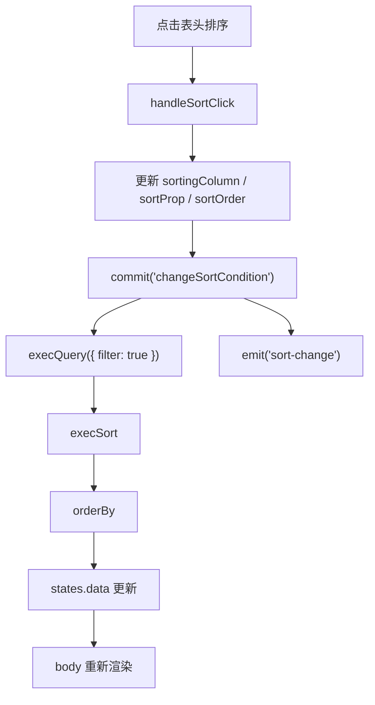
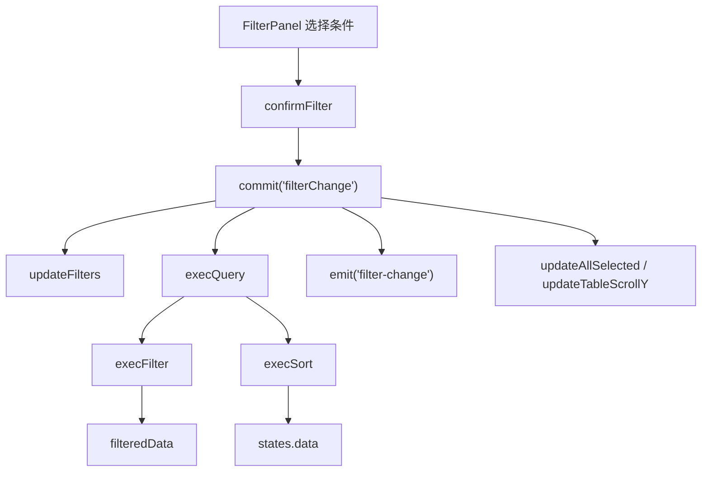
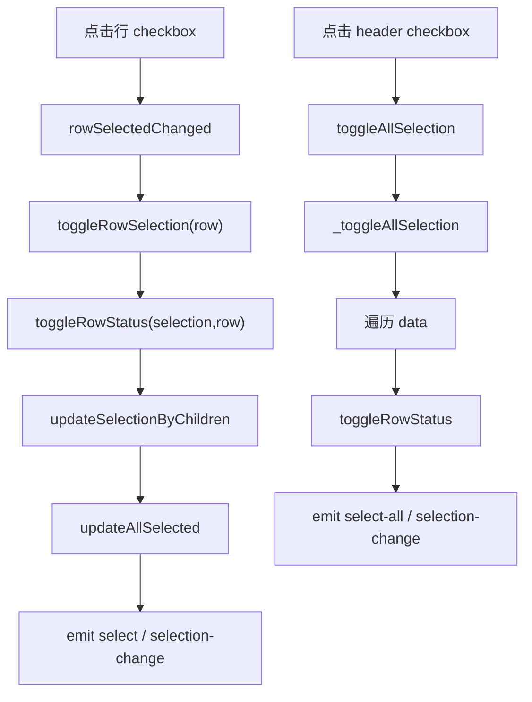
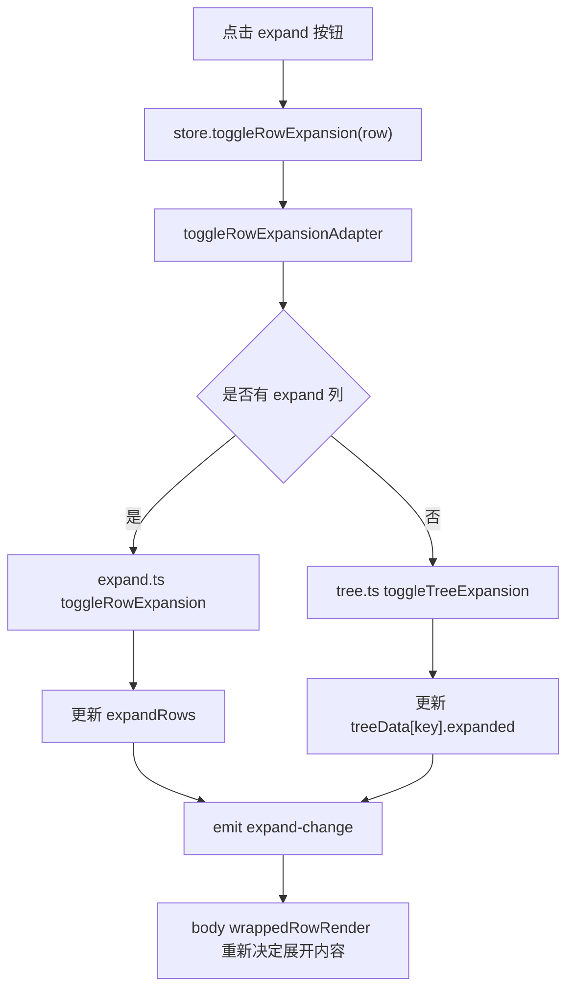

# Element Plus Table 组件源码系统分析

本文按五层拆解 Element Plus 的 `Table` 组件：

1. 整体架构
2. 数据流
3. 渲染流程
4. 交互逻辑
5. 性能和设计思想

源码入口位于：

```text
element-plus-dev/packages/components/table/
```

核心结论先放在前面：

```text
Table 不是一个简单的“props -> render”组件。

它更像一个小型表格运行时：

ElTable
  负责装配、provide、公开方法、模板结构

ElTableColumn
  负责声明列配置，并把列注册进 Table store

store
  负责 data、columns、selection、sort、filter、expand、tree、current row 等状态

layout
  负责列宽、滚动条、固定列、header/body/footer 同步

render helpers
  负责 header/body/footer 的具体渲染和事件派发
```

## 第一层：整体架构

### 1.1 Table 由哪些文件组成

`packages/components/table` 的关键文件可以分为这些组：

```text
packages/components/table/
├── index.ts
├── style/
│   ├── index.ts
│   └── css.ts
└── src/
    ├── table.vue
    ├── tableColumn.ts
    ├── table-layout.ts
    ├── layout-observer.ts
    ├── tokens.ts
    ├── util.ts
    ├── config.ts
    ├── h-helper.ts
    ├── filter-panel.vue
    ├── table/
    │   ├── defaults.ts
    │   ├── style-helper.ts
    │   ├── utils-helper.ts
    │   └── key-render-helper.ts
    ├── table-column/
    │   ├── index.vue
    │   ├── defaults.ts
    │   ├── render-helper.ts
    │   └── watcher-helper.ts
    ├── table-header/
    │   ├── index.ts
    │   ├── event-helper.ts
    │   ├── style.helper.ts
    │   └── utils-helper.ts
    ├── table-body/
    │   ├── index.ts
    │   ├── render-helper.ts
    │   ├── events-helper.ts
    │   ├── styles-helper.ts
    │   └── td-wrapper.vue
    ├── table-footer/
    │   ├── index.ts
    │   ├── style-helper.ts
    │   └── mapState-helper.ts
    └── store/
        ├── helper.ts
        ├── index.ts
        ├── watcher.ts
        ├── current.ts
        ├── expand.ts
        └── tree.ts
```

文件职责表：

| 文件 | 职责 |
| --- | --- |
| `index.ts` | 导出 `ElTable`、`ElTableColumn`，用 `withInstall` 把 `TableColumn` 作为 `Table` 的附属组件 |
| `src/table.vue` | Table 主组件，创建 store/layout，提供上下文，组合 header/body/footer/empty/append |
| `src/tableColumn.ts` | 转发 `table-column/index.vue`，作为 TableColumn 入口 |
| `src/table-column/index.vue` | 列组件，解析 props/slots，生成 column 配置，注册到 Table store |
| `src/table-column/defaults.ts` | 定义 `TableColumnCtx`、`TableColumnProps` 等类型 |
| `src/table-column/render-helper.ts` | 生成列渲染函数、列宽、强制属性、树形前缀、展开列渲染 |
| `src/table-column/watcher-helper.ts` | 监听列 props 变化，同步更新 `columnConfig` 并触发布局 |
| `src/store/helper.ts` | 创建 store，并把部分 Table props 代理到 store state |
| `src/store/index.ts` | mutation 风格的 store 入口，处理 `setData`、`insertColumn`、`sort`、`filterChange` 等 |
| `src/store/watcher.ts` | Table 的核心状态容器，维护 data、columns、selection、filter、sort 等 |
| `src/store/expand.ts` | 普通展开行状态 |
| `src/store/tree.ts` | 树形表格、懒加载、树节点展开状态 |
| `src/store/current.ts` | 当前行状态 |
| `src/table-layout.ts` | 表格尺寸、列宽、滚动条、固定列宽度计算 |
| `src/layout-observer.ts` | header/footer/body 对 layout 的观察者，同步 colgroup 和 gutter |
| `src/table-header/index.ts` | 表头渲染 |
| `src/table-header/event-helper.ts` | 表头点击、排序、拖拽列宽等事件 |
| `src/table-header/utils-helper.ts` | 多级表头 `convertToRows`，计算 `rowSpan/colSpan` |
| `src/table-body/index.ts` | body 渲染入口，从 store 取 data 并渲染 rows |
| `src/table-body/render-helper.ts` | 行、单元格、展开行、树形行渲染 |
| `src/table-body/events-helper.ts` | 行点击、单元格点击、hover、tooltip 事件 |
| `src/table-body/styles-helper.ts` | 行/单元格 class、style、span、固定列样式 |
| `src/table-footer/index.ts` | summary/footer 渲染 |
| `src/filter-panel.vue` | 筛选浮层，选择后提交 `filterChange` |
| `src/config.ts` | selection/index/expand/default 列的默认渲染配置 |
| `src/util.ts` | 排序、列查找、rowKey、固定列 offset、tooltip、树遍历等工具 |
| `src/h-helper.ts` | 渲染 `colgroup` |
| `style/index.ts` | Sass 样式入口 |
| `style/css.ts` | 构建后 CSS 样式入口 |

### 1.2 Table、TableColumn、store、layout、style 之间的关系

`table.vue` 是装配层。它做了几件关键事：

```ts
const table = getCurrentInstance() as Table<T>
provide(TABLE_INJECTION_KEY, table)

const store = createStore<T>(table, props)
table.store = store

const layout = new TableLayout<T>({
  store: table.store,
  table,
  fit: props.fit,
  showHeader: props.showHeader,
})
table.layout = layout
```

关系图：



可以把它理解成：

- `Table` 管上下文和 DOM 结构。
- `TableColumn` 不直接渲染单元格，而是生成列配置。
- `store` 管所有状态和行为。
- `layout` 管尺寸、列宽、滚动同步。
- `style helper` 把 store/layout 状态转成 class/style。

### 1.3 TableColumn 是如何注册到 Table 中的

`ElTableColumn` 是一个很特殊的组件。它看起来写在模板里：

```vue
<el-table :data="list">
  <el-table-column prop="name" label="Name" />
  <el-table-column prop="age" label="Age" />
</el-table>
```

但它的主要作用不是渲染 DOM，而是向父级 Table 注册一份列配置。

Table 里有一个隐藏容器：

```vue
<div ref="hiddenColumns" class="hidden-columns">
  <slot />
</div>
```

这让 `TableColumn` 可以被 Vue 正常挂载，从而执行生命周期。

`table-column/index.vue` 中会向上找到真正的 Table owner：

```ts
const owner = computed(() => {
  let parent = instance.parent as any
  while (parent && !parent.tableId) {
    parent = parent.parent
  }
  return parent
})
```

然后在 `onBeforeMount` 中生成 `columnConfig`：

```ts
const defaults = {
  ...cellStarts[type],
  id: columnId.value,
  type,
  property: props.prop || props.property,
  align: realAlign,
  headerAlign: realHeaderAlign,
  filterable: props.filters || props.filterMethod,
  filteredValue: [],
  sortable,
  rawColumnKey: instance.vnode.key,
}

let column = getPropsData(...)
column = mergeOptions(defaults, column)
column = compose(setColumnRenders, setColumnWidth, setColumnForcedProps)(column)
columnConfig.value = column
```

最后在 `onMounted` 中提交给 store：

```ts
owner.value.store.commit(
  'insertColumn',
  columnConfig.value,
  parentColumnOrNull,
  updateColumnOrder
)
```

卸载时则提交：

```ts
owner.value.store.commit('removeColumn', columnConfig.value, parentColumnOrNull)
```

所以完整链路是：

```text
模板中的 <el-table-column>
  -> Vue 挂载该组件
  -> TableColumn 生成 columnConfig
  -> owner.store.commit('insertColumn')
  -> store.states._columns 更新
  -> store.updateColumns()
  -> header/body/footer 使用 columns 渲染
```

### 1.4 columns 是如何收集和维护的

`store` 里有几组列状态：

```ts
_columns
originColumns
columns
fixedColumns
rightFixedColumns
leafColumns
fixedLeafColumns
rightFixedLeafColumns
```

它们的关系：

| 状态 | 含义 |
| --- | --- |
| `_columns` | 原始注册列，包含分组列结构 |
| `originColumns` | 按 left fixed、normal、right fixed 重排后的原始列 |
| `columns` | 最终用于 body 渲染的叶子列数组 |
| `fixedColumns` | 左固定列 |
| `rightFixedColumns` | 右固定列 |
| `leafColumns` | 普通叶子列 |
| `fixedLeafColumns` | 左固定叶子列 |
| `rightFixedLeafColumns` | 右固定叶子列 |

`insertColumn` 的主要过程：

```text
插入 column 到 _columns 或 parent.children
  -> 按 DOM 顺序 sortColumn
  -> 如果是 selection 列，同步 selectable/reserveSelection
  -> updateColumns()
  -> scheduleLayout()
```

`updateColumns()` 的主要过程：

```text
_columns
  -> 传播父级 fixed 到子列
  -> 分离 fixedColumns / rightFixedColumns / notFixedColumns
  -> originColumns = leftFixed + notFixed + rightFixed
  -> doFlattenColumns 得到叶子列
  -> columns = fixedLeaf + leaf + rightFixedLeaf
  -> isComplex = 是否存在固定列
```

表头的多级行不是直接用 `columns`，而是用：

```ts
convertToRows(store.states.originColumns.value)
```

它会计算每列的：

- `level`
- `rowSpan`
- `colSpan`
- `isSubColumn`

## 第二层：数据流

### 2.1 data prop 进入 Table 后如何被处理

`data` 从 `TableProps` 进入 `table.vue` 后，在 `useStyle` 中被监听：

```ts
watch(
  () => props.data,
  (data) => {
    table.store.commit('setData', data)
  },
  {
    immediate: true,
    deep: true,
  }
)
```

`store.commit('setData')` 会做一连串更新：

```text
states.data = data
states._data = data
execQuery()
updateCurrentRowData()
updateExpandRows()
updateTreeData()
处理 selection
updateSelectionByChildren()
updateAllSelected()
scheduleLayout()
```

这里的 `_data` 是原始数据，`data` 是经过 filter/sort 后用于渲染的数据。

```text
props.data
  -> states._data
  -> execFilter()
  -> filteredData
  -> execSort()
  -> states.data
  -> table-body render
```

### 2.2 columns 配置如何生成

列配置来自 `ElTableColumn`，大致分三步：

1. props 转 column 初始配置
2. 按列类型补默认渲染能力
3. 注册到 store

关键来源：

```text
TableColumn props
  -> basicProps / sortProps / selectProps / filterProps
  -> cellStarts[type]
  -> cellForced[type]
  -> setColumnWidth
  -> setColumnRenders
  -> columnConfig
```

`config.ts` 中定义了几类特殊列：

| type | 作用 |
| --- | --- |
| `default` | 普通数据列 |
| `selection` | 多选列，header/body 渲染 checkbox |
| `index` | 序号列 |
| `expand` | 展开列，渲染展开按钮并设置 `owner.renderExpanded` |

普通列的默认 cell 渲染逻辑：

```ts
const value = property && getProp(row, property).value
if (column.formatter) {
  return column.formatter(row, column, value, $index)
}
return value?.toString?.() || ''
```

如果用户提供默认 slot，则 `setColumnRenders` 会优先使用 slot。

### 2.3 selection、sort、filter、expand 等状态如何管理

这些状态主要都集中在 `store/watcher.ts`。

selection：

```ts
selection
isAllSelected
selectionIndeterminate
reserveSelection
selectable
```

排序：

```ts
sortingColumn
sortProp
sortOrder
```

筛选：

```ts
filters
filteredData
```

展开行：

```ts
expandRows
defaultExpandAll
```

树形表格：

```ts
treeData
expandRowKeys
lazyTreeNodeMap
childrenColumnName
lazyColumnIdentifier
checkStrictly
```

当前行：

```ts
currentRow
_currentRowKey
```

store 把这些状态集中在一起，是因为它们互相影响：

- `data` 变化会影响 selection、current row、expand、tree、layout。
- `filter` 变化会影响渲染数据和全选状态。
- `sort` 变化会影响渲染数据。
- `tree` 展开会影响 body 渲染和滚动高度。
- `fixed columns` 会影响 body/header/footer class 和 offset。

### 2.4 store 的设计作用是什么

`store` 的作用不是“为了像 Redux”，而是为了把复杂状态从渲染组件中抽出来。

它承担四类职责：

1. 状态容器：集中保存 Table 运行时状态。
2. 行为入口：通过 `commit` 和方法处理选择、排序、筛选、展开。
3. 派生计算：维护 `columns`、`filteredData`、`isAllSelected` 等结果。
4. 跨组件协调：header、body、footer、filter-panel 都通过 store 协同。

如果没有 store，Table 的状态会散落在：

```text
table.vue
table-header
table-body
filter-panel
table-column
layout
```

这样任何一个动作，例如“筛选后更新数据、刷新全选、更新滚动高度、派发事件”，都要跨很多组件通信。

## 第三层：渲染流程

### 3.1 header 如何渲染

header 组件是：

```text
src/table-header/index.ts
```

它读取：

```ts
columnRows = convertToRows(store.states.originColumns.value)
```

然后渲染：

```text
thead
  tr for each header row
    th for each column
      div.cell
        renderHeader 或 label
        sort caret
        filter panel
```

header cell 内部会根据列配置决定是否渲染：

- `column.renderHeader`
- `column.label`
- 排序按钮 `caret-wrapper`
- `FilterPanel`

排序和筛选入口都在 header 里：

```text
th click
  -> handleHeaderClick
  -> handleSortClick 或 handleFilterClick
```

### 3.2 body 如何渲染

body 组件是：

```text
src/table-body/index.ts
src/table-body/render-helper.ts
```

它从 store 读取最终数据：

```ts
const data = store?.states.data.value || []
```

然后：

```ts
data.reduce((acc, row) => {
  return acc.concat(wrappedRowRender(row, acc.length))
}, [])
```

`wrappedRowRender` 会根据表格模式分支：

```text
有 expand 列
  -> 渲染普通 tr
  -> 如果 expanded，额外渲染 expanded-row

有 treeData
  -> 渲染 root row
  -> 遍历 children / lazy children
  -> 根据 expanded/display 控制显示

普通表格
  -> 渲染一行 tr
```

单元格渲染：

```text
rowRender(row)
  -> columns.value.map(column)
  -> getSpan(row, column)
  -> getCellStyle / getCellClass
  -> column.renderCell(data)
  -> TdWrapper
```

### 3.3 fixed column 如何处理

当前源码中的固定列主要通过列重排、sticky class、left/right offset 处理。

关键步骤：

1. `store.updateColumns()` 把固定列排到左右两端。
2. `layout.updateColumnsWidth()` 计算每列 `realWidth`。
3. `getFixedColumnsClass()` 给单元格加固定列 class。
4. `getFixedColumnOffset()` 计算 `left` 或 `right`。
5. header/body/footer 都使用同一套 fixed 工具函数。

相关 class：

```text
el-table-fixed-column--left
el-table-fixed-column--right
is-last-column
is-first-column
```

相关 style：

```text
left: xxxpx
right: xxxpx
```

header、body、footer 都依赖同一个 `store.states.columns` 和 `layout`，所以固定列位置可以保持一致。

### 3.4 empty、summary、append slot 如何处理

empty：

```vue
<div v-if="isEmpty" ref="emptyBlock" :style="emptyBlockStyle">
  <span>
    <slot name="empty">{{ computedEmptyText }}</slot>
  </span>
</div>
```

判断条件：

```ts
const isEmpty = computed(() => (store.states.data.value || []).length === 0)
```

summary：

- `showSummary && tableLayout === 'auto'` 时 footer 放在 body table 内。
- `showSummary && tableLayout === 'fixed'` 时 footer 独立放在 `footerWrapper`。

`table-footer/index.ts` 中：

```text
如果有 summaryMethod
  -> 使用用户返回的 sums
否则
  -> 第一列显示 sumText
  -> 其他列尝试 Number 求和
```

append slot：

```vue
<div v-if="$slots.append" ref="appendWrapper">
  <slot name="append" />
</div>
```

append 高度会进入 layout 的高度计算，避免滚动区域错位。

## 第四层：交互逻辑

### 4.1 排序如何触发

排序入口在 `table-header/event-helper.ts`。

触发路径：

```text
用户点击表头 / 排序箭头
  -> handleHeaderClick 或 handleSortClick
  -> 计算下一个 order
  -> 更新 states.sortingColumn / sortProp / sortOrder
  -> store.commit('changeSortCondition')
  -> store.execQuery({ filter: true })
  -> emit('sort-change')
  -> updateTableScrollY()
```

本地排序由 `util.ts` 的 `orderBy` 执行。

如果 `column.sortable` 是字符串，例如 `custom`，`sortData` 不做本地排序，只派发 `sort-change`，交给用户远程处理。

### 4.2 筛选如何触发

筛选入口在 `filter-panel.vue`。

触发路径：

```text
用户选择 filter
  -> handleConfirm / handleSelect / handleReset
  -> confirmFilter(filteredValue)
  -> store.commit('filterChange', { column, values })
  -> store.updateFilters(column, values)
  -> store.execQuery()
  -> emit('filter-change')
  -> updateAllSelected()
  -> updateTableScrollY()
```

筛选执行逻辑：

```ts
sourceData = _data
for each active filter:
  sourceData = sourceData.filter(row =>
    values.some(value => column.filterMethod(value, row, column))
  )
filteredData = sourceData
```

然后排序再接上：

```text
execQuery()
  -> execFilter()
  -> execSort()
```

### 4.3 多选如何维护

多选列由 `config.ts` 中 `cellForced.selection` 定义。

表头 checkbox：

```text
renderHeader
  -> ElCheckbox
  -> onUpdate:modelValue = store.toggleAllSelection
```

行 checkbox：

```text
renderCell
  -> ElCheckbox
  -> onChange = store.commit('rowSelectedChanged', row)
```

行选择路径：

```text
checkbox change
  -> rowSelectedChanged
  -> toggleRowSelection(row)
  -> toggleRowStatus(selection, row)
  -> updateSelectionByChildren()
  -> updateAllSelected()
  -> emit('select')
  -> emit('selection-change')
```

全选路径：

```text
header checkbox
  -> toggleAllSelection
  -> _toggleAllSelection
  -> 遍历 data
  -> toggleRowStatus(selection, row, value)
  -> 处理 tree/lazy children
  -> updateSelectionByChildren()
  -> emit('selection-change')
  -> emit('select-all')
```

`rowKey` 在 `reserveSelection`、tree、lazy 场景非常重要，因为对象引用可能变，但业务 key 可以保持稳定。

### 4.4 展开行如何维护

展开有两种：

1. `type="expand"` 的展开行
2. tree table 的树节点展开

普通展开行状态在 `store/expand.ts`：

```ts
expandRows
defaultExpandAll
toggleRowExpansion
isRowExpanded
```

expand 列按钮来自 `config.ts`：

```text
button click
  -> store.toggleRowExpansion(row)
```

适配层在 `watcher.ts`：

```ts
const toggleRowExpansionAdapter = (row, expanded) => {
  const hasExpandColumn = columns.value.some(({ type }) => type === 'expand')
  if (hasExpandColumn) {
    toggleRowExpansion(row, expanded)
  } else {
    toggleTreeExpansion(row, expanded)
  }
}
```

tree 展开状态在 `store/tree.ts`：

```text
treeData[key].expanded
lazyTreeNodeMap
loadOrToggle
toggleTreeExpansion
loadData
```

body 渲染时根据 `treeData` 决定行是否 display。

### 4.5 行点击、单元格点击事件如何派发

事件逻辑在：

```text
src/table-body/events-helper.ts
```

`rowRender` 给每个 `tr` 绑定：

```ts
onDblclick
onClick
onContextmenu
onMouseenter
onMouseleave
```

点击路径：

```text
用户点击 tr/td
  -> handleClick(event, row)
  -> store.commit('setCurrentRow', row)
  -> getCell(event)
  -> getColumnByCell(columns, cell)
  -> emit('cell-click', row, column, cell, event)
  -> emit('row-click', row, column, event)
```

双击和右键类似：

```text
cell-dblclick / row-dblclick
cell-contextmenu / row-contextmenu
```

hover：

```text
mouseenter row
  -> store.commit('setHoverRow', index)

mouseleave row
  -> store.commit('setHoverRow', null)
```

复杂固定列场景下，body 会额外同步 hover class。

## 第五层：性能和设计思想

### 5.1 为什么 Table 需要 store

Table 的复杂度来自状态之间的联动，而不是某个单点功能。

一次 data 更新可能影响：

```text
渲染数据
过滤结果
排序结果
当前行
展开行
树形数据
多选状态
全选状态
layout
scrollY
```

一次列更新可能影响：

```text
header rows
body cells
footer cells
colgroup
fixed columns
bodyWidth
scrollX
selection 列行为
```

store 的价值是给这些联动提供一个稳定中心：

```text
状态集中
行为集中
事件集中
跨组件共享
```

### 5.2 为什么要拆分 layout

layout 是 DOM 测量和视觉同步问题，和业务数据不是一类问题。

它负责：

- 表格高度
- 最大高度
- 是否出现横向/纵向滚动
- bodyWidth
- fixedWidth/rightFixedWidth
- column realWidth
- header/footer/body 的 scrollLeft 同步
- gutter 宽度同步

这些逻辑需要访问 DOM 尺寸，必须在 mounted、resize、scroll 等时机执行。如果混在 store 或 render 中，组件会很快变得不可维护。

所以 Element Plus 把它拆成：

```text
store
  管“表格数据状态”

layout
  管“表格视觉尺寸状态”

layout-observer
  让 header/body/footer 响应 layout 变化
```

### 5.3 复杂组件如何拆分职责

Table 的拆分非常值得学习：

| 职责 | Element Plus 的拆法 |
| --- | --- |
| 组件装配 | `table.vue` |
| 声明式配置 | `table-column/index.vue` |
| 状态机 | `store/*` |
| 尺寸计算 | `table-layout.ts` |
| DOM 同步 | `layout-observer.ts` |
| 表头渲染 | `table-header/*` |
| 表体渲染 | `table-body/*` |
| 表尾渲染 | `table-footer/*` |
| 特殊列默认行为 | `config.ts` |
| 公共工具 | `util.ts` |
| 样式入口 | `style/*` |

这种拆法的重点不是“文件多”，而是每个文件围绕一个稳定问题域。

### 5.4 可以借鉴到业务组件库的设计

可以直接借鉴的设计：

1. 用 `provide/inject` 让声明式子组件向父组件注册配置。
2. 用 store 管复杂状态，不把所有状态塞进主组件。
3. 用 layout 层隔离 DOM 测量和滚动同步。
4. 用 column config 把用户 props/slots 转成统一运行时结构。
5. 对特殊类型列使用默认渲染配置，比如 selection/index/expand。
6. 把 public API 暴露为 `defineExpose`，内部仍然走 store 方法。
7. 对复杂交互用 helper 拆开，比如 `event-helper`、`style-helper`、`render-helper`。
8. 把“注册/卸载/动态顺序变化”当成一等能力处理。

业务组件库里，如果遇到类似：

```text
一个父组件
多个声明式子组件
很多交互状态
多个渲染区域
布局依赖 DOM 测量
```

就可以参考 Table 的分层方式。

## 核心调用链图

### Table 初始化链路



### TableColumn 注册链路



### 一次渲染链路



### 排序调用链



### 筛选调用链



### 多选调用链



### 展开行调用链



## 简化版 MiniTable 实现

下面的简化版只保留 Element Plus Table 的核心设计：

- `MiniTable` provide 上下文
- `MiniTableColumn` 注册列配置
- store 管理 data、columns、selection、sort
- header/body 从 store 渲染
- 支持 selection、sort、slot cell

### mini-table-context.ts

```ts
import type { InjectionKey, Ref } from 'vue'

export interface MiniColumn {
  id: string
  prop?: string
  label?: string
  type?: 'default' | 'selection'
  sortable?: boolean
  renderCell?: (scope: { row: any; column: MiniColumn; index: number }) => any
}

export interface MiniTableStore {
  data: Ref<any[]>
  columns: Ref<MiniColumn[]>
  selection: Ref<any[]>
  sortProp: Ref<string>
  sortOrder: Ref<'ascending' | 'descending' | ''>
  insertColumn: (column: MiniColumn) => void
  removeColumn: (column: MiniColumn) => void
  toggleRowSelection: (row: any) => void
  toggleAllSelection: () => void
  sortBy: (column: MiniColumn) => void
}

export interface MiniTableContext {
  store: MiniTableStore
}

export const miniTableKey: InjectionKey<MiniTableContext> = Symbol('miniTable')
```

### useMiniTableStore.ts

```ts
import { computed, ref, watch } from 'vue'
import type { MiniColumn, MiniTableStore } from './mini-table-context'

export function useMiniTableStore(props: { data: any[] }): MiniTableStore {
  const rawData = ref<any[]>([])
  const data = ref<any[]>([])
  const columns = ref<MiniColumn[]>([])
  const selection = ref<any[]>([])
  const sortProp = ref('')
  const sortOrder = ref<'ascending' | 'descending' | ''>('')

  const sortedData = computed(() => {
    if (!sortProp.value || !sortOrder.value) return rawData.value

    return [...rawData.value].sort((a, b) => {
      const result = a[sortProp.value] > b[sortProp.value] ? 1 : -1
      return sortOrder.value === 'ascending' ? result : -result
    })
  })

  watch(
    () => props.data,
    (value) => {
      rawData.value = value || []
      data.value = sortedData.value
    },
    { immediate: true, deep: true }
  )

  watch(sortedData, (value) => {
    data.value = value
  })

  const insertColumn = (column: MiniColumn) => {
    columns.value.push(column)
  }

  const removeColumn = (column: MiniColumn) => {
    columns.value = columns.value.filter((item) => item.id !== column.id)
  }

  const toggleRowSelection = (row: any) => {
    const index = selection.value.indexOf(row)
    if (index > -1) {
      selection.value.splice(index, 1)
    } else {
      selection.value.push(row)
    }
  }

  const toggleAllSelection = () => {
    if (selection.value.length === data.value.length) {
      selection.value = []
    } else {
      selection.value = data.value.slice()
    }
  }

  const sortBy = (column: MiniColumn) => {
    if (!column.prop || !column.sortable) return

    if (sortProp.value !== column.prop) {
      sortProp.value = column.prop
      sortOrder.value = 'ascending'
    } else {
      sortOrder.value =
        sortOrder.value === 'ascending'
          ? 'descending'
          : sortOrder.value === 'descending'
            ? ''
            : 'ascending'
    }

    if (!sortOrder.value) {
      sortProp.value = ''
    }

    data.value = sortedData.value
  }

  return {
    data,
    columns,
    selection,
    sortProp,
    sortOrder,
    insertColumn,
    removeColumn,
    toggleRowSelection,
    toggleAllSelection,
    sortBy,
  }
}
```

### MiniTable.vue

```vue
<script setup lang="ts">
import { provide } from 'vue'
import MiniCell from './MiniCell.vue'
import { miniTableKey } from './mini-table-context'
import { useMiniTableStore } from './useMiniTableStore'

const props = defineProps<{
  data: any[]
}>()

const store = useMiniTableStore(props)

provide(miniTableKey, {
  store,
})

defineExpose({
  clearSelection: () => {
    store.selection.value = []
  },
  getSelectionRows: () => {
    return store.selection.value.slice()
  },
})
</script>

<template>
  <div class="mini-table">
    <div class="mini-table__hidden-columns">
      <slot />
    </div>

    <table class="mini-table__table">
      <thead>
        <tr>
          <th v-for="column in store.columns.value" :key="column.id">
            <input
              v-if="column.type === 'selection'"
              type="checkbox"
              :checked="
                store.data.value.length > 0 &&
                store.selection.value.length === store.data.value.length
              "
              @change="store.toggleAllSelection()"
            />
            <button
              v-else-if="column.sortable"
              type="button"
              class="mini-table__sort-button"
              @click="store.sortBy(column)"
            >
              {{ column.label }}
              <span v-if="store.sortProp.value === column.prop">
                {{ store.sortOrder.value }}
              </span>
            </button>
            <span v-else>{{ column.label }}</span>
          </th>
        </tr>
      </thead>

      <tbody>
        <tr v-for="(row, rowIndex) in store.data.value" :key="rowIndex">
          <td v-for="column in store.columns.value" :key="column.id">
            <input
              v-if="column.type === 'selection'"
              type="checkbox"
              :checked="store.selection.value.includes(row)"
              @change="store.toggleRowSelection(row)"
            />
            <MiniCell
              v-else-if="column.renderCell"
              :row="row"
              :column="column"
              :index="rowIndex"
            />
            <span v-else>{{ column.prop ? row[column.prop] : '' }}</span>
          </td>
        </tr>
      </tbody>
    </table>

    <div v-if="store.data.value.length === 0" class="mini-table__empty">
      No Data
    </div>
  </div>
</template>
```

### MiniCell.vue

```vue
<script lang="ts">
import { defineComponent } from 'vue'
import type { MiniColumn } from './mini-table-context'

export default defineComponent({
  name: 'MiniCell',
  props: {
    row: {
      type: Object,
      required: true,
    },
    column: {
      type: Object as () => MiniColumn,
      required: true,
    },
    index: {
      type: Number,
      required: true,
    },
  },
  setup(props) {
    return () => {
      return props.column.renderCell?.({
        row: props.row,
        column: props.column,
        index: props.index,
      })
    }
  },
})
</script>
```

### MiniTableColumn.vue

```vue
<script setup lang="ts">
import { h, inject, onBeforeUnmount, onMounted } from 'vue'
import { miniTableKey, type MiniColumn } from './mini-table-context'

const props = withDefaults(
  defineProps<{
    prop?: string
    label?: string
    type?: 'default' | 'selection'
    sortable?: boolean
  }>(),
  {
    type: 'default',
    sortable: false,
  }
)

const slots = defineSlots<{
  default?: (scope: { row: any; column: MiniColumn; index: number }) => any
}>()

const table = inject(miniTableKey)

const column: MiniColumn = {
  id: `mini-column-${Math.random().toString(36).slice(2)}`,
  prop: props.prop,
  label: props.label,
  type: props.type,
  sortable: props.sortable,
  renderCell: slots.default
    ? (scope) => h('span', slots.default?.(scope))
    : undefined,
}

onMounted(() => {
  table?.store.insertColumn(column)
})

onBeforeUnmount(() => {
  table?.store.removeColumn(column)
})
</script>

<template>
  <div style="display: none" />
</template>
```

### MiniTable 使用示例

```vue
<script setup lang="ts">
import { ref } from 'vue'
import MiniTable from './MiniTable.vue'
import MiniTableColumn from './MiniTableColumn.vue'

const rows = ref([
  { name: 'Alice', age: 18 },
  { name: 'Bob', age: 20 },
])
</script>

<template>
  <MiniTable :data="rows">
    <MiniTableColumn type="selection" />
    <MiniTableColumn prop="name" label="Name" sortable />
    <MiniTableColumn prop="age" label="Age">
      <template #default="{ row }">
        <strong>{{ row.age }}</strong>
      </template>
    </MiniTableColumn>
  </MiniTable>
</template>
```

这个 MiniTable 和 Element Plus Table 的差距很大，但核心模式一致：

```text
Table provide store
Column inject store 并注册 column
store 维护 data/columns/selection/sort
header/body 只负责根据 store 渲染
```

## 学习总结

Element Plus Table 最值得学习的不是某一个算法，而是复杂组件的工程拆分方式：

```text
声明式 API
  -> <el-table-column>

运行时配置
  -> columnConfig

状态机
  -> store

布局系统
  -> layout

渲染分区
  -> header/body/footer

事件分区
  -> event-helper

样式分区
  -> style-helper
```

如果要读源码，推荐顺序是：

1. `index.ts`
2. `table.vue`
3. `table-column/index.vue`
4. `store/helper.ts`
5. `store/index.ts`
6. `store/watcher.ts`
7. `table-header/index.ts`
8. `table-body/render-helper.ts`
9. `config.ts`
10. `table-layout.ts`

这条顺序能先建立“列如何注册、数据如何进 store、store 如何驱动渲染”的主干，再回头看排序、筛选、多选、展开等分支。
