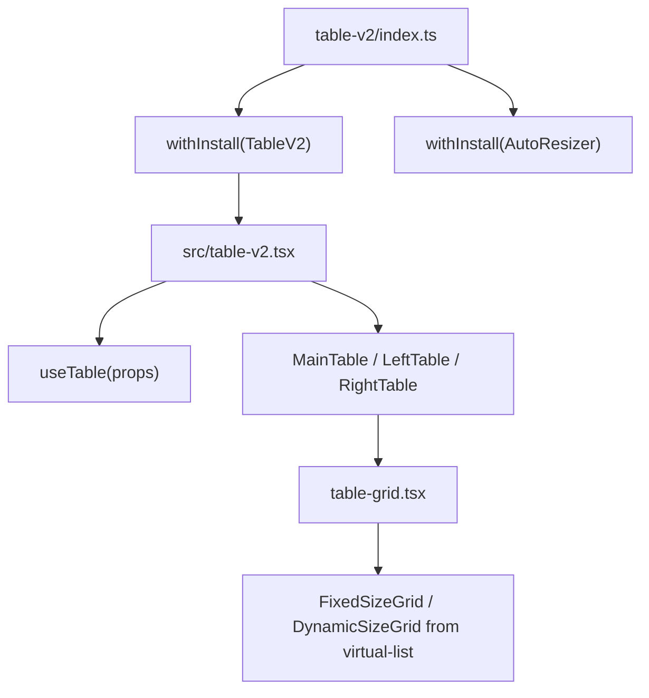
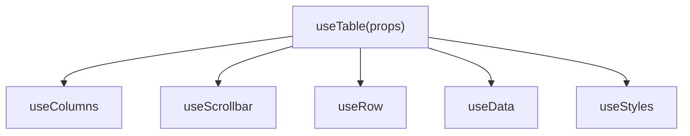
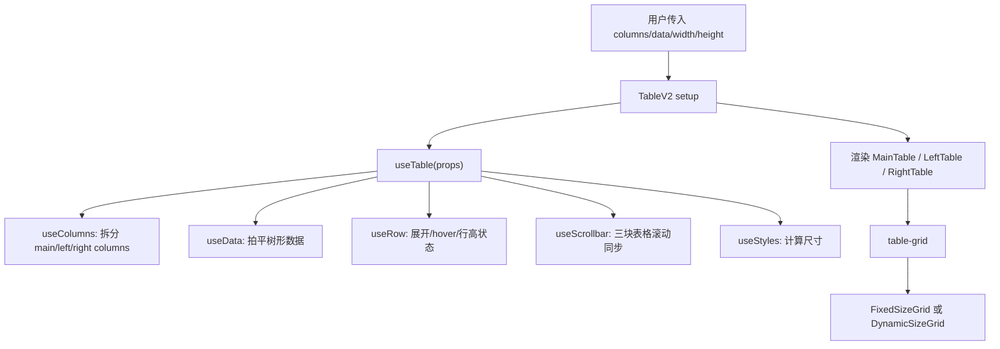
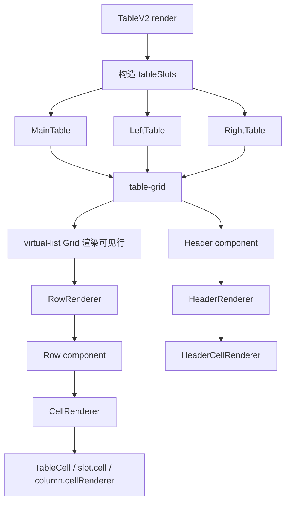
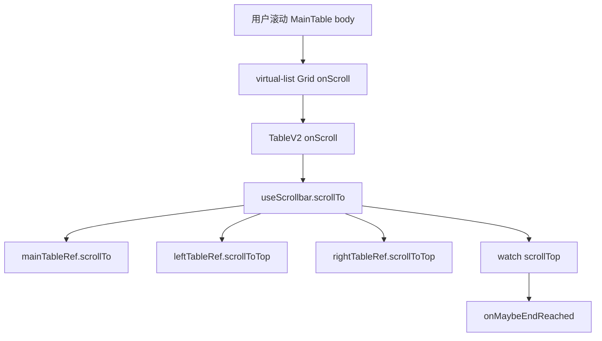
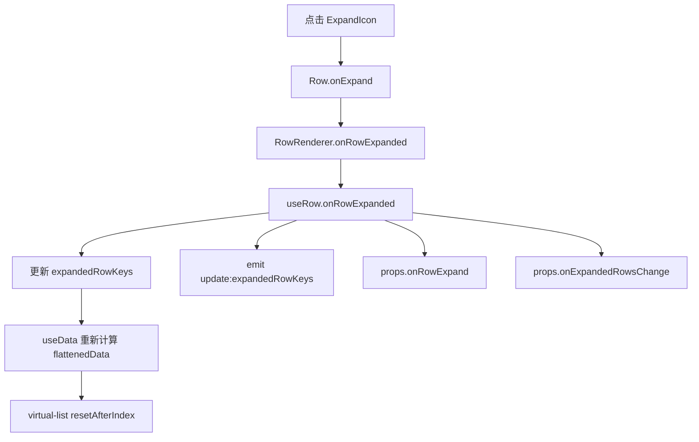
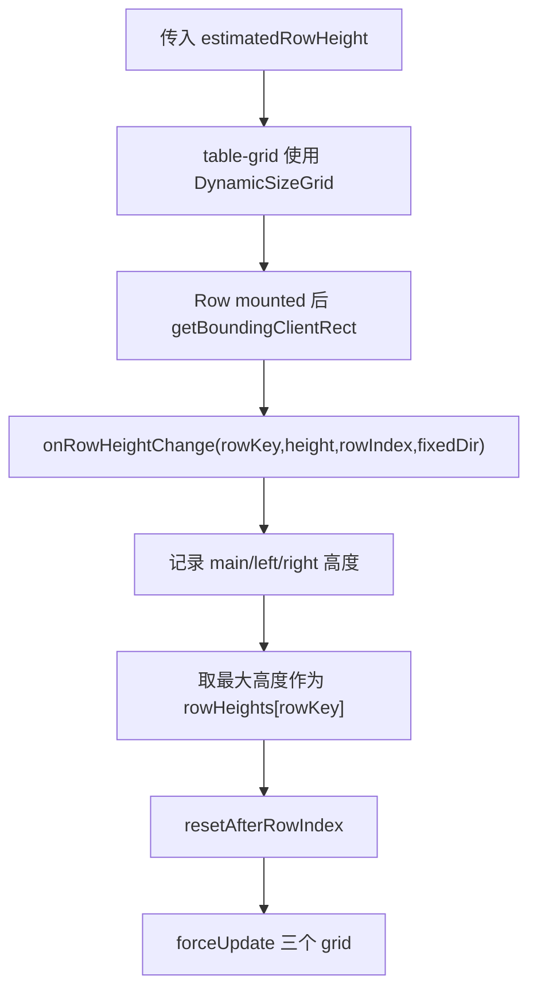
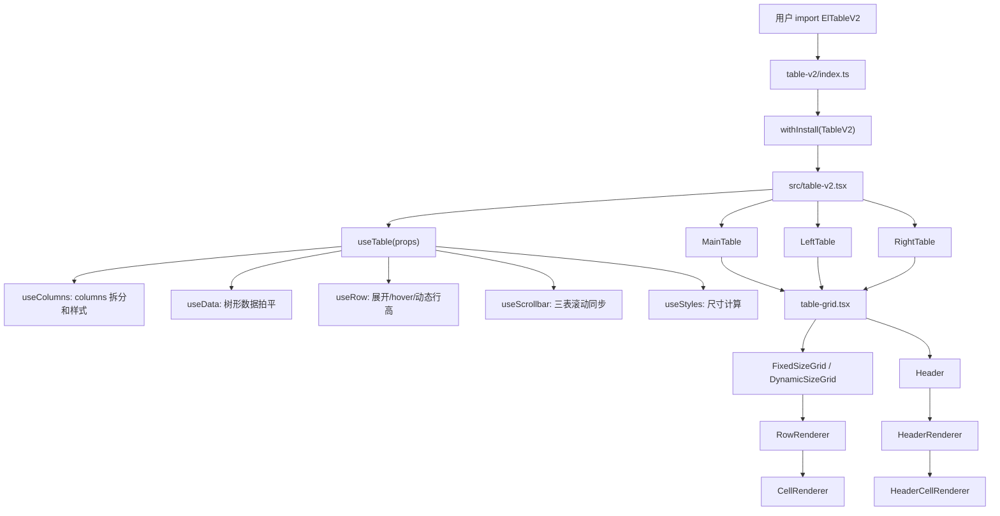

# Element Plus TableV2 组件源码分析

> 源码位置：`element-plus-dev/packages/components/table-v2`
>
> 核心依赖：`@element-plus/components/virtual-list`
>
> 主要导出：`ElTableV2`、`ElAutoResizer`、`TableV2`、`TableV2SortOrder`、`TableV2FixedDir`、`TableV2Alignment`
>
> 核心关键词：虚拟表格、组合式状态、固定列拆分、动态行高、树形展开、滚动同步、slot 渲染器。

`table-v2` 是 Element Plus 的虚拟化表格组件。它和普通 `table` 的目标不同：普通 Table 更强调完整表格能力，比如复杂表头、筛选、多选、布局测量；TableV2 更强调大数据量下的渲染性能，用 `virtual-list` 只渲染可视区域附近的行。

一句话概括：

```text
TableV2 负责把 columns/data/slots/交互状态组装成表格模型，再交给 virtual-list 的 Grid 只渲染当前可视区域的行。
```

## 1. 学习目标

TableV2 适合学习这些源码思想：

| 学习点 | 说明 |
| --- | --- |
| 复杂组件拆层 | 根组件、状态组合函数、grid 桥接层、渲染器、基础子组件分工明确 |
| 虚拟滚动复用 | 不自己实现虚拟滚动算法，而是复用 `virtual-list` 的 `FixedSizeGrid` / `DynamicSizeGrid` |
| 固定列实现 | 左固定、右固定、主表格被拆成三个同步滚动的 grid |
| 动态行高 | 使用 `estimatedRowHeight` 开启动态测量，取主表/左右固定列测量高度的最大值 |
| 受控状态设计 | 排序、展开行等状态通过 props + callback / update event 交给外部控制 |
| 渲染器模式 | row、cell、header、header-cell、empty、footer、overlay 都是独立 renderer |
| 组合式状态管理 | 没有 Table v1 那种 store 类，而是拆成 `useColumns`、`useData`、`useRow`、`useScrollbar`、`useStyles` |
| 性能边界 | 它牺牲部分传统 Table 能力，换取大数据场景下更稳定的渲染成本 |

最关键的一点：

```text
TableV2 不是“Table 的第二版”，而是“基于虚拟列表重新设计的高性能表格”。
```

## 2. 文件结构

源码文件：

```text
packages/components/table-v2
├── index.ts
├── src
│   ├── table-v2.tsx
│   ├── table.ts
│   ├── use-table.ts
│   ├── table-grid.tsx
│   ├── grid.ts
│   ├── row.ts
│   ├── cell.ts
│   ├── header.ts
│   ├── header-row.ts
│   ├── header-cell.ts
│   ├── auto-resizer.ts
│   ├── common.ts
│   ├── constants.ts
│   ├── private.ts
│   ├── tokens.ts
│   ├── types.ts
│   ├── utils.ts
│   ├── components
│   │   ├── auto-resizer.tsx
│   │   ├── row.tsx
│   │   ├── cell.tsx
│   │   ├── header.tsx
│   │   ├── header-row.tsx
│   │   ├── header-cell.tsx
│   │   ├── sort-icon.tsx
│   │   └── expand-icon.tsx
│   ├── composables
│   │   ├── use-table.ts 不在这里，根层的 use-table.ts 才是总入口
│   │   ├── use-columns.ts
│   │   ├── use-data.ts
│   │   ├── use-row.ts
│   │   ├── use-scrollbar.ts
│   │   ├── use-styles.ts
│   │   ├── use-auto-resize.ts
│   │   └── utils.ts
│   └── renderers
│       ├── main-table.tsx
│       ├── left-table.tsx
│       ├── right-table.tsx
│       ├── row.tsx
│       ├── cell.tsx
│       ├── header.tsx
│       ├── header-cell.tsx
│       ├── empty.tsx
│       ├── footer.tsx
│       └── overlay.tsx
├── style
│   ├── index.ts
│   └── css.ts
└── __tests__
    └── table-v2.test.tsx
```

文件职责表：

| 文件 | 职责 |
| --- | --- |
| `index.ts` | 用 `withInstall` 导出 `ElTableV2`、`ElAutoResizer`，同时导出类型和常量 |
| `src/table-v2.tsx` | TableV2 根组件，组装 props、slots、三块表格、空态、footer、overlay |
| `src/table.ts` | TableV2 对外 props 和事件回调类型定义 |
| `src/use-table.ts` | 总状态协调器，组合 columns/data/row/scrollbar/styles |
| `src/table-grid.tsx` | TableV2 到 `virtual-list` Grid 的桥接层，负责 header + body + scroll API |
| `src/grid.ts` | grid 层 props，把 table 尺寸、数据、滚动事件传给虚拟 Grid |
| `src/composables/use-columns.ts` | 标准化 columns，拆分固定列，生成列样式，处理排序点击 |
| `src/composables/use-data.ts` | 根据展开状态把树形数据拍平，并维护 `depthMap` |
| `src/composables/use-row.ts` | 展开行、hover 同步、动态行高测量、行渲染范围维护 |
| `src/composables/use-scrollbar.ts` | 主表、左固定列、右固定列之间的滚动同步 |
| `src/composables/use-styles.ts` | 计算表体宽高、固定列宽度、空态位置、footer 高度 |
| `src/renderers/*` | 把内部状态转换成可渲染 vnode 的渲染器层 |
| `src/components/*` | 更小的基础渲染组件，如 Row、Cell、Header、SortIcon、ExpandIcon |
| `src/tokens.ts` | TableV2 内部 provide/inject key |
| `src/private.ts` | 固定列占位列标记 `placeholderSign` |
| `style/index.ts` | SCSS 样式入口 |
| `style/css.ts` | 构建后 CSS 样式入口 |
| `theme-chalk/src/table-v2.scss` | TableV2 的 BEM 样式实现 |
| `__tests__/table-v2.test.tsx` | slot、自定义渲染、flexShrink、滚动、a11y、展开等测试 |

## 3. 入口链路

入口文件：`packages/components/table-v2/index.ts`

核心代码：

```ts
import { withInstall } from '@element-plus/utils'
import TableV2 from './src/table-v2'
import AutoResizer from './src/components/auto-resizer'

export const ElTableV2 = withInstall(TableV2)
export const ElAutoResizer = withInstall(AutoResizer)

export { default as TableV2 } from './src/table-v2'
export * from './src/table'
export * from './src/row'
```

入口链路：



也就是说，用户最终使用的：

```ts
import { ElTableV2 } from 'element-plus'
```

本质上是：

```text
ElTableV2 = withInstall(TableV2)
```

它既可以全量 `app.use(ElementPlus)` 安装，也可以作为按需组件被导入。

## 4. Props / Emits / Slots

### 4.1 Props

TableV2 的 props 定义在 `src/table.ts`。

核心 props：

| 分类 | prop | 说明 |
| --- | --- | --- |
| 数据 | `columns` | 列配置，必填 |
| 数据 | `data` | 行数据，必填 |
| 数据 | `fixedData` | 固定在 header 下方的特殊行数据 |
| 数据 | `rowKey` | 行唯一 key，默认 `id` |
| 尺寸 | `width` | 表格宽度，必填 |
| 尺寸 | `height` | 表格高度，必填 |
| 尺寸 | `maxHeight` | 最大高度，用于自适应高度场景 |
| 尺寸 | `rowHeight` | 固定行高，默认 `50` |
| 尺寸 | `estimatedRowHeight` | 动态行高预估值，传入后启用动态测量 |
| 表头 | `headerHeight` | 表头高度，支持 number 或 number[] |
| 样式 | `rowClass` / `rowProps` | 自定义行 class / props |
| 样式 | `cellProps` | 自定义单元格 props |
| 树形 | `expandColumnKey` | 展开图标所在列 key |
| 树形 | `expandedRowKeys` | 受控展开 key |
| 树形 | `defaultExpandedRowKeys` | 默认展开 key |
| 排序 | `sortBy` | 单列排序状态 |
| 排序 | `sortState` | 多列排序状态 |
| 滚动 | `cache` | 虚拟滚动缓存行数 |
| 滚动 | `useIsScrolling` | 是否把滚动状态传给 slot |
| 滚动 | `scrollbarAlwaysOn` | 滚动条是否常显 |

`columns` 的类型定义在 `src/types.ts`：

```ts
export type Column<T = any> = {
  align?: Alignment
  class?: string | ClassNameGetter<T>
  key?: KeyType
  dataKey?: KeyType
  fixed?: true | FixedDirection
  flexGrow?: CSSProperties['flexGrow']
  flexShrink?: CSSProperties['flexShrink']
  title?: string
  hidden?: boolean
  maxWidth?: number
  minWidth?: number
  sortable?: boolean
  width: number
  cellRenderer?: CellRenderer<T>
  headerCellRenderer?: HeaderCellRenderer<T>
}
```

TableV2 的列配置是“数据驱动”的，不再像 Table v1 那样主要通过 `<el-table-column>` 子组件收集列。

### 4.2 Emits / 回调

TableV2 更常用 callback props，而不是在 `emits` 中集中声明事件。

| 回调 | 触发时机 |
| --- | --- |
| `onColumnSort` | 点击可排序表头时触发 |
| `onExpandedRowsChange` | 展开行 key 改变时触发 |
| `onRowExpand` | 单行展开/收起时触发 |
| `onEndReached` | 向下滚动触底时触发 |
| `onScroll` | 主表滚动时触发 |
| `onRowsRendered` | 虚拟渲染范围变化时触发 |
| `rowEventHandlers` | 行点击、双击、右键、mouseenter、mouseleave 等 |

展开状态还会通过：

```ts
emit('update:expandedRowKeys', _expandedRowKeys)
```

支持 `v-model:expanded-row-keys` 风格的受控更新。

### 4.3 Slots

TableV2 的 slot 类型定义在 `src/table-v2.tsx`：

| slot | 说明 |
| --- | --- |
| `row` | 自定义整行渲染 |
| `cell` | 自定义单元格渲染 |
| `header` | 自定义表头行 |
| `header-cell` | 自定义表头单元格 |
| `footer` | 自定义底部区域 |
| `empty` | 自定义空态 |
| `overlay` | 自定义覆盖层 |

渲染优先级大致是：

```text
column.cellRenderer / column.headerCellRenderer
  -> slot cell / header-cell
  -> 默认 TableCell / HeaderCell
```

## 5. 内部状态

TableV2 的内部状态入口是 `src/use-table.ts`。

它把状态拆成 5 组组合函数：



### 5.1 useColumns

`useColumns` 做 4 件事：

| 步骤 | 说明 |
| --- | --- |
| 标准化 key | `key ?? dataKey ?? index` |
| 过滤隐藏列 | `visibleColumns = columns.filter(!hidden)` |
| 拆分固定列 | `fixedColumnsOnLeft`、`fixedColumnsOnRight`、`normalColumns` |
| 生成主表列 | 主表列中固定列会变成 placeholder，占住宽度但不渲染真实内容 |

关键设计：

```ts
const mainColumns = computed(() => {
  const ret = []

  fixedColumnsOnLeft.forEach((column) => {
    ret.push({ ...column, placeholderSign })
  })

  normalColumns.forEach((column) => {
    ret.push(column)
  })

  fixedColumnsOnRight.forEach((column) => {
    ret.push({ ...column, placeholderSign })
  })

  return ret
})
```

为什么要 placeholder？

```text
主表格需要保留固定列宽度，这样横向滚动、表头宽度和主体宽度才对齐；
真正的固定列内容则由 LeftTable / RightTable 单独渲染。
```

### 5.2 useData

`useData` 处理树形展开：

```text
data + expandedRowKeys + children
  -> flattenedData
  -> depthMap
```

当配置了 `expandColumnKey` 时，TableV2 会把树形数据拍平成一维数组，因为虚拟列表只能直接处理线性列表。

展开逻辑：

```text
遍历 data
遇到 expandedRowKeys 中的行
把 children 插入遍历队列
给 children 记录 depth = parentDepth + 1
```

`depthMap` 后续用于单元格缩进：

```text
icon margin-inline-start = depth * indentSize
```

### 5.3 useRow

`useRow` 管理行相关状态：

| 状态/方法 | 作用 |
| --- | --- |
| `expandedRowKeys` | 当前展开行 key |
| `lastRenderedRowIndex` | 已渲染过的最大缓存行索引 |
| `isDynamic` | 是否启用动态行高 |
| `isResetting` | 动态行高重置中 |
| `rowHeights` | 每行实际高度 |
| `onRowExpanded` | 展开/收起行 |
| `onRowHovered` | 固定列与主表行 hover 同步 |
| `onRowHeightChange` | 收集行高测量结果 |
| `resetAfterIndex` | 通知虚拟 Grid 从某行后重算缓存 |

动态行高的关键是：

```text
主表、左固定列、右固定列可能测出不同高度；
最终行高取三者中的最大值，避免某一块内容被裁剪。
```

### 5.4 useScrollbar

TableV2 有三块表格：

```text
MainTable：主表，负责水平 + 垂直滚动
LeftTable：左固定列，只跟随垂直滚动
RightTable：右固定列，只跟随垂直滚动
```

`useScrollbar` 的核心同步逻辑：

```ts
function doScroll(params) {
  const { scrollTop } = params

  mainTableRef.value?.scrollTo(params)
  leftTableRef.value?.scrollToTop(scrollTop)
  rightTableRef.value?.scrollToTop(scrollTop)
}
```

所以：

```text
横向滚动只影响 MainTable；
纵向滚动同时影响 MainTable / LeftTable / RightTable。
```

### 5.5 useStyles

`useStyles` 统一计算布局尺寸：

| computed | 说明 |
| --- | --- |
| `bodyWidth` | 主体宽度，考虑纵向滚动条和 fixed 模式 |
| `mainTableHeight` | 主表高度，考虑 footer 和 maxHeight |
| `fixedTableHeight` | 固定列表格高度，避免超过实际内容高度 |
| `leftTableWidth` | 左固定列宽度总和 |
| `rightTableWidth` | 右固定列宽度总和 |
| `windowHeight` | 虚拟滚动窗口高度 |
| `emptyStyle` | 空态区域定位 |
| `rootStyle` | 根节点宽高 |

### 5.6 provide / inject

TableV2 根组件提供：

```ts
provide(TableV2InjectionKey, {
  ns,
  isResetting,
  isScrolling,
})
```

子组件使用它：

| 注入位置 | 用途 |
| --- | --- |
| `table-grid.tsx` | 获取 `ns` 生成 BEM class |
| `components/row.tsx` | 获取 `isScrolling`，滚动中可减少 hover 干扰 |

`table-grid.tsx` 还会提供：

```ts
provide(TABLE_V2_GRID_INJECTION_KEY, scrollLeft)
```

`components/header.tsx` 注入这个 `scrollLeft`，用于表头水平滚动同步。

## 6. 核心流程

### 6.1 初始化流程



### 6.2 渲染流程



### 6.3 滚动流程



### 6.4 展开行流程



### 6.5 动态行高流程



## 7. 关键源码解释

### 7.1 TableV2 根组件组装三块表格

简化后：

```tsx
return (
  <div class={rootKls} style={rootStyle}>
    <MainTable {...mainTableProps}>{tableSlots}</MainTable>
    <LeftTable {...leftTableProps}>{tableSlots}</LeftTable>
    <RightTable {...rightTableProps}>{tableSlots}</RightTable>
    {slots.footer && <Footer />}
    {showEmpty && <Empty />}
    {slots.overlay && <Overlay />}
  </div>
)
```

解释：

| 代码 | 作用 |
| --- | --- |
| `MainTable` | 渲染主表内容，包含普通列和固定列占位 |
| `LeftTable` | 只渲染左固定列 |
| `RightTable` | 只渲染右固定列 |
| `tableSlots` | 把 row/header slot 统一传给三块表格 |
| `Footer` | 底部自定义区域 |
| `Empty` | 无数据时显示 |
| `Overlay` | 覆盖层，比如 loading |

### 7.2 table-grid 选择固定/动态 Grid

源码核心：

```ts
const isDynamicRowEnabled = isNumber(estimatedRowHeight)
const Grid = isDynamicRowEnabled ? DynamicSizeGrid : FixedSizeGrid
```

解释：

| 条件 | 使用组件 | 行高来源 |
| --- | --- | --- |
| 没有 `estimatedRowHeight` | `FixedSizeGrid` | `rowHeight` 固定值 |
| 有 `estimatedRowHeight` | `DynamicSizeGrid` | `getRowHeight(rowIndex)` |

TableV2 的 body 实际上是一个“单列 Grid”：

```tsx
<Grid
  totalColumn={1}
  totalRow={data.length}
  columnWidth={bodyWidth}
  rowHeight={isDynamicRowEnabled ? getRowHeight : rowHeight}
/>
```

为什么用 Grid 而不是 List？

```text
Grid 原生支持横向 scrollLeft 和纵向 scrollTop；
TableV2 需要表头横向同步、固定列纵向同步，所以 Grid 更适合做桥接层。
```

### 7.3 columns 拆分固定列

核心逻辑：

```ts
const fixedColumnsOnLeft = visibleColumns.filter(
  (column) => column.fixed === 'left' || column.fixed === true
)

const fixedColumnsOnRight = visibleColumns.filter(
  (column) => column.fixed === 'right'
)

const normalColumns = visibleColumns.filter((column) => !column.fixed)
```

主表列：

```ts
fixedLeft -> placeholder
normal -> real column
fixedRight -> placeholder
```

固定列：

```text
LeftTable  -> fixedColumnsOnLeft
RightTable -> fixedColumnsOnRight
```

这是 TableV2 固定列的核心设计。

### 7.4 单元格渲染

`renderers/cell.tsx` 的核心步骤：

```text
1. 如果是 placeholder column，渲染占位 div
2. 从 rowData 中取 cellData
3. 合并 cellProps
4. 优先使用 column.cellRenderer
5. 否则使用 slot.cell
6. 否则使用默认 TableCell
7. 如果当前列是 expandColumnKey，渲染展开图标
```

取值逻辑：

```ts
const cellData = isFunction(dataGetter)
  ? dataGetter({ columns, column, columnIndex, rowData, rowIndex })
  : get(rowData, dataKey ?? '')
```

这个设计允许业务方：

| 方式 | 适合场景 |
| --- | --- |
| `dataKey` | 最普通的数据读取 |
| `dataGetter` | 某一列需要从复杂数据里派生值 |
| `cellRenderer` | 某一列完全自定义渲染 |
| `slot.cell` | 从模板层统一自定义单元格 |

### 7.5 表头排序

`renderers/header-cell.tsx` 会判断当前列排序状态：

```ts
if (sortState) {
  const order = sortState[column.key!]
  sorting = Boolean(oppositeOrderMap[order])
  sortOrder = sorting ? order : SortOrder.ASC
} else {
  sorting = column.key === sortBy.key
  sortOrder = sorting ? sortBy.order : SortOrder.ASC
}
```

点击表头时：

```ts
onClick: column.sortable ? onColumnSorted : undefined
```

`useColumns.onColumnSorted` 不直接修改数据，也不直接修改排序状态，而是通知外部：

```ts
props.onColumnSort?.({ column: getColumn(key)!, key, order })
```

所以 TableV2 的排序是“受控设计”：

```text
TableV2 负责识别点击和计算下一次 order；
用户负责更新 sortBy/sortState 和 data。
```

### 7.6 Row 组件测量动态高度

`components/row.tsx` 中：

```ts
const measurable = computed(() => {
  return isNumber(props.estimatedRowHeight) && props.rowIndex >= 0
})
```

只有普通数据行会测量，固定 header data 行不会测量。

测量逻辑：

```ts
const { height } = rowRef.getBoundingClientRect()
onRowHeightChange?.(
  { rowKey, height, rowIndex },
  firstColumn && !isPlaceholder && firstColumn.fixed
)
```

这里传入 `fixedDir` 的原因是：

```text
同一行在主表、左固定列、右固定列中各有一个 DOM；
动态行高需要知道这个高度来自哪一块，再取最大值。
```

### 7.7 Header 和 body 的滚动同步

`table-grid` 内部有 `scrollLeft`：

```ts
const scrollLeft = ref(0)
provide(TABLE_V2_GRID_INJECTION_KEY, scrollLeft)
```

`Header` 注入后：

```ts
onUpdated(() => {
  if (scrollLeftInfo?.value) {
    scrollToLeft(scrollLeftInfo.value)
  }
})
```

当 body 横向滚动时，表头会跟着滚动到同样的 left。

### 7.8 AutoResizer

`ElAutoResizer` 是 TableV2 常见搭配：

```tsx
<ElAutoResizer>
  {({ width, height }) => (
    <ElTableV2 width={width} height={height} columns={columns} data={data} />
  )}
</ElAutoResizer>
```

它内部通过 `useResizeObserver` 监听容器尺寸：

```text
ResizeObserver -> 计算 content width/height -> 通过默认 slot 暴露给用户
```

这让 TableV2 可以在父容器变化时自动获得新的 `width` / `height`。

## 8. 样式和 BEM

样式入口：

```ts
// style/index.ts
import '@element-plus/components/base/style'
import '@element-plus/components/empty/style'
import '@element-plus/components/virtual-list/style'
import '@element-plus/theme-chalk/src/table-v2.scss'
```

真实样式文件：

```text
packages/theme-chalk/src/table-v2.scss
```

主要 BEM class：

| class | 作用 |
| --- | --- |
| `.el-table-v2` | block |
| `.el-table-v2__root` | 根容器，relative 定位 |
| `.el-table-v2__main` | 主表格，absolute 定位 |
| `.el-table-v2__left` | 左固定列，absolute left |
| `.el-table-v2__right` | 右固定列，absolute right |
| `.el-table-v2__header-wrapper` | 表头滚动包装 |
| `.el-table-v2__header-row` | 表头行 |
| `.el-table-v2__header-cell` | 表头单元格 |
| `.el-table-v2__row` | 数据行 |
| `.el-table-v2__row-cell` | 数据单元格 |
| `.el-table-v2__expand-icon` | 展开图标 |
| `.el-table-v2__sort-icon` | 排序图标 |
| `.el-table-v2__empty` | 空态 |
| `.el-table-v2__footer` | footer |
| `.el-table-v2__overlay` | 覆盖层 |

固定列样式：

```scss
.el-table-v2__main {
  left: 0;
}

.el-table-v2__left {
  left: 0;
  box-shadow: 2px 0 4px 0 rgb(0 0 0 / 6%);
}

.el-table-v2__right {
  right: 0;
  box-shadow: -2px 0 4px 0 rgb(0 0 0 / 6%);
}
```

动态行高样式：

```scss
.el-table-v2.is-dynamic {
  .el-table-v2__row {
    overflow: hidden;
    align-items: stretch;
  }

  .el-table-v2__row-cell {
    overflow-wrap: break-word;
  }
}
```

非动态行高时单元格文本省略：

```scss
.el-table-v2:not(.is-dynamic) {
  .el-table-v2__cell-text {
    overflow: hidden;
    text-overflow: ellipsis;
    white-space: nowrap;
  }
}
```

## 9. 设计思想

### 9.1 为什么 TableV2 没有 Table v1 那种 store

普通 Table 的源码里有比较集中的 store，用来管理 columns、selection、sort、filter、expand 等完整表格状态。

TableV2 没有采用同样的 store 类，而是采用组合式函数：

```text
useColumns + useData + useRow + useScrollbar + useStyles
```

原因可以从源码结构推断：

| 原因 | 说明 |
| --- | --- |
| 状态边界更清晰 | 每个 composable 只关心一个方向 |
| 虚拟滚动状态独立 | 大量滚动状态已经在 `virtual-list` 内部维护 |
| API 更偏受控 | sort、expanded keys、data 更新更多交给外部 |
| 减少集中对象复杂度 | TableV2 主要难点在滚动和渲染，不是传统表格功能全集 |

### 9.2 为什么固定列要拆成三个表格

固定列如果只靠 CSS sticky，在虚拟滚动和横向滚动同步中会更复杂。

TableV2 的选择是：

```text
主表格渲染可横向滚动区域；
左固定列单独渲染；
右固定列单独渲染；
三者共享数据、行高、垂直滚动。
```

好处：

| 好处 | 说明 |
| --- | --- |
| 固定列位置稳定 | 左右表格 absolute 定位，不参与主表横向滚动 |
| 渲染逻辑统一 | 三块表格都复用 `table-grid` |
| 行高可同步 | 动态高度取三块表格最大值 |
| 滚动可控 | 主表发起滚动，左右只同步 `scrollTop` |

代价：

| 代价 | 说明 |
| --- | --- |
| 同一行可能有多个 DOM | 主表、左表、右表各渲染一次 |
| hover 需要同步 | `onRowHovered` 需要查找同 key 行并加 class |
| 动态行高更复杂 | 必须收集三块区域的高度 |

### 9.3 为什么排序不内置修改 data

TableV2 只触发：

```ts
onColumnSort({ column, key, order })
```

而不直接排序 `data`。

这是因为虚拟表格常用于大数据场景：

| 场景 | 说明 |
| --- | --- |
| 本地大数组 | 用户可以自己排序后传回 |
| 后端分页/远程排序 | 点击排序后应该请求接口 |
| 多列排序 | 外部维护 `sortState` 更灵活 |
| 数据不可变 | 组件不直接 mutate 用户数据 |

### 9.4 为什么树形展开要拍平

虚拟列表天然处理线性索引：

```text
rowIndex -> rowData -> rowStyle
```

树形数据必须先变成：

```text
[parent, child, childChild, nextParent, ...]
```

否则虚拟滚动无法快速回答：

```text
第 1000 行是谁？
它的 top offset 是多少？
它是否在可视区域内？
```

## 10. 可借鉴点

| 可借鉴点 | 业务组件中的用法 |
| --- | --- |
| 数据驱动 columns | 复杂表格/看板组件可以用配置数组代替子组件收集 |
| renderer 层 | 把业务状态到 vnode 的转换独立出来，根组件更清爽 |
| composables 拆状态 | 每个复杂状态一个 hook，避免单个 setup 巨大化 |
| 受控排序 | 组件只发事件，数据变更交给业务层 |
| placeholder 占位思想 | 固定区域/冻结区域可以用占位保持布局一致 |
| 统一 scroll API | 暴露 `scrollTo`、`scrollToTop`、`scrollToRow`，方便外部控制 |
| 动态测量 + reset | 不定高列表可以先估算，再测量，再局部重算 |
| AutoResizer | 容器尺寸变化由 wrapper 负责，核心组件只吃 width/height |

## 11. 核心调用链图



## 12. MiniTableV2 实现

下面写一个极简版 `MiniTableV2`，模拟 TableV2 的设计思想：

| 能力 | MiniTableV2 | Element Plus TableV2 |
| --- | --- | --- |
| columns 驱动 | 支持 | 支持 |
| 固定行高虚拟滚动 | 支持 | 支持 |
| 动态行高 | 不支持 | 支持 |
| 固定列 | 简化，不支持 | 支持左/右固定列 |
| 树形展开 | 简化，不支持 | 支持 |
| 排序 | 支持受控回调 | 支持 |
| 自定义 cell | 支持函数 | 支持函数和 slot |
| AutoResizer | 不支持 | 支持 |

```vue
<template>
  <div class="mini-table-v2" :style="rootStyle">
    <div class="mini-table-v2__header" :style="{ height: `${headerHeight}px` }">
      <div
        v-for="column in columns"
        :key="column.key"
        class="mini-table-v2__header-cell"
        :style="getColumnStyle(column)"
        @click="handleSort(column)"
      >
        <span>{{ column.title }}</span>
        <button v-if="column.sortable" class="mini-table-v2__sort">
          {{ getSortText(column) }}
        </button>
      </div>
    </div>

    <div
      ref="bodyRef"
      class="mini-table-v2__body"
      :style="{ height: `${bodyHeight}px` }"
      @scroll="handleScroll"
    >
      <div class="mini-table-v2__phantom" :style="{ height: `${totalHeight}px` }">
        <div
          v-for="row in visibleRows"
          :key="row.rowKey"
          class="mini-table-v2__row"
          :style="getRowStyle(row.index)"
        >
          <div
            v-for="column in columns"
            :key="column.key"
            class="mini-table-v2__cell"
            :style="getColumnStyle(column)"
          >
            <component
              v-if="column.cellRenderer"
              :is="column.cellRenderer"
              :row-data="row.data"
              :row-index="row.index"
              :column="column"
              :cell-data="row.data[column.dataKey]"
            />
            <span v-else>{{ row.data[column.dataKey] }}</span>
          </div>
        </div>
      </div>
    </div>

    <div v-if="data.length === 0" class="mini-table-v2__empty">
      No Data
    </div>
  </div>
</template>

<script setup lang="ts">
import { computed, ref } from 'vue'

type SortOrder = 'asc' | 'desc'

type Column = {
  key: string
  dataKey: string
  title: string
  width: number
  sortable?: boolean
  cellRenderer?: any
}

const props = withDefaults(defineProps<{
  columns: Column[]
  data: Record<string, any>[]
  width: number
  height: number
  rowHeight?: number
  headerHeight?: number
  cache?: number
  sortBy?: {
    key: string
    order: SortOrder
  }
}>(), {
  rowHeight: 50,
  headerHeight: 50,
  cache: 2,
})

const emit = defineEmits<{
  columnSort: [payload: { column: Column; key: string; order: SortOrder }]
  scroll: [payload: { scrollTop: number }]
}>()

const bodyRef = ref<HTMLElement>()
const scrollTop = ref(0)

const bodyHeight = computed(() => props.height - props.headerHeight)
const totalHeight = computed(() => props.data.length * props.rowHeight)

const rootStyle = computed(() => ({
  width: `${props.width}px`,
  height: `${props.height}px`,
}))

const startIndex = computed(() => {
  return Math.max(0, Math.floor(scrollTop.value / props.rowHeight) - props.cache)
})

const endIndex = computed(() => {
  const visibleCount = Math.ceil(bodyHeight.value / props.rowHeight)
  return Math.min(
    props.data.length - 1,
    startIndex.value + visibleCount + props.cache * 2
  )
})

const visibleRows = computed(() => {
  const rows: { rowKey: string; index: number; data: Record<string, any> }[] = []

  for (let index = startIndex.value; index <= endIndex.value; index++) {
    const data = props.data[index]
    if (data) {
      rows.push({
        rowKey: data.id ?? String(index),
        index,
        data,
      })
    }
  }

  return rows
})

function getColumnStyle(column: Column) {
  return {
    width: `${column.width}px`,
    flex: `0 0 ${column.width}px`,
  }
}

function getRowStyle(index: number) {
  return {
    position: 'absolute',
    top: `${index * props.rowHeight}px`,
    height: `${props.rowHeight}px`,
    display: 'flex',
  }
}

function handleScroll(event: Event) {
  const target = event.currentTarget as HTMLElement
  scrollTop.value = target.scrollTop
  emit('scroll', { scrollTop: target.scrollTop })
}

function handleSort(column: Column) {
  if (!column.sortable) return

  const order =
    props.sortBy?.key === column.key && props.sortBy.order === 'asc'
      ? 'desc'
      : 'asc'

  emit('columnSort', {
    column,
    key: column.key,
    order,
  })
}

function getSortText(column: Column) {
  if (props.sortBy?.key !== column.key) return 'sort'
  return props.sortBy.order
}

function scrollToTop(top: number) {
  scrollTop.value = top
  if (bodyRef.value) {
    bodyRef.value.scrollTop = top
  }
}

function scrollToRow(rowIndex: number) {
  scrollToTop(rowIndex * props.rowHeight)
}

defineExpose({
  scrollToTop,
  scrollToRow,
})
</script>

<style scoped>
.mini-table-v2 {
  position: relative;
  overflow: hidden;
  border: 1px solid #dcdfe6;
}

.mini-table-v2__header {
  display: flex;
  overflow: hidden;
  background: #f5f7fa;
  border-bottom: 1px solid #ebeef5;
}

.mini-table-v2__header-cell,
.mini-table-v2__cell {
  box-sizing: border-box;
  display: flex;
  align-items: center;
  padding: 0 8px;
  overflow: hidden;
  white-space: nowrap;
  text-overflow: ellipsis;
  border-right: 1px solid #ebeef5;
}

.mini-table-v2__header-cell {
  font-weight: 600;
  user-select: none;
}

.mini-table-v2__body {
  position: relative;
  overflow: auto;
}

.mini-table-v2__phantom {
  position: relative;
}

.mini-table-v2__row {
  left: 0;
  right: 0;
  border-bottom: 1px solid #ebeef5;
}

.mini-table-v2__row:hover {
  background: #f5f7fa;
}

.mini-table-v2__sort {
  margin-left: 6px;
}

.mini-table-v2__empty {
  position: absolute;
  inset: 50px 0 0;
  display: flex;
  align-items: center;
  justify-content: center;
  color: #909399;
}
</style>
```

Mini 版的关键思想：

```text
完整滚动高度 = data.length * rowHeight
可视行范围 = scrollTop / rowHeight 推导
真实渲染 = 可视范围 + cache
每行位置 = absolute top
```

这和 TableV2 依赖 `virtual-list` 的核心思想一致，只是 Element Plus 把固定列、动态行高、树形展开、表头同步和 a11y 都补齐了。

## 总结

TableV2 的源码可以抓住一条主线：

```text
columns/data -> useTable 状态模型 -> 三块 table-grid -> virtual-list Grid -> row/cell/header 渲染器
```

它最值得学习的不是某个具体 API，而是复杂组件如何分工：

| 层 | 负责什么 |
| --- | --- |
| `table-v2.tsx` | 组装整体结构和 slots |
| `use-table.ts` | 协调全部状态 |
| `composables/*` | 拆分列、数据、行、滚动、尺寸 |
| `table-grid.tsx` | 连接表格语义和虚拟滚动引擎 |
| `renderers/*` | 把状态渲染成 vnode |
| `components/*` | 最小 UI 单元 |
| `theme-chalk/table-v2.scss` | BEM 样式和固定列布局 |

从 VirtualList 回看 TableV2，就能看到上下两层关系：

```text
VirtualList 解决“只渲染哪些行”；
TableV2 解决“这些行如何表现成一个完整表格”。
```
