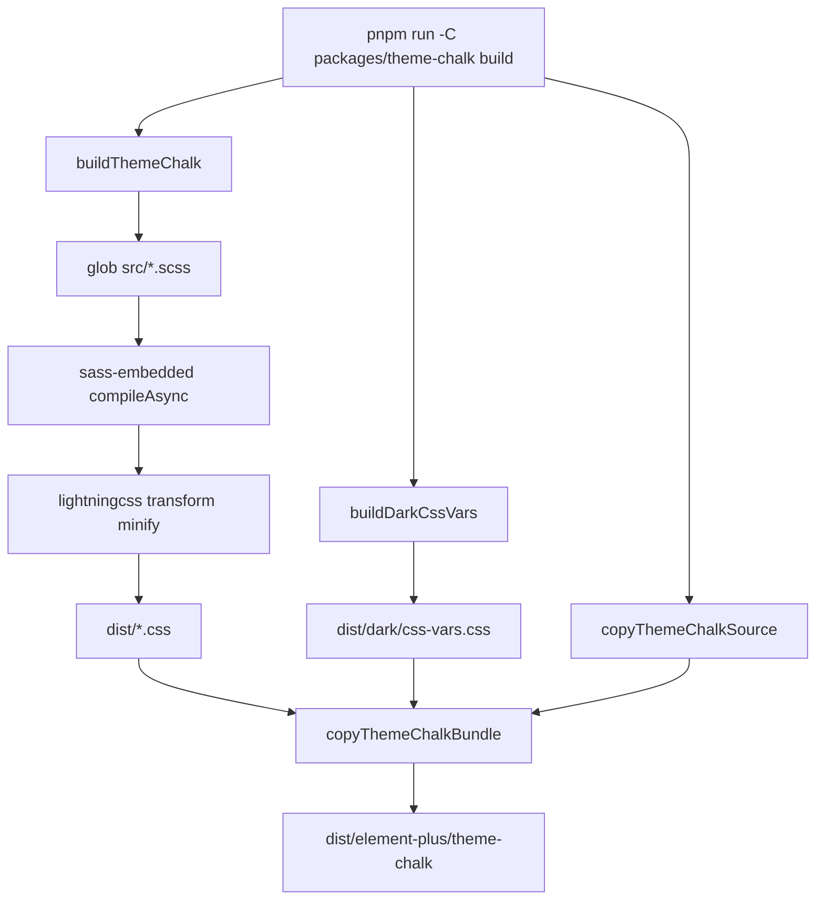
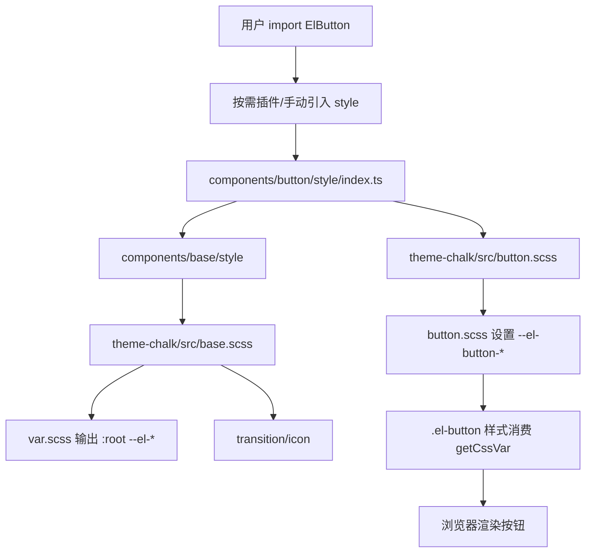
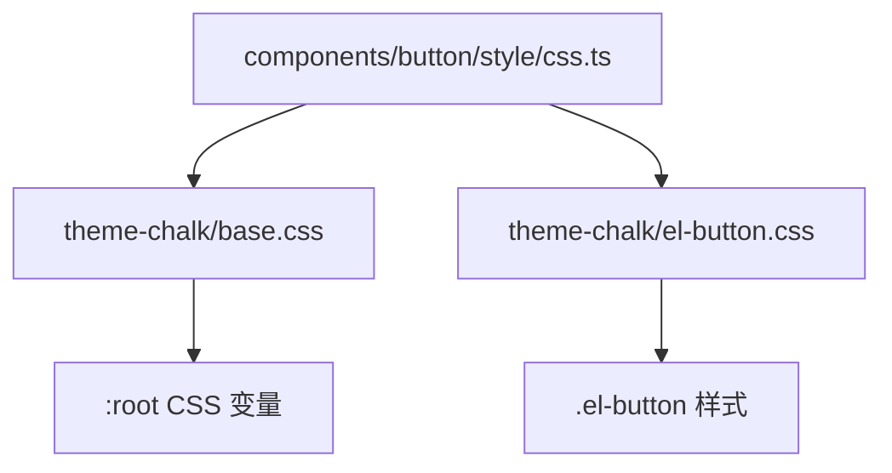
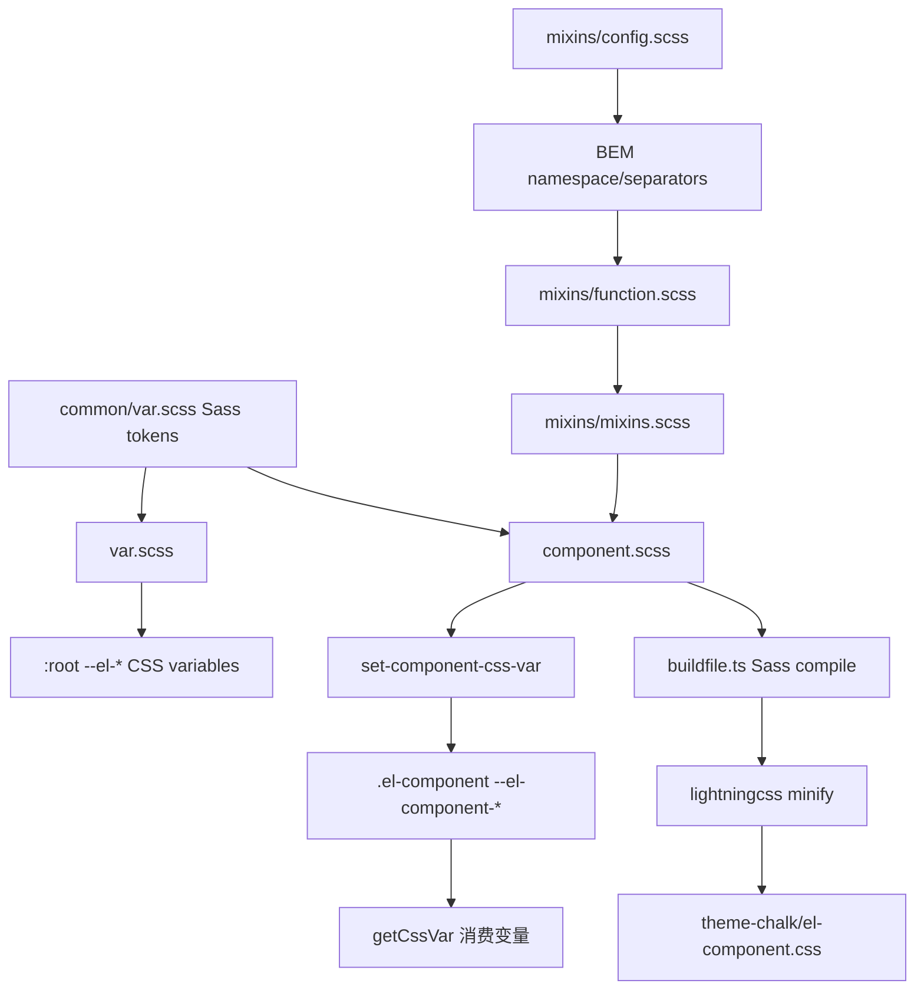
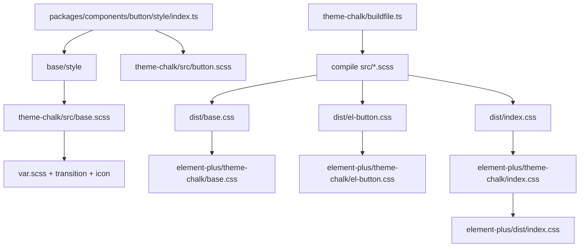

# Element Plus Theme Chalk 样式系统源码分析

> 源码位置：`element-plus-dev/packages/theme-chalk`
>
> 组件样式入口：`element-plus-dev/packages/components/*/style`
>
> 核心文件：`src/common/var.scss`、`src/var.scss`、`src/mixins/*`、`src/index.scss`
>
> 核心关键词：SCSS、BEM、CSS Variables、Design Tokens、按需样式、暗色模式、构建产物。

`theme-chalk` 是 Element Plus 的样式主题包。它不是某个组件，而是一整套组件库样式系统：用 Sass map 管理设计 token，用 mixin 生成 BEM class，用 CSS 变量支持运行时主题覆盖，再通过构建脚本输出全量 CSS 和按需 CSS。

一句话概括：

```text
theme-chalk 把 Sass token 编译成 --el-* CSS 变量，再让各组件 SCSS 通过 BEM mixin 和 getCssVar 消费这些变量。
```

## 1. 学习目标

`theme-chalk` 适合学习这些源码思想：

| 学习点 | 说明 |
| --- | --- |
| 组件库样式分层 | token、mixin、base、组件样式、构建产物分层清晰 |
| BEM 工程化 | 通过 `@include b/e/m/when` 统一生成 `.el-*` class |
| CSS 变量主题化 | 编译期 Sass map 输出运行时可覆盖的 `--el-*` 变量 |
| Design Token 管理 | 颜色、字体、间距、圆角、阴影、组件变量集中在 `common/var.scss` |
| 按需样式 | 每个组件有 `style/index.ts` 和 `style/css.ts` 两套入口 |
| 暗色模式 | `dark/css-vars.scss` 在 `html.dark` 下覆盖 CSS 变量 |
| 组件样式局部变量 | 组件内部先设置 `--el-button-*`，再在样式中消费 |
| 构建流程 | Sass 编译后用 lightningcss 压缩，并输出 `el-*.css` |
| 可定制主题 | 用户可通过覆盖 Sass 变量或 CSS 变量实现主题定制 |

学习这套系统时，要抓住三条主线：

```text
命名主线：config/function/mixins -> BEM class
变量主线：common/var.scss -> var.scss -> --el-* CSS var
产物主线：src/*.scss -> buildfile.ts -> dist/*.css -> element-plus/theme-chalk
```

## 2. 文件结构

源码目录：

```text
packages/theme-chalk
├── package.json
├── buildfile.ts
├── README.md
└── src
    ├── index.scss
    ├── base.scss
    ├── reset.scss
    ├── var.scss
    ├── display.scss
    ├── common
    │   ├── var.scss
    │   ├── transition.scss
    │   └── popup.scss
    ├── mixins
    │   ├── config.scss
    │   ├── function.scss
    │   ├── mixins.scss
    │   ├── _var.scss
    │   ├── _button.scss
    │   ├── _col.scss
    │   └── utils.scss
    ├── dark
    │   ├── var.scss
    │   └── css-vars.scss
    ├── color
    │   └── index.scss
    ├── date-picker
    │   ├── picker.scss
    │   ├── picker-panel.scss
    │   ├── time-picker.scss
    │   ├── time-range-picker.scss
    │   ├── time-spinner.scss
    │   └── ...
    └── *.scss
```

顶层 `src/*.scss` 基本对应一个组件或一个样式入口：

```text
button.scss
input.scss
dialog.scss
menu.scss
table.scss
table-v2.scss
time-picker.scss
virtual-list.scss
...
```

文件职责表：

| 文件/目录 | 职责 |
| --- | --- |
| `package.json` | 声明 `@element-plus/theme-chalk` 包、入口 `index.css`、构建脚本 |
| `buildfile.ts` | 编译 `src/*.scss`，压缩 CSS，生成 `el-*.css`、`base.css`、`index.css` |
| `src/index.scss` | 全量样式入口，`@use` base 和所有组件样式 |
| `src/base.scss` | 基础样式入口，包含变量、过渡、图标 |
| `src/var.scss` | 把 Sass token 输出为 `:root` 下的 CSS 变量 |
| `src/reset.scss` | body、a、heading、p 等基础 HTML 样式 |
| `src/display.scss` | 响应式隐藏工具类 |
| `src/common/var.scss` | 设计 token 和组件 token 的 Sass map 源头 |
| `src/common/transition.scss` | 全局 transition class |
| `src/common/popup.scss` | modal 遮罩、popup-parent 等公共弹层样式 |
| `src/mixins/config.scss` | 命名空间和 BEM 分隔符配置 |
| `src/mixins/function.scss` | BEM 名称和 CSS 变量名称拼接函数 |
| `src/mixins/mixins.scss` | BEM、状态、响应式、滚动条、暗色等 mixin |
| `src/mixins/_var.scss` | 把 Sass map 写成 CSS var 的 mixin |
| `src/mixins/_button.scss` | Button 类型、plain、dashed、size 样式 mixin |
| `src/mixins/_col.scss` | 栅格列响应式生成 mixin |
| `src/mixins/utils.scss` | clearfix、ellipsis、居中等工具 mixin |
| `src/dark/var.scss` | 暗色模式 token |
| `src/dark/css-vars.scss` | 输出 `html.dark` 下的 CSS 变量覆盖 |
| `src/color/index.scss` | 暗色模式颜色叠加工具函数 |
| `src/date-picker/*` | DatePicker/TimePicker 共享的面板样式 |
| `src/[component].scss` | 单个组件的实际样式 |

## 3. 入口链路

### 3.1 全量样式入口

`src/index.scss`：

```scss
@use './base.scss';
@use './button.scss';
@use './input.scss';
@use './dialog.scss';
@use './menu.scss';
@use './table.scss';
...
```

用户全量引入：

```ts
import 'element-plus/dist/index.css'
```

最终来自构建后的：

```text
element-plus/theme-chalk/index.css
```

`internal/build/buildfile.ts` 还会把它复制成：

```text
element-plus/dist/index.css
```

### 3.2 基础样式入口

`src/base.scss`：

```scss
@use 'var.scss';
@use 'common/transition.scss';
@use 'icon.scss';
```

组件按需样式通常先引入 base：

```ts
import '@element-plus/components/base/style'
import '@element-plus/theme-chalk/src/button.scss'
```

这样组件样式可以默认拿到 `:root` 变量、transition 和 icon 样式。

### 3.3 组件按需入口

以 Button 为例：

```ts
// packages/components/button/style/index.ts
import '@element-plus/components/base/style'
import '@element-plus/theme-chalk/src/button.scss'
```

构建后的 CSS 入口：

```ts
// packages/components/button/style/css.ts
import '@element-plus/components/base/style/css'
import '@element-plus/theme-chalk/el-button.css'
```

这对应两种场景：

| 文件 | 使用场景 |
| --- | --- |
| `style/index.ts` | 开发/源码构建，直接引入 SCSS |
| `style/css.ts` | 发布产物/运行时按需，直接引入编译后的 CSS |

## 4. Token / 变量系统

### 4.1 Sass token 源头

`src/common/var.scss` 是 token 的源头。

基础 token 示例：

```scss
$types: primary, success, warning, danger, error, info;

$colors: map.deep-merge(
  (
    'white': #ffffff,
    'black': #000000,
    'primary': ('base': #409eff),
    'success': ('base': #67c23a),
    'warning': ('base': #e6a23c),
    'danger': ('base': #f56c6c),
    'error': ('base': #f56c6c),
    'info': ('base': #909399),
  ),
  $colors
);
```

基础 token 类型：

| token | 内容 |
| --- | --- |
| `$colors` | primary/success/warning/danger/error/info 等颜色 |
| `$text-color` | primary/regular/secondary/placeholder/disabled |
| `$border-color` | 默认、light、lighter、extra-light、dark、darker |
| `$fill-color` | light/lighter/blank/dark 等填充色 |
| `$bg-color` | 页面、普通背景、overlay |
| `$border-radius` | base/small/round/circle |
| `$box-shadow` | 默认、light、lighter、dark |
| `$font-size` | extra-large 到 extra-small |
| `$z-index` | normal/top/popper |
| `$common-component-size` | large/default/small 尺寸 |
| `$breakpoints` | xs/sm/md/lg/xl 响应式断点 |

组件 token 示例：

```scss
$button: map.merge(
  (
    'font-weight': getCssVar('font-weight-primary'),
    'border-color': getCssVar('border-color'),
    'bg-color': getCssVar('fill-color', 'blank'),
    'text-color': getCssVar('text-color', 'regular'),
    'hover-text-color': getCssVar('color-primary'),
    'hover-bg-color': getCssVar('color-primary', 'light-9'),
  ),
  $button
);
```

组件 token 覆盖面很广，包括：

```text
button / input / table / pagination / popup / popover / tag / menu / form / avatar / upload ...
```

### 4.2 自动生成颜色阶梯

`common/var.scss` 会基于 base color 生成 light/dark 阶梯：

```scss
@each $type in $types {
  @for $i from 1 through 9 {
    @include set-color-mix-level($type, $i, 'light', $color-white);
  }
}

@each $type in $types {
  @include set-color-mix-level($type, 2, 'dark', $color-black);
}
```

因此有：

```text
--el-color-primary
--el-color-primary-light-3
--el-color-primary-light-5
--el-color-primary-light-7
--el-color-primary-light-9
--el-color-primary-dark-2
```

组件 hover、active、disabled 等状态大量依赖这些颜色阶梯。

### 4.3 CSS 变量输出

`src/var.scss` 把 Sass token 输出成 `:root` CSS var：

```scss
:root {
  @include set-css-var-value('color-white', $color-white);
  @include set-css-var-value('color-black', $color-black);
  @include set-component-css-var('font-size', $font-size);
  @include set-component-css-var('border-radius', $border-radius);
  @include set-component-css-var('component-size', $common-component-size);
}
```

浅色主题变量：

```scss
:root {
  color-scheme: light;

  @each $type in (primary, success, warning, danger, error, info) {
    @include set-css-color-type($colors, $type);
  }

  @include set-component-css-var('bg-color', $bg-color);
  @include set-component-css-var('text-color', $text-color);
  @include set-component-css-var('border-color', $border-color);
  @include set-component-css-var('fill-color', $fill-color);
  @include set-component-css-var('box-shadow', $box-shadow);
}
```

输出后类似：

```css
:root {
  --el-color-primary: #409eff;
  --el-color-primary-light-9: #ecf5ff;
  --el-text-color-primary: #303133;
  --el-border-radius-base: 4px;
  --el-component-size: 32px;
}
```

### 4.4 组件局部 CSS 变量

组件样式里常见这一句：

```scss
@include b(button) {
  @include set-component-css-var('button', $button);
}
```

它会在 `.el-button` 下生成：

```css
.el-button {
  --el-button-text-color: var(--el-text-color-regular);
  --el-button-bg-color: var(--el-fill-color-blank);
  --el-button-border-color: var(--el-border-color);
}
```

然后组件继续消费：

```scss
color: getCssVar('button', 'text-color');
background-color: getCssVar('button', 'bg-color');
border-color: getCssVar('button', 'border-color');
```

这形成两层变量：

```text
全局变量：--el-color-primary / --el-text-color-regular
组件变量：--el-button-text-color / --el-button-bg-color
```

组件变量的好处是可以局部覆盖：

```css
.my-danger-zone .el-button {
  --el-button-bg-color: #222;
}
```

## 5. BEM 命名系统

### 5.1 命名配置

`src/mixins/config.scss`：

```scss
$namespace: 'el' !default;
$common-separator: '-' !default;
$element-separator: '__' !default;
$modifier-separator: '--' !default;
$state-prefix: 'is-' !default;
```

所以最终 class 是：

```text
Block:    .el-button
Element:  .el-button__text
Modifier: .el-button--primary
State:    .is-disabled
```

### 5.2 函数层

`src/mixins/function.scss` 提供两个核心方向：

| 函数 | 作用 |
| --- | --- |
| `bem(block, element, modifier)` | 拼 BEM class 名 |
| `joinVarName(list)` | 拼 CSS var 名 |
| `getCssVarName(args...)` | 返回 `--el-*` 变量名 |
| `getCssVar(args...)` | 返回 `var(--el-*)` |
| `getCssVarWithDefault(args, default)` | 返回带 fallback 的 CSS var |

例子：

```scss
getCssVar('button', 'text-color')
```

等价于：

```css
var(--el-button-text-color)
```

### 5.3 mixin 层

`src/mixins/mixins.scss` 提供 BEM mixin：

| mixin | 示例 | 输出 |
| --- | --- | --- |
| `b(block)` | `@include b(button)` | `.el-button` |
| `e(element)` | `@include e(text)` | `.el-button__text` |
| `m(modifier)` | `@include m(primary)` | `.el-button--primary` |
| `when(state)` | `@include when(disabled)` | `.is-disabled` |
| `res(key)` | `@include res(md)` | media query |
| `dark(block)` | `@include dark(button)` | `html.dark .el-button` |

Button 示例：

```scss
@include b(button) {
  @include when(disabled) {
    cursor: not-allowed;
  }

  @include m(primary) {
    @include button-variant(primary);
  }

  @include e(text) {
    @include m(expand) {
      letter-spacing: 0.3em;
    }
  }
}
```

输出语义：

```text
.el-button.is-disabled
.el-button--primary
.el-button__text--expand
```

## 6. 组件样式组织

### 6.1 单组件 SCSS 模式

典型组件 SCSS 通常包含四类内容：

```text
1. @use common/var、mixins/mixins、mixins/var
2. 设置组件 CSS 变量
3. 写 block 基础样式
4. 写 element/modifier/state 样式
```

Button 示例：

```scss
@use 'common/var' as *;
@use 'mixins/button' as *;
@use 'mixins/mixins' as *;
@use 'mixins/var' as *;

@include b(button) {
  @include set-component-css-var('button', $button);
}

@include b(button) {
  display: inline-flex;
  color: getCssVar('button', 'text-color');
  background-color: getCssVar('button', 'bg-color');

  @include when(disabled) { ... }
  @include m(primary) { ... }
}
```

### 6.2 组件样式之间的依赖

有些组件样式只引用自己，有些会依赖基础组件样式。

以 TimePicker 为例：

```scss
@use './date-picker/picker.scss';
@use './date-picker/picker-panel.scss';
@use './date-picker/time-spinner.scss';
@use './date-picker/time-picker.scss';
@use './date-picker/time-range-picker.scss';
```

以 Menu 为例：

```text
menu.scss 里集中维护 menu / menu-item / sub-menu / menu-item-group
menu-item.scss、sub-menu.scss、menu-item-group.scss 文件存在但内容为空
```

这说明 theme-chalk 并不是机械地“一组件一文件完全独立”，而是允许强相关组件共享同一个样式文件。

### 6.3 栅格和工具类

`col.scss` 通过循环生成：

```text
.el-col-0 ~ .el-col-24
.el-col-offset-*
.el-col-pull-*
.el-col-push-*
.el-col-xs-* / sm / md / lg / xl
```

响应式断点来自：

```scss
$sm: 768px;
$md: 992px;
$lg: 1200px;
$xl: 1920px;
```

`display.scss` 生成：

```text
.hidden-xs-only
.hidden-sm-and-up
.hidden-md-and-down
...
```

## 7. 暗色模式

暗色模式相关文件：

```text
src/dark/var.scss
src/dark/css-vars.scss
src/color/index.scss
```

`dark/var.scss` 定义暗色 token：

| token | 暗色值 |
| --- | --- |
| `$bg-color` | page `#0a0a0a`，base `#141414`，overlay `#1d1e1f` |
| `$border-color` | 基于浅色边框加透明度后混合背景 |
| `$fill-color` | 基于浅色填充加透明度后混合背景 |
| `$text-color` | 基于 `#f0f5ff` 的不同透明度 |
| `$box-shadow` | 更重的暗色阴影 |
| `$button` | 覆盖 disabled text color |
| `$card` | 覆盖 card bg |
| `$empty` | 覆盖 Empty 插画填充色 |

为了避免透明色叠加问题，暗色模式会用 `mix-overlay-color` 把 rgba 叠到底色上，转成 hex。

`dark/css-vars.scss` 输出：

```scss
html.dark {
  color-scheme: dark;

  @each $type in (primary, success, warning, danger, error, info) {
    @include set-css-color-type($colors, $type);
  }

  @include set-component-css-var('bg-color', $bg-color);
  @include set-component-css-var('text-color', $text-color);
  @include set-component-css-var('border-color', $border-color);
  @include set-component-css-var('fill-color', $fill-color);
}
```

组件级暗色覆盖：

```scss
@include dark(button) {
  @include set-component-css-var('button', $button);
}
```

用户启用暗色模式时，核心是：

```html
<html class="dark">
```

并加载：

```ts
import 'element-plus/theme-chalk/dark/css-vars.css'
```

## 8. 构建流程

构建脚本：`packages/theme-chalk/buildfile.ts`

核心流程：



### 8.1 输出命名规则

`buildfile.ts` 中：

```ts
const noElPrefixFile = /(index|base|display)/

const outputName = noElPrefixFile.test(baseName)
  ? `${baseName}.css`
  : `el-${baseName}.css`
```

所以：

| SCSS | CSS |
| --- | --- |
| `src/index.scss` | `index.css` |
| `src/base.scss` | `base.css` |
| `src/display.scss` | `display.css` |
| `src/button.scss` | `el-button.css` |
| `src/dialog.scss` | `el-dialog.css` |
| `src/table-v2.scss` | `el-table-v2.css` |

### 8.2 为什么只 glob `src/*.scss`

构建脚本只编译：

```ts
glob('src/*.scss')
```

也就是说，`mixins/*`、`common/*`、`date-picker/*` 不会单独输出 CSS。它们只作为依赖被顶层 SCSS 引用。

例如：

```text
src/time-picker.scss
  -> @use date-picker/time-spinner.scss
  -> 编译成 el-time-picker.css
```

### 8.3 打包到 element-plus

`internal/build/buildfile.ts` 中会执行：

```ts
await run('pnpm run -C packages/theme-chalk build')
```

并复制：

```text
theme-chalk/index.css -> dist/index.css
```

`packages/element-plus/package.json` 声明：

```json
"style": "dist/index.css",
"sideEffects": [
  "dist/*",
  "theme-chalk/**/*.css",
  "theme-chalk/src/**/*.scss",
  "es/components/*/style/*",
  "lib/components/*/style/*"
]
```

`sideEffects` 很重要：它告诉打包器不要把样式 import 当作无副作用代码误删。

### 8.4 alias 处理

构建插件会把源码包名：

```text
@element-plus/theme-chalk
```

替换成发布包路径：

```text
element-plus/theme-chalk
```

这样源码内写：

```ts
import '@element-plus/theme-chalk/el-button.css'
```

发布后能变成用户可解析的：

```ts
import 'element-plus/theme-chalk/el-button.css'
```

## 9. 从组件到样式生效的链路

以 Button 为例：



构建后按需 CSS 链路：



## 10. 关键源码解释

### 10.1 `getCssVar` 如何工作

源码：

```scss
@function joinVarName($list) {
  $name: '--' + config.$namespace;
  @each $item in $list {
    @if $item != '' {
      $name: $name + '-' + $item;
    }
  }
  @return $name;
}

@function getCssVar($args...) {
  @return var(#{joinVarName($args)});
}
```

调用：

```scss
getCssVar('button', 'text-color')
```

结果：

```css
var(--el-button-text-color)
```

这个函数把所有变量命名统一起来，避免组件里手写 `--el-*` 字符串。

### 10.2 `set-component-css-var` 如何工作

源码：

```scss
@mixin set-component-css-var($name, $variables) {
  @each $attribute, $value in $variables {
    @if $attribute == 'default' {
      #{getCssVarName($name)}: #{$value};
    } @else {
      #{getCssVarName($name, $attribute)}: #{$value};
    }
  }
}
```

如果传入：

```scss
@include set-component-css-var('button', $button);
```

就会把 `$button` map 展开成：

```css
--el-button-font-weight: var(--el-font-weight-primary);
--el-button-border-color: var(--el-border-color);
--el-button-bg-color: var(--el-fill-color-blank);
```

### 10.3 BEM 的 `b/e/m/when`

源码：

```scss
@mixin b($block) {
  $B: $namespace + $common-separator + $block !global;

  .#{$B} {
    @content;
  }
}

@mixin when($state) {
  @at-root {
    &.#{$state-prefix + $state} {
      @content;
    }
  }
}
```

使用：

```scss
@include b(button) {
  @include when(disabled) {
    cursor: not-allowed;
  }
}
```

输出：

```css
.el-button.is-disabled {
  cursor: not-allowed;
}
```

### 10.4 Button 类型样式如何生成

`button.scss`：

```scss
@each $type in (primary, success, warning, danger, info) {
  @include m($type) {
    @include button-variant($type);
  }
}
```

`mixins/_button.scss`：

```scss
@mixin button-variant($type) {
  $button-color-types: (
    '': (
      'text-color': ('color', 'white'),
      'bg-color': ('color', $type),
      'border-color': ('color', $type),
    ),
    'hover': (
      'bg-color': ('color', $type, 'light-3'),
      'border-color': ('color', $type, 'light-3'),
    ),
    'disabled': (
      'bg-color': ('color', $type, 'light-5'),
      'border-color': ('color', $type, 'light-5'),
    ),
  );
}
```

它不是直接写死颜色，而是为 `.el-button--primary` 设置一组按钮 CSS 变量：

```text
--el-button-bg-color -> --el-color-primary
--el-button-hover-bg-color -> --el-color-primary-light-3
--el-button-disabled-bg-color -> --el-color-primary-light-5
```

再由通用 `.el-button` 样式消费。

### 10.5 Input 为什么大量使用 CSS var fallback

Input 里经常看到：

```scss
color: var(
  #{getCssVarName('input-text-color')},
  map.get($input, 'text-color')
);
```

这表示：

```text
优先使用运行时 CSS 变量；
如果变量不存在，回退到 Sass map 默认值。
```

这种写法让组件在局部 CSS 变量缺失时仍然有稳定默认样式。

### 10.6 暗色模式为什么只覆盖变量

暗色模式不是重写所有组件选择器，而是覆盖变量：

```scss
html.dark {
  @include set-component-css-var('bg-color', $bg-color);
  @include set-component-css-var('text-color', $text-color);
  @include set-component-css-var('border-color', $border-color);
  @include set-component-css-var('fill-color', $fill-color);
}
```

因为组件样式都消费 `getCssVar(...)`，所以变量变了，组件自然变暗。

这就是 CSS 变量主题化的价值。

## 11. 设计思想

### 11.1 为什么同时使用 Sass 变量和 CSS 变量

Sass 变量适合：

```text
编译期计算
颜色阶梯生成
map 合并
循环生成 class
复杂 mixin
```

CSS 变量适合：

```text
运行时覆盖
暗色模式切换
局部主题覆盖
用户自定义主题
避免重新编译
```

Element Plus 的策略是：

```text
Sass 负责生成和组织；
CSS 变量负责运行时生效。
```

### 11.2 为什么每个组件要有自己的 CSS 变量

如果所有组件都直接消费全局变量，局部定制会很粗：

```css
--el-color-primary: red;
```

这会影响所有组件。

有组件变量后，可以只改某个组件：

```css
.my-card .el-button {
  --el-button-bg-color: black;
}
```

因此变量层级是：

```text
全局基础变量 -> 组件变量 -> 具体 CSS 属性
```

### 11.3 为什么 BEM 用 mixin 而不是手写

手写 BEM class 容易出现：

```text
命名不一致
element/modifier 拼错
状态 class 不统一
namespace 改不了
嵌套输出不可控
```

Mixin 让所有组件共享：

```text
namespace = el
element separator = __
modifier separator = --
state prefix = is-
```

也为 ConfigProvider 的 namespace 能力留下基础。

### 11.4 为什么按需样式分 SCSS 和 CSS 两套入口

`style/index.ts`：

```text
适合源码开发、Vite/构建器处理 Sass、主题变量编译期覆盖。
```

`style/css.ts`：

```text
适合直接使用发布产物，不需要 Sass 编译。
```

这让用户既能：

```ts
import 'element-plus/es/components/button/style/css'
```

也能在源码构建环境里用：

```ts
import 'element-plus/es/components/button/style'
```

### 11.5 为什么空 SCSS 文件也存在

例如：

```text
menu-item.scss
sub-menu.scss
menu-item-group.scss
```

这些文件为空，但组件 style 入口仍然可以引用它们。

原因是组件粒度和样式组织粒度不一定一致：

```text
MenuItem/SubMenu 是独立组件；
但它们的样式集中在 menu.scss 里维护。
```

保留空文件可以让按需入口和组件目录结构一致，降低构建/生成脚本复杂度。

## 12. 可借鉴点

| 可借鉴点 | 业务组件库中的用法 |
| --- | --- |
| 独立 theme package | 把组件逻辑和样式主题分包管理 |
| Sass map 管 token | 用 map 管理颜色、尺寸、组件变量 |
| CSS var 作为运行时主题 API | 用户可以不重新编译就覆盖主题 |
| BEM mixin | 统一 class 命名，避免手写错误 |
| 组件变量层 | 让局部定制比全局 token 更精细 |
| 全量/按需双入口 | 同时支持 `index.css` 和 `el-button.css` |
| 暗色只覆盖变量 | 避免维护一套完整 dark 选择器 |
| 构建时复制 source | 发布包保留 SCSS，支持用户二次编译 |
| sideEffects 标记样式 | 防止打包器 tree-shaking 掉 CSS |
| 生成脚本统一新增组件样式入口 | 新组件默认创建 `style/index.ts`、`style/css.ts`、`theme-chalk/src/*.scss` |

## 13. 核心调用链图



## 14. 样式产物链路图



## 15. MiniThemeChalk 实现

下面写一个简化版样式系统，模拟 theme-chalk 的核心设计。

### 15.1 `_config.scss`

```scss
$namespace: 'my' !default;
$common-separator: '-' !default;
$element-separator: '__' !default;
$modifier-separator: '--' !default;
$state-prefix: 'is-' !default;
```

### 15.2 `_functions.scss`

```scss
@use 'config' as *;

@function join-var-name($list) {
  $name: '--' + $namespace;

  @each $item in $list {
    @if $item != '' {
      $name: $name + '-' + $item;
    }
  }

  @return $name;
}

@function css-var($args...) {
  @return var(#{join-var-name($args)});
}

@function css-var-name($args...) {
  @return join-var-name($args);
}
```

### 15.3 `_mixins.scss`

```scss
@use 'config' as *;

$B: null;

@mixin b($block) {
  $B: $namespace + $common-separator + $block !global;

  .#{$B} {
    @content;
  }
}

@mixin e($element) {
  @at-root {
    .#{$B + $element-separator + $element} {
      @content;
    }
  }
}

@mixin m($modifier) {
  @at-root {
    #{& + $modifier-separator + $modifier} {
      @content;
    }
  }
}

@mixin when($state) {
  @at-root {
    &.#{$state-prefix + $state} {
      @content;
    }
  }
}
```

### 15.4 `_var-mixins.scss`

```scss
@use 'sass:map';
@use 'functions' as *;

@mixin set-css-var-value($name, $value) {
  #{css-var-name($name)}: #{$value};
}

@mixin set-component-css-var($name, $variables) {
  @each $key, $value in $variables {
    @if $key == 'default' {
      #{css-var-name($name)}: #{$value};
    } @else {
      #{css-var-name($name, $key)}: #{$value};
    }
  }
}

@mixin css-var-from-global($var, $global-var) {
  #{css-var-name($var)}: var(#{css-var-name($global-var)});
}
```

### 15.5 `common/_var.scss`

```scss
@use 'sass:map';

$colors: () !default;
$colors: map.merge(
  (
    'primary': #409eff,
    'success': #67c23a,
    'danger': #f56c6c,
  ),
  $colors
);

$text-color: () !default;
$text-color: map.merge(
  (
    'primary': #303133,
    'regular': #606266,
    'placeholder': #a8abb2,
  ),
  $text-color
);

$button: () !default;
$button: map.merge(
  (
    'text-color': var(--my-text-color-regular),
    'bg-color': #ffffff,
    'border-color': #dcdfe6,
    'hover-text-color': var(--my-color-primary),
  ),
  $button
);
```

### 15.6 `var.scss`

```scss
@use 'sass:map';
@use 'common/var' as *;
@use 'var-mixins' as *;

:root {
  @include set-css-var-value('color-primary', map.get($colors, 'primary'));
  @include set-css-var-value('color-success', map.get($colors, 'success'));
  @include set-css-var-value('color-danger', map.get($colors, 'danger'));

  @include set-css-var-value('text-color-primary', map.get($text-color, 'primary'));
  @include set-css-var-value('text-color-regular', map.get($text-color, 'regular'));
  @include set-css-var-value('text-color-placeholder', map.get($text-color, 'placeholder'));
}
```

### 15.7 `button.scss`

```scss
@use 'common/var' as *;
@use 'functions' as *;
@use 'mixins' as *;
@use 'var-mixins' as *;

@include b(button) {
  @include set-component-css-var('button', $button);
}

@include b(button) {
  display: inline-flex;
  align-items: center;
  justify-content: center;
  height: 32px;
  padding: 8px 15px;
  border: 1px solid css-var('button', 'border-color');
  border-radius: 4px;
  color: css-var('button', 'text-color');
  background: css-var('button', 'bg-color');
  cursor: pointer;

  &:hover {
    color: css-var('button', 'hover-text-color');
  }

  @include when(disabled) {
    cursor: not-allowed;
    opacity: 0.5;
  }

  @include m(primary) {
    @include css-var-from-global(('button', 'text-color'), ('color-white'));
    @include css-var-from-global(('button', 'bg-color'), ('color-primary'));
    @include css-var-from-global(('button', 'border-color'), ('color-primary'));
  }
}
```

### 15.8 `index.scss`

```scss
@use './var.scss';
@use './button.scss';
```

这个 Mini 版保留了 theme-chalk 的核心骨架：

```text
config -> functions -> mixins -> Sass token -> CSS var -> component.scss
```

和 Element Plus 的差距：

| 能力 | MiniThemeChalk | Element Plus theme-chalk |
| --- | --- | --- |
| BEM mixin | 支持简化版 | 完整支持特殊嵌套、modifier、pseudo |
| CSS 变量 | 支持 | 支持全量 token 和组件变量 |
| 颜色阶梯 | 不支持 | 自动生成 light/dark 阶梯 |
| 暗色模式 | 不支持 | `html.dark` 变量覆盖 |
| 按需构建 | 不支持 | 生成 `el-*.css` |
| 响应式工具 | 不支持 | breakpoint + col/display |
| 组件覆盖 | 简化 | 大量组件 token |
| 构建压缩 | 不支持 | sass-embedded + lightningcss |

## 总结

theme-chalk 的源码主线可以概括为：

```text
common/var.scss 定义 Sass token
  -> var.scss 输出 :root CSS 变量
  -> mixins 统一 BEM 和变量函数
  -> 组件 SCSS 设置组件级变量并消费变量
  -> buildfile.ts 编译 src/*.scss 为 index.css/base.css/el-*.css
  -> 组件 style 入口实现按需引入
```

它最值得学习的是“编译期能力”和“运行时能力”的分工：

| 层 | 职责 |
| --- | --- |
| Sass map | 管理默认 token，支持编译期覆盖 |
| Sass mixin/function | 生成 BEM、变量名、颜色阶梯、响应式 class |
| CSS variables | 支持运行时主题覆盖和暗色切换 |
| component.scss | 使用统一 token 写具体组件样式 |
| buildfile.ts | 输出全量和按需 CSS 产物 |

如果前面的 Button/Menu/TimePicker 是单个组件的“身体”，`theme-chalk` 就是 Element Plus 的“皮肤和血液”：它让所有组件看起来统一，也让主题定制不需要改组件逻辑。
