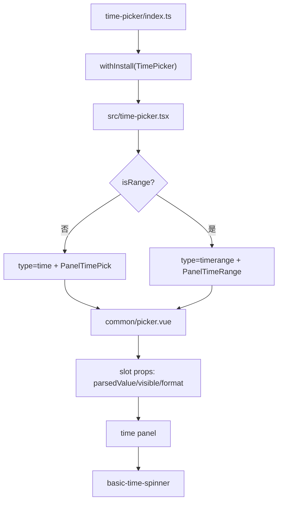
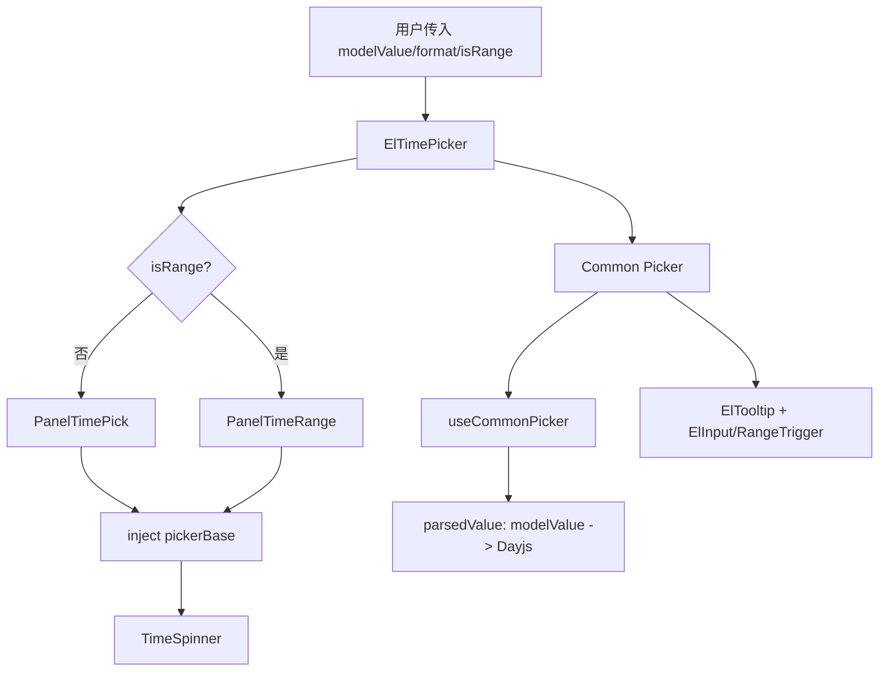
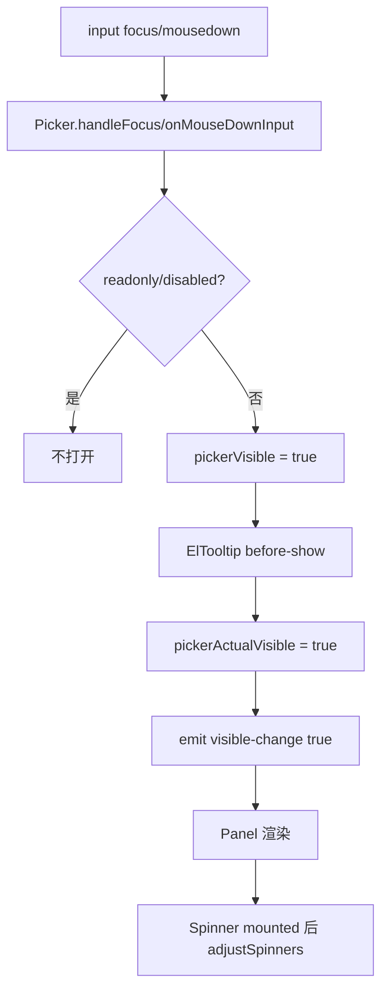
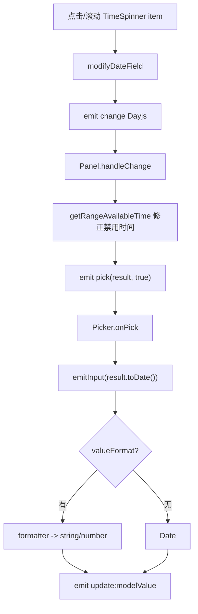
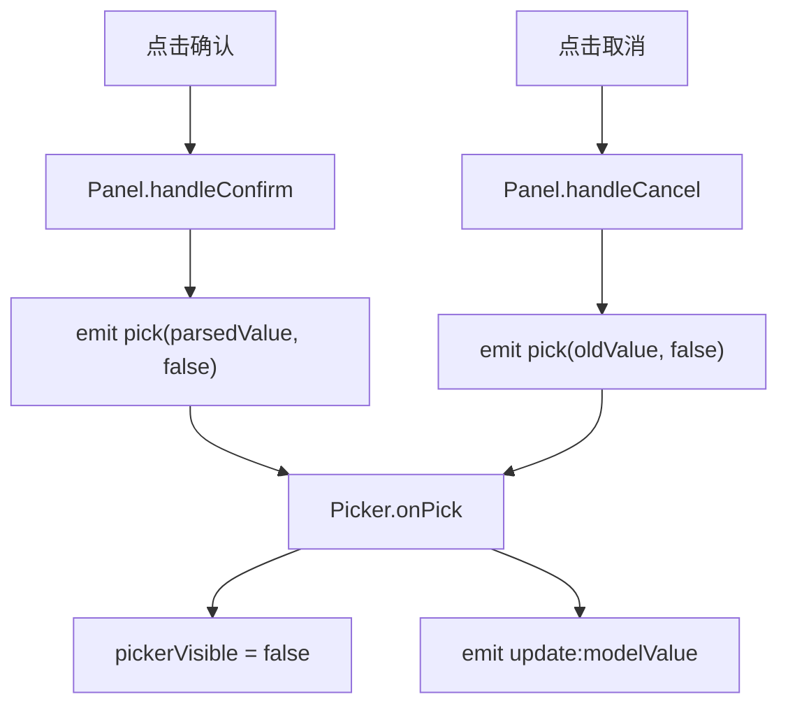
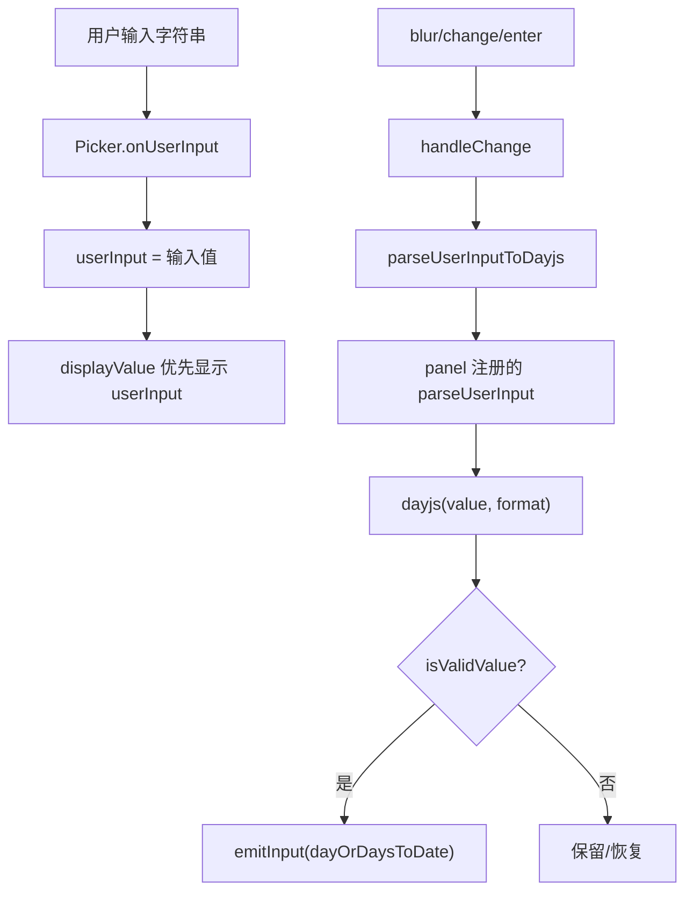
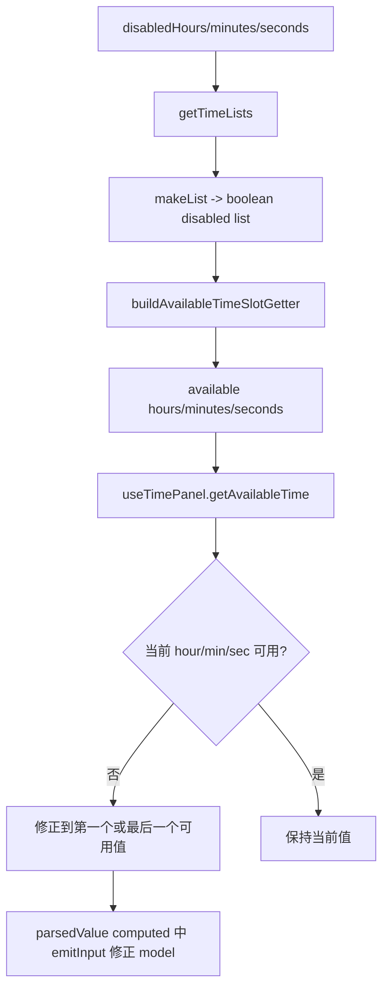
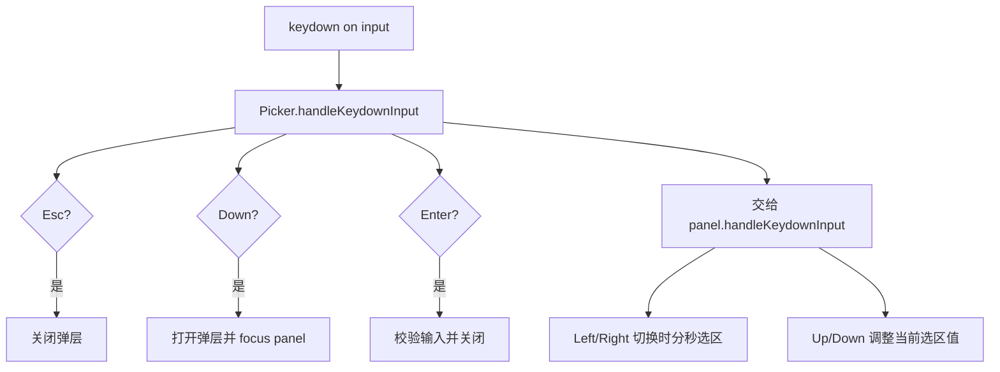
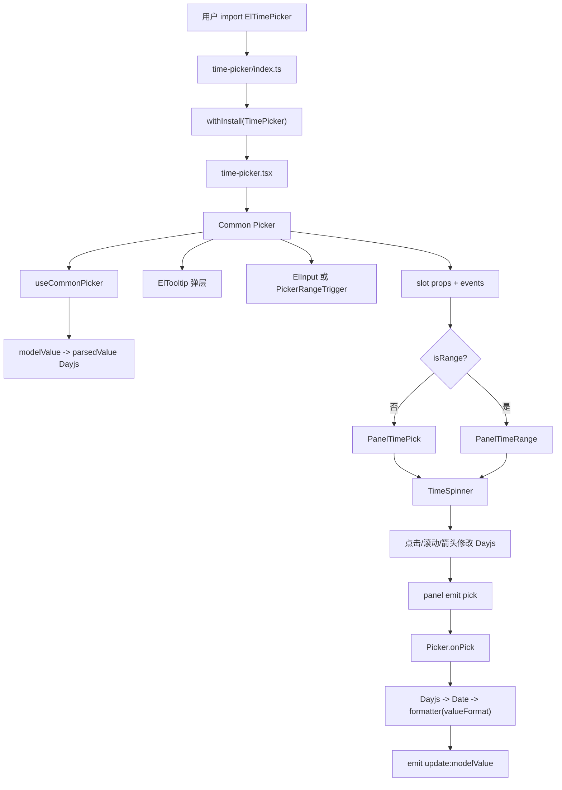

# Element Plus TimePicker 组件源码分析

> 源码位置：`element-plus-dev/packages/components/time-picker`
>
> 样式位置：`element-plus-dev/packages/theme-chalk/src/time-picker.scss`
>
> 主要导出：`ElTimePicker`、`CommonPicker`、`TimePickPanel`
>
> 核心关键词：通用 Picker、Tooltip 弹层、Dayjs 解析、单值/范围面板、时间滚轮、禁用时间、键盘选择、表单校验。

`TimePicker` 是一个典型的“输入框 + 弹层 + 面板 + 滚轮选择器”组合组件。它自身入口很薄，真正复杂度分布在三层：

```text
ElTimePicker：决定单选/范围，组装 CommonPicker 和面板
CommonPicker：负责输入框、弹层、清空、键盘、表单校验、model 同步
TimePanel + TimeSpinner：负责小时/分钟/秒选择、禁用项、确认/取消
```

一句话概括：

```text
TimePicker 把 modelValue 转成 Dayjs，再通过面板和 spinner 修改时间，最后按 valueFormat 格式化后 emit update:modelValue。
```

## 1. 学习目标

TimePicker 适合学习这些源码思想：

| 学习点 | 说明 |
| --- | --- |
| 通用 Picker 抽象 | 输入框、弹层、清空、键盘、表单校验都放在 `common/picker.vue` |
| 面板插槽协议 | `Picker` 不关心具体面板，通过 slot 把 `parsedValue/visible/format` 传给面板 |
| 反向能力注册 | 面板通过 `set-picker-option` 把解析、校验、键盘处理注册回 Picker |
| Dayjs 数据流 | 外部 `Date/string/number` 统一解析成 Dayjs，选择后再转回 Date 或格式化值 |
| 单值/范围复用 | 单值和范围共用 spinner，只是面板组织方式不同 |
| 禁用时间算法 | `disabledHours/minutes/seconds` 先生成 disabled list，再转换成 available list 修正值 |
| 滚轮选择器 | 小时、分钟、秒三列滚动，scrollTop 反推当前值 |
| 键盘可操作 | 左右切换选区，上下调整当前选区的时间值 |
| 表单集成 | 接入 FormItem 的 disabled、size、validate、id/label 可访问性 |

TimePicker 源码的核心不是“渲染几个时间数字”，而是：

```text
如何在输入字符串、弹层选择、禁用规则、格式化 model 之间保持一致。
```

## 2. 文件结构

源码文件：

```text
packages/components/time-picker
├── index.ts
├── src
│   ├── time-picker.tsx
│   ├── constants.ts
│   ├── utils.ts
│   ├── common
│   │   ├── picker.vue
│   │   ├── picker-range-trigger.vue
│   │   └── props.ts
│   ├── composables
│   │   ├── use-common-picker.ts
│   │   ├── use-time-picker.ts
│   │   └── use-time-panel.ts
│   ├── props
│   │   ├── basic-time-spinner.ts
│   │   ├── panel-time-picker.ts
│   │   ├── panel-time-range.ts
│   │   └── shared.ts
│   └── time-picker-com
│       ├── basic-time-spinner.vue
│       ├── panel-time-pick.vue
│       └── panel-time-range.vue
├── style
│   ├── index.ts
│   └── css.ts
└── __tests__
    └── time-picker.test.tsx
```

文件职责表：

| 文件 | 职责 |
| --- | --- |
| `index.ts` | 用 `withInstall` 导出 `ElTimePicker`，并导出工具、常量、通用 Picker |
| `src/time-picker.tsx` | TimePicker 入口组件，选择单值面板或范围面板 |
| `src/common/picker.vue` | 通用 Picker，管理输入框、弹层、显示值、清空、键盘、blur/change |
| `src/common/picker-range-trigger.vue` | 范围输入框，渲染两个 input 和分隔符 |
| `src/common/props.ts` | TimePicker 通用 props、类型、PickerOptions 协议 |
| `src/composables/use-common-picker.ts` | modelValue 和 Dayjs 的解析/格式化、pickerVisible、onPick |
| `src/composables/use-time-picker.ts` | disabled time list、available time getter、oldValue |
| `src/composables/use-time-panel.ts` | 根据可用时分秒修正时间，收集 spinner 注册的方法 |
| `src/time-picker-com/panel-time-pick.vue` | 单值时间面板 |
| `src/time-picker-com/panel-time-range.vue` | 时间范围面板 |
| `src/time-picker-com/basic-time-spinner.vue` | 小时/分钟/秒滚轮选择器 |
| `src/props/*` | 面板和 spinner props |
| `src/constants.ts` | 默认格式、注入 key、timeUnits |
| `src/utils.ts` | parse/format/valueEquals/makeList/buildTimeList 等工具 |
| `style/index.ts` | SCSS 样式入口 |
| `style/css.ts` | CSS 样式入口 |
| `theme-chalk/src/time-picker.scss` | 聚合 time-picker 所需样式 |
| `__tests__/time-picker.test.tsx` | 格式化、选择、清空、禁用时间、范围、键盘、a11y 等测试 |

## 3. 入口链路

入口文件：`packages/components/time-picker/index.ts`

核心代码：

```ts
import { withInstall } from '@element-plus/utils'
import TimePicker from './src/time-picker'
import CommonPicker from './src/common/picker.vue'
import TimePickPanel from './src/time-picker-com/panel-time-pick.vue'

export const ElTimePicker = withInstall(TimePicker)
export { CommonPicker, TimePickPanel }
export default ElTimePicker
```

`time-picker.tsx` 决定面板类型：

```ts
const [type, Panel] = props.isRange
  ? ['timerange', TimeRangePanel]
  : ['time', TimePickPanel]
```

渲染时：

```tsx
<Picker
  {...props}
  ref={commonPicker}
  type={type}
  format={props.format ?? DEFAULT_FORMATS_TIME}
  onUpdate:modelValue={modelUpdater}
>
  {{
    default: (props) => <Panel {...props} />,
  }}
</Picker>
```

入口链路图：



## 4. Props / Emits / Slots

### 4.1 Props

`timePickerDefaultProps` 定义在 `src/common/props.ts`。TimePicker 在此基础上额外声明 `isRange`。

| 分类 | prop | 说明 |
| --- | --- | --- |
| 绑定值 | `modelValue` | 支持 `Date`、`string`、`number`、数组或 `null` |
| 格式 | `format` | 输入框显示格式，默认 `HH:mm:ss` |
| 格式 | `valueFormat` | 绑定值格式，不传时默认 emit `Date` |
| 行为 | `isRange` | 是否选择时间范围 |
| 行为 | `automaticDropdown` | focus 时是否自动打开弹层，默认 `true` |
| 行为 | `editable` | 输入框是否可编辑，默认 `true` |
| 行为 | `saveOnBlur` | 空值 focus 时是否自动填当前/默认时间，默认 `true` |
| 行为 | `clearable` | 是否显示清空按钮，默认 `true` |
| 行为 | `readonly` / `disabled` | 只读/禁用 |
| 输入 | `placeholder` | 单值占位 |
| 输入 | `startPlaceholder` / `endPlaceholder` | 范围输入占位 |
| 输入 | `rangeSeparator` | 范围分隔符，默认 `-` |
| 弹层 | `placement` | 弹层位置，默认 `bottom` |
| 弹层 | `fallbackPlacements` | Popper fallback 位置 |
| 弹层 | `popperClass` / `popperStyle` | 弹层样式 |
| 弹层 | `popperOptions` | Popper.js 配置 |
| 图标 | `prefixIcon` / `clearIcon` | 前缀和清空图标 |
| 时间 | `defaultValue` | 没有值时面板默认时间 |
| 时间 | `disabledHours` | 禁用小时函数 |
| 时间 | `disabledMinutes` | 禁用分钟函数 |
| 时间 | `disabledSeconds` | 禁用秒函数 |
| 时间 | `arrowControl` | 是否使用上下箭头而不是滚轮 |
| 表单 | `size` / `validateEvent` | 表单尺寸和校验控制 |
| a11y | `ariaLabel` / `tabindex` | 可访问性属性 |

### 4.2 Emits

入口 `TimePicker` 显式声明的是：

| 事件 | 说明 |
| --- | --- |
| `update:modelValue` | model 更新 |

通用 `Picker` 会发出更多事件，这些会通过组件根节点 fallthrough 传递给用户监听：

| 事件 | 触发时机 |
| --- | --- |
| `change` | 真实值和打开时的值不同，关闭或确认后触发 |
| `focus` | 输入框 focus |
| `blur` | 输入框 blur |
| `clear` | 点击清空 |
| `visible-change` | 弹层显示/隐藏 |
| `keydown` | 输入框键盘事件 |
| `calendar-change` / `panel-change` | 与日期类 Picker 共用的面板事件 |

### 4.3 Slots

TimePicker 对用户的 slot 很少，主要是内部 Picker slot 协议。

`Picker` 向面板传递：

```vue
<slot
  :visible="pickerVisible"
  :actual-visible="pickerActualVisible"
  :parsed-value="parsedValue"
  :format="format"
  :type="type"
  :default-value="defaultValue"
  @pick="onPick"
  @select-range="setSelectionRange"
  @set-picker-option="onSetPickerOption"
/>
```

这个 slot 协议让 `Picker` 可以复用给 DatePicker、DateTimePicker、TimePicker。

范围输入还有一个用户可覆盖的 slot：

| slot | 说明 |
| --- | --- |
| `range-separator` | 自定义范围分隔符 |

## 5. 内部状态

### 5.1 ElTimePicker

入口组件只维护一个 ref：

```ts
const commonPicker = ref<InstanceType<typeof Picker>>()
```

它通过 expose 暴露：

| 方法 | 作用 |
| --- | --- |
| `focus` | 聚焦输入框 |
| `blur` | 失焦输入框 |
| `handleOpen` | 打开弹层 |
| `handleClose` | 关闭弹层 |

入口还 provide：

```ts
provide(PICKER_POPPER_OPTIONS_INJECTION_KEY, props.popperOptions)
```

`Picker` 注入后传给 `ElTooltip`。

### 5.2 useCommonPicker

`useCommonPicker` 是 model 和 Dayjs 的核心转换层。

关键状态：

| 状态 | 说明 |
| --- | --- |
| `pickerVisible` | 弹层是否打开 |
| `pickerActualVisible` | 弹层 transition 实际可见状态 |
| `userInput` | 用户正在输入的字符串，单值是 string，范围是 `[start,end]` |
| `parsedValue` | `modelValue` 解析后的 Dayjs 或 Dayjs[] |
| `pickerOptions` | 面板反向注册回来的能力 |
| `valueIsEmpty` | 当前 model 是否为空 |

`parsedValue` 的逻辑：

```text
modelValue 为空 -> 调用面板注册的 getDefaultValue
modelValue 非空 -> parseDate(modelValue, valueFormat)
如果面板提供 getRangeAvailableTime -> 修正到可用时间
如果修正后和原值不同且 model 非空 -> emitInput 修正 model
```

这个设计解释了测试中的行为：

```text
disabled-hours 更新后，如果当前 model 落入禁用时间，TimePicker 会自动修正到可用时间。
```

### 5.3 Picker

`common/picker.vue` 管理输入框和弹层。

主要状态：

| 状态 | 说明 |
| --- | --- |
| `valueOnOpen` | 打开弹层时的值，用于判断是否触发 change |
| `hovering` | 鼠标是否悬停，用于显示清空按钮 |
| `isFocused` | 输入框是否聚焦 |
| `refPopper` | Tooltip 实例 |
| `inputRef` | 输入框或范围输入组件实例 |

重要 computed：

| computed | 说明 |
| --- | --- |
| `displayValue` | 输入框显示值，优先 userInput，其次 formatted parsedValue |
| `isRangeInput` | `type.includes('range')` |
| `isTimePicker` | `type.startsWith('time')` |
| `triggerIcon` | Time 类默认 `Clock`，日期类默认 `Calendar` |
| `showClearBtn` | clearable + 非 disabled/readonly + 非空 + hover/focus |

### 5.4 provide / inject

`Picker` provide：

```ts
provide(PICKER_BASE_INJECTION_KEY, {
  props,
  emptyValues,
})

provide(ROOT_COMMON_PICKER_INJECTION_KEY, commonPicker)
```

时间面板 inject `PICKER_BASE_INJECTION_KEY`，拿到：

```text
arrowControl
disabledHours / disabledMinutes / disabledSeconds
defaultValue
modelValue
emptyValues
```

`basic-time-spinner` 也 inject `PICKER_BASE_INJECTION_KEY`，拿到：

```text
isRange
format
saveOnBlur
```

### 5.5 TimePanel

单值面板 `panel-time-pick.vue` 维护：

| 状态/方法 | 说明 |
| --- | --- |
| `selectionRange` | 当前输入框中被选中的时/分/秒片段 |
| `oldValue` | 打开前旧值，用于 cancel |
| `showSeconds` | format 是否包含 `ss` |
| `amPmMode` | format 是否包含 `A` 或 `a` |
| `isValidValue` | 当前时间是否符合禁用规则 |
| `getRangeAvailableTime` | 把禁用时间修正到可用时间 |
| `handleKeydown` | 左右切换片段，上下调整时间 |

范围面板 `panel-time-range.vue` 额外维护：

| 状态/方法 | 说明 |
| --- | --- |
| `startTime` / `endTime` | 范围两侧 Dayjs |
| `btnConfirmDisabled` | start > end 时禁用确认按钮 |
| `disabledHours_` / `disabledMinutes_` / `disabledSeconds_` | 结合开始/结束关系后的禁用规则 |
| `setMinSelectionRange` / `setMaxSelectionRange` | 选中开始或结束输入框片段 |

### 5.6 TimeSpinner

`basic-time-spinner.vue` 是真正的时间滚轮。

关键 computed：

| computed | 说明 |
| --- | --- |
| `spinnerItems` | 根据 `showSeconds` 决定显示 `hours/minutes/seconds` 还是只显示前两个 |
| `timePartials` | 从 `spinnerDate` 取出 hour/minute/second |
| `timeList` | 当前时分秒的 disabled boolean list |
| `arrowControlTimeList` | 箭头模式下只显示 `[prev,current,next]` |

它支持两种渲染：

```text
普通模式：ElScrollbar + 0..23 / 0..59 列表
arrowControl：上下箭头 + prev/current/next 三项
```

## 6. 核心流程

### 6.1 初始化流程



### 6.2 打开弹层流程



### 6.3 选择时间流程



### 6.4 确认 / 取消流程



`oldValue` 来自 `useOldValue`，它会在弹层关闭时记录当前 parsedValue，用于下次取消恢复。

### 6.5 用户手动输入流程



### 6.6 禁用时间修正流程



### 6.7 键盘流程



## 7. 关键源码解释

### 7.1 TimePicker 为什么很薄

入口组件只做三件事：

```text
1. 根据 isRange 选择 Panel
2. 给 Picker 设置 type 和 format
3. 暴露 focus/blur/open/close
```

这说明 TimePicker 的设计重点是复用通用 Picker，而不是在入口组件里堆逻辑。

### 7.2 PickerOptions 反向注册

`Picker` 需要解析输入、校验值、处理键盘，但它不知道当前面板是时间、日期还是范围。

所以面板会主动注册能力：

```ts
emit('set-picker-option', ['isValidValue', isValidValue])
emit('set-picker-option', ['parseUserInput', parseUserInput])
emit('set-picker-option', ['handleKeydownInput', handleKeydown])
emit('set-picker-option', ['getRangeAvailableTime', getRangeAvailableTime])
emit('set-picker-option', ['getDefaultValue', getDefaultValue])
emit('set-picker-option', ['handleCancel', handleCancel])
```

`Picker` 收到后写入：

```ts
pickerOptions.value[e[0]] = e[1]
pickerOptions.value.panelReady = true
```

这是 TimePicker 源码最关键的协作模式：

```text
外层负责通用交互；
内层面板把领域能力注册给外层。
```

### 7.3 displayValue 如何决定输入框显示

`displayValue` 优先级：

```text
1. 如果 userInput 是数组，范围输入优先显示用户输入
2. 如果 userInput 非 null，单值输入优先显示用户输入
3. 如果 TimePicker 空值且 saveOnBlur=false，显示空字符串
4. 如果弹层关闭且值为空，显示空字符串
5. 否则显示 parsedValue.format(format)
```

这解释了测试中的行为：

```text
saveOnBlur=false 时，空值 focus 后输入框仍保持空，不自动填默认时间。
```

### 7.4 onPick 如何更新 model

`useCommonPicker.onPick`：

```ts
const onPick = (date = '', visible = false) => {
  pickerVisible.value = visible
  let result
  if (isArray(date)) {
    result = date.map((_) => _.toDate())
  } else {
    result = date ? date.toDate() : date
  }
  userInput.value = null
  emitInput(result)
}
```

关键点：

| 逻辑 | 说明 |
| --- | --- |
| `visible` | 面板选择时可保持弹层打开，确认时关闭 |
| `Dayjs -> Date` | 内部用 Dayjs，外部默认拿 Date |
| `emitInput` | 最终再根据 `valueFormat` 决定 emit Date 还是格式化字符串 |

### 7.5 valueFormat 如何影响输出

`emitInput`：

```ts
if (isArray(input)) {
  formatted = input.map((item) => formatter(item, props.valueFormat, lang.value))
} else if (input) {
  formatted = formatter(input, props.valueFormat, lang.value)
}
const emitVal = input ? formatted : input
emit('update:modelValue', emitVal, lang.value)
```

`formatter`：

```ts
if (isEmpty(format)) return date
if (format === 'x') return +date
return dayjs(date).locale(lang).format(format)
```

所以：

```text
不传 valueFormat -> emit Date
valueFormat="HH:mm:ss" -> emit "10:00:00"
valueFormat="x" -> emit timestamp number
```

### 7.6 禁用时间如何生成

`makeList(total, method)` 会返回 boolean 数组：

```text
index 是具体数值；
true 表示禁用；
false 表示可选。
```

例如：

```ts
disabledHours() => [0, 1, 2]
makeList(24) => [true, true, true, false, ...]
```

`buildAvailableTimeSlotGetter` 再把 disabled list 转成 available list：

```text
[true, true, false, false] -> [2, 3]
```

`useTimePanel.getAvailableTime` 按 hour/minute/second 依次修正：

```text
当前小时不可用 -> 改成第一个可用小时
当前分钟不可用 -> 改成第一个可用分钟
当前秒不可用 -> 改成第一个可用秒
```

范围面板会额外把开始/结束顺序合并进禁用规则：

```text
start 不能晚于 end；
end 不能早于 start。
```

### 7.7 TimeSpinner 普通滚轮模式

普通模式渲染三个 `ElScrollbar`：

```vue
<el-scrollbar v-for="item in spinnerItems">
  <li v-for="(disabled, key) in timeList[item]">
    {{ key }}
  </li>
</el-scrollbar>
```

滚动时通过 `scrollTop` 反推出当前值：

```ts
const value = Math.min(
  Math.round((scrollTop - offset) / itemHeight),
  type === 'hours' ? 23 : 59
)
modifyDateField(type, value)
```

点击时直接改对应字段：

```ts
props.spinnerDate.hour(value).minute(minutes).second(seconds)
```

### 7.8 TimeSpinner arrowControl 模式

`arrowControl` 模式不显示完整列表，而是：

```text
上箭头
上一项 / 当前项 / 下一项
下箭头
```

核心函数：

```ts
const next = findNextUnDisabled(label, now, step, total)
modifyDateField(label, next)
```

`findNextUnDisabled` 会跳过禁用项，并在边界处循环。

测试里验证了：

```text
如果 23 被禁用，从 22 再向下会回到 20，而不是选中禁用值。
```

### 7.9 AM/PM 格式

`amPmMode` 来自 format：

```ts
if (props.format.includes('A')) return 'A'
if (props.format.includes('a')) return 'a'
return ''
```

渲染小时：

```text
key % 12 || 12
hour < 12 ? am : pm
```

所以：

```text
18:40 with "hh-mm:ss A" -> "06-40:00 PM"
```

## 8. 样式和 BEM

样式入口：

```ts
import '@element-plus/components/base/style'
import '@element-plus/theme-chalk/src/time-picker.scss'
import '@element-plus/components/input/style'
import '@element-plus/components/scrollbar/style'
import '@element-plus/components/popper/style'
```

`theme-chalk/src/time-picker.scss` 聚合：

```scss
@use './date-picker/picker.scss';
@use './date-picker/picker-panel.scss';
@use './date-picker/time-spinner.scss';
@use './date-picker/time-picker.scss';
@use './date-picker/time-range-picker.scss';
```

主要 BEM class：

| class | 作用 |
| --- | --- |
| `.el-date-editor` | 输入框外层，TimePicker 复用 DatePicker 输入样式 |
| `.el-date-editor--time` | 单值时间输入 |
| `.el-date-editor--timerange` | 范围时间输入 |
| `.el-picker__popper` | 弹层 |
| `.el-picker-panel` | 面板容器 |
| `.el-time-panel` | 单值时间面板 |
| `.el-time-panel__content` | spinner 内容区 |
| `.el-time-panel__footer` | 确认/取消 footer |
| `.el-time-panel__btn` | footer 按钮 |
| `.el-time-range-picker` | 时间范围面板 |
| `.el-time-range-picker__cell` | 开始/结束两列 |
| `.el-time-spinner` | 时间滚轮 |
| `.el-time-spinner__wrapper` | 小时/分钟/秒列容器 |
| `.el-time-spinner__list` | 时间列表 |
| `.el-time-spinner__item` | 时间项 |
| `.el-time-spinner__item.is-active` | 当前选中项 |
| `.el-time-spinner__item.is-disabled` | 禁用项 |

布局细节：

| 样式 | 说明 |
| --- | --- |
| `.el-time-panel` width `180px` | 单值面板宽度 |
| `.el-time-range-picker` width `354px` | 范围面板宽度 |
| `.has-seconds .el-time-spinner__wrapper` width `33.3%` | 显示秒时三列平分 |
| 默认 `.el-time-spinner__wrapper` width `50%` | 不显示秒时两列平分 |
| `.el-time-spinner__list::before/after` height `80px` | 给滚动列表上下留空，方便中间对齐 |
| `.el-time-panel__content::before` | 画中间选中区域边框 |

## 9. 设计思想

### 9.1 为什么抽出 CommonPicker

TimePicker、DatePicker、DateTimePicker 都需要：

```text
输入框
弹层
清空
focus/blur
键盘
表单校验
modelValue 解析和格式化
```

把这些放进 `common/picker.vue` 后，具体面板只需要关心自己的领域：

```text
TimePanel 只关心如何选择时间；
DatePanel 只关心如何选择日期。
```

### 9.2 为什么用反向注册而不是直接 import

`Picker` 不能直接 import TimePanel 的解析逻辑，因为它是通用组件。

所以采用：

```text
Panel -> emit set-picker-option -> Picker 保存 pickerOptions
```

这让 Picker 保持通用，也让面板能按自己的类型提供不同实现。

### 9.3 为什么内部统一用 Dayjs

外部 model 支持 `Date/string/number`，如果直接操作会非常混乱。

TimePicker 的策略是：

```text
进入组件：modelValue -> Dayjs
内部选择：Dayjs.hour/minute/second
离开组件：Dayjs -> Date -> valueFormat formatter
```

这样面板逻辑只面对 Dayjs，复杂度明显降低。

### 9.4 为什么 disabled time 会修正 model

如果当前值在禁用范围里，组件继续显示这个值会出现不一致：

```text
输入框显示了一个值；
面板中这个值却不可选。
```

所以 `parsedValue` computed 中会调用 `getRangeAvailableTime`，必要时 emit 一个修正后的值。

注意：源码只在 `modelValue` 非空时修正并 emit，避免空初始值被 disabledHours 强行填充。

### 9.5 为什么单值选择时滚动不立即关闭

`handleChange` 中：

```ts
emit('pick', result, true)
```

第二个参数 `true` 表示保持 visible。

用户滚动小时/分钟/秒时，组件会实时更新 model，但弹层继续打开，直到用户确认、取消、点击外部或键盘关闭。

## 10. 可借鉴点

| 可借鉴点 | 业务组件中的用法 |
| --- | --- |
| 通用外壳 + 专用面板 | 把输入/弹层/校验抽成壳，业务面板只管选择逻辑 |
| 反向注册能力 | 子面板通过事件把 parse/validate/keydown 方法注册给父组件 |
| 内部统一数据类型 | 外部值多样时，内部先统一成领域对象 |
| valueOnOpen 判断 change | 只有和打开前不同才触发 change，避免噪音事件 |
| oldValue 支持 cancel | 打开时记录旧值，取消时恢复 |
| disabled -> available | 先生成禁用表，再转换成可用槽位做修正 |
| range 输入拆组件 | 双 input 交互单独封装，避免主 Picker 模板过大 |
| 键盘选区模型 | 用 `selectionRange` 记录当前编辑片段，再让方向键操作 |
| 样式复用 | TimePicker 复用 DatePicker 的 picker/input/panel 样式体系 |

## 11. 核心调用链图



## 12. MiniTimePicker 实现

下面写一个简化版 `MiniTimePicker`，模拟 Element Plus TimePicker 的核心思想：外层输入框控制弹层，内部 spinner 选择时间，最终 emit `Date` 或格式化字符串。

| 能力 | MiniTimePicker | Element Plus TimePicker |
| --- | --- | --- |
| 单值时间选择 | 支持 | 支持 |
| 范围时间选择 | 不支持 | 支持 |
| format 显示 | 简化支持 | 完整支持 Dayjs format |
| valueFormat | 简化支持 | 完整支持 |
| disabledHours/minutes/seconds | 支持基本版本 | 支持 role/compare/range |
| 滚动选择 | 不支持，只用点击 | 支持滚动和箭头 |
| 键盘 | 简化 | 支持左右/上下/Enter/Esc |
| 表单校验 | 不支持 | 支持 |
| Popper | 简化绝对定位 | Tooltip/Popper |

```vue
<template>
  <div class="mini-time-picker">
    <input
      class="mini-time-picker__input"
      :value="displayValue"
      :placeholder="placeholder"
      :disabled="disabled"
      @focus="open"
      @input="handleInput"
      @keydown.enter.prevent="confirmInput"
      @keydown.esc.prevent="close"
    />

    <button
      v-if="clearable && modelValue"
      class="mini-time-picker__clear"
      type="button"
      @click="clear"
    >
      x
    </button>

    <div v-if="visible" class="mini-time-picker__panel">
      <div class="mini-time-picker__columns">
        <ul class="mini-time-picker__column">
          <li
            v-for="hour in 24"
            :key="hour - 1"
            :class="getItemClass('hour', hour - 1)"
            @click="pick('hour', hour - 1)"
          >
            {{ pad(hour - 1) }}
          </li>
        </ul>

        <ul class="mini-time-picker__column">
          <li
            v-for="minute in 60"
            :key="minute - 1"
            :class="getItemClass('minute', minute - 1)"
            @click="pick('minute', minute - 1)"
          >
            {{ pad(minute - 1) }}
          </li>
        </ul>

        <ul v-if="showSeconds" class="mini-time-picker__column">
          <li
            v-for="second in 60"
            :key="second - 1"
            :class="getItemClass('second', second - 1)"
            @click="pick('second', second - 1)"
          >
            {{ pad(second - 1) }}
          </li>
        </ul>
      </div>

      <div class="mini-time-picker__footer">
        <button type="button" @click="cancel">Cancel</button>
        <button type="button" @click="confirm">OK</button>
      </div>
    </div>
  </div>
</template>

<script setup lang="ts">
import { computed, ref, watch } from 'vue'

type ModelValue = Date | string | number | null

const props = withDefaults(defineProps<{
  modelValue?: ModelValue
  format?: string
  valueFormat?: string
  placeholder?: string
  clearable?: boolean
  disabled?: boolean
  disabledHours?: () => number[]
  disabledMinutes?: (hour: number) => number[]
  disabledSeconds?: (hour: number, minute: number) => number[]
}>(), {
  modelValue: null,
  format: 'HH:mm:ss',
  placeholder: 'Select time',
  clearable: true,
})

const emit = defineEmits<{
  'update:modelValue': [value: ModelValue]
  change: [value: ModelValue]
}>()

const visible = ref(false)
const editingText = ref<string | null>(null)
const panelDate = ref(toDate(props.modelValue) ?? new Date())
const valueOnOpen = ref<ModelValue>(props.modelValue)

const showSeconds = computed(() => props.format.includes('ss'))

const displayValue = computed(() => {
  if (editingText.value !== null) return editingText.value
  if (!props.modelValue) return ''
  return formatDate(toDate(props.modelValue)!, props.format)
})

watch(
  () => props.modelValue,
  (value) => {
    const date = toDate(value)
    if (date) panelDate.value = date
  },
  { immediate: true }
)

function open() {
  if (props.disabled) return
  valueOnOpen.value = props.modelValue
  visible.value = true
}

function close() {
  visible.value = false
  editingText.value = null
}

function clear() {
  emitValue(null)
  close()
}

function cancel() {
  emit('update:modelValue', valueOnOpen.value)
  close()
}

function confirm() {
  emitValue(panelDate.value)
  close()
}

function handleInput(event: Event) {
  editingText.value = (event.target as HTMLInputElement).value
  visible.value = true
}

function confirmInput() {
  if (editingText.value === '') {
    clear()
    return
  }

  const parsed = parseTime(editingText.value || '')
  if (parsed) {
    panelDate.value = parsed
    emitValue(parsed)
    close()
  }
}

function pick(type: 'hour' | 'minute' | 'second', value: number) {
  if (isDisabled(type, value)) return

  const next = new Date(panelDate.value)
  if (type === 'hour') next.setHours(value)
  if (type === 'minute') next.setMinutes(value)
  if (type === 'second') next.setSeconds(value)
  panelDate.value = next
}

function emitValue(date: Date | null) {
  const value = date ? formatModelValue(date) : null
  emit('update:modelValue', value)
  if (value !== valueOnOpen.value) emit('change', value)
}

function getItemClass(type: 'hour' | 'minute' | 'second', value: number) {
  const active =
    (type === 'hour' && panelDate.value.getHours() === value) ||
    (type === 'minute' && panelDate.value.getMinutes() === value) ||
    (type === 'second' && panelDate.value.getSeconds() === value)

  return {
    'is-active': active,
    'is-disabled': isDisabled(type, value),
  }
}

function isDisabled(type: 'hour' | 'minute' | 'second', value: number) {
  const hour = panelDate.value.getHours()
  const minute = panelDate.value.getMinutes()

  if (type === 'hour') return props.disabledHours?.().includes(value)
  if (type === 'minute') return props.disabledMinutes?.(hour).includes(value)
  return props.disabledSeconds?.(hour, minute).includes(value)
}

function parseTime(text: string) {
  const match = text.match(/^(\d{1,2}):(\d{1,2})(?::(\d{1,2}))?$/)
  if (!match) return null

  const [, h, m, s = '0'] = match
  const next = new Date()
  next.setHours(Number(h), Number(m), Number(s), 0)
  return next
}

function toDate(value: ModelValue) {
  if (!value) return null
  if (value instanceof Date) return value
  const date = new Date(value)
  return Number.isNaN(date.getTime()) ? null : date
}

function formatDate(date: Date, format: string) {
  return format
    .replace('HH', pad(date.getHours()))
    .replace('mm', pad(date.getMinutes()))
    .replace('ss', pad(date.getSeconds()))
}

function formatModelValue(date: Date): ModelValue {
  if (!props.valueFormat) return date
  if (props.valueFormat === 'x') return date.getTime()
  return formatDate(date, props.valueFormat)
}

function pad(value: number) {
  return String(value).padStart(2, '0')
}
</script>

<style scoped>
.mini-time-picker {
  position: relative;
  display: inline-block;
  width: 180px;
}

.mini-time-picker__input {
  box-sizing: border-box;
  width: 100%;
  height: 32px;
  padding: 0 28px 0 10px;
  border: 1px solid #dcdfe6;
  border-radius: 4px;
}

.mini-time-picker__clear {
  position: absolute;
  top: 5px;
  right: 6px;
}

.mini-time-picker__panel {
  position: absolute;
  z-index: 10;
  top: 38px;
  left: 0;
  width: 220px;
  border: 1px solid #dcdfe6;
  background: #fff;
  box-shadow: 0 6px 18px rgb(0 0 0 / 12%);
}

.mini-time-picker__columns {
  display: flex;
  height: 192px;
  overflow: hidden;
}

.mini-time-picker__column {
  flex: 1;
  padding: 0;
  margin: 0;
  overflow: auto;
  list-style: none;
  text-align: center;
}

.mini-time-picker__column li {
  height: 32px;
  line-height: 32px;
  cursor: pointer;
}

.mini-time-picker__column li.is-active {
  font-weight: 700;
  color: #303133;
}

.mini-time-picker__column li.is-disabled {
  color: #c0c4cc;
  cursor: not-allowed;
}

.mini-time-picker__footer {
  display: flex;
  justify-content: flex-end;
  gap: 8px;
  padding: 6px;
  border-top: 1px solid #ebeef5;
}
</style>
```

Mini 版的核心链路：

```text
input focus -> visible=true
点击 hour/minute/second -> 修改 panelDate
confirm -> panelDate -> valueFormat -> update:modelValue
cancel -> 恢复 valueOnOpen
```

Element Plus 的完整版本在这个基础上补齐了范围选择、滚轮定位、Popper、FormItem、禁用时间修正、键盘选区、a11y 和国际化。

## 总结

TimePicker 的主线可以抓成：

```text
modelValue
  -> useCommonPicker.parseDate
  -> parsedValue(Dayjs)
  -> PanelTimePick / PanelTimeRange
  -> BasicTimeSpinner 修改 hour/minute/second
  -> emit pick
  -> Picker.onPick
  -> Dayjs 转 Date
  -> formatter(valueFormat)
  -> update:modelValue
```

最值得学习的是它的分层：

| 层 | 负责什么 |
| --- | --- |
| `time-picker.tsx` | 入口装配，单值/范围分流 |
| `common/picker.vue` | 输入框、弹层、清空、键盘、校验 |
| `use-common-picker.ts` | modelValue 与 Dayjs 的转换 |
| `panel-time-pick.vue` | 单值时间面板 |
| `panel-time-range.vue` | 范围时间面板 |
| `basic-time-spinner.vue` | 时分秒滚轮和箭头控制 |
| `utils.ts` | parse、format、等值判断、禁用列表 |

如果说 Menu 适合学习“递归组件和父子注册”，TimePicker 就很适合学习“通用交互外壳和领域面板如何解耦”。
