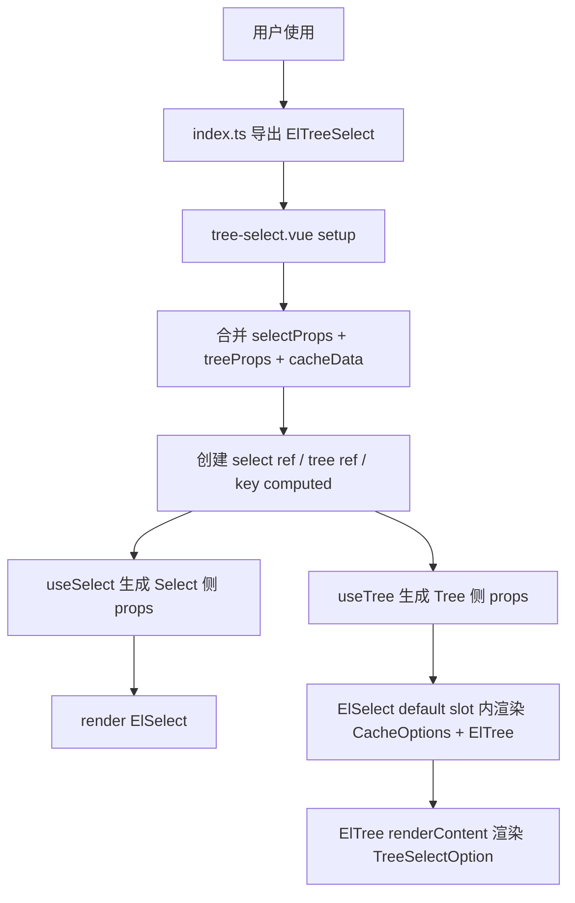
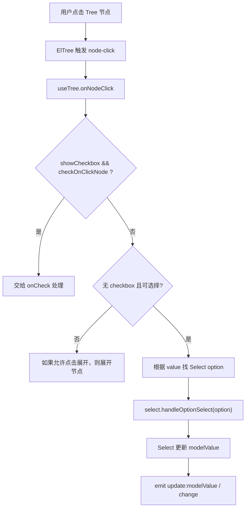
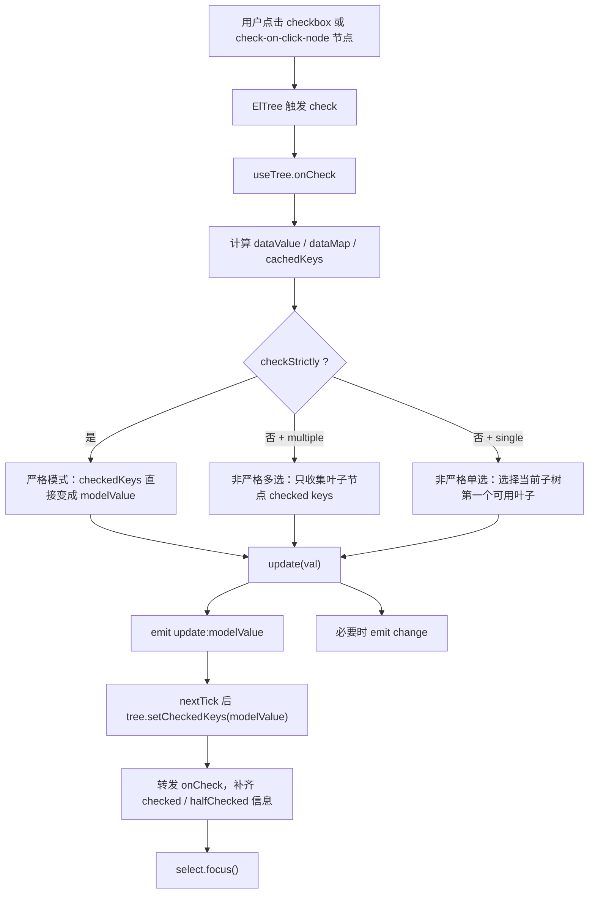
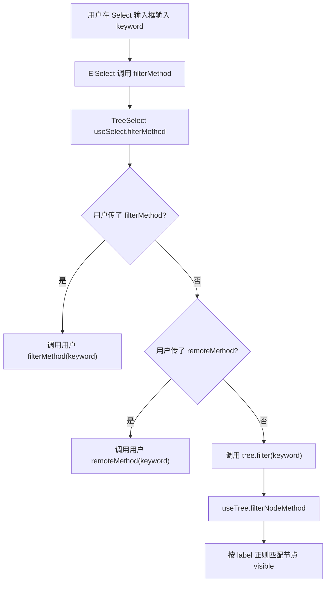
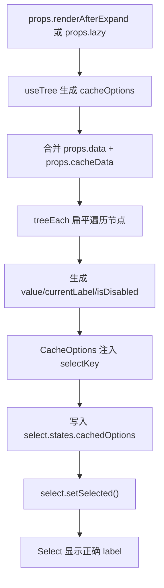
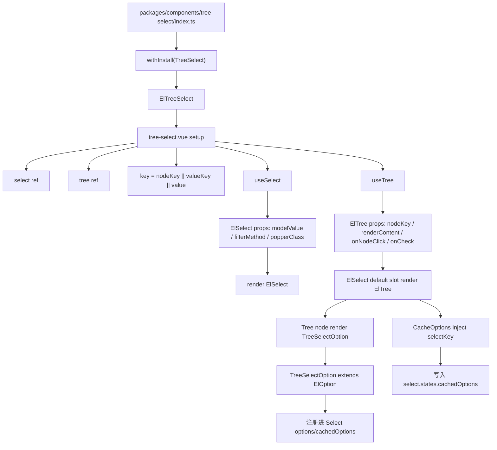

# Element Plus TreeSelect 组件源码分析

> 源码位置：`element-plus-dev/packages/components/tree-select`
>
> 相关组件：`ElSelect`、`ElTree`、`ElOption`
>
> 核心结论：`TreeSelect` 不是从零实现一个全新的选择器，而是一个“组合型复杂组件”。它把 `ElSelect` 的输入框、弹层、标签、过滤、键盘导航能力，与 `ElTree` 的层级数据、展开、勾选、懒加载能力组合在一起。

## 1. 学习目标

`TreeSelect` 很适合用来学习“复杂组件如何复用已有基础组件”。

它的学习价值主要有 6 点：

| 学习点 | 说明 |
| --- | --- |
| 组合式架构 | 不重新造选择器和树，而是把 `Select + Tree + Option` 拼成一个新的组件 |
| API 复用 | 直接合并 `selectProps` 和 `treeProps`，让 TreeSelect 同时具备 Select 和 Tree 的能力 |
| 状态桥接 | `modelValue` 既要驱动 Select 的选中值，也要同步 Tree 的 checked keys |
| 渲染桥接 | Tree 节点内部渲染一个“伪 Option”，让 Select 能识别树节点 |
| 缓存设计 | lazy / render-after-expand 场景下，未渲染节点也要能显示正确 label |
| 复杂交互分层 | 点击、勾选、过滤、键盘导航分别拆到不同 helper 中维护 |

如果说 `Button` 适合学习“基础组件规范”，`Form` 适合学习“上下文与校验”，`Table` 适合学习“复杂状态 store”，那 `TreeSelect` 最适合学习：

```text
如何把多个成熟组件组合成一个新的复合组件。
```

## 2. 文件结构

TreeSelect 的源码文件集中在：

```text
packages/components/tree-select
├── index.ts
├── src
│   ├── tree-select.vue
│   ├── select.ts
│   ├── tree.ts
│   ├── tree-select-option.ts
│   ├── cache-options.ts
│   ├── utils.ts
│   └── instance.ts
├── style
│   ├── index.ts
│   └── css.ts
└── __tests__
    └── tree-select.test.tsx
```

文件职责表：

| 文件 | 职责 |
| --- | --- |
| `index.ts` | 组件入口，使用 `withInstall` 包装为可安装组件 |
| `src/tree-select.vue` | 主组件，合并 props，创建 Select / Tree ref，组合渲染 |
| `src/select.ts` | Select 侧桥接逻辑，处理过滤、popper class、键盘导航、v-model 更新 |
| `src/tree.ts` | Tree 侧桥接逻辑，处理节点映射、勾选同步、点击选择、懒加载缓存 |
| `src/tree-select-option.ts` | 扩展 `ElOption`，把每个树节点伪装成 Select option |
| `src/cache-options.ts` | 向 Select 的 `cachedOptions` 注入缓存项，解决未渲染节点 label 问题 |
| `src/utils.ts` | 树遍历、树查找、值合法性判断等辅助函数 |
| `src/instance.ts` | TreeSelect 实例类型 |
| `style/index.ts` | SCSS 入口，导入 Select、Tree 和 TreeSelect 源样式 |
| `style/css.ts` | CSS 入口，导入构建后的 CSS |
| `__tests__/tree-select.test.tsx` | 行为测试，覆盖渲染、过滤、勾选、懒加载、缓存、键盘导航等 |

## 3. 入口链路

入口文件是：

```ts
// packages/components/tree-select/index.ts
import { withInstall } from '@element-plus/utils'
import TreeSelect from './src/tree-select.vue'

export const ElTreeSelect = withInstall(TreeSelect)

export default ElTreeSelect

export type { TreeSelectInstance } from './src/instance'
```

源码证据：

| 代码位置 | 说明 |
| --- | --- |
| `tree-select/index.ts:1` | 引入 `withInstall` |
| `tree-select/index.ts:2` | 引入主组件 `tree-select.vue` |
| `tree-select/index.ts:6-7` | 导出 `ElTreeSelect = withInstall(TreeSelect)` |
| `tree-select/index.ts:9` | 默认导出 `ElTreeSelect` |
| `tree-select/index.ts:11` | 导出实例类型 |

这条链路说明 TreeSelect 和 Button、Dialog、Table 等组件一样，都遵循 Element Plus 的组件发布模式：

```text
src/tree-select.vue
  -> index.ts
  -> withInstall(TreeSelect)
  -> ElTreeSelect
  -> packages/components/index.ts
  -> packages/element-plus/index.ts
  -> 用户 import { ElTreeSelect } from 'element-plus'
```

## 4. Props / Emits / Slots

### 4.1 Props 设计

TreeSelect 的 props 不是自己从零定义一套，而是合并了 Select 和 Tree 的 props。

关键代码：

```ts
props: {
  ...selectProps,
  ...treeProps,
  cacheData: {
    type: Array,
    default: () => [],
  },
}
```

源码位置：`tree-select/src/tree-select.vue:17-27`

这意味着 TreeSelect 同时支持两类能力：

| 来源 | 典型 prop | 作用 |
| --- | --- | --- |
| `selectProps` | `modelValue` | 当前选中值 |
| `selectProps` | `multiple` | 是否多选 |
| `selectProps` | `filterable` | 是否可过滤 |
| `selectProps` | `remote` / `remoteMethod` | 是否远程搜索 |
| `selectProps` | `clearable` | 是否可清空 |
| `selectProps` | `placeholder` | 输入框占位 |
| `selectProps` | `valueKey` | 对象值的 key，也被 TreeSelect 用作节点值 key 的候选 |
| `treeProps` | `data` | 树数据 |
| `treeProps` | `props` | 自定义节点字段映射 |
| `treeProps` | `nodeKey` | Tree 节点唯一 key |
| `treeProps` | `showCheckbox` | 是否显示 checkbox |
| `treeProps` | `checkStrictly` | 父子节点是否取消关联 |
| `treeProps` | `checkOnClickNode` | 点击节点是否触发勾选 |
| `treeProps` | `renderAfterExpand` | 是否展开后再渲染子节点 |
| `treeProps` | `lazy` / `load` | 懒加载 |
| TreeSelect 自有 | `cacheData` | lazy 场景下缓存未加载节点，用于显示 label |

### 4.2 value key 的统一

TreeSelect 要解决一个问题：

```text
Select 关心 option.value
Tree 关心 nodeKey
业务数据可能叫 value，也可能叫 id
```

所以它定义了统一 key：

```ts
const key = computed(() => props.nodeKey || props.valueKey || 'value')
```

源码位置：`tree-select/src/tree-select.vue:38`

优先级是：

```text
nodeKey > valueKey > 'value'
```

这使得 `ElTreeSelect` 可以适配不同数据结构：

```vue
<el-tree-select
  v-model="value"
  :data="data"
  value-key="id"
  :props="{ label: 'name', children: 'childrens' }"
/>
```

测试中也覆盖了这个场景：当数据字段是 `id/name/childrens`，配置 `props.label`、`props.children`、`valueKey` 后，选中值仍能正确显示 label。

### 4.3 Emits 设计

TreeSelect 没有在 `tree-select.vue` 中单独声明 `emits`，而是通过 attrs 和子组件事件转发完成。

重点事件来自两边：

| 来源 | 典型事件 | 说明 |
| --- | --- | --- |
| Select | `update:modelValue` | v-model 更新 |
| Select | `change` | 值变化 |
| Select | `visible-change` | 下拉显隐 |
| Select | `focus` / `blur` | 输入框焦点 |
| Select | `clear` | 清空 |
| Tree | `node-click` | 节点点击 |
| Tree | `check` | 节点勾选 |
| Tree | `check-change` | 节点勾选状态变化 |
| Tree | `node-expand` | 节点展开 |

`useTree` 内部自己封装了 `update`：

```ts
function update(val) {
  emit(UPDATE_MODEL_EVENT, val)
  emitChange(val)
}
```

源码位置：`tree-select/src/tree.ts:130-133`

其中 `emitChange` 会先比较新旧值，避免无意义的 `change`：

```ts
const emitChange = (val: any | any[]) => {
  if (!isEqual(props.modelValue, val)) {
    emit(CHANGE_EVENT, val)
  }
}
```

源码位置：`tree-select/src/tree.ts:124-128`

### 4.4 Slots 设计

TreeSelect 的 slot 分成两类：

| slot 来源 | 用法 |
| --- | --- |
| Select slots | `prefix`、`empty` 等会被透传给 `ElSelect` |
| Tree node slot | 默认 slot 会作为树节点内容渲染 |

主组件渲染时把 slots 先传给 `ElSelect`：

```ts
{
  ...slots,
  default: () => [
    h(CacheOptions, { data: cacheOptions.value }),
    h(ElTree, reactive({ ...treeProps, ref: ... })),
  ],
}
```

源码位置：`tree-select/src/tree-select.vue:97-108`

然后 `useTree` 在 `renderContent` 中决定每个 Tree 节点的内容：

```ts
renderContent: (h, { node, data, store }) => {
  return h(
    TreeSelectOption,
    {
      value: getNodeValByProp('value', data),
      label: getNodeValByProp('label', data),
      disabled: getNodeValByProp('disabled', data),
      visible: node.visible,
    },
    props.renderContent
      ? () => props.renderContent(h, { node, data, store })
      : slots.default
        ? () => slots.default({ node, data, store })
        : undefined
  )
}
```

源码位置：`tree-select/src/tree.ts:153-168`

优先级是：

```text
props.renderContent > default slot > TreeSelectOption 默认 label
```

## 5. 内部状态

### 5.1 主组件状态

`tree-select.vue` 自己维护的状态非常少：

```ts
const select = ref<SelectInstance>()
const tree = ref<TreeInstance>()
const key = computed(() => props.nodeKey || props.valueKey || 'value')
```

源码位置：`tree-select/src/tree-select.vue:35-38`

这三个状态非常关键：

| 状态 | 作用 |
| --- | --- |
| `select` | 保存 `ElSelect` 实例，用来调用 `focus`、`handleOptionSelect`、读取 options |
| `tree` | 保存 `ElTree` 实例，用来调用 `filter`、`getCheckedKeys`、`setCheckedKeys` 等 |
| `key` | 统一 Select value 和 Tree nodeKey |

### 5.2 useSelect 的状态桥接

`useSelect` 负责 Select 侧：

```ts
const result = {
  ...pick(toRefs(props), Object.keys(ElSelect.props)),
  ...attrs,
  class: computed(() => attrs.class),
  style: computed(() => attrs.style),
  'onUpdate:modelValue': (value) => emit(UPDATE_MODEL_EVENT, value),
  valueKey: key,
  popperClass: computed(() => ...),
  filterMethod: (keyword = '') => { ... },
}
```

源码位置：`tree-select/src/select.ts:88-113`

几个重点：

| 逻辑 | 说明 |
| --- | --- |
| `pick(toRefs(props), Object.keys(ElSelect.props))` | 只把 Select 认识的 props 传给 Select |
| `class/style` | 手动转成 computed，保证外部 class/style 挂到 Select |
| `onUpdate:modelValue` | 手动转发 v-model 事件 |
| `valueKey: key` | Select 的 valueKey 与 Tree 节点 key 保持一致 |
| `popperClass` | 给下拉层追加 `el-tree-select__popper` |
| `filterMethod` | Select 输入过滤时，转而调用 Tree 的 filter |

`useSelect` 还处理键盘导航：

```ts
useEventListener(
  () => select.value?.$el,
  'keydown',
  async (evt) => {
    const code = getEventCode(evt)
    const { dropdownMenuVisible } = select.value!
    if ([EVENT_CODE.down, EVENT_CODE.up].includes(code) && dropdownMenuVisible) {
      await nextTick()
      setTimeout(() => {
        ...
      })
    }
  },
  { capture: true }
)
```

源码位置：`tree-select/src/select.ts:56-86`

这里的意思是：

```text
Select 负责捕获键盘上下键
Select 自己先更新 hoveringIndex
TreeSelect 再把真实焦点移动到对应 Tree 节点 DOM 上
```

这是一个很典型的“组合组件补胶水逻辑”的地方。

### 5.3 useTree 的状态桥接

`useTree` 负责 Tree 侧。

第一个 watcher 同步 checkbox 状态：

```ts
watch(
  [() => props.modelValue, tree],
  () => {
    if (props.showCheckbox) {
      nextTick(() => {
        const treeInstance = tree.value
        if (
          treeInstance &&
          !isEqual(treeInstance.getCheckedKeys(), toValidArray(props.modelValue))
        ) {
          treeInstance.setCheckedKeys(toValidArray(props.modelValue))
        }
      })
    }
  },
  {
    immediate: true,
    deep: true,
  }
)
```

源码位置：`tree-select/src/tree.ts:36-58`

这段逻辑保证：

```text
外部 v-model 改变
  -> TreeSelect 收到新的 modelValue
  -> 如果是 checkbox 模式
  -> 调用 tree.setCheckedKeys()
  -> Tree 的勾选态和 Select 的值保持一致
```

### 5.4 provide / inject 的使用

TreeSelect 自身没有新建 provide，但它利用了 Select 内部已经提供的上下文。

`CacheOptions` 通过 `selectKey` 注入 Select 上下文：

```ts
const select = inject(selectKey) as NonNullable<SelectContext>
```

源码位置：`tree-select/src/cache-options.ts:23-24`

`selectKey` 定义在 Select：

```ts
export const selectKey: InjectionKey<SelectContext> = Symbol('ElSelect')
```

源码位置：`select/src/token.ts:8`

这说明 `CacheOptions` 虽然是 TreeSelect 的辅助组件，但它工作在 `ElSelect` 的 default slot 内部，因此能拿到 Select 的上下文，直接操作 `select.states.cachedOptions`。

### 5.5 computed 的使用

几个重要 computed：

| computed | 位置 | 作用 |
| --- | --- | --- |
| `key` | `tree-select.vue` | 统一节点值字段 |
| `propsMap` | `tree.ts` | 合并默认字段和用户 `props` 字段映射 |
| `cacheOptions` | `tree.ts` | lazy / render-after-expand 时生成缓存 option |
| `expandOnClickNode` | `tree.ts` | `checkStrictly` 为 true 时禁用点击展开 |
| `defaultExpandedKeys` | `tree.ts` | 初始展开选中节点的父级 |
| `popperClass` | `select.ts` | 给 Select 弹层加 TreeSelect 样式类 |

## 6. 核心流程

### 6.1 初始化流程



### 6.2 普通点击选择流程

适用于：

```text
showCheckbox = false
并且 checkStrictly = true 或当前节点是叶子节点
```

流程：



对应源码：`tree-select/src/tree.ts:176-192`

### 6.3 checkbox 勾选流程

适用于：

```text
showCheckbox = true
```

核心流程：



对应源码：`tree-select/src/tree.ts:194-270`

### 6.4 过滤流程



对应源码：

| 位置 | 说明 |
| --- | --- |
| `tree-select/src/select.ts:103-112` | Select 侧 filterMethod 分发 |
| `tree-select/src/tree.ts:169-175` | Tree 侧 filterNodeMethod 默认按 label 过滤 |

### 6.5 lazy / renderAfterExpand 的 label 缓存流程

TreeSelect 必须处理一个特殊问题：

```text
某个值已经被选中，但对应 Tree 节点还没有渲染或还没有 lazy 加载。
Select 仍然需要显示正确 label。
```

流程：



对应源码：

| 位置 | 说明 |
| --- | --- |
| `tree-select/src/tree.ts:96-115` | 生成 `cacheOptions` |
| `tree-select/src/cache-options.ts:23-49` | 注入 Select 并写入 `cachedOptions` |

## 7. 关键源码解释

### 7.1 主组件：组合 Select 和 Tree

关键代码：

```ts
return () =>
  h(
    ElSelect,
    reactive({
      ...selectProps,
      ref: (ref: SelectInstance) => (select.value = ref),
    }),
    {
      ...slots,
      default: () => [
        h(CacheOptions, { data: cacheOptions.value }),
        h(
          ElTree,
          reactive({
            ...treeProps,
            ref: (ref: TreeInstance) => (tree.value = ref),
          })
        ),
      ],
    }
  )
```

源码位置：`tree-select/src/tree-select.vue:83-110`

逐行理解：

| 行为 | 解释 |
| --- | --- |
| `h(ElSelect, ...)` | 外层是 Select，所以输入框、下拉框、tag、多选等能力来自 Select |
| `reactive({ ...selectProps })` | `useSelect` 返回的是 refs，需要 reactive 解包给 render function 使用 |
| `ref: (ref) => select.value = ref` | 保存 Select 实例 |
| `...slots` | 把 prefix、empty 等 Select slot 透传出去 |
| `default: () => [...]` | Select 的默认 slot 里放真正的下拉内容 |
| `h(CacheOptions, ...)` | 注入缓存 option，让未渲染节点也能显示 label |
| `h(ElTree, ...)` | 下拉面板里真正显示的是 Tree |

### 7.2 propsMap：字段映射

关键代码：

```ts
const propsMap = computed(() => ({
  value: key.value,
  label: 'label',
  children: 'children',
  disabled: 'disabled',
  isLeaf: 'isLeaf',
  ...props.props,
}))
```

源码位置：`tree-select/src/tree.ts:60-67`

它把 TreeSelect 的节点字段规范化为：

```ts
{
  value: 'value' | 'id' | ...,
  label: 'label' | 'name' | ...,
  children: 'children' | 'childrens' | ...,
  disabled: 'disabled',
  isLeaf: 'isLeaf',
}
```

然后通过 `getNodeValByProp` 读取节点：

```ts
const propVal = propsMap.value[prop]
if (isFunction(propVal)) {
  return propVal(data, tree.value?.getNode(getNodeValByProp('value', data)))
} else {
  return data[propVal as string]
}
```

源码位置：`tree-select/src/tree.ts:69-82`

这里支持两种字段映射：

```ts
props: {
  label: 'name'
}
```

也支持函数映射：

```ts
props: {
  label(data, node) {
    return `${data.code}-${data.name}`
  }
}
```

### 7.3 TreeSelectOption：树节点伪装成 Option

关键代码：

```ts
const component = defineComponent({
  extends: ElOption,
  setup(props, ctx) {
    const result = (ElOption.setup as NonNullable<any>)(props, ctx)
    delete result.selectOptionClick
    ...
    return result
  },
  methods: {
    selectOptionClick() {
      this.$el.parentElement.click()
    },
  },
})
```

源码位置：`tree-select/src/tree-select-option.ts:4-49`

这段非常关键。

`TreeSelectOption` 继承 `ElOption`，所以它能注册进 Select 的 options 系统：

```text
Tree 节点
  -> TreeSelectOption
  -> ElOption setup
  -> select.onOptionCreate(vm)
  -> Select 能管理这个“选项”
```

但它重写了点击行为：

```ts
selectOptionClick() {
  this.$el.parentElement.click()
}
```

源码位置：`tree-select/src/tree-select-option.ts:43-47`

也就是说：

```text
点击 option 文本
  -> 不直接走 Select option click
  -> 转成点击 Tree 节点内容
  -> 统一交给 Tree 的 node-click / check 逻辑处理
```

这样可以避免 Select 和 Tree 两套点击逻辑互相打架。

### 7.4 CacheOptions：把缓存数据塞进 Select

关键代码：

```ts
const select = inject(selectKey) as NonNullable<SelectContext>

watch(
  () => props.data,
  () => {
    props.data.forEach((item) => {
      if (!select.states.cachedOptions.has(item.value)) {
        select.states.cachedOptions.set(item.value, item)
      }
    })

    const inputs = select.selectRef?.querySelectorAll('input') || []
    if (isClient && !Array.from(inputs).includes(document.activeElement as HTMLInputElement)) {
      select.setSelected()
    }
  },
  { flush: 'post', immediate: true }
)
```

源码位置：`tree-select/src/cache-options.ts:23-49`

它做两件事：

| 行为 | 作用 |
| --- | --- |
| 写入 `select.states.cachedOptions` | 让 Select 能通过 value 找到 label |
| 调用 `select.setSelected()` | 刷新 Select 当前展示的 selected label |

这就是为什么 lazy 节点还没真正渲染出来时，TreeSelect 仍然能显示正确 label。

### 7.5 useSelect：过滤逻辑

关键代码：

```ts
filterMethod: (keyword = '') => {
  if (props.filterMethod) {
    props.filterMethod(keyword)
  } else if (props.remoteMethod) {
    props.remoteMethod(keyword)
  } else {
    tree.value?.filter(keyword)
  }
}
```

源码位置：`tree-select/src/select.ts:103-112`

含义：

| 场景 | 处理 |
| --- | --- |
| 用户传 `filterMethod` | 完全交给用户 |
| 用户传 `remoteMethod` | 远程搜索，通常用户会更新 `data` |
| 都没传 | 调用 `tree.filter(keyword)` 做本地过滤 |

### 7.6 useTree：点击节点选择

关键代码：

```ts
onNodeClick: (data, node, e) => {
  attrs.onNodeClick?.(data, node, e)

  if (props.showCheckbox && props.checkOnClickNode) return

  if (!props.showCheckbox && (props.checkStrictly || node.isLeaf)) {
    if (!getNodeValByProp('disabled', data)) {
      const option = select.value?.states.options.get(
        getNodeValByProp('value', data)
      )
      select.value?.handleOptionSelect(option)
    }
  } else if (props.expandOnClickNode) {
    e.proxy.handleExpandIconClick()
  }
}
```

源码位置：`tree-select/src/tree.ts:176-192`

这段逻辑把节点点击分成三类：

| 情况 | 行为 |
| --- | --- |
| checkbox + checkOnClickNode | 交给 `onCheck` |
| 无 checkbox + 可选择节点 | 找到 Select option，调用 `handleOptionSelect` |
| 其他情况 | 如果允许，则展开节点 |

### 7.7 useTree：checkbox 勾选

关键代码摘取：

```ts
if (props.checkStrictly) {
  update(
    props.multiple
      ? checkedKeys
      : checkedKeys.includes(dataValue)
        ? dataValue
        : undefined
  )
} else if (props.multiple) {
  const childKeys = getChildCheckedKeys()
  update(cachedKeys.concat(childKeys))
} else {
  const firstLeaf = treeFind(...)
  update(firstLeafKey === props.modelValue || hasCheckedChild ? undefined : firstLeafKey)
}
```

源码位置：`tree-select/src/tree.ts:215-256`

这里是 TreeSelect 最核心的选择规则：

| 模式 | modelValue 规则 |
| --- | --- |
| `checkStrictly = true` + `multiple = true` | 所有 checked keys |
| `checkStrictly = true` + 单选 | 当前节点 value 或 `undefined` |
| 非严格 + 多选 | 只收集叶子节点 checked keys |
| 非严格 + 单选 | 选择当前子树第一个可用叶子节点，再次点击取消 |

为什么非严格模式只取叶子节点？

因为父子联动时，父节点更多是“选择一个分组”的中间状态；真正提交给表单的值通常是叶子项。Element Plus 在这里选择了更符合业务表单的语义。

## 8. 设计思想

### 8.1 复用，而不是复制

TreeSelect 没有重写 Select，也没有重写 Tree。

它的主渲染结构是：

```text
ElSelect
  default slot:
    CacheOptions
    ElTree
      renderContent:
        TreeSelectOption
```

这样做的好处是：

| 好处 | 说明 |
| --- | --- |
| 行为一致 | 输入框、多选 tag、清空、弹层位置都和 Select 一致 |
| 维护成本低 | Tree 的展开、懒加载、checkbox 不需要复制一份 |
| API 熟悉 | 用户学过 Select 和 Tree 后，TreeSelect 成本更低 |
| 缺陷修复复用 | Select 或 Tree 自身修复后，TreeSelect 可自然受益 |

### 8.2 用“伪 Option”打通 Select 内部协议

Select 内部并不是只靠 DOM 管选项，而是靠 `ElOption` 注册到 Select 上下文。

所以 TreeSelect 如果只在下拉层渲染普通 Tree 节点，Select 会不知道有哪些 option，也就无法处理：

```text
hoveringIndex
selectedLabel
cachedOptions
multiple tags
handleOptionSelect
```

`TreeSelectOption extends ElOption` 就是为了进入 Select 的内部 option 系统。

这是一种非常值得学习的组件库设计：

```text
复用已有组件的内部协议，而不是绕开它。
```

### 8.3 用 CacheOptions 处理“数据存在但节点未渲染”

Tree 有两个特性会导致节点不一定渲染：

| 特性 | 问题 |
| --- | --- |
| `renderAfterExpand` | 子节点没展开时不会渲染 |
| `lazy` | 节点没加载时根本不在树上 |

但 Select 的选中展示又依赖 option label。

所以 TreeSelect 用 `cacheData` 和 `CacheOptions` 解决：

```text
数据不一定渲染为 Tree 节点
但可以提前注入为 Select cached option
```

这是典型的“显示状态缓存”设计。

### 8.4 分层维护复杂交互

TreeSelect 把复杂逻辑拆成：

| 层 | 负责内容 |
| --- | --- |
| `tree-select.vue` | 组合结构和实例暴露 |
| `select.ts` | Select 侧行为 |
| `tree.ts` | Tree 侧行为 |
| `tree-select-option.ts` | Option 注册与点击桥接 |
| `cache-options.ts` | label 缓存 |
| `utils.ts` | 树遍历工具 |

这比把所有逻辑堆进一个 `.vue` 文件更容易维护。

## 9. 可借鉴点

业务组件和组件库开发中，可以借鉴 TreeSelect 的这些做法：

| 可借鉴点 | 说明 |
| --- | --- |
| 优先组合成熟组件 | 复杂组件不要急着从零写，先看能否组合现有基础组件 |
| 明确主控组件 | TreeSelect 里 Select 是外壳，Tree 是内容，职责清晰 |
| 建立统一 key | 多个组件对同一份数据有不同身份字段时，需要统一映射 |
| 只传子组件认识的 props | `pick(toRefs(props), Object.keys(ElSelect.props))` 避免污染子组件 |
| 复杂逻辑拆 hook | Select 侧、Tree 侧分别维护，降低心智负担 |
| 用缓存弥补渲染延迟 | lazy / 虚拟列表 / 分页场景都可能需要缓存 selected label |
| 保留原组件事件 | TreeSelect 继续转发 `node-click`、`check` 等事件，方便用户接入 |
| 测试覆盖组合边界 | 测试里覆盖了 lazy、cacheData、filterMethod、remoteMethod、键盘导航等边界 |

## 核心调用链图



## 文件职责表

| 文件 | 关键代码 | 重点理解 |
| --- | --- | --- |
| `index.ts` | `withInstall(TreeSelect)` | 发布入口，变成 `ElTreeSelect` |
| `tree-select.vue` | `props: { ...selectProps, ...treeProps, cacheData }` | 对外 API 来自 Select + Tree |
| `tree-select.vue` | `h(ElSelect, ..., { default: () => [CacheOptions, ElTree] })` | 外层 Select，内层 Tree |
| `select.ts` | `filterMethod` | 输入过滤时桥接到 Tree filter 或远程搜索 |
| `select.ts` | `keydown` listener | Select 键盘导航后同步 Tree DOM 焦点 |
| `tree.ts` | `watch([modelValue, tree])` | 外部值变更后同步 Tree checked keys |
| `tree.ts` | `propsMap` / `getNodeValByProp` | 统一字段映射 |
| `tree.ts` | `renderContent` | 每个 Tree 节点渲染为 `TreeSelectOption` |
| `tree.ts` | `onNodeClick` | 普通节点点击选择或展开 |
| `tree.ts` | `onCheck` | checkbox 模式下维护 modelValue |
| `tree-select-option.ts` | `extends: ElOption` | 把树节点接入 Select option 系统 |
| `tree-select-option.ts` | `selectOptionClick -> parentElement.click()` | 点击统一交给 Tree 节点处理 |
| `cache-options.ts` | `inject(selectKey)` | 进入 Select 上下文 |
| `cache-options.ts` | `select.states.cachedOptions.set(...)` | 缓存未渲染节点 label |
| `utils.ts` | `treeFind` / `treeEach` | 递归查找和遍历树 |
| `style/index.ts` | 导入 Select、Tree、TreeSelect SCSS | 样式组合入口 |

## 简化版 MiniTreeSelect 实现

下面这个简化版保留 TreeSelect 最核心的思想：

```text
外层 Select
  -> 下拉层里渲染 Tree
  -> 点击树节点更新 v-model
  -> 支持字段映射
  -> 支持多选 checkbox
```

它不是 Element Plus 的完整实现，但能帮助理解源码设计。

### MiniTreeSelect.vue

```vue
<template>
  <div class="mini-tree-select">
    <div class="mini-tree-select__input" @click="open = !open">
      <span v-if="displayLabel">{{ displayLabel }}</span>
      <span v-else class="mini-tree-select__placeholder">{{ placeholder }}</span>
      <button
        v-if="clearable && hasValue"
        class="mini-tree-select__clear"
        type="button"
        @click.stop="clear"
      >
        x
      </button>
    </div>

    <div v-if="open" class="mini-tree-select__dropdown">
      <input
        v-if="filterable"
        v-model="keyword"
        class="mini-tree-select__filter"
        placeholder="filter"
      />

      <MiniTreeNode
        v-for="node in visibleData"
        :key="getValue(node)"
        :node="node"
        :props-map="propsMap"
        :multiple="multiple"
        :model-value="modelValue"
        :keyword="keyword"
        @select="handleSelect"
      />
    </div>
  </div>
</template>

<script setup lang="ts">
import { computed, ref } from 'vue'
import MiniTreeNode from './MiniTreeNode.vue'

type TreeNode = Record<string, any>

const props = withDefaults(
  defineProps<{
    modelValue?: string | number | Array<string | number>
    data?: TreeNode[]
    placeholder?: string
    clearable?: boolean
    filterable?: boolean
    multiple?: boolean
    props?: {
      value?: string
      label?: string
      children?: string
      disabled?: string
    }
  }>(),
  {
    data: () => [],
    placeholder: 'Select',
    props: () => ({}),
  }
)

const emit = defineEmits<{
  'update:modelValue': [value: string | number | Array<string | number> | undefined]
  change: [value: string | number | Array<string | number> | undefined]
}>()

const open = ref(false)
const keyword = ref('')

const propsMap = computed(() => ({
  value: props.props.value || 'value',
  label: props.props.label || 'label',
  children: props.props.children || 'children',
  disabled: props.props.disabled || 'disabled',
}))

const hasValue = computed(() => {
  return Array.isArray(props.modelValue)
    ? props.modelValue.length > 0
    : props.modelValue !== undefined && props.modelValue !== null && props.modelValue !== ''
})

const getValue = (node: TreeNode) => node[propsMap.value.value]
const getLabel = (node: TreeNode) => node[propsMap.value.label]
const getChildren = (node: TreeNode) => node[propsMap.value.children] || []

const flatten = (nodes: TreeNode[]): TreeNode[] => {
  return nodes.flatMap((node) => [node, ...flatten(getChildren(node))])
}

const selectedNodes = computed(() => {
  const values = Array.isArray(props.modelValue)
    ? props.modelValue
    : props.modelValue !== undefined
      ? [props.modelValue]
      : []

  return flatten(props.data).filter((node) => values.includes(getValue(node)))
})

const displayLabel = computed(() => {
  return selectedNodes.value.map(getLabel).join(', ')
})

const visibleData = computed(() => {
  if (!keyword.value) return props.data

  const matchTree = (nodes: TreeNode[]): TreeNode[] => {
    return nodes
      .map((node) => {
        const children = matchTree(getChildren(node))
        const selfMatched = String(getLabel(node))
          .toLowerCase()
          .includes(keyword.value.toLowerCase())

        if (selfMatched || children.length) {
          return { ...node, [propsMap.value.children]: children }
        }

        return null
      })
      .filter(Boolean) as TreeNode[]
  }

  return matchTree(props.data)
})

function update(value: string | number | Array<string | number> | undefined) {
  emit('update:modelValue', value)
  emit('change', value)
}

function handleSelect(node: TreeNode) {
  if (node[propsMap.value.disabled]) return

  const value = getValue(node)

  if (props.multiple) {
    const current = Array.isArray(props.modelValue) ? [...props.modelValue] : []
    const index = current.indexOf(value)
    if (index >= 0) current.splice(index, 1)
    else current.push(value)
    update(current)
  } else {
    update(value)
    open.value = false
  }
}

function clear() {
  update(props.multiple ? [] : undefined)
}
</script>
```

### MiniTreeNode.vue

```vue
<template>
  <div class="mini-tree-node">
    <div
      class="mini-tree-node__content"
      :class="{
        'is-selected': selected,
        'is-disabled': disabled,
      }"
      @click="emit('select', node)"
    >
      <input
        v-if="multiple"
        type="checkbox"
        :checked="selected"
        :disabled="disabled"
        @click.stop="emit('select', node)"
      />
      <span>{{ label }}</span>
    </div>

    <div v-if="children.length" class="mini-tree-node__children">
      <MiniTreeNode
        v-for="child in children"
        :key="child[propsMap.value]"
        :node="child"
        :props-map="propsMap"
        :multiple="multiple"
        :model-value="modelValue"
        :keyword="keyword"
        @select="emit('select', $event)"
      />
    </div>
  </div>
</template>

<script setup lang="ts">
import { computed } from 'vue'

type TreeNode = Record<string, any>

const props = defineProps<{
  node: TreeNode
  propsMap: {
    value: string
    label: string
    children: string
    disabled: string
  }
  multiple?: boolean
  modelValue?: string | number | Array<string | number>
  keyword?: string
}>()

const emit = defineEmits<{
  select: [node: TreeNode]
}>()

const value = computed(() => props.node[props.propsMap.value])
const label = computed(() => props.node[props.propsMap.label])
const children = computed(() => props.node[props.propsMap.children] || [])
const disabled = computed(() => Boolean(props.node[props.propsMap.disabled]))

const selected = computed(() => {
  return Array.isArray(props.modelValue)
    ? props.modelValue.includes(value.value)
    : props.modelValue === value.value
})
</script>
```

### MiniTreeSelect 和 Element Plus 的差距

| 能力 | MiniTreeSelect | Element Plus TreeSelect |
| --- | --- | --- |
| 外层输入 | 简单 div | 完整 `ElSelect` |
| 树渲染 | 递归节点 | 完整 `ElTree` |
| option 注册 | 没有 | `TreeSelectOption extends ElOption` |
| label 缓存 | 简单 flatten | `CacheOptions + cachedOptions` |
| lazy | 未实现 | 支持 |
| renderAfterExpand | 未实现 | 支持 |
| checkStrictly | 未实现 | 支持 |
| 父子联动 | 未实现 | 复用 Tree |
| 键盘导航 | 未实现 | Select + Tree 焦点桥接 |
| 插槽 | 未实现 | 支持 Select slot 和节点 slot |

## 总结

TreeSelect 的源码可以用一句话概括：

```text
它用 ElSelect 管“选择器外壳”，用 ElTree 管“层级内容”，再用 TreeSelectOption 和 CacheOptions 打通两者内部状态。
```

最值得学习的是这三个设计：

| 设计 | 价值 |
| --- | --- |
| 合并已有组件 API | 让复合组件天然继承基础组件能力 |
| 伪 Option 注册 | 复用 Select 内部选项系统 |
| 缓存未渲染 label | 解决 lazy / 按需渲染下的展示一致性 |

从业务组件库角度看，TreeSelect 提供了一个很好的模板：

```text
复杂组件 = 稳定基础组件 + 明确桥接层 + 少量状态同步 + 完整边界测试
```

