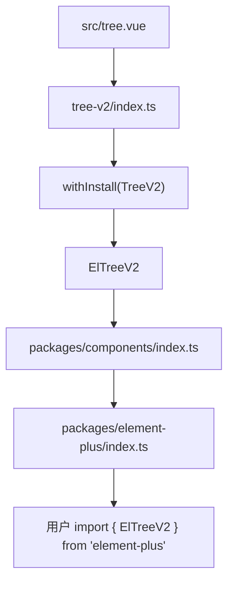
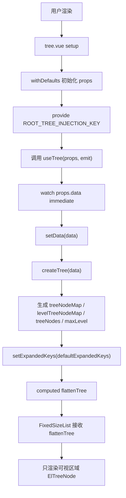
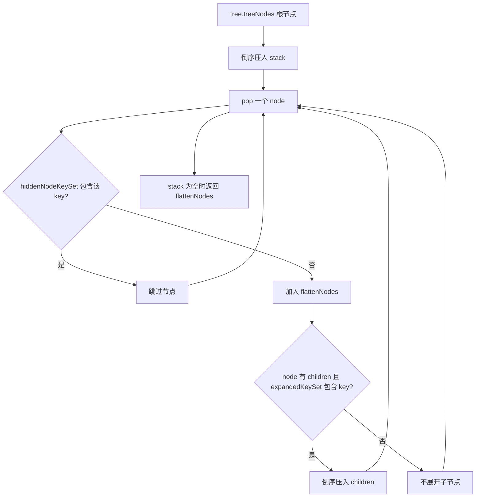
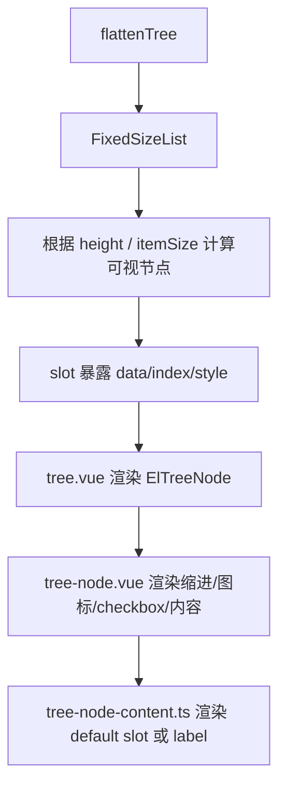
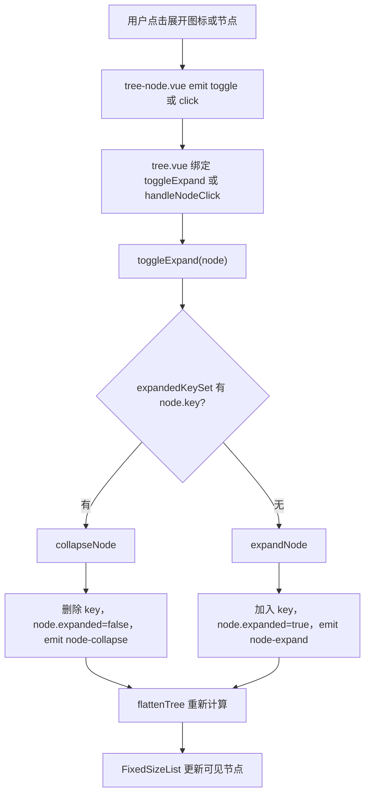
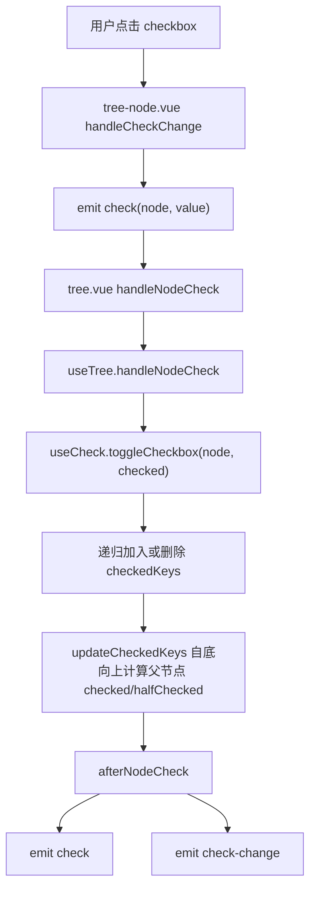
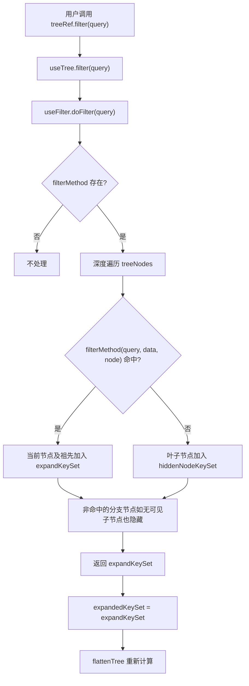
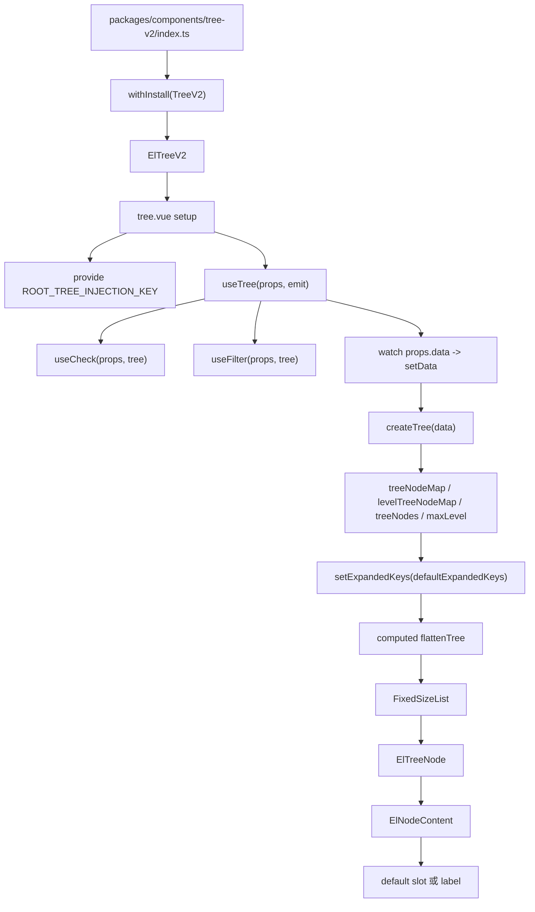

# Element Plus Tree-v2 组件源码分析

> 源码位置：`element-plus-dev/packages/components/tree-v2`
>
> 组件名：`ElTreeV2`
>
> 核心关键词：虚拟滚动、树扁平化、展开状态、勾选状态、过滤状态、provide/inject、组合式 hooks。

`Tree-v2` 是 Element Plus 中面向大数据量树结构的组件。它和普通 `Tree` 的目标不同：普通 `Tree` 更强调完整树节点 DOM 结构和功能丰富度，`Tree-v2` 更强调在大量节点下保持渲染和滚动性能。

一句话概括：

```text
Tree-v2 先把嵌套树数据转成内部 TreeNode 索引结构，再根据展开/过滤状态计算 flattenTree，最后交给 FixedSizeList 只渲染可视区域节点。
```

## 1. 学习目标

`Tree-v2` 适合学习这些源码思想：

| 学习点 | 说明 |
| --- | --- |
| 虚拟列表驱动树渲染 | 树结构不是直接递归渲染 DOM，而是转成扁平数组交给虚拟列表 |
| 数据结构先行 | 通过 `treeNodeMap`、`levelTreeNodeMap`、`treeNodes` 支撑查找、勾选、展开 |
| 展开态和渲染态分离 | 原始树不变，`expandedKeySet` 决定哪些节点进入 `flattenTree` |
| 勾选态集合化 | 使用 `checkedKeys`、`indeterminateKeys` 两个 Set 管理 checkbox 状态 |
| 从底向上计算父子联动 | 非严格勾选模式下，通过层级 map 从叶子向根节点计算半选状态 |
| provide/inject 共享上下文 | 主组件 provide tree context，节点内容组件 inject 后读取 props、slots、emit |
| 大组件拆分 | `tree.vue` 只负责拼装，核心状态拆到 `useTree`、`useCheck`、`useFilter` |
| 性能取舍 | `perfMode`、`itemSize`、`height` 都服务于虚拟列表性能模型 |

如果说 `TreeSelect` 是“组合已有组件”，那 `Tree-v2` 是“为性能重新组织数据结构”。

## 2. 文件结构

Tree-v2 源码文件如下：

```text
packages/components/tree-v2
├── index.ts
├── src
│   ├── tree.vue
│   ├── virtual-tree.ts
│   ├── types.ts
│   ├── tree-node.vue
│   ├── tree-node-content.ts
│   ├── instance.ts
│   └── composables
│       ├── useTree.ts
│       ├── useCheck.ts
│       └── useFilter.ts
├── style
│   ├── index.ts
│   └── css.ts
└── __tests__
    └── tree.test.ts
```

文件职责表：

| 文件 | 作用 |
| --- | --- |
| `index.ts` | 组件入口，使用 `withInstall` 导出 `ElTreeV2` |
| `src/tree.vue` | 主组件，声明 props 默认值，渲染 `FixedSizeList`，暴露实例方法 |
| `src/virtual-tree.ts` | props、emits、InjectionKey、常量、枚举定义 |
| `src/types.ts` | Tree-v2 的核心类型定义，如 `TreeNode`、`Tree`、`TreeProps` |
| `src/composables/useTree.ts` | 主状态 hook，负责建树、扁平化、展开、当前节点、公开方法 |
| `src/composables/useCheck.ts` | checkbox 逻辑，负责 checked / indeterminate 状态和勾选事件 |
| `src/composables/useFilter.ts` | 过滤逻辑，负责隐藏节点集合、强制隐藏展开图标集合 |
| `src/tree-node.vue` | 单个虚拟节点的渲染，包含缩进、展开图标、checkbox、点击事件 |
| `src/tree-node-content.ts` | 节点内容渲染，支持默认 slot，否则显示 label |
| `src/instance.ts` | `TreeV2Instance` 类型 |
| `style/index.ts` | SCSS 样式入口，导入 tree、checkbox、virtual-list、text 样式 |
| `style/css.ts` | CSS 样式入口，导入构建后的 CSS |
| `__tests__/tree.test.ts` | 行为测试，覆盖创建、展开、勾选、过滤、事件、公开方法、滚动 |

## 3. 入口链路

入口文件：

```ts
// packages/components/tree-v2/index.ts
import { withInstall } from '@element-plus/utils'
import TreeV2 from './src/tree.vue'

export const ElTreeV2: SFCWithInstall<typeof TreeV2> = withInstall(TreeV2)
export default ElTreeV2

export type { TreeV2Instance } from './src/instance'
```

源码位置：`tree-v2/index.ts:1-9`

这条导出链路是：



入口链路和普通组件一致：

| 步骤 | 说明 |
| --- | --- |
| `TreeV2` | 主组件源码 |
| `withInstall(TreeV2)` | 给组件挂 `install(app)` |
| `ElTreeV2` | 命名导出和默认导出 |
| `TreeV2Instance` | 暴露组件实例类型 |

## 4. Props / Emits / Slots

### 4.1 Props 设计

Tree-v2 的公开 props 类型定义在 `types.ts`，运行时 props 定义在 `virtual-tree.ts`，主组件通过 `withDefaults(defineProps<TreeProps>(), ...)` 设置默认值。

核心 props：

| prop | 默认值 | 作用 |
| --- | --- | --- |
| `data` | `[]` | 树数据 |
| `emptyText` | 无 | 空状态文本 |
| `height` | `200` | 虚拟列表高度 |
| `props` | `{ children, label, disabled, value, class }` | 字段映射 |
| `highlightCurrent` | `false` | 是否高亮当前节点 |
| `showCheckbox` | `false` | 是否显示 checkbox |
| `defaultCheckedKeys` | `[]` | 默认勾选节点 |
| `checkStrictly` | `false` | 父子勾选是否互不关联 |
| `defaultExpandedKeys` | `[]` | 默认展开节点 |
| `indent` | `16` | 节点缩进 |
| `itemSize` | `26` | 单个节点高度，虚拟列表需要固定高度 |
| `icon` | 默认 `CaretRight` | 展开图标 |
| `expandOnClickNode` | `true` | 点击节点是否展开/收起 |
| `checkOnClickNode` | `false` | 点击节点是否勾选 |
| `checkOnClickLeaf` | `true` | 点击叶子节点是否勾选 |
| `currentNodeKey` | 无 | 当前节点 key |
| `accordion` | `false` | 是否同级手风琴展开 |
| `filterMethod` | 无 | 自定义过滤函数 |
| `perfMode` | `true` | 虚拟列表性能模式 |
| `scrollbarAlwaysOn` | `false` | 是否一直显示滚动条 |

主组件默认值源码：

```ts
const props = withDefaults(defineProps<TreeProps>(), {
  data: () => mutable([]),
  height: 200,
  props: () =>
    mutable({
      children: TreeOptionsEnum.CHILDREN,
      label: TreeOptionsEnum.LABEL,
      disabled: TreeOptionsEnum.DISABLED,
      value: TreeOptionsEnum.KEY,
      class: TreeOptionsEnum.CLASS,
    }),
  defaultCheckedKeys: () => mutable([]),
  defaultExpandedKeys: () => mutable([]),
  indent: 16,
  itemSize: 26,
  expandOnClickNode: true,
  checkOnClickLeaf: true,
  perfMode: true,
})
```

源码位置：`tree-v2/src/tree.vue:67-85`

### 4.2 props 字段映射

默认字段枚举：

```ts
export enum TreeOptionsEnum {
  KEY = 'id',
  LABEL = 'label',
  CHILDREN = 'children',
  DISABLED = 'disabled',
  CLASS = '',
}
```

源码位置：`tree-v2/src/virtual-tree.ts:31-37`

这意味着 Tree-v2 默认使用：

```ts
{
  id: '节点唯一值',
  label: '节点文本',
  children: '子节点',
  disabled: '是否禁用'
}
```

如果业务数据字段不同，可以通过 `props` 改：

```vue
<el-tree-v2
  :data="data"
  :props="{
    value: 'value',
    label: 'name',
    children: 'items',
    disabled: 'disabled'
  }"
/>
```

### 4.3 Emits 设计

Tree-v2 的事件定义在 `virtual-tree.ts`：

| 事件 | 触发时机 | 参数 |
| --- | --- | --- |
| `node-click` | 点击节点 | `(data, node, event)` |
| `node-drop` | 节点 drop | `(data, node, event)` |
| `node-expand` | 展开节点 | `(data, node)` |
| `node-collapse` | 收起节点 | `(data, node)` |
| `current-change` | 当前节点变化 | `(data, node)` |
| `check` | checkbox 勾选完成 | `(data, checkedInfo)` |
| `check-change` | 某节点勾选状态变化 | `(data, checked)` |
| `node-contextmenu` | 节点右键 | `(event, data, node)` |

源码位置：`tree-v2/src/virtual-tree.ts:149-173`

其中 `check` 的 `checkedInfo` 结构是：

```ts
export interface CheckedInfo {
  checkedKeys: TreeKey[]
  checkedNodes: TreeData
  halfCheckedKeys: TreeKey[]
  halfCheckedNodes: TreeData
}
```

源码位置：`tree-v2/src/types.ts:119-124`

### 4.4 Slots 设计

Tree-v2 支持两个主要 slot：

| slot | 作用 |
| --- | --- |
| `default` | 自定义节点内容，参数 `{ node, data }` |
| `empty` | 自定义空状态 |

主组件空状态：

```vue
<div v-else :class="ns.e('empty-block')">
  <slot name="empty">
    <span :class="ns.e('empty-text')">
      {{ emptyText ?? t('el.tree.emptyText') }}
    </span>
  </slot>
</div>
```

源码位置：`tree-v2/src/tree.vue:37-43`

节点内容组件：

```ts
return tree?.ctx.slots.default
  ? tree.ctx.slots.default({ node, data })
  : h(
      ElText,
      { tag: 'span', truncated: true, class: ns.be('node', 'label') },
      () => [node?.label]
    )
```

源码位置：`tree-v2/src/tree-node-content.ts:15-21`

这说明默认 slot 不在 `tree-node.vue` 直接处理，而是通过 provide/inject 传到 `tree-node-content.ts`。

## 5. 内部状态

### 5.1 tree.vue 的状态

主组件自身状态很少，主要做三件事：

| 职责 | 代码 |
| --- | --- |
| 计算节点高度 | `treeNodeSize = computed(() => props.itemSize)` |
| provide 根上下文 | `provide(ROOT_TREE_INJECTION_KEY, { ctx, props, instance })` |
| 调用 `useTree` | 解构状态、事件处理函数和公开方法 |

关键代码：

```ts
provide(ROOT_TREE_INJECTION_KEY, {
  ctx: {
    emit,
    slots,
  },
  props,
  instance: getCurrentInstance()!,
})
provide(formItemContextKey, undefined)
```

源码位置：`tree-v2/src/tree.vue:92-100`

这里有两个点：

| provide | 作用 |
| --- | --- |
| `ROOT_TREE_INJECTION_KEY` | 给节点组件提供 props、slots、emit、当前实例 |
| `formItemContextKey = undefined` | 避免内部 checkbox 误触发表单项上下文 |

### 5.2 useTree 的核心状态

`useTree` 是 Tree-v2 的中枢。

```ts
const expandedKeySet = ref<Set<TreeKey>>(new Set())
const currentKey = ref<TreeKey | undefined>()
const tree = shallowRef<Tree | undefined>()
const listRef = ref<typeof FixedSizeList | undefined>()
```

源码位置：`tree-v2/src/composables/useTree.ts:34-37`

这些状态分别代表：

| 状态 | 作用 |
| --- | --- |
| `expandedKeySet` | 当前展开的节点 key 集合 |
| `currentKey` | 当前高亮节点 key |
| `tree` | 内部树索引结构 |
| `listRef` | 虚拟列表实例，用于滚动定位 |

为什么 `tree` 用 `shallowRef`？

```text
Tree-v2 的 tree 是一个内部索引结构，里面包含大量 TreeNode、Map、父子引用。
如果深层响应式代理整个结构，成本很高。
Tree-v2 更需要在 data 变化时整体替换 tree，而不是追踪每个节点字段的深层变化。
```

### 5.3 内部 Tree 数据结构

类型定义：

```ts
export interface Tree {
  treeNodeMap: Map<TreeKey, TreeNode>
  levelTreeNodeMap: Map<number, TreeNode[]>
  treeNodes: TreeNode[]
  maxLevel: number
}
```

源码位置：`tree-v2/src/types.ts:106-111`

含义：

| 字段 | 作用 |
| --- | --- |
| `treeNodeMap` | 通过 key 快速找到节点 |
| `levelTreeNodeMap` | 按层级保存节点，用于自底向上计算勾选状态 |
| `treeNodes` | 根节点数组 |
| `maxLevel` | 最大层级，用于勾选状态从底向上遍历 |

每个节点结构：

```ts
export interface TreeNode {
  key: TreeKey
  level: number
  parent?: TreeNode
  children?: TreeNode[]
  data: TreeNodeData
  disabled?: boolean
  label?: string
  isLeaf?: boolean
  expanded?: boolean
  isEffectivelyChecked?: boolean
}
```

源码位置：`tree-v2/src/types.ts:74-98`

这里的 `TreeNode` 是对用户原始数据的包装。Tree-v2 不直接拿原始 `data` 渲染，而是先构建一个适合内部计算的节点结构。

### 5.4 computed 的使用

重要 computed：

| computed | 位置 | 作用 |
| --- | --- | --- |
| `valueKey` | `useTree.ts` | 节点唯一值字段 |
| `childrenKey` | `useTree.ts` | 子节点字段 |
| `disabledKey` | `useTree.ts` | 禁用字段 |
| `labelKey` | `useTree.ts` | label 字段 |
| `flattenTree` | `useTree.ts` | 当前需要渲染的扁平节点列表 |
| `isNotEmpty` | `useTree.ts` | 是否显示虚拟列表还是 empty |
| `filterable` | `useFilter.ts` | 是否有过滤函数 |
| `indent` | `tree-node.vue` | 节点缩进 |
| `icon` | `tree-node.vue` | 展开图标 |

`flattenTree` 是最重要的 computed：

```ts
const flattenTree = computed(() => {
  const expandedKeys = expandedKeySet.value
  const hiddenKeys = hiddenNodeKeySet.value
  const flattenNodes: TreeNode[] = []
  const nodes = tree.value?.treeNodes || []

  const stack: TreeNode[] = []
  for (let i = nodes.length - 1; i >= 0; --i) {
    stack.push(nodes[i])
  }
  while (stack.length) {
    const node = stack.pop()!
    if (hiddenKeys.has(node.key)) continue

    flattenNodes.push(node)
    if (node.children && expandedKeys.has(node.key)) {
      for (let i = node.children.length - 1; i >= 0; --i) {
        stack.push(node.children[i])
      }
    }
  }

  return flattenNodes
})
```

源码位置：`tree-v2/src/composables/useTree.ts:69-92`

这一段决定虚拟列表渲染什么。

### 5.5 watch 的使用

`useTree` 中有三个关键 watch：

| watch | 作用 |
| --- | --- |
| `props.currentNodeKey` | 外部当前节点 key 变化时同步 `currentKey` |
| `props.defaultExpandedKeys` | 默认展开 key 变化时重新设置展开状态 |
| `props.data` | 数据变化时重新建树，并重新应用默认展开 |

源码：

```ts
watch(
  () => props.currentNodeKey,
  (key) => {
    currentKey.value = key
  },
  { immediate: true }
)

watch(
  () => props.defaultExpandedKeys,
  (keys) => {
    setExpandedKeys(keys || [])
  }
)

watch(
  () => props.data!,
  (data: TreeData) => {
    setData(data)
    setExpandedKeys(props.defaultExpandedKeys || [])
  },
  { immediate: true }
)
```

源码位置：`tree-v2/src/composables/useTree.ts:303-329`

`useCheck` 也有一个关键 watch：

```ts
watch(
  [() => tree.value, () => props.defaultCheckedKeys],
  () => {
    return nextTick(() => {
      _setCheckedKeys(props.defaultCheckedKeys!)
    })
  },
  { immediate: true }
)
```

源码位置：`tree-v2/src/composables/useCheck.ts:17-27`

这保证数据结构建好后，再应用默认勾选状态。

### 5.6 provide / inject 的使用

主组件 provide：

```ts
provide(ROOT_TREE_INJECTION_KEY, {
  ctx: {
    emit,
    slots,
  },
  props,
  instance: getCurrentInstance()!,
})
```

节点组件 inject：

```ts
const tree = inject(ROOT_TREE_INJECTION_KEY)
```

源码位置：

| 文件 | 位置 |
| --- | --- |
| `tree.vue` | `tree-v2/src/tree.vue:92-99` |
| `tree-node.vue` | `tree-v2/src/tree-node.vue:86` |
| `tree-node-content.ts` | `tree-v2/src/tree-node-content.ts:10` |

inject 后，`tree-node.vue` 可以读取：

| 内容 | 用途 |
| --- | --- |
| `tree.props.indent` | 计算缩进 |
| `tree.props.icon` | 决定展开图标 |
| `tree.props.props.class` | 计算节点自定义 class |
| `tree.ctx.emit` | 派发 `node-contextmenu` |
| `tree.ctx.slots.default` | 渲染自定义节点内容 |

## 6. 核心流程

### 6.1 初始化流程



### 6.2 建树流程

伪代码：

```ts
function createTree(data) {
  const treeNodeMap = new Map()
  const levelTreeNodeMap = new Map()
  let maxLevel = 1

  function traverse(nodes, level, parent) {
    const siblings = []

    for (const rawNode of nodes) {
      const key = getKey(rawNode)
      const children = getChildren(rawNode)

      const node = {
        key,
        level,
        data: rawNode,
        parent,
        label: getLabel(rawNode),
        disabled: getDisabled(rawNode),
        isLeaf: !children || children.length === 0,
        expanded: expandedKeySet.has(key),
      }

      if (children?.length) {
        node.children = traverse(children, level + 1, node)
      }

      siblings.push(node)
      treeNodeMap.set(key, node)
      levelTreeNodeMap.get(level).push(node)
      maxLevel = Math.max(maxLevel, level)
    }

    return siblings
  }

  return {
    treeNodes: traverse(data),
    treeNodeMap,
    levelTreeNodeMap,
    maxLevel,
  }
}
```

对应源码：`tree-v2/src/composables/useTree.ts:98-143`

### 6.3 扁平化流程

Tree-v2 不递归渲染所有节点，而是先计算当前可见节点：



对应源码：`tree-v2/src/composables/useTree.ts:69-92`

### 6.4 渲染流程

主组件模板：

```vue
<fixed-size-list
  v-if="isNotEmpty"
  ref="listRef"
  :class-name="ns.b('virtual-list')"
  :data="flattenTree"
  :total="flattenTree.length"
  :height="height"
  :item-size="treeNodeSize"
  :perf-mode="perfMode"
  :scrollbar-always-on="scrollbarAlwaysOn"
>
  <template #default="{ data, index, style }">
    <el-tree-node
      :key="data[index].key"
      :style="style"
      :node="data[index]"
      ...
    />
  </template>
</fixed-size-list>
```

源码位置：`tree-v2/src/tree.vue:6-36`

流程：



### 6.5 展开/收起流程



对应源码：

| 方法 | 位置 |
| --- | --- |
| `toggleExpand` | `tree-v2/src/composables/useTree.ts:171-178` |
| `expandNode` | `tree-v2/src/composables/useTree.ts:231-250` |
| `collapseNode` | `tree-v2/src/composables/useTree.ts:252-259` |

### 6.6 勾选流程



对应源码：

| 方法 | 位置 |
| --- | --- |
| `tree-node.vue handleCheckChange` | `tree-v2/src/tree-node.vue:116-118` |
| `handleNodeCheck` | `tree-v2/src/composables/useTree.ts:227-229` |
| `toggleCheckbox` | `tree-v2/src/composables/useCheck.ts:87-120` |
| `updateCheckedKeys` | `tree-v2/src/composables/useCheck.ts:29-80` |
| `afterNodeCheck` | `tree-v2/src/composables/useCheck.ts:122-132` |

### 6.7 过滤流程



测试中验证了 `filter('node-1-1-1')` 后只显示匹配节点路径：

```text
node-1
node-1-1
node-1-1-1
```

测试位置：`tree-v2/__tests__/tree.test.ts:1291-1297`

## 7. 关键源码解释

### 7.1 主组件为什么使用 FixedSizeList

关键代码：

```vue
<fixed-size-list
  v-if="isNotEmpty"
  ref="listRef"
  :data="flattenTree"
  :total="flattenTree.length"
  :height="height"
  :item-size="treeNodeSize"
  :perf-mode="perfMode"
>
  <template #default="{ data, index, style }">
    <el-tree-node
      :key="data[index].key"
      :style="style"
      :node="data[index]"
    />
  </template>
</fixed-size-list>
```

源码位置：`tree-v2/src/tree.vue:6-36`

逐行理解：

| 代码 | 解释 |
| --- | --- |
| `FixedSizeList` | 使用虚拟列表，只渲染可视区域 |
| `data="flattenTree"` | 树被转换为当前可见的线性数组 |
| `total="flattenTree.length"` | 虚拟列表知道总节点数量 |
| `height` | 容器高度，决定可视区域 |
| `item-size` | 每一行固定高度，虚拟列表据此计算滚动位置 |
| slot `style` | 虚拟列表给每个 item 的定位样式，必须传给节点 |

这就是 Tree-v2 和普通 Tree 最大的不同：

```text
普通 Tree：递归渲染树 DOM
Tree-v2：扁平化为列表，再虚拟渲染列表
```

### 7.2 createTree：把原始数据加工成内部索引结构

关键代码：

```ts
function createTree(data: TreeData): Tree {
  const treeNodeMap: Map<TreeKey, TreeNode> = new Map()
  const levelTreeNodeMap: Map<number, TreeNode[]> = new Map()
  let maxLevel = 1

  function traverse(nodes: TreeData, level = 1, parent: TreeNode | undefined = undefined) {
    const siblings: TreeNode[] = []
    for (const rawNode of nodes) {
      const value = getKey(rawNode)
      const node: TreeNode = {
        level,
        key: value,
        data: rawNode,
      }
      node.label = getLabel(rawNode)
      node.parent = parent
      const children = getChildren(rawNode)
      node.disabled = getDisabled(rawNode)
      node.isLeaf = !children || children.length === 0
      node.expanded = expandedKeySet.value.has(value)
      if (children && children.length) {
        node.children = traverse(children, level + 1, node)
      }
      siblings.push(node)
      treeNodeMap.set(value, node)
      ...
    }
    return siblings
  }

  const treeNodes: TreeNode[] = traverse(data)
  return { treeNodeMap, levelTreeNodeMap, maxLevel, treeNodes }
}
```

源码位置：`tree-v2/src/composables/useTree.ts:98-143`

重点解释：

| 字段 | 为什么需要 |
| --- | --- |
| `key` | 节点唯一标识，用于展开、勾选、当前节点、滚动定位 |
| `parent` | 展开某个子节点时，可以一路展开祖先 |
| `children` | 仍保留树结构，用于展开、勾选递归 |
| `treeNodeMap` | `getNode`、`setChecked`、`scrollToNode` 都需要 O(1) 查找 |
| `levelTreeNodeMap` | 勾选状态要从最深层往根部计算 |
| `maxLevel` | 自底向上遍历的起点 |

### 7.3 setExpandedKeys：为什么会展开祖先节点

关键代码：

```ts
keys.forEach((k) => {
  let node = nodeMap.get(k)
  while (node && !expandedKeys.has(node.key)) {
    expandedKeys.add(node.key)
    node.expanded = true
    node = node.parent
  }
})
```

源码位置：`tree-v2/src/composables/useTree.ts:189-196`

这段的效果是：

```text
如果 defaultExpandedKeys = ['1-1-1']
不仅展开 1-1-1
还会把 1-1、1 这些祖先节点加入 expandedKeySet
否则目标节点即使在展开集合里，也不可见
```

测试也验证了这个行为：传入子节点 key 后，父节点图标也会处于 expanded 状态。

测试位置：`tree-v2/__tests__/tree.test.ts:937-970`

### 7.4 updateCheckedKeys：从底向上计算半选

关键代码：

```ts
for (let level = maxLevel; level >= 1; --level) {
  const nodes = levelTreeNodeMap.get(level)
  if (!nodes) continue
  nodes.forEach((node) => {
    const children = node.children
    let isEffectivelyChecked =
      !node.isLeaf || node.disabled || checkedKeySet.has(node.key)
    if (children) {
      let allChecked = true
      let hasChecked = false
      for (const childNode of children) {
        const key = childNode.key
        if (!childNode.isEffectivelyChecked) {
          isEffectivelyChecked = false
        }
        if (checkedKeySet.has(key)) {
          hasChecked = true
        } else if (indeterminateKeySet.has(key)) {
          allChecked = false
          hasChecked = true
          break
        } else {
          allChecked = false
        }
      }
      if (allChecked) {
        checkedKeySet.add(node.key)
      } else if (hasChecked) {
        indeterminateKeySet.add(node.key)
        checkedKeySet.delete(node.key)
      } else {
        checkedKeySet.delete(node.key)
        indeterminateKeySet.delete(node.key)
      }
    }
    node.isEffectivelyChecked = isEffectivelyChecked
  })
}
```

源码位置：`tree-v2/src/composables/useCheck.ts:29-80`

为什么要从 `maxLevel` 往上遍历？

```text
父节点是否 checked / indeterminate，取决于所有子节点状态。
所以必须先算子节点，再算父节点。
levelTreeNodeMap 让这个过程不需要重复递归整棵树。
```

这里有一个特殊概念：`isEffectivelyChecked`。

它的类型注释说明：

```text
禁用叶子节点始终被视为 effectively checked；
非禁用叶子节点取真实 checked 状态；
非叶子节点只有当所有子节点都 effectively checked 时才 effectively checked。
```

源码位置：`tree-v2/src/types.ts:85-97`

### 7.5 toggleCheckbox：父子联动和严格模式

关键代码：

```ts
const toggleCheckbox = (
  node,
  isChecked,
  nodeClick = true,
  immediateUpdate = true,
  deep = false
) => {
  const checkedKeySet = checkedKeys.value
  const children = node.children
  if ((!props.checkStrictly || deep) && nodeClick && children?.length) {
    isChecked = children.some((node) => !node.isEffectivelyChecked)
  }

  const toggle = (node, checked) => {
    checkedKeySet[checked ? SetOperationEnum.ADD : SetOperationEnum.DELETE](node.key)
    const children = node.children
    if ((!props.checkStrictly || deep) && children) {
      children.forEach((childNode) => {
        if (!childNode.disabled || childNode.children) {
          toggle(childNode, checked)
        }
      })
    }
  }

  toggle(node, isChecked)
  if (immediateUpdate) {
    updateCheckedKeys()
  }
  if (nodeClick) {
    afterNodeCheck(node, isChecked)
  }
}
```

源码位置：`tree-v2/src/composables/useCheck.ts:87-120`

几个参数很关键：

| 参数 | 作用 |
| --- | --- |
| `nodeClick` | 是否来自用户点击，决定是否触发事件 |
| `immediateUpdate` | 是否立即计算半选状态 |
| `deep` | 即使 `checkStrictly` 为 true，也强制递归子节点 |

测试覆盖了 `deep`：

```text
checkStrictly = true
setChecked('1-1', true)       -> 只勾选 1-1
setChecked('1-1', true, true) -> 勾选 1-1 及其子节点
```

测试位置：`tree-v2/__tests__/tree.test.ts:1603-1658`

### 7.6 filter：只保留命中路径

关键代码：

```ts
function doFilter(query: string) {
  if (!filterable.value) {
    return
  }
  const expandKeySet = new Set<TreeKey>()
  const hiddenKeys = hiddenNodeKeySet.value
  const family: TreeNode[] = []
  const nodes = tree.value?.treeNodes || []
  const filter = props.filterMethod
  hiddenKeys.clear()

  function traverse(nodes: TreeNode[]) {
    nodes.forEach((node) => {
      family.push(node)
      if (filter?.(query, node.data, node)) {
        family.forEach((member) => {
          expandKeySet.add(member.key)
          member.expanded = true
        })
      } else {
        node.expanded = false
        if (node.isLeaf) {
          hiddenKeys.add(node.key)
        }
      }
      ...
      family.pop()
    })
  }

  traverse(nodes)
  return expandKeySet
}
```

源码位置：`tree-v2/src/composables/useFilter.ts:18-71`

这里的 `family` 是当前递归路径：

```text
root -> child -> grandchild
```

当某个节点命中过滤条件时，`family` 中的祖先全部加入 `expandKeySet`。这样过滤结果不是孤立节点，而是一条可读的路径。

### 7.7 tree-node.vue：单个节点怎么渲染

关键模板：

```vue
<div
  :class="[
    ns.b('node'),
    ns.is('expanded', expanded),
    ns.is('current', current),
    ns.is('focusable', !disabled),
    ns.is('checked', !disabled && checked),
    getNodeClass(node),
  ]"
  role="treeitem"
  :aria-expanded="expanded"
  :aria-disabled="disabled"
  :aria-checked="checked"
  :data-key="node?.key"
  @click.stop="handleClick"
  @contextmenu="handleContextMenu"
  @drop.stop="handleDrop"
>
  <div
    :class="ns.be('node', 'content')"
    :style="{
      paddingLeft: `${(node.level - 1) * indent}px`,
      height: itemSize + 'px',
    }"
  >
    ...
  </div>
</div>
```

源码位置：`tree-v2/src/tree-node.vue:1-55`

重点：

| 代码 | 作用 |
| --- | --- |
| `ns.b('node')` | 生成 `el-tree-node` |
| `ns.is('expanded')` | 展开状态 class |
| `ns.is('current')` | 当前节点 class |
| `paddingLeft` | 用 level 计算缩进 |
| `height: itemSize` | 和虚拟列表行高保持一致 |
| `data-key` | 支持 DOM 查询和调试 |
| `ElCheckbox` | showCheckbox 时显示 |
| `ElNodeContent` | 渲染 slot 或 label |

### 7.8 tree-node-content.ts：slot 和默认 label

关键代码：

```ts
const tree = inject(ROOT_TREE_INJECTION_KEY)
const ns = useNamespace('tree')
return () => {
  const node = props.node
  const { data } = node!
  return tree?.ctx.slots.default
    ? tree.ctx.slots.default({ node, data })
    : h(
        ElText,
        { tag: 'span', truncated: true, class: ns.be('node', 'label') },
        () => [node?.label]
      )
}
```

源码位置：`tree-v2/src/tree-node-content.ts:10-21`

这个文件把“节点内容”单独拆出来，避免 `tree-node.vue` 同时处理布局、交互、slot、默认文本。

### 7.9 scrollToNode：虚拟列表定位节点

关键代码：

```ts
function scrollToNode(key: TreeKey, strategy: ScrollStrategy = 'auto') {
  const node = getNode(key)
  if (node && listRef.value) {
    listRef.value.scrollToItem(flattenTree.value.indexOf(node), strategy)
  }
}
```

源码位置：`tree-v2/src/composables/useTree.ts:292-297`

它依赖两个条件：

| 条件 | 说明 |
| --- | --- |
| `getNode(key)` 能找到内部节点 | key 必须存在 |
| `flattenTree` 中包含该节点 | 节点必须在当前展开/过滤状态下可见 |

测试验证了不存在的 key 不滚动，存在的 key 会调用 `scrollToItem(index, strategy)`。

测试位置：`tree-v2/__tests__/tree.test.ts:1784-1840`

## 8. 设计思想

### 8.1 树结构和渲染结构分离

Tree-v2 内部始终保留树结构：

```text
TreeNode.children
TreeNode.parent
tree.treeNodes
```

但渲染时使用扁平结构：

```text
flattenTree
```

这是虚拟树组件最核心的设计。

原因是：

```text
虚拟列表只能高效处理一维列表。
树是二维/递归结构。
所以需要把“当前可见的树节点”投影成一维数组。
```

### 8.2 用 Set 管理状态

Tree-v2 的关键状态都是 Set：

| Set | 作用 |
| --- | --- |
| `expandedKeySet` | 展开节点 |
| `checkedKeys` | 勾选节点 |
| `indeterminateKeys` | 半选节点 |
| `hiddenNodeKeySet` | 过滤后隐藏节点 |
| `hiddenExpandIconKeySet` | 过滤后强制隐藏展开图标 |

用 Set 的原因：

```text
节点状态判断非常频繁，例如渲染每一行都要判断 expanded、checked、hidden。
Set.has(key) 比数组查找更适合这种场景。
```

### 8.3 用 Map 建索引

内部 `treeNodeMap` 让这些操作更直接：

| 操作 | 如果没有 Map | 有 Map |
| --- | --- | --- |
| `getNode(key)` | 遍历整棵树 | O(1) 查找 |
| `setChecked(key)` | 先找节点再处理 | 直接拿节点 |
| `setExpandedKeys(keys)` | 每个 key 都要递归找 | 直接查 |
| `scrollToNode(key)` | 先递归找节点 | 直接查后定位 |

### 8.4 勾选状态选择“自底向上”

父节点状态依赖子节点：

```text
全部子节点 checked -> 父节点 checked
部分子节点 checked 或 halfChecked -> 父节点 indeterminate
没有子节点 checked -> 父节点 unchecked
```

因此 Tree-v2 使用 `levelTreeNodeMap + maxLevel` 从底向上计算，而不是每次从根递归算。

这是一种很清晰的性能思维：

```text
先把数据组织成适合目标计算的数据结构。
```

### 8.5 主组件保持薄，复杂逻辑进 hooks

职责拆分：

| 模块 | 职责 |
| --- | --- |
| `tree.vue` | 连接模板、provide、useTree、defineExpose |
| `useTree` | 主状态和公开方法 |
| `useCheck` | 勾选状态 |
| `useFilter` | 过滤状态 |
| `tree-node.vue` | 单节点布局和交互 |
| `tree-node-content.ts` | 节点内容 slot |

这种拆法让复杂组件更容易维护，也便于单独阅读某一类逻辑。

## 9. 可借鉴点

业务组件和组件库开发可以借鉴：

| 可借鉴点 | 说明 |
| --- | --- |
| 大数据组件优先考虑虚拟化 | DOM 数量才是树组件性能瓶颈之一 |
| 递归数据可转成扁平渲染数据 | 适合树、菜单、级联列表等场景 |
| 状态用 key 集合管理 | 展开、选中、隐藏、禁用都可以 key 化 |
| 为常用查询建 Map 索引 | 避免每个方法都递归查找 |
| 为层级计算建 level map | 父子联动、聚合状态适合按层计算 |
| 主组件只负责组装 | 复杂逻辑拆到 hooks，降低单文件复杂度 |
| provide/inject 传递上下文 | 深层节点不需要层层传 slots、emit、props |
| 公开方法基于内部数据结构设计 | `getNode`、`setChecked`、`scrollToNode` 都依赖索引结构 |
| 测试覆盖状态边界 | 默认展开子节点、严格勾选、过滤路径、滚动定位都是重要边界 |

## 核心调用链图



## 文件职责表

| 文件 | 核心职责 | 关键点 |
| --- | --- | --- |
| `index.ts` | 导出组件 | `withInstall(TreeV2)` |
| `tree.vue` | 主组件 | `FixedSizeList`、provide、defineExpose |
| `virtual-tree.ts` | 运行时契约 | props、emits、InjectionKey、常量 |
| `types.ts` | 类型模型 | `TreeNode`、`Tree`、`CheckedInfo` |
| `useTree.ts` | 状态中枢 | 建树、扁平化、展开、当前节点、滚动 |
| `useCheck.ts` | 勾选逻辑 | `checkedKeys`、`indeterminateKeys`、父子联动 |
| `useFilter.ts` | 过滤逻辑 | `hiddenNodeKeySet`、路径展开 |
| `tree-node.vue` | 单节点渲染 | 缩进、图标、checkbox、节点事件 |
| `tree-node-content.ts` | 节点内容 | 默认 slot 或 `ElText` label |
| `instance.ts` | 实例类型 | `TreeV2Instance` |
| `style/index.ts` | SCSS 入口 | tree、checkbox、virtual-list、text |
| `style/css.ts` | CSS 入口 | 构建后样式 |
| `__tests__/tree.test.ts` | 行为验证 | 展开、过滤、勾选、事件、滚动 |

## 简化版 MiniTreeV2 实现

下面实现一个简化版 `MiniTreeV2`，保留 Tree-v2 的核心思想：

```text
嵌套 data
  -> createTree 建内部节点索引
  -> flattenTree 只保留展开节点路径
  -> 用容器滚动 + 固定行高模拟虚拟列表
  -> checkbox 使用 Set 管理
```

为了便于学习，这个版本没有实现完整虚拟列表库，而是用 `scrollTop / itemSize / height` 计算可视区节点。

### MiniTreeV2.vue

```vue
<template>
  <div class="mini-tree-v2" :style="{ height: `${height}px` }">
    <div
      ref="scrollerRef"
      class="mini-tree-v2__scroller"
      :style="{ height: `${height}px` }"
      @scroll="handleScroll"
    >
      <div
        class="mini-tree-v2__phantom"
        :style="{ height: `${flattenTree.length * itemSize}px` }"
      />

      <div
        class="mini-tree-v2__list"
        :style="{ transform: `translateY(${startIndex * itemSize}px)` }"
      >
        <div
          v-for="node in visibleNodes"
          :key="node.key"
          class="mini-tree-v2__node"
          :class="{
            'is-expanded': expandedKeys.has(node.key),
            'is-current': currentKey === node.key,
            'is-checked': checkedKeys.has(node.key),
            'is-half': halfCheckedKeys.has(node.key),
            'is-disabled': node.disabled,
          }"
          :style="{
            height: `${itemSize}px`,
            paddingLeft: `${(node.level - 1) * indent}px`,
          }"
          @click="handleNodeClick(node)"
        >
          <button
            v-if="!node.isLeaf"
            class="mini-tree-v2__toggle"
            type="button"
            @click.stop="toggleExpand(node)"
          >
            {{ expandedKeys.has(node.key) ? 'v' : '>' }}
          </button>
          <span v-else class="mini-tree-v2__spacer" />

          <input
            v-if="showCheckbox"
            type="checkbox"
            :checked="checkedKeys.has(node.key)"
            :disabled="node.disabled"
            @click.stop
            @change="toggleChecked(node, ($event.target as HTMLInputElement).checked)"
          />

          <slot :node="node" :data="node.data">
            <span class="mini-tree-v2__label">{{ node.label }}</span>
          </slot>
        </div>
      </div>
    </div>
  </div>
</template>

<script setup lang="ts">
import { computed, ref, shallowRef, watch } from 'vue'

type TreeKey = string | number
type RawNode = Record<string, any>

interface MiniTreeNode {
  key: TreeKey
  label: string
  data: RawNode
  level: number
  parent?: MiniTreeNode
  children?: MiniTreeNode[]
  disabled?: boolean
  isLeaf?: boolean
}

interface MiniTree {
  treeNodes: MiniTreeNode[]
  treeNodeMap: Map<TreeKey, MiniTreeNode>
  levelTreeNodeMap: Map<number, MiniTreeNode[]>
  maxLevel: number
}

const props = withDefaults(
  defineProps<{
    data?: RawNode[]
    height?: number
    itemSize?: number
    indent?: number
    showCheckbox?: boolean
    checkStrictly?: boolean
    defaultExpandedKeys?: TreeKey[]
    defaultCheckedKeys?: TreeKey[]
    props?: {
      value?: string
      label?: string
      children?: string
      disabled?: string
    }
  }>(),
  {
    data: () => [],
    height: 240,
    itemSize: 28,
    indent: 16,
    defaultExpandedKeys: () => [],
    defaultCheckedKeys: () => [],
    props: () => ({
      value: 'id',
      label: 'label',
      children: 'children',
      disabled: 'disabled',
    }),
  }
)

const emit = defineEmits<{
  'node-click': [data: RawNode, node: MiniTreeNode]
  check: [data: RawNode, info: {
    checkedKeys: TreeKey[]
    halfCheckedKeys: TreeKey[]
  }]
}>()

const tree = shallowRef<MiniTree>()
const expandedKeys = ref(new Set<TreeKey>())
const checkedKeys = ref(new Set<TreeKey>())
const halfCheckedKeys = ref(new Set<TreeKey>())
const currentKey = ref<TreeKey>()
const scrollTop = ref(0)
const scrollerRef = ref<HTMLElement>()

const valueKey = computed(() => props.props.value || 'id')
const labelKey = computed(() => props.props.label || 'label')
const childrenKey = computed(() => props.props.children || 'children')
const disabledKey = computed(() => props.props.disabled || 'disabled')

const flattenTree = computed(() => {
  const result: MiniTreeNode[] = []
  const roots = tree.value?.treeNodes || []
  const stack = [...roots].reverse()

  while (stack.length) {
    const node = stack.pop()!
    result.push(node)

    if (node.children?.length && expandedKeys.value.has(node.key)) {
      for (let i = node.children.length - 1; i >= 0; i--) {
        stack.push(node.children[i])
      }
    }
  }

  return result
})

const startIndex = computed(() => {
  return Math.floor(scrollTop.value / props.itemSize)
})

const visibleCount = computed(() => {
  return Math.ceil(props.height / props.itemSize) + 2
})

const visibleNodes = computed(() => {
  return flattenTree.value.slice(
    startIndex.value,
    startIndex.value + visibleCount.value
  )
})

function createTree(data: RawNode[]): MiniTree {
  const treeNodeMap = new Map<TreeKey, MiniTreeNode>()
  const levelTreeNodeMap = new Map<number, MiniTreeNode[]>()
  let maxLevel = 1

  const traverse = (
    nodes: RawNode[],
    level = 1,
    parent?: MiniTreeNode
  ): MiniTreeNode[] => {
    return nodes.map((rawNode) => {
      const children = rawNode[childrenKey.value] || []
      const node: MiniTreeNode = {
        key: rawNode[valueKey.value],
        label: rawNode[labelKey.value],
        data: rawNode,
        level,
        parent,
        disabled: Boolean(rawNode[disabledKey.value]),
        isLeaf: children.length === 0,
      }

      if (children.length) {
        node.children = traverse(children, level + 1, node)
      }

      treeNodeMap.set(node.key, node)
      if (!levelTreeNodeMap.has(level)) {
        levelTreeNodeMap.set(level, [])
      }
      levelTreeNodeMap.get(level)!.push(node)
      maxLevel = Math.max(maxLevel, level)

      return node
    })
  }

  return {
    treeNodes: traverse(data),
    treeNodeMap,
    levelTreeNodeMap,
    maxLevel,
  }
}

function setExpandedKeys(keys: TreeKey[]) {
  const next = new Set<TreeKey>()
  const nodeMap = tree.value?.treeNodeMap
  if (!nodeMap) return

  keys.forEach((key) => {
    let node = nodeMap.get(key)
    while (node) {
      next.add(node.key)
      node = node.parent
    }
  })

  expandedKeys.value = next
}

function toggleExpand(node: MiniTreeNode) {
  const next = new Set(expandedKeys.value)
  if (next.has(node.key)) next.delete(node.key)
  else next.add(node.key)
  expandedKeys.value = next
}

function handleNodeClick(node: MiniTreeNode) {
  currentKey.value = node.key
  emit('node-click', node.data, node)
}

function toggleChecked(node: MiniTreeNode, checked: boolean) {
  const next = new Set(checkedKeys.value)

  const toggle = (target: MiniTreeNode) => {
    if (checked) next.add(target.key)
    else next.delete(target.key)

    if (!props.checkStrictly) {
      target.children?.forEach((child) => {
        if (!child.disabled) toggle(child)
      })
    }
  }

  toggle(node)
  checkedKeys.value = next
  updateHalfChecked()

  emit('check', node.data, {
    checkedKeys: [...checkedKeys.value],
    halfCheckedKeys: [...halfCheckedKeys.value],
  })
}

function updateHalfChecked() {
  if (props.checkStrictly || !tree.value) {
    halfCheckedKeys.value = new Set()
    return
  }

  const half = new Set<TreeKey>()
  const checked = new Set(checkedKeys.value)

  for (let level = tree.value.maxLevel; level >= 1; level--) {
    const nodes = tree.value.levelTreeNodeMap.get(level) || []

    nodes.forEach((node) => {
      if (!node.children?.length) return

      const childKeys = node.children.map((child) => child.key)
      const allChecked = childKeys.every((key) => checked.has(key))
      const someChecked = childKeys.some((key) => checked.has(key) || half.has(key))

      if (allChecked) {
        checked.add(node.key)
      } else if (someChecked) {
        checked.delete(node.key)
        half.add(node.key)
      } else {
        checked.delete(node.key)
        half.delete(node.key)
      }
    })
  }

  checkedKeys.value = checked
  halfCheckedKeys.value = half
}

function handleScroll() {
  scrollTop.value = scrollerRef.value?.scrollTop || 0
}

function getNode(key: TreeKey) {
  return tree.value?.treeNodeMap.get(key)
}

function scrollToNode(key: TreeKey) {
  const node = getNode(key)
  if (!node || !scrollerRef.value) return

  const index = flattenTree.value.indexOf(node)
  if (index >= 0) {
    scrollerRef.value.scrollTop = index * props.itemSize
  }
}

watch(
  () => props.data,
  (data) => {
    tree.value = createTree(data)
    setExpandedKeys(props.defaultExpandedKeys)
    checkedKeys.value = new Set(props.defaultCheckedKeys)
    updateHalfChecked()
  },
  { immediate: true }
)

defineExpose({
  getNode,
  scrollToNode,
  setExpandedKeys,
  getCheckedKeys: () => [...checkedKeys.value],
  getHalfCheckedKeys: () => [...halfCheckedKeys.value],
})
</script>
```

### MiniTreeV2 和 Element Plus Tree-v2 的差距

| 能力 | MiniTreeV2 | Element Plus Tree-v2 |
| --- | --- | --- |
| 虚拟滚动 | 简单手写可视区计算 | 使用 `FixedSizeList` |
| 节点结构 | 基础 Map / level map | 更完整的 `Tree` / `TreeNode` 类型 |
| 勾选 | 简化父子联动 | 支持 disabled、effectively checked、deep 参数 |
| 过滤 | 未实现 | `useFilter` 支持命中路径展开和隐藏图标 |
| provide/inject | 未实现 | 主组件下发 tree context |
| slots | 基础默认 slot | `tree-node-content.ts` 统一处理 |
| 事件 | 简化 | 完整 node-click、check、check-change、contextmenu 等 |
| 滚动方法 | 简化 | 代理虚拟列表 `scrollToItem` / `scrollTo` |

## 总结

Tree-v2 的核心不是“树怎么递归渲染”，而是：

```text
如何把树结构转换成可虚拟滚动的一维列表，同时保留树组件需要的展开、勾选、过滤和节点查找能力。
```

它最值得借鉴的地方是：

| 设计 | 价值 |
| --- | --- |
| `createTree` 建索引结构 | 让复杂操作不再反复递归原始数据 |
| `flattenTree` 驱动渲染 | 把树渲染问题转换为列表渲染问题 |
| Set / Map 管理状态 | 让高频状态判断和查找更直接 |
| `levelTreeNodeMap` 自底向上计算 | 高效解决父子 checkbox 联动 |
| `FixedSizeList` 承担性能核心 | 大数据量下避免渲染全部 DOM |

所以 Tree-v2 是一个非常典型的高性能组件范例：

```text
数据结构设计在前，渲染优化在后，交互状态围绕 key/index/map 组织。
```

