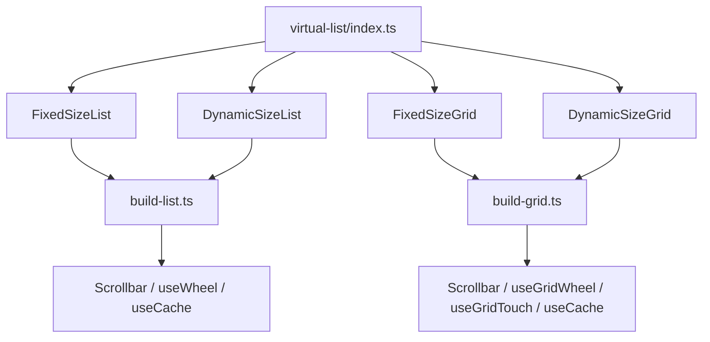
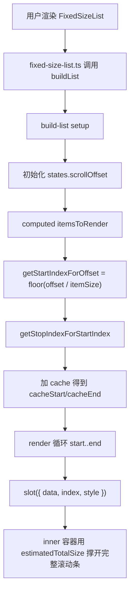
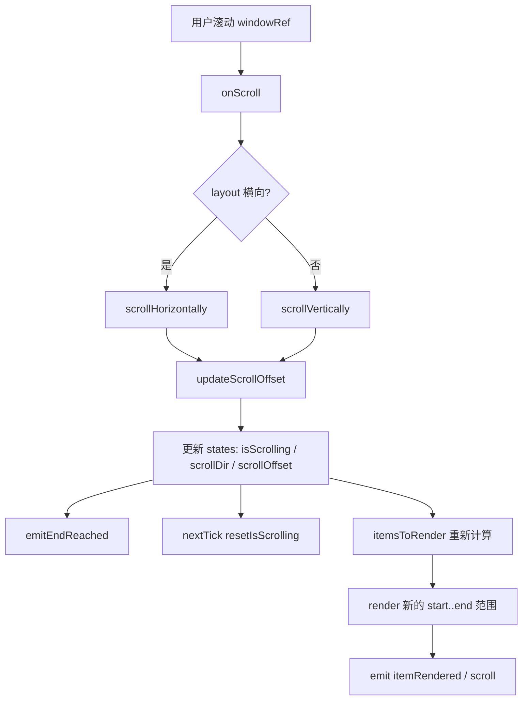
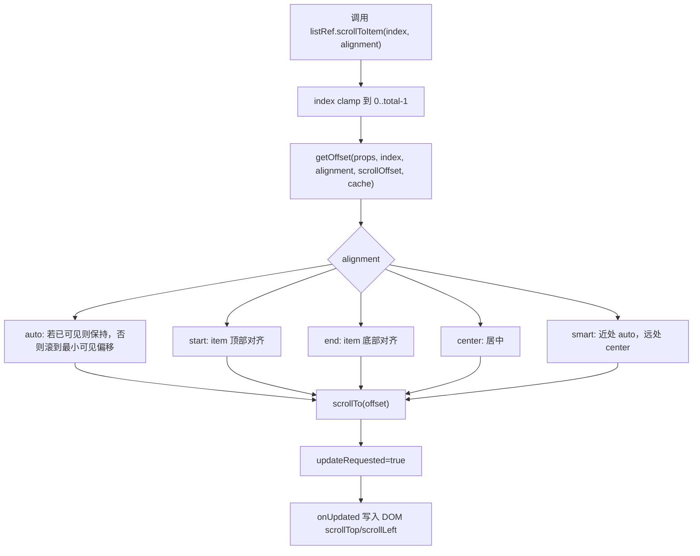
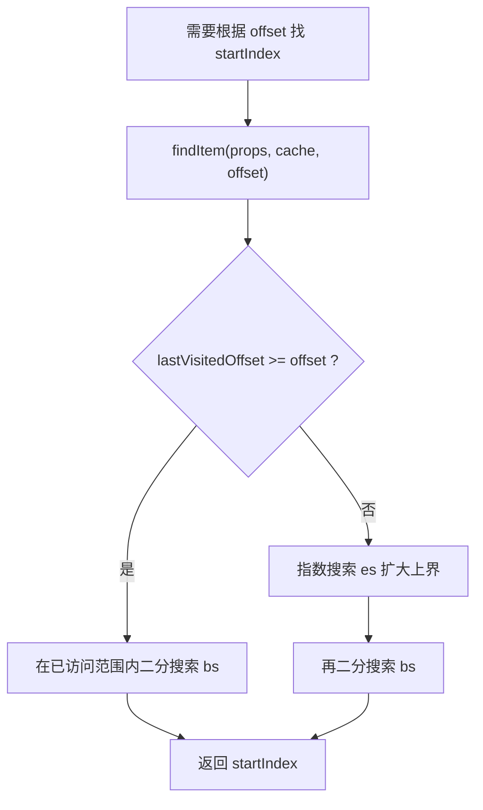
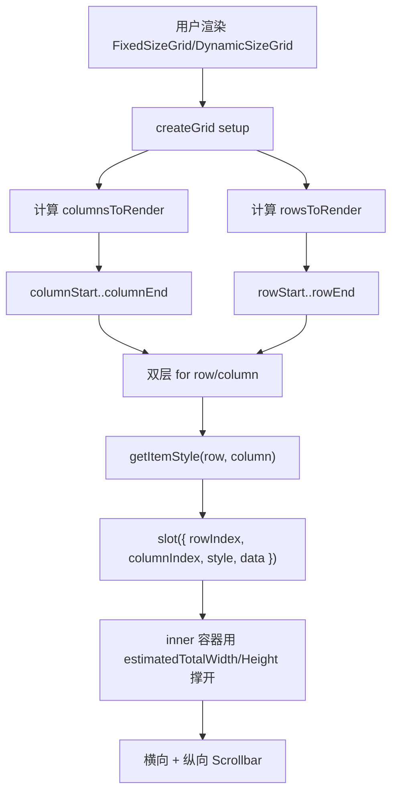
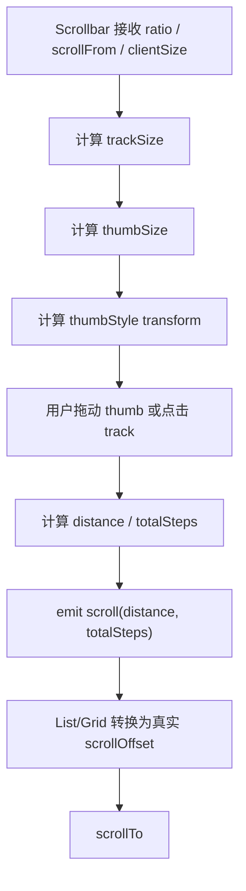
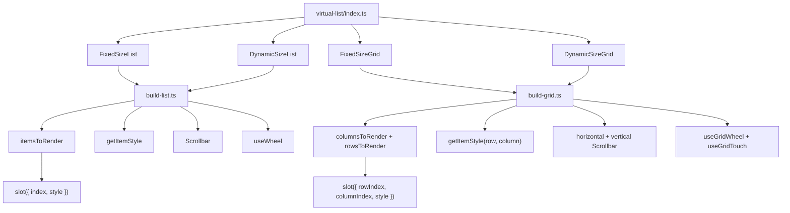

# Element Plus VirtualList 组件源码分析

> 源码位置：`element-plus-dev/packages/components/virtual-list`
>
> 主要导出：`FixedSizeList`、`DynamicSizeList`、`FixedSizeGrid`、`DynamicSizeGrid`
>
> 核心关键词：虚拟滚动、固定尺寸、动态尺寸、二维网格、缓存、滚动同步、自定义滚动条。

`virtual-list` 是 Element Plus 的底层虚拟化渲染模块。它不是普通业务组件，而是一个渲染引擎：上层组件把“大量数据”交给它，它只渲染当前可视区域附近的少量节点。

一句话概括：

```text
VirtualList 根据滚动偏移量计算当前应该渲染的 start/stop 范围，再用绝对定位把这些节点放到一个模拟完整高度/宽度的 inner 容器里。
```

Tree-v2 正是使用了这里的 `FixedSizeList` 来渲染树节点。

## 1. 学习目标

`virtual-list` 适合学习这些源码思想：

| 学习点 | 说明 |
| --- | --- |
| 虚拟滚动核心算法 | 根据 `scrollOffset` 推导可见区 start / stop index |
| 模板方法架构 | `build-list` / `build-grid` 提供通用框架，固定尺寸和动态尺寸只提供计算策略 |
| 固定尺寸优化 | 固定高度时 offset 和 index 可以直接用乘除法计算 |
| 动态尺寸缓存 | 动态高度时用 offset cache、二分搜索、指数搜索定位节点 |
| overscan 缓冲 | 通过 `cache` 预渲染可视区前后节点，避免滚动白屏 |
| 滚动状态同步 | 原生 scroll、wheel、自定义 scrollbar、`scrollTo` 都统一写入 states |
| RTL 兼容 | 横向滚动时处理不同浏览器的 RTL scrollLeft 行为 |
| 二维虚拟化 | Grid 把 List 的一维计算扩展成 row / column 两个方向 |
| 性能缓存取舍 | `perfMode` 决定样式缓存策略，提升滚动时的渲染稳定性 |

这类源码的重点不是 Vue 模板，而是：

```text
如何用数学计算代替 DOM 渲染。
```

## 2. 文件结构

源码文件：

```text
packages/components/virtual-list
├── index.ts
├── src
│   ├── props.ts
│   ├── types.ts
│   ├── defaults.ts
│   ├── utils.ts
│   ├── builders
│   │   ├── build-list.ts
│   │   └── build-grid.ts
│   ├── components
│   │   ├── fixed-size-list.ts
│   │   ├── dynamic-size-list.ts
│   │   ├── fixed-size-grid.ts
│   │   ├── dynamic-size-grid.ts
│   │   └── scrollbar.ts
│   └── hooks
│       ├── use-cache.ts
│       ├── use-wheel.ts
│       ├── use-grid-wheel.ts
│       └── use-grid-touch.ts
├── style
│   ├── index.ts
│   └── css.ts
└── __tests__
    ├── fixed-size-list.test.ts
    ├── dynamic-size-list.test.ts
    ├── fixed-size-grid.test.ts
    ├── dynamic-size-grid.test.ts
    ├── scrollbar.test.ts
    └── setup-mock.ts
```

文件职责表：

| 文件 | 职责 |
| --- | --- |
| `index.ts` | 统一导出四个虚拟化组件、props 和类型 |
| `src/props.ts` | List / Grid / Scrollbar 的 props 定义 |
| `src/types.ts` | 滚动、缓存、构造器、slot 参数、实例方法类型 |
| `src/defaults.ts` | 事件名、方向、对齐方式、RTL、滚动条尺寸常量 |
| `src/utils.ts` | 滚动方向、横向判断、RTL 检测、滚动条 thumb 样式 |
| `src/builders/build-list.ts` | 一维虚拟列表通用构造器 |
| `src/builders/build-grid.ts` | 二维虚拟网格通用构造器 |
| `src/components/fixed-size-list.ts` | 固定尺寸列表的计算策略 |
| `src/components/dynamic-size-list.ts` | 动态尺寸列表的计算策略和缓存 |
| `src/components/fixed-size-grid.ts` | 固定尺寸网格的计算策略 |
| `src/components/dynamic-size-grid.ts` | 动态尺寸网格的计算策略和缓存重置 |
| `src/components/scrollbar.ts` | 虚拟列表自定义滚动条 |
| `src/hooks/use-cache.ts` | item style 缓存 |
| `src/hooks/use-wheel.ts` | 一维列表 wheel 处理 |
| `src/hooks/use-grid-wheel.ts` | 二维网格 wheel 处理 |
| `src/hooks/use-grid-touch.ts` | 二维网格 touch 处理 |
| `style/index.ts` | SCSS 样式入口 |
| `style/css.ts` | CSS 样式入口 |
| `__tests__/*` | 固定/动态 List/Grid、滚动条和边界行为测试 |

## 3. 入口链路

入口文件：

```ts
export { default as FixedSizeList } from './src/components/fixed-size-list'
export { default as DynamicSizeList } from './src/components/dynamic-size-list'
export { default as FixedSizeGrid } from './src/components/fixed-size-grid'
export { default as DynamicSizeGrid } from './src/components/dynamic-size-grid'
export * from './src/props'

export type { FixedSizeListInstance } from './src/components/fixed-size-list'
export type { DynamicSizeListInstance } from './src/components/dynamic-size-list'
export type { GridInstance } from './src/builders/build-grid'
export type {
  DynamicSizeGridInstance,
  ResetAfterIndex,
  ResetAfterIndices,
} from './src/components/dynamic-size-grid'
export * from './src/types'
```

源码位置：`virtual-list/index.ts:1-15`

入口链路：



注意：`virtual-list` 不是通过 `withInstall` 导出的普通 UI 组件。它更像内部基础模块，被 Tree-v2、Select-v2、Table-v2 等复杂组件使用。

## 4. Props / Emits / Slots

### 4.1 通用 props

`virtualizedProps` 是 List 和 Grid 共享的基础 props：

| prop | 作用 |
| --- | --- |
| `className` | 外层 window class |
| `containerElement` | 外层滚动容器元素，默认 `div` |
| `data` | 传给 slot 的数据 |
| `direction` | `ltr` / `rtl` |
| `height` | 容器高度 |
| `innerElement` | 内层撑开总尺寸的元素 |
| `innerProps` | 传给 inner element 的 props |
| `style` | 外层容器 style |
| `useIsScrolling` | slot 是否接收 `isScrolling` |
| `width` | 容器宽度 |
| `innerWidth` | List 内层宽度 |
| `perfMode` | 样式缓存性能模式 |
| `scrollbarAlwaysOn` | 自定义滚动条是否常显 |

源码位置：`virtual-list/src/props.ts:48-106`

### 4.2 List props

`virtualizedListProps` 在通用 props 上增加：

| prop | 作用 |
| --- | --- |
| `cache` | 可视区前后预渲染数量，默认 `2` |
| `estimatedItemSize` | 动态尺寸列表的预估 item size |
| `layout` | `vertical` / `horizontal` |
| `initScrollOffset` | 初始滚动偏移 |
| `total` | item 总数 |
| `itemSize` | item 尺寸，固定列表是 number，动态列表是函数 |

源码位置：`virtual-list/src/props.ts:108-131`

### 4.3 Grid props

`virtualizedGridProps` 在通用 props 上增加：

| prop | 作用 |
| --- | --- |
| `columnCache` | 横向预渲染列数 |
| `rowCache` | 纵向预渲染行数 |
| `columnWidth` | 列宽，固定 Grid 是 number，动态 Grid 是函数 |
| `rowHeight` | 行高，固定 Grid 是 number，动态 Grid 是函数 |
| `estimatedColumnWidth` | 动态 Grid 预估列宽 |
| `estimatedRowHeight` | 动态 Grid 预估行高 |
| `initScrollLeft` | 初始横向滚动 |
| `initScrollTop` | 初始纵向滚动 |
| `itemKey` | 单元格 key 生成函数 |
| `totalColumn` | 总列数 |
| `totalRow` | 总行数 |
| `hScrollbarSize` | 横向滚动条尺寸 |
| `vScrollbarSize` | 纵向滚动条尺寸 |
| `scrollbarStartGap` | 滚动条起始间距 |
| `scrollbarEndGap` | 滚动条结束间距 |
| `role` | wrapper role |

源码位置：`virtual-list/src/props.ts:141-168`

### 4.4 Emits

List emits：

| 事件 | 参数 | 说明 |
| --- | --- | --- |
| `itemRendered` | `(cacheStart, cacheEnd, visibleStart, visibleEnd)` | 渲染范围变化 |
| `scroll` | `(scrollDir, scrollOffset, updateRequested)` | 滚动状态变化 |
| `end-reached` | `('top'/'bottom'/'left'/'right')` | 滚动到边界 |

源码位置：`virtual-list/src/builders/build-list.ts:64`

Grid emits：

| 事件 | 参数 | 说明 |
| --- | --- | --- |
| `itemRendered` | `{ columnCacheStart, columnCacheEnd, rowCacheStart, rowCacheEnd, ... }` | 行列渲染范围 |
| `scroll` | `{ xAxisScrollDir, scrollLeft, yAxisScrollDir, scrollTop, updateRequested }` | 双轴滚动状态 |

源码位置：`virtual-list/src/builders/build-grid.ts:80`

事件名常量：

```ts
export const ITEM_RENDER_EVT = 'itemRendered'
export const SCROLL_EVT = 'scroll'
export const END_REACHED_EVT = 'end-reached'
```

源码位置：`virtual-list/src/defaults.ts:3-5`

### 4.5 Slots

List 默认 slot 参数：

```ts
{
  data,
  index,
  isScrolling,
  style,
}
```

源码位置：`virtual-list/src/builders/build-list.ts:546-551`

Grid 默认 slot 参数：

```ts
{
  columnIndex,
  rowIndex,
  data,
  isScrolling,
  style,
}
```

源码位置：`virtual-list/src/builders/build-grid.ts:622-630`

最重要的是 `style`。用户渲染 item 时必须把 `style` 绑定到真实 item DOM 上：

```vue
<fixed-size-list :data="items" :total="items.length" :item-size="32" :height="300">
  <template #default="{ data, index, style }">
    <div :style="style">
      {{ data[index].label }}
    </div>
  </template>
</fixed-size-list>
```

因为虚拟列表的定位依赖这份样式：

```text
position: absolute
top/left/right
height/width
```

## 5. 内部状态

### 5.1 build-list 的核心状态

`build-list.ts` 是一维虚拟列表的通用构造器。

核心状态：

```ts
const dynamicSizeCache = ref(initCache(props, instance))
const getItemStyleCache = useCache<CSSProperties>()
const windowRef = ref<HTMLElement>()
const innerRef = ref<HTMLElement>()
const scrollbarRef = ref()
const states = ref({
  isScrolling: false,
  scrollDir: FORWARD,
  scrollOffset: isNumber(props.initScrollOffset) ? props.initScrollOffset : 0,
  updateRequested: false,
  isScrollbarDragging: false,
})
```

源码位置：`virtual-list/src/builders/build-list.ts:71-89`

状态说明：

| 状态 | 作用 |
| --- | --- |
| `dynamicSizeCache` | 动态尺寸列表使用的 offset / size 缓存 |
| `getItemStyleCache` | 缓存 item style，减少重复对象创建 |
| `windowRef` | 实际滚动容器 |
| `innerRef` | 撑开完整滚动高度/宽度的内部容器 |
| `scrollbarRef` | 自定义滚动条 |
| `states.isScrolling` | 当前是否正在滚动 |
| `states.scrollDir` | 当前滚动方向 |
| `states.scrollOffset` | 当前滚动偏移 |
| `states.updateRequested` | 是否由 API 主动请求滚动 |

### 5.2 List 的 computed

最核心 computed 是 `itemsToRender`：

```ts
const itemsToRender = computed(() => {
  const { total, cache } = props
  const { isScrolling, scrollDir, scrollOffset } = unref(states)

  if (total === 0) {
    return [0, 0, 0, 0]
  }

  const startIndex = getStartIndexForOffset(props, scrollOffset, unref(dynamicSizeCache))
  const stopIndex = getStopIndexForStartIndex(props, startIndex, scrollOffset, unref(dynamicSizeCache))

  const cacheBackward =
    !isScrolling || scrollDir === BACKWARD ? Math.max(1, cache) : 1
  const cacheForward =
    !isScrolling || scrollDir === FORWARD ? Math.max(1, cache) : 1

  return [
    Math.max(0, startIndex - cacheBackward),
    Math.max(0, Math.min(total! - 1, stopIndex + cacheForward)),
    startIndex,
    stopIndex,
  ]
})
```

源码位置：`virtual-list/src/builders/build-list.ts:92-123`

返回值含义：

```text
[cacheStart, cacheEnd, visibleStart, visibleEnd]
```

`cacheStart/cacheEnd` 是实际渲染范围，`visibleStart/visibleEnd` 是真实可见范围。

其他重要 computed：

| computed | 作用 |
| --- | --- |
| `estimatedTotalSize` | inner 容器的总高度/宽度 |
| `_isHorizontal` | 是否横向列表 |
| `windowStyle` | 外层滚动容器样式 |
| `innerStyle` | 内层撑开容器样式 |
| `clientSize` | 当前主轴可视尺寸 |
| `maxOffset` | 最大滚动偏移 |
| `currentEdgeState` | 是否到达起点/终点 |

### 5.3 build-grid 的核心状态

Grid 状态是 List 的二维版：

```ts
const cache = ref(initCache(props, instance))
const windowRef = ref<HTMLElement>()
const hScrollbar = ref<ScrollbarExpose>()
const vScrollbar = ref<ScrollbarExpose>()
const innerRef = ref<HTMLElement>()
const states = ref<GridStates>({
  isScrolling: false,
  scrollLeft: isNumber(props.initScrollLeft) ? props.initScrollLeft : 0,
  scrollTop: isNumber(props.initScrollTop) ? props.initScrollTop : 0,
  updateRequested: false,
  xAxisScrollDir: FORWARD,
  yAxisScrollDir: FORWARD,
})
```

源码位置：`virtual-list/src/builders/build-grid.ts:86-104`

Grid 有两个渲染范围：

| computed | 说明 |
| --- | --- |
| `columnsToRender` | `[columnCacheStart, columnCacheEnd, columnVisibleStart, columnVisibleEnd]` |
| `rowsToRender` | `[rowCacheStart, rowCacheEnd, rowVisibleStart, rowVisibleEnd]` |

源码位置：

| computed | 位置 |
| --- | --- |
| `columnsToRender` | `virtual-list/src/builders/build-grid.ts:113-148` |
| `rowsToRender` | `virtual-list/src/builders/build-grid.ts:150-183` |

### 5.4 hooks

| hook | 作用 |
| --- | --- |
| `useCache` | 根据 `perfMode` 选择 lodash `memoize` 或 `memoize-one` 缓存 style |
| `useWheel` | 一维列表 wheel 处理，合并 delta，边界阻止，rAF 节流 |
| `useGridWheel` | 二维网格 wheel 处理，选择主滚动轴，处理边界 |
| `useGridTouch` | 二维网格触摸滚动处理 |

`useCache`：

```ts
return computed(() => {
  const _getItemStyleCache = () => ({})
  return props.perfMode
    ? memoize(_getItemStyleCache)
    : memoOne(_getItemStyleCache)
})
```

源码位置：`virtual-list/src/hooks/use-cache.ts:12-19`

`useWheel`：

```ts
const onWheel = (e: WheelEvent) => {
  cAF(frameHandle)
  let { deltaX, deltaY } = e
  if (e.shiftKey && deltaY !== 0) {
    deltaX = deltaY
    deltaY = 0
  }
  const newOffset = layout.value === HORIZONTAL ? deltaX : deltaY
  if (hasReachedEdge(newOffset)) return
  offset += newOffset
  if (!isFirefox() && newOffset !== 0) {
    e.preventDefault()
  }
  frameHandle = rAF(() => {
    onWheelDelta(offset)
    offset = 0
  })
}
```

源码位置：`virtual-list/src/hooks/use-wheel.ts:29-53`

## 6. 核心流程

### 6.1 FixedSizeList 初始化和渲染流程



### 6.2 滚动流程



对应源码：

| 方法 | 位置 |
| --- | --- |
| `onScroll` | `build-list.ts:335-338` |
| `scrollVertically` | `build-list.ts:285-297` |
| `scrollHorizontally` | `build-list.ts:299-333` |
| `updateScrollOffset` | `build-list.ts:254-283` |

### 6.3 scrollToItem 流程



对应源码：`virtual-list/src/builders/build-list.ts:352-368`

### 6.4 DynamicSizeList 定位流程

动态尺寸无法用 `offset / itemSize` 直接算 index，所以它使用缓存和搜索：



对应源码：

| 函数 | 位置 |
| --- | --- |
| `getItemFromCache` | `dynamic-size-list.ts:19-49` |
| `findItem` | `dynamic-size-list.ts:51-61` |
| `bs` | `dynamic-size-list.ts:67-88` |
| `es` | `dynamic-size-list.ts:96-120` |

### 6.5 Grid 渲染流程



对应源码：`virtual-list/src/builders/build-grid.ts:609-689`

### 6.6 自定义滚动条流程



对应源码：`virtual-list/src/components/scrollbar.ts:50-242`

## 7. 关键源码解释

### 7.1 build-list：模板方法架构

`build-list.ts` 接收一组算法函数：

```ts
const createList = ({
  name,
  getOffset,
  getItemSize,
  getItemOffset,
  getEstimatedTotalSize,
  getStartIndexForOffset,
  getStopIndexForStartIndex,
  initCache,
  clearCache,
  validateProps,
}: ListConstructorProps<VirtualizedListProps>) => {
  return defineComponent({
    name: name ?? 'ElVirtualList',
    props: virtualizedListProps,
    emits: [ITEM_RENDER_EVT, SCROLL_EVT, END_REACHED_EVT],
    ...
  })
}
```

源码位置：`virtual-list/src/builders/build-list.ts:49-65`

这就是典型的模板方法：

| 通用部分 | 变化部分 |
| --- | --- |
| 组件状态 | item offset 怎么算 |
| scroll 事件 | item size 怎么算 |
| DOM 渲染 | total size 怎么估计 |
| scrollbar | offset 如何反推 index |
| slot 参数 | scrollToItem 如何对齐 |

固定尺寸和动态尺寸的差异不写在主组件里，而是通过策略函数注入。

### 7.2 FixedSizeList：固定尺寸为什么简单

关键代码：

```ts
const FixedSizeList = buildList({
  name: 'ElFixedSizeList',
  getItemOffset: ({ itemSize }, index) => index * (itemSize as number),
  getItemSize: ({ itemSize }) => itemSize as number,
  getEstimatedTotalSize: ({ total, itemSize }) => (itemSize as number) * total,
  getStartIndexForOffset: ({ total, itemSize }, offset) =>
    Math.max(0, Math.min(total - 1, Math.floor(offset / (itemSize as number)))),
  ...
})
```

源码位置：`virtual-list/src/components/fixed-size-list.ts:16-123`

固定尺寸列表的三个核心公式：

```text
itemOffset = index * itemSize
totalSize = total * itemSize
startIndex = floor(scrollOffset / itemSize)
```

这就是固定尺寸虚拟列表性能最好的原因：不需要测量，不需要缓存，不需要搜索。

### 7.3 itemsToRender：为什么要 cache

关键代码：

```ts
const cacheBackward =
  !isScrolling || scrollDir === BACKWARD ? Math.max(1, cache) : 1
const cacheForward =
  !isScrolling || scrollDir === FORWARD ? Math.max(1, cache) : 1

return [
  Math.max(0, startIndex - cacheBackward),
  Math.max(0, Math.min(total! - 1, stopIndex + cacheForward)),
  startIndex,
  stopIndex,
]
```

源码位置：`virtual-list/src/builders/build-list.ts:112-122`

这里的设计很细：

| 场景 | 行为 |
| --- | --- |
| 不滚动 | 前后都按 `cache` 预渲染 |
| 向前滚动 | 前方多缓存，后方至少缓存 1 |
| 向后滚动 | 后方多缓存，前方至少缓存 1 |

这样可以减少滚动过程中看到空白的概率，同时不渲染太多无用节点。

### 7.4 getItemStyle：绝对定位 item

关键代码：

```ts
const getItemStyle = (idx: number) => {
  const itemStyleCache = getItemStyleCache.value(
    clearCache && itemSize,
    clearCache && layout,
    clearCache && direction
  )

  if (hasOwn(itemStyleCache, String(idx))) {
    style = itemStyleCache[idx]
  } else {
    const offset = getItemOffset(props, idx, unref(dynamicSizeCache))
    const size = getItemSize(props, idx, unref(dynamicSizeCache))
    const horizontal = unref(_isHorizontal)

    itemStyleCache[idx] = style = {
      position: 'absolute',
      left: isRtl ? undefined : `${offsetHorizontal}px`,
      right: isRtl ? `${offsetHorizontal}px` : undefined,
      top: !horizontal ? `${offset}px` : 0,
      height: !horizontal ? `${size}px` : '100%',
      width: horizontal ? `${size}px` : '100%',
    }
  }

  return style
}
```

源码位置：`virtual-list/src/builders/build-list.ts:370-400`

虚拟滚动的 DOM 结构是：

```text
window 容器：真实滚动区域，overflow scroll
  inner 容器：高度/宽度等于所有 item 的估算总尺寸
    item：只渲染少量，position absolute 放到对应 offset
```

### 7.5 DynamicSizeList：尺寸缓存

关键代码：

```ts
const getItemFromCache = (props, index, listCache) => {
  const { itemSize } = props
  const { items, lastVisitedIndex } = listCache

  if (index > lastVisitedIndex) {
    let offset = 0
    if (lastVisitedIndex >= 0) {
      const item = items[lastVisitedIndex]
      offset = item.offset + item.size
    }

    for (let i = lastVisitedIndex + 1; i <= index; i++) {
      const size = (itemSize as ItemSize)(i)
      items[i] = { offset, size }
      offset += size
    }

    listCache.lastVisitedIndex = index
  }

  return items[index]
}
```

源码位置：`virtual-list/src/components/dynamic-size-list.ts:19-49`

它的思路是：

```text
已算过的 item offset/size 存起来；
如果要访问更靠后的 index，就从 lastVisitedIndex 往后补算；
永远不重复计算已经访问过的前缀。
```

### 7.6 DynamicSizeList：预估总高度

关键代码：

```ts
const getEstimatedTotalSize = (
  { total },
  { items, estimatedItemSize, lastVisitedIndex }
) => {
  let totalSizeOfMeasuredItems = 0

  if (lastVisitedIndex >= 0) {
    const item = items[lastVisitedIndex]
    totalSizeOfMeasuredItems = item.offset + item.size
  }

  const numUnmeasuredItems = total - lastVisitedIndex - 1
  const totalSizeOfUnmeasuredItems = numUnmeasuredItems * estimatedItemSize
  return totalSizeOfMeasuredItems + totalSizeOfUnmeasuredItems
}
```

源码位置：`virtual-list/src/components/dynamic-size-list.ts:122-140`

动态尺寸组件不可能一开始知道所有 item 的真实尺寸，所以它用：

```text
已测量部分真实尺寸 + 未测量部分预估尺寸
```

这就是为什么动态虚拟列表通常需要 `estimatedItemSize`。

### 7.7 scrollTo 和 onUpdated：主动滚动如何落到 DOM

关键代码：

```ts
const scrollTo = (offset: number) => {
  updateScrollOffset(offset, {
    isScrolling: unref(states).isScrolling,
    updateRequested: true,
  })
}
```

源码位置：`virtual-list/src/builders/build-list.ts:345-350`

`scrollTo` 只更新状态，不直接操作 DOM。真正写 DOM 在 `onUpdated`：

```ts
onUpdated(() => {
  const { direction, layout } = props
  const { scrollOffset, updateRequested } = unref(states)
  const windowElement = unref(windowRef)

  if (updateRequested && windowElement) {
    if (layout === HORIZONTAL) {
      ...
      windowElement.scrollLeft = scrollOffset
    } else {
      windowElement.scrollTop = scrollOffset
    }
  }
})
```

源码位置：`virtual-list/src/builders/build-list.ts:434-468`

这样的设计让状态先驱动渲染，再同步 DOM 滚动位置。

### 7.8 end-reached：边界事件去重

关键代码：

```ts
const EDGE_TOLERANCE = 1

const getEdgeState = (normalizedOffset: number) => ({
  start: !isGreaterThan(normalizedOffset, 0, EDGE_TOLERANCE),
  end: !isGreaterThan(maxOffset.value, normalizedOffset, EDGE_TOLERANCE),
})

let edgeState = currentEdgeState.value

const emitEndReached = (direction: ScrollDirection, offset: number) => {
  const nextEdgeState = getEdgeState(offset)

  if (direction === FORWARD && nextEdgeState.end && !edgeState.end) {
    emit(END_REACHED_EVT, _isHorizontal.value ? horizontalEnd : 'bottom')
  }

  if (direction === BACKWARD && nextEdgeState.start && !edgeState.start) {
    emit(END_REACHED_EVT, _isHorizontal.value ? horizontalStart : 'top')
  }

  edgeState = nextEdgeState
}
```

源码位置：`virtual-list/src/builders/build-list.ts:178-252`

这里有两个细节：

| 设计 | 作用 |
| --- | --- |
| `EDGE_TOLERANCE = 1` | 处理浏览器 DPR 小数滚动误差 |
| `edgeState` | 只有从非边界进入边界时才 emit，避免重复触发 |

测试中专门覆盖了 DPR mismatch 不重复触发 `end-reached`。

测试位置：`virtual-list/__tests__/fixed-size-list.test.ts:167-212`

### 7.9 build-grid：二维范围计算

Grid 的范围计算拆成两份：

```ts
const columnsToRender = computed(() => {
  const startIndex = getColumnStartIndexForOffset(props, scrollLeft, cache)
  const stopIndex = getColumnStopIndexForStartIndex(props, startIndex, scrollLeft, cache)
  ...
  return [cacheStart, cacheEnd, visibleStart, visibleEnd]
})

const rowsToRender = computed(() => {
  const startIndex = getRowStartIndexForOffset(props, scrollTop, cache)
  const stopIndex = getRowStopIndexForStartIndex(props, startIndex, scrollTop, cache)
  ...
  return [cacheStart, cacheEnd, visibleStart, visibleEnd]
})
```

源码位置：

| computed | 位置 |
| --- | --- |
| `columnsToRender` | `virtual-list/src/builders/build-grid.ts:113-148` |
| `rowsToRender` | `virtual-list/src/builders/build-grid.ts:150-183` |

渲染时双层循环：

```ts
for (let row = rowStart; row <= rowEnd; row++) {
  for (let column = columnStart; column <= columnEnd; column++) {
    const key = itemKey({ columnIndex: column, data, rowIndex: row })
    children.push(
      h(Fragment, { key }, slots.default?.({
        columnIndex: column,
        data,
        isScrolling: useIsScrolling ? unref(states).isScrolling : undefined,
        style: getItemStyle(row, column),
        rowIndex: row,
      }))
    )
  }
}
```

源码位置：`virtual-list/src/builders/build-grid.ts:609-637`

### 7.10 Scrollbar：把 thumb 位置映射成滚动距离

关键代码：

```ts
const thumbSize = computed(() => {
  const ratio = props.ratio!
  if (ratio >= 100) {
    return Number.POSITIVE_INFINITY
  }

  if (ratio >= 50) {
    return (ratio * trackSize.value) / 100
  }

  const SCROLLBAR_MAX_SIZE = trackSize.value / 3
  return Math.floor(
    Math.min(
      Math.max((ratio * trackSize.value) / 100, SCROLLBAR_MIN_SIZE),
      SCROLLBAR_MAX_SIZE
    )
  )
})
```

源码位置：`virtual-list/src/components/scrollbar.ts:68-85`

拖拽时：

```ts
state.traveled = Math.max(0, Math.min(distance, totalSteps.value))
emit('scroll', distance, totalSteps.value)
```

源码位置：`virtual-list/src/components/scrollbar.ts:209-212`

List 接收后换算成真实 offset：

```ts
const offset = (maxOffset.value / totalSteps) * distanceToGo
scrollTo(Math.min(maxOffset.value, offset))
```

源码位置：`virtual-list/src/builders/build-list.ts:340-343`

## 8. 设计思想

### 8.1 用 builder 抽象“虚拟化框架”

`build-list` 和 `build-grid` 管通用流程：

```text
props -> state -> visible range -> item style -> render -> scroll sync
```

具体组件只关心计算策略：

| 组件 | 策略 |
| --- | --- |
| `FixedSizeList` | 乘除法计算 offset/index |
| `DynamicSizeList` | 缓存 + 搜索计算 offset/index |
| `FixedSizeGrid` | 行列分别用乘除法计算 |
| `DynamicSizeGrid` | 行列分别用缓存 + 搜索计算 |

这让四个组件共享绝大部分滚动和渲染逻辑。

### 8.2 用“撑开容器 + 绝对定位 item”模拟完整列表

虚拟滚动不是真的渲染全部 DOM，但需要让浏览器滚动条感觉“这里有全部内容”。

所以它使用：

```text
window：有真实滚动条
inner：高度/宽度等于 estimatedTotalSize
item：absolute 定位到它本该出现的位置
```

这是虚拟列表最核心的 DOM 模型。

### 8.3 固定尺寸和动态尺寸分开

固定尺寸可以 O(1) 算：

```text
index = floor(offset / itemSize)
offset = index * itemSize
```

动态尺寸不能 O(1) 算，所以需要：

```text
缓存已访问 item 的 offset/size
用二分/指数搜索根据 offset 找 index
用 estimatedItemSize 估算未访问区域
```

把两者拆成不同组件，比在一个组件里塞大量条件判断更清晰。

### 8.4 状态和 DOM 同步分层

源码里滚动分两类：

| 来源 | 处理 |
| --- | --- |
| 用户真实滚动 | 先读 DOM scrollTop/scrollLeft，再更新 states |
| API 主动滚动 | 先更新 states，再在 updated 阶段写 DOM |

这样避免了程序滚动和用户滚动互相覆盖。

### 8.5 用 rAF 合并滚轮/touch 高频事件

`useWheel`、`useGridWheel`、`useGridTouch` 都使用 `requestAnimationFrame` 思路：

```text
一帧内多次 wheel/touchmove
  -> 累加 delta
  -> 下一帧统一 scrollTo
```

这样可以减少高频事件导致的重复渲染。

### 8.6 end-reached 是状态转换，不是位置判断

如果每次发现 offset 在底部就 emit，会产生大量重复事件。

Element Plus 的做法是：

```text
只有从“非边界”进入“边界”时触发
```

这对无限滚动尤其重要。

## 9. 可借鉴点

业务组件和组件库开发可以借鉴：

| 可借鉴点 | 说明 |
| --- | --- |
| 把复杂算法做成策略注入 | 固定/动态尺寸只替换计算函数，共享渲染框架 |
| 用 inner 容器模拟总尺寸 | 虚拟滚动通用 DOM 模型 |
| 预渲染缓冲区 | 通过 cache 减少滚动白屏 |
| style 对象缓存 | 高频渲染时减少重复对象创建 |
| 主动滚动和被动滚动分开 | `updateRequested` 是非常实用的状态位 |
| 动态尺寸使用估算值 | 先可用，再逐步修正 |
| 用搜索优化动态定位 | 二分搜索和指数搜索适合 offset 到 index 的映射 |
| 独立 Scrollbar 组件 | 主渲染和滚动条交互解耦 |
| 边界事件去重 | 无限加载场景必须避免重复触发 |
| RTL 作为底层能力处理 | 组件库底层组件要考虑国际化布局 |

## 核心调用链图



## 文件职责表

| 文件 | 核心职责 | 关键点 |
| --- | --- | --- |
| `index.ts` | 统一导出 | 四个组件 + props + 类型 |
| `props.ts` | API 定义 | `virtualizedProps`、List props、Grid props、Scrollbar props |
| `types.ts` | 类型定义 | cache、slot params、exposes、constructor props |
| `defaults.ts` | 常量 | 事件名、方向、对齐、RTL、滚动条最小尺寸 |
| `utils.ts` | 工具 | 滚动方向、RTL 检测、thumb style |
| `build-list.ts` | 一维虚拟列表框架 | range 计算、scroll 同步、slot 渲染 |
| `build-grid.ts` | 二维虚拟网格框架 | 行列 range、双轴滚动、双滚动条 |
| `fixed-size-list.ts` | 固定尺寸列表策略 | O(1) offset/index |
| `dynamic-size-list.ts` | 动态尺寸列表策略 | cache + binary/exponential search |
| `fixed-size-grid.ts` | 固定尺寸网格策略 | row/column O(1) 计算 |
| `dynamic-size-grid.ts` | 动态尺寸网格策略 | row/column cache + resetAfter |
| `scrollbar.ts` | 自定义滚动条 | thumbSize、drag、track click |
| `use-cache.ts` | style 缓存 | `perfMode` 决定 memoize 策略 |
| `use-wheel.ts` | List wheel | delta 合并、边界处理 |
| `use-grid-wheel.ts` | Grid wheel | 双轴滚动归一化 |
| `use-grid-touch.ts` | Grid touch | touchmove 转 scrollTo |
| `style/index.ts` | SCSS 入口 | base + virtual-list + scrollbar |
| `style/css.ts` | CSS 入口 | 构建后样式 |

## 简化版 MiniVirtualList 实现

下面实现一个简化版 `MiniVirtualList`，保留 VirtualList 的核心机制：

```text
根据 scrollTop 计算 visibleStart/visibleEnd
加 overscan 得到 renderStart/renderEnd
inner 撑开完整高度
item absolute 定位
slot 接收 index/data/style
```

### MiniVirtualList.vue

```vue
<template>
  <div
    ref="windowRef"
    class="mini-virtual-list"
    :style="windowStyle"
    @scroll="handleScroll"
  >
    <div class="mini-virtual-list__inner" :style="innerStyle">
      <template v-for="index in indexesToRender" :key="index">
        <slot
          :data="data"
          :index="index"
          :style="getItemStyle(index)"
          :is-scrolling="isScrolling"
        >
          <div :style="getItemStyle(index)">
            {{ data[index] }}
          </div>
        </slot>
      </template>
    </div>
  </div>
</template>

<script setup lang="ts">
import { computed, nextTick, ref } from 'vue'

const props = withDefaults(
  defineProps<{
    data?: unknown[]
    total: number
    height: number
    itemSize: number
    width?: number | string
    cache?: number
    initScrollOffset?: number
  }>(),
  {
    data: () => [],
    cache: 2,
    initScrollOffset: 0,
    width: '100%',
  }
)

const emit = defineEmits<{
  itemRendered: [
    cacheStart: number,
    cacheEnd: number,
    visibleStart: number,
    visibleEnd: number,
  ]
  scroll: [offset: number]
  endReached: [direction: 'top' | 'bottom']
}>()

const windowRef = ref<HTMLElement>()
const scrollOffset = ref(props.initScrollOffset)
const isScrolling = ref(false)
let endReached = false

const estimatedTotalSize = computed(() => {
  return props.total * props.itemSize
})

const maxOffset = computed(() => {
  return Math.max(0, estimatedTotalSize.value - props.height)
})

const visibleStart = computed(() => {
  return Math.max(
    0,
    Math.min(props.total - 1, Math.floor(scrollOffset.value / props.itemSize))
  )
})

const visibleEnd = computed(() => {
  const visibleCount = Math.ceil(props.height / props.itemSize)
  return Math.max(
    0,
    Math.min(props.total - 1, visibleStart.value + visibleCount - 1)
  )
})

const renderStart = computed(() => {
  return Math.max(0, visibleStart.value - props.cache)
})

const renderEnd = computed(() => {
  return Math.min(props.total - 1, visibleEnd.value + props.cache)
})

const indexesToRender = computed(() => {
  const indexes: number[] = []
  for (let i = renderStart.value; i <= renderEnd.value; i++) {
    indexes.push(i)
  }
  return indexes
})

const windowStyle = computed(() => ({
  position: 'relative',
  overflowY: 'auto',
  height: `${props.height}px`,
  width: typeof props.width === 'number' ? `${props.width}px` : props.width,
}))

const innerStyle = computed(() => ({
  position: 'relative',
  height: `${estimatedTotalSize.value}px`,
  width: '100%',
}))

function getItemStyle(index: number) {
  return {
    position: 'absolute',
    top: `${index * props.itemSize}px`,
    left: 0,
    width: '100%',
    height: `${props.itemSize}px`,
  }
}

function handleScroll(event: Event) {
  const target = event.currentTarget as HTMLElement
  const nextOffset = Math.max(0, Math.min(target.scrollTop, maxOffset.value))
  scrollOffset.value = nextOffset
  isScrolling.value = true

  emit('itemRendered', renderStart.value, renderEnd.value, visibleStart.value, visibleEnd.value)
  emit('scroll', nextOffset)

  if (nextOffset >= maxOffset.value && !endReached) {
    endReached = true
    emit('endReached', 'bottom')
  } else if (nextOffset < maxOffset.value) {
    endReached = false
  }

  nextTick(() => {
    isScrolling.value = false
  })
}

function scrollTo(offset: number) {
  const nextOffset = Math.max(0, Math.min(offset, maxOffset.value))
  scrollOffset.value = nextOffset

  if (windowRef.value) {
    windowRef.value.scrollTop = nextOffset
  }
}

function scrollToItem(index: number, alignment: 'auto' | 'start' | 'end' | 'center' = 'auto') {
  const safeIndex = Math.max(0, Math.min(index, props.total - 1))
  const itemTop = safeIndex * props.itemSize
  const itemBottom = itemTop + props.itemSize
  const viewportTop = scrollOffset.value
  const viewportBottom = viewportTop + props.height

  if (alignment === 'auto') {
    if (itemTop >= viewportTop && itemBottom <= viewportBottom) {
      return
    }
    scrollTo(itemTop < viewportTop ? itemTop : itemBottom - props.height)
    return
  }

  if (alignment === 'start') {
    scrollTo(itemTop)
  } else if (alignment === 'end') {
    scrollTo(itemBottom - props.height)
  } else {
    scrollTo(itemTop - (props.height - props.itemSize) / 2)
  }
}

defineExpose({
  scrollTo,
  scrollToItem,
  windowRef,
  states: {
    scrollOffset,
    isScrolling,
  },
})
</script>
```

### MiniVirtualList 和 Element Plus VirtualList 的差距

| 能力 | MiniVirtualList | Element Plus VirtualList |
| --- | --- | --- |
| 固定尺寸列表 | 支持 | 支持 |
| 动态尺寸列表 | 不支持 | `DynamicSizeList` |
| 网格 | 不支持 | `FixedSizeGrid` / `DynamicSizeGrid` |
| 横向布局 | 不支持 | 支持 |
| RTL | 不支持 | 支持 |
| 自定义滚动条 | 不支持 | `Scrollbar` |
| wheel/touch 优化 | 简化 | rAF 合并、边界处理 |
| style 缓存 | 不支持 | `useCache` |
| end-reached 去重 | 简化 | 有 edgeState 和 DPR 容差 |
| 自定义 container/inner | 不支持 | 支持字符串或组件 |

## 总结

`virtual-list` 的核心不是“少渲染几个 DOM”这么简单，而是一套完整的滚动模型：

```text
滚动偏移 -> 可见范围 -> 缓冲范围 -> 绝对定位 style -> slot 渲染 -> DOM scroll 同步
```

最值得学习的设计有 5 个：

| 设计 | 价值 |
| --- | --- |
| `build-list` / `build-grid` | 把虚拟化通用流程和尺寸策略分离 |
| `itemsToRender` / `rowsToRender` / `columnsToRender` | 用 computed 把滚动状态转成渲染范围 |
| `innerStyle + absolute item style` | 用少量 DOM 模拟完整滚动空间 |
| 动态尺寸 cache + search | 解决不定高 item 的 offset/index 映射 |
| 自定义 Scrollbar + wheel/touch hooks | 把滚动交互从渲染核心里拆出去 |

从 Tree-v2 回看 VirtualList，就能看清两层关系：

```text
Tree-v2 负责把树变成 flattenTree；
VirtualList 负责把 flattenTree 变成少量可视 DOM。
```

