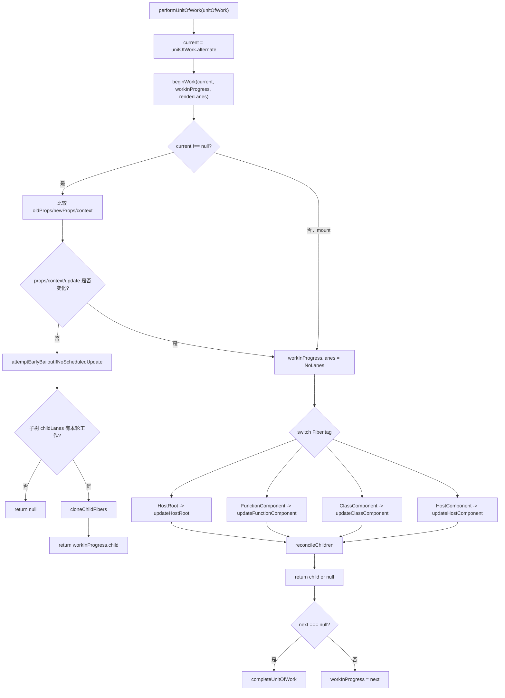
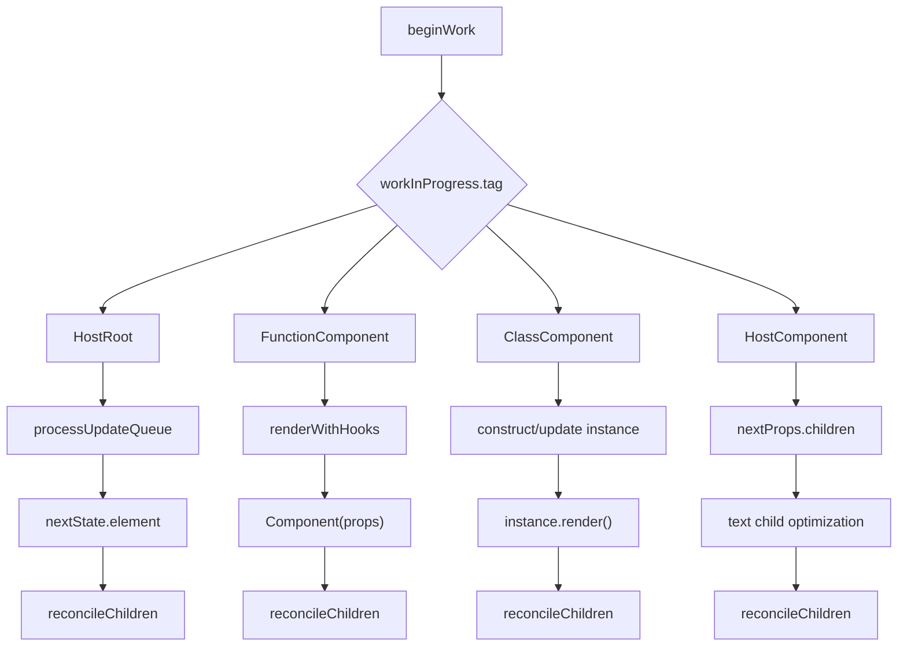
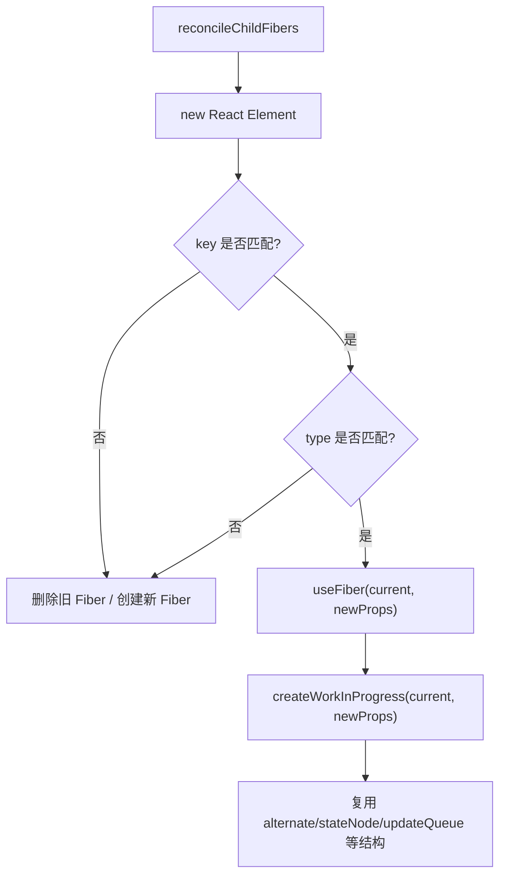

# React beginWork 源码深入分析

本文基于当前 `react-main` 源码，深入分析 render 阶段中 `beginWork` 的入口、参数、分发逻辑、核心 Fiber.tag 处理、`reconcileChildren`、mount/update 差异、bailout 逻辑，以及它在整个 Fiber render work loop 中的作用。

## 一、beginWork 是什么？

`beginWork` 是 React render 阶段处理单个 Fiber 的“向下”步骤。

它的核心职责可以概括为：

```text
给定一个 workInProgress Fiber：
  - 判断这个 Fiber 是否真的需要更新
  - 如果不需要，尝试 bailout
  - 如果需要，根据 Fiber.tag 分发到不同更新函数
  - 对组件执行 render / hooks / updateQueue 等逻辑
  - 得到 nextChildren
  - 调用 reconcileChildren 生成或复用子 Fiber
  - 返回下一个要处理的 Fiber，通常是 workInProgress.child
```

一句话：

> `beginWork` 负责“进入一个 Fiber，计算它的子 Fiber 应该是什么”。

它和 `completeWork` 的分工：

| 阶段 | 方向 | 核心职责 |
| --- | --- | --- |
| `beginWork` | 向下 | 执行组件、计算 children、协调子 Fiber |
| `completeWork` | 向上 | 创建/更新宿主实例、冒泡 flags/subtreeFlags |

## 二、源码位置

核心文件：

```text
packages/react-reconciler/src/ReactFiberBeginWork.js
```

相关文件：

| 文件 | 作用 |
| --- | --- |
| `packages/react-reconciler/src/ReactFiberWorkLoop.js` | `performUnitOfWork` 调用 `beginWork` |
| `packages/react-reconciler/src/ReactFiberBeginWork.js` | `beginWork` 主体及各 Fiber.tag 的 update 函数 |
| `packages/react-reconciler/src/ReactChildFiber.js` | `reconcileChildFibers` / `mountChildFibers`，决定子 Fiber 创建、复用、删除、移动 |
| `packages/react-reconciler/src/ReactFiberClassComponent.js` | class 组件实例、生命周期、updateQueue 处理 |
| `packages/react-reconciler/src/ReactFiberHooks.js` | function component hooks 渲染 |
| `packages/react-reconciler/src/ReactFiberCompleteWork.js` | `beginWork` 返回 `null` 后进入的 complete 阶段 |

## 三、beginWork 的入口在哪里？

`beginWork` 不是用户 API，它由 render work loop 中的 `performUnitOfWork` 调用。

源码位置：

```text
packages/react-reconciler/src/ReactFiberWorkLoop.js
```

简化源码：

```js
function performUnitOfWork(unitOfWork) {
  const current = unitOfWork.alternate;

  const next = beginWork(
    current,
    unitOfWork,
    entangledRenderLanes,
  );

  unitOfWork.memoizedProps = unitOfWork.pendingProps;

  if (next === null) {
    completeUnitOfWork(unitOfWork);
  } else {
    workInProgress = next;
  }
}
```

调用链：

```text
performWorkOnRoot
  -> renderRootSync / renderRootConcurrent
  -> workLoopSync / workLoopConcurrentByScheduler
  -> performUnitOfWork(workInProgress)
  -> beginWork(current, workInProgress, renderLanes)
```

## 四、beginWork 接收哪些参数？

源码签名：

```js
function beginWork(
  current: Fiber | null,
  workInProgress: Fiber,
  renderLanes: Lanes,
): Fiber | null
```

参数说明：

| 参数 | 类型 | 含义 |
| --- | --- | --- |
| `current` | `Fiber \| null` | 当前屏幕已提交 Fiber，也就是旧树节点；mount 时通常为 `null` |
| `workInProgress` | `Fiber` | 本次 render 正在构建的新 Fiber 节点 |
| `renderLanes` | `Lanes` | 本轮 render 正在处理的 lanes，用来判断当前 Fiber/子树是否有足够优先级的工作 |

返回值：

| 返回值 | 含义 |
| --- | --- |
| `Fiber` | 下一个要处理的子 Fiber，通常是 `workInProgress.child` |
| `null` | 当前 Fiber 没有子节点需要 begin，进入 `completeUnitOfWork` |

## 五、beginWork 的整体流程

`beginWork` 主体可分成三段：

```text
beginWork(current, workInProgress, renderLanes)
  1. 更新必要性判断
     - props 是否变化
     - legacy context 是否变化
     - hot reload type 是否变化
     - 当前 Fiber 是否有 renderLanes 内的更新
     - context dependencies 是否变化

  2. 早期 bailout
     - 如果 props/context/update 都没变化
     - 调用 attemptEarlyBailoutIfNoScheduledUpdate

  3. 根据 Fiber.tag 分发
     - FunctionComponent -> updateFunctionComponent
     - ClassComponent -> updateClassComponent
     - HostRoot -> updateHostRoot
     - HostComponent -> updateHostComponent
     - Suspense / Memo / Context / Fragment 等其他分支
```

简化源码：

```js
function beginWork(current, workInProgress, renderLanes) {
  if (current !== null) {
    const oldProps = current.memoizedProps;
    const newProps = workInProgress.pendingProps;

    if (oldProps !== newProps || hasLegacyContextChanged()) {
      didReceiveUpdate = true;
    } else {
      const hasScheduledUpdateOrContext =
        checkScheduledUpdateOrContext(current, renderLanes);

      if (!hasScheduledUpdateOrContext) {
        didReceiveUpdate = false;
        return attemptEarlyBailoutIfNoScheduledUpdate(
          current,
          workInProgress,
          renderLanes,
        );
      }

      didReceiveUpdate = false;
    }
  } else {
    didReceiveUpdate = false;
  }

  workInProgress.lanes = NoLanes;

  switch (workInProgress.tag) {
    case FunctionComponent:
      return updateFunctionComponent(...);
    case ClassComponent:
      return updateClassComponent(...);
    case HostRoot:
      return updateHostRoot(...);
    case HostComponent:
      return updateHostComponent(...);
  }
}
```

## 六、核心分支表

`beginWork` 根据 `workInProgress.tag` 分发不同 Fiber 类型。

| Fiber.tag | 处理函数 | 主要职责 |
| --- | --- | --- |
| `HostRoot` | `updateHostRoot` | 处理 root updateQueue，得到根元素，协调根 children |
| `FunctionComponent` | `updateFunctionComponent` | 执行函数组件与 Hooks，得到 `nextChildren` |
| `ClassComponent` | `updateClassComponent` | 构造/更新 class 实例，处理生命周期和 `render` |
| `HostComponent` | `updateHostComponent` | 处理宿主节点 props.children、文本优化、ref、子节点协调 |
| `HostText` | `updateHostText` | 文本节点一般没有子 Fiber |
| `SuspenseComponent` | `updateSuspenseComponent` | Suspense fallback/primary children 选择 |
| `ForwardRef` | `updateForwardRef` | 类似函数组件，但传入 ref |
| `Fragment` | `updateFragment` | 协调 Fragment children |
| `ContextProvider` | `updateContextProvider` | push provider value，协调 children |
| `ContextConsumer` | `updateContextConsumer` | 读取 context，执行 render 函数 |
| `MemoComponent` | `updateMemoComponent` | props 比较，可 bailout |
| `SimpleMemoComponent` | `updateSimpleMemoComponent` | 更快路径的 memo 函数组件 |
| `Profiler` | `updateProfiler` | Profiler 统计相关 |
| `HostPortal` | `updatePortalComponent` | Portal 子树协调 |

本文重点分析 `HostRoot`、`FunctionComponent`、`ClassComponent`、`HostComponent`。

## 七、HostRoot 如何处理？

源码位置：

```text
packages/react-reconciler/src/ReactFiberBeginWork.js
```

核心函数：

```js
function updateHostRoot(current, workInProgress, renderLanes)
```

HostRoot 是整棵 Fiber 树的根 Fiber。它的状态里保存了 root 要渲染的 React element：

```text
workInProgress.memoizedState.element
```

核心流程：

```text
updateHostRoot
  -> pushHostRootContext(workInProgress)
  -> prevState = workInProgress.memoizedState
  -> prevChildren = prevState.element
  -> cloneUpdateQueue(current, workInProgress)
  -> processUpdateQueue(workInProgress, nextProps, null, renderLanes)
  -> nextState = workInProgress.memoizedState
  -> nextChildren = nextState.element
  -> hydration 特殊处理
  -> 如果 nextChildren === prevChildren：bailout
  -> 否则 reconcileChildren(current, workInProgress, nextChildren, renderLanes)
  -> return workInProgress.child
```

简化源码：

```js
function updateHostRoot(current, workInProgress, renderLanes) {
  pushHostRootContext(workInProgress);

  const prevState = workInProgress.memoizedState;
  const prevChildren = prevState.element;

  cloneUpdateQueue(current, workInProgress);
  processUpdateQueue(workInProgress, nextProps, null, renderLanes);

  const nextState = workInProgress.memoizedState;
  const nextChildren = nextState.element;

  if (nextChildren === prevChildren) {
    return bailoutOnAlreadyFinishedWork(
      current,
      workInProgress,
      renderLanes,
    );
  }

  reconcileChildren(current, workInProgress, nextChildren, renderLanes);
  return workInProgress.child;
}
```

示例：

```jsx
root.render(<App />);
```

对应 HostRoot update 的 payload 大致是：

```js
update.payload = {
  element: <App />,
};
```

`updateHostRoot` 消费 updateQueue 后：

```text
nextState.element = <App />
nextChildren = <App />
reconcileChildren(...) 生成 App 对应的 Fiber
```

## 八、FunctionComponent 如何处理？

源码位置：

```text
packages/react-reconciler/src/ReactFiberBeginWork.js
```

核心函数：

```js
function updateFunctionComponent(
  current,
  workInProgress,
  Component,
  nextProps,
  renderLanes,
)
```

核心流程：

```text
updateFunctionComponent
  -> DEV 校验函数组件合法性
  -> prepareToReadContext(workInProgress, renderLanes)
  -> renderWithHooks(current, workInProgress, Component, nextProps, context, renderLanes)
  -> 得到 nextChildren
  -> 如果 current !== null && !didReceiveUpdate：
       bailoutHooks(...)
       bailoutOnAlreadyFinishedWork(...)
  -> workInProgress.flags |= PerformedWork
  -> reconcileChildren(current, workInProgress, nextChildren, renderLanes)
  -> return workInProgress.child
```

简化源码：

```js
function updateFunctionComponent(
  current,
  workInProgress,
  Component,
  nextProps,
  renderLanes,
) {
  prepareToReadContext(workInProgress, renderLanes);

  const nextChildren = renderWithHooks(
    current,
    workInProgress,
    Component,
    nextProps,
    context,
    renderLanes,
  );

  if (current !== null && !didReceiveUpdate) {
    bailoutHooks(current, workInProgress, renderLanes);
    return bailoutOnAlreadyFinishedWork(current, workInProgress, renderLanes);
  }

  workInProgress.flags |= PerformedWork;
  reconcileChildren(current, workInProgress, nextChildren, renderLanes);
  return workInProgress.child;
}
```

示例：

```jsx
function App({count}) {
  const doubled = count * 2;
  return <span>{doubled}</span>;
}
```

在 `beginWork` 中：

```text
FunctionComponent Fiber
  -> updateFunctionComponent
  -> renderWithHooks 执行 App(props)
  -> 得到 <span>{doubled}</span>
  -> reconcileChildren 生成 span Fiber
  -> 返回 span Fiber
```

如果组件使用 Hooks：

```jsx
function Counter() {
  const [count, setCount] = useState(0);
  return <button>{count}</button>;
}
```

`renderWithHooks` 会在执行 `Counter()` 时挂载/更新 hook 链表，并让 `useState` 从 hook queue 中计算本轮 state。

## 九、ClassComponent 如何处理？

源码位置：

```text
packages/react-reconciler/src/ReactFiberBeginWork.js
packages/react-reconciler/src/ReactFiberClassComponent.js
```

核心函数：

```js
function updateClassComponent(
  current,
  workInProgress,
  Component,
  nextProps,
  renderLanes,
)
```

核心流程：

```text
updateClassComponent
  -> legacy context provider 入栈
  -> prepareToReadContext
  -> instance = workInProgress.stateNode
  -> 如果 instance === null：
       constructClassInstance
       mountClassInstance
       shouldUpdate = true
  -> 否则如果 current === null：
       resumeMountClassInstance
  -> 否则：
       updateClassInstance
       处理 updateQueue、getDerivedStateFromProps、shouldComponentUpdate 等
  -> finishClassComponent(...)
```

`finishClassComponent` 核心流程：

```text
finishClassComponent
  -> markRef
  -> 如果 !shouldUpdate 且没有捕获错误：
       bailoutOnAlreadyFinishedWork
  -> 否则 instance.render()
  -> 得到 nextChildren
  -> reconcileChildren 或 forceUnmountCurrentAndReconcile
  -> workInProgress.memoizedState = instance.state
  -> return workInProgress.child
```

简化源码：

```js
function updateClassComponent(...) {
  const instance = workInProgress.stateNode;
  let shouldUpdate;

  if (instance === null) {
    constructClassInstance(workInProgress, Component, nextProps);
    mountClassInstance(workInProgress, Component, nextProps, renderLanes);
    shouldUpdate = true;
  } else if (current === null) {
    shouldUpdate = resumeMountClassInstance(...);
  } else {
    shouldUpdate = updateClassInstance(
      current,
      workInProgress,
      Component,
      nextProps,
      renderLanes,
    );
  }

  return finishClassComponent(
    current,
    workInProgress,
    Component,
    shouldUpdate,
    hasContext,
    renderLanes,
  );
}
```

示例：

```jsx
class Counter extends React.Component {
  state = {count: 0};

  render() {
    return <button>{this.state.count}</button>;
  }
}
```

在 `beginWork` 中：

```text
ClassComponent Fiber
  -> updateClassComponent
  -> mount/update class instance
  -> process updateQueue 得到 instance.state
  -> 判断 shouldUpdate
  -> instance.render()
  -> 得到 <button>{count}</button>
  -> reconcileChildren 生成 button Fiber
```

如果 `shouldComponentUpdate` 返回 `false`：

```text
finishClassComponent
  -> !shouldUpdate
  -> bailoutOnAlreadyFinishedWork
  -> 不调用 render
```

## 十、HostComponent 如何处理？

源码位置：

```text
packages/react-reconciler/src/ReactFiberBeginWork.js
```

HostComponent 对应 DOM 节点或其他宿主节点，例如：

```jsx
<div className="box">hello</div>
```

核心函数：

```js
function updateHostComponent(current, workInProgress, renderLanes)
```

核心流程：

```text
updateHostComponent
  -> 如果 current === null，尝试 claim hydration instance
  -> pushHostContext(workInProgress)
  -> type = workInProgress.type
  -> nextProps = workInProgress.pendingProps
  -> prevProps = current?.memoizedProps
  -> nextChildren = nextProps.children
  -> 如果 shouldSetTextContent(type, nextProps)：
       nextChildren = null
       直接文本交给宿主节点属性处理，不创建 HostText Fiber
  -> 如果之前是直接文本，现在不是：
       标记 ContentReset
  -> 处理可能的 host transition hooks
  -> markRef
  -> reconcileChildren(current, workInProgress, nextChildren, renderLanes)
  -> return workInProgress.child
```

简化源码：

```js
function updateHostComponent(current, workInProgress, renderLanes) {
  if (current === null) {
    tryToClaimNextHydratableInstance(workInProgress);
  }

  pushHostContext(workInProgress);

  const type = workInProgress.type;
  const nextProps = workInProgress.pendingProps;
  const prevProps = current !== null ? current.memoizedProps : null;

  let nextChildren = nextProps.children;
  const isDirectTextChild = shouldSetTextContent(type, nextProps);

  if (isDirectTextChild) {
    nextChildren = null;
  } else if (prevProps !== null && shouldSetTextContent(type, prevProps)) {
    workInProgress.flags |= ContentReset;
  }

  markRef(current, workInProgress);
  reconcileChildren(current, workInProgress, nextChildren, renderLanes);
  return workInProgress.child;
}
```

示例 1：直接文本子节点

```jsx
<div>hello</div>
```

如果 `shouldSetTextContent('div', props)` 返回 true：

```text
nextChildren = null
不会为 "hello" 创建单独 HostText Fiber
文本内容留给 complete/commit 阶段的宿主处理
```

示例 2：普通子节点

```jsx
<div>
  <span>hello</span>
</div>
```

流程：

```text
HostComponent div
  -> nextChildren = <span>hello</span>
  -> reconcileChildren
  -> 返回 span Fiber
```

## 十一、reconcileChildren 是在哪里调用的？

`reconcileChildren` 定义在：

```text
packages/react-reconciler/src/ReactFiberBeginWork.js
```

源码：

```js
export function reconcileChildren(
  current,
  workInProgress,
  nextChildren,
  renderLanes,
) {
  if (current === null) {
    workInProgress.child = mountChildFibers(
      workInProgress,
      null,
      nextChildren,
      renderLanes,
    );
  } else {
    workInProgress.child = reconcileChildFibers(
      workInProgress,
      current.child,
      nextChildren,
      renderLanes,
    );
  }
}
```

它被很多 `updateXxx` 函数调用。本文重点四类：

| Fiber.tag | 调用位置 | nextChildren 来源 |
| --- | --- | --- |
| `HostRoot` | `updateHostRoot` | `workInProgress.memoizedState.element` |
| `FunctionComponent` | `updateFunctionComponent` | `renderWithHooks` 执行函数组件返回值 |
| `ClassComponent` | `finishClassComponent` | `instance.render()` 返回值 |
| `HostComponent` | `updateHostComponent` | `nextProps.children`，直接文本时设为 `null` |

`reconcileChildren` 只是入口，真正 diff 和复用逻辑在：

```text
packages/react-reconciler/src/ReactChildFiber.js
```

## 十二、mount 阶段和 update 阶段有什么不同？

在 `beginWork` 这层，mount/update 最直接的判断是：

```text
current === null -> mount
current !== null -> update
```

`reconcileChildren` 的区别：

| 阶段 | 调用 | 是否追踪副作用 |
| --- | --- | --- |
| mount | `mountChildFibers(workInProgress, null, nextChildren, renderLanes)` | 不追踪最小化 side effects，直接构建子 Fiber |
| update | `reconcileChildFibers(workInProgress, current.child, nextChildren, renderLanes)` | 追踪插入、删除、移动等 side effects |

源码中对应：

```js
if (current === null) {
  workInProgress.child = mountChildFibers(...);
} else {
  workInProgress.child = reconcileChildFibers(...);
}
```

`ReactChildFiber.js` 中：

```js
export const reconcileChildFibers = createChildReconciler(true);
export const mountChildFibers = createChildReconciler(false);
```

也就是：

```text
mountChildFibers:
  shouldTrackSideEffects = false

reconcileChildFibers:
  shouldTrackSideEffects = true
```

示例：

```jsx
// mount
root.render(<App />);
```

```text
没有旧 child 可对比
直接为 <App />、<div />、<span /> 创建 Fiber
```

```jsx
// update
root.render(<App title="new" />);
```

```text
有 current.child
根据 key/type 尝试复用旧 Fiber
需要时标记 Placement / ChildDeletion / Update 等 flags
```

## 十三、bailout 逻辑是什么？

bailout 是“当前 Fiber 或子树无需重新计算”的优化。

### 1. beginWork 入口处的早期 bailout

条件：

```text
current !== null
oldProps === newProps
legacy context 没变
当前 Fiber 没有 renderLanes 内的更新
context dependencies 没变
没有 DidCapture
```

关键函数：

```text
checkScheduledUpdateOrContext(current, renderLanes)
attemptEarlyBailoutIfNoScheduledUpdate(current, workInProgress, renderLanes)
```

`checkScheduledUpdateOrContext` 做两件事：

```js
const updateLanes = current.lanes;
if (includesSomeLane(updateLanes, renderLanes)) {
  return true;
}

const dependencies = current.dependencies;
if (dependencies !== null && checkIfContextChanged(dependencies)) {
  return true;
}

return false;
```

如果没有更新也没有 context 变化，就进入：

```js
return attemptEarlyBailoutIfNoScheduledUpdate(
  current,
  workInProgress,
  renderLanes,
);
```

注意：早期 bailout 仍可能做一些栈相关工作，比如 HostRoot 仍要 push root context/cache 等，保证后续流程上下文一致。

### 2. bailoutOnAlreadyFinishedWork

核心函数：

```text
bailoutOnAlreadyFinishedWork(current, workInProgress, renderLanes)
```

核心逻辑：

```text
复用 current.dependencies
markSkippedUpdateLanes(workInProgress.lanes)
检查 childLanes 是否包含 renderLanes

如果子树也没有工作：
  return null

如果当前 Fiber 没工作但子树有工作：
  cloneChildFibers(current, workInProgress)
  return workInProgress.child
```

简化源码：

```js
function bailoutOnAlreadyFinishedWork(current, workInProgress, renderLanes) {
  if (current !== null) {
    workInProgress.dependencies = current.dependencies;
  }

  markSkippedUpdateLanes(workInProgress.lanes);

  if (!includesSomeLane(renderLanes, workInProgress.childLanes)) {
    if (current !== null) {
      lazilyPropagateParentContextChanges(current, workInProgress, renderLanes);
      if (!includesSomeLane(renderLanes, workInProgress.childLanes)) {
        return null;
      }
    } else {
      return null;
    }
  }

  cloneChildFibers(current, workInProgress);
  return workInProgress.child;
}
```

这说明 bailout 不是简单地“整棵树都跳过”。它分两种：

| 情况 | 返回值 | 含义 |
| --- | --- | --- |
| 当前 Fiber 和子树都没工作 | `null` | 直接进入 complete 阶段 |
| 当前 Fiber 没工作，但子树有工作 | `workInProgress.child` | 跳过当前 Fiber 计算，继续处理子树 |

### 3. FunctionComponent 的 hooks bailout

`updateFunctionComponent` 中还有一段：

```js
if (current !== null && !didReceiveUpdate) {
  bailoutHooks(current, workInProgress, renderLanes);
  return bailoutOnAlreadyFinishedWork(current, workInProgress, renderLanes);
}
```

含义：

```text
函数组件虽然被执行过 renderWithHooks，
但如果判断没有实际更新，
需要恢复/复用 hooks 相关状态，
再走 Fiber bailout。
```

### 4. ClassComponent 的 shouldComponentUpdate bailout

`finishClassComponent`：

```js
if (!shouldUpdate && !didCaptureError) {
  return bailoutOnAlreadyFinishedWork(current, workInProgress, renderLanes);
}
```

典型情况：

```jsx
class Row extends React.Component {
  shouldComponentUpdate(nextProps) {
    return nextProps.item !== this.props.item;
  }

  render() {
    return <div>{this.props.item.name}</div>;
  }
}
```

如果 `shouldComponentUpdate` 返回 false：

```text
不调用 render
直接尝试 bailout 子树
```

## 十四、什么情况下可以复用已有 Fiber？

Fiber 复用主要发生在 `ReactChildFiber.js` 的 child reconciliation 中。

核心函数：

```text
useFiber(fiber, pendingProps)
  -> createWorkInProgress(fiber, pendingProps)
```

源码：

```js
function useFiber(fiber, pendingProps) {
  const clone = createWorkInProgress(fiber, pendingProps);
  clone.index = 0;
  clone.sibling = null;
  return clone;
}
```

对于普通 React Element，复用条件主要是：

```text
key 相同
element type 相同
或 DEV hot reload family 兼容
或 lazy resolved type 与 current.type 相同
```

`updateElement` 中的关键判断：

```js
if (current !== null) {
  if (
    current.elementType === elementType ||
    isCompatibleFamilyForHotReloading(current, element) ||
    (isLazyType(elementType) && resolveLazy(elementType) === current.type)
  ) {
    const existing = useFiber(current, element.props);
    existing.return = returnFiber;
    return existing;
  }
}

const created = createFiberFromElement(element, returnFiber.mode, lanes);
created.return = returnFiber;
return created;
```

`reconcileSingleElement` 中还会先匹配 key：

```text
遍历 currentFirstChild
  -> child.key === element.key
  -> 再比较 type
  -> 匹配则 useFiber(child, element.props)
  -> 不匹配则删除旧 child，创建新 Fiber
```

示例 1：可以复用

```jsx
// before
<Item key="a" name="old" />

// after
<Item key="a" name="new" />
```

```text
key 相同：a
type 相同：Item
复用旧 Fiber，pendingProps 更新为 {name: "new"}
```

示例 2：不能复用

```jsx
// before
<Item key="a" />

// after
<OtherItem key="a" />
```

```text
key 相同，但 type 不同
旧 Fiber 删除
创建新的 OtherItem Fiber
```

示例 3：列表移动

```jsx
// before
[<A key="a" />, <B key="b" />]

// after
[<B key="b" />, <A key="a" />]
```

```text
key/type 匹配，所以 Fiber 可复用
但 index 顺序变化
placeChild 可能标记 Placement，表示需要移动
```

## 十五、beginWork 最终返回什么？

`beginWork` 的返回值是：

```text
下一个要执行 beginWork 的 Fiber
```

通常是：

```js
return workInProgress.child;
```

不同返回情况：

| 返回值 | 场景 | render work loop 下一步 |
| --- | --- | --- |
| `workInProgress.child` | 当前 Fiber 产生了子 Fiber | 继续向下处理 child |
| `null` | 当前 Fiber 没有子节点，或整棵子树 bailout | 进入 `completeUnitOfWork` |
| 其他 Fiber | 少数特殊场景，如 remount/replay 产生的新工作 | 转向该 Fiber |

`performUnitOfWork` 根据返回值决定：

```js
if (next === null) {
  completeUnitOfWork(unitOfWork);
} else {
  workInProgress = next;
}
```

## 十六、beginWork 在整个 render 阶段中的作用是什么？

render 阶段的核心是构建 `workInProgress` 树。`beginWork` 是构建过程的前半段。

它在整个 render 阶段中的位置：

```text
renderRootConcurrent / renderRootSync
  -> workLoop
  -> performUnitOfWork
  -> beginWork
       计算当前 Fiber 的 children
       reconcile children
       返回 child
  -> completeWork
       创建宿主实例
       冒泡 flags
```

`beginWork` 解决的是：

```text
当前 Fiber 这一层是否需要重新计算？
如果需要，它的下一层 children 是什么？
这些 children 对应的 Fiber 能否复用？
下一步应该进入哪个子 Fiber？
```

如果没有 `beginWork`：

```text
React 就无法从 root 一层层执行组件，
无法消费 updateQueue/hooks queue，
无法把 React Element 转成下一轮 Fiber 子树，
也无法为 complete/commit 阶段准备变更信息。
```

## 十七、调用链

### 1. 总调用链

```text
更新触发
  -> scheduleUpdateOnFiber(root, fiber, lane)
  -> ensureRootIsScheduled(root)
  -> performSyncWorkOnRoot / performWorkOnRootViaSchedulerTask
  -> performWorkOnRoot(root, lanes, forceSync)
  -> renderRootSync / renderRootConcurrent
  -> workLoopSync / workLoopConcurrentByScheduler
  -> performUnitOfWork(workInProgress)
  -> beginWork(current, workInProgress, renderLanes)
  -> updateXxx by Fiber.tag
  -> reconcileChildren
  -> return next Fiber
```

### 2. HostRoot 调用链

```text
beginWork(HostRoot)
  -> updateHostRoot
  -> cloneUpdateQueue
  -> processUpdateQueue
  -> nextChildren = nextState.element
  -> reconcileChildren
  -> return workInProgress.child
```

### 3. FunctionComponent 调用链

```text
beginWork(FunctionComponent)
  -> updateFunctionComponent
  -> prepareToReadContext
  -> renderWithHooks
  -> Component(props)
  -> nextChildren
  -> reconcileChildren
  -> return workInProgress.child
```

### 4. ClassComponent 调用链

```text
beginWork(ClassComponent)
  -> updateClassComponent
  -> constructClassInstance / updateClassInstance
  -> finishClassComponent
  -> instance.render()
  -> nextChildren
  -> reconcileChildren
  -> return workInProgress.child
```

### 5. HostComponent 调用链

```text
beginWork(HostComponent)
  -> updateHostComponent
  -> pushHostContext
  -> nextChildren = nextProps.children
  -> shouldSetTextContent ? nextChildren = null
  -> markRef
  -> reconcileChildren
  -> return workInProgress.child
```

## 十八、Mermaid 流程图

### 1. beginWork 总流程



### 2. 四个重点 tag 分支



### 3. Fiber 复用逻辑



## 十九、每一步的示例代码

### 1. HostRoot

用户代码：

```jsx
root.render(<App />);
```

内部：

```js
update.payload = {element: <App />};
```

`updateHostRoot`：

```js
processUpdateQueue(workInProgress, nextProps, null, renderLanes);
const nextChildren = workInProgress.memoizedState.element;
reconcileChildren(current, workInProgress, nextChildren, renderLanes);
return workInProgress.child;
```

### 2. FunctionComponent

用户代码：

```jsx
function App({name}) {
  return <h1>Hello {name}</h1>;
}
```

`updateFunctionComponent`：

```js
const nextChildren = renderWithHooks(
  current,
  workInProgress,
  App,
  nextProps,
  context,
  renderLanes,
);

reconcileChildren(current, workInProgress, nextChildren, renderLanes);
return workInProgress.child;
```

结果：

```text
执行 App({name})
得到 <h1>Hello {name}</h1>
为 h1 创建或复用 Fiber
```

### 3. ClassComponent

用户代码：

```jsx
class App extends React.Component {
  render() {
    return <h1>Hello</h1>;
  }
}
```

`updateClassComponent`：

```js
if (instance === null) {
  constructClassInstance(...);
  mountClassInstance(...);
} else {
  updateClassInstance(...);
}

return finishClassComponent(...);
```

`finishClassComponent`：

```js
const nextChildren = instance.render();
reconcileChildren(current, workInProgress, nextChildren, renderLanes);
return workInProgress.child;
```

### 4. HostComponent

用户代码：

```jsx
<div className="box">
  <span>Hello</span>
</div>
```

`updateHostComponent`：

```js
const nextProps = workInProgress.pendingProps;
let nextChildren = nextProps.children;

if (shouldSetTextContent(type, nextProps)) {
  nextChildren = null;
}

markRef(current, workInProgress);
reconcileChildren(current, workInProgress, nextChildren, renderLanes);
return workInProgress.child;
```

结果：

```text
div Fiber 的 beginWork 返回 span Fiber
下一轮 performUnitOfWork 处理 span
```

### 5. bailout

示例：

```jsx
const Child = React.memo(function Child({value}) {
  return <span>{value}</span>;
});

function App() {
  return <Child value="same" />;
}
```

当 `Child` 的 props 没变，且没有 context/update：

```text
beginWork
  -> checkScheduledUpdateOrContext = false
  -> attemptEarlyBailoutIfNoScheduledUpdate
  -> bailoutOnAlreadyFinishedWork
```

如果子树也没有待处理 lanes：

```text
return null
直接 complete 当前 Fiber
```

## 二十、学习重点

建议阅读顺序：

1. `ReactFiberWorkLoop.js`
   - 先看 `performUnitOfWork`，明确 `beginWork` 如何被调用。
2. `ReactFiberBeginWork.js`
   - 看 `beginWork` 主体：更新判断、bailout、switch 分发。
3. `updateHostRoot`
   - 理解 root 的 updateQueue 如何产出根元素。
4. `updateFunctionComponent`
   - 理解函数组件如何通过 `renderWithHooks` 得到 children。
5. `updateClassComponent` / `finishClassComponent`
   - 理解 class 实例、生命周期、`render`、bailout。
6. `updateHostComponent`
   - 理解宿主节点 children、直接文本优化、ref。
7. `reconcileChildren`
   - 理解 mount 与 update 进入不同 child reconciler。
8. `ReactChildFiber.js`
   - 重点看 `useFiber`、`updateElement`、`reconcileSingleElement`、`reconcileChildrenArray`。
9. `bailoutOnAlreadyFinishedWork`
   - 理解跳过当前 Fiber 与继续处理子树的区别。

几个必须掌握的问题：

| 问题 | 答案 |
| --- | --- |
| `beginWork` 是 render 阶段还是 commit 阶段？ | render 阶段 |
| `beginWork` 是否会直接操作 DOM？ | 通常不会，它主要计算子 Fiber |
| `beginWork` 返回什么？ | 下一个要处理的 Fiber，通常是 child；没有则返回 `null` |
| `reconcileChildren` 的结果放在哪里？ | `workInProgress.child` |
| mount/update 如何区分？ | `current === null` 是 mount，否则 update |
| 复用 Fiber 的核心条件？ | key/type/tag 等身份匹配，走 `useFiber(createWorkInProgress)` |
| bailout 是否一定跳过整棵子树？ | 不一定；如果 `childLanes` 有本轮工作，会 clone children 并继续子树 |
| `beginWork` 和 `completeWork` 的关系？ | begin 向下生成子 Fiber，complete 向上创建宿主实例并冒泡 flags |

## 二十一、总结

`beginWork` 是 React render 阶段最关键的入口之一。它把“一个 Fiber 节点”展开成“下一层 Fiber 子树”：

```text
Fiber + props/state/updateQueue/hooks/context
  -> beginWork
  -> nextChildren
  -> reconcileChildren
  -> child Fiber 链表
```

它的核心价值：

```text
1. 判断当前 Fiber 是否需要更新。
2. 根据 Fiber.tag 执行不同组件类型的渲染逻辑。
3. 调用 reconcileChildren，把 React Element 转成 Fiber。
4. 通过 bailout 跳过无变化的工作。
5. 返回下一个 Fiber，驱动深度优先的 render work loop。
```

最短心智模型：

> `beginWork` 是 Fiber render 阶段的“展开节点”动作：能复用就复用，能跳过就跳过，必须更新就执行组件并协调 children，最后把下一个 Fiber 交还给 work loop。

