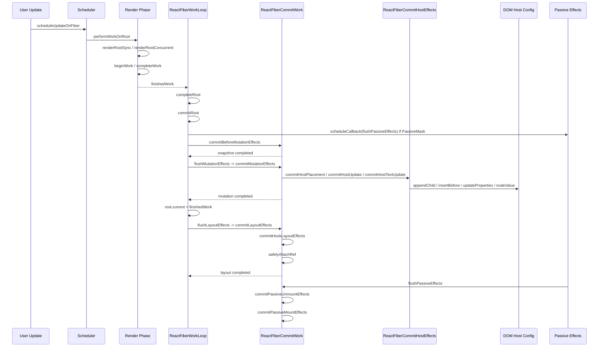

# React commit 阶段源码深入分析

本文基于当前 `react-main` 源码，分析 React commit 阶段的入口、`commitRoot` 的职责、before mutation / mutation / layout 三个子阶段、DOM 操作、ref、`useLayoutEffect`、`useEffect`、flags 消费方式，以及 commit 完成后 `current` 树如何切换。

commit 阶段是 React 从“算出一棵 finishedWork 树”走向“把结果真正应用到宿主环境”的阶段。

一句话概括：

```text
render 阶段负责算出要改什么；
commit 阶段负责真正改 DOM、执行 ref 和同步生命周期/effect，并安排 passive effect。
```

## 一、commit 阶段在 React 架构中的位置

React 一次更新可以粗略拆成两大阶段：

```text
触发更新
  -> 调度任务
  -> render 阶段
       生成 workInProgress 树
       标记 flags / subtreeFlags
       得到 finishedWork
  -> commit 阶段
       before mutation
       mutation
       layout
       passive effects
```

render 阶段可以被中断、恢复、丢弃，因为它主要在内存中构建 `workInProgress` 树。

commit 阶段不能被中断，因为它会真实改变宿主环境：

```text
DOM 插入 / 更新 / 删除
ref detach / attach
class 生命周期
useLayoutEffect
root.current 切换
```

一旦这些操作执行到一半被暂停，页面 DOM、Fiber 树、ref、生命周期观察到的状态就可能不一致。

## 二、源码位置

核心文件：

```text
packages/react-reconciler/src/ReactFiberWorkLoop.js
packages/react-reconciler/src/ReactFiberCommitWork.js
packages/react-reconciler/src/ReactFiberCommitEffects.js
packages/react-reconciler/src/ReactFiberCommitHostEffects.js
packages/react-dom-bindings/src/client/ReactFiberConfigDOM.js
```

文件职责：

| 文件 | 作用 |
| --- | --- |
| `ReactFiberWorkLoop.js` | render 完成后进入 `commitRoot`，组织 before mutation / mutation / layout / passive 阶段 |
| `ReactFiberCommitWork.js` | 按 Fiber 树遍历 commit effects，区分 mutation、layout、passive 处理 |
| `ReactFiberCommitEffects.js` | 执行 class 生命周期、Hook effect list、ref attach/detach 等 effect |
| `ReactFiberCommitHostEffects.js` | 执行宿主环境相关操作，例如 placement、update、text update、reset text content |
| `ReactFiberConfigDOM.js` | React DOM renderer 的 host config，真正调用 DOM API 修改节点 |
| `ReactFiberFlags.js` | 定义 `Placement`、`Update`、`ChildDeletion`、`Passive`、`Layout` 等 flags |

## 三、commit 阶段入口在哪里？

commit 阶段的核心入口是：

```text
packages/react-reconciler/src/ReactFiberWorkLoop.js

commitRoot(root, finishedWork, lanes, ...)
```

但用户代码不会直接调用它。它来自 render 阶段完成后的收尾流程。

简化调用链：

```text
performWorkOnRoot(...)
  -> renderRootSync(...) 或 renderRootConcurrent(...)
  -> workLoopSync(...) 或 workLoopConcurrent(...)
  -> completeUnitOfWork(...)
  -> workInProgressRootExitStatus = RootCompleted
  -> completeRoot(root, finishedWork, lanes, ...)
  -> commitRoot(root, finishedWork, lanes, ...)
```

当前源码中，`completeRoot` 会先保存本次完成的树和 lanes：

```js
root.finishedWork = null;
root.finishedLanes = NoLanes;

pendingFinishedWork = finishedWork;
pendingEffectsRoot = root;
pendingEffectsLanes = lanes;
```

随后在没有特殊 view transition 延迟提交的情况下进入：

```js
commitRoot(
  root,
  finishedWork,
  lanes,
  recoverableErrors,
  transitions,
  didIncludeRenderPhaseUpdate,
  spawnedLane,
  updatedLanes,
  suspendedRetryLanes,
  exitStatus,
  suspendedCommitReason,
  completedRenderStartTime,
  completedRenderEndTime,
);
```

源码锚点：

```text
packages/react-reconciler/src/ReactFiberWorkLoop.js
  completeRoot: 约 3568 - 3701
  commitRoot: 约 3704 - 3901
```

## 四、commitRoot 做了什么？

`commitRoot` 不是单纯“提交 DOM”。它负责把一次 finished render 的结果转成一系列提交动作。

核心职责：

| 步骤 | 说明 |
| --- | --- |
| 计算剩余 lanes | 合并 `finishedWork.lanes`、`finishedWork.childLanes`、`concurrentlyUpdatedLanes` |
| 标记 root 完成 | 调用 `markRootFinished`，从 root pending lanes 中移除本次完成的 lanes |
| 处理 passive effect 调度 | 如果树上有 `PassiveMask`，提前调度 `flushPassiveEffects` |
| 进入 before mutation | 读取 DOM 变更前快照，例如 class `getSnapshotBeforeUpdate` |
| 进入 mutation | 执行 DOM 插入、更新、删除，detach ref，切换 `root.current` |
| 进入 layout | 执行 layout effects、class mount/update 生命周期、attach ref |
| 安排后续工作 | 处理 spawned work、passive effects、调度下一轮 root 任务 |

简化源码结构：

```js
function commitRoot(root, finishedWork, lanes, ...) {
  const remainingLanes = mergeLanes(
    finishedWork.lanes,
    finishedWork.childLanes,
  );

  markRootFinished(root, lanes, remainingLanes, ...);

  if (
    (finishedWork.subtreeFlags & PassiveMask) !== NoFlags ||
    (finishedWork.flags & PassiveMask) !== NoFlags
  ) {
    scheduleCallback(NormalSchedulerPriority, () => {
      flushPassiveEffects();
      return null;
    });
  }

  if (
    (finishedWork.subtreeFlags & BeforeMutationMask) !== NoFlags ||
    (finishedWork.flags & BeforeMutationMask) !== NoFlags
  ) {
    commitBeforeMutationEffects(root, finishedWork, lanes);
  }

  pendingEffectsStatus = PENDING_MUTATION_PHASE;

  flushMutationEffects();
  flushLayoutEffects();
  flushSpawnedWork();
}
```

注意：`useEffect` 的执行不在这三个同步子阶段里直接完成。`commitRoot` 会在发现 `PassiveMask` 时调度 `flushPassiveEffects`，然后在后续 passive 阶段执行 `useEffect` cleanup 和 create。

## 五、commit 阶段完整流程

完整链路可以这样理解：

```text
render 阶段完成
  -> 得到 finishedWork
  -> completeRoot(root, finishedWork, lanes)
  -> commitRoot(root, finishedWork, lanes)
       1. 标记 root 完成
       2. 如果存在 passive effects，调度 flushPassiveEffects
       3. commitBeforeMutationEffects
       4. flushMutationEffects
            -> commitMutationEffects
            -> root.current = finishedWork
       5. flushLayoutEffects
            -> commitLayoutEffects
       6. flushSpawnedWork
       7. 后续某个调度时机执行 flushPassiveEffects
            -> commitPassiveUnmountEffects
            -> commitPassiveMountEffects
```

对应伪代码：

```js
function finishRender(root, finishedWork, lanes) {
  completeRoot(root, finishedWork, lanes);
}

function completeRoot(root, finishedWork, lanes) {
  pendingFinishedWork = finishedWork;
  pendingEffectsRoot = root;
  pendingEffectsLanes = lanes;

  commitRoot(root, finishedWork, lanes);
}

function commitRoot(root, finishedWork, lanes) {
  schedulePassiveEffectsIfNeeded(finishedWork);

  commitBeforeMutationEffects(root, finishedWork, lanes);

  flushMutationEffects();
  // mutation 阶段内部完成 root.current 切换

  flushLayoutEffects();

  flushSpawnedWork();
}
```

## 六、三个子阶段对比表

| 子阶段 | 执行函数 | 主要职责 | 会不会修改 DOM | 典型消费的 flags |
| --- | --- | --- | --- | --- |
| before mutation | `commitBeforeMutationEffects` | DOM 变更前读取快照，处理部分 transition/gesture 相关逻辑 | 通常不修改 DOM | `BeforeMutationMask`、`Snapshot` |
| mutation | `flushMutationEffects` -> `commitMutationEffects` | 执行 DOM 插入、更新、删除；detach ref；处理 visibility 等宿主变更 | 会 | `MutationMask`、`Placement`、`Update`、`ChildDeletion`、`Ref` |
| layout | `flushLayoutEffects` -> `commitLayoutEffects` | 执行 `useLayoutEffect`、class 生命周期、class callbacks、attach ref | 通常不做结构性 DOM 变更，但用户 layout effect 可同步读写 DOM | `LayoutMask`、`Layout`、`Callback`、`Ref` |
| passive | `flushPassiveEffects` | 执行 `useEffect` cleanup 和 create | 不属于同步 commit 三段；effect 里用户代码可操作 DOM | `PassiveMask`、`Passive` |

为什么 `useLayoutEffect` 和 `useEffect` 分开？

```text
useLayoutEffect:
  DOM mutation 之后、浏览器绘制前同步执行
  适合读取布局、同步修正 DOM

useEffect:
  commit 同步阶段之后异步执行
  不阻塞浏览器绘制
  适合订阅、日志、网络请求等副作用
```

## 七、before mutation 阶段做什么？

入口：

```text
commitRoot(...)
  -> commitBeforeMutationEffects(root, finishedWork, lanes)
```

源码位置：

```text
packages/react-reconciler/src/ReactFiberCommitWork.js

commitBeforeMutationEffects
commitBeforeMutationEffects_begin
commitBeforeMutationEffects_complete
commitBeforeMutationEffectsOnFiber
```

这个阶段发生在 DOM 变更之前。它的核心价值是：

```text
在 DOM 还保持旧状态时，允许 React 读取一些快照信息。
```

典型例子是 class component 的 `getSnapshotBeforeUpdate`：

```js
class ChatList extends React.Component {
  getSnapshotBeforeUpdate(prevProps, prevState) {
    return this.listRef.scrollHeight;
  }

  componentDidUpdate(prevProps, prevState, snapshot) {
    // snapshot 是 DOM 更新前读取到的值
  }

  render() {
    return <div ref={node => (this.listRef = node)}>{this.props.items}</div>;
  }
}
```

如果先执行 DOM 更新，再调用 `getSnapshotBeforeUpdate`，拿到的就不是“更新前”的布局数据了。

简化伪代码：

```js
function commitBeforeMutationEffects(root, finishedWork, lanes) {
  focusedInstanceHandle = prepareForCommit(root.containerInfo);

  nextEffect = finishedWork;

  while (nextEffect !== null) {
    if (nextEffect.subtreeFlags & BeforeMutationMask) {
      nextEffect = nextEffect.child;
    } else {
      commitBeforeMutationEffects_complete();
    }
  }
}

function commitBeforeMutationEffectsOnFiber(finishedWork) {
  switch (finishedWork.tag) {
    case ClassComponent:
      if (finishedWork.flags & Snapshot) {
        commitClassSnapshot(finishedWork);
      }
      break;
  }
}
```

## 八、mutation 阶段做什么？

入口：

```text
commitRoot(...)
  -> pendingEffectsStatus = PENDING_MUTATION_PHASE
  -> flushMutationEffects()
  -> commitMutationEffects(root, finishedWork, lanes)
```

源码位置：

```text
packages/react-reconciler/src/ReactFiberWorkLoop.js
  flushMutationEffects: 约 3988 - 4032

packages/react-reconciler/src/ReactFiberCommitWork.js
  commitMutationEffects
  recursivelyTraverseMutationEffects
  commitMutationEffectsOnFiber

packages/react-reconciler/src/ReactFiberCommitHostEffects.js
  commitHostPlacement
  commitHostUpdate
  commitHostTextUpdate
```

`flushMutationEffects` 的关键点：

```js
function flushMutationEffects() {
  if (pendingEffectsStatus !== PENDING_MUTATION_PHASE) {
    return;
  }

  pendingEffectsStatus = NO_PENDING_EFFECTS;

  const root = pendingEffectsRoot;
  const finishedWork = pendingFinishedWork;
  const lanes = pendingEffectsLanes;

  if (subtreeHasMutationEffects || rootHasMutationEffect) {
    executionContext |= CommitContext;
    commitMutationEffects(root, finishedWork, lanes);
    executionContext = prevExecutionContext;
  }

  resetAfterCommit(root.containerInfo);

  root.current = finishedWork;
  pendingEffectsStatus = PENDING_LAYOUT_PHASE;
}
```

这里最重要的一行是：

```js
root.current = finishedWork;
```

React 在 mutation 阶段完成 DOM 变更之后、layout 阶段之前切换 current 树。这样 `componentDidMount`、`componentDidUpdate`、`useLayoutEffect` 看到的就是已经提交完成的新树。

## 九、DOM 插入在哪里完成？

DOM 插入由 `Placement` flag 驱动。

调用链：

```text
commitMutationEffects(root, finishedWork, lanes)
  -> recursivelyTraverseMutationEffects(root, finishedWork, lanes)
  -> commitReconciliationEffects(finishedWork, lanes)
  -> commitHostPlacement(finishedWork)
  -> commitPlacement(finishedWork)
  -> insertOrAppendPlacementNode(...)
  -> insertBefore / appendChild / appendChildToContainer
```

源码位置：

```text
packages/react-reconciler/src/ReactFiberCommitWork.js
  recursivelyTraverseMutationEffects
  commitReconciliationEffects

packages/react-reconciler/src/ReactFiberCommitHostEffects.js
  commitHostPlacement
  commitPlacement
  insertOrAppendPlacementNode
```

示例代码：

```jsx
function App({show}) {
  return <div>{show ? <span>Hello</span> : null}</div>;
}
```

第一次从 `show = false` 变为 `show = true` 时，`span` 对应的 Fiber 会带有类似 `Placement` 的插入标记。

简化流程：

```js
if (finishedWork.flags & Placement) {
  commitHostPlacement(finishedWork);
  finishedWork.flags &= ~Placement;
}
```

`commitPlacement` 会做三件事：

| 步骤 | 说明 |
| --- | --- |
| 找宿主父节点 | 沿 `return` 指针向上找到 `HostComponent`、`HostRoot` 或 `HostPortal` |
| 找插入位置 | 找到稳定的 host sibling，决定 `insertBefore` 还是 append |
| 插入宿主节点 | 深度遍历待插入 Fiber 子树，把真实 DOM 节点插入父容器 |

一个重要细节：

```text
Placement 标在 Fiber 上，但真正插入的是该 Fiber 子树里的 HostComponent / HostText DOM 节点。
```

## 十、DOM 更新在哪里完成？

HostComponent 的属性更新调用链：

```text
commitMutationEffects
  -> commitMutationEffectsOnFiber
  -> HostComponent 分支
  -> commitHostUpdate(finishedWork, newProps, oldProps)
  -> commitUpdate(instance, type, oldProps, newProps, finishedWork)
  -> updateProperties(domElement, type, oldProps, newProps)
  -> updateFiberProps(domElement, newProps)
```

源码位置：

```text
packages/react-reconciler/src/ReactFiberCommitWork.js
  HostComponent mutation 分支: 约 2213 - 2234

packages/react-reconciler/src/ReactFiberCommitHostEffects.js
  commitHostUpdate: 约 116 - 145

packages/react-dom-bindings/src/client/ReactFiberConfigDOM.js
  commitUpdate: 约 988 - 1001
```

DOM renderer 中的 `commitUpdate` 简化后是：

```js
export function commitUpdate(
  domElement,
  type,
  oldProps,
  newProps,
  internalInstanceHandle,
) {
  updateProperties(domElement, type, oldProps, newProps);
  updateFiberProps(domElement, newProps);
}
```

示例代码：

```jsx
function App({active}) {
  return <button className={active ? 'on' : 'off'}>Save</button>;
}
```

当 `active` 从 `false` 变为 `true`：

```text
render 阶段:
  HostComponent(button) pendingProps = {className: 'on'}
  current.memoizedProps = {className: 'off'}
  标记 Update

commit mutation 阶段:
  commitHostUpdate(buttonFiber, newProps, oldProps)
  updateProperties(button, 'button', oldProps, newProps)
  DOM class 从 off 改成 on
```

## 十一、HostText 更新在哪里完成？

文本节点更新调用链：

```text
commitMutationEffects
  -> commitMutationEffectsOnFiber
  -> HostText 分支
  -> commitHostTextUpdate(finishedWork, newText, oldText)
  -> commitTextUpdate(textInstance, oldText, newText)
  -> textInstance.nodeValue = newText
```

源码位置：

```text
packages/react-reconciler/src/ReactFiberCommitWork.js
  HostText mutation 分支: 约 2268 - 2288

packages/react-reconciler/src/ReactFiberCommitHostEffects.js
  commitHostTextUpdate: 约 147 - 169

packages/react-dom-bindings/src/client/ReactFiberConfigDOM.js
  commitTextUpdate: 约 1007 - 1013
```

示例代码：

```jsx
function Counter({count}) {
  return <span>{count}</span>;
}
```

当 `count` 从 `0` 变成 `1`：

```text
render 阶段:
  HostText oldText = "0"
  HostText newText = "1"
  标记 Update

commit mutation 阶段:
  commitHostTextUpdate(finishedWork, "1", "0")
  textInstance.nodeValue = "1"
```

## 十二、DOM 删除在哪里完成？

删除由 `ChildDeletion` flag 和 `deletions` 列表驱动。

调用链：

```text
commitMutationEffects
  -> recursivelyTraverseMutationEffects
  -> 如果 parentFiber.flags & ChildDeletion
       遍历 parentFiber.deletions
       -> commitDeletionEffects(root, parentFiber, deletedFiber)
       -> commitDeletionEffectsOnFiber(...)
       -> commitHostRemoveChild / commitHostRemoveChildFromContainer
```

源码位置：

```text
packages/react-reconciler/src/ReactFiberCommitWork.js
  recursivelyTraverseMutationEffects: 约 1999 - 2011
  commitDeletionEffects: 约 1362 起

packages/react-reconciler/src/ReactFiberCommitHostEffects.js
  commitHostRemoveChild
  commitHostRemoveChildFromContainer
```

示例代码：

```jsx
function App({show}) {
  return <div>{show ? <span>Hello</span> : null}</div>;
}
```

当 `show` 从 `true` 变成 `false`：

```text
render 阶段:
  div Fiber 标记 ChildDeletion
  div.deletions = [spanFiber]

commit mutation 阶段:
  commitDeletionEffects(root, divFiber, spanFiber)
  递归卸载 span 子树
  detach ref
  执行相关 unmount effects
  从 DOM 中 removeChild(span)
```

删除阶段不仅是移除 DOM，还要处理完整卸载语义：

| 工作 | 说明 |
| --- | --- |
| detach ref | 删除节点上的 ref 需要先断开 |
| class unmount | 执行 `componentWillUnmount` |
| layout cleanup | 执行 layout effect cleanup |
| passive cleanup | 标记或执行 passive cleanup 路径 |
| DOM remove | 从父容器移除宿主节点 |

## 十三、flags 在 commit 阶段如何被消费？

render 阶段不会直接操作 DOM，而是给 Fiber 打 flags：

```text
Placement     需要插入
Update        需要更新
ChildDeletion 需要删除子节点
Ref           需要处理 ref
Snapshot      需要 before mutation 快照
Layout        需要 layout effect
Passive       需要 passive effect
```

`subtreeFlags` 用来快速判断子树中是否存在某类副作用。

commit 阶段的遍历策略可以理解为：

```js
if (finishedWork.subtreeFlags & MutationMask) {
  // 子树里有 mutation effects，需要往下遍历
}

if (finishedWork.flags & MutationMask) {
  // 当前 Fiber 自己有 mutation effect，执行对应操作
}
```

不同阶段消费不同 mask：

| mask | 主要阶段 | 说明 |
| --- | --- | --- |
| `BeforeMutationMask` | before mutation | 处理 `Snapshot` 等 DOM 变更前逻辑 |
| `MutationMask` | mutation | 处理 DOM 插入、更新、删除、ref detach 等 |
| `LayoutMask` | layout | 处理 layout effects、class lifecycle、ref attach 等 |
| `PassiveMask` | passive | 处理 `useEffect` cleanup/create |

flags 消费不是一次性全部清空，而是在对应阶段按语义处理。有些 flags 会在处理后清除，例如 `Placement` 在插入后会被移除，避免后续重复插入。

## 十四、ref 是什么时候处理的？

ref 分成 detach 和 attach 两类时机。

| 操作 | 阶段 | 典型函数 | 原因 |
| --- | --- | --- | --- |
| detach old ref | mutation | `safelyDetachRef` | DOM 删除或 ref 变化时，先断开旧引用，避免指向即将移除或旧实例 |
| attach new ref | layout | `safelyAttachRef` | DOM 已经更新、`root.current` 已切换，此时 ref 指向提交后的实例 |

源码位置：

```text
packages/react-reconciler/src/ReactFiberCommitEffects.js
  safelyDetachRef
  safelyAttachRef

packages/react-reconciler/src/ReactFiberCommitWork.js
  mutation 阶段调用 safelyDetachRef
  layout 阶段调用 safelyAttachRef
```

示例代码：

```jsx
function App() {
  const ref = React.useRef(null);

  React.useLayoutEffect(() => {
    console.log(ref.current); // 可以读到已经插入/更新后的 DOM
  });

  return <input ref={ref} />;
}
```

提交顺序：

```text
mutation:
  DOM input 插入

mutation 末尾:
  root.current = finishedWork

layout:
  safelyAttachRef(inputFiber)
  useLayoutEffect create 执行
```

这样 `useLayoutEffect` 里读取 `ref.current` 时，可以拿到提交后的真实 DOM。

## 十五、useLayoutEffect 是什么时候执行的？

`useLayoutEffect` 在 layout 阶段同步执行。

调用链：

```text
commitRoot
  -> flushMutationEffects
  -> root.current = finishedWork
  -> flushLayoutEffects
  -> commitLayoutEffects(finishedWork, root, lanes)
  -> commitLayoutEffectOnFiber(...)
  -> FunctionComponent 分支
  -> commitHookLayoutEffects(finishedWork, HookLayout | HookHasEffect)
  -> commitHookEffectListMount(...)
```

源码位置：

```text
packages/react-reconciler/src/ReactFiberWorkLoop.js
  flushLayoutEffects: 约 4034 - 4110

packages/react-reconciler/src/ReactFiberCommitWork.js
  commitLayoutEffects
  commitLayoutEffectOnFiber

packages/react-reconciler/src/ReactFiberCommitEffects.js
  commitHookLayoutEffects
  commitHookEffectListMount
```

示例代码：

```jsx
function App() {
  const ref = React.useRef(null);

  React.useLayoutEffect(() => {
    const rect = ref.current.getBoundingClientRect();
    console.log(rect.width);
  });

  return <div ref={ref}>Hello</div>;
}
```

执行时机：

```text
DOM 已完成 mutation
root.current 已切换
浏览器绘制前
同步执行 useLayoutEffect create
```

这也是为什么 `useLayoutEffect` 适合读取布局。如果它触发同步更新，React 会在浏览器绘制前尽量处理，避免用户看到中间状态。

## 十六、useEffect 是什么时候调度和执行的？

`useEffect` 对应 passive effect。

它有两个关键时刻：

| 时刻 | 发生什么 |
| --- | --- |
| commitRoot 中 | 如果发现 `PassiveMask`，调用 `scheduleCallback(NormalSchedulerPriority, () => flushPassiveEffects())` |
| passive flush 中 | 执行 `commitPassiveUnmountEffects` 和 `commitPassiveMountEffects` |

调度位置：

```text
packages/react-reconciler/src/ReactFiberWorkLoop.js
  commitRoot: 约 3770 - 3799
```

执行位置：

```text
packages/react-reconciler/src/ReactFiberWorkLoop.js
  flushPassiveEffects: 约 4669 - 4704
  flushPassiveEffectsImpl: 约 4706 - 4785
```

执行调用链：

```text
flushPassiveEffects()
  -> flushPassiveEffectsImpl()
  -> commitPassiveUnmountEffects(root.current)
  -> commitPassiveMountEffects(root, root.current, lanes, transitions, ...)
  -> commitPassiveMountOnFiber(...)
  -> commitHookPassiveMountEffects(finishedWork, HookPassive | HookHasEffect)
```

源码中 passive flush 的核心片段：

```js
function flushPassiveEffectsImpl() {
  const root = pendingEffectsRoot;
  const lanes = pendingEffectsLanes;

  pendingEffectsStatus = NO_PENDING_EFFECTS;
  pendingEffectsRoot = null;
  pendingFinishedWork = null;
  pendingEffectsLanes = NoLanes;

  executionContext |= CommitContext;

  commitPassiveUnmountEffects(root.current);
  commitPassiveMountEffects(
    root,
    root.current,
    lanes,
    transitions,
    pendingEffectsRenderEndTime,
  );

  executionContext = prevExecutionContext;
}
```

示例代码：

```jsx
function App({id}) {
  React.useEffect(() => {
    const subscription = subscribe(id);

    return () => {
      subscription.unsubscribe();
    };
  }, [id]);

  return <div>{id}</div>;
}
```

当 `id` 改变：

```text
render 阶段:
  Hook effect 标记 HookPassive | HookHasEffect
  FunctionComponent Fiber 标记 Passive

commitRoot:
  发现 PassiveMask
  调度 flushPassiveEffects

passive flush:
  先执行上一次 useEffect cleanup
  再执行本次 useEffect create
```

`useEffect` 不放在同步 commit 三段中执行，是为了避免非布局相关副作用阻塞浏览器绘制。

## 十七、commit 阶段为什么不能被中断？

render 阶段可以中断，是因为它主要操作内存里的 `workInProgress` 树：

```text
beginWork / completeWork
  -> 计算新 Fiber
  -> 标记 flags
  -> 可以暂停、恢复、丢弃
```

commit 阶段不能中断，是因为它会造成外部可观察变化：

```text
commitMutationEffects
  -> DOM 已经部分更新
  -> ref 可能已经 detach
  -> class unmount 可能已经执行
  -> root.current 即将或已经切换

commitLayoutEffects
  -> useLayoutEffect / componentDidMount / componentDidUpdate 已经执行用户代码
```

如果 commit 可以在中间让出主线程，会出现不一致：

| 中断位置 | 风险 |
| --- | --- |
| 插入了一半 DOM | 页面显示半成品 UI |
| 删除了一半子树 | Fiber 与 DOM 不一致 |
| detach ref 后暂停 | 用户代码看到 ref 为 null，但 DOM 还没完成提交 |
| `root.current` 切换前暂停 | DOM 是新状态，但 React current 仍是旧树 |
| layout effect 执行一半 | 用户同步读取布局时看到不完整提交 |

所以源码中 commit 三个同步阶段都在 `CommitContext` 下连续执行，并不会像 concurrent render 的 work loop 那样在每个单元检查 `shouldYield()`。

## 十八、commit 完成后 current 树如何切换？

React Fiber 使用双缓存：

```text
root.current
  -> 当前屏幕上已提交的 Fiber 树

finishedWork
  -> 本次 render 阶段完成的 workInProgress 树
```

commit 前：

```text
root.current --------------> old tree
finishedWork --------------> new tree
```

mutation 阶段完成 DOM 变更后：

```js
root.current = finishedWork;
```

commit 后：

```text
root.current --------------> new tree
old tree <-----------------> new tree
        alternate 互相连接
```

为什么切换发生在 mutation 之后、layout 之前？

```text
mutation 之前:
  DOM 还没改，不能说新树已经 committed

mutation 之后:
  DOM 已经反映 finishedWork

layout 之前:
  layout effect 和 class lifecycle 应该观察到新树
```

源码锚点：

```text
packages/react-reconciler/src/ReactFiberWorkLoop.js
  flushMutationEffects: 约 4029 - 4031
```

核心片段：

```js
// The work-in-progress tree is now the current tree.
// This must come after the mutation phase, so that the previous tree is still
// current during componentWillUnmount, but before the layout phase.
root.current = finishedWork;
pendingEffectsStatus = PENDING_LAYOUT_PHASE;
```

这行代码是 Fiber 双缓存完成“翻面”的关键。

## 十九、Mermaid 时序图



## 二十、DOM 操作调用链汇总

| DOM 操作 | 触发 flag | Reconciler 函数 | Host effects 函数 | DOM host config |
| --- | --- | --- | --- | --- |
| 插入节点 | `Placement` | `commitReconciliationEffects` | `commitHostPlacement` -> `commitPlacement` | `appendChild` / `insertBefore` / `appendChildToContainer` |
| 更新属性 | `Update` | `commitMutationEffectsOnFiber` 的 `HostComponent` 分支 | `commitHostUpdate` | `commitUpdate` -> `updateProperties` |
| 更新文本 | `Update` | `commitMutationEffectsOnFiber` 的 `HostText` 分支 | `commitHostTextUpdate` | `commitTextUpdate` -> `nodeValue = newText` |
| 删除节点 | `ChildDeletion` | `commitDeletionEffects` | `commitHostRemoveChild` / `commitHostRemoveChildFromContainer` | `removeChild` |
| 重置文本内容 | `ContentReset` | `commitMutationEffectsOnFiber` | `commitHostResetTextContent` | `resetTextContent` |

## 二十一、每一步示例代码

示例组件：

```jsx
function Child({count}) {
  const ref = React.useRef(null);

  React.useLayoutEffect(() => {
    console.log('layout', ref.current.textContent);
  }, [count]);

  React.useEffect(() => {
    console.log('passive', count);
    return () => console.log('cleanup', count);
  }, [count]);

  return <span ref={ref}>{count}</span>;
}

function App({show, count}) {
  return <div>{show ? <Child count={count} /> : null}</div>;
}
```

### 1. 首次挂载

render 阶段：

```text
HostRoot
  -> App FunctionComponent
  -> div HostComponent
  -> Child FunctionComponent
  -> span HostComponent
  -> HostText

标记：
  新增节点带 Placement
  Child 带 Layout / Passive
  span 带 Ref
```

commit 阶段：

```text
before mutation:
  首次挂载通常没有 class snapshot

mutation:
  插入 div / span / text
  root.current = finishedWork

layout:
  attach span ref
  执行 useLayoutEffect create

passive:
  执行 useEffect create
```

### 2. count 更新

更新：

```jsx
<Child count={1} />
// 变成
<Child count={2} />
```

render 阶段：

```text
Child FunctionComponent 重新执行
HostText 从 "1" 变成 "2"
HostText 标记 Update
Child 标记 Layout / Passive
```

commit 阶段：

```text
before mutation:
  处理可能存在的 snapshot

mutation:
  commitHostTextUpdate
  textInstance.nodeValue = "2"
  root.current = finishedWork

layout:
  执行上一次 useLayoutEffect cleanup
  执行本次 useLayoutEffect create

passive:
  执行上一次 useEffect cleanup
  执行本次 useEffect create
```

### 3. show 从 true 变成 false

更新：

```jsx
<App show={true} count={1} />
// 变成
<App show={false} count={1} />
```

render 阶段：

```text
div Fiber 标记 ChildDeletion
div.deletions = [Child Fiber]
```

commit 阶段：

```text
mutation:
  commitDeletionEffects
  detach ref
  执行 layout cleanup / class unmount
  removeChild(span 或对应宿主节点)
  root.current = finishedWork

passive:
  执行 useEffect cleanup
```

## 二十二、核心源码解释

### 1. commitRoot 是总控

```js
function commitRoot(root, finishedWork, lanes, ...) {
  markRootFinished(root, lanes, remainingLanes, ...);
  schedulePassiveEffectsIfNeeded(finishedWork);
  commitBeforeMutationEffects(root, finishedWork, lanes);
  flushMutationEffects();
  flushLayoutEffects();
  flushSpawnedWork();
}
```

它的角色不是亲自操作每个 DOM，而是组织阶段、设置上下文、保存 pending effect 状态，并把不同类型的副作用交给对应模块执行。

### 2. commitMutationEffects 负责真实宿主变更

```js
function flushMutationEffects() {
  commitMutationEffects(root, finishedWork, lanes);
  resetAfterCommit(root.containerInfo);
  root.current = finishedWork;
}
```

`commitMutationEffects` 会按 `MutationMask` 遍历 Fiber 树，并根据每个 Fiber 的 `flags` 分派到插入、更新、删除、ref detach 等逻辑。

### 3. commitLayoutEffects 负责同步可观察副作用

```js
function flushLayoutEffects() {
  commitLayoutEffects(finishedWork, root, lanes);
}
```

layout 阶段的用户代码可以同步读取 DOM，所以 React 必须保证：

```text
DOM 已经更新
root.current 已经切换
ref 已经 attach
```

### 4. flushPassiveEffects 负责异步 effect

```js
function flushPassiveEffectsImpl() {
  commitPassiveUnmountEffects(root.current);
  commitPassiveMountEffects(root, root.current, lanes, transitions, endTime);
}
```

passive effects 不阻塞同步 commit，因此它们通常在 paint 之后或后续 scheduler callback 中执行。

## 二十三、学习重点

优先记住这条主线：

```text
commitRoot
  -> commitBeforeMutationEffects
  -> flushMutationEffects
       -> commitMutationEffects
       -> DOM 插入 / 更新 / 删除
       -> root.current = finishedWork
  -> flushLayoutEffects
       -> useLayoutEffect
       -> class didMount/didUpdate
       -> attach ref
  -> flushPassiveEffects
       -> useEffect cleanup
       -> useEffect create
```

再记住几个关键判断：

| 问题 | 答案 |
| --- | --- |
| DOM 操作在哪里？ | mutation 阶段 |
| `root.current` 什么时候切换？ | mutation 阶段末尾，layout 阶段之前 |
| `useLayoutEffect` 什么时候执行？ | layout 阶段同步执行 |
| `useEffect` 什么时候执行？ | commitRoot 调度，后续 passive flush 执行 |
| ref 什么时候处理？ | 旧 ref 在 mutation detach，新 ref 在 layout attach |
| commit 为什么不能中断？ | 它会改变 DOM、ref、生命周期等外部可见状态 |
| flags 谁生产？ | render 阶段的 beginWork / completeWork / child reconciler |
| flags 谁消费？ | commit 阶段按 before mutation / mutation / layout / passive 分阶段消费 |

## 二十四、建议阅读顺序

第一次读 commit 阶段，建议按下面顺序：

| 顺序 | 文件 | 重点 |
| --- | --- | --- |
| 1 | `ReactFiberWorkLoop.js` | 找到 `commitRoot`、`flushMutationEffects`、`flushLayoutEffects`、`flushPassiveEffects` |
| 2 | `ReactFiberFlags.js` | 理解 `Placement`、`Update`、`ChildDeletion`、`Snapshot`、`Layout`、`Passive` |
| 3 | `ReactFiberCommitWork.js` | 看 commit 如何遍历 Fiber 树，以及不同 Fiber.tag 如何分支 |
| 4 | `ReactFiberCommitHostEffects.js` | 看 DOM 插入、更新、删除如何从 Fiber 落到 host effect |
| 5 | `ReactFiberConfigDOM.js` | 看 React DOM renderer 如何真正调用 DOM API |
| 6 | `ReactFiberCommitEffects.js` | 看 Hook effect list、class lifecycle、ref 的执行细节 |

## 二十五、学习总结

commit 阶段的核心不是“遍历 Fiber 树”这么简单，而是把 render 阶段积累的 flags 变成严格有序的外部副作用。

它的顺序非常关键：

```text
先读旧 DOM 快照
再改 DOM
再切换 current
再执行 layout 副作用
最后异步执行 passive 副作用
```

这套顺序保证了：

| 保证 | 原因 |
| --- | --- |
| `getSnapshotBeforeUpdate` 能读到旧 DOM | 它在 mutation 前执行 |
| DOM 操作不会重复执行 | flags 在对应阶段被消费 |
| layout effect 读到新 DOM | 它在 mutation 后执行 |
| ref 指向提交后的实例 | attach ref 在 layout 阶段 |
| passive effect 不阻塞绘制 | 它由 Scheduler callback 后续 flush |
| Fiber 与 DOM 保持一致 | `root.current` 在 mutation 后、layout 前切换 |

把 commit 阶段读懂后，再回头看 `beginWork`、`completeWork` 中 flags 是如何被标记的，会更容易理解 React 的整体闭环：

```text
render 阶段:
  计算差异，标记 flags

commit 阶段:
  消费 flags，应用差异
```

