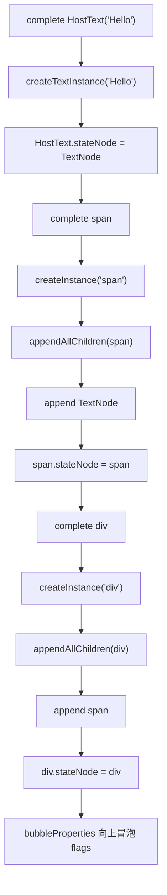
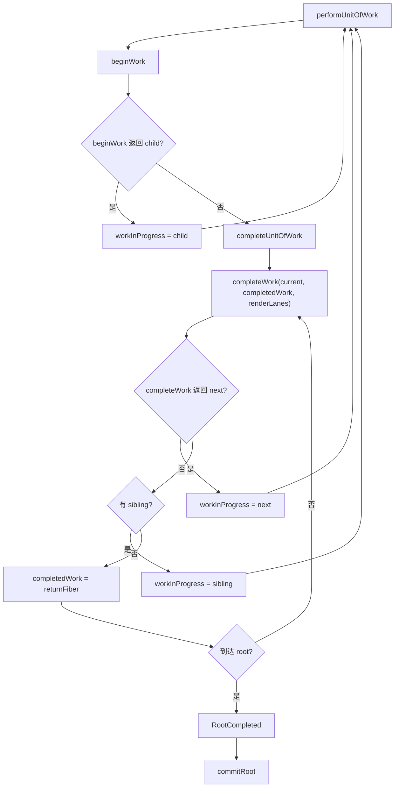
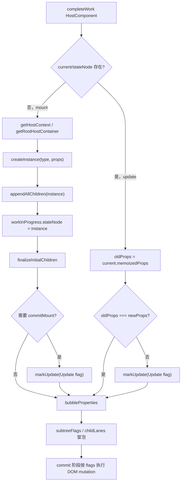
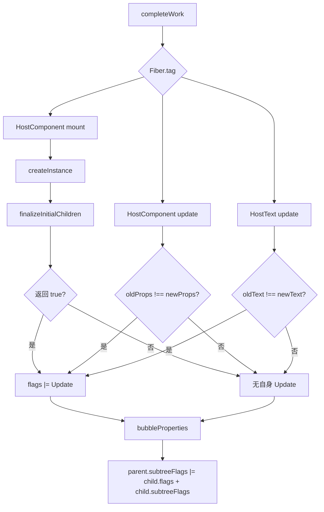

# React completeWork 源码深入分析

本文基于当前 `react-main` 源码，深入分析 render 阶段中 `completeWork` 的入口、执行时机、它与 `beginWork` 的关系、HostComponent/HostText 的 DOM 创建与更新、flags/subtreeFlags 的标记和冒泡，以及它如何为 commit 阶段准备 effect 信息。

## 一、completeWork 是什么？

`completeWork` 是 React render 阶段处理单个 Fiber 的“向上”步骤。

如果说 `beginWork` 负责“展开当前 Fiber，计算它的子 Fiber”，那么 `completeWork` 负责：

```text
当前 Fiber 的子树已经处理完了，现在收尾：
  - 弹出 begin 阶段压入的上下文
  - 对 HostComponent / HostText 创建宿主实例
  - 对更新路径标记 Update 等 flags
  - 把子节点的 flags / subtreeFlags / lanes 冒泡到父 Fiber
  - 为 commit 阶段准备可遍历的副作用信息
```

一句话：

> `completeWork` 负责“完成一个 Fiber，把它的宿主实例和副作用信息准备好”。

## 二、源码位置

核心文件：

```text
packages/react-reconciler/src/ReactFiberCompleteWork.js
```

相关文件：

| 文件 | 作用 |
| --- | --- |
| `packages/react-reconciler/src/ReactFiberWorkLoop.js` | `completeUnitOfWork` 调用 `completeWork`，并在 root 完成后进入 commit |
| `packages/react-reconciler/src/ReactFiberBeginWork.js` | `beginWork` 与 `completeWork` 构成 render 阶段的两半 |
| `packages/react-reconciler/src/ReactFiberCompleteWork.js` | `completeWork` 主体，HostComponent/HostText 创建与更新标记 |
| `packages/react-reconciler/src/ReactFiberCommitWork.js` | commit 阶段根据 flags/subtreeFlags 遍历并执行 mutation/layout/passive effects |
| `packages/react-reconciler/src/ReactFiberCommitHostEffects.js` | commit 阶段调用 host config 的 `commitUpdate`、`commitTextUpdate` |
| `packages/react-dom-bindings/src/client/ReactFiberConfigDOM.js` | DOM renderer 的 host config：`createInstance`、`createTextInstance`、`commitUpdate` 等 |

## 三、completeWork 的入口在哪里？

`completeWork` 不是用户 API。它由 render work loop 中的 `completeUnitOfWork` 调用。

入口链路：

```text
performUnitOfWork(unitOfWork)
  -> beginWork(current, unitOfWork, renderLanes)
  -> 如果 beginWork 返回 null：
       completeUnitOfWork(unitOfWork)
       -> completeWork(current, completedWork, renderLanes)
```

源码位置：

```text
packages/react-reconciler/src/ReactFiberWorkLoop.js
```

简化源码：

```js
function performUnitOfWork(unitOfWork) {
  const current = unitOfWork.alternate;
  const next = beginWork(current, unitOfWork, entangledRenderLanes);

  unitOfWork.memoizedProps = unitOfWork.pendingProps;

  if (next === null) {
    completeUnitOfWork(unitOfWork);
  } else {
    workInProgress = next;
  }
}
```

`completeUnitOfWork` 中：

```js
function completeUnitOfWork(unitOfWork) {
  let completedWork = unitOfWork;
  do {
    const current = completedWork.alternate;
    const returnFiber = completedWork.return;

    const next = completeWork(
      current,
      completedWork,
      entangledRenderLanes,
    );

    if (next !== null) {
      workInProgress = next;
      return;
    }

    const siblingFiber = completedWork.sibling;
    if (siblingFiber !== null) {
      workInProgress = siblingFiber;
      return;
    }

    completedWork = returnFiber;
    workInProgress = completedWork;
  } while (completedWork !== null);

  workInProgressRootExitStatus = RootCompleted;
}
```

## 四、completeWork 在 render 阶段中什么时候执行？

`completeWork` 在一个 Fiber 的 begin 阶段和其所有子节点都处理完后执行。

React 的 render 阶段是深度优先遍历：

```text
begin A
  begin B
    begin D
    complete D
  complete B
  begin C
  complete C
complete A
```

对于这个组件：

```jsx
function App() {
  return (
    <div>
      <span>Hello</span>
    </div>
  );
}
```

大致顺序：

```text
begin App
begin div
begin span
begin HostText("Hello")
complete HostText
complete span
complete div
complete App
```

也就是说：

```text
beginWork 先向下生成 child Fiber。
completeWork 再从叶子向上完成每个 Fiber。
```

## 五、completeWork 接收哪些参数？

源码签名：

```js
function completeWork(
  current: Fiber | null,
  workInProgress: Fiber,
  renderLanes: Lanes,
): Fiber | null
```

参数说明：

| 参数 | 含义 |
| --- | --- |
| `current` | 已提交的旧 Fiber，mount 时通常为 `null` |
| `workInProgress` | 当前正在完成的新 Fiber |
| `renderLanes` | 本轮 render 处理的 lanes |

返回值：

| 返回值 | 含义 |
| --- | --- |
| `null` | 当前 Fiber 完成，继续找 sibling 或向父 Fiber complete |
| `Fiber` | 少数特殊场景 complete 阶段产生新工作，work loop 转向该 Fiber |

大多数分支都返回 `null`。

## 六、它和 beginWork 的关系是什么？

`beginWork` 和 `completeWork` 都属于 render 阶段，但方向和职责不同。

| 对比项 | `beginWork` | `completeWork` |
| --- | --- | --- |
| 遍历方向 | 从父到子，向下 | 从子到父，向上 |
| 执行时机 | 进入一个 Fiber 时 | 子 Fiber 全部完成后 |
| 核心问题 | “这个 Fiber 的 children 是什么？” | “这个 Fiber 如何收尾并把副作用冒泡？” |
| 主要产物 | `workInProgress.child` | `stateNode`、`flags`、`subtreeFlags`、`childLanes` |
| 组件逻辑 | 函数组件 render/hooks、class render | 通常不再执行组件 render |
| HostComponent mount | 协调 children | 创建 DOM instance，append children |
| HostComponent update | 协调 children | 标记 Update flag |
| 返回值 | 通常返回 child | 通常返回 null |
| 是否为 commit 准备信息 | 间接准备 children | 直接准备 flags/subtreeFlags |

组合起来：

```text
beginWork:
  React Element -> child Fiber

completeWork:
  child Fiber 已完成 -> 当前 Fiber 收尾，准备 commit
```

## 七、completeWork 的核心分支表

`completeWork` 根据 `workInProgress.tag` 分发。

| Fiber.tag | completeWork 主要处理 |
| --- | --- |
| `FunctionComponent` / `ForwardRef` / `MemoComponent` / `Fragment` | 不创建宿主实例，主要 `bubbleProperties` |
| `ClassComponent` | pop legacy context，然后 `bubbleProperties` |
| `HostRoot` | pop root/cache/host context，处理 root flags，`bubbleProperties` |
| `HostComponent` | mount 时创建 DOM instance；update 时标记 Update；最后 `bubbleProperties` |
| `HostText` | mount 时创建 Text node；update 时标记 Update；最后 `bubbleProperties` |
| `SuspenseComponent` | 处理 Suspense 状态、fallback、visibility、retry 等 |
| `HostPortal` | pop host container，冒泡 |
| `ContextProvider` | pop provider，冒泡 |
| `OffscreenComponent` / Activity | 处理隐藏子树、visibility 等 |

本文重点分析 `HostComponent`、`HostText`、flags 与 `subtreeFlags`。

## 八、HostComponent 在 completeWork 中如何创建 DOM？

HostComponent 对应宿主节点，例如 DOM 渲染器中的：

```jsx
<div className="box">
  <span>Hello</span>
</div>
```

在 `completeWork` 中，HostComponent 分支大致分成：

```text
if current !== null && workInProgress.stateNode != null:
  updateHostComponent(...)
else:
  mount path:
    createInstance(...)
    appendAllChildren(...)
    workInProgress.stateNode = instance
    finalizeInitialChildren(...)
    必要时 markUpdate(...)

bubbleProperties(workInProgress)
return null
```

源码位置：

```text
packages/react-reconciler/src/ReactFiberCompleteWork.js
```

简化源码：

```js
case HostComponent: {
  popHostContext(workInProgress);
  const type = workInProgress.type;

  if (current !== null && workInProgress.stateNode != null) {
    updateHostComponent(
      current,
      workInProgress,
      type,
      newProps,
      renderLanes,
    );
  } else {
    const currentHostContext = getHostContext();
    const wasHydrated = popHydrationState(workInProgress);

    if (wasHydrated) {
      prepareToHydrateHostInstance(workInProgress, currentHostContext);
      if (finalizeHydratedChildren(...)) {
        workInProgress.flags |= Hydrate;
      }
    } else {
      const rootContainerInstance = getRootHostContainer();
      const instance = createInstance(
        type,
        newProps,
        rootContainerInstance,
        currentHostContext,
        workInProgress,
      );

      markCloned(workInProgress);
      appendAllChildren(instance, workInProgress, false, false);
      workInProgress.stateNode = instance;

      if (finalizeInitialChildren(instance, type, newProps, currentHostContext)) {
        markUpdate(workInProgress);
      }
    }
  }

  bubbleProperties(workInProgress);
  preloadInstanceAndSuspendIfNeeded(...);
  return null;
}
```

### DOM renderer 的 createInstance

对于 `react-dom`，`createInstance` 来自：

```text
packages/react-dom-bindings/src/client/ReactFiberConfigDOM.js
```

它会根据元素类型和 namespace 创建 DOM：

```js
export function createInstance(
  type,
  props,
  rootContainerInstance,
  hostContext,
  internalInstanceHandle,
) {
  const ownerDocument = getOwnerDocumentFromRootContainer(rootContainerInstance);

  let domElement;
  switch (hostContextProd) {
    case HostContextNamespaceSvg:
      domElement = ownerDocument.createElementNS(SVG_NAMESPACE, type);
      break;
    case HostContextNamespaceMath:
      domElement = ownerDocument.createElementNS(MATH_NAMESPACE, type);
      break;
    default:
      domElement = ownerDocument.createElement(type);
  }

  precacheFiberNode(internalInstanceHandle, domElement);
  updateFiberProps(domElement, props);
  return domElement;
}
```

### appendAllChildren

`completeWork` 创建当前 DOM 节点后，会把已经完成的子 DOM 节点追加进去：

```js
appendAllChildren(instance, workInProgress, false, false);
```

`appendAllChildren` 会从 `workInProgress.child` 开始向下找 terminal host nodes：

```text
如果 child 是 HostComponent 或 HostText：
  appendInitialChild(parent, child.stateNode)
否则如果 child 有 child：
  继续向下
遇到 sibling：
  处理 sibling
```

DOM renderer 中：

```js
export function appendInitialChild(parentInstance, child) {
  parentInstance.appendChild(child);
}
```

这解释了为什么 DOM 创建是“自底向上”的：

```text
先 complete HostText，创建 Text node
再 complete span，创建 span，并 append Text
再 complete div，创建 div，并 append span
```

### finalizeInitialChildren

DOM renderer 中：

```js
export function finalizeInitialChildren(domElement, type, props, hostContext) {
  setInitialProperties(domElement, type, props);
  switch (type) {
    case 'button':
    case 'input':
    case 'select':
    case 'textarea':
      return !!props.autoFocus;
    case 'img':
      return true;
    default:
      return false;
  }
}
```

作用：

```text
设置初始 DOM 属性
判断是否需要 commitMount 类的后续 commit 工作
如果返回 true，则 completeWork 中 markUpdate(workInProgress)
```

## 九、DOM 创建流程

示例：

```jsx
function App() {
  return (
    <div className="box">
      <span>Hello</span>
    </div>
  );
}
```

render 阶段大致顺序：

```text
begin App
begin div
begin span
begin HostText("Hello")

complete HostText:
  createTextInstance("Hello")
  stateNode = Text

complete span:
  createInstance("span")
  appendAllChildren(span, spanFiber)
    -> append Text
  finalizeInitialChildren(span, ...)
  stateNode = span

complete div:
  createInstance("div")
  appendAllChildren(div, divFiber)
    -> append span
  finalizeInitialChildren(div, ...)
  stateNode = div
```

流程图：



## 十、HostText 如何处理？

HostText 对应文本节点，例如：

```jsx
<span>Hello</span>
```

如果 `beginWork` 为 `Hello` 创建了 HostText Fiber，那么 `completeWork` 的 HostText 分支会处理它。

源码位置：

```text
packages/react-reconciler/src/ReactFiberCompleteWork.js
```

简化逻辑：

```js
case HostText: {
  const newText = newProps;

  if (current && workInProgress.stateNode != null) {
    const oldText = current.memoizedProps;
    updateHostText(current, workInProgress, oldText, newText);
  } else {
    const rootContainerInstance = getRootHostContainer();
    const currentHostContext = getHostContext();
    const wasHydrated = popHydrationState(workInProgress);

    if (wasHydrated) {
      prepareToHydrateHostTextInstance(workInProgress);
    } else {
      markCloned(workInProgress);
      workInProgress.stateNode = createTextInstance(
        newText,
        rootContainerInstance,
        currentHostContext,
        workInProgress,
      );
    }
  }

  bubbleProperties(workInProgress);
  return null;
}
```

DOM renderer 的 `createTextInstance`：

```js
export function createTextInstance(
  text,
  rootContainerInstance,
  hostContext,
  internalInstanceHandle,
) {
  const textNode = getOwnerDocumentFromRootContainer(
    rootContainerInstance,
  ).createTextNode(text);
  precacheFiberNode(internalInstanceHandle, textNode);
  return textNode;
}
```

update 时：

```js
function updateHostText(current, workInProgress, oldText, newText) {
  if (supportsMutation) {
    if (oldText !== newText) {
      markUpdate(workInProgress);
    }
  }
}
```

真正修改文本节点发生在 commit：

```js
commitTextUpdate(textInstance, oldText, newText);
```

DOM renderer 中：

```js
export function commitTextUpdate(textInstance, oldText, newText) {
  textInstance.nodeValue = newText;
}
```

## 十一、update 阶段如何计算属性更新？

这里要区分 reconciler 和 DOM host config 的分工。

在当前 `react-main` 的 mutation 模式路径里，`completeWork` 对 HostComponent update 的处理非常轻：

```js
function updateHostComponent(
  current,
  workInProgress,
  type,
  newProps,
  renderLanes,
) {
  if (supportsMutation) {
    const oldProps = current.memoizedProps;
    if (oldProps === newProps) {
      return;
    }

    markUpdate(workInProgress);
  }
}
```

也就是说：

```text
completeWork 并不在 render 阶段计算详细 DOM update payload。
它只判断 oldProps !== newProps，然后给 Fiber 打 Update flag。
```

真正属性 diff 和 DOM 更新在 commit 阶段的 DOM host config 中：

```text
commitMutationEffects
  -> commitMutationEffectsOnFiber
  -> HostComponent flags & Update
  -> commitHostUpdate(finishedWork, newProps, oldProps)
  -> commitUpdate(domElement, type, oldProps, newProps, finishedWork)
  -> updateProperties(domElement, type, oldProps, newProps)
```

源码位置：

```text
packages/react-reconciler/src/ReactFiberCommitWork.js
packages/react-reconciler/src/ReactFiberCommitHostEffects.js
packages/react-dom-bindings/src/client/ReactFiberConfigDOM.js
```

DOM renderer：

```js
export function commitUpdate(
  domElement,
  type,
  oldProps,
  newProps,
  internalInstanceHandle,
) {
  updateProperties(domElement, type, oldProps, newProps);
  updateFiberProps(domElement, newProps);
}
```

因此，当前源码的属性更新分工是：

| 阶段 | 做什么 |
| --- | --- |
| completeWork | 判断 props 引用是否变化，标记 `Update` flag |
| commit mutation | 根据 `Update` flag 找到 HostComponent |
| DOM host config | `updateProperties` 计算并执行具体 DOM 属性更新 |

示例：

```jsx
// before
<div className="old" title="a" />

// after
<div className="new" title="a" />
```

render/complete 阶段：

```text
oldProps !== newProps
markUpdate(divFiber)
```

commit 阶段：

```text
commitHostUpdate
  -> updateProperties(div, 'div', oldProps, newProps)
  -> className 从 old 更新到 new
```

## 十二、flags 是如何被标记的？

`flags` 是当前 Fiber 自己的副作用标记。

在 `completeWork` 中常见标记：

| flag | 标记位置 | 含义 |
| --- | --- | --- |
| `Update` | `markUpdate(workInProgress)` | 当前 Fiber commit 阶段需要更新 |
| `Cloned` | `markCloned(workInProgress)` | persistent mode 或新建宿主实例相关 |
| `Hydrate` | hydrated HostComponent finalize 后 | commit 阶段需要执行 hydration 相关逻辑 |
| `Snapshot` | HostRoot 某些首次挂载/强制 client render 场景 | before mutation 阶段需要处理 |
| `Passive` | HostRoot cache/transition 变化等 | passive phase 需要处理 |

`markUpdate` 很简单：

```js
function markUpdate(workInProgress) {
  workInProgress.flags |= Update;
}
```

HostComponent mount 时可能标记 `Update`：

```js
if (finalizeInitialChildren(instance, type, newProps, currentHostContext)) {
  markUpdate(workInProgress);
}
```

典型原因：

```text
input/button/select/textarea 的 autoFocus
img 等需要 commitMount 的宿主行为
```

HostComponent update 时标记 `Update`：

```js
if (oldProps !== newProps) {
  markUpdate(workInProgress);
}
```

HostText update 时标记 `Update`：

```js
if (oldText !== newText) {
  markUpdate(workInProgress);
}
```

## 十三、subtreeFlags 是如何冒泡的？

`subtreeFlags` 是子树副作用摘要。

它的作用：

```text
让 commit 阶段快速判断某棵子树里是否有指定类型的 effects。
如果 parent.subtreeFlags 不包含 MutationMask，就不用向下遍历 mutation effects。
```

核心函数：

```text
bubbleProperties(completedWork)
```

源码位置：

```text
packages/react-reconciler/src/ReactFiberCompleteWork.js
```

简化源码：

```js
function bubbleProperties(completedWork) {
  const didBailout =
    completedWork.alternate !== null &&
    completedWork.alternate.child === completedWork.child;

  let newChildLanes = NoLanes;
  let subtreeFlags = NoFlags;

  if (!didBailout) {
    let child = completedWork.child;
    while (child !== null) {
      newChildLanes = mergeLanes(
        newChildLanes,
        mergeLanes(child.lanes, child.childLanes),
      );

      subtreeFlags |= child.subtreeFlags;
      subtreeFlags |= child.flags;

      child.return = completedWork;
      child = child.sibling;
    }

    completedWork.subtreeFlags |= subtreeFlags;
  } else {
    let child = completedWork.child;
    while (child !== null) {
      newChildLanes = mergeLanes(
        newChildLanes,
        mergeLanes(child.lanes, child.childLanes),
      );

      subtreeFlags |= child.subtreeFlags & StaticMask;
      subtreeFlags |= child.flags & StaticMask;

      child.return = completedWork;
      child = child.sibling;
    }

    completedWork.subtreeFlags |= subtreeFlags;
  }

  completedWork.childLanes = newChildLanes;
  return didBailout;
}
```

关键点：

| 逻辑 | 含义 |
| --- | --- |
| `subtreeFlags |= child.subtreeFlags` | 收集子树内部 effects |
| `subtreeFlags |= child.flags` | 收集子节点自身 effects |
| `completedWork.subtreeFlags |= subtreeFlags` | 把所有子 effect 摘要放到父 Fiber |
| `child.return = completedWork` | 修正 return 指针，保证树结构一致 |
| bailout 场景只冒泡 `StaticMask` | 普通 flags 只活一轮 render+commit，bailout 时不重复冒泡 |
| `completedWork.childLanes = newChildLanes` | 汇总子树剩余 lane |

示例：

```text
span Fiber flags = Update
div Fiber complete 时：
  div.subtreeFlags |= span.flags

commit 阶段看到：
  div.subtreeFlags & MutationMask !== NoFlags
  所以继续向下遍历 span
```

## 十四、completeWork 如何构建 effect 相关信息？

React 早期有显式 effect list。当前 Fiber 模型主要依赖：

```text
flags:
  当前 Fiber 自身的副作用

subtreeFlags:
  子树中所有副作用的摘要

deletions:
  当前 Fiber 下需要删除的 child fibers
```

`completeWork` 在 render 阶段通过两类动作构建 effect 信息：

### 1. 给当前 Fiber 打 flags

例如：

```js
markUpdate(workInProgress);
workInProgress.flags |= Hydrate;
workInProgress.flags |= Passive;
workInProgress.flags |= Snapshot;
```

这些表示当前 Fiber 在 commit 阶段需要被处理。

### 2. 通过 bubbleProperties 汇总子树 flags

每个 Fiber complete 时都会把子节点 effects 冒泡上来：

```text
child.flags + child.subtreeFlags
  -> parent.subtreeFlags
```

最终 HostRoot 的 `subtreeFlags` 能表示整棵树是否有：

```text
Mutation effects
Layout effects
Passive effects
BeforeMutation effects
Visibility effects
Static effects
```

commit 阶段就可以用这些 mask 来剪枝：

```js
if (parentFiber.subtreeFlags & (MutationMask | Cloned)) {
  let child = parentFiber.child;
  while (child !== null) {
    commitMutationEffectsOnFiber(child, root, lanes);
    child = child.sibling;
  }
}
```

## 十五、completeWork 之后如何进入 commit 阶段？

当所有 Fiber 都完成，`completeUnitOfWork` 会一路向上 complete 到 root。

到达 root 时：

```js
if (workInProgressRootExitStatus === RootInProgress) {
  workInProgressRootExitStatus = RootCompleted;
}
```

之后 `renderRootSync` / `renderRootConcurrent` 返回完成状态。`performWorkOnRoot` 看到 render 完成后，会进入 commit 准备和提交路径：

```text
render 阶段完成
  -> finishedWork = root.current.alternate
  -> commitRootWhenReady(...)
  -> commitRoot(...)
```

`commitRoot` 会检查 root 上的 flags/subtreeFlags：

```js
const subtreeHasBeforeMutationEffects =
  (finishedWork.subtreeFlags & (BeforeMutationMask | MutationMask)) !== NoFlags;

const rootHasBeforeMutationEffect =
  (finishedWork.flags & (BeforeMutationMask | MutationMask)) !== NoFlags;
```

commit 子阶段：

```text
before mutation:
  commitBeforeMutationEffects(root, finishedWork, lanes)

mutation:
  flushMutationEffects()
    -> commitMutationEffects(root, finishedWork, lanes)
    -> root.current = finishedWork

layout:
  flushLayoutEffects()
    -> commitLayoutEffects(finishedWork, root, lanes)

passive:
  scheduleCallback(NormalSchedulerPriority, flushPassiveEffects)
```

关键点：

```text
completeWork 不直接把 finishedWork 变成 current。
它只是准备好 finishedWork。
真正切换 current 发生在 mutation phase 后：
  root.current = finishedWork
```

## 十六、completeWork 调用链

完整调用链：

```text
更新触发
  -> scheduleUpdateOnFiber
  -> performWorkOnRoot
  -> renderRootSync / renderRootConcurrent
  -> workLoopSync / workLoopConcurrentByScheduler
  -> performUnitOfWork(workInProgress)
  -> beginWork(current, workInProgress, renderLanes)
  -> 如果 beginWork 返回 child:
       workInProgress = child
       继续向下
  -> 如果 beginWork 返回 null:
       completeUnitOfWork(workInProgress)
       -> completeWork(current, completedWork, renderLanes)
       -> 如果有 sibling:
            workInProgress = sibling
       -> 否则:
            completedWork = returnFiber
            继续向上 complete
  -> 到达 HostRoot:
       RootCompleted
  -> commitRoot
```

Mermaid 流程图：



## 十七、DOM 创建与更新流程图



## 十八、flags 标记流程图



## 十九、每一步的示例代码

### 1. HostComponent mount

用户代码：

```jsx
<div className="box">
  <span>Hello</span>
</div>
```

`completeWork` 大致：

```js
const instance = createInstance(
  'div',
  {className: 'box', children: <span>Hello</span>},
  rootContainerInstance,
  currentHostContext,
  workInProgress,
);

appendAllChildren(instance, workInProgress, false, false);
workInProgress.stateNode = instance;

if (finalizeInitialChildren(instance, 'div', newProps, currentHostContext)) {
  markUpdate(workInProgress);
}

bubbleProperties(workInProgress);
```

DOM host config：

```js
const domElement = ownerDocument.createElement('div');
setInitialProperties(domElement, 'div', props);
```

### 2. HostText mount

用户代码：

```jsx
<span>Hello</span>
```

HostText 的 `newProps` 是：

```js
"Hello"
```

`completeWork`：

```js
workInProgress.stateNode = createTextInstance(
  "Hello",
  rootContainerInstance,
  currentHostContext,
  workInProgress,
);

bubbleProperties(workInProgress);
```

DOM host config：

```js
const textNode = document.createTextNode("Hello");
```

### 3. HostComponent update

用户代码：

```jsx
// before
<button className="old">Save</button>

// after
<button className="new">Save</button>
```

`completeWork`：

```js
const oldProps = current.memoizedProps;
if (oldProps !== newProps) {
  markUpdate(workInProgress);
}
```

commit 阶段：

```js
commitHostUpdate(finishedWork, newProps, oldProps);
```

DOM host config：

```js
commitUpdate(domElement, 'button', oldProps, newProps, finishedWork);
updateProperties(domElement, 'button', oldProps, newProps);
```

### 4. HostText update

用户代码：

```jsx
// before
<span>Hello</span>

// after
<span>Hi</span>
```

`completeWork`：

```js
if (oldText !== newText) {
  markUpdate(workInProgress);
}
```

commit 阶段：

```js
commitHostTextUpdate(finishedWork, newText, oldText);
```

DOM host config：

```js
textInstance.nodeValue = newText;
```

### 5. subtreeFlags 冒泡

假设：

```text
span.flags = Update
div.child = span
```

`completeWork(div)` 调用：

```js
bubbleProperties(divFiber);
```

结果：

```text
div.subtreeFlags 包含 Update
```

commit 阶段：

```text
看到 div.subtreeFlags & MutationMask !== 0
继续向下找到 span
执行 span 的 update
```

## 二十、beginWork 与 completeWork 对比表

| 对比项 | beginWork | completeWork |
| --- | --- | --- |
| 所属阶段 | render 阶段 | render 阶段 |
| 遍历方向 | 向下 | 向上 |
| 调用位置 | `performUnitOfWork` | `completeUnitOfWork` |
| 输入 | `current`、`workInProgress`、`renderLanes` | `current`、`workInProgress`、`renderLanes` |
| 核心目标 | 计算当前 Fiber 的 children | 完成当前 Fiber，准备 commit 信息 |
| FunctionComponent | 执行 `renderWithHooks` | 主要冒泡 flags |
| ClassComponent | 更新实例并调用 `render` | pop context、冒泡 flags |
| HostComponent mount | 协调 children | 创建 DOM instance、append children |
| HostComponent update | 协调 children、处理 text child/ref | 标记 Update flag |
| HostText | 一般无 begin 工作 | 创建/更新 Text node 对应信息 |
| flags | 可能标记 Ref、ContentReset 等 | 标记 Update/Hydrate/Passive/Snapshot 等 |
| subtreeFlags | 不负责主要冒泡 | `bubbleProperties` 负责冒泡 |
| 返回值 | 通常返回 child | 通常返回 null |
| 是否直接进入 commit | 否 | root complete 后推动 commit |

## 二十一、学习重点

建议阅读顺序：

1. `ReactFiberWorkLoop.js`
   - 先看 `performUnitOfWork` 如何在 `beginWork` 返回 `null` 时进入 `completeUnitOfWork`。
2. `ReactFiberWorkLoop.js`
   - 再看 `completeUnitOfWork` 如何调用 `completeWork`、找 sibling、向父 Fiber 冒泡。
3. `ReactFiberCompleteWork.js`
   - 看 `completeWork` 的 switch 分支。
4. `ReactFiberCompleteWork.js`
   - 重点看 `HostComponent` mount/update 和 `HostText` mount/update。
5. `ReactFiberCompleteWork.js`
   - 看 `markUpdate`、`markCloned`、`bubbleProperties`。
6. `ReactFiberCommitWork.js`
   - 看 commit 阶段如何根据 `subtreeFlags` 剪枝遍历。
7. `ReactFiberCommitHostEffects.js`
   - 看 `commitHostUpdate`、`commitHostTextUpdate` 如何调用 host config。
8. `ReactFiberConfigDOM.js`
   - 看 DOM renderer 如何创建 DOM、设置初始属性、提交属性更新。

必须掌握的问题：

| 问题 | 答案 |
| --- | --- |
| `completeWork` 是 render 还是 commit？ | render 阶段 |
| 它会创建 DOM 吗？ | HostComponent/HostText mount 时会创建宿主实例，但还没有插入到真实容器 |
| 它会更新 DOM 属性吗？ | 当前 mutation 模式下不会直接更新；只标记 Update，commit 阶段调用 `commitUpdate` 更新 |
| `flags` 表示什么？ | 当前 Fiber 自身需要 commit 处理的副作用 |
| `subtreeFlags` 表示什么？ | 子树中副作用的摘要，用于 commit 阶段快速剪枝 |
| `completeWork` 返回什么？ | 多数返回 `null`，让 `completeUnitOfWork` 找 sibling 或父节点 |
| root complete 后发生什么？ | render 返回 RootCompleted，随后进入 `commitRoot` |

## 二十二、总结

`completeWork` 是 React render 阶段的收尾器。它不负责执行组件，也不负责最终提交 DOM；它负责把“已经协调好的 Fiber 子树”整理成 commit 阶段可消费的结构。

最短心智模型：

```text
beginWork:
  计算 children，向下走

completeWork:
  创建/标记宿主节点，冒泡 flags，向上走

commit:
  根据 flags/subtreeFlags 真正修改宿主环境
```

对 HostComponent 来说：

```text
mount:
  completeWork 创建 DOM instance，append 子 DOM，设置初始属性

update:
  completeWork 标记 Update
  commit 阶段根据 oldProps/newProps 做 DOM diff 和更新
```

一句话总结：

> `completeWork` 把 render 阶段的 Fiber 计算结果“收口”：叶子节点先完成，父节点再聚合子节点的副作用，最终 HostRoot 拿到一棵带有 flags/subtreeFlags 的 finishedWork 树，交给 commit 阶段一次性提交。

