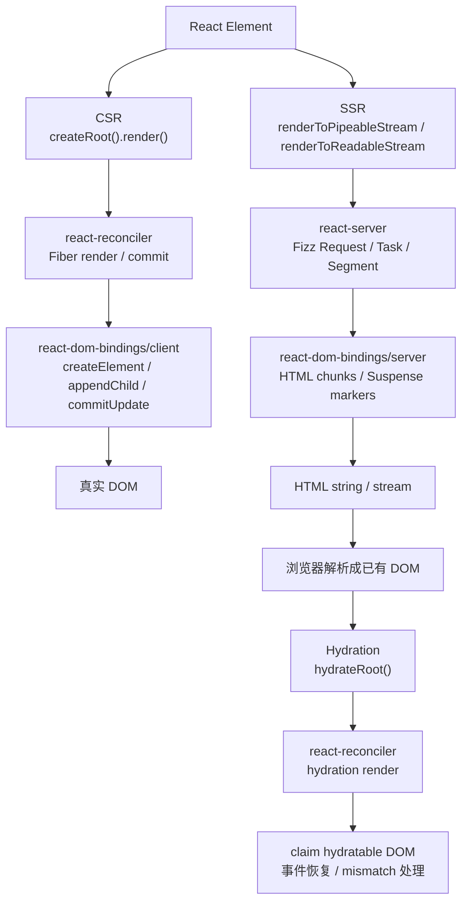
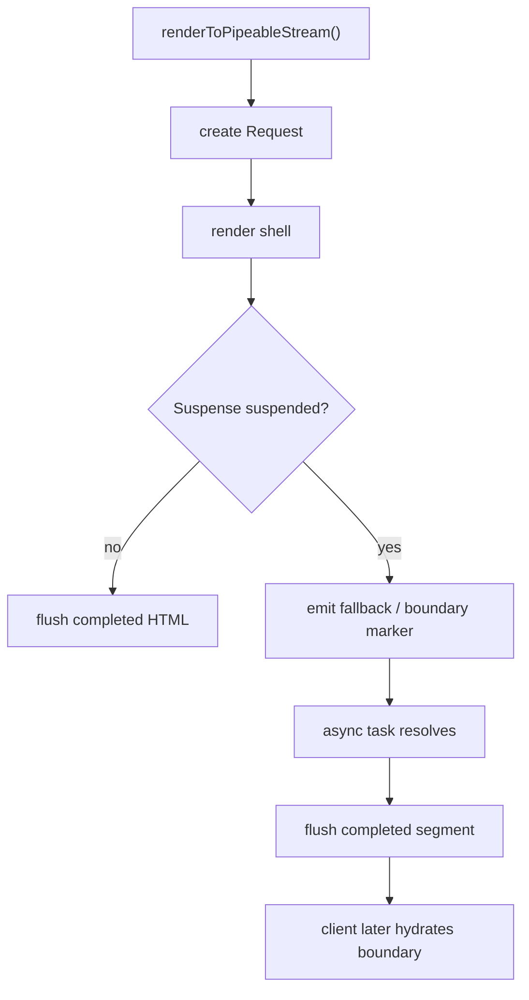

# React CSR / SSR / Hydration 源码核心差异对比

本文基于当前本地 `react-main` 源码，从源码设计角度对比 React 的三条渲染路径：

```text
CSR:
createRoot(container).render(<App />)
  -> 客户端 Fiber Reconciler
  -> 创建真实 DOM
  -> commit 插入页面

SSR:
renderToPipeableStream(<App />)
renderToReadableStream(<App />)
  -> Fizz 服务端 renderer
  -> 生成 HTML chunks
  -> 输出 string / stream

Hydration:
hydrateRoot(container, <App />)
  -> 客户端 Fiber Reconciler 的 hydration 模式
  -> 复用服务端已有 DOM
  -> 恢复事件、ref、effects
```

一句话总览：

```text
CSR 负责“从 React Element 创建 DOM”；
SSR 负责“从 React Element 生成 HTML”；
Hydration 负责“把已有 HTML 接回 React 运行时”。
```

## 一、三种模式在 React 架构中的位置



React 源码里，三者不是同一套实现加一点参数，而是分成两个大系统：

| 系统 | 覆盖场景 | 核心包 |
| --- | --- | --- |
| 客户端 Fiber Reconciler | CSR、Hydration、后续客户端更新 | `react-dom/client`、`react-reconciler`、`scheduler`、`react-dom-bindings/client` |
| 服务端 Fizz Renderer | SSR 字符串 / 流式 HTML 输出 | `react-dom/server`、`react-server`、`react-dom-bindings/server` |

Hydration 比较特殊。它发生在客户端，但它服务于 SSR 输出结果：

```text
服务端 Fizz 输出 HTML
  -> 浏览器解析成真实 DOM
  -> 客户端 hydrateRoot 进入 Fiber hydration 模式
  -> Fiber 认领已有 DOM
```

## 二、入口 API 对比

| API | 使用场景 | 运行环境 | 返回值 | 核心入口文件 | 核心后续路径 |
| --- | --- | --- | --- | --- | --- |
| `createRoot(container).render(<App />)` | 纯客户端渲染 CSR | Browser | `ReactDOMRoot` | `packages/react-dom/src/client/ReactDOMRoot.js` | `createContainer -> updateContainer -> scheduleUpdateOnFiber -> renderRoot -> commitRoot` |
| `hydrateRoot(container, <App />)` | 接管 SSR HTML | Browser | `ReactDOMHydrationRoot` | `packages/react-dom/src/client/ReactDOMRoot.js` | `createHydrationContainer -> scheduleInitialHydrationOnRoot -> enterHydrationState -> claim DOM -> commitRoot` |
| `renderToPipeableStream(<App />, options)` | Node 流式 SSR | Node / Bun 类 Writable stream 环境 | `{pipe, abort}` | `packages/react-dom/src/server/ReactDOMFizzServerNode.js` | `createRequest -> startWork -> performWork -> flushCompletedQueues -> startFlowing` |
| `renderToReadableStream(<App />, options)` | Web Streams SSR | Browser / Edge / Web runtime | `Promise<ReadableStream>` | `packages/react-dom/src/server/ReactDOMFizzServerNode.js` 及 browser/edge fork | `createRequest -> startWork -> ReadableStream pull -> startFlowing` |

### 1. CSR 入口

```tsx
import {createRoot} from 'react-dom/client';

const root = createRoot(document.getElementById('root'));
root.render(<App />);
```

源码核心：

```js
export function createRoot(container, options) {
  const root = createContainer(
    container,
    ConcurrentRoot,
    null,
    isStrictMode,
    ...
  );
  markContainerAsRoot(root.current, container);
  listenToAllSupportedEvents(rootContainerElement);
  return new ReactDOMRoot(root);
}
```

`root.render(<App />)` 会进入：

```text
ReactDOMRoot.prototype.render
  -> updateContainer(children, root, null, null)
```

### 2. Hydration 入口

```tsx
import {hydrateRoot} from 'react-dom/client';

hydrateRoot(document.getElementById('root'), <App />);
```

源码核心：

```js
export function hydrateRoot(container, initialChildren, options) {
  const root = createHydrationContainer(
    initialChildren,
    null,
    container,
    ConcurrentRoot,
    hydrationCallbacks,
    ...
  );
  markContainerAsRoot(root.current, container);
  listenToAllSupportedEvents(container);
  return new ReactDOMHydrationRoot(root);
}
```

和 `createRoot` 最大不同是：

```text
createRoot -> createContainer
hydrateRoot -> createHydrationContainer
```

### 3. Node SSR 入口

```tsx
import {renderToPipeableStream} from 'react-dom/server';

const {pipe, abort} = renderToPipeableStream(<App />, {
  bootstrapScripts: ['/main.js'],
  onShellReady() {
    pipe(response);
  },
});
```

源码核心：

```js
function renderToPipeableStream(children, options) {
  const request = createRequestImpl(children, options);
  let hasStartedFlowing = false;
  startWork(request);
  return {
    pipe(destination) {
      hasStartedFlowing = true;
      prepareForStartFlowingIfBeforeAllReady(request);
      startFlowing(request, destination);
      return destination;
    },
    abort(reason) {
      abort(request, reason);
    },
  };
}
```

### 4. Web Streams SSR 入口

```tsx
import {renderToReadableStream} from 'react-dom/server';

const stream = await renderToReadableStream(<App />, {
  bootstrapScripts: ['/main.js'],
});
```

源码核心：

```js
function renderToReadableStream(children, options) {
  return new Promise((resolve, reject) => {
    function onShellReady() {
      const stream = new ReadableStream({
        type: 'bytes',
        start(controller) {
          writable = createFakeWritableFromReadableStreamController(controller);
        },
        pull(controller) {
          startFlowing(request, writable);
        },
        cancel(reason) {
          abort(request, reason);
        },
      });
      resolve(stream);
    }
    const request = createRequest(...);
    startWork(request);
  });
}
```

`renderToPipeableStream` 和 `renderToReadableStream` 共享 Fizz 核心，只是目标 stream 类型不同：

```text
PipeableStream: 面向 Node Writable
ReadableStream: 面向 Web Streams
```

## 三、CSR / SSR / Hydration 对比表

| 维度 | CSR | SSR | Hydration |
| --- | --- | --- | --- |
| 输入 | React Element | React Element | React Element + 服务端已有 DOM |
| 输出 | 真实 DOM 插入页面 | HTML 字符串或 HTML stream | Fiber 树接管已有 DOM |
| 核心入口 | `createRoot().render()` | `renderToPipeableStream()` / `renderToReadableStream()` | `hydrateRoot()` |
| 核心 renderer | 客户端 Fiber Reconciler | Fizz server renderer | 客户端 Fiber Reconciler 的 hydration 模式 |
| 是否创建 Fiber | 是 | 不走客户端 Fiber | 是 |
| 是否创建真实 DOM | 是 | 否 | 通常复用已有 DOM，失败时可能重建 |
| 是否有 commit 阶段 | 有 | 无客户端 commit DOM mutation | 有 |
| 是否操作浏览器 DOM API | 是 | 否 | 是，但主要是复用、更新、事件恢复 |
| 是否执行函数组件 | 是 | 是 | 是 |
| 是否执行 class `render` | 是 | 是 | 是 |
| `useEffect` | commit 后异步执行 | 不执行，dispatcher 中是 noop | hydration commit 后按客户端规则调度 |
| `useLayoutEffect` | layout 阶段同步执行 | 不执行，dispatcher 中是 noop 或不支持 | hydration commit layout 阶段执行 |
| `useState` | 建立 Hook queue，dispatch 可触发更新 | 计算初始 state，支持 render phase update，但无持久客户端 queue | hydration 后成为正常客户端 Hook |
| `useMemo` | 按 deps 缓存到 Fiber hook 链 | 服务端 render 期间计算和缓存本次 render 结果 | hydration render 期间计算，后续按客户端规则复用 |
| Suspense | render 中捕获挂起，commit fallback 或 retry | Fizz 用 boundary/segment 分块输出 | 可保留 dehydrated boundary，再选择性 hydrate |
| 事件系统 | `listenToAllSupportedEvents` 后正常分发 | 不绑定浏览器事件 | 先绑定根事件，未 hydrate 区域可能阻塞和 replay |
| mismatch | 无 SSR mismatch 概念 | 不检测浏览器 DOM mismatch | 检测服务端 DOM 与客户端 Fiber 是否匹配 |
| 调度 | lanes + scheduler | Fizz request/task 调度，按 stream flush | lanes + scheduler + hydration lanes |

## 四、三条调用链

### 1. CSR 调用链

```text
createRoot(container)
  -> ReactDOMRoot.js:createRoot
  -> createContainer(container, ConcurrentRoot, ...)
  -> createFiberRoot(containerInfo, tag, hydrate = false, ...)
  -> createHostRootFiber(...)
  -> markContainerAsRoot(root.current, container)
  -> listenToAllSupportedEvents(container)
  -> return ReactDOMRoot

root.render(<App />)
  -> ReactDOMRoot.prototype.render
  -> updateContainer(<App />, root, null, null)
  -> requestUpdateLane(current)
  -> createUpdate(lane)
  -> enqueueUpdate(rootFiber, update, lane)
  -> scheduleUpdateOnFiber(root, rootFiber, lane)
  -> markRootUpdated(root, lane)
  -> ensureRootIsScheduled(root)
  -> performWorkOnRootViaSchedulerTask / performSyncWorkOnRoot
  -> performWorkOnRoot
  -> renderRootConcurrent / renderRootSync
  -> workLoopConcurrent / workLoopSync
  -> beginWork
  -> completeWork
     -> createInstance / createTextInstance
  -> commitRoot
     -> commitHostPlacement
     -> appendChild / insertBefore
  -> root.current = finishedWork
```

CSR 的关键是：

```text
render 阶段构建 Fiber 和 DOM 实例；
commit 阶段把 DOM 实例插入页面。
```

### 2. SSR 调用链

以 `renderToPipeableStream` 为例：

```text
renderToPipeableStream(<App />, options)
  -> ReactDOMFizzServerNode.js:renderToPipeableStream
  -> createRequestImpl(children, options)
     -> createResumableState(...)
     -> createRenderState(...)
     -> createRootFormatContext(...)
     -> ReactFizzServer:createRequest(...)
        -> new RequestInstance(...)
        -> createPendingSegment(...)
        -> createRenderTask(...)
        -> request.pingedTasks.push(rootTask)
  -> startWork(request)
     -> scheduleMicrotask(performWork)
  -> return {pipe, abort}

performWork(request)
  -> set HooksDispatcher
  -> retryTask(request, task)
  -> renderNode(...)
  -> renderElement(...)
     -> renderFunctionComponent / renderClassComponent / renderHostElement
  -> segment.chunks 收集 HTML
  -> flushCompletedQueues(request, destination)

pipe(response)
  -> prepareForStartFlowingIfBeforeAllReady(request)
  -> startFlowing(request, response)
  -> flushCompletedQueues(request, response)
  -> writeChunk(response, chunk)
```

`renderToReadableStream` 的后半段换成：

```text
renderToReadableStream(<App />, options)
  -> createRequest(...)
  -> startWork(request)
  -> onShellReady()
  -> new ReadableStream(...)
  -> pull()
  -> startFlowing(request, writable)
  -> controller.enqueue(chunk)
```

SSR 的关键是：

```text
服务端没有 Fiber commit 阶段，也不创建浏览器 DOM。
Fizz 直接把 React tree 渲染为 HTML chunks。
```

### 3. Hydration 调用链

```text
hydrateRoot(container, <App />)
  -> ReactDOMRoot.js:hydrateRoot
  -> createHydrationContainer(initialChildren, ..., container, ConcurrentRoot, ...)
  -> createFiberRoot(containerInfo, tag, hydrate = true, initialChildren, ...)
  -> createUpdate(lane)
  -> enqueueUpdate(root.current, update, lane)
  -> scheduleInitialHydrationOnRoot(root, lane)
     -> markRootUpdated(root, lane)
     -> ensureRootIsScheduled(root)
  -> renderRootConcurrent / renderRootSync
  -> updateHostRoot
     -> enterHydrationState(workInProgress)
     -> mountChildFibers(...)
     -> mark child Hydrating
  -> updateHostComponent
     -> tryToClaimNextHydratableInstance(workInProgress)
  -> updateHostText
     -> tryToClaimNextHydratableTextInstance(workInProgress)
  -> mismatch?
     -> queueHydrationError
     -> throw HydrationMismatchException
     -> ForceClientRender / retry without hydrating
  -> commitRoot
  -> root.current = finishedWork
```

Hydration 的关键是：

```text
Fiber 仍然要 render，
但 Host Fiber 优先认领已有 DOM，
而不是直接创建并插入新的 DOM。
```

## 五、渲染目标差异

### CSR：目标是真实 DOM

CSR render 阶段会在 `completeWork` 中为 HostComponent / HostText 创建 DOM 实例。

典型路径：

```text
completeWork(HostComponent)
  -> createInstance(type, props, rootContainer, hostContext, fiber)
  -> appendAllChildren(instance, workInProgress)
  -> finalizeInitialChildren(instance, type, props, hostContext)
```

commit 阶段再插入：

```text
commitRoot
  -> commitMutationEffects
  -> commitHostPlacement
  -> appendChildToContainer / insertInContainerBefore
```

### SSR：目标是 HTML

SSR 不需要浏览器 DOM API，它的目标是：

```text
React Element
  -> Fizz Task
  -> Segment
  -> HTML chunks
  -> stream destination
```

Host element 不是变成 `HTMLDivElement`，而是变成类似：

```html
<div class="app">...</div>
```

对应源码集中在：

```text
packages/react-dom-bindings/src/server/ReactFizzConfigDOM.js
```

### Hydration：目标是复用已有 DOM

Hydration 先让浏览器完成 HTML 解析：

```text
server HTML -> browser DOM
```

然后客户端 Fiber 通过 hydration context 认领：

```text
nextHydratableInstance = getFirstHydratableChildWithinContainer(container)
tryToClaimNextHydratableInstance(fiber)
```

成功后：

```text
fiber.stateNode = existing DOM node
```

失败则触发 mismatch 流程。

## 六、Reconciler 差异

### 1. 客户端 Reconciler

CSR 和 Hydration 都使用 `react-reconciler`。

核心职责：

| 阶段 | CSR | Hydration |
| --- | --- | --- |
| update 入队 | `updateContainer` | `createHydrationContainer` 创建初始 hydration update |
| render | `beginWork / completeWork` | `beginWork / completeWork`，但 Host 节点会先 claim DOM |
| diff | `reconcileChildren` | 仍会建立 Fiber，但 DOM 对齐走 hydration context |
| commit | 插入、更新、删除真实 DOM | 复用已有 DOM，必要时更新，处理 ref/effects/事件恢复 |
| 错误恢复 | error boundary / root recovery | hydration mismatch 可转 `ForceClientRender` |

### 2. 服务端渲染流程

SSR 不走客户端 Reconciler 的 Fiber render/commit 主循环。

Fizz 自己有一套面向服务端输出的模型：

| Fizz 数据结构 | 作用 |
| --- | --- |
| `Request` | 一次服务端渲染请求，保存状态、回调、目标 stream、pending tasks |
| `Task` | 一个待渲染工作单元，类似“要继续渲染某段 React tree” |
| `Segment` | HTML 输出片段，收集 chunks，可被 Suspense 边界控制 flush |
| `SuspenseBoundary` | 服务端 Suspense 边界，决定 shell、fallback、completed segment 如何输出 |

这套结构的设计目标和 Fiber 不一样：

```text
Fiber 关注可中断 UI 更新和 DOM commit；
Fizz 关注 HTML 生成、分块 flush、Suspense 边界和 stream backpressure。
```

## 七、生命周期和 Hooks 差异

### 1. useEffect 是否执行

CSR：

```text
useEffect 在 render 阶段被记录到 Fiber effect list，
commit 完成后作为 passive effect 异步执行。
```

SSR：

```text
useEffect 不执行。
ReactFizzHooks 的服务端 HooksDispatcher 中 useEffect 是 noop。
```

源码锚点：

```js
// Effects are not run in the server environment.
useEffect: noop
```

Hydration：

```text
hydration 的 render 发生在客户端。
useEffect 会在 hydration commit 之后按客户端 passive effect 规则执行。
```

### 2. useLayoutEffect 如何处理

CSR：

```text
useLayoutEffect 在 commit layout 阶段同步执行。
```

SSR：

```text
useLayoutEffect 不会在服务端执行。
当前 Fizz dispatcher 在 supportsClientAPIs 分支里把 useLayoutEffect 设为 noop；
在不支持 client APIs 的分支里会走 clientHookNotSupported。
```

Hydration：

```text
useLayoutEffect 在 hydration commit 的 layout 阶段执行。
```

这也是为什么组件不能依赖 `useLayoutEffect` 去生成服务端 HTML：

```text
服务端没有 layout，也没有浏览器 DOM。
```

### 3. useState / useReducer 在服务端如何表现

服务端 `useState` 实际转成 `useReducer(basicStateReducer, initialState)`：

```js
export function useState(initialState) {
  return useReducer(basicStateReducer, initialState);
}
```

服务端会计算初始 state：

```js
initialState =
  typeof initialArg === 'function'
    ? initialArg()
    : initialArg;
```

但它和客户端的长期交互式 state 不一样：

```text
服务端 state 只服务于本次 render 输出 HTML。
服务端没有 commit 后的交互更新循环，也不会把 dispatch 连接到浏览器事件和 DOM 更新。
```

### 4. useMemo / useCallback

服务端 `useMemo` 会在渲染组件时计算结果，并基于当前服务端 hook 状态比较 deps：

```text
useMemo(() => value, deps)
  -> render 期间计算
  -> 本次服务端 render 内可复用
```

但它不是跨请求缓存：

```text
每个 SSR request 都是一轮新的服务端 render 上下文。
```

`useCallback` 本质上仍可以理解为：

```text
useMemo(() => callback, deps)
```

## 八、Suspense 差异

### 1. 客户端 Suspense

CSR 中，Suspense 由客户端 Fiber Reconciler 处理：

```text
组件 render 抛出 thenable
  -> beginWork 捕获
  -> 标记 Suspense boundary
  -> 根据优先级显示 fallback 或保持旧 UI
  -> thenable resolve 后 retry
```

客户端 Suspense 的重点是：

```text
协调 UI 更新优先级和 fallback 展示。
```

### 2. 服务端 Suspense

SSR 中，Suspense 由 Fizz 处理。

Fizz 不需要 commit DOM，它要解决的是：

```text
某个组件挂起时，HTML stream 是否还能先输出 shell？
fallback 如何输出？
完成后的真实内容如何插回对应边界？
```

因此 Fizz 使用：

```text
Request
Task
Segment
SuspenseBoundary
```

来管理分块输出。

### 3. 流式 SSR 中的 Suspense

流式 SSR 的价值在 Suspense 场景最明显：

```text
shell 可先输出
某些 boundary fallback 可先输出
异步内容完成后再 flush 对应 segment
客户端 hydration 时再逐步接管
```

简化流程：



## 九、Hydration 差异展开

Hydration 是 SSR 的客户端收尾阶段。

### 1. 服务端输出 HTML

SSR 先输出：

```html
<div id="root">
  <div class="app"><button>click</button></div>
</div>
<script src="/main.js"></script>
```

浏览器解析后，页面里已经有真实 DOM。

### 2. 客户端复用 DOM

客户端执行：

```tsx
hydrateRoot(document.getElementById('root'), <App />);
```

源码链路：

```text
hydrateRoot
  -> createHydrationContainer
  -> createFiberRoot(hydrate = true)
  -> scheduleInitialHydrationOnRoot
  -> updateHostRoot
  -> enterHydrationState
  -> tryToClaimNextHydratableInstance
```

核心状态：

```text
isHydrating = true
nextHydratableInstance = container 的第一个可认领 DOM
hydrationParentFiber = HostRootFiber
```

### 3. 事件绑定恢复

`hydrateRoot` 和 `createRoot` 都会调用：

```text
listenToAllSupportedEvents(container)
```

但 hydration 多了“事件可能发生在未 hydrate 区域”的问题。

因此事件系统会：

```text
findInstanceBlockingEvent(nativeEvent)
  -> 如果没有阻塞，正常 dispatch
  -> 如果被 Suspense / dehydrated DOM 阻塞，先 queue
  -> 必要时 attemptSynchronousHydration
  -> hydration 完成后 replayUnblockedEvents
```

### 4. mismatch 处理

当客户端 Fiber 期望的 DOM 与服务器 HTML 不匹配时：

```text
tryToClaimNextHydratableInstance
  -> tryHydrateInstance 失败
  -> throwOnHydrationMismatch
  -> queueHydrationError
  -> throw HydrationMismatchException
  -> ForceClientRender / retry without hydrating
```

常见 mismatch 来源：

| 原因 | 示例 |
| --- | --- |
| 服务端 / 客户端分支不同 | `if (typeof window !== 'undefined')` |
| 不稳定值 | `Date.now()`、`Math.random()` |
| locale 差异 | 日期、数字格式化 |
| 数据快照不一致 | 服务端数据和客户端首屏数据不同 |
| HTML 结构非法 | 错误嵌套导致浏览器修正 DOM |

## 十、核心源码文件总表

### CSR 相关

| 文件 | 作用 |
| --- | --- |
| `packages/react-dom/src/client/ReactDOMRoot.js` | `createRoot`、`root.render`、`hydrateRoot` 入口 |
| `packages/react-reconciler/src/ReactFiberReconciler.js` | `createContainer`、`updateContainer`、`createHydrationContainer` |
| `packages/react-reconciler/src/ReactFiberRoot.js` | `FiberRootNode`、`createFiberRoot` |
| `packages/react-reconciler/src/ReactFiberWorkLoop.js` | 调度后的 render/commit 主流程 |
| `packages/react-reconciler/src/ReactFiberBeginWork.js` | render 阶段向下处理组件 |
| `packages/react-reconciler/src/ReactFiberCompleteWork.js` | render 阶段向上创建 host instance、冒泡 flags |
| `packages/react-reconciler/src/ReactFiberCommitWork.js` | commit 阶段遍历 effects |
| `packages/react-reconciler/src/ReactFiberCommitHostEffects.js` | DOM 插入、更新、删除 |
| `packages/react-dom-bindings/src/client/ReactFiberConfigDOM.js` | DOM renderer host config |

### SSR 相关

| 文件 | 作用 |
| --- | --- |
| `packages/react-dom/server.node.js` | Node server 包入口 |
| `packages/react-dom/server.browser.js` | Browser/Web server 包入口 |
| `packages/react-dom/server.edge.js` | Edge server 包入口 |
| `packages/react-dom/src/server/ReactDOMFizzServerNode.js` | Node 版 Fizz DOM server 实现 |
| `packages/react-server/src/ReactFizzServer.js` | Fizz 核心 renderer |
| `packages/react-server/src/ReactFizzHooks.js` | 服务端 Hooks dispatcher |
| `packages/react-server/src/ReactFizzClassComponent.js` | 服务端 class component 处理 |
| `packages/react-dom-bindings/src/server/ReactFizzConfigDOM.js` | DOM SSR HTML chunk 生成 |
| `packages/react-server/src/ReactServerStreamConfigNode.js` | Node stream 写入相关配置 |
| `packages/react-server/src/ReactServerStreamConfigEdge.js` | Edge/Web stream 写入相关配置 |

### Hydration 相关

| 文件 | 作用 |
| --- | --- |
| `packages/react-reconciler/src/ReactFiberHydrationContext.js` | hydration 状态机、DOM 认领、mismatch |
| `packages/react-reconciler/src/ReactFiberFlags.js` | `Hydrating`、`ForceClientRender` 等 flags |
| `packages/react-reconciler/src/ReactFiberLane.js` | hydration lanes、`SelectiveHydrationLane` |
| `packages/react-dom-bindings/src/events/DOMPluginEventSystem.js` | 根事件绑定 |
| `packages/react-dom-bindings/src/events/ReactDOMEventListener.js` | hydration 期间事件阻塞和同步 hydration |
| `packages/react-dom-bindings/src/events/ReactDOMEventReplaying.js` | 事件重放、显式 hydration target 队列 |

## 十一、三种模式的设计思想

### 1. CSR 的设计思想：运行时可更新

CSR 的核心目标不是“生成一次 HTML”，而是维护一个可以不断更新的 UI 运行时。

所以它需要：

```text
Fiber 树
updateQueue
lane 优先级
scheduler
beginWork / completeWork
commitRoot
effect 执行
事件系统
```

CSR 的优势是交互能力强，所有状态更新都能被 React 接管和调度。

### 2. SSR 的设计思想：尽快输出可展示内容

SSR 的核心目标是把 React tree 转成 HTML，并尽可能早地把内容发给客户端。

所以它更关心：

```text
HTML chunk 如何生成
stream 什么时候开始输出
Suspense boundary 如何分块
错误和 abort 如何处理
bootstrap scripts 如何插入
```

Fizz 的设计不是 Fiber 的简化版，而是面向 stream 的服务端 renderer。

### 3. Hydration 的设计思想：复用 HTML，恢复运行时

Hydration 的目标不是重新渲染页面，而是让现有 HTML 变成 React 可管理的 UI。

所以它必须同时解决：

```text
Fiber 和 DOM 如何一一对齐
mismatch 如何恢复
事件如何在 hydration 前后不丢失
Suspense 边界如何渐进接管
用户交互区域如何优先 hydrate
```

这也是为什么 hydration 是 React SSR 体系里最复杂的一段：

```text
它连接服务端输出、浏览器已有 DOM、客户端 Fiber Reconciler 和事件系统。
```

## 十二、最终总结

把 React CSR、SSR、Hydration 放在一起看，可以得到一条很清晰的主线：

```text
CSR:
React Element -> Fiber -> DOM instance -> commit 到页面

SSR:
React Element -> Fizz Request/Task/Segment -> HTML chunks -> stream

Hydration:
server HTML -> browser DOM
React Element -> Fiber hydration render -> claim existing DOM -> restore runtime
```

三者最大的源码差异不是 API 名字不同，而是渲染目标不同：

| 模式 | 真正目标 |
| --- | --- |
| CSR | 创建并维护可交互 DOM |
| SSR | 生成可传输的 HTML |
| Hydration | 复用 HTML 并恢复 React 运行时 |

这也解释了 React 的整体设计取舍：

```text
服务端用 Fizz 追求流式输出和 Suspense 分块；
客户端用 Fiber 追求可中断更新、优先级调度和稳定 commit；
hydration 把两者接起来，让首屏 HTML 和后续交互成为同一个 React 应用。
```

