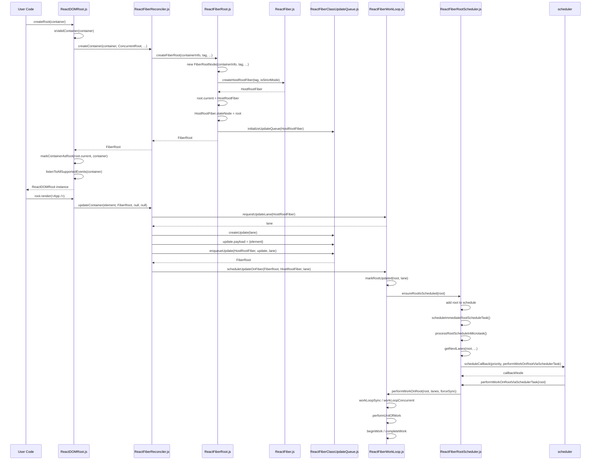

# ReactDOM.createRoot(container).render(<App />) 源码调用链

本文档基于当前本地 `react-main` 源码整理，追踪入口：

```jsx
import {createRoot} from 'react-dom/client';

function App() {
  return <div>Hello React</div>;
}

createRoot(document.getElementById('root')).render(<App />);
```

目标是理解：

1. `createRoot` 做了什么。
2. DOM `container` 如何被包装成 root。
3. `FiberRoot` 和 `HostRootFiber` 在哪里创建。
4. `render(<App />)` 之后如何创建更新并进入调度流程。

## 关键源码文件

| 文件 | 作用 |
| --- | --- |
| `packages/react-dom/client.js` | `react-dom/client` 入口，导出 `createRoot`、`hydrateRoot`、`version` |
| `packages/react-dom/src/client/ReactDOMClient.js` | client 入口聚合，导入 `ReactDOMRoot` 并注入 DevTools |
| `packages/react-dom/src/client/ReactDOMRoot.js` | `createRoot`、`ReactDOMRoot.prototype.render` 的核心实现 |
| `packages/react-dom-bindings/src/client/ReactDOMComponentTree.js` | DOM container 与 HostRootFiber 的关联标记 |
| `packages/react-reconciler/src/ReactFiberReconciler.js` | `createContainer`、`updateContainer`、`updateContainerImpl` |
| `packages/react-reconciler/src/ReactFiberRoot.js` | `FiberRootNode`、`createFiberRoot` |
| `packages/react-reconciler/src/ReactFiber.js` | `createHostRootFiber`、`FiberNode` |
| `packages/react-reconciler/src/ReactFiberClassUpdateQueue.js` | `createUpdate`、`enqueueUpdate`、root update queue |
| `packages/react-reconciler/src/ReactFiberWorkLoop.js` | `requestUpdateLane`、`scheduleUpdateOnFiber`、work loop |
| `packages/react-reconciler/src/ReactFiberRootScheduler.js` | `ensureRootIsScheduled`、root schedule、Scheduler callback |

## 完整调用链

### createRoot 阶段

```text
react-dom/client
  -> packages/react-dom/client.js
  -> createRoot(container)
  -> ReactDOMRoot.js:createRoot
  -> isValidContainer(container)
  -> 解析 options
  -> createContainer(container, ConcurrentRoot, ...)
  -> ReactFiberReconciler.js:createContainer
  -> createFiberRoot(containerInfo, tag, ...)
  -> ReactFiberRoot.js:createFiberRoot
  -> new FiberRootNode(containerInfo, tag, ...)
  -> createHostRootFiber(tag, isStrictMode)
  -> ReactFiber.js:createHostRootFiber
  -> createFiber(HostRoot, null, null, mode)
  -> root.current = HostRootFiber
  -> HostRootFiber.stateNode = root
  -> initializeUpdateQueue(HostRootFiber)
  -> markContainerAsRoot(root.current, container)
  -> listenToAllSupportedEvents(rootContainerElement)
  -> return new ReactDOMRoot(root)
```

### render 阶段

```text
root.render(<App />)
  -> ReactDOMRoot.prototype.render(children)
  -> const root = this._internalRoot
  -> updateContainer(children, root, null, null)
  -> ReactFiberReconciler.js:updateContainer
  -> const current = container.current
  -> const lane = requestUpdateLane(current)
  -> updateContainerImpl(current, lane, element, container, ...)
  -> createUpdate(lane)
  -> update.payload = {element}
  -> enqueueUpdate(rootFiber, update, lane)
  -> scheduleUpdateOnFiber(root, rootFiber, lane)
  -> markRootUpdated(root, lane)
  -> ensureRootIsScheduled(root)
  -> ensureScheduleIsScheduled()
  -> scheduleImmediateRootScheduleTask()
  -> processRootScheduleInMicrotask()
  -> scheduleTaskForRootDuringMicrotask(root, currentTime)
  -> getNextLanes(root, ...)
  -> scheduleCallback(priority, performWorkOnRootViaSchedulerTask)
  -> performWorkOnRoot(root, lanes, forceSync)
  -> workLoopSync 或 workLoopConcurrent
  -> performUnitOfWork
  -> beginWork / completeWork
  -> commitRoot
```

## createRoot 做了什么

源码入口在 `packages/react-dom/src/client/ReactDOMRoot.js`。

核心逻辑：

| 步骤 | 说明 |
| --- | --- |
| 1 | 校验 `container` 是否是合法 DOM 容器 |
| 2 | 解析 `options`，包括 strict mode、错误处理回调、identifierPrefix、transition callbacks 等 |
| 3 | 调用 `createContainer` 创建 reconciler 层的 `FiberRoot` |
| 4 | 调用 `markContainerAsRoot(root.current, container)`，把 DOM container 和 HostRootFiber 关联起来 |
| 5 | 调用 `listenToAllSupportedEvents(rootContainerElement)`，在根容器上注册事件监听 |
| 6 | 返回 `new ReactDOMRoot(root)`，这个对象上有 `_internalRoot` 指向 FiberRoot |

简化代码：

```js
function createRoot(container, options) {
  if (!isValidContainer(container)) {
    throw new Error('Target container is not a DOM element.');
  }

  const root = createContainer(
    container,
    ConcurrentRoot,
    null,
    isStrictMode,
    concurrentUpdatesByDefaultOverride,
    identifierPrefix,
    onUncaughtError,
    onCaughtError,
    onRecoverableError,
    onDefaultTransitionIndicator,
    transitionCallbacks,
  );

  markContainerAsRoot(root.current, container);
  listenToAllSupportedEvents(rootContainerElement);

  return new ReactDOMRoot(root);
}
```

## container 是如何被包装成 root 的

DOM `container` 本身不会变成 Fiber。它被放入 `FiberRootNode.containerInfo`，然后 `FiberRoot` 和 `HostRootFiber` 互相引用：

```text
DOM container
  -> FiberRoot.containerInfo

FiberRoot.current
  -> HostRootFiber

HostRootFiber.stateNode
  -> FiberRoot
```

此外，React DOM 会把 HostRootFiber 标记到 DOM container 上：

```js
markContainerAsRoot(root.current, container);
```

`markContainerAsRoot` 的核心动作是：

```js
node[internalContainerInstanceKey] = hostRoot;
```

这让 React 后续可以从 DOM container 找回对应的 root fiber。

## FiberRoot 是在哪里创建的

`FiberRoot` 在 `packages/react-reconciler/src/ReactFiberRoot.js` 的 `createFiberRoot` 中创建。

简化代码：

```js
function createFiberRoot(containerInfo, tag, hydrate, initialChildren, ...) {
  const root = new FiberRootNode(
    containerInfo,
    tag,
    hydrate,
    identifierPrefix,
    onUncaughtError,
    onCaughtError,
    onRecoverableError,
    onDefaultTransitionIndicator,
    formState,
  );

  const uninitializedFiber = createHostRootFiber(tag, isStrictMode);
  root.current = uninitializedFiber;
  uninitializedFiber.stateNode = root;

  const initialState = {
    element: initialChildren,
    isDehydrated: hydrate,
    cache: initialCache,
  };
  uninitializedFiber.memoizedState = initialState;

  initializeUpdateQueue(uninitializedFiber);

  return root;
}
```

`FiberRootNode` 保存的是整棵树的根级状态，例如：

| 字段 | 说明 |
| --- | --- |
| `tag` | root 类型，`createRoot` 使用 `ConcurrentRoot` |
| `containerInfo` | DOM container |
| `current` | 当前已提交树的 HostRootFiber |
| `pendingLanes` | 当前 root 上待处理的更新优先级集合 |
| `callbackNode` | Scheduler 中已注册的任务节点 |
| `callbackPriority` | 当前 callback 对应优先级 |
| `context` / `pendingContext` | 根上下文 |
| `timeoutHandle` | 超时/挂起相关句柄 |

## HostRootFiber 是在哪里创建的

`HostRootFiber` 在 `packages/react-reconciler/src/ReactFiber.js` 的 `createHostRootFiber` 中创建。

简化代码：

```js
function createHostRootFiber(tag, isStrictMode) {
  let mode;

  if (disableLegacyMode || tag === ConcurrentRoot) {
    mode = ConcurrentMode;
    if (isStrictMode === true) {
      mode |= StrictLegacyMode | StrictEffectsMode;
    }
  } else {
    mode = NoMode;
  }

  return createFiber(HostRoot, null, null, mode);
}
```

HostRootFiber 是 Fiber 树的顶层节点，它不是用户组件，也不是 DOM 节点。它代表整个 React root。

## FiberRoot 和 RootFiber 的关系

| 对象 | 角色 | 关键字段 |
| --- | --- | --- |
| `FiberRoot` | 根容器对象，保存整棵树的全局状态和调度状态 | `containerInfo`、`current`、`pendingLanes`、`callbackNode` |
| `HostRootFiber` | Fiber 树的根节点，是真正参与 Fiber 遍历的节点 | `tag = HostRoot`、`stateNode`、`memoizedState`、`updateQueue` |

二者互相指向：

```text
FiberRoot.current ───────> HostRootFiber
FiberRoot <────── stateNode HostRootFiber
```

可以把它们理解为：

```text
FiberRoot：整棵树的管理对象和调度入口
HostRootFiber：Fiber 树里的根节点和更新队列承载者
```

## render 方法调用后发生了什么

`createRoot(container)` 返回的是 `ReactDOMRoot` 实例：

```js
function ReactDOMRoot(internalRoot) {
  this._internalRoot = internalRoot;
}
```

调用 `root.render(<App />)` 时：

```js
ReactDOMRoot.prototype.render = function (children) {
  const root = this._internalRoot;
  if (root === null) {
    throw new Error('Cannot update an unmounted root.');
  }
  updateContainer(children, root, null, null);
};
```

这里的 `children` 就是 `<App />` 生成的 React Element。

## updateContainer 做了什么

`updateContainer` 位于 `packages/react-reconciler/src/ReactFiberReconciler.js`。

核心逻辑：

```js
function updateContainer(element, container, parentComponent, callback) {
  const current = container.current;
  const lane = requestUpdateLane(current);
  updateContainerImpl(
    current,
    lane,
    element,
    container,
    parentComponent,
    callback,
  );
  return lane;
}
```

`updateContainerImpl` 做的事情：

| 步骤 | 说明 |
| --- | --- |
| 1 | 计算 root context，并写入 `container.context` 或 `container.pendingContext` |
| 2 | 创建 update：`createUpdate(lane)` |
| 3 | 把 React Element 放入 update：`update.payload = {element}` |
| 4 | 如果有 callback，挂到 `update.callback` |
| 5 | 调用 `enqueueUpdate(rootFiber, update, lane)` 把 update 放到 HostRootFiber 的 update queue |
| 6 | 调用 `scheduleUpdateOnFiber(root, rootFiber, lane)` 进入调度流程 |
| 7 | 调用 `entangleTransitions(root, rootFiber, lane)` 处理 transition lane 关联 |

简化代码：

```js
function updateContainerImpl(rootFiber, lane, element, container, parentComponent, callback) {
  const update = createUpdate(lane);
  update.payload = {element};

  if (callback != null) {
    update.callback = callback;
  }

  const root = enqueueUpdate(rootFiber, update, lane);
  if (root !== null) {
    startUpdateTimerByLane(lane, 'root.render()', null);
    scheduleUpdateOnFiber(root, rootFiber, lane);
    entangleTransitions(root, rootFiber, lane);
  }
}
```

## 更新任务是如何进入调度流程的

更新进入调度流程的关键函数是 `scheduleUpdateOnFiber(root, fiber, lane)`。

核心步骤：

| 步骤 | 说明 |
| --- | --- |
| 1 | 如果当前 root 正在挂起或 commit 被挂起，准备打断并重启 |
| 2 | 调用 `markRootUpdated(root, lane)`，把 lane 标记到 root 的 pending lanes |
| 3 | 如果是 render phase update，记录对应 lanes |
| 4 | 普通更新路径调用 `ensureRootIsScheduled(root)` |
| 5 | `ensureRootIsScheduled` 把 root 放入全局 root schedule 链表 |
| 6 | 安排一个 microtask 去处理 root schedule |
| 7 | microtask 中调用 `scheduleTaskForRootDuringMicrotask` |
| 8 | 根据 `getNextLanes` 选择下一批 lanes |
| 9 | 同步任务在 microtask 末尾 flush；并发任务通过 Scheduler 注册 callback |
| 10 | 进入 `performWorkOnRoot`，开始 render work loop |

简化链路：

```text
scheduleUpdateOnFiber(root, rootFiber, lane)
  -> markRootUpdated(root, lane)
  -> ensureRootIsScheduled(root)
  -> ensureScheduleIsScheduled()
  -> scheduleImmediateRootScheduleTask()
  -> processRootScheduleInMicrotask()
  -> scheduleTaskForRootDuringMicrotask(root, currentTime)
  -> getNextLanes(root, ...)
  -> scheduleCallback(priority, performWorkOnRootViaSchedulerTask)
  -> performWorkOnRoot(root, lanes, forceSync)
```

## 每一步的示例代码

### 第 1 步：用户入口

```jsx
const container = document.getElementById('root');
const root = createRoot(container);
root.render(<App />);
```

### 第 2 步：createRoot 创建 ReactDOMRoot

```js
const fiberRoot = createContainer(container, ConcurrentRoot, ...);
markContainerAsRoot(fiberRoot.current, container);
return new ReactDOMRoot(fiberRoot);
```

此时：

```text
root._internalRoot === fiberRoot
fiberRoot.containerInfo === container
fiberRoot.current === hostRootFiber
hostRootFiber.stateNode === fiberRoot
```

### 第 3 步：render 传入 React Element

```js
root.render(<App />);
```

大致等价于：

```js
root.render({
  $$typeof: Symbol.for('react.transitional.element'),
  type: App,
  key: null,
  props: {},
});
```

### 第 4 步：updateContainer 创建 root update

```js
const update = createUpdate(lane);
update.payload = {
  element: <App />,
};
enqueueUpdate(hostRootFiber, update, lane);
```

### 第 5 步：进入调度

```js
scheduleUpdateOnFiber(fiberRoot, hostRootFiber, lane);
```

这一步会把 root 标记为有待处理工作，并确保后续有 microtask 或 Scheduler task 来处理它。

### 第 6 步：进入 work loop

```text
performWorkOnRoot
  -> workLoopSync / workLoopConcurrent
  -> performUnitOfWork
  -> beginWork
  -> completeWork
```

首次渲染时，HostRootFiber 的 update queue 会被处理，取出 `payload.element`，再把 `<App />` 作为 children 继续协调，最终创建 App 对应的 Fiber 子树。

## Mermaid 时序图



## 核心函数说明

| 函数 | 文件 | 作用 |
| --- | --- | --- |
| `createRoot` | `react-dom/src/client/ReactDOMRoot.js` | 创建 ReactDOMRoot，初始化 FiberRoot，绑定事件 |
| `ReactDOMRoot.prototype.render` | `react-dom/src/client/ReactDOMRoot.js` | 把 React Element 交给 `updateContainer` |
| `createContainer` | `react-reconciler/src/ReactFiberReconciler.js` | DOM renderer 创建 root 时进入 reconciler 的入口 |
| `createFiberRoot` | `react-reconciler/src/ReactFiberRoot.js` | 创建 FiberRootNode，并创建 HostRootFiber |
| `createHostRootFiber` | `react-reconciler/src/ReactFiber.js` | 创建 `tag = HostRoot` 的 Fiber |
| `initializeUpdateQueue` | `react-reconciler/src/ReactFiberClassUpdateQueue.js` | 给 HostRootFiber 初始化 update queue |
| `updateContainer` | `react-reconciler/src/ReactFiberReconciler.js` | 为 root render 选择 lane 并创建更新 |
| `createUpdate` | `react-reconciler/src/ReactFiberClassUpdateQueue.js` | 创建更新对象 |
| `enqueueUpdate` | `react-reconciler/src/ReactFiberClassUpdateQueue.js` | 把 update 入队，并找到 root |
| `requestUpdateLane` | `react-reconciler/src/ReactFiberWorkLoop.js` | 根据当前上下文选择更新 lane |
| `scheduleUpdateOnFiber` | `react-reconciler/src/ReactFiberWorkLoop.js` | 标记 root 有更新，并确保 root 被调度 |
| `ensureRootIsScheduled` | `react-reconciler/src/ReactFiberRootScheduler.js` | 把 root 放入全局 schedule，并安排 microtask |
| `scheduleTaskForRootDuringMicrotask` | `react-reconciler/src/ReactFiberRootScheduler.js` | 为 root 选择下一批 lanes，并决定同步 flush 或 Scheduler task |
| `performWorkOnRootViaSchedulerTask` | `react-reconciler/src/ReactFiberRootScheduler.js` | Scheduler callback 入口 |
| `performUnitOfWork` | `react-reconciler/src/ReactFiberWorkLoop.js` | 执行单个 Fiber 工作单元 |

## 总结

`createRoot(container).render(<App />)` 可以分成两段：

```text
createRoot 阶段：
DOM container
  -> FiberRoot
  -> HostRootFiber
  -> ReactDOMRoot

render 阶段：
React Element
  -> HostRootFiber update
  -> lane
  -> root schedule
  -> Scheduler / microtask
  -> work loop
  -> Fiber tree
  -> commit
```

最关键的关系是：

```text
ReactDOMRoot._internalRoot = FiberRoot
FiberRoot.containerInfo = DOM container
FiberRoot.current = HostRootFiber
HostRootFiber.stateNode = FiberRoot
HostRootFiber.updateQueue.pending 包含 root.render 产生的 update
update.payload.element = <App />
```

理解这条链路后，再读 `beginWork`、`completeWork`、commit 阶段就会清楚很多：`render(<App />)` 本质上不是立即渲染 DOM，而是向 HostRootFiber 的更新队列塞入一个 `{element: <App />}` 更新，然后由调度系统驱动 Fiber work loop 去完成渲染。
