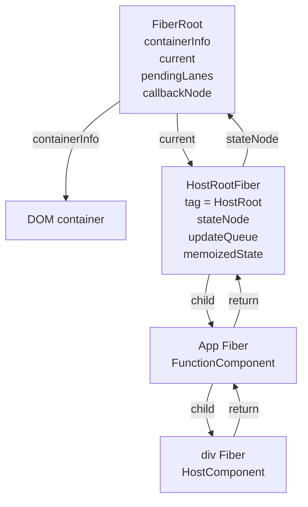
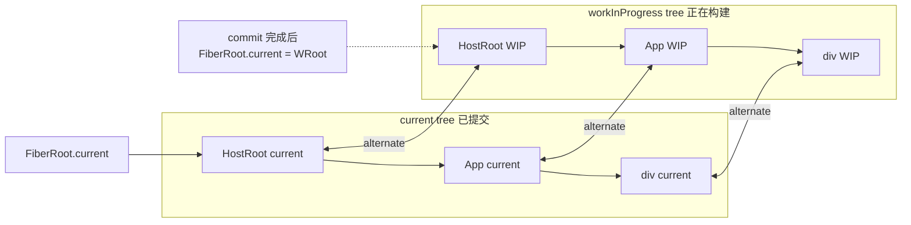

# React Fiber 源码实现分析

本文档基于当前本地 `react-main` 源码整理，重点分析 React Fiber 的核心数据结构、双缓存机制、调度字段和它如何支撑可中断渲染。

## Fiber 是什么

源码里对 Fiber 的注释很直接：`A Fiber is work on a Component that needs to be done or was done. There can be more than one per component.`

可以从三个角度理解 Fiber：

| 角度 | 解释 |
| --- | --- |
| 数据结构 | Fiber 是一个 JavaScript 对象，保存组件或宿主节点的类型、props、state、子节点关系、副作用、优先级等信息 |
| 工作单元 | React render 阶段会以 Fiber 为单位执行 `beginWork`、`completeWork` |
| 链表树节点 | Fiber 用 `return`、`child`、`sibling` 把组件树改造成可遍历、可暂停、可恢复的链表树 |

React Element 是“我要渲染什么”的描述，Fiber 是“如何完成这次渲染工作”的运行时节点。

## 源码关键文件

| 文件 | 作用 |
| --- | --- |
| `packages/react-reconciler/src/ReactFiber.js` | `FiberNode` 构造、`createWorkInProgress`、`createHostRootFiber`、`createFiberFromElement` |
| `packages/react-reconciler/src/ReactInternalTypes.js` | `Fiber`、`FiberRoot`、`Dispatcher` 等核心 Flow 类型 |
| `packages/react-reconciler/src/ReactFiberRoot.js` | `FiberRootNode` 和 `createFiberRoot` |
| `packages/react-reconciler/src/ReactFiberFlags.js` | Fiber 副作用 flags，例如 `Placement`、`Update`、`Passive`、`ChildDeletion` |
| `packages/react-reconciler/src/ReactFiberLane.js` | lane 优先级模型 |
| `packages/react-reconciler/src/ReactFiberWorkLoop.js` | work loop、调度入口、可中断循环 |
| `packages/react-reconciler/src/ReactFiberBeginWork.js` | `beginWork` 阶段，向下处理 Fiber |
| `packages/react-reconciler/src/ReactFiberCompleteWork.js` | `completeWork` 阶段，向上归并 flags 和 childLanes |
| `packages/react-reconciler/src/ReactChildFiber.js` | child reconciliation，Element 到 Fiber 的创建和复用 |

## Fiber 节点在源码中如何定义

`FiberNode` 构造函数位于 `ReactFiber.js`。简化后结构如下：

```js
function FiberNode(tag, pendingProps, key, mode) {
  // Instance
  this.tag = tag;
  this.key = key;
  this.elementType = null;
  this.type = null;
  this.stateNode = null;

  // Tree
  this.return = null;
  this.child = null;
  this.sibling = null;
  this.index = 0;

  // Ref
  this.ref = null;
  this.refCleanup = null;

  // Props / state / updates
  this.pendingProps = pendingProps;
  this.memoizedProps = null;
  this.updateQueue = null;
  this.memoizedState = null;
  this.dependencies = null;

  this.mode = mode;

  // Effects
  this.flags = NoFlags;
  this.subtreeFlags = NoFlags;
  this.deletions = null;

  // Scheduling
  this.lanes = NoLanes;
  this.childLanes = NoLanes;

  // Double buffering
  this.alternate = null;
}
```

## Fiber 核心字段表

| 字段 | 分类 | 作用 |
| --- | --- | --- |
| `tag` | 类型 | 标识 Fiber 类型，例如 `FunctionComponent`、`ClassComponent`、`HostComponent`、`HostRoot` |
| `key` | 身份 | child reconciliation 时用于判断同层节点是否可复用 |
| `elementType` | 类型 | 保存 React Element 的原始 `type`，用于保持 identity |
| `type` | 类型 | 解析后的函数、class、host type 或特殊类型 |
| `stateNode` | 实例 | 对 HostComponent 通常指 DOM 节点；对 HostRoot 指 FiberRoot；对类组件指实例 |
| `return` | 树结构 | 指向父 Fiber，也像调用栈的返回地址 |
| `child` | 树结构 | 指向第一个子 Fiber |
| `sibling` | 树结构 | 指向下一个兄弟 Fiber |
| `index` | 树结构 | 当前 Fiber 在兄弟列表中的位置 |
| `ref` | 引用 | 当前节点使用的 ref |
| `refCleanup` | 引用 | ref 清理函数 |
| `pendingProps` | 输入 | 本次 render 即将处理的新 props |
| `memoizedProps` | 输出缓存 | 上一次完成渲染后使用的 props |
| `updateQueue` | 更新 | 保存待处理更新、回调或 effects |
| `memoizedState` | 状态缓存 | 上一次完成渲染后使用的 state；函数组件中保存 Hook 链表头 |
| `dependencies` | 依赖 | context 等依赖信息 |
| `mode` | 模式 | 标识 ConcurrentMode、StrictMode、ProfileMode 等 |
| `flags` | 副作用 | 当前 Fiber 自身需要在 commit 阶段执行的副作用 |
| `subtreeFlags` | 副作用聚合 | 子树中所有副作用的聚合，用于 commit 阶段快速跳过无副作用子树 |
| `deletions` | 删除 | 本 Fiber 下需要删除的子 Fiber 列表 |
| `lanes` | 调度 | 当前 Fiber 自身待处理更新的优先级集合 |
| `childLanes` | 调度聚合 | 子树中待处理更新的优先级集合 |
| `alternate` | 双缓存 | 指向另一棵树中对应的 Fiber |

## FiberRoot 和 FiberNode 有什么区别

`FiberRoot` 是整棵 React 树的根管理对象；`FiberNode` 是 Fiber 树中的节点。

| 对比项 | FiberRoot | FiberNode |
| --- | --- | --- |
| 定义位置 | `ReactFiberRoot.js` | `ReactFiber.js` |
| 角色 | 管理整个 root 的全局状态和调度状态 | 表示一个组件、宿主节点或内部 React 节点 |
| 是否参与 beginWork | 不直接参与 | 直接参与 |
| 指向 DOM container | `containerInfo` 指向 DOM container | HostRootFiber 通过 `stateNode` 指回 FiberRoot |
| 当前树入口 | `current` 指向 HostRootFiber | 通过 `return/child/sibling` 组成 Fiber 树 |
| 调度字段 | `pendingLanes`、`suspendedLanes`、`callbackNode`、`callbackPriority` | `lanes`、`childLanes` |

## FiberRoot 与 FiberNode 关系图



## current 树和 workInProgress 树是什么

React 使用双缓存树：

| 树 | 含义 |
| --- | --- |
| `current` 树 | 当前屏幕上已经提交的 Fiber 树，`FiberRoot.current` 指向它的 HostRootFiber |
| `workInProgress` 树 | 正在 render 阶段构建的新 Fiber 树，完成后会成为新的 current 树 |

渲染过程中，React 不直接改 current 树，而是通过 `createWorkInProgress(current, pendingProps)` 创建或复用 alternate 节点，在 workInProgress 树上计算新结果。

commit 完成后，`FiberRoot.current` 会切换到 finishedWork，也就是刚完成的 workInProgress 树。

## alternate 指针的作用是什么

`alternate` 连接同一个逻辑节点在两棵树中的两个 Fiber：

```text
currentFiber.alternate === workInProgressFiber
workInProgressFiber.alternate === currentFiber
```

源码 `createWorkInProgress` 的核心逻辑：

```js
function createWorkInProgress(current, pendingProps) {
  let workInProgress = current.alternate;

  if (workInProgress === null) {
    workInProgress = createFiber(
      current.tag,
      pendingProps,
      current.key,
      current.mode,
    );
    workInProgress.elementType = current.elementType;
    workInProgress.type = current.type;
    workInProgress.stateNode = current.stateNode;

    workInProgress.alternate = current;
    current.alternate = workInProgress;
  } else {
    workInProgress.pendingProps = pendingProps;
    workInProgress.flags = NoFlags;
    workInProgress.subtreeFlags = NoFlags;
    workInProgress.deletions = null;
  }

  workInProgress.child = current.child;
  workInProgress.memoizedProps = current.memoizedProps;
  workInProgress.memoizedState = current.memoizedState;
  workInProgress.updateQueue = current.updateQueue;

  return workInProgress;
}
```

`alternate` 的价值：

1. 复用 Fiber 对象，减少重复分配。
2. 保留 current 树稳定不变，避免未完成渲染污染 UI。
3. 支持渲染中断后恢复，因为 workInProgress 树保留了已完成的部分工作。
4. 支持 diff，因为可以通过 `current` 和 `workInProgress` 比较旧值和新值。

## 双缓存机制图



## return、child、sibling 指针分别表示什么

React 没有用递归调用栈直接保存组件树遍历状态，而是把树结构显式保存在 Fiber 指针中。

| 指针 | 含义 | 类比 |
| --- | --- | --- |
| `return` | 父 Fiber，当前 Fiber 完成后应该返回的位置 | 调用栈返回地址 |
| `child` | 第一个子 Fiber | 树的第一个子节点 |
| `sibling` | 下一个兄弟 Fiber | 链表 next 指针 |

例如：

```jsx
function App() {
  return (
    <section>
      <h1>Title</h1>
      <p>Body</p>
    </section>
  );
}
```

Fiber 关系大致是：

```text
AppFiber.child -> sectionFiber

sectionFiber.return -> AppFiber
sectionFiber.child -> h1Fiber

h1Fiber.return -> sectionFiber
h1Fiber.sibling -> pFiber

pFiber.return -> sectionFiber
```

这种链表树结构让 React 可以在 `performUnitOfWork` 中处理一个 Fiber 后，决定下一个工作单元，而不是依赖浏览器 JS 调用栈。

## pendingProps、memoizedProps、memoizedState、updateQueue

| 字段 | 作用 | 示例 |
| --- | --- | --- |
| `pendingProps` | 本次 render 要处理的新 props | `<App name="B" />` 中新的 `{name: "B"}` |
| `memoizedProps` | 上次完成渲染后使用的 props | 上次 commit 后保存的 `{name: "A"}` |
| `memoizedState` | 上次完成渲染后使用的 state | 函数组件中是 Hook 链表；HostRoot 中保存 `{element, isDehydrated, cache}` |
| `updateQueue` | 待处理更新队列或 effect 队列 | HostRootFiber 的 `update.payload = {element}`；类组件的 setState 队列；函数组件 effect 队列 |

示例：

```jsx
function Counter({step}) {
  const [count, setCount] = useState(0);
  return <button onClick={() => setCount(count + step)}>{count}</button>;
}
```

在 Counter 对应 Fiber 上：

```text
pendingProps      -> 本次传入的 props，例如 {step: 2}
memoizedProps     -> 上次渲染使用的 props
memoizedState     -> Hook 链表，包含 useState 的 count
updateQueue       -> effect 队列等函数组件更新相关队列
lanes             -> 当前 Counter 自身待处理更新的优先级
```

## flags、subtreeFlags、lanes、childLanes

这四个字段分别解决两个问题：commit 副作用和调度优先级。

| 字段 | 解决的问题 | 说明 |
| --- | --- | --- |
| `flags` | 当前 Fiber 自身有什么副作用 | 例如 `Placement` 表示插入，`Update` 表示更新，`Passive` 表示有 passive effect |
| `subtreeFlags` | 子树里是否有副作用 | complete 阶段通过 `bubbleProperties` 从 child 向父级冒泡，commit 阶段用它跳过无副作用子树 |
| `lanes` | 当前 Fiber 自身有哪些待处理更新 | lane 是 bitmask，表示更新优先级集合 |
| `childLanes` | 子树里有哪些待处理更新 | complete 阶段聚合 child 的 `lanes` 和 `childLanes`，调度和 bailout 会用到 |

`ReactFiberCompleteWork.js` 中的 `bubbleProperties` 会做两类冒泡：

```js
newChildLanes = mergeLanes(
  newChildLanes,
  mergeLanes(child.lanes, child.childLanes),
);

subtreeFlags |= child.subtreeFlags;
subtreeFlags |= child.flags;

completedWork.subtreeFlags |= subtreeFlags;
completedWork.childLanes = newChildLanes;
```

也就是说：

```text
flags / subtreeFlags 负责 commit 阶段找副作用
lanes / childLanes 负责 render 调度阶段找工作
```

## 为什么 React 要用 Fiber，而不是递归同步渲染

早期递归同步渲染的问题：

1. 一旦开始递归更新大树，就很难中断。
2. 长任务会阻塞主线程，导致输入、动画、滚动卡顿。
3. 不容易为不同更新设置优先级。
4. 渲染过程依赖 JS 调用栈，恢复和重试困难。
5. 无法自然支持并发渲染、Suspense、transition 等机制。

Fiber 把递归调用栈“对象化”：

```text
递归同步渲染：
render(App)
  -> render(Header)
    -> render(Button)

Fiber 渲染：
performUnitOfWork(AppFiber)
performUnitOfWork(HeaderFiber)
performUnitOfWork(ButtonFiber)
```

这样 React 每处理完一个 Fiber，都可以决定：

1. 继续处理下一个 Fiber。
2. 暂停并把主线程还给浏览器。
3. 切换到更高优先级更新。
4. 之后从 workInProgress 恢复。

## Fiber 如何支持可中断、可恢复、优先级调度

### 1. 可中断

并发 work loop 中，React 会检查是否应该让出：

```js
function workLoopConcurrentByScheduler() {
  while (workInProgress !== null && !shouldYield()) {
    performUnitOfWork(workInProgress);
  }
}
```

关键点：`workInProgress` 是全局指针，指向下一个待处理 Fiber。循环退出时，它仍然保存当前位置。

### 2. 可恢复

恢复时，React 不需要重新从头递归调用 JS 栈，而是继续处理 `workInProgress` 指向的 Fiber。

```text
中断前：
workInProgress -> ButtonFiber

恢复后：
继续 performUnitOfWork(ButtonFiber)
```

`alternate` 和 workInProgress 树保存了已经完成和正在进行的工作。

### 3. 优先级调度

React 用 lanes 表示更新优先级：

```text
SyncLane
InputContinuousLane
DefaultLane
TransitionLanes
RetryLanes
IdleLane
OffscreenLane
```

当更新发生：

```text
setState / root.render
  -> requestUpdateLane
  -> scheduleUpdateOnFiber
  -> markRootUpdated
  -> ensureRootIsScheduled
  -> getNextLanes
  -> performWorkOnRoot
```

`FiberRoot.pendingLanes` 保存 root 上所有待处理 lanes；每个 Fiber 的 `lanes` 和 `childLanes` 帮助 React 判断某个子树是否还有当前优先级的工作。

### 4. 可丢弃

如果高优先级更新插队，当前 workInProgress 可以被丢弃或重置，React 用 current 树作为稳定基线重新构建。

这就是为什么 React 不直接修改 current 树，而是在 workInProgress 树上工作。

## 每一步的示例代码

### 1. Element 转 Fiber

```jsx
const element = <button className="primary">Click</button>;
```

React Element 大致是：

```js
{
  type: 'button',
  key: null,
  props: {
    className: 'primary',
    children: 'Click',
  },
}
```

转换成 Fiber 后：

```js
{
  tag: HostComponent,
  type: 'button',
  key: null,
  pendingProps: {
    className: 'primary',
    children: 'Click',
  },
  stateNode: null,
  child: null,
  sibling: null,
  return: parentFiber,
}
```

### 2. 首次创建 HostRootFiber

```js
const root = new FiberRootNode(container, ConcurrentRoot, ...);
const hostRootFiber = createHostRootFiber(ConcurrentRoot, false);

root.current = hostRootFiber;
hostRootFiber.stateNode = root;
initializeUpdateQueue(hostRootFiber);
```

### 3. 更新时创建 workInProgress

```js
const current = fiberRoot.current;
const workInProgress = createWorkInProgress(current, current.pendingProps);
```

此时：

```text
current.alternate === workInProgress
workInProgress.alternate === current
```

### 4. performUnitOfWork 执行单个 Fiber

```js
function performUnitOfWork(unitOfWork) {
  const current = unitOfWork.alternate;
  const next = beginWork(current, unitOfWork, renderLanes);

  unitOfWork.memoizedProps = unitOfWork.pendingProps;

  if (next === null) {
    completeUnitOfWork(unitOfWork);
  } else {
    workInProgress = next;
  }
}
```

### 5. complete 阶段冒泡 flags 和 lanes

```js
function bubbleProperties(completedWork) {
  let newChildLanes = NoLanes;
  let subtreeFlags = NoFlags;

  let child = completedWork.child;
  while (child !== null) {
    newChildLanes = mergeLanes(
      newChildLanes,
      mergeLanes(child.lanes, child.childLanes),
    );

    subtreeFlags |= child.subtreeFlags;
    subtreeFlags |= child.flags;

    child.return = completedWork;
    child = child.sibling;
  }

  completedWork.subtreeFlags |= subtreeFlags;
  completedWork.childLanes = newChildLanes;
}
```

## 学习总结

Fiber 是 React 运行时的核心抽象。它把组件树拆成一个个可管理的工作单元，并用链表树、双缓存、flags 和 lanes 支撑现代 React 的核心能力。

最重要的几句话：

1. FiberNode 是组件或宿主节点的运行时工作单元。
2. FiberRoot 是整棵树的根管理对象，不是普通 Fiber 节点。
3. `current` 是已提交树，`workInProgress` 是正在构建的新树。
4. `alternate` 把两棵树中的对应 Fiber 连接起来。
5. `return/child/sibling` 把递归树变成可暂停恢复的链表树。
6. `pendingProps` 是输入，`memoizedProps/memoizedState` 是上次输出缓存。
7. `flags/subtreeFlags` 服务于 commit 副作用。
8. `lanes/childLanes` 服务于优先级调度。
9. Fiber 让 React 可以把一次大渲染拆成很多小工作单元。
10. 可中断、可恢复、优先级调度的基础，就是 workInProgress 指针、alternate 双缓存和 lane 模型。

后续阅读建议：

```text
ReactFiber.js
  -> ReactFiberRoot.js
  -> ReactFiberLane.js
  -> ReactFiberWorkLoop.js
  -> ReactFiberBeginWork.js
  -> ReactFiberCompleteWork.js
  -> ReactFiberCommitWork.js
```

读完这条线后，再回头看 Hooks、diff 和 commit，会更容易把源码中的字段和流程串起来。
