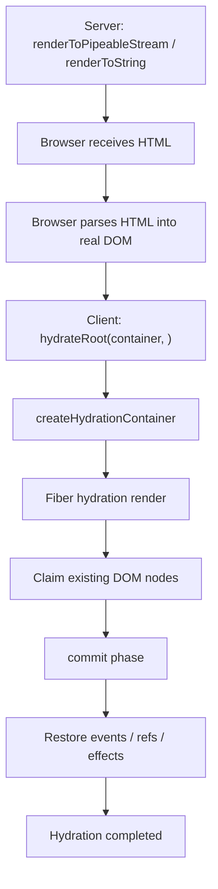
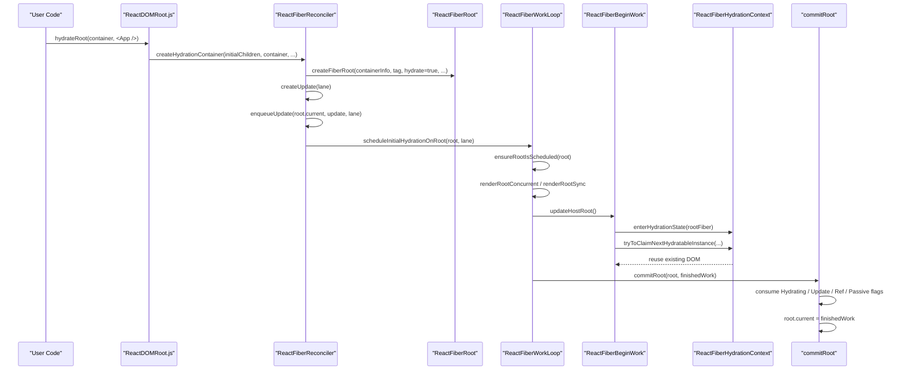
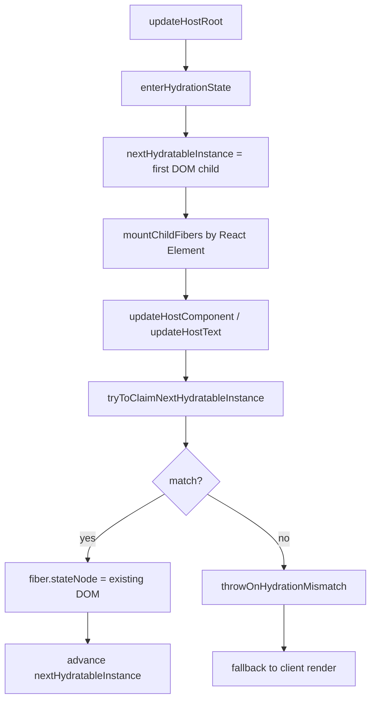
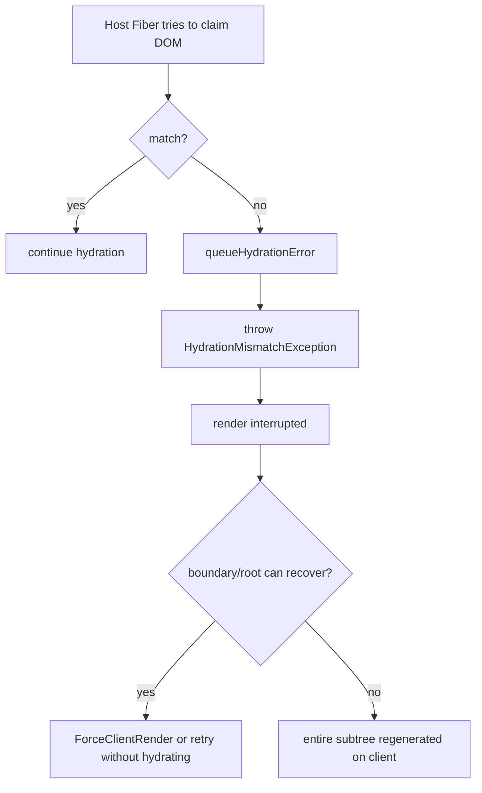
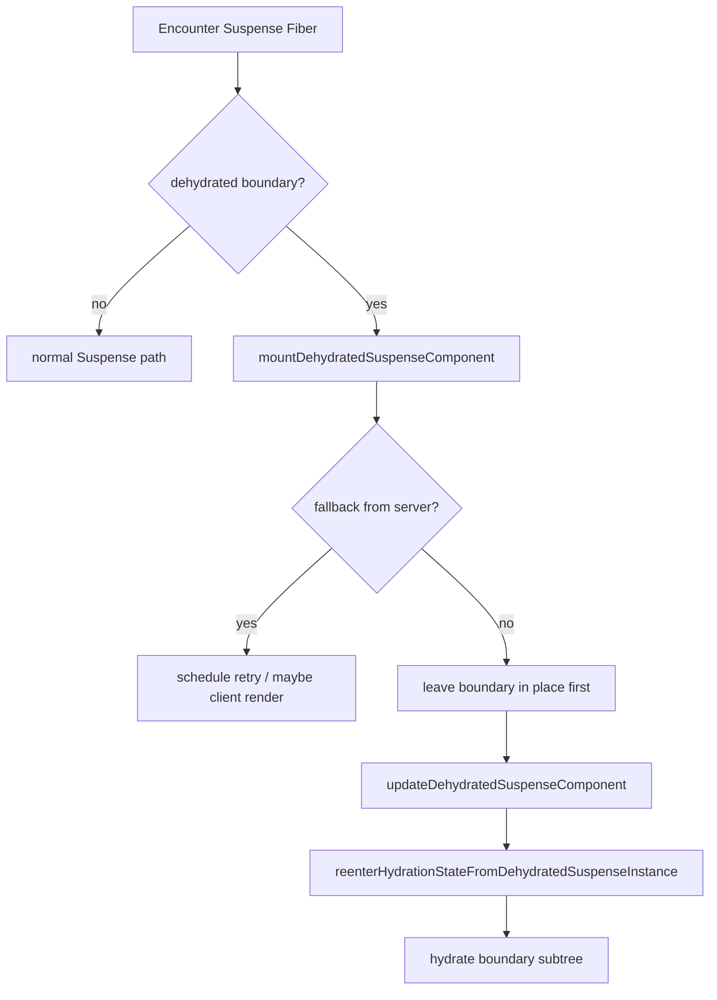

# React hydration 源码深入分析

本文基于当前本地 `react-main` 源码，围绕下面这段代码，完整追踪 React 如何“接管”服务端已经输出到页面上的 HTML：

```tsx
import {hydrateRoot} from 'react-dom/client';

hydrateRoot(document.getElementById('root'), <App />);
```

这份文档重点回答：

1. `hydrateRoot` 的入口在哪里
2. `hydrateRoot` 和 `createRoot` 的区别
3. hydration root 如何创建
4. React 如何标记当前 root 进入 hydration 模式
5. React 如何复用已有 DOM
6. React 如何检测 mismatch
7. mismatch 之后如何回退到客户端重建
8. 事件如何绑定、阻塞、重放
9. Suspense hydration 和 selective hydration 如何工作
10. hydration 完成后 `current` 树如何切换

一句话先定性：

```text
createRoot 是“从零创建 DOM”；
hydrateRoot 是“先尝试认领已有 DOM，认领失败再退回客户端重建”。
```

## 一、hydrateRoot 在 React 架构中的位置

SSR + hydration 的整体闭环如下：



这里要抓住一个很关键的点：

```text
服务端已经把 HTML 放进页面了。
客户端 hydration 不是再创建一遍 DOM，
而是让 Fiber 树和现有 DOM 对上号。
```

所以 hydration 的核心问题不是“怎么生成 DOM”，而是：

1. 当前这棵 Fiber 树应该认领哪一个真实 DOM 节点？
2. 服务端 HTML 和客户端期望结构是否匹配？
3. 在 hydration 还没完成时，用户事件怎么处理？
4. 如果中途 Suspense 阻塞，能不能优先 hydrate 用户真正点到的那部分？

## 二、核心源码文件

| 文件 | 作用 |
| --- | --- |
| `packages/react-dom/src/client/ReactDOMRoot.js` | `hydrateRoot` / `createRoot` 入口 |
| `packages/react-reconciler/src/ReactFiberReconciler.js` | `createHydrationContainer`，把 hydration root 接入 reconciler |
| `packages/react-reconciler/src/ReactFiberRoot.js` | 创建 `FiberRoot`，记录 `hydrate` 类型 |
| `packages/react-reconciler/src/ReactFiberWorkLoop.js` | `scheduleInitialHydrationOnRoot`、render/commit 主循环 |
| `packages/react-reconciler/src/ReactFiberBeginWork.js` | HostRoot / HostComponent / Suspense 在 hydration 场景下的 beginWork 逻辑 |
| `packages/react-reconciler/src/ReactFiberHydrationContext.js` | hydration 状态机，负责“认领 DOM”和 mismatch 检测 |
| `packages/react-reconciler/src/ReactFiberFlags.js` | `Hydrating`、`ForceClientRender` 等 flags |
| `packages/react-reconciler/src/ReactFiberLane.js` | `SelectiveHydrationLane` 等 hydration lanes |
| `packages/react-dom-bindings/src/events/DOMPluginEventSystem.js` | 给 container 绑定所有原生事件监听 |
| `packages/react-dom-bindings/src/events/ReactDOMEventListener.js` | hydration 未完成时阻塞 / 触发同步 hydration |
| `packages/react-dom-bindings/src/events/ReactDOMEventReplaying.js` | 事件重放、显式 hydration 目标队列 |

## 三、hydrateRoot 调用链

完整主链路可以先看这个总图：

```text
hydrateRoot(container, <App />)
  -> createHydrationContainer(...)
  -> createFiberRoot(..., hydrate = true, ...)
  -> createHostRootFiber(...)
  -> createUpdate(lane)
  -> enqueueUpdate(root.current, update, lane)
  -> scheduleInitialHydrationOnRoot(root, lane)
  -> ensureRootIsScheduled(root)
  -> performConcurrentWorkOnRoot / performSyncWorkOnRoot
  -> renderRootConcurrent / renderRootSync
  -> updateHostRoot
  -> enterHydrationState(...)
  -> mountChildFibers(...)
  -> updateHostComponent / updateHostText
  -> tryToClaimNextHydratableInstance / TextInstance
  -> completeWork
  -> commitRoot
  -> root.current = finishedWork
```

更细一点的 Mermaid 时序图如下：



## 四、hydrateRoot 入口在哪里

入口在：

```text
packages/react-dom/src/client/ReactDOMRoot.js
```

关键代码：

```js
export function hydrateRoot(container, initialChildren, options) {
  const root = createHydrationContainer(
    initialChildren,
    null,
    container,
    ConcurrentRoot,
    hydrationCallbacks,
    isStrictMode,
    concurrentUpdatesByDefaultOverride,
    identifierPrefix,
    onUncaughtError,
    onCaughtError,
    onRecoverableError,
    onDefaultTransitionIndicator,
    transitionCallbacks,
    formState,
  );
  markContainerAsRoot(root.current, container);
  listenToAllSupportedEvents(container);
  return new ReactDOMHydrationRoot(root);
}
```

从这段代码可以直接读出三件事：

1. `hydrateRoot` 不是调用 `createContainer`，而是调用 `createHydrationContainer`
2. 它在 root 创建后立刻给 container 绑定所有事件
3. 返回的是 `ReactDOMHydrationRoot`，不是普通的 `ReactDOMRoot`

## 五、createRoot 与 hydrateRoot 对比表

| 对比项 | `createRoot` | `hydrateRoot` |
| --- | --- | --- |
| 入口文件 | `ReactDOMRoot.js` | `ReactDOMRoot.js` |
| root 创建函数 | `createContainer` | `createHydrationContainer` |
| 是否要求 `initialChildren` | 不要求 | 必须传 `<App />` |
| `FiberRoot` 的 `hydrate` 参数 | `false` | `true` |
| 初始目标 | 创建一棵全新的 DOM 树 | 认领现有服务端 DOM |
| 初始调度路径 | 普通 root update | `scheduleInitialHydrationOnRoot` 特殊路径 |
| 初始 DOM 行为 | mount 阶段创建 DOM 节点 | hydration 阶段复用现有 DOM 节点 |
| mismatch 处理 | 无 hydration mismatch 概念 | 可能 `ForceClientRender` 回退到客户端重建 |
| 事件处理 | 绑定后正常分发 | 绑定后可能阻塞、重放、触发 selective hydration |
| 返回类型 | `ReactDOMRoot` | `ReactDOMHydrationRoot` |

本质区别可以压缩成一句话：

```text
createRoot 的初始 render 是“生成宿主节点”；
hydrateRoot 的初始 render 是“匹配并复用宿主节点”。
```

## 六、hydration root 是如何创建的

### 1. createHydrationContainer

入口在：

```text
packages/react-reconciler/src/ReactFiberReconciler.js
```

关键代码：

```js
export function createHydrationContainer(initialChildren, callback, containerInfo, tag, hydrationCallbacks, ...) {
  const hydrate = true;
  const root = createFiberRoot(
    containerInfo,
    tag,
    hydrate,
    initialChildren,
    hydrationCallbacks,
    isStrictMode,
    identifierPrefix,
    formState,
    ...
  );

  root.context = getContextForSubtree(null);

  const current = root.current;
  let lane = requestUpdateLane(current);
  lane = getBumpedLaneForHydrationByLane(lane);
  const update = createUpdate(lane);
  enqueueUpdate(current, update, lane);
  scheduleInitialHydrationOnRoot(root, lane);

  return root;
}
```

这里最关键的设计点有四个：

1. `hydrate = true` 被传入 `createFiberRoot`
2. 仍然通过一次 `update` 驱动 root 进入 render
3. 但这次 update 不是真正的“普通更新”，而是“初始 hydration update”
4. lane 会被 `getBumpedLaneForHydrationByLane` 调整成 hydration 版本

### 2. scheduleInitialHydrationOnRoot

入口在：

```text
packages/react-reconciler/src/ReactFiberWorkLoop.js
```

关键代码：

```js
export function scheduleInitialHydrationOnRoot(root, lane) {
  const current = root.current;
  current.lanes = lane;
  markRootUpdated(root, lane);
  ensureRootIsScheduled(root);
}
```

源码注释直接点明了它存在的原因：

```text
hydration roots are special because the initial render must match
what was rendered on the server
```

也就是说：

```text
hydrateRoot 的初始 render 虽然也走调度系统，
但语义上不是“我要渲染新的 UI”，
而是“我要让客户端第一次 render 和服务器输出完全对齐”。
```

## 七、hydration 数据结构

### 1. FiberRoot 上的 hydration 信息

`createFiberRoot(containerInfo, tag, hydrate, ...)` 会把 `hydrate` 标记带进 root 创建过程。

在 DEV 下，源码甚至会显式记录：

```js
this._debugRootType = hydrate ? 'hydrateRoot()' : 'createRoot()';
```

说明 root 自己是知道自己来自 hydration 还是纯客户端渲染的。

### 2. HostRoot 的 `memoizedState.isDehydrated`

在 hydration root 的第一次 render 里，HostRoot 会带着 “root shell 还没 hydrate 完” 的状态。

这就是为什么 `updateHostRoot` 会先走 hydration 分支，而不是普通 `reconcileChildren` 分支。

### 3. ReactFiberHydrationContext 中的运行时状态

`packages/react-reconciler/src/ReactFiberHydrationContext.js` 维护了一套 hydration 状态机，核心字段可以理解成下面这张表：

| 字段 | 作用 |
| --- | --- |
| `isHydrating` | 当前 render 是否处于 hydration 模式 |
| `nextHydratableInstance` | 下一个等待被认领的真实 DOM 节点 |
| `hydrationParentFiber` | 当前正在对齐的父 Fiber |
| `hydrationErrors` | hydration 过程中记录的错误 |
| `hydrationDiffRootDEV` | DEV 下记录 mismatch diff 信息 |
| `rootOrSingletonContext` | 当前是否在 root / singleton host context 中 |

`enterHydrationState` 的核心逻辑：

```js
const parentInstance = fiber.stateNode.containerInfo;
nextHydratableInstance = getFirstHydratableChildWithinContainer(parentInstance);
hydrationParentFiber = fiber;
isHydrating = true;
hydrationErrors = null;
hydrationDiffRootDEV = null;
```

这说明 hydration 的起点非常具体：

```text
从 container 的第一个 hydratable DOM 子节点开始，
然后 Fiber render 过程中不断向前“认领”它们。
```

### 4. hydration 相关 flags

`packages/react-reconciler/src/ReactFiberFlags.js` 中最关键的两个标记：

| flag | 含义 |
| --- | --- |
| `Hydrating` | 该 Fiber 对应的是“正在认领已有 DOM”的新挂载子树 |
| `ForceClientRender` | 放弃 hydration，强制切换为客户端重建 |

你可以把这两个 flag 理解成：

```text
Hydrating = 先别插 DOM，我要尝试复用现成的
ForceClientRender = 复用失败，别认领了，直接重建
```

### 5. selective hydration lane

`packages/react-reconciler/src/ReactFiberLane.js` 里定义了：

```js
export const SelectiveHydrationLane = ...
```

它解决的是：

```text
如果页面某个局部还没 hydrate，但用户已经和它交互了，
React 要能优先 hydrate 那一块，而不是傻等整棵树慢慢完成。
```

## 八、HostRoot 如何进入 hydration 模式

关键入口在：

```text
packages/react-reconciler/src/ReactFiberBeginWork.js
updateHostRoot
```

关键分支：

```js
if (supportsHydration && prevState.isDehydrated) {
  if (workInProgress.flags & ForceClientRender) {
    return mountHostRootWithoutHydrating(...);
  } else if (nextChildren !== prevChildren) {
    queueHydrationError(...);
    return mountHostRootWithoutHydrating(...);
  } else {
    enterHydrationState(workInProgress);
    const child = mountChildFibers(workInProgress, null, nextChildren, renderLanes);
    workInProgress.child = child;
    // 给整层 child 标记 Hydrating
  }
} else {
  resetHydrationState();
  reconcileChildren(...);
}
```

这里有三条非常重要的规则：

1. 如果 root 还处于 `isDehydrated`，先尝试 hydration
2. 如果之前 hydration 失败并带着 `ForceClientRender`，直接走客户端重建
3. 如果在 hydration 还没完成前，root 就收到了“和服务端不同”的早期更新，也直接放弃 hydration

这解释了一个常见现象：

```text
hydrateRoot 不是无条件成功的。
一旦服务端 HTML 和客户端第一次 render 对不上，
React 就会回退成普通客户端渲染。
```

## 九、React 如何复用已有 DOM 节点

这是 hydration 最核心的部分。

### 1. root 先进入 hydration 状态

`updateHostRoot` 调用：

```js
enterHydrationState(workInProgress)
```

这一步会把：

```text
isHydrating = true
nextHydratableInstance = container 的第一个可复用 DOM
```

### 2. 先按 React Element 结构 mount Fiber

接着：

```js
mountChildFibers(workInProgress, null, nextChildren, renderLanes)
```

注意这里不是从 DOM 反推 Fiber，而是：

```text
先根据客户端的 React Element 构建 Fiber 树，
然后让 Fiber 去认领 DOM。
```

### 3. HostComponent 首次 beginWork 时尝试认领 DOM

`updateHostComponent` 中：

```js
if (current === null) {
  tryToClaimNextHydratableInstance(workInProgress);
}
```

`HostText` 对应：

```js
if (current === null) {
  tryToClaimNextHydratableTextInstance(workInProgress);
}
```

### 4. tryToClaimNextHydratableInstance 做了什么

关键逻辑：

```js
const nextInstance = nextHydratableInstance;
if (!nextInstance || !tryHydrateInstance(fiber, nextInstance, currentHostContext)) {
  warnNonHydratedInstance(fiber, nextInstance);
  throwOnHydrationMismatch(fiber);
}
```

也就是说 React 会拿当前 Fiber 和当前待认领 DOM 做匹配：

1. tag/type 是否匹配，比如 `div` 对 `div`
2. 当前 host context 下这个 DOM 是否合法
3. props / text 是否能对上

匹配成功后，Fiber 的 `stateNode` 会指向那个现有 DOM，接着 `nextHydratableInstance` 向后推进。

### 5. DOM 复用流程图



### 6. 示例

服务端已经输出：

```html
<div id="root">
  <div class="app"><span>count: 1</span></div>
</div>
```

客户端第一次 render：

```tsx
hydrateRoot(root, <App />);
```

假设 `App` 渲染：

```tsx
function App() {
  return (
    <div className="app">
      <span>count: 1</span>
    </div>
  );
}
```

那么 hydration 不是创建新的 `div` / `span`，而是大致做下面这件事：

```text
HostRootFiber      -> 进入 container
App Fiber          -> 执行函数组件，得到 children
HostComponent div  -> 认领现有 <div class="app">
HostComponent span -> 认领现有 <span>
HostText           -> 认领现有文本节点 "count: 1"
```

## 十、React 如何判断 mismatch

hydration mismatch 的核心检测就在 `ReactFiberHydrationContext.js`。

### 1. HTML / 文本节点 mismatch

当 `HostComponent` 或 `HostText` 认领失败时，会走到：

```js
throwOnHydrationMismatch(fiber)
```

源码直接构造错误：

```js
new Error(
  "Hydration failed because the server rendered HTML/text didn't match the client..."
)
```

然后：

```js
queueHydrationError(createCapturedValueAtFiber(error, fiber));
throw HydrationMismatchException;
```

也就是说 mismatch 不是简单 `console.warn`，而是一个真正的控制流切换点：

```text
发现结构或文本对不上
  -> 记录 hydration error
  -> 抛出内部异常
  -> 让当前 hydration render 中断
  -> 后续决定是否回退客户端重建
```

### 2. 哪些情况容易触发 mismatch

源码错误提示里列得很直白，常见包括：

1. `if (typeof window !== 'undefined')` 这种服务端 / 客户端分支
2. `Date.now()`、`Math.random()`
3. 服务端与客户端 locale 格式化结果不同
4. 外部数据变化但 HTML 没携带快照
5. 非法 HTML 嵌套

### 3. mismatch 处理流程



## 十一、mismatch 后如何回退到客户端渲染

### 1. 根节点回退

`updateHostRoot` 里有一个专门的分支：

```js
if (workInProgress.flags & ForceClientRender) {
  return mountHostRootWithoutHydrating(...);
}
```

`mountHostRootWithoutHydrating` 会：

```js
resetHydrationState();
workInProgress.flags |= ForceClientRender;
reconcileChildren(current, workInProgress, nextChildren, renderLanes);
```

这意味着：

```text
一旦决定强制客户端重建，
后续就不再尝试认领 DOM，
而是按普通客户端 mount 流程重建 Fiber 子树和宿主节点。
```

### 2. hydration 错误何时转成 recoverable error

`upgradeHydrationErrorsToRecoverable()` 会把先前积累的 hydration 错误转成 commit 阶段可报告的 recoverable errors：

```js
queueRecoverableErrors(queuedErrors);
hydrationErrors = null;
```

这就是为什么很多 hydration 报错在运行时语义上属于：

```text
可以恢复，但恢复方式是放弃复用、退回客户端渲染
```

## 十二、事件是如何绑定和恢复的

这是 hydration 里非常容易被忽略，但又非常重要的一层。

### 1. hydrateRoot 一开始就绑定所有事件

在 `hydrateRoot` 里：

```js
listenToAllSupportedEvents(container);
```

`DOMPluginEventSystem.js` 中：

```js
allNativeEvents.forEach(domEventName => {
  listenToNativeEvent(domEventName, false, rootContainerElement);
  listenToNativeEvent(domEventName, true, rootContainerElement);
});
```

这意味着：

```text
即使某些 DOM 还没 hydrate 完，
React 也先把事件监听挂到根容器上了。
```

### 2. 为什么先绑事件

因为页面 HTML 已经可见，用户可能在 hydration 完成前就点击、输入、聚焦。

React 需要处理两个问题：

1. 先接住这些事件，别丢
2. 如果对应 Fiber / boundary 还没 hydrate，好让它优先 hydrate

### 3. 事件阻塞与重放

`ReactDOMEventListener.js` 中：

```js
let blockedOn = findInstanceBlockingEvent(nativeEvent);
if (blockedOn === null) {
  dispatchEventForPluginEventSystem(...);
  return;
}

if (queueIfContinuousEvent(...)) {
  nativeEvent.stopPropagation();
  return;
}
```

含义是：

```text
如果事件目标所在区域还被未完成 hydration 的 DOM / Suspense boundary 挡住，
React 先不要直接分发事件，
而是把它排队，等 hydration 完成后再 replay。
```

### 4. 离散事件会触发同步 hydration

同一个文件里还有：

```js
if (eventSystemFlags & IS_CAPTURE_PHASE &&
    isDiscreteEventThatRequiresHydration(domEventName)) {
  attemptSynchronousHydration(fiber);
}
```

这解释了为什么像 `click` 这种用户交互，往往会把目标区域优先 hydrate 出来。

### 5. replay 队列

`ReactDOMEventReplaying.js` 中：

```js
scheduleCallback(NormalPriority, replayUnblockedEvents);
```

`replayUnblockedEvents` 会把之前被阻塞的连续事件重新派发。

你可以把这一层理解成：

```text
HTML 先可交互
  -> 事件先被根容器接住
  -> 目标区域若未 hydrate，就暂存或触发优先 hydration
  -> hydrate 完成后 replay
```

## 十三、Suspense hydration 是如何处理的

hydration 和 Suspense 结合时，React 不会粗暴地“一口气钻进全部子树”。

### 1. dehydrated Suspense 边界

在 hydration 场景下，Suspense 边界可能先以“脱水边界”的形式存在，也就是：

```text
服务器已经输出了这块边界的 HTML，
客户端暂时先把它当作一个 dehydrated boundary 看待。
```

### 2. mountDehydratedSuspenseComponent

在 `ReactFiberBeginWork.js`：

```js
function mountDehydratedSuspenseComponent(workInProgress, suspenseInstance, renderLanes) {
  if (isSuspenseInstanceFallback(suspenseInstance)) {
    workInProgress.lanes = laneToLanes(DefaultLane);
  } else {
    workInProgress.lanes = laneToLanes(OffscreenLane);
  }
  return null;
}
```

含义：

1. 首次经过 Suspense 边界时，不急着立刻钻进子树
2. 如果当前是 fallback 状态，后续要安排更合适的优先级
3. 如果服务器已经给出了正确内容，可以用较低优先级慢慢 hydrate

### 3. updateDehydratedSuspenseComponent

关键逻辑有三种：

| 情况 | 结果 |
| --- | --- |
| 服务器边界是永久 fallback / 服务端出错 | `retrySuspenseComponentWithoutHydrating`，转客户端渲染 |
| 当前边界还在 pending | 保留 dehydrated child，等待后续重试 |
| 可以继续 hydrate | `reenterHydrationStateFromDehydratedSuspenseInstance`，重新进入 hydration 子树 |

源码里的第一轮可 hydrate 分支：

```js
reenterHydrationStateFromDehydratedSuspenseInstance(
  workInProgress,
  suspenseInstance,
  suspenseState.treeContext,
);
```

这表示：

```text
进入 Suspense 边界内部时，
React 会重新设置 nextHydratableInstance，
然后继续认领这块边界里的服务端 DOM。
```

### 4. Suspense hydration 流程图



## 十四、selective hydration 是什么

selective hydration 可以翻成“选择性 hydration”。

它解决的问题是：

```text
整页 SSR 很大，不可能所有区域都同等重要。
如果用户先点了某个按钮，React 应该优先 hydrate 那块。
```

源码里有两个关键切入点。

### 1. 显式 hydration 目标队列

`ReactDOMHydrationRoot.prototype.unstable_scheduleHydration = scheduleHydration`

最终调用：

```js
queueExplicitHydrationTarget(target)
```

`queueExplicitHydrationTarget` 会根据事件优先级把目标插入有序队列，队首元素立刻调用：

```js
attemptExplicitHydrationTarget(queuedTarget)
```

### 2. 优先提升 Suspense / Activity 边界的 hydration 优先级

`attemptExplicitHydrationTarget` 中：

```js
if (tag === SuspenseComponent) {
  attemptHydrationAtPriority(queuedTarget.priority, () => {
    attemptHydrationAtCurrentPriority(nearestMounted);
  });
}
```

### 3. beginWork 中断当前 render，切到更高优先级 hydration

`ReactFiberBeginWork.js` 中有一个非常典型的 selective hydration 分支：

```js
const attemptHydrationAtLane = getBumpedLaneForHydration(root, renderLanes);
enqueueConcurrentRenderForLane(current, attemptHydrationAtLane);
scheduleUpdateOnFiber(root, current, attemptHydrationAtLane);
throw SelectiveHydrationException;
```

这段逻辑非常有代表性：

```text
发现当前边界值得更高优先级 hydrate
  -> 给它提升 lane
  -> 调度新的 hydration render
  -> 抛出 SelectiveHydrationException 中断当前低优先级 render
```

这就是 React 并发 hydration 的精髓之一：

```text
不是“必须按整棵树顺序 hydrate 到底”，
而是“谁更急，先 hydrate 谁”。
```

## 十五、hydration 过程中 Fiber flags 有哪些特殊含义

| flag | 含义 | 出现场景 |
| --- | --- | --- |
| `Hydrating` | 子树属于“正在认领已有 DOM”的挂载过程 | `updateHostRoot` / Suspense reenter hydration |
| `PlacementDEV` | DEV 下仍把它视为新插入子树，便于严格模式与调试行为一致 | hydration child 标记时一起加上 |
| `ForceClientRender` | 放弃认领，改走客户端重建 | hydration mismatch、早期更新、边界失败 |
| `DidCapture` | Suspense / error 在 hydration 中捕获到异常或挂起 | dehydrated Suspense pending 等场景 |
| `Callback` | 某些 Suspense hydration retry 需要在 commit 后安排回调 | dehydrated Suspense pending |

注意最容易误解的一点：

```text
Hydrating 很像 Placement，
因为它也代表“这是新挂到 React 树上的 Fiber 子树”，
但它不一定需要 DOM 插入，
因为真实 DOM 早就在页面里了。
```

## 十六、render 完成后 current 树如何切换

hydration 最终仍然走正常 commit 主流程。

commit 入口还是：

```text
packages/react-reconciler/src/ReactFiberWorkLoop.js
completeRoot -> commitRoot
```

在 commit 阶段，React 会消费 `Hydrating`、`Update`、`Ref`、`Passive` 等 flags，完成：

1. 必要的 DOM 更新
2. ref attach / detach
3. layout effects
4. passive effects 调度
5. hydration recoverable error 上报

最后切树的关键代码仍然是：

```js
root.current = finishedWork;
```

也就是说：

```text
hydration 并不会有一套独立的 current 切换机制。
它仍然是在 commit 完成后，把 finishedWork 提升为 current。
区别只在于：
这棵 finishedWork 树里的很多 Host Fiber 复用了现有 DOM。
```

## 十七、示例：hydrateRoot 到 DOM 复用的调用链

以这段代码为例：

```tsx
import {hydrateRoot} from 'react-dom/client';

function App() {
  return (
    <div className="app">
      <button>click</button>
    </div>
  );
}

hydrateRoot(document.getElementById('root')!, <App />);
```

假设服务端已输出：

```html
<div id="root">
  <div class="app"><button>click</button></div>
</div>
```

源码链路可以抽象成：

```text
hydrateRoot(root, <App />)
  -> createHydrationContainer
  -> createFiberRoot(hydrate = true)
  -> initial hydration update 入队
  -> scheduleInitialHydrationOnRoot
  -> renderRootConcurrent
  -> updateHostRoot
  -> enterHydrationState
  -> App 函数组件执行
  -> HostComponent(div) claim <div class="app">
  -> HostComponent(button) claim <button>
  -> HostText claim "click"
  -> commitRoot
  -> root.current = finishedWork
```

如果客户端第一次 render 变成：

```tsx
function App() {
  return (
    <div className="app">
      <button>click me</button>
    </div>
  );
}
```

而服务端还是旧的 `"click"`，那么：

```text
HostText claim 失败
  -> throwOnHydrationMismatch
  -> queueHydrationError
  -> subtree / root fallback to client render
```

## 十八、hydrateRoot 调用链总表

| 步骤 | 核心函数 | 作用 |
| --- | --- | --- |
| 1 | `hydrateRoot` | 客户端 hydration 入口 |
| 2 | `createHydrationContainer` | 创建 hydration root，并准备初始 hydration update |
| 3 | `createFiberRoot` | 创建 `FiberRoot`，记录 `hydrate = true` |
| 4 | `createHostRootFiber` | 创建 HostRootFiber |
| 5 | `createUpdate` | 为初始 hydration 创建 update |
| 6 | `enqueueUpdate` | 把 update 放到 root updateQueue |
| 7 | `scheduleInitialHydrationOnRoot` | 标记 root 待处理，并进入调度 |
| 8 | `ensureRootIsScheduled` | 让 root 进入 scheduler |
| 9 | `renderRootConcurrent / Sync` | 启动 render 阶段 |
| 10 | `updateHostRoot` | 判断是否进入 hydration 分支 |
| 11 | `enterHydrationState` | 初始化 hydration 运行时状态 |
| 12 | `mountChildFibers` | 按 React Element 建立 Fiber 子树 |
| 13 | `tryToClaimNextHydratableInstance` | Host Fiber 认领已有 DOM |
| 14 | `throwOnHydrationMismatch` | mismatch 时中断并记录错误 |
| 15 | `commitRoot` | 提交 DOM 更新、ref、effects |
| 16 | `root.current = finishedWork` | 切换 current 树，完成接管 |

## 十九、学习时最该抓住的源码阅读重点

如果你是第一次系统读 hydration，我建议按这个顺序走：

1. `ReactDOMRoot.js`
   先看 `hydrateRoot` 和 `createRoot` 的区别
2. `ReactFiberReconciler.js`
   看 `createHydrationContainer` 和普通 `createContainer` 的区别
3. `ReactFiberBeginWork.js`
   重点看 `updateHostRoot`、`updateHostComponent`、`updateSuspenseComponent`
4. `ReactFiberHydrationContext.js`
   这是 hydration 真正的灵魂文件，必须细读
5. `ReactDOMEventListener.js` + `ReactDOMEventReplaying.js`
   理解 hydration 期间事件为什么不会乱掉
6. `ReactFiberFlags.js` + `ReactFiberLane.js`
   理解 `Hydrating`、`ForceClientRender`、`SelectiveHydrationLane`
7. `ReactFiberWorkLoop.js`
   把 hydration render 和最终 commit 串起来

## 二十、设计总结

最后把 hydration 的设计思想压缩成几条最重要的结论：

### 1. hydration 不是“重渲染 HTML”，而是“认领 HTML”

React 客户端不是重新把 SSR HTML 再做一遍，而是：

```text
按客户端 React tree 生成 Fiber
  -> 尝试把每个 Host Fiber 对到现有 DOM
  -> 成功则复用
  -> 失败则回退客户端重建
```

### 2. hydration 本质上是“带约束的首次 render”

普通首次 render 可以自由创建 DOM。

hydration 的首次 render 有额外约束：

```text
客户端第一次 render 结果必须和服务器输出对齐
```

所以 React 才单独设计了：

1. `createHydrationContainer`
2. `scheduleInitialHydrationOnRoot`
3. `Hydrating` / `ForceClientRender`
4. hydration mismatch 异常流

### 3. 事件系统是 hydration 成功体验的一半

如果只有 DOM 复用，没有事件阻塞 / 重放，用户在页面刚加载时的点击、输入就会丢失或行为混乱。

React 的做法是：

```text
先绑根事件
  -> 找出事件是否被未 hydrate 区域阻塞
  -> 必要时先排队或先触发同步 / 选择性 hydration
  -> hydrate 完成后 replay
```

### 4. Suspense + selective hydration 让 SSR 真正具备“渐进接管”能力

React 没有要求整页按固定顺序 hydrate 完才能交互。

它允许：

1. 页面先显示
2. 局部边界慢慢 hydrate
3. 用户点到哪里，就优先 hydrate 那里

这正是 React 并发架构落到 SSR 接管场景时最有价值的地方。

### 5. hydration 最终仍然服从 Fiber / Reconciler / Scheduler 总架构

hydration 不是 React 外挂的一套逻辑。

它仍然建立在：

1. Fiber 树
2. beginWork / completeWork
3. lanes
4. Scheduler
5. commitRoot

之上。

区别只是：

```text
普通客户端 render 的目标是“产出并插入新 DOM”；
hydration render 的目标是“尽量复用已有 DOM，并恢复 React 运行时语义”。
```

## 二十一、一组适合复习的自测问题

学完这篇之后，你最好能不看源码回答下面这些问题：

1. `hydrateRoot` 为什么不直接调用 `createRoot`
2. `createHydrationContainer` 比 `createContainer` 多做了什么
3. `enterHydrationState` 为什么要维护 `nextHydratableInstance`
4. `HostComponent` 在 hydration 下为什么先 `tryToClaim...` 再继续
5. mismatch 为什么不是简单打 warning，而是要中断控制流
6. `ForceClientRender` 什么时候会被设置
7. 为什么 hydration 期间要先把所有事件监听挂上去
8. 事件阻塞和事件重放分别解决什么问题
9. selective hydration 为什么需要自己的 lane
10. hydration 完成后为什么仍然是 `root.current = finishedWork`

---

如果接下来继续深入，最自然的下一篇就是：

1. `hydrateRoot` 之后第一次 `useEffect` / `useLayoutEffect` 在 hydration 中的执行路径
2. `Suspense SSR + hydration + event replay` 的完整源码串讲
3. `hydration mismatch` 在真实业务中最常见的触发模式与调试方法
