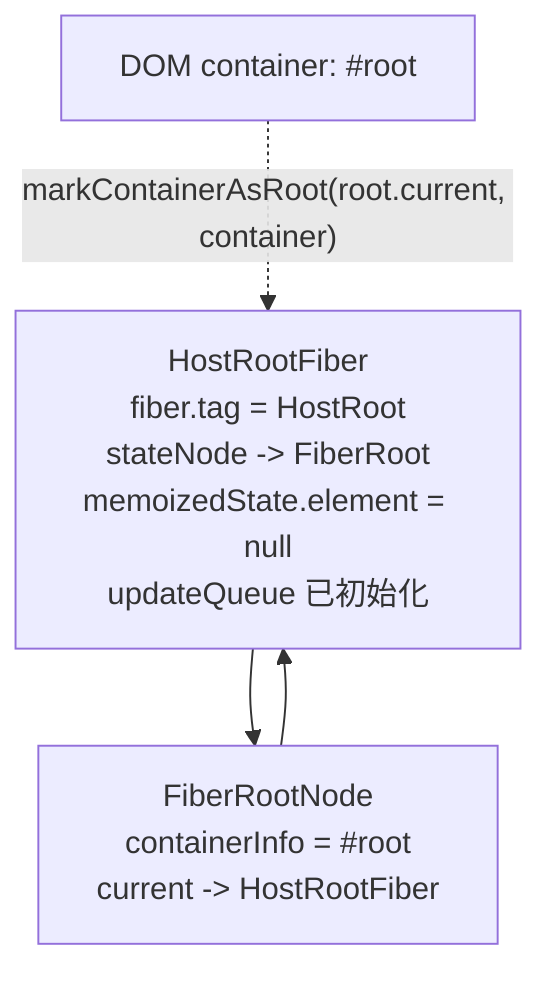
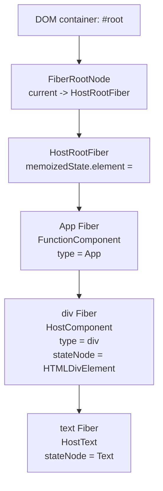
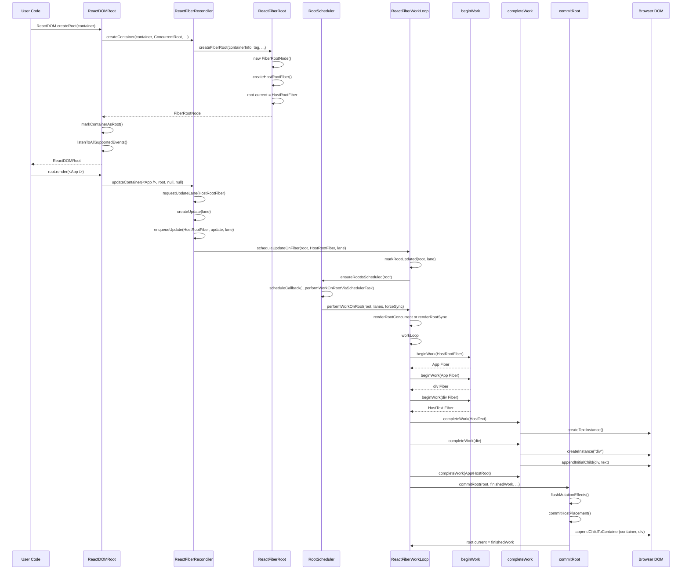

# React 首次渲染完整源码追踪

本文档基于当前本地 `react-main` 源码整理，追踪下面两行代码从入口到真实 DOM 插入页面的完整流程：

```jsx
const root = ReactDOM.createRoot(document.getElementById('root'));
root.render(<App />);
```

为了便于阅读，本文把首次渲染拆成五段：

1. 创建 Root：`createRoot -> createContainer -> createFiberRoot -> createHostRootFiber`
2. 发起更新：`root.render -> updateContainer -> createUpdate -> enqueueUpdate`
3. 进入调度：`scheduleUpdateOnFiber -> ensureRootIsScheduled -> performWorkOnRoot`
4. render 阶段：`renderRoot -> workLoop -> beginWork -> completeWork`
5. commit 阶段：`commitRoot -> mutation effects -> commitHostPlacement -> DOM append/insert`

> 说明：很多文章会把并发任务入口写成 `performConcurrentWorkOnRoot`。当前源码中对应的调度任务入口主要是 `performWorkOnRootViaSchedulerTask`，同步入口是 `performSyncWorkOnRoot`，二者最终都会进入 `performWorkOnRoot`。

## 一、涉及源码文件

| 文件 | 主要作用 |
| --- | --- |
| `packages/react-dom/client.js` | `react-dom/client` 包入口，导出 `createRoot` |
| `packages/react-dom/src/client/ReactDOMClient.js` | DOM client 入口聚合，注入 DevTools 并转发 `createRoot` |
| `packages/react-dom/src/client/ReactDOMRoot.js` | `createRoot` 与 `ReactDOMRoot.prototype.render` 实现 |
| `packages/react-dom-bindings/src/client/ReactDOMComponentTree.js` | DOM 节点与 Fiber 的缓存、container 标记 |
| `packages/react-reconciler/src/ReactFiberReconciler.js` | renderer 与 reconciler 的公开连接层，包含 `createContainer`、`updateContainer` |
| `packages/react-reconciler/src/ReactFiberRoot.js` | `FiberRootNode` 与 `createFiberRoot` |
| `packages/react-reconciler/src/ReactFiber.js` | `FiberNode`、`createHostRootFiber`、`createWorkInProgress` |
| `packages/react-reconciler/src/ReactFiberClassUpdateQueue.js` | root/class update 的 `createUpdate`、`enqueueUpdate`、`processUpdateQueue` |
| `packages/react-reconciler/src/ReactFiberLane.js` | lane 优先级模型，选择本次渲染 lanes |
| `packages/react-reconciler/src/ReactFiberRootScheduler.js` | root 级调度，包含 `ensureRootIsScheduled`、Scheduler callback |
| `packages/react-reconciler/src/ReactFiberWorkLoop.js` | render/commit 主流程，包含 `scheduleUpdateOnFiber`、`performWorkOnRoot`、`renderRootSync`、`renderRootConcurrent`、`commitRoot` |
| `packages/react-reconciler/src/ReactFiberBeginWork.js` | `beginWork`，向下生成或复用子 Fiber |
| `packages/react-reconciler/src/ReactChildFiber.js` | child reconciler，React Element 到 Fiber 的 diff/创建 |
| `packages/react-reconciler/src/ReactFiberCompleteWork.js` | `completeWork`，向上完成 Fiber，创建 DOM 实例并冒泡 flags |
| `packages/react-reconciler/src/ReactFiberCommitWork.js` | commit 阶段遍历 mutation/layout/passive effects |
| `packages/react-reconciler/src/ReactFiberCommitHostEffects.js` | commit 阶段 DOM 插入、删除、更新等 host effects |
| `packages/react-dom-bindings/src/client/ReactFiberConfigDOM.js` | React DOM host config，封装 `createElement`、`appendChild`、`insertBefore` 等真实 DOM API |

## 二、完整调用链总览

```text
ReactDOM.createRoot(container)
  -> ReactDOMRoot.js:createRoot
    -> createContainer(container, ConcurrentRoot, ...)
      -> ReactFiberReconciler.js:createContainer
        -> createFiberRoot(containerInfo, tag, ...)
          -> ReactFiberRoot.js:createFiberRoot
            -> new FiberRootNode(containerInfo, tag, ...)
            -> createHostRootFiber(tag, isStrictMode)
              -> ReactFiber.js:createHostRootFiber
                -> createFiber(HostRoot, null, null, mode)
            -> root.current = uninitializedFiber
            -> uninitializedFiber.stateNode = root
            -> initializeUpdateQueue(uninitializedFiber)
    -> markContainerAsRoot(root.current, container)
    -> listenToAllSupportedEvents(rootContainerElement)
    -> return new ReactDOMRoot(root)

root.render(<App />)
  -> ReactDOMRoot.prototype.render(children)
    -> updateContainer(children, root, null, null)
      -> requestUpdateLane(current)
      -> updateContainerImpl(current, lane, element, container, ...)
        -> createUpdate(lane)
        -> update.payload = {element}
        -> enqueueUpdate(rootFiber, update, lane)
        -> scheduleUpdateOnFiber(root, rootFiber, lane)
          -> markRootUpdated(root, lane)
          -> ensureRootIsScheduled(root)
            -> scheduleTaskForRootDuringMicrotask(root, now())
            -> scheduleCallback(priority, performWorkOnRootViaSchedulerTask)
              -> performWorkOnRootViaSchedulerTask(root)
                -> performWorkOnRoot(root, lanes, forceSync)
                  -> renderRootConcurrent(root, lanes)
                     或 renderRootSync(root, lanes, true)
                    -> prepareFreshStack(root, lanes)
                    -> workLoopConcurrent(...) 或 workLoopSync()
                      -> performUnitOfWork(workInProgress)
                        -> beginWork(current, workInProgress, lanes)
                        -> completeUnitOfWork(unitOfWork)
                          -> completeWork(current, completedWork, lanes)
                  -> commitRoot(root, finishedWork, ...)
                    -> flushMutationEffects()
                      -> commitMutationEffects(root, finishedWork, lanes)
                        -> commitHostPlacement(fiberWithPlacement)
                          -> commitPlacement(finishedWork)
                            -> appendChildToContainer(container, dom)
                               或 insertInContainerBefore(container, dom, before)
                    -> root.current = finishedWork
```

## 三、FiberRoot / RootFiber / App Fiber 关系图

首次渲染前，`createRoot(container)` 只创建根对象和 HostRootFiber，还没有 `App Fiber`。



`root.render(<App />)` 后，HostRootFiber 的 updateQueue 中会放入 `{element: <App />}`。render 阶段消费这个 update 后，才会产生 App Fiber 和它下面的 host fibers。



## 四、逐步追踪

### 1. createRoot

源码位置：

```text
packages/react-dom/src/client/ReactDOMRoot.js
```

`createRoot(container)` 做的事情：

| 步骤 | 说明 |
| --- | --- |
| 校验 container | 判断传入的 DOM 节点是否可以作为 React root 容器 |
| 读取 options | 处理 `unstable_strictMode`、错误回调、transition callbacks 等选项 |
| 创建内部 root | 调用 `createContainer(container, ConcurrentRoot, ...)` |
| 标记 container | `markContainerAsRoot(root.current, container)` 把 DOM container 和 HostRootFiber 关联起来 |
| 绑定事件 | `listenToAllSupportedEvents(rootContainerElement)` 在 root 容器上注册 React 事件系统需要的监听 |
| 返回外部 root | 返回 `new ReactDOMRoot(root)`，用户拿到的是包装对象 |

示例代码：

```jsx
const container = document.getElementById('root');
const root = ReactDOM.createRoot(container);
```

概念等价于：

```js
function createRoot(container) {
  const internalRoot = createContainer(container, ConcurrentRoot, ...);
  markContainerAsRoot(internalRoot.current, container);
  listenToAllSupportedEvents(container);
  return new ReactDOMRoot(internalRoot);
}
```

关键点：`root` 不是 FiberRoot 本身，而是 `ReactDOMRoot` 包装对象。真正的 FiberRoot 保存在 `root._internalRoot` 上。

### 2. createContainer

源码位置：

```text
packages/react-reconciler/src/ReactFiberReconciler.js
```

`createContainer` 是 React DOM renderer 调用 reconciler 的入口。React DOM 负责 DOM 宿主环境，reconciler 负责 Fiber 树和渲染调度。

示例代码：

```js
const root = createContainer(
  container,
  ConcurrentRoot,
  null,
  false,
  null,
  '',
  onUncaughtError,
  onCaughtError,
  onRecoverableError,
  transitionCallbacks,
);
```

作用：

| 参数 | 含义 |
| --- | --- |
| `containerInfo` | 真实 DOM container，例如 `#root` |
| `tag` | root 类型，`createRoot` 对应 `ConcurrentRoot` |
| `hydrate` | 是否走 hydration，普通首次渲染为 `false` |
| `identifierPrefix` | `useId` 等场景使用的前缀 |
| error callbacks | 错误处理回调 |
| transitionCallbacks | transition 相关回调 |

### 3. createFiberRoot

源码位置：

```text
packages/react-reconciler/src/ReactFiberRoot.js
```

`createFiberRoot` 创建的是整个 Fiber 树的根容器对象 `FiberRootNode`。

核心动作：

```js
const root = new FiberRootNode(containerInfo, tag, hydrate, identifierPrefix, ...);
const uninitializedFiber = createHostRootFiber(tag, isStrictMode);

root.current = uninitializedFiber;
uninitializedFiber.stateNode = root;

uninitializedFiber.memoizedState = {
  element: initialChildren,
  isDehydrated: hydrate,
  cache: initialCache,
};

initializeUpdateQueue(uninitializedFiber);
```

`FiberRootNode` 不是一个 Fiber，它是 Fiber 树外层的调度与状态容器。它记录：

| 字段 | 作用 |
| --- | --- |
| `containerInfo` | 指向真实 DOM container |
| `current` | 指向当前页面正在使用的 HostRootFiber |
| `pendingLanes` | root 上待处理的优先级集合 |
| `callbackNode` | Scheduler 中已注册的任务 |
| `callbackPriority` | 当前 Scheduler 任务优先级 |
| `finishedWork` | render 完成后等待 commit 的 Fiber 树 |

### 4. createHostRootFiber

源码位置：

```text
packages/react-reconciler/src/ReactFiber.js
```

`createHostRootFiber` 创建 Fiber 树中的根 Fiber，也就是 `HostRootFiber`。

示例代码：

```js
function createHostRootFiber(tag, isStrictMode) {
  let mode;
  if (disableLegacyMode || tag === ConcurrentRoot) {
    mode = ConcurrentMode;
    if (isStrictMode === true) {
      mode |= StrictLegacyMode | StrictEffectsMode;
    }
  } else {
    mode = NoMode;
  }

  return createFiber(HostRoot, null, null, mode);
}
```

关键关系：

| 对象 | 是否 Fiber | 说明 |
| --- | --- | --- |
| `FiberRootNode` | 否 | 整棵树的根容器，保存调度状态和 DOM container |
| `HostRootFiber` | 是 | Fiber 树的根节点，`tag = HostRoot` |
| `root.current` | 是 | 指向当前生效的 HostRootFiber |
| `HostRootFiber.stateNode` | 否 | 反向指向 FiberRootNode |

### 5. root.render

源码位置：

```text
packages/react-dom/src/client/ReactDOMRoot.js
```

`root.render(<App />)` 进入 `ReactDOMRoot.prototype.render`。

示例代码：

```js
ReactDOMRoot.prototype.render = function (children) {
  const root = this._internalRoot;
  if (root === null) {
    throw new Error('Cannot update an unmounted root.');
  }

  updateContainer(children, root, null, null);
};
```

这里的 `children` 就是 `<App />` 对应的 React Element：

```js
{
  $$typeof: Symbol(react.transitional.element),
  type: App,
  key: null,
  props: {}
}
```

首次渲染本质上不是直接创建 DOM，而是向 HostRootFiber 投递一次更新：这次更新的 payload 是“root 应该渲染的 element”。

### 6. updateContainer

源码位置：

```text
packages/react-reconciler/src/ReactFiberReconciler.js
```

`updateContainer` 做两件关键事：

| 步骤 | 说明 |
| --- | --- |
| 找到 current | `const current = container.current`，也就是 HostRootFiber |
| 申请 lane | `const lane = requestUpdateLane(current)`，决定这次更新的优先级 |

示例代码：

```js
export function updateContainer(element, container, parentComponent, callback) {
  const current = container.current;
  const lane = requestUpdateLane(current);
  updateContainerImpl(current, lane, element, container, parentComponent, callback);
  return lane;
}
```

对于 `createRoot` 创建的并发 root，首次 `root.render` 通常会按当前事件优先级申请 lane。lane 会决定这次更新如何被调度、是否能时间切片、何时被选择执行。

### 7. createUpdate

源码位置：

```text
packages/react-reconciler/src/ReactFiberClassUpdateQueue.js
```

`createUpdate(lane)` 创建一个 update 对象。

示例代码：

```js
const update = createUpdate(lane);
update.payload = {element};
```

update 的核心结构：

```js
{
  lane,
  tag: UpdateState,
  payload: {element: <App />},
  callback: null,
  next: null
}
```

首次渲染里，HostRootFiber 的 update payload 保存的是 root element。后续 `beginWork` 处理 HostRootFiber 时，会通过 `processUpdateQueue` 把这个 element 写入 `memoizedState.element`。

### 8. enqueueUpdate

源码位置：

```text
packages/react-reconciler/src/ReactFiberClassUpdateQueue.js
```

`enqueueUpdate(rootFiber, update, lane)` 把 update 放入 HostRootFiber 的 updateQueue。

概念示例：

```js
HostRootFiber.updateQueue = {
  baseState: {element: null, isDehydrated: false, cache},
  firstBaseUpdate: null,
  lastBaseUpdate: null,
  shared: {
    pending: update
  },
  callbacks: null
};
```

`enqueueUpdate` 返回 FiberRoot：

```js
const root = enqueueUpdate(rootFiber, update, lane);
```

为什么能返回 root？因为从任意 Fiber 可以沿 `return` 指针向上找到 HostRootFiber，再通过 `HostRootFiber.stateNode` 拿到 FiberRoot。

首次渲染时，更新挂在 HostRootFiber 上，因为这是整个应用树的入口更新。

### 9. scheduleUpdateOnFiber

源码位置：

```text
packages/react-reconciler/src/ReactFiberWorkLoop.js
```

`scheduleUpdateOnFiber(root, rootFiber, lane)` 把“某个 Fiber 上发生了更新”提升为“某个 root 上有某个 lane 的工作需要处理”。

核心动作：

```js
markRootUpdated(root, lane);
ensureRootIsScheduled(root);
```

作用表：

| 动作 | 说明 |
| --- | --- |
| `markRootUpdated(root, lane)` | 把 lane 标记到 root.pendingLanes，表示 root 有待处理任务 |
| 处理 render phase update | 如果更新发生在 render 阶段，会走特殊记录逻辑 |
| 处理 interleaved update | 并发渲染中穿插进来的更新需要单独记录 |
| `ensureRootIsScheduled(root)` | 确保 root 被放入 root scheduler，后续会被调度执行 |

到这里为止，React 还没有 render，也没有 DOM。它只是完成了“更新入队 + root 待调度”。

### 10. ensureRootIsScheduled

源码位置：

```text
packages/react-reconciler/src/ReactFiberRootScheduler.js
```

`ensureRootIsScheduled(root)` 负责把 root 加入调度链表，并确保有一个 microtask 会去处理 root schedule。

概念示例：

```js
function ensureRootIsScheduled(root) {
  if (root === lastScheduledRoot || root.next !== null) {
    // 已经在调度链表里
  } else {
    // 加入 root schedule 链表
  }

  mightHavePendingSyncWork = true;
  ensureScheduleIsScheduled();
}
```

后续 microtask 中，React 会调用 `scheduleTaskForRootDuringMicrotask(root, now())`，为 root 选择下一批 lanes，并根据优先级决定：

| lanes 类型 | 调度方式 |
| --- | --- |
| Sync lane | 不通过普通 Scheduler callback，稍后在 microtask 中同步 flush |
| 非同步 lanes | 调用 Scheduler 的 `scheduleCallback(priority, performWorkOnRootViaSchedulerTask)` |

### 11. performConcurrentWorkOnRoot 或 performSyncWorkOnRoot

当前源码里的入口关系更准确地说是：

| 常见说法 | 当前源码对应 |
| --- | --- |
| `performConcurrentWorkOnRoot` | `performWorkOnRootViaSchedulerTask(root)` |
| `performSyncWorkOnRoot` | `performSyncWorkOnRoot(root, lanes)` |
| 二者共同下游 | `performWorkOnRoot(root, lanes, forceSync)` |

源码位置：

```text
packages/react-reconciler/src/ReactFiberRootScheduler.js
packages/react-reconciler/src/ReactFiberWorkLoop.js
```

并发任务入口概念：

```js
function performWorkOnRootViaSchedulerTask(root) {
  const lanes = getNextLanes(root, ...);
  performWorkOnRoot(root, lanes, false);
  return scheduleTaskForRootDuringMicrotask(root, now());
}
```

同步任务入口概念：

```js
function performSyncWorkOnRoot(root, lanes) {
  performWorkOnRoot(root, lanes, true);
}
```

`performWorkOnRoot` 决定本次是同步 render 还是并发 render：

```js
const shouldTimeSlice =
  !forceSync &&
  !includesBlockingLane(lanes) &&
  !includesExpiredLane(root, lanes);

const exitStatus = shouldTimeSlice
  ? renderRootConcurrent(root, lanes)
  : renderRootSync(root, lanes, true);
```

### 12. renderRoot

源码位置：

```text
packages/react-reconciler/src/ReactFiberWorkLoop.js
```

当前源码没有一个统一名为 `renderRoot` 的单一入口，实际是：

| 函数 | 场景 |
| --- | --- |
| `renderRootSync(root, lanes, shouldYieldForPrerendering)` | 同步渲染，不主动让出主线程 |
| `renderRootConcurrent(root, lanes)` | 并发渲染，可以根据时间片让出主线程 |

首次渲染进入 render root 后，会先准备 workInProgress 树：

```js
prepareFreshStack(root, lanes);
```

`prepareFreshStack` 会基于 `root.current` 创建 workInProgress HostRootFiber：

```text
current HostRootFiber
  <-> alternate
workInProgress HostRootFiber
```

render 阶段真正操作的是 workInProgress 树。只有 commit 完成后，`root.current` 才会切换到 finishedWork。

### 13. workLoop

源码位置：

```text
packages/react-reconciler/src/ReactFiberWorkLoop.js
```

同步 work loop：

```js
function workLoopSync() {
  while (workInProgress !== null) {
    performUnitOfWork(workInProgress);
  }
}
```

并发 work loop：

```js
function workLoopConcurrent(nonIdle) {
  if (workInProgress !== null) {
    const yieldAfter = now() + (nonIdle ? 25 : 5);
    do {
      performUnitOfWork(workInProgress);
    } while (workInProgress !== null && now() < yieldAfter);
  }
}
```

差异：

| 对比项 | `workLoopSync` | `workLoopConcurrent` |
| --- | --- | --- |
| 是否让出主线程 | 不主动让出 | 时间片到期后让出 |
| 执行方式 | 一口气完成整棵树 | 分段执行，可恢复 |
| 典型场景 | sync lane、过期任务、flushSync | concurrent root 下可中断任务 |

### 14. beginWork

源码位置：

```text
packages/react-reconciler/src/ReactFiberBeginWork.js
```

`performUnitOfWork` 会先调用 `beginWork`：

```js
const current = unitOfWork.alternate;
const next = beginWork(current, unitOfWork, entangledRenderLanes);
```

`beginWork` 的核心职责是“向下走”，根据当前 Fiber 类型计算子节点。

首次渲染关键链路：

```text
beginWork(HostRootFiber)
  -> updateHostRoot
    -> cloneUpdateQueue
    -> processUpdateQueue
    -> nextState.element 得到 <App />
    -> reconcileChildren(current, workInProgress, nextChildren, renderLanes)
      -> 创建 App Fiber
    -> return workInProgress.child

beginWork(App Fiber)
  -> updateFunctionComponent
    -> renderWithHooks
      -> 执行 App()
      -> 得到 <div>Hello</div>
    -> reconcileChildren(...)
      -> 创建 div Fiber
    -> return workInProgress.child

beginWork(div Fiber)
  -> updateHostComponent
    -> reconcileChildren(...)
      -> 创建 HostText Fiber
    -> return workInProgress.child
```

示例组件：

```jsx
function App() {
  return <div className="app">Hello React</div>;
}
```

对应的首次 render Fiber 形态：

```text
HostRootFiber
  child -> App Fiber
    child -> div Fiber
      child -> HostText Fiber
```

`beginWork` 返回什么？

| 返回值 | 意义 |
| --- | --- |
| 子 Fiber | 继续向下处理子节点 |
| `null` | 当前 Fiber 没有子节点或子节点可复用，进入 complete 阶段 |

### 15. completeWork

源码位置：

```text
packages/react-reconciler/src/ReactFiberCompleteWork.js
```

当某个 Fiber 的子树都处理完，或者没有子节点时，会进入 `completeWork`。

`completeWork` 的职责是“向上收尾”：

| 职责 | 说明 |
| --- | --- |
| 创建 DOM | 对 `HostComponent` 调用 `createInstance` |
| 创建文本节点 | 对 `HostText` 调用 `createTextInstance` |
| 组装 DOM 子树 | `appendAllChildren(instance, workInProgress, ...)` |
| 保存 DOM 引用 | `workInProgress.stateNode = instance` |
| 标记 flags | 例如需要初始化属性、ref、更新等 |
| 冒泡 subtreeFlags | 把子树中的副作用冒泡给父 Fiber，方便 commit 快速判断 |

HostComponent mount 示例：

```js
case HostComponent: {
  const instance = createInstance(
    type,
    newProps,
    rootContainerInstance,
    currentHostContext,
    workInProgress,
  );

  appendAllChildren(instance, workInProgress, false, false);
  workInProgress.stateNode = instance;

  if (finalizeInitialChildren(instance, type, newProps, currentHostContext)) {
    markUpdate(workInProgress);
  }
}
```

HostText mount 示例：

```js
case HostText: {
  workInProgress.stateNode = createTextInstance(
    newText,
    rootContainerInstance,
    currentHostContext,
    workInProgress,
  );
}
```

对于下面组件：

```jsx
function App() {
  return <div className="app">Hello React</div>;
}
```

`completeWork` 的 DOM 创建顺序大致是：

```text
completeWork(HostText)
  -> createTextInstance("Hello React")

completeWork(div Fiber)
  -> createInstance("div", {className: "app", children: "Hello React"})
  -> appendAllChildren(div, div Fiber)
  -> div.appendChild(textNode)
  -> div Fiber.stateNode = div

completeWork(App Fiber)
  -> 函数组件本身没有 DOM，只冒泡 flags/subtreeFlags

completeWork(HostRootFiber)
  -> 完成整棵 workInProgress 树
```

注意：`completeWork` 创建的是离屏 DOM 子树。此时 `div` 和 `textNode` 已经在内存中建立父子关系，但还没有插入到页面的 `#root` 容器里。

### 16. commitRoot

源码位置：

```text
packages/react-reconciler/src/ReactFiberWorkLoop.js
packages/react-reconciler/src/ReactFiberCommitWork.js
packages/react-reconciler/src/ReactFiberCommitHostEffects.js
```

render 阶段完成后，React 得到 `finishedWork`。如果这棵树有 flags/subtreeFlags，就进入 commit：

```js
commitRoot(root, finishedWork, lanes, ...);
```

commit 阶段大致分为：

| 阶段 | 主要工作 | 是否可中断 |
| --- | --- | --- |
| before mutation | 读取 DOM 变更前快照，处理部分生命周期前置逻辑 | 不可中断 |
| mutation | 执行 DOM 插入、更新、删除，detach ref | 不可中断 |
| layout | 切换 current 后执行 layout effects、class layout 生命周期、attach ref | 不可中断 |
| passive | 调度并异步执行 `useEffect` | 不在同步 commit 主体内 |

首次渲染最关键的是 mutation 阶段：

```text
commitRoot
  -> flushMutationEffects
    -> commitMutationEffects(root, finishedWork, lanes)
      -> commitMutationEffectsOnFiber(...)
        -> 发现 Placement flag
        -> commitHostPlacement(finishedWork)
```

current 树切换发生在 mutation 之后、layout 之前：

```js
root.current = finishedWork;
```

为什么这样安排？因为 mutation 阶段要根据旧树和新树执行 DOM 操作；layout 阶段中的生命周期和 `useLayoutEffect` 应该看到已经更新后的 DOM 和新的 current 树。

### 17. DOM 插入

源码位置：

```text
packages/react-reconciler/src/ReactFiberCommitHostEffects.js
packages/react-dom-bindings/src/client/ReactFiberConfigDOM.js
```

DOM 插入调用链：

```text
commitMutationEffects
  -> commitMutationEffectsOnFiber
    -> commitHostPlacement(finishedWork)
      -> commitPlacement(finishedWork)
        -> 向上查找 host parent
          -> HostRoot: parent = hostParentFiber.stateNode.containerInfo
          -> HostComponent: parent = hostParentFiber.stateNode
        -> getHostSibling(finishedWork)
        -> insertOrAppendPlacementNodeIntoContainer(...)
          -> appendChildToContainer(container, child)
             或 insertInContainerBefore(container, child, before)
```

`commitPlacement` 会先向上找最近的 host parent：

| host parent Fiber | parent 来源 | DOM 操作 |
| --- | --- | --- |
| `HostRoot` | `hostParentFiber.stateNode.containerInfo` | 插入 root container |
| `HostComponent` | `hostParentFiber.stateNode` | 插入某个 DOM 元素 |
| `HostPortal` | `hostParentFiber.stateNode.containerInfo` | 插入 portal container |

对于首次渲染：

```jsx
root.render(<App />);
```

假设 `App` 返回：

```jsx
function App() {
  return <div className="app">Hello React</div>;
}
```

最终 DOM 插入路径是：

```text
commitHostPlacement(App Fiber 或 div Fiber)
  -> 找到最近 host parent: HostRootFiber
  -> parent = FiberRootNode.containerInfo = document.getElementById('root')
  -> 找到要插入的 host 节点: div.stateNode
  -> appendChildToContainer(container, div)
  -> container.appendChild(div)
```

React DOM host config 中真实调用浏览器 API：

```js
export function appendChildToContainer(container, child) {
  let parentNode;

  if (container.nodeType === DOCUMENT_NODE) {
    parentNode = container.body;
  } else if (container.nodeName === 'HTML') {
    parentNode = container.ownerDocument.body;
  } else {
    parentNode = container;
  }

  parentNode.appendChild(child);
}
```

至此，真实 DOM 才被插入页面。

## 五、Mermaid 时序图



## 六、每一步作用速查表

| 步骤 | 核心函数 | 作用 | 输出 |
| --- | --- | --- | --- |
| 1 | `createRoot` | 创建 ReactDOMRoot 包装对象 | `ReactDOMRoot` |
| 2 | `createContainer` | 进入 reconciler，创建内部容器 | `FiberRootNode` |
| 3 | `createFiberRoot` | 创建 FiberRootNode 和 HostRootFiber | root 与 root.current |
| 4 | `createHostRootFiber` | 创建 Fiber 树根节点 | `HostRootFiber` |
| 5 | `root.render` | 把 `<App />` 作为 children 传入 reconciler | React Element |
| 6 | `updateContainer` | 获取 HostRootFiber，申请 lane | `lane` |
| 7 | `createUpdate` | 创建 root update | update 对象 |
| 8 | `enqueueUpdate` | update 入 HostRootFiber.updateQueue | root |
| 9 | `scheduleUpdateOnFiber` | 标记 root 有更新 | root.pendingLanes |
| 10 | `ensureRootIsScheduled` | 确保 root 被调度 | Scheduler task 或 sync flush |
| 11 | `performWorkOnRootViaSchedulerTask` / `performSyncWorkOnRoot` | 执行 root work 入口 | 进入 performWorkOnRoot |
| 12 | `renderRootConcurrent` / `renderRootSync` | 准备并执行 render 阶段 | finishedWork |
| 13 | `workLoopConcurrent` / `workLoopSync` | 遍历 workInProgress Fiber 树 | 每个 Fiber 被处理 |
| 14 | `beginWork` | 向下计算子 Fiber | child Fiber 或 null |
| 15 | `completeWork` | 向上创建 DOM、冒泡 flags | DOM 实例、flags |
| 16 | `commitRoot` | 提交 finishedWork | DOM mutation、effects |
| 17 | `appendChildToContainer` / `insertInContainerBefore` | 调用浏览器 DOM API 插入节点 | 页面出现真实 DOM |

## 七、关键数据流

### React Element 流向 Fiber

```text
<App />
  -> React Element
  -> update.payload = {element: <App />}
  -> HostRootFiber.updateQueue
  -> processUpdateQueue
  -> HostRootFiber.memoizedState.element
  -> reconcileChildren
  -> App Fiber
```

### Fiber 流向 DOM

```text
App Fiber
  -> beginWork 执行 App()
  -> 得到 <div>Hello React</div>
  -> reconcileChildren 创建 div Fiber / HostText Fiber
  -> completeWork 创建 HTMLDivElement / Text
  -> commitHostPlacement 插入 DOM container
```

### lane 流向调度

```text
requestUpdateLane(current)
  -> lane
  -> createUpdate(lane)
  -> enqueueUpdate(...)
  -> markRootUpdated(root, lane)
  -> root.pendingLanes 包含 lane
  -> getNextLanes(root, ...)
  -> lanes
  -> performWorkOnRoot(root, lanes, forceSync)
```

## 八、首次渲染示例拆解

用户代码：

```jsx
function App() {
  return <div className="app">Hello React</div>;
}

const root = ReactDOM.createRoot(document.getElementById('root'));
root.render(<App />);
```

JSX 编译后的核心形态：

```js
root.render(
  jsx(App, {})
);
```

root update payload：

```js
{
  element: {
    $$typeof: Symbol(react.transitional.element),
    type: App,
    key: null,
    props: {}
  }
}
```

render 阶段 Fiber 树：

```text
HostRoot
  -> FunctionComponent(App)
    -> HostComponent(div)
      -> HostText("Hello React")
```

complete 阶段 DOM 子树：

```html
<div class="app">
  Hello React
</div>
```

commit 阶段最终插入：

```js
document.getElementById('root').appendChild(div);
```

## 九、首次渲染中的几个容易混淆点

### 1. `createRoot` 不会立刻渲染 App

`createRoot(container)` 只创建 root、HostRootFiber、事件监听和 container 标记。真正把 `<App />` 放进流程的是 `root.render(<App />)`。

### 2. `root.render` 也不是直接创建 DOM

`root.render` 创建的是一次 root update：

```js
update.payload = {element: <App />};
```

DOM 创建发生在后面的 `completeWork`，DOM 插入发生在 `commitRoot` 的 mutation 阶段。

### 3. DOM 创建和 DOM 插入不是同一步

| 阶段 | 做什么 |
| --- | --- |
| `completeWork` | `document.createElement`、`document.createTextNode`，创建离屏 DOM |
| `commitRoot` mutation | `appendChild`、`insertBefore`，把 DOM 插入页面 |

这种拆分使 render 阶段可以构建一棵完整的 workInProgress 树，commit 阶段再一次性提交，避免用户看到半成品 UI。

### 4. current 树在 commit 期间才切换

render 阶段完成后得到 `finishedWork`，但页面当前树还是旧的 `root.current`。commit 的 mutation 阶段执行 DOM 变更后，React 执行：

```js
root.current = finishedWork;
```

这一步完成后，新 Fiber 树成为 current 树。

### 5. 首次渲染也走 updateQueue

首次渲染不是特殊地“直接挂载 App”，它也是一次 HostRootFiber update。只是这次 update 的 payload 是整个应用的根 element。

## 十、阅读建议

建议按照这个顺序阅读源码：

| 顺序 | 文件 | 重点 |
| --- | --- | --- |
| 1 | `ReactDOMRoot.js` | `createRoot` 和 `root.render` 入口 |
| 2 | `ReactFiberReconciler.js` | `createContainer`、`updateContainer`、`updateContainerImpl` |
| 3 | `ReactFiberRoot.js` | `FiberRootNode` 和 `createFiberRoot` |
| 4 | `ReactFiber.js` | `FiberNode`、`createHostRootFiber`、`createWorkInProgress` |
| 5 | `ReactFiberClassUpdateQueue.js` | root update 的创建、入队和消费 |
| 6 | `ReactFiberWorkLoop.js` | `scheduleUpdateOnFiber`、`performWorkOnRoot`、render/commit 主流程 |
| 7 | `ReactFiberRootScheduler.js` | root 调度与 Scheduler callback |
| 8 | `ReactFiberBeginWork.js` | `HostRoot`、`FunctionComponent`、`HostComponent` 的 beginWork |
| 9 | `ReactChildFiber.js` | React Element 如何变成 Fiber |
| 10 | `ReactFiberCompleteWork.js` | DOM 如何创建，flags 如何冒泡 |
| 11 | `ReactFiberCommitWork.js` | commit mutation/layout/passive 遍历 |
| 12 | `ReactFiberCommitHostEffects.js` | `Placement` 如何变成 DOM 插入 |
| 13 | `ReactFiberConfigDOM.js` | 最终调用浏览器 DOM API 的位置 |

## 十一、总结

首次渲染可以浓缩成一句话：

```text
createRoot 创建 FiberRoot 和 HostRootFiber；
root.render 把 <App /> 包装成 HostRoot update；
调度系统选择 lanes 并执行 render；
beginWork 把 React Element 展开成 Fiber 树；
completeWork 创建离屏 DOM；
commitRoot 消费 Placement flags，把 DOM 插入 container；
最后 root.current 切换到新 Fiber 树。
```

最核心的主线是：

```text
React Element
  -> Update
  -> UpdateQueue
  -> Fiber Tree
  -> DOM Instance
  -> DOM Container
```

理解这条主线后，再去看后续的状态更新、diff、lane、scheduler、commit effects，就会发现它们都是在这条主线上扩展出来的机制。
