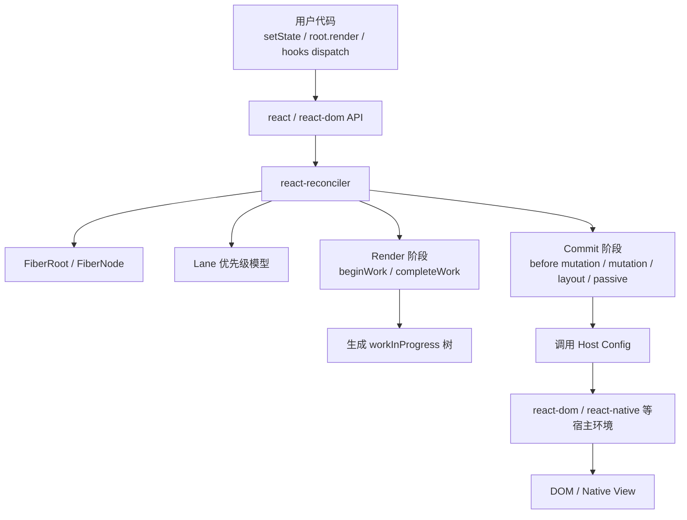
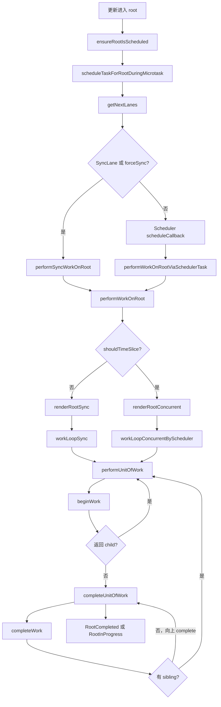
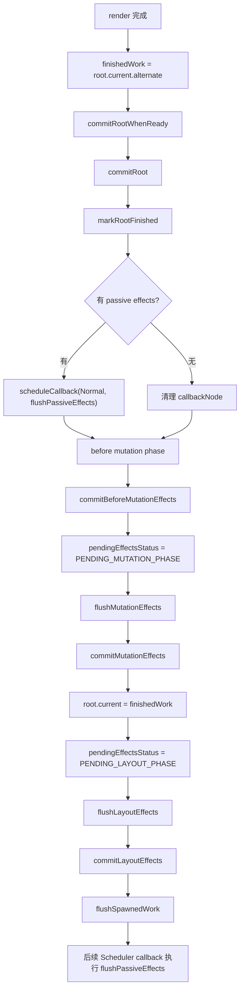

# React Reconciler 源码流程分析

本文基于当前 `react-main` 源码，系统梳理 `react-reconciler` 在 React 架构中的位置，以及一次更新如何经过调度、render 阶段、`beginWork` / `completeWork`、commit 阶段，最终把变化提交到宿主环境。

需要先说明一个当前源码版本差异：

```text
很多旧文章会提到 performConcurrentWorkOnRoot。

但当前 react-main 源码中没有这个函数名。
当前并发 Scheduler 入口是：
  performWorkOnRootViaSchedulerTask(root, didTimeout)

它承担的角色基本对应旧语境中的 performConcurrentWorkOnRoot：
  - 由 Scheduler callback 触发
  - 选择 next lanes
  - 调用 performWorkOnRoot
  - 如果还有未完成工作，返回 continuation
```

对应的同步入口仍然是：

```text
performSyncWorkOnRoot(root, lanes)
```

## 一、Reconciler 在 React 架构中的位置

React 可以粗略分成三层：

```text
react
  提供组件模型与公共 API：
  createElement、Component、useState、useEffect 等

react-reconciler
  核心协调层：
  Fiber 树、更新队列、lane 优先级、render 阶段、commit 阶段

renderer
  宿主渲染器：
  react-dom、react-native-renderer、react-noop-renderer 等
```

`react-reconciler` 位于中间层。它不直接绑定 DOM，也不直接关心浏览器节点如何创建。它通过 `ReactFiberConfig` 调用宿主环境提供的能力。

例如在 DOM 渲染器里：

```text
react-dom
  -> 调用 reconciler 的 createContainer / updateContainer
  -> reconciler 构建和协调 Fiber 树
  -> completeWork / commit 阶段通过 ReactFiberConfig.dom 调用 DOM 操作
```

总体架构图：



## 二、react-reconciler 包负责什么？

`react-reconciler` 是 React 的核心协调引擎，主要负责：

| 职责 | 说明 | 关键源码 |
| --- | --- | --- |
| Root 创建 | 创建 `FiberRoot` 和 `HostRootFiber` | `ReactFiberReconciler.js`、`ReactFiberRoot.js` |
| 更新入口 | `updateContainer`、class/hook update 入队后调度 root | `ReactFiberReconciler.js`、`ReactFiberClassComponent.js`、`ReactFiberHooks.js` |
| 优先级模型 | 使用 lane 表示更新优先级和批次 | `ReactFiberLane.js` |
| Root 调度 | 根据 root pending lanes 选择同步或 Scheduler callback | `ReactFiberRootScheduler.js` |
| Render work loop | 构建 workInProgress 树，可同步或并发执行 | `ReactFiberWorkLoop.js` |
| begin 阶段 | 处理组件、计算子 React Elements、生成/复用子 Fiber | `ReactFiberBeginWork.js`、`ReactChildFiber.js` |
| complete 阶段 | 创建/更新宿主实例，收集 flags 和 subtreeFlags | `ReactFiberCompleteWork.js` |
| Commit 阶段 | 把 finishedWork 提交为 current，并执行宿主变更和生命周期/effects | `ReactFiberWorkLoop.js`、`ReactFiberCommitWork.js`、`ReactFiberCommitEffects.js` |
| 宿主适配 | 抽象 DOM、Native、Noop 等不同 renderer 的差异 | `ReactFiberConfig.js`、`forks/ReactFiberConfig.*.js` |

一个关键边界：

```text
reconciler 决定“应该变成什么”。
renderer / host config 决定“如何具体操作宿主环境”。
```

## 三、关键源码文件说明

| 文件 | 作用 |
| --- | --- |
| `packages/react-reconciler/src/ReactFiberReconciler.js` | 对 renderer 暴露的入口，如 `createContainer`、`updateContainer` |
| `packages/react-reconciler/src/ReactFiberRoot.js` | 创建 `FiberRoot` 与根 Fiber |
| `packages/react-reconciler/src/ReactFiber.js` | `FiberNode` 数据结构与 workInProgress 克隆 |
| `packages/react-reconciler/src/ReactFiberRootScheduler.js` | root 级调度，决定同步 flush 或 Scheduler callback |
| `packages/react-reconciler/src/ReactFiberWorkLoop.js` | render / commit 主流程，`performWorkOnRoot`、`renderRootSync`、`renderRootConcurrent` |
| `packages/react-reconciler/src/ReactFiberBeginWork.js` | `beginWork`，处理不同 Fiber tag 的 begin 阶段逻辑 |
| `packages/react-reconciler/src/ReactFiberCompleteWork.js` | `completeWork`，处理 complete 阶段，创建宿主实例、冒泡 flags |
| `packages/react-reconciler/src/ReactChildFiber.js` | 子节点协调和 diff，比如数组、文本、Fragment、Portal 等 |
| `packages/react-reconciler/src/ReactFiberCommitWork.js` | commit mutation/layout/passive effects 的具体遍历和执行 |
| `packages/react-reconciler/src/ReactFiberCommitEffects.js` | effect list、class callback、hooks effect 的执行辅助 |
| `packages/react-reconciler/src/ReactFiberLane.js` | lane 位图、合并、选择、过期等逻辑 |
| `packages/react-reconciler/src/Scheduler.js` | reconciler 对 `scheduler` 包的包装 |
| `packages/react-reconciler/src/forks/ReactFiberConfig.dom.js` | DOM renderer 的 host config 实现 |

## 四、一次更新从入口到 Reconciler

以：

```jsx
root.render(<App />);
```

为例，入口最终进入 reconciler 的：

```text
updateContainer(element, container, parentComponent, callback)
```

源码位置：

```text
packages/react-reconciler/src/ReactFiberReconciler.js
```

关键流程：

```text
updateContainer(element, container, parentComponent, callback)
  -> current = container.current
  -> lane = requestUpdateLane(current)
  -> updateContainerImpl(...)
```

`updateContainerImpl` 会：

```text
创建 update
  -> update.payload = {element}
  -> enqueueUpdate(rootFiber, update, lane)
  -> scheduleUpdateOnFiber(root, rootFiber, lane)
```

简化代码：

```js
const current = container.current;
const lane = requestUpdateLane(current);

const update = createUpdate(lane);
update.payload = {element};

const root = enqueueUpdate(rootFiber, update, lane);
scheduleUpdateOnFiber(root, rootFiber, lane);
```

class `setState` 和 hooks dispatch 也是类似路径：

```text
创建 update
  -> enqueue update
  -> 找到 root
  -> scheduleUpdateOnFiber
  -> ensureRootIsScheduled
```

## 五、render 阶段和 commit 阶段如何划分？

React 更新分两大阶段：

| 阶段 | 主要目标 | 是否可中断 | 是否操作宿主环境 |
| --- | --- | --- | --- |
| render 阶段 | 计算新的 Fiber 树，找出变更 flags | 可以，在并发渲染中可中断 | 通常不直接提交宿主变更 |
| commit 阶段 | 把 finishedWork 提交到宿主环境，执行 effects/lifecycle | 不可中断，主体同步执行 | 会操作 DOM/Native 等宿主环境 |

render 阶段主要产物：

```text
workInProgress 树
flags / subtreeFlags
memoizedProps / memoizedState
updateQueue
deletions
```

commit 阶段主要动作：

```text
before mutation:
  读取 DOM 变更前状态，例如 getSnapshotBeforeUpdate

mutation:
  插入、删除、更新宿主节点
  ref detach

layout:
  class componentDidMount / componentDidUpdate
  useLayoutEffect
  ref attach

passive:
  useEffect，通常通过 Scheduler callback 异步 flush
```

## 六、Root 调度：同步入口与并发入口

源码位置：

```text
packages/react-reconciler/src/ReactFiberRootScheduler.js
```

更新进入 root 后会调用：

```text
ensureRootIsScheduled(root)
  -> ensureScheduleIsScheduled()
  -> processRootScheduleInMicrotask / immediate task
  -> scheduleTaskForRootDuringMicrotask(root, currentTime)
```

`scheduleTaskForRootDuringMicrotask` 做几件事：

```text
markStarvedLanesAsExpired(root, currentTime)
nextLanes = getNextLanes(root, ...)
如果没有 nextLanes：清理 callbackNode
如果包含 SyncLane 且不需要 prerender：不安排 Scheduler callback，等待 microtask 末尾同步 flush
否则：
  lanesToEventPriority(nextLanes)
  映射到 Scheduler priority
  scheduleCallback(priority, performWorkOnRootViaSchedulerTask.bind(null, root))
```

并发入口：

```text
performWorkOnRootViaSchedulerTask(root, didTimeout)
```

同步入口：

```text
performSyncWorkOnRoot(root, lanes)
```

## 七、performWorkOnRootViaSchedulerTask / performSyncWorkOnRoot 做了什么？

### 1. performWorkOnRootViaSchedulerTask

当前源码中的并发 Scheduler 入口：

```text
packages/react-reconciler/src/ReactFiberRootScheduler.js
```

调用链：

```text
Scheduler 执行 callback
  -> performWorkOnRootViaSchedulerTask(root, didTimeout)
  -> 如果 commit 正在进行，跳过
  -> flushPendingEffectsDelayed()
  -> lanes = getNextLanes(root, ...)
  -> forceSync = didTimeout
  -> performWorkOnRoot(root, lanes, forceSync)
  -> scheduleTaskForRootDuringMicrotask(root, now())
  -> 如果仍是同一个 callbackNode，返回 continuation
```

简化源码：

```js
function performWorkOnRootViaSchedulerTask(root, didTimeout) {
  if (hasPendingCommitEffects()) {
    root.callbackNode = null;
    root.callbackPriority = NoLane;
    return null;
  }

  const originalCallbackNode = root.callbackNode;
  const didFlushPassiveEffects = flushPendingEffectsDelayed();
  if (didFlushPassiveEffects && root.callbackNode !== originalCallbackNode) {
    return null;
  }

  const lanes = getNextLanes(root, ...);
  if (lanes === NoLanes) {
    return null;
  }

  const forceSync = didTimeout;
  performWorkOnRoot(root, lanes, forceSync);

  scheduleTaskForRootDuringMicrotask(root, now());
  if (root.callbackNode === originalCallbackNode) {
    return performWorkOnRootViaSchedulerTask.bind(null, root);
  }
  return null;
}
```

它的重点：

| 动作 | 含义 |
| --- | --- |
| `flushPendingEffectsDelayed` | render 前先处理可能影响新调度的 passive effects |
| `getNextLanes` | 从 root 上选出下一批要工作的 lanes |
| `didTimeout -> forceSync` | Scheduler 认为任务超时时，React 可选择同步推进 |
| 返回 continuation | 如果当前任务没做完，同一个 Scheduler task 下次继续 |

### 2. performSyncWorkOnRoot

同步入口：

```js
function performSyncWorkOnRoot(root, lanes) {
  const didFlushPassiveEffects = flushPendingEffects();
  if (didFlushPassiveEffects) {
    return null;
  }
  const forceSync = true;
  performWorkOnRoot(root, lanes, forceSync);
}
```

它不会通过 Scheduler 时间切片，而是直接：

```text
flush passive effects
  -> performWorkOnRoot(root, lanes, true)
  -> 通常进入 renderRootSync
```

## 八、performWorkOnRoot 做了什么？

源码位置：

```text
packages/react-reconciler/src/ReactFiberWorkLoop.js
```

`performWorkOnRoot` 是同步和并发入口汇合后的核心函数。

核心流程：

```text
performWorkOnRoot(root, lanes, forceSync)
  -> 防止 render/commit 重入
  -> 根据 lanes 和 forceSync 判断 shouldTimeSlice
  -> shouldTimeSlice ? renderRootConcurrent : renderRootSync
  -> 如果 render 还没完成：yield，等待后续 continuation
  -> 如果 render 完成：
       检查 external store 一致性
       处理错误重试 / Suspense / ping 等情况
       进入 commitRootWhenReady / commitRoot
```

决定同步还是并发的关键：

```js
const shouldTimeSlice =
  (!forceSync &&
    !includesBlockingLane(lanes) &&
    !includesExpiredLane(root, lanes)) ||
  checkIfRootIsPrerendering(root, lanes);

let exitStatus = shouldTimeSlice
  ? renderRootConcurrent(root, lanes)
  : renderRootSync(root, lanes, true);
```

含义：

| 条件 | 影响 |
| --- | --- |
| `forceSync` | true 时倾向同步渲染 |
| `includesBlockingLane(lanes)` | 阻塞型 lane 不走时间切片 |
| `includesExpiredLane(root, lanes)` | 已过期任务不再让出，避免饥饿 |
| prerendering | 即使某些同步 lane，也可能用 concurrent work loop，避免阻塞主线程 |

## 九、renderRootSync 做了什么？

源码位置：

```text
packages/react-reconciler/src/ReactFiberWorkLoop.js
```

调用链：

```text
renderRootSync(root, lanes, shouldYieldForPrerendering)
  -> executionContext |= RenderContext
  -> pushDispatcher / pushAsyncDispatcher
  -> 如果 root 或 lanes 变化：prepareFreshStack(root, lanes)
  -> 循环处理 Suspense/Error unwind
  -> workLoopSync()
  -> 完成后清理上下文
  -> 如果 workInProgress === null：
       workInProgressRoot = null
       workInProgressRootRenderLanes = NoLanes
       finishQueueingConcurrentUpdates()
  -> return exitStatus
```

`renderRootSync` 的核心特点：

```text
同步 render 不会在每个 Fiber 之间检查 shouldYield。
只要进入 workLoopSync，就会一直 performUnitOfWork 到 workInProgress 为 null。
```

简化代码：

```js
function renderRootSync(root, lanes) {
  executionContext |= RenderContext;

  if (workInProgressRoot !== root || workInProgressRootRenderLanes !== lanes) {
    prepareFreshStack(root, lanes);
  }

  workLoopSync();

  if (workInProgress === null) {
    workInProgressRoot = null;
    workInProgressRootRenderLanes = NoLanes;
    finishQueueingConcurrentUpdates();
  }

  return workInProgressRootExitStatus;
}
```

## 十、renderRootConcurrent 做了什么？

源码位置：

```text
packages/react-reconciler/src/ReactFiberWorkLoop.js
```

调用链：

```text
renderRootConcurrent(root, lanes)
  -> executionContext |= RenderContext
  -> pushDispatcher / pushAsyncDispatcher
  -> 如果 root 或 lanes 变化：prepareFreshStack(root, lanes)
  -> 否则复用已有 workInProgress，继续上次中断的位置
  -> 处理 Suspense/Error 等恢复逻辑
  -> workLoopConcurrentByScheduler() 或 workLoopConcurrent()
  -> 如果 workInProgress !== null：
       return RootInProgress
  -> 否则：
       workInProgressRoot = null
       workInProgressRootRenderLanes = NoLanes
       finishQueueingConcurrentUpdates()
       return workInProgressRootExitStatus
```

简化代码：

```js
function renderRootConcurrent(root, lanes) {
  executionContext |= RenderContext;

  if (workInProgressRoot !== root || workInProgressRootRenderLanes !== lanes) {
    resetRenderTimer();
    prepareFreshStack(root, lanes);
  } else {
    // continuation: 继续上次未完成的 workInProgress
  }

  workLoopConcurrentByScheduler();

  if (workInProgress !== null) {
    return RootInProgress;
  }

  workInProgressRoot = null;
  workInProgressRootRenderLanes = NoLanes;
  finishQueueingConcurrentUpdates();
  return workInProgressRootExitStatus;
}
```

它和同步渲染最大的区别：

```text
如果 Scheduler.shouldYield() 返回 true，
workLoopConcurrentByScheduler 会停下，
renderRootConcurrent 返回 RootInProgress，
保留当前 workInProgress，
下次 Scheduler continuation 继续。
```

## 十一、workLoopSync / workLoopConcurrent 的区别是什么？

源码位置：

```text
packages/react-reconciler/src/ReactFiberWorkLoop.js
```

同步 work loop：

```js
function workLoopSync() {
  while (workInProgress !== null) {
    performUnitOfWork(workInProgress);
  }
}
```

并发 work loop 主要有两个版本。

默认 Scheduler 版本：

```js
function workLoopConcurrentByScheduler() {
  while (workInProgress !== null && !shouldYield()) {
    performUnitOfWork(workInProgress);
  }
}
```

节流版本：

```js
function workLoopConcurrent(nonIdle) {
  const yieldAfter = now() + (nonIdle ? 25 : 5);
  do {
    performUnitOfWork(workInProgress);
  } while (workInProgress !== null && now() < yieldAfter);
}
```

对比表：

| 对比项 | `workLoopSync` | `workLoopConcurrentByScheduler` | `workLoopConcurrent` |
| --- | --- | --- | --- |
| 是否检查让出 | 不检查 | 检查 `Scheduler.shouldYield()` | 检查 `now() < yieldAfter` |
| 是否可中断 | 基本不可中断 | 可在 Fiber unit 之间中断 | 可在时间窗口结束后中断 |
| 典型场景 | sync lane、过期任务、forceSync | 默认并发渲染 | `enableThrottledScheduling` 开启时 |
| 循环终止条件 | `workInProgress === null` | `workInProgress === null` 或 `shouldYield()` | `workInProgress === null` 或时间到 |
| 结果 | 一次完成 render 或抛出/挂起 | 可返回 `RootInProgress` | 可返回 `RootInProgress` |

## 十二、performUnitOfWork 如何处理一个 Fiber？

源码位置：

```text
packages/react-reconciler/src/ReactFiberWorkLoop.js
```

核心源码：

```js
function performUnitOfWork(unitOfWork) {
  const current = unitOfWork.alternate;

  const next = beginWork(current, unitOfWork, entangledRenderLanes);

  unitOfWork.memoizedProps = unitOfWork.pendingProps;

  if (next === null) {
    completeUnitOfWork(unitOfWork);
  } else {
    workInProgress = next;
  }
}
```

这就是 Fiber work loop 的最小执行单元。

它有两种结果：

| `beginWork` 返回值 | 下一步 |
| --- | --- |
| 返回子 Fiber | `workInProgress = next`，向下进入子节点 |
| 返回 `null` | 当前节点没有子节点或无需向下，进入 `completeUnitOfWork` |

Fiber 遍历顺序可以理解成深度优先：

```text
begin A
  begin B
    begin D
    complete D
  complete B
  begin C
  complete C
complete A
```

示例组件：

```jsx
function App() {
  return (
    <main>
      <Title />
      <Counter />
    </main>
  );
}
```

大致 Fiber 处理顺序：

```text
begin App
  -> 运行 App，得到 <main>...
begin main
begin Title
  -> 运行 Title
complete Title
begin Counter
  -> 运行 Counter，处理 hooks
complete Counter
complete main
complete App
```

## 十三、completeUnitOfWork 如何向上完成？

源码位置：

```text
packages/react-reconciler/src/ReactFiberWorkLoop.js
```

当一个 Fiber 没有子节点可继续时，会进入：

```text
completeUnitOfWork(unitOfWork)
```

核心流程：

```text
completedWork = unitOfWork
do:
  如果 completedWork 是 Incomplete：
    unwindUnitOfWork
    return

  current = completedWork.alternate
  next = completeWork(current, completedWork, entangledRenderLanes)

  如果 completeWork 产生新 work：
    workInProgress = next
    return

  如果有 sibling：
    workInProgress = sibling
    return

  否则：
    completedWork = returnFiber
    workInProgress = completedWork
while completedWork !== null

到达 root：
  workInProgressRootExitStatus = RootCompleted
```

这个过程负责：

```text
完成当前节点
  -> 如果有兄弟，转向兄弟
  -> 如果没兄弟，向父节点冒泡
  -> 直到 HostRoot 完成
```

## 十四、beginWork 负责什么？

源码位置：

```text
packages/react-reconciler/src/ReactFiberBeginWork.js
```

`beginWork` 是 render 阶段的“向下”过程。

核心职责：

| 职责 | 说明 |
| --- | --- |
| 判断是否需要更新 | 比较 props/context/lane，没变化可 bailout |
| 清理当前 Fiber 的 lanes | `workInProgress.lanes = NoLanes` |
| 按 Fiber tag 分派 | FunctionComponent、ClassComponent、HostRoot、HostComponent、Suspense 等 |
| 执行组件逻辑 | 函数组件调用 `renderWithHooks`，类组件调用生命周期和 `render` |
| 计算 nextChildren | 得到新的 React Element children |
| reconcile children | 调用 `reconcileChildren`，生成或复用子 Fiber |
| 返回下一个 Fiber | 通常返回 `workInProgress.child` |

简化源码结构：

```js
function beginWork(current, workInProgress, renderLanes) {
  if (current !== null) {
    if (oldProps !== newProps || hasLegacyContextChanged()) {
      didReceiveUpdate = true;
    } else {
      const hasScheduledUpdateOrContext =
        checkScheduledUpdateOrContext(current, renderLanes);

      if (!hasScheduledUpdateOrContext) {
        return attemptEarlyBailoutIfNoScheduledUpdate(
          current,
          workInProgress,
          renderLanes,
        );
      }
    }
  }

  workInProgress.lanes = NoLanes;

  switch (workInProgress.tag) {
    case FunctionComponent:
      return updateFunctionComponent(...);
    case ClassComponent:
      return updateClassComponent(...);
    case HostRoot:
      return updateHostRoot(...);
    case HostComponent:
      return updateHostComponent(...);
  }
}
```

### reconcileChildren

源码位置：

```text
packages/react-reconciler/src/ReactFiberBeginWork.js
packages/react-reconciler/src/ReactChildFiber.js
```

`reconcileChildren` 的作用：

```text
根据组件 render 出来的 nextChildren，
和 current.child 对比，
生成 workInProgress.child 链表。
```

首次挂载：

```js
workInProgress.child = mountChildFibers(
  workInProgress,
  null,
  nextChildren,
  renderLanes,
);
```

更新：

```js
workInProgress.child = reconcileChildFibers(
  workInProgress,
  current.child,
  nextChildren,
  renderLanes,
);
```

`ReactChildFiber.js` 中会处理：

```text
单个 element
文本节点
数组 children
Iterator children
Fragment
Portal
Lazy
删除旧节点
根据 key/type 复用旧 Fiber
```

## 十五、completeWork 负责什么？

源码位置：

```text
packages/react-reconciler/src/ReactFiberCompleteWork.js
```

`completeWork` 是 render 阶段的“向上”过程。

核心职责：

| 职责 | 说明 |
| --- | --- |
| pop context | 退出当前 Fiber 对应的 host/context/cache/suspense 栈 |
| 创建宿主实例 | mount HostComponent 时调用 `createInstance` |
| 追加子宿主节点 | `appendAllChildren(instance, workInProgress, ...)` |
| 标记更新 | props 变化时 `markUpdate(workInProgress)`，设置 `Update` flag |
| hydration 处理 | `prepareToHydrateHostInstance`、`finalizeHydratedChildren` |
| 冒泡 flags | `bubbleProperties(workInProgress)` 收集子树 effects |
| 返回新工作 | 少数场景可返回新的 Fiber 继续工作 |

HostComponent mount 的核心片段：

```js
const instance = createInstance(
  type,
  newProps,
  rootContainerInstance,
  currentHostContext,
  workInProgress,
);

appendAllChildren(instance, workInProgress, false, false);
workInProgress.stateNode = instance;

if (finalizeInitialChildren(instance, type, newProps, currentHostContext)) {
  markUpdate(workInProgress);
}

bubbleProperties(workInProgress);
```

`markUpdate` 很简单：

```js
function markUpdate(workInProgress) {
  workInProgress.flags |= Update;
}
```

`bubbleProperties` 会向上冒泡：

```text
child.lanes / child.childLanes
child.flags / child.subtreeFlags
Profiler duration
child.return 指针修正
```

这样 commit 阶段就可以通过根节点的 `subtreeFlags` 快速知道子树里是否有需要处理的副作用。

## 十六、render 阶段调用链

### 1. 从更新到 render

```text
updateContainer / setState / dispatch
  -> enqueueUpdate / enqueueConcurrentHookUpdate
  -> scheduleUpdateOnFiber(root, fiber, lane)
  -> ensureRootIsScheduled(root)
  -> scheduleTaskForRootDuringMicrotask(root, currentTime)
  -> getNextLanes(root, ...)
  -> 同步路径：performSyncWorkOnRoot(root, lanes)
  -> 并发路径：scheduleCallback(..., performWorkOnRootViaSchedulerTask)
```

### 2. 同步 render 调用链

```text
performSyncWorkOnRoot(root, lanes)
  -> flushPendingEffects()
  -> performWorkOnRoot(root, lanes, forceSync = true)
  -> shouldTimeSlice = false
  -> renderRootSync(root, lanes, true)
  -> prepareFreshStack(root, lanes)
  -> workLoopSync()
  -> performUnitOfWork(fiber)
  -> beginWork(current, workInProgress, renderLanes)
  -> completeUnitOfWork(fiber)
  -> completeWork(current, workInProgress, renderLanes)
  -> RootCompleted
```

### 3. 并发 render 调用链

```text
Scheduler callback
  -> performWorkOnRootViaSchedulerTask(root, didTimeout)
  -> flushPendingEffectsDelayed()
  -> lanes = getNextLanes(root, ...)
  -> performWorkOnRoot(root, lanes, forceSync = didTimeout)
  -> shouldTimeSlice = true
  -> renderRootConcurrent(root, lanes)
  -> prepareFreshStack(root, lanes) 或复用上次 workInProgress
  -> workLoopConcurrentByScheduler()
  -> while workInProgress !== null && !shouldYield():
       performUnitOfWork(workInProgress)
  -> 如果 workInProgress !== null:
       return RootInProgress
  -> performWorkOnRootViaSchedulerTask 返回 continuation
```

Render 阶段流程图：



## 十七、commit 阶段调用链

render 阶段完成后，`performWorkOnRoot` 会拿到：

```text
finishedWork = root.current.alternate
```

并进入提交流程：

```text
commitRootWhenReady(...)
  -> commitRoot(...)
```

当前源码中 `commitRoot` 会：

```text
markRootFinished(root, lanes, remainingLanes, ...)
调度 passive effects callback
检查 before mutation / mutation flags
进入 before mutation phase
设置 pendingEffectsStatus = PENDING_MUTATION_PHASE
如果没有 ViewTransition async commit：
  flushMutationEffects()
  flushLayoutEffects()
  flushSpawnedWork()
```

commit 子阶段：

```text
commitRoot
  -> commitBeforeMutationEffects(root, finishedWork, lanes)
  -> flushMutationEffects()
       -> commitMutationEffects(root, finishedWork, lanes)
       -> root.current = finishedWork
       -> pendingEffectsStatus = PENDING_LAYOUT_PHASE
  -> flushLayoutEffects()
       -> commitLayoutEffects(finishedWork, root, lanes)
  -> flushSpawnedWork()
  -> passive effects later:
       scheduleCallback(NormalSchedulerPriority, flushPassiveEffects)
```

流程图：



## 十八、commit 阶段为什么不能被中断？

render 阶段可以中断，因为它主要在构建 `workInProgress` 树；旧的 `current` 树仍然代表屏幕上已提交的 UI。中断后，React 可以保留 `workInProgress`，之后继续，或者丢弃重来。

commit 阶段不能随意中断，原因包括：

| 原因 | 说明 |
| --- | --- |
| 会修改宿主环境 | mutation phase 会插入、删除、更新 DOM/Native 节点 |
| 要保证 UI 原子性 | 用户不能看到半棵新树、半棵旧树的混合状态 |
| 会切换 current 树 | `root.current = finishedWork` 必须和宿主变更顺序一致 |
| 生命周期/effects 依赖已提交状态 | `componentDidMount/Update`、`useLayoutEffect` 需要读取已更新后的宿主树 |
| ref 语义要一致 | detach/attach ref 不能被任意切断 |

源码证据之一：

```js
executionContext |= CommitContext;
commitMutationEffects(root, finishedWork, lanes);
...
root.current = finishedWork;
...
commitLayoutEffects(finishedWork, root, lanes);
```

commit 主体是在 `CommitContext` 中同步推进的。虽然当前 React 有 View Transition 等异步 commit 相关路径，但普通 mutation/layout commit 仍按明确子阶段同步 flush，不能像 render 那样在每个 Fiber unit 之间靠 `shouldYield()` 暂停。

## 十九、render 阶段为什么可以被中断？

render 阶段可中断的基础有四个：

| 基础 | 解释 |
| --- | --- |
| 双缓存 Fiber 树 | 当前屏幕对应 `current` 树，新渲染写入 `workInProgress` 树 |
| Fiber unit 化 | 每个 Fiber 是一个可恢复的工作单元 |
| `workInProgress` 指针 | 中断时保留下一次要继续处理的 Fiber |
| Scheduler.shouldYield | 并发 work loop 在 Fiber 单元之间检查是否让出主线程 |

关键源码：

```js
function workLoopConcurrentByScheduler() {
  while (workInProgress !== null && !shouldYield()) {
    performUnitOfWork(workInProgress);
  }
}
```

当 `shouldYield()` 为 true：

```text
循环停止
renderRootConcurrent 返回 RootInProgress
workInProgress 仍指向尚未完成的 Fiber
Scheduler 后续继续调用 performWorkOnRootViaSchedulerTask
renderRootConcurrent 复用已有 workInProgress，接着干
```

这就是并发渲染的核心。

## 二十、同步渲染和并发渲染对比表

| 对比项 | 同步渲染 | 并发渲染 |
| --- | --- | --- |
| 入口 | `performSyncWorkOnRoot` | `performWorkOnRootViaSchedulerTask` |
| 是否经过 Scheduler callback | 通常不经过 | 经过 `scheduleCallback` |
| `performWorkOnRoot` 参数 | `forceSync = true` | `forceSync = didTimeout` |
| render 函数 | `renderRootSync` | `renderRootConcurrent` |
| work loop | `workLoopSync` | `workLoopConcurrentByScheduler` 或 `workLoopConcurrent` |
| 是否检查 `shouldYield` | 不检查 | 检查 |
| 是否可中断 | 否，通常一直跑完 | 是，可返回 `RootInProgress` |
| 中断后状态 | 不适用 | 保留 `workInProgress` |
| 典型原因 | sync lane、flushSync、过期任务、阻塞 lane | transition、default、idle 等可时间切片工作 |
| commit 阶段 | 同步 commit | render 可并发，commit 主体仍同步 |

## 二十一、每一步的示例代码

### 1. 用户触发更新

```jsx
function Counter() {
  const [count, setCount] = React.useState(0);

  return (
    <button onClick={() => setCount(c => c + 1)}>
      {count}
    </button>
  );
}
```

内部大致变成：

```js
const lane = requestUpdateLane(fiber);
const update = createHookUpdate(lane, action);
const root = enqueueConcurrentHookUpdate(fiber, queue, update, lane);
scheduleUpdateOnFiber(root, fiber, lane);
```

### 2. root 调度

```js
ensureRootIsScheduled(root);
```

内部大致：

```js
const nextLanes = getNextLanes(root, ...);

if (includesSyncLane(nextLanes)) {
  root.callbackPriority = SyncLane;
  root.callbackNode = null;
} else {
  const schedulerPriority = lanesToSchedulerPriority(nextLanes);
  root.callbackNode = scheduleCallback(
    schedulerPriority,
    performWorkOnRootViaSchedulerTask.bind(null, root),
  );
}
```

### 3. render 阶段

```js
performWorkOnRoot(root, lanes, forceSync);
```

内部大致：

```js
const shouldTimeSlice =
  !forceSync &&
  !includesBlockingLane(lanes) &&
  !includesExpiredLane(root, lanes);

const exitStatus = shouldTimeSlice
  ? renderRootConcurrent(root, lanes)
  : renderRootSync(root, lanes, true);
```

### 4. 处理单个 Fiber

```js
function performUnitOfWork(unitOfWork) {
  const current = unitOfWork.alternate;
  const next = beginWork(current, unitOfWork, renderLanes);

  if (next === null) {
    completeUnitOfWork(unitOfWork);
  } else {
    workInProgress = next;
  }
}
```

### 5. beginWork 示例

函数组件：

```jsx
function App() {
  return <div><Counter /></div>;
}
```

`beginWork` 中：

```js
case FunctionComponent:
  return updateFunctionComponent(
    current,
    workInProgress,
    Component,
    workInProgress.pendingProps,
    renderLanes,
  );
```

`updateFunctionComponent` 会：

```js
nextChildren = renderWithHooks(...);
reconcileChildren(current, workInProgress, nextChildren, renderLanes);
return workInProgress.child;
```

### 6. completeWork 示例

HostComponent：

```jsx
<div className="box">hello</div>
```

mount 时 completeWork 大致：

```js
const instance = createInstance('div', newProps, rootContainer, hostContext, fiber);
appendAllChildren(instance, workInProgress, false, false);
workInProgress.stateNode = instance;

if (finalizeInitialChildren(instance, 'div', newProps, hostContext)) {
  markUpdate(workInProgress);
}

bubbleProperties(workInProgress);
```

### 7. commit 阶段

```js
commitRoot(root, finishedWork, lanes, ...);
```

内部大致：

```js
commitBeforeMutationEffects(root, finishedWork, lanes);

flushMutationEffects();
// commitMutationEffects(...)
// root.current = finishedWork

flushLayoutEffects();
// commitLayoutEffects(...)

scheduleCallback(NormalSchedulerPriority, flushPassiveEffects);
```

## 二十二、学习总结

Reconciler 主流程可以压缩成一条线：

```text
更新入队
  -> root 调度
  -> performWorkOnRoot
  -> renderRootSync / renderRootConcurrent
  -> workLoop
  -> performUnitOfWork
  -> beginWork 生成子 Fiber
  -> completeWork 冒泡 flags / 创建宿主实例
  -> commitRoot
  -> before mutation / mutation / layout / passive
```

最值得牢牢记住的分工：

| 模块 | 分工 |
| --- | --- |
| `ReactFiberRootScheduler` | 决定 root 什么时候被执行 |
| `ReactFiberWorkLoop` | 控制 render / commit 主流程 |
| `ReactFiberBeginWork` | 向下，执行组件并协调 children |
| `ReactFiberCompleteWork` | 向上，创建宿主实例并收集副作用 |
| `ReactFiberCommitWork` | 真正执行宿主变更和 effects |

最后一句话：

> render 阶段是在内存中计算下一棵 Fiber 树，所以可以通过 `workInProgress` 和 `shouldYield` 中断恢复；commit 阶段会真实修改宿主环境并切换 `root.current`，必须保持原子提交，因此主体不能像 render 一样被随意中断。

