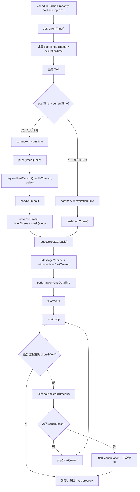
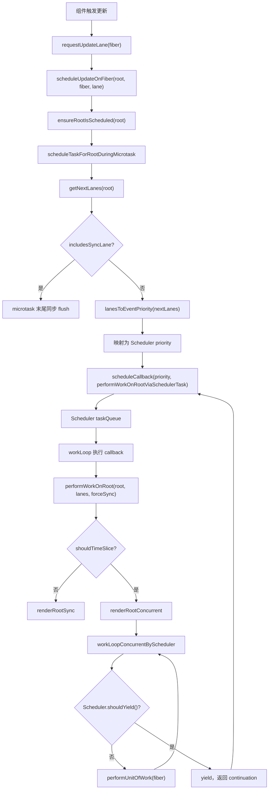

# React Scheduler 源码实现分析

本文基于当前 `react-main` 源码，分析 `scheduler` 包如何完成任务调度、优先级控制和时间切片，以及它如何与 `react-reconciler` 的 Fiber 调度配合。

核心结论先放在前面：

```text
Scheduler 不是 Fiber 本身的调度器。

Scheduler 负责：
  - 接收一个 callback
  - 按优先级和过期时间排序
  - 在合适的宿主时机执行 callback
  - 执行一段时间后判断是否 shouldYield
  - 如果任务没做完，保留 continuation 下次继续

react-reconciler 负责：
  - 根据 lane 选择要渲染的 root 和 lanes
  - 把 lanes 映射成 Scheduler priority
  - 通过 scheduleCallback 把 performWorkOnRootViaSchedulerTask 交给 Scheduler
  - 在 renderRootConcurrent 中通过 shouldYield 决定是否暂停 Fiber work loop
```

一句话总结：

> Scheduler 是 React 的“协作式主线程任务执行器”；Fiber reconciler 把 React 更新拆成可暂停的 work unit，并借助 Scheduler 决定什么时候继续执行、什么时候让出主线程。

## 一、scheduler 包源码结构

目录：

```text
packages/scheduler
  README.md
  package.json
  index.js
  index.native.js
  unstable_mock.js
  unstable_post_task.js
  npm/
  src/
    SchedulerPriorities.js
    SchedulerMinHeap.js
    SchedulerFeatureFlags.js
    SchedulerProfiling.js
    forks/
      Scheduler.js
      SchedulerMock.js
      SchedulerNative.js
      SchedulerPostTask.js
      SchedulerFeatureFlags.www.js
      SchedulerFeatureFlags.www-dynamic.js
      SchedulerFeatureFlags.native-fb.js
    __tests__/
```

核心文件职责：

| 文件 | 职责 |
| --- | --- |
| `packages/scheduler/README.md` | 明确 scheduler 是 browser environment 下的 cooperative scheduling 包 |
| `packages/scheduler/package.json` | npm 包元信息，描述为 browser cooperative scheduler |
| `packages/scheduler/index.js` | 对外导出 `src/forks/Scheduler` |
| `packages/scheduler/src/forks/Scheduler.js` | 默认 JS/浏览器环境主实现：任务队列、时间切片、host callback |
| `packages/scheduler/src/SchedulerPriorities.js` | 定义 `Immediate`、`UserBlocking`、`Normal`、`Low`、`Idle` 等优先级常量 |
| `packages/scheduler/src/SchedulerMinHeap.js` | 小顶堆实现，用于按 `sortIndex` 取最早任务 |
| `packages/scheduler/src/SchedulerFeatureFlags.js` | 时间片长度、不同优先级 timeout 等配置 |
| `packages/scheduler/src/forks/SchedulerMock.js` | 测试环境可控调度器 |
| `packages/scheduler/src/forks/SchedulerNative.js` | React Native runtime scheduler 适配 |
| `packages/scheduler/src/forks/SchedulerPostTask.js` | 基于浏览器 `scheduler.postTask` 的实验性实现 |
| `packages/react-reconciler/src/Scheduler.js` | reconciler 内部对 npm `scheduler` 包的 ESM 包装 |
| `packages/react-reconciler/src/ReactFiberRootScheduler.js` | Fiber root 调度与 Scheduler 接入层 |
| `packages/react-reconciler/src/ReactFiberWorkLoop.js` | Fiber render work loop，调用 Scheduler 的 `shouldYield` |

## 二、scheduler 包的职责是什么？

从 `README.md` 和 `package.json` 看，`scheduler` 的定位是：

```text
Cooperative scheduler for the browser environment.
```

结合 `Scheduler.js` 源码，它的职责可以拆成五件事：

| 职责 | 源码体现 |
| --- | --- |
| 接收任务 | `unstable_scheduleCallback(priorityLevel, callback, options)` |
| 给任务计算开始时间和过期时间 | `startTime`、`timeout`、`expirationTime` |
| 用队列保存任务 | `taskQueue`、`timerQueue` |
| 在宿主环境中安排执行机会 | `requestHostCallback`、`requestHostTimeout` |
| 控制执行时长 | `workLoop` 中检查 `shouldYieldToHost()` |

Scheduler 不知道 React component、Fiber、lane、render、commit。它只处理 callback。

一个 Scheduler 任务大概长这样：

```js
{
  id: 1,
  callback,
  priorityLevel: NormalPriority,
  startTime,
  expirationTime,
  sortIndex,
}
```

## 三、React 为什么需要 scheduler？

React 的 render 阶段可能很长。如果一次更新要遍历大量 Fiber，同步递归执行会长期占用主线程，浏览器无法及时响应输入、动画和绘制。

Scheduler 解决的是“什么时候执行一小段工作，以及什么时候停下来”的问题。

它提供的能力：

| 能力 | 作用 |
| --- | --- |
| 优先级 | 用户输入类任务可以比普通渲染更早执行 |
| 过期时间 | 任务等待太久后会变成超时任务，避免饥饿 |
| 时间切片 | 每次只执行一段时间，到点让出主线程 |
| continuation | callback 返回函数时，下次继续执行同一个任务 |
| delayed task | 支持 `options.delay`，未来某个时间再进入可执行队列 |

注意边界：

```text
Scheduler 只负责 callback 级别的协作式调度。
Fiber 把 render 拆成 performUnitOfWork，才让“可中断渲染”成为可能。
```

## 四、优先级如何表示？

源码位置：

```text
packages/scheduler/src/SchedulerPriorities.js
```

优先级常量：

```js
export const NoPriority = 0;
export const ImmediatePriority = 1;
export const UserBlockingPriority = 2;
export const NormalPriority = 3;
export const LowPriority = 4;
export const IdlePriority = 5;
```

数字越小，语义上越紧急。但 Scheduler 真正排序任务时，不是直接按这个数字排序，而是把 priority 转成 timeout，再计算 `expirationTime`，最后用 `sortIndex` 放进小顶堆。

源码位置：

```text
packages/scheduler/src/SchedulerFeatureFlags.js
```

默认 timeout：

```js
export const frameYieldMs = 5;
export const userBlockingPriorityTimeout = 250;
export const normalPriorityTimeout = 5000;
export const lowPriorityTimeout = 10000;
```

在 `unstable_scheduleCallback` 中的映射：

| Scheduler priority | 常量值 | timeout | 语义 |
| --- | ---: | ---: | --- |
| `ImmediatePriority` | `1` | `-1` | 立即过期 |
| `UserBlockingPriority` | `2` | `250ms` | 用户输入、连续事件等 |
| `NormalPriority` | `3` | `5000ms` | 默认普通任务 |
| `LowPriority` | `4` | `10000ms` | 低优先级任务 |
| `IdlePriority` | `5` | `1073741823` | 近似永不过期 |

计算方式：

```js
startTime = now() + delay;
expirationTime = startTime + timeout;
```

`ImmediatePriority` 的 timeout 是 `-1`，所以它创建出来就已经过期：

```text
expirationTime = currentTime - 1
```

在 `workLoop` 中，过期任务即使已经到达时间片边界，也会继续执行。

## 五、核心数据结构

### 1. Task

源码位置：

```text
packages/scheduler/src/forks/Scheduler.js
```

结构：

```js
export opaque type Task = {
  id: number,
  callback: Callback | null,
  priorityLevel: PriorityLevel,
  startTime: number,
  expirationTime: number,
  sortIndex: number,
  isQueued?: boolean,
};
```

字段说明：

| 字段 | 含义 |
| --- | --- |
| `id` | 自增 id，用于同优先级排序时保持插入顺序 |
| `callback` | 实际要执行的任务；取消任务时会被置为 `null` |
| `priorityLevel` | Scheduler priority |
| `startTime` | 任务可开始执行的时间 |
| `expirationTime` | 任务过期时间，越小越早执行 |
| `sortIndex` | 小顶堆排序字段，在不同队列中含义不同 |
| `isQueued` | profiling 用字段 |

### 2. taskQueue

源码：

```js
var taskQueue: Array<Task> = [];
```

`taskQueue` 保存“已经可以执行”的任务。

特点：

| 项 | 说明 |
| --- | --- |
| 数据结构 | 小顶堆 |
| `sortIndex` | `expirationTime` |
| 堆顶任务 | 最早过期、最应该执行的任务 |
| 入队场景 | `startTime <= currentTime` |

也就是说，普通无 delay 的任务会直接进入 `taskQueue`。

### 3. timerQueue

源码：

```js
var timerQueue: Array<Task> = [];
```

`timerQueue` 保存“还没到开始时间”的延迟任务。

特点：

| 项 | 说明 |
| --- | --- |
| 数据结构 | 小顶堆 |
| `sortIndex` | `startTime` |
| 堆顶任务 | 最早到开始时间的 delayed task |
| 入队场景 | `startTime > currentTime` |

当时间到达后，`advanceTimers(currentTime)` 会把 ready 的任务从 `timerQueue` 移到 `taskQueue`。

## 六、小顶堆在 scheduler 中起什么作用？

源码位置：

```text
packages/scheduler/src/SchedulerMinHeap.js
```

导出三个操作：

```js
push(heap, node);
peek(heap);
pop(heap);
```

比较逻辑：

```js
function compare(a, b) {
  const diff = a.sortIndex - b.sortIndex;
  return diff !== 0 ? diff : a.id - b.id;
}
```

小顶堆保证：

```text
peek(queue)
  -> O(1) 拿到 sortIndex 最小的任务

push / pop
  -> O(log n) 维护堆序
```

在 Scheduler 中：

| 队列 | `sortIndex` | 小顶堆堆顶 |
| --- | --- | --- |
| `taskQueue` | `expirationTime` | 最早过期的可执行任务 |
| `timerQueue` | `startTime` | 最早到开始时间的延迟任务 |

这让 Scheduler 不需要每次扫描全量任务，就能快速知道下一件该做什么。

## 七、scheduleCallback 的作用是什么？

源码位置：

```text
packages/scheduler/src/forks/Scheduler.js
```

核心函数：

```js
unstable_scheduleCallback(priorityLevel, callback, options?)
```

它做了这些事：

```text
unstable_scheduleCallback(priorityLevel, callback, options)
  -> currentTime = getCurrentTime()
  -> 根据 options.delay 计算 startTime
  -> 根据 priorityLevel 计算 timeout
  -> expirationTime = startTime + timeout
  -> 创建 Task
  -> 如果是 delayed task：push(timerQueue)
  -> 否则：push(taskQueue)
  -> 安排 host callback 或 host timeout
  -> 返回 Task 作为 callbackNode
```

简化源码：

```js
function unstable_scheduleCallback(priorityLevel, callback, options) {
  const currentTime = getCurrentTime();
  const startTime = options?.delay > 0
    ? currentTime + options.delay
    : currentTime;

  const timeout = getTimeoutByPriority(priorityLevel);
  const expirationTime = startTime + timeout;

  const newTask = {
    id: taskIdCounter++,
    callback,
    priorityLevel,
    startTime,
    expirationTime,
    sortIndex: -1,
  };

  if (startTime > currentTime) {
    newTask.sortIndex = startTime;
    push(timerQueue, newTask);
    requestHostTimeout(handleTimeout, startTime - currentTime);
  } else {
    newTask.sortIndex = expirationTime;
    push(taskQueue, newTask);
    requestHostCallback();
  }

  return newTask;
}
```

用户层面可以这样理解：

```js
import {
  unstable_scheduleCallback as scheduleCallback,
  unstable_NormalPriority as NormalPriority,
} from 'scheduler';

scheduleCallback(NormalPriority, didTimeout => {
  console.log('run later', didTimeout);
});
```

callback 参数 `didTimeout` 表示任务执行时是否已经过期。

## 八、delayed task 如何从 timerQueue 进入 taskQueue？

核心函数：

```js
advanceTimers(currentTime)
```

逻辑：

```text
while timerQueue 堆顶存在：
  如果 callback === null：
    说明任务被取消，pop(timerQueue)
  否则如果 timer.startTime <= currentTime：
    时间到了
    pop(timerQueue)
    timer.sortIndex = timer.expirationTime
    push(taskQueue, timer)
  否则：
    后面的 timer 更晚，停止
```

简化源码：

```js
function advanceTimers(currentTime) {
  let timer = peek(timerQueue);
  while (timer !== null) {
    if (timer.callback === null) {
      pop(timerQueue);
    } else if (timer.startTime <= currentTime) {
      pop(timerQueue);
      timer.sortIndex = timer.expirationTime;
      push(taskQueue, timer);
    } else {
      return;
    }
    timer = peek(timerQueue);
  }
}
```

延迟任务示例：

```js
scheduleCallback(NormalPriority, () => {
  console.log('after 100ms');
}, {delay: 100});
```

内部过程：

```text
startTime = now + 100
newTask.sortIndex = startTime
push(timerQueue, newTask)
requestHostTimeout(handleTimeout, 100)

100ms 后：
handleTimeout
  -> advanceTimers
  -> 移入 taskQueue
  -> requestHostCallback
```

## 九、workLoop 是如何执行任务的？

源码位置：

```text
packages/scheduler/src/forks/Scheduler.js
```

核心链路：

```text
requestHostCallback()
  -> schedulePerformWorkUntilDeadline()
  -> performWorkUntilDeadline()
  -> flushWork(currentTime)
  -> workLoop(initialTime)
```

`workLoop` 的核心流程：

```text
workLoop(initialTime)
  -> advanceTimers(currentTime)
  -> currentTask = peek(taskQueue)
  -> while currentTask !== null:
       如果 currentTask 未过期 且 shouldYieldToHost():
         break
       callback = currentTask.callback
       currentTask.callback = null
       didTimeout = currentTask.expirationTime <= currentTime
       continuation = callback(didTimeout)
       currentTime = getCurrentTime()
       如果 continuation 是函数:
         currentTask.callback = continuation
         advanceTimers(currentTime)
         return true
       否则:
         pop(taskQueue)
         advanceTimers(currentTime)
       currentTask = peek(taskQueue)
  -> 如果还有 currentTask：return true
  -> 否则如有 timerQueue：requestHostTimeout(...)
  -> return false
```

几个关键点：

| 机制 | 含义 |
| --- | --- |
| 任务过期 | `expirationTime <= currentTime` |
| 过期任务 | 即使 `shouldYieldToHost()` 为 true，也会继续执行 |
| continuation | callback 返回函数，说明任务没做完，下次继续 |
| callback 置空 | 任务执行前先置空，避免重复执行 |
| `return true` | 告诉 host loop 还有工作，需要再发一次消息 |

示例：

```js
let i = 0;

function work(didTimeout) {
  while (i < 1000) {
    i++;

    if (!didTimeout && shouldYield()) {
      return work; // continuation，下次继续
    }
  }
}

scheduleCallback(NormalPriority, work);
```

## 十、shouldYield 如何判断是否让出主线程？

源码位置：

```text
packages/scheduler/src/forks/Scheduler.js
```

核心函数：

```js
function shouldYieldToHost(): boolean {
  if (!enableAlwaysYieldScheduler && enableRequestPaint && needsPaint) {
    return true;
  }

  const timeElapsed = getCurrentTime() - startTime;
  if (timeElapsed < frameInterval) {
    return false;
  }

  return true;
}
```

默认 `frameInterval` 来自：

```js
export const frameYieldMs = 5;
```

也就是说，默认情况下：

```text
如果本轮 host task 执行未满约 5ms：
  不让出

如果执行已超过约 5ms：
  让出

如果 React 调用了 requestPaint() 标记需要绘制：
  优先让出
```

`startTime` 在每次 `performWorkUntilDeadline` 开始时设置：

```js
startTime = currentTime;
hasMoreWork = flushWork(currentTime);
```

`requestPaint()` 的作用是告诉 Scheduler：

```text
这轮工作结束时给浏览器一次 paint 机会。
```

在 reconciler 中，commit 阶段附近会调用：

```js
requestPaint();
```

## 十一、MessageChannel / setTimeout 分别起什么作用？

源码位置：

```text
packages/scheduler/src/forks/Scheduler.js
```

### 1. MessageChannel：安排尽快执行的 host callback

Scheduler 需要一种方式在当前 JS 栈清空后尽快继续执行任务。默认浏览器/Worker 环境中，它优先使用 `MessageChannel`：

```js
const channel = new MessageChannel();
const port = channel.port2;
channel.port1.onmessage = performWorkUntilDeadline;

schedulePerformWorkUntilDeadline = () => {
  port.postMessage(null);
};
```

源码注释说明，优先使用 `MessageChannel` 的原因之一是避免 `setTimeout` 的 4ms clamping。

执行链路：

```text
requestHostCallback()
  -> schedulePerformWorkUntilDeadline()
  -> port.postMessage(null)
  -> channel.port1.onmessage
  -> performWorkUntilDeadline()
```

### 2. setTimeout：处理 delayed task 和 fallback

`setTimeout` 有两个用途。

第一个用途：延迟任务。

```js
requestHostTimeout(handleTimeout, startTime - currentTime);
```

当 `timerQueue` 中最早的 delayed task 到时间后，通过 `handleTimeout` 把它移入 `taskQueue`。

第二个用途：兜底。

如果没有 `setImmediate`，也没有 `MessageChannel`，Scheduler 会退回到：

```js
localSetTimeout(performWorkUntilDeadline, 0);
```

### 3. setImmediate：Node.js / old IE 优先

源码中还有一层判断：

```text
如果有 setImmediate：
  使用 setImmediate
否则如果有 MessageChannel：
  使用 MessageChannel
否则：
  使用 setTimeout
```

源码注释给出的原因包括：在 Node.js + jsdom 场景下，`MessageChannel` 可能阻止 Node 进程退出，而 `setImmediate` 不会。

## 十二、核心调用链

### 1. Scheduler 包内部调用链

```text
unstable_scheduleCallback(priority, callback, options)
  -> getCurrentTime()
  -> 计算 startTime
  -> 计算 timeout / expirationTime
  -> 创建 Task
  -> push(taskQueue | timerQueue)
  -> requestHostCallback() 或 requestHostTimeout()

requestHostCallback()
  -> schedulePerformWorkUntilDeadline()
  -> MessageChannel / setImmediate / setTimeout
  -> performWorkUntilDeadline()
  -> flushWork(currentTime)
  -> workLoop(initialTime)

workLoop(initialTime)
  -> advanceTimers(currentTime)
  -> peek(taskQueue)
  -> callback(didTimeout)
  -> continuation 或 pop(taskQueue)
  -> shouldYieldToHost()
  -> return hasMoreWork
```

### 2. React reconciler 接入调用链

```text
scheduleUpdateOnFiber(root, fiber, lane)
  -> ensureRootIsScheduled(root)
  -> ensureScheduleIsScheduled()
  -> scheduleTaskForRootDuringMicrotask(root, currentTime)
  -> getNextLanes(root, ...)
  -> lanesToEventPriority(nextLanes)
  -> Scheduler priority
  -> scheduleCallback(priority, performWorkOnRootViaSchedulerTask.bind(null, root))

Scheduler 执行 callback:
performWorkOnRootViaSchedulerTask(root, didTimeout)
  -> getNextLanes(root, ...)
  -> forceSync = didTimeout
  -> performWorkOnRoot(root, lanes, forceSync)
  -> renderRootConcurrent 或 renderRootSync
  -> 如果还有同一个 callbackNode 的工作，返回 continuation
```

## 十三、任务调度流程图



## 十四、与 Fiber 调度的关系

### 1. reconciler 如何导入 Scheduler？

源码位置：

```text
packages/react-reconciler/src/Scheduler.js
```

这个文件是一个包装层：

```js
import * as Scheduler from 'scheduler';

export const scheduleCallback = Scheduler.unstable_scheduleCallback;
export const cancelCallback = Scheduler.unstable_cancelCallback;
export const shouldYield = Scheduler.unstable_shouldYield;
export const requestPaint = Scheduler.unstable_requestPaint;
export const now = Scheduler.unstable_now;
export const ImmediatePriority = Scheduler.unstable_ImmediatePriority;
export const UserBlockingPriority = Scheduler.unstable_UserBlockingPriority;
export const NormalPriority = Scheduler.unstable_NormalPriority;
export const LowPriority = Scheduler.unstable_LowPriority;
export const IdlePriority = Scheduler.unstable_IdlePriority;
```

### 2. Fiber lanes 如何映射到 Scheduler priority？

源码位置：

```text
packages/react-reconciler/src/ReactFiberRootScheduler.js
```

核心逻辑在 `scheduleTaskForRootDuringMicrotask`：

```js
switch (lanesToEventPriority(nextLanes)) {
  case DiscreteEventPriority:
  case ContinuousEventPriority:
    schedulerPriorityLevel = UserBlockingSchedulerPriority;
    break;
  case DefaultEventPriority:
    schedulerPriorityLevel = NormalSchedulerPriority;
    break;
  case IdleEventPriority:
    schedulerPriorityLevel = IdleSchedulerPriority;
    break;
  default:
    schedulerPriorityLevel = NormalSchedulerPriority;
    break;
}

const newCallbackNode = scheduleCallback(
  schedulerPriorityLevel,
  performWorkOnRootViaSchedulerTask.bind(null, root),
);
```

映射表：

| Fiber event priority | Scheduler priority |
| --- | --- |
| `DiscreteEventPriority` | `UserBlockingPriority` |
| `ContinuousEventPriority` | `UserBlockingPriority` |
| `DefaultEventPriority` | `NormalPriority` |
| `IdleEventPriority` | `IdlePriority` |

同步 lane 是特殊路径：

```text
includesSyncLane(nextLanes)
  -> 不额外 schedule Scheduler callback
  -> microtask 末尾同步 flush
```

### 3. Scheduler callback 触发 Fiber render

Scheduler 执行的 callback 是：

```js
performWorkOnRootViaSchedulerTask.bind(null, root)
```

源码位置：

```text
packages/react-reconciler/src/ReactFiberRootScheduler.js
```

核心流程：

```text
performWorkOnRootViaSchedulerTask(root, didTimeout)
  -> flush pending passive effects
  -> getNextLanes(root, ...)
  -> forceSync = didTimeout
  -> performWorkOnRoot(root, lanes, forceSync)
  -> scheduleTaskForRootDuringMicrotask(root, now())
  -> 如果 root.callbackNode 仍是当前任务，返回 continuation
```

`didTimeout` 来自 Scheduler：

```text
didTimeout = currentTask.expirationTime <= currentTime
```

React 用它作为一个“任务已经超时”的信号，必要时强制同步推进。

### 4. Fiber render 阶段如何使用 shouldYield？

源码位置：

```text
packages/react-reconciler/src/ReactFiberWorkLoop.js
```

并发渲染入口：

```js
const shouldTimeSlice =
  (!forceSync &&
    !includesBlockingLane(lanes) &&
    !includesExpiredLane(root, lanes)) ||
  checkIfRootIsPrerendering(root, lanes);

let exitStatus = shouldTimeSlice
  ? renderRootConcurrent(root, lanes)
  : renderRootSync(root, lanes, true);
```

在 `renderRootConcurrent` 中：

```js
workLoopConcurrentByScheduler();
```

核心循环：

```js
function workLoopConcurrentByScheduler() {
  while (workInProgress !== null && !shouldYield()) {
    performUnitOfWork(workInProgress);
  }
}
```

也就是说：

```text
Scheduler.shouldYield()
  决定 Fiber work loop 是否暂停。

Fiber.performUnitOfWork()
  决定每次暂停前实际做多少 Fiber 工作。
```

这就是 Scheduler 与 Fiber 的分工。

## 十五、Fiber + Scheduler 配合流程图



## 十六、关键源码讲解

### 1. scheduleCallback：任务进入 Scheduler

```js
const newTask = {
  id: taskIdCounter++,
  callback,
  priorityLevel,
  startTime,
  expirationTime,
  sortIndex: -1,
};
```

如果任务可以立即执行：

```js
newTask.sortIndex = expirationTime;
push(taskQueue, newTask);
requestHostCallback();
```

如果任务有 delay：

```js
newTask.sortIndex = startTime;
push(timerQueue, newTask);
requestHostTimeout(handleTimeout, startTime - currentTime);
```

### 2. workLoop：执行任务，直到队列空或需要让出

```js
while (currentTask !== null) {
  if (currentTask.expirationTime > currentTime && shouldYieldToHost()) {
    break;
  }

  const callback = currentTask.callback;
  currentTask.callback = null;

  const didUserCallbackTimeout =
    currentTask.expirationTime <= currentTime;

  const continuationCallback = callback(didUserCallbackTimeout);

  if (typeof continuationCallback === 'function') {
    currentTask.callback = continuationCallback;
    return true;
  } else {
    pop(taskQueue);
  }
}
```

这里体现了协作式调度的关键：

```text
任务必须主动返回 continuation，Scheduler 才能下次继续。
Scheduler 不会强制打断一个正在执行的 JS callback。
```

### 3. shouldYield：时间片边界

```js
const timeElapsed = getCurrentTime() - startTime;
return timeElapsed >= frameInterval;
```

默认 `frameInterval` 是 `5ms`。这并不意味着每个任务只能执行 5ms，而是 Scheduler 在任务与任务之间、或 Fiber work unit 之间检查是否应该让出。

### 4. Fiber workLoopConcurrentByScheduler

```js
while (workInProgress !== null && !shouldYield()) {
  performUnitOfWork(workInProgress);
}
```

这个循环解释了为什么 Fiber 数据结构重要：

```text
如果 React 还是递归同步调用组件树，
就很难在任意节点暂停并恢复。

Fiber 把渲染拆成 workInProgress 链上的一个个 unit，
Scheduler.shouldYield 只需要控制每次执行多少 unit。
```

## 十七、每一步示例代码

### 1. 普通 Scheduler 任务

```js
import {
  unstable_scheduleCallback as scheduleCallback,
  unstable_NormalPriority as NormalPriority,
} from 'scheduler';

scheduleCallback(NormalPriority, didTimeout => {
  console.log('normal task', didTimeout);
});
```

内部大致发生：

```text
priority = NormalPriority
timeout = 5000
expirationTime = now + 5000
sortIndex = expirationTime
push(taskQueue)
requestHostCallback()
```

### 2. 延迟任务

```js
scheduleCallback(NormalPriority, () => {
  console.log('delayed task');
}, {delay: 1000});
```

内部大致发生：

```text
startTime = now + 1000
expirationTime = startTime + 5000
sortIndex = startTime
push(timerQueue)
requestHostTimeout(handleTimeout, 1000)
```

### 3. 可继续任务

```js
let index = 0;

function chunk(didTimeout) {
  while (index < 10000) {
    index++;

    if (!didTimeout && shouldYield()) {
      return chunk;
    }
  }

  return null;
}

scheduleCallback(NormalPriority, chunk);
```

内部大致发生：

```text
callback 返回 chunk
  -> currentTask.callback = chunk
  -> workLoop return true
  -> performWorkUntilDeadline 再发一次 MessageChannel
  -> 下个 host task 继续执行
```

### 4. React Fiber 中的调度

用户代码：

```jsx
setCount(c => c + 1);
```

reconciler 内部大致变成：

```js
scheduleUpdateOnFiber(root, fiber, lane);
ensureRootIsScheduled(root);
```

之后：

```js
const nextLanes = getNextLanes(root, ...);
const schedulerPriorityLevel = lanesToSchedulerPriority(nextLanes);

scheduleCallback(
  schedulerPriorityLevel,
  performWorkOnRootViaSchedulerTask.bind(null, root),
);
```

Scheduler 执行后：

```js
performWorkOnRoot(root, lanes, forceSync);
```

并发 render 中：

```js
while (workInProgress !== null && !shouldYield()) {
  performUnitOfWork(workInProgress);
}
```

## 十八、常见误区

| 误区 | 更准确的理解 |
| --- | --- |
| Scheduler 直接调度 Fiber 节点 | Scheduler 只调度 callback，Fiber 节点由 reconciler 自己推进 |
| `ImmediatePriority` 一定同步执行 | Scheduler 中它是立即过期任务；React sync lane 还有自己的 microtask flush 路径 |
| 时间切片能强制中断任何 JS | 不能。Scheduler 只能在 callback 返回、或 Fiber 每个 unit 之间协作式让出 |
| `taskQueue` 按 priority 常量排序 | 实际按 `expirationTime` 排序 |
| `timerQueue` 是低优先级队列 | 不是。它是尚未到开始时间的 delayed task 队列 |
| `MessageChannel` 是延时器 | 不是。它用于尽快安排下一轮 host callback |
| `setTimeout` 是主调度方式 | 在默认 DOM/Worker 环境中，主调度优先使用 MessageChannel；setTimeout 主要处理 delay 和兜底 |

## 十九、推荐阅读顺序

如果第一次读 Scheduler，建议按下面顺序：

1. `packages/scheduler/src/SchedulerPriorities.js`
   - 先理解优先级常量。
2. `packages/scheduler/src/SchedulerFeatureFlags.js`
   - 看默认时间片和 timeout。
3. `packages/scheduler/src/SchedulerMinHeap.js`
   - 理解小顶堆按 `sortIndex` 排序。
4. `packages/scheduler/src/forks/Scheduler.js`
   - 先看 `Task`、`taskQueue`、`timerQueue`。
5. `unstable_scheduleCallback`
   - 理解任务如何入队。
6. `advanceTimers` / `handleTimeout`
   - 理解 delayed task 如何变成 ready task。
7. `performWorkUntilDeadline` / `flushWork` / `workLoop`
   - 理解任务如何真正执行。
8. `shouldYieldToHost`
   - 理解时间切片边界。
9. `packages/react-reconciler/src/Scheduler.js`
   - 看 reconciler 如何包装 scheduler。
10. `packages/react-reconciler/src/ReactFiberRootScheduler.js`
    - 看 lanes 如何映射到 Scheduler priority。
11. `packages/react-reconciler/src/ReactFiberWorkLoop.js`
    - 看 Fiber render loop 如何调用 `shouldYield()`。

## 二十、学习总结

Scheduler 的实现可以浓缩成四个核心模型：

| 模型 | 解释 |
| --- | --- |
| 优先级模型 | priority 转 timeout，timeout 形成 expirationTime |
| 队列模型 | `taskQueue` 存可执行任务，`timerQueue` 存延迟任务 |
| 宿主调度模型 | `MessageChannel` / `setImmediate` / `setTimeout` 安排下一轮执行机会 |
| 协作式让出模型 | `shouldYieldToHost` 判断是否到时间片边界，callback 可返回 continuation |

与 Fiber 的关系可以再压缩成一句：

> Scheduler 决定“什么时候执行 React 的一段工作、什么时候停”；Fiber 决定“这段工作具体做哪个节点、如何暂停并恢复”。

