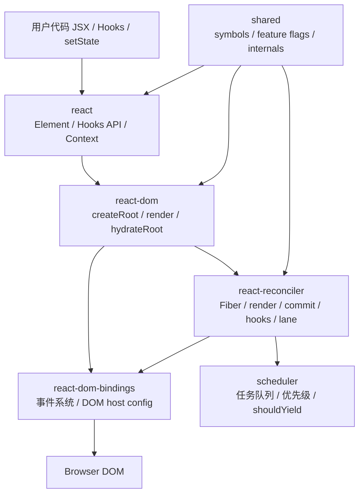
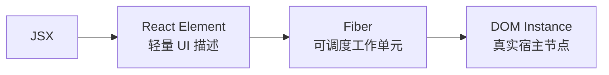
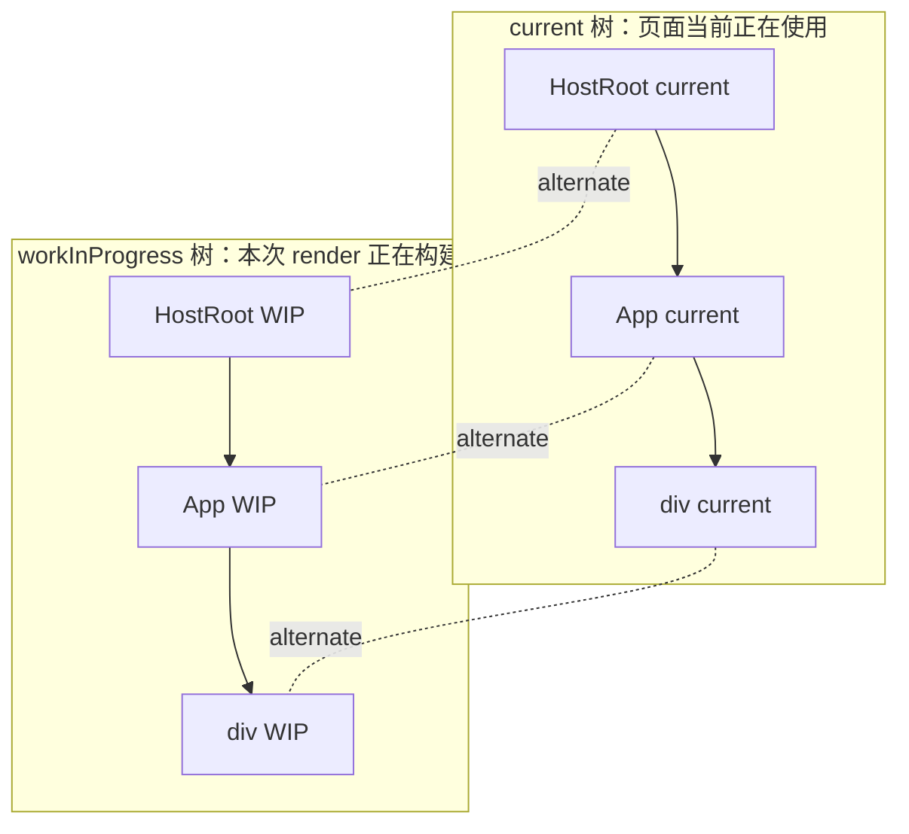
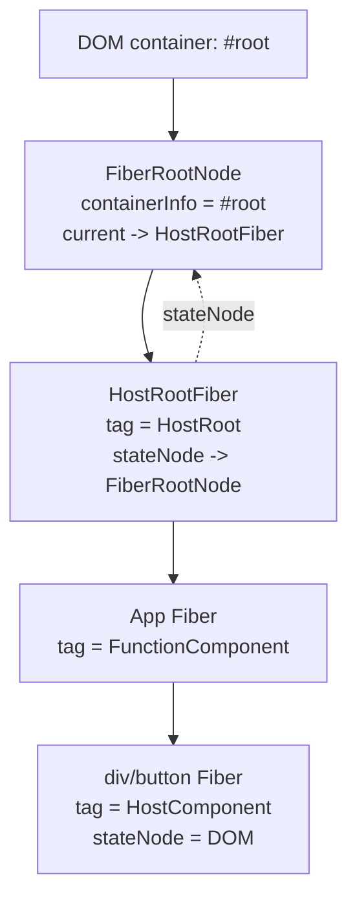
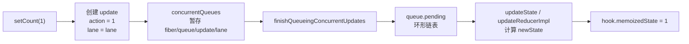
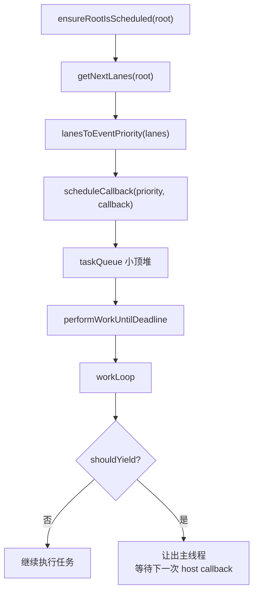
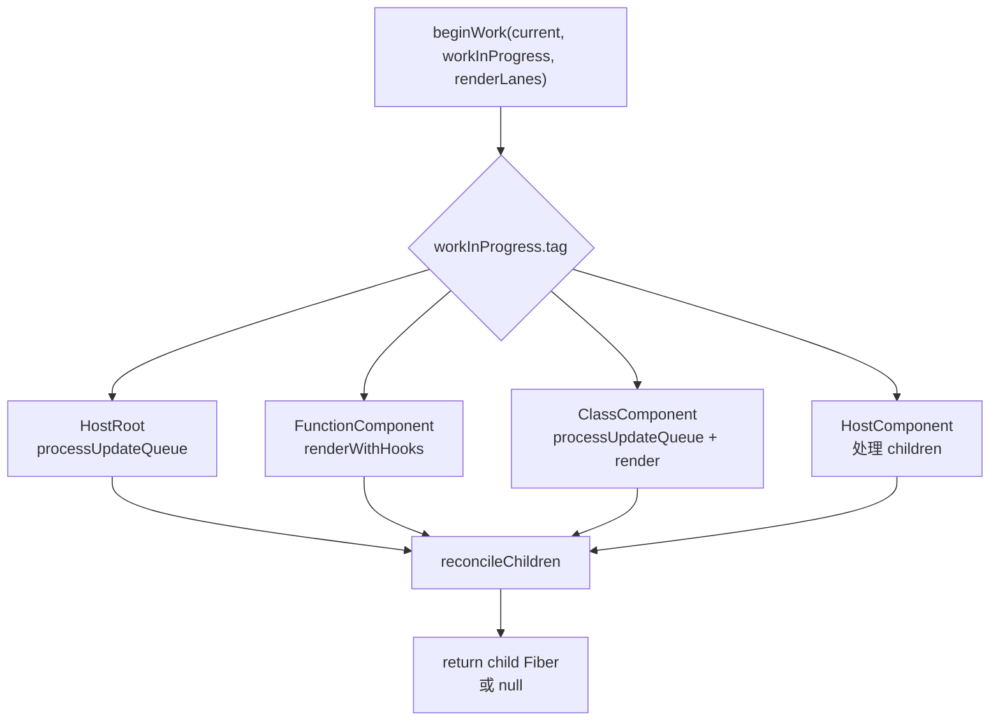
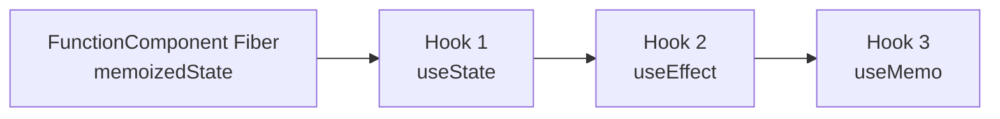
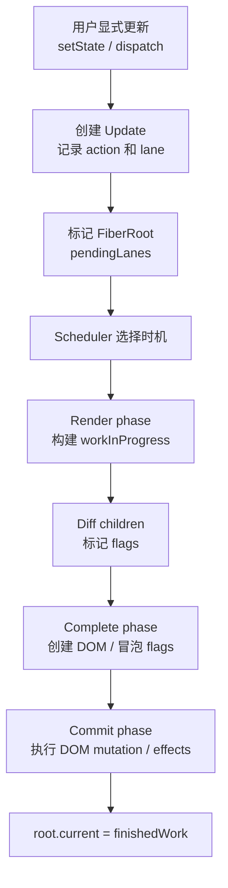

# React 源码学习笔记

本文档基于当前本地 `react-main` 源码和前面已经整理的专题文档汇总而成，目标是形成一份适合后续复习的系统笔记。

建议始终围绕这个最小例子理解源码：

```jsx
import {createRoot} from 'react-dom/client';
import {useState} from 'react';

function App() {
  const [count, setCount] = useState(0);
  return <button onClick={() => setCount(count + 1)}>{count}</button>;
}

createRoot(document.getElementById('root')).render(<App />);
```

这段代码能串起 React 源码中最核心的主线：

```text
JSX
  -> React Element
  -> Fiber
  -> Update
  -> Lane
  -> Scheduler
  -> Render phase
  -> Commit phase
  -> DOM mutation
```

## 1. React 源码整体架构

React 官方源码是一个 monorepo，核心代码集中在 `packages` 目录。学习时可以把它理解成四层：

| 层级 | 代表包 | 解决的问题 |
| --- | --- | --- |
| API 描述层 | `react` | 提供 JSX、Element、Component、Hooks、Context 等用户 API，用来描述 UI |
| 宿主渲染层 | `react-dom`、`react-dom-bindings` | 把 React 的抽象 UI 接到浏览器 DOM，处理 root、事件、DOM 属性、hydration |
| 协调调度层 | `react-reconciler`、`scheduler` | Fiber、更新队列、render/commit、lane、任务调度、时间切片 |
| 内部共享层 | `shared` | React symbols、feature flags、公共类型、共享内部状态 |

整体架构图：



源码设计上，React 把“描述 UI”和“如何渲染到具体平台”分开：

| 抽象 | 说明 |
| --- | --- |
| `react` | 只负责创建描述对象和暴露 API，不直接操作 DOM |
| `react-reconciler` | 负责平台无关的 Fiber 协调、更新调度、Hooks 运行 |
| `react-dom` | 作为 DOM renderer，把 reconciler 的结果提交到浏览器 |
| host config | 把 `createInstance`、`appendChild`、`commitUpdate` 等宿主操作注入 reconciler |

这种分层是 React 支持多 renderer 的基础，例如 React DOM、React Native、测试 renderer、custom renderer 都可以共享 reconciler 思想。

## 2. packages 核心包说明

| 包 | 职责 | 优先阅读文件 | 设计原因 |
| --- | --- | --- | --- |
| `react` | 提供用户侧 API，创建 React Element，转发 Hooks 到当前 dispatcher | `packages/react/src/ReactClient.js`、`packages/react/src/jsx/ReactJSXElement.js`、`packages/react/src/ReactHooks.js` | React API 层不绑定 DOM，让 UI 描述保持平台无关 |
| `react-dom` | 提供 DOM renderer 入口，例如 `createRoot`、`hydrateRoot`、`flushSync` | `packages/react-dom/client.js`、`packages/react-dom/src/client/ReactDOMRoot.js` | DOM 相关入口和浏览器行为集中在 renderer 包内 |
| `react-dom-bindings` | DOM host config、事件系统、DOM 节点与 Fiber 映射 | `packages/react-dom-bindings/src/client/ReactFiberConfigDOM.js`、`ReactDOMComponentTree.js` | reconciler 不直接依赖浏览器 API，通过 host config 解耦平台 |
| `react-reconciler` | Fiber 核心，包含 root 创建、更新队列、begin/complete/commit、Hooks、lane | `ReactFiberWorkLoop.js`、`ReactFiberBeginWork.js`、`ReactFiberCompleteWork.js`、`ReactFiberHooks.js` | 把 UI 更新建模成可调度、可中断、可提交的工作 |
| `scheduler` | 提供任务优先级、任务队列、时间切片、让出主线程能力 | `packages/scheduler/src/forks/Scheduler.js`、`SchedulerMinHeap.js` | React render 可能很长，需要协作式调度避免长期阻塞主线程 |
| `shared` | 存放共享 symbols、feature flags、内部共享对象和工具 | `ReactSymbols.js`、`ReactSharedInternals.js`、`ReactFeatureFlags.js` | 避免多包重复定义内部协议 |

记忆方式：

```text
react 负责“是什么”
react-dom 负责“渲染到哪里”
react-reconciler 负责“如何算出变化”
scheduler 负责“什么时候算”
react-dom-bindings 负责“如何改 DOM”
```

## 3. React Element

JSX 最终不是 DOM，也不是 Fiber，而是 React Element。

```jsx
<App name="React" />
```

大致会编译成：

```js
jsx(App, {
  name: 'React',
});
```

React Element 的核心结构：

```js
{
  $$typeof: Symbol(react.transitional.element),
  type: App,
  key: null,
  props: {
    name: 'React'
  },
  _owner: ...
}
```

字段说明：

| 字段 | 作用 | 为什么需要 |
| --- | --- | --- |
| `$$typeof` | 标记这是合法 React Element | 防止普通对象被误当成 Element |
| `type` | 表示节点类型，可能是字符串、函数、类、memo、forwardRef 等 | reconciler 根据 type 创建不同 Fiber |
| `key` | 列表 diff 时识别同一逻辑节点 | 保证重排时能复用正确 Fiber |
| `ref` | 引用宿主实例或组件实例 | commit layout 阶段 attach/detach |
| `props` | 组件输入或 DOM 属性 | render 阶段用来计算子节点和 DOM 更新 |

设计原因：

React 不直接操作 JSX，是因为 JSX 只是语法；React 需要一个普通 JS 对象作为跨平台 UI 描述。React Element 足够轻量、不可变，适合作为 render 的输入。

React Element 到 Fiber 的关系：



需要记住：

```text
Element 是描述结果。
Fiber 是处理过程中的工作单元。
DOM 是 commit 后的宿主结果。
```

## 4. Fiber 数据结构

Fiber 是 React 源码的核心抽象。它既表示组件树中的一个节点，又表示一次可执行的工作单元。

Fiber 核心字段：

| 字段 | 含义 | 设计原因 |
| --- | --- | --- |
| `tag` | Fiber 类型，例如 FunctionComponent、HostRoot、HostComponent | beginWork 根据 tag 分发处理逻辑 |
| `type` | 原始类型，例如函数组件函数、`'div'` | 判断组件类型和 DOM 类型 |
| `stateNode` | 关联实例，例如 DOM 节点、class 实例、FiberRoot | 连接 Fiber 和真实宿主对象 |
| `return` | 父 Fiber | 代替递归调用栈，支持向上回溯 |
| `child` | 第一个子 Fiber | 链表形式表达树 |
| `sibling` | 下一个兄弟 Fiber | 避免数组嵌套结构，便于中断恢复 |
| `alternate` | current 与 workInProgress 互指 | 双缓存机制，保证渲染和提交分离 |
| `pendingProps` | 本次 render 的新 props | beginWork 使用 |
| `memoizedProps` | 上次 commit 后的 props | diff 和 bailout 使用 |
| `memoizedState` | Fiber 保存的状态，例如 Hook 链表或 HostRoot state | 组件状态挂载点 |
| `updateQueue` | 更新队列或 effect 队列 | 保存待处理更新和副作用 |
| `flags` | 当前 Fiber 自身副作用 | commit 阶段消费 |
| `subtreeFlags` | 子树副作用汇总 | commit 快速跳过无副作用子树 |
| `lanes` | 当前 Fiber 自身待处理优先级 | 判断这个 Fiber 是否有工作 |
| `childLanes` | 子树待处理优先级 | beginWork bailout 时判断子树是否可跳过 |

双缓存图：



为什么要用 Fiber，而不是递归同步渲染？

| 旧递归模型问题 | Fiber 解决方式 |
| --- | --- |
| 一旦开始 render 就很难中断 | 每个 Fiber 是独立 work unit，workLoop 可以处理一个停一下 |
| JS 调用栈不可控 | `return/child/sibling` 手动模拟调用栈 |
| 不能表达优先级 | Fiber 上有 `lanes/childLanes` |
| 中途失败难恢复 | workInProgress 可以丢弃或复用 |
| DOM 可能出现半成品 | render 和 commit 分离，commit 原子提交 |

## 5. 首次渲染流程

入口代码：

```jsx
const root = ReactDOM.createRoot(document.getElementById('root'));
root.render(<App />);
```

完整主线：

```text
createRoot
  -> createContainer
  -> createFiberRoot
  -> createHostRootFiber
  -> root.render
  -> updateContainer
  -> createUpdate
  -> enqueueUpdate
  -> scheduleUpdateOnFiber
  -> ensureRootIsScheduled
  -> performWorkOnRoot
  -> renderRootConcurrent / renderRootSync
  -> workLoop
  -> beginWork
  -> completeWork
  -> commitRoot
  -> DOM 插入
```

分阶段理解：

| 阶段 | 做什么 | 设计原因 |
| --- | --- | --- |
| `createRoot` | 创建 ReactDOMRoot 和内部 FiberRoot | 把 DOM container 包装成 React 可管理的 root |
| `createFiberRoot` | 创建 FiberRootNode 和 HostRootFiber | FiberRoot 管调度状态，HostRootFiber 是树根 |
| `root.render` | 创建 HostRoot update，payload 是 `<App />` | 首次渲染也统一建模为一次更新 |
| 调度 | 标记 root.pendingLanes，并安排 root work | 所有更新都通过统一调度入口处理 |
| render | 从 HostRootFiber 开始构建 workInProgress 树 | 可以中断、恢复、重试 |
| complete | 创建离屏 DOM，冒泡 flags | 先算出完整结果，不直接改页面 |
| commit | 插入真实 DOM，切换 current 树 | 保证页面一次性进入一致状态 |

首次渲染时的对象关系：



关键理解：

```text
createRoot 不会渲染 App。
root.render 不会直接创建 DOM。
DOM 创建发生在 completeWork。
DOM 插入发生在 commit mutation 阶段。
root.current 切换发生在 commit 阶段。
```

## 6. 状态更新流程

状态更新有两条常见入口：

| 组件类型 | 入口 | update 存在哪里 |
| --- | --- | --- |
| class component | `this.setState` | Fiber 的 class updateQueue |
| function component | `setCount` / Hook dispatch | Hook 的 updateQueue |

Hook 更新主线：

```text
setCount(count + 1)
  -> dispatchSetState
  -> requestUpdateLane
  -> dispatchSetStateInternal
  -> 创建 Hook update
  -> enqueueConcurrentHookUpdate
  -> scheduleUpdateOnFiber
  -> markRootUpdated
  -> ensureRootIsScheduled
  -> renderWithHooks
  -> updateState
  -> commitRoot
```

Hook updateQueue 变化：



设计原因：

| 设计 | 原因 |
| --- | --- |
| update 对象 | 把一次状态变化显式记录下来，支持排序、跳过、重放 |
| updateQueue | 多次更新可以按顺序合并处理 |
| lane | 不同优先级更新可以在同一队列中共存 |
| eager state | 如果新旧 state 相同，可以尽早 bailout |
| concurrentQueues | 并发场景先收集更新，合适时再安全接入具体 queue |

最重要的一句话：

```text
setState / setCount 不会直接修改页面。
它们只是创建 update、标记 root、触发调度。
新的 state 在下一次 render 中由 updateQueue 计算出来。
```

## 7. Scheduler 调度机制

React 的调度可以分成两层：

| 层级 | 代表文件 | 解决的问题 |
| --- | --- | --- |
| React root scheduler | `ReactFiberRootScheduler.js` | 哪个 root 有工作、下一批 lanes 是什么、注册什么优先级的 callback |
| 独立 scheduler 包 | `scheduler/src/forks/Scheduler.js` | 任务队列、过期时间、时间切片、是否让出主线程 |

Scheduler 任务结构：

| 字段 | 作用 |
| --- | --- |
| `id` | 任务顺序 |
| `callback` | 要执行的任务 |
| `priorityLevel` | Immediate、UserBlocking、Normal、Low、Idle |
| `startTime` | 任务何时开始 |
| `expirationTime` | 任务何时过期 |
| `sortIndex` | 小顶堆排序依据 |

两个队列：

| 队列 | 存什么 | 排序依据 |
| --- | --- | --- |
| `taskQueue` | 已到开始时间的任务 | `expirationTime` |
| `timerQueue` | 延迟任务 | `startTime` |

调度流程：



为什么需要 Scheduler？

React render 可能很长。如果一次同步递归算完整棵树，浏览器主线程会被阻塞，用户输入、动画、滚动都会卡住。Scheduler 让 React 可以在合适时机暂停 render，把主线程还给浏览器，然后再恢复。

注意：

```text
lane 是 React 内部更新优先级和批次模型。
Scheduler priority 是调度器任务优先级。
二者有关联，但不是同一个东西。
```

## 8. Reconciler 协调机制

Reconciler 是 React 的核心：它负责从旧 Fiber 树和新 React Element 计算出新的 workInProgress Fiber 树，并标记需要提交的副作用。

render 和 commit 的划分：

| 阶段 | 做什么 | 是否可中断 | 是否改 DOM |
| --- | --- | --- | --- |
| render | 执行组件、diff children、创建/复用 Fiber、标记 flags | 可中断 | 不改真实 DOM |
| complete | 创建离屏 DOM、冒泡 flags | 属于 render | 不把 DOM 插入页面 |
| commit | 插入/更新/删除 DOM，执行 ref/effects | 不可中断 | 会改真实 DOM |

render 主流程：

```text
performWorkOnRoot
  -> renderRootConcurrent / renderRootSync
  -> prepareFreshStack
  -> workLoopConcurrent / workLoopSync
  -> performUnitOfWork
  -> beginWork
  -> completeUnitOfWork
  -> completeWork
```

设计原因：

| 设计 | 解决的问题 |
| --- | --- |
| workInProgress 树 | render 可以在不影响当前页面的情况下准备新树 |
| begin/complete 两阶段 | 模拟递归的进入和返回过程 |
| flags | render 只记录副作用，不立刻执行 |
| commitRoot | 所有副作用集中提交，保证一致性 |

## 9. beginWork

`beginWork` 是 render 阶段“向下走”的入口。

它接收：

```text
current: 当前页面正在使用的旧 Fiber
workInProgress: 本次正在构建的新 Fiber
renderLanes: 本次要处理的 lanes
```

核心职责：

| 职责 | 说明 |
| --- | --- |
| 判断 Fiber 类型 | 根据 `workInProgress.tag` 分发到不同处理函数 |
| 处理组件更新 | 函数组件执行 `renderWithHooks`，类组件执行实例 render |
| 处理 HostRoot | 消费 root updateQueue，拿到根 element |
| reconcile children | 根据新 children 和旧 child Fiber 做 diff |
| bailout | 如果 props/state/lane 没变化，尽量跳过子树 |

典型分支：

| Fiber.tag | 处理函数 | 做什么 |
| --- | --- | --- |
| `HostRoot` | `updateHostRoot` | 消费 root updateQueue，得到 `nextChildren` |
| `FunctionComponent` | `updateFunctionComponent` | 调用 `renderWithHooks`，执行函数组件 |
| `ClassComponent` | `updateClassComponent` | 处理 class updateQueue 和生命周期 |
| `HostComponent` | `updateHostComponent` | 处理 DOM 元素 children |
| `SuspenseComponent` | `updateSuspenseComponent` | 处理 fallback、primary、retry |

beginWork 图：



设计原因：

React 把不同组件类型的“计算子节点”统一放在 beginWork 中，让 workLoop 可以用统一的 `performUnitOfWork` 驱动整棵树，而不是每种组件各自递归。

## 10. completeWork

`completeWork` 是 render 阶段“向上归并”的入口。

当一个 Fiber 没有子节点，或者子节点都完成后，会进入 complete。

核心职责：

| 职责 | 说明 |
| --- | --- |
| HostComponent mount | 创建 DOM instance |
| HostText mount | 创建文本节点 |
| HostComponent update | props 变化时标记 `Update` |
| HostText update | 文本变化时标记 `Update` |
| appendAllChildren | mount 时把子 DOM 挂到父 DOM 上，形成离屏 DOM 子树 |
| bubbleProperties | 冒泡 `subtreeFlags` 和 `childLanes` |

beginWork 与 completeWork 对比：

| 对比项 | beginWork | completeWork |
| --- | --- | --- |
| 方向 | 向下 | 向上 |
| 重点 | 计算 children | 收尾当前 Fiber |
| 函数组件 | 执行函数组件 | 通常只冒泡 flags |
| DOM 节点 | 不创建真实 DOM | mount 时创建 DOM |
| 副作用 | 标记子节点增删等 | 标记 Update、冒泡 flags |
| 返回值 | child Fiber 或 null | null |

DOM 创建流程：

```text
completeWork(HostText)
  -> createTextInstance

completeWork(HostComponent)
  -> createInstance
  -> appendAllChildren
  -> workInProgress.stateNode = instance
  -> finalizeInitialChildren
```

设计原因：

DOM 创建放在 completeWork，是因为此时子 Fiber 已经处理完，父 DOM 可以一次性把所有子 DOM append 起来，形成完整的离屏 DOM 子树。真正插入页面仍然等到 commit 阶段。

## 11. commit 阶段

commit 阶段负责把 render 阶段计算出的 finishedWork 真正提交到宿主环境。

commit 三个主阶段：

| 阶段 | 做什么 | 典型内容 |
| --- | --- | --- |
| before mutation | DOM 变化前读取快照 | `getSnapshotBeforeUpdate`、部分 before mutation effects |
| mutation | 执行 DOM 插入、更新、删除 | `commitHostPlacement`、`commitHostUpdate`、`commitDeletionEffects` |
| layout | DOM 已更新后执行同步副作用 | `useLayoutEffect`、class layout 生命周期、attach ref |

`useEffect` 不在同步 commit 主体内执行，而是 passive effect，通常在 commit 后异步 flush。

DOM 操作调用链：

```text
commitRoot
  -> flushMutationEffects
  -> commitMutationEffects
  -> commitMutationEffectsOnFiber
  -> commitHostPlacement / commitHostUpdate / commitHostTextUpdate
  -> ReactFiberConfigDOM
  -> appendChild / insertBefore / updateProperties / nodeValue
```

为什么 commit 不可中断？

| 原因 | 说明 |
| --- | --- |
| DOM 必须一致 | 一旦开始改 DOM，中断会让页面处于半更新状态 |
| ref/effect 依赖 DOM 状态 | layout effects 必须看到完整提交后的 DOM |
| current 树切换必须原子 | `root.current = finishedWork` 不能和 DOM 变化错位 |

current 切换：

```text
render 完成:
  root.current 仍是旧树
  finishedWork 是新树

commit mutation 后:
  root.current = finishedWork

layout 阶段:
  effects 看到的是新 DOM 和新 current 树
```

## 12. Hooks 实现原理

Hooks 的状态不保存在函数闭包里，而是保存在 FunctionComponent Fiber 的 Hook 链表上。

Hook 链表：



useState mount：

```text
mountState
  -> mountStateImpl
  -> mountWorkInProgressHook
  -> hook.memoizedState = initialState
  -> 创建 queue
  -> dispatchSetState.bind(fiber, queue)
  -> return [state, dispatch]
```

useState update：

```text
updateState
  -> updateReducer(basicStateReducer)
  -> updateWorkInProgressHook
  -> 合并 pending queue 和 baseQueue
  -> 按 renderLanes 消费 update
  -> 计算 newState
  -> return [newState, dispatch]
```

为什么 Hooks 不能写在条件语句里？

React 依赖 Hook 的调用顺序来匹配链表节点：

```jsx
function App() {
  const [a] = useState(1); // 第一个 Hook
  const [b] = useState(2); // 第二个 Hook
}
```

如果某次 render 条件跳过了第一个 Hook，第二个 Hook 就会错位读取到前一个 Hook 的状态。React 没有用 Hook 名字匹配，而是用调用顺序匹配，这是 Hooks 简洁性的代价。

useEffect 与 useLayoutEffect：

| Hook | 创建阶段 | 执行时机 | 适合场景 |
| --- | --- | --- | --- |
| `useLayoutEffect` | render 阶段记录 effect | commit layout 阶段同步执行 | 读写布局、同步测量 DOM |
| `useEffect` | render 阶段记录 passive effect | commit 后异步 flush | 网络请求、订阅、非阻塞副作用 |

设计原因：

Hooks 把函数组件的状态、副作用、memo 缓存都挂到 Fiber 上，让函数组件保持“重新执行函数”的模型，同时又能跨 render 保存状态。

## 13. diff 算法

React diff 的入口在 beginWork 的 `reconcileChildren`，核心实现是 `ReactChildFiber.js`。

单节点 diff：

```text
新节点是 React Element
  -> 根据 key 找旧 Fiber
  -> key 相同再比较 type
  -> key/type 都匹配则复用 Fiber
  -> 否则删除旧 Fiber，创建新 Fiber
```

数组 diff：

```text
reconcileChildrenArray
  -> 第一轮按顺序比较 oldFiber 和 newChildren
  -> 不匹配后把剩余旧 Fiber 放入 map
  -> 遍历剩余新 children，根据 key/index 找旧 Fiber
  -> placeChild 判断插入或移动
  -> 删除 map 中未复用旧 Fiber
```

`key` 的作用：

| 场景 | 没有稳定 key | 有稳定 key |
| --- | --- | --- |
| 列表重排 | 容易按位置错误复用 | 按逻辑身份复用 |
| 插入新项 | 后续节点可能都被误认为变化 | 只插入新 Fiber |
| 组件状态 | 状态可能错位 | 状态跟随 key 对应节点 |

`lastPlacedIndex`：

```text
如果 oldIndex < lastPlacedIndex:
  说明节点在新序列中相对顺序倒退，需要移动
否则:
  节点可以留在原位，并更新 lastPlacedIndex
```

设计原因：

React diff 没有追求最少 DOM 移动，而是选择和 Fiber 架构一致的单向 child reconciliation。它的重点是生成可提交的 Fiber flags，并和可中断 render 结合。

## 14. lane 优先级模型

lane 是 React 用位运算表示更新优先级、批次和状态的模型。

直觉理解：

```text
一个 lane 是一个二进制位。
多个 lanes 是多个二进制位的组合。
```

例如：

```text
SyncLane        = 0b0001
DefaultLane     = 0b0100
TransitionLane  = 0b1000

pendingLanes = SyncLane | DefaultLane
```

lane 相关 root 字段：

| 字段 | 作用 |
| --- | --- |
| `pendingLanes` | root 上所有待处理 lanes |
| `suspendedLanes` | 当前被 Suspense 挂起的 lanes |
| `pingedLanes` | 数据准备好后可重试的 lanes |
| `expiredLanes` | 已过期，应该尽快同步处理的 lanes |
| `entangledLanes` | 需要绑定在一起处理的 lanes |

核心链路：

```text
requestUpdateLane
  -> update.lane
  -> markRootUpdated(root, lane)
  -> root.pendingLanes |= lane
  -> ensureRootIsScheduled
  -> getNextLanes(root)
  -> renderRootConcurrent(root, lanes)
```

为什么从 `expirationTime` 演进到 lane？

| expirationTime 问题 | lane 优势 |
| --- | --- |
| 一个时间值难表达多批更新 | 位图可以同时表示多个更新集合 |
| 优先级和批次混在一起 | lane 可以表达优先级、批次、是否挂起、是否 entangle |
| 并发场景复杂 | lane 更适合跳过、恢复、重试、合并 |

lane 和 Scheduler priority：

| React lane | Scheduler priority |
| --- | --- |
| Sync / discrete event | Immediate 或 UserBlocking |
| continuous event | UserBlocking |
| default update | Normal |
| transition | 通常以较低优先级调度 |
| idle | Idle |

设计原因：

lane 是 React 内部“选择哪些更新进入本次 render”的模型；Scheduler priority 是“这个 callback 什么时候执行”的模型。React 用 lane 管更新语义，用 Scheduler 管主线程时间。

## 15. React 源码设计思想

React 源码的核心思想可以总结为五句话：

| 思想 | 解释 |
| --- | --- |
| UI 是状态的函数 | 每次 render 通过 state/props 计算 UI 描述 |
| 更新是显式对象 | `setState` 不直接改 DOM，而是创建 update |
| 渲染是可调度工作 | Fiber 把递归任务拆成 work unit |
| 提交必须原子 | render 可中断，commit 不可中断 |
| 平台能力通过 host config 注入 | reconciler 不直接依赖 DOM |

React 的设计取舍：

```text
React 不做属性级响应式追踪。
React 选择显式 update queue + Fiber + lane。
```

这样做的好处是：

| 好处 | 说明 |
| --- | --- |
| 调度能力强 | 可以按优先级处理用户输入、transition、retry |
| 一致性强 | workInProgress 树完成后再 commit |
| 可扩展性强 | Suspense、Concurrent Rendering、Server Components 都能挂到同一套模型上 |
| renderer 解耦 | React DOM 只是一个 renderer，reconciler 可复用 |

代价是：

| 代价 | 表现 |
| --- | --- |
| 源码复杂 | Fiber、lane、flags、scheduler 交织 |
| 默认粒度较粗 | 组件函数通常重新执行 |
| 需要关注引用稳定 | memo、key、Hook 顺序很重要 |

整体心智模型：



## 16. 常见面试题

| 问题 | 复习答案 |
| --- | --- |
| JSX 最终变成什么？ | JSX 会编译成 `jsx(...)` 或 `createElement(...)` 调用，返回 React Element 普通对象，不是 DOM，也不是 Fiber |
| React Element 和 Fiber 有什么区别？ | Element 是 UI 描述，轻量不可变；Fiber 是运行时工作单元，保存状态、队列、flags、lanes 和树指针 |
| Fiber 为什么能支持中断？ | Fiber 用 `child/sibling/return` 手动表示树和调用栈，workLoop 每次处理一个 Fiber，可在单元之间暂停 |
| current 和 workInProgress 是什么？ | current 是当前页面对应的 Fiber 树，workInProgress 是本次 render 构建的新树，通过 alternate 互指 |
| setState 后发生了什么？ | 创建 update，计算 lane，入队，找到 root，标记 pendingLanes，调度 root，render 消费 updateQueue，commit 更新 DOM |
| useState 状态存在哪里？ | 存在 FunctionComponent Fiber 的 Hook 链表中，入口是 `fiber.memoizedState` |
| Hooks 为什么不能放条件里？ | React 按调用顺序匹配 Hook 链表节点，条件调用会导致顺序错位 |
| render 阶段做什么？ | 执行组件、处理 updateQueue、diff children、构建 workInProgress、标记 flags，不直接改页面 |
| commit 阶段做什么？ | 消费 flags，执行 DOM 插入/更新/删除，处理 ref、layout effects、调度 passive effects |
| commit 为什么不可中断？ | DOM mutation、current 切换、ref/effect 必须保持一致，不能让页面处于半提交状态 |
| beginWork 做什么？ | 根据 Fiber.tag 计算子节点，执行函数组件或处理 HostRoot/HostComponent，调用 reconcileChildren |
| completeWork 做什么？ | 创建或更新宿主实例，标记 Update，冒泡 subtreeFlags，形成离屏 DOM 子树 |
| key 为什么重要？ | key 表示列表中节点的稳定身份，diff 时用它决定 Fiber 复用，避免状态错位 |
| React diff 如何判断移动？ | 数组 diff 中用 `lastPlacedIndex` 判断旧索引是否倒退，倒退则标记 Placement |
| lane 是什么？ | lane 是用二进制位表示的更新优先级和批次集合 |
| lane 和 Scheduler priority 一样吗？ | 不一样。lane 管 React 更新语义和选择本次 render 的工作，Scheduler priority 管 callback 的执行优先级 |
| useEffect 和 useLayoutEffect 区别？ | `useLayoutEffect` 在 commit layout 阶段同步执行，`useEffect` 是 passive effect，commit 后异步执行 |
| React 为什么不直接操作 JSX？ | JSX 是语法，React 需要 React Element 作为普通 JS UI 描述，再转换为 Fiber 进行调度和 diff |
| React 为什么要把 render 和 commit 分开？ | render 可以中断和重试，commit 必须原子提交，从而兼顾响应性和 DOM 一致性 |
| React 和 Vue 最大设计差异？ | React 是显式 update + Fiber 调度模型；Vue 是响应式依赖追踪 + compiler/runtime 协作模型 |

## 17. 下一步学习计划

建议按照“三轮阅读法”复习。

### 第一轮：跑通主线

目标：能从 `createRoot(...).render(<App />)` 讲到 DOM 插入。

阅读顺序：

| 顺序 | 主题 | 文档 |
| --- | --- | --- |
| 1 | 全局导览 | `docs/react-source-overview.md` |
| 2 | React Element | `docs/react-element-jsx-analysis.md` |
| 3 | 首次渲染 | `docs/react-initial-render-full-trace.md` |
| 4 | Fiber | `docs/react-fiber-implementation-analysis.md` |
| 5 | begin/complete/commit | `docs/react-beginwork-source-analysis.md`、`docs/react-completework-source-analysis.md`、`docs/react-commit-phase-source-analysis.md` |

第一轮自测：

```text
我能不能画出：
ReactElement -> Fiber -> DOM 的转换关系？
FiberRoot 和 HostRootFiber 的关系？
首次渲染 DOM 是在哪里创建、在哪里插入？
```

### 第二轮：深入更新机制

目标：能从 `setCount` 讲到 DOM 文本更新。

阅读顺序：

| 顺序 | 主题 | 文档 |
| --- | --- | --- |
| 1 | 状态更新总览 | `docs/react-state-update-flow-analysis.md` |
| 2 | useState 更新全链路 | `docs/react-usestate-update-full-trace.md` |
| 3 | Hooks | `docs/react-hooks-source-analysis.md` |
| 4 | diff | `docs/react-diff-algorithm-source-analysis.md` |
| 5 | lane | `docs/react-lane-priority-model-analysis.md` |

第二轮自测：

```text
我能不能解释：
setCount 为什么不立即改变 count？
Hook updateQueue 是如何计算 newState 的？
key 如何影响 Fiber 复用？
lane 如何影响本次 render？
```

### 第三轮：掌握并发和设计思想

目标：理解 React 为什么要 Fiber、scheduler、lane、render/commit 分离。

阅读顺序：

| 顺序 | 主题 | 文档 |
| --- | --- | --- |
| 1 | Scheduler | `docs/react-scheduler-source-analysis.md` |
| 2 | Reconciler | `docs/react-reconciler-flow-analysis.md` |
| 3 | React vs Vue 设计对比 | `docs/react-vue-core-design-comparison.md` |
| 4 | 系统路线 | `docs/react-source-learning-roadmap.md` |

第三轮自测：

```text
我能不能解释：
React 的“并发”到底并发在哪里？
为什么 render 可中断而 commit 不可中断？
lane 相比 expirationTime 解决了什么？
React 和 Vue 在更新发现机制上为什么不同？
```

### 复习方法

每个专题都按这五个问题复习：

| 问题 | 目的 |
| --- | --- |
| 入口在哪里？ | 找到调用链起点 |
| 核心数据结构是什么？ | 抓住状态如何流动 |
| 正常路径怎么走？ | 建立主线 |
| 为什么这样设计？ | 理解取舍 |
| 哪些分支可以暂时跳过？ | 避免被 feature flag、DEV、hydration、Suspense 淹没 |

最后建议自己手画三张图：

```text
1. 首次渲染图：
createRoot -> updateContainer -> renderRoot -> commitRoot -> DOM

2. useState 更新图：
dispatchSetState -> Hook queue -> lane -> renderWithHooks -> commit

3. Fiber 双缓存图：
current tree <-> workInProgress tree -> root.current 切换
```

能独立画出这三张图，React 源码主线就已经真正建立起来了。
