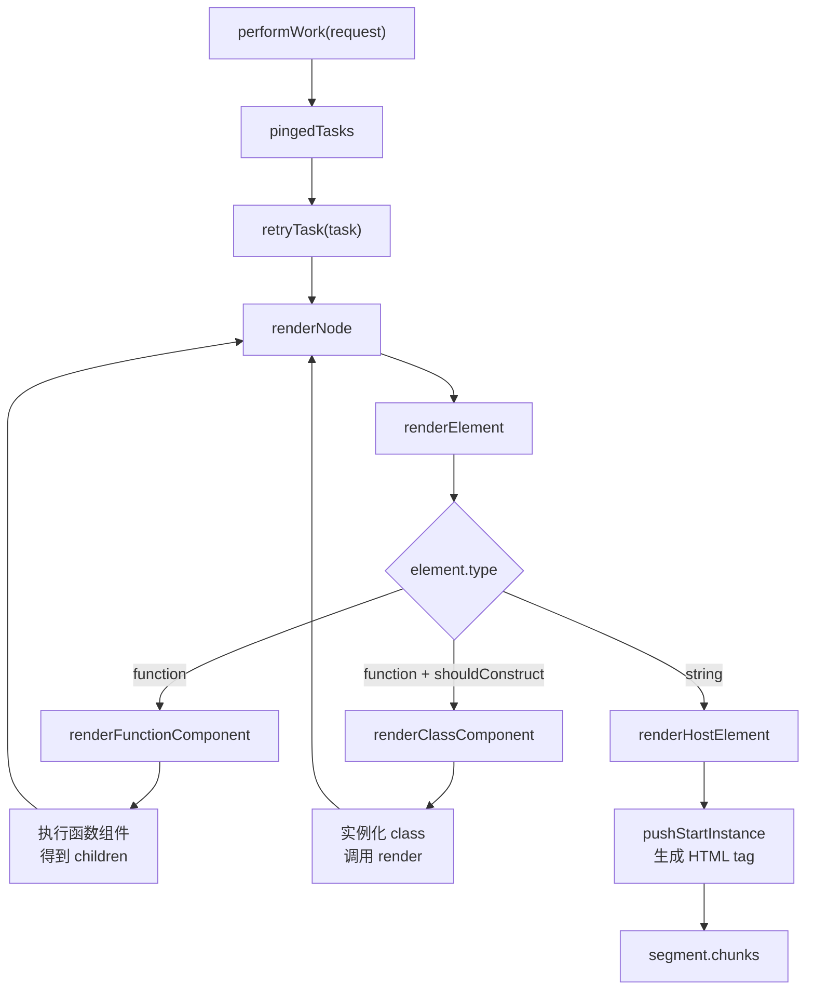
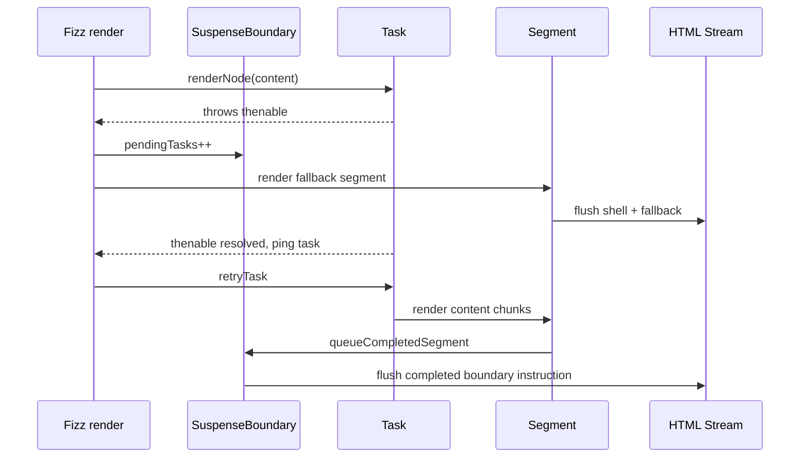
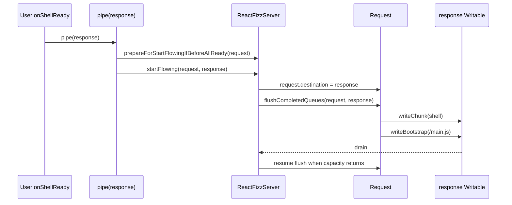
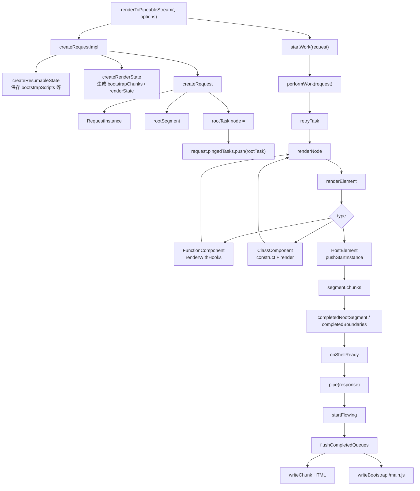
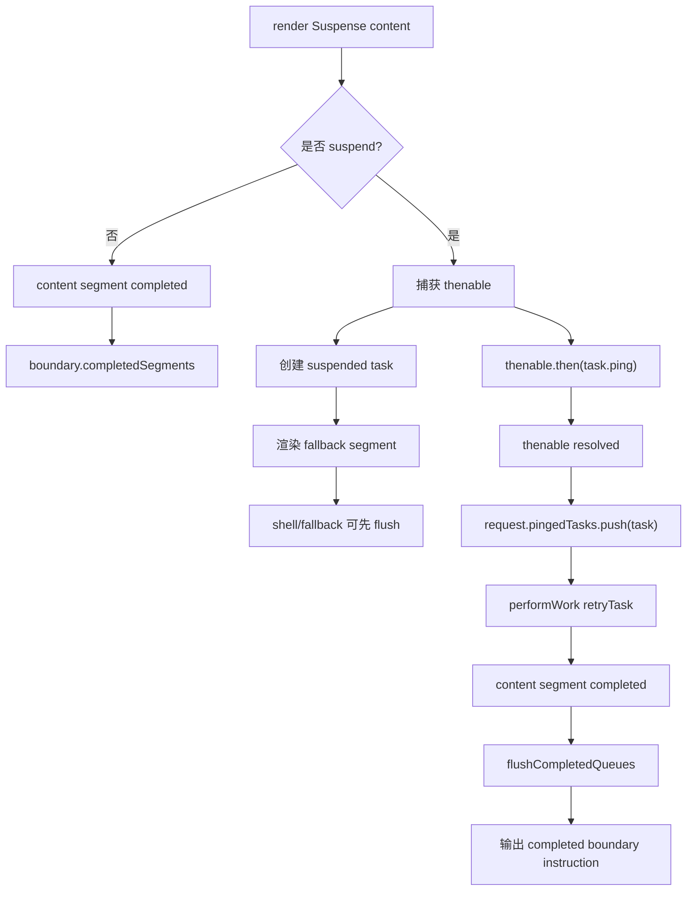

# React SSR renderToPipeableStream 源码流程追踪

本文档基于当前本地 `react-main` 源码整理，专门追踪 Node 环境下 `renderToPipeableStream` 如何把 React Element 渲染成 HTML stream。

示例代码：

```js
import {renderToPipeableStream} from 'react-dom/server';

const {pipe} = renderToPipeableStream(<App />, {
  bootstrapScripts: ['/main.js'],
  onShellReady() {
    pipe(response);
  },
});
```

核心结论先放前面：

```text
renderToPipeableStream 不走客户端 Fiber render/commit。
它走 Fizz 服务端 renderer：
React Element -> Request -> Task -> Segment -> HTML chunks -> Writable stream。
```

## 一、核心源码文件

| 文件 | 作用 |
| --- | --- |
| `packages/react-dom/server.node.js` | Node 版 `react-dom/server` 入口，导出 `renderToPipeableStream` |
| `packages/react-dom/src/server/react-dom-server.node.js` | Node server 实际聚合入口 |
| `packages/react-dom/src/server/ReactDOMFizzServerNode.js` | `renderToPipeableStream` Node 实现，创建 request、返回 `pipe/abort` |
| `packages/react-server/src/ReactFizzServer.js` | Fizz 核心，包含 `createRequest`、`startWork`、`performWork`、`renderNode`、`flushCompletedQueues`、`startFlowing`、`abort` |
| `packages/react-server/src/ReactFizzHooks.js` | 服务端 Hooks dispatcher，effect 类 hooks 不执行 |
| `packages/react-server/src/ReactFizzClassComponent.js` | class component 服务端实例化和生命周期相关逻辑 |
| `packages/react-server/src/ReactFizzThenable.js` | Suspense / thenable 状态 |
| `packages/react-dom-bindings/src/server/ReactFizzConfigDOM.js` | DOM SSR host config，负责生成 HTML chunk、bootstrap scripts、Suspense marker |
| `packages/react-dom-bindings/src/server/ReactServerStreamConfigDOMNode.js` 或相关 fork | Node stream 写入、调度、backpressure 相关 host stream config |

## 二、完整调用链

```text
renderToPipeableStream(<App />, options)
  -> ReactDOMFizzServerNode.js:renderToPipeableStream
    -> createRequestImpl(children, options)
      -> createResumableState(
           identifierPrefix,
           unstable_externalRuntimeSrc,
           bootstrapScriptContent,
           bootstrapScripts,
           bootstrapModules
         )
      -> createRenderState(
           resumableState,
           nonce,
           unstable_externalRuntimeSrc,
           importMap,
           onHeaders,
           maxHeadersLength
         )
      -> createRootFormatContext(namespaceURI)
      -> ReactFizzServer:createRequest(
           children,
           resumableState,
           renderState,
           rootFormatContext,
           progressiveChunkSize,
           onError,
           onAllReady,
           onShellReady,
           onShellError,
           onFatalError,
           formState
         )
        -> new RequestInstance(...)
        -> createPendingSegment(...)
        -> createRenderTask(...)
        -> request.pingedTasks.push(rootTask)
    -> startWork(request)
      -> scheduleMicrotask(performWork)
      -> scheduleWork(enqueueEarlyPreloadsAfterInitialWork)
    -> return {pipe, abort}

performWork(request)
  -> 设置 ReactSharedInternals.H = HooksDispatcher
  -> 遍历 request.pingedTasks
  -> retryTask(request, task)
    -> renderNode(request, task, node, childIndex)
      -> renderNodeDestructive(...)
      -> renderElement(...)
        -> renderFunctionComponent / renderClassComponent / renderHostElement
          -> FunctionComponent: renderWithHooks -> 执行 App()
          -> ClassComponent: constructClassInstance -> mountClassInstance -> render
          -> HostElement: pushStartInstance / pushTextInstance / pushEndInstance
      -> segment.chunks 收集 HTML
  -> 如果 request.destination !== null
     -> flushCompletedQueues(request, destination)

onShellReady()
  -> 用户调用 pipe(response)
    -> prepareForStartFlowingIfBeforeAllReady(request)
    -> startFlowing(request, response)
      -> request.destination = response
      -> flushCompletedQueues(request, response)
        -> writeChunk(response, chunk)
        -> writeBootstrap(response, renderState)
    -> 监听 response drain/error/close
```

## 三、renderToPipeableStream 的入口在哪里

Node 包入口：

```text
packages/react-dom/server.node.js
```

它会转发到：

```text
packages/react-dom/src/server/react-dom-server.node.js
```

再进入：

```text
packages/react-dom/src/server/ReactDOMFizzServerNode.js
```

核心函数：

```js
function renderToPipeableStream(children, options) {
  const request = createRequestImpl(children, options);
  let hasStartedFlowing = false;
  startWork(request);
  return {
    pipe(destination) {
      if (hasStartedFlowing) {
        throw new Error(
          'React currently only supports piping to one writable stream.',
        );
      }
      hasStartedFlowing = true;
      prepareForStartFlowingIfBeforeAllReady(request);
      startFlowing(request, destination);
      destination.on('drain', createDrainHandler(destination, request));
      destination.on('error', createCancelHandler(...));
      destination.on('close', createCancelHandler(...));
      return destination;
    },
    abort(reason) {
      abort(request, reason);
    },
  };
}
```

这个 API 立即做两件事：

| 步骤 | 作用 |
| --- | --- |
| `createRequestImpl` | 把 React Element 和 options 转成 Fizz Request |
| `startWork` | 开始服务端渲染 work，但不一定立刻写入 response |

返回的 `{pipe, abort}` 是控制 stream 的句柄。

## 四、React Element 如何进入服务端渲染流程

示例里的：

```jsx
renderToPipeableStream(<App />, options)
```

`<App />` 是 React Element，作为 `children` 传入 `createRequestImpl`：

```js
function createRequestImpl(children, options) {
  const resumableState = createResumableState(...);
  return createRequest(
    children,
    resumableState,
    createRenderState(...),
    createRootFormatContext(...),
    options ? options.progressiveChunkSize : undefined,
    options ? options.onError : undefined,
    options ? options.onAllReady : undefined,
    options ? options.onShellReady : undefined,
    options ? options.onShellError : undefined,
    undefined,
    options ? options.formState : undefined,
  );
}
```

`createRequest` 会创建 root segment 和 root task：

```text
createRequest
  -> new RequestInstance(...)
  -> createPendingSegment(request, 0, null, rootFormatContext, ...)
  -> rootSegment.parentFlushed = true
  -> createRenderTask(request, null, children, ...)
  -> request.pingedTasks.push(rootTask)
```

这就是 React Element 进入 Fizz 的位置：

```text
React Element 被保存到 rootTask.node
rootTask 被放入 request.pingedTasks
performWork 时再执行 rootTask
```

## 五、服务端渲染和客户端 Reconciler 有什么不同

客户端 render 主线：

```text
createRoot
  -> createFiberRoot
  -> updateContainer
  -> scheduleUpdateOnFiber
  -> renderRootConcurrent
  -> workLoop
  -> beginWork / completeWork
  -> commitRoot
  -> DOM mutation
```

服务端 Fizz 主线：

```text
renderToPipeableStream
  -> createRequest
  -> startWork
  -> performWork
  -> retryTask
  -> renderNode
  -> renderElement
  -> segment.chunks
  -> flushCompletedQueues
  -> writeChunk
```

对比表：

| 维度 | 客户端 CSR | 服务端 SSR |
| --- | --- | --- |
| 根对象 | `FiberRootNode` | `Request` |
| 工作单元 | `Fiber` | `Task` |
| 输出单元 | DOM mutation effects | HTML `Segment` / chunks |
| 遍历方式 | `beginWork` / `completeWork` | `renderNode` / `renderElement` |
| 是否 commit | 有 `commitRoot` | 没有客户端 commit |
| 是否创建 DOM | 创建真实 DOM | 不创建 DOM，只生成 HTML |
| Suspense | Fiber 中 suspend/retry/commit fallback | Boundary 切分 stream，fallback 先出，content 后补 |
| Hooks dispatcher | 客户端 dispatcher | Fizz server dispatcher |

关键结论：

```text
服务端渲染不使用客户端 Fiber Reconciler 的 work loop。
它有自己的 Fizz renderer。
```

## 六、服务端是否创建 Fiber

不创建客户端 Fiber 树。

服务端 Fizz 使用的是：

| Fizz 数据结构 | 对应职责 |
| --- | --- |
| `Request` | 一次 SSR 请求的全局状态 |
| `Task` | 可执行的渲染任务 |
| `Segment` | 一段 HTML 输出 |
| `SuspenseBoundary` | Suspense 分块、fallback、content 管理 |

它不创建：

| 客户端结构 | 服务端 Fizz 是否创建 |
| --- | --- |
| `FiberRootNode` | 否 |
| `FiberNode` tree | 否 |
| `workInProgress` tree | 否 |
| `flags/subtreeFlags` | 否 |
| `commitRoot` effects | 否 |

为什么服务端不用 Fiber？

服务端目标不是把 UI commit 到浏览器 DOM，而是生成 HTML 字节流。Fizz 需要的核心能力是：

```text
可暂停：组件可能 suspend
可恢复：thenable resolve 后继续 task
可分块：Suspense boundary 完成后分段输出
可写流：支持 backpressure 和 abort
```

这些需求用 `Request / Task / Segment / Boundary` 更直接。

## 七、服务端如何遍历组件树

`performWork` 是 Fizz 的工作循环入口：

```js
function performWork(request) {
  ReactSharedInternals.H = HooksDispatcher;
  currentRequest = request;

  const pingedTasks = request.pingedTasks;
  for (let i = 0; i < pingedTasks.length; i++) {
    const task = pingedTasks[i];
    retryTask(request, task);
  }
  pingedTasks.splice(0, i);

  if (request.destination !== null) {
    flushCompletedQueues(request, request.destination);
  }
}
```

遍历主线：

```text
retryTask
  -> renderNode(request, task, task.node, task.childIndex)
  -> renderNodeDestructive
  -> renderElement
```

`renderElement` 根据 `type` 分发：

```js
if (typeof type === 'function') {
  if (shouldConstruct(type)) {
    renderClassComponent(request, task, keyPath, type, props);
  } else {
    renderFunctionComponent(request, task, keyPath, type, props);
  }
  return;
}

if (typeof type === 'string') {
  renderHostElement(request, task, keyPath, type, props);
  return;
}
```

流程图：



## 八、Function Component 在服务端如何执行

Function Component 走：

```text
renderElement
  -> renderFunctionComponent
  -> renderWithHooks
  -> Component(props, legacyContext)
  -> renderNode 继续处理返回值
```

核心代码形态：

```js
function renderFunctionComponent(request, task, keyPath, Component, props) {
  const value = renderWithHooks(
    request,
    task,
    keyPath,
    Component,
    props,
    legacyContext,
  );

  // 后续继续渲染 value
}
```

服务端 Hooks 特点：

| Hook | 服务端行为 |
| --- | --- |
| `useMemo` | 会在 render 中计算 |
| `useCallback` | 返回 callback |
| `useId` | 生成可 hydration 对齐的 id |
| `useEffect` | noop，不执行 |
| `useLayoutEffect` | noop，不执行 |
| `useInsertionEffect` | noop，不执行 |
| `useState` | 在支持 client APIs 的 SSR 中可用于初始 render 状态，但不会产生交互更新 |

为什么 effect 不执行？

```text
服务端没有 commit 阶段，也没有浏览器 DOM。
effect 语义是提交后副作用，所以服务端只能跳过。
```

## 九、class component 在服务端如何处理

Class Component 走：

```text
renderElement
  -> shouldConstruct(type)
  -> renderClassComponent
  -> constructClassInstance
  -> mountClassInstance
  -> finishClassComponent
  -> instance.render()
  -> renderNode 继续处理 render 返回值
```

核心代码形态：

```js
function renderClassComponent(request, task, keyPath, Component, props) {
  const resolvedProps = resolveClassComponentProps(Component, props);
  const maskedContext = getMaskedContext(Component, task.legacyContext);
  const instance = constructClassInstance(Component, resolvedProps, maskedContext);
  mountClassInstance(instance, Component, resolvedProps, maskedContext);
  finishClassComponent(request, task, keyPath, instance, Component, resolvedProps);
}
```

服务端 class component 特点：

| 能力 | 服务端行为 |
| --- | --- |
| constructor | 会执行 |
| render | 会执行 |
| legacy context | 会处理 |
| `componentDidMount` | 不执行 |
| `componentDidUpdate` | 不执行 |
| DOM ref | 不会 attach 到真实 DOM |

原因同样是：服务端只有 render，没有 DOM commit。

## 十、Suspense 在服务端如何处理

Suspense 是 Fizz 流式 SSR 的核心分块机制。

核心数据结构：

```text
SuspenseBoundary
  status
  rootSegmentID
  parentFlushed
  pendingTasks
  completedSegments
  byteSize
  fallbackAbortableTasks
  errorDigest
```

流程：

```text
renderNode 遇到 thenable
  -> 捕获 SuspenseException / thenable
  -> 创建挂起 task 或 replay task
  -> task 关联 SuspenseBoundary
  -> fallback 可以先完成并输出
  -> thenable resolve 后 task.ping
  -> request.pingedTasks.push(task)
  -> performWork 重试
  -> boundary.completedSegments 增加完成 segment
  -> flushCompletedQueues 输出完成 boundary
```

Suspense SSR 图：



和 `renderToString` 的差别：

| API | Suspense 行为 |
| --- | --- |
| `renderToString` | 不等待 Suspense，pending 时 abort boundary |
| `renderToPipeableStream` | fallback/shell 可先输出，content resolve 后再补发 |

## 十一、HTML chunk 如何生成

Host element 走：

```text
renderHostElement
  -> pushStartInstance(target, type, props, ...)
  -> render children
  -> pushEndInstance
```

文本节点走：

```text
pushTextInstance(target, text, renderState, textEmbedded)
  -> encodeHTMLTextNode(text)
  -> target.push(stringToChunk(...))
```

DOM SSR host config：

```text
packages/react-dom-bindings/src/server/ReactFizzConfigDOM.js
```

它负责：

| 工作 | 示例 |
| --- | --- |
| 标签生成 | `<div`、`</div>` |
| 属性序列化 | `className` -> `class`，布尔属性、style、src 等 |
| 文本转义 | 防止 HTML 注入 |
| Suspense marker | pending/completed/client-rendered boundary 标记 |
| segment instruction | 后续 segment 完成后用脚本/数据指令替换 placeholder |
| bootstrap scripts | 输出启动客户端 JS 的 `<script async src="...">` |

示例：

```jsx
function App() {
  return <div className="app">Hello</div>;
}
```

大致生成：

```text
pushStartInstance("div", {className: "app"})
  -> chunks.push("<div class=\"app\">")

pushTextInstance("Hello")
  -> chunks.push("Hello")

pushEndInstance("div")
  -> chunks.push("</div>")
```

注意：这不是 DOM 节点，只是 HTML chunk。

## 十二、bootstrapScripts 如何注入

示例：

```js
renderToPipeableStream(<App />, {
  bootstrapScripts: ['/main.js'],
});
```

数据流：

```text
options.bootstrapScripts
  -> createRequestImpl
  -> createResumableState(..., bootstrapScripts, ...)
  -> createRenderState(resumableState, ...)
  -> renderState.bootstrapChunks
  -> writeBootstrap(destination, renderState)
  -> writeChunk(destination, '<script async src="/main.js"...></script>')
```

源码中 `createRenderState` 会遍历 `bootstrapScripts`：

```text
for each bootstrapScripts:
  -> preloadBootstrapScriptOrModule(...)
  -> bootstrapChunks.push(startScriptSrc)
  -> bootstrapChunks.push(src)
  -> bootstrapChunks.push(attributeEnd)
  -> 可选 nonce / integrity / crossOrigin
  -> pushCompletedShellIdAttribute(...)
  -> bootstrapChunks.push(endAsyncScript)
```

`writeBootstrap` 会写出这些 chunks：

```js
function writeBootstrap(destination, renderState) {
  const bootstrapChunks = renderState.bootstrapChunks;
  for (...) {
    writeChunk(destination, bootstrapChunks[i]);
  }
  bootstrapChunks.length = 0;
}
```

`writeBootstrap` 的调用点包括：

| 场景 | 作用 |
| --- | --- |
| shell/root 输出 | 让客户端 JS 尽早开始加载 |
| completed boundary instruction | 后续 boundary 完成时也可能补充需要的 bootstrap/runtime chunk |

设计原因：

```text
SSR 输出 HTML 只是首屏。
页面要变成可交互 React 应用，浏览器必须加载客户端 bundle。
bootstrapScripts 就是把 hydration 入口脚本注入 HTML stream。
```

## 十三、pipe(response) 后发生了什么

用户代码：

```js
onShellReady() {
  pipe(response);
}
```

`onShellReady` 在 Fizz 认为 shell 至少有 fallback/root 内容可以展示时触发。调用 `pipe(response)` 后：

```text
pipe(response)
  -> 检查是否已经 pipe 过
  -> hasStartedFlowing = true
  -> prepareForStartFlowingIfBeforeAllReady(request)
  -> startFlowing(request, response)
    -> 如果 request.status CLOSING/CLOSED，处理关闭
    -> 如果还没 destination
       -> request.destination = response
       -> flushCompletedQueues(request, response)
  -> destination.on('drain', createDrainHandler(...))
  -> destination.on('error', createCancelHandler(...))
  -> destination.on('close', createCancelHandler(...))
```

stream 输出流程：



backpressure：

| 事件 | 作用 |
| --- | --- |
| `writeChunkAndReturn` 返回 false | destination 暂时写不动，Fizz 停止继续 flush |
| `drain` | 调用 drain handler，继续 flush |
| `error` | cancel handler 调用 `abort` |
| `close` | cancel handler 调用 `abort` |

## 十四、服务端错误如何处理

Fizz 错误分为可恢复错误和 fatal error。

### 可恢复错误

源码函数：

```text
ReactFizzServer.js:logRecoverableError
```

它会调用用户传入的：

```js
onError(error, errorInfo)
```

并允许 `onError` 返回 string digest：

```text
errorDigest = onError(error, errorInfo)
```

digest 可被写入 boundary，用于生产环境避免泄露内部错误细节。

典型场景：

| 场景 | 处理 |
| --- | --- |
| Suspense boundary 内错误 | 记录 error digest，该 boundary 可切 client render |
| 某些资源/segment 错误 | 记录 recoverable error，尝试继续输出可用内容 |

### fatal error

源码函数：

```text
ReactFizzServer.js:fatalError
```

它会：

```text
onShellError(error)
onFatalError(error)

如果 request.destination !== null:
  request.status = CLOSED
  closeWithError(destination, error)
否则:
  request.status = CLOSING
  request.fatalError = error
```

典型场景：

| 场景 | 处理 |
| --- | --- |
| root shell 失败 | `onShellError`，通常返回错误 HTML |
| React/host config 内部严重错误 | close stream with error |
| fallback 自身也失败 | fatal |

用户实践：

```js
const {pipe} = renderToPipeableStream(<App />, {
  onShellReady() {
    response.statusCode = didError ? 500 : 200;
    pipe(response);
  },
  onShellError(error) {
    response.statusCode = 500;
    response.end('<!doctype html><p>Something went wrong</p>');
  },
  onError(error) {
    didError = true;
    console.error(error);
  },
});
```

## 十五、abort 如何中断 SSR

`renderToPipeableStream` 返回：

```js
{
  pipe(destination) {},
  abort(reason) {
    abort(request, reason);
  }
}
```

源码：

```text
ReactFizzServer.js:abort(request, reason)
```

核心流程：

```text
abort(request, reason)
  -> 如果 request.status 是 OPEN / OPENING
     -> request.status = ABORTING
  -> error = normalize(reason)
  -> request.fatalError = error
  -> 遍历 request.abortableTasks
     -> abortTask / abortTaskDEV
  -> abortableTasks.clear()
  -> 如果 request.destination !== null
     -> flushCompletedQueues(request, destination)
```

abort 的意义：

| 场景 | 作用 |
| --- | --- |
| 请求超时 | 放弃等待慢 Suspense boundary |
| 客户端断开 | 停止继续渲染和写流 |
| 服务器主动降级 | 未完成 boundary 变为客户端渲染 |

设计上，abort 不一定意味着“什么都不输出”。如果 shell 已经输出，abort 会尽量把 pending boundary 标记成 client-rendered，让客户端接管剩余部分。

## 十六、服务端渲染流程图



## 十七、stream 输出流程

```text
request.completedRootSegment
  -> flushPreamble
  -> flushSegment(root)
  -> writeCompletedRoot
  -> writeHoistables
  -> flush clientRenderedBoundaries
  -> flush completedBoundaries
  -> flush partialBoundaries
  -> writeBootstrap
```

输出优先级：

| 顺序 | 内容 | 为什么 |
| --- | --- | --- |
| 1 | shell/root segment | 先让浏览器有可展示结构 |
| 2 | bootstrap scripts | 尽快加载客户端 JS |
| 3 | client-rendered boundaries | 让客户端尽快接管失败 boundary |
| 4 | completed boundaries | 把已完成 Suspense 内容补发给浏览器 |
| 5 | partial boundaries | 渐进输出大型内容 |

## 十八、Suspense SSR 流程



Suspense 让 SSR 有了“先出壳，后补内容”的能力：

```text
没有 Suspense:
  慢子树会阻塞整棵 HTML。

有 Suspense:
  fallback/shell 可以先输出，慢子树完成后再通过 segment instruction 替换。
```

## 十九、React SSR 设计总结

`renderToPipeableStream` 的设计可以概括为：

```text
1. 用 Request 管理一次 SSR。
2. 用 Task 表示可执行的渲染工作。
3. 用 Segment 收集 HTML chunks。
4. 用 SuspenseBoundary 把异步区域切成可独立 flush 的块。
5. 用 stream destination 和 backpressure 控制实际写出。
6. 用 bootstrapScripts 把客户端 hydration 入口塞进 HTML。
7. 用 abort/error 机制保证超时、断流、错误时可以降级或关闭。
```

和客户端 Fiber 的关系：

```text
服务端 Fizz:
  负责尽快生成可恢复 HTML。

客户端 Hydration Fiber:
  负责复用这些 HTML 对应的 DOM，并恢复事件和 effects。
```

最终心智模型：

```text
renderToPipeableStream 不是“在服务端跑一遍 DOM 渲染”。
它是“把 React 树编译成一条可暂停、可恢复、可分块、可中断的 HTML 输出流”。
```

学习时抓住这条线：

```text
React Element
  -> Request
  -> Task
  -> renderNode
  -> Segment chunks
  -> flushCompletedQueues
  -> pipe(response)
  -> HTML stream
```
