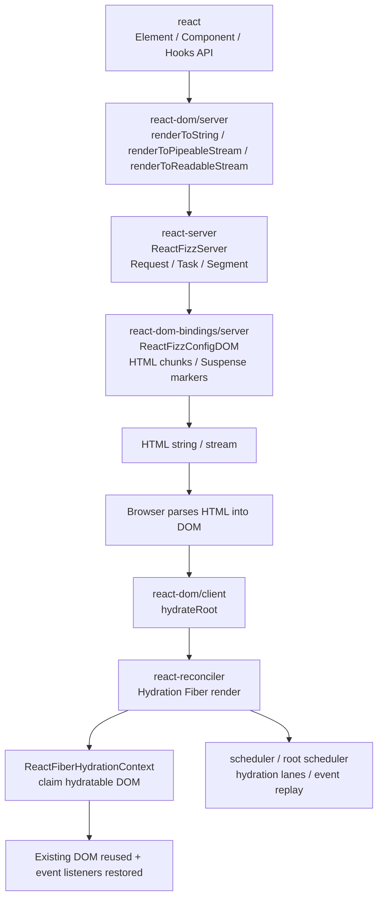
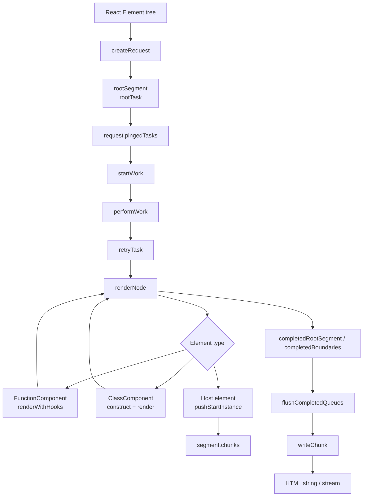
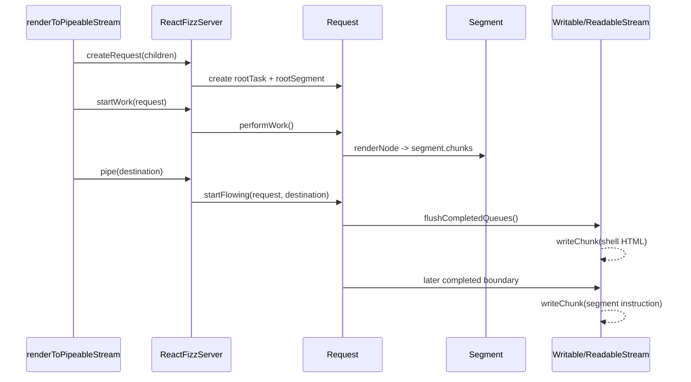
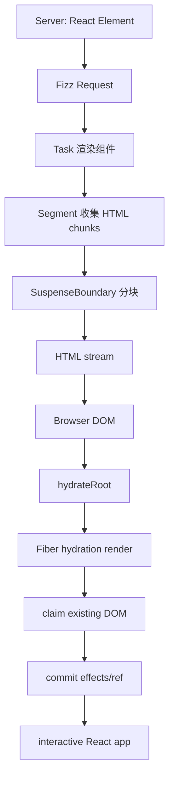

# React SSR 源码学习笔记

本文档以“React 框架源码讲解老师 + SSR 架构师”的视角，基于当前本地 `react-main` 源码整理，目标是理解 React 服务端渲染、流式渲染和 hydration 的源码设计。

重点追踪这两条主线：

```text
服务端：
React Element
  -> Fizz Request
  -> Task / Segment / SuspenseBoundary
  -> HTML chunks
  -> Node stream 或 Web ReadableStream

客户端：
已有 server HTML
  -> hydrateRoot
  -> createHydrationContainer
  -> Fiber hydration render
  -> 认领已有 DOM
  -> 绑定事件 / 执行 effects
```

## 一、SSR 在 React 整体架构中的位置

React SSR 不是一个孤立 API，它横跨 `react`、`react-dom/server`、`react-dom/client`、`react-server`、`react-reconciler` 和 `scheduler`。



各包职责：

| 包 | SSR 中的职责 | 重点文件 |
| --- | --- | --- |
| `react` | 提供 Element、组件、Hooks API。SSR 输入仍然是 React Element | `packages/react/src/ReactClient.js`、`packages/react/src/jsx/ReactJSXElement.js` |
| `react-dom/server` | 暴露服务端渲染 API，并按 Node/Browser/Edge/Bun 环境转发 | `packages/react-dom/server.node.js`、`server.browser.js`、`server.edge.js` |
| `react-server` | Fizz 服务端 renderer 核心，负责把 React tree 渲染成 HTML chunks | `packages/react-server/src/ReactFizzServer.js`、`ReactFizzHooks.js` |
| `react-dom-bindings/server` | DOM SSR host config，负责拼 HTML、属性转义、Suspense marker、inline instruction | `packages/react-dom-bindings/src/server/ReactFizzConfigDOM.js` |
| `react-dom/client` | 客户端 hydration 入口，暴露 `hydrateRoot` | `packages/react-dom/src/client/ReactDOMRoot.js` |
| `react-reconciler` | 客户端 hydration 使用 Fiber reconciler 认领已有 DOM、检测 mismatch、提交 effects | `ReactFiberReconciler.js`、`ReactFiberHydrationContext.js`、`ReactFiberBeginWork.js` |
| `scheduler` | 客户端 hydration 和事件重放需要调度；服务端 Fizz 使用 host stream config 中的 work scheduling | `ReactFiberRootScheduler.js`、`scheduler/src/forks/Scheduler.js` |

关键结论：

```text
服务端 SSR 不创建浏览器 DOM，也不走客户端 Fiber commit DOM mutation。
服务端使用 Fizz 把 React Element 渲染成 HTML chunks。
客户端 hydrateRoot 才进入 Fiber reconciler，并尝试复用服务器已经生成的 DOM。
```

## 二、核心源码文件

### 服务端入口

| API | Node 入口 | Browser/Edge 入口 | 核心实现 |
| --- | --- | --- | --- |
| `renderToString` | `packages/react-dom/server.node.js` | `packages/react-dom/server.browser.js`、`server.edge.js` | `ReactDOMLegacyServerNode.js` / `ReactDOMLegacyServerBrowser.js` -> `ReactDOMLegacyServerImpl.js` |
| `renderToStaticMarkup` | 同上 | 同上 | `renderToStringImpl(..., generateStaticMarkup = true, ...)` |
| `renderToPipeableStream` | `server.node.js` | Node/Bun 环境 | `ReactDOMFizzServerNode.js` |
| `renderToReadableStream` | `server.node.js`、`server.browser.js`、`server.edge.js` | Web Streams 环境 | `ReactDOMFizzServerNode.js`、`ReactDOMFizzServerBrowser.js`、`ReactDOMFizzServerEdge.js` |

### Fizz 核心

| 文件 | 作用 |
| --- | --- |
| `packages/react-server/src/ReactFizzServer.js` | Fizz 主流程，包含 `createRequest`、`startWork`、`performWork`、`renderNode`、`flushCompletedQueues`、`startFlowing` |
| `packages/react-server/src/ReactFizzHooks.js` | 服务端 Hooks dispatcher，`useEffect` / `useLayoutEffect` 在服务端为 noop |
| `packages/react-server/src/ReactFizzThenable.js` | thenable / Suspense 相关状态 |
| `packages/react-server/src/ReactFizzTreeContext.js` | `useId`、树路径和 hydration ID 上下文 |
| `packages/react-dom-bindings/src/server/ReactFizzConfigDOM.js` | DOM HTML chunk 生成、属性转义、Suspense marker 和 segment instruction |
| `packages/react-dom-bindings/src/server/ReactFizzConfigDOMLegacy.js` | legacy `renderToString` / `renderToStaticMarkup` 使用的 DOM Fizz config |

### Hydration 核心

| 文件 | 作用 |
| --- | --- |
| `packages/react-dom/src/client/ReactDOMRoot.js` | `hydrateRoot` 入口 |
| `packages/react-reconciler/src/ReactFiberReconciler.js` | `createHydrationContainer` |
| `packages/react-reconciler/src/ReactFiberWorkLoop.js` | `scheduleInitialHydrationOnRoot` |
| `packages/react-reconciler/src/ReactFiberBeginWork.js` | `updateHostRoot` 进入 hydration、HostComponent/HostText 认领 DOM |
| `packages/react-reconciler/src/ReactFiberHydrationContext.js` | hydration 状态机、DOM 匹配、mismatch 错误 |
| `packages/react-reconciler/src/ReactFiberHydrationDiffs.js` | DEV 下 hydration diff 描述 |
| `packages/react-dom-bindings/src/events/DOMPluginEventSystem.js` | `listenToAllSupportedEvents` 根事件监听 |
| `packages/react-dom-bindings/src/events/ReactDOMEventReplaying.js` | hydration 期间事件队列和重放 |
| `packages/react-dom-bindings/src/events/ReactDOMEventListener.js` | 事件分发时判断是否被未 hydration 边界阻塞 |

## 三、SSR 与 CSR 渲染入口差异

### CSR 入口

CSR 典型代码：

```jsx
const root = createRoot(container);
root.render(<App />);
```

调用链：

```text
createRoot(container)
  -> createContainer(container, ConcurrentRoot, hydrate = false)
  -> createFiberRoot(...)
  -> createHostRootFiber(...)

root.render(<App />)
  -> updateContainer(<App />, root, ...)
  -> createUpdate
  -> enqueueUpdate
  -> scheduleUpdateOnFiber
  -> renderRootConcurrent / renderRootSync
  -> beginWork / completeWork
  -> commitRoot
  -> DOM 插入
```

CSR 的特点：

| 维度 | CSR |
| --- | --- |
| 输入 | React Element |
| 输出 | 浏览器 DOM |
| 是否创建 FiberRoot | 是 |
| 是否创建真实 DOM | 是，`completeWork` 创建，`commitRoot` 插入 |
| 是否执行 commit effects | 是 |
| 是否需要已有 HTML | 不需要 |

### SSR 入口

SSR 典型代码：

```js
const html = renderToString(<App />);
```

或：

```js
const {pipe} = renderToPipeableStream(<App />, {
  onShellReady() {
    pipe(response);
  },
});
```

调用链：

```text
renderToPipeableStream(<App />, options)
  -> createRequestImpl(children, options)
  -> createRequest(children, resumableState, renderState, rootFormatContext, ...)
  -> startWork(request)
  -> performWork(request)
  -> retryTask(request, task)
  -> renderNode(request, task, node, childIndex)
  -> renderElement
  -> renderFunctionComponent / renderClassComponent / renderHostElement
  -> pushStartInstance / pushTextInstance
  -> segment.chunks
  -> flushCompletedQueues
  -> writeChunk / writeChunkAndReturn
```

SSR 的特点：

| 维度 | SSR |
| --- | --- |
| 输入 | React Element |
| 输出 | HTML string 或 HTML stream |
| 是否创建 FiberRoot | 服务端 Fizz 不创建客户端 FiberRoot |
| 是否创建真实 DOM | 不创建浏览器 DOM，只生成字符串 / Uint8Array chunks |
| 是否执行 commit effects | 不执行客户端 commit 阶段 |
| 是否执行 `useEffect` | 不执行，服务端 dispatcher 中为 noop |

SSR 与 CSR 的本质差异：

```text
CSR: React Element -> Fiber -> DOM
SSR: React Element -> Fizz Request/Task/Segment -> HTML chunks
Hydration: server HTML -> Fiber hydration -> reuse DOM
```

## 四、服务端渲染核心 API

### 1. renderToString

入口：

```text
packages/react-dom/server.node.js
  -> packages/react-dom/src/server/ReactDOMLegacyServerNode.js
  -> ReactDOMLegacyServerImpl.js:renderToStringImpl
```

`renderToString` 的实现本质上仍然调用 Fizz，但它把结果收集到字符串 destination 中：

```js
let result = '';
const destination = {
  push(chunk) {
    if (chunk !== null) {
      result += chunk;
    }
    return true;
  },
  destroy(error) {
    didFatal = true;
    fatalError = error;
  },
};
```

核心调用链：

```text
renderToString(children)
  -> renderToStringImpl(children, options, false, abortReason)
  -> createResumableState
  -> createRenderState(resumableState, generateStaticMarkup = false)
  -> createRequest(children, ...)
  -> startWork(request)
  -> abort(request, abortReason)
  -> startFlowing(request, destination)
  -> return result
```

为什么 legacy `renderToString` 不支持等待 Suspense？

`renderToStringImpl` 在 `startWork(request)` 后会立即 `abort(request, abortReason)`，源码注释说明：如果还有 pending 的 Suspense，会在写出前 abort，让它从一开始就写出 client-rendered boundary 信息。因此它不能像流式 SSR 那样等待 Suspense 内容完成。

适用场景：

| 场景 | 是否适合 |
| --- | --- |
| 简单同步 SSR | 可以 |
| 需要 Suspense 等待数据 | 不适合 |
| 需要流式首屏输出 | 不适合 |
| 现代 SSR 推荐 | 优先使用 `renderToPipeableStream` 或 `renderToReadableStream` |

### 2. renderToStaticMarkup

入口：

```text
ReactDOMLegacyServerNode.js:renderToStaticMarkup
  -> renderToStringImpl(children, options, generateStaticMarkup = true, ...)
```

它和 `renderToString` 共享实现，区别是：

```js
renderToStringImpl(children, options, true, abortReason)
```

含义：

| API | 是否面向 hydration | 典型用途 |
| --- | --- | --- |
| `renderToString` | 面向 SSR + hydrate，但不支持等待 Suspense | 老式 SSR |
| `renderToStaticMarkup` | 不面向 hydration | 静态 HTML，例如邮件、纯静态页面片段 |

`renderToStaticMarkup` 的设计目标是输出静态 HTML，而不是为客户端恢复 React 交互做准备。

### 3. renderToPipeableStream

Node 流式 SSR 入口：

```text
packages/react-dom/server.node.js
  -> packages/react-dom/src/server/react-dom-server.node.js
  -> ReactDOMFizzServerNode.js:renderToPipeableStream
```

核心代码结构：

```js
function renderToPipeableStream(children, options) {
  const request = createRequestImpl(children, options);
  let hasStartedFlowing = false;
  startWork(request);
  return {
    pipe(destination) {
      if (hasStartedFlowing) {
        throw new Error('React currently only supports piping to one writable stream.');
      }
      hasStartedFlowing = true;
      prepareForStartFlowingIfBeforeAllReady(request);
      startFlowing(request, destination);
      destination.on('drain', createDrainHandler(destination, request));
      destination.on('error', createCancelHandler(...));
      destination.on('close', createCancelHandler(...));
      return destination;
    },
    abort(reason) {
      abort(request, reason);
    },
  };
}
```

调用链：

```text
renderToPipeableStream
  -> createRequestImpl
  -> createRequest
  -> startWork
  -> performWork
  -> flushCompletedQueues
  -> pipe(destination)
  -> startFlowing(request, destination)
  -> writeChunk(destination, chunk)
```

API 回调：

| 回调 | 触发时机 | 用途 |
| --- | --- | --- |
| `onShellReady` | shell 已经有内容可输出 | 适合开始 `pipe(response)`，尽快让浏览器看到首屏框架 |
| `onShellError` | shell 都无法生成 | 返回错误页面 |
| `onAllReady` | 所有 pending task 完成 | 适合爬虫或静态生成，等待完整 HTML 再输出 |
| `onError` | 渲染中出现可恢复错误 | 记录日志或返回 digest |

### 4. renderToReadableStream

Web Streams 入口：

```text
ReactDOMFizzServerNode.js / Browser.js / Edge.js:renderToReadableStream
```

核心结构：

```js
function renderToReadableStream(children, options) {
  return new Promise((resolve, reject) => {
    const allReady = new Promise(...);

    function onShellReady() {
      const stream = new ReadableStream({
        type: 'bytes',
        start(controller) {
          writable = createFakeWritableFromReadableStreamController(controller);
        },
        pull(controller) {
          startFlowing(request, writable);
        },
        cancel(reason) {
          stopFlowing(request);
          abort(request, reason);
        },
      });
      stream.allReady = allReady;
      resolve(stream);
    }

    const request = createRequestImpl(children, {...options, onShellReady});
    startWork(request);
  });
}
```

它和 Node `renderToPipeableStream` 共享 Fizz 内核，区别只是输出目标从 Node Writable 变成 Web `ReadableStream`。

## 五、服务端如何把 React Element 渲染成 HTML

Fizz 的核心数据流：



服务端渲染的关键函数：

| 函数 | 文件 | 作用 |
| --- | --- | --- |
| `createRequest` | `ReactFizzServer.js` | 创建 SSR request、root segment、root task |
| `startWork` | `ReactFizzServer.js` | 安排服务端 work |
| `performWork` | `ReactFizzServer.js` | 处理 `request.pingedTasks` 并尝试 flush |
| `renderNode` | `ReactFizzServer.js` | 渲染任意 React node，处理 Suspense thenable |
| `renderElement` | `ReactFizzServer.js` | 根据 element type 分发到函数组件、类组件、host element |
| `renderFunctionComponent` | `ReactFizzServer.js` | 服务端执行函数组件，调用 Fizz Hooks dispatcher |
| `renderHostElement` | `ReactFizzServer.js` | 渲染 DOM 标签 |
| `pushStartInstance` | `ReactFizzConfigDOM.js` | 生成开始标签和属性 chunk |
| `pushTextInstance` | `ReactFizzConfigDOM.js` | 转义文本并 push 到 chunks |
| `flushCompletedQueues` | `ReactFizzServer.js` | 按 root、clientRenderedBoundary、completedBoundary、partialBoundary 顺序写出 |

服务端不会创建真实 DOM：

```text
HostComponent 在客户端 completeWork 中会 createInstance，也就是 document.createElement。
HostComponent 在服务端 Fizz 中会 pushStartInstance，也就是拼 HTML chunk。
```

示例：

```jsx
function App() {
  return <div className="app">Hello</div>;
}
```

服务端大致做的是：

```text
renderFunctionComponent(App)
  -> App()
  -> <div className="app">Hello</div>
  -> renderHostElement("div")
  -> pushStartInstance(..., "div", {className: "app"})
  -> pushTextInstance(..., "Hello")
  -> chunks: ["<div class=\"app\">", "Hello", "</div>"]
```

## 六、核心数据结构

### Request

`Request` 是一次 SSR 渲染请求的全局状态容器。

核心字段：

| 字段 | 作用 |
| --- | --- |
| `destination` | 当前写入目标，Node Writable 或 Web Stream 包装 writable |
| `resumableState` | 可恢复/可标识的服务端状态，例如 id prefix 等 |
| `renderState` | DOM SSR 渲染状态，例如 bootstrap scripts、resources、marker 前缀 |
| `rootFormatContext` | HTML/SVG/MathML 等格式上下文 |
| `status` | OPENING、OPEN、ABORTING、CLOSING、CLOSED 等 |
| `nextSegmentId` | 给延迟 segment 分配 id |
| `allPendingTasks` | 所有未完成任务数 |
| `pendingRootTasks` | root shell 未完成任务数 |
| `completedRootSegment` | root 已完成但未 flush 的 segment |
| `pingedTasks` | 可继续执行的高优先级 task |
| `clientRenderedBoundaries` | 错误或被 abort，需要客户端渲染的 boundaries |
| `completedBoundaries` | 已完成但还没完整 flush 的 boundaries |
| `partialBoundaries` | 可部分 flush 的 boundaries |
| `onShellReady` | shell 可输出回调 |
| `onAllReady` | 所有任务完成回调 |
| `onError` | 可恢复错误回调 |

### Task

`Task` 表示 Fizz 中一个可执行渲染任务。

核心字段：

| 字段 | 作用 |
| --- | --- |
| `node` | 当前要渲染的 React node |
| `blockedBoundary` | 这个 task 属于哪个 root 或 Suspense boundary |
| `blockedSegment` | task 输出写入的 segment |
| `ping` | thenable resolve 后重新把 task 放回 pingedTasks |
| `formatContext` | 当前 HTML/SVG/MathML 上下文 |
| `context` | React 新 context snapshot |
| `treeContext` | `useId` / tree path 上下文 |
| `thenableState` | Suspense/use thenable 状态 |
| `legacyContext` | legacy context |

### Segment

`Segment` 是 HTML 输出片段。

| 字段 | 作用 |
| --- | --- |
| `status` | PENDING、COMPLETED、FLUSHED、ABORTED、ERRORED、POSTPONED、RENDERING |
| `id` | segment id，父已 flush 但子后完成时需要 id |
| `chunks` | 当前 segment 的 HTML chunks |
| `children` | 子 segment |
| `boundary` | 如果该 segment 属于某个 SuspenseBoundary |
| `parentFormatContext` | 父格式上下文 |
| `lastPushedText` | 判断文本分隔符 |

### SuspenseBoundary

`SuspenseBoundary` 是流式 SSR 中最重要的结构。

| 字段 | 作用 |
| --- | --- |
| `status` | PENDING、COMPLETED、ERRORED、POSTPONED 等 |
| `rootSegmentID` | boundary 内容对应的 segment id |
| `pendingTasks` | boundary 内未完成 task 数 |
| `completedSegments` | boundary 内已完成可 flush 的 segments |
| `fallbackAbortableTasks` | 如果内容完成，可取消 fallback 任务 |
| `contentState` / `fallbackState` | content/fallback 的 hoistable resource 状态 |
| `errorDigest` | 服务端错误摘要 |

### Hydration 状态

客户端 hydration 的全局状态在 `ReactFiberHydrationContext.js` 中维护：

| 字段 | 作用 |
| --- | --- |
| `nextHydratableInstance` | 当前准备认领的下一个 DOM 节点 |
| `hydrationParentFiber` | 当前 hydration 父 Fiber |
| `isHydrating` | 是否正在 hydration |
| `hydrationErrors` | hydration mismatch / recoverable errors |
| `hydrationDiffRootDEV` | DEV 下构造 mismatch diff |

## 七、服务端渲染是否执行 useEffect

不会。

服务端 Hooks dispatcher 在 `ReactFizzHooks.js` 中定义。当前源码里，当服务端支持 Client APIs 时：

```js
useInsertionEffect: noop,
useLayoutEffect: noop,
useImperativeHandle: noop,
useEffect: noop,
useDebugValue: noop,
```

这意味着：

| Hook | 服务端行为 |
| --- | --- |
| `useEffect` | 不执行 |
| `useLayoutEffect` | 不执行 |
| `useInsertionEffect` | 不执行 |
| `useImperativeHandle` | 不执行 |
| `useMemo` | 会参与 render 计算 |
| `useState` | 在支持 Client APIs 的 SSR 中可用于初始 render 状态 |
| `useId` | 会生成可 hydration 对齐的 id |

设计原因：

```text
服务端没有真实 DOM，也没有 commit 阶段。
effect 的语义是“渲染提交后执行副作用”，所以服务端 render 不能执行 effect。
```

这也是为什么把数据请求写在 `useEffect` 里不会帮助 SSR 输出完整 HTML：`useEffect` 要等客户端 hydration/commit 后才会执行。

## 八、流式 SSR 如何分块输出 HTML

流式 SSR 的关键不是一次性返回完整字符串，而是把可用的 HTML 分成 segment 和 boundary，谁完成谁进入可 flush 队列。

核心流程：

```text
createRequest
  -> 创建 rootSegment 和 rootTask
  -> request.pingedTasks.push(rootTask)

startWork
  -> scheduleMicrotask(performWork)
  -> scheduleWork(enqueueEarlyPreloadsAfterInitialWork)

performWork
  -> 遍历 pingedTasks
  -> retryTask
  -> renderNode
  -> segment.chunks 写入 HTML chunks
  -> 如果 request.destination 存在，flushCompletedQueues

startFlowing
  -> request.destination = destination
  -> flushCompletedQueues(request, destination)
```

`flushCompletedQueues` 的写出顺序：

| 顺序 | 队列 | 作用 |
| --- | --- | --- |
| 1 | `completedRootSegment` | 先 flush shell/root |
| 2 | `clientRenderedBoundaries` | 通知客户端某些 boundary 改为客户端渲染 |
| 3 | `completedBoundaries` | flush 已完成 Suspense boundary |
| 4 | `partialBoundaries` | flush 可渐进输出的部分 boundary segments |
| 5 | hoistables / preloads | 输出需要提升的资源和指令 |

分块输出图：



为什么要有 `progressiveChunkSize`？

`ReactFizzServer.js` 中有默认 `DEFAULT_PROGRESSIVE_CHUNK_SIZE = 12800`，注释说明目标是让新内容大约每 500ms 能显示一次，避免过小 chunk 带来额外开销，也避免过大 shell 延迟首屏。

## 九、Suspense 在 SSR 中如何工作

Suspense 是流式 SSR 的分界点。它允许 React 先输出 shell 和 fallback，再等异步内容完成后补发 boundary 内容。

核心机制：

```text
renderNode 遇到 thenable
  -> 捕获 SuspenseException / thenable
  -> 创建或挂起 task
  -> task 关联 SuspenseBoundary
  -> fallback 可以先完成并进入 shell
  -> thenable resolve 后 task.ping
  -> request.pingedTasks.push(task)
  -> performWork 重试
  -> boundary.completedSegments 收集完成内容
  -> flushCompletedQueues 输出完成 boundary 指令
```

SuspenseBoundary 数据：

```text
SuspenseBoundary
  status = PENDING
  pendingTasks = N
  completedSegments = []
  fallbackAbortableTasks = Set<Task>
```

当内容完成：

```text
pendingTasks -> 0
completedSegments 有内容
boundary 进入 completedBoundaries
flushCompletedQueues 输出隐藏 segment + 完成指令
浏览器端脚本/数据指令把 fallback 替换为真实内容
```

传统 `renderToString` 和 Suspense：

| API | Suspense 行为 |
| --- | --- |
| `renderToString` | 不等待 Suspense，遇到 pending 会 abort，提示使用流式 API |
| `renderToPipeableStream` | 支持 shell 先出，boundary 后续分块补齐 |
| `renderToReadableStream` | 同样支持流式 Suspense，只是使用 Web Streams |

设计思想：

```text
Suspense boundary 是 SSR 流的天然切分点。
它让首屏 shell 和慢数据区域解耦，避免整个 HTML 被最慢的子树阻塞。
```

## 十、hydrateRoot 如何复用服务端已有 DOM

客户端代码：

```jsx
hydrateRoot(document.getElementById('root'), <App />);
```

入口：

```text
packages/react-dom/src/client/ReactDOMRoot.js:hydrateRoot
```

调用链：

```text
hydrateRoot(container, initialChildren, options)
  -> createHydrationContainer(initialChildren, null, container, ConcurrentRoot, ...)
  -> createFiberRoot(containerInfo, tag, hydrate = true, initialChildren, ...)
  -> requestUpdateLane(current)
  -> getBumpedLaneForHydrationByLane(lane)
  -> createUpdate(lane)
  -> enqueueUpdate(current, update, lane)
  -> scheduleInitialHydrationOnRoot(root, lane)
  -> markContainerAsRoot(root.current, container)
  -> listenToAllSupportedEvents(container)
  -> return new ReactDOMHydrationRoot(root)
```

`createHydrationContainer` 的特殊点：

```js
const hydrate = true;
const root = createFiberRoot(containerInfo, tag, hydrate, initialChildren, ...);
```

并且它使用专门的调度入口：

```js
scheduleInitialHydrationOnRoot(root, lane);
```

源码注释明确说明：hydration root 的 initial render 必须匹配服务端渲染结果，因此和普通 `createRoot` 的初始更新区分开。

Hydration 开始：

```text
updateHostRoot
  -> root state isDehydrated = true
  -> enterHydrationState(workInProgress)
  -> mountChildFibers(...)
  -> 给子 Fiber 标记 Hydrating
```

`enterHydrationState` 做的事：

```js
const parentInstance = fiber.stateNode.containerInfo;
nextHydratableInstance = getFirstHydratableChildWithinContainer(parentInstance);
hydrationParentFiber = fiber;
isHydrating = true;
hydrationErrors = null;
```

核心思想：

```text
hydrateRoot 不先清空 container。
它从 container 的第一个可 hydration DOM 节点开始，按照 Fiber render 的顺序逐个“认领”现有 DOM。
```

## 十一、hydration mismatch 如何检测和处理

HostComponent hydration：

```text
updateHostComponent
  -> current === null
  -> tryToClaimNextHydratableInstance(workInProgress)
```

HostText hydration：

```text
tryToClaimNextHydratableTextInstance(workInProgress)
```

DOM 匹配逻辑：

```text
tryToClaimNextHydratableInstance
  -> validateHydratableInstance(type, props, hostContext)
  -> nextInstance = nextHydratableInstance
  -> tryHydrateInstance(fiber, nextInstance, currentHostContext)
  -> 失败则 warnNonHydratedInstance + throwOnHydrationMismatch
```

文本匹配逻辑：

```text
tryToClaimNextHydratableTextInstance
  -> validateHydratableTextInstance(text, hostContext)
  -> tryHydrateText(fiber, nextInstance)
  -> 失败则 throwOnHydrationMismatch(fiber)
```

`throwOnHydrationMismatch` 会：

1. DEV 下生成 diff 描述。
2. 创建错误，说明 server rendered HTML/text 和 client 不匹配。
3. `queueHydrationError(...)` 记录 recoverable error。
4. 抛出 `HydrationMismatchException`。

React 的处理策略：

| 情况 | 处理 |
| --- | --- |
| 可恢复 mismatch | 记录 recoverable error，切到客户端重新生成相关树 |
| root 还没 hydrate 就收到早期更新 | `mountHostRootWithoutHydrating`，整个 root 切到 client rendering |
| Suspense boundary 内 mismatch | 通常可以局部 client render boundary |
| 严重错误 | 触发错误处理和 fallback |

相关源码：

```text
ReactFiberHydrationContext.js
  -> throwOnHydrationMismatch
  -> queueHydrationError
  -> upgradeHydrationErrorsToRecoverable

ReactFiberBeginWork.js
  -> mountHostRootWithoutHydrating
  -> ForceClientRender
```

常见 mismatch 原因：

| 原因 | 示例 |
| --- | --- |
| server/client 分支不同 | `if (typeof window !== 'undefined')` |
| 非确定性值 | `Date.now()`、`Math.random()` |
| locale 不一致 | 服务端和客户端日期格式不同 |
| 外部数据不一致 | 服务端 HTML 和客户端首次数据快照不同 |
| HTML 结构非法 | 浏览器 parser 自动修正嵌套结构 |
| 浏览器插件修改 HTML | React 接手前 DOM 被改过 |

## 十二、事件监听如何在 hydration 后恢复

`hydrateRoot` 会立即调用：

```js
listenToAllSupportedEvents(container);
```

这和 `createRoot` 类似，都是在 root container 上建立事件委托。

事件系统入口：

```text
listenToAllSupportedEvents(rootContainerElement)
  -> allNativeEvents.forEach(...)
  -> listenToNativeEvent(domEventName, capture/bubble, rootContainerElement)
```

这意味着：

```text
事件监听不需要等整棵树 hydration 完才注册。
React 可以先在 root 上捕获事件，再判断事件目标是否已经完成 hydration。
```

事件分发时：

```text
dispatchEvent
  -> findInstanceBlockingEvent(nativeEvent)
  -> 如果没有 blockedOn，正常 dispatchEventForPluginEventSystem
  -> 如果被未 hydration 的 Suspense/Activity/container 阻塞，尝试 queueIfContinuousEvent
```

事件重放：

```text
queueIfContinuousEvent
  -> 记录 blockedOn、event type、targetContainer、nativeEvent

hydration 边界完成
  -> retryIfBlockedOn(...)
  -> scheduleCallback(NormalPriority, replayUnblockedEvents)
  -> replayUnblockedEvents()
```

显式 hydration：

```js
ReactDOMHydrationRoot.prototype.unstable_scheduleHydration = scheduleHydration;
```

它会调用：

```text
queueExplicitHydrationTarget(target)
  -> 按事件优先级插入 queuedExplicitHydrationTargets
  -> attemptExplicitHydrationTarget
```

设计原因：

```text
SSR 页面在 JS 加载后可能还没全部 hydrate。
React 需要尽早接管事件，但又不能对尚未 hydrate 的边界直接执行事件处理。
所以它把事件委托、阻塞判断、选择性 hydration、事件重放组合在一起。
```

## 十三、SSR 与 Fiber / Reconciler 的关系

这是最容易混淆的点。

### 服务端 SSR 与 Fiber

服务端 Fizz 不走客户端 Fiber work loop：

```text
服务端不是：
createFiberRoot -> beginWork -> completeWork -> commitRoot

服务端是：
createRequest -> Task -> renderNode -> Segment -> flush chunks
```

服务端没有：

| 客户端概念 | 服务端 Fizz 是否使用 |
| --- | --- |
| FiberRoot | 不使用客户端 FiberRoot |
| workInProgress Fiber 树 | 不使用 |
| completeWork 创建 DOM | 不使用 |
| commitRoot | 不使用 |
| DOM mutation | 不使用 |
| useEffect commit | 不使用 |

但服务端仍然共享 React 的高层语义：

| 共享语义 | 说明 |
| --- | --- |
| React Element | SSR 输入仍然是 Element tree |
| 函数组件执行 | 服务端会执行函数组件 |
| class component render | 服务端会构造并 render class component |
| context | Fizz 有自己的 context snapshot |
| Hooks | Fizz 有服务端 Hooks dispatcher |
| Suspense | Fizz 原生支持 thenable 和 boundary |
| `useId` | 服务端生成可 hydration 对齐的 id |

### Hydration 与 Fiber

客户端 hydration 完全进入 Fiber reconciler：

```text
hydrateRoot
  -> createHydrationContainer
  -> FiberRoot(hydrate = true)
  -> scheduleInitialHydrationOnRoot
  -> renderRootConcurrent
  -> beginWork
  -> enterHydrationState
  -> tryToClaimNextHydratableInstance
  -> completeWork
  -> commitRoot
```

区别在于：

```text
普通 CSR mount:
  HostComponent current === null
  completeWork 创建 DOM
  commitRoot 插入 DOM

Hydration:
  HostComponent current === null
  beginWork 尝试认领已有 DOM
  completeWork 复用 stateNode
  commitRoot 绑定 effects/ref，必要时修复或切 client render
```

一句话总结：

```text
SSR 生成 HTML 不依赖客户端 Fiber。
Hydration 复用 HTML 必须依赖 Fiber。
```

## 十四、SSR 与 CSR 调用链对比

| 阶段 | CSR | SSR | Hydration |
| --- | --- | --- | --- |
| 入口 | `createRoot().render()` | `renderToString` / `renderToPipeableStream` | `hydrateRoot(container, <App />)` |
| 根对象 | `FiberRootNode` | `Request` | `FiberRootNode(hydrate = true)` |
| 工作单元 | `Fiber` | `Task` / `Segment` | `Fiber` |
| 渲染函数 | `beginWork` / `completeWork` | `renderNode` / `renderElement` | `beginWork` / `completeWork` with hydration |
| 输出 | DOM mutation | HTML chunks | 复用已有 DOM + 事件/effects |
| Suspense | render 中 suspend，commit fallback 或 retry | boundary 分块输出 fallback/content | 可选择性 hydrate boundary |
| effects | commit 后执行 | 不执行 | hydrate commit 后执行 |
| scheduler | lane + Scheduler | Fizz host scheduling / stream backpressure | lane + Scheduler + event replay |

## 十五、核心问题速答

| 问题 | 答案 |
| --- | --- |
| SSR 和 CSR 的渲染入口有什么不同？ | CSR 从 `createRoot/root.render` 进入 Fiber reconciler；SSR 从 `react-dom/server` 进入 Fizz `createRequest/startWork/startFlowing` |
| 服务端如何把 React Element 渲染成 HTML？ | Fizz 创建 Request/Task/Segment，执行组件，host element 通过 `pushStartInstance` / `pushTextInstance` 写入 chunks，最后 flush 到 string/stream |
| 服务端渲染是否会创建真实 DOM？ | 不会。服务端只生成 HTML 字符串或字节流 |
| 服务端渲染是否会执行 useEffect？ | 不会。Fizz Hooks dispatcher 中 `useEffect`、`useLayoutEffect` 等为 noop |
| 流式 SSR 如何分块输出 HTML？ | Fizz 用 Segment 和 SuspenseBoundary 切分输出，root shell、completed boundaries、partial boundaries 按队列 flush |
| Suspense 在 SSR 中如何工作？ | thenable 挂起 task，fallback 可先输出；内容 resolve 后 task ping，boundary 完成后输出 segment instruction 替换 fallback |
| hydrateRoot 如何复用服务端已有 DOM？ | 创建 hydrate=true 的 FiberRoot，进入 hydration state，从 container 第一个 hydratable child 开始按 Fiber 顺序认领 DOM |
| hydration mismatch 如何检测？ | `tryToClaimNextHydratableInstance/TextInstance` 匹配失败时调用 `throwOnHydrationMismatch`，记录 recoverable error 并局部或整体切客户端渲染 |
| 事件监听如何恢复？ | `hydrateRoot` 立即 `listenToAllSupportedEvents(container)`；未 hydrate 边界上的事件会阻塞、排队，hydration 完成后 replay |
| SSR 和 Fiber/Reconciler 是什么关系？ | 服务端 HTML 生成走 Fizz，不走客户端 Fiber；客户端 hydration 走 Fiber reconciler 来复用 DOM |

## 十六、React SSR 设计思想总结

React SSR 的设计可以总结成四层：

```text
1. Server render:
   把 React Element 转成可渐进输出的 HTML chunks。

2. Streaming:
   用 Suspense boundary 把页面切成 shell、fallback、content segment。

3. Hydration:
   客户端用 Fiber 重新计算同一棵 UI，并按顺序认领已有 DOM。

4. Interactivity:
   root 事件委托先接管页面，未 hydrate 的边界通过事件重放恢复交互。
```

设计取舍：

| 设计 | 解决的问题 |
| --- | --- |
| Fizz Request/Task/Segment | 服务端不需要 DOM/Fiber commit，只需要可中断、可分块的 HTML 生成模型 |
| SuspenseBoundary | 让慢数据区域不阻塞 shell 输出 |
| HTML markers/instructions | 让客户端能识别 boundary、segment、placeholder，并完成替换或 hydration |
| hydrateRoot | 复用服务端 DOM，避免首屏重新创建 DOM |
| hydration mismatch recoverable error | 保证不一致时可以退回客户端渲染，而不是静默产生错误 UI |
| event replay | 在页面还没完全 hydrate 时仍能接住用户交互 |

与客户端 Fiber 的分工：

```text
Fizz 负责“先把 HTML 送出去”。
Fiber hydration 负责“把 HTML 恢复成可交互 React 应用”。
Scheduler 负责“在客户端按优先级安排 hydration 和后续更新”。
```

最终心智模型：



一句话：

```text
React SSR 的核心不是“在服务端模拟浏览器渲染 DOM”，而是“在服务端生成可恢复的 HTML 流，并在客户端用 Fiber 把这份 HTML 接回 React 的交互系统”。
```

## 十七、推荐阅读顺序

第一阶段：服务端输出主线

| 顺序 | 文件 | 重点 |
| --- | --- | --- |
| 1 | `packages/react-dom/server.node.js` | API 如何转发 |
| 2 | `ReactDOMLegacyServerNode.js`、`ReactDOMLegacyServerImpl.js` | `renderToString` / `renderToStaticMarkup` |
| 3 | `ReactDOMFizzServerNode.js` | `renderToPipeableStream` / `renderToReadableStream` |
| 4 | `ReactFizzServer.js` | `createRequest`、`startWork`、`performWork`、`flushCompletedQueues` |
| 5 | `ReactFizzConfigDOM.js` | HTML chunk、Suspense marker、segment instruction |

第二阶段：Suspense streaming

| 顺序 | 文件 | 重点 |
| --- | --- | --- |
| 1 | `ReactFizzServer.js` | `SuspenseBoundary`、`Segment`、`pingedTasks` |
| 2 | `ReactFizzThenable.js` | thenable 状态 |
| 3 | `ReactFizzConfigDOM.js` | pending/completed boundary marker |
| 4 | `ReactDOMFizzServer-test.js` | Fizz 行为测试 |

第三阶段：客户端 hydration

| 顺序 | 文件 | 重点 |
| --- | --- | --- |
| 1 | `ReactDOMRoot.js` | `hydrateRoot` |
| 2 | `ReactFiberReconciler.js` | `createHydrationContainer` |
| 3 | `ReactFiberHydrationContext.js` | `enterHydrationState`、`tryToClaimNextHydratableInstance`、mismatch |
| 4 | `ReactFiberBeginWork.js` | `updateHostRoot`、`updateHostComponent` hydration 分支 |
| 5 | `ReactDOMEventReplaying.js` | 事件重放 |

第四阶段：整体对照

建议把 SSR 和你前面已经整理过的 CSR 主线一起对照：

```text
CSR:
createRoot -> updateContainer -> Fiber render -> commit DOM

SSR:
renderToPipeableStream -> Fizz render -> HTML chunks

Hydration:
hydrateRoot -> Fiber hydration -> claim DOM -> restore interactivity
```
