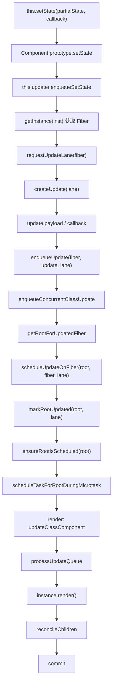
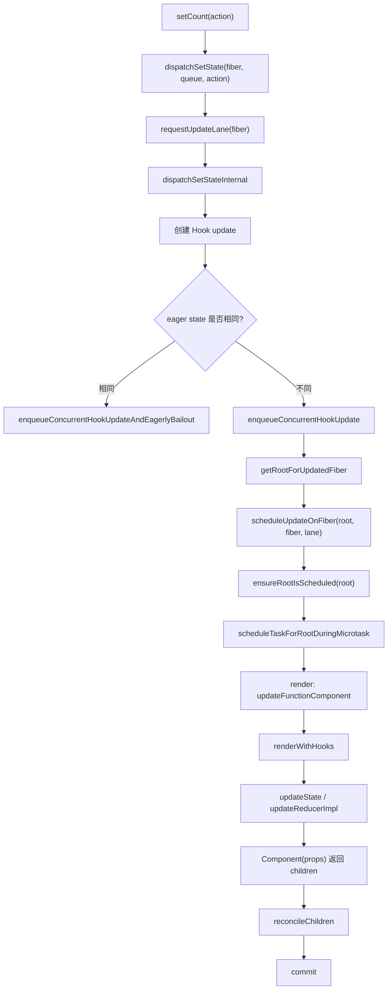
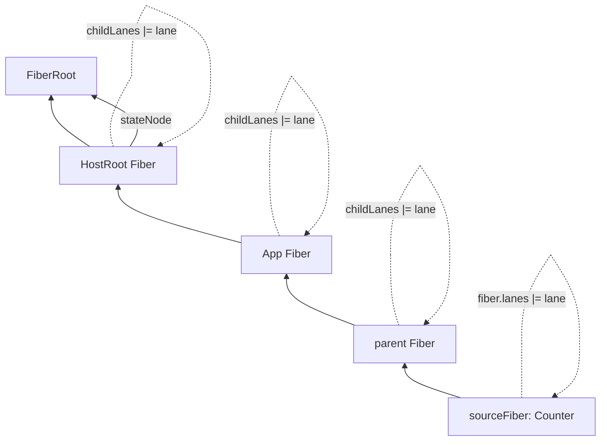

# React 状态更新完整源码流程分析

本文基于当前 `react-main` 源码，梳理一次状态更新从用户代码触发，到生成 `update`，进入 `updateQueue`，分配 `lane`，找到 `FiberRoot`，进入调度，再到 render 阶段消费队列并重新渲染组件的完整链路。

重点覆盖两条入口：

- class component：`this.setState(partialState, callback)`
- function component：`const [state, setState] = useState(initialState)` 后调用 `setState(action)`

## 一、整体结论

React 中一次状态更新可以抽象成下面这条主线：

```text
用户调用 setState / dispatch
  -> 根据当前 Fiber 分配 lane
  -> 创建 update 对象
  -> update 进入组件对应的 updateQueue
  -> 沿 Fiber.return 向上找到 HostRoot 对应的 FiberRoot
  -> scheduleUpdateOnFiber(root, fiber, lane)
  -> markRootUpdated(root, lane)
  -> ensureRootIsScheduled(root)
  -> root scheduler 选择 nextLanes 并安排任务
  -> render 阶段从 updateQueue 计算新 state
  -> 重新执行 class render 或 function component
  -> reconcileChildren 生成新的 workInProgress 子树
  -> commit 阶段把变更应用到宿主环境
```

class 和 hooks 的差异主要在两点：

| 对比项 | class component | function component |
| --- | --- | --- |
| 用户入口 | `this.setState` | `useState` 返回的 `dispatch` |
| update 存放位置 | `fiber.updateQueue` | 当前 Hook 节点的 `hook.queue` |
| state 计算方式 | `processUpdateQueue` + `getStateFromUpdate` | `updateReducerImpl` + `basicStateReducer` |
| partial object 合并 | 会浅合并到旧 state | 不会自动合并，action 直接替换或经函数计算 |
| eager bailout | 无主要路径 | `dispatchSetStateInternal` 可提前计算 eager state，相同则不调度重渲染 |

## 二、关键源码文件

| 文件 | 作用 |
| --- | --- |
| `packages/react/src/ReactBaseClasses.js` | `Component.prototype.setState` 的用户入口 |
| `packages/react-reconciler/src/ReactFiberClassComponent.js` | class 组件实例创建、updater 注入、`enqueueSetState`、class 更新生命周期 |
| `packages/react-reconciler/src/ReactFiberClassUpdateQueue.js` | class update / updateQueue 数据结构与消费逻辑 |
| `packages/react-reconciler/src/ReactFiberHooks.js` | `useState`、Hook updateQueue、dispatch、Hook 队列消费逻辑 |
| `packages/react-reconciler/src/ReactFiberConcurrentUpdates.js` | 并发更新暂存队列、把 update 挂入 queue、向上寻找 root |
| `packages/react-reconciler/src/ReactFiberWorkLoop.js` | `requestUpdateLane`、`scheduleUpdateOnFiber`、render work loop 入口 |
| `packages/react-reconciler/src/ReactFiberRootScheduler.js` | root 级调度队列、microtask、Scheduler callback 安排 |
| `packages/react-reconciler/src/ReactFiberBeginWork.js` | `beginWork` 中更新 function/class component，并调用 render / reconcileChildren |
| `packages/react-reconciler/src/ReactFiberLane.js` | lane 位图模型、lane 合并、优先级选择 |

## 三、class component 的 setState 调用链

### 1. 示例代码

```jsx
class Counter extends React.Component {
  state = {count: 0};

  add = () => {
    this.setState(
      prev => ({count: prev.count + 1}),
      () => console.log('committed'),
    );
  };

  render() {
    return <button onClick={this.add}>{this.state.count}</button>;
  }
}
```

### 2. 用户入口：Component.prototype.setState

源码位置：

```text
packages/react/src/ReactBaseClasses.js
```

核心逻辑：

```js
Component.prototype.setState = function (partialState, callback) {
  if (
    typeof partialState !== 'object' &&
    typeof partialState !== 'function' &&
    partialState != null
  ) {
    throw new Error('takes an object of state variables to update or a function...');
  }

  this.updater.enqueueSetState(this, partialState, callback, 'setState');
};
```

这里 `setState` 本身不直接修改 `this.state`。它只是把请求交给 `this.updater.enqueueSetState`。

关键点：

| 字段/动作 | 含义 |
| --- | --- |
| `partialState` | 可以是对象、函数或 `null` |
| `callback` | commit 后执行的回调 |
| `this.updater` | class 实例对应的更新器，真正实现在 reconciler 中 |

### 3. updater 是什么时候注入的？

源码位置：

```text
packages/react-reconciler/src/ReactFiberClassComponent.js
```

class 实例创建或挂载过程中，React 会把 reconciler 里的 `classComponentUpdater` 注入到实例上：

```js
instance.updater = classComponentUpdater;
```

因此用户调用：

```js
this.setState(...)
```

最终会进入：

```js
classComponentUpdater.enqueueSetState(...)
```

### 4. enqueueSetState 做了什么？

源码位置：

```text
packages/react-reconciler/src/ReactFiberClassComponent.js
```

核心调用链：

```text
enqueueSetState(inst, payload, callback)
  -> fiber = getInstance(inst)
  -> lane = requestUpdateLane(fiber)
  -> update = createUpdate(lane)
  -> update.payload = payload
  -> update.callback = callback
  -> root = enqueueUpdate(fiber, update, lane)
  -> scheduleUpdateOnFiber(root, fiber, lane)
  -> entangleTransitions(root, fiber, lane)
```

简化源码：

```js
enqueueSetState(inst, payload, callback) {
  const fiber = getInstance(inst);
  const lane = requestUpdateLane(fiber);

  const update = createUpdate(lane);
  update.payload = payload;

  if (callback !== undefined && callback !== null) {
    update.callback = callback;
  }

  const root = enqueueUpdate(fiber, update, lane);
  if (root !== null) {
    scheduleUpdateOnFiber(root, fiber, lane);
    entangleTransitions(root, fiber, lane);
  }
}
```

这里有四个核心动作：

| 步骤 | 含义 |
| --- | --- |
| `getInstance(inst)` | 从 class 实例拿到对应 Fiber |
| `requestUpdateLane(fiber)` | 为这次更新分配优先级 lane |
| `createUpdate(lane)` | 创建 class update 对象 |
| `enqueueUpdate(...)` | 把 update 加入队列并找到 root |
| `scheduleUpdateOnFiber(...)` | 通知 root 有更新需要调度 |

## 四、function component 的 useState dispatch 调用链

### 1. 示例代码

```jsx
function Counter() {
  const [count, setCount] = React.useState(0);

  return (
    <button onClick={() => setCount(c => c + 1)}>
      {count}
    </button>
  );
}
```

### 2. useState 首次渲染时创建了什么？

源码位置：

```text
packages/react-reconciler/src/ReactFiberHooks.js
```

首次渲染走 `mountState`：

```text
mountState(initialState)
  -> mountStateImpl(initialState)
  -> 创建 Hook 节点
  -> 创建 hook.queue
  -> dispatch = dispatchSetState.bind(null, currentlyRenderingFiber, queue)
  -> queue.dispatch = dispatch
  -> return [hook.memoizedState, dispatch]
```

简化源码：

```js
function mountState(initialState) {
  const hook = mountStateImpl(initialState);
  const queue = hook.queue;

  const dispatch = dispatchSetState.bind(
    null,
    currentlyRenderingFiber,
    queue,
  );

  queue.dispatch = dispatch;
  return [hook.memoizedState, dispatch];
}
```

因此 `setCount` 本质上是一个已经绑定了 `fiber` 和 `queue` 的函数。

### 3. dispatch 调用后发生了什么？

调用：

```js
setCount(c => c + 1);
```

进入：

```text
dispatchSetState(fiber, queue, action)
  -> lane = requestUpdateLane(fiber)
  -> didScheduleUpdate = dispatchSetStateInternal(fiber, queue, action, lane)
  -> markUpdateInDevTools(fiber, lane, action)
```

`dispatchSetStateInternal` 的核心链路：

```text
dispatchSetStateInternal(fiber, queue, action, lane)
  -> 创建 Hook update
  -> 如果是 render phase update：enqueueRenderPhaseUpdate
  -> 否则尝试 eager state 计算
  -> 如果 eager state 与当前 state 相同：enqueueConcurrentHookUpdateAndEagerlyBailout
  -> 否则 root = enqueueConcurrentHookUpdate(fiber, queue, update, lane)
  -> scheduleUpdateOnFiber(root, fiber, lane)
  -> entangleTransitionUpdate(root, queue, lane)
```

简化源码：

```js
function dispatchSetState(fiber, queue, action) {
  const lane = requestUpdateLane(fiber);
  const didScheduleUpdate = dispatchSetStateInternal(
    fiber,
    queue,
    action,
    lane,
  );
  if (didScheduleUpdate) {
    startUpdateTimerByLane(lane, 'setState()', fiber);
  }
}
```

Hook update 创建逻辑大致是：

```js
const update = {
  lane,
  revertLane: NoLane,
  action,
  hasEagerState: false,
  eagerState: null,
  next: null,
  gesture: null,
};
```

## 五、update 对象是如何创建的？

### 1. class update

源码位置：

```text
packages/react-reconciler/src/ReactFiberClassUpdateQueue.js
```

类型结构：

```js
export type Update<State> = {
  lane: Lane,
  tag: 0 | 1 | 2 | 3,
  payload: any,
  callback: (() => mixed) | null,
  next: Update<State> | null,
};
```

`createUpdate(lane)` 返回：

```js
const update = {
  lane,
  tag: UpdateState,
  payload: null,
  callback: null,
  next: null,
};
```

字段说明：

| 字段 | 含义 |
| --- | --- |
| `lane` | 本次更新的优先级 |
| `tag` | 更新类型，如 `UpdateState`、`ReplaceState`、`ForceUpdate`、`CaptureUpdate` |
| `payload` | `setState` 传入的对象或函数 |
| `callback` | `setState` 第二个参数，commit 后执行 |
| `next` | 指向下一个 update，组成链表 |

### 2. Hook update

源码位置：

```text
packages/react-reconciler/src/ReactFiberHooks.js
```

类型结构：

```js
export type Update<S, A> = {
  lane: Lane,
  revertLane: Lane,
  action: A,
  hasEagerState: boolean,
  eagerState: S | null,
  next: Update<S, A>,
  gesture: ScheduledGesture | null,
};
```

字段说明：

| 字段 | 含义 |
| --- | --- |
| `lane` | 本次 Hook 更新的优先级 |
| `action` | `setState(action)` 传入的值或函数 |
| `hasEagerState` | 是否已经提前计算出新 state |
| `eagerState` | eager 计算得到的新 state |
| `revertLane` | optimistic update / transition 相关的回滚 lane |
| `gesture` | 手势 transition 相关字段 |
| `next` | 指向下一个 Hook update，组成环形链表 |

## 六、updateQueue 数据结构

### 1. class updateQueue

源码位置：

```text
packages/react-reconciler/src/ReactFiberClassUpdateQueue.js
```

结构：

```js
export type UpdateQueue<State> = {
  baseState: State,
  firstBaseUpdate: Update<State> | null,
  lastBaseUpdate: Update<State> | null,
  shared: SharedQueue<State>,
  callbacks: Array<() => mixed> | null,
};

export type SharedQueue<State> = {
  pending: Update<State> | null,
  lanes: Lanes,
  hiddenCallbacks: Array<() => mixed> | null,
};
```

可以理解为：

```text
fiber.updateQueue
  baseState
  firstBaseUpdate -> update -> update -> null
  lastBaseUpdate
  shared.pending -> 环形链表最后一个 update
  callbacks
```

关键点：

| 字段 | 作用 |
| --- | --- |
| `baseState` | 计算 updateQueue 的起始 state |
| `firstBaseUpdate` / `lastBaseUpdate` | 已经进入 base queue、但可能尚未全部消费的线性 update 链表 |
| `shared.pending` | 新进入的 pending updates，使用环形链表保存 |
| `shared.lanes` | transition entanglement 相关的 lanes |
| `callbacks` | 收集需要 commit 后执行的回调 |

### 2. Hook queue

源码位置：

```text
packages/react-reconciler/src/ReactFiberHooks.js
```

Hook 节点：

```js
export type Hook = {
  memoizedState: any,
  baseState: any,
  baseQueue: Update<any, any> | null,
  queue: any,
  next: Hook | null,
};
```

Hook updateQueue：

```js
export type UpdateQueue<S, A> = {
  pending: Update<S, A> | null,
  lanes: Lanes,
  dispatch: (A => mixed) | null,
  lastRenderedReducer: ((S, A) => S) | null,
  lastRenderedState: S | null,
};
```

可以理解为：

```text
fiber.memoizedState -> Hook(useState #1)
  memoizedState: 当前 state
  baseState: 跳过低优先级 update 后的基准 state
  baseQueue: 环形链表最后一个 base update
  queue.pending: 环形链表最后一个 pending update
  queue.dispatch: setState 函数
  next -> Hook(useState #2)
```

关键点：

| 字段 | 作用 |
| --- | --- |
| `hook.memoizedState` | 本轮渲染使用的当前 state |
| `hook.baseState` | 低优先级更新被跳过后，下次重放的起点 |
| `hook.baseQueue` | 被保留下来等待后续重放的 update |
| `queue.pending` | 新 dispatch 进来的 updates，环形链表 |
| `queue.dispatch` | 返回给用户的 `setState` |
| `lastRenderedReducer` | 上次渲染使用的 reducer，`useState` 是 `basicStateReducer` |
| `lastRenderedState` | eager state 计算的参考状态 |

## 七、lane 优先级是如何分配的？

源码位置：

```text
packages/react-reconciler/src/ReactFiberWorkLoop.js
```

核心函数：

```js
requestUpdateLane(fiber)
```

简化逻辑：

```text
requestUpdateLane(fiber)
  -> 如果是非 ConcurrentMode 的 legacy root：SyncLane
  -> 如果当前正在 render：复用当前 renderLanes 中的某个 lane
  -> 如果当前处于 startTransition：requestTransitionLane(transition)
  -> 否则根据事件优先级 resolveUpdatePriority()
     -> eventPriorityToLane(...)
```

也就是：

| 场景 | lane 来源 |
| --- | --- |
| legacy 同步模式 | `SyncLane` |
| render phase update | 当前正在渲染的 `workInProgressRootRenderLanes` |
| `startTransition` 中更新 | transition lane |
| 点击、输入等普通事件 | event priority 映射到 lane |

`lane` 不是一个简单数字优先级，而是位图。多个更新可以通过 `mergeLanes` 合并，React 之后会用 `getNextLanes(root, ...)` 从 root 的 pending lanes 中挑选下一批要工作的 lanes。

## 八、root 是如何被找到的？

源码位置：

```text
packages/react-reconciler/src/ReactFiberConcurrentUpdates.js
```

class 和 hooks 都会调用到并发更新入队函数：

```text
class:
enqueueUpdate(...)
  -> enqueueConcurrentClassUpdate(...)
  -> getRootForUpdatedFiber(fiber)

hooks:
enqueueConcurrentHookUpdate(...)
  -> getRootForUpdatedFiber(fiber)
```

`getRootForUpdatedFiber` 的核心思路：

```text
从 sourceFiber 开始
  -> 沿 fiber.return 一直向上
  -> 直到 parent 为 null
  -> 如果最顶层 node.tag === HostRoot
  -> 返回 node.stateNode，也就是 FiberRoot
```

简化源码：

```js
function getRootForUpdatedFiber(sourceFiber) {
  let node = sourceFiber;
  let parent = node.return;

  while (parent !== null) {
    node = parent;
    parent = node.return;
  }

  return node.tag === HostRoot ? node.stateNode : null;
}
```

同时，`markUpdateLaneFromFiberToRoot` 会沿父链向上标记：

```text
sourceFiber.lanes |= lane
parent.childLanes |= lane
parent.alternate.childLanes |= lane
...
HostRoot.stateNode -> FiberRoot
```

这让 React 后续能快速判断某个子树是否还有指定优先级的工作。

## 九、更新任务如何进入调度流程？

源码位置：

```text
packages/react-reconciler/src/ReactFiberWorkLoop.js
packages/react-reconciler/src/ReactFiberRootScheduler.js
```

核心调用链：

```text
scheduleUpdateOnFiber(root, fiber, lane)
  -> markRootUpdated(root, lane)
  -> ensureRootIsScheduled(root)
  -> ensureScheduleIsScheduled()
  -> scheduleImmediateRootScheduleTask()
  -> scheduleTaskForRootDuringMicrotask(root, currentTime)
  -> getNextLanes(root, ...)
  -> includesSyncLane ? microtask flush : scheduleCallback(priority, performWorkOnRootViaSchedulerTask)
```

`scheduleUpdateOnFiber` 的关键职责：

| 动作 | 含义 |
| --- | --- |
| `markRootUpdated(root, lane)` | 在 root 上记录有 pending update |
| render phase update 检测 | 如果在 render 阶段调度，记录特殊 lanes 并发出开发提示 |
| interleaved update 处理 | 如果 root 正在渲染，又来了外部更新，记录 interleaved lanes |
| `ensureRootIsScheduled(root)` | 把 root 放入 root schedule，确保之后有任务处理 |

`ensureRootIsScheduled` 的关键职责：

| 动作 | 含义 |
| --- | --- |
| 加入 root 链表 | `firstScheduledRoot` / `lastScheduledRoot` |
| 标记同步工作可能存在 | `mightHavePendingSyncWork = true` |
| 安排 microtask | 在当前事件结束后统一处理 root schedule |

`scheduleTaskForRootDuringMicrotask` 的关键职责：

| 动作 | 含义 |
| --- | --- |
| `markStarvedLanesAsExpired` | 饥饿 lane 过期提升 |
| `getNextLanes` | 选择下一批要工作的 lanes |
| sync lane | 不额外安排 Scheduler callback，microtask 末尾同步 flush |
| async lane | 根据 event priority 映射 Scheduler priority，调用 `scheduleCallback` |

## 十、render 阶段如何消费 updateQueue？

### 1. class：processUpdateQueue

源码位置：

```text
packages/react-reconciler/src/ReactFiberClassUpdateQueue.js
packages/react-reconciler/src/ReactFiberClassComponent.js
packages/react-reconciler/src/ReactFiberBeginWork.js
```

class 组件在 `beginWork` 中进入：

```text
updateClassComponent(...)
  -> updateClassInstance(...) 或 mountClassInstance(...)
  -> processUpdateQueue(workInProgress, newProps, instance, renderLanes)
  -> shouldComponentUpdate / PureComponent 判断
  -> finishClassComponent(...)
  -> instance.render()
  -> reconcileChildren(...)
```

`processUpdateQueue` 核心流程：

```text
processUpdateQueue(workInProgress, props, instance, renderLanes)
  -> pendingQueue = queue.shared.pending
  -> 把 pending 环形链表拆开
  -> 追加到 firstBaseUpdate / lastBaseUpdate 线性链表
  -> 从 queue.baseState 开始遍历 update
  -> 如果 update.lane 不属于 renderLanes：跳过并克隆到 newBaseQueue
  -> 如果优先级足够：getStateFromUpdate 计算 newState
  -> 收集 update.callback
  -> 写回 queue.baseState / firstBaseUpdate / lastBaseUpdate
  -> workInProgress.memoizedState = newState
```

`getStateFromUpdate` 对 `setState` 的处理：

```text
UpdateState:
  payload 是函数 -> partialState = payload.call(instance, prevState, nextProps)
  payload 是对象 -> partialState = payload
  partialState 为 null/undefined -> no-op
  否则 assign({}, prevState, partialState)
```

这就是 class `setState({x: 1})` 会浅合并旧 state 的原因。

示例：

```js
this.state = {count: 0, name: 'A'};
this.setState({count: 1});

// getStateFromUpdate 大致得到：
assign({}, {count: 0, name: 'A'}, {count: 1});
// => {count: 1, name: 'A'}
```

### 2. hooks：updateReducerImpl

源码位置：

```text
packages/react-reconciler/src/ReactFiberHooks.js
packages/react-reconciler/src/ReactFiberBeginWork.js
```

function component 在 `beginWork` 中进入：

```text
updateFunctionComponent(...)
  -> renderWithHooks(...)
  -> Component(nextProps)
  -> useState(...)
  -> updateState(...)
  -> updateReducer(basicStateReducer, initialState)
  -> updateReducerImpl(...)
  -> 返回新的 [state, dispatch]
  -> reconcileChildren(...)
```

`updateReducerImpl` 核心流程：

```text
updateReducerImpl(hook, currentHook, reducer)
  -> queue = hook.queue
  -> pendingQueue = queue.pending
  -> 如果有 pendingQueue，把它合并到 baseQueue
  -> 从 hook.baseState 开始计算 newState
  -> 遍历 baseQueue 环形链表
  -> 如果 update.lane 不属于 renderLanes：跳过并克隆到 newBaseQueue
  -> 如果优先级足够：
       如果 hasEagerState：直接使用 eagerState
       否则 reducer(newState, action)
  -> 如果 newState 变化，markWorkInProgressReceivedUpdate()
  -> 写回 hook.memoizedState / hook.baseState / hook.baseQueue
  -> queue.lastRenderedState = newState
```

`useState` 使用的 reducer 是 `basicStateReducer`，语义大致是：

```js
function basicStateReducer(state, action) {
  return typeof action === 'function' ? action(state) : action;
}
```

因此：

```js
setCount(c => c + 1); // action 是函数，基于旧 state 计算
setCount(10);         // action 是值，直接替换 state
```

这也是 hooks 的 `setState` 不会自动合并对象的原因：

```js
const [state, setState] = useState({count: 0, name: 'A'});

setState({count: 1});
// 新 state 是 {count: 1}
// 不会自动保留 name
```

## 十一、最终组件如何重新渲染？

### 1. class component

在 `processUpdateQueue` 写入：

```js
workInProgress.memoizedState = newState;
```

之后 `updateClassInstance` 会把实例状态同步为新状态，并判断是否需要更新。若需要更新，`finishClassComponent` 会调用：

```js
nextChildren = instance.render();
reconcileChildren(current, workInProgress, nextChildren, renderLanes);
```

因此 class 组件的重新渲染本质是：

```text
updateQueue -> new memoizedState -> instance.state -> instance.render() -> React Element children -> Fiber reconciliation
```

### 2. function component

function component 没有实例。它的重新渲染发生在：

```js
nextChildren = renderWithHooks(
  current,
  workInProgress,
  Component,
  nextProps,
  context,
  renderLanes,
);
```

`renderWithHooks` 会设置当前 hooks dispatcher，然后直接调用组件函数：

```text
Component(nextProps)
  -> useState 调用 updateState
  -> updateReducerImpl 计算本次 state
  -> 组件函数用新 state 返回新的 React Element
```

之后同样进入：

```js
reconcileChildren(current, workInProgress, nextChildren, renderLanes);
```

因此 function 组件的重新渲染本质是：

```text
hook.queue -> hook.memoizedState -> 重新执行函数组件 -> React Element children -> Fiber reconciliation
```

## 十二、setState 调用链

```text
this.setState(partialState, callback)
  packages/react/src/ReactBaseClasses.js
  -> this.updater.enqueueSetState(...)

classComponentUpdater.enqueueSetState(...)
  packages/react-reconciler/src/ReactFiberClassComponent.js
  -> getInstance(inst)
  -> requestUpdateLane(fiber)
  -> createUpdate(lane)
  -> update.payload = partialState
  -> update.callback = callback
  -> enqueueUpdate(fiber, update, lane)

enqueueUpdate(...)
  packages/react-reconciler/src/ReactFiberClassUpdateQueue.js
  -> enqueueConcurrentClassUpdate(...)

enqueueConcurrentClassUpdate(...)
  packages/react-reconciler/src/ReactFiberConcurrentUpdates.js
  -> enqueueUpdate(fiber, queue, update, lane)
  -> getRootForUpdatedFiber(fiber)

scheduleUpdateOnFiber(root, fiber, lane)
  packages/react-reconciler/src/ReactFiberWorkLoop.js
  -> markRootUpdated(root, lane)
  -> ensureRootIsScheduled(root)

root scheduler
  packages/react-reconciler/src/ReactFiberRootScheduler.js
  -> ensureScheduleIsScheduled()
  -> scheduleTaskForRootDuringMicrotask(...)
  -> getNextLanes(...)
  -> scheduleCallback(...) 或 sync flush

render 阶段
  packages/react-reconciler/src/ReactFiberBeginWork.js
  -> updateClassComponent(...)
  -> updateClassInstance(...)
  -> processUpdateQueue(...)
  -> finishClassComponent(...)
  -> instance.render()
  -> reconcileChildren(...)
```

## 十三、useState dispatch 调用链

```text
mount:
useState(initialState)
  packages/react-reconciler/src/ReactFiberHooks.js
  -> mountState(initialState)
  -> mountStateImpl(initialState)
  -> 创建 Hook
  -> 创建 hook.queue
  -> dispatch = dispatchSetState.bind(null, fiber, queue)
  -> return [state, dispatch]

update:
dispatch(action)
  packages/react-reconciler/src/ReactFiberHooks.js
  -> dispatchSetState(fiber, queue, action)
  -> requestUpdateLane(fiber)
  -> dispatchSetStateInternal(fiber, queue, action, lane)
  -> 创建 Hook update
  -> 尝试 eager state bailout
  -> enqueueConcurrentHookUpdate(fiber, queue, update, lane)

enqueueConcurrentHookUpdate(...)
  packages/react-reconciler/src/ReactFiberConcurrentUpdates.js
  -> enqueueUpdate(fiber, queue, update, lane)
  -> getRootForUpdatedFiber(fiber)

scheduleUpdateOnFiber(root, fiber, lane)
  packages/react-reconciler/src/ReactFiberWorkLoop.js
  -> markRootUpdated(root, lane)
  -> ensureRootIsScheduled(root)

render 阶段
  packages/react-reconciler/src/ReactFiberBeginWork.js
  -> updateFunctionComponent(...)
  -> renderWithHooks(...)
  -> Component(props)
  -> useState(...)
  -> updateState(...)
  -> updateReducerImpl(...)
  -> 返回新 state
  -> reconcileChildren(...)
```

## 十四、Mermaid 流程图

### 1. class setState 流程



### 2. function useState dispatch 流程



### 3. root 查找与 lane 标记



## 十五、每一步的示例代码与源码含义

### 1. class setState 示例

用户代码：

```jsx
this.setState(prev => ({count: prev.count + 1}), callback);
```

React 内部对应：

```js
const fiber = getInstance(inst);
const lane = requestUpdateLane(fiber);
const update = createUpdate(lane);

update.payload = prev => ({count: prev.count + 1});
update.callback = callback;

const root = enqueueUpdate(fiber, update, lane);
scheduleUpdateOnFiber(root, fiber, lane);
```

render 阶段消费：

```js
let newState = queue.baseState;
newState = getStateFromUpdate(
  workInProgress,
  queue,
  update,
  newState,
  props,
  instance,
);
workInProgress.memoizedState = newState;
```

最终：

```js
instance.render();
```

### 2. useState dispatch 示例

用户代码：

```jsx
setCount(c => c + 1);
```

React 内部对应：

```js
const lane = requestUpdateLane(fiber);

const update = {
  lane,
  action: c => c + 1,
  hasEagerState: false,
  eagerState: null,
  next: null,
};

const root = enqueueConcurrentHookUpdate(fiber, queue, update, lane);
scheduleUpdateOnFiber(root, fiber, lane);
```

render 阶段消费：

```js
let newState = hook.baseState;
newState = basicStateReducer(newState, action);

hook.memoizedState = newState;
queue.lastRenderedState = newState;
```

最终：

```js
Counter(props); // 重新执行函数组件
```

## 十六、低优先级 update 为什么会被跳过？

无论 class 还是 hooks，render 阶段都会判断：

```text
update.lane 是否包含在当前 renderLanes 中
```

如果不包含，说明当前渲染优先级不够，这个 update 不能在本轮消费。

class 中：

```text
shouldSkipUpdate = !isSubsetOfLanes(renderLanes, updateLane)
```

hooks 中也有类似逻辑。

被跳过的 update 会被克隆到新的 base queue，并保留对应 lane。这样高优先级更新可以先完成，低优先级更新之后再基于正确的 `baseState` 重放。

这就是 Fiber + lane 能支持可中断、可恢复、优先级渲染的关键之一。

## 十七、class 与 hooks 更新流程对照表

| 阶段 | class component | function component |
| --- | --- | --- |
| 用户入口 | `this.setState` | `dispatch(action)` |
| 入口文件 | `ReactBaseClasses.js` | `ReactFiberHooks.js` |
| 获取 Fiber | `getInstance(inst)` | dispatch 已经 bind 了 fiber |
| 分配 lane | `requestUpdateLane(fiber)` | `requestUpdateLane(fiber)` |
| 创建 update | `createUpdate(lane)` | 字面量创建 Hook update |
| 入队 | `enqueueUpdate` -> `enqueueConcurrentClassUpdate` | `enqueueConcurrentHookUpdate` |
| 找 root | `getRootForUpdatedFiber` | `getRootForUpdatedFiber` |
| 调度入口 | `scheduleUpdateOnFiber` | `scheduleUpdateOnFiber` |
| root 调度 | `ensureRootIsScheduled` | `ensureRootIsScheduled` |
| render 消费 | `processUpdateQueue` | `updateReducerImpl` |
| 状态写入 | `workInProgress.memoizedState` / `instance.state` | `hook.memoizedState` |
| 重新渲染 | `instance.render()` | `Component(props)` |
| 子节点协调 | `reconcileChildren` | `reconcileChildren` |

## 十八、学习总结

理解 React 状态更新，要抓住五个核心概念：

| 概念 | 解释 |
| --- | --- |
| `update` | 一次状态变化请求，不等于立刻修改 state |
| `updateQueue` | 保存多个 update，并支持按优先级跳过、重放 |
| `lane` | 更新优先级与批次的位图表达 |
| `Fiber.return` | 向上找到 HostRoot/FiberRoot 的路径 |
| `scheduleUpdateOnFiber` | 从组件更新进入 root 调度系统的关键入口 |

最重要的源码阅读顺序：

1. `ReactBaseClasses.js`：看 `setState` 为什么只是转发。
2. `ReactFiberClassComponent.js`：看 `enqueueSetState` 如何创建 update 并调度。
3. `ReactFiberHooks.js`：看 `mountState`、`dispatchSetState`、`updateReducerImpl`。
4. `ReactFiberClassUpdateQueue.js`：看 class updateQueue 如何计算 state。
5. `ReactFiberConcurrentUpdates.js`：看 update 如何暂存、入队、找到 root。
6. `ReactFiberWorkLoop.js`：看 lane 分配和 `scheduleUpdateOnFiber`。
7. `ReactFiberRootScheduler.js`：看 root 如何进入 Scheduler。
8. `ReactFiberBeginWork.js`：看更新后组件如何重新执行 render 并协调 children。

一句话总结：

> `setState` / `dispatch` 并不是直接更新 UI，而是创建带有优先级的 update，把它挂入对应队列，向上找到 FiberRoot 并调度一次 render；render 阶段再按 lane 消费 updateQueue，计算新 state，重新执行组件，最后通过 reconciliation 和 commit 更新界面。

