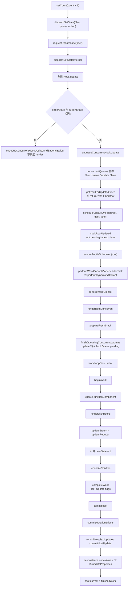
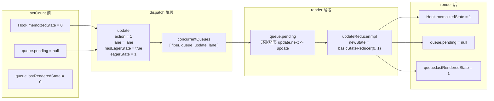
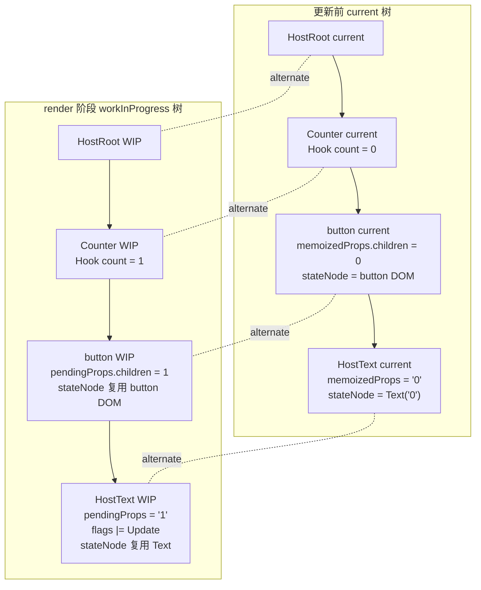

# React useState 更新完整源码追踪

本文档基于当前本地 `react-main` 源码整理，追踪下面这段代码从 `setCount` 调用开始，到页面 DOM 更新完成为止：

```jsx
function Counter() {
  const [count, setCount] = useState(0);

  return (
    <button onClick={() => setCount(count + 1)}>
      {count}
    </button>
  );
}
```

本文重点回答：

1. `setCount(count + 1)` 调用后如何创建 Hook update。
2. update 如何进入并发 Hook update queue。
3. lane 如何决定这次更新的优先级。
4. React 如何找到 root 并进入调度。
5. render 阶段如何重新执行 function component 并消费 Hook queue。
6. commit 阶段如何把变化写到真实 DOM。

> 说明：很多资料会把第 8 步写成 `performConcurrentWorkOnRoot`。当前源码中并发调度任务入口主要是 `performWorkOnRootViaSchedulerTask`，同步入口是 `performSyncWorkOnRoot`，二者最终都会进入 `performWorkOnRoot`。本文会同时标注“常见旧称”和“当前源码名”。

## 一、涉及源码文件

| 文件 | 作用 |
| --- | --- |
| `packages/react-reconciler/src/ReactFiberHooks.js` | Hooks 核心实现，包含 `mountState`、`updateState`、`dispatchSetState`、`renderWithHooks` |
| `packages/react-reconciler/src/ReactFiberConcurrentUpdates.js` | 并发更新队列，包含 `enqueueConcurrentHookUpdate`、`finishQueueingConcurrentUpdates`、向 root 冒泡 lane |
| `packages/react-reconciler/src/ReactFiberWorkLoop.js` | 调度与 render/commit 主流程，包含 `requestUpdateLane`、`scheduleUpdateOnFiber`、`performWorkOnRoot`、`renderRootConcurrent`、`workLoopConcurrent`、`commitRoot` |
| `packages/react-reconciler/src/ReactFiberLane.js` | lane 位运算模型，包含 `markRootUpdated` |
| `packages/react-reconciler/src/ReactFiberRootScheduler.js` | root 调度，包含 `ensureRootIsScheduled`、`performWorkOnRootViaSchedulerTask`、`performSyncWorkOnRoot` |
| `packages/react-reconciler/src/ReactFiberBeginWork.js` | `beginWork` 分发，包含 `updateFunctionComponent` 和 `reconcileChildren` |
| `packages/react-reconciler/src/ReactChildFiber.js` | 子 Fiber diff，决定复用、插入、删除、移动 |
| `packages/react-reconciler/src/ReactFiberCompleteWork.js` | `completeWork`，为 HostComponent/HostText 标记 DOM 更新 flags |
| `packages/react-reconciler/src/ReactFiberCommitWork.js` | commit mutation/layout/passive 遍历，消费 flags |
| `packages/react-reconciler/src/ReactFiberCommitHostEffects.js` | DOM 更新的 host effect 包装，包含 `commitHostUpdate`、`commitHostTextUpdate` |
| `packages/react-dom-bindings/src/client/ReactFiberConfigDOM.js` | DOM host config，最终调用 `updateProperties`、`textInstance.nodeValue = newText` |

## 二、完整调用链

```text
setCount(count + 1)
  -> dispatchSetState(fiber, queue, action)
    -> requestUpdateLane(fiber)
    -> dispatchSetStateInternal(fiber, queue, action, lane)
      -> 创建 Hook update
      -> 尝试 eager state
      -> enqueueConcurrentHookUpdate(fiber, queue, update, lane)
        -> enqueueUpdate(...)
          -> concurrentQueues 暂存 [fiber, queue, update, lane]
          -> fiber.lanes |= lane
          -> alternate.lanes |= lane
        -> getRootForUpdatedFiber(fiber)
          -> 沿 return 指针找到 HostRootFiber
          -> return HostRootFiber.stateNode
      -> scheduleUpdateOnFiber(root, fiber, lane)
        -> markRootUpdated(root, lane)
          -> root.pendingLanes |= lane
        -> ensureRootIsScheduled(root)
          -> scheduleTaskForRootDuringMicrotask(root, now())
          -> scheduleCallback(priority, performWorkOnRootViaSchedulerTask)
            -> performWorkOnRootViaSchedulerTask(root)
              -> getNextLanes(root, ...)
              -> performWorkOnRoot(root, lanes, forceSync)
                -> renderRootConcurrent(root, lanes)
                  -> prepareFreshStack(root, lanes)
                    -> createWorkInProgress(root.current, null)
                    -> finishQueueingConcurrentUpdates()
                      -> queue.pending 接收 Hook update 环形链表
                  -> workLoopConcurrent(...)
                    -> performUnitOfWork(workInProgress)
                      -> beginWork(current, workInProgress, lanes)
                        -> updateFunctionComponent(...)
                          -> renderWithHooks(...)
                            -> 调用 Counter()
                            -> useState -> updateState(...)
                              -> updateReducer(basicStateReducer, initialState)
                                -> updateReducerImpl(...)
                                -> 消费 queue.pending/baseQueue
                                -> 得到 newState = count + 1
                          -> reconcileChildren(...)
                      -> completeWork(...)
                        -> HostText 文本变化时 markUpdate
                        -> HostComponent props 变化时 markUpdate
                -> commitRoot(root, finishedWork, ...)
                  -> flushMutationEffects()
                    -> commitMutationEffects(...)
                      -> HostText: commitHostTextUpdate(...)
                        -> commitTextUpdate(textInstance, oldText, newText)
                          -> textInstance.nodeValue = newText
                      -> HostComponent: commitHostUpdate(...)
                        -> commitUpdate(domElement, type, oldProps, newProps)
                          -> updateProperties(domElement, type, oldProps, newProps)
                  -> root.current = finishedWork
```

## 三、示例组件与初始 Fiber/Hook 形态

示例：

```jsx
function Counter() {
  const [count, setCount] = useState(0);

  return (
    <button onClick={() => setCount(count + 1)}>
      {count}
    </button>
  );
}
```

首次渲染完成后，Fiber 树大致是：

```text
HostRootFiber
  child -> Counter Fiber              tag = FunctionComponent
    child -> button Fiber             tag = HostComponent
      child -> "0" Fiber              tag = HostText
```

`Counter Fiber` 上保存 Hook 链表：

```text
Counter Fiber.memoizedState
  -> Hook(useState)
      memoizedState = 0
      baseState = 0
      baseQueue = null
      queue = {
        pending: null,
        lanes: NoLanes,
        dispatch: dispatchSetState.bind(null, CounterFiber, queue),
        lastRenderedReducer: basicStateReducer,
        lastRenderedState: 0
      }
```

这里有两个关键绑定：

| 绑定 | 说明 |
| --- | --- |
| `fiber.memoizedState -> Hook` | function component 的 Hook 链表挂在 Fiber 上 |
| `queue.dispatch -> dispatchSetState.bind(...)` | `setCount` 是提前绑定了当前 Fiber 和 Hook queue 的 dispatch 函数 |

## 四、逐步追踪

### 1. dispatchSetState

源码位置：

```text
packages/react-reconciler/src/ReactFiberHooks.js
```

`setCount(count + 1)` 调用时，本质上执行的是 mount 阶段创建的 dispatch：

```js
const dispatch = dispatchSetState.bind(
  null,
  currentlyRenderingFiber,
  queue,
);
```

所以：

```jsx
setCount(count + 1);
```

等价于：

```js
dispatchSetState(counterFiber, hookQueue, count + 1);
```

`dispatchSetState` 的主逻辑：

```js
function dispatchSetState(fiber, queue, action) {
  const lane = requestUpdateLane(fiber);
  const didScheduleUpdate = dispatchSetStateInternal(
    fiber,
    queue,
    action,
    lane,
  );

  if (didScheduleUpdate) {
    startUpdateTimerByLane(lane, 'setState()', fiber);
  }

  markUpdateInDevTools(fiber, lane, action);
}
```

对于示例：

```js
action = count + 1;
```

如果当前 `count` 是 `0`，那么 action 是 `1`。如果写成函数式更新：

```js
setCount(c => c + 1);
```

那么 action 是函数，后续会由 `basicStateReducer` 执行。

### 2. 创建 update

源码位置：

```text
packages/react-reconciler/src/ReactFiberHooks.js
```

`dispatchSetStateInternal` 创建 Hook update：

```js
const update = {
  lane,
  revertLane: NoLane,
  gesture: null,
  action,
  hasEagerState: false,
  eagerState: null,
  next: null,
};
```

字段说明：

| 字段 | 作用 |
| --- | --- |
| `lane` | 这次 Hook 更新的优先级 |
| `action` | `setCount` 传入的值或函数 |
| `hasEagerState` | 是否提前计算出了新 state |
| `eagerState` | eager 计算得到的新 state |
| `next` | Hook update 环形链表指针 |
| `revertLane` | optimistic update/transition 相关，本例为 `NoLane` |
| `gesture` | gesture transition 相关，本例为 `null` |

### 3. 计算 lane

源码位置：

```text
packages/react-reconciler/src/ReactFiberWorkLoop.js
```

`requestUpdateLane(fiber)` 决定本次更新用哪个 lane：

```js
export function requestUpdateLane(fiber) {
  const mode = fiber.mode;

  if (!disableLegacyMode && (mode & ConcurrentMode) === NoMode) {
    return SyncLane;
  }

  if ((executionContext & RenderContext) !== NoContext) {
    return pickArbitraryLane(workInProgressRootRenderLanes);
  }

  const transition = requestCurrentTransition();
  if (transition !== null) {
    return requestTransitionLane(transition);
  }

  return eventPriorityToLane(resolveUpdatePriority());
}
```

常见场景：

| 场景 | lane 来源 |
| --- | --- |
| legacy root | `SyncLane` |
| render 阶段更新 | 从当前 render lanes 中选一个 |
| `startTransition` 内更新 | `requestTransitionLane(transition)` |
| 普通事件中更新 | `eventPriorityToLane(resolveUpdatePriority())` |

对于按钮点击里的：

```jsx
onClick={() => setCount(count + 1)}
```

通常会从当前事件优先级映射到对应 lane。lane 是 React 内部用来表达“这次更新的优先级、批次和可合并关系”的位掩码。

### 4. eager state 快速路径

源码位置：

```text
packages/react-reconciler/src/ReactFiberHooks.js
```

在真正调度前，React 会尝试提前计算下一次 state：

```js
const currentState = queue.lastRenderedState;
const eagerState = lastRenderedReducer(currentState, action);

update.hasEagerState = true;
update.eagerState = eagerState;

if (is(eagerState, currentState)) {
  enqueueConcurrentHookUpdateAndEagerlyBailout(fiber, queue, update);
  return false;
}
```

`useState` 使用的 reducer 是：

```js
function basicStateReducer(state, action) {
  return typeof action === 'function' ? action(state) : action;
}
```

示例：

```js
currentState = 0;
action = 1;
eagerState = 1;
```

因为 `1 !== 0`，不能 bailout，所以继续调度。

如果写成：

```js
setCount(count);
```

并且 eager 计算发现新旧 state 相同，就可能走 eager bailout：update 会被记录下来用于后续 rebase，但不会触发本次重新渲染。

### 5. enqueueConcurrentHookUpdate

源码位置：

```text
packages/react-reconciler/src/ReactFiberConcurrentUpdates.js
```

如果不能 eager bailout，React 会调用：

```js
const root = enqueueConcurrentHookUpdate(fiber, queue, update, lane);
```

它内部会把更新暂存到全局 `concurrentQueues`：

```js
concurrentQueues[concurrentQueuesIndex++] = fiber;
concurrentQueues[concurrentQueuesIndex++] = queue;
concurrentQueues[concurrentQueuesIndex++] = update;
concurrentQueues[concurrentQueuesIndex++] = lane;

fiber.lanes = mergeLanes(fiber.lanes, lane);
if (alternate !== null) {
  alternate.lanes = mergeLanes(alternate.lanes, lane);
}
```

注意这里有一个很重要的“暂存”概念：

```text
setCount 刚调用后：

concurrentQueues
  [CounterFiber, hookQueue, update, lane]

hookQueue.pending
  仍然可能还没有立刻接上 update
```

React 这样做是为了在并发渲染中安全地收集来自不同事件、不同 Fiber 的更新，等到合适时机统一转移进各自的 queue。

### 6. 找到 root

源码位置：

```text
packages/react-reconciler/src/ReactFiberConcurrentUpdates.js
```

`enqueueConcurrentHookUpdate` 会返回 root：

```js
return getRootForUpdatedFiber(fiber);
```

`getRootForUpdatedFiber` 沿着 `return` 指针向上走：

```text
Counter Fiber
  -> return: HostRootFiber
    -> stateNode: FiberRootNode
```

概念代码：

```js
let node = sourceFiber;
let parent = node.return;

while (parent !== null) {
  node = parent;
  parent = node.return;
}

return node.tag === HostRoot ? node.stateNode : null;
```

返回的 `root` 是 `FiberRootNode`，后续调度是 root 级别的。

### 7. scheduleUpdateOnFiber

源码位置：

```text
packages/react-reconciler/src/ReactFiberWorkLoop.js
```

`dispatchSetStateInternal` 拿到 root 后：

```js
scheduleUpdateOnFiber(root, fiber, lane);
entangleTransitionUpdate(root, queue, lane);
return true;
```

`scheduleUpdateOnFiber` 做的是把“某个 Fiber 上发生了更新”升级为“某个 root 有某个 lane 的工作”。

核心逻辑：

```js
markRootUpdated(root, lane);
ensureRootIsScheduled(root);
```

它还会处理几类特殊情况：

| 情况 | 处理 |
| --- | --- |
| 当前 root 正在 suspend | 可能中断当前 render 并从顶部重来 |
| render phase update | 记录到 `workInProgressRootRenderPhaseUpdatedLanes` |
| interleaved update | 记录到 `workInProgressRootInterleavedUpdatedLanes` |
| legacy sync update | 可能直接 `flushSyncWorkOnLegacyRootsOnly()` |

### 8. markRootUpdated

源码位置：

```text
packages/react-reconciler/src/ReactFiberLane.js
```

`markRootUpdated(root, lane)` 把 lane 标记到 root：

```js
root.pendingLanes |= updateLane;
```

如果不是 idle 更新，还会清理部分 suspended/pinged/warm lanes，让之前可能被阻塞的工作有机会重新尝试。

更新前后可以理解为：

```text
更新前：
root.pendingLanes = NoLanes

setCount 后：
root.pendingLanes = root.pendingLanes | lane
```

这一步之后，root 已经知道自己有待处理任务。

### 9. ensureRootIsScheduled

源码位置：

```text
packages/react-reconciler/src/ReactFiberRootScheduler.js
```

`ensureRootIsScheduled(root)` 确保这个 root 被放进 root schedule：

```js
ensureRootIsScheduled(root);
```

它做两层调度：

| 层级 | 作用 |
| --- | --- |
| root schedule | 把 root 加入内部 root 链表，确保后续 microtask 会处理 |
| Scheduler task | 根据 lanes 映射出的优先级，注册真正执行 work 的 callback |

概念流程：

```text
ensureRootIsScheduled(root)
  -> root 加入 scheduled roots 链表
  -> ensureScheduleIsScheduled()
    -> 安排 microtask
      -> scheduleTaskForRootDuringMicrotask(root, now())
        -> getNextLanes(root, ...)
        -> lanesToEventPriority(nextLanes)
        -> scheduleCallback(priority, performWorkOnRootViaSchedulerTask)
```

如果选出来的是同步 lane，则可能不通过普通 Scheduler callback，而是在 microtask 中同步 flush。

### 10. performConcurrentWorkOnRoot / performWorkOnRootViaSchedulerTask

源码位置：

```text
packages/react-reconciler/src/ReactFiberRootScheduler.js
packages/react-reconciler/src/ReactFiberWorkLoop.js
```

当前源码中，并发任务入口是：

```js
performWorkOnRootViaSchedulerTask(root)
```

它会：

1. 先尝试 flush pending passive effects。
2. 重新调用 `getNextLanes(root, ...)`，确认还有没有要做的 lanes。
3. 判断是否需要 force sync。
4. 调用 `performWorkOnRoot(root, lanes, forceSync)`。
5. 根据剩余任务决定是否返回 continuation。

概念代码：

```js
function performWorkOnRootViaSchedulerTask(root) {
  const lanes = getNextLanes(root, ...);
  const forceSync = false;
  performWorkOnRoot(root, lanes, forceSync);
  return scheduleTaskForRootDuringMicrotask(root, now());
}
```

同步入口是：

```js
function performSyncWorkOnRoot(root, lanes) {
  performWorkOnRoot(root, lanes, true);
}
```

二者最终汇合到：

```js
performWorkOnRoot(root, lanes, forceSync);
```

### 11. renderRootConcurrent

源码位置：

```text
packages/react-reconciler/src/ReactFiberWorkLoop.js
```

`performWorkOnRoot` 会根据 lanes 和 `forceSync` 决定同步或并发 render：

```js
const shouldTimeSlice =
  !forceSync &&
  !includesBlockingLane(lanes) &&
  !includesExpiredLane(root, lanes);

const exitStatus = shouldTimeSlice
  ? renderRootConcurrent(root, lanes)
  : renderRootSync(root, lanes, true);
```

本问题关注并发路径：

```js
renderRootConcurrent(root, lanes);
```

它首先准备 workInProgress 树：

```js
prepareFreshStack(root, lanes);
```

`prepareFreshStack` 中有一个对 Hook 更新非常关键的调用：

```js
finishQueueingConcurrentUpdates();
```

这一步会把之前暂存在 `concurrentQueues` 中的 Hook update，真正接到 `hookQueue.pending` 环形链表上。

### 12. Hooks updateQueue 变化

源码位置：

```text
packages/react-reconciler/src/ReactFiberConcurrentUpdates.js
packages/react-reconciler/src/ReactFiberHooks.js
```

#### setCount 调用前

```text
Hook
  memoizedState = 0
  baseState = 0
  baseQueue = null
  queue.pending = null
  queue.lastRenderedState = 0
```

#### dispatchSetStateInternal 创建 update 后

```text
update
  lane = DefaultLane 或其他事件 lane
  action = 1
  hasEagerState = true
  eagerState = 1
  next = null
```

#### enqueueConcurrentHookUpdate 后

```text
concurrentQueues
  [
    CounterFiber,
    hookQueue,
    update(action = 1, lane),
    lane
  ]

CounterFiber.lanes |= lane
CounterFiber.alternate.lanes |= lane
```

这时 update 先放在全局并发队列里。

#### finishQueueingConcurrentUpdates 后

```js
const pending = queue.pending;
if (pending === null) {
  update.next = update;
} else {
  update.next = pending.next;
  pending.next = update;
}
queue.pending = update;
```

队列变成环形链表：

```text
hookQueue.pending
  -> update(action = 1)
      next --+
             |
             +-- back to update
```

#### updateState 消费后

`updateState` 实际调用：

```js
return updateReducer(basicStateReducer, initialState);
```

`updateReducerImpl` 会把 `queue.pending` 合并到 `baseQueue`，然后逐个计算：

```js
newState = reducer(newState, action);
```

本例中：

```js
newState = basicStateReducer(0, 1); // 1
```

最后：

```text
Hook
  memoizedState = 1
  baseState = 1
  baseQueue = null
  queue.pending = null
  queue.lastRenderedState = 1
```

### 13. workLoopConcurrent

源码位置：

```text
packages/react-reconciler/src/ReactFiberWorkLoop.js
```

并发 render 阶段进入 work loop：

```js
function workLoopConcurrent(nonIdle) {
  if (workInProgress !== null) {
    const yieldAfter = now() + (nonIdle ? 25 : 5);
    do {
      performUnitOfWork(workInProgress);
    } while (workInProgress !== null && now() < yieldAfter);
  }
}
```

或在某些配置下：

```js
function workLoopConcurrentByScheduler() {
  while (workInProgress !== null && !shouldYield()) {
    performUnitOfWork(workInProgress);
  }
}
```

每个 Fiber 都会交给 `performUnitOfWork`：

```js
const current = unitOfWork.alternate;
const next = beginWork(current, unitOfWork, entangledRenderLanes);

if (next === null) {
  completeUnitOfWork(unitOfWork);
} else {
  workInProgress = next;
}
```

对于本例，更新通常会沿这条路径重新处理：

```text
HostRootFiber
  -> Counter Fiber
    -> button Fiber
      -> HostText Fiber
```

### 14. beginWork

源码位置：

```text
packages/react-reconciler/src/ReactFiberBeginWork.js
```

`beginWork` 根据 `Fiber.tag` 分发。对 function component，会走：

```text
beginWork(Counter Fiber)
  -> updateFunctionComponent(...)
```

`beginWork` 的职责是“向下计算”：

| Fiber | 本例中做什么 |
| --- | --- |
| `HostRoot` | 处理 root update，进入子树 |
| `FunctionComponent(Counter)` | 重新执行 `Counter()`，得到新的 React Element |
| `HostComponent(button)` | 处理 DOM 元素的 children |
| `HostText` | 文本节点没有子节点，后续进入 complete |

### 15. updateFunctionComponent

源码位置：

```text
packages/react-reconciler/src/ReactFiberBeginWork.js
```

`updateFunctionComponent` 的关键流程：

```js
prepareToReadContext(workInProgress, renderLanes);

nextChildren = renderWithHooks(
  current,
  workInProgress,
  Component,
  nextProps,
  context,
  renderLanes,
);

if (current !== null && !didReceiveUpdate) {
  bailoutHooks(current, workInProgress, renderLanes);
  return bailoutOnAlreadyFinishedWork(current, workInProgress, renderLanes);
}

workInProgress.flags |= PerformedWork;
reconcileChildren(current, workInProgress, nextChildren, renderLanes);
return workInProgress.child;
```

它把 function component 的两件核心事情串起来：

| 步骤 | 说明 |
| --- | --- |
| `renderWithHooks` | 重新执行组件函数并处理 Hook 链表 |
| `reconcileChildren` | 根据组件返回的新 React Element diff 子 Fiber |

### 16. renderWithHooks

源码位置：

```text
packages/react-reconciler/src/ReactFiberHooks.js
```

`renderWithHooks` 会设置当前正在渲染的 Fiber：

```js
renderLanes = nextRenderLanes;
currentlyRenderingFiber = workInProgress;
```

然后重置 workInProgress 上的 Hook 状态：

```js
workInProgress.memoizedState = null;
workInProgress.updateQueue = null;
workInProgress.lanes = NoLanes;
```

接着根据是否是 mount/update 选择不同 dispatcher：

```js
ReactSharedInternals.H =
  current === null || current.memoizedState === null
    ? HooksDispatcherOnMount
    : HooksDispatcherOnUpdate;
```

本例是更新阶段，所以 `useState` 会走 update dispatcher，最终进入：

```js
updateState(initialState);
```

最后执行组件函数：

```js
children = Component(props, secondArg);
```

也就是重新执行：

```jsx
function Counter() {
  const [count, setCount] = useState(0);
  return <button>{count}</button>;
}
```

这次 `count` 会从 Hook queue 中计算成 `1`。

### 17. updateState

源码位置：

```text
packages/react-reconciler/src/ReactFiberHooks.js
```

`updateState` 很薄：

```js
function updateState(initialState) {
  return updateReducer(basicStateReducer, initialState);
}
```

`updateReducer` 会拿到当前 Hook：

```js
const hook = updateWorkInProgressHook();
return updateReducerImpl(hook, currentHook, reducer);
```

`updateReducerImpl` 的核心工作：

| 步骤 | 说明 |
| --- | --- |
| 读取 `queue.pending` | 找到 dispatch 阶段入队的 Hook update |
| 合并到 `baseQueue` | 把 pending queue 和 base queue 合并，支持跳过低优先级更新后的 rebase |
| 根据 `renderLanes` 判断是否跳过 | lane 不够时跳过，保留到 baseQueue |
| 计算 `newState` | 对本次足够优先级的 update 执行 reducer |
| 更新 Hook 字段 | 写入 `memoizedState`、`baseState`、`baseQueue`、`queue.lastRenderedState` |

本例核心计算：

```js
const action = 1;
newState = basicStateReducer(0, action); // 1
```

然后返回：

```js
return [hook.memoizedState, dispatch];
```

所以组件函数里拿到：

```js
count = 1;
setCount = 同一个 queue.dispatch;
```

### 18. reconcileChildren

源码位置：

```text
packages/react-reconciler/src/ReactFiberBeginWork.js
packages/react-reconciler/src/ReactChildFiber.js
```

`Counter()` 重新执行后返回新的 React Element：

```jsx
<button onClick={() => setCount(count + 1)}>
  {count}
</button>
```

当 `count` 从 `0` 变成 `1`：

```text
旧 children:
button props.children = 0

新 children:
button props.children = 1
```

`reconcileChildren` 在 update 阶段调用：

```js
workInProgress.child = reconcileChildFibers(
  workInProgress,
  current.child,
  nextChildren,
  renderLanes,
);
```

对本例的 Fiber 变化：

```text
Counter Fiber
  -> child button Fiber 可复用，因为 type 仍是 "button"、key 没变
    -> child HostText Fiber 可复用，因为仍是文本节点
       pendingProps 从 "0" 变成 "1"
```

React 不会重新创建整棵 DOM，而是复用已有 Fiber 和 DOM 节点，只在后续 complete/commit 中标记并执行必要更新。

### 19. Fiber 树变化

更新前 current 树：

```text
HostRoot current
  child -> Counter current
    memoizedState -> Hook(count = 0)
    child -> button current
      memoizedProps.children = 0
      stateNode = HTMLButtonElement
      child -> HostText current
        memoizedProps = "0"
        stateNode = Text("0")
```

render 阶段创建 workInProgress 树：

```text
HostRoot workInProgress
  alternate <-> HostRoot current
  child -> Counter workInProgress
    alternate <-> Counter current
    memoizedState -> Hook(count = 1)
    child -> button workInProgress
      alternate <-> button current
      pendingProps.children = 1
      stateNode = same HTMLButtonElement
      child -> HostText workInProgress
        pendingProps = "1"
        stateNode = same Text node
        flags |= Update
```

commit 完成后：

```text
root.current = finishedWork

新的 current 树:
HostRoot
  child -> Counter
    Hook(count = 1)
    child -> button
      child -> HostText("1")
```

DOM 节点通常被复用，只更新文本或属性。

## 五、completeWork

源码位置：

```text
packages/react-reconciler/src/ReactFiberCompleteWork.js
```

`completeWork` 是 render 阶段的“向上收尾”。

对本例，重点是 HostComponent 和 HostText。

### HostText 更新

如果文本从 `"0"` 变成 `"1"`：

```js
function updateHostText(current, workInProgress, oldText, newText) {
  if (supportsMutation) {
    if (oldText !== newText) {
      markUpdate(workInProgress);
    }
  }
}
```

`markUpdate` 会设置：

```js
workInProgress.flags |= Update;
```

这表示 commit 阶段需要更新真实文本节点。

### HostComponent 更新

对于 `<button onClick={...}>{count}</button>`，每次 render 都可能生成新的 `onClick` 函数，因此 `oldProps !== newProps`，HostComponent 也可能被标记 `Update`：

```js
function updateHostComponent(current, workInProgress, type, newProps) {
  const oldProps = current.memoizedProps;
  if (oldProps === newProps) {
    return;
  }

  markUpdate(workInProgress);
}
```

这里当前 React DOM 的属性 diff 实际主要在 commit 阶段的 `commitUpdate -> updateProperties` 中完成。render 阶段先标记 `Update` flag。

### subtreeFlags 冒泡

完成每个 Fiber 时，React 会通过 `bubbleProperties(workInProgress)` 把子树里的 flags 冒泡到父节点的 `subtreeFlags`。

概念上：

```text
HostText.flags = Update
button.subtreeFlags 包含 Update
Counter.subtreeFlags 包含 Update
HostRoot.subtreeFlags 包含 Update
```

这样 commit 阶段可以快速判断某个子树是否需要进入 mutation 遍历。

## 六、commitRoot

源码位置：

```text
packages/react-reconciler/src/ReactFiberWorkLoop.js
packages/react-reconciler/src/ReactFiberCommitWork.js
```

render 完成后，`performWorkOnRoot` 会进入 commit：

```text
commitRoot(root, finishedWork, ...)
```

commit 阶段分为：

| 阶段 | 本例中做什么 |
| --- | --- |
| before mutation | 本例通常没有关键 DOM 操作 |
| mutation | 消费 `Update` flags，更新 DOM 文本/属性 |
| layout | 执行 layout effects、attach ref 等 |
| passive | 后续异步执行 `useEffect` |

本例最关键的是 mutation 阶段：

```text
flushMutationEffects
  -> commitMutationEffects(root, finishedWork, lanes)
    -> commitMutationEffectsOnFiber(...)
      -> HostComponent flags & Update
         -> commitHostUpdate(...)
      -> HostText flags & Update
         -> commitHostTextUpdate(...)
```

current 树切换发生在 mutation 之后、layout 之前：

```js
root.current = finishedWork;
```

### DOM 文本更新

源码位置：

```text
packages/react-reconciler/src/ReactFiberCommitWork.js
packages/react-reconciler/src/ReactFiberCommitHostEffects.js
packages/react-dom-bindings/src/client/ReactFiberConfigDOM.js
```

HostText 更新调用链：

```text
commitMutationEffectsOnFiber(HostText)
  -> flags & Update
  -> commitHostTextUpdate(finishedWork, newText, oldText)
    -> commitTextUpdate(textInstance, oldText, newText)
      -> textInstance.nodeValue = newText
```

示例：

```js
oldText = "0";
newText = "1";
textInstance.nodeValue = "1";
```

页面上的按钮文本从 `0` 变成 `1`。

### DOM 属性更新

如果 HostComponent 的 props 变化，例如 `onClick` 函数引用变了：

```text
commitMutationEffectsOnFiber(HostComponent)
  -> flags & Update
  -> commitHostUpdate(finishedWork, newProps, oldProps)
    -> commitUpdate(domElement, type, oldProps, newProps, finishedWork)
      -> updateProperties(domElement, type, oldProps, newProps)
      -> updateFiberProps(domElement, newProps)
```

`updateProperties` 会根据元素类型和 props 差异更新 DOM 属性、事件相关 props 缓存等。

对于 React DOM 的事件系统，很多事件监听并不是每个 DOM 节点直接 add/remove listener，而是通过 root 容器上的统一事件委托，再通过 `updateFiberProps` 读取当前 props。

## 七、render 阶段和 commit 阶段分别做什么

| 阶段 | 是否可中断 | 本次 useState 更新做什么 | 是否操作真实 DOM |
| --- | --- | --- | --- |
| render | 可中断、可恢复 | 创建 workInProgress 树，执行 `Counter()`，消费 Hook queue，计算 `count = 1`，diff 子 Fiber，标记 Update flags | 不直接改页面 |
| complete | 属于 render 阶段 | 对 HostText/HostComponent 判断是否需要更新，冒泡 subtreeFlags | 不直接改页面 |
| commit mutation | 不可中断 | 消费 Update flags，调用 host config 更新 DOM 文本/属性 | 会改页面 |
| commit layout | 不可中断 | 执行 `useLayoutEffect`、ref attach 等 | DOM 已是新状态 |
| passive | commit 后异步 | 调度/执行 `useEffect` | 不阻塞 DOM 更新 |

核心区别：

```text
render 阶段算出“要变成什么”
commit 阶段执行“把页面改成那个样子”
```

## 八、Mermaid 流程图



## 九、Hooks updateQueue 图



## 十、Fiber 树变化图



## 十一、每一步示例代码

### 用户代码

```jsx
function Counter() {
  const [count, setCount] = useState(0);
  return <button onClick={() => setCount(count + 1)}>{count}</button>;
}
```

### dispatch 绑定

```js
const dispatch = dispatchSetState.bind(null, currentlyRenderingFiber, queue);
queue.dispatch = dispatch;
```

### setCount 调用

```js
dispatchSetState(counterFiber, hookQueue, 1);
```

### 创建 update

```js
const update = {
  lane,
  revertLane: NoLane,
  gesture: null,
  action: 1,
  hasEagerState: false,
  eagerState: null,
  next: null,
};
```

### eager state

```js
const eagerState = basicStateReducer(0, 1); // 1
update.hasEagerState = true;
update.eagerState = 1;
```

### 入并发队列

```js
enqueueConcurrentHookUpdate(counterFiber, hookQueue, update, lane);
```

概念结果：

```js
concurrentQueues.push(counterFiber, hookQueue, update, lane);
counterFiber.lanes |= lane;
counterFiber.alternate.lanes |= lane;
```

### 调度 root

```js
scheduleUpdateOnFiber(root, counterFiber, lane);
```

概念结果：

```js
root.pendingLanes |= lane;
ensureRootIsScheduled(root);
```

### render 阶段消费 update

```js
const [count, setCount] = updateState(0);
// count === 1
```

内部计算：

```js
newState = basicStateReducer(0, 1); // 1
hook.memoizedState = 1;
queue.lastRenderedState = 1;
```

### diff 子节点

```jsx
// old
<button>{0}</button>

// new
<button>{1}</button>
```

Fiber 复用：

```text
button Fiber 复用
HostText Fiber 复用
HostText.pendingProps = "1"
HostText.flags |= Update
```

### commit DOM 文本

```js
commitTextUpdate(textInstance, "0", "1");
```

最终：

```js
textInstance.nodeValue = "1";
```

## 十二、关键结论

一次 `useState` 更新可以浓缩为：

```text
setCount
  -> 创建 Hook update
  -> 计算 lane
  -> 暂存到 concurrentQueues
  -> 标记 root.pendingLanes
  -> 调度 root work
  -> render 阶段重新执行函数组件
  -> updateState 消费 Hook updateQueue
  -> reconcileChildren diff 子 Fiber
  -> completeWork 标记 DOM 更新 flags
  -> commitRoot 消费 flags
  -> 更新真实 DOM
```

最值得记住的主线：

```text
Hook update
  -> Hook queue
  -> Fiber lanes
  -> Root pendingLanes
  -> workInProgress Fiber tree
  -> Update flags
  -> DOM mutation
```

`useState` 的更新并不是直接修改变量，也不是直接改 DOM。`setCount` 只是创建一个 update 并触发调度；新的 `count` 是下一次 render 期间通过 Hook queue 计算出来的；真实 DOM 更新发生在 commit mutation 阶段。
