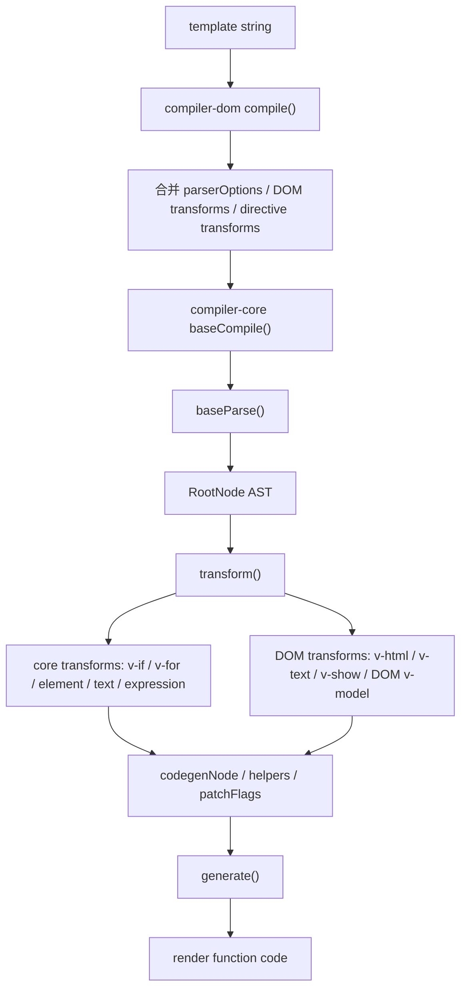
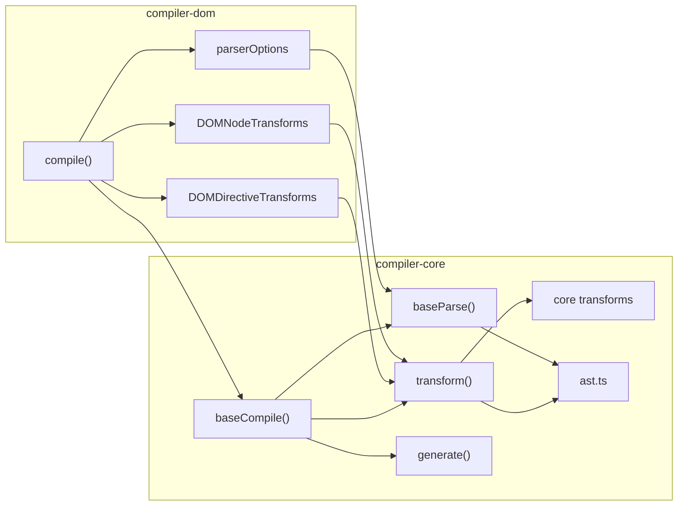
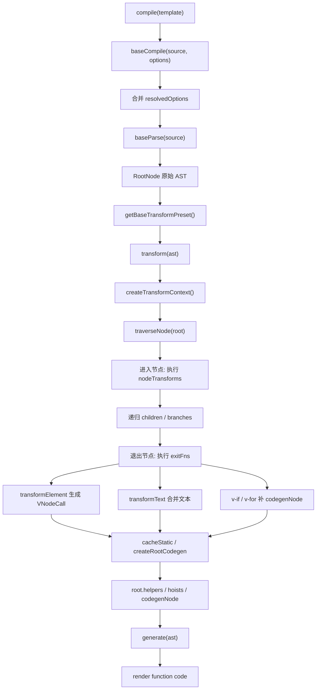

# Vue3 compiler-core 源码深入分析

本文基于当前仓库 `vue3` 源码整理，聚焦 `packages/compiler-core`：它在 Vue3 架构中的职责、`baseCompile` / `baseParse` / `transform` / `generate` 主流程、核心 transform 的工作方式、`v-if` / `v-for` 的转换位置，以及它如何与 `compiler-dom` 协作。

如果前面的 template 编译文档是在看“模板如何变成 render 函数”，这一篇更像是在拆 Vue3 编译器的发动机：`compiler-core` 本身不关心浏览器 DOM 细节，它提供平台无关的 AST、转换流水线、代码生成能力。

## 一、compiler-core 在 Vue3 架构中的职责

`compiler-core` 是 Vue3 编译器的核心层，负责把模板语义转换成运行时可执行的 render 函数代码。

它的关键词是“平台无关”。

也就是说，`compiler-core` 关心这些事情：

| 职责 | 说明 |
| --- | --- |
| 模板解析 | 通过 `baseParse` 把 template 字符串解析成 AST |
| AST 定义 | 在 `ast.ts` 中定义 `RootNode`、`ElementNode`、`TextNode`、`InterpolationNode`、`IfNode`、`ForNode`、`VNodeCall` 等节点结构 |
| AST 转换 | 通过 `transform` 遍历 AST，执行 node transforms 和 directive transforms |
| 指令语义转换 | 提供平台无关的 `v-if`、`v-for`、`v-on`、`v-bind`、`v-model`、`v-once`、`v-memo` 等转换 |
| 表达式处理 | 通过 `transformExpression` / `processExpression` 把模板表达式改写成 render 上下文可访问的表达式 |
| VNode 代码生成准备 | 通过 `transformElement` 把元素节点转换成 `VNodeCall` |
| 静态分析 | 通过 `cacheStatic`、`getConstantType` 判断静态节点、动态文本、patchFlag 等 |
| 代码生成 | 通过 `generate` 把转换后的 AST 生成 render 函数字符串 |
| 平台扩展入口 | 允许 `compiler-dom`、`compiler-ssr` 注入 parser options、node transforms、directive transforms |

它不直接处理这些事情：

| 非核心职责 | 由谁处理 |
| --- | --- |
| DOM 属性 / 事件的特殊编译 | `compiler-dom` |
| 浏览器原生标签、SVG、MathML 命名空间规则 | `compiler-dom` 的 `parserOptions` |
| `v-html`、`v-text`、DOM 版 `v-model`、`v-show` | `compiler-dom` |
| SFC 文件解析、`<script setup>`、style scope | `compiler-sfc` |
| 真正创建 DOM、patch DOM | `runtime-dom` + `runtime-core` |

`compiler-core` 的架构位置：

```text
template / AST
   |
   v
compiler-dom / compiler-ssr / compiler-sfc
   |
   | 注入平台参数和转换器
   v
compiler-core
   |
   | baseParse -> transform -> generate
   v
render function code
   |
   v
runtime-core / runtime-dom
```

## 二、compiler-core 源码结构

核心目录：

```text
vue3/packages/compiler-core/src
├── ast.ts
├── compile.ts
├── parser.ts
├── tokenizer.ts
├── transform.ts
├── codegen.ts
├── options.ts
├── runtimeHelpers.ts
├── errors.ts
├── utils.ts
├── validateExpression.ts
├── babelUtils.ts
├── index.ts
├── transforms
│   ├── transformElement.ts
│   ├── transformText.ts
│   ├── transformExpression.ts
│   ├── cacheStatic.ts
│   ├── vIf.ts
│   ├── vFor.ts
│   ├── vOn.ts
│   ├── vBind.ts
│   ├── vModel.ts
│   ├── vSlot.ts
│   ├── vOnce.ts
│   ├── vMemo.ts
│   ├── transformSlotOutlet.ts
│   ├── transformVBindShorthand.ts
│   └── noopDirectiveTransform.ts
└── compat
    ├── compatConfig.ts
    └── transformFilter.ts
```

重要文件表：

| 文件 | 作用 |
| --- | --- |
| `compiler-core/src/compile.ts` | 核心编译入口，暴露 `baseCompile`，组装默认 transform preset |
| `compiler-core/src/parser.ts` | parser 入口 `baseParse`，把模板解析成 AST |
| `compiler-core/src/tokenizer.ts` | tokenizer，负责底层字符扫描和 token 识别 |
| `compiler-core/src/ast.ts` | AST 节点类型定义和节点创建工具 |
| `compiler-core/src/transform.ts` | transform 主流程，创建 transform context，遍历 AST，收集 helpers / hoists / components |
| `compiler-core/src/codegen.ts` | codegen 主流程，把 AST 输出成 render 函数字符串 |
| `compiler-core/src/options.ts` | 编译选项、binding 类型等定义 |
| `compiler-core/src/runtimeHelpers.ts` | 编译阶段用到的运行时 helper 符号，例如 `CREATE_VNODE`、`OPEN_BLOCK`、`TO_DISPLAY_STRING` |
| `compiler-core/src/transforms/transformElement.ts` | 把元素 / 组件节点转换成 `VNodeCall`，生成 props、children、patchFlag |
| `compiler-core/src/transforms/transformText.ts` | 合并相邻文本，必要时生成 `createTextVNode`，标记动态文本 |
| `compiler-core/src/transforms/transformExpression.ts` | 改写模板表达式，例如 `_ctx.foo`、`foo.value`、`unref(foo)` |
| `compiler-core/src/transforms/vIf.ts` | `v-if` / `v-else-if` / `v-else` 结构转换 |
| `compiler-core/src/transforms/vFor.ts` | `v-for` 结构转换，生成 `renderList` 调用和 Fragment block |
| `compiler-core/src/transforms/vOn.ts` | 平台无关的事件绑定转换 |
| `compiler-core/src/transforms/vBind.ts` | 平台无关的属性绑定转换 |
| `compiler-core/src/transforms/vModel.ts` | 平台无关的 `v-model` 转换 |
| `compiler-core/src/transforms/cacheStatic.ts` | 静态分析、静态缓存 / 提升 |

## 三、baseCompile 做了什么

源码位置：

```text
vue3/packages/compiler-core/src/compile.ts
```

`baseCompile` 是 `compiler-core` 的主入口。源码主线在 `compile.ts` 中：

```ts
export function baseCompile(
  source: string | RootNode,
  options: CompilerOptions = {},
): CodegenResult {
  const onError = options.onError || defaultOnError
  const isModuleMode = options.mode === 'module'

  const prefixIdentifiers =
    !__BROWSER__ && (options.prefixIdentifiers === true || isModuleMode)

  const resolvedOptions = extend({}, options, {
    prefixIdentifiers,
  })

  const ast = isString(source) ? baseParse(source, resolvedOptions) : source
  const [nodeTransforms, directiveTransforms] =
    getBaseTransformPreset(prefixIdentifiers)

  transform(
    ast,
    extend({}, resolvedOptions, {
      nodeTransforms: [
        ...nodeTransforms,
        ...(options.nodeTransforms || []),
      ],
      directiveTransforms: extend(
        {},
        directiveTransforms,
        options.directiveTransforms || {},
      ),
    }),
  )

  return generate(ast, resolvedOptions)
}
```

它做的事情可以拆成 6 步：

| 步骤 | 说明 |
| --- | --- |
| 1. 校验编译选项 | 浏览器环境不支持某些 Node 编译能力，例如 `prefixIdentifiers`、`module` mode |
| 2. 计算 `prefixIdentifiers` | 判断是否需要把模板变量前缀化成 `_ctx.xxx` 或 `$setup.xxx` 等 |
| 3. 解析模板 | 如果 `source` 是字符串，调用 `baseParse(source)` 生成 AST |
| 4. 获取默认 transforms | 调用 `getBaseTransformPreset(prefixIdentifiers)` 得到核心 node/directive transforms |
| 5. 转换 AST | 调用 `transform(ast, options)`，将模板 AST 转成带 codegen 信息的 AST |
| 6. 生成代码 | 调用 `generate(ast, options)`，输出 render 函数代码 |

### baseCompile 调用链

```text
compiler-dom compile(template)
  -> baseCompile(template, mergedOptions)
     -> baseParse(template, resolvedOptions)
        -> tokenizer.parse(input)
        -> createRoot(children, input)
        -> condenseWhitespace(root.children)
     -> getBaseTransformPreset(prefixIdentifiers)
        -> nodeTransforms
        -> directiveTransforms
     -> transform(ast, transformOptions)
        -> createTransformContext(root, options)
        -> traverseNode(root, context)
        -> cacheStatic(root, context)
        -> createRootCodegen(root, context)
        -> root.helpers / components / directives / hoists / temps / cached
     -> generate(ast, resolvedOptions)
        -> createCodegenContext(ast, options)
        -> genFunctionPreamble / genModulePreamble
        -> function render(_ctx, _cache) { return ... }
```

更短的记忆方式：

```text
baseCompile = parse + transform + codegen
```

## 四、getBaseTransformPreset：核心转换器预设

`getBaseTransformPreset` 决定了 `compiler-core` 默认启用哪些转换器。

源码位置：

```text
vue3/packages/compiler-core/src/compile.ts
```

当前源码中的默认 node transforms 顺序：

```ts
[
  transformVBindShorthand,
  transformOnce,
  transformIf,
  transformMemo,
  transformFor,
  ...compatTransformFilter,
  trackVForSlotScopes,
  transformExpression,
  transformSlotOutlet,
  transformElement,
  trackSlotScopes,
  transformText,
]
```

默认 directive transforms：

```ts
{
  on: transformOn,
  bind: transformBind,
  model: transformModel,
}
```

这个顺序很重要：

| 顺序点 | 原因 |
| --- | --- |
| `transformIf`、`transformFor` 较早执行 | 结构性指令会替换 / 移动 AST 节点，必须先改树结构 |
| `transformExpression` 在结构转换之后 | `v-for` 会引入局部变量，表达式改写需要知道这些作用域 |
| `transformElement` 返回退出函数 | 要等子节点都转换完，再根据 children 生成 `VNodeCall` |
| `transformText` 放在最后 | 要等表达式、元素、结构转换完成后，再合并文本和生成 `TEXT_CALL` |

## 五、baseParse 做了什么

源码位置：

```text
vue3/packages/compiler-core/src/parser.ts
vue3/packages/compiler-core/src/tokenizer.ts
vue3/packages/compiler-core/src/ast.ts
```

`baseParse` 的作用是把 template 字符串解析成原始 AST。

当前源码主线：

```ts
export function baseParse(input: string, options?: ParserOptions): RootNode {
  reset()
  currentInput = input
  currentOptions = extend({}, defaultParserOptions)

  if (options) {
    for (key in options) {
      if (options[key] != null) {
        currentOptions[key] = options[key]
      }
    }
  }

  tokenizer.mode =
    currentOptions.parseMode === 'html'
      ? ParseMode.HTML
      : currentOptions.parseMode === 'sfc'
        ? ParseMode.SFC
        : ParseMode.BASE

  tokenizer.inXML =
    currentOptions.ns === Namespaces.SVG ||
    currentOptions.ns === Namespaces.MATH_ML

  const root = (currentRoot = createRoot([], input))
  tokenizer.parse(currentInput)
  root.loc = getLoc(0, input.length)
  root.children = condenseWhitespace(root.children)
  currentRoot = null
  return root
}
```

可以拆成 5 件事：

| 步骤 | 说明 |
| --- | --- |
| 1. 重置 parser 状态 | 清空当前输入、当前 root、标签栈、属性状态等 |
| 2. 合并 parser options | 合并默认配置和平台传入配置，比如 DOM parser options |
| 3. 设置 tokenizer 模式 | 根据 `parseMode` 选择 `BASE` / `HTML` / `SFC` |
| 4. 创建 RootNode | 调用 `createRoot([], input)` 创建 AST 根节点 |
| 5. 解析并整理 children | `tokenizer.parse(input)` 生成子节点，然后 `condenseWhitespace` 压缩空白 |

### parse 阶段产物

例如模板：

```vue
<div id="app">hello {{ name }}</div>
```

parse 后大致得到：

```ts
RootNode {
  type: NodeTypes.ROOT,
  children: [
    ElementNode {
      type: NodeTypes.ELEMENT,
      tag: 'div',
      tagType: ElementTypes.ELEMENT,
      props: [
        AttributeNode {
          name: 'id',
          value: 'app'
        }
      ],
      children: [
        TextNode {
          type: NodeTypes.TEXT,
          content: 'hello '
        },
        InterpolationNode {
          type: NodeTypes.INTERPOLATION,
          content: SimpleExpressionNode {
            content: 'name'
          }
        }
      ]
    }
  ]
}
```

parse 阶段只负责“读懂模板长什么样”，不会决定最终要生成怎样的 render 调用。

## 六、AST 核心结构

源码位置：

```text
vue3/packages/compiler-core/src/ast.ts
```

`NodeTypes` 是 AST 世界的基础枚举：

```ts
export enum NodeTypes {
  ROOT,
  ELEMENT,
  TEXT,
  COMMENT,
  SIMPLE_EXPRESSION,
  INTERPOLATION,
  ATTRIBUTE,
  DIRECTIVE,
  COMPOUND_EXPRESSION,
  IF,
  IF_BRANCH,
  FOR,
  TEXT_CALL,
  VNODE_CALL,
  JS_CALL_EXPRESSION,
  JS_OBJECT_EXPRESSION,
  JS_PROPERTY,
  JS_ARRAY_EXPRESSION,
  JS_FUNCTION_EXPRESSION,
  JS_CONDITIONAL_EXPRESSION,
  JS_CACHE_EXPRESSION,
}
```

常见节点：

| 节点 | 作用 |
| --- | --- |
| `RootNode` | AST 根节点，持有 `children`、`helpers`、`components`、`directives`、`hoists`、`codegenNode` 等 |
| `ElementNode` | 元素节点，表示普通元素、组件、slot、template |
| `TextNode` | 静态文本节点 |
| `InterpolationNode` | 插值节点，例如 `{{ msg }}` |
| `SimpleExpressionNode` | 简单表达式，例如 `msg`、`foo.bar` |
| `CompoundExpressionNode` | 复合表达式，例如 `'hello ' + _toDisplayString(msg)` |
| `IfNode` | `v-if` 转换后的结构节点 |
| `ForNode` | `v-for` 转换后的结构节点 |
| `TextCallNode` | 文本 vnode 调用节点，通常对应 `createTextVNode(...)` |
| `VNodeCall` | vnode 创建调用节点，最终生成 `createElementVNode` / `createVNode` / block 调用 |

`RootNode` 很关键，因为 transform 阶段会往 root 上挂编译元信息：

| RootNode 字段 | 说明 |
| --- | --- |
| `children` | 模板根子节点 |
| `helpers` | 当前 render 需要导入 / 解构的 runtime helpers |
| `components` | 当前模板引用的组件 |
| `directives` | 当前模板引用的运行时指令 |
| `hoists` | 静态提升结果 |
| `imports` | module mode 下的 import 记录 |
| `cached` | 缓存表达式 |
| `temps` | 临时变量数量 |
| `codegenNode` | codegen 阶段真正生成 `return` 的入口节点 |

## 七、transform 做了什么

源码位置：

```text
vue3/packages/compiler-core/src/transform.ts
```

`transform` 的作用是遍历 AST，并把原始模板 AST 转换成更接近 render 函数的 AST。

源码主线：

```ts
export function transform(root: RootNode, options: TransformOptions): void {
  const context = createTransformContext(root, options)
  traverseNode(root, context)
  if (options.hoistStatic) {
    cacheStatic(root, context)
  }
  if (!options.ssr) {
    createRootCodegen(root, context)
  }
  root.helpers = new Set([...context.helpers.keys()])
  root.components = [...context.components]
  root.directives = [...context.directives]
  root.imports = context.imports
  root.hoists = context.hoists
  root.temps = context.temps
  root.cached = context.cached
  root.transformed = true
}
```

核心职责：

| 职责 | 说明 |
| --- | --- |
| 创建上下文 | `createTransformContext(root, options)` 保存 helpers、components、directives、scope、parent、currentNode 等 |
| 遍历 AST | `traverseNode(root, context)` 深度优先遍历 AST |
| 执行 node transforms | 对每个节点按顺序执行 `nodeTransforms` |
| 执行退出函数 | 部分 transform 返回 `onExit`，在子节点处理完后反向执行 |
| 静态分析 | 如果启用 `hoistStatic`，执行 `cacheStatic(root, context)` |
| 创建根 codegen | `createRootCodegen(root, context)` 决定根节点最终 return 什么 |
| 回填 root 元信息 | 把 context 中收集到的 helpers、components、directives 等写回 root |

### TransformContext

`TransformContext` 是 transform 阶段的工作台。

它记录两类信息：

| 类别 | 字段 |
| --- | --- |
| 编译选项 | `prefixIdentifiers`、`hoistStatic`、`cacheHandlers`、`nodeTransforms`、`directiveTransforms`、`bindingMetadata`、`ssr` |
| 转换状态 | `helpers`、`components`、`directives`、`hoists`、`imports`、`cached`、`temps`、`identifiers`、`scopes`、`parent`、`currentNode` |

常用方法：

| 方法 | 作用 |
| --- | --- |
| `helper(name)` | 标记当前 render 需要某个 runtime helper |
| `removeHelper(name)` | 移除 helper 引用 |
| `helperString(name)` | 得到 helper 在生成代码中的名称，例如 `_toDisplayString` |
| `replaceNode(node)` | 替换当前 AST 节点，例如 `v-if` 把元素替换成 `IfNode` |
| `removeNode()` | 删除当前 AST 节点 |
| `hoist(exp)` | 记录静态提升表达式 |
| `cache(exp)` | 记录缓存表达式 |

### AST 转换流程

```text
transform(root)
  -> createTransformContext(root, options)
  -> traverseNode(root, context)
     -> 对当前节点执行所有 nodeTransforms
        -> transformIf / transformFor 可能替换当前节点
        -> transformExpression 可能改写表达式
        -> transformElement 可能返回退出函数
        -> transformText 可能返回退出函数
     -> 根据 node.type 递归遍历 children / branches
     -> 子节点处理完成
     -> 倒序执行退出函数
        -> transformElement 生成 VNodeCall
        -> transformText 合并文本并生成 TEXT_CALL
  -> cacheStatic(root, context)
  -> createRootCodegen(root, context)
  -> root.helpers / root.components / root.directives / root.hoists
```

### 为什么有退出函数

因为有些转换必须等子节点先处理完。

典型例子：

| transform | 为什么要退出时执行 |
| --- | --- |
| `transformElement` | 需要等 children 已经完成表达式转换、slot 转换、文本合并后，才能生成最终 `VNodeCall` |
| `transformText` | 需要等插值表达式已经转换完成，再合并相邻文本和生成 `createTextVNode` |
| `transformIf` | 需要等分支 children 转换完成后，再补上 branch 的 codegenNode |
| `transformFor` | 需要先创建循环壳，再等 children 转换完成后补 renderList 的回调内容 |

这就是阅读 transform 时很容易绕的点：代码不是从上到下立刻完成转换，而是“进入节点时做一部分，退出节点时再收尾”。

## 八、generate 做了什么

源码位置：

```text
vue3/packages/compiler-core/src/codegen.ts
```

`generate` 接收转换后的 AST，输出 render 函数字符串。

源码主线：

```ts
export function generate(
  ast: RootNode,
  options: CodegenOptions = {},
): CodegenResult {
  const context = createCodegenContext(ast, options)
  const helpers = Array.from(ast.helpers)
  const useWithBlock = !prefixIdentifiers && mode !== 'module'

  if (!__BROWSER__ && mode === 'module') {
    genModulePreamble(ast, preambleContext, genScopeId, isSetupInlined)
  } else {
    genFunctionPreamble(ast, preambleContext)
  }

  push(`function render(_ctx, _cache) {`)

  if (useWithBlock) {
    push(`with (_ctx) {`)
    push(`const { ...helpers } = _Vue`)
  }

  genAssets(ast.components, 'component', context)
  genAssets(ast.directives, 'directive', context)

  push(`return `)
  if (ast.codegenNode) {
    genNode(ast.codegenNode, context)
  } else {
    push(`null`)
  }

  push(`}`)

  return {
    ast,
    code: context.code,
    preamble,
    map,
  }
}
```

它主要做 6 件事：

| 步骤 | 说明 |
| --- | --- |
| 1. 创建 codegen context | 管理 `push`、缩进、换行、source map 等 |
| 2. 生成前置代码 | 根据 `mode` 生成 import 或 helper 解构 |
| 3. 生成 render 函数签名 | 默认是 `function render(_ctx, _cache) { ... }` |
| 4. 生成资源解析代码 | 组件用 `_resolveComponent`，指令用 `_resolveDirective` |
| 5. 生成 return 表达式 | 从 `ast.codegenNode` 开始递归 `genNode` |
| 6. 返回编译结果 | 返回 `{ ast, code, preamble, map }` |

### generate 的输入不是原始 AST

`generate` 依赖 transform 阶段已经准备好的内容：

| 依赖内容 | 来自哪里 |
| --- | --- |
| `ast.codegenNode` | `createRootCodegen` |
| `ElementNode.codegenNode` | `transformElement` |
| `IfNode.codegenNode` | `transformIf` |
| `ForNode.codegenNode` | `transformFor` |
| `TextCallNode.codegenNode` | `transformText` |
| `ast.helpers` | transform 阶段通过 `context.helper()` 收集 |
| `ast.components` | transform 阶段解析组件时收集 |
| `ast.directives` | transform 阶段解析运行时指令时收集 |
| `ast.hoists` | `cacheStatic` / `context.hoist()` 收集 |

所以 `generate` 本身不再“理解模板语义”，它更像一个代码打印器。

## 九、transformElement 如何处理元素节点

源码位置：

```text
vue3/packages/compiler-core/src/transforms/transformElement.ts
```

`transformElement` 的目标是把 `ElementNode` 转换成 `VNodeCall`。

源码注释写得很直接：

```ts
// The goal of the transform is to create a codegenNode implementing the
// VNodeCall interface.
```

它返回一个退出函数：

```ts
export const transformElement: NodeTransform = (node, context) => {
  return function postTransformElement() {
    node = context.currentNode!

    if (
      !(
        node.type === NodeTypes.ELEMENT &&
        (node.tagType === ElementTypes.ELEMENT ||
          node.tagType === ElementTypes.COMPONENT)
      )
    ) {
      return
    }

    const { tag, props } = node
    const isComponent = node.tagType === ElementTypes.COMPONENT

    let vnodeTag = isComponent
      ? resolveComponentType(node as ComponentNode, context)
      : `"${tag}"`

    let vnodeProps
    let vnodeChildren
    let patchFlag = 0
    let vnodeDynamicProps
    let vnodeDirectives

    if (props.length > 0) {
      const propsBuildResult = buildProps(...)
      vnodeProps = propsBuildResult.props
      patchFlag = propsBuildResult.patchFlag
      dynamicPropNames = propsBuildResult.dynamicPropNames
      vnodeDirectives = ...
    }

    if (node.children.length > 0) {
      // 处理 children / slots / dynamic text
    }

    node.codegenNode = createVNodeCall(
      context,
      vnodeTag,
      vnodeProps,
      vnodeChildren,
      patchFlag === 0 ? undefined : patchFlag,
      vnodeDynamicProps,
      vnodeDirectives,
      !!shouldUseBlock,
      false,
      isComponent,
      node.loc,
    )
  }
}
```

处理过程：

| 步骤 | 说明 |
| --- | --- |
| 1. 判断节点类型 | 只处理普通元素和组件，跳过 slot / template 等特殊节点 |
| 2. 确定 vnodeTag | 普通元素是字符串标签，例如 `"div"`；组件会走 `resolveComponentType` |
| 3. 判断是否组件 | 组件 children 通常会被转换成 slots |
| 4. 处理 props | 调用 `buildProps`，生成 vnode props、动态 props、directives、patchFlag |
| 5. 处理 children | 普通元素处理文本 / 子节点；组件处理 slots |
| 6. 判断 block | 动态组件、Teleport、Suspense、SVG 等可能强制使用 block |
| 7. 生成 VNodeCall | 写入 `node.codegenNode`，供 codegen 阶段输出代码 |

### transformElement 示例

模板：

```vue
<div :id="id">{{ msg }}</div>
```

经过 transform 后，元素节点大致变成：

```ts
ElementNode {
  tag: 'div',
  props: [
    DirectiveNode {
      name: 'bind',
      arg: 'id',
      exp: '_ctx.id'
    }
  ],
  children: [
    InterpolationNode {
      content: '_ctx.msg'
    }
  ],
  codegenNode: VNodeCall {
    tag: '"div"',
    props: { id: _ctx.id },
    children: _toDisplayString(_ctx.msg),
    patchFlag: PatchFlags.TEXT | PatchFlags.PROPS,
    dynamicProps: ["id"]
  }
}
```

实际 patchFlag 是否组合，要看模板具体结构和当前编译优化路径。核心理解是：`transformElement` 会把“模板元素”变成“创建 vnode 所需的参数”。

### buildProps 与 patchFlag

`transformElement` 内部的 `buildProps` 会分析 props 和 directives。

常见 patchFlag 来源：

| 情况 | patchFlag |
| --- | --- |
| 动态 class | `PatchFlags.CLASS` |
| 动态 style | `PatchFlags.STYLE` |
| 动态 props | `PatchFlags.PROPS` |
| 动态 key / 动态属性名 | `PatchFlags.FULL_PROPS` |
| 动态文本 children | `PatchFlags.TEXT` |
| 动态 slots | `PatchFlags.DYNAMIC_SLOTS` |
| ref / vnode hooks / 运行时指令 | `PatchFlags.NEED_PATCH` |

这就是编译器帮助运行时优化的关键：运行时 patch 不需要重新全量猜测哪里变了，编译器已经把动态点标记出来。

## 十、transformText 如何处理文本节点

源码位置：

```text
vue3/packages/compiler-core/src/transforms/transformText.ts
```

`transformText` 处理文本和插值，核心目标有两个：

| 目标 | 说明 |
| --- | --- |
| 合并相邻文本 | 把 `hello `、`{{ name }}`、`!` 合并成一个复合表达式 |
| 预生成 text vnode 调用 | 必要时把文本节点转换成 `createTextVNode(...)`，减少运行时 normalization |

源码开头说明：

```ts
// Merge adjacent text nodes and expressions into a single expression
// e.g. <div>abc {{ d }} {{ e }}</div> should have a single expression node as child.
```

它同样返回退出函数：

```ts
export const transformText: NodeTransform = (node, context) => {
  if (
    node.type === NodeTypes.ROOT ||
    node.type === NodeTypes.ELEMENT ||
    node.type === NodeTypes.FOR ||
    node.type === NodeTypes.IF_BRANCH
  ) {
    return () => {
      const children = node.children
      let currentContainer
      let hasText = false

      for (let i = 0; i < children.length; i++) {
        const child = children[i]
        if (isText(child)) {
          hasText = true
          for (let j = i + 1; j < children.length; j++) {
            const next = children[j]
            if (isText(next)) {
              if (!currentContainer) {
                currentContainer = children[i] =
                  createCompoundExpression([child], child.loc)
              }
              currentContainer.children.push(` + `, next)
              children.splice(j, 1)
              j--
            } else {
              currentContainer = undefined
              break
            }
          }
        }
      }

      // 必要时转换成 TEXT_CALL
      for (let i = 0; i < children.length; i++) {
        const child = children[i]
        if (isText(child) || child.type === NodeTypes.COMPOUND_EXPRESSION) {
          children[i] = {
            type: NodeTypes.TEXT_CALL,
            content: child,
            codegenNode: createCallExpression(
              context.helper(CREATE_TEXT),
              callArgs,
            ),
          }
        }
      }
    }
  }
}
```

### 文本合并示例

模板：

```vue
<div>hello {{ name }}!</div>
```

parse 后 children 大致是：

```ts
[
  TextNode('hello '),
  InterpolationNode('name'),
  TextNode('!')
]
```

`transformText` 后可能合并为：

```ts
CompoundExpressionNode {
  children: [
    TextNode('hello '),
    ' + ',
    InterpolationNode('_ctx.name'),
    ' + ',
    TextNode('!')
  ]
}
```

如果这个复合文本处在需要 vnode 化的位置，进一步变成：

```ts
TextCallNode {
  codegenNode: createCallExpression(
    CREATE_TEXT,
    [
      CompoundExpressionNode(...),
      PatchFlags.TEXT
    ]
  )
}
```

### 单文本子节点为什么有时不转成 createTextVNode

源码里有一个重要优化：如果普通元素只有一个文本 child，会保留原样。

原因是运行时对元素文本有更快路径，可以直接设置 `textContent`。

例如：

```vue
<div>{{ msg }}</div>
```

这类情况通常由 `transformElement` 在元素 vnode 上标记 `PatchFlags.TEXT`，运行时更新时可以快速更新元素文本。

## 十一、transformExpression 如何处理表达式

源码位置：

```text
vue3/packages/compiler-core/src/transforms/transformExpression.ts
```

`transformExpression` 负责处理模板中的 JavaScript 表达式。

典型输入：

```vue
<div>{{ count + 1 }}</div>
<button @click="count++">+</button>
<p :title="message">{{ message }}</p>
```

它主要处理两类地方：

| 位置 | 处理方式 |
| --- | --- |
| `INTERPOLATION` | 把 `node.content` 交给 `processExpression` |
| `ELEMENT` 上的指令表达式 | 处理 `v-bind`、`v-on`、`v-model` 等指令的 `exp` / 动态 `arg` |

源码主线：

```ts
export const transformExpression: NodeTransform = (node, context) => {
  if (node.type === NodeTypes.INTERPOLATION) {
    node.content = processExpression(
      node.content as SimpleExpressionNode,
      context,
    )
  } else if (node.type === NodeTypes.ELEMENT) {
    const memo = findDir(node, 'memo')
    for (let i = 0; i < node.props.length; i++) {
      const dir = node.props[i]
      if (dir.type === NodeTypes.DIRECTIVE && dir.name !== 'for') {
        const exp = dir.exp
        const arg = dir.arg
        if (exp && exp.type === NodeTypes.SIMPLE_EXPRESSION) {
          dir.exp = processExpression(exp, context, dir.name === 'slot')
        }
        if (arg && arg.type === NodeTypes.SIMPLE_EXPRESSION && !arg.isStatic) {
          dir.arg = processExpression(arg, context)
        }
      }
    }
  }
}
```

### processExpression 做什么

`processExpression` 的关键职责是“识别表达式里的变量属于哪里”。

它会结合：

| 信息 | 作用 |
| --- | --- |
| `context.prefixIdentifiers` | 是否需要给变量加前缀 |
| `context.identifiers` | 当前作用域里的局部变量，例如 `v-for` alias |
| `context.bindingMetadata` | SFC / setup 编译传入的绑定信息 |
| Babel AST | 在非浏览器构建里解析复杂表达式并重写 identifier |

典型改写：

| 模板表达式 | 可能生成 |
| --- | --- |
| `msg` | `_ctx.msg` |
| `count + 1` | `_ctx.count + 1` |
| `item.name` in `v-for="item in list"` | `item.name`，因为 `item` 是局部变量 |
| setup ref `count` | `count.value` 或 `_unref(count)`，取决于 binding 类型和上下文 |
| props `title` | `$props.title` 或 `$props['title']` |

### transformExpression 示例

模板：

```vue
<div>{{ msg }}</div>
```

在需要 `prefixIdentifiers` 的编译模式下，插值表达式会从：

```ts
SimpleExpressionNode {
  content: 'msg'
}
```

变成：

```ts
SimpleExpressionNode {
  content: '_ctx.msg'
}
```

如果是：

```vue
<li v-for="item in list">{{ item.name }}</li>
```

`item` 是 `v-for` 引入的局部变量，不应该变成 `_ctx.item`，所以表达式会接近：

```ts
_ctx.list
item.name
```

这也是 `transformFor` 和 `trackVForSlotScopes` 必须在表达式处理前介入的重要原因。

## 十二、v-if 的 transform 逻辑在哪里

源码位置：

```text
vue3/packages/compiler-core/src/transforms/vIf.ts
```

入口：

```ts
export const transformIf: NodeTransform = createStructuralDirectiveTransform(
  /^(?:if|else|else-if)$/,
  (node, dir, context) => {
    return processIf(node, dir, context, (ifNode, branch, isRoot) => {
      return () => {
        if (isRoot) {
          ifNode.codegenNode = createCodegenNodeForBranch(
            branch,
            key,
            context,
          )
        } else {
          const parentCondition = getParentCondition(ifNode.codegenNode!)
          parentCondition.alternate = createCodegenNodeForBranch(
            branch,
            key + ifNode.branches.length - 1,
            context,
          )
        }
      }
    })
  },
)
```

`v-if` 是结构性指令，使用 `createStructuralDirectiveTransform` 创建转换器。

处理流程：

| 阶段 | 说明 |
| --- | --- |
| 1. 匹配指令 | 匹配 `if`、`else-if`、`else` |
| 2. 处理表达式 | `v-if` / `v-else-if` 必须有条件表达式，必要时调用 `processExpression` |
| 3. 替换 AST 节点 | `v-if` 会把当前 `ElementNode` 替换成 `IfNode` |
| 4. 创建 branch | 每个分支是一个 `IfBranchNode` |
| 5. 处理 else 链 | `v-else-if` / `v-else` 会查找前一个相邻 `IfNode`，并追加 branch |
| 6. 退出时生成 codegen | 等分支 children 转换完后，生成条件表达式 codegen |

示例：

```vue
<p v-if="ok">yes</p>
<p v-else>no</p>
```

转换成 AST 结构：

```ts
IfNode {
  branches: [
    IfBranchNode {
      condition: '_ctx.ok',
      children: [ElementNode('p')]
    },
    IfBranchNode {
      condition: undefined,
      children: [ElementNode('p')]
    }
  ],
  codegenNode: ConditionalExpression(...)
}
```

生成 render 逻辑接近：

```ts
return _ctx.ok
  ? (_openBlock(), _createElementBlock("p", null, "yes"))
  : (_openBlock(), _createElementBlock("p", null, "no"))
```

## 十三、v-for 的 transform 逻辑在哪里

源码位置：

```text
vue3/packages/compiler-core/src/transforms/vFor.ts
```

入口：

```ts
export const transformFor: NodeTransform = createStructuralDirectiveTransform(
  'for',
  (node, dir, context) => {
    const { helper, removeHelper } = context
    return processFor(node, dir, context, forNode => {
      const renderExp = createCallExpression(helper(RENDER_LIST), [
        forNode.source,
      ])

      const fragmentFlag = isStableFragment
        ? PatchFlags.STABLE_FRAGMENT
        : keyProp
          ? PatchFlags.KEYED_FRAGMENT
          : PatchFlags.UNKEYED_FRAGMENT

      forNode.codegenNode = createVNodeCall(
        context,
        helper(FRAGMENT),
        undefined,
        renderExp,
        fragmentFlag,
        undefined,
        undefined,
        true,
        !isStableFragment,
        false,
        node.loc,
      )

      return () => {
        // finish child block after children transformed
      }
    })
  },
)
```

处理流程：

| 阶段 | 说明 |
| --- | --- |
| 1. 匹配 `v-for` | 通过 `createStructuralDirectiveTransform('for', ...)` 匹配 |
| 2. 解析表达式 | `processFor` 解析 `item in list`、`(item, index) in list` 等 |
| 3. 创建 ForNode | 保存 `source`、`valueAlias`、`keyAlias`、`objectIndexAlias`、`children` |
| 4. 创建 `renderList` 调用 | `helper(RENDER_LIST)` 对应运行时 `_renderList` |
| 5. 判断 Fragment patchFlag | 根据 source 是否稳定、有无 key，生成 `STABLE_FRAGMENT` / `KEYED_FRAGMENT` / `UNKEYED_FRAGMENT` |
| 6. 创建 Fragment VNodeCall | `v-for` 多个结果天然需要 Fragment 包裹 |
| 7. 退出时补 children block | 等子节点 transform 完后，生成 renderList 的回调函数 |

示例：

```vue
<li v-for="item in list" :key="item.id">{{ item.name }}</li>
```

转换逻辑接近：

```ts
ForNode {
  source: '_ctx.list',
  valueAlias: 'item',
  children: [ElementNode('li')],
  codegenNode: VNodeCall {
    tag: FRAGMENT,
    children: renderList(_ctx.list, (item) => {
      return openBlock(), createElementBlock("li", { key: item.id }, ...)
    }),
    patchFlag: KEYED_FRAGMENT
  }
}
```

生成 render 逻辑接近：

```ts
return (_openBlock(true), _createElementBlock(
  _Fragment,
  null,
  _renderList(_ctx.list, (item) => {
    return (_openBlock(), _createElementBlock(
      "li",
      { key: item.id },
      _toDisplayString(item.name),
      1
    ))
  }),
  128
))
```

这里 `128` 对应 `PatchFlags.KEYED_FRAGMENT`。

## 十四、指令转换表

`compiler-core` 默认指令转换：

| 指令 | 核心文件 | 转换类型 | 主要结果 |
| --- | --- | --- | --- |
| `v-if` / `v-else-if` / `v-else` | `transforms/vIf.ts` | 结构性转换 | `ElementNode` -> `IfNode`，生成条件表达式 |
| `v-for` | `transforms/vFor.ts` | 结构性转换 | `ElementNode` -> `ForNode`，生成 `_renderList` + Fragment block |
| `v-on` / `@` | `transforms/vOn.ts` | directive transform | 生成事件 prop，例如 `onClick` |
| `v-bind` / `:` | `transforms/vBind.ts` | directive transform | 生成动态 prop，参与 patchFlag 分析 |
| `v-model` | `transforms/vModel.ts` | directive transform | 平台无关地生成 `modelValue` 和 `onUpdate:modelValue` |
| `v-slot` | `transforms/vSlot.ts` | slot 转换 | 生成 slots 对象和 slot function |
| `v-once` | `transforms/vOnce.ts` | 缓存转换 | 生成 cache 表达式，避免重复更新 |
| `v-memo` | `transforms/vMemo.ts` | 缓存转换 | 生成 memo 相关缓存逻辑 |
| `v-bind` shorthand | `transforms/transformVBindShorthand.ts` | 语法转换 | 处理简写绑定 |

`compiler-dom` 覆盖 / 扩展的指令转换：

| 指令 | DOM 文件 | 说明 |
| --- | --- | --- |
| `v-html` | `compiler-dom/src/transforms/vHtml.ts` | 编译成 `innerHTML` |
| `v-text` | `compiler-dom/src/transforms/vText.ts` | 编译成 `textContent` |
| `v-model` | `compiler-dom/src/transforms/vModel.ts` | 根据 input / select / checkbox 等选择 DOM runtime directive |
| `v-on` | `compiler-dom/src/transforms/vOn.ts` | 处理 DOM 事件修饰符等 |
| `v-show` | `compiler-dom/src/transforms/vShow.ts` | 生成运行时 `vShow` directive |
| `v-cloak` | `noopDirectiveTransform` | 编译阶段不生成特殊代码 |

## 十五、compiler-core 如何与 compiler-dom 协作

`compiler-dom` 是面向浏览器 DOM 的编译器，它复用 `compiler-core`，并注入 DOM 规则。

源码位置：

```text
vue3/packages/compiler-dom/src/index.ts
```

`compiler-dom` 的入口：

```ts
export function compile(
  src: string | RootNode,
  options: CompilerOptions = {},
): CodegenResult {
  return baseCompile(
    src,
    extend({}, parserOptions, options, {
      nodeTransforms: [
        ignoreSideEffectTags,
        ...DOMNodeTransforms,
        ...(options.nodeTransforms || []),
      ],
      directiveTransforms: extend(
        {},
        DOMDirectiveTransforms,
        options.directiveTransforms || {},
      ),
      transformHoist: __BROWSER__ ? null : stringifyStatic,
    }),
  )
}
```

协作方式：

| compiler-dom 提供 | compiler-core 如何使用 |
| --- | --- |
| `parserOptions` | `baseParse` 使用它判断标签类型、命名空间、文本模式、实体解码等 |
| `DOMNodeTransforms` | 合并进 `baseCompile` 的 `nodeTransforms` |
| `DOMDirectiveTransforms` | 覆盖 / 扩展 `compiler-core` 默认 directive transforms |
| `transformHoist` | 静态提升时可把静态 DOM 字符串化 |
| DOM 错误检查 | 例如 HTML 嵌套校验、忽略 `<script>` / `<style>` 副作用标签 |

关系图：



一句话总结：

```text
compiler-dom 负责告诉 compiler-core：浏览器 DOM 模板有哪些平台规则。
compiler-core 负责真正执行 parse、transform、generate。
```

## 十六、compiler-core 与 compiler-dom 关系图



## 十七、完整编译流程 Mermaid 图



## 十八、示例：template 到 render 的 compiler-core 视角

模板：

```vue
<div class="box">
  <p v-if="ok">{{ msg }}</p>
  <ul>
    <li v-for="item in list" :key="item.id">{{ item.name }}</li>
  </ul>
</div>
```

### 1. parse 后的核心 AST

```ts
RootNode {
  children: [
    ElementNode {
      tag: 'div',
      props: [AttributeNode('class', 'box')],
      children: [
        ElementNode {
          tag: 'p',
          props: [DirectiveNode('if', exp: 'ok')],
          children: [InterpolationNode('msg')]
        },
        ElementNode {
          tag: 'ul',
          children: [
            ElementNode {
              tag: 'li',
              props: [
                DirectiveNode('for', exp: 'item in list'),
                DirectiveNode('bind', arg: 'key', exp: 'item.id')
              ],
              children: [InterpolationNode('item.name')]
            }
          ]
        }
      ]
    }
  ]
}
```

### 2. transform 后的关键变化

```ts
RootNode {
  helpers: [
    OPEN_BLOCK,
    CREATE_ELEMENT_BLOCK,
    CREATE_ELEMENT_VNODE,
    TO_DISPLAY_STRING,
    RENDER_LIST,
    FRAGMENT
  ],
  codegenNode: VNodeCall("div", ...),
  children: [
    ElementNode {
      tag: 'div',
      codegenNode: VNodeCall {
        tag: '"div"',
        props: { class: "box" },
        children: [
          IfNode {
            branches: [...]
          },
          ElementNode {
            tag: 'ul',
            children: [
              ForNode {
                source: '_ctx.list',
                valueAlias: 'item',
                codegenNode: VNodeCall(FRAGMENT, renderList(...), KEYED_FRAGMENT)
              }
            ]
          }
        ]
      }
    }
  ]
}
```

### 3. generate 后的 render 形态

最终代码会接近：

```ts
function render(_ctx, _cache) {
  with (_ctx) {
    const {
      openBlock: _openBlock,
      createElementBlock: _createElementBlock,
      createElementVNode: _createElementVNode,
      toDisplayString: _toDisplayString,
      renderList: _renderList,
      Fragment: _Fragment
    } = _Vue

    return (_openBlock(), _createElementBlock("div", { class: "box" }, [
      ok
        ? (_openBlock(), _createElementBlock("p", { key: 0 }, _toDisplayString(msg), 1))
        : _createCommentVNode("v-if", true),
      _createElementVNode("ul", null, [
        (_openBlock(true), _createElementBlock(_Fragment, null, _renderList(list, (item) => {
          return (_openBlock(), _createElementBlock("li", {
            key: item.id
          }, _toDisplayString(item.name), 1))
        }), 128))
      ])
    ]))
  }
}
```

实际输出会受编译选项、开发 / 生产环境、helper 名称、静态提升等影响。阅读源码时，不需要死记输出字符串，关键是理解每一类 AST 节点如何逐步获得 `codegenNode`。

## 十九、从源码阅读 compiler-core 的推荐顺序

建议按这条线读：

| 顺序 | 文件 | 阅读目标 |
| --- | --- | --- |
| 1 | `compiler-core/src/compile.ts` | 先掌握 `baseCompile` 主流程和默认 transform preset |
| 2 | `compiler-core/src/ast.ts` | 理解 AST 节点类型，尤其是 `RootNode`、`ElementNode`、`IfNode`、`ForNode`、`VNodeCall` |
| 3 | `compiler-core/src/parser.ts` | 理解 `baseParse` 如何创建 RootNode、如何通过 tokenizer 生成 children |
| 4 | `compiler-core/src/transform.ts` | 理解 transform context、`traverseNode`、退出函数机制、`createRootCodegen` |
| 5 | `compiler-core/src/transforms/transformExpression.ts` | 理解表达式如何从 `msg` 变成 `_ctx.msg` / `count.value` |
| 6 | `compiler-core/src/transforms/transformElement.ts` | 理解元素如何变成 `VNodeCall`，patchFlag 如何被分析 |
| 7 | `compiler-core/src/transforms/transformText.ts` | 理解文本合并、`TEXT_CALL`、动态文本 patchFlag |
| 8 | `compiler-core/src/transforms/vIf.ts` | 理解结构性指令如何替换节点并生成条件表达式 |
| 9 | `compiler-core/src/transforms/vFor.ts` | 理解 `renderList`、Fragment、KEYED / UNKEYED fragment |
| 10 | `compiler-core/src/codegen.ts` | 最后看如何把 codegen AST 打印成 JS 代码 |
| 11 | `compiler-dom/src/index.ts` | 回头看 DOM 编译器如何注入平台能力 |

## 二十、学完后应该能回答的问题

1. 为什么 `compiler-core` 不直接叫 `compiler-dom`？
2. `baseCompile` 为什么要拆成 `baseParse -> transform -> generate`？
3. parse 后的 AST 和 transform 后的 AST 最大区别是什么？
4. `transformElement` 为什么要在退出阶段执行？
5. `transformText` 为什么要合并相邻文本？
6. `transformExpression` 如何知道某个变量应该加 `_ctx.` 还是保留为局部变量？
7. `v-if` 为什么会变成 `IfNode`，而不是普通 directive prop？
8. `v-for` 为什么通常会生成 Fragment？
9. `PatchFlags.KEYED_FRAGMENT` 是在什么时候产生的？
10. `compiler-dom` 覆盖 `compiler-core` 的 `v-model` 是为了解决什么问题？
11. `generate` 为什么依赖 `ast.codegenNode`？
12. 编译器如何通过 patchFlag 帮助运行时减少 diff 成本？

## 二十一、核心结论

`compiler-core` 是 Vue3 编译器的通用内核。

它把 template 变成 render 函数分为三步：

```text
baseParse
  负责把字符串模板变成原始 AST

transform
  负责把模板语义转成 vnode 创建语义
  同时收集 helpers、components、directives、hoists、patchFlag

generate
  负责把转换后的 AST 打印成 render 函数字符串
```

`compiler-core` 最值得抓住的主线不是某一个函数，而是数据结构如何演进：

```text
template string
  -> RootNode / ElementNode / TextNode / InterpolationNode
  -> IfNode / ForNode / VNodeCall / TextCallNode
  -> ast.codegenNode
  -> render function code
```

而 `compiler-dom` 的角色是把浏览器平台规则注入进这条流水线：

```text
compiler-dom = DOM 平台规则
compiler-core = 编译器核心流水线
```

理解了这层分工，再看 `compiler-sfc`、`compiler-ssr` 或运行时 patchFlag 优化时，就不会觉得它们是散的：它们都是围绕 `compiler-core` 这条 AST 编译流水线在扩展。
