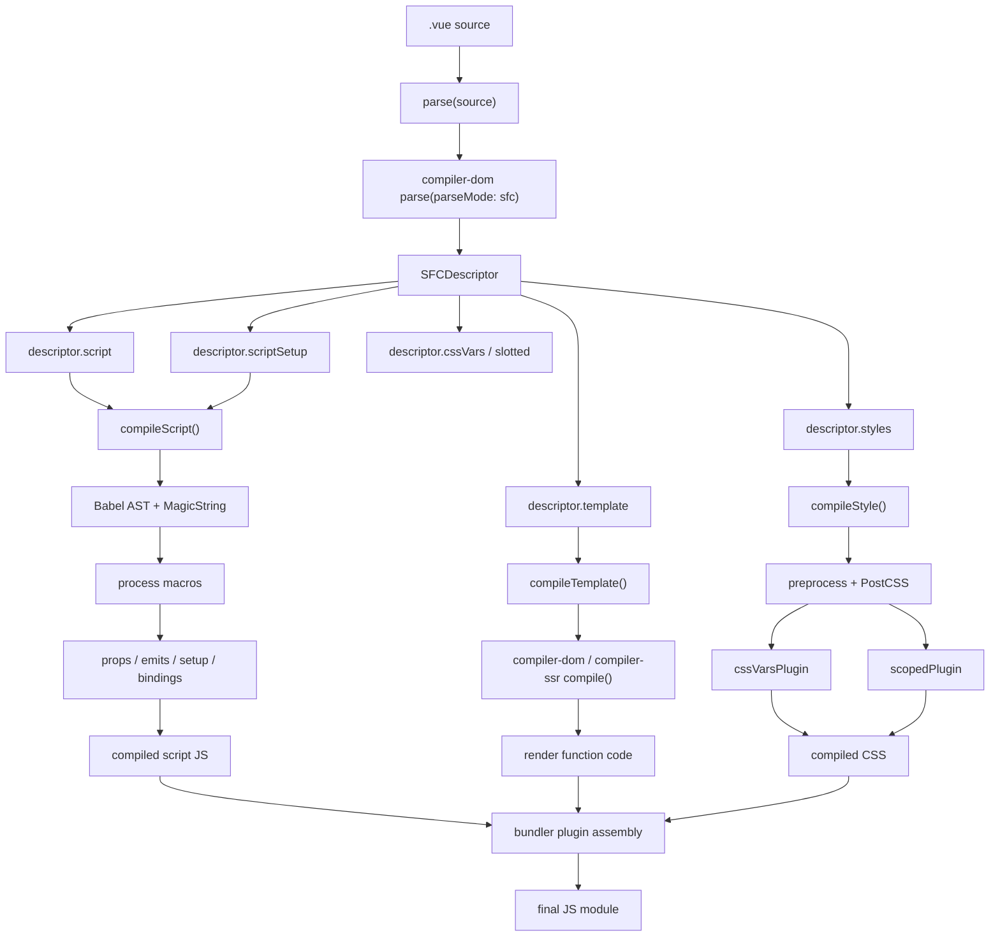
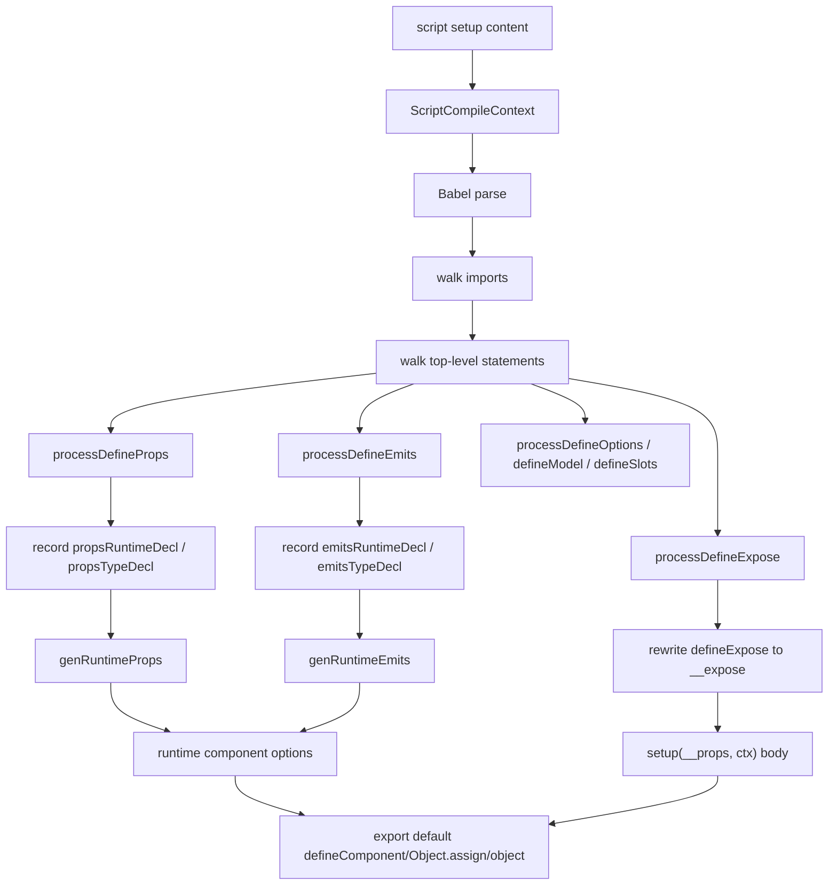
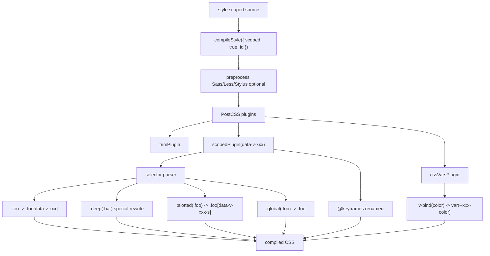

# Vue3 compiler-sfc 源码深入分析

本文基于当前仓库 `vue3` 源码整理，聚焦 `packages/compiler-sfc`：`.vue` 单文件组件如何被解析成 `SFCDescriptor`，`template`、`script`、`script setup`、`style` 分别如何编译，`defineProps` / `defineEmits` / `defineExpose` 宏如何被转换，`scoped CSS` 如何处理，以及 SFC 最终如何进入 JS 模块形态。

需要先明确一个边界：`compiler-sfc` 提供的是 SFC 分段编译 API，包括 `parse`、`compileScript`、`compileTemplate`、`compileStyle`。真正把这些产物拼成浏览器可加载模块，通常由 `@vitejs/plugin-vue`、`vue-loader` 这类工具完成。

## 一、compiler-sfc 负责什么

源码入口：

```text
vue3/packages/compiler-sfc/src/index.ts
```

`compiler-sfc` 对外导出核心 API：

```ts
export { parse } from './parse'
export { compileTemplate } from './compileTemplate'
export { compileStyle, compileStyleAsync } from './compileStyle'
export { compileScript } from './compileScript'
export { rewriteDefault, rewriteDefaultAST } from './rewriteDefault'
```

它负责把 `.vue` 文件拆开并分别编译：

| 模块 | 负责内容 |
| --- | --- |
| `parse` | 解析 `.vue` 文件，生成 `SFCDescriptor` |
| `compileScript` | 编译普通 `<script>` 和 `<script setup>`，处理宏、绑定分析、默认导出改写 |
| `compileTemplate` | 编译 `<template>`，复用 `compiler-dom` 或 `compiler-ssr` |
| `compileStyle` / `compileStyleAsync` | 编译 `<style>`，处理预处理器、CSS Modules、CSS vars、scoped CSS |
| `rewriteDefault` | 把 `export default` 改写成变量，方便向组件选项里注入 props、emits、setup 等 |
| `resolveType` 相关工具 | 从 TS 类型中推导运行时 props / emits |

它不直接负责：

| 不直接负责 | 实际由谁做 |
| --- | --- |
| 模块请求拆分，例如 `?vue&type=template` | Vite / webpack loader |
| 注入 style 到页面 | bundler style loader / Vite CSS pipeline |
| 把 `.vue` 所有 block 组装成最终模块 | `@vitejs/plugin-vue` / `vue-loader` |
| 创建 DOM、执行渲染 | `runtime-dom` / `runtime-core` |

`compiler-sfc` 的核心位置：

```text
.vue 文件
  -> compiler-sfc parse
     -> SFCDescriptor
  -> compiler-sfc compileScript / compileTemplate / compileStyle
     -> script JS / render JS / CSS
  -> bundler plugin 组装
     -> JS module
  -> runtime 执行组件
```

## 二、compiler-sfc 源码结构

```text
vue3/packages/compiler-sfc/src
├── index.ts
├── parse.ts
├── compileScript.ts
├── compileTemplate.ts
├── compileStyle.ts
├── rewriteDefault.ts
├── cache.ts
├── warn.ts
├── script
│   ├── context.ts
│   ├── normalScript.ts
│   ├── defineProps.ts
│   ├── defineEmits.ts
│   ├── defineExpose.ts
│   ├── defineOptions.ts
│   ├── defineModel.ts
│   ├── defineSlots.ts
│   ├── definePropsDestructure.ts
│   ├── resolveType.ts
│   ├── topLevelAwait.ts
│   ├── analyzeScriptBindings.ts
│   ├── importUsageCheck.ts
│   └── utils.ts
├── style
│   ├── cssVars.ts
│   ├── pluginScoped.ts
│   ├── pluginTrim.ts
│   └── preprocessors.ts
└── template
    ├── transformAssetUrl.ts
    ├── transformSrcset.ts
    └── templateUtils.ts
```

重要文件表：

| 文件 | 作用 |
| --- | --- |
| `src/parse.ts` | SFC parser，生成 `SFCDescriptor` |
| `src/compileScript.ts` | `<script setup>` 编译主入口，也是最复杂的文件 |
| `src/script/context.ts` | `ScriptCompileContext`，保存 MagicString、Babel AST、宏状态、绑定信息 |
| `src/script/normalScript.ts` | 普通 `<script>` 的默认导出改写和绑定分析 |
| `src/script/defineProps.ts` | `defineProps` / `withDefaults` 处理和 props 运行时代码生成 |
| `src/script/defineEmits.ts` | `defineEmits` 处理和 emits 运行时代码生成 |
| `src/script/defineExpose.ts` | `defineExpose` 识别 |
| `src/script/defineModel.ts` | `defineModel` 处理 |
| `src/script/resolveType.ts` | TS 类型解析，服务于类型式 props / emits |
| `src/compileTemplate.ts` | `<template>` 编译入口 |
| `src/compileStyle.ts` | `<style>` 编译入口 |
| `src/style/pluginScoped.ts` | scoped CSS 选择器重写插件 |
| `src/style/cssVars.ts` | `v-bind()` CSS 变量解析与运行时代码生成 |
| `src/rewriteDefault.ts` | 将 `export default` 改写为变量 |

## 三、SFC 编译流程

一个 `.vue` 文件通常长这样：

```vue
<template>
  <button class="btn" @click="emit('submit', count)">
    {{ title }}: {{ count }}
  </button>
</template>

<script setup lang="ts">
import { ref } from 'vue'

const props = defineProps<{
  title: string
}>()

const emit = defineEmits<{
  submit: [value: number]
}>()

defineExpose({
  reset
})

const count = ref(0)

function reset() {
  count.value = 0
}
</script>

<style scoped>
.btn {
  color: v-bind('titleColor');
}
</style>
```

整体流程：

```text
source .vue
  -> parse(source)
     -> descriptor
        - descriptor.template
        - descriptor.script
        - descriptor.scriptSetup
        - descriptor.styles
        - descriptor.cssVars
        - descriptor.slotted

  -> compileScript(descriptor, { id })
     -> 处理普通 script
     -> 处理 script setup
     -> 识别宏 defineProps / defineEmits / defineExpose
     -> 生成 props / emits
     -> 包装 setup()
     -> 返回 script JS

  -> compileTemplate({ source, ast, id, scoped, bindingMetadata })
     -> compiler-dom compile
     -> 返回 render 函数代码

  -> compileStyle({ source, id, scoped })
     -> PostCSS
     -> scoped selector rewrite
     -> CSS vars rewrite
     -> 返回 CSS

  -> bundler plugin 拼装
     -> JS module
```

## 四、parse 解析 .vue 文件时做了什么

源码位置：

```text
vue3/packages/compiler-sfc/src/parse.ts
```

`parse` 入口：

```ts
export function parse(
  source: string,
  options: SFCParseOptions = {},
): SFCParseResult {
  const sourceKey = genCacheKey(source, {
    ...options,
    compiler: { parse: options.compiler?.parse },
  })
  const cache = parseCache.get(sourceKey)
  if (cache) {
    return cache
  }

  const {
    sourceMap = true,
    filename = DEFAULT_FILENAME,
    sourceRoot = '',
    pad = false,
    ignoreEmpty = true,
    compiler = CompilerDOM,
    templateParseOptions = {},
  } = options

  const descriptor: SFCDescriptor = {
    filename,
    source,
    template: null,
    script: null,
    scriptSetup: null,
    styles: [],
    customBlocks: [],
    cssVars: [],
    slotted: false,
    shouldForceReload: prevImports => hmrShouldReload(prevImports, descriptor),
  }

  const ast = compiler.parse(source, {
    parseMode: 'sfc',
    prefixIdentifiers: true,
    ...templateParseOptions,
    onError: e => {
      errors.push(e)
    },
  })

  ast.children.forEach(node => {
    // 根据 node.tag 分发 template / script / style / custom block
  })

  descriptor.cssVars = parseCssVars(descriptor)
  descriptor.slotted = descriptor.styles.some(
    s => s.scoped && slottedRE.test(s.content),
  )

  parseCache.set(sourceKey, result)
  return result
}
```

它做了这些事：

| 步骤 | 说明 |
| --- | --- |
| 1. 计算缓存 key | 同一份 source + options 命中 `parseCache` 时直接返回 |
| 2. 创建空 descriptor | 初始化 `template/script/scriptSetup/styles/customBlocks/cssVars/slotted` |
| 3. 调用 `compiler.parse` | 默认使用 `compiler-dom`，并指定 `parseMode: 'sfc'` |
| 4. 遍历顶层节点 | 只关心顶层 `template`、`script`、`style` 和 custom block |
| 5. 创建 block | 调用 `createBlock(node, source, pad)` 截取 block 内容和 attrs |
| 6. 做重复 block 校验 | 只允许一个 `<template>`、一个普通 `<script>`、一个 `<script setup>` |
| 7. 校验 script setup 限制 | `<script setup>` 不能使用 `src`；同时存在时普通 `<script>` 也不能用 `src` |
| 8. 生成 source map | 给 template、script、style、custom block 生成块级 sourcemap |
| 9. 解析 CSS vars | 扫描 style 中的 `v-bind(...)` |
| 10. 记录 slotted | 如果 scoped style 使用 `:slotted()`，设置 `descriptor.slotted` |

### createBlock 做了什么

`createBlock` 会根据 SFC 顶层标签生成 block：

```ts
function createBlock(
  node: ElementNode,
  source: string,
  pad: SFCParseOptions['pad'],
): SFCBlock {
  const type = node.tag
  const loc = node.innerLoc!
  const attrs: Record<string, string | true> = {}
  const block: SFCBlock = {
    type,
    content: source.slice(loc.start.offset, loc.end.offset),
    loc,
    attrs,
  }

  node.props.forEach(p => {
    if (p.type === NodeTypes.ATTRIBUTE) {
      const name = p.name
      attrs[name] = p.value ? p.value.content || true : true
      if (name === 'lang') {
        block.lang = p.value && p.value.content
      } else if (name === 'src') {
        block.src = p.value && p.value.content
      } else if (type === 'style') {
        if (name === 'scoped') {
          block.scoped = true
        } else if (name === 'module') {
          block.module = attrs[name]
        }
      } else if (type === 'script' && name === 'setup') {
        block.setup = attrs.setup
      }
    }
  })

  return block
}
```

所以：

| SFC 写法 | descriptor 中的结果 |
| --- | --- |
| `<template>` | `descriptor.template` |
| `<script>` | `descriptor.script` |
| `<script setup>` | `descriptor.scriptSetup` |
| `<style>` | `descriptor.styles[]` |
| `<style scoped>` | `styleBlock.scoped = true` |
| `<style module>` | `styleBlock.module = true` 或模块名 |
| `<docs>` / `<i18n>` | `descriptor.customBlocks[]` |

## 五、SFCDescriptor 是什么

源码位置：

```text
vue3/packages/compiler-sfc/src/parse.ts
```

核心类型：

```ts
export interface SFCDescriptor {
  filename: string
  source: string
  template: SFCTemplateBlock | null
  script: SFCScriptBlock | null
  scriptSetup: SFCScriptBlock | null
  styles: SFCStyleBlock[]
  customBlocks: SFCBlock[]
  cssVars: string[]
  slotted: boolean
  shouldForceReload: (prevImports: Record<string, ImportBinding>) => boolean
}
```

Block 类型：

```ts
export interface SFCBlock {
  type: string
  content: string
  attrs: Record<string, string | true>
  loc: SourceLocation
  map?: RawSourceMap
  lang?: string
  src?: string
}

export interface SFCTemplateBlock extends SFCBlock {
  type: 'template'
  ast?: RootNode
}

export interface SFCScriptBlock extends SFCBlock {
  type: 'script'
  setup?: string | boolean
  bindings?: BindingMetadata
  imports?: Record<string, ImportBinding>
  scriptAst?: Statement[]
  scriptSetupAst?: Statement[]
  warnings?: string[]
  deps?: string[]
}

export interface SFCStyleBlock extends SFCBlock {
  type: 'style'
  scoped?: boolean
  module?: string | boolean
}
```

`SFCDescriptor` 是 SFC 后续所有编译步骤的中心数据结构：

| 字段 | 用途 |
| --- | --- |
| `filename` | 错误信息、source map、组件名推断、scope id 关联 |
| `source` | 原始 `.vue` 文件内容 |
| `template` | `<template>` 内容、attrs、loc、map、AST |
| `script` | 普通 `<script>` 内容、attrs、Babel AST、bindings |
| `scriptSetup` | `<script setup>` 内容、attrs、Babel AST、bindings |
| `styles` | 所有 `<style>` block |
| `customBlocks` | 自定义 block，例如 `<docs>`、`<i18n>` |
| `cssVars` | 从 style 中提取出的 `v-bind(...)` 表达式 |
| `slotted` | scoped style 中是否出现 `:slotted()` |
| `shouldForceReload` | HMR 判断辅助函数 |

可以把它理解成：

```text
SFCDescriptor = .vue 文件的结构化清单
```

## 六、template、script、script setup、style 分别如何处理

### template

`parse` 阶段：

| 行为 | 说明 |
| --- | --- |
| 创建 `SFCTemplateBlock` | 保存 `content`、`attrs`、`loc` |
| 如果没有 `src` | 保存 `templateBlock.ast = createRoot(node.children, source)` |
| 如果是 pug / jade | 对 `content` 做 dedent |
| 生成 source map | 后续 `compileTemplate` 可以把错误映射回 `.vue` |

`compileTemplate` 阶段：

| 行为 | 说明 |
| --- | --- |
| 预处理模板 | 处理 `preprocessLang` |
| 处理 asset URL | 注入 `transformAssetUrl` 和 `transformSrcset` |
| 调用 DOM/SSR compiler | 默认 DOM 用 `compiler-dom`，SSR 用 `compiler-ssr` |
| 注入 scopeId | scoped style 时传 `scopeId: data-v-xxx` |
| 传入 bindingMetadata | 让模板表达式知道 setup 绑定、props 绑定等 |

### script

普通 `<script>` 由 `compileScript` 内部的 `processNormalScript` 处理。

如果只有普通 `<script>`：

| 行为 | 说明 |
| --- | --- |
| Babel 解析 | 得到 `scriptAst` |
| 绑定分析 | `analyzeScriptBindings(scriptAst.body)` |
| 改写默认导出 | 必要时通过 `rewriteDefaultAST` 把 `export default` 改成 `const __default__ = ...` |
| 注入 CSS vars | 如果 style 使用 `v-bind()`，包裹 / 注入 `useCssVars` |
| 返回 SFCScriptBlock | 包含 `content`、`bindings`、`scriptAst` |

### script setup

`<script setup>` 是 `compileScript` 的主要处理对象。

它会：

| 行为 | 说明 |
| --- | --- |
| 和普通 `<script>` 合并 | 如果两者都存在，要把默认导出、imports、setup 内容整合 |
| 识别编译宏 | `defineProps`、`defineEmits`、`defineExpose`、`defineOptions`、`defineSlots`、`defineModel`、`withDefaults` |
| 删除或替换宏调用 | 例如 `defineProps` 删除 / 替换为 `__props`，`defineEmits` 替换为 `__emit` |
| 收集绑定信息 | 给 template 编译器使用 |
| 包装成 `setup()` | 顶层变量变成 `setup` 作用域里的变量 |
| 生成组件默认导出 | 加入 `props`、`emits`、`setup`、`__name` 等 |
| 处理 top-level await | 将 `setup` 变成 async，并保持实例上下文 |
| 注入 `useCssVars` | 对 CSS `v-bind()` 生成运行时代码 |

### style

`compileStyle` 处理 `<style>`。

它会：

| 行为 | 说明 |
| --- | --- |
| 预处理 | 根据 `preprocessLang` 调用 sass / less / stylus 等预处理器 |
| PostCSS 处理 | 创建 PostCSS pipeline |
| CSS vars | `cssVarsPlugin` 把 `v-bind(color)` 改成 `var(--xxx-color)` |
| trim | `trimPlugin` 清理首尾空白 |
| scoped | `scopedPlugin(data-v-xxx)` 重写选择器 |
| CSS Modules | `modules` 为 true 时使用 `postcss-modules` |
| source map | 合并预处理器 map 和 PostCSS map |

## 七、compileScript 做了什么

源码位置：

```text
vue3/packages/compiler-sfc/src/compileScript.ts
vue3/packages/compiler-sfc/src/script/context.ts
```

入口：

```ts
export function compileScript(
  sfc: SFCDescriptor,
  options: SFCScriptCompileOptions,
): SFCScriptBlock {
  const { script, scriptSetup, source, filename } = sfc
  const hoistStatic = options.hoistStatic !== false && !script
  const scopeId = options.id ? options.id.replace(/^data-v-/, '') : ''
  const scriptLang = script && script.lang
  const scriptSetupLang = scriptSetup && scriptSetup.lang
  const isJSOrTS =
    isJS(scriptLang, scriptSetupLang) || isTS(scriptLang, scriptSetupLang)

  if (script && scriptSetup && scriptLang !== scriptSetupLang) {
    throw new Error(`<script> and <script setup> must have the same language type.`)
  }

  if (!scriptSetup) {
    return processNormalScript(ctx, scopeId)
  }

  const ctx = new ScriptCompileContext(sfc, options)
  // 后续处理 <script setup>
}
```

它的关键流程：

| 阶段 | 说明 |
| --- | --- |
| 1. 检查参数 | `id`、script 语言一致性、是否 JS/TS |
| 2. 创建上下文 | `new ScriptCompileContext(sfc, options)` |
| 3. 解析 Babel AST | `context.ts` 用 `@babel/parser` 解析 script 和 script setup |
| 4. 处理普通 script | 分析导入、默认导出、命名导出、bindings |
| 5. 处理 script setup imports | 收集用户导入，判断是否在 template 中使用 |
| 6. 遍历 script setup body | 识别宏、记录绑定、处理 top-level await |
| 7. 处理 props 解构 | `transformDestructuredProps` |
| 8. 校验宏作用域 | 宏参数不能引用 setup 局部变量 |
| 9. 生成 bindingMetadata | 合并 props、script、setup、imports 绑定信息 |
| 10. 注入 CSS vars | `useCssVars` |
| 11. 生成 setup 参数 | `setup(__props, { expose: __expose, emit: __emit })` |
| 12. 生成 return | 非 inline 模式返回 setup 暴露给模板的对象 |
| 13. 生成默认导出 | `export default defineComponent(...)` 或 `Object.assign(...)` |
| 14. 注入 helper imports | 例如 `defineComponent`、`useCssVars`、`unref` |
| 15. 返回编译后的 script block | 包含 `content`、`bindings`、`imports`、AST、source map |

`ScriptCompileContext` 保存了编译所需的所有中间状态：

```ts
export class ScriptCompileContext {
  scriptAst: Program | null
  scriptSetupAst: Program | null
  source: string = this.descriptor.source
  filename: string = this.descriptor.filename
  s: MagicString = new MagicString(this.source)
  startOffset = this.descriptor.scriptSetup?.loc.start.offset
  endOffset = this.descriptor.scriptSetup?.loc.end.offset

  userImports: Record<string, ImportBinding> = Object.create(null)

  hasDefinePropsCall = false
  hasDefineEmitCall = false
  hasDefineExposeCall = false

  propsRuntimeDecl: Node | undefined
  propsTypeDecl: Node | undefined
  propsRuntimeDefaults: Node | undefined

  emitsRuntimeDecl: Node | undefined
  emitsTypeDecl: Node | undefined
  emitDecl: Node | undefined

  bindingMetadata: BindingMetadata = {}
  helperImports: Set<string> = new Set()
}
```

`compileScript` 的本质：

```text
用 Babel AST 理解脚本结构
用 MagicString 原地改写源码
把 <script setup> 顶层代码包进 setup()
把编译宏转成组件选项和 setup 参数
```

## 八、script setup 转换流程

### 输入

```vue
<script setup lang="ts">
import { ref } from 'vue'

const props = defineProps<{ title: string }>()
const emit = defineEmits<{ submit: [value: number] }>()

defineExpose({
  reset
})

const count = ref(0)

function reset() {
  count.value = 0
}
</script>
```

### 处理宏

`compileScript` 遍历 `scriptSetupAst.body`：

```ts
for (const node of scriptSetupAst.body) {
  if (node.type === 'ExpressionStatement') {
    const expr = unwrapTSNode(node.expression)
    if (
      processDefineProps(ctx, expr) ||
      processDefineEmits(ctx, expr) ||
      processDefineOptions(ctx, expr) ||
      processDefineSlots(ctx, expr)
    ) {
      ctx.s.remove(node.start! + startOffset, node.end! + startOffset)
    } else if (processDefineExpose(ctx, expr)) {
      const callee = (expr as CallExpression).callee
      ctx.s.overwrite(
        callee.start! + startOffset,
        callee.end! + startOffset,
        '__expose',
      )
    }
  }

  if (node.type === 'VariableDeclaration' && !node.declare) {
    for (const decl of node.declarations) {
      const init = decl.init && unwrapTSNode(decl.init)
      const isDefineProps = processDefineProps(ctx, init, decl.id as LVal)
      const isDefineEmits =
        !isDefineProps && processDefineEmits(ctx, init, decl.id as LVal)

      if (isDefineEmits) {
        ctx.s.overwrite(
          startOffset + init.start!,
          startOffset + init.end!,
          '__emit',
        )
      }
    }
  }
}
```

宏转换规则：

| 原始写法 | 编译处理 |
| --- | --- |
| `defineProps({...})` 独立表达式 | 删除调用，后续生成组件 `props` 选项 |
| `const props = defineProps<T>()` | 调用记录到 `ctx.propsDecl`，后续替换为 `__props` |
| `withDefaults(defineProps<T>(), defaults)` | 记录类型 props 和 defaults，生成 `mergeDefaults(...)` |
| `const emit = defineEmits<T>()` | `defineEmits(...)` 替换成 `__emit`，并生成组件 `emits` 选项 |
| `defineExpose({...})` | 调用名改成 `__expose({...})` |
| 没有 `defineExpose` | 默认注入 `__expose()`，让 `<script setup>` 组件默认关闭实例暴露 |

### 输出形态

编译后的形态接近：

```ts
import { defineComponent as _defineComponent } from 'vue'
import { ref } from 'vue'

export default /*@__PURE__*/_defineComponent({
  __name: 'Comp',
  props: {
    title: { type: String, required: true }
  },
  emits: ["submit"],
  setup(__props: any, { expose: __expose, emit: __emit }) {
    const props = __props
    const emit = __emit

    __expose({
      reset
    })

    const count = ref(0)

    function reset() {
      count.value = 0
    }

    const __returned__ = { props, emit, count, reset }
    Object.defineProperty(__returned__, '__isScriptSetup', {
      enumerable: false,
      value: true
    })
    return __returned__
  }
})
```

实际输出会受到 TS、inline template、导入使用情况、production/dev、source map 等影响。关键是：`<script setup>` 的顶层语句被搬进 `setup()`，而编译宏不作为运行时函数存在。

## 九、defineProps 如何被编译

源码位置：

```text
vue3/packages/compiler-sfc/src/script/defineProps.ts
```

入口：

```ts
export function processDefineProps(
  ctx: ScriptCompileContext,
  node: Node,
  declId?: LVal,
  isWithDefaults = false,
): boolean {
  if (!isCallOf(node, DEFINE_PROPS)) {
    return processWithDefaults(ctx, node, declId)
  }

  if (ctx.hasDefinePropsCall) {
    ctx.error(`duplicate defineProps() call`, node)
  }
  ctx.hasDefinePropsCall = true
  ctx.propsRuntimeDecl = node.arguments[0]

  if (ctx.propsRuntimeDecl) {
    for (const key of getObjectOrArrayExpressionKeys(ctx.propsRuntimeDecl)) {
      ctx.bindingMetadata[key] = BindingTypes.PROPS
    }
  }

  if (node.typeParameters) {
    if (ctx.propsRuntimeDecl) {
      ctx.error(`defineProps() cannot accept both type and non-type arguments`)
    }
    ctx.propsTypeDecl = node.typeParameters.params[0]
  }

  if (!isWithDefaults && declId && declId.type === 'ObjectPattern') {
    processPropsDestructure(ctx, declId)
  }

  ctx.propsCall = node
  ctx.propsDecl = declId
  return true
}
```

两种模式：

| 模式 | 示例 | 编译结果 |
| --- | --- | --- |
| 运行时声明 | `defineProps({ title: String })` | 直接使用对象生成 `props: { title: String }` |
| 类型声明 | `defineProps<{ title: string }>()` | 通过 `resolveType` / `inferRuntimeType` 推导出运行时 props |

`genRuntimeProps(ctx)` 会生成最终组件选项里的 `props`：

```ts
const propsDecl = genRuntimeProps(ctx)
if (propsDecl) runtimeOptions += `\n  props: ${propsDecl},`
```

类型式 props 示例：

```ts
const props = defineProps<{
  title: string
  count?: number
}>()
```

可能生成：

```ts
props: {
  title: { type: String, required: true },
  count: { type: Number, required: false }
}
```

如果使用 `withDefaults`：

```ts
const props = withDefaults(defineProps<{
  size?: number
}>(), {
  size: 12
})
```

会记录 `ctx.propsRuntimeDefaults`，再生成 `mergeDefaults(...)` 形式。

## 十、defineEmits 如何被编译

源码位置：

```text
vue3/packages/compiler-sfc/src/script/defineEmits.ts
```

入口：

```ts
export function processDefineEmits(
  ctx: ScriptCompileContext,
  node: Node,
  declId?: LVal,
): boolean {
  if (!isCallOf(node, DEFINE_EMITS)) {
    return false
  }
  if (ctx.hasDefineEmitCall) {
    ctx.error(`duplicate defineEmits() call`, node)
  }
  ctx.hasDefineEmitCall = true
  ctx.emitsRuntimeDecl = node.arguments[0]
  if (node.typeParameters) {
    if (ctx.emitsRuntimeDecl) {
      ctx.error(`defineEmits() cannot accept both type and non-type arguments`)
    }
    ctx.emitsTypeDecl = node.typeParameters.params[0]
  }

  ctx.emitDecl = declId
  return true
}
```

`defineEmits` 也有运行时声明和类型声明：

| 模式 | 示例 | 编译结果 |
| --- | --- | --- |
| 运行时数组 | `defineEmits(['submit'])` | `emits: ['submit']` |
| 运行时对象 | `defineEmits({ submit: value => true })` | `emits: { submit: value => true }` |
| 类型声明 | `defineEmits<{ submit: [value: number] }>()` | 提取事件名，生成 `emits: ['submit']` |

变量声明中的宏调用会被替换成 `__emit`：

```ts
const emit = defineEmits(['submit'])
```

编译后接近：

```ts
emits: ['submit'],
setup(__props, { emit: __emit }) {
  const emit = __emit
}
```

## 十一、defineExpose 如何被编译

源码位置：

```text
vue3/packages/compiler-sfc/src/script/defineExpose.ts
vue3/packages/compiler-sfc/src/compileScript.ts
```

`processDefineExpose` 只负责识别是否调用了 `defineExpose`：

```ts
export function processDefineExpose(
  ctx: ScriptCompileContext,
  node: Node,
): boolean {
  if (isCallOf(node, DEFINE_EXPOSE)) {
    if (ctx.hasDefineExposeCall) {
      ctx.error(`duplicate defineExpose() call`, node)
    }
    ctx.hasDefineExposeCall = true
    return true
  }
  return false
}
```

真正改写在 `compileScript`：

```ts
} else if (processDefineExpose(ctx, expr)) {
  // defineExpose({}) -> expose({})
  const callee = (expr as CallExpression).callee
  ctx.s.overwrite(
    callee.start! + startOffset,
    callee.end! + startOffset,
    '__expose',
  )
}
```

也就是：

```ts
defineExpose({ reset })
```

变成：

```ts
__expose({ reset })
```

同时 setup 参数会注入：

```ts
setup(__props, { expose: __expose }) {
  __expose({ reset })
}
```

如果用户没有写 `defineExpose`，源码会默认插入：

```ts
const exposeCall =
  ctx.hasDefineExposeCall || options.inlineTemplate ? `` : `  __expose();\n`
```

这对应 `<script setup>` 的设计：默认不会把所有顶层变量暴露到组件 public instance 上，只有显式 `defineExpose` 才暴露。

## 十二、compileTemplate 做了什么

源码位置：

```text
vue3/packages/compiler-sfc/src/compileTemplate.ts
```

入口：

```ts
export function compileTemplate(
  options: SFCTemplateCompileOptions,
): SFCTemplateCompileResults {
  const { preprocessLang, preprocessCustomRequire } = options

  const preprocessor = preprocessLang
    ? preprocessCustomRequire
      ? preprocessCustomRequire(preprocessLang)
      : consolidate[preprocessLang]
    : false

  if (preprocessor) {
    return doCompileTemplate({
      ...options,
      source: preprocess(options, preprocessor),
      ast: undefined,
    })
  } else {
    return doCompileTemplate(options)
  }
}
```

`doCompileTemplate` 主流程：

```ts
const shortId = id.replace(/^data-v-/, '')
const longId = `data-v-${shortId}`

const defaultCompiler = ssr ? CompilerSSR : CompilerDOM
compiler = compiler || defaultCompiler

let { code, ast, preamble, map } = compiler.compile(inAST || source, {
  mode: 'module',
  prefixIdentifiers: true,
  hoistStatic: true,
  cacheHandlers: true,
  ssrCssVars,
  scopeId: scoped ? longId : undefined,
  slotted,
  sourceMap: true,
  hmr: !isProd,
  nodeTransforms: nodeTransforms.concat(compilerOptions.nodeTransforms || []),
  filename,
  onError: e => errors.push(e),
  onWarn: w => warnings.push(w),
})
```

它做的事情：

| 步骤 | 说明 |
| --- | --- |
| 1. 模板预处理 | 处理 `preprocessLang`，例如 pug |
| 2. 准备 asset transforms | 默认启用 `transformAssetUrl` 和 `transformSrcset` |
| 3. 准备 scope id | `id` 转成 `data-v-xxx` |
| 4. 选择 compiler | DOM 用 `compiler-dom`，SSR 用 `compiler-ssr` |
| 5. 复用或重新解析 AST | descriptor 中未 transformed 的 template AST 可以复用 |
| 6. 调用 `compiler.compile` | 也就是进入 `compiler-core` 的 `baseCompile` 主流程 |
| 7. 传入 SFC 编译选项 | `mode: 'module'`、`prefixIdentifiers`、`hoistStatic`、`cacheHandlers` |
| 8. 注入 scoped 信息 | `scopeId: scoped ? longId : undefined` |
| 9. 返回结果 | `{ code, ast, preamble, source, tips, errors, map }` |

template 编译输出示例：

```ts
import {
  toDisplayString as _toDisplayString,
  openBlock as _openBlock,
  createElementBlock as _createElementBlock
} from "vue"

export function render(_ctx, _cache) {
  return (_openBlock(), _createElementBlock("div", null, _toDisplayString(_ctx.msg), 1))
}
```

如果 `scoped: true`，`compileTemplate` 会把 `scopeId` 传给底层编译器，让 vnode 创建时携带 scope 信息，最终运行时为 DOM 节点添加 `data-v-xxx` 属性。

## 十三、scoped CSS 是如何处理的

源码位置：

```text
vue3/packages/compiler-sfc/src/compileStyle.ts
vue3/packages/compiler-sfc/src/style/pluginScoped.ts
```

`compileStyle` 入口：

```ts
export function compileStyle(
  options: SFCStyleCompileOptions,
): SFCStyleCompileResults {
  return doCompileStyle({
    ...options,
    isAsync: false,
  }) as SFCStyleCompileResults
}
```

`doCompileStyle` 里会组装 PostCSS plugins：

```ts
const shortId = id.replace(/^data-v-/, '')
const longId = `data-v-${shortId}`

const plugins = (postcssPlugins || []).slice()
plugins.unshift(cssVarsPlugin({ id: shortId, isProd }))
if (trim) {
  plugins.push(trimPlugin())
}
if (scoped) {
  plugins.push(scopedPlugin(longId))
}
if (modules) {
  plugins.push(postcssModules(...))
}

result = postcss(plugins).process(source, postCSSOptions)
```

scoped CSS 的核心就是选择器重写。

输入：

```css
.btn {
  color: red;
}
```

如果 `id = data-v-abc123`，输出接近：

```css
.btn[data-v-abc123] {
  color: red;
}
```

`pluginScoped.ts` 的核心：

```ts
const scopedPlugin: PluginCreator<string> = (id = '') => {
  const keyframes = Object.create(null)
  const shortId = id.replace(/^data-v-/, '')

  return {
    postcssPlugin: 'vue-sfc-scoped',
    Rule(rule) {
      processRule(id, rule)
    },
    AtRule(node) {
      if (keyframesRE.test(node.name) && !node.params.endsWith(`-${shortId}`)) {
        keyframes[node.params] = node.params = node.params + '-' + shortId
      }
    },
    OnceExit(root) {
      // rewrite animation-name / animation
    },
  }
}
```

最终注入属性选择器的位置在 `rewriteSelector`：

```ts
if (shouldInject) {
  const idToAdd = slotted ? id + '-s' : id
  selector.insertAfter(
    node as any,
    selectorParser.attribute({
      attribute: idToAdd,
      value: idToAdd,
      quoteMark: `"`,
    }),
  )
}
```

scoped 特殊选择器：

| 写法 | 编译行为 |
| --- | --- |
| `.foo` | `.foo[data-v-xxx]` |
| `:deep(.bar)` | 深层选择器不对 `.bar` 注入当前 scope，通常变成 `[data-v-xxx] .bar` 一类结构 |
| `:slotted(.foo)` | 注入 `data-v-xxx-s`，用于插槽内容 |
| `:global(.foo)` | 去掉 scoped 注入，直接输出 `.foo` |
| `@keyframes fade` | 改成 `fade-xxx`，并同步重写 `animation-name` / `animation` |

scoped CSS 不是靠 CSS 原生隔离，而是靠：

```text
模板编译给 DOM 节点加 data-v-xxx
style 编译给 CSS 选择器加 [data-v-xxx]
两边 id 对上后实现样式局部化
```

## 十四、CSS v-bind 是如何处理的

源码位置：

```text
vue3/packages/compiler-sfc/src/style/cssVars.ts
```

parse 阶段会扫描 style 内容：

```ts
export function parseCssVars(sfc: SFCDescriptor): string[] {
  const vars: string[] = []
  sfc.styles.forEach(style => {
    const content = style.content.replace(/\/\*([\s\S]*?)\*\/|\/\/.*/g, '')
    while ((match = vBindRE.exec(content))) {
      const start = match.index + match[0].length
      const end = lexBinding(content, start)
      if (end !== null) {
        const variable = normalizeExpression(content.slice(start, end))
        if (!vars.includes(variable)) {
          vars.push(variable)
        }
      }
    }
  })
  return vars
}
```

style 编译阶段会把 `v-bind()` 改成 CSS 变量：

```ts
Declaration(decl) {
  const value = decl.value
  if (vBindRE.test(value)) {
    decl.value =
      value.slice(lastIndex, match.index) +
      `var(--${genVarName(id, variable, isProd)})`
  }
}
```

例如：

```css
.btn {
  color: v-bind(color);
}
```

变成：

```css
.btn {
  color: var(--abc123-color);
}
```

script 编译阶段会注入运行时代码：

```ts
_useCssVars(_ctx => ({
  "abc123-color": (color)
}))
```

这条链路是：

```text
style 中 v-bind(color)
  -> parseCssVars 收集 color
  -> compileStyle 改成 var(--xxx-color)
  -> compileScript 注入 useCssVars
  -> 运行时把 CSS 自定义属性写到组件根节点上
```

## 十五、SFC 最终如何变成 JS 模块

这里要分两种模式理解。

### 非 inline template 模式

`compileScript` 只处理脚本：

```ts
export default {
  props: ...,
  emits: ...,
  setup(...) {
    ...
    return __returned__
  }
}
```

`compileTemplate` 单独输出：

```ts
export function render(_ctx, _cache) {
  ...
}
```

打包器插件再把它们拼起来，概念上类似：

```ts
import script from './Comp.vue?vue&type=script'
import { render } from './Comp.vue?vue&type=template'
import './Comp.vue?vue&type=style&index=0&scoped=true'

script.render = render
script.__scopeId = 'data-v-abc123'

export default script
```

这段拼装逻辑不在 `compiler-sfc` 的核心源码里完成，而是在 Vite / webpack 的 Vue 插件里完成。`compiler-sfc` 的职责是提供可靠的分段编译结果。

### inline template 模式

`compileScript` 可以在 `options.inlineTemplate` 为 true 时直接调用 `compileTemplate`：

```ts
const { code, ast, preamble, tips, errors, map } = compileTemplate({
  filename,
  ast: sfc.template.ast,
  source: sfc.template.content,
  id: scopeId,
  scoped: sfc.styles.some(s => s.scoped),
  ssrCssVars: sfc.cssVars,
  compilerOptions: {
    inline: true,
    isTS: ctx.isTS,
    bindingMetadata: ctx.bindingMetadata,
  },
})

returned = code
```

这种情况下 template 编译结果会作为 `setup()` 的返回值内联进去，最终 JS 更接近：

```ts
export default {
  props: ...,
  setup(__props) {
    const count = ref(0)

    return (_ctx, _cache) => {
      return (_openBlock(), _createElementBlock("div", null, count.value))
    }
  }
}
```

## 十六、Mermaid：SFC 编译总流程



## 十七、Mermaid：script setup 转换流程



## 十八、Mermaid：scoped CSS 处理流程



## 十九、示例：一个 SFC 的编译结果

输入：

```vue
<template>
  <button class="btn" @click="emit('submit', count)">
    {{ title }}: {{ count }}
  </button>
</template>

<script setup lang="ts">
import { ref } from 'vue'

const props = defineProps<{
  title: string
}>()

const emit = defineEmits<{
  submit: [value: number]
}>()

const count = ref(0)

defineExpose({
  reset
})

function reset() {
  count.value = 0
}
</script>

<style scoped>
.btn {
  color: v-bind(color);
}
</style>
```

### parse 后

```ts
SFCDescriptor {
  filename: 'Comp.vue',
  source: '...',
  template: {
    type: 'template',
    content: '<button class="btn" ...>...</button>',
    ast: RootNode(...)
  },
  script: null,
  scriptSetup: {
    type: 'script',
    setup: true,
    lang: 'ts',
    content: "import { ref } from 'vue'..."
  },
  styles: [
    {
      type: 'style',
      scoped: true,
      content: '.btn { color: v-bind(color); }'
    }
  ],
  cssVars: ['color'],
  slotted: false
}
```

### compileScript 后

形态接近：

```ts
import { defineComponent as _defineComponent, useCssVars as _useCssVars, unref as _unref } from 'vue'
import { ref } from 'vue'

export default /*@__PURE__*/_defineComponent({
  __name: 'Comp',
  props: {
    title: { type: String, required: true }
  },
  emits: ["submit"],
  setup(__props: any, { expose: __expose, emit: __emit }) {
    _useCssVars(_ctx => ({
      "xxxx-color": (color)
    }))

    const props = __props
    const emit = __emit
    const count = ref(0)

    __expose({
      reset
    })

    function reset() {
      count.value = 0
    }

    const __returned__ = { props, emit, count, reset }
    Object.defineProperty(__returned__, '__isScriptSetup', {
      enumerable: false,
      value: true
    })
    return __returned__
  }
})
```

### compileTemplate 后

形态接近：

```ts
import {
  toDisplayString as _toDisplayString,
  openBlock as _openBlock,
  createElementBlock as _createElementBlock
} from "vue"

export function render(_ctx, _cache) {
  return (_openBlock(), _createElementBlock("button", {
    class: "btn",
    onClick: _cache[0] || (_cache[0] = $event => (_ctx.emit('submit', _ctx.count)))
  }, _toDisplayString(_ctx.title) + ": " + _toDisplayString(_ctx.count), 1))
}
```

### compileStyle 后

形态接近：

```css
.btn[data-v-xxxx] {
  color: var(--xxxx-color);
}
```

### bundler 拼装后

概念上：

```ts
import script from './Comp.vue?vue&type=script&setup=true&lang.ts'
import { render } from './Comp.vue?vue&type=template&id=xxxx&scoped=true'
import './Comp.vue?vue&type=style&index=0&scoped=true&lang.css'

script.render = render
script.__scopeId = 'data-v-xxxx'

export default script
```

这一步是工具链拼装的概念示例，不是 `compiler-sfc/src` 中单个函数直接输出的完整字符串。

## 二十、推荐阅读顺序

| 顺序 | 文件 | 阅读目标 |
| --- | --- | --- |
| 1 | `compiler-sfc/src/index.ts` | 先看对外 API，知道 SFC 编译被拆成几段 |
| 2 | `compiler-sfc/src/parse.ts` | 理解 `SFCDescriptor` 和 block 解析 |
| 3 | `compiler-sfc/src/compileTemplate.ts` | 理解 template 如何转交给 `compiler-dom` / `compiler-ssr` |
| 4 | `compiler-sfc/src/compileStyle.ts` | 理解 style 编译、PostCSS pipeline、scoped 开关 |
| 5 | `compiler-sfc/src/style/pluginScoped.ts` | 深入 scoped CSS 选择器重写 |
| 6 | `compiler-sfc/src/style/cssVars.ts` | 理解 CSS `v-bind()` 和 `useCssVars` |
| 7 | `compiler-sfc/src/script/context.ts` | 理解 script 编译上下文、Babel AST、MagicString |
| 8 | `compiler-sfc/src/compileScript.ts` | 主攻 `<script setup>` 转换全流程 |
| 9 | `compiler-sfc/src/script/defineProps.ts` | 理解 props 宏和 TS 类型推导 |
| 10 | `compiler-sfc/src/script/defineEmits.ts` | 理解 emits 宏 |
| 11 | `compiler-sfc/src/script/defineExpose.ts` | 理解 expose 宏 |
| 12 | `compiler-sfc/src/rewriteDefault.ts` | 理解普通 script 如何被注入组件选项 |

## 二十一、核心结论

`compiler-sfc` 的主线可以压缩成一句话：

```text
它把 .vue 文件拆成 descriptor，再分别把 template、script、style 编译成可被打包器拼装的产物。
```

三条核心链路：

```text
parse:
.vue source
  -> compiler-dom parse(parseMode: sfc)
  -> SFCDescriptor
```

```text
script setup:
SFCDescriptor
  -> Babel AST
  -> 宏识别 defineProps / defineEmits / defineExpose
  -> MagicString 改写
  -> export default + setup()
```

```text
style scoped:
style source
  -> PostCSS
  -> scopedPlugin(data-v-xxx)
  -> selector[data-v-xxx]
```

理解 SFC 编译时，最重要的是不要把它看成一个单函数黑盒。它其实是一个面向工具链的分段编译器：

| 阶段 | 产物 |
| --- | --- |
| `parse` | 结构化 descriptor |
| `compileScript` | 组件脚本模块 |
| `compileTemplate` | render 函数模块 |
| `compileStyle` | CSS 代码 |
| bundler plugin | 最终可运行的 JS 模块 |

这也是为什么 Vue3 可以让 Vite、webpack、SSR、自定义块、CSS Modules、scoped CSS、`script setup` 宏都在同一个 SFC 体系里协作：`compiler-sfc` 负责把 `.vue` 拆清楚、编清楚，工具链负责把它们装起来。
