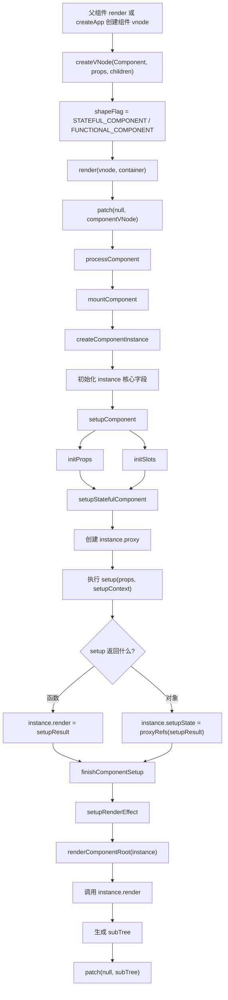

# Vue3 组件实例创建源码分析

本文基于当前仓库 `vue3` 源码整理，重点分析组件 vnode 如何创建、`mountComponent` 何时调用、`createComponentInstance` 如何构造组件实例、`setupComponent` 如何初始化 props/slots 并执行 `setup`，以及模板中访问 `setupState`、`props`、`data`、`ctx` 的代理机制。

## 一、涉及源码文件

| 文件 | 作用 |
| --- | --- |
| `vue3/packages/runtime-core/src/vnode.ts` | `createVNode` 创建组件 vnode，并根据组件类型设置 `shapeFlag` |
| `vue3/packages/runtime-core/src/renderer.ts` | `patch`、`processComponent`、`mountComponent`、`setupRenderEffect` |
| `vue3/packages/runtime-core/src/component.ts` | `createComponentInstance`、`setupComponent`、`setupStatefulComponent`、`handleSetupResult` |
| `vue3/packages/runtime-core/src/componentProps.ts` | `initProps` 初始化 props / attrs |
| `vue3/packages/runtime-core/src/componentSlots.ts` | `initSlots` 初始化 slots |
| `vue3/packages/runtime-core/src/componentPublicInstance.ts` | `PublicInstanceProxyHandlers`，组件 public proxy 访问规则 |
| `vue3/packages/runtime-core/src/componentRenderUtils.ts` | `renderComponentRoot` 调用组件 render 函数 |
| `vue3/packages/runtime-core/src/componentOptions.ts` | Options API 的 `data`、methods、computed、watch 等初始化 |

## 二、组件挂载调用链

从根组件挂载开始：

```text
createApp(App).mount('#app')
  -> createVNode(App)
  -> render(rootVNode, container)
  -> patch(null, rootVNode, container)
    -> rootVNode.shapeFlag & ShapeFlags.COMPONENT
    -> processComponent(null, rootVNode, ...)
      -> mountComponent(rootVNode, ...)
        -> createComponentInstance(rootVNode, parentComponent, parentSuspense)
        -> setupComponent(instance, false, optimized)
          -> initProps(instance, vnode.props, isStateful, isSSR)
          -> initSlots(instance, vnode.children, optimized)
          -> setupStatefulComponent(instance, isSSR)
            -> instance.proxy = new Proxy(instance.ctx, PublicInstanceProxyHandlers)
            -> call setup(props, setupContext)
            -> handleSetupResult(instance, setupResult, isSSR)
              -> setup 返回函数：instance.render = setupResult
              -> setup 返回对象：instance.setupState = proxyRefs(setupResult)
              -> finishComponentSetup(instance, isSSR)
        -> setupRenderEffect(instance, ...)
          -> renderComponentRoot(instance)
          -> patch(null, subTree, container)
```

核心结论：组件 vnode 先被 `patch` 识别为组件，再由 `mountComponent` 创建组件实例。组件实例创建后，才会初始化 props/slots、执行 setup、生成 render，并进入组件子树渲染。

## 三、组件 vnode 是如何创建的？

组件 vnode 由 `createVNode` 创建，源码位置：

```ts
// packages/runtime-core/src/vnode.ts
export const createVNode = (
  __DEV__ ? createVNodeWithArgsTransform : _createVNode
) as typeof _createVNode
```

`_createVNode` 会根据 `type` 判断 vnode 类型：

```ts
const shapeFlag = isString(type)
  ? ShapeFlags.ELEMENT
  : isObject(type)
    ? ShapeFlags.STATEFUL_COMPONENT
    : isFunction(type)
      ? ShapeFlags.FUNCTIONAL_COMPONENT
      : 0
```

因此：

```ts
createVNode('div')
```

会得到元素 vnode：

```text
shapeFlag = ELEMENT
```

而：

```ts
createVNode(App)
```

如果 `App` 是对象组件，会得到有状态组件 vnode：

```text
shapeFlag = STATEFUL_COMPONENT
```

如果 `App` 是函数组件，会得到函数组件 vnode：

```text
shapeFlag = FUNCTIONAL_COMPONENT
```

简化后的组件 vnode：

```ts
{
  __v_isVNode: true,
  type: App,
  props,
  children,
  component: null,
  el: null,
  shapeFlag: ShapeFlags.STATEFUL_COMPONENT,
  appContext: null,
}
```

根组件 vnode 的创建位置在 `apiCreateApp.ts`：

```ts
const vnode = app._ceVNode || createVNode(rootComponent, rootProps)
vnode.appContext = context
render(vnode, rootContainer, namespace)
```

普通子组件 vnode 通常来自父组件 render 函数或模板编译结果。

## 四、mountComponent 在哪里调用？

`mountComponent` 在 `renderer.ts` 的 `processComponent` 中调用：

```ts
const processComponent = (
  n1,
  n2,
  container,
  anchor,
  parentComponent,
  parentSuspense,
  namespace,
  slotScopeIds,
  optimized,
) => {
  n2.slotScopeIds = slotScopeIds
  if (n1 == null) {
    if (n2.shapeFlag & ShapeFlags.COMPONENT_KEPT_ALIVE) {
      parentComponent!.ctx.activate(...)
    } else {
      mountComponent(
        n2,
        container,
        anchor,
        parentComponent,
        parentSuspense,
        namespace,
        optimized,
      )
    }
  } else {
    updateComponent(n1, n2, optimized)
  }
}
```

调用它的上游是 `patch`：

```text
patch(n1, n2)
  -> switch vnode.type
  -> default
    -> shapeFlag & ELEMENT：processElement
    -> shapeFlag & COMPONENT：processComponent
```

首次挂载时 `n1 == null`，所以进入 `mountComponent`。更新时 `n1 != null`，会走 `updateComponent`。

## 五、createComponentInstance 做了什么？

`createComponentInstance` 位于 `packages/runtime-core/src/component.ts`。

它接收：

```ts
createComponentInstance(
  vnode,
  parent,
  suspense,
)
```

核心工作：

1. 从 vnode 上拿到组件类型：`const type = vnode.type`。
2. 继承 appContext：如果有父组件，用父组件的 `appContext`；如果是根组件，用根 vnode 上的 `appContext`。
3. 创建 `ComponentInternalInstance`。
4. 初始化实例上的渲染、状态、props、slots、生命周期、effectScope 等字段。
5. 创建 `ctx`，开发环境使用 `createDevRenderContext(instance)`，生产环境为 `{ _: instance }`。
6. 设置 `instance.root`。
7. 绑定 `instance.emit`。
8. custom element 场景执行 `vnode.ce(instance)`。

关键源码：

```ts
export function createComponentInstance(
  vnode: VNode,
  parent: ComponentInternalInstance | null,
  suspense: SuspenseBoundary | null,
): ComponentInternalInstance {
  const type = vnode.type as ConcreteComponent
  const appContext =
    (parent ? parent.appContext : vnode.appContext) || emptyAppContext

  const instance: ComponentInternalInstance = {
    uid: uid++,
    vnode,
    type,
    parent,
    appContext,
    root: null!,
    next: null,
    subTree: null!,
    effect: null!,
    update: null!,
    job: null!,
    scope: new EffectScope(true),
    render: null,
    proxy: null,
    exposed: null,
    exposeProxy: null,
    withProxy: null,
    provides: parent ? parent.provides : Object.create(appContext.provides),
    ids: parent ? parent.ids : ['', 0, 0],
    accessCache: null!,
    renderCache: [],
    components: null,
    directives: null,
    propsOptions: normalizePropsOptions(type, appContext),
    emitsOptions: normalizeEmitsOptions(type, appContext),
    emit: null!,
    emitted: null,
    propsDefaults: EMPTY_OBJ,
    inheritAttrs: type.inheritAttrs,
    ctx: EMPTY_OBJ,
    data: EMPTY_OBJ,
    props: EMPTY_OBJ,
    attrs: EMPTY_OBJ,
    slots: EMPTY_OBJ,
    refs: EMPTY_OBJ,
    setupState: EMPTY_OBJ,
    setupContext: null,
    suspense,
    asyncDep: null,
    asyncResolved: false,
    isMounted: false,
    isUnmounted: false,
    // lifecycle hooks...
  }

  instance.root = parent ? parent.root : instance
  instance.emit = emit.bind(null, instance)
  return instance
}
```

一句话：`createComponentInstance` 创建的是组件运行时的内部状态容器，后续 props、setup、render effect、生命周期都会挂在这个 instance 上。

## 六、组件实例核心字段表

| 字段 | 含义 |
| --- | --- |
| `uid` | 组件实例唯一 id |
| `vnode` | 当前组件对应的 vnode |
| `type` | 组件定义对象或函数 |
| `parent` | 父组件实例 |
| `root` | 根组件实例 |
| `appContext` | app 上下文，包含全局组件、指令、provide、config 等 |
| `next` | 更新时的新 vnode |
| `subTree` | 当前组件 render 生成的子树 vnode |
| `effect` | 组件渲染 effect |
| `update` | 组件更新函数 |
| `job` | 调度器中的组件更新 job |
| `scope` | 组件 effectScope，用于统一停止组件内响应式副作用 |
| `render` | 组件 render 函数 |
| `proxy` | 组件 public proxy，模板和 `this` 访问入口 |
| `withProxy` | runtime 编译 render 使用 `with` 时的代理 |
| `ctx` | proxy 的 target，也承载 methods、自定义 this 属性、开发环境暴露字段 |
| `data` | Options API 中 `data()` 返回的响应式对象 |
| `props` | 组件 props，stateful 组件中是 shallowReactive |
| `attrs` | 非 props 的 attribute |
| `slots` | 组件 slots |
| `refs` | 模板 refs |
| `setupState` | setup 返回对象经过 `proxyRefs` 后的结果 |
| `setupContext` | setup 第二个参数，包含 attrs、slots、emit、expose |
| `propsOptions` | 标准化后的 props 配置 |
| `emitsOptions` | 标准化后的 emits 配置 |
| `emit` | 绑定当前实例的事件触发函数 |
| `provides` | 当前组件的 provide 容器，继承父级或 app provide |
| `exposed` | `expose()` 暴露的对象 |
| `exposeProxy` | 对 exposed 的 public proxy |
| `isMounted` | 是否已完成首次挂载 |
| `isUnmounted` | 是否已卸载 |
| `bm/m/bu/u/um/...` | 生命周期钩子数组 |
| `asyncDep` | async setup 的 Promise |
| `suspense` | 所属 Suspense 边界 |

## 七、setupComponent 做了什么？

`setupComponent` 是组件初始化的主入口：

```ts
export function setupComponent(
  instance: ComponentInternalInstance,
  isSSR = false,
  optimized = false,
): Promise<void> | undefined {
  isSSR && setInSSRSetupState(isSSR)

  const { props, children } = instance.vnode
  const isStateful = isStatefulComponent(instance)
  initProps(instance, props, isStateful, isSSR)
  initSlots(instance, children, optimized || isSSR)

  const setupResult = isStateful
    ? setupStatefulComponent(instance, isSSR)
    : undefined

  isSSR && setInSSRSetupState(false)
  return setupResult
}
```

它的职责：

1. 从 vnode 中取出 `props` 和 `children`。
2. 判断是否是有状态组件。
3. 调用 `initProps` 初始化 `instance.props` 和 `instance.attrs`。
4. 调用 `initSlots` 初始化 `instance.slots`。
5. 如果是有状态组件，进入 `setupStatefulComponent`。
6. 如果是函数组件，则不走 stateful setup 流程。

调用链：

```text
setupComponent(instance)
  -> initProps(instance, vnode.props, isStateful)
  -> initSlots(instance, vnode.children, optimized)
  -> setupStatefulComponent(instance)
```

## 八、initProps 和 initSlots 如何处理？

### 1. initProps

`initProps` 位于 `componentProps.ts`。

简化流程：

```ts
export function initProps(instance, rawProps, isStateful, isSSR = false) {
  const props = {}
  const attrs = createInternalObject()

  instance.propsDefaults = Object.create(null)

  setFullProps(instance, rawProps, props, attrs)

  for (const key in instance.propsOptions[0]) {
    if (!(key in props)) {
      props[key] = undefined
    }
  }

  validateProps(rawProps || {}, props, instance)

  if (isStateful) {
    instance.props = isSSR ? props : shallowReactive(props)
  } else {
    if (!instance.type.props) {
      instance.props = attrs
    } else {
      instance.props = props
    }
  }
  instance.attrs = attrs
}
```

它做了几件事：

1. 创建 `props` 和 `attrs` 两个容器。
2. `setFullProps` 根据组件 props 选项，把传入属性分成 props 和 attrs。
3. 给声明过但没有传入的 prop 补 `undefined`。
4. 开发环境校验 props。
5. 有状态组件中，`instance.props` 会被包装成 `shallowReactive(props)`。
6. 未被识别为 prop 的属性进入 `instance.attrs`。

### 2. initSlots

`initSlots` 位于 `componentSlots.ts`。

```ts
export const initSlots = (
  instance,
  children,
  optimized,
) => {
  const slots = (instance.slots = createInternalObject())
  if (instance.vnode.shapeFlag & ShapeFlags.SLOTS_CHILDREN) {
    const type = children._
    if (type) {
      assignSlots(slots, children, optimized)
      if (optimized) {
        def(slots, '_', type, true)
      }
    } else {
      normalizeObjectSlots(children, slots, instance)
    }
  } else if (children) {
    normalizeVNodeSlots(instance, children)
  }
}
```

它根据 children 类型初始化 slots：

| 情况 | 处理 |
| --- | --- |
| `SLOTS_CHILDREN` 且有编译器 slot 标记 `_` | 直接 `assignSlots`，优化场景下保留 slot flag |
| `SLOTS_CHILDREN` 但没有 slot 标记 | `normalizeObjectSlots` 标准化对象 slots |
| children 存在但不是 slots children | `normalizeVNodeSlots`，把 children 包装成默认 slot |

## 九、setup 函数是如何执行的？

`setup` 执行发生在 `setupStatefulComponent` 中。

前置准备：

```ts
instance.accessCache = Object.create(null)
instance.proxy = new Proxy(instance.ctx, PublicInstanceProxyHandlers)
```

然后执行 setup：

```ts
const { setup } = Component
if (setup) {
  pauseTracking()
  const setupContext = (instance.setupContext =
    setup.length > 1 ? createSetupContext(instance) : null)
  const reset = setCurrentInstance(instance)
  const setupResult = callWithErrorHandling(
    setup,
    instance,
    ErrorCodes.SETUP_FUNCTION,
    [
      __DEV__ ? shallowReadonly(instance.props) : instance.props,
      setupContext,
    ],
  )
  const isAsyncSetup = isPromise(setupResult)
  resetTracking()
  reset()

  if (isAsyncSetup) {
    // SSR 或 Suspense 异步分支
  } else {
    handleSetupResult(instance, setupResult, isSSR)
  }
} else {
  finishComponentSetup(instance, isSSR)
}
```

重点：

1. `pauseTracking()`：避免 setup 执行期间产生不必要的依赖追踪。
2. `setup.length > 1` 时才创建 setupContext，减少不必要的对象创建。
3. `setCurrentInstance(instance)`：让 `getCurrentInstance()`、生命周期注册、provide/inject 等 API 能找到当前实例。
4. setup 第一个参数是 props，开发环境是 `shallowReadonly(instance.props)`。
5. setup 第二个参数是 `{ attrs, slots, emit, expose }`。
6. setup 执行完会 `resetTracking()` 并恢复 currentInstance。
7. 非异步结果交给 `handleSetupResult`。

setup 执行流程图：

```text
setupStatefulComponent(instance)
  -> instance.accessCache = Object.create(null)
  -> instance.proxy = new Proxy(instance.ctx, PublicInstanceProxyHandlers)
  -> const setup = Component.setup
  -> pauseTracking()
  -> setupContext = setup.length > 1 ? createSetupContext(instance) : null
  -> setCurrentInstance(instance)
  -> setup(shallowReadonly(props), setupContext)
  -> resetTracking()
  -> reset currentInstance
  -> handleSetupResult(instance, setupResult)
```

## 十、setup 返回对象和返回 render 函数有什么区别？

`handleSetupResult` 负责处理 setup 返回值。

### 1. setup 返回函数

```ts
if (isFunction(setupResult)) {
  instance.render = setupResult as InternalRenderFunction
}
```

含义：

```ts
setup() {
  return () => h('div', 'hello')
}
```

这种情况下，setup 返回值会被当作组件 render 函数。组件不再依赖模板编译出的 render，也不需要把对象暴露给模板。

### 2. setup 返回对象

```ts
else if (isObject(setupResult)) {
  instance.setupState = proxyRefs(setupResult)
}
```

含义：

```ts
setup() {
  const count = ref(0)
  const inc = () => count.value++
  return { count, inc }
}
```

返回对象会成为 `instance.setupState`，并通过 `proxyRefs` 做浅层 ref 解包。模板中访问 `count` 时，最终会读到 `setupState.count`，不需要写 `count.value`。

### 3. 最后都会进入 finishComponentSetup

无论 setup 返回函数还是对象，最后都会调用：

```ts
finishComponentSetup(instance, isSSR)
```

它负责：

1. 如果还没有 `instance.render`，尝试使用组件的 `render`。
2. full build 下，如果有 template 且注册了 runtime compiler，则编译 template。
3. 调用 `applyOptions(instance)` 初始化 Options API。
4. 处理 runtime-compiled render 所需的 `withProxy`。

## 十一、proxy 是如何代理组件上下文的？

组件 public proxy 在 `setupStatefulComponent` 中创建：

```ts
instance.proxy = new Proxy(instance.ctx, PublicInstanceProxyHandlers)
```

这个 proxy 是模板 render 和 Options API `this` 的主要访问入口。

`PublicInstanceProxyHandlers.get` 的核心逻辑：

```ts
get({ _: instance }, key) {
  const { ctx, setupState, data, props, accessCache, type, appContext } =
    instance

  if (key[0] !== '$') {
    const n = accessCache![key]
    if (n !== undefined) {
      switch (n) {
        case AccessTypes.SETUP:
          return setupState[key]
        case AccessTypes.DATA:
          return data[key]
        case AccessTypes.CONTEXT:
          return ctx[key]
        case AccessTypes.PROPS:
          return props![key]
      }
    } else if (hasSetupBinding(setupState, key)) {
      accessCache![key] = AccessTypes.SETUP
      return setupState[key]
    } else if (data !== EMPTY_OBJ && hasOwn(data, key)) {
      accessCache![key] = AccessTypes.DATA
      return data[key]
    } else if (hasOwn(props, key)) {
      accessCache![key] = AccessTypes.PROPS
      return props![key]
    } else if (ctx !== EMPTY_OBJ && hasOwn(ctx, key)) {
      accessCache![key] = AccessTypes.CONTEXT
      return ctx[key]
    }
  }

  const publicGetter = publicPropertiesMap[key]
  if (publicGetter) {
    return publicGetter(instance)
  }

  // css modules / globalProperties / dev warning...
}
```

模板变量访问优先级：

```text
setupState
  -> data
  -> props
  -> ctx
  -> publicPropertiesMap ($attrs/$slots/$emit/$el...)
  -> app.config.globalProperties
```

`accessCache` 是性能优化。第一次解析 `count` 来自 `setupState` 后，会记录：

```ts
accessCache.count = AccessTypes.SETUP
```

后续再次访问就不需要重复 `hasOwn(setupState/data/props/ctx)`。

### set 代理规则

`PublicInstanceProxyHandlers.set` 的核心规则：

| 写入目标 | 行为 |
| --- | --- |
| `setupState` 中存在 | 写入 `setupState[key]` |
| `<script setup>` binding | 开发环境警告，禁止从 Options API 修改 |
| `data` 中存在 | 写入 `data[key]` |
| `props` 中存在 | 警告 props readonly，返回 false |
| `$` 开头公共属性 | 警告 readonly |
| 其他 | 写入 `ctx[key]` |

所以：

```ts
this.count = 1
```

如果 `count` 来自 setup 返回对象，就会写入 `setupState.count`；如果来自 props，则会被阻止。

## 十二、setupState、props、data、ctx 如何暴露给模板？

组件 render 调用发生在 `renderComponentRoot` 中：

```ts
const proxyToUse = withProxy || proxy
result = normalizeVNode(
  render!.call(
    thisProxy,
    proxyToUse!,
    renderCache,
    __DEV__ ? shallowReadonly(props) : props,
    setupState,
    data,
    ctx,
  ),
)
```

对于普通模板编译结果，模板中的变量通常会通过 `_ctx.xxx` 访问。这里的 `_ctx` 就是 `proxyToUse`，也就是 `instance.proxy`。

因此模板：

```vue
<template>
  <div>{{ count }} {{ title }} {{ msg }}</div>
</template>
```

可以理解为访问：

```ts
_ctx.count
_ctx.title
_ctx.msg
```

然后由 `PublicInstanceProxyHandlers.get` 决定它们来自哪里：

```text
_ctx.count
  -> proxy get
  -> setupState.count / data.count / props.count / ctx.count
```

### setupState 暴露

setup 返回对象时：

```ts
instance.setupState = proxyRefs(setupResult)
```

模板访问 setup 返回值：

```text
模板 count
  -> instance.proxy get 'count'
  -> setupState.count
```

### props 暴露

`initProps` 后：

```ts
instance.props = shallowReactive(props)
```

模板访问 prop：

```text
模板 title
  -> instance.proxy get 'title'
  -> props.title
```

### data 暴露

Options API 的 data 在 `applyOptions` 中处理：

```ts
const data = dataOptions.call(publicThis, publicThis)
instance.data = reactive(data)
```

模板访问 data：

```text
模板 message
  -> instance.proxy get 'message'
  -> data.message
```

### ctx 暴露

`ctx` 是 public proxy 的 target：

```ts
instance.ctx = { _: instance }
```

methods、注入结果、自定义 `this.xxx` 等会放到 `ctx` 上。模板访问时，如果前面几类都没有命中，会尝试读 `ctx[key]`。

开发环境还会为了调试，把 props、setupState、data 等通过 `Object.defineProperty` 暴露到 `ctx`，但真正运行时访问路径仍然以 proxy handler 为准。

## 十三、Mermaid 流程图



## 十四、示例代码

### 1. setup 返回对象

```ts
import { defineComponent, ref } from 'vue'

export default defineComponent({
  props: {
    title: String,
  },
  setup(props, { emit }) {
    const count = ref(0)

    const inc = () => {
      count.value++
      emit('change', count.value)
    }

    return {
      count,
      inc,
    }
  },
  template: `
    <button @click="inc">
      {{ title }}: {{ count }}
    </button>
  `,
})
```

内部过程：

```text
setup 返回 { count, inc }
  -> handleSetupResult
  -> instance.setupState = proxyRefs({ count, inc })
  -> 模板访问 count
    -> instance.proxy get
    -> setupState.count
    -> ref 自动解包
```

### 2. setup 返回 render 函数

```ts
import { defineComponent, h, ref } from 'vue'

export default defineComponent({
  setup() {
    const count = ref(0)

    return () => {
      return h('button', {
        onClick: () => count.value++,
      }, count.value)
    }
  },
})
```

内部过程：

```text
setup 返回函数
  -> handleSetupResult
  -> instance.render = setupResult
  -> 不把返回值放到 setupState
  -> renderComponentRoot 调用 instance.render
```

### 3. Options API data 暴露到模板

```ts
export default {
  data() {
    return {
      message: 'hello',
    }
  },
  template: `<div>{{ message }}</div>`,
}
```

内部过程：

```text
finishComponentSetup
  -> applyOptions
  -> dataOptions.call(publicThis)
  -> instance.data = reactive(data)
  -> 模板访问 message
    -> instance.proxy get
    -> data.message
```

### 4. props 暴露到模板

```ts
export default {
  props: {
    title: String,
  },
  template: `<h1>{{ title }}</h1>`,
}
```

内部过程：

```text
initProps
  -> setFullProps
  -> props.title = rawProps.title
  -> instance.props = shallowReactive(props)
  -> 模板访问 title
    -> instance.proxy get
    -> props.title
```

## 十五、核心结论

1. 组件 vnode 由 `createVNode(Component)` 创建，并通过 `shapeFlag` 标记为 `STATEFUL_COMPONENT` 或 `FUNCTIONAL_COMPONENT`。
2. `mountComponent` 在 `renderer.ts` 的 `processComponent` 中调用，首次挂载时 `n1 == null` 才进入。
3. `createComponentInstance` 创建组件内部实例，初始化 vnode、type、parent、appContext、props、slots、setupState、render、proxy、effect、生命周期等字段。
4. `setupComponent` 先初始化 props 和 slots，再对有状态组件执行 `setupStatefulComponent`。
5. `initProps` 会把 raw props 拆成 `props` 和 `attrs`，有状态组件的 props 会变成 `shallowReactive`。
6. `initSlots` 会根据 children 的 shapeFlag，把 slots 标准化到 `instance.slots`。
7. `setup` 执行前会创建 `instance.proxy`，设置 currentInstance，并以 readonly props 和 setupContext 作为参数调用。
8. setup 返回函数时，返回值作为 `instance.render`；setup 返回对象时，返回值经过 `proxyRefs` 后赋给 `instance.setupState`。
9. 模板访问变量主要通过 `instance.proxy`，访问优先级是 `setupState -> data -> props -> ctx -> publicProperties -> globalProperties`。
10. `setupState`、`props`、`data`、`ctx` 暴露给模板的关键是 `PublicInstanceProxyHandlers.get` 和 `renderComponentRoot` 传入的 `proxyToUse`。

