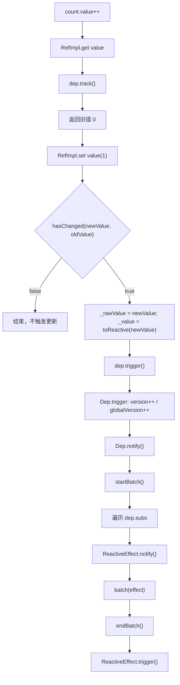
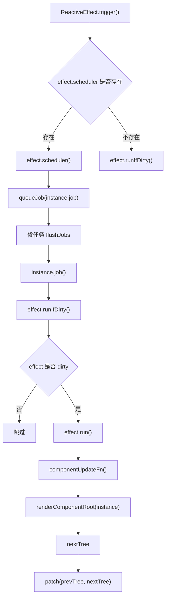
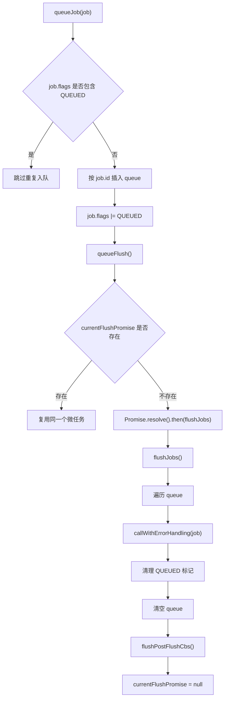
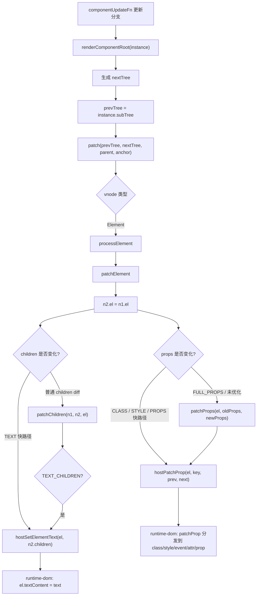
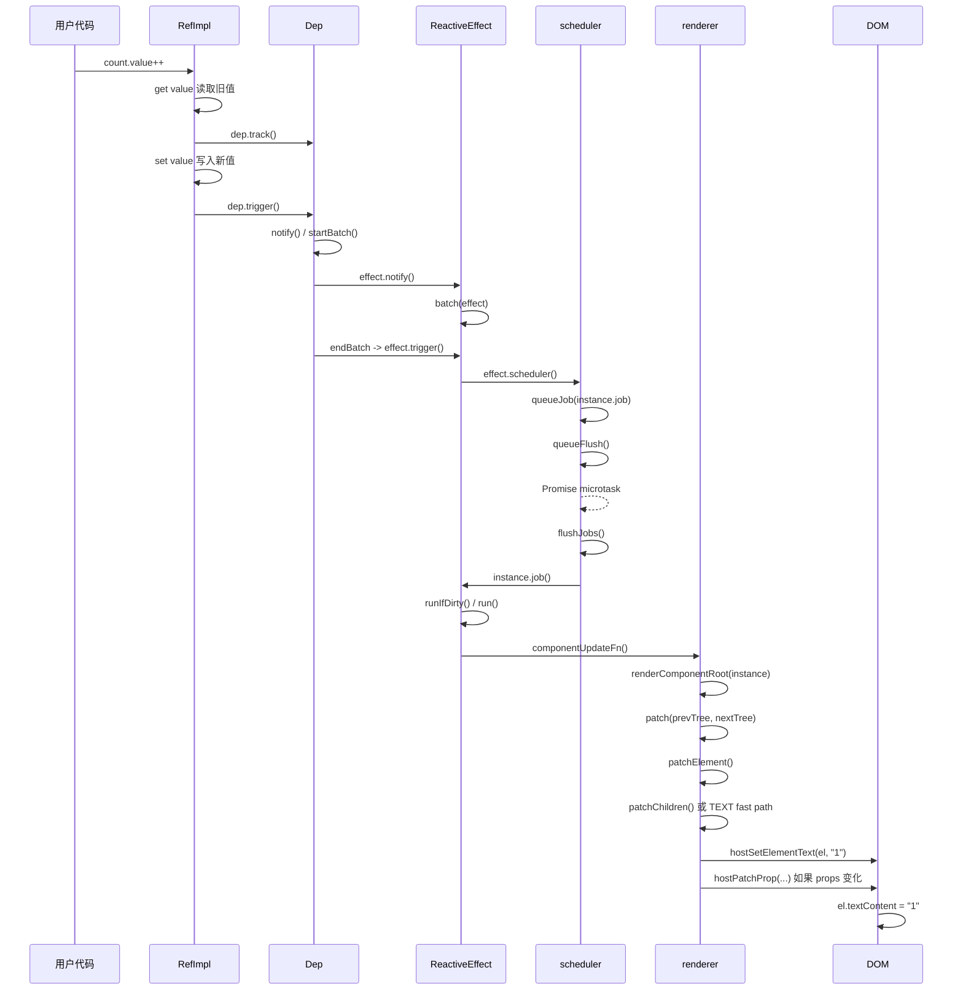

# Vue3 组件状态更新源码完整链路：从 `count.value++` 到 DOM 更新

本文基于当前仓库 `vue3` 源码整理，追踪一次组件状态更新的完整流程：

```ts
const count = ref(0)
count.value++
```

从 `ref set value` 开始，经过依赖触发、组件 render effect、scheduler 调度、`flushJobs`、`componentUpdateFn`、`renderComponentRoot`、`patch`、`patchElement`、`patchChildren` / `patchProps`，最终落到真实 DOM 更新。

> 版本说明：很多旧文章会使用 `triggerRefValue`、`triggerEffects` 这两个名称描述 ref 触发链路。当前仓库源码中已经没有这两个函数名。它们在当前实现中对应为：
>
> ```text
> triggerRefValue -> RefImpl.set value -> this.dep.trigger()
> triggerEffects  -> Dep.notify -> ReactiveEffect.notify -> batch/endBatch -> ReactiveEffect.trigger()
> ```

## 一、涉及源码文件

| 文件 | 作用 |
| --- | --- |
| `vue3/packages/reactivity/src/ref.ts` | `ref`、`RefImpl`、`get value` 依赖收集、`set value` 依赖触发 |
| `vue3/packages/reactivity/src/dep.ts` | `Dep`、`dep.track`、`dep.trigger`、`dep.notify` |
| `vue3/packages/reactivity/src/effect.ts` | `ReactiveEffect`、`effect.notify`、`batch`、`endBatch`、`effect.trigger`、`runIfDirty` |
| `vue3/packages/runtime-core/src/scheduler.ts` | `queueJob`、`queueFlush`、`flushJobs`、job 队列 |
| `vue3/packages/runtime-core/src/renderer.ts` | `setupRenderEffect`、`componentUpdateFn`、`patch`、`patchElement`、`patchChildren`、`patchProps` |
| `vue3/packages/runtime-core/src/componentRenderUtils.ts` | `renderComponentRoot` 执行组件 render 函数并生成新 vnode |
| `vue3/packages/runtime-dom/src/nodeOps.ts` | DOM 平台操作，`setElementText` 最终写入 `el.textContent` |

## 二、示例代码

以最小组件为例：

```vue
<script setup>
import { ref } from 'vue'

const count = ref(0)

function increment() {
  count.value++
}
</script>

<template>
  <button @click="increment">+1</button>
  <div>{{ count }}</div>
</template>
```

模板里的 `{{ count }}` 会在组件 render 时读取 `count.value`，组件 render effect 因此会被收集到 `count` 这个 ref 的依赖里。

当执行：

```ts
count.value++
```

实际会触发：

```text
读取 count.value -> 得到旧值 0
写入 count.value = 1
  -> RefImpl.set value
  -> dep.trigger
  -> 组件 render effect 被调度
  -> scheduler 批量执行组件更新
  -> render 得到新 vnode
  -> patch 新旧 vnode
  -> 更新 DOM 文本
```

## 三、完整调用链

端到端调用链如下：

```text
count.value++
  -> RefImpl.get value
       -> dep.track()
       -> 返回旧值
  -> RefImpl.set value(newValue)
       -> hasChanged(newValue, oldValue)
       -> this._rawValue = newValue
       -> this._value = toReactive(newValue)
       -> this.dep.trigger()
          -> Dep.trigger()
             -> version++ / globalVersion++
             -> Dep.notify()
                -> startBatch()
                -> 遍历 dep.subs
                -> link.sub.notify()
                   -> ReactiveEffect.notify()
                      -> batch(effect)
                -> endBatch()
                   -> ReactiveEffect.trigger()
                      -> effect.scheduler()
                         -> queueJob(instance.job)
                            -> job.flags |= QUEUED
                            -> queueFlush()
                               -> currentFlushPromise = Promise.resolve().then(flushJobs)

微任务阶段:
  -> flushJobs()
     -> 遍历 queue
     -> 执行 instance.job()
        -> effect.runIfDirty()
           -> effect.run()
              -> componentUpdateFn()
                 -> renderComponentRoot(instance)
                    -> 执行组件 render，读取最新 count.value
                    -> 得到 nextTree
                 -> prevTree = instance.subTree
                 -> instance.subTree = nextTree
                 -> patch(prevTree, nextTree, parent, anchor)
                    -> processElement
                       -> patchElement
                          -> 复用旧 DOM: nextTree.el = prevTree.el
                          -> 更新 children:
                             -> PatchFlags.TEXT 快路径
                                -> hostSetElementText(el, newText)
                                   -> runtime-dom nodeOps.setElementText
                                      -> el.textContent = newText
                             -> 或 patchChildren(...)
                          -> 更新 props:
                             -> patchProps(...)
                                -> hostPatchProp(...)
                                   -> runtime-dom patchProp(...)
     -> flushPostFlushCbs()
     -> currentFlushPromise = null
```

## 四、阶段一：ref set value

`ref` 的核心实现位于 `reactivity/src/ref.ts`。

创建 ref：

```ts
function createRef(rawValue: unknown, shallow: boolean) {
  if (isRef(rawValue)) {
    return rawValue
  }
  return new RefImpl(rawValue, shallow)
}
```

`RefImpl` 核心字段：

```ts
class RefImpl<T = any> {
  _value: T
  private _rawValue: T

  dep: Dep = new Dep()

  public readonly [ReactiveFlags.IS_REF] = true
  public readonly [ReactiveFlags.IS_SHALLOW]: boolean = false
}
```

`get value` 用来收集依赖：

```ts
get value() {
  if (__DEV__) {
    this.dep.track({
      target: this,
      type: TrackOpTypes.GET,
      key: 'value',
    })
  } else {
    this.dep.track()
  }
  return this._value
}
```

`set value` 用来触发依赖：

```ts
set value(newValue) {
  const oldValue = this._rawValue
  const useDirectValue =
    this[ReactiveFlags.IS_SHALLOW] ||
    isShallow(newValue) ||
    isReadonly(newValue)
  newValue = useDirectValue ? newValue : toRaw(newValue)
  if (hasChanged(newValue, oldValue)) {
    this._rawValue = newValue
    this._value = useDirectValue ? newValue : toReactive(newValue)
    if (__DEV__) {
      this.dep.trigger({
        target: this,
        type: TriggerOpTypes.SET,
        key: 'value',
        newValue,
        oldValue,
      })
    } else {
      this.dep.trigger()
    }
  }
}
```

`count.value++` 包含一次读和一次写：

```text
count.value++ 等价于 count.value = count.value + 1
```

所以会先触发 `get value`，再触发 `set value`。

更新关键点：

1. `oldValue = this._rawValue` 保存旧值。
2. `hasChanged(newValue, oldValue)` 判断值是否真的变化。
3. 变化后更新 `_rawValue` 和 `_value`。
4. 调用 `this.dep.trigger()` 触发依赖。

如果新旧值没有变化，不会触发后续更新。

## 五、阶段二：ref 依赖触发流程

当前源码里 ref 不再调用 `triggerRefValue`，而是直接调用：

```ts
this.dep.trigger()
```

`Dep.trigger` 位于 `reactivity/src/dep.ts`：

```ts
trigger(debugInfo?: DebuggerEventExtraInfo): void {
  this.version++
  globalVersion++
  this.notify(debugInfo)
}
```

`Dep.notify`：

```ts
notify(debugInfo?: DebuggerEventExtraInfo): void {
  startBatch()
  try {
    if (__DEV__) {
      for (let head = this.subsHead; head; head = head.nextSub) {
        if (head.sub.onTrigger && !(head.sub.flags & EffectFlags.NOTIFIED)) {
          head.sub.onTrigger(...)
        }
      }
    }
    for (let link = this.subs; link; link = link.prevSub) {
      if (link.sub.notify()) {
        ;(link.sub as ComputedRefImpl).dep.notify()
      }
    }
  } finally {
    endBatch()
  }
}
```

这里的 `this.subs` 保存了订阅这个 ref 的 subscriber。组件 render effect 就是其中之一。

简化后：

```text
ref.dep.trigger()
  -> ref.dep.notify()
     -> startBatch()
     -> 遍历所有订阅者
     -> subscriber.notify()
     -> endBatch()
```

对于普通组件 render effect，`subscriber` 是 `ReactiveEffect`。

## 六、阶段三：triggerEffects 对应的当前实现

旧资料中的 `triggerEffects` 可以理解为“遍历依赖中的 effect 并触发它们”。

当前源码拆成了几步：

```text
Dep.notify
  -> link.sub.notify()
  -> ReactiveEffect.notify()
  -> batch(effect)
  -> endBatch()
  -> ReactiveEffect.trigger()
```

`ReactiveEffect.notify`：

```ts
notify(): void {
  if (
    this.flags & EffectFlags.RUNNING &&
    !(this.flags & EffectFlags.ALLOW_RECURSE)
  ) {
    return
  }
  if (!(this.flags & EffectFlags.NOTIFIED)) {
    batch(this)
  }
}
```

它不会立刻执行 effect，而是调用 `batch(this)`：

```ts
export function batch(sub: Subscriber, isComputed = false): void {
  sub.flags |= EffectFlags.NOTIFIED
  if (isComputed) {
    sub.next = batchedComputed
    batchedComputed = sub
    return
  }
  sub.next = batchedSub
  batchedSub = sub
}
```

`Dep.notify` 外层调用了 `startBatch()` 和 `endBatch()`。在 `endBatch()` 中，真正触发 batched effects：

```ts
while (batchedSub) {
  let e: Subscriber | undefined = batchedSub
  batchedSub = undefined
  while (e) {
    const next: Subscriber | undefined = e.next
    e.next = undefined
    e.flags &= ~EffectFlags.NOTIFIED
    if (e.flags & EffectFlags.ACTIVE) {
      ;(e as ReactiveEffect).trigger()
    }
    e = next
  }
}
```

所以当前版本的依赖触发有两层“延迟”：

```text
第一层：reactivity batch
  在一次 dep notify 结束后再触发 effects

第二层：runtime-core scheduler
  组件 effect.trigger 不直接渲染，而是 queueJob 到微任务
```

## 七、阶段四：组件 render effect 被触发

组件 render effect 在 `runtime-core/src/renderer.ts` 的 `setupRenderEffect` 中创建。

核心源码：

```ts
const componentUpdateFn = () => {
  if (!instance.isMounted) {
    // mount
  } else {
    // update
  }
}

instance.scope.on()
const effect = (instance.effect = new ReactiveEffect(componentUpdateFn))
instance.scope.off()

const update = (instance.update = effect.run.bind(effect))
const job: SchedulerJob = (instance.job = effect.runIfDirty.bind(effect))
job.i = instance
job.id = instance.uid
effect.scheduler = () => queueJob(job)

update()
```

首次挂载时：

```text
update()
  -> effect.run()
  -> componentUpdateFn()
  -> renderComponentRoot()
  -> patch(null, subTree)
```

后续 `count.value++` 时：

```text
ReactiveEffect.trigger()
  -> this.scheduler()
  -> queueJob(instance.job)
```

`ReactiveEffect.trigger` 源码：

```ts
trigger(): void {
  if (this.flags & EffectFlags.PAUSED) {
    pausedQueueEffects.add(this)
  } else if (this.scheduler) {
    this.scheduler()
  } else {
    this.runIfDirty()
  }
}
```

组件 render effect 有 scheduler，所以不会同步调用 `componentUpdateFn`，而是进入 scheduler。

## 八、阶段五：scheduler 如何调度更新任务

组件更新任务入队：

```ts
effect.scheduler = () => queueJob(job)
```

`job` 是：

```ts
const job: SchedulerJob = (instance.job = effect.runIfDirty.bind(effect))
job.i = instance
job.id = instance.uid
```

`queueJob`：

```ts
export function queueJob(job: SchedulerJob): void {
  if (!(job.flags! & SchedulerJobFlags.QUEUED)) {
    const jobId = getId(job)
    const lastJob = queue[queue.length - 1]
    if (
      !lastJob ||
      (!(job.flags! & SchedulerJobFlags.PRE) && jobId >= getId(lastJob))
    ) {
      queue.push(job)
    } else {
      queue.splice(findInsertionIndex(jobId), 0, job)
    }

    job.flags! |= SchedulerJobFlags.QUEUED

    queueFlush()
  }
}
```

重点：

1. `QUEUED` 标记用于去重。
2. `job.id = instance.uid` 用于保证父组件先于子组件更新。
3. `queueFlush()` 安排微任务。

`queueFlush`：

```ts
function queueFlush() {
  if (!currentFlushPromise) {
    currentFlushPromise = resolvedPromise.then(flushJobs)
  }
}
```

所以 `count.value++` 之后，组件更新不是马上执行，而是等当前同步代码执行完，在微任务中统一执行。

## 九、阶段六：flushJobs 执行组件更新任务

`flushJobs` 遍历主队列并执行 job：

```ts
function flushJobs(seen?: CountMap) {
  try {
    for (flushIndex = 0; flushIndex < queue.length; flushIndex++) {
      const job = queue[flushIndex]
      if (job && !(job.flags! & SchedulerJobFlags.DISPOSED)) {
        if (job.flags! & SchedulerJobFlags.ALLOW_RECURSE) {
          job.flags! &= ~SchedulerJobFlags.QUEUED
        }
        callWithErrorHandling(
          job,
          job.i,
          job.i ? ErrorCodes.COMPONENT_UPDATE : ErrorCodes.SCHEDULER,
        )
        if (!(job.flags! & SchedulerJobFlags.ALLOW_RECURSE)) {
          job.flags! &= ~SchedulerJobFlags.QUEUED
        }
      }
    }
  } finally {
    flushIndex = -1
    queue.length = 0
    flushPostFlushCbs(seen)
    currentFlushPromise = null
    if (queue.length || pendingPostFlushCbs.length) {
      flushJobs(seen)
    }
  }
}
```

对组件更新来说：

```text
job = instance.job = effect.runIfDirty.bind(effect)
```

执行 job：

```text
instance.job()
  -> effect.runIfDirty()
     -> 如果 effect dirty
        -> effect.run()
           -> componentUpdateFn()
```

`runIfDirty`：

```ts
runIfDirty(): void {
  if (isDirty(this)) {
    this.run()
  }
}
```

## 十、阶段七：componentUpdateFn 更新分支

`componentUpdateFn` 首次挂载和更新共用一个函数。

首次挂载分支：

```ts
if (!instance.isMounted) {
  const subTree = (instance.subTree = renderComponentRoot(instance))
  patch(null, subTree, container, anchor, instance, parentSuspense, namespace)
  initialVNode.el = subTree.el
  instance.isMounted = true
}
```

`count.value++` 发生在组件已挂载之后，所以走更新分支：

```ts
else {
  let { next, bu, u, parent, vnode } = instance

  if (next) {
    next.el = vnode.el
    updateComponentPreRender(instance, next, optimized)
  } else {
    next = vnode
  }

  const nextTree = renderComponentRoot(instance)
  const prevTree = instance.subTree
  instance.subTree = nextTree

  patch(
    prevTree,
    nextTree,
    hostParentNode(prevTree.el!)!,
    getNextHostNode(prevTree),
    instance,
    parentSuspense,
    namespace,
  )

  next.el = nextTree.el
}
```

更新分支做了四件核心事：

1. 准备新的组件 vnode。
2. 调用 `renderComponentRoot(instance)` 生成新的子树 vnode。
3. 保存旧子树 `prevTree`，更新 `instance.subTree = nextTree`。
4. 调用 `patch(prevTree, nextTree, ...)` 对比新旧子树并更新 DOM。

## 十一、阶段八：renderComponentRoot 生成新 vnode

`renderComponentRoot` 位于 `componentRenderUtils.ts`。

核心源码：

```ts
export function renderComponentRoot(
  instance: ComponentInternalInstance,
): VNode {
  const {
    vnode,
    proxy,
    withProxy,
    render,
    renderCache,
    props,
    data,
    setupState,
    ctx,
  } = instance
  const prev = setCurrentRenderingInstance(instance)

  let result
  if (vnode.shapeFlag & ShapeFlags.STATEFUL_COMPONENT) {
    const proxyToUse = withProxy || proxy
    result = normalizeVNode(
      render!.call(
        thisProxy,
        proxyToUse!,
        renderCache,
        __DEV__ ? shallowReadonly(props) : props,
        setupState,
        data,
        ctx,
      ),
    )
  }
}
```

对示例模板：

```vue
<div>{{ count }}</div>
```

更新前 render 结果大致是：

```ts
{
  type: 'div',
  children: '0',
  patchFlag: PatchFlags.TEXT,
  el: HTMLDivElement,
}
```

`count.value++` 后重新 render，得到：

```ts
{
  type: 'div',
  children: '1',
  patchFlag: PatchFlags.TEXT,
  el: null,
}
```

然后进入：

```text
patch(prevTree, nextTree, ...)
```

## 十二、阶段九：patch 分发到元素更新

`patch` 位于 `renderer.ts`：

```ts
const patch: PatchFn = (n1, n2, container, anchor, parentComponent, parentSuspense, namespace, slotScopeIds, optimized) => {
  if (n1 === n2) {
    return
  }

  if (n1 && !isSameVNodeType(n1, n2)) {
    anchor = getNextHostNode(n1)
    unmount(n1, parentComponent, parentSuspense, true)
    n1 = null
  }

  const { type, ref, shapeFlag } = n2
  switch (type) {
    case Text:
      processText(...)
      break
    case Fragment:
      processFragment(...)
      break
    default:
      if (shapeFlag & ShapeFlags.ELEMENT) {
        processElement(...)
      } else if (shapeFlag & ShapeFlags.COMPONENT) {
        processComponent(...)
      }
  }
}
```

示例里的子树是普通元素：

```text
shapeFlag & ShapeFlags.ELEMENT
```

所以进入：

```text
processElement(prevTree, nextTree)
  -> patchElement(prevTree, nextTree)
```

## 十三、阶段十：patchElement 更新元素

`patchElement` 首先复用旧 DOM：

```ts
const el = (n2.el = n1.el!)
```

然后处理子节点和 props。

对于编译器生成的动态文本，`patchFlag` 通常包含 `PatchFlags.TEXT`，会走快路径：

```ts
if (patchFlag & PatchFlags.TEXT) {
  if (n1.children !== n2.children) {
    hostSetElementText(el, n2.children as string)
  }
}
```

所以对：

```vue
<div>{{ count }}</div>
```

更新时：

```text
n1.children = '0'
n2.children = '1'
patchFlag & TEXT
  -> hostSetElementText(div, '1')
```

如果没有 `PatchFlags.TEXT` 快路径，也可能通过 `patchChildren` 处理文本 children。

## 十四、阶段十一：patchChildren 文本更新分支

`patchChildren` 处理普通 children diff：

```ts
const c1 = n1 && n1.children
const prevShapeFlag = n1 ? n1.shapeFlag : 0
const c2 = n2.children
const { patchFlag, shapeFlag } = n2
```

如果新 children 是文本：

```ts
if (shapeFlag & ShapeFlags.TEXT_CHILDREN) {
  if (prevShapeFlag & ShapeFlags.ARRAY_CHILDREN) {
    unmountChildren(c1 as VNode[], parentComponent, parentSuspense)
  }
  if (c2 !== c1) {
    hostSetElementText(container, c2 as string)
  }
}
```

含义：

```text
如果旧 children 是数组，先卸载旧子节点。
如果新旧文本不同，调用 hostSetElementText 更新文本。
```

对于编译器优化模板，动态文本通常在 `patchElement` 的 `PatchFlags.TEXT` 中更新；对于非优化路径，则可能走到 `patchChildren` 文本分支。

## 十五、阶段十二：patchProps 属性更新分支

上面的 `{{ count }}` 示例主要体现文本更新，但一次组件重新渲染不只可能更新 children，也可能更新 props。例如：

```vue
<template>
  <div :class="{ active: count > 0 }" :data-count="count">
    {{ count }}
  </div>
</template>
```

重新 render 后，`nextTree.props` 也会变化。`patchElement` 会根据编译阶段生成的 `patchFlag` 选择属性更新路径：

```ts
if (patchFlag & PatchFlags.FULL_PROPS) {
  patchProps(el, oldProps, newProps, parentComponent, namespace)
} else {
  if (patchFlag & PatchFlags.CLASS) {
    hostPatchProp(el, 'class', null, newProps.class, namespace)
  }

  if (patchFlag & PatchFlags.STYLE) {
    hostPatchProp(el, 'style', oldProps.style, newProps.style, namespace)
  }

  if (patchFlag & PatchFlags.PROPS) {
    const propsToUpdate = n2.dynamicProps!
    for (let i = 0; i < propsToUpdate.length; i++) {
      const key = propsToUpdate[i]
      const prev = oldProps[key]
      const next = newProps[key]
      if (next !== prev || key === 'value') {
        hostPatchProp(el, key, prev, next, namespace, parentComponent)
      }
    }
  }
}
```

如果没有编译优化，或者需要完整比较 props，则进入 `patchProps`：

```ts
const patchProps = (el, oldProps, newProps, parentComponent, namespace) => {
  if (oldProps !== newProps) {
    for (const key in oldProps) {
      if (!isReservedProp(key) && !(key in newProps)) {
        hostPatchProp(el, key, oldProps[key], null, namespace, parentComponent)
      }
    }
    for (const key in newProps) {
      if (isReservedProp(key)) continue
      const next = newProps[key]
      const prev = oldProps[key]
      if (next !== prev && key !== 'value') {
        hostPatchProp(el, key, prev, next, namespace, parentComponent)
      }
    }
    if ('value' in newProps) {
      hostPatchProp(el, 'value', oldProps.value, newProps.value, namespace)
    }
  }
}
```

`patchProps` 解决三个问题：

1. 旧 props 中有、新 props 中没有的 key，需要删除。
2. 新旧 props 值不同的 key，需要更新。
3. `value` 需要特殊处理，保证表单元素值同步。

它本身仍然不直接操作 DOM，而是调用平台注入的 `hostPatchProp`。在浏览器端，`hostPatchProp` 来自 `runtime-dom/src/patchProp.ts`，再分发到 class、style、event、DOM prop、attribute 等具体更新逻辑。

简化链路：

```text
patchElement
  -> patchProps(el, oldProps, newProps, ...)
     -> hostPatchProp(el, key, prev, next, ...)
        -> runtime-dom patchProp
           -> patchClass / patchStyle / patchEvent / patchDOMProp / patchAttr
              -> 真实 DOM 属性更新
```

## 十六、阶段十三：DOM 更新

`hostSetElementText` 是 renderer options 注入的宿主平台操作。

在 DOM 平台中，它来自 `runtime-dom/src/nodeOps.ts`：

```ts
setElementText: (el, text) => {
  el.textContent = text
}
```

所以最终落点是：

```text
hostSetElementText(div, '1')
  -> nodeOps.setElementText(div, '1')
  -> div.textContent = '1'
```

这一步完成后，页面 DOM 显示从：

```html
<div>0</div>
```

变成：

```html
<div>1</div>
```

属性更新的 DOM 落点则是 `runtime-dom/src/patchProp.ts`。例如 class 更新会进入 `patchClass`，普通 attr 更新会进入 `patchAttr`，事件更新会进入 `patchEvent`。

所以“DOM 更新完成”不是单一 API，而是按变化类型分流：

```text
文本变化:
  hostSetElementText -> el.textContent = text

属性变化:
  hostPatchProp -> patchProp -> patchClass / patchStyle / patchEvent / patchDOMProp / patchAttr
```

## 十七、响应式系统与 runtime-core 的连接点

这条链路中最关键的跨包连接点有两个。

第一个连接点发生在组件首次渲染时：

```text
setupRenderEffect
  -> new ReactiveEffect(componentUpdateFn)
  -> update()
     -> effect.run()
        -> activeSub = component render effect
        -> componentUpdateFn()
           -> renderComponentRoot()
              -> render 读取 count.value
                 -> RefImpl.get value
                    -> dep.track()
                    -> ref.dep.subs 记录组件 render effect
```

也就是说，模板里读取 `count` 的那一刻，`ref` 的 dep 与组件 render effect 建立了订阅关系。

第二个连接点发生在响应式数据写入时：

```text
RefImpl.set value
  -> dep.trigger()
  -> Dep.notify()
  -> ReactiveEffect.trigger()
  -> effect.scheduler()
  -> queueJob(instance.job)
```

`reactivity` 只知道“有 subscriber 需要被触发”，不知道组件和 DOM；`runtime-core` 在创建组件 render effect 时给 effect 安装了 scheduler，于是响应式触发最终进入组件更新队列。

一句话概括：

```text
读取时：runtime-core 的 render effect 被 reactivity 收集。
写入时：reactivity 触发 render effect，render effect 的 scheduler 回到 runtime-core。
```

## 十八、scheduler 如何避免重复更新

同一个 tick 内多次执行：

```ts
count.value++
count.value++
count.value++
```

不会导致组件 render 三次。原因有两层。

第一层是 reactivity 的 batch：

```text
Dep.notify
  -> startBatch()
  -> ReactiveEffect.notify()
     -> 如果没有 NOTIFIED 标记，batch(effect)
  -> endBatch()
     -> ReactiveEffect.trigger()
```

`ReactiveEffect.notify()` 会检查 `EffectFlags.NOTIFIED`，同一批次里已经通知过的 effect 不会重复加入 batched list。

第二层是 runtime-core 的 scheduler 队列去重：

```ts
export function queueJob(job: SchedulerJob): void {
  if (!(job.flags! & SchedulerJobFlags.QUEUED)) {
    // 插入 queue
    job.flags! |= SchedulerJobFlags.QUEUED
    queueFlush()
  }
}
```

`queueJob` 会检查 `SchedulerJobFlags.QUEUED`：

- 没有入队：插入 `queue`，打上 `QUEUED` 标记。
- 已经入队：直接跳过。

`queueFlush` 也会复用同一个 `currentFlushPromise`：

```ts
function queueFlush() {
  if (!currentFlushPromise) {
    currentFlushPromise = resolvedPromise.then(flushJobs)
  }
}
```

所以同一轮同步代码里，无论触发多少次相同组件的更新，最终通常只会在微任务中执行一次该组件的 `instance.job`。

```text
count.value++      -> queueJob(instance.job) 成功
count.value++      -> instance.job 已 QUEUED，跳过
count.value++      -> instance.job 已 QUEUED，跳过
microtask flush    -> componentUpdateFn 执行一次，读取最终 count
```

## 十九、ref 依赖触发流程图



## 二十、组件 render effect 更新流程图



## 二十一、scheduler 批量更新流程图



## 二十二、DOM patch 流程图



## 二十三、Mermaid 时序图



## 二十四、完整示例：观察 nextTick 前后 DOM

```vue
<script setup>
import { nextTick, ref } from 'vue'

const count = ref(0)
const el = ref()

async function increment() {
  count.value++

  console.log('sync DOM:', el.value.textContent)

  await nextTick()

  console.log('after nextTick DOM:', el.value.textContent)
}
</script>

<template>
  <button @click="increment">+1</button>
  <div ref="el">{{ count }}</div>
</template>
```

可能输出：

```text
sync DOM: 0
after nextTick DOM: 1
```

原因：

```text
count.value++ 后，组件更新 job 已经 queueJob。
但 flushJobs 在微任务中执行。
同步代码里 DOM 还没更新。
await nextTick() 等待 currentFlushPromise 完成。
DOM 更新后再读取，就是最新值。
```

## 二十五、关键问题对照表

| 问题点 | 当前源码对应实现 |
| --- | --- |
| `ref set value` | `RefImpl.set value` |
| `triggerRefValue` | 当前版本对应 `this.dep.trigger()` |
| `triggerEffects` | 当前版本对应 `Dep.notify -> ReactiveEffect.notify -> batch/endBatch -> ReactiveEffect.trigger` |
| 组件 render effect 被触发 | `ReactiveEffect.trigger -> effect.scheduler()` |
| scheduler 调度更新任务 | `effect.scheduler = () => queueJob(job)` |
| `queueJob` | job 去重、按 id 插入队列、调用 `queueFlush` |
| `flushJobs` | 微任务中遍历主队列并执行 `instance.job` |
| `componentUpdateFn` | 组件更新分支重新 render 并 patch |
| `renderComponentRoot` | 执行组件 render，生成 `nextTree` |
| `patch` | 比较 `prevTree` 和 `nextTree`，按 vnode 类型分发 |
| `patchElement` | 复用旧 DOM，更新 children / props |
| `patchChildren` | 文本、数组、空 children 的 diff |
| `patchProps` | 删除旧 props、更新变化 props，最终调用 `hostPatchProp` |
| DOM 更新 | `hostSetElementText -> el.textContent = text` |

## 二十六、核心结论

1. `count.value++` 会先读再写，写入时进入 `RefImpl.set value`。
2. 当前源码没有 `triggerRefValue` 函数名，ref 写入直接调用 `this.dep.trigger()`。
3. 当前源码没有 `triggerEffects` 函数名，它的职责被拆到 `Dep.notify`、`ReactiveEffect.notify`、`batch/endBatch`、`ReactiveEffect.trigger`。
4. 组件 render effect 在首次挂载时通过 `setupRenderEffect` 创建。
5. 组件 render effect 的 scheduler 是 `() => queueJob(instance.job)`，因此状态变化不会同步渲染。
6. `queueJob` 使用 `SchedulerJobFlags.QUEUED` 去重，并用 `job.id = instance.uid` 维护父子更新顺序。
7. `queueFlush` 通过 `Promise.resolve().then(flushJobs)` 把更新放到微任务。
8. `flushJobs` 执行 `instance.job`，也就是 `effect.runIfDirty`。
9. `effect.runIfDirty` 判断 dirty 后执行 `effect.run`，进入 `componentUpdateFn`。
10. `componentUpdateFn` 更新分支会调用 `renderComponentRoot` 生成 `nextTree`。
11. 新旧子树通过 `patch(prevTree, nextTree)` 进入 DOM patch。
12. 对动态文本来说，`patchElement` 可以通过 `PatchFlags.TEXT` 快路径直接调用 `hostSetElementText`。
13. 非优化路径下，文本 children 更新会走 `patchChildren` 的 `TEXT_CHILDREN` 分支。
14. 属性更新会走 `patchProps` 或 `PatchFlags.CLASS / STYLE / PROPS` 快路径，最终通过 `hostPatchProp` 进入 `runtime-dom`。
15. 文本 DOM 平台的最终写入是 `nodeOps.setElementText`，即 `el.textContent = text`。
16. `await nextTick()` 能等待 scheduler 的 `currentFlushPromise` 完成，因此能读到更新后的 DOM。
