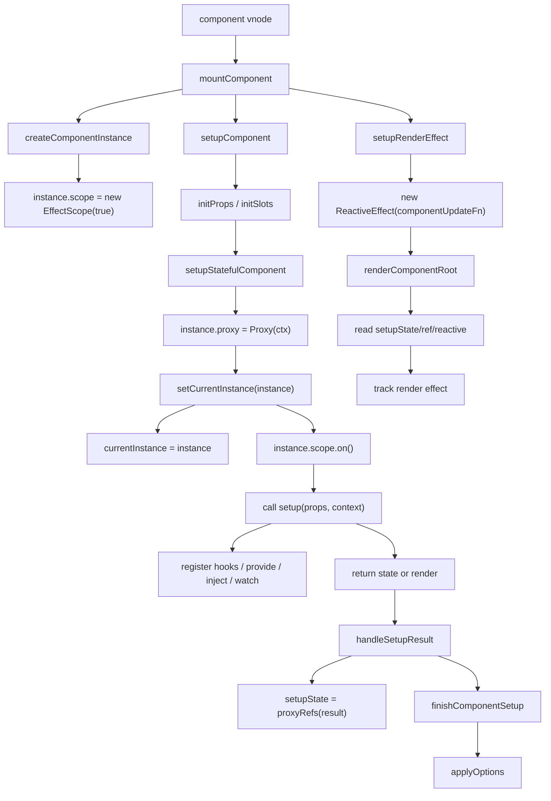
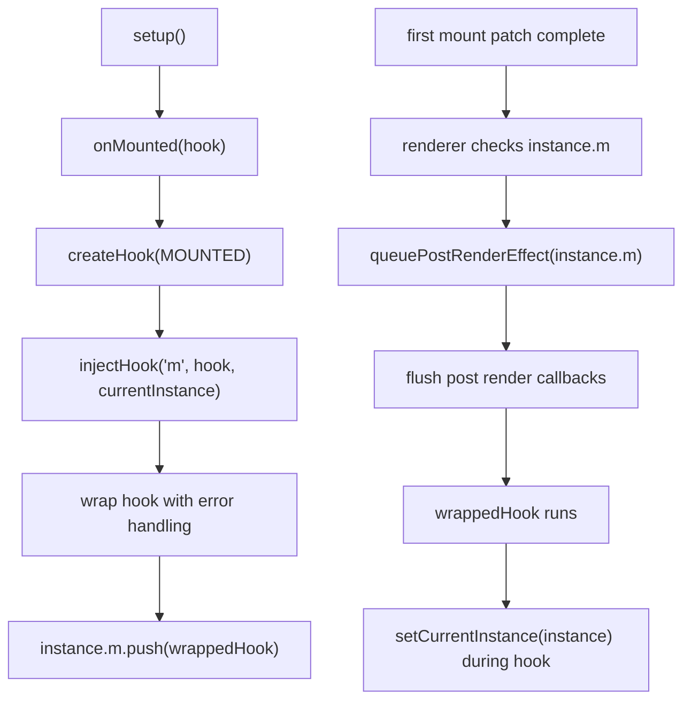
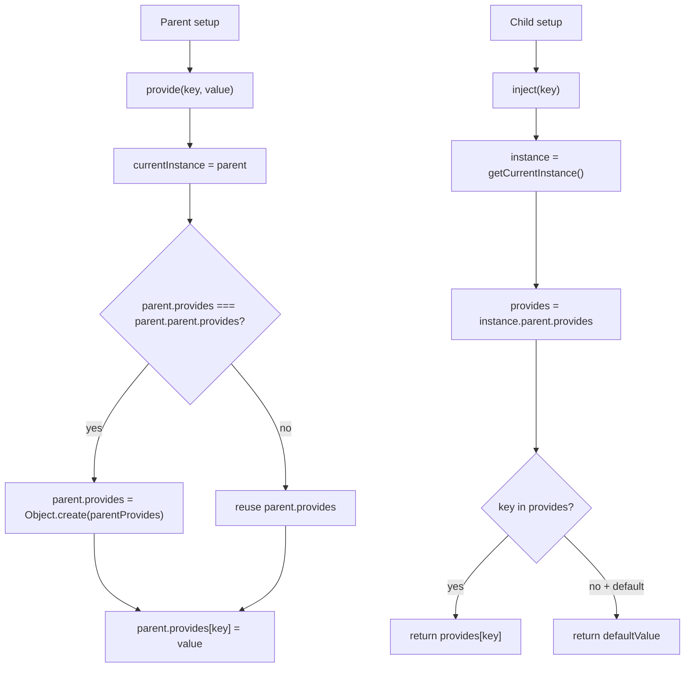
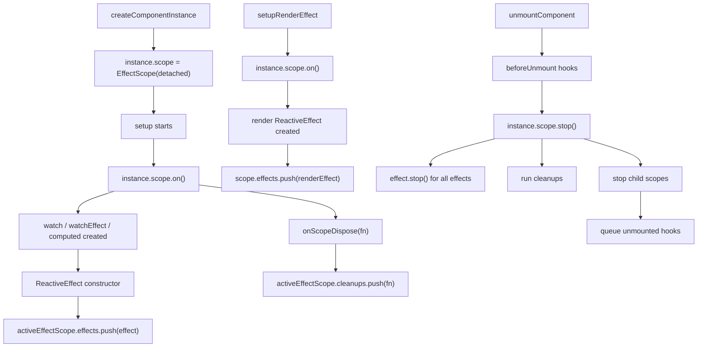

# Vue3 Composition API 源码深入分析

本文基于当前仓库 `vue3` 源码整理，从运行时源码角度分析 Composition API：`setup` 什么时候执行、`getCurrentInstance` 如何拿到组件实例、生命周期 hooks 如何注册到组件实例、`provide / inject` 如何通过原型链查找、`ref / reactive` 如何和组件 render effect 建立依赖关系、`setup` 返回状态如何暴露给模板、Composition API 与 Options API 如何共存，以及组件卸载时 effect 如何被统一清理。

一句话先抓住主线：

```text
Composition API = 在 setup 执行期间，借助 currentInstance 找到当前组件实例，
把生命周期、provide/inject、watch/computed/render effect 等副作用挂到 instance 和 instance.scope 上。
```

## 一、涉及源码文件

| 文件 | 作用 |
| --- | --- |
| `vue3/packages/runtime-core/src/component.ts` | 组件实例创建、`setupComponent`、`setupStatefulComponent`、`currentInstance`、`getCurrentInstance` |
| `vue3/packages/runtime-core/src/apiLifecycle.ts` | `onMounted` / `onUpdated` / `onUnmounted` 等生命周期注册 |
| `vue3/packages/runtime-core/src/apiInject.ts` | `provide` / `inject` 实现 |
| `vue3/packages/runtime-core/src/componentRenderUtils.ts` | `renderComponentRoot`，组件 render 时读取 `setupState`、`props`、`data` |
| `vue3/packages/runtime-core/src/componentRenderContext.ts` | `currentRenderingInstance`，render 阶段的当前实例 |
| `vue3/packages/runtime-core/src/componentPublicInstance.ts` | 组件 public proxy，模板访问 `setupState / data / props / ctx` 的入口 |
| `vue3/packages/runtime-core/src/componentOptions.ts` | Options API 初始化、Options 生命周期与 Composition 生命周期共存 |
| `vue3/packages/runtime-core/src/renderer.ts` | 组件 render effect 创建、生命周期触发、卸载时 scope 清理 |
| `vue3/packages/runtime-core/src/apiWatch.ts` | `watch` / `watchEffect` 如何绑定当前实例和调度器 |
| `vue3/packages/reactivity/src/effectScope.ts` | `EffectScope`、`effectScope`、`onScopeDispose` |
| `vue3/packages/reactivity/src/effect.ts` | `ReactiveEffect` 如何记录到当前 active effect scope |

## 二、Composition API 调用链总览

从组件首次挂载开始：

```text
patch(null, componentVNode)
  -> processComponent
    -> mountComponent
      -> createComponentInstance(vnode, parent, suspense)
      -> setupComponent(instance)
        -> initProps(instance)
        -> initSlots(instance)
        -> setupStatefulComponent(instance)
          -> instance.proxy = new Proxy(instance.ctx, PublicInstanceProxyHandlers)
          -> setCurrentInstance(instance)
             -> currentInstance = instance
             -> instance.scope.on()
          -> setup(shallowReadonly(instance.props), setupContext)
             -> onMounted() / provide() / inject() / watch() / ref() / reactive()
          -> reset()
             -> instance.scope.off()
             -> currentInstance = prev
          -> handleSetupResult(instance, setupResult)
             -> setup 返回函数：instance.render = setupResult
             -> setup 返回对象：instance.setupState = proxyRefs(setupResult)
          -> finishComponentSetup(instance)
             -> 确保 instance.render
             -> applyOptions(instance)
      -> setupRenderEffect(instance)
        -> instance.scope.on()
        -> new ReactiveEffect(componentUpdateFn)
        -> instance.scope.off()
        -> effect.scheduler = () => queueJob(instance.job)
        -> update()
          -> componentUpdateFn()
            -> renderComponentRoot(instance)
            -> patch(...)
```

Composition API 的很多函数都要求在 `setup()` 同步执行期间调用，本质原因是它们要依赖 `currentInstance` 或 `activeEffectScope`：

| API | 依赖什么 |
| --- | --- |
| `getCurrentInstance()` | `currentInstance` 或 `currentRenderingInstance` |
| `onMounted()` | `currentInstance`，把 hook 注册到实例 |
| `provide()` | `currentInstance`，写入当前实例的 `provides` |
| `inject()` | `getCurrentInstance()`，从父级 / appContext 查找 provides |
| `watch()` / `watchEffect()` | `currentInstance` 用于错误处理和调度；`activeEffectScope` 用于自动停止 |
| `onScopeDispose()` | `activeEffectScope` |

## 三、setup 函数什么时候执行

源码位置：

```text
vue3/packages/runtime-core/src/component.ts
```

`setup` 在组件实例创建后、render effect 创建前执行。

调用链：

```text
mountComponent
  -> createComponentInstance
  -> setupComponent
     -> initProps
     -> initSlots
     -> setupStatefulComponent
        -> call setup()
  -> setupRenderEffect
     -> 创建组件 render effect
```

`setupComponent` 代码主线：

```ts
export function setupComponent(
  instance: ComponentInternalInstance,
  isSSR = false,
  optimized = false,
): Promise<void> | undefined {
  const { props, children } = instance.vnode
  const isStateful = isStatefulComponent(instance)
  initProps(instance, props, isStateful, isSSR)
  initSlots(instance, children, optimized || isSSR)

  const setupResult = isStateful
    ? setupStatefulComponent(instance, isSSR)
    : undefined

  return setupResult
}
```

`setupStatefulComponent` 执行 `setup`：

```ts
function setupStatefulComponent(instance, isSSR) {
  const Component = instance.type

  instance.accessCache = Object.create(null)
  instance.proxy = new Proxy(instance.ctx, PublicInstanceProxyHandlers)

  const { setup } = Component
  if (setup) {
    pauseTracking()
    const setupContext = (instance.setupContext =
      setup.length > 1 ? createSetupContext(instance) : null)
    const reset = setCurrentInstance(instance)
    const setupResult = callWithErrorHandling(
      setup,
      instance,
      ErrorCodes.SETUP_FUNCTION,
      [
        __DEV__ ? shallowReadonly(instance.props) : instance.props,
        setupContext,
      ],
    )
    resetTracking()
    reset()

    if (isPromise(setupResult)) {
      // async setup 走 Suspense / SSR 分支
    } else {
      handleSetupResult(instance, setupResult, isSSR)
    }
  } else {
    finishComponentSetup(instance, isSSR)
  }
}
```

重点：

| 关键点 | 说明 |
| --- | --- |
| `setup` 早于首次 render | 因为 render effect 要读取 `setupState` |
| `props` 先初始化 | `setup(props)` 能拿到组件 props |
| `slots` 先初始化 | `setup(props, context)` 中 `context.slots` 可用 |
| 执行前设置 `currentInstance` | 生命周期、provide/inject 等 API 才知道当前组件 |
| 执行时打开 `instance.scope` | `watch`、`computed` 等 effect 会被记录到组件 scope |
| 执行完恢复实例和 scope | 避免污染后续组件或异步代码 |

## 四、currentInstance 机制

源码位置：

```text
vue3/packages/runtime-core/src/component.ts
vue3/packages/runtime-core/src/componentRenderContext.ts
```

核心变量：

```ts
export let currentInstance: ComponentInternalInstance | null = null

export const getCurrentInstance: () => ComponentInternalInstance | null = () =>
  currentInstance || currentRenderingInstance
```

`getCurrentInstance()` 返回两个来源：

| 来源 | 什么时候有值 |
| --- | --- |
| `currentInstance` | `setup()` 执行期间、生命周期 hook 执行期间、`applyOptions()` 执行期间 |
| `currentRenderingInstance` | 组件 render 函数执行期间 |

### setCurrentInstance

```ts
export const setCurrentInstance = (instance: ComponentInternalInstance) => {
  const prev = currentInstance
  internalSetCurrentInstance(instance)
  instance.scope.on()
  return (): void => {
    instance.scope.off()
    internalSetCurrentInstance(prev)
  }
}
```

它做了两件事：

| 行为 | 作用 |
| --- | --- |
| `currentInstance = instance` | 让 Composition API 能找到当前组件 |
| `instance.scope.on()` | 让当前创建的 reactive effects 归属到当前组件 scope |

返回的 `reset()` 会恢复：

```ts
instance.scope.off()
currentInstance = prev
```

### currentRenderingInstance

render 阶段由 `renderComponentRoot` 设置：

```ts
export function renderComponentRoot(instance: ComponentInternalInstance): VNode {
  const prev = setCurrentRenderingInstance(instance)

  try {
    result = normalizeVNode(
      render!.call(
        thisProxy,
        proxyToUse!,
        renderCache,
        props,
        setupState,
        data,
        ctx,
      ),
    )
  } finally {
    setCurrentRenderingInstance(prev)
  }
}
```

`setCurrentRenderingInstance`：

```ts
export function setCurrentRenderingInstance(
  instance: ComponentInternalInstance | null,
): ComponentInternalInstance | null {
  const prev = currentRenderingInstance
  currentRenderingInstance = instance
  currentScopeId = (instance && instance.type.__scopeId) || null
  return prev
}
```

因此，`getCurrentInstance()` 也能在 render 相关上下文里拿到实例，这主要服务于内部 helper、slot、asset resolve 等场景。用户代码最稳定的调用位置仍然是 `setup()` 同步阶段。

## 五、生命周期注册流程

源码位置：

```text
vue3/packages/runtime-core/src/apiLifecycle.ts
vue3/packages/runtime-core/src/enums.ts
vue3/packages/runtime-core/src/renderer.ts
```

生命周期枚举：

```ts
export enum LifecycleHooks {
  BEFORE_MOUNT = 'bm',
  MOUNTED = 'm',
  BEFORE_UPDATE = 'bu',
  UPDATED = 'u',
  BEFORE_UNMOUNT = 'bum',
  UNMOUNTED = 'um',
  RENDER_TRIGGERED = 'rtg',
  RENDER_TRACKED = 'rtc',
  ERROR_CAPTURED = 'ec',
  SERVER_PREFETCH = 'sp',
}
```

组件实例中对应字段：

```ts
const instance = {
  bm: null,
  m: null,
  bu: null,
  u: null,
  bum: null,
  um: null,
  rtg: null,
  rtc: null,
  ec: null,
  sp: null,
}
```

### onMounted / onUpdated / onUnmounted

这些 API 都由 `createHook` 创建：

```ts
const createHook =
  <T extends Function = () => any>(lifecycle: LifecycleHooks) =>
  (
    hook: T,
    target: ComponentInternalInstance | null = currentInstance,
  ): void => {
    if (
      !isInSSRComponentSetup ||
      lifecycle === LifecycleHooks.SERVER_PREFETCH
    ) {
      injectHook(lifecycle, (...args: unknown[]) => hook(...args), target)
    }
  }

export const onMounted = createHook(LifecycleHooks.MOUNTED)
export const onUpdated = createHook(LifecycleHooks.UPDATED)
export const onUnmounted = createHook(LifecycleHooks.UNMOUNTED)
```

也就是：

```text
onMounted(hook)
  -> createHook(LifecycleHooks.MOUNTED)
  -> injectHook('m', hook, currentInstance)
  -> instance.m.push(wrappedHook)
```

### injectHook 做了什么

```ts
export function injectHook(
  type: LifecycleHooks,
  hook: Function & { __weh?: Function },
  target: ComponentInternalInstance | null = currentInstance,
  prepend: boolean = false,
): Function | undefined {
  if (target) {
    const hooks = target[type] || (target[type] = [])
    const wrappedHook =
      hook.__weh ||
      (hook.__weh = (...args: unknown[]) => {
        pauseTracking()
        const reset = setCurrentInstance(target)
        const res = callWithAsyncErrorHandling(hook, target, type, args)
        reset()
        resetTracking()
        return res
      })
    hooks.push(wrappedHook)
    return wrappedHook
  }
}
```

它做了 4 件关键事：

| 步骤 | 说明 |
| --- | --- |
| 1. 找到目标实例 | 默认是 `currentInstance` |
| 2. 取出 hook 数组 | `target[type]`，例如 `target.m` |
| 3. 包装 hook | 包一层错误处理、暂停依赖追踪、设置当前实例 |
| 4. 推入数组 | mounted 进入 `instance.m`，updated 进入 `instance.u`，unmounted 进入 `instance.um` |

### 生命周期什么时候触发

首次挂载后：

```ts
if (m) {
  queuePostRenderEffect(m, parentSuspense)
}
instance.isMounted = true
```

组件更新后：

```ts
if (u) {
  queuePostRenderEffect(u, parentSuspense)
}
```

组件卸载时：

```ts
if (bum) {
  invokeArrayFns(bum)
}

scope.stop()

if (um) {
  queuePostRenderEffect(um, parentSuspense)
}
```

所以：

| hook | 存放字段 | 触发时机 |
| --- | --- | --- |
| `onBeforeMount` | `instance.bm` | 首次 render / patch 前 |
| `onMounted` | `instance.m` | 首次 DOM patch 后，post render 队列 |
| `onBeforeUpdate` | `instance.bu` | 更新 render 前 |
| `onUpdated` | `instance.u` | 更新 DOM patch 后，post render 队列 |
| `onBeforeUnmount` | `instance.bum` | 卸载前，同步执行 |
| `onUnmounted` | `instance.um` | 子树卸载和 effect scope stop 后，post render 队列 |

## 六、provide / inject 实现流程

源码位置：

```text
vue3/packages/runtime-core/src/apiInject.ts
vue3/packages/runtime-core/src/component.ts
```

组件实例创建时初始化 `provides`：

```ts
const instance = {
  provides: parent ? parent.provides : Object.create(appContext.provides),
}
```

也就是说，默认情况下子组件的 `provides` 直接指向父组件的 `provides`。

### provide

```ts
export function provide(key, value): void {
  if (currentInstance) {
    let provides = currentInstance.provides
    const parentProvides =
      currentInstance.parent && currentInstance.parent.provides
    if (parentProvides === provides) {
      provides = currentInstance.provides = Object.create(parentProvides)
    }
    provides[key as string] = value
  }
}
```

关键设计：

```text
第一次 provide 前：
child.provides === parent.provides

第一次 provide 时：
child.provides = Object.create(parent.provides)
child.provides[key] = value
```

这样做的好处：

| 设计 | 好处 |
| --- | --- |
| 默认复用父 provides | 没有 provide 的组件不需要创建新对象 |
| 首次 provide 时创建原型对象 | 当前组件可以覆盖某个 key，同时仍能通过原型链访问祖先 provide |
| inject 用 `key in provides` | 可以天然沿原型链查找 |

### inject

```ts
export function inject(
  key: InjectionKey<any> | string,
  defaultValue?: unknown,
  treatDefaultAsFactory = false,
) {
  const instance = getCurrentInstance()

  if (instance || currentApp) {
    let provides = currentApp
      ? currentApp._context.provides
      : instance
        ? instance.parent == null || instance.ce
          ? instance.vnode.appContext && instance.vnode.appContext.provides
          : instance.parent.provides
        : undefined

    if (provides && key in provides) {
      return provides[key as string]
    } else if (arguments.length > 1) {
      return treatDefaultAsFactory && isFunction(defaultValue)
        ? defaultValue.call(instance && instance.proxy)
        : defaultValue
    }
  }
}
```

查找规则：

| 场景 | 查找来源 |
| --- | --- |
| `app.runWithContext()` | `currentApp._context.provides` |
| 根组件或 custom element | `instance.vnode.appContext.provides` |
| 普通子组件 | `instance.parent.provides` |
| 找不到且有默认值 | 返回默认值 |
| 默认值是工厂并设置 `treatDefaultAsFactory` | 调用工厂函数 |

### provide / inject 流程图

```text
Parent setup()
  -> provide('theme', theme)
     -> parent.provides = Object.create(appContext.provides)
     -> parent.provides.theme = theme

Child setup()
  -> inject('theme')
     -> instance = getCurrentInstance()
     -> provides = instance.parent.provides
     -> 'theme' in provides
     -> return provides.theme
```

## 七、ref / reactive 如何和组件 render effect 建立关系

关键源码：

```text
vue3/packages/runtime-core/src/renderer.ts
vue3/packages/runtime-core/src/componentRenderUtils.ts
vue3/packages/reactivity/src/ref.ts
vue3/packages/reactivity/src/reactive.ts
vue3/packages/reactivity/src/effect.ts
```

组件 render effect 在 `setupRenderEffect` 中创建：

```ts
instance.scope.on()
const effect = (instance.effect = new ReactiveEffect(componentUpdateFn))
instance.scope.off()

const update = (instance.update = effect.run.bind(effect))
const job: SchedulerJob = (instance.job = effect.runIfDirty.bind(effect))
job.i = instance
job.id = instance.uid
effect.scheduler = () => queueJob(job)
```

首次挂载时执行 `update()`，进入 `componentUpdateFn`：

```text
update()
  -> effect.run()
    -> componentUpdateFn()
      -> renderComponentRoot(instance)
        -> render 读取 setupState / props / data
          -> 读取 ref.value 或 reactive property
            -> track 当前 active effect
```

`renderComponentRoot` 会把 `setupState` 传给 render：

```ts
result = normalizeVNode(
  render!.call(
    thisProxy,
    proxyToUse!,
    renderCache,
    props,
    setupState,
    data,
    ctx,
  ),
)
```

因此，当模板里有：

```vue
<template>{{ count }}</template>

<script setup>
const count = ref(0)
</script>
```

编译后的 render 读取 `count`，最终触发 `ref.value` 或被 `proxyRefs` 解包后的读取。读取发生在组件 render effect 执行期间，所以这个 ref 的 dep 会收集当前组件 render effect。

状态变化时：

```text
count.value++
  -> ref set value
  -> dep.trigger()
  -> ReactiveEffect.notify()
  -> ReactiveEffect.trigger()
  -> effect.scheduler()
  -> queueJob(instance.job)
  -> flushJobs()
  -> instance.job()
  -> effect.runIfDirty()
  -> componentUpdateFn()
  -> renderComponentRoot()
  -> patch()
  -> DOM 更新
```

`reactive` 也是同理：

```ts
const state = reactive({ count: 0 })
```

模板读取：

```vue
{{ state.count }}
```

会在 render effect 运行中触发 proxy `get`，从而 `track(target, GET, 'count')`。后续 `state.count++` 触发 proxy `set`，再触发组件 render effect 调度更新。

### 为什么不是 ref/reactive 主动绑定组件

准确地说，不是 `ref` 或 `reactive` 主动知道自己属于哪个组件。

真正关系是：

```text
组件 render effect 正在运行
  -> 模板读取 ref/reactive
  -> 响应式系统把当前 active effect 收集进依赖
  -> 后续状态变化触发这个 effect
```

也就是：

```text
组件 effect 订阅了状态
而不是状态保存了组件实例
```

## 八、setup 返回的状态如何暴露给模板

源码位置：

```text
vue3/packages/runtime-core/src/component.ts
vue3/packages/runtime-core/src/componentPublicInstance.ts
vue3/packages/runtime-core/src/componentRenderUtils.ts
```

`setup` 返回对象时：

```ts
export function handleSetupResult(instance, setupResult, isSSR): void {
  if (isFunction(setupResult)) {
    instance.render = setupResult
  } else if (isObject(setupResult)) {
    instance.setupState = proxyRefs(setupResult)
  }
  finishComponentSetup(instance, isSSR)
}
```

两个结果：

| setup 返回 | 处理 |
| --- | --- |
| 函数 | 作为 `instance.render` |
| 对象 | `proxyRefs(setupResult)` 后放入 `instance.setupState` |

`proxyRefs` 的效果是模板访问 ref 时不需要 `.value`：

```ts
setup() {
  const count = ref(0)
  return { count }
}
```

模板：

```vue
{{ count }}
```

访问的是：

```text
instance.proxy.count
  -> PublicInstanceProxyHandlers.get
  -> setupState.count
  -> proxyRefs 自动解包 ref.value
```

public proxy 的访问优先级：

```ts
if (hasSetupBinding(setupState, key)) {
  return setupState[key]
} else if (data !== EMPTY_OBJ && hasOwn(data, key)) {
  return data[key]
} else if (hasOwn(props, key)) {
  return props![key]
} else if (ctx !== EMPTY_OBJ && hasOwn(ctx, key)) {
  return ctx[key]
}
```

访问优先级：

```text
setupState -> data -> props -> ctx -> publicProperties -> globalProperties
```

这就是模板为什么可以直接访问：

```ts
setup() {
  return { count, inc }
}
```

模板：

```vue
<button @click="inc">{{ count }}</button>
```

## 九、Composition API 和 Options API 如何共存

源码位置：

```text
vue3/packages/runtime-core/src/component.ts
vue3/packages/runtime-core/src/componentOptions.ts
vue3/packages/runtime-core/src/componentPublicInstance.ts
```

共存入口在 `finishComponentSetup`：

```ts
export function finishComponentSetup(instance, isSSR, skipOptions?) {
  if (!instance.render) {
    instance.render = Component.render || NOOP
  }

  if (__FEATURE_OPTIONS_API__ && !(__COMPAT__ && skipOptions)) {
    const reset = setCurrentInstance(instance)
    pauseTracking()
    try {
      applyOptions(instance)
    } finally {
      resetTracking()
      reset()
    }
  }
}
```

也就是说：

```text
setup 执行完
  -> handleSetupResult
  -> finishComponentSetup
     -> 确认 render
     -> applyOptions(instance)
        -> 初始化 Options API
```

`applyOptions` 的初始化顺序：

```text
beforeCreate
props 已在 setupComponent 外部初始化
inject
methods
data
computed
watch
provide
created
注册 mounted / updated / unmounted 等生命周期
expose
render / inheritAttrs / components / directives
```

源码中的顺序说明：

```ts
// options initialization order (to be consistent with Vue 2):
// - props (already done outside of this function)
// - inject
// - methods
// - data (deferred since it relies on `this` access)
// - computed
// - watch (deferred since it relies on `this` access)
```

Options API 的生命周期也复用 Composition API 的注册函数：

```ts
registerLifecycleHook(onBeforeMount, beforeMount)
registerLifecycleHook(onMounted, mounted)
registerLifecycleHook(onBeforeUpdate, beforeUpdate)
registerLifecycleHook(onUpdated, updated)
registerLifecycleHook(onBeforeUnmount, beforeUnmount)
registerLifecycleHook(onUnmounted, unmounted)
```

因此，无论你写：

```ts
setup() {
  onMounted(() => {})
}
```

还是：

```ts
export default {
  mounted() {}
}
```

最终都会进入 `instance.m`，由 renderer 在挂载完成后统一触发。

### 同名状态访问优先级

当 Composition API 和 Options API 同时定义同名字段时，模板访问优先级由 public proxy 决定：

```text
setupState -> data -> props -> ctx
```

因此：

```ts
export default {
  setup() {
    return { count: ref(1) }
  },
  data() {
    return { count: 2 }
  }
}
```

模板里的 `count` 优先来自 `setupState`。

## 十、生命周期 hooks 如何挂载到组件实例上

生命周期注册可以统一理解为：

```text
onXxx(hook)
  -> injectHook(lifecycleCode, hook, currentInstance)
  -> instance[lifecycleCode].push(wrappedHook)
```

字段映射：

| API | LifecycleHooks | 实例字段 |
| --- | --- | --- |
| `onBeforeMount` | `BEFORE_MOUNT = 'bm'` | `instance.bm` |
| `onMounted` | `MOUNTED = 'm'` | `instance.m` |
| `onBeforeUpdate` | `BEFORE_UPDATE = 'bu'` | `instance.bu` |
| `onUpdated` | `UPDATED = 'u'` | `instance.u` |
| `onBeforeUnmount` | `BEFORE_UNMOUNT = 'bum'` | `instance.bum` |
| `onUnmounted` | `UNMOUNTED = 'um'` | `instance.um` |
| `onRenderTracked` | `RENDER_TRACKED = 'rtc'` | `instance.rtc` |
| `onRenderTriggered` | `RENDER_TRIGGERED = 'rtg'` | `instance.rtg` |
| `onErrorCaptured` | `ERROR_CAPTURED = 'ec'` | `instance.ec` |
| `onServerPrefetch` | `SERVER_PREFETCH = 'sp'` | `instance.sp` |

包装后的 hook 有几个保护：

| 保护 | 目的 |
| --- | --- |
| `pauseTracking()` | 生命周期 hook 中读取响应式状态时不意外收集依赖 |
| `setCurrentInstance(target)` | hook 执行期间仍然能调用依赖当前实例的 API |
| `callWithAsyncErrorHandling` | 生命周期错误进入 Vue 错误处理链 |
| `hook.__weh` 缓存包装函数 | 同一个 hook 可被 scheduler 去重 |

## 十一、组件卸载时 effect 如何清理

源码位置：

```text
vue3/packages/runtime-core/src/renderer.ts
vue3/packages/reactivity/src/effectScope.ts
vue3/packages/reactivity/src/effect.ts
```

组件实例创建时就有一个 detached effect scope：

```ts
const instance = {
  scope: new EffectScope(true /* detached */),
}
```

`setup` 执行时：

```text
setCurrentInstance(instance)
  -> instance.scope.on()
```

render effect 创建时：

```ts
instance.scope.on()
const effect = (instance.effect = new ReactiveEffect(componentUpdateFn))
instance.scope.off()
```

`ReactiveEffect` 构造函数会把自己记录到当前 active effect scope：

```ts
constructor(public fn: () => T) {
  if (activeEffectScope) {
    if (activeEffectScope.active) {
      activeEffectScope.effects.push(this)
    }
  }
}
```

因此组件内创建的这些副作用会被收集到 `instance.scope.effects`：

| 副作用 | 如何进入 scope |
| --- | --- |
| 组件 render effect | `setupRenderEffect` 创建时打开 `instance.scope` |
| `watch` / `watchEffect` | `setup` 执行期间 `instance.scope` 是 active scope |
| `computed` | 在 active scope 内创建时，其内部 effect 会被记录 |
| 用户 `effectScope()` | 如果不是 detached，会作为当前 scope 的子 scope |
| `onScopeDispose()` | 把清理函数放入 `activeEffectScope.cleanups` |

组件卸载时：

```ts
const { bum, scope, job, subTree, um } = instance

if (bum) {
  invokeArrayFns(bum)
}

// stop effects in component scope
scope.stop()

if (job) {
  job.flags! |= SchedulerJobFlags.DISPOSED
  unmount(subTree, instance, parentSuspense, doRemove)
}

if (um) {
  queuePostRenderEffect(um, parentSuspense)
}
```

`EffectScope.stop()` 会：

```ts
stop(fromParent?: boolean): void {
  if (this._active) {
    this._active = false
    for (const effect of this.effects) {
      effect.stop()
    }
    this.effects.length = 0

    for (const cleanup of this.cleanups) {
      cleanup()
    }
    this.cleanups.length = 0

    if (this.scopes) {
      for (const scope of this.scopes) {
        scope.stop(true)
      }
      this.scopes.length = 0
    }
  }
}
```

清理顺序可以概括为：

```text
unmountComponent(instance)
  -> beforeUnmount hooks
  -> instance.scope.stop()
     -> stop render effect
     -> stop watch/watchEffect/computed effects
     -> run onScopeDispose cleanups
     -> stop nested effect scopes
  -> 标记 scheduler job disposed
  -> unmount subTree
  -> queue unmounted hooks
  -> instance.isUnmounted = true
```

## 十二、effectScope 在 Composition API 中的作用

源码位置：

```text
vue3/packages/reactivity/src/effectScope.ts
```

`effectScope` 是“副作用收纳盒”。

它解决的问题：

```text
setup 里可能创建很多副作用：
- render effect
- watch
- watchEffect
- computed
- 用户手写 effectScope
- onScopeDispose cleanup

组件卸载时，需要统一停止它们，避免内存泄漏和卸载后继续更新。
```

核心结构：

```ts
export class EffectScope {
  private _active = true
  effects: ReactiveEffect[] = []
  cleanups: (() => void)[] = []
  parent: EffectScope | undefined
  scopes: EffectScope[] | undefined

  run<T>(fn: () => T): T | undefined
  on(): void
  off(): void
  stop(fromParent?: boolean): void
}
```

关键 API：

| API | 作用 |
| --- | --- |
| `effectScope(detached?)` | 创建一个 effect scope |
| `scope.run(fn)` | 在该 scope 作为 active scope 的情况下执行函数 |
| `getCurrentScope()` | 返回当前 active effect scope |
| `onScopeDispose(fn)` | 把清理函数注册到当前 active scope |
| `scope.stop()` | 停止所有 effects、cleanups、child scopes |

组件为什么使用 detached scope：

```ts
scope: new EffectScope(true /* detached */)
```

因为组件 scope 不应该自动挂到某个外层用户 scope 上，它由组件生命周期独立管理。组件需要在执行 `setup` 或创建 render effect 时显式打开它：

```ts
instance.scope.on()
// 创建 effect / watch / computed
instance.scope.off()
```

这套机制让 Composition API 可以自然写成：

```ts
setup() {
  const count = ref(0)

  watchEffect(() => {
    console.log(count.value)
  })

  onScopeDispose(() => {
    console.log('cleanup')
  })

  return { count }
}
```

组件卸载时无需用户手动 stop，`instance.scope.stop()` 会统一清理。

## 十三、watch / watchEffect 与当前实例的关系

`watch` / `watchEffect` 本身在 `reactivity` 包里有基础实现，但 runtime-core 会包一层组件语义。

源码位置：

```text
vue3/packages/runtime-core/src/apiWatch.ts
vue3/packages/reactivity/src/watch.ts
```

`doWatch` 会读取当前实例：

```ts
const instance = currentInstance
baseWatchOptions.call = (fn, type, args) =>
  callWithAsyncErrorHandling(fn, instance, type, args)
```

它还会根据 `flush` 选项绑定调度器：

```ts
if (flush === 'post') {
  baseWatchOptions.scheduler = job => {
    queuePostRenderEffect(job, instance && instance.suspense)
  }
} else if (flush !== 'sync') {
  isPre = true
  baseWatchOptions.scheduler = (job, isFirstRun) => {
    if (isFirstRun) {
      job()
    } else {
      queueJob(job)
    }
  }
}
```

在 `reactivity/src/watch.ts` 中：

```ts
const scope = getCurrentScope()
const watchHandle: WatchHandle = () => {
  effect.stop()
  if (scope && scope.active) {
    remove(scope.effects, effect)
  }
}

effect = new ReactiveEffect(getter)
```

因为 `setup()` 执行期间已经 `instance.scope.on()`，所以这里创建的 watcher effect 会被记录进组件 scope。组件卸载时，`scope.stop()` 会把它停掉。

## 十四、Mermaid：Composition API 总流程



## 十五、Mermaid：生命周期注册与触发



## 十六、Mermaid：provide / inject



## 十七、Mermaid：effectScope 清理



## 十八、示例代码

### 示例一：setup、生命周期、provide/inject

```ts
import {
  defineComponent,
  ref,
  provide,
  inject,
  onMounted,
  onUpdated,
  onUnmounted,
  getCurrentInstance,
} from 'vue'

const ThemeKey = Symbol('theme')

export const Parent = defineComponent({
  setup() {
    const theme = ref('dark')

    provide(ThemeKey, theme)

    const instance = getCurrentInstance()
    console.log(instance?.uid)

    onMounted(() => {
      console.log('parent mounted')
    })

    return {
      theme,
    }
  },
})

export const Child = defineComponent({
  setup() {
    const theme = inject(ThemeKey)
    const count = ref(0)

    onUpdated(() => {
      console.log('child updated')
    })

    onUnmounted(() => {
      console.log('child unmounted')
    })

    return {
      theme,
      count,
    }
  },
})
```

源码对应关系：

```text
setup()
  -> setCurrentInstance(instance)
  -> provide() 写入 instance.provides
  -> inject() 从 parent.provides 查找
  -> onMounted() 写入 instance.m
  -> onUpdated() 写入 instance.u
  -> return { theme, count }
  -> instance.setupState = proxyRefs(...)
```

### 示例二：render effect 如何订阅 ref

```vue
<template>
  <button @click="count++">{{ count }}</button>
</template>

<script setup>
import { ref } from 'vue'

const count = ref(0)
</script>
```

运行链路：

```text
首次挂载
  -> setup 返回 count
  -> render effect 执行
  -> 模板读取 count
  -> ref.value 被读取
  -> ref dep 收集组件 render effect

点击按钮
  -> count.value++
  -> ref dep trigger
  -> render effect scheduler
  -> queueJob(instance.job)
  -> flushJobs
  -> componentUpdateFn
  -> renderComponentRoot
  -> patch DOM
```

### 示例三：effectScope 自动清理

```ts
import { defineComponent, ref, watchEffect, onScopeDispose } from 'vue'

export default defineComponent({
  setup() {
    const count = ref(0)

    watchEffect(() => {
      console.log(count.value)
    })

    onScopeDispose(() => {
      console.log('dispose with component scope')
    })

    return {
      count,
    }
  },
})
```

源码对应：

```text
setup 执行期间 instance.scope 是 activeEffectScope
  -> watchEffect 创建 ReactiveEffect
  -> effect 被推入 instance.scope.effects
  -> onScopeDispose 清理函数被推入 instance.scope.cleanups

组件卸载
  -> instance.scope.stop()
  -> stop watcher effect
  -> 执行 cleanup
```

## 十九、核心结论

Composition API 的核心不是“函数式 API 的集合”，而是 Vue 运行时围绕组件实例建立的一套上下文机制：

```text
currentInstance
  解决 API 调用时“当前组件是谁”

instance.scope
  解决组件内副作用如何统一清理

instance.setupState + public proxy
  解决 setup 返回状态如何暴露给模板

render effect
  解决 ref/reactive 如何驱动组件更新

Options applyOptions
  解决 Composition API 与 Options API 如何共存
```

最终可以把 Composition API 的运行时模型压缩成：

```text
setup 阶段：
  currentInstance 指向当前组件
  instance.scope 成为 activeEffectScope
  生命周期 / provide / inject / watch / computed 都能挂到当前组件

render 阶段：
  render effect 读取 setupState / props / data
  ref/reactive 收集 render effect

更新阶段：
  ref/reactive trigger render effect
  scheduler 批量执行组件更新

卸载阶段：
  instance.scope.stop()
  所有组件内 effect 和 cleanup 被统一清理
```

这就是 Vue3 Composition API 能“写在 setup 里，却自动跟随组件生命周期”的源码基础。
