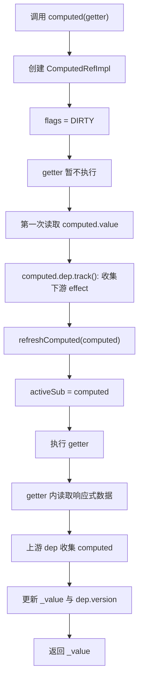
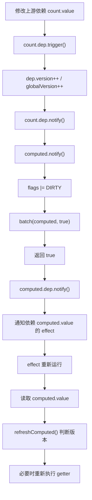
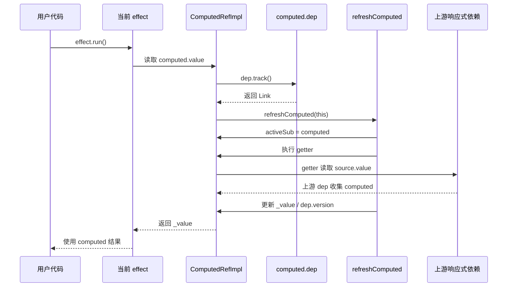

# Vue3 computed 源码实现深度分析

本文基于当前仓库 `vue3` 源码整理，重点分析 `computed` 的入口、核心数据结构、缓存机制、dirty 失效流程、`computed.value` 调用链，以及它和 `watch` 的实现差异。

需要特别注意：当前源码中的 `computed` 已经不是“内部创建一个 `ReactiveEffect`”的旧模型。`ComputedRefImpl` 现在自己实现了 `Subscriber` 接口，并复用 `Dep`、`Link`、`activeSub`、`EffectFlags` 这一套响应式订阅机制。源码里仍然保留了 `effect: this = this`，主要是为了兼容旧字段。

## 一、computed 源码位置

| 能力 | 源码位置 | 作用 |
| --- | --- | --- |
| `computed` 入口 | `vue3/packages/reactivity/src/computed.ts:189` | 支持 readonly computed 和 writable computed 两种重载 |
| `ComputedRefImpl` | `vue3/packages/reactivity/src/computed.ts:47` | computed ref 的核心实现 |
| `ComputedRefImpl.value` getter | `vue3/packages/reactivity/src/computed.ts:131` | 读取 computed 值、收集外部依赖、触发刷新 |
| `ComputedRefImpl.value` setter | `vue3/packages/reactivity/src/computed.ts:147` | writable computed 调用 setter；readonly computed 在开发环境告警 |
| `ComputedRefImpl.notify` | `vue3/packages/reactivity/src/computed.ts:117` | 依赖变化时标记 dirty，并进入 computed 批处理队列 |
| `refreshComputed` | `vue3/packages/reactivity/src/effect.ts:376` | computed 缓存判断与真正重新求值 |
| `Dep` / `Link` | `vue3/packages/reactivity/src/dep.ts:32`、`vue3/packages/reactivity/src/dep.ts:67` | computed 依赖关系的双向链表结构 |
| `Dep.notify` 中触发 computed 下游 | `vue3/packages/reactivity/src/dep.ts:193` | 上游依赖变化后，通知 computed，并继续通知依赖 computed 的 effect |
| `watch` 基础实现 | `vue3/packages/reactivity/src/watch.ts:120` | 和 computed 对比：watch 会创建 `ReactiveEffect` |
| 运行时 `computed` 包装 | `vue3/packages/runtime-core/src/apiComputed.ts:4` | 注入 SSR 状态和递归 computed 警告配置 |

## 二、computed 的入口函数在哪里？

`computed` 的核心入口在 `packages/reactivity/src/computed.ts`：

```ts
export function computed<T>(
  getter: ComputedGetter<T>,
  debugOptions?: DebuggerOptions,
): ComputedRef<T>

export function computed<T, S = T>(
  options: WritableComputedOptions<T, S>,
  debugOptions?: DebuggerOptions,
): WritableComputedRef<T, S>

export function computed<T>(
  getterOrOptions: ComputedGetter<T> | WritableComputedOptions<T>,
  debugOptions?: DebuggerOptions,
  isSSR = false,
) {
  let getter: ComputedGetter<T>
  let setter: ComputedSetter<T> | undefined

  if (isFunction(getterOrOptions)) {
    getter = getterOrOptions
  } else {
    getter = getterOrOptions.get
    setter = getterOrOptions.set
  }

  const cRef = new ComputedRefImpl(getter, setter, isSSR)

  if (__DEV__ && debugOptions && !isSSR) {
    cRef.onTrack = debugOptions.onTrack
    cRef.onTrigger = debugOptions.onTrigger
  }

  return cRef as any
}
```

调用链：

```text
computed(getter)
  -> getterOrOptions 是函数
  -> getter = getterOrOptions
  -> setter = undefined
  -> new ComputedRefImpl(getter, undefined, isSSR)
  -> 返回 readonly computed ref

computed({ get, set })
  -> getterOrOptions 是对象
  -> getter = options.get
  -> setter = options.set
  -> new ComputedRefImpl(getter, setter, isSSR)
  -> 返回 writable computed ref
```

在运行时包 `runtime-core` 中还有一层包装：

```ts
export const computed: typeof _computed = (getterOrOptions, debugOptions) => {
  const c = _computed(getterOrOptions, debugOptions, isInSSRComponentSetup)
  return c as any
}
```

这层主要把 SSR 组件 setup 状态传给 `@vue/reactivity` 的 `computed`。

## 三、ComputedRefImpl 是什么？

`ComputedRefImpl` 是 computed 的运行时对象。它同时具备两个身份：

1. 对外看，它是一个 ref：有 `.value`，并带有 `__v_isRef = true`。
2. 对内看，它是一个订阅者：实现 `Subscriber`，可以像 effect 一样订阅上游依赖。

核心结构可以简化成：

```ts
class ComputedRefImpl<T = any> implements Subscriber {
  _value: any = undefined

  readonly dep: Dep = new Dep(this)
  readonly __v_isRef = true
  readonly __v_isReadonly: boolean

  deps?: Link = undefined
  depsTail?: Link = undefined

  flags: EffectFlags = EffectFlags.DIRTY
  globalVersion: number = globalVersion - 1
  isSSR: boolean
  next?: Subscriber = undefined

  effect: this = this

  onTrack?: (event: DebuggerEvent) => void
  onTrigger?: (event: DebuggerEvent) => void

  constructor(
    public fn: ComputedGetter<T>,
    private readonly setter: ComputedSetter<T> | undefined,
    isSSR: boolean,
  ) {
    this[ReactiveFlags.IS_READONLY] = !setter
    this.isSSR = isSSR
  }

  notify(): true | void {}
  get value(): T {}
  set value(newValue) {}
}
```

字段含义：

| 字段 | 含义 |
| --- | --- |
| `_value` | 缓存的 computed 计算结果 |
| `dep` | computed 自己的依赖集合；依赖 `computed.value` 的 effect 会订阅这里 |
| `deps` / `depsTail` | computed 作为订阅者时，收集到的上游依赖链表 |
| `flags` | 状态位，初始包含 `EffectFlags.DIRTY` |
| `globalVersion` | 全局响应式版本快照，用于快速判断是否需要刷新 |
| `fn` | computed getter |
| `setter` | writable computed 的 setter；readonly computed 没有 setter |
| `effect` | 兼容旧 API 的字段；当前源码注释说明 computed no longer uses effect |
| `onTrack` / `onTrigger` | 开发环境调试钩子 |

关系图：

```text
上游响应式依赖 Dep
  -> subs 中包含 ComputedRefImpl

ComputedRefImpl
  -> deps / depsTail 记录它依赖了哪些上游 Dep
  -> dep 记录哪些 effect / computed 依赖了 computed.value
  -> _value 保存缓存结果
  -> flags 保存 DIRTY / TRACKING / RUNNING / EVALUATED 等状态
```

## 四、computed 为什么具有缓存能力？

computed 的缓存来自三个层面的配合：

1. `_value` 保存上一次 getter 的计算结果。
2. `EffectFlags.DIRTY` 表示缓存是否可能失效。
3. `globalVersion`、`Dep.version`、`Link.version` 用于快速判断依赖是否真的变化。

第一次创建 computed 时：

```ts
flags: EffectFlags = EffectFlags.DIRTY
globalVersion: number = globalVersion - 1
```

这意味着 computed 一开始是 dirty 的，但不会立即执行 getter。只有读取 `.value` 时才会进入 `refreshComputed(this)`。

`refreshComputed` 中有多个提前返回的缓存路径：

```ts
if (
  computed.flags & EffectFlags.TRACKING &&
  !(computed.flags & EffectFlags.DIRTY)
) {
  return
}

computed.flags &= ~EffectFlags.DIRTY

if (computed.globalVersion === globalVersion) {
  return
}

computed.globalVersion = globalVersion

if (
  !computed.isSSR &&
  computed.flags & EffectFlags.EVALUATED &&
  ((!computed.deps && !(computed as any)._dirty) || !isDirty(computed))
) {
  return
}
```

可以把缓存判断理解成：

```text
读取 computed.value
  -> 如果正在追踪且没有 DIRTY：直接用缓存
  -> 如果全局版本没变：直接用缓存
  -> 如果已经计算过，并且依赖版本没变：直接用缓存
  -> 否则执行 getter，更新 _value
```

测试里也验证了这个行为：`computed.spec.ts` 的 “should compute lazily” 用例证明 computed 创建后不会立刻执行 getter，同一次依赖未变化时多次读取也不会重复执行 getter。

## 五、dirty 标记是如何工作的？

当前源码中的 dirty 不是一个单独的布尔字段，而是 `flags` 上的状态位：

```ts
flags: EffectFlags = EffectFlags.DIRTY
```

`EffectFlags.DIRTY` 定义在 `packages/reactivity/src/effect.ts`：

```ts
export enum EffectFlags {
  ACTIVE = 1 << 0,
  RUNNING = 1 << 1,
  TRACKING = 1 << 2,
  NOTIFIED = 1 << 3,
  DIRTY = 1 << 4,
  ALLOW_RECURSE = 1 << 5,
  PAUSED = 1 << 6,
  EVALUATED = 1 << 7,
}
```

当 computed 依赖的上游响应式数据变化时，上游 dep 会通知订阅者，computed 的 `notify()` 被调用：

```ts
notify(): true | void {
  this.flags |= EffectFlags.DIRTY
  if (
    !(this.flags & EffectFlags.NOTIFIED) &&
    activeSub !== this
  ) {
    batch(this, true)
    return true
  }
}
```

这里做了三件事：

1. 设置 `DIRTY`，表示缓存可能过期。
2. 如果没有进入通知队列，则调用 `batch(this, true)`。
3. 返回 `true`，告诉 `Dep.notify()`：这是一个 computed，还需要继续通知依赖这个 computed 的下游。

然后在下一次读取 `computed.value` 时，`refreshComputed` 会清掉 dirty 标记：

```ts
computed.flags &= ~EffectFlags.DIRTY
```

如果依赖版本确认已经变化，才会真正执行 getter。

## 六、computed 内部如何使用 ReactiveEffect？

结论：当前源码中，`computed` 不再直接创建 `ReactiveEffect`。

证据在 `computed.ts` 的类型定义里：

```ts
interface BaseComputedRef<T, S = T> extends Ref<T, S> {
  /**
   * @deprecated computed no longer uses effect
   */
  effect: ComputedRefImpl
}
```

并且 `ComputedRefImpl` 内部写的是：

```ts
// for backwards compat
effect: this = this
```

也就是说，旧版本或旧文章里常见的说法是：

```text
computed 内部创建 lazy ReactiveEffect
```

但当前仓库里的实现更准确地说是：

```text
ComputedRefImpl 自己实现 Subscriber
  -> 读取 computed.value 时，refreshComputed 将 activeSub 临时切换成当前 computed
  -> 执行 getter
  -> getter 内部读取响应式数据
  -> 上游 dep.track() 把当前 computed 作为订阅者收集起来
```

`refreshComputed` 的关键逻辑：

```ts
const prevSub = activeSub
const prevShouldTrack = shouldTrack
activeSub = computed
shouldTrack = true

try {
  prepareDeps(computed)
  const value = computed.fn(computed._value)
  if (dep.version === 0 || hasChanged(value, computed._value)) {
    computed.flags |= EffectFlags.EVALUATED
    computed._value = value
    dep.version++
  }
} finally {
  activeSub = prevSub
  shouldTrack = prevShouldTrack
  cleanupDeps(computed)
  computed.flags &= ~EffectFlags.RUNNING
}
```

这和 `ReactiveEffect.run()` 的思想类似：运行前设置当前活跃订阅者，运行 getter，收集依赖，运行后恢复现场。但 computed 使用的是 `ComputedRefImpl` 自身，而不是 `new ReactiveEffect(getter)`。

## 七、依赖变化后 computed 为什么不会立刻重新计算？

因为 computed 是 lazy 的。依赖变化时，它只做缓存失效和下游通知，不立即执行 getter。

依赖变化时的流程：

```text
source.value 改变
  -> source.dep.trigger()
    -> globalVersion++
    -> source.dep.notify()
      -> 找到订阅 source 的 computed
      -> computed.notify()
        -> flags |= DIRTY
        -> batch(computed, true)
        -> return true
      -> source.dep.notify() 发现返回 true
        -> computed.dep.notify()
          -> 通知依赖 computed.value 的 effect
```

computed getter 不在 `notify()` 中执行。真正的重新计算发生在：

```text
下一次读取 computed.value
  -> refreshComputed(computed)
  -> 判断 dirty / version
  -> 必要时执行 computed.fn(oldValue)
```

这么设计的好处是：

1. 如果依赖变化后没有人读取 computed，就不浪费计算。
2. 多次依赖变化可以合并成一次实际求值。
3. 链式 computed 可以按读取路径顺序刷新，避免重复计算。

`computed.spec.ts` 的 “should compute lazily” 用例正好验证了：修改依赖后 getter 调用次数不会立刻增加，直到再次读取 `.value` 才会重新计算。

## 八、读取 computed.value 时发生了什么？

源码位置：`vue3/packages/reactivity/src/computed.ts:131`

```ts
get value(): T {
  const link = __DEV__
    ? this.dep.track({
        target: this,
        type: TrackOpTypes.GET,
        key: 'value',
      })
    : this.dep.track()
  refreshComputed(this)
  if (link) {
    link.version = this.dep.version
  }
  return this._value
}
```

读取调用链：

```text
effect(() => {
  console.log(double.value)
})
  -> ReactiveEffect.run()
    -> activeSub = 当前 effect
    -> 执行用户函数
      -> 读取 double.value
        -> ComputedRefImpl.get value
          -> this.dep.track()
             收集“当前 effect 依赖 double.value”
          -> refreshComputed(this)
             必要时执行 computed getter
          -> link.version = this.dep.version
             同步依赖版本
          -> return this._value
```

为什么先 `dep.track()` 再 `refreshComputed()`？

从结果上看，外部 effect 需要订阅 computed 自己的 `dep`，而 computed getter 内部还需要订阅上游依赖。`refreshComputed` 会临时把 `activeSub` 切换成 computed 本身，这样 getter 内读取的 `count.value` 会收集到 computed，而不是错误地收集到外部 effect。

## 九、computed 如何触发依赖它的 effect？

computed 有两类依赖关系：

```text
上游依赖：
  count.value -> computed getter 读取了 count.value
  所以 count.dep.subs 包含 computed

下游依赖：
  effect 读取了 computed.value
  所以 computed.dep.subs 包含 effect
```

当上游 `count` 改变时：

```text
count.dep.trigger()
  -> count.dep.notify()
    -> link.sub 是 computed
    -> computed.notify()
       设置 DIRTY，并返回 true
    -> 因为 notify() 返回 true
       count.dep.notify() 调用 computed.dep.notify()
    -> computed.dep.notify()
       通知依赖 computed.value 的 effect
    -> effect 重新运行
       读取 computed.value
       refreshComputed()
       得到新值
```

源码证据在 `dep.ts`：

```ts
for (let link = this.subs; link; link = link.prevSub) {
  if (link.sub.notify()) {
    ;(link.sub as ComputedRefImpl).dep.notify()
  }
}
```

这段逻辑就是 computed 能向下游 effect 传播更新的关键。

## 十、readonly computed 和 writable computed 有什么区别？

### 1. readonly computed

传入函数时，创建 readonly computed：

```ts
const double = computed(() => count.value * 2)
```

源码中：

```ts
if (isFunction(getterOrOptions)) {
  getter = getterOrOptions
} else {
  getter = getterOrOptions.get
  setter = getterOrOptions.set
}
```

函数形式没有 setter，因此：

```ts
this[ReactiveFlags.IS_READONLY] = !setter
```

会被标记为 readonly。

如果写入：

```ts
double.value = 10
```

setter 逻辑会在开发环境告警：

```ts
set value(newValue) {
  if (this.setter) {
    this.setter(newValue)
  } else if (__DEV__) {
    warn('Write operation failed: computed value is readonly')
  }
}
```

### 2. writable computed

传入 `{ get, set }` 时，创建 writable computed：

```ts
const plusOne = computed({
  get: () => count.value + 1,
  set: value => {
    count.value = value - 1
  },
})
```

读取时仍然走 getter 和缓存机制：

```text
plusOne.value
  -> refreshComputed()
  -> get()
```

写入时不会直接改 `_value`，而是调用用户提供的 setter：

```text
plusOne.value = 10
  -> ComputedRefImpl.set value
  -> setter(10)
  -> 用户在 setter 内修改 count.value
  -> count 的变化再触发 computed 失效
```

对比表：

| 类型 | 创建方式 | 是否 readonly | 读取 | 写入 |
| --- | --- | --- | --- | --- |
| readonly computed | `computed(() => expr)` | 是 | 走 getter + 缓存 | 开发环境告警 |
| writable computed | `computed({ get, set })` | 否 | 走 get + 缓存 | 调用 set，不直接改缓存 |

## 十一、computed 和 watch 的实现差异是什么？

`computed` 和 `watch` 都基于响应式依赖追踪，但目标完全不同。

| 对比项 | computed | watch |
| --- | --- | --- |
| 主要用途 | 声明一个可缓存的派生值 | 观察源变化并执行副作用回调 |
| 返回值 | ref-like 对象，有 `.value` | stop handle，带 `pause/resume/stop` |
| 是否缓存 | 是，缓存 `_value` | 否，不提供派生值缓存 |
| 是否 lazy | 是，创建后不立即执行 getter，读取 `.value` 时才求值 | `watch(source, cb)` 默认会先运行 getter 保存旧值；`watchEffect` 默认立即执行 |
| 核心对象 | `ComputedRefImpl implements Subscriber` | `new ReactiveEffect(getter)` |
| 依赖变化后 | 标记 DIRTY，通知下游，等读取时重新计算 | scheduler 调度 job，job 中运行 effect 并调用回调 |
| 是否有下游 dep | 有，`computed.dep` 收集依赖 `computed.value` 的 effect | 没有“watch.value”，watch 自身不作为 ref 被别人依赖 |
| 回调能力 | getter 应尽量保持纯计算；writable computed 仅提供 setter | 支持 callback、oldValue、cleanup、deep、immediate、once、flush |
| 调度方式 | 依赖响应式批处理和读取时刷新 | runtime-core 可按 `flush: pre/post/sync` 调度 |

`watch` 的核心实现证据在 `packages/reactivity/src/watch.ts`：

```ts
effect = new ReactiveEffect(getter)

effect.scheduler = scheduler
  ? () => scheduler(job, false)
  : (job as EffectScheduler)
```

job 执行时：

```ts
const newValue = effect.run()
if (deep || forceTrigger || hasChanged(newValue, oldValue)) {
  if (cleanup) cleanup()
  cb!(newValue, oldValue, boundCleanup)
  oldValue = newValue
}
```

所以可以简化理解：

```text
computed = 响应式派生值，有缓存，有 .value，被读取时求值
watch = 响应式观察器，无缓存派生值，变化后调度副作用
```

## 十二、computed 核心数据结构

### 1. 上游依赖链

computed getter 中读取了哪些响应式数据，都会记录在 computed 自己的 `deps` 链表中：

```text
ComputedRefImpl
  deps -> Link(dep: count.dep, sub: computed)
       -> Link(dep: user.name dep, sub: computed)
```

### 2. 下游订阅者链

谁读取了 `computed.value`，谁就会被收集到 computed 自己的 `dep` 中：

```text
ComputedRefImpl.dep
  subs -> Link(dep: computed.dep, sub: renderEffect)
       -> Link(dep: computed.dep, sub: watchEffect)
```

### 3. 版本关系

```text
Dep.version
  每个 dep 自己的版本，dep.trigger() 或 computed 值变化时递增

Link.version
  当前 subscriber 上次读取该 dep 时记录的版本

globalVersion
  任意响应式变更都会递增，用于 computed 快速判断全局是否有变化
```

判断是否 dirty 的关键逻辑：

```ts
function isDirty(sub: Subscriber): boolean {
  for (let link = sub.deps; link; link = link.nextDep) {
    if (
      link.dep.version !== link.version ||
      (link.dep.computed &&
        (refreshComputed(link.dep.computed) ||
          link.dep.version !== link.version))
    ) {
      return true
    }
  }
  return false
}
```

这让链式 computed 可以逐层确认缓存是否真的失效。

## 十三、lazy 求值流程



对应示例：

```ts
import { computed, reactive } from 'vue'

const state = reactive({ count: 1 })
const getter = () => {
  console.log('computed getter run')
  return state.count * 2
}

const double = computed(getter)

// 这里不会打印，因为 computed 是 lazy 的

console.log(double.value)
// 打印 computed getter run
// 输出 2

console.log(double.value)
// 不再打印 getter，因为命中缓存
// 输出 2
```

## 十四、缓存失效流程



示例：

```ts
import { computed, effect, ref } from 'vue'

const count = ref(1)
const double = computed(() => {
  console.log('getter')
  return count.value * 2
})

effect(() => {
  console.log('effect:', double.value)
})

// 首次运行：
// getter
// effect: 2

count.value++
// count 变化后 computed 先被标记 DIRTY
// effect 被通知后重新运行，并在读取 double.value 时触发 computed 重新求值
```

## 十五、computed.value 调用链



文字版调用链：

```text
computed.value
  -> ComputedRefImpl.get value
    -> computed.dep.track()
       收集当前 activeSub 对 computed.value 的依赖
    -> refreshComputed(computed)
       -> 如果缓存有效，直接返回
       -> 如果缓存失效：
          -> activeSub = computed
          -> prepareDeps(computed)
          -> computed.fn(oldValue)
          -> getter 内部收集上游依赖
          -> hasChanged 后更新 _value
          -> computed.dep.version++
          -> cleanupDeps(computed)
    -> link.version = computed.dep.version
    -> return computed._value
```

## 十六、完整示例代码

### 1. readonly computed

```ts
import { computed, ref } from 'vue'

const count = ref(1)
const double = computed(() => count.value * 2)

console.log(double.value) // 2

count.value = 2
console.log(double.value) // 4
```

### 2. writable computed

```ts
import { computed, ref } from 'vue'

const count = ref(1)

const plusOne = computed({
  get() {
    return count.value + 1
  },
  set(value) {
    count.value = value - 1
  },
})

console.log(plusOne.value) // 2

plusOne.value = 10
console.log(count.value) // 9
console.log(plusOne.value) // 10
```

### 3. lazy 与缓存

```ts
import { computed, ref } from 'vue'

const count = ref(1)

const double = computed(() => {
  console.log('run getter')
  return count.value * 2
})

// 创建 computed 不会打印

double.value
// 打印 run getter

double.value
// 不打印，命中缓存

count.value++
// 不打印，只标记 dirty

double.value
// 打印 run getter，重新计算
```

### 4. computed 触发依赖它的 effect

```ts
import { computed, effect, ref } from 'vue'

const count = ref(1)
const double = computed(() => count.value * 2)

effect(() => {
  console.log('double:', double.value)
})

count.value++
```

依赖关系：

```text
count.dep
  -> computed double

double.dep
  -> effect
```

`count.value++` 后，`double` 先标记 dirty，再通知 `double.dep` 中的 effect。effect 重新运行时读取 `double.value`，此时才重新计算。

### 5. computed 和 watch 的使用差异

```ts
import { computed, ref, watch } from 'vue'

const firstName = ref('Ada')
const lastName = ref('Lovelace')

const fullName = computed(() => {
  return `${firstName.value} ${lastName.value}`
})

watch(fullName, (newName, oldName) => {
  console.log('changed:', oldName, '->', newName)
})

console.log(fullName.value)
```

这里：

- `computed` 负责产出可缓存的派生值 `fullName`。
- `watch` 负责观察 `fullName` 的变化并执行副作用。

## 十七、核心结论

1. `computed` 入口在 `packages/reactivity/src/computed.ts`，最终创建 `ComputedRefImpl`。
2. `ComputedRefImpl` 既是 ref，又是订阅者；它用 `_value` 缓存结果，用 `dep` 收集依赖它的下游 effect，用 `deps` 记录自己依赖的上游 dep。
3. 当前源码中 computed 不再直接创建 `ReactiveEffect`，而是自己实现 `Subscriber`；`effect` 字段只是兼容旧 API。
4. computed 的缓存由 `_value`、`EffectFlags.DIRTY`、`Dep.version`、`Link.version` 和 `globalVersion` 共同完成。
5. 依赖变化时 computed 不会立刻重新执行 getter，只会标记 dirty 并通知下游。
6. 真正重新计算发生在读取 `computed.value` 时，由 `refreshComputed` 判断是否需要执行 getter。
7. computed 能触发依赖它的 effect，是因为它自己有 `dep`；上游变化时 `Dep.notify()` 会在 computed dirty 后继续调用 `computed.dep.notify()`。
8. readonly computed 没有 setter，写入会告警；writable computed 写入时调用用户提供的 setter。
9. computed 适合表达“缓存的派生值”，watch 适合表达“响应式变化后的副作用”。
10. 学源码时建议把 computed 看成“带缓存的 ref + 可订阅上游的 Subscriber”，而不是普通的 effect 包装器。

