# Vue3 createApp(App).mount('#app') 源码调用链分析

本文基于当前仓库 `vue3` 源码整理，从下面这段代码出发，追踪 Vue3 应用从创建到首次挂载、进入 patch、创建真实 DOM 并插入页面的完整调用链。

```ts
import { createApp } from 'vue'
import App from './App.vue'

const app = createApp(App)
app.mount('#app')
```

## 一、涉及源码文件列表

| 文件 | 作用 |
| --- | --- |
| `vue3/packages/runtime-dom/src/index.ts` | DOM 平台入口；创建 DOM renderer；包装 `createApp` 和 `mount`；处理选择器、清空容器、DOM 标记 |
| `vue3/packages/runtime-dom/src/nodeOps.ts` | DOM 节点操作适配层，例如 `createElement`、`insert`、`remove`、`setElementText` |
| `vue3/packages/runtime-dom/src/patchProp.ts` | DOM 属性、class、style、事件、attribute 的 patch 逻辑 |
| `vue3/packages/runtime-core/src/renderer.ts` | 平台无关 renderer 核心；实现 `render`、`patch`、组件挂载、元素挂载 |
| `vue3/packages/runtime-core/src/apiCreateApp.ts` | `createAppAPI` 和 app 对象实现；根 vnode 创建也在这里 |
| `vue3/packages/runtime-core/src/vnode.ts` | `createVNode`、`createElementVNode`，负责创建 vnode 结构 |
| `vue3/packages/runtime-core/src/component.ts` | 组件实例创建与 `setupComponent` |
| `vue3/packages/runtime-core/src/componentRenderUtils.ts` | `renderComponentRoot`，负责调用组件 render 函数生成子树 vnode |

## 二、createApp 的入口在哪里？

从用户视角看，`createApp` 来自 `vue` 包导出，实际运行时入口在 `runtime-dom`：

```ts
// packages/runtime-dom/src/index.ts
export const createApp = ((...args) => {
  const app = ensureRenderer().createApp(...args)

  if (__DEV__) {
    injectNativeTagCheck(app)
    injectCompilerOptionsCheck(app)
  }

  const { mount } = app
  app.mount = (containerOrSelector) => {
    // DOM 平台 mount 包装
  }

  return app
}) as CreateAppFunction<Element>
```

调用链：

```text
createApp(App)
  -> runtime-dom/src/index.ts:createApp
    -> ensureRenderer()
      -> createRenderer(rendererOptions)
    -> renderer.createApp(App)
      -> runtime-core createAppAPI(render, hydrate)
      -> createApp(rootComponent, rootProps)
    -> runtime-dom 改写 app.mount
    -> 返回 app
```

这里的 `rendererOptions` 来自：

```ts
const rendererOptions = extend({ patchProp }, nodeOps)
```

也就是说，`runtime-dom` 把 DOM 操作能力传给 `runtime-core`：

```text
rendererOptions
  ├─ nodeOps.createElement
  ├─ nodeOps.insert
  ├─ nodeOps.remove
  ├─ nodeOps.setElementText
  └─ patchProp
```

## 三、createAppAPI 做了什么？

`createAppAPI` 位于 `packages/runtime-core/src/apiCreateApp.ts`：

```ts
export function createAppAPI<HostElement>(
  render: RootRenderFunction<HostElement>,
  hydrate?: RootHydrateFunction,
): CreateAppFunction<HostElement> {
  return function createApp(rootComponent, rootProps = null) {
    if (!isFunction(rootComponent)) {
      rootComponent = extend({}, rootComponent)
    }

    if (rootProps != null && !isObject(rootProps)) {
      rootProps = null
    }

    const context = createAppContext()
    const installedPlugins = new WeakSet()
    const pluginCleanupFns: Array<() => any> = []
    let isMounted = false

    const app: App = (context.app = {
      // app 对象
    })

    return app
  }
}
```

它的核心职责：

1. 接收 renderer 提供的 `render` 和可选 `hydrate`。
2. 返回真正的 `createApp(rootComponent, rootProps)` 函数。
3. 标准化根组件：对象组件会被浅拷贝一份。
4. 校验 `rootProps` 必须是对象。
5. 创建 app 级上下文 `AppContext`。
6. 创建插件集合、卸载清理函数集合。
7. 创建并返回 app 对象。
8. 在 app.mount 中创建根 vnode 并调用 `render(vnode, rootContainer)`。

`createAppContext()` 会创建 app 级全局上下文：

```text
AppContext
  ├─ app
  ├─ config
  │   ├─ globalProperties
  │   ├─ optionMergeStrategies
  │   ├─ errorHandler
  │   ├─ warnHandler
  │   └─ compilerOptions
  ├─ mixins
  ├─ components
  ├─ directives
  ├─ provides
  ├─ optionsCache
  ├─ propsCache
  └─ emitsCache
```

## 四、app 对象上有哪些方法？

`app` 对象在 `createAppAPI` 中创建，包含公开 API 和内部字段。

### 1. 内部字段

| 字段 | 含义 |
| --- | --- |
| `_uid` | app 唯一 id |
| `_component` | 根组件 |
| `_props` | 根组件 props |
| `_container` | 当前挂载容器 |
| `_context` | app 上下文 |
| `_instance` | 根组件实例，devtools 场景会记录 |
| `_ceVNode` | custom element 场景的根 vnode |

### 2. 公开属性

| 属性 | 含义 |
| --- | --- |
| `version` | Vue 版本 |
| `config` | app 配置；只能改内部字段，不能整体替换 |

### 3. 公开方法

| 方法 | 作用 |
| --- | --- |
| `use(plugin, ...options)` | 安装插件，避免重复安装 |
| `mixin(mixin)` | 注册全局 mixin |
| `component(name, component?)` | 注册或读取全局组件 |
| `directive(name, directive?)` | 注册或读取全局指令 |
| `mount(rootContainer, isHydrate?, namespace?)` | 创建根 vnode，调用 render/hydrate |
| `unmount()` | 卸载应用，调用 `render(null, container)` |
| `onUnmount(cleanupFn)` | 注册 app 卸载时的清理函数 |
| `provide(key, value)` | app 级依赖注入 |
| `runWithContext(fn)` | 在当前 app 上下文中执行函数，使 `inject()` 能读取 app provide |

简化结构：

```ts
const app = {
  _uid,
  _component: rootComponent,
  _props: rootProps,
  _container: null,
  _context: context,
  _instance: null,

  version,
  get config() {},
  set config(v) {},

  use() {},
  mixin() {},
  component() {},
  directive() {},
  mount() {},
  unmount() {},
  onUnmount() {},
  provide() {},
  runWithContext() {},
}
```

## 五、mount 方法做了什么？

这里要区分两层 mount。

### 1. runtime-dom 包装后的 mount

`runtime-dom` 里的 `createApp` 会先保存 core 的 `mount`，再改写它：

```ts
const { mount } = app
app.mount = (containerOrSelector) => {
  const container = normalizeContainer(containerOrSelector)
  if (!container) return

  const component = app._component
  if (!isFunction(component) && !component.render && !component.template) {
    component.template = container.innerHTML
  }

  if (container.nodeType === 1) {
    container.textContent = ''
  }

  const proxy = mount(container, false, resolveRootNamespace(container))

  if (container instanceof Element) {
    container.removeAttribute('v-cloak')
    container.setAttribute('data-v-app', '')
  }

  return proxy
}
```

它负责 DOM 平台相关工作：

1. 把 `'#app'` 选择器转换成真实 DOM 容器：`document.querySelector('#app')`。
2. 如果根组件没有 `render` 和 `template`，则使用容器的 `innerHTML` 作为模板。
3. 挂载前清空容器内容：`container.textContent = ''`。
4. 调用 core 原始 `mount(container, false, namespace)`。
5. 挂载后移除 `v-cloak`，设置 `data-v-app`。

### 2. runtime-core 的 mount

真正创建根 vnode 并调用 renderer 的，是 `runtime-core/src/apiCreateApp.ts` 中的 `mount`：

```ts
mount(rootContainer, isHydrate?, namespace?) {
  if (!isMounted) {
    const vnode = app._ceVNode || createVNode(rootComponent, rootProps)
    vnode.appContext = context

    if (isHydrate && hydrate) {
      hydrate(vnode, rootContainer)
    } else {
      render(vnode, rootContainer, namespace)
    }

    isMounted = true
    app._container = rootContainer
    rootContainer.__vue_app__ = app
    app._instance = vnode.component

    return getComponentPublicInstance(vnode.component!)
  }
}
```

它负责平台无关的应用挂载：

1. 防止同一个 app 重复 mount。
2. 创建根组件 vnode。
3. 把 app context 写到根 vnode。
4. 调用 `render(vnode, rootContainer, namespace)`。
5. 保存容器和根组件实例。
6. 返回根组件公共实例。

## 六、根组件 vnode 是在哪里创建的？

根 vnode 在 `runtime-core/src/apiCreateApp.ts` 的 `app.mount` 中创建：

```ts
const vnode = app._ceVNode || createVNode(rootComponent, rootProps)
vnode.appContext = context
```

也就是说：

```text
app.mount(container)
  -> createVNode(rootComponent, rootProps)
  -> vnode.appContext = app context
  -> render(vnode, container)
```

`createVNode` 位于 `runtime-core/src/vnode.ts`：

```ts
export const createVNode = (
  __DEV__ ? createVNodeWithArgsTransform : _createVNode
) as typeof _createVNode
```

`_createVNode` 会根据 `type` 生成 `shapeFlag`：

```ts
const shapeFlag = isString(type)
  ? ShapeFlags.ELEMENT
  : isObject(type)
    ? ShapeFlags.STATEFUL_COMPONENT
    : isFunction(type)
      ? ShapeFlags.FUNCTIONAL_COMPONENT
      : 0
```

对于 `createVNode(App)`，如果 `App` 是对象组件，那么根 vnode 的 `shapeFlag` 会包含 `STATEFUL_COMPONENT`。

根 vnode 大致长这样：

```ts
{
  __v_isVNode: true,
  type: App,
  props: rootProps,
  key: null,
  ref: null,
  children: null,
  component: null,
  el: null,
  shapeFlag: ShapeFlags.STATEFUL_COMPONENT,
  appContext: context,
}
```

## 七、render 函数是如何被调用的？

这里也有两类 render。

### 1. renderer 的根 render

`runtime-core/src/renderer.ts` 中创建 renderer 时，会返回：

```ts
return {
  render,
  hydrate,
  createApp: createAppAPI(render, hydrate),
}
```

根 render 的核心逻辑：

```ts
const render: RootRenderFunction = (vnode, container, namespace) => {
  if (vnode == null) {
    if (container._vnode) {
      unmount(container._vnode, null, null, true)
    }
  } else {
    patch(
      container._vnode || null,
      vnode,
      container,
      null,
      null,
      null,
      namespace,
    )
  }
  container._vnode = vnode
  flushPreFlushCbs(instance)
  flushPostFlushCbs()
}
```

首次挂载时，`container._vnode` 为空，所以：

```text
render(rootVNode, container)
  -> patch(null, rootVNode, container, ...)
```

这就是首次挂载进入 patch 流程的位置。

### 2. 组件自己的 render

组件 render 函数是在组件挂载阶段被调用的。

调用链：

```text
patch(null, rootVNode)
  -> processComponent()
  -> mountComponent()
  -> setupComponent()
  -> setupRenderEffect()
  -> renderComponentRoot(instance)
  -> instance.render.call(...)
```

`renderComponentRoot` 位于 `componentRenderUtils.ts`：

```ts
result = normalizeVNode(
  render!.call(
    thisProxy,
    proxyToUse!,
    renderCache,
    __DEV__ ? shallowReadonly(props) : props,
    setupState,
    data,
    ctx,
  ),
)
```

所以：

```text
根 render = renderer.render(vnode, container)，负责进入 patch
组件 render = App.render(...)，负责生成组件子树 vnode
```

## 八、runtime-dom 和 runtime-core 如何协作？

`runtime-core` 是平台无关的渲染核心。它不知道什么是 `document.createElement`，也不直接操作浏览器 DOM。它只依赖一组 host 操作：

```ts
const {
  insert: hostInsert,
  remove: hostRemove,
  patchProp: hostPatchProp,
  createElement: hostCreateElement,
  createText: hostCreateText,
  createComment: hostCreateComment,
  setText: hostSetText,
  setElementText: hostSetElementText,
  parentNode: hostParentNode,
  nextSibling: hostNextSibling,
  setScopeId: hostSetScopeId,
  insertStaticContent: hostInsertStaticContent,
} = options
```

这些 options 由 `runtime-dom` 提供：

```ts
const rendererOptions = extend({ patchProp }, nodeOps)
createRenderer<Node, Element | ShadowRoot>(rendererOptions)
```

关系图：

```text
runtime-dom
  ├─ nodeOps: DOM 节点操作
  │   ├─ createElement -> document.createElement
  │   ├─ insert -> parent.insertBefore
  │   ├─ remove -> parent.removeChild
  │   └─ setElementText -> el.textContent
  ├─ patchProp: DOM 属性/事件/class/style 更新
  └─ createRenderer(rendererOptions)
        ↓
runtime-core
  ├─ createAppAPI(render, hydrate)
  ├─ render
  ├─ patch
  ├─ mountComponent
  ├─ mountElement
  └─ 调用 hostCreateElement / hostInsert / hostPatchProp
```

`runtime-core` 决定“什么时候创建元素、什么时候插入、什么时候 patch props”；`runtime-dom` 决定“在浏览器里具体怎么创建元素、怎么插入、怎么设置属性”。

## 九、为什么 Vue3 要区分 runtime-core 和 runtime-dom？

拆分的核心原因是平台无关和平台相关解耦。

| 包 | 职责 | 是否依赖 DOM |
| --- | --- | --- |
| `runtime-core` | vnode、组件、renderer、patch、scheduler、生命周期、依赖注入等核心逻辑 | 不依赖 |
| `runtime-dom` | 浏览器 DOM 节点操作、属性 patch、事件处理、DOM 平台 createApp 包装 | 依赖 |

这样拆分有几个好处：

1. **支持跨平台渲染**：核心 renderer 可以被 DOM、小程序、Canvas、自定义渲染器复用。
2. **让核心逻辑可测试、可复用**：组件和 patch 算法不需要绑定浏览器环境。
3. **减小平台包耦合**：DOM 的 class/style/event/attribute 规则只留在 `runtime-dom`。
4. **支持自定义 renderer**：用户可以调用 `createRenderer({ ...hostOps })` 实现非 DOM 渲染。
5. **SSR / hydration 可独立组织**：hydration renderer 也是通过不同入口创建，便于 tree-shaking。

`renderer.ts` 注释里也给出了自定义 renderer 的示例：

```ts
const { render, createApp } = createRenderer<Node, Element>({
  patchProp,
  ...nodeOps
})
```

## 十、首次挂载是如何进入 patch 流程的？

完整链路：

```text
createApp(App)
  -> runtime-dom.createApp
    -> ensureRenderer()
      -> createRenderer(rendererOptions)
        -> baseCreateRenderer(options)
        -> 返回 { render, hydrate, createApp }
    -> runtime-core createAppAPI(render, hydrate)(App)
    -> 返回 app
    -> runtime-dom 包装 app.mount

app.mount('#app')
  -> runtime-dom app.mount
    -> normalizeContainer('#app')
    -> container.textContent = ''
    -> 调用 runtime-core 原始 mount(container, false, namespace)
      -> createVNode(App, rootProps)
      -> vnode.appContext = context
      -> render(vnode, container, namespace)
        -> patch(container._vnode || null, vnode, container, ...)
        -> 首次挂载 container._vnode 是 null
        -> patch(null, rootVNode, container, ...)
```

进入 `patch` 后：

```text
patch(null, rootVNode)
  -> rootVNode.shapeFlag 是 COMPONENT
  -> processComponent(null, rootVNode)
  -> mountComponent(rootVNode)
  -> createComponentInstance(rootVNode)
  -> setupComponent(instance)
  -> setupRenderEffect(instance)
  -> renderComponentRoot(instance)
  -> 得到 subTree
  -> patch(null, subTree, container, ...)
```

如果 `App.render()` 返回的是：

```ts
return h('div', { id: 'root' }, 'hello')
```

那么第二次 `patch(null, subTree)` 会发现 `subTree.shapeFlag` 是 `ELEMENT`，进入：

```text
patch(null, divVNode)
  -> processElement(null, divVNode)
  -> mountElement(divVNode)
```

## 十一、真实 DOM 是在哪里创建和插入的？

真实 DOM 创建发生在 `runtime-core/src/renderer.ts` 的 `mountElement`：

```ts
el = vnode.el = hostCreateElement(
  vnode.type as string,
  namespace,
  props && props.is,
  props,
)
```

但 `hostCreateElement` 是由 `runtime-dom/nodeOps.ts` 提供的：

```ts
createElement: (tag, namespace, is, props): Element => {
  const el =
    namespace === 'svg'
      ? doc.createElementNS(svgNS, tag)
      : namespace === 'mathml'
        ? doc.createElementNS(mathmlNS, tag)
        : is
          ? doc.createElement(tag, { is })
          : doc.createElement(tag)

  return el
}
```

文本子节点设置：

```ts
if (shapeFlag & ShapeFlags.TEXT_CHILDREN) {
  hostSetElementText(el, vnode.children as string)
}
```

对应 DOM 实现：

```ts
setElementText: (el, text) => {
  el.textContent = text
}
```

props 设置：

```ts
hostPatchProp(el, key, null, props[key], namespace, parentComponent)
```

对应 `runtime-dom/src/patchProp.ts`，它会分发到：

```text
class -> patchClass
style -> patchStyle
event -> patchEvent
DOM prop -> patchDOMProp
attribute -> patchAttr
```

插入真实 DOM：

```ts
hostInsert(el, container, anchor)
```

对应 DOM 实现：

```ts
insert: (child, parent, anchor) => {
  parent.insertBefore(child, anchor || null)
}
```

所以真实 DOM 的创建和插入可以总结为：

```text
runtime-core mountElement
  -> hostCreateElement()
     -> runtime-dom nodeOps.createElement()
     -> document.createElement()
  -> hostPatchProp()
     -> runtime-dom patchProp()
  -> hostInsert()
     -> runtime-dom nodeOps.insert()
     -> parent.insertBefore()
```

## 十二、mount 到 patch 的流程图

```mermaid
flowchart TD
  A["用户代码: createApp(App)"] --> B["runtime-dom createApp"]
  B --> C["ensureRenderer()"]
  C --> D["createRenderer(rendererOptions)"]
  D --> E["runtime-core baseCreateRenderer"]
  E --> F["返回 renderer: render / hydrate / createApp"]
  F --> G["renderer.createApp(App)"]
  G --> H["createAppAPI(render, hydrate)"]
  H --> I["创建 app 对象"]
  I --> J["runtime-dom 包装 app.mount"]
  J --> K["用户代码: app.mount('#app')"]
  K --> L["normalizeContainer('#app')"]
  L --> M["清空 container.textContent"]
  M --> N["调用 core mount(container)"]
  N --> O["createVNode(App, rootProps)"]
  O --> P["vnode.appContext = context"]
  P --> Q["render(vnode, container)"]
  Q --> R["patch(null, rootVNode, container)"]
  R --> S["processComponent"]
  S --> T["mountComponent"]
  T --> U["setupComponent"]
  U --> V["setupRenderEffect"]
  V --> W["renderComponentRoot(instance)"]
  W --> X["App.render 生成 subTree"]
  X --> Y["patch(null, subTree, container)"]
  Y --> Z["mountElement / mountChildren"]
  Z --> AA["hostCreateElement / hostPatchProp / hostInsert"]
  AA --> AB["document.createElement / insertBefore"]
```



## 十三、createApp 调用链

```text
createApp(App)
  -> runtime-dom/src/index.ts:createApp(...args)
    -> ensureRenderer()
      -> createRenderer(rendererOptions)
        -> runtime-core/src/renderer.ts:createRenderer()
          -> baseCreateRenderer(options)
          -> return { render, hydrate, createApp: createAppAPI(render, hydrate) }
    -> ensureRenderer().createApp(App)
      -> runtime-core/src/apiCreateApp.ts:createAppAPI(render, hydrate)
      -> createApp(rootComponent, rootProps)
        -> rootComponent = extend({}, rootComponent)
        -> context = createAppContext()
        -> app = context.app = { ... }
        -> return app
    -> runtime-dom 注入 DOM 平台检查
    -> runtime-dom 包装 app.mount
    -> return app
```

## 十四、app.mount 调用链

```text
app.mount('#app')
  -> runtime-dom 包装后的 app.mount(containerOrSelector)
    -> normalizeContainer('#app')
      -> document.querySelector('#app')
    -> 如果根组件无 render/template:
      -> component.template = container.innerHTML
    -> container.textContent = ''
    -> 调用 core mount(container, false, namespace)
      -> if (!isMounted)
      -> vnode = createVNode(rootComponent, rootProps)
      -> vnode.appContext = context
      -> render(vnode, rootContainer, namespace)
        -> patch(container._vnode || null, vnode, container, ...)
        -> container._vnode = vnode
        -> flushPreFlushCbs()
        -> flushPostFlushCbs()
      -> isMounted = true
      -> app._container = rootContainer
      -> rootContainer.__vue_app__ = app
      -> app._instance = vnode.component
      -> return getComponentPublicInstance(vnode.component)
    -> container.removeAttribute('v-cloak')
    -> container.setAttribute('data-v-app', '')
    -> return root component public instance
```

## 十五、示例代码对应的内部过程

用户代码：

```ts
const App = {
  render() {
    return h('div', { id: 'root' }, 'hello')
  },
}

const app = createApp(App)
app.mount('#app')
```

可以展开理解为：

```text
1. createApp(App)
   -> 创建 app 对象，但还没有渲染，也没有创建根组件实例。

2. app.mount('#app')
   -> 找到真实容器 document.querySelector('#app')
   -> 清空容器
   -> createVNode(App)
   -> render(rootVNode, container)

3. render(rootVNode, container)
   -> patch(null, rootVNode)
   -> rootVNode 是组件
   -> mountComponent(rootVNode)

4. mountComponent
   -> createComponentInstance(rootVNode)
   -> setupComponent(instance)
   -> setupRenderEffect(instance)

5. setupRenderEffect 首次执行
   -> renderComponentRoot(instance)
   -> 调用 App.render()
   -> 得到 div vnode
   -> patch(null, divVNode)

6. mountElement(divVNode)
   -> document.createElement('div')
   -> 设置 id="root"
   -> 设置 textContent = 'hello'
   -> container.insertBefore(div, null)
```

## 十六、核心结论

1. `createApp` 的浏览器入口在 `runtime-dom/src/index.ts`，真正创建 app 对象的逻辑在 `runtime-core/src/apiCreateApp.ts`。
2. `runtime-dom` 负责 DOM 平台适配：选择容器、清空容器、设置 `data-v-app`，并提供 `nodeOps` 和 `patchProp`。
3. `runtime-core` 负责平台无关逻辑：app 对象、vnode、renderer、patch、组件挂载、生命周期。
4. `createAppAPI` 接收 renderer 的 `render/hydrate`，返回 `createApp`，并在其中创建 app 对象。
5. 根组件 vnode 在 `app.mount` 内通过 `createVNode(rootComponent, rootProps)` 创建。
6. 首次挂载进入 patch 的关键点是 `render(vnode, container)` 调用 `patch(container._vnode || null, vnode, container)`。
7. 根组件首次 patch 会进入 `processComponent -> mountComponent -> setupRenderEffect -> renderComponentRoot`。
8. 组件 render 函数由 `renderComponentRoot(instance)` 调用，返回组件子树 vnode。
9. 真实 DOM 在 `mountElement` 中通过 `hostCreateElement` 创建，并通过 `hostInsert` 插入。
10. `hostCreateElement/hostInsert/hostPatchProp` 来自 `runtime-dom`，底层对应 `document.createElement`、`insertBefore` 和 DOM 属性/事件更新。

