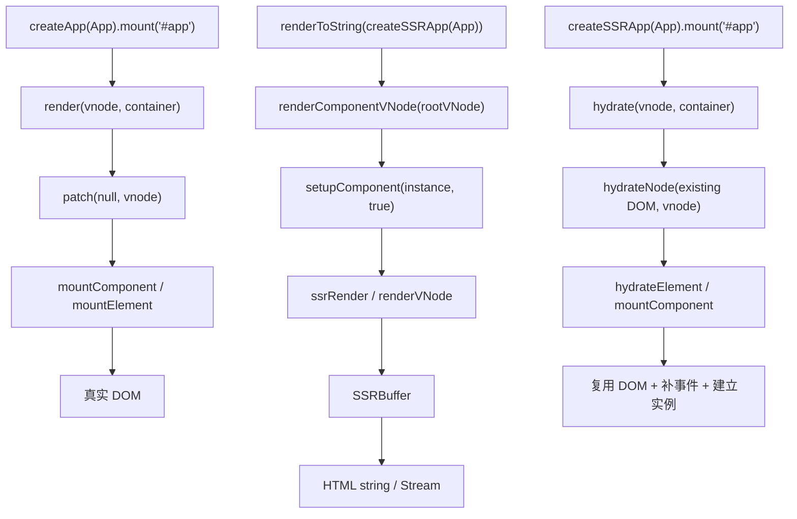
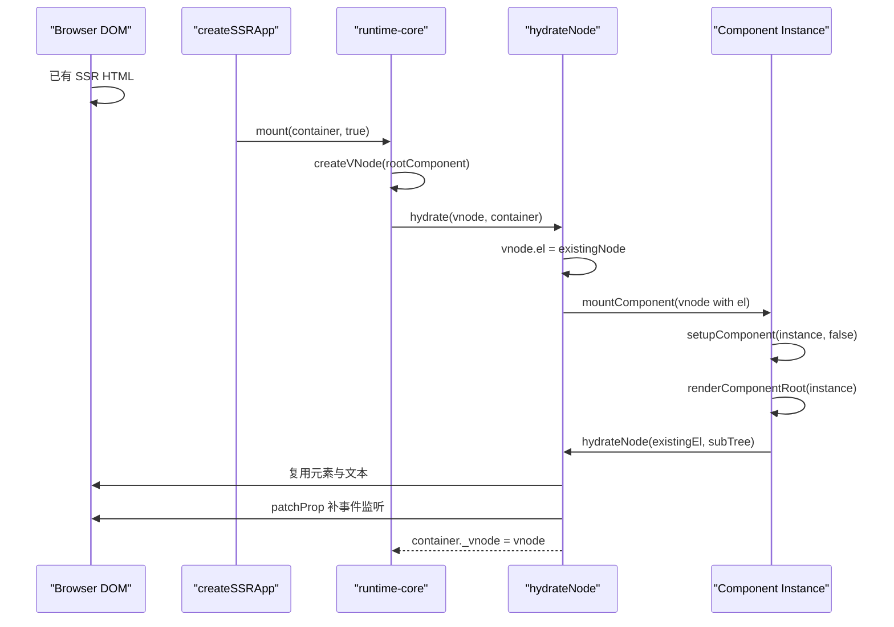

# Vue3 CSR / SSR / Hydration 核心差异源码对比

本文从源码角度对比 Vue3 的三条渲染路径：

- CSR：浏览器端从空容器创建真实 DOM。
- SSR：服务端把组件树渲染成 HTML 字符串或 Stream。
- Hydration：浏览器端复用服务端已经生成的 HTML，并补齐组件实例、事件监听与响应式更新能力。

## 1. 核心源码文件

| 主题 | 源码文件 | 重点 |
| --- | --- | --- |
| CSR / Hydration 入口 | `vue3/packages/runtime-dom/src/index.ts` | `createApp`、`createSSRApp`、`render`、`hydrate`。 |
| app.mount 分流 | `vue3/packages/runtime-core/src/apiCreateApp.ts` | `mount(container, isHydrate)` 根据 `isHydrate` 调 `hydrate` 或 `render`。 |
| CSR renderer | `vue3/packages/runtime-core/src/renderer.ts` | `render`、`patch`、`mountComponent`、`setupRenderEffect`、DOM patch。 |
| Hydration renderer | `vue3/packages/runtime-core/src/hydration.ts` | `hydrate`、`hydrateNode`、`hydrateElement`、mismatch 修复。 |
| DOM 操作适配 | `vue3/packages/runtime-dom/src/nodeOps.ts`、`patchProp.ts` | `createElement`、`insert`、`patchProp`、事件与属性更新。 |
| SSR 字符串入口 | `vue3/packages/server-renderer/src/renderToString.ts` | `renderToString`、`unrollBuffer`、Teleport resolve。 |
| SSR Stream 入口 | `vue3/packages/server-renderer/src/renderToStream.ts` | `renderToNodeStream`、`renderToWebStream`、`pipeToNodeWritable`、`pipeToWebWritable`。 |
| SSR vnode 渲染 | `vue3/packages/server-renderer/src/render.ts` | `renderComponentVNode`、`renderVNode`、`renderElementVNode`。 |
| 生命周期注册 | `vue3/packages/runtime-core/src/apiLifecycle.ts` | SSR 中除 `serverPrefetch` 外，setup 期间注册的 mount/update/unmount hooks 会 no-op。 |
| 组件 setup | `vue3/packages/runtime-core/src/component.ts` | `setupComponent(instance, isSSR)`、async setup 处理。 |
| 编译分流 | `vue3/packages/compiler-sfc/src/compileTemplate.ts` | `ssr ? CompilerSSR : CompilerDOM`。 |
| 客户端编译 | `vue3/packages/compiler-dom/src/index.ts`、`compiler-core/src/codegen.ts` | 生成 `render(_ctx, _cache)`，返回 vnode。 |
| SSR 编译 | `vue3/packages/compiler-ssr/src/index.ts`、`ssrCodegenTransform.ts` | 生成 `ssrRender(_ctx, _push, _parent, _attrs)`，写 HTML。 |

## 2. CSR / SSR / Hydration 对比表

| 对比项 | CSR | SSR | Hydration |
| --- | --- | --- | --- |
| 入口 API | `createApp(App).mount('#app')` | `createSSRApp(App)` + `renderToString(app)` / Stream API | `createSSRApp(App).mount('#app')` |
| 所在环境 | 浏览器 | Node / Web runtime 服务端 | 浏览器 |
| renderer | `runtime-dom` 创建的普通 renderer | `server-renderer` 的字符串 renderer | `runtime-dom` 创建的 hydration renderer |
| 渲染目标 | 真实 DOM | HTML string / Node Stream / Web Stream | 已存在的服务端 DOM |
| 根 vnode 来源 | `createVNode(rootComponent, rootProps)` | `createVNode(input._component, input._props)` | `createVNode(rootComponent, rootProps)` |
| vnode 处理 | `patch(null, vnode, container)` | `renderVNode(push, vnode, instance)` | `hydrateNode(existingNode, vnode, ...)` |
| 元素处理 | `hostCreateElement` + `patchProp` + `hostInsert` | 拼接 `<tag attrs>children</tag>` | 复用已有元素，只补必要 props / event |
| 组件处理 | `mountComponent` 后创建 render effect | `renderComponentVNode` 创建实例并执行 `ssrRender` | `mountComponent` 创建实例，`setupRenderEffect` 内 hydrate 子树 |
| `setup` 是否执行 | 执行 | 执行，`setupComponent(instance, true)` | 执行，客户端重新建立组件实例 |
| async setup | 依赖 Suspense；无 Suspense 会警告 / 等待边界 | server-renderer 等待 Promise 后继续渲染 | hydrate 期间依赖 Suspense / async wrapper 逻辑接管 |
| mount/update hooks | 客户端正常注册并调度 | setup 中除 `onServerPrefetch` 外的后置生命周期注册 no-op | 客户端会注册并在 hydrate 后调度 mounted |
| `onServerPrefetch` | 不用于 CSR | 会收集到 `instance.sp` 并被 await | 客户端 hydration 不执行服务端 prefetch |
| 编译产物 | `render(_ctx, _cache)` 返回 vnode | `ssrRender(_ctx, _push, _parent, _attrs)` 写 HTML | 客户端仍需要 `render` 来生成 vnode 与服务端 DOM 对齐 |
| 更新能力 | 初次挂载后已有响应式 render effect | 只产出 HTML，本身不具备浏览器交互能力 | hydrate 完成后获得与 CSR 类似的更新能力 |
| mismatch | 不涉及 | 不涉及客户端 DOM 对比 | 检测 DOM / vnode 不一致，警告并局部修复或挂载缺失节点 |

## 3. 入口 API 差异

### createApp

`runtime-dom/src/index.ts` 中的 `createApp` 使用普通 renderer：

```text
createApp(...)
  -> ensureRenderer()
    -> createRenderer(rendererOptions)
  -> app.mount(container)
    -> container.textContent = ''
    -> mount(container, false, namespace)
```

关键点：

- `createApp` 挂载前会清空容器内容。
- 传给 core `mount` 的第二个参数是 `false`，表示不是 hydration。
- 之后进入 `render(vnode, container)`，由 `patch` 创建真实 DOM。

### createSSRApp

同一个 `runtime-dom/src/index.ts` 中的 `createSSRApp` 使用 hydration renderer：

```text
createSSRApp(...)
  -> ensureHydrationRenderer()
    -> createHydrationRenderer(rendererOptions)
  -> app.mount(container)
    -> mount(container, true, namespace)
```

关键点：

- 客户端 `createSSRApp().mount()` 不清空容器。
- 第二个参数传 `true`，让 `apiCreateApp.mount` 进入 `hydrate(vnode, container)`。
- 这就是客户端接管服务端 HTML 的入口。

### renderToString

`server-renderer/src/renderToString.ts` 中的 `renderToString` 是服务端入口：

```text
renderToString(app, context)
  -> createVNode(app._component, app._props)
  -> vnode.appContext = app._context
  -> app.provide(ssrContextKey, context)
  -> renderComponentVNode(vnode)
  -> unrollBuffer(buffer)
  -> resolveTeleports(context)
  -> return html
```

它不会创建 DOM，而是创建根 vnode，把 vnode 交给 `server-renderer` 渲染成 buffer，最后展开为字符串。

### hydrate

`runtime-core/src/hydration.ts` 中的 `hydrate` 是 hydration renderer 的根入口：

```text
hydrate(vnode, container)
  -> 如果 container 为空：patch(null, vnode, container)，退化为完整挂载
  -> 否则：hydrateNode(container.firstChild, vnode, null, null, null)
  -> flushPostFlushCbs()
  -> container._vnode = vnode
```

## 4. 三条调用链

### 4.1 CSR 首次渲染调用链

```text
createApp(App).mount('#app')
  -> runtime-dom createApp
  -> ensureRenderer().createApp()
  -> app.mount(container)
  -> createVNode(rootComponent, rootProps)
  -> render(vnode, container)
  -> patch(null, vnode, container)
  -> processComponent()
  -> mountComponent()
  -> createComponentInstance()
  -> setupComponent(instance, false)
  -> setupRenderEffect()
  -> componentUpdateFn()
  -> renderComponentRoot(instance)
  -> patch(null, subTree, container)
  -> processElement()
  -> mountElement()
  -> hostCreateElement()
  -> patchProp()
  -> hostInsert()
```

CSR 的核心是把 vnode patch 成真实 DOM。第一次挂载时 `n1` 是 `null`，所以走 mount 分支。

### 4.2 SSR 字符串 / Stream 渲染调用链

```text
const app = createSSRApp(App)
await renderToString(app)
  -> createVNode(app._component, app._props)
  -> renderComponentVNode(rootVNode)
  -> createComponentInstance()
  -> setupComponent(instance, true)
  -> 等待 async setup / serverPrefetch
  -> renderComponentSubTree(instance)
  -> 执行 comp.ssrRender 或 fallback 到 renderVNode
  -> _push("<div>")
  -> renderVNode / renderElementVNode / renderComponentVNode
  -> createBuffer()
  -> unrollBuffer()
  -> HTML string
```

Stream API 的前半段相同，差异在结果展开方式：

```text
renderToNodeStream / renderToWebStream / pipeToNodeWritable
  -> renderToSimpleStream()
  -> renderComponentVNode(vnode)
  -> unrollBuffer(buffer, stream)
  -> stream.push(chunk)
```

SSR 的核心是把 vnode / ssrRender 结果写入 buffer 或 stream，不涉及 DOM API。

### 4.3 Hydration 调用链

```text
createSSRApp(App).mount('#app')
  -> runtime-dom createSSRApp
  -> ensureHydrationRenderer().createApp()
  -> app.mount(container)
  -> createVNode(rootComponent, rootProps)
  -> hydrate(vnode, container)
  -> hydrateNode(container.firstChild, vnode)
  -> process component branch
  -> mountComponent(initialVNode with existing el)
  -> setupComponent(instance, false)
  -> setupRenderEffect()
  -> renderComponentRoot(instance)
  -> hydrateNode(existingEl, instance.subTree)
  -> hydrateElement()
  -> hydrateChildren()
  -> patchProp() 补事件 / 特殊属性
  -> vnode.el / instance.subTree.el 指向已有 DOM
```

Hydration 的核心是“先生成客户端 vnode，再让 vnode 认领服务端 DOM”。

## 5. renderer 差异

### runtime-dom renderer

`runtime-dom` 本质是给 `runtime-core` 注入平台操作：

```text
rendererOptions = {
  ...nodeOps,
  patchProp
}
```

其中：

- `nodeOps.createElement` 创建真实 DOM。
- `nodeOps.insert` 插入 DOM。
- `nodeOps.remove` 删除 DOM。
- `patchProp` 处理 class、style、attrs、DOM props、event listener。

`createRenderer(rendererOptions)` 得到普通 renderer，负责 CSR。

### hydration renderer

`createHydrationRenderer(rendererOptions)` 仍然使用 DOM 平台能力，但额外创建：

```text
createHydrationFunctions(rendererInternals)
  -> hydrate
  -> hydrateNode
```

它依赖 core renderer 的内部能力，例如：

- `mt: mountComponent`
- `p: patch`
- `patchProp`
- `nextSibling`
- `parentNode`
- `remove`
- `insert`

这说明 hydration 不是另一个独立框架，而是复用普通 renderer 的组件挂载、patch 与 DOM 操作能力。

### server-renderer

`server-renderer` 不使用 `nodeOps`，也不调用 `document.createElement`。它的核心操作是：

```text
push("<div>")
push(escapeHtml(text))
push("</div>")
```

`render.ts` 中 `renderVNode` 根据 vnode 类型分发：

| vnode 类型 | SSR 处理 |
| --- | --- |
| `Text` | `push(escapeHtml(children))` |
| `Comment` | `push("<!--...-->")` |
| `Static` | 直接 push 静态内容 |
| `Fragment` | 输出 `<!--[-->` 和 `<!--]-->` 边界 |
| Element | `renderElementVNode` 拼接 open tag、attrs、children、close tag |
| Component | `renderComponentVNode` 递归渲染组件 |
| Teleport | 收集到 SSR context 的 teleport buffers |
| Suspense | SSR 渲染 `ssContent` |

## 6. 组件执行流程差异

### setup 是否执行

三条路径都会执行 `setup`，但执行上下文不同。

| 场景 | setup 调用 |
| --- | --- |
| CSR | `mountComponent -> setupComponent(instance, false)` |
| SSR | `renderComponentVNode -> setupComponent(instance, true)` |
| Hydration | `mountComponent -> setupComponent(instance, false)` |

SSR 传入 `isSSR = true`，`setupComponent` 会设置 `isInSSRComponentSetup`，影响生命周期注册、watch 行为、computed 行为等。

### 生命周期 hooks 哪些执行

`apiLifecycle.ts` 的 `createHook` 有一个关键判断：

```text
SSR setup 期间：
  除 SERVER_PREFETCH 外，post-create lifecycle registrations are noops
```

因此：

| Hook | CSR | SSR | Hydration |
| --- | --- | --- | --- |
| `setup` | 执行 | 执行 | 执行 |
| `onBeforeMount` | 执行 | 不注册 / 不执行 | 执行 |
| `onMounted` | DOM patch 后执行 | 不注册 / 不执行 | hydrate 后 post effect 执行 |
| `onBeforeUpdate` | 更新前执行 | 不注册 / 不执行 | 后续客户端更新时执行 |
| `onUpdated` | DOM 更新后执行 | 不注册 / 不执行 | 后续客户端更新后执行 |
| `onBeforeUnmount` | 卸载前执行 | 不注册 / 不执行 | 客户端卸载时执行 |
| `onUnmounted` | 卸载后执行 | 不注册 / 不执行 | 客户端卸载后执行 |
| `onServerPrefetch` | 基本不参与 CSR 渲染 | 注册并被 server-renderer await | 不作为 hydration hook 执行 |

SSR 不执行 mounted/update/unmount hooks 的原因很直接：服务端没有真实 DOM，也没有长期存在的组件实例生命周期。

### async setup 如何处理

CSR：

```text
setupComponent(instance, false)
  -> setup 返回 Promise
  -> instance.asyncDep = setupResult
  -> 需要 Suspense 边界协调
```

SSR：

```text
setupComponent(instance, true)
  -> setup 返回 Promise
  -> return Promise 给 server-renderer
  -> renderComponentVNode await async setup
  -> 再执行 renderComponentSubTree
```

源码上，`server-renderer/src/render.ts` 会把 `async setup` 与 `serverPrefetch` 合并等待：

```text
hasAsyncSetup || instance.sp
  -> Promise.resolve(setupResult)
  -> Promise.all(serverPrefetch hooks)
  -> renderComponentSubTree(instance)
```

Hydration：

- 客户端仍会重新执行 setup。
- 如果组件有 async setup，逻辑回到客户端 Suspense / async wrapper 分支。
- 已有 DOM 会尽量被保留，异步边界完成后继续接管或更新。

## 7. vnode 处理方式差异

### CSR：patch vnode 到 DOM

CSR 中 vnode 是 DOM 创建的蓝图：

```text
vnode
  -> patch
  -> processElement / processComponent
  -> mountElement / mountComponent
  -> hostCreateElement / hostInsert
  -> DOM
```

组件首次挂载时会创建 render effect。之后响应式数据变化会触发 `instance.update`，再走 `patch(oldSubTree, newSubTree)`。

### SSR：render vnode 到 HTML

SSR 中 vnode 是字符串渲染的中间结构：

```text
vnode
  -> renderVNode(push, vnode)
  -> renderElementVNode / renderComponentVNode
  -> push("<div>")
  -> push(children)
  -> push("</div>")
  -> SSRBuffer
```

如果组件有编译好的 `ssrRender`，会优先执行 `ssrRender`，少创建 vnode；如果没有，则 fallback 到普通 `renderComponentRoot -> renderVNode`。

### Hydration：vnode 认领已有 DOM

Hydration 中 vnode 是“校验与绑定已有 DOM”的结构：

```text
existing DOM
  + client vnode
  -> hydrateNode
  -> vnode.el = existingNode
  -> instance.subTree.el = existingElement
  -> 补事件监听 / 特殊 prop
  -> 后续更新复用普通 patch
```

## 8. Hydration 关键机制

### 客户端如何复用服务端 HTML

`hydrateNode` 一开始会做：

```text
vnode.el = node
```

这一步把客户端 vnode 和服务端 DOM 绑定起来。对组件来说，`hydrateNode` 会进入组件分支，调用 `mountComponent` 创建组件实例；随后 `setupRenderEffect` 发现初始 vnode 已经有 `el` 且存在 `hydrateNode`，就执行：

```text
instance.subTree = renderComponentRoot(instance)
hydrateNode(existingEl, instance.subTree, instance, ...)
```

也就是说，服务端 HTML 不是被清空重建，而是被客户端 vnode 树逐层认领。

### event listener 如何补齐

服务端 HTML 不能携带真实 JS 函数，所以事件监听一定发生在客户端 hydration。

`hydrateElement` 遍历 props 时会判断：

```text
isOn(key) && !isReservedProp(key)
  -> patchProp(el, key, null, props[key], ..., parentComponent)
```

这会把 `onClick`、`onInput` 等事件监听补到已有 DOM 上。为了性能，源码还有 `props.onClick` 的 fast path，避免常见点击事件场景遍历全部 props。

### mismatch 如何处理

Hydration mismatch 分几类：

| mismatch 类型 | 处理方式 |
| --- | --- |
| 文本不一致 | 警告后把 DOM text 改成客户端 vnode 期望值。 |
| children 多了 | 删除服务端多余 DOM 节点。 |
| children 少了 | 调 `patch(null, vnode, container)` 挂载缺失节点。 |
| 节点类型不一致 | `handleMismatch` 删除错误节点，再普通 mount 当前 vnode。 |
| fragment 缺少结束锚点 | 插入 `]` 注释锚点。 |
| class/style/attr 不一致 | 开发模式或开启细节时警告；部分属性会修正。 |

`handleMismatch` 的关键逻辑是：

```text
vnode.el = null
remove(serverNode)
patch(null, vnode, container, next)
parentComponent.vnode.el = vnode.el
```

所以 hydration 失败不是整棵树必然重挂，而是尽量局部修复。

## 9. 编译差异：render vs ssrRender

`compiler-sfc/src/compileTemplate.ts` 会根据 `ssr` 选项选择编译器：

```text
defaultCompiler = ssr ? CompilerSSR : CompilerDOM
```

`compiler-core/src/codegen.ts` 中函数签名也按 `ssr` 分流：

```text
ssr = false -> function render(_ctx, _cache)
ssr = true  -> function ssrRender(_ctx, _push, _parent, _attrs)
```

### 普通 render

客户端 render 的目标是返回 vnode：

```js
function render(_ctx, _cache) {
  return _createElementVNode("div", null, _toDisplayString(_ctx.msg), 1)
}
```

运行时再通过 `patch` 把 vnode 变成 DOM。

### ssrRender

SSR render 的目标是直接写 HTML：

```js
function ssrRender(_ctx, _push, _parent, _attrs) {
  _push(`<div>${_ssrInterpolate(_ctx.msg)}</div>`)
}
```

`compiler-ssr/src/index.ts` 会强制 `ssr: true`、`inSSR: true`，并关闭 `cacheHandlers` 与 `hoistStatic`。因为服务端首屏渲染不走客户端 diff 热路径，最重要的是字符串生成、转义安全和 hydration 边界一致。

## 10. Mermaid：三条路径总览



## 11. Mermaid：Hydration 接管过程



## 12. 设计思想总结

Vue3 把 CSR、SSR、Hydration 拆成三条目标不同但共享抽象的路径。

CSR 的目标是“创建并持续更新 DOM”，所以它围绕 `patch`、组件 render effect、scheduler、DOM 操作展开。SSR 的目标是“快速生成 HTML”，所以它绕开 DOM API，把组件树渲染成 buffer / stream，并用 `ssrRender` 优化字符串直出。Hydration 的目标是“低成本接管 HTML”，所以它不清空服务端 DOM，而是让客户端 vnode 逐层认领已有节点，再补齐事件监听和组件实例。

这三个模式共享组件模型、vnode、setup、props、slots、appContext，但在 renderer 层分开：

```text
runtime-core 提供跨平台组件与 vnode 机制
runtime-dom 提供浏览器 DOM renderer 和 hydration renderer
server-renderer 提供服务端字符串 renderer
compiler-dom 生成客户端 render
compiler-ssr 生成服务端 ssrRender
```

最值得学习的设计点是：Vue3 没有把 SSR 做成 CSR 的模拟执行，而是把“平台目标”抽象出来。浏览器目标是 DOM patch，服务端目标是字符串输出，hydration 目标是 DOM 认领。这样既复用了组件模型，又避免在服务端做无意义的 DOM 工作。
