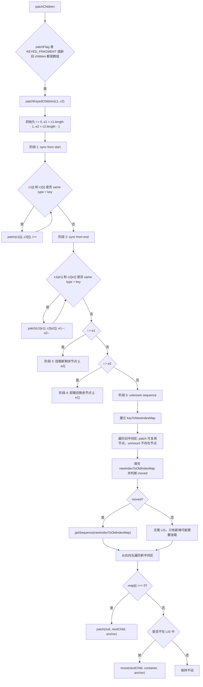
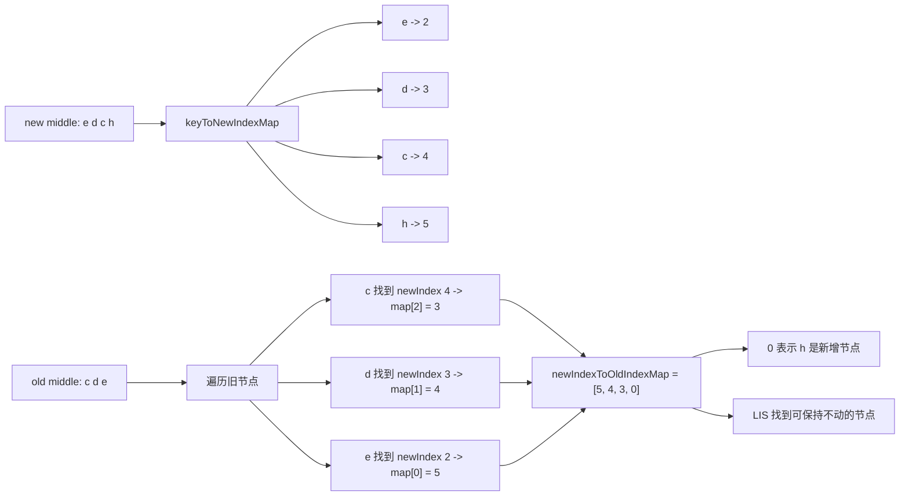

# Vue3 diff 算法源码深入分析：patchKeyedChildren

本文基于当前仓库 `vue3` 源码整理，重点分析 Vue3 多节点 diff 的核心函数 `patchKeyedChildren`：它从哪里被调用、五大阶段如何推进、`keyToNewIndexMap` 与 `newIndexToOldIndexMap` 的作用、最长递增子序列 LIS 如何减少 DOM 移动，以及 Vue3 diff 与 Vue2、React diff 的差异。

## 一、涉及源码文件

| 文件 | 作用 |
| --- | --- |
| `vue3/packages/runtime-core/src/renderer.ts` | `patchChildren`、`patchKeyedChildren`、`patchUnkeyedChildren`、`move`、`getSequence` |
| `vue3/packages/runtime-core/src/vnode.ts` | `isSameVNodeType`，判断两个 vnode 是否可以复用 |
| `vue3/packages/shared/src/patchFlags.ts` | `KEYED_FRAGMENT`、`UNKEYED_FRAGMENT` 等编译器优化标记 |
| `vue3/packages/runtime-core/src/renderer.ts` 的 `patch` | `patchKeyedChildren` 内部仍会递归调用 `patch` 更新可复用节点 |

## 二、Vue3 diff 的入口在哪里？

广义的 diff 入口是 `patch`：

```text
packages/runtime-core/src/renderer.ts
```

`patch` 根据 vnode 类型分发。对于普通元素更新，会进入：

```text
patch(oldVNode, newVNode, container)
  -> processElement(oldVNode, newVNode)
    -> patchElement(oldVNode, newVNode)
      -> patchChildren(oldVNode, newVNode, el, ...)
```

`patchChildren` 是 children diff 的入口。

源码中的关键逻辑：

```ts
const patchChildren: PatchChildrenFn = (
  n1,
  n2,
  container,
  anchor,
  parentComponent,
  parentSuspense,
  namespace,
  slotScopeIds,
  optimized = false,
) => {
  const c1 = n1 && n1.children
  const prevShapeFlag = n1 ? n1.shapeFlag : 0
  const c2 = n2.children

  const { patchFlag, shapeFlag } = n2

  if (patchFlag > 0) {
    if (patchFlag & PatchFlags.KEYED_FRAGMENT) {
      patchKeyedChildren(c1 as VNode[], c2 as VNodeArrayChildren, ...)
      return
    } else if (patchFlag & PatchFlags.UNKEYED_FRAGMENT) {
      patchUnkeyedChildren(c1 as VNode[], c2 as VNodeArrayChildren, ...)
      return
    }
  }

  if (shapeFlag & ShapeFlags.TEXT_CHILDREN) {
    // text children
  } else {
    if (prevShapeFlag & ShapeFlags.ARRAY_CHILDREN) {
      if (shapeFlag & ShapeFlags.ARRAY_CHILDREN) {
        patchKeyedChildren(c1 as VNode[], c2 as VNodeArrayChildren, ...)
      } else {
        unmountChildren(...)
      }
    } else {
      // mount array children or clear text
    }
  }
}
```

所以 `patchKeyedChildren` 的调用入口有两类：

1. 编译器明确标记为 `KEYED_FRAGMENT`。
2. 新旧 children 都是数组，运行时无法直接用文本或空节点路径处理，于是进入完整数组 diff。

## 三、patchKeyedChildren 调用链

直接调用链：

```text
组件状态变化 / 父组件重新渲染
  -> renderComponentRoot(instance)
  -> patch(prevTree, nextTree, container)
    -> processElement
      -> patchElement
        -> patchChildren
          -> patchKeyedChildren
```

另一条常见入口是根组件首次挂载后的后续更新：

```text
createApp(App).mount('#app')
  -> render(rootVNode, container)
  -> patch(null, rootVNode, container)
  -> 组件挂载并建立 render effect
  -> 响应式状态变化
  -> 组件 render effect 重新执行
  -> patch(prevTree, nextTree, container)
  -> patchChildren
  -> patchKeyedChildren
```

## 四、patchKeyedChildren 解决什么问题？

`patchKeyedChildren` 解决的是：

```text
同一个父节点下，新旧两组 vnode children 都是数组时，如何用尽量少的 DOM 操作，把旧 children 更新成新 children。
```

它要同时处理：

1. 节点内容更新：同 key 同 type 的 vnode 可以复用，但 props / children 可能要更新。
2. 节点新增：新数组里有、旧数组里没有的 vnode 要挂载。
3. 节点删除：旧数组里有、新数组里没有的 vnode 要卸载。
4. 节点移动：同一个节点在新数组里的位置变了，要移动真实 DOM。
5. 尽量减少移动：不是所有乱序节点都需要移动，保持最长稳定子序列不动即可。

判断两个 vnode 是否可以复用，依赖 `isSameVNodeType`：

```ts
export function isSameVNodeType(n1: VNode, n2: VNode): boolean {
  return n1.type === n2.type && n1.key === n2.key
}
```

核心结论：

```text
key 不只是列表警告的工具。
key 是 patchKeyedChildren 判断节点身份的核心依据。
```

如果两个 vnode 的 `type` 和 `key` 相同，Vue 会复用旧 DOM，并通过 `patch(n1, n2, ...)` 更新它。否则 Vue 会把它们当作不同节点。

## 五、patchKeyedChildren 参数

源码签名：

```ts
const patchKeyedChildren = (
  c1: VNode[],
  c2: VNodeArrayChildren,
  container: RendererElement,
  parentAnchor: RendererNode | null,
  parentComponent: ComponentInternalInstance | null,
  parentSuspense: SuspenseBoundary | null,
  namespace: ElementNamespace,
  slotScopeIds: string[] | null,
  optimized: boolean,
) => {
  // ...
}
```

参数说明：

| 参数 | 含义 |
| --- | --- |
| `c1` | 旧 children 数组 |
| `c2` | 新 children 数组 |
| `container` | 父 DOM 容器 |
| `parentAnchor` | 父级插入锚点 |
| `parentComponent` | 父组件实例 |
| `parentSuspense` | Suspense 边界 |
| `namespace` | DOM 命名空间 |
| `slotScopeIds` | scoped slot 样式相关 |
| `optimized` | 是否处于编译器优化路径 |

函数内部首先定义三个索引：

```ts
let i = 0
const l2 = c2.length
let e1 = c1.length - 1 // prev ending index
let e2 = l2 - 1        // next ending index
```

含义：

```text
i  = 当前从左向右扫描的位置
e1 = 旧 children 当前右边界
e2 = 新 children 当前右边界
```

后面的五个阶段，本质上就是不断收缩 `[i, e1]` 和 `[i, e2]` 这两个待处理区间。

## 六、Vue3 多节点 diff 分为哪几个阶段？

源码注释把 `patchKeyedChildren` 分为五大阶段：

| 阶段 | 源码注释 | 目标 |
| --- | --- | --- |
| 1 | `sync from start` | 从左到右同步相同前缀 |
| 2 | `sync from end` | 从右到左同步相同后缀 |
| 3 | `common sequence + mount` | 旧节点处理完，新节点还有剩余，挂载新增节点 |
| 4 | `common sequence + unmount` | 新节点处理完，旧节点还有剩余，卸载多余旧节点 |
| 5 | `unknown sequence` | 中间乱序区，处理复用、删除、新增、移动 |

对应源码结构：

```ts
// 1. sync from start
while (i <= e1 && i <= e2) {
  // ...
}

// 2. sync from end
while (i <= e1 && i <= e2) {
  // ...
}

// 3. common sequence + mount
if (i > e1) {
  // mount new
}

// 4. common sequence + unmount
else if (i > e2) {
  // unmount old
}

// 5. unknown sequence
else {
  // keyToNewIndexMap
  // newIndexToOldIndexMap
  // patch / unmount
  // LIS
  // move / mount
}
```

它的思路很直接：

```text
先处理最容易确认的两端。
如果两端处理后只剩新增或删除，直接完成。
如果中间仍然乱序，再进入成本更高的映射和移动阶段。
```

## 七、阶段一：从左到右同步比较

源码：

```ts
// 1. sync from start
while (i <= e1 && i <= e2) {
  const n1 = c1[i]
  const n2 = (c2[i] = optimized
    ? cloneIfMounted(c2[i] as VNode)
    : normalizeVNode(c2[i]))
  if (isSameVNodeType(n1, n2)) {
    patch(
      n1,
      n2,
      container,
      null,
      parentComponent,
      parentSuspense,
      namespace,
      slotScopeIds,
      optimized,
    )
  } else {
    break
  }
  i++
}
```

流程：

```text
从下标 0 开始比较 c1[i] 和 c2[i]
如果 type + key 相同：
  -> 调用 patch 更新这个节点
  -> i++
如果不同：
  -> 停止前缀同步
```

示例：

```text
old: [a, b, c]
new: [a, b, d, e]
```

比较过程：

```text
i = 0: old a vs new a，相同 -> patch(a, a)，i++
i = 1: old b vs new b，相同 -> patch(b, b)，i++
i = 2: old c vs new d，不同 -> break
```

此时：

```text
i = 2
old 剩余: [c]
new 剩余: [d, e]
```

为什么要先做左侧同步？

因为很多列表更新只是尾部追加、尾部删除，或者前半段稳定。前缀同步能用很低成本跳过已经稳定的节点。

## 八、阶段二：从右到左同步比较

源码：

```ts
// 2. sync from end
while (i <= e1 && i <= e2) {
  const n1 = c1[e1]
  const n2 = (c2[e2] = optimized
    ? cloneIfMounted(c2[e2] as VNode)
    : normalizeVNode(c2[e2]))
  if (isSameVNodeType(n1, n2)) {
    patch(
      n1,
      n2,
      container,
      null,
      parentComponent,
      parentSuspense,
      namespace,
      slotScopeIds,
      optimized,
    )
  } else {
    break
  }
  e1--
  e2--
}
```

流程：

```text
从右边界开始比较 c1[e1] 和 c2[e2]
如果 type + key 相同：
  -> patch(n1, n2)
  -> e1--, e2--
如果不同：
  -> 停止后缀同步
```

示例：

```text
old: [a, b, c]
new: [d, e, b, c]
```

前缀同步：

```text
i = 0: old a vs new d，不同 -> break
```

后缀同步：

```text
e1 = 2, e2 = 3: old c vs new c，相同 -> patch(c, c)，e1--, e2--
e1 = 1, e2 = 2: old b vs new b，相同 -> patch(b, b)，e1--, e2--
e1 = 0, e2 = 1: old a vs new e，不同 -> break
```

此时：

```text
old 剩余: [a]
new 剩余: [d, e]
```

右侧同步对头部插入很有帮助。例如列表前面插入新节点时，尾部大部分节点都能直接复用。

## 九、阶段三：新节点多了如何挂载？

如果左右同步后，旧 children 已经处理完，但新 children 还有剩余：

```ts
if (i > e1) {
  if (i <= e2) {
    const nextPos = e2 + 1
    const anchor = nextPos < l2 ? (c2[nextPos] as VNode).el : parentAnchor
    while (i <= e2) {
      patch(
        null,
        (c2[i] = optimized
          ? cloneIfMounted(c2[i] as VNode)
          : normalizeVNode(c2[i])),
        container,
        anchor,
        parentComponent,
        parentSuspense,
        namespace,
        slotScopeIds,
        optimized,
      )
      i++
    }
  }
}
```

判断条件：

```text
i > e1
```

含义：

```text
旧数组的待处理区间已经空了。
新数组 [i, e2] 中的节点都是新增节点。
```

示例一：尾部新增

```text
old: [a, b]
new: [a, b, c]
```

前缀同步后：

```text
i = 2
e1 = 1
e2 = 2
i > e1，旧节点处理完
new 剩余: [c]
```

挂载：

```text
patch(null, c, container, anchor)
```

这里 `anchor` 是：

```ts
const nextPos = e2 + 1
const anchor = nextPos < l2 ? c2[nextPos].el : parentAnchor
```

尾部新增时，`nextPos === l2`，所以：

```text
anchor = parentAnchor
```

通常就是追加到末尾。

示例二：头部新增

```text
old: [b, c]
new: [a, b, c]
```

前缀不同，后缀同步掉 `b`、`c` 后：

```text
i = 0
e1 = -1
e2 = 0
new 剩余: [a]
```

挂载 `a` 时：

```text
nextPos = e2 + 1 = 1
anchor = c2[1].el = b.el
patch(null, a, container, b.el)
```

结果是把 `a` 插入到 `b` 前面。

这就是为什么新增节点挂载时需要 anchor。

## 十、阶段四：旧节点多了如何卸载？

如果左右同步后，新 children 已经处理完，但旧 children 还有剩余：

```ts
else if (i > e2) {
  while (i <= e1) {
    unmount(c1[i], parentComponent, parentSuspense, true)
    i++
  }
}
```

判断条件：

```text
i > e2
```

含义：

```text
新数组待处理区间已经空了。
旧数组 [i, e1] 中的节点都不再需要。
```

示例：

```text
old: [a, b, c]
new: [a]
```

前缀同步：

```text
a 相同 -> patch(a, a)
i = 1
```

此时：

```text
e1 = 2
e2 = 0
i > e2
old 剩余: [b, c]
```

执行：

```text
unmount(b)
unmount(c)
```

## 十一、阶段五：中间乱序节点如何处理？

如果前四个阶段都不能直接结束，说明中间存在乱序、新增、删除混合的区间：

```text
old: a b [c d e] f g
new: a b [e d c h] f g
```

前缀同步掉：

```text
a, b
```

后缀同步掉：

```text
f, g
```

剩下：

```text
old middle: [c, d, e]
new middle: [e, d, c, h]
```

源码进入：

```ts
else {
  const s1 = i // prev starting index
  const s2 = i // next starting index

  // 5.1 build key:index map for newChildren
  const keyToNewIndexMap: Map<PropertyKey, number> = new Map()

  // 5.2 loop through old children left to be patched
  // ...

  // 5.3 move and mount
  // ...
}
```

第五阶段又可以拆成三步：

| 子阶段 | 目标 |
| --- | --- |
| 5.1 | 建立新节点 key 到新下标的映射 |
| 5.2 | 遍历旧节点，找可复用节点，删除不存在的旧节点，填充 `newIndexToOldIndexMap` |
| 5.3 | 从右向左挂载新增节点，并移动需要移动的旧节点 |

## 十二、keyToNewIndexMap 是什么？

源码：

```ts
const keyToNewIndexMap: Map<PropertyKey, number> = new Map()
for (i = s2; i <= e2; i++) {
  const nextChild = (c2[i] = optimized
    ? cloneIfMounted(c2[i] as VNode)
    : normalizeVNode(c2[i]))
  if (nextChild.key != null) {
    if (__DEV__ && keyToNewIndexMap.has(nextChild.key)) {
      warn(`Duplicate keys found during update:`, JSON.stringify(nextChild.key))
    }
    keyToNewIndexMap.set(nextChild.key, i)
  }
}
```

它的结构：

```text
Map<newVNode.key, newIndex>
```

作用：

```text
给定旧节点 prevChild.key，快速查出它在新 children 中的位置。
```

示例：

```text
new middle: [e, d, c, h]
新数组真实下标: e=2, d=3, c=4, h=5
```

得到：

```text
keyToNewIndexMap = {
  e -> 2,
  d -> 3,
  c -> 4,
  h -> 5
}
```

为什么只对新 children 建 map？

因为第五阶段的目标是判断旧节点是否还能在新节点中找到对应位置。遍历旧节点时，用旧节点的 key 去新 map 里查：

```ts
if (prevChild.key != null) {
  newIndex = keyToNewIndexMap.get(prevChild.key)
}
```

如果查不到：

```text
旧节点在新数组中不存在 -> unmount
```

如果查到了：

```text
旧节点可以复用 -> patch(prevChild, c2[newIndex])
```

## 十三、newIndexToOldIndexMap 是什么？

源码：

```ts
const toBePatched = e2 - s2 + 1
const newIndexToOldIndexMap = new Array(toBePatched)
for (i = 0; i < toBePatched; i++) newIndexToOldIndexMap[i] = 0
```

源码注释说得很关键：

```ts
// works as Map<newIndex, oldIndex>
// Note that oldIndex is offset by +1
// and oldIndex = 0 is a special value indicating the new node has
// no corresponding old node.
// used for determining longest stable subsequence
```

它的含义：

```text
newIndexToOldIndexMap[新节点在中间区的相对下标] = 旧节点下标 + 1
```

为什么旧下标要 `+1`？

因为数组初始值 `0` 要作为特殊标记：

```text
0 表示这个新节点没有对应旧节点，需要新增挂载。
```

如果直接存旧下标，旧下标可能就是 `0`，会和“无旧节点”冲突，所以 Vue 存 `oldIndex + 1`。

示例：

```text
old: [a, b, c, d, e, f, g]
new: [a, b, e, d, c, h, f, g]
```

同步后：

```text
前缀: a, b
后缀: f, g

old middle: [c, d, e]       old 下标: c=2, d=3, e=4
new middle: [e, d, c, h]    new 下标: e=2, d=3, c=4, h=5

s1 = 2
s2 = 2
e1 = 4
e2 = 5
toBePatched = e2 - s2 + 1 = 4
```

初始化：

```text
newIndexToOldIndexMap = [0, 0, 0, 0]
```

遍历旧 middle：

```text
prevChild c，oldIndex = 2
  -> keyToNewIndexMap.get(c) = 4
  -> relativeIndex = 4 - s2 = 2
  -> newIndexToOldIndexMap[2] = oldIndex + 1 = 3

prevChild d，oldIndex = 3
  -> newIndex = 3
  -> relativeIndex = 1
  -> newIndexToOldIndexMap[1] = 4

prevChild e，oldIndex = 4
  -> newIndex = 2
  -> relativeIndex = 0
  -> newIndexToOldIndexMap[0] = 5
```

最终：

```text
newIndexToOldIndexMap = [5, 4, 3, 0]
```

含义：

```text
new middle[0] = e，对应 oldIndex 4，所以值是 5
new middle[1] = d，对应 oldIndex 3，所以值是 4
new middle[2] = c，对应 oldIndex 2，所以值是 3
new middle[3] = h，没有旧节点，所以值是 0
```

这个数组后面有两个用途：

1. 值为 `0` 的位置要挂载新节点。
2. 非 `0` 的位置可以参与 LIS，用来判断哪些旧节点可以不移动。

## 十四、moved 标记是如何判断的？

源码：

```ts
let moved = false
let maxNewIndexSoFar = 0

// ...

if (newIndex >= maxNewIndexSoFar) {
  maxNewIndexSoFar = newIndex
} else {
  moved = true
}
```

它发生在遍历旧节点，并找到旧节点对应的新位置时：

```ts
for (i = s1; i <= e1; i++) {
  const prevChild = c1[i]
  let newIndex = keyToNewIndexMap.get(prevChild.key)

  if (newIndex === undefined) {
    unmount(prevChild, ...)
  } else {
    newIndexToOldIndexMap[newIndex - s2] = i + 1
    if (newIndex >= maxNewIndexSoFar) {
      maxNewIndexSoFar = newIndex
    } else {
      moved = true
    }
    patch(prevChild, c2[newIndex] as VNode, ...)
  }
}
```

含义：

```text
按旧 children 顺序遍历时，如果找到的新下标一直递增，说明相对顺序没变，不需要移动。
一旦某个节点的新下标比之前见过的最大新下标还小，说明有节点发生了相对位置倒退，存在移动。
```

示例一：没有移动

```text
old middle: [c, d, e]
new middle: [c, d, e, h]
```

遍历旧节点得到新下标：

```text
c -> 2
d -> 3
e -> 4
```

序列一直递增：

```text
2, 3, 4
```

所以：

```text
moved = false
```

只需要挂载新节点 `h`。

示例二：发生移动

```text
old middle: [c, d, e]
new middle: [e, d, c, h]
```

遍历旧节点得到新下标：

```text
c -> 4
d -> 3
e -> 2
```

`d` 的新下标 `3` 小于已经见过的最大新下标 `4`，说明顺序倒退：

```text
moved = true
```

此时才需要计算 LIS。

## 十五、最长递增子序列 LIS 在 Vue3 diff 中起什么作用？

源码：

```ts
const increasingNewIndexSequence = moved
  ? getSequence(newIndexToOldIndexMap)
  : EMPTY_ARR
```

`getSequence` 返回的是：

```text
newIndexToOldIndexMap 中最长递增子序列对应的下标列表
```

不是返回 vnode，也不是返回 key。

为什么要计算 LIS？

因为：

```text
newIndexToOldIndexMap 的非零值表示旧节点在旧数组里的顺序。
如果这些值在新数组顺序中仍然递增，说明这些节点的相对顺序已经稳定，可以不移动。
```

所以 LIS 的作用是：

```text
找出可以保持原地不动的最长一组旧节点。
其他节点再移动到正确位置。
```

这样可以最小化移动次数。

## 十六、LIS 示例

继续使用这个例子：

```text
old: [a, b, c, d, e, f, g]
new: [a, b, e, d, c, h, f, g]
```

中间区：

```text
old middle: [c, d, e]
new middle: [e, d, c, h]
```

前面算出：

```text
newIndexToOldIndexMap = [5, 4, 3, 0]
```

去掉 `0` 后看旧下标顺序：

```text
5, 4, 3
```

这是递减序列，最长递增子序列长度为 1。源码的 `getSequence` 返回的是索引，比如可能保留：

```text
increasingNewIndexSequence = [2]
```

含义：

```text
new middle[2] = c 可以作为稳定节点不移动。
```

为什么只保留 `c` 也能得到正确结果？

当前旧 DOM 顺序：

```text
a b c d e f g
```

目标新顺序：

```text
a b e d c h f g
```

从右向左处理：

```text
new middle: [e, d, c, h]
```

1. `h` 的 map 值是 `0`，挂载到 `f` 前面：

```text
a b c d e h f g
```

2. `c` 在 LIS 中，不移动：

```text
a b c d e h f g
```

3. `d` 不在 LIS 中，移动到 `c` 前面：

```text
a b d c e h f g
```

4. `e` 不在 LIS 中，移动到 `d` 前面：

```text
a b e d c h f g
```

完成。

再看一个更能体现 LIS 的例子：

```text
old middle: [a, b, c, d, e]
new middle: [b, c, a, d, e]
```

映射关系：

```text
new order 中对应的 oldIndex + 1:
b -> 2
c -> 3
a -> 1
d -> 4
e -> 5

newIndexToOldIndexMap = [2, 3, 1, 4, 5]
```

最长递增子序列可以是：

```text
[2, 3, 4, 5]
```

对应新数组位置：

```text
b, c, d, e
```

这几个节点相对顺序稳定，不需要移动。只需要把 `a` 移动到 `c` 后面即可。

如果没有 LIS，可能会移动多个节点；有 LIS 后，Vue 只移动不在稳定序列中的节点。

## 十七、getSequence 做了什么？

源码位置在 `renderer.ts` 底部：

```ts
// https://en.wikipedia.org/wiki/Longest_increasing_subsequence
function getSequence(arr: number[]): number[] {
  const p = arr.slice()
  const result = [0]
  let i, j, u, v, c
  const len = arr.length
  for (i = 0; i < len; i++) {
    const arrI = arr[i]
    if (arrI !== 0) {
      j = result[result.length - 1]
      if (arr[j] < arrI) {
        p[i] = j
        result.push(i)
        continue
      }
      u = 0
      v = result.length - 1
      while (u < v) {
        c = (u + v) >> 1
        if (arr[result[c]] < arrI) {
          u = c + 1
        } else {
          v = c
        }
      }
      if (arrI < arr[result[u]]) {
        if (u > 0) {
          p[i] = result[u - 1]
        }
        result[u] = i
      }
    }
  }
  u = result.length
  v = result[u - 1]
  while (u-- > 0) {
    result[u] = v
    v = p[v]
  }
  return result
}
```

要点：

1. `arrI !== 0` 才参与 LIS，因为 `0` 表示新增节点，没有旧 DOM 可以稳定复用。
2. `result` 保存的是递增子序列在 `arr` 中的下标，不是保存值。
3. 中间用二分查找维护递增序列，复杂度是 `O(n log n)`。
4. `p` 用于回溯最终的完整序列。

在 diff 中：

```text
arr = newIndexToOldIndexMap
返回值 = 新中间区中可以不移动的相对下标列表
```

## 十八、节点移动是如何执行的？

移动和新增都发生在第五阶段最后一步：

```ts
// 5.3 move and mount
const increasingNewIndexSequence = moved
  ? getSequence(newIndexToOldIndexMap)
  : EMPTY_ARR
j = increasingNewIndexSequence.length - 1

// looping backwards so that we can use last patched node as anchor
for (i = toBePatched - 1; i >= 0; i--) {
  const nextIndex = s2 + i
  const nextChild = c2[nextIndex] as VNode
  const anchorVNode = c2[nextIndex + 1] as VNode
  const anchor =
    nextIndex + 1 < l2
      ? anchorVNode.el || resolveAsyncComponentPlaceholder(anchorVNode)
      : parentAnchor

  if (newIndexToOldIndexMap[i] === 0) {
    patch(null, nextChild, container, anchor, ...)
  } else if (moved) {
    if (j < 0 || i !== increasingNewIndexSequence[j]) {
      move(nextChild, container, anchor, MoveType.REORDER)
    } else {
      j--
    }
  }
}
```

为什么从右向左遍历？

因为移动或挂载当前节点时，需要知道它后一个节点的真实 DOM 作为 anchor：

```text
当前节点应该插入到 nextChild 的后继节点前面。
```

从右往左处理时，右侧节点已经在正确位置上，因此可以作为可靠 anchor。

### 1. 新节点挂载

如果：

```text
newIndexToOldIndexMap[i] === 0
```

说明这个新节点没有对应旧节点。

执行：

```ts
patch(null, nextChild, container, anchor, ...)
```

这会走正常挂载流程。

### 2. 旧节点移动

如果节点存在旧 DOM，但它不在 LIS 中：

```ts
move(nextChild, container, anchor, MoveType.REORDER)
```

`move` 最终对普通元素执行：

```ts
hostInsert(el!, container, anchor)
```

在 DOM 平台：

```ts
insert: (child, parent, anchor) => {
  parent.insertBefore(child, anchor || null)
}
```

对于已存在的 DOM 节点，`insertBefore` 会把它从原位置移动到新位置。

`move` 还会处理组件、Fragment、Teleport、Suspense、Static、transition 等情况：

```ts
if (shapeFlag & ShapeFlags.COMPONENT) {
  move(vnode.component!.subTree, container, anchor, moveType)
  return
}

if (type === Fragment) {
  hostInsert(el!, container, anchor)
  for (let i = 0; i < children.length; i++) {
    move(children[i], container, anchor, moveType)
  }
  hostInsert(vnode.anchor!, container, anchor)
  return
}

hostInsert(el!, container, anchor)
```

核心结论：

```text
节点移动不是重新创建 DOM。
它复用已有 DOM，通过 hostInsert / insertBefore 移动位置。
```

## 十九、diff 五大阶段总表

| 阶段 | 条件 / 行为 | 结果 |
| --- | --- | --- |
| 1. 从左同步 | `isSameVNodeType(c1[i], c2[i])` | 相同则 `patch` 并 `i++` |
| 2. 从右同步 | `isSameVNodeType(c1[e1], c2[e2])` | 相同则 `patch` 并 `e1--, e2--` |
| 3. 新增挂载 | `i > e1 && i <= e2` | 新区间 `[i, e2]` 全部 `patch(null, vnode)` |
| 4. 多余卸载 | `i > e2 && i <= e1` | 旧区间 `[i, e1]` 全部 `unmount` |
| 5. 中间乱序 | 前四阶段无法结束 | 建 map、复用、删除、LIS、移动、新增 |

第五阶段细分：

| 子步骤 | 数据结构 / 操作 | 作用 |
| --- | --- | --- |
| 5.1 | `keyToNewIndexMap` | 根据 key 快速找到旧节点在新数组的位置 |
| 5.2 | `newIndexToOldIndexMap` | 记录新位置对应的旧位置，标记新增节点 |
| 5.2 | `patch(prevChild, c2[newIndex])` | 复用并更新可复用节点 |
| 5.2 | `unmount(prevChild)` | 删除新数组中不存在的旧节点 |
| 5.3 | `getSequence(newIndexToOldIndexMap)` | 找到最长稳定序列 |
| 5.3 | `patch(null, nextChild, anchor)` | 挂载新增节点 |
| 5.3 | `move(nextChild, container, anchor)` | 移动不在 LIS 中的旧节点 |

## 二十、完整示例数组演算

示例：

```text
old: [a, b, c, d, e, f, g]
new: [a, b, e, d, c, h, f, g]
```

### 1. 初始化

```text
i = 0
l2 = 8
e1 = old.length - 1 = 6
e2 = new.length - 1 = 7
```

### 2. 从左同步

```text
i = 0: a vs a，相同 -> patch(a), i = 1
i = 1: b vs b，相同 -> patch(b), i = 2
i = 2: c vs e，不同 -> break
```

此时：

```text
i = 2
```

### 3. 从右同步

```text
e1 = 6, e2 = 7: g vs g，相同 -> patch(g), e1 = 5, e2 = 6
e1 = 5, e2 = 6: f vs f，相同 -> patch(f), e1 = 4, e2 = 5
e1 = 4, e2 = 5: e vs h，不同 -> break
```

此时：

```text
i = 2
e1 = 4
e2 = 5
```

待处理区间：

```text
old middle = old[2..4] = [c, d, e]
new middle = new[2..5] = [e, d, c, h]
```

### 4. 进入中间乱序区

```text
s1 = i = 2
s2 = i = 2
toBePatched = e2 - s2 + 1 = 4
```

建立：

```text
keyToNewIndexMap = {
  e -> 2,
  d -> 3,
  c -> 4,
  h -> 5
}
```

初始化：

```text
newIndexToOldIndexMap = [0, 0, 0, 0]
patched = 0
moved = false
maxNewIndexSoFar = 0
```

### 5. 遍历旧 middle

旧节点 `c`：

```text
oldIndex = 2
key = c
newIndex = 4
newIndexToOldIndexMap[4 - 2] = 2 + 1 = 3
maxNewIndexSoFar = 4
patch(c_old, c_new)
patched = 1
```

数组：

```text
[0, 0, 3, 0]
```

旧节点 `d`：

```text
oldIndex = 3
key = d
newIndex = 3
newIndexToOldIndexMap[3 - 2] = 3 + 1 = 4
newIndex 3 < maxNewIndexSoFar 4
moved = true
patch(d_old, d_new)
patched = 2
```

数组：

```text
[0, 4, 3, 0]
```

旧节点 `e`：

```text
oldIndex = 4
key = e
newIndex = 2
newIndexToOldIndexMap[2 - 2] = 4 + 1 = 5
newIndex 2 < maxNewIndexSoFar 4
moved = true
patch(e_old, e_new)
patched = 3
```

数组：

```text
[5, 4, 3, 0]
```

### 6. 计算 LIS

```text
newIndexToOldIndexMap = [5, 4, 3, 0]
```

`0` 表示新增节点 `h`，不参与 LIS。

非零部分：

```text
5, 4, 3
```

最长递增子序列长度为 1，假设返回：

```text
increasingNewIndexSequence = [2]
```

含义：

```text
new middle[2] = c 不移动
```

### 7. 从右向左挂载和移动

目标中间区：

```text
new middle: [e, d, c, h]
```

从右向左：

```text
i = 3 -> h
newIndexToOldIndexMap[3] = 0
挂载 h 到 f 前面

i = 2 -> c
i 在 LIS 中
c 不移动

i = 1 -> d
d 不在 LIS 中
move(d, anchor = c.el)

i = 0 -> e
e 不在 LIS 中
move(e, anchor = d.el)
```

最终 DOM：

```text
[a, b, e, d, c, h, f, g]
```

## 二十一、Mermaid：patchKeyedChildren 总流程



## 二十二、Mermaid：中间乱序区数据结构



## 二十三、写出示例代码

### 1. 触发 keyed diff 的列表

```vue
<script setup>
import { ref } from 'vue'

const list = ref([
  { id: 'a', text: 'A' },
  { id: 'b', text: 'B' },
  { id: 'c', text: 'C' },
  { id: 'd', text: 'D' },
  { id: 'e', text: 'E' },
  { id: 'f', text: 'F' },
  { id: 'g', text: 'G' },
])

function reorder() {
  list.value = [
    { id: 'a', text: 'A' },
    { id: 'b', text: 'B' },
    { id: 'e', text: 'E' },
    { id: 'd', text: 'D' },
    { id: 'c', text: 'C' },
    { id: 'h', text: 'H' },
    { id: 'f', text: 'F' },
    { id: 'g', text: 'G' },
  ]
}
</script>

<template>
  <button @click="reorder">reorder</button>
  <ul>
    <li v-for="item in list" :key="item.id">
      {{ item.text }}
    </li>
  </ul>
</template>
```

点击按钮后，`ul` 的 children 从：

```text
[a, b, c, d, e, f, g]
```

变成：

```text
[a, b, e, d, c, h, f, g]
```

这会触发：

```text
patchElement(ul)
  -> patchChildren(oldUlVNode, newUlVNode)
    -> patchKeyedChildren(oldChildren, newChildren)
```

### 2. 使用 render 函数构造同样场景

```ts
import { createApp, h, ref } from 'vue'

const App = {
  setup() {
    const list = ref(['a', 'b', 'c', 'd', 'e', 'f', 'g'])

    const reorder = () => {
      list.value = ['a', 'b', 'e', 'd', 'c', 'h', 'f', 'g']
    }

    return () =>
      h('div', [
        h('button', { onClick: reorder }, 'reorder'),
        h(
          'ul',
          list.value.map(key => h('li', { key }, key.toUpperCase())),
        ),
      ])
  },
}

createApp(App).mount('#app')
```

这里每个 `li` 都有稳定 key：

```ts
h('li', { key }, key.toUpperCase())
```

所以 Vue 可以通过 key 判断节点身份，并在乱序区复用已有 DOM。

### 3. 没有 key 的问题

```vue
<template>
  <ul>
    <li v-for="item in list">
      <input :value="item.text" />
    </li>
  </ul>
</template>
```

如果列表没有 key，Vue 更倾向于按位置复用节点。对于简单文本可能看不出问题，但对于输入框、组件局部状态、动画等场景，按位置复用可能导致状态和数据对应关系混乱。

推荐写法：

```vue
<template>
  <ul>
    <li v-for="item in list" :key="item.id">
      <input :value="item.text" />
    </li>
  </ul>
</template>
```

`key` 的本质是告诉 diff：

```text
这个 vnode 对应的是哪一个稳定业务实体。
```

## 二十四、Vue2 / Vue3 / React diff 对比表

说明：下面是概念层面对比。Vue3 部分基于当前仓库源码；Vue2 和 React 部分用于帮助建立差异感，不绑定某个具体小版本的全部内部实现细节。

| 维度 | Vue2 双端 diff | Vue3 patchKeyedChildren | React 常见 reconciliation |
| --- | --- | --- | --- |
| 核心入口 | `updateChildren` | `patchKeyedChildren` | child reconciliation |
| 主要策略 | 双端比较：oldStart、oldEnd、newStart、newEnd | 前缀同步、后缀同步、新增、删除、中间乱序 + LIS | 从左到右遍历，新旧 child 按 key/type 匹配 |
| 是否使用 LIS | 否 | 是，中间乱序区用 LIS 减少移动 | 通常不使用 LIS |
| 两端优化 | 强，四指针双端比较 | 有，先同步左侧和右侧稳定区 | 通常以顺序扫描和 map 匹配为主 |
| 移动判断 | 通过四种头尾匹配和 key map 决定移动 | 通过 `moved` 判断是否需要 LIS，再移动不在 LIS 中的节点 | 通过旧下标与 `lastPlacedIndex` 等策略判断 placement |
| 对编译器优化的利用 | 较少 | 强，结合 `patchFlag`、block tree、`dynamicChildren` | React 不依赖模板编译器生成 patch flags |
| 最少移动倾向 | 局部优化，不能系统性找最长稳定序列 | 通过 LIS 尽量保留最长稳定序列 | 一般不追求全局最少移动，强调可预测的线性启发式 |
| key 的作用 | 辅助复用和移动 | 身份匹配核心依据之一，配合 type | 身份匹配核心依据之一，配合 type |
| 复杂度取向 | O(n) 启发式 | 常规 O(n)，中间乱序 LIS 为 O(n log n) | 常规 O(n) 启发式 |
| 与平台 DOM 的关系 | Web DOM runtime | runtime-core 抽象 host 操作，runtime-dom 注入 DOM 操作 | React DOM renderer 负责落地 DOM 操作 |

### Vue3 相比 Vue2 的关键变化

Vue2 的经典 diff 是双端比较：

```text
oldStart vs newStart
oldEnd   vs newEnd
oldStart vs newEnd
oldEnd   vs newStart
```

它擅长处理头尾移动，例如把尾部节点移动到头部。但它没有用 LIS 系统性计算“最长不需要移动的稳定序列”。

Vue3 的 `patchKeyedChildren` 更像：

```text
先快速剥离稳定前缀和稳定后缀
再集中处理中间乱序区
最后用 LIS 减少移动次数
```

这使 Vue3 在复杂乱序场景下能更少移动 DOM。

### Vue3 相比 React 的关键差异

React 的 children reconciliation 通常强调线性启发式：按顺序扫描，借助 key 匹配旧 fiber，并用类似 `lastPlacedIndex` 的思路判断节点是否需要 placement。

Vue3 在 keyed children 的中间乱序区会额外计算 LIS：

```text
Vue3: 找出最长稳定子序列，尽量少移动 DOM
React: 通常不做 LIS，接受某些场景下移动次数不是最少
```

原因和框架设计有关：

1. Vue3 有模板编译器，可以用 `patchFlag`、block tree 给 runtime 提供更多结构信息。
2. React 更依赖通用 JavaScript render 输出和 Fiber 调度模型，diff 策略更偏统一启发式。
3. Vue3 在运行时对 DOM 移动做了更明确的最小化优化。

## 二十五、为什么 Vue3 不继续使用 Vue2 双端 diff？

从源码结构看，Vue3 的目标不是简单替换一个 diff 函数，而是把 diff 放进更大的编译优化体系：

```text
compiler 生成 patchFlag / dynamicChildren
runtime patchElement 根据 patchFlag 快速更新
patchChildren 根据 fragment 类型进入 keyed / unkeyed diff
patchKeyedChildren 用 LIS 优化中间乱序移动
```

也就是说，Vue3 diff 不只是一个列表算法，它是：

```text
编译时信息 + 运行时递归 patch + keyed children LIS 优化
```

组合出来的更新体系。

## 二十六、阅读 patchKeyedChildren 的推荐顺序

建议按下面顺序读源码：

1. `vnode.ts` 的 `isSameVNodeType`

   先明确“什么叫同一个节点”：

   ```text
   type 相同 && key 相同
   ```

2. `renderer.ts` 的 `patchChildren`

   看 `patchKeyedChildren` 是什么时候被调用的。

3. `patchKeyedChildren` 前三段

   先理解：

   ```text
   sync from start
   sync from end
   common sequence + mount
   ```

4. `common sequence + unmount`

   理解只删除的短路径。

5. `unknown sequence` 的 `keyToNewIndexMap`

   看新节点 key 如何映射到新下标。

6. `newIndexToOldIndexMap`

   理解为什么存 `oldIndex + 1`，以及为什么 `0` 表示新增。

7. `moved` 和 `maxNewIndexSoFar`

   理解什么时候才需要计算 LIS。

8. `getSequence`

   不需要第一次就完全吃透二分细节，先记住它返回“可以不移动的新中间区下标”。

9. `move`

   看移动最终如何落到 `hostInsert`。

## 二十七、核心结论

1. Vue3 diff 的广义入口是 `patch`，多节点 diff 的直接入口是 `patchChildren`。
2. `patchKeyedChildren` 处理的是新旧 children 都是数组的 keyed diff 场景。
3. `patchKeyedChildren` 分为五大阶段：左侧同步、右侧同步、新增挂载、多余卸载、中间乱序处理。
4. 左右同步阶段通过 `isSameVNodeType` 判断节点是否可复用，条件是 `type` 和 `key` 都相同。
5. 新节点多出来时，Vue 调用 `patch(null, newVNode, container, anchor)` 挂载。
6. 旧节点多出来时，Vue 调用 `unmount(oldVNode, ...)` 卸载。
7. 中间乱序区先建立 `keyToNewIndexMap`，用旧节点 key 查新位置。
8. `newIndexToOldIndexMap` 记录新中间区每个位置对应的旧节点下标加一，`0` 表示新增节点。
9. `moved` 通过新下标是否保持递增来判断是否存在移动。
10. 只有 `moved === true` 时才计算 LIS。
11. LIS 用来找出最长稳定子序列，这些节点不需要移动。
12. 不在 LIS 中且可复用的节点，会通过 `move` 移动。
13. 普通 DOM 节点移动最终落到 `hostInsert`，在 DOM 平台就是 `parent.insertBefore(child, anchor || null)`。
14. Vue3 相比 Vue2 双端 diff，新增了基于 LIS 的移动最小化思路。
15. Vue3 相比 React 常见 reconciliation，更依赖编译器优化信息，并在 keyed children 乱序区主动用 LIS 减少 DOM 移动。
