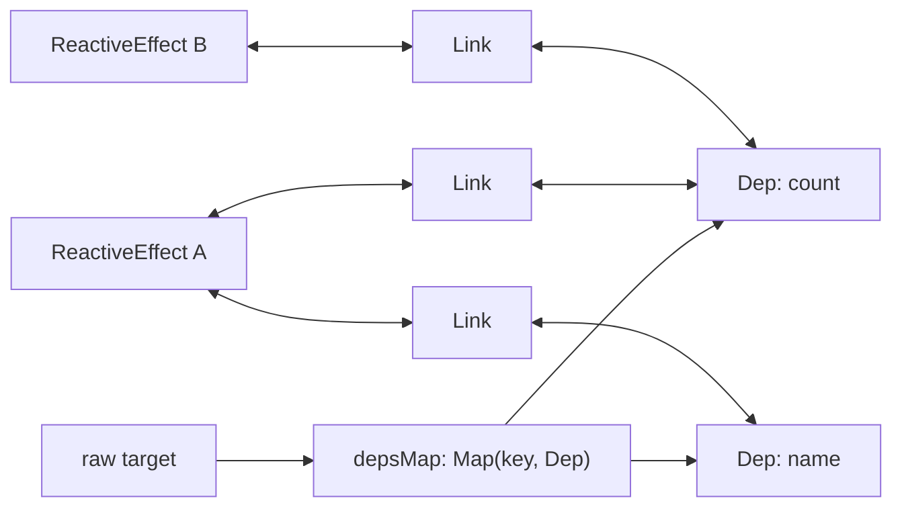
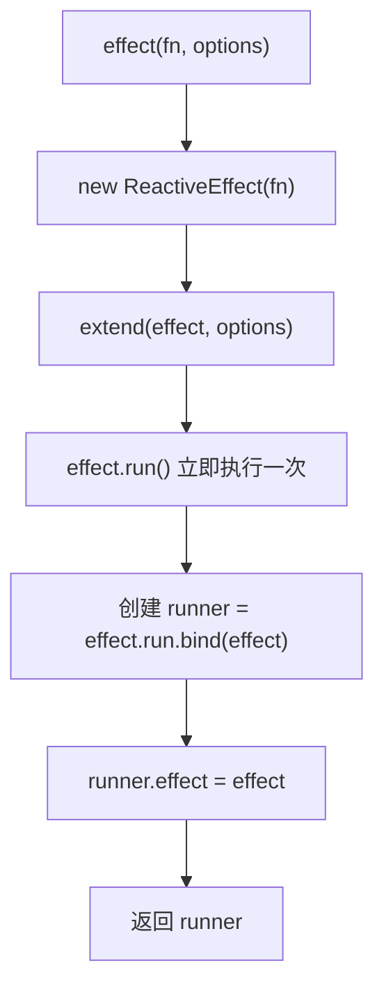
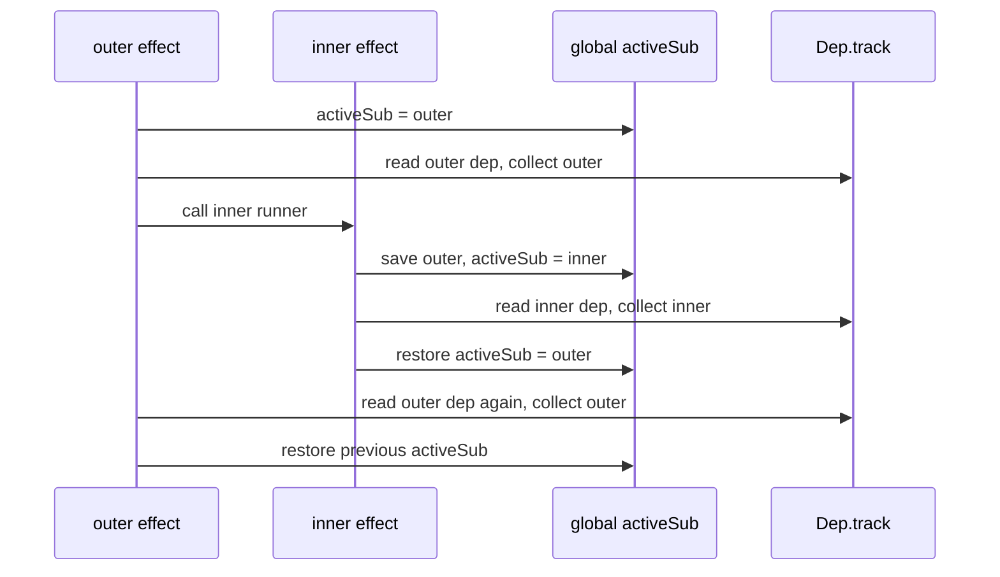
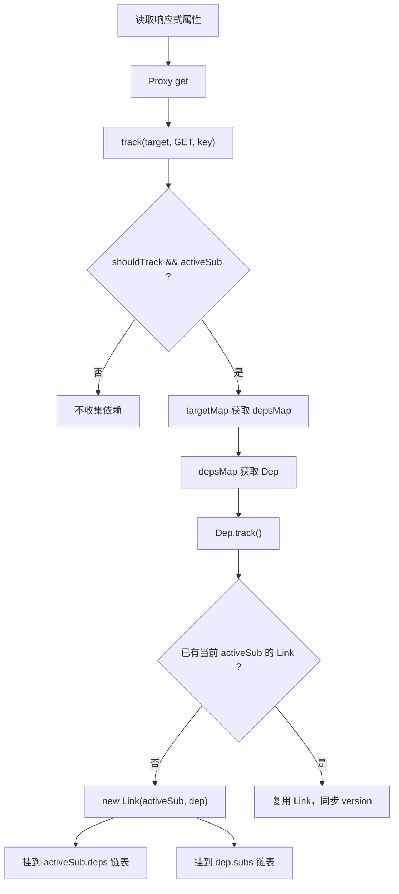
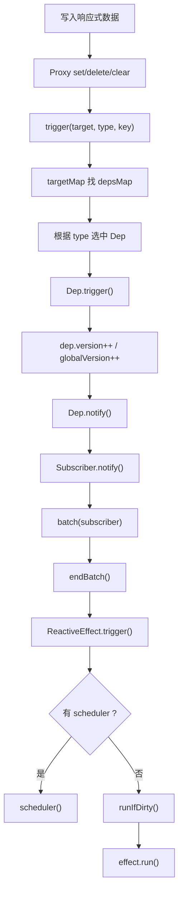
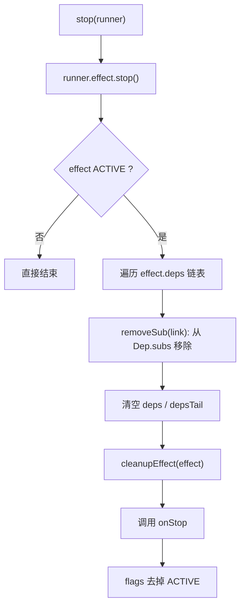
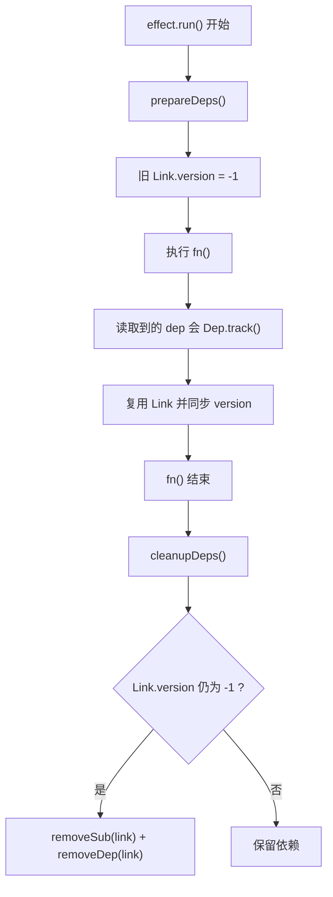
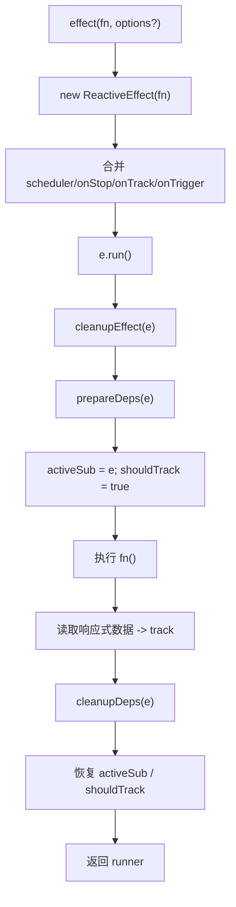
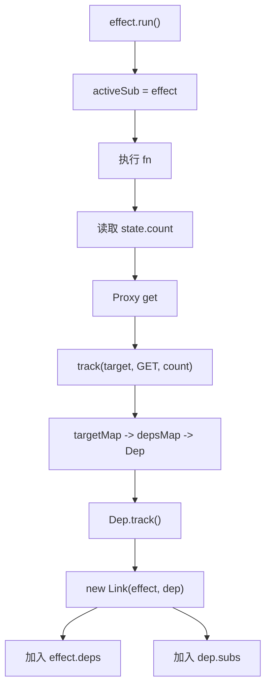
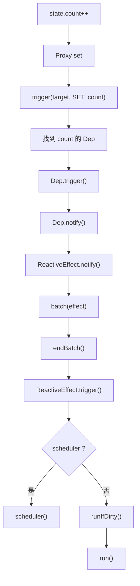

# Vue3 effect 源码深入分析

> 分析对象：当前本地 `vue3` 源码  
> 重点文件：`vue3/packages/reactivity/src/effect.ts`、`vue3/packages/reactivity/src/dep.ts`  
> 说明：当前源码中已经不再使用 `activeEffect`、`effectStack`、`trackEffect`、`triggerEffect` 这些旧命名。对应概念在当前实现中主要是 `activeSub`、`shouldTrack`、`Dep.track()`、`Dep.trigger()`、`Dep.notify()`、`ReactiveEffect.trigger()`。

## 源码位置

| 主题 | 文件 | 关键位置 |
| --- | --- | --- |
| effect 对外 API | `vue3/packages/reactivity/src/effect.ts` | `effect()`：484-505；`stop()`：512-514 |
| ReactiveEffect 类 | `vue3/packages/reactivity/src/effect.ts` | `ReactiveEffect`：87-228 |
| 当前活跃 effect | `vue3/packages/reactivity/src/effect.ts` | `activeSub`：39；`run()` 中设置/恢复：173-190 |
| 是否允许追踪 | `vue3/packages/reactivity/src/effect.ts` | `shouldTrack`：519；`pauseTracking()`：525-528；`resetTracking()`：541-544 |
| 批处理 | `vue3/packages/reactivity/src/effect.ts` | `batch()`：251-260；`startBatch()`：265-267；`endBatch()`：273-310 |
| effect 依赖清理 | `vue3/packages/reactivity/src/effect.ts` | `prepareDeps()`：312-322；`cleanupDeps()`：324-351；`cleanupEffect()`：569-582 |
| 依赖容器 | `vue3/packages/reactivity/src/dep.ts` | `Link`：32-62；`Dep`：67-205；`targetMap`：238-240 |
| 依赖收集入口 | `vue3/packages/reactivity/src/dep.ts` | `track()`：262-284；`Dep.track()`：108-165 |
| 依赖触发入口 | `vue3/packages/reactivity/src/dep.ts` | `trigger()`：294-389；`Dep.trigger()`：167-171；`Dep.notify()`：173-204 |
| 行为测试 | `vue3/packages/reactivity/__tests__/effect.spec.ts` | nested effects：660-691；scheduler：723-747；stop：897-969；dep unsubscribe：1185-1246；onEffectCleanup：1248-1269 |

## 新旧术语对照

很多 Vue3 响应式文章使用的是旧版实现命名。读当前源码时，可以按下面对应：

| 常见旧称 | 当前源码里的对应实现 | 说明 |
| --- | --- | --- |
| `activeEffect` | `activeSub` | 当前正在收集依赖的订阅者，可以是 `ReactiveEffect`，也可以是 computed。 |
| `effectStack` | `run()` 中的 `prevEffect` 保存/恢复 + `Dep.activeLink.prevActiveLink` | 当前实现没有显式 effect 栈数组，通过进入 effect 前保存旧 `activeSub`，finally 中恢复来处理嵌套。 |
| `trackEffect(dep)` | `Dep.track()` | 真正把当前活跃订阅者连接到某个 `Dep`。 |
| `triggerEffect(effect)` | `Subscriber.notify()` + `ReactiveEffect.trigger()` | 触发时先通知订阅者，再由 effect 决定走 scheduler 还是直接 run。 |
| `dep: Set<ReactiveEffect>` | `Dep` + `Link` 双向链表 | 当前实现不用简单 Set，而是用 Link 表达 Dep 和 Subscriber 的多对多关系。 |

## 1. effect 是什么？

`effect` 是响应式系统里的“副作用订阅”。它接收一个函数 `fn`：

```ts
effect(() => {
  console.log(state.count)
})
```

这个函数会立即执行一次。执行过程中，如果读取了响应式数据，就会建立依赖关系。之后当这些响应式数据变化时，函数会被重新执行，或者交给 scheduler 调度。

可以把 effect 理解成：

```text
响应式数据变化后需要重新执行的函数
```

在组件渲染中，组件的 render 更新本质上也会被包装成一个 effect。数据变了，effect 被触发，组件重新 render，再 patch DOM。

## 2. ReactiveEffect 类的作用是什么？

`ReactiveEffect` 是 effect 的运行时对象。`effect(fn)` 不是简单保存 `fn`，而是把它包装成一个 `ReactiveEffect` 实例。

核心字段：

| 字段 | 作用 |
| --- | --- |
| `fn` | 用户传入的副作用函数。 |
| `deps` | 当前 effect 依赖的 Dep 链表头。 |
| `depsTail` | 当前 effect 依赖的 Dep 链表尾。 |
| `flags` | effect 状态位，例如 ACTIVE、RUNNING、TRACKING、NOTIFIED、DIRTY。 |
| `next` | 批处理队列中指向下一个 Subscriber。 |
| `cleanup` | `onEffectCleanup()` 注册的清理函数。 |
| `scheduler` | 自定义调度器。触发时如果存在 scheduler，就调用 scheduler 而不是直接 run。 |
| `onStop` | stop 时的回调。 |
| `onTrack` | dev 调试用，依赖收集时触发。 |
| `onTrigger` | dev 调试用，依赖触发时触发。 |

核心方法：

| 方法 | 作用 |
| --- | --- |
| `run()` | 执行副作用函数，同时打开依赖收集窗口。 |
| `stop()` | 停止 effect，移除它和所有 Dep 的订阅关系。 |
| `notify()` | 被 Dep 通知时进入批处理队列。 |
| `trigger()` | 真正触发 effect，优先走 scheduler，否则 `runIfDirty()`。 |
| `runIfDirty()` | 依赖版本变化时重新执行。 |
| `pause()` / `resume()` | 暂停/恢复 effect 触发。 |

## effect 核心数据结构

### ReactiveEffect / Subscriber

`ReactiveEffect` 实现了 `Subscriber` 接口。当前源码把“可以订阅 Dep 的东西”抽象为 `Subscriber`。

```text
Subscriber
  deps
  depsTail
  flags
  next
  notify()

ReactiveEffect implements Subscriber
  fn
  scheduler
  onStop
  onTrack
  onTrigger
  run()
  stop()
  trigger()
```

### targetMap / Dep / Link

`targetMap` 保存响应式对象属性到依赖桶的关系：

```ts
targetMap: WeakMap<object, Map<any, Dep>>
```

结构图：

```text
targetMap
└─ rawTarget
   └─ depsMap
      ├─ "count" ── Dep
      │              ├─ Link ── ReactiveEffect A
      │              └─ Link ── ReactiveEffect B
      └─ "name"  ── Dep
                     └─ Link ── ReactiveEffect A
```

`Link` 同时连接两个方向：

```text
ReactiveEffect.deps 链表：这个 effect 依赖了哪些 Dep
Dep.subs 链表：这个 Dep 有哪些订阅者
```

Mermaid 图：



## 3. effect(fn) 调用后发生了什么？

源码入口：

```ts
export function effect<T = any>(
  fn: () => T,
  options?: ReactiveEffectOptions,
): ReactiveEffectRunner<T> {
  if ((fn as ReactiveEffectRunner).effect instanceof ReactiveEffect) {
    fn = (fn as ReactiveEffectRunner).effect.fn
  }

  const e = new ReactiveEffect(fn)
  if (options) {
    extend(e, options)
  }
  try {
    e.run()
  } catch (err) {
    e.stop()
    throw err
  }
  const runner = e.run.bind(e) as ReactiveEffectRunner
  runner.effect = e
  return runner
}
```

创建流程：

```text
effect(fn, options?)
  -> 如果 fn 本身已经是 runner，取 runner.effect.fn
  -> new ReactiveEffect(fn)
  -> 把 options 合并到 effect 实例
  -> 立即执行 e.run()
  -> 创建 runner = e.run.bind(e)
  -> runner.effect = e
  -> 返回 runner
```

Mermaid：



关键点：

- `effect(fn)` 会立即执行 `fn`。
- 返回值不是 `fn` 原函数，而是绑定了 `ReactiveEffect.run()` 的 runner。
- `runner.effect` 可以拿到内部 `ReactiveEffect` 实例。
- `stop(runner)` 本质是 `runner.effect.stop()`。

## 4. activeEffect 是什么？

当前源码中没有 `activeEffect`，对应变量是：

```ts
export let activeSub: Subscriber | undefined
```

它表示“当前正在执行、可以收集依赖的订阅者”。

在 `ReactiveEffect.run()` 中：

```ts
const prevEffect = activeSub
const prevShouldTrack = shouldTrack
activeSub = this
shouldTrack = true

try {
  return this.fn()
} finally {
  cleanupDeps(this)
  activeSub = prevEffect
  shouldTrack = prevShouldTrack
  this.flags &= ~EffectFlags.RUNNING
}
```

含义：

```text
进入 effect.run()
  activeSub = 当前 effect

执行 fn()
  读取响应式属性时，track() 能知道依赖应该收集到哪个 effect

退出 effect.run()
  activeSub 恢复成进入前的值
```

如果没有 `activeSub`，`track(target, key)` 只知道“某个属性被读了”，但不知道“应该把哪个 effect 加入这个属性的依赖列表”。

## 5. shouldTrack 是什么？

`shouldTrack` 是全局追踪开关：

```ts
export let shouldTrack = true
```

`track()` 收集依赖前会检查：

```ts
if (shouldTrack && activeSub) {
  // 收集依赖
}
```

它主要服务于这些场景：

- 临时暂停依赖收集。
- 数组变异方法避免 length 相关依赖造成循环。
- 嵌套逻辑中恢复之前的追踪状态。

相关 API：

```ts
pauseTracking()
enableTracking()
resetTracking()
```

内部还有一个 `trackStack`：

```ts
const trackStack: boolean[] = []
```

它不是 effect 栈，而是 `shouldTrack` 状态栈：

```text
pauseTracking()
  trackStack.push(shouldTrack)
  shouldTrack = false

resetTracking()
  shouldTrack = trackStack.pop() ?? true
```

测试中有一个关键行为：嵌套 effect 会强制开启追踪，即使外层处于暂停追踪区间。`ReactiveEffect.run()` 进入时会保存旧 `shouldTrack`，然后设置 `shouldTrack = true`，退出时恢复。

## 6. effectStack 或类似机制如何避免嵌套 effect 问题？

当前实现没有显式的 `effectStack` 数组，但有两个层面的保存/恢复机制。

### 第一层：activeSub 保存/恢复

`ReactiveEffect.run()` 进入时保存旧的 `activeSub`：

```ts
const prevEffect = activeSub
activeSub = this
```

退出时恢复：

```ts
activeSub = prevEffect
```

这就等价于一个隐式栈。

嵌套执行时：

```text
outer.run()
  prevEffect = undefined
  activeSub = outer

  inner.run()
    prevEffect = outer
    activeSub = inner
    inner 读取的依赖收集到 inner
    activeSub = outer

  outer 继续执行
  outer 后续读取的依赖继续收集到 outer

activeSub = undefined
```

### 第二层：Dep.activeLink 保存/恢复

`prepareDeps()` 会为 effect 已有的每个依赖保存 `dep.activeLink`：

```ts
link.prevActiveLink = link.dep.activeLink
link.dep.activeLink = link
```

`cleanupDeps()` 最后恢复：

```ts
link.dep.activeLink = link.prevActiveLink
link.prevActiveLink = undefined
```

这可以避免嵌套 effect 或重复读取同一个 dep 时，`Dep.track()` 错误复用其他 effect 的 link。

### 嵌套 effect 示例

```ts
import { reactive, effect } from '@vue/reactivity'

const state = reactive({
  outer: 1,
  inner: 10,
})

effect(() => {
  console.log('outer effect:', state.outer)

  effect(() => {
    console.log('inner effect:', state.inner)
  })

  console.log('outer continues:', state.outer)
})
```

依赖归属应该是：

```text
state.outer -> outer effect
state.inner -> inner effect
```

而不是：

```text
state.inner -> outer effect
```

测试 `should allow nested effects` 也验证了类似行为：内层依赖变化只触发内层 effect，外层依赖变化才触发外层 effect。

Mermaid：



## 7. trackEffect 如何收集依赖？

当前源码没有 `trackEffect` 函数。它的职责由两部分完成：

```text
track(target, type, key)
  -> Dep.track()
```

### track() 做什么？

`track()` 根据 `target` 和 `key` 找到对应的 `Dep`：

```text
targetMap: WeakMap
  target -> depsMap
    key -> Dep
```

流程：

```text
track(target, type, key)
  -> 如果 !shouldTrack 或 !activeSub，直接退出
  -> depsMap = targetMap.get(target)，没有则创建
  -> dep = depsMap.get(key)，没有则创建
  -> dep.track(debugInfo)
```

### Dep.track() 做什么？

`Dep.track()` 真正建立当前 effect 和 dep 的连接。

关键逻辑：

```text
如果没有 activeSub：不收集
如果 shouldTrack 为 false：不收集
如果 activeSub 就是该 computed 自己：不收集

否则：
  找当前 dep.activeLink
  如果没有 link 或 link.sub 不是 activeSub：
    创建 Link(activeSub, dep)
    link 加到 activeSub.deps 链表尾部
    link 加到 dep.subs 链表尾部
  如果 link 是旧 run 复用的：
    同步 version
    移动到 activeSub.deps 链表尾部
```

依赖收集 Mermaid：



## 8. triggerEffect 如何触发副作用函数重新执行？

当前源码没有独立的 `triggerEffect` 函数。触发链路是：

```text
trigger(target, type, key)
  -> 找到一个或多个 Dep
  -> Dep.trigger()
  -> Dep.notify()
  -> Subscriber.notify()
  -> batch(subscriber)
  -> endBatch()
  -> ReactiveEffect.trigger()
  -> scheduler() 或 runIfDirty()
```

### trigger() 做什么？

`trigger()` 先从 `targetMap` 找到 `depsMap`，然后根据操作类型选择要触发哪些 Dep：

| 操作 | 触发 |
| --- | --- |
| `SET` | 当前 key 的 dep |
| `ADD` | 当前 key 的 dep；非数组还触发 `ITERATE_KEY`；数组新增索引还触发 `length` |
| `DELETE` | 当前 key 的 dep；非数组还触发 `ITERATE_KEY` |
| `CLEAR` | 当前 target 的所有 dep |
| 数组 length 变化 | `length`、`ARRAY_ITERATE_KEY`、超出新长度的索引 dep |
| Map `SET` | 当前 key dep；还触发 `ITERATE_KEY` |

### Dep.trigger() 做什么？

`Dep.trigger()` 做两件事：

```text
dep.version++
globalVersion++
dep.notify()
```

`version` 用于判断 effect/computed 是否 dirty。

### Dep.notify() 做什么？

`Dep.notify()` 遍历 `dep.subs` 链表，通知每个订阅者：

```ts
for (let link = this.subs; link; link = link.prevSub) {
  if (link.sub.notify()) {
    ;(link.sub as ComputedRefImpl).dep.notify()
  }
}
```

普通 `ReactiveEffect.notify()` 会进入 `batch(this)`。

### ReactiveEffect.trigger() 做什么？

在 `endBatch()` 中，普通 effect 会执行：

```ts
(e as ReactiveEffect).trigger()
```

`ReactiveEffect.trigger()`：

```text
如果 effect 暂停：放入 pausedQueueEffects
否则如果有 scheduler：调用 scheduler()
否则：runIfDirty()
```

触发流程 Mermaid：



## 9. stop 方法是如何停止响应式追踪的？

对外 API：

```ts
stop(runner)
```

内部：

```ts
export function stop(runner: ReactiveEffectRunner): void {
  runner.effect.stop()
}
```

`ReactiveEffect.stop()`：

```text
如果 effect 仍 ACTIVE：
  遍历 effect.deps 链表
    removeSub(link)
  清空 effect.deps / depsTail
  cleanupEffect(this)
  调用 onStop
  移除 ACTIVE 标志
```

停止后的行为：

- 响应式数据再变，已经 stop 的 effect 不会自动执行。
- runner 仍然可以手动调用。
- 手动调用 stopped runner 时，`run()` 发现它不再 ACTIVE，会直接执行 `fn()`，不会把自己重新订阅回依赖中。

测试中验证：

```ts
const runner = effect(() => {
  dummy = obj.prop
})

stop(runner)
obj.prop = 3
// dummy 不变

runner()
// 手动执行，dummy 更新为当前值
```

stop 流程 Mermaid：



## 10. cleanupEffect 是如何清理旧依赖的？

这里要区分两个清理概念：

1. `cleanupEffect(e)`
   - 执行用户通过 `onEffectCleanup()` 注册的清理函数。

2. `cleanupDeps(sub)`
   - 清理 effect 不再使用的旧依赖连接。

### cleanupEffect(e)

源码：

```ts
function cleanupEffect(e: ReactiveEffect) {
  const { cleanup } = e
  e.cleanup = undefined
  if (cleanup) {
    const prevSub = activeSub
    activeSub = undefined
    try {
      cleanup()
    } finally {
      activeSub = prevSub
    }
  }
}
```

作用：

- 在 effect 重新运行前，执行上一次注册的 cleanup。
- 在 stop 时也执行 cleanup。
- 执行 cleanup 时临时把 `activeSub` 设为 `undefined`，避免 cleanup 内部读取响应式数据时错误收集依赖。

示例：

```ts
import { effect, onEffectCleanup, reactive } from '@vue/reactivity'

const state = reactive({ id: 1 })

effect(() => {
  const id = state.id

  onEffectCleanup(() => {
    console.log('cleanup for id:', id)
  })

  console.log('run with id:', id)
})

state.id = 2
// 重新执行 effect 前，会先输出 cleanup for id: 1
```

### cleanupDeps(sub)

`cleanupDeps()` 是依赖图层面的旧依赖清理。

为什么需要它？

看这个例子：

```ts
const state = reactive({
  ok: true,
  a: 1,
  b: 2,
})

effect(() => {
  console.log(state.ok ? state.a : state.b)
})
```

第一次执行：

```text
依赖 state.ok
依赖 state.a
不依赖 state.b
```

当 `state.ok = false` 后，effect 重新执行：

```text
依赖 state.ok
依赖 state.b
不再依赖 state.a
```

如果不清理旧依赖，之后修改 `state.a` 仍会错误触发 effect。

当前源码用 `Link.version = -1` 标记旧依赖是否仍被使用：

```text
prepareDeps()
  -> effect 运行前，把旧 link.version 标记为 -1

effect.fn()
  -> 读取到的依赖会在 Dep.track() 中同步 link.version = dep.version

cleanupDeps()
  -> 运行后仍是 -1 的 link，说明这次没读到
  -> removeSub(link)
  -> removeDep(link)
```

依赖清理 Mermaid：



## effect 创建流程



## 依赖收集流程

示例代码：

```ts
import { reactive, effect } from '@vue/reactivity'

const state = reactive({ count: 0 })

effect(() => {
  console.log(state.count)
})
```

收集过程：

```text
effect.run()
  -> activeSub = 当前 ReactiveEffect
  -> 执行 fn
  -> 读取 state.count
  -> Proxy get
  -> track(rawTarget, GET, "count")
  -> targetMap 找到/创建 Dep
  -> Dep.track()
  -> 创建 Link(effect, dep)
  -> effect.deps 链表记录 dep
  -> dep.subs 链表记录 effect
```

Mermaid：



## 依赖触发流程

示例代码：

```ts
state.count++
```

触发过程：

```text
Proxy set
  -> trigger(rawTarget, SET, "count")
  -> 找到 count 对应 Dep
  -> Dep.trigger()
  -> dep.version++ / globalVersion++
  -> Dep.notify()
  -> 遍历 dep.subs
  -> effect.notify()
  -> batch(effect)
  -> endBatch()
  -> effect.trigger()
  -> scheduler() 或 runIfDirty()
```

Mermaid：



## scheduler 示例

```ts
import { reactive, effect } from '@vue/reactivity'

const state = reactive({ count: 0 })
let runner: any

runner = effect(
  () => {
    console.log('effect run:', state.count)
  },
  {
    scheduler() {
      console.log('scheduled')
    },
  },
)

state.count++
// 输出 scheduled
// 不会立刻重新执行 effect 函数

runner()
// 手动执行，输出 effect run: 1
```

对应源码：

```text
ReactiveEffect.trigger()
  -> 如果 this.scheduler 存在，调用 scheduler()
  -> 否则 runIfDirty()
```

## stop 示例

```ts
import { reactive, effect, stop } from '@vue/reactivity'

const state = reactive({ count: 0 })
let dummy = 0

const runner = effect(() => {
  dummy = state.count
})

state.count = 1
console.log(dummy) // 1

stop(runner)

state.count = 2
console.log(dummy) // 1，不再自动更新

runner()
console.log(dummy) // 2，runner 仍可手动执行
```

注意：手动执行 stopped runner 不会重新把该 effect 加回依赖订阅中，因为 `run()` 在非 ACTIVE 状态下直接执行 `fn()`。

## 嵌套 effect 示例

```ts
import { reactive, effect } from '@vue/reactivity'

const state = reactive({
  a: 1,
  b: 2,
})

effect(() => {
  console.log('outer a:', state.a)

  effect(() => {
    console.log('inner b:', state.b)
  })

  console.log('outer a again:', state.a)
})

state.b++
// 只应该触发 inner effect

state.a++
// 触发 outer effect
```

关键在于：

```text
outer run 时 activeSub = outer
inner run 时 activeSub = inner
inner 结束后 activeSub 恢复 outer
outer 结束后 activeSub 恢复进入前状态
```

## 一个分支依赖清理示例

```ts
import { reactive, effect } from '@vue/reactivity'

const state = reactive({
  ok: true,
  a: 1,
  b: 2,
})

effect(() => {
  console.log(state.ok ? state.a : state.b)
})

state.ok = false

// 此后修改 a 不应该触发 effect
state.a = 100

// 修改 b 才应该触发 effect
state.b = 200
```

源码中的 `prepareDeps()` / `cleanupDeps()` 就是为这种动态依赖场景服务的。

## 总结

当前 Vue3 effect 系统可以概括为：

```text
ReactiveEffect 是副作用函数的运行时对象。
activeSub 表示当前正在收集依赖的订阅者。
shouldTrack 控制当前是否允许依赖收集。
targetMap 保存 target/key 到 Dep 的映射。
Dep 表示某个响应式属性的依赖桶。
Link 连接 Dep 和 Subscriber，形成双向链表。
track() 找 Dep，Dep.track() 建 Link。
trigger() 找 Dep，Dep.notify() 通知 Subscriber。
ReactiveEffect.trigger() 决定走 scheduler 还是重新 run。
stop() 移除所有订阅关系，cleanupDeps() 清理动态旧依赖。
```

最短阅读顺序：

1. `effect.ts`：`ReactiveEffect`、`effect()`、`stop()`。
2. `dep.ts`：`targetMap`、`Dep`、`Link`、`track()`、`trigger()`。
3. `effect.ts`：`prepareDeps()`、`cleanupDeps()`、`batch()`、`endBatch()`。
4. `effect.spec.ts`：nested effects、scheduler、stop、dep unsubscribe、onEffectCleanup 测试。
