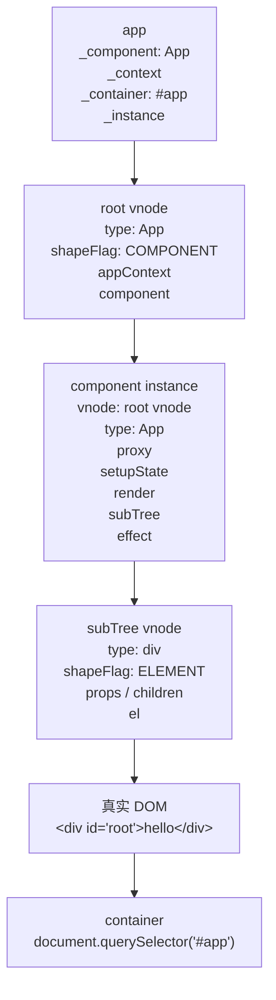
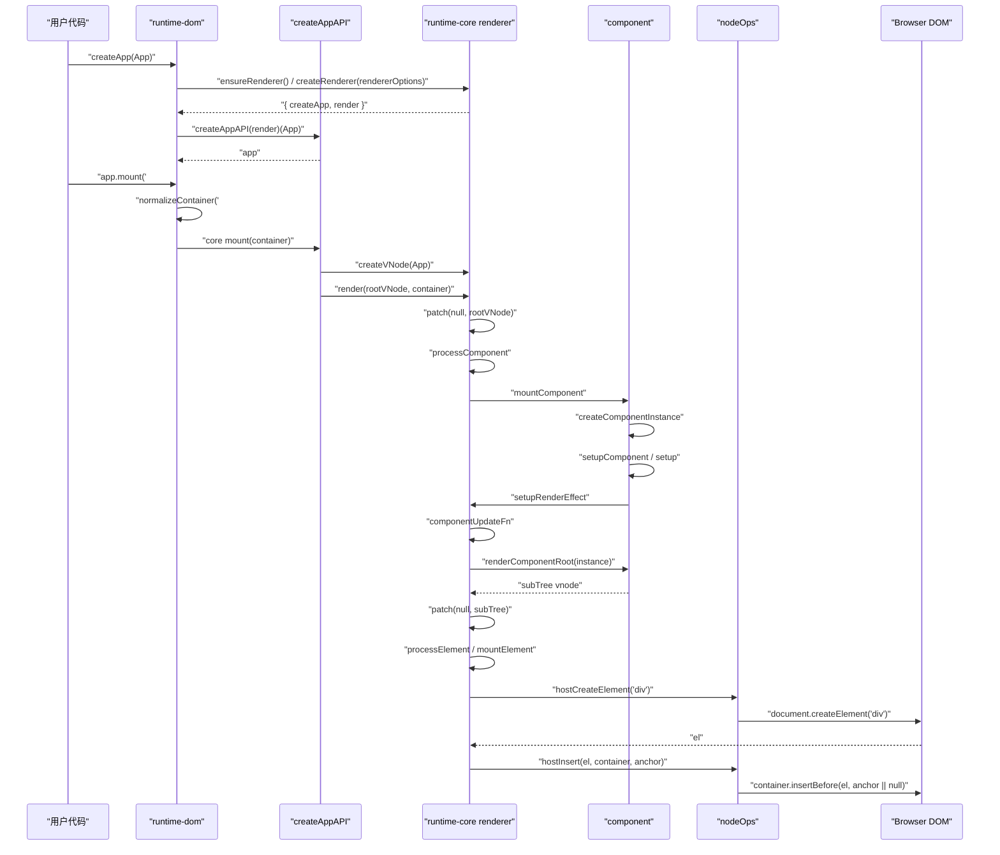

# Vue3 首次渲染流程源码追踪

本文从下面这几行代码开始，追踪 Vue3 首次渲染如何一步步把根组件变成真实 DOM 并插入页面：

```ts
import { createApp } from 'vue'
import App from './App.vue'

createApp(App).mount('#app')
```

> 说明：这里分析的是浏览器端运行时流程。`App.vue` 在进入运行时前，通常已经被 Vite / vue-loader 通过 `compiler-sfc` 编译成带有 `render` 函数的组件模块。

## 一、涉及源码文件

| 源码文件 | 作用 |
| --- | --- |
| `packages/runtime-dom/src/index.ts` | 浏览器平台入口，导出 DOM 版 `createApp`，重写 `app.mount`，注入 DOM renderer options。 |
| `packages/runtime-dom/src/nodeOps.ts` | DOM 节点操作实现，例如 `createElement`、`insert`、`setElementText`。 |
| `packages/runtime-dom/src/patchProp.ts` | DOM 属性、class、style、event 等更新逻辑。首次挂载元素 props 时会用到。 |
| `packages/runtime-core/src/renderer.ts` | 核心 renderer，包含 `render`、`patch`、组件挂载、元素挂载、更新调度入口。 |
| `packages/runtime-core/src/apiCreateApp.ts` | `createAppAPI` 实现，创建 app 对象，核心 `app.mount` 创建根 vnode 并调用 `render`。 |
| `packages/runtime-core/src/vnode.ts` | `createVNode` / `createBaseVNode`，负责创建 vnode 并计算 `shapeFlag`。 |
| `packages/runtime-core/src/component.ts` | `createComponentInstance`、`setupComponent`、`setup()` 执行和组件实例初始化。 |
| `packages/runtime-core/src/componentRenderUtils.ts` | `renderComponentRoot`，执行组件 render 函数并得到组件子树 vnode。 |

## 二、完整调用链

```txt
createApp(App).mount('#app')
  -> runtime-dom createApp(App)
     -> ensureRenderer()
        -> createRenderer(rendererOptions)
           -> baseCreateRenderer(options)
              -> 解构 DOM 平台方法:
                 hostCreateElement = nodeOps.createElement
                 hostInsert = nodeOps.insert
           -> 返回 { render, hydrate, createApp: createAppAPI(render, hydrate) }
     -> runtime-core createAppAPI(render, hydrate)(App)
        -> 创建 app 对象
     -> runtime-dom 重写 app.mount

  -> app.mount('#app')
     -> normalizeContainer('#app')
     -> 清空 container.textContent
     -> 调用 runtime-core 原始 mount(container, false, namespace)
        -> createVNode(rootComponent, rootProps)
        -> vnode.appContext = appContext
        -> render(vnode, rootContainer, namespace)
           -> patch(null, vnode, container, null, null, null, namespace)
              -> shapeFlag 命中 COMPONENT
              -> processComponent(null, vnode, ...)
                 -> mountComponent(vnode, ...)
                    -> createComponentInstance(vnode, null, null)
                    -> setupComponent(instance)
                       -> initProps(instance, props, ...)
                       -> initSlots(instance, children, ...)
                       -> setupStatefulComponent(instance)
                          -> 创建 instance.proxy
                          -> 执行 setup(props, setupContext)
                          -> handleSetupResult / finishComponentSetup
                    -> setupRenderEffect(instance, initialVNode, container, ...)
                       -> 创建 ReactiveEffect(componentUpdateFn)
                       -> update() 立即执行首次渲染
                          -> componentUpdateFn()
                             -> renderComponentRoot(instance)
                                -> 执行组件 render，得到 subTree
                             -> patch(null, subTree, container, anchor, instance, ...)
                                -> shapeFlag 命中 ELEMENT
                                -> processElement(null, subTree, ...)
                                   -> mountElement(subTree, ...)
                                      -> hostCreateElement(type)
                                      -> 设置文本 / 挂载子节点 / 设置 props
                                      -> hostInsert(el, container, anchor)
                                         -> parent.insertBefore(el, anchor || null)
```

## 三、每个步骤的作用

| 步骤 | 位置 | 核心作用 |
| --- | --- | --- |
| `createApp` | `runtime-dom/src/index.ts` | DOM 版入口。先通过 `ensureRenderer()` 拿到 renderer，再调用 core 的 `createApp`，最后包装 `app.mount`。 |
| `ensureRenderer` | `runtime-dom/src/index.ts` | 懒创建 renderer，把 `patchProp` 和 `nodeOps` 注入 `runtime-core`。 |
| `createAppAPI` | `runtime-core/src/apiCreateApp.ts` | 生成真正的 `createApp` 函数，闭包持有 `render` / `hydrate`。 |
| app 对象创建 | `runtime-core/src/apiCreateApp.ts` | 创建 `app`，保存 `_component`、`_props`、`_context`、`_container`、`_instance`，并提供 `use`、`mixin`、`component`、`directive`、`mount`、`unmount`、`provide` 等方法。 |
| `runtime-dom app.mount` | `runtime-dom/src/index.ts` | 把 `'#app'` 解析成真实 DOM container，必要时取 container 内容作为 template，清空容器，再调用 core mount。 |
| `createVNode` | `runtime-core/src/vnode.ts` | 用根组件对象创建根 vnode，计算 `shapeFlag`。对象组件会标记为 `STATEFUL_COMPONENT`。 |
| `render` | `runtime-core/src/renderer.ts` | 根渲染入口。首次渲染时 `container._vnode` 为空，所以调用 `patch(null, vnode, container, ...)`。 |
| `patch` | `runtime-core/src/renderer.ts` | 根据 vnode 类型和 `shapeFlag` 分发：组件走 `processComponent`，普通元素走 `processElement`。 |
| `processComponent` | `runtime-core/src/renderer.ts` | 首次组件 vnode 没有旧 vnode，因此进入 `mountComponent`。 |
| `mountComponent` | `runtime-core/src/renderer.ts` | 创建组件实例，初始化 props / slots / setup，然后创建组件渲染 effect。 |
| `createComponentInstance` | `runtime-core/src/component.ts` | 创建 `ComponentInternalInstance`，保存 vnode、type、parent、appContext、props、setupState、subTree、effect、update、生命周期数组等。 |
| `setupComponent` | `runtime-core/src/component.ts` | 初始化 props 和 slots；如果是有状态组件，进入 `setupStatefulComponent` 执行 `setup`。 |
| `setupRenderEffect` | `runtime-core/src/renderer.ts` | 创建组件渲染副作用 `ReactiveEffect`，设置 scheduler，首次通过 `update()` 同步执行渲染。 |
| `componentUpdateFn` | `runtime-core/src/renderer.ts` | 首次挂载时执行 beforeMount，调用 `renderComponentRoot` 得到 `subTree`，再 `patch(null, subTree, ...)`。 |
| `renderComponentRoot` | `runtime-core/src/componentRenderUtils.ts` | 调用组件 `render` 函数，将返回值标准化为 vnode。这个 vnode 就是组件的 `subTree`。 |
| patch 子树 | `runtime-core/src/renderer.ts` | 对组件 render 出来的根 vnode 再次 patch。若根是普通 DOM 元素，进入元素挂载。 |
| `processElement` | `runtime-core/src/renderer.ts` | 首次元素 vnode 没有旧 vnode，因此进入 `mountElement`。 |
| `mountElement` | `runtime-core/src/renderer.ts` | 创建真实 DOM，处理 children、props、指令、scopeId、transition，最后插入容器。 |
| `hostCreateElement` | `runtime-core/src/renderer.ts` / `runtime-dom/src/nodeOps.ts` | core 中的平台抽象方法，实际对应 DOM 的 `document.createElement` / `createElementNS`。 |
| `hostInsert` | `runtime-core/src/renderer.ts` / `runtime-dom/src/nodeOps.ts` | core 中的平台抽象方法，实际对应 `parent.insertBefore(child, anchor || null)`。真实 DOM 在这里进入页面。 |

## 四、关键源码拆解

### 1. DOM 入口 createApp

`runtime-dom/src/index.ts` 的 `createApp` 并不是直接创建 app，而是先确保 renderer 已经存在：

```ts
const app = ensureRenderer().createApp(...args)
```

`ensureRenderer()` 内部调用：

```ts
createRenderer<Node, Element | ShadowRoot>(rendererOptions)
```

其中 `rendererOptions` 来自：

```ts
const rendererOptions = extend({ patchProp }, nodeOps)
```

这一步非常关键：`runtime-core` 不知道浏览器 DOM 怎么创建、插入、删除，它只拿到一组平台方法。浏览器版本把 `nodeOps` 和 `patchProp` 注入进去，于是 core 可以通过 `hostCreateElement`、`hostInsert` 这些抽象方法操作真实 DOM。

### 2. createAppAPI 创建 app

`runtime-core/src/apiCreateApp.ts` 中的 `createAppAPI(render, hydrate)` 返回一个真正的 `createApp(rootComponent, rootProps)`。

app 对象核心字段：

| 字段 | 含义 |
| --- | --- |
| `_uid` | app 唯一 id。 |
| `_component` | 根组件，也就是 `App`。 |
| `_props` | 根组件 props。 |
| `_container` | mount 后保存根容器 DOM。 |
| `_context` | app 上下文，包含全局组件、指令、provides、config 等。 |
| `_instance` | 根组件实例，mount 后由根 vnode 的 `component` 赋值。 |

app 对象核心方法：

| 方法 | 作用 |
| --- | --- |
| `use` | 安装插件。 |
| `mixin` | 注册全局 mixin。 |
| `component` | 注册或读取全局组件。 |
| `directive` | 注册或读取全局指令。 |
| `mount` | 创建根 vnode 并调用 `render`。 |
| `unmount` | 卸载根 vnode。 |
| `provide` | 写入 app 级别 provides。 |
| `runWithContext` | 在 app 上下文中执行函数。 |

### 3. app.mount 创建根 vnode

core 的 `app.mount` 首次执行时会创建根 vnode：

```ts
const vnode = app._ceVNode || createVNode(rootComponent, rootProps)
vnode.appContext = context
render(vnode, rootContainer, namespace)
```

所以：

- `createApp(App)` 阶段只是创建 app，不会渲染组件。
- `app.mount('#app')` 阶段才会创建根 vnode 并进入 renderer。
- 根组件实例不是这里手动创建的，而是在后面的 `mountComponent` 中创建，并挂到 `vnode.component`。

### 4. createVNode 生成根组件 vnode

`runtime-core/src/vnode.ts` 中 `_createVNode` 会根据 `type` 计算 `shapeFlag`：

```ts
const shapeFlag = isString(type)
  ? ShapeFlags.ELEMENT
  : isObject(type)
    ? ShapeFlags.STATEFUL_COMPONENT
    : isFunction(type)
      ? ShapeFlags.FUNCTIONAL_COMPONENT
      : 0
```

对于 `App.vue` 默认导出的组件对象来说，`type` 是对象，因此根 vnode 会被标记为有状态组件：

```txt
root vnode
  type: App
  shapeFlag: STATEFUL_COMPONENT
  component: null
  el: null
  appContext: app._context
```

### 5. render 进入 patch

`runtime-core/src/renderer.ts` 的 `render` 是根渲染函数：

```ts
patch(
  container._vnode || null,
  vnode,
  container,
  null,
  null,
  null,
  namespace,
)
container._vnode = vnode
```

首次渲染时：

```txt
n1 = null
n2 = root vnode
container = document.querySelector('#app')
```

因此 `patch` 会把“空旧树”变成“根组件 vnode 对应的新树”。

### 6. patch 分发到 processComponent

`patch` 根据 vnode 类型分发：

```ts
if (shapeFlag & ShapeFlags.ELEMENT) {
  processElement(...)
} else if (shapeFlag & ShapeFlags.COMPONENT) {
  processComponent(...)
}
```

根 vnode 是组件，所以进入：

```txt
patch(null, rootVNode, container)
  -> processComponent(null, rootVNode, container)
  -> mountComponent(rootVNode, container)
```

### 7. mountComponent 创建组件实例并执行 setup

`mountComponent` 主要做三件事：

```txt
mountComponent
  -> createComponentInstance
  -> setupComponent
  -> setupRenderEffect
```

`createComponentInstance` 创建内部实例：

```txt
instance
  uid
  vnode
  type
  parent
  appContext
  root
  subTree
  effect
  update
  job
  scope
  render
  proxy
  props
  attrs
  slots
  setupState
  data
  ctx
  isMounted
  bm / m / bu / u / bum / um ...
```

`setupComponent` 会：

```txt
setupComponent(instance)
  -> initProps(instance, vnode.props, ...)
  -> initSlots(instance, vnode.children, ...)
  -> setupStatefulComponent(instance)
     -> instance.proxy = new Proxy(instance.ctx, PublicInstanceProxyHandlers)
     -> setCurrentInstance(instance)
     -> setup(props, setupContext)
     -> handleSetupResult(instance, setupResult)
     -> finishComponentSetup(instance)
```

如果 `setup` 返回对象：

```ts
instance.setupState = proxyRefs(setupResult)
```

如果 `setup` 返回函数：

```ts
instance.render = setupResult
```

如果组件是模板编译出来的，通常 `Component.render` 已经存在，`finishComponentSetup` 会把它赋给 `instance.render`。

### 8. setupRenderEffect 建立组件渲染 effect

`setupRenderEffect` 内部定义 `componentUpdateFn`，然后创建渲染 effect：

```ts
const effect = (instance.effect = new ReactiveEffect(componentUpdateFn))
const update = (instance.update = effect.run.bind(effect))
const job = (instance.job = effect.runIfDirty.bind(effect))
effect.scheduler = () => queueJob(job)
update()
```

首次挂载时，`update()` 会同步执行 `componentUpdateFn`。后续响应式数据变化时，不会每次同步 render，而是通过 scheduler 把 `job` 放进队列。

首次渲染分支核心逻辑：

```ts
if (!instance.isMounted) {
  const subTree = (instance.subTree = renderComponentRoot(instance))
  patch(null, subTree, container, anchor, instance, parentSuspense, namespace)
  initialVNode.el = subTree.el
  instance.isMounted = true
}
```

这里出现了非常重要的关系：

```txt
根组件 vnode 代表组件本身
组件 instance 保存组件运行状态
instance.subTree 是组件 render 出来的 vnode 树
subTree.el 是最终真实 DOM
initialVNode.el = subTree.el
```

### 9. renderComponentRoot 生成 subTree

`renderComponentRoot(instance)` 会执行组件的 render 函数：

```ts
result = normalizeVNode(
  render!.call(
    thisProxy,
    proxyToUse!,
    renderCache,
    props,
    setupState,
    data,
    ctx,
  ),
)
```

假设 `App.vue` 模板是：

```vue
<template>
  <div id="root">hello</div>
</template>
```

编译后大致等价于：

```ts
function render(_ctx) {
  return createElementVNode('div', { id: 'root' }, 'hello')
}
```

那么 `renderComponentRoot(instance)` 得到的 `subTree` 类似：

```txt
subTree
  type: 'div'
  props: { id: 'root' }
  children: 'hello'
  shapeFlag: ELEMENT | TEXT_CHILDREN
  el: null
```

### 10. patch 子树进入 processElement

组件 render 出来的 `subTree` 是普通元素 vnode，所以第二次 `patch` 会进入元素流程：

```txt
patch(null, subTree, container, anchor, instance)
  -> processElement(null, subTree, container, anchor, instance)
  -> mountElement(subTree, container, anchor, instance)
```

`processElement` 的职责很简单：

- `n1 == null`：首次挂载，调用 `mountElement`。
- `n1 != null`：更新，调用 `patchElement`。

### 11. mountElement 创建并插入真实 DOM

`mountElement` 的首次挂载顺序：

```txt
mountElement(vnode)
  -> el = vnode.el = hostCreateElement(vnode.type, namespace, props.is, props)
  -> 如果是文本子节点: hostSetElementText(el, vnode.children)
  -> 如果是数组子节点: mountChildren(...)
  -> 设置 scopeId
  -> 遍历 props: hostPatchProp(el, key, null, props[key], ...)
  -> 调用 vnode beforeMount / directive beforeMount
  -> hostInsert(el, container, anchor)
  -> mounted 相关逻辑进入 post render 队列
```

对于浏览器 DOM：

```ts
hostCreateElement('div')
```

实际来自 `runtime-dom/src/nodeOps.ts`：

```ts
document.createElement('div')
```

而：

```ts
hostInsert(el, container, anchor)
```

实际来自：

```ts
parent.insertBefore(child, anchor || null)
```

这一步执行完，真实 DOM 已经插入 `#app` 容器。

## 五、app、vnode、component instance、subTree、DOM 的关系图



关键引用关系：

```txt
app._component === App
app._context -> rootVNode.appContext
rootVNode.component -> instance
instance.vnode -> rootVNode
instance.subTree -> render 结果 vnode
instance.subTree.el -> 真实 DOM
rootVNode.el -> instance.subTree.el
container._vnode -> rootVNode
```

## 六、Mermaid 时序图



## 七、示例代码：从组件到 DOM

### 1. 用户代码

```ts
import { createApp } from 'vue'
import App from './App.vue'

createApp(App).mount('#app')
```

### 2. 假设 App.vue

```vue
<template>
  <div id="root">{{ message }}</div>
</template>

<script setup>
import { ref } from 'vue'

const message = ref('hello vue')
</script>
```

### 3. 编译后的 render 近似形态

真实编译结果会包含更多 helper、patchFlag 和缓存逻辑，这里只保留首次渲染主干：

```ts
function render(_ctx) {
  return createElementVNode('div', { id: 'root' }, _ctx.message)
}
```

### 4. 首次渲染时的数据形态

```ts
const app = createApp(App)

// mount 内部创建
const rootVNode = createVNode(App)
rootVNode.appContext = app._context

// patch 组件 vnode 时创建
const instance = createComponentInstance(rootVNode, null, null)
rootVNode.component = instance

// renderComponentRoot 后得到
const subTree = createVNode('div', { id: 'root' }, 'hello vue')
instance.subTree = subTree

// mountElement 后得到
subTree.el = document.createElement('div')
subTree.el.textContent = 'hello vue'

// hostInsert 后完成
document.querySelector('#app')!.insertBefore(subTree.el, null)
```

## 八、首次渲染主线总结

首次渲染可以拆成两次 `patch`：

| 第几次 patch | 输入 vnode | 作用 |
| --- | --- | --- |
| 第一次 | 根组件 vnode：`type = App` | 发现是组件，创建组件实例，执行 setup，创建 render effect。 |
| 第二次 | 组件 render 出来的 subTree vnode：`type = 'div'` | 发现是元素，创建真实 DOM，设置文本和 props，插入页面。 |

最核心的一句话：

```txt
createApp(App).mount('#app')
  先把 App 变成根组件 vnode，
  再把根组件 vnode 变成组件实例，
  再执行 render 得到 subTree vnode，
  最后把 subTree vnode 变成真实 DOM 并插入 container。
```

真实 DOM 插入发生在：

```txt
runtime-core mountElement
  -> hostInsert(el, container, anchor)
     -> runtime-dom nodeOps.insert
        -> parent.insertBefore(child, anchor || null)
```

这也是 `runtime-core` 与 `runtime-dom` 分层的关键：core 只负责“什么时候创建、什么时候插入、如何 diff”，DOM 包负责“如何调用浏览器 API 创建和插入”。
