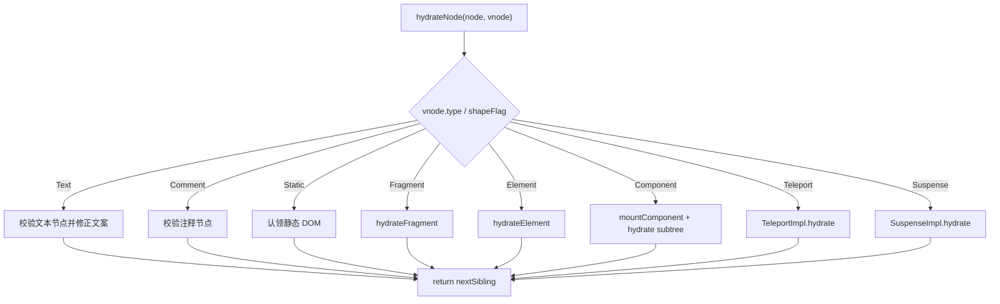
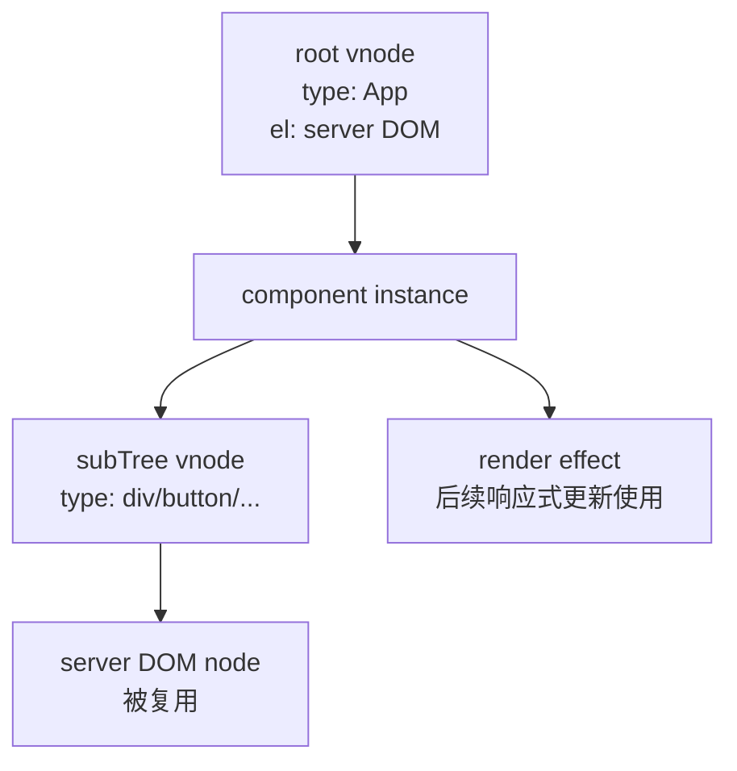
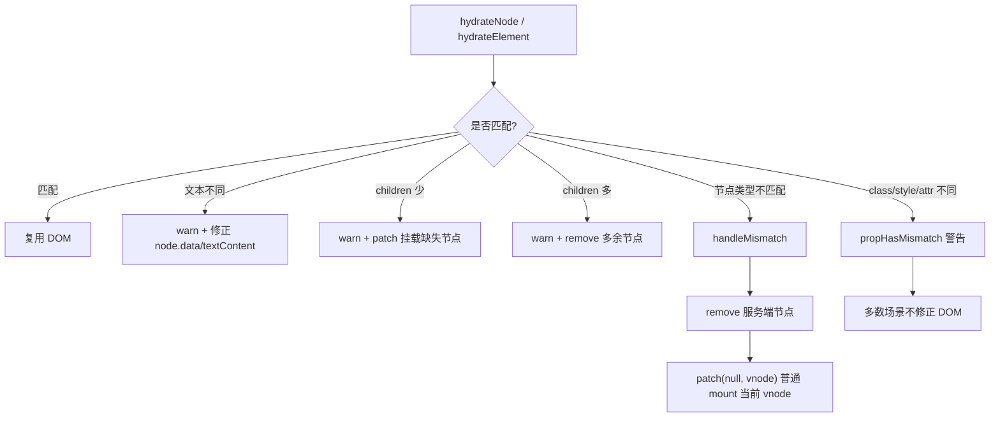
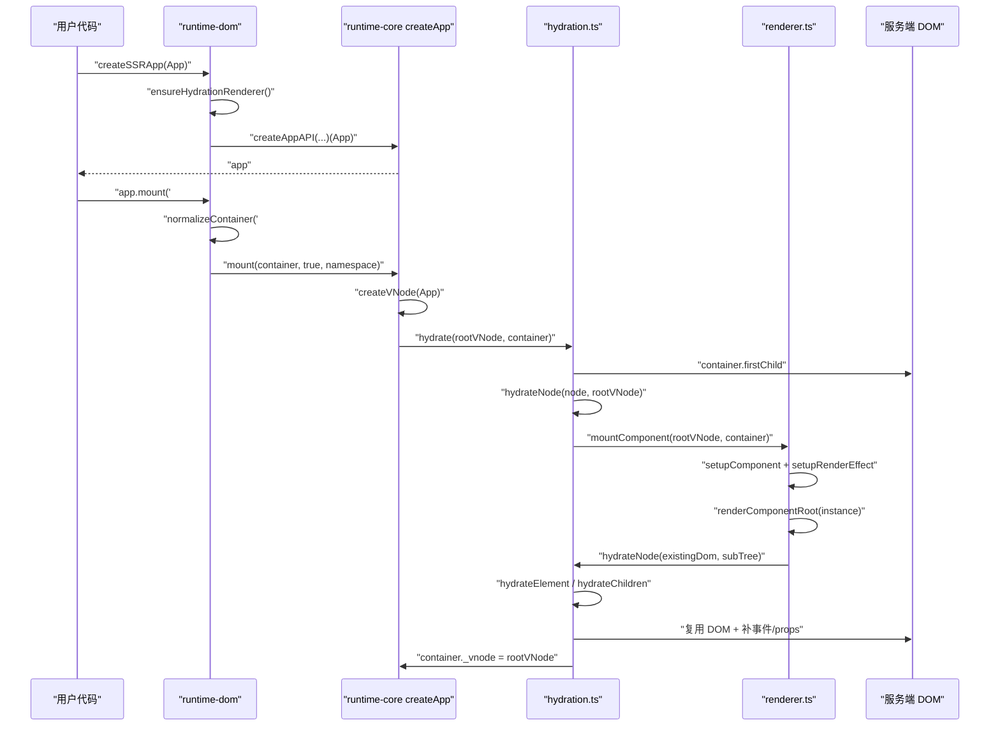

# Vue3 hydration 源码深入分析

本文从客户端入口开始，追踪 Vue3 如何接管服务端生成的 HTML：

```ts
import { createSSRApp } from 'vue'
import App from './App.vue'

createSSRApp(App).mount('#app')
```

hydration 的核心不是“重新创建 DOM”，而是：

```text
用客户端 vnode 树去认领服务端已经存在的 DOM，
补齐事件监听和必要 props，
创建组件实例与响应式更新 effect，
让静态 HTML 变成可交互应用。
```

## 一、核心源码文件

| 文件 | 作用 |
| --- | --- |
| `packages/runtime-dom/src/index.ts` | `createSSRApp`、`hydrate`、`ensureHydrationRenderer`。 |
| `packages/runtime-core/src/renderer.ts` | `createHydrationRenderer`、`setupRenderEffect` 中的组件 hydration 分支。 |
| `packages/runtime-core/src/hydration.ts` | hydration 核心：`hydrate`、`hydrateNode`、`hydrateElement`、`hydrateChildren`、mismatch 处理。 |
| `packages/runtime-core/src/components/Suspense.ts` | `SuspenseImpl.hydrate`。 |
| `packages/runtime-core/src/components/Teleport.ts` | `TeleportImpl.hydrate`。 |
| `packages/runtime-core/src/apiCreateApp.ts` | core app mount，接收 `isHydrate` 参数。 |
| `packages/runtime-dom/src/patchProp.ts` | hydration 时补齐事件和特殊 props。 |

## 二、createApp 和 createSSRApp 对比表

| 对比项 | `createApp(App).mount('#app')` | `createSSRApp(App).mount('#app')` |
| --- | --- | --- |
| renderer | `ensureRenderer()` | `ensureHydrationRenderer()` |
| renderer 创建 | `createRenderer(rendererOptions)` | `createHydrationRenderer(rendererOptions)` |
| mount 前是否清空容器 | 会清空 `container.textContent = ''` | 不清空，保留服务端 HTML |
| core mount 参数 | `mount(container, false, namespace)` | `mount(container, true, namespace)` |
| core 入口 | `render(vnode, container)` | `hydrate(vnode, container)` |
| DOM 处理 | 创建并插入新 DOM | 复用已有 DOM，必要时修正或补挂 |
| 适用场景 | CSR 首屏 | SSR 客户端激活 |

关键区别：

```text
createApp:
  container 只是挂载目标，里面内容会被清空。

createSSRApp:
  container 里面的服务端 HTML 是 hydration 的输入，不能清空。
```

## 三、hydration 调用链

```text
createSSRApp(App).mount('#app')
  -> runtime-dom createSSRApp(App)
     -> ensureHydrationRenderer()
        -> createHydrationRenderer(rendererOptions)
        -> baseCreateRenderer(options, createHydrationFunctions)
        -> createAppAPI(render, hydrate)
     -> core createApp(App)
     -> 重写 app.mount

app.mount('#app')
  -> normalizeContainer('#app')
  -> mount(container, true, resolveRootNamespace(container))
     -> core app.mount
        -> createVNode(rootComponent, rootProps)
        -> vnode.appContext = appContext
        -> hydrate(vnode, container)
           -> container.hasChildNodes()
           -> hydrateNode(container.firstChild, vnode, null, null, null)
           -> flushPostFlushCbs()
           -> container._vnode = vnode
```

后面 `hydrateNode` 会递归处理：

```text
root component vnode
  -> hydrate component
  -> mountComponent
  -> setupComponent
  -> setupRenderEffect
  -> renderComponentRoot
  -> hydrateNode(rootDomNode, subTree)
  -> hydrateElement / hydrateChildren / ...
```

## 四、createSSRApp 在客户端做了什么

源码位置：`packages/runtime-dom/src/index.ts`

```ts
export const createSSRApp = ((...args) => {
  const app = ensureHydrationRenderer().createApp(...args)

  const { mount } = app
  app.mount = (containerOrSelector) => {
    const container = normalizeContainer(containerOrSelector)
    if (container) {
      return mount(container, true, resolveRootNamespace(container))
    }
  }

  return app
})
```

它做了三件事：

1. 创建 hydration renderer。
2. 通过 renderer 创建 app。
3. 重写 `app.mount`，让 core mount 的 `isHydrate` 参数变成 `true`。

它不做的事：

- 不清空容器。
- 不直接遍历 DOM。
- 不直接创建组件实例。

这些都交给 core mount 和 hydration renderer。

## 五、mount 时如何进入 hydration 流程

core 的 `app.mount` 在 `runtime-core/src/apiCreateApp.ts` 中，会根据 `isHydrate` 判断走哪条路径：

```text
if (isHydrate && hydrate) {
  hydrate(vnode, rootContainer)
} else {
  render(vnode, rootContainer)
}
```

由于 `createSSRApp` 调用的是：

```text
mount(container, true, namespace)
```

所以进入：

```text
hydrate(vnode, container)
```

这就是客户端 SSR 激活流程的分岔点。

## 六、hydrate 的入口在哪里

源码位置：`packages/runtime-core/src/hydration.ts`

`hydrate` 由 `createHydrationFunctions(rendererInternals)` 创建。

```ts
const hydrate = (vnode, container) => {
  if (!container.hasChildNodes()) {
    warn(...)
    patch(null, vnode, container)
    flushPostFlushCbs()
    container._vnode = vnode
    return
  }

  hydrateNode(container.firstChild!, vnode, null, null, null)
  flushPostFlushCbs()
  container._vnode = vnode
}
```

这里有一个重要 fallback：

```text
如果容器为空，说明没有服务端 DOM 可复用，
Vue 会警告并 fallback 到普通 patch mount。
```

但如果容器不为空，Vue 会从：

```text
container.firstChild
```

开始和客户端 vnode 树一一对齐。

## 七、hydrateNode 做了什么

`hydrateNode` 是 hydration 的分发中心。

它的核心步骤：

```text
hydrateNode(node, vnode)
  -> optimized = optimized || !!vnode.dynamicChildren
  -> vnode.el = node
  -> dev 下给 node 挂 __vnode / __vueParentComponent
  -> 根据 vnode.type / shapeFlag 分发
  -> 返回当前 vnode 消费后，下一个需要 hydrate 的 DOM node
```

为什么要返回 `nextNode`？

```text
hydration 是在已有 DOM 链表上行走。
每 hydrate 完一个 vnode，需要告诉父级下一个 DOM sibling 是谁。
```

## 八、hydrateNode 分支表

| vnode 类型 | 判断方式 | hydration 行为 |
| --- | --- | --- |
| Text | `type === Text` | 要求 DOM 是文本节点；文本不同则警告并修正。 |
| Comment | `type === Comment` | 要求 DOM 是注释节点；否则 mismatch。 |
| Static | `type === Static` | 认领一段静态 DOM，必要时从服务端 DOM 反向填充 vnode.children。 |
| Fragment | `type === Fragment` | 要求起始注释为 `<!--[-->`，再 hydrate children，寻找 `<!--]-->`。 |
| Element | `shapeFlag & ELEMENT` | DOM tag 必须匹配，然后进入 `hydrateElement`。 |
| Component | `shapeFlag & COMPONENT` | 设置 vnode.el，定位 nextNode，调用 `mountComponent`。 |
| Teleport | `shapeFlag & TELEPORT` | 交给 `TeleportImpl.hydrate`。 |
| Suspense | `shapeFlag & SUSPENSE` | 交给 `SuspenseImpl.hydrate`。 |

分发图：



## 九、DOM 复用流程

DOM 复用的关键是：

```ts
vnode.el = node
```

这一步让客户端 vnode 指向服务端已有 DOM。

对于元素：

```text
服务端 DOM: <div id="app"><button>1</button></div>
客户端 vnode: type = "button", children = "1"

hydrateNode(buttonDom, buttonVNode)
  -> buttonVNode.el = buttonDom
  -> hydrateElement(buttonDom, buttonVNode)
```

对于组件：

```text
root component vnode.el = 服务端 DOM 起始节点
mountComponent(rootVNode)
setupRenderEffect 发现 initialVNode.el 存在
renderComponentRoot(instance) 得到 subTree
hydrateNode(initialVNode.el, subTree)
subTree.el = 服务端 DOM
rootVNode.el = subTree.el
```

组件、vnode、DOM 的关系：



## 十、hydrateElement 如何复用已有 DOM

`hydrateElement` 不创建元素，它接收的 `el` 已经是服务端 DOM。

主流程：

```text
hydrateElement(el, vnode)
  -> optimized = optimized || !!vnode.dynamicChildren
  -> forcePatch = input / option 等特殊表单元素
  -> hydrate children
     -> ARRAY_CHILDREN: hydrateChildren(el.firstChild, ...)
     -> TEXT_CHILDREN: 对比 textContent，不同则修正
  -> hydrate props
     -> 检查 mismatch
     -> 补齐事件监听
     -> 补齐 value / indeterminate / .prop / custom element props
  -> 执行 vnode/directive beforeMount/mounted
  -> return el.nextSibling
```

### hydrateElement 和 mountElement 的区别

| 对比项 | `mountElement` | `hydrateElement` |
| --- | --- | --- |
| 元素来源 | `hostCreateElement` 创建 | 服务端 DOM 已存在 |
| 插入 DOM | `hostInsert` | 不插入，复用 |
| children | mount 或 patch | hydrate 对齐已有 DOM |
| props | 全量 patch props | 只补必要 props / event，并做 mismatch 检查 |
| 返回值 | 无 | 返回下一个 DOM sibling |

## 十一、props 和 event listener 如何补齐

服务端 HTML 只能包含静态属性，不能包含真实 JS 事件监听函数。

因此 hydration 时必须补齐事件：

```text
props.onClick
  -> patchProp(el, 'onClick', null, handler, ...)
```

`hydrateElement` 的 props 处理逻辑：

```text
如果需要完整检查:
  遍历 props
  -> propHasMismatch 检查 class/style/attribute
  -> 如果是事件、value、indeterminate、.prop、自定义元素 prop
     patchProp(el, key, null, props[key])

否则如果只有 onClick:
  -> 快路径 patchProp(el, 'onClick', ...)
```

为什么不是所有 props 都重新 patch？

```text
大多数静态 attr 已经在服务端 HTML 里了。
hydration 的目标是复用 DOM，避免不必要 DOM 写入。
事件监听和表单值这类 HTML 无法完整表达或需要 JS 接管的内容才必须补齐。
```

## 十二、children 如何 hydrate

`hydrateChildren` 的任务是：用 vnode children 顺序消费 DOM childNodes。

核心逻辑：

```text
hydrateChildren(node, parentVNode, container)
  -> 遍历 vnode children
  -> 每个 child normalizeVNode
  -> 如果当前 DOM node 存在:
       hydrateNode(node, childVNode)
       node = 返回的 nextNode
     否则:
       服务端 DOM 子节点不足
       -> 警告 mismatch
       -> patch(null, childVNode, container) 挂载缺失节点
  -> 遍历完后返回剩余 DOM node
```

`hydrateElement` 拿到返回的 `next` 后，如果还有剩余 DOM node：

```text
服务端 DOM 子节点过多
  -> 警告 mismatch
  -> remove(extraNode)
```

children mismatch 分两类：

| 情况 | 处理 |
| --- | --- |
| 服务端 DOM 比客户端 vnode 少 | 使用 `patch(null, vnode)` 挂载缺失节点。 |
| 服务端 DOM 比客户端 vnode 多 | 删除多余 DOM 节点。 |

## 十三、hydrateComponent 如何处理组件

当前源码中没有单独命名为 `hydrateComponent` 的函数。组件 hydration 发生在 `hydrateNode` 的 component 分支。

流程：

```text
hydrateNode(node, componentVNode)
  -> componentVNode.el = node
  -> componentVNode.slotScopeIds = slotScopeIds
  -> container = parentNode(node)
  -> 定位 nextNode
     Fragment root: locateClosingAnchor
     Teleport root: locateClosingAnchor
     普通 root: nextSibling(node)
  -> mountComponent(componentVNode, container, null, ...)
```

关键点在 `setupRenderEffect`：

```ts
if (el && hydrateNode) {
  instance.subTree = renderComponentRoot(instance)
  hydrateNode(el, instance.subTree, instance, parentSuspense, null)
} else {
  const subTree = instance.subTree = renderComponentRoot(instance)
  patch(null, subTree, container, anchor, instance, parentSuspense, namespace)
}
```

因为 `componentVNode.el` 已经被设置为服务端 DOM，所以组件首次 render 后不是 `patch(null, subTree)`，而是：

```text
hydrateNode(existingDom, subTree)
```

组件 hydration 主线：

```text
服务端 DOM
  -> component vnode.el
  -> mountComponent
  -> createComponentInstance
  -> setupComponent
  -> setupRenderEffect
  -> renderComponentRoot
  -> hydrateNode(component vnode.el, instance.subTree)
```

## 十四、Suspense hydration 如何处理

`hydrateNode` 遇到 Suspense：

```text
shapeFlag & SUSPENSE
  -> SuspenseImpl.hydrate(...)
```

`SuspenseImpl.hydrate` 会：

```text
createSuspenseBoundary(..., hydrating = true)
hydrateNode(node, vnode.ssContent, parentComponent, suspense, ...)
如果 suspense.deps === 0:
  suspense.resolve(false, true)
return result
```

源码注释提到服务端 Suspense 有两种可能：

```text
success:
  服务端内容已经完全解析，HTML 是 default content

failure:
  服务端输出 fallback branch
```

客户端不知道服务端到底是哪种情况，所以会先假设成功，尝试 hydrate `ssContent`，同时创建 suspense boundary 来接管异步依赖。

## 十五、mismatch 是如何检测和处理的

Vue3 hydration mismatch 可以分为五类：

```ts
TEXT
CHILDREN
CLASS
STYLE
ATTRIBUTE
```

### 1. Text mismatch

```text
DOM text !== vnode.children
  -> warn Hydration text mismatch
  -> logMismatchError()
  -> node.data = vnode.children
```

文本 mismatch 会修正 DOM。

### 2. Element tag mismatch

```text
DOM 不是元素
或 DOM tagName 与 vnode.type 不一致
  -> handleMismatch()
```

`handleMismatch` 会：

```text
warn
vnode.el = null
remove(serverNode)
patch(null, vnode, container, next)
如果有 parentComponent:
  parentComponent.vnode.el = vnode.el
  updateHOCHostEl(parentComponent, vnode.el)
return next
```

这种情况会 fallback 到普通 mount 当前 vnode。

### 3. Children mismatch

服务端子节点更多：

```text
hydrateChildren 返回后仍有 next
  -> warn
  -> remove(extraNode)
```

服务端子节点更少：

```text
hydrateChildren 遍历 vnode child 时 node 不存在
  -> warn
  -> patch(null, vnode, container)
```

### 4. Props mismatch

`propHasMismatch` 检查：

| 类型 | 检查方式 |
| --- | --- |
| class | 转成 set 比较，不关心 class 顺序。 |
| style | 转成 map 比较。 |
| boolean attr | 比较 `hasAttribute` 和期望布尔值。 |
| 普通 attr | 比较实际 attr 和客户端期望值。 |

大多数 props mismatch 是 check-only：

```text
开发期警告
生产一般不为了性能去修正所有属性
提示开发者修复源头
```

### 5. data-allow-mismatch

可以用：

```html
<div data-allow-mismatch="text"></div>
```

允许特定 mismatch。

可选值：

```text
text
children
class
style
attribute
```

空字符串表示允许所有类型：

```html
<div data-allow-mismatch></div>
```

## 十六、mismatch 处理流程



## 十七、hydration 失败时是否会 fallback 到普通 mount

会，但不是“整棵树全部重挂”这一种粗暴策略，而是按失败位置 fallback。

### 1. 容器为空

`hydrate` 入口：

```text
if (!container.hasChildNodes())
  -> patch(null, vnode, container)
```

这会对根 vnode 做普通 mount。

### 2. 单个节点类型 mismatch

`handleMismatch`：

```text
remove(serverNode)
patch(null, vnode, container, next)
```

这会对当前 vnode 子树普通 mount。

### 3. children 缺失

```text
patch(null, missingVNode, container)
```

这只补挂缺失子节点。

所以更准确地说：

```text
Vue3 hydration 会尽量局部修复。
只有根容器没有服务端 DOM 时，才退化成整棵树普通 mount。
```

## 十八、hydration 完成后组件实例和 DOM 如何关联

hydration 完成后会建立以下关系：

```text
container._vnode = rootVNode

rootVNode.component = rootInstance
rootInstance.vnode = rootVNode
rootInstance.subTree = renderComponentRoot(rootInstance)

rootVNode.el = rootInstance.subTree.el
subTree.el = reusedServerDom

DOM.__vnode = vnode        // dev / devtools
DOM.__vueParentComponent = parentComponent
```

组件后续响应式更新时，已经和普通客户端组件一样：

```text
响应式数据变化
  -> component render effect scheduler
  -> queueJob(instance.job)
  -> componentUpdateFn 更新分支
  -> renderComponentRoot
  -> patch(prevTree, nextTree)
```

也就是说：

```text
hydration 只影响首次接管。
接管完成后，后续更新回到普通 patch 流程。
```

## 十九、Mermaid 时序图



## 二十、核心结论

1. 客户端 SSR 激活必须使用 `createSSRApp(App).mount('#app')`，它会保留服务端 HTML 并进入 hydration。
2. `createSSRApp` 的关键是创建 hydration renderer，并让 core mount 的 `isHydrate = true`。
3. `hydrate` 的入口在 `runtime-core/src/hydration.ts`，从 `container.firstChild` 开始。
4. `hydrateNode` 是分发中心，会按 Text、Comment、Static、Fragment、Element、Component、Teleport、Suspense 分支处理。
5. DOM 复用的关键是 `vnode.el = node`。
6. `hydrateElement` 不创建元素，而是对齐 children、检查 mismatch、补事件和特殊 props。
7. 组件 hydration 没有独立函数名，发生在 `hydrateNode` 的 component 分支，通过 `mountComponent` 和 `setupRenderEffect` 的 `el && hydrateNode` 分支完成。
8. 事件监听必须在客户端补齐，因为服务端 HTML 不能携带 JS 函数。
9. children hydration 会逐个 vnode 消费 DOM sibling，少了就 mount，多了就 remove。
10. mismatch 会尽量局部修复；根容器为空才整体 fallback 普通 mount。
11. Suspense hydration 会创建 suspense boundary，并优先尝试 hydrate `ssContent`。
12. hydration 完成后，组件实例、vnode、DOM 的关系与普通客户端挂载一致，后续更新走正常 patch。

一句话总结：

```text
Vue3 hydration 是“用客户端 vnode 树认领服务端 DOM”的过程；
它不追求重新生成 DOM，而是尽量复用、补齐事件、建立组件实例和响应式更新关系。
```
