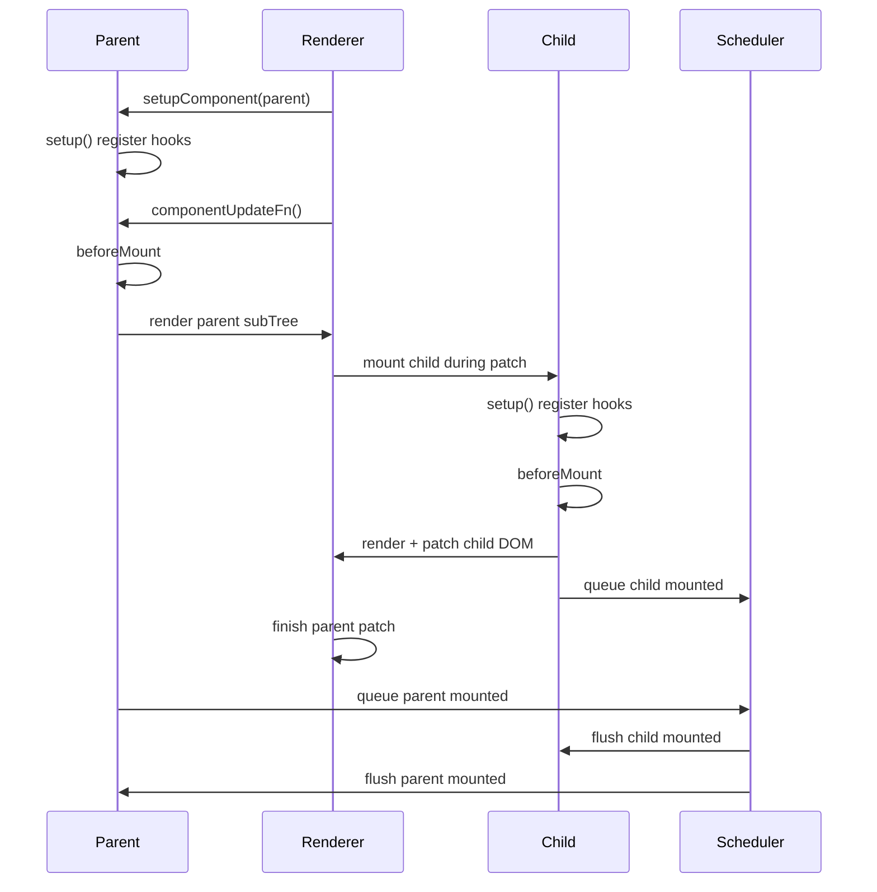
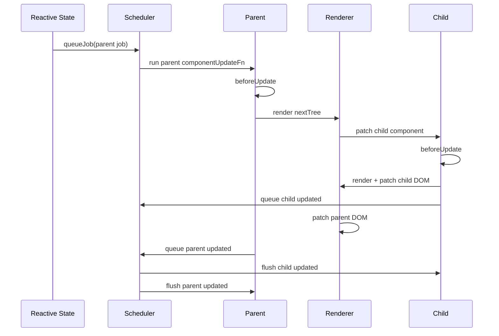
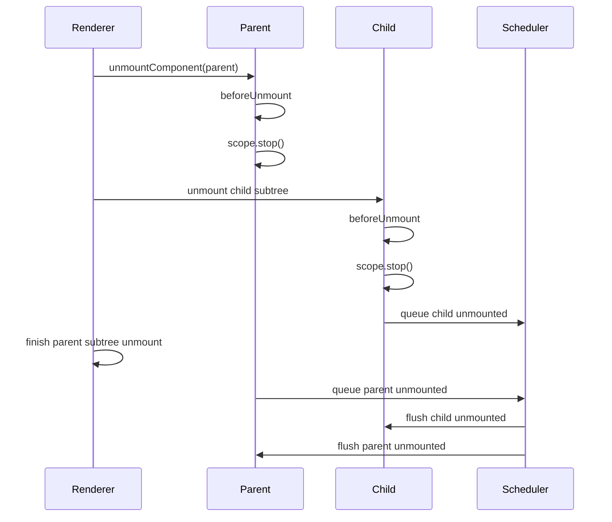
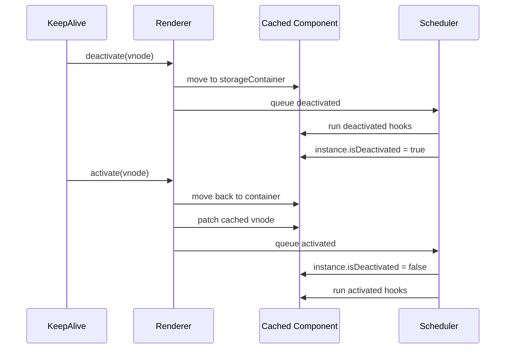
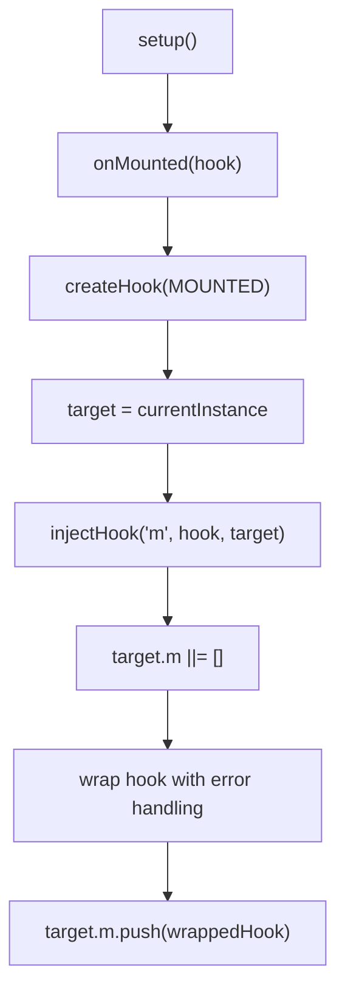
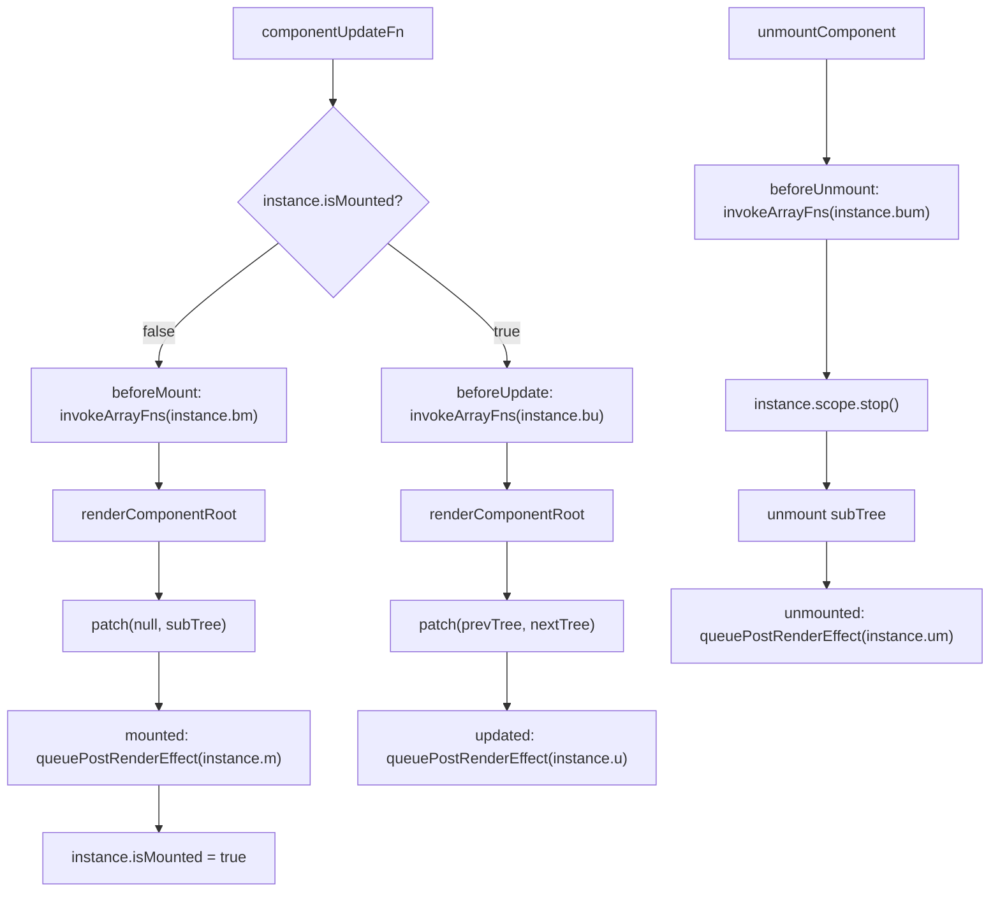

# Vue3 生命周期源码深入分析

本文基于当前仓库 `vue3` 源码整理，重点分析 Vue3 生命周期 API 的注册、存储、触发时机、父子组件执行顺序、与 scheduler 的关系，以及 KeepAlive 场景下 `activated / deactivated` 的特殊处理。

生命周期源码的核心主线是：

```text
setup() 中调用 onXxx()
  -> 通过 currentInstance 找到当前组件实例
  -> 把 hook 包装后存入 instance 的生命周期数组
  -> renderer 在 mount / update / unmount 的特定位置取出并执行
  -> mounted / updated / unmounted 这类 DOM 后置 hook 进入 post-render 队列
```

## 一、涉及源码文件

| 文件 | 作用 |
| --- | --- |
| `vue3/packages/runtime-core/src/apiLifecycle.ts` | 生命周期 API 入口，`createHook`、`injectHook`、`onMounted` 等 |
| `vue3/packages/runtime-core/src/enums.ts` | 生命周期枚举，定义 hook 在实例上的短字段名 |
| `vue3/packages/runtime-core/src/component.ts` | 组件实例创建、生命周期字段初始化、`currentInstance` 机制 |
| `vue3/packages/runtime-core/src/renderer.ts` | 生命周期触发位置，mount / update / unmount 主流程 |
| `vue3/packages/runtime-core/src/scheduler.ts` | post flush 队列，决定 mounted / updated / unmounted 何时执行 |
| `vue3/packages/runtime-core/src/components/KeepAlive.ts` | `onActivated` / `onDeactivated` 注册和触发 |
| `vue3/packages/runtime-core/src/componentOptions.ts` | Options API 生命周期如何复用 Composition API 注册机制 |

## 二、hooks 存储结构

生命周期 hooks 存储在组件内部实例 `ComponentInternalInstance` 上。

实例创建位置：

```text
vue3/packages/runtime-core/src/component.ts
```

`createComponentInstance` 初始化生命周期字段：

```ts
const instance: ComponentInternalInstance = {
  isMounted: false,
  isUnmounted: false,
  isDeactivated: false,

  // lifecycle hooks
  bc: null,
  c: null,
  bm: null,
  m: null,
  bu: null,
  u: null,
  um: null,
  bum: null,
  da: null,
  a: null,
  rtg: null,
  rtc: null,
  ec: null,
  sp: null,
}
```

生命周期枚举：

```ts
export enum LifecycleHooks {
  BEFORE_CREATE = 'bc',
  CREATED = 'c',
  BEFORE_MOUNT = 'bm',
  MOUNTED = 'm',
  BEFORE_UPDATE = 'bu',
  UPDATED = 'u',
  BEFORE_UNMOUNT = 'bum',
  UNMOUNTED = 'um',
  DEACTIVATED = 'da',
  ACTIVATED = 'a',
  RENDER_TRIGGERED = 'rtg',
  RENDER_TRACKED = 'rtc',
  ERROR_CAPTURED = 'ec',
  SERVER_PREFETCH = 'sp',
}
```

字段映射表：

| API / 选项 | 枚举值 | 实例字段 | 触发时机 |
| --- | --- | --- | --- |
| `beforeCreate` | `bc` | `instance.bc` | Options API 初始化最前面 |
| `created` | `c` | `instance.c` | data / computed / watch / provide 初始化后 |
| `onBeforeMount` / `beforeMount` | `bm` | `instance.bm` | 首次 render / patch 前 |
| `onMounted` / `mounted` | `m` | `instance.m` | 首次 patch 后，post-render |
| `onBeforeUpdate` / `beforeUpdate` | `bu` | `instance.bu` | 更新 render / patch 前 |
| `onUpdated` / `updated` | `u` | `instance.u` | 更新 patch 后，post-render |
| `onBeforeUnmount` / `beforeUnmount` | `bum` | `instance.bum` | 卸载前，同步执行 |
| `onUnmounted` / `unmounted` | `um` | `instance.um` | 子树卸载后，post-render |
| `onActivated` / `activated` | `a` | `instance.a` | KeepAlive 激活后，post-render |
| `onDeactivated` / `deactivated` | `da` | `instance.da` | KeepAlive 失活后，post-render |
| `onRenderTracked` | `rtc` | `instance.rtc` | render effect track 时 |
| `onRenderTriggered` | `rtg` | `instance.rtg` | render effect trigger 时 |
| `onErrorCaptured` | `ec` | `instance.ec` | 捕获后代错误时 |
| `onServerPrefetch` | `sp` | `instance.sp` | SSR prefetch |

这些字段一般是 `null` 或 hook 数组。调用 `onMounted(fn)` 后，`instance.m` 会变成数组，数组里存的是包装后的 hook。

## 三、生命周期注册流程

源码位置：

```text
vue3/packages/runtime-core/src/apiLifecycle.ts
```

`onBeforeMount`、`onMounted`、`onBeforeUpdate`、`onUpdated`、`onBeforeUnmount`、`onUnmounted` 都由 `createHook` 创建：

```ts
const createHook =
  <T extends Function = () => any>(lifecycle: LifecycleHooks) =>
  (
    hook: T,
    target: ComponentInternalInstance | null = currentInstance,
  ): void => {
    if (
      !isInSSRComponentSetup ||
      lifecycle === LifecycleHooks.SERVER_PREFETCH
    ) {
      injectHook(lifecycle, (...args: unknown[]) => hook(...args), target)
    }
  }

export const onBeforeMount = createHook(LifecycleHooks.BEFORE_MOUNT)
export const onMounted = createHook(LifecycleHooks.MOUNTED)
export const onBeforeUpdate = createHook(LifecycleHooks.BEFORE_UPDATE)
export const onUpdated = createHook(LifecycleHooks.UPDATED)
export const onBeforeUnmount = createHook(LifecycleHooks.BEFORE_UNMOUNT)
export const onUnmounted = createHook(LifecycleHooks.UNMOUNTED)
```

所以：

```text
onMounted(hook)
  -> createHook(LifecycleHooks.MOUNTED)
  -> injectHook('m', hook, currentInstance)
```

### injectHook 做了什么

```ts
export function injectHook(
  type: LifecycleHooks,
  hook: Function & { __weh?: Function },
  target: ComponentInternalInstance | null = currentInstance,
  prepend: boolean = false,
): Function | undefined {
  if (target) {
    const hooks = target[type] || (target[type] = [])
    const wrappedHook =
      hook.__weh ||
      (hook.__weh = (...args: unknown[]) => {
        pauseTracking()
        const reset = setCurrentInstance(target)
        const res = callWithAsyncErrorHandling(hook, target, type, args)
        reset()
        resetTracking()
        return res
      })
    if (prepend) {
      hooks.unshift(wrappedHook)
    } else {
      hooks.push(wrappedHook)
    }
    return wrappedHook
  }
}
```

它做了几件事：

| 步骤 | 说明 |
| --- | --- |
| 1. 找到目标实例 | 默认参数是 `currentInstance` |
| 2. 找到 hook 数组 | `target[type]`，例如 mounted 对应 `target.m` |
| 3. 包装 hook | 包装错误处理、暂停依赖追踪、执行时设置当前实例 |
| 4. 存入数组 | 默认 `push`，KeepAlive 注入祖先时可能 `prepend` |

包装 hook 的意义：

| 机制 | 作用 |
| --- | --- |
| `pauseTracking()` | 生命周期函数里读取响应式数据时，不意外被当前 effect 收集 |
| `setCurrentInstance(target)` | hook 执行期间仍可访问当前实例上下文 |
| `callWithAsyncErrorHandling` | 生命周期错误进入 Vue 错误处理链 |
| `hook.__weh` | 缓存包装函数，方便 scheduler 去重 |

## 四、setup 中调用生命周期如何关联当前组件实例

源码位置：

```text
vue3/packages/runtime-core/src/component.ts
```

`currentInstance` 是生命周期注册能找到当前组件的关键：

```ts
export let currentInstance: ComponentInternalInstance | null = null

export const getCurrentInstance: () => ComponentInternalInstance | null = () =>
  currentInstance || currentRenderingInstance
```

执行 `setup` 前，Vue 会设置当前实例：

```ts
const reset = setCurrentInstance(instance)
const setupResult = callWithErrorHandling(
  setup,
  instance,
  ErrorCodes.SETUP_FUNCTION,
  [
    __DEV__ ? shallowReadonly(instance.props) : instance.props,
    setupContext,
  ],
)
resetTracking()
reset()
```

`setCurrentInstance`：

```ts
export const setCurrentInstance = (instance: ComponentInternalInstance) => {
  const prev = currentInstance
  internalSetCurrentInstance(instance)
  instance.scope.on()
  return (): void => {
    instance.scope.off()
    internalSetCurrentInstance(prev)
  }
}
```

因此：

```text
setup() 开始前
  -> currentInstance = 当前组件 instance

setup() 中调用 onMounted()
  -> 默认 target = currentInstance
  -> hook 注册到当前 instance.m

setup() 结束后
  -> reset()
  -> currentInstance 恢复为上一个实例
```

这也是为什么生命周期注册 API 必须同步写在 `setup()` 中。如果在普通异步回调里才调用，`currentInstance` 可能已经被恢复为 `null`。

## 五、onBeforeMount / onMounted 如何注册

注册流程：

```text
setup()
  -> onBeforeMount(beforeMountHook)
     -> injectHook('bm', beforeMountHook, currentInstance)
     -> instance.bm.push(wrappedHook)

setup()
  -> onMounted(mountedHook)
     -> injectHook('m', mountedHook, currentInstance)
     -> instance.m.push(wrappedHook)
```

示例：

```ts
setup() {
  onBeforeMount(() => {
    console.log('before mount')
  })

  onMounted(() => {
    console.log('mounted')
  })
}
```

实例上会形成：

```ts
instance.bm = [wrappedBeforeMount]
instance.m = [wrappedMounted]
```

## 六、mount 生命周期触发流程

源码位置：

```text
vue3/packages/runtime-core/src/renderer.ts
```

触发点在 `setupRenderEffect` 的 `componentUpdateFn` 中。

首次挂载分支：

```ts
if (!instance.isMounted) {
  const { bm, m } = instance

  toggleRecurse(instance, false)
  // beforeMount hook
  if (bm) {
    invokeArrayFns(bm)
  }
  toggleRecurse(instance, true)

  const subTree = (instance.subTree = renderComponentRoot(instance))
  patch(null, subTree, container, anchor, instance, parentSuspense, namespace)
  initialVNode.el = subTree.el

  // mounted hook
  if (m) {
    queuePostRenderEffect(m, parentSuspense)
  }

  instance.isMounted = true
}
```

所以：

| hook | patch 前还是 patch 后 |
| --- | --- |
| `onBeforeMount` | patch 前，同步执行 |
| `onMounted` | patch 后，进入 post-render 队列 |

更具体地说：

```text
beforeMount
  -> renderComponentRoot
  -> patch DOM
  -> queue mounted hook
  -> 当前 flush 的 post-render 队列执行 mounted
```

因此 `mounted` 中可以访问已经创建并插入的 DOM。

## 七、onBeforeUpdate / onUpdated 如何触发

更新分支也在 `componentUpdateFn`：

```ts
if (instance.isMounted) {
  let { next, bu, u, parent, vnode } = instance

  toggleRecurse(instance, false)
  if (next) {
    updateComponentPreRender(instance, next, optimized)
  } else {
    next = vnode
  }

  // beforeUpdate hook
  if (bu) {
    invokeArrayFns(bu)
  }

  toggleRecurse(instance, true)

  // render
  const nextTree = renderComponentRoot(instance)
  const prevTree = instance.subTree
  instance.subTree = nextTree

  patch(prevTree, nextTree, hostParentNode(prevTree.el!)!, getNextHostNode(prevTree), instance, parentSuspense, namespace)

  // updated hook
  if (u) {
    queuePostRenderEffect(u, parentSuspense)
  }
}
```

所以：

| hook | DOM 更新前还是更新后 |
| --- | --- |
| `onBeforeUpdate` | DOM 更新前，同步执行 |
| `onUpdated` | DOM 更新后，进入 post-render 队列 |

流程：

```text
状态变化
  -> render effect scheduler
  -> queueJob(instance.job)
  -> flushJobs()
  -> componentUpdateFn()
     -> beforeUpdate
     -> renderComponentRoot
     -> patch DOM
     -> queue updated hook
  -> flushPostFlushCbs()
     -> updated
```

## 八、onBeforeUnmount / onUnmounted 如何触发

源码位置：

```text
vue3/packages/runtime-core/src/renderer.ts
```

卸载组件时：

```ts
const { bum, scope, job, subTree, um, m, a } = instance
invalidateMount(m)
invalidateMount(a)

// beforeUnmount hook
if (bum) {
  invokeArrayFns(bum)
}

// stop effects in component scope
scope.stop()

if (job) {
  job.flags! |= SchedulerJobFlags.DISPOSED
  unmount(subTree, instance, parentSuspense, doRemove)
}

// unmounted hook
if (um) {
  queuePostRenderEffect(um, parentSuspense)
}

queuePostRenderEffect(() => {
  instance.isUnmounted = true
}, parentSuspense)
```

所以：

| hook | 触发时机 |
| --- | --- |
| `onBeforeUnmount` | 卸载前，同步执行 |
| `onUnmounted` | 子树卸载后，进入 post-render 队列 |

卸载时还有两个重要细节：

| 细节 | 说明 |
| --- | --- |
| `invalidateMount(m)` | 如果组件尚未完成 mounted 队列，就取消还没执行的 mount hook |
| `scope.stop()` | 停止组件 scope 内的 render effect、watch、computed 等副作用 |
| `job.flags |= DISPOSED` | 标记组件更新 job 已废弃，scheduler 不再执行它 |

## 九、生命周期和 scheduler 的关系

源码位置：

```text
vue3/packages/runtime-core/src/scheduler.ts
vue3/packages/runtime-core/src/renderer.ts
vue3/packages/runtime-core/src/components/Suspense.ts
```

组件更新 job 使用主队列：

```ts
effect.scheduler = () => queueJob(job)
```

`queueJob` 会把组件更新任务放入 scheduler 主队列，按组件 uid 排序，通常父组件 uid 小于子组件 uid：

```ts
export function queueJob(job: SchedulerJob): void {
  if (!(job.flags! & SchedulerJobFlags.QUEUED)) {
    const jobId = getId(job)
    const lastJob = queue[queue.length - 1]
    if (!lastJob || (!(job.flags! & SchedulerJobFlags.PRE) && jobId >= getId(lastJob))) {
      queue.push(job)
    } else {
      queue.splice(findInsertionIndex(jobId), 0, job)
    }
    job.flags! |= SchedulerJobFlags.QUEUED
    queueFlush()
  }
}
```

而 `mounted / updated / unmounted` 使用 post-render 队列：

```ts
export const queuePostRenderEffect = __FEATURE_SUSPENSE__
  ? queueEffectWithSuspense
  : queuePostFlushCb
```

`queueEffectWithSuspense`：

```ts
export function queueEffectWithSuspense(fn, suspense) {
  if (suspense && suspense.pendingBranch) {
    suspense.effects.push(fn)
  } else {
    queuePostFlushCb(fn)
  }
}
```

`queuePostFlushCb`：

```ts
export function queuePostFlushCb(cb: SchedulerJobs): void {
  if (!isArray(cb)) {
    pendingPostFlushCbs.push(cb)
  } else {
    // lifecycle hook array can skip duplicate check because component job is deduped
    pendingPostFlushCbs.push(...cb)
  }
  queueFlush()
}
```

`flushPostFlushCbs` 会去重并排序：

```ts
const deduped = [...new Set(pendingPostFlushCbs)].sort(
  (a, b) => getId(a) - getId(b),
)
```

关系总结：

| 类型 | 执行方式 |
| --- | --- |
| `beforeMount` | 组件首次 effect 内同步执行 |
| `mounted` | patch 后 `queuePostRenderEffect` |
| `beforeUpdate` | 组件更新 effect 内，patch 前同步执行 |
| `updated` | patch 后 `queuePostRenderEffect` |
| `beforeUnmount` | 卸载流程中同步执行 |
| `unmounted` | 子树卸载后 `queuePostRenderEffect` |
| `activated / deactivated` | KeepAlive 移动 / patch 后 `queuePostRenderEffect` |

一句话：

```text
before* hooks 大多同步执行在 renderer 当前流程中；
mounted / updated / unmounted / activated / deactivated 是 DOM 操作完成后的 post-render callbacks。
```

## 十、父子组件生命周期执行顺序

### 首次挂载

父组件挂载时，父组件先进入 `componentUpdateFn`，执行父 `beforeMount`，然后 render / patch 子树。在 patch 子树过程中会挂载子组件。

典型顺序：

```text
parent setup
parent beforeMount
  child setup
  child beforeMount
  child mounted
parent mounted
```

为什么 `child mounted` 早于 `parent mounted`？

因为父组件的 `mounted` 是在父组件整个子树 patch 完成后才入队；子组件在父 patch 子树过程中完成自己的 patch，并先把 `child.m` 放入 post-render 队列。父 patch 返回后，父才把 `parent.m` 入队。

### 更新

如果父状态变化导致父子都更新，常见顺序：

```text
parent beforeUpdate
  child beforeUpdate
  child updated
parent updated
```

原因：

| 阶段 | 顺序 |
| --- | --- |
| `beforeUpdate` | 父组件更新 effect 先执行，patch 子树时触发子组件更新 |
| `updated` | 子组件 patch 完成后先入 post-render 队列，父组件 patch 完成后再入队 |

如果父子组件各自被独立状态触发，scheduler 主队列会按 job id 排序，通常父 uid 更小，所以父更新 job 先于子更新 job。

### 卸载

典型顺序：

```text
parent beforeUnmount
  child beforeUnmount
  child unmounted
parent unmounted
```

原因：

| 阶段 | 顺序 |
| --- | --- |
| `beforeUnmount` | 父组件开始卸载时先同步执行自己的 `bum`，然后递归卸载子树 |
| `unmounted` | 子树卸载过程中子组件先入 post-render 队列，父组件子树卸载完成后父 `um` 再入队 |

## 十一、KeepAlive 生命周期有什么不同

源码位置：

```text
vue3/packages/runtime-core/src/components/KeepAlive.ts
```

`KeepAlive` 不会在切换时真正卸载组件，而是把组件 vnode 移动到隐藏容器，并通过 `activated / deactivated` 表示激活和失活。

对外 API：

```ts
export function onActivated(hook, target?) {
  registerKeepAliveHook(hook, LifecycleHooks.ACTIVATED, target)
}

export function onDeactivated(hook, target?) {
  registerKeepAliveHook(hook, LifecycleHooks.DEACTIVATED, target)
}
```

注册逻辑：

```ts
function registerKeepAliveHook(
  hook: Function & { __wdc?: Function },
  type: LifecycleHooks,
  target: ComponentInternalInstance | null = currentInstance,
) {
  const wrappedHook =
    hook.__wdc ||
    (hook.__wdc = () => {
      let current: ComponentInternalInstance | null = target
      while (current) {
        if (current.isDeactivated) {
          return
        }
        current = current.parent
      }
      return hook()
    })
  injectHook(type, wrappedHook, target)

  if (target) {
    let current = target.parent
    while (current && current.parent) {
      if (isKeepAlive(current.parent.vnode)) {
        injectToKeepAliveRoot(wrappedHook, type, target, current)
      }
      current = current.parent
    }
  }
}
```

特殊点：

| 特殊机制 | 说明 |
| --- | --- |
| `onActivated` 存入 `instance.a` | activated hook |
| `onDeactivated` 存入 `instance.da` | deactivated hook |
| `__wdc` 包装 | 检查当前组件是否处于 deactivated 分支，避免错误触发 |
| 注入 keep-alive root | 除了注册到当前实例，还向上注册到 keep-alive root，避免激活时遍历整棵子树 |
| target 卸载时移除注入 | `injectToKeepAliveRoot` 内部用 `onUnmounted` 清理 root 上的 hook |

### activate

```ts
sharedContext.activate = (vnode, container, anchor, namespace, optimized) => {
  const instance = vnode.component!
  move(vnode, container, anchor, MoveType.ENTER, parentSuspense)
  patch(instance.vnode, vnode, container, anchor, instance, parentSuspense, namespace, vnode.slotScopeIds, optimized)
  queuePostRenderEffect(() => {
    instance.isDeactivated = false
    if (instance.a) {
      invokeArrayFns(instance.a)
    }
  }, parentSuspense)
}
```

### deactivate

```ts
sharedContext.deactivate = (vnode: VNode) => {
  const instance = vnode.component!
  invalidateMount(instance.m)
  invalidateMount(instance.a)

  move(vnode, storageContainer, null, MoveType.LEAVE, parentSuspense)
  queuePostRenderEffect(() => {
    if (instance.da) {
      invokeArrayFns(instance.da)
    }
    instance.isDeactivated = true
  }, parentSuspense)
}
```

KeepAlive 生命周期区别：

| 普通组件 | KeepAlive 组件 |
| --- | --- |
| 离开时真正 unmount | 离开时移动到缓存容器 |
| 触发 `beforeUnmount / unmounted` | 通常触发 `deactivated` |
| 再次进入重新 mount | 再次进入触发 `activated` |
| effect scope 会 stop | 缓存期间组件实例和 effect scope 保留 |

第一次被 KeepAlive 包裹的组件完成挂载后，也会触发 `mounted`，并且 renderer 还会在首次 mount 后对 keep-alive root 排队 `activated`：

```ts
if (initialVNode.shapeFlag & ShapeFlags.COMPONENT_SHOULD_KEEP_ALIVE) {
  instance.a && queuePostRenderEffect(instance.a, parentSuspense)
}
```

## 十二、生命周期执行时序图

### 首次挂载



### 更新



### 卸载



### KeepAlive 激活 / 失活



## 十三、生命周期注册流程图



## 十四、生命周期触发流程图



## 十五、示例代码

### 示例一：基础生命周期顺序

```vue
<template>
  <Child v-if="visible" :count="count" />
  <button @click="count++">update</button>
  <button @click="visible = false">remove</button>
</template>

<script setup>
import { ref, onBeforeMount, onMounted, onBeforeUpdate, onUpdated, onBeforeUnmount, onUnmounted } from 'vue'
import Child from './Child.vue'

const count = ref(0)
const visible = ref(true)

onBeforeMount(() => {
  console.log('parent beforeMount')
})

onMounted(() => {
  console.log('parent mounted')
})

onBeforeUpdate(() => {
  console.log('parent beforeUpdate')
})

onUpdated(() => {
  console.log('parent updated')
})

onBeforeUnmount(() => {
  console.log('parent beforeUnmount')
})

onUnmounted(() => {
  console.log('parent unmounted')
})
</script>
```

对应源码链路：

```text
setup()
  -> onBeforeMount 注册到 instance.bm
  -> onMounted 注册到 instance.m
  -> onBeforeUpdate 注册到 instance.bu
  -> onUpdated 注册到 instance.u
  -> onBeforeUnmount 注册到 instance.bum
  -> onUnmounted 注册到 instance.um

renderer:
  -> bm 在 patch 前同步执行
  -> m 在 patch 后 post-render 执行
  -> bu 在更新 patch 前同步执行
  -> u 在更新 patch 后 post-render 执行
  -> bum 在卸载前同步执行
  -> um 在子树卸载后 post-render 执行
```

### 示例二：KeepAlive 生命周期

```vue
<template>
  <KeepAlive>
    <UserPanel v-if="show" />
  </KeepAlive>
</template>
```

```ts
import { onMounted, onUnmounted, onActivated, onDeactivated } from 'vue'

onMounted(() => {
  console.log('first mounted')
})

onActivated(() => {
  console.log('activated')
})

onDeactivated(() => {
  console.log('deactivated')
})

onUnmounted(() => {
  console.log('real unmounted')
})
```

行为理解：

```text
首次进入:
  mounted
  activated

切走:
  deactivated
  不触发 unmounted

切回:
  activated
  不重新触发 mounted

KeepAlive 本身卸载或缓存被 prune:
  beforeUnmount / unmounted
```

## 十六、核心结论

Vue3 生命周期源码可以压缩成三句话：

```text
注册:
  onXxx 通过 currentInstance 找到当前组件，
  然后把包装后的 hook 存进 instance 的短字段数组。

触发:
  renderer 在 mount / update / unmount 的固定位置读取这些数组，
  before* hooks 同步执行，mounted / updated / unmounted 进入 post-render 队列。

调度:
  组件更新 job 走 scheduler 主队列，
  DOM 后置生命周期走 post flush 队列，
  因此 mounted / updated / unmounted 都发生在对应 DOM 操作完成之后。
```

最需要记住的时机：

| hook | 时机 |
| --- | --- |
| `onBeforeMount` | 首次 patch 前 |
| `onMounted` | 首次 patch 后 |
| `onBeforeUpdate` | 更新 patch 前 |
| `onUpdated` | 更新 patch 后 |
| `onBeforeUnmount` | 卸载子树前 |
| `onUnmounted` | 卸载子树后 |
| `onActivated` | KeepAlive 缓存组件重新进入后 |
| `onDeactivated` | KeepAlive 缓存组件离开后 |

父子顺序也可以这样记：

```text
beforeMount / beforeUpdate / beforeUnmount:
  父先进入当前流程，再进入子流程。

mounted / updated / unmounted:
  子先完成 DOM 操作并入 post 队列，父后入队，所以通常子先执行。
```
