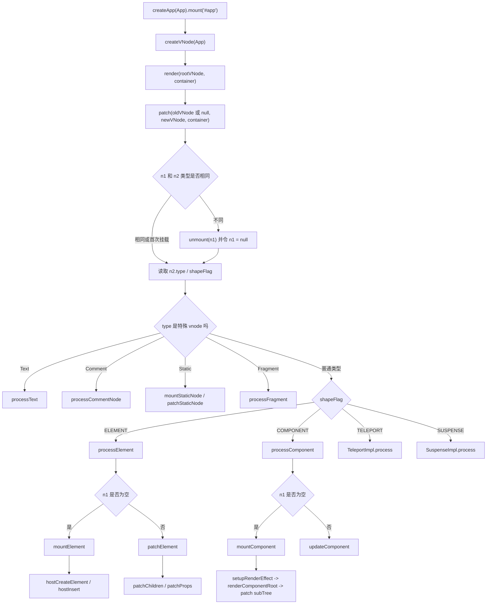
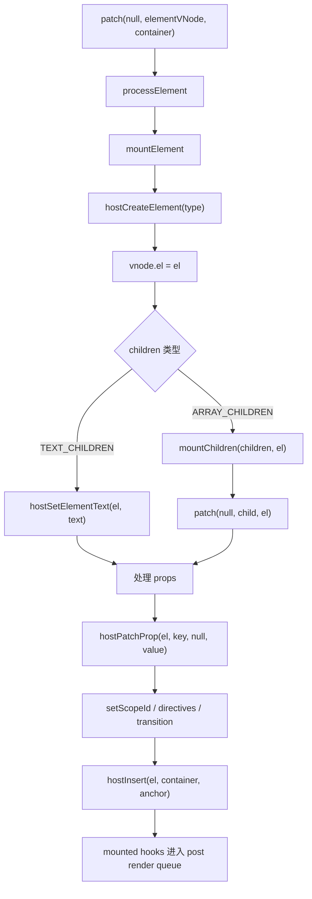
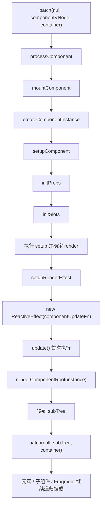
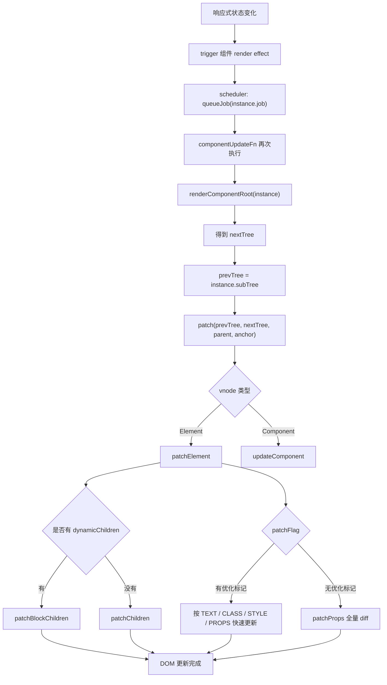

# Vue3 patch 源码流程深入分析

本文基于当前仓库 `vue3` 源码整理，重点分析 `patch` 的入口、参数、vnode 类型分发、元素挂载、组件挂载、DOM 更新、子节点更新、属性更新，以及 `patch` 与 renderer 之间的关系。

## 一、涉及源码文件

| 文件 | 作用 |
| --- | --- |
| `vue3/packages/runtime-core/src/renderer.ts` | `createRenderer`、`baseCreateRenderer`、`render`、`patch`、`processElement`、`processComponent`、`mountElement`、`patchElement`、`patchChildren`、`patchProps` |
| `vue3/packages/runtime-core/src/apiCreateApp.ts` | `createAppAPI` 内部的 `app.mount`，创建根 vnode 并调用 `render` |
| `vue3/packages/runtime-core/src/vnode.ts` | vnode 数据结构，`type`、`shapeFlag`、`patchFlag`、`dynamicChildren` 等字段是 `patch` 分发和优化的依据 |
| `vue3/packages/shared/src/shapeFlags.ts` | `ShapeFlags` 位标记，用于快速判断 vnode 是元素、组件、文本子节点、数组子节点等 |
| `vue3/packages/shared/src/patchFlags.ts` | `PatchFlags` 编译器生成的更新提示，用于 `patchElement` 和 `patchChildren` 快速路径 |
| `vue3/packages/runtime-dom/src/index.ts` | DOM 平台创建 renderer，将 `nodeOps` 和 `patchProp` 传给 `runtime-core` |
| `vue3/packages/runtime-dom/src/nodeOps.ts` | DOM 节点操作：`insert`、`remove`、`createElement`、`setElementText` 等 |
| `vue3/packages/runtime-dom/src/patchProp.ts` | DOM 属性更新分发：class、style、event、DOM prop、attribute |

## 二、patch 的入口在哪里？

`patch` 的源码入口在：

```text
vue3/packages/runtime-core/src/renderer.ts
```

它定义在 `baseCreateRenderer` 闭包内部：

```ts
const patch: PatchFn = (
  n1,
  n2,
  container,
  anchor = null,
  parentComponent = null,
  parentSuspense = null,
  namespace = undefined,
  slotScopeIds = null,
  optimized = __DEV__ && isHmrUpdating ? false : !!n2.dynamicChildren,
) => {
  // ...
}
```

注意：`patch` 不是直接从模块顶层导出的普通函数。它是在创建 renderer 时生成的闭包函数，能直接访问当前平台的 host 操作：

```ts
const {
  insert: hostInsert,
  remove: hostRemove,
  patchProp: hostPatchProp,
  createElement: hostCreateElement,
  createText: hostCreateText,
  createComment: hostCreateComment,
  setText: hostSetText,
  setElementText: hostSetElementText,
  parentNode: hostParentNode,
  nextSibling: hostNextSibling,
  setScopeId: hostSetScopeId = NOOP,
  insertStaticContent: hostInsertStaticContent,
} = options
```

也就是说：

```text
patch = runtime-core 的通用 diff / 挂载 / 更新算法
hostInsert / hostCreateElement / hostPatchProp = runtime-dom 或自定义 renderer 提供的平台操作
```

## 三、patch 是如何被调用的？

最常见调用链来自：

```ts
createApp(App).mount('#app')
```

整体调用链：

```text
runtime-dom createApp(App)
  -> ensureRenderer().createApp(App)
    -> runtime-core createAppAPI(render, hydrate)
      -> app.mount(container)
        -> createVNode(rootComponent, rootProps)
        -> render(rootVNode, rootContainer, namespace)
          -> patch(container._vnode || null, rootVNode, container, null, null, null, namespace)
```

源码中根组件挂载的关键位置：

```ts
// packages/runtime-core/src/apiCreateApp.ts
const vnode = app._ceVNode || createVNode(rootComponent, rootProps)
vnode.appContext = context

if (isHydrate && hydrate) {
  hydrate(vnode as VNode<Node, Element>, rootContainer as any)
} else {
  render(vnode, rootContainer, namespace)
}
```

`render` 内部再进入 `patch`：

```ts
// packages/runtime-core/src/renderer.ts
const render: RootRenderFunction = (vnode, container, namespace) => {
  if (vnode == null) {
    if (container._vnode) {
      unmount(container._vnode, null, null, true)
    }
  } else {
    patch(
      container._vnode || null,
      vnode,
      container,
      null,
      null,
      null,
      namespace,
    )
  }
  container._vnode = vnode
  flushPreFlushCbs(instance)
  flushPostFlushCbs()
}
```

首次挂载时：

```text
container._vnode 为 null
patch(null, rootVNode, container)
```

后续根节点更新时：

```text
container._vnode 是旧 vnode
patch(oldRootVNode, newRootVNode, container)
```

组件内部更新时，`setupRenderEffect` 会重新执行组件 render，并调用：

```ts
patch(
  prevTree,
  nextTree,
  hostParentNode(prevTree.el!)!,
  getNextHostNode(prevTree),
  instance,
  parentSuspense,
  namespace,
)
```

## 四、patch 接收哪些参数？

`PatchFn` 类型定义在 `renderer.ts`：

```ts
type PatchFn = (
  n1: VNode | null,
  n2: VNode,
  container: RendererElement,
  anchor?: RendererNode | null,
  parentComponent?: ComponentInternalInstance | null,
  parentSuspense?: SuspenseBoundary | null,
  namespace?: ElementNamespace,
  slotScopeIds?: string[] | null,
  optimized?: boolean,
) => void
```

参数说明：

| 参数 | 含义 |
| --- | --- |
| `n1` | 旧 vnode。为 `null` 表示首次挂载 |
| `n2` | 新 vnode。`patch` 的目标是让真实 DOM 与 `n2` 描述的 UI 一致 |
| `container` | 当前 vnode 应该挂载或更新所在的宿主容器 |
| `anchor` | 插入锚点，表示新节点要插入到哪个节点之前 |
| `parentComponent` | 父组件实例，用于生命周期、ref、provide/inject、错误处理等上下文 |
| `parentSuspense` | 父 Suspense 边界 |
| `namespace` | 命名空间，例如 `svg`、`mathml` |
| `slotScopeIds` | slot scope id，SFC scoped CSS 相关 |
| `optimized` | 是否走编译器优化路径，通常由 `dynamicChildren` 推导 |

最关键的是前三个：

```text
n1: 旧 vnode
n2: 新 vnode
container: 真实 DOM 容器
```

可以把 `patch` 理解为：

```text
patch(oldVNode, newVNode, container)
  = 把 container 里的旧 UI 调整成 newVNode 描述的新 UI
```

## 五、patch 的核心职责

`patch` 主要做四件事：

1. 如果新旧 vnode 完全相同，直接返回。
2. 如果新旧 vnode 类型不同，卸载旧 vnode，然后把本次处理转成新 vnode 的挂载。
3. 根据 `n2.type` 和 `n2.shapeFlag` 分发到不同处理函数。
4. 在处理完节点后处理 `ref`。

核心逻辑简化后如下：

```ts
const patch: PatchFn = (n1, n2, container, anchor, parentComponent, parentSuspense, namespace, slotScopeIds, optimized) => {
  if (n1 === n2) {
    return
  }

  if (n1 && !isSameVNodeType(n1, n2)) {
    anchor = getNextHostNode(n1)
    unmount(n1, parentComponent, parentSuspense, true)
    n1 = null
  }

  if (n2.patchFlag === PatchFlags.BAIL) {
    optimized = false
    n2.dynamicChildren = null
  }

  const { type, ref, shapeFlag } = n2

  switch (type) {
    case Text:
      processText(...)
      break
    case Comment:
      processCommentNode(...)
      break
    case Static:
      mountStaticNode(...) 或 patchStaticNode(...)
      break
    case Fragment:
      processFragment(...)
      break
    default:
      if (shapeFlag & ShapeFlags.ELEMENT) {
        processElement(...)
      } else if (shapeFlag & ShapeFlags.COMPONENT) {
        processComponent(...)
      } else if (shapeFlag & ShapeFlags.TELEPORT) {
        TeleportImpl.process(...)
      } else if (shapeFlag & ShapeFlags.SUSPENSE) {
        SuspenseImpl.process(...)
      }
  }

  if (ref != null && parentComponent) {
    setRef(...)
  }
}
```

## 六、patch 如何根据 vnode 类型分发处理？

`patch` 先看特殊 vnode 类型，再看 `shapeFlag`。

### 1. 特殊 type 分发

| `n2.type` | 分发函数 | 说明 |
| --- | --- | --- |
| `Text` | `processText` | 挂载或更新文本节点 |
| `Comment` | `processCommentNode` | 挂载或复用注释节点 |
| `Static` | `mountStaticNode` / `patchStaticNode` | 编译器静态提升内容 |
| `Fragment` | `processFragment` | 多根节点片段，使用 start/end anchor 管理 |

### 2. shapeFlag 分发

| 判断条件 | 分发函数 | 说明 |
| --- | --- | --- |
| `shapeFlag & ShapeFlags.ELEMENT` | `processElement` | 普通 DOM 元素 |
| `shapeFlag & ShapeFlags.COMPONENT` | `processComponent` | 状态组件或函数组件 |
| `shapeFlag & ShapeFlags.TELEPORT` | `TeleportImpl.process` | Teleport 特殊渲染逻辑 |
| `shapeFlag & ShapeFlags.SUSPENSE` | `SuspenseImpl.process` | Suspense 特殊渲染逻辑 |

为什么先看 `type` 再看 `shapeFlag`？

因为 `Text`、`Comment`、`Static`、`Fragment` 是 runtime-core 内部定义的特殊 vnode 类型，它们不是普通元素，也不是组件，需要独立逻辑处理。普通元素和组件则可以通过 `shapeFlag` 快速判断。

## 七、vnode 类型分发表

| vnode 类型 | 识别依据 | 首次挂载 | 更新 |
| --- | --- | --- | --- |
| 文本节点 | `type === Text` | `hostCreateText` + `hostInsert` | `hostSetText` |
| 注释节点 | `type === Comment` | `hostCreateComment` + `hostInsert` | 主要复用旧节点 |
| 静态节点 | `type === Static` | `hostInsertStaticContent` | 开发环境可替换静态内容 |
| Fragment | `type === Fragment` | 插入起止锚点，然后 `mountChildren` | 稳定片段走 `patchBlockChildren`，否则走 `patchChildren` |
| Element | `shapeFlag & ELEMENT` | `processElement -> mountElement` | `processElement -> patchElement` |
| Component | `shapeFlag & COMPONENT` | `processComponent -> mountComponent` | `processComponent -> updateComponent` |
| Teleport | `shapeFlag & TELEPORT` | `TeleportImpl.process` | `TeleportImpl.process` |
| Suspense | `shapeFlag & SUSPENSE` | `SuspenseImpl.process` | `SuspenseImpl.process` |

## 八、patch 总体调用链

### 首次挂载根组件

```text
createApp(App).mount('#app')
  -> runtime-dom app.mount
    -> normalizeContainer('#app')
    -> core mount(container, false, namespace)
      -> createVNode(App)
      -> render(rootVNode, container)
        -> patch(null, rootVNode, container)
          -> processComponent(null, rootVNode)
            -> mountComponent(rootVNode)
              -> createComponentInstance(rootVNode)
              -> setupComponent(instance)
              -> setupRenderEffect(instance)
                -> renderComponentRoot(instance)
                -> patch(null, subTree, container)
                  -> processElement / processComponent / processFragment ...
```

### 元素首次挂载

```text
patch(null, elementVNode, container)
  -> shapeFlag & ShapeFlags.ELEMENT
  -> processElement(null, elementVNode)
    -> mountElement(elementVNode)
      -> hostCreateElement(vnode.type)
      -> mount text children or array children
      -> hostPatchProp for props
      -> set scope id / directives / transition hooks
      -> hostInsert(el, container, anchor)
```

### 元素更新

```text
patch(oldElementVNode, newElementVNode, container)
  -> same vnode type
  -> processElement(oldElementVNode, newElementVNode)
    -> patchElement(oldElementVNode, newElementVNode)
      -> n2.el = n1.el
      -> patch dynamicChildren or patchChildren
      -> patch props by patchFlag or full diff
      -> queue updated hooks
```

### 组件更新

```text
响应式状态变化
  -> trigger component render effect
  -> queueJob(instance.job)
  -> instance.update / effect.runIfDirty
    -> renderComponentRoot(instance)
    -> patch(prevTree, nextTree, hostParentNode(prevTree.el), getNextHostNode(prevTree))
```

## 九、processElement 做了什么？

`processElement` 是元素 vnode 的分发函数：

```ts
const processElement = (
  n1,
  n2,
  container,
  anchor,
  parentComponent,
  parentSuspense,
  namespace,
  slotScopeIds,
  optimized,
) => {
  if (n2.type === 'svg') {
    namespace = 'svg'
  } else if (n2.type === 'math') {
    namespace = 'mathml'
  }

  if (n1 == null) {
    mountElement(...)
  } else {
    patchElement(...)
  }
}
```

它的职责非常清晰：

1. 处理 `svg` / `mathml` 命名空间。
2. 如果 `n1 == null`，说明是首次挂载，调用 `mountElement`。
3. 如果 `n1 != null`，说明是更新，调用 `patchElement`。
4. 对 Vue Custom Element 包一层 `_beginPatch` / `_endPatch`。

所以 `processElement` 本身不做复杂 diff，它只是判断：

```text
元素 vnode 是首次出现，还是复用旧 DOM 做更新？
```

## 十、元素挂载流程

`mountElement` 负责把一个元素 vnode 变成真实 DOM。

核心流程：

```text
mountElement(vnode)
  -> hostCreateElement(vnode.type)
  -> vnode.el = el
  -> 处理 children
       文本子节点：hostSetElementText(el, text)
       数组子节点：mountChildren(children, el)
  -> 触发 directive created
  -> setScopeId
  -> 处理 props
       遍历 props
       hostPatchProp(el, key, null, value)
       value 特殊后置处理
  -> 触发 onVnodeBeforeMount / directive beforeMount
  -> transition beforeEnter
  -> hostInsert(el, container, anchor)
  -> queuePostRenderEffect 执行 mounted 类钩子
```

源码关键片段：

```ts
el = vnode.el = hostCreateElement(
  vnode.type as string,
  namespace,
  props && props.is,
  props,
)
```

这一步创建真实 DOM，并把它保存到：

```text
vnode.el
```

之后处理子节点：

```ts
if (shapeFlag & ShapeFlags.TEXT_CHILDREN) {
  hostSetElementText(el, vnode.children as string)
} else if (shapeFlag & ShapeFlags.ARRAY_CHILDREN) {
  mountChildren(vnode.children as VNodeArrayChildren, el, ...)
}
```

再处理 props：

```ts
if (props) {
  for (const key in props) {
    if (key !== 'value' && !isReservedProp(key)) {
      hostPatchProp(el, key, null, props[key], namespace, parentComponent)
    }
  }

  if ('value' in props) {
    hostPatchProp(el, 'value', null, props.value, namespace)
  }
}
```

最后插入 DOM：

```ts
hostInsert(el, container, anchor)
```

在 `runtime-dom` 中，`hostInsert` 来自 `nodeOps.insert`：

```ts
insert: (child, parent, anchor) => {
  parent.insertBefore(child, anchor || null)
}
```

因此普通 DOM 元素的真实创建落点是：

```text
runtime-core mountElement
  -> hostCreateElement
  -> runtime-dom nodeOps.createElement
  -> document.createElement(...)
```

真实插入落点是：

```text
runtime-core mountElement
  -> hostInsert
  -> runtime-dom nodeOps.insert
  -> parent.insertBefore(...)
```

## 十一、组件挂载流程

`processComponent` 是组件 vnode 的分发函数：

```ts
const processComponent = (
  n1,
  n2,
  container,
  anchor,
  parentComponent,
  parentSuspense,
  namespace,
  slotScopeIds,
  optimized,
) => {
  n2.slotScopeIds = slotScopeIds
  if (n1 == null) {
    if (n2.shapeFlag & ShapeFlags.COMPONENT_KEPT_ALIVE) {
      parentComponent!.ctx.activate(...)
    } else {
      mountComponent(...)
    }
  } else {
    updateComponent(n1, n2, optimized)
  }
}
```

首次挂载组件时：

```text
processComponent(null, componentVNode)
  -> mountComponent(componentVNode)
```

更新组件时：

```text
processComponent(oldComponentVNode, newComponentVNode)
  -> updateComponent(oldComponentVNode, newComponentVNode)
```

`mountComponent` 的核心流程：

```text
mountComponent(initialVNode)
  -> initialVNode.component = createComponentInstance(initialVNode, parentComponent, parentSuspense)
  -> setupComponent(instance, false, optimized)
       -> initProps
       -> initSlots
       -> setupStatefulComponent
       -> 执行 setup
       -> 得到 render
  -> setupRenderEffect(instance, initialVNode, container, anchor, ...)
```

`setupRenderEffect` 创建组件渲染 effect：

```ts
const componentUpdateFn = () => {
  if (!instance.isMounted) {
    const subTree = (instance.subTree = renderComponentRoot(instance))
    patch(null, subTree, container, anchor, instance, parentSuspense, namespace)
    initialVNode.el = subTree.el
    instance.isMounted = true
  } else {
    const nextTree = renderComponentRoot(instance)
    const prevTree = instance.subTree
    instance.subTree = nextTree
    patch(
      prevTree,
      nextTree,
      hostParentNode(prevTree.el!)!,
      getNextHostNode(prevTree),
      instance,
      parentSuspense,
      namespace,
    )
  }
}

const effect = (instance.effect = new ReactiveEffect(componentUpdateFn))
const update = (instance.update = effect.run.bind(effect))
const job = (instance.job = effect.runIfDirty.bind(effect))
effect.scheduler = () => queueJob(job)

update()
```

组件挂载的核心结论：

```text
组件 vnode 本身不会直接创建 DOM。
组件先创建 instance，再执行 render 得到 subTree。
subTree 通常是元素 vnode 或 Fragment。
真正创建 DOM 的仍然是 patch(null, subTree, container)。
```

## 十二、mountElement 如何创建真实 DOM？

`mountElement` 通过 renderer options 中的平台函数创建 DOM。

在 DOM 平台中：

```ts
// packages/runtime-dom/src/index.ts
const rendererOptions = extend({ patchProp }, nodeOps)

function ensureRenderer() {
  return renderer || (renderer = createRenderer<Node, Element | ShadowRoot>(rendererOptions))
}
```

`nodeOps.createElement` 是真实 DOM 创建函数：

```ts
createElement: (tag, namespace, is, props): Element => {
  const el =
    namespace === 'svg'
      ? doc.createElementNS(svgNS, tag)
      : namespace === 'mathml'
        ? doc.createElementNS(mathmlNS, tag)
        : is
          ? doc.createElement(tag, { is })
          : doc.createElement(tag)

  return el
}
```

因此：

```text
mountElement
  -> hostCreateElement
  -> nodeOps.createElement
  -> document.createElement / document.createElementNS
```

子节点创建：

```text
文本 children
  -> hostSetElementText
  -> el.textContent = text

数组 children
  -> mountChildren
  -> 对每个 child 调用 patch(null, child, el)
```

属性创建：

```text
props
  -> hostPatchProp(el, key, null, value)
  -> runtime-dom patchProp
  -> patchClass / patchStyle / patchEvent / patchDOMProp / patchAttr
```

DOM 插入：

```text
hostInsert(el, container, anchor)
  -> parent.insertBefore(el, anchor || null)
```

## 十三、patchElement 如何更新 DOM？

`patchElement` 负责复用旧元素 DOM，并根据新旧 vnode 更新 children 和 props。

核心流程：

```text
patchElement(n1, n2)
  -> n2.el = n1.el
  -> 触发 beforeUpdate 相关 vnode hook / directive hook
  -> HMR 情况下取消优化，走完整 diff
  -> 处理 innerHTML / textContent 清空特殊情况
  -> 如果存在 dynamicChildren
       -> patchBlockChildren
     否则如果非 optimized
       -> patchChildren
  -> 根据 patchFlag 更新 props / class / style / text
     如果没有优化标记
       -> patchProps 全量 diff
  -> queuePostRenderEffect 执行 updated 相关 hook
```

第一步是复用旧 DOM：

```ts
const el = (n2.el = n1.el!)
```

这意味着元素更新不是先删旧 DOM 再建新 DOM，而是：

```text
同类型 vnode -> 复用 n1.el -> 局部更新属性和子节点
```

### 1. 子节点更新

如果有 `dynamicChildren`：

```ts
patchBlockChildren(n1.dynamicChildren!, dynamicChildren, el, ...)
```

这是编译器 block tree 优化路径，只更新动态子节点。

如果没有动态子节点，并且不处于 optimized 路径：

```ts
patchChildren(n1, n2, el, null, ...)
```

这是完整 children diff。

### 2. 属性更新

如果 `patchFlag > 0`，表示编译器知道哪些内容是动态的，可以走快速路径：

| `PatchFlags` | 更新行为 |
| --- | --- |
| `FULL_PROPS` | 动态 key，调用 `patchProps` 全量 diff props |
| `CLASS` | 只比较并更新 `class` |
| `STYLE` | 更新 `style` |
| `PROPS` | 只遍历 `dynamicProps` 中记录的动态属性 |
| `TEXT` | 只更新文本 children |

如果没有优化信息：

```ts
patchProps(el, oldProps, newProps, parentComponent, namespace)
```

## 十四、DOM 更新流程

以元素 vnode 更新为主线：

```text
组件状态变化
  -> 组件 render effect 重新执行
  -> renderComponentRoot(instance)
  -> 得到 nextTree
  -> patch(prevTree, nextTree, parentElement, anchor)
    -> processElement(prevTree, nextTree)
      -> patchElement(prevTree, nextTree)
        -> n2.el = n1.el
        -> patchChildren 或 patchBlockChildren
        -> patchProps 或 patchFlag 快速更新
```

如果只是动态文本：

```vue
<div>{{ count }}</div>
```

编译后可能带有 `PatchFlags.TEXT`，更新时大致是：

```text
patchElement
  -> patchFlag & TEXT
  -> if (n1.children !== n2.children)
       hostSetElementText(el, n2.children)
```

如果是动态 class：

```vue
<div :class="cls"></div>
```

更新时大致是：

```text
patchElement
  -> patchFlag & CLASS
  -> if (oldProps.class !== newProps.class)
       hostPatchProp(el, 'class', null, newProps.class, namespace)
```

如果是动态普通 prop：

```vue
<input :value="value" :title="title" />
```

更新时大致是：

```text
patchElement
  -> patchFlag & PROPS
  -> 遍历 dynamicProps
  -> hostPatchProp(el, key, prev, next)
```

## 十五、patchChildren 如何处理子节点？

`patchChildren` 的输入是旧 vnode 和新 vnode，目标是更新它们的 children。

核心判断：

```ts
const c1 = n1 && n1.children
const prevShapeFlag = n1 ? n1.shapeFlag : 0
const c2 = n2.children
const { patchFlag, shapeFlag } = n2
```

children 主要有三种形态：

```text
text children
array children
null children
```

### 1. 编译器快速路径

如果 `patchFlag > 0`：

```ts
if (patchFlag & PatchFlags.KEYED_FRAGMENT) {
  patchKeyedChildren(...)
  return
} else if (patchFlag & PatchFlags.UNKEYED_FRAGMENT) {
  patchUnkeyedChildren(...)
  return
}
```

| patchFlag | 处理函数 | 说明 |
| --- | --- | --- |
| `KEYED_FRAGMENT` | `patchKeyedChildren` | keyed diff，会处理新增、删除、移动 |
| `UNKEYED_FRAGMENT` | `patchUnkeyedChildren` | 按下标尽量复用，尾部新增或删除 |

### 2. 新 children 是文本

```ts
if (shapeFlag & ShapeFlags.TEXT_CHILDREN) {
  if (prevShapeFlag & ShapeFlags.ARRAY_CHILDREN) {
    unmountChildren(c1 as VNode[], parentComponent, parentSuspense)
  }
  if (c2 !== c1) {
    hostSetElementText(container, c2 as string)
  }
}
```

含义：

```text
旧 children 是数组 -> 卸载旧子节点
新旧文本不同 -> 设置 container.textContent
```

### 3. 新 children 不是文本，旧 children 是数组

```ts
if (prevShapeFlag & ShapeFlags.ARRAY_CHILDREN) {
  if (shapeFlag & ShapeFlags.ARRAY_CHILDREN) {
    patchKeyedChildren(...)
  } else {
    unmountChildren(...)
  }
}
```

含义：

```text
旧数组 -> 新数组：执行 diff
旧数组 -> 新空：卸载旧数组
```

### 4. 旧 children 是文本或空，新 children 是数组或空

```ts
if (prevShapeFlag & ShapeFlags.TEXT_CHILDREN) {
  hostSetElementText(container, '')
}

if (shapeFlag & ShapeFlags.ARRAY_CHILDREN) {
  mountChildren(c2 as VNodeArrayChildren, container, anchor, ...)
}
```

含义：

```text
旧文本 -> 新数组：清空文本，再挂载数组
旧空 -> 新数组：直接挂载数组
旧文本 -> 新空：清空文本
```

## 十六、patchChildren 分支表

| 旧 children | 新 children | 处理方式 |
| --- | --- | --- |
| text | text | 文本不同则 `hostSetElementText` |
| array | text | `unmountChildren(oldArray)`，然后设置文本 |
| null | text | 设置文本 |
| text | array | 清空文本，然后 `mountChildren(newArray)` |
| array | array | `patchKeyedChildren` 或 `patchUnkeyedChildren` |
| null | array | `mountChildren(newArray)` |
| text | null | 清空文本 |
| array | null | `unmountChildren(oldArray)` |
| null | null | 不处理 |

## 十七、patchProps 如何更新属性？

`patchProps` 做的是无优化信息时的 props 全量 diff：

```ts
const patchProps = (
  el,
  oldProps,
  newProps,
  parentComponent,
  namespace,
) => {
  if (oldProps !== newProps) {
    if (oldProps !== EMPTY_OBJ) {
      for (const key in oldProps) {
        if (!isReservedProp(key) && !(key in newProps)) {
          hostPatchProp(el, key, oldProps[key], null, namespace, parentComponent)
        }
      }
    }

    for (const key in newProps) {
      if (isReservedProp(key)) continue
      const next = newProps[key]
      const prev = oldProps[key]
      if (next !== prev && key !== 'value') {
        hostPatchProp(el, key, prev, next, namespace, parentComponent)
      }
    }

    if ('value' in newProps) {
      hostPatchProp(el, 'value', oldProps.value, newProps.value, namespace)
    }
  }
}
```

它分三步：

1. 旧 props 中有、新 props 中没有的 key，删除。
2. 新 props 中有、值发生变化的 key，更新。
3. `value` 特殊处理，最后强制更新。

为什么 `value` 要特殊处理？

源码注释说明，DOM 表单元素的 `value` 可能和 `min/max` 等属性存在顺序关系，并且有些场景需要强制更新，所以 Vue 把 `value` 放在最后处理。

## 十八、runtime-dom 的 patchProp 做了什么？

`runtime-core` 只知道要调用：

```ts
hostPatchProp(el, key, prev, next, namespace, parentComponent)
```

真正如何更新 DOM 属性由 `runtime-dom/src/patchProp.ts` 决定：

```ts
export const patchProp = (
  el,
  key,
  prevValue,
  nextValue,
  namespace,
  parentComponent,
) => {
  const isSVG = namespace === 'svg'
  if (key === 'class') {
    patchClass(el, nextValue, isSVG)
  } else if (key === 'style') {
    patchStyle(el, prevValue, nextValue)
  } else if (isOn(key)) {
    if (!isModelListener(key)) {
      patchEvent(el, key, prevValue, nextValue, parentComponent)
    }
  } else if (shouldSetAsProp(el, key, nextValue, isSVG)) {
    patchDOMProp(el, key, nextValue, parentComponent)
  } else {
    patchAttr(el, key, nextValue, isSVG, parentComponent)
  }
}
```

分发表：

| key 类型 | 处理函数 | 说明 |
| --- | --- | --- |
| `class` | `patchClass` | 更新 className 或 SVG class attribute |
| `style` | `patchStyle` | 更新 style 对象、字符串，处理删除旧样式 |
| 事件，如 `onClick` | `patchEvent` | 添加、更新、移除事件 invoker |
| 应该作为 DOM property 设置 | `patchDOMProp` | 例如 `value`、`checked` 等 |
| 其他 attribute | `patchAttr` | `setAttribute` / `removeAttribute` |

这就是 `runtime-core` 和 `runtime-dom` 的边界：

```text
runtime-core: 决定什么时候更新哪个 key
runtime-dom: 决定这个 key 在 DOM 上应该怎么更新
```

## 十九、patch 与 renderer 的关系是什么？

`patch` 是 renderer 的核心算法，但它依赖 renderer options 提供平台能力。

`createRenderer` 的入口：

```ts
export function createRenderer(options: RendererOptions): Renderer {
  return baseCreateRenderer(options)
}
```

`RendererOptions` 定义了平台必须提供的操作：

```ts
export interface RendererOptions {
  patchProp(...)
  insert(...)
  remove(...)
  createElement(...)
  createText(...)
  createComment(...)
  setText(...)
  setElementText(...)
  parentNode(...)
  nextSibling(...)
  querySelector?(...)
  setScopeId?(...)
  cloneNode?(...)
  insertStaticContent?(...)
}
```

`baseCreateRenderer` 用这些 options 生成：

```ts
return {
  render,
  hydrate,
  createApp: createAppAPI(render, hydrate),
}
```

同时还会把内部能力打包成 `internals`，传给 Teleport、Suspense、KeepAlive、hydration 等特性：

```ts
const internals: RendererInternals = {
  p: patch,
  um: unmount,
  m: move,
  r: remove,
  mt: mountComponent,
  mc: mountChildren,
  pc: patchChildren,
  pbc: patchBlockChildren,
  n: getNextHostNode,
  o: options,
}
```

所以关系是：

```text
createRenderer(options)
  -> baseCreateRenderer(options)
    -> 创建 patch / mount / update / unmount 等闭包函数
    -> 返回 render / hydrate / createApp

render(vnode, container)
  -> patch(oldVNode, newVNode, container)

patch
  -> 使用 hostCreateElement / hostInsert / hostPatchProp 等平台操作
```

一句话：

```text
renderer 是运行时渲染器实例。
patch 是 renderer 内部最核心的递归更新算法。
runtime-dom 通过 rendererOptions 把 DOM 操作注入 runtime-core。
```

## 二十、Mermaid：patch 总流程



## 二十一、Mermaid：元素挂载流程



## 二十二、Mermaid：组件挂载流程



## 二十三、Mermaid：DOM 更新流程



## 二十四、写出示例代码

### 1. 首次挂载元素

用户代码：

```ts
import { createApp, h } from 'vue'

const App = {
  render() {
    return h('div', { id: 'root' }, 'hello')
  },
}

createApp(App).mount('#app')
```

对应流程：

```text
createApp(App).mount('#app')
  -> createVNode(App)
  -> render(rootVNode, container)
  -> patch(null, rootVNode, container)
    -> processComponent
      -> mountComponent
        -> renderComponentRoot
        -> 得到 h('div') 创建的 element vnode
        -> patch(null, divVNode, container)
          -> processElement
            -> mountElement
              -> document.createElement('div')
              -> el.textContent = 'hello'
              -> patchProp(el, 'id', null, 'root')
              -> container.insertBefore(el, null)
```

### 2. 更新文本 children

用户代码：

```ts
import { createApp, ref, h } from 'vue'

const App = {
  setup() {
    const count = ref(0)

    setTimeout(() => {
      count.value++
    }, 1000)

    return () => h('div', count.value)
  },
}

createApp(App).mount('#app')
```

首次渲染：

```text
patch(null, divVNode, container)
  -> mountElement
  -> hostSetElementText(div, '0')
  -> hostInsert(div, container)
```

`count.value++` 后：

```text
trigger ref dependency
  -> component render effect scheduler
  -> renderComponentRoot
  -> nextTree = h('div', '1')
  -> patch(prevTree, nextTree, parent)
    -> processElement
    -> patchElement
    -> patchChildren 或 TEXT fast path
    -> hostSetElementText(div, '1')
```

### 3. 更新 props

用户代码：

```ts
import { createApp, ref, h } from 'vue'

const App = {
  setup() {
    const active = ref(false)

    setTimeout(() => {
      active.value = true
    }, 1000)

    return () =>
      h(
        'button',
        {
          class: active.value ? 'active' : 'normal',
          disabled: !active.value,
        },
        active.value ? 'enabled' : 'disabled',
      )
  },
}

createApp(App).mount('#app')
```

更新时：

```text
patch(oldButtonVNode, newButtonVNode, container)
  -> processElement
  -> patchElement
    -> patchChildren 更新按钮文本
    -> patchProps 或 patchFlag 快速路径更新 class / disabled
      -> hostPatchProp(button, 'class', 'normal', 'active')
      -> hostPatchProp(button, 'disabled', true, false)
```

### 4. 子节点数组更新

用户代码：

```ts
import { createApp, ref, h } from 'vue'

const App = {
  setup() {
    const list = ref([
      { id: 1, text: 'A' },
      { id: 2, text: 'B' },
    ])

    setTimeout(() => {
      list.value = [
        { id: 2, text: 'B' },
        { id: 3, text: 'C' },
        { id: 1, text: 'A' },
      ]
    }, 1000)

    return () =>
      h(
        'ul',
        list.value.map(item => h('li', { key: item.id }, item.text)),
      )
  },
}

createApp(App).mount('#app')
```

更新时会进入：

```text
patchChildren
  -> 新旧 children 都是 array
  -> patchKeyedChildren
    -> 从头同步
    -> 从尾同步
    -> 建立 keyToNewIndexMap
    -> patch 可复用节点
    -> unmount 已不存在节点
    -> mount 新节点
    -> 对需要移动的节点执行 move
```

`patchKeyedChildren` 是 Vue3 diff 算法核心，适合单独作为下一篇深入分析。

## 二十五、重点源码阅读顺序

建议按照下面顺序阅读：

1. `runtime-dom/src/index.ts`
   先看 DOM 平台如何调用 `createRenderer(rendererOptions)`，理解 renderer options 是怎么进入 runtime-core 的。

2. `runtime-core/src/apiCreateApp.ts`
   看 `app.mount` 如何创建根 vnode，并调用 `render`。

3. `runtime-core/src/renderer.ts` 的 `render`
   看根级别如何调用 `patch(container._vnode || null, vnode, container)`。

4. `runtime-core/src/renderer.ts` 的 `patch`
   看 vnode 类型分发，这是整个渲染流程的中枢。

5. `processElement -> mountElement -> patchElement`
   先理解普通 DOM 元素的创建和更新。

6. `patchChildren -> patchKeyedChildren`
   再理解子节点 diff，尤其是 keyed children。

7. `processComponent -> mountComponent -> setupRenderEffect`
   理解组件为什么最终仍然会回到 `patch(subTree)`。

8. `runtime-dom/src/nodeOps.ts` 和 `runtime-dom/src/patchProp.ts`
   最后看真实 DOM 创建、插入、属性更新的落点。

## 二十六、常见问题

### 1. patch 是 diff 算法吗？

广义上是。`patch` 是 Vue renderer 的核心递归更新算法，负责比较新旧 vnode 并分发处理。

狭义上，常说的 Vue3 diff 算法通常指 `patchKeyedChildren`，也就是数组子节点 keyed diff 的部分。

### 2. patch 会直接操作 DOM 吗？

`patch` 自己不直接写 `document.createElement` 或 `appendChild`。它调用抽象的 host 操作：

```text
hostCreateElement
hostInsert
hostPatchProp
hostSetElementText
```

在 DOM 平台，这些 host 操作由 `runtime-dom` 提供，最终落到浏览器 DOM API。

### 3. 组件 vnode 的 DOM 是在哪里创建的？

组件 vnode 本身不会创建 DOM。组件挂载流程是：

```text
component vnode
  -> createComponentInstance
  -> setupComponent
  -> renderComponentRoot
  -> subTree vnode
  -> patch(null, subTree)
```

真正创建 DOM 的是组件 render 返回的 `subTree`。

### 4. 为什么 `patchElement` 要 `n2.el = n1.el`？

因为同类型元素更新时要复用旧 DOM。新 vnode 是新的 JavaScript 对象，但真实 DOM 应该继续使用旧 vnode 上的 `el`。

所以：

```text
n1.el 是旧 DOM
n2.el = n1.el
后续更新都作用在同一个 DOM 元素上
```

### 5. `patchFlag` 和 `shapeFlag` 有什么区别？

| 字段 | 来源 | 作用 |
| --- | --- | --- |
| `shapeFlag` | vnode 创建时根据类型和 children 生成 | 描述 vnode 的形状，用于运行时分发 |
| `patchFlag` | 编译器生成，手写 render 通常没有 | 描述哪些部分是动态的，用于更新优化 |

例子：

```text
shapeFlag: 这个 vnode 是元素，并且 children 是文本
patchFlag: 这个元素只有文本是动态的
```

### 6. `dynamicChildren` 有什么用？

`dynamicChildren` 是 block tree 优化的一部分。编译器会把一个 block 中需要更新的动态子节点收集起来。

更新时：

```text
有 dynamicChildren
  -> patchBlockChildren
  -> 只 patch 动态节点

没有 dynamicChildren
  -> patchChildren
  -> 做完整 children diff
```

它的目标是减少更新时需要遍历的 vnode 数量。

## 二十七、核心结论

1. `patch` 位于 `runtime-core/src/renderer.ts` 的 `baseCreateRenderer` 闭包内部。
2. `patch` 的核心输入是旧 vnode、新 vnode 和容器：`patch(n1, n2, container)`。
3. 首次挂载时 `n1 === null`，更新时 `n1` 是旧 vnode。
4. `patch` 先处理新旧 vnode 类型不同的情况，不同则卸载旧节点并挂载新节点。
5. `patch` 根据 `type` 和 `shapeFlag` 分发到 Text、Comment、Static、Fragment、Element、Component、Teleport、Suspense。
6. `processElement` 根据 `n1` 是否为空选择 `mountElement` 或 `patchElement`。
7. `mountElement` 通过 `hostCreateElement` 创建真实 DOM，通过 `hostInsert` 插入真实 DOM。
8. `patchElement` 复用旧 DOM，通过 `patchChildren` / `patchBlockChildren` 更新子节点，通过 `patchProps` 或 `patchFlag` 快速路径更新属性。
9. `processComponent` 根据 `n1` 是否为空选择 `mountComponent` 或 `updateComponent`。
10. 组件挂载后会执行 render 得到 `subTree`，再递归调用 `patch` 挂载组件子树。
11. `runtime-core` 不直接依赖 DOM API，真实 DOM 操作由 `runtime-dom` 的 `nodeOps` 和 `patchProp` 注入。
12. renderer 是由 `createRenderer(options)` 创建的渲染器实例，`patch` 是这个 renderer 内部的核心递归算法。

