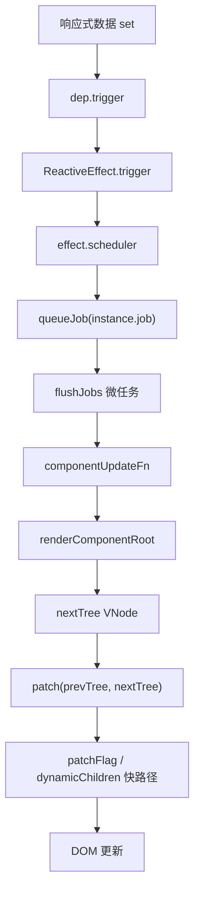
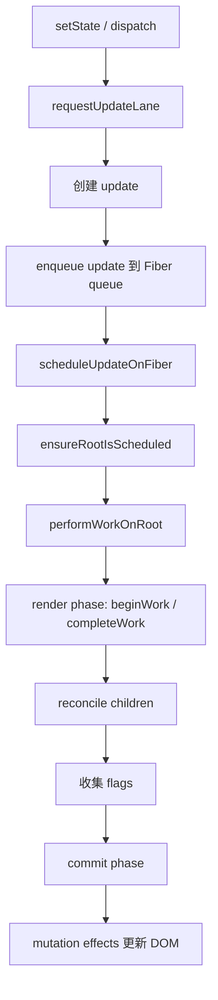

# Vue3 与 React 核心实现差异源码设计对比

本文从源码设计角度对比 Vue3 和 React 的核心实现差异，重点覆盖更新触发机制、组件更新粒度、虚拟 DOM、diff、调度、编译优化、Hooks / Composition API 以及框架设计哲学。

> 说明：Vue3 部分基于当前仓库 `vue3/packages/*` 源码；React 部分基于 React 当前主线源码结构进行对照，核心文件包括 `ReactFiberHooks.js`、`ReactFiberWorkLoop.js`、`ReactFiberLane.js`、`ReactChildFiber.js`、`ReactFiber.js`、`ReactJSXElement.js` 等。不同 React 版本文件细节可能有变化，但 Fiber / Lane / reconciliation 的设计主线是一致的。

## 一、总览对比表

| 维度 | Vue3 | React |
| --- | --- | --- |
| 更新触发机制 | 响应式依赖收集。render 时读取响应式数据，数据变化后自动触发依赖它的 component render effect。 | 显式触发。调用 `setState`、Hook dispatch、root render 等 API，把 update 放入 Fiber update queue。 |
| 组件更新粒度 | 依赖追踪到组件 render effect。哪个组件 render 读了哪个响应式数据，哪个组件被调度更新。 | 以 Fiber 树为工作单元。从发生更新的 Fiber/root 开始调度，再在 render 阶段遍历 Fiber 子树。 |
| 虚拟 DOM | `VNode` 是一次 render 的轻量描述，组件实例另存在 `ComponentInternalInstance`。 | `React Element` 是 JSX 的轻量描述；`Fiber` 是持久工作节点，承载状态、调度、effect、alternate。 |
| diff 算法 | `patchKeyedChildren`：前后双端预处理 + 中间区 key map + LIS 减少移动。 | child reconciliation：顺序扫描 + key map 查找 + `lastPlacedIndex` 标记 Placement，不使用 LIS。 |
| 调度机制 | `scheduler.ts` 的 job queue。组件 effect 的 scheduler 是 `queueJob(instance.job)`，微任务批量 flush。 | Scheduler + Fiber + Lane。update 分配 lane，调度 root，render work 可按优先级切分、暂停、恢复。 |
| 编译时优化 | template compiler 生成 `patchFlag`、`block tree`、`dynamicChildren`，运行时精准更新动态点。 | 传统 JSX 主要编译为 element 创建调用，核心优化更多在运行时 Fiber/reconciliation。React Compiler 提供自动 memoization，但不是 Vue template compiler 这种必经模板编译管线。 |
| Hooks / Composition API | Composition API 基于响应式系统，`ref/reactive/computed/watch` 是独立 primitive。 | Hooks 状态存储在 Fiber 的 hook 链表上，依赖调用顺序；dispatch 显式触发 Fiber 更新。 |
| 框架哲学 | 编译时 + 运行时结合。通过模板静态分析降低运行时成本。 | 更偏运行时调度模型。组件函数重新执行，Fiber 负责调度、优先级、协调和提交。 |
| 性能默认策略 | 编译器标记动态点，运行时默认可以跳过大量静态结构。 | 默认重新执行函数组件；通过 memo、useMemo、useCallback、React Compiler 或 Fiber bailout 减少工作。 |
| 心智模型 | “数据变了，依赖它的组件更新”。 | “显式发起状态更新，React 调度一次重新 render”。 |

## 二、源码位置对照

| 主题 | Vue3 当前仓库 | React 典型源码 |
| --- | --- | --- |
| 响应式入口 | `packages/reactivity/src/reactive.ts`、`ref.ts` | React 没有内建响应式追踪；状态更新从 `setState` / Hook dispatch 进入 |
| 依赖收集 | `packages/reactivity/src/dep.ts`、`effect.ts` | 无 Vue 式 target/key 依赖图；Fiber 记录 state、props、context、lanes |
| 组件 render effect | `packages/runtime-core/src/renderer.ts` 的 `setupRenderEffect` | `ReactFiberBeginWork.js`、`ReactFiberHooks.js`、`ReactFiberWorkLoop.js` |
| 更新调度 | `packages/runtime-core/src/scheduler.ts` | `ReactFiberWorkLoop.js`、`ReactFiberRootScheduler.js`、`Scheduler` package |
| vnode / element | `packages/runtime-core/src/vnode.ts` | `ReactJSXElement.js` |
| Fiber | Vue3 无 Fiber，组件实例为 `ComponentInternalInstance` | `ReactFiber.js` |
| diff | `packages/runtime-core/src/renderer.ts` 的 `patchKeyedChildren` | `ReactChildFiber.js` |
| 编译优化 | `packages/compiler-core/src/transforms/transformElement.ts`、`runtime-core/src/vnode.ts` | JSX transform、React Compiler、Fiber bailout |

## 三、更新触发机制差异

### Vue3：响应式依赖收集自动触发

Vue3 的核心是响应式系统。组件首次渲染时会创建 component render effect：

```ts
const effect = (instance.effect = new ReactiveEffect(componentUpdateFn))
const job = (instance.job = effect.runIfDirty.bind(effect))
job.id = instance.uid
effect.scheduler = () => queueJob(job)

update()
```

当 render 函数读取响应式数据：

```ts
const count = ref(0)

// render 中读取
count.value
```

会进入：

```text
RefImpl.get value
  -> dep.track()
  -> 当前 activeSub 是组件 render effect
  -> ref.dep 记录这个 render effect
```

之后状态变化：

```ts
count.value++
```

会触发：

```text
RefImpl.set value
  -> dep.trigger()
  -> ReactiveEffect.trigger()
  -> effect.scheduler()
  -> queueJob(instance.job)
```

也就是说，Vue3 用户代码只改数据，框架通过依赖图知道哪些组件需要更新。

### React：setState / dispatch 显式触发

React 没有 Vue3 这种通用响应式依赖追踪。状态更新来自显式 API：

```tsx
const [count, setCount] = useState(0)

setCount(count + 1)
```

Hook dispatch 的主线是：

```text
dispatchSetState
  -> requestUpdateLane(fiber)
  -> 创建 update
  -> enqueueConcurrentHookUpdate(fiber, queue, update, lane)
  -> scheduleUpdateOnFiber(root, fiber, lane)
```

class component 的 `setState` 主线是：

```text
Component.prototype.setState
  -> this.updater.enqueueSetState(...)
  -> 创建 update
  -> enqueueUpdate
  -> scheduleUpdateOnFiber
```

React 的关键点是：状态更新必须通过 `setState` 或 dispatch 进入 React。直接改变量不会触发组件更新。

```tsx
let count = 0

function App() {
  function increment() {
    count++ // 不会触发 React 更新
  }

  return <button onClick={increment}>{count}</button>
}
```

## 四、调用链差异

### Vue3：`count.value++` 到组件更新

```text
count.value++
  -> RefImpl.set value
  -> dep.trigger()
  -> Dep.notify()
  -> ReactiveEffect.notify()
  -> batch / endBatch
  -> ReactiveEffect.trigger()
  -> effect.scheduler()
  -> queueJob(instance.job)
  -> queueFlush()
  -> flushJobs()
  -> instance.job()
  -> effect.runIfDirty()
  -> componentUpdateFn()
  -> renderComponentRoot(instance)
  -> patch(prevTree, nextTree)
  -> patchElement / patchChildren / patchProps
  -> DOM 更新
```

特点：

- 触发点是响应式数据写入。
- render effect 已经在首次 render 时被收集。
- scheduler 只调度依赖该数据的组件 render effect。

### React：`setCount` 到组件更新

```text
setCount(next)
  -> dispatchSetState(fiber, queue, action)
  -> requestUpdateLane(fiber)
  -> 创建 update: { lane, action, next, ... }
  -> enqueueConcurrentHookUpdate(fiber, queue, update, lane)
  -> scheduleUpdateOnFiber(root, fiber, lane)
  -> markRootUpdated(root, lane)
  -> ensureRootIsScheduled(root)
  -> performWorkOnRoot(root, lanes)
  -> render phase:
     -> beginWork
     -> renderWithHooks
     -> 执行函数组件
     -> reconcile children
  -> complete phase:
     -> 收集 effect flags
  -> commit phase:
     -> mutation effects 更新 DOM
     -> layout effects
     -> passive effects
```

特点：

- 触发点是显式 dispatch。
- React 不知道组件函数内部“具体读了哪个 state 属性”。
- React 通过 Fiber 树和 lanes 管理这次更新的优先级、遍历、提交。

## 五、组件更新粒度差异

### Vue3：依赖追踪到组件 render effect

Vue3 组件更新粒度是“组件级 effect”：

```text
组件 A render 读取 count
  -> count.dep 收集 A 的 render effect

组件 B render 没有读取 count
  -> count.dep 不会收集 B

count.value++
  -> 只触发收集过的 render effect
```

注意：Vue3 不是细到“只重新执行模板里某一行表达式”。组件更新时仍会重新执行该组件 render 函数，但得益于 `patchFlag` 和 `dynamicChildren`，DOM patch 阶段可以非常精准。

### React：从 Fiber 更新点开始重新 render

React 函数组件状态更新后，通常会重新执行该函数组件：

```tsx
function Counter() {
  const [count, setCount] = useState(0)
  console.log('render Counter')
  return <div>{count}</div>
}
```

每次 `setCount` 后，`Counter` 函数会重新执行。子组件是否重新 render，取决于：

- 父组件是否重新创建子 element。
- 子组件是否 `memo`。
- props 是否可 bailout。
- Fiber lanes / childLanes 是否表明子树有待处理工作。
- context、state、props 是否变化。

### 粒度对比

| 问题 | Vue3 | React |
| --- | --- | --- |
| 谁知道数据依赖？ | 响应式系统知道 target/key -> effect。 | React 不追踪普通变量读取；只知道哪里显式发起 update。 |
| 更新从哪里开始？ | 被触发的 component render effect。 | 被调度的 Fiber/root。 |
| 组件函数是否重跑？ | 对应组件 render effect 会重跑 render。 | 对应函数组件会重跑，父子链路可能继续 reconciliation。 |
| 子树跳过依赖什么？ | 响应式依赖 + 编译优化 + patchFlag。 | memo、bailout、lanes、shouldComponentUpdate、React Compiler 等。 |

## 六、虚拟 DOM：VNode vs React Element / Fiber

### Vue3 VNode

Vue3 的 vnode 是 render 结果的轻量描述，核心字段包括：

```ts
type VNode = {
  type: any
  props: Record<string, any> | null
  key: string | number | symbol | null
  ref: any
  children: any
  el: RendererNode | null
  component: ComponentInternalInstance | null
  shapeFlag: number
  patchFlag: number
  dynamicProps: string[] | null
  dynamicChildren: VNode[] | null
}
```

Vue3 运行时围绕 vnode 做：

```text
renderComponentRoot(instance)
  -> nextTree: VNode
  -> patch(prevTree, nextTree)
```

组件实例单独存在：

```text
ComponentInternalInstance
  -> vnode
  -> subTree
  -> effect
  -> update
  -> setupState
  -> props
```

### React Element

React Element 是 JSX 编译后产生的轻量对象，大致包含：

```ts
type ReactElement = {
  $$typeof: symbol
  type: any
  key: string | null
  props: object
  _owner?: Fiber
}
```

JSX：

```tsx
<div className="box">{count}</div>
```

会变成 element 创建调用：

```ts
jsx('div', {
  className: 'box',
  children: count
})
```

### React Fiber

React 真正用于调度和更新的不是 React Element，而是 Fiber。Fiber 是持久数据结构：

```ts
type Fiber = {
  tag: WorkTag
  key: null | string
  elementType: any
  type: any
  stateNode: any

  return: Fiber | null
  child: Fiber | null
  sibling: Fiber | null
  index: number

  pendingProps: any
  memoizedProps: any
  memoizedState: any
  updateQueue: any

  flags: Flags
  subtreeFlags: Flags
  lanes: Lanes
  childLanes: Lanes
  alternate: Fiber | null
}
```

Fiber 同时承载：

- 组件类型。
- 父子兄弟关系。
- Hook 链表状态。
- update queue。
- effect flags。
- lanes 优先级。
- current / workInProgress 双缓冲。

### 数据结构差异表

| 维度 | Vue3 VNode | React Element | React Fiber |
| --- | --- | --- | --- |
| 是否持久 | 不持久，每次 render 产生新 vnode 树。 | 不持久，每次 render 产生新 element。 | 持久，跨 render 复用 current / alternate。 |
| 是否承载调度 | 不承载调度。 | 不承载调度。 | 承载 lanes、flags、updateQueue。 |
| 是否连接真实 DOM | `vnode.el` 指向 DOM。 | 不直接指向 DOM。 | HostComponent fiber 的 `stateNode` 指向 DOM。 |
| 是否保存组件状态 | 不保存，组件状态在 instance。 | 不保存。 | 保存 hook state / class state / update queue。 |
| 主要角色 | render 结果 + patch 输入。 | JSX 结果 + reconciliation 输入。 | 调度、render、commit 的工作单元。 |

## 七、diff 算法差异

### Vue3：双端预处理 + LIS

Vue3 `patchKeyedChildren` 的核心阶段：

```text
1. sync from start
2. sync from end
3. old exhausted -> mount new
4. new exhausted -> unmount old
5. unknown sequence
   -> keyToNewIndexMap
   -> newIndexToOldIndexMap
   -> patch 可复用节点
   -> getSequence(newIndexToOldIndexMap)
   -> 倒序 mount / move
```

关键点：

- 先处理相同前缀和后缀，缩小问题范围。
- 中间乱序区通过 key 找复用节点。
- 用最长递增子序列找“可以不动”的节点，减少移动。

示例：

```text
old: [a, b, c, d]
new: [a, c, b, d]

前缀 a 相同，后缀 d 相同。
中间 old: [b, c]
中间 new: [c, b]

LIS 用来决定尽量少移动哪个节点。
```

### React：child reconciliation

React child reconciliation 的核心思路：

```text
reconcileChildrenArray
  -> 从左到右比较 oldFiber 和 newChildren[newIdx]
  -> 能复用则复用 fiber
  -> 不能继续顺序匹配时，建立剩余 old fiber 的 key/index map
  -> 对剩余 new children 逐个 updateFromMap
  -> placeChild 根据 old index 与 lastPlacedIndex 判断是否需要 Placement
  -> 删除 map 中剩余 old fiber
```

React 源码注释中明确提到：由于 Fiber 没有 backpointers 给 children 列表做双端优化，算法不能像双端 diff 那样从两端搜索。

React 不使用 LIS，而是用 `lastPlacedIndex` 判断节点是否移动：

```text
如果 oldIndex < lastPlacedIndex:
  标记 Placement，需要移动
否则:
  更新 lastPlacedIndex，认为当前节点可保持相对位置
```

### diff 差异表

| 维度 | Vue3 | React |
| --- | --- | --- |
| 前后缀优化 | 有，sync from start / end。 | 主要从左到右扫描。 |
| 中间乱序 | key map + `newIndexToOldIndexMap`。 | key/index map + `updateFromMap`。 |
| 移动判断 | `moved` + LIS。 | `lastPlacedIndex` + Placement flag。 |
| 是否最小化移动 | 通过 LIS 尽量减少移动。 | 不追求 LIS 级别的最少移动，更强调简单线性协调和 Fiber 模型。 |
| 工作单元 | vnode children。 | fiber child/sibling 链表。 |
| 编译信息参与 | patchFlag / dynamicChildren 可以减少进入完整 diff 的机会。 | 主要运行时 reconciliation，React Compiler 可减少部分重新 render。 |

## 八、调度机制差异

### Vue3 scheduler job queue

Vue3 scheduler 位于 `packages/runtime-core/src/scheduler.ts`。组件更新任务入队：

```ts
effect.scheduler = () => queueJob(job)
```

`queueJob` 做三件事：

```text
1. 用 SchedulerJobFlags.QUEUED 去重
2. 按 job.id 插入，保证父组件优先于子组件
3. queueFlush，用 Promise 微任务执行 flushJobs
```

简化流程：

```text
queueJob(instance.job)
  -> queue.push(job)
  -> job.flags |= QUEUED
  -> Promise.resolve().then(flushJobs)
  -> flushJobs()
     -> job()
     -> componentUpdateFn()
```

Vue3 的调度目标是“批量、去重、有序地执行组件更新 job”。

### React Scheduler + Fiber + Lane

React 的调度更复杂。一次 update 会先分配 lane：

```text
requestUpdateLane(fiber)
  -> SyncLane / DefaultLane / TransitionLane / IdleLane ...
```

Lane 是位图：

```text
SyncLane              0b...0010
DefaultLane           0b...100000
TransitionLanes       0b...一组 bit
IdleLane              0b...
```

然后：

```text
scheduleUpdateOnFiber(root, fiber, lane)
  -> markRootUpdated(root, lane)
  -> ensureRootIsScheduled(root)
  -> performWorkOnRoot(root, lanes)
```

Fiber work loop 可以：

- 按优先级选择 lanes。
- 并发模式下把 render work 切片。
- 暂停、恢复、丢弃、重做 workInProgress。
- 支持 Suspense、transition、hydration、offscreen 等复杂场景。

### 调度差异表

| 维度 | Vue3 | React |
| --- | --- | --- |
| 调度单位 | scheduler job，通常是组件 `instance.job`。 | Fiber root 上的 lanes 和 Fiber work。 |
| 优先级模型 | 主要是队列顺序、pre/post flush、job id。 | Lane 位图表达多优先级。 |
| 是否可中断 render | Vue3 组件更新通常在 flush 中同步完成。 | Concurrent rendering 可中断、恢复、重做。 |
| 批处理 | 微任务批量 flush。 | automatic batching + Scheduler + lanes。 |
| 复杂能力 | 适合大多数 UI 更新，模型较轻。 | 支持 transition、Suspense、时间切片等复杂调度。 |

## 九、编译时优化差异

### Vue3：template compiler 是核心优化来源

Vue3 template compiler 会生成 patch hints：

```vue
<div>
  <p>static</p>
  <span :class="cls">{{ count }}</span>
</div>
```

编译器会分析：

```text
span class 动态 -> PatchFlags.CLASS
span text 动态  -> PatchFlags.TEXT
block 收集动态节点 -> dynamicChildren
```

运行时 `patchElement` 可以走快路径：

```text
patchFlag & CLASS -> 只更新 class
patchFlag & TEXT  -> 只更新文本
dynamicChildren   -> 只 patch 动态 children
```

这就是 Vue3 “编译时 + 运行时结合”的典型体现。

### React：JSX 更偏运行时，React Compiler 是补充

传统 React JSX 编译主要做语法转换：

```tsx
<div className={cls}>{count}</div>
```

变成：

```ts
jsx('div', {
  className: cls,
  children: count
})
```

它不会像 Vue template compiler 那样默认生成 `patchFlag` 告诉运行时“只有 class 和 text 动态”。React 更依赖运行时重新执行组件函数、生成 element，再通过 Fiber reconciliation 计算变化。

需要补充的是：现代 React 已经有 React Compiler。它是 build-time 工具，目标主要是自动 memoization，减少不必要的重新 render 和手写 `memo/useMemo/useCallback`。但它和 Vue template compiler 的定位不同：

| 维度 | Vue template compiler | React Compiler |
| --- | --- | --- |
| 输入 | Vue template / SFC template。 | React 组件 JavaScript / JSX。 |
| 默认地位 | Vue template 模式下是核心编译管线。 | 可逐步采用的编译优化工具。 |
| 输出重点 | `patchFlag`、block tree、runtime helper。 | 自动 memoization、代码验证与优化。 |
| 运行时协作 | runtime patch 强依赖这些 flags 走快路径。 | 主要减少重渲染和重复计算，不改变 Fiber 是核心协调模型。 |

## 十、Hooks 与 Composition API 差异

### React Hooks：基于 Fiber 的 hook 链表

React Hooks 状态存储在当前 Fiber 的 `memoizedState` 链表上。源码注释的核心意思是：

```text
Hooks are stored as a linked list on the fiber's memoizedState field.
```

简化结构：

```ts
type Hook = {
  memoizedState: any
  baseState: any
  baseQueue: Update | null
  queue: UpdateQueue | null
  next: Hook | null
}
```

函数组件每次 render 时，React 按调用顺序依次读取 hook：

```tsx
function App() {
  const [a, setA] = useState(0) // 第 1 个 hook
  const [b, setB] = useState(0) // 第 2 个 hook
}
```

因此 React 要求 Hooks 不能放在条件分支里：

```tsx
function App({ ok }) {
  if (ok) {
    useState(0) // 不允许：会破坏 hook 调用顺序
  }
}
```

Hook dispatch 会显式把 update 放进 hook queue，然后调度 Fiber。

### Vue3 Composition API：基于响应式 primitive

Vue3 Composition API 的状态来自响应式 primitive：

```ts
const count = ref(0)
const double = computed(() => count.value * 2)

watchEffect(() => {
  console.log(count.value)
})
```

这些 API 不依赖“第几个 Hook”的调用顺序保存状态。它们创建的是普通响应式对象、effect、computed ref。

`setup` 执行时会有 `currentInstance`，用于生命周期、provide/inject 等 API 关联组件：

```text
setupComponent
  -> setCurrentInstance(instance)
  -> setup()
     -> onMounted(...)
     -> provide(...)
     -> ref(...)
  -> unsetCurrentInstance
```

但 `ref`、`computed`、`watch` 本身可以独立于组件使用。

### Hooks vs Composition API 表

| 维度 | React Hooks | Vue3 Composition API |
| --- | --- | --- |
| 状态存储 | Fiber.memoizedState hook 链表。 | `ref/reactive` 对象 + effect graph。 |
| 更新触发 | dispatch 显式触发 Fiber update。 | 响应式 set 自动 trigger effect。 |
| 调用顺序 | 必须保持稳定调用顺序。 | 不靠顺序保存状态，但生命周期 API 需要同步 setup 上下文。 |
| 依赖数组 | `useEffect/useMemo/useCallback` 需要 deps 描述缓存或副作用边界。 | `watchEffect` 自动收集依赖；`watch` 可显式指定 source。 |
| 复用单位 | custom hook。 | composable 函数。 |
| 脱离组件使用 | Hooks 不能在组件外调用。 | `reactivity` primitive 可以在组件外使用。 |

## 十一、数据结构差异

### Vue3 核心数据结构

```text
targetMap: WeakMap<object, Map<key, Dep>>
  -> Dep
     -> subscribers: ReactiveEffect / Computed

ReactiveEffect
  -> fn: componentUpdateFn / computed getter / watch job
  -> deps
  -> scheduler

ComponentInternalInstance
  -> vnode
  -> subTree
  -> effect
  -> update
  -> job
  -> setupState / props / slots

VNode
  -> type / props / children
  -> shapeFlag / patchFlag
  -> dynamicChildren
  -> el / component
```

### React 核心数据结构

```text
ReactElement
  -> $$typeof
  -> type
  -> key
  -> props

Fiber
  -> tag / type / key / stateNode
  -> return / child / sibling
  -> pendingProps / memoizedProps
  -> memoizedState / updateQueue
  -> flags / subtreeFlags
  -> lanes / childLanes
  -> alternate

Hook
  -> memoizedState
  -> baseState
  -> queue
  -> next

Lane
  -> bitmask priority
```

### 对比

| 设计问题 | Vue3 的回答 | React 的回答 |
| --- | --- | --- |
| 如何知道状态影响谁？ | `targetMap` 记录响应式 key 到 effect 的关系。 | 不追踪读取关系；通过 update queue 和 Fiber tree 重新 render。 |
| 如何保存组件状态？ | `ComponentInternalInstance` + 响应式对象。 | Fiber 的 `memoizedState` / `updateQueue`。 |
| 如何表示 UI？ | VNode。 | React Element + Fiber。 |
| 如何表示优先级？ | scheduler job 队列和 flush 类型。 | Lane 位图。 |
| 如何记录 DOM 副作用？ | patch 过程中直接执行 host 操作或 queue post effect。 | Fiber flags / subtreeFlags，commit 阶段统一处理。 |

## 十二、更新流程差异

### Vue3 更新流程



### React 更新流程



### 一句话差异

```text
Vue3:
  先通过响应式依赖图知道哪些组件需要更新，
  再利用编译信息减少 DOM patch 成本。

React:
  先通过显式 update 调度 Fiber 树工作，
  再利用 Fiber/Lane/reconciliation/commit 管理可中断渲染和提交。
```

## 十三、设计思想差异

### Vue3：编译时 + 运行时协作

Vue3 的核心取向：

```text
让编译器尽量告诉运行时哪里会变。
让响应式系统告诉运行时谁依赖了变化。
```

所以 Vue3 的性能模型是：

- 响应式依赖收集减少不必要组件更新。
- `patchFlag` 减少不必要属性 / children diff。
- `dynamicChildren` 跳过稳定结构中的静态节点。
- scheduler 做批量和去重。

### React：运行时调度模型

React 的核心取向：

```text
把 UI 看作组件函数对 state/props 的纯计算结果。
每次 update 重新计算相关 Fiber 子树。
用 Scheduler + Lane + Fiber 控制什么时候算、算多少、能否中断。
```

所以 React 的性能模型是：

- Fiber 把渲染工作拆成可管理单元。
- Lane 表达优先级和并发更新。
- reconciliation 复用 Fiber 和 DOM。
- memo / bailout / React Compiler 减少不必要重算。

### 哲学对比

| 问题 | Vue3 | React |
| --- | --- | --- |
| 用户状态模型 | 响应式数据。 | state 是不可变快照，显式 dispatch。 |
| 框架如何感知变化 | 自动依赖追踪。 | 显式 update。 |
| 性能优化主线 | 编译期标记 + 运行时精准 patch。 | 运行时调度 + Fiber 优先级 + bailout/memo。 |
| 模板/视图表达 | template 可被静态分析。 | JSX 是 JavaScript 表达式，灵活但静态分析更难。 |
| 复杂交互能力 | 模型较轻，更新路径直接。 | 调度能力强，适合并发、Suspense、transition 等复杂场景。 |

## 十四、示例代码对比

### 1. 状态更新

Vue3：

```vue
<script setup>
import { ref } from 'vue'

const count = ref(0)

function increment() {
  count.value++
}
</script>

<template>
  <button @click="increment">{{ count }}</button>
</template>
```

流程：

```text
count.value++ -> ref dep trigger -> component render effect -> patch
```

React：

```tsx
import { useState } from 'react'

export function Counter() {
  const [count, setCount] = useState(0)

  function increment() {
    setCount(c => c + 1)
  }

  return <button onClick={increment}>{count}</button>
}
```

流程：

```text
setCount -> dispatchSetState -> scheduleUpdateOnFiber -> render Fiber -> commit
```

### 2. 派生状态

Vue3：

```ts
import { computed, ref } from 'vue'

const count = ref(0)
const double = computed(() => count.value * 2)
```

`computed` 会自动追踪 `count.value`，只有依赖变化后才失效，读取 `double.value` 时再重新计算。

React：

```tsx
import { useMemo, useState } from 'react'

function Counter() {
  const [count, setCount] = useState(0)
  const double = useMemo(() => count * 2, [count])
}
```

React 需要依赖数组描述 memo 缓存边界。使用 React Compiler 时，部分 memoization 可以由编译器自动处理，但代码语义仍是组件重新执行。

### 3. 副作用

Vue3：

```ts
import { ref, watchEffect } from 'vue'

const count = ref(0)

watchEffect(() => {
  console.log(count.value)
})
```

`watchEffect` 自动收集 `count.value`。

React：

```tsx
import { useEffect, useState } from 'react'

function Counter() {
  const [count, setCount] = useState(0)

  useEffect(() => {
    console.log(count)
  }, [count])
}
```

React `useEffect` 依赖数组显式描述副作用何时重新执行。

### 4. 逻辑复用

Vue3 composable：

```ts
import { computed, ref } from 'vue'

export function useCounter() {
  const count = ref(0)
  const double = computed(() => count.value * 2)
  const increment = () => count.value++

  return { count, double, increment }
}
```

React custom hook：

```tsx
import { useMemo, useState } from 'react'

export function useCounter() {
  const [count, setCount] = useState(0)
  const double = useMemo(() => count * 2, [count])
  const increment = () => setCount(c => c + 1)

  return { count, double, increment }
}
```

二者都能复用逻辑，但底层完全不同：

```text
Vue composable:
  返回响应式对象，依赖由 reactivity 追踪。

React custom hook:
  复用 hook 调用序列，状态挂在调用它的 Fiber 上。
```

## 十五、面试重点掌握

### 必须能讲清楚

1. Vue3 为什么能做到响应式自动更新：`track / trigger / ReactiveEffect / targetMap`。
2. React 为什么必须 `setState / dispatch`：React 不追踪普通变量读取，update 必须进入 Fiber update queue。
3. Vue3 component render effect 与 React Fiber 的区别：前者是响应式 effect，后者是可调度工作节点。
4. Vue3 vnode 与 React Element / Fiber 的区别：React Element 不是 Fiber，Fiber 才是核心工作单元。
5. Vue3 diff 为什么用 LIS：减少中间乱序区 DOM 移动。
6. React child reconciliation 为什么不用 LIS：Fiber child/sibling 链表模型下更偏线性协调和 Placement 标记。
7. Vue3 `patchFlag / dynamicChildren` 的意义：编译器告诉运行时动态点。
8. React Lane 的意义：用位图表达更新优先级，支持并发调度。
9. React Hooks 为什么不能条件调用：Hook 状态按调用顺序挂在 Fiber hook 链表。
10. Vue Composition API 为什么不受 Hook 顺序限制：状态是响应式对象，不靠调用序号索引保存。

### 容易被追问的问题

| 问题 | 回答方向 |
| --- | --- |
| Vue3 是不是完全不需要 diff？ | 不是。Vue3 仍然有 vnode diff，只是编译优化让很多场景可以少 diff。 |
| React 是不是每次都整棵树重渲染？ | 不是。React 从更新 root/Fiber 调度工作，过程中有 bailout、memo、lanes、childLanes 等剪枝。 |
| Vue3 是否比 React 更新粒度更细？ | 在依赖触发层面更细，能知道哪个组件 render effect 依赖了数据；但组件 render 仍以组件为单位执行。 |
| React Fiber 的核心价值是什么？ | 把渲染工作拆成可中断、可恢复、可优先级调度的工作单元。 |
| Vue3 编译优化的核心价值是什么？ | 把模板静态分析结果转成运行时 patch hints，减少无意义遍历和比较。 |
| React Compiler 是否让 React 变成 Vue？ | 不是。React Compiler 主要做自动 memoization，React 核心仍是 Fiber runtime scheduling。 |

### 面试表达模板

可以这样概括：

```text
Vue3 的核心优势是响应式依赖追踪和编译优化结合。
数据变化时，Vue 能知道哪些组件 effect 需要更新；
模板编译时，Vue 又能知道哪些节点和属性是动态的。
所以 Vue3 更新路径更像“精准触发 + 精准 patch”。

React 的核心优势是 Fiber 调度模型。
状态更新显式进入 update queue，React 给更新分配 lane，
再通过 Fiber work loop 做可中断、可恢复、可优先级的 render，
最后统一 commit DOM 变化。
所以 React 更新路径更像“显式调度 + 运行时协调”。
```

## 十六、学习建议

如果要从源码角度系统学习二者，可以按下面顺序：

1. Vue3 先读 `reactivity/src/effect.ts`、`dep.ts`、`ref.ts`，理解依赖追踪。
2. Vue3 再读 `runtime-core/src/renderer.ts` 的 `setupRenderEffect`，理解组件更新。
3. Vue3 接着读 `patchKeyedChildren` 和 `compiler-core/src/transforms/transformElement.ts`，理解 diff 与 patchFlag。
4. React 先读 `ReactJSXElement.js`，区分 React Element 和 Fiber。
5. React 再读 `ReactFiber.js`，理解 Fiber 字段、alternate 双缓冲。
6. React 接着读 `ReactFiberHooks.js`，理解 Hook 链表和 dispatch。
7. React 然后读 `ReactFiberWorkLoop.js`、`ReactFiberLane.js`，理解调度与优先级。
8. 最后读 `ReactChildFiber.js`，对比 React reconciliation 与 Vue3 `patchKeyedChildren`。

## 十七、一句话总结

Vue3 的核心路径：

```text
响应式数据变化
  -> 自动触发依赖它的 component render effect
  -> scheduler 批量更新
  -> 编译器生成的 patchFlag / block tree 帮助 runtime 精准 patch
```

React 的核心路径：

```text
setState / dispatch
  -> update 进入 Fiber queue
  -> lane 决定优先级
  -> Fiber work loop 重新 render / reconcile
  -> commit 阶段统一更新 DOM
```

最终差异可以压缩成一句：

```text
Vue3 更像“响应式依赖图 + 编译优化驱动的精准更新”，
React 更像“显式状态更新 + Fiber/Lane 驱动的运行时调度系统”。
```

## 十八、参考源码入口

Vue3 当前仓库：

- `vue3/packages/reactivity/src/dep.ts`
- `vue3/packages/reactivity/src/effect.ts`
- `vue3/packages/reactivity/src/ref.ts`
- `vue3/packages/runtime-core/src/renderer.ts`
- `vue3/packages/runtime-core/src/vnode.ts`
- `vue3/packages/runtime-core/src/scheduler.ts`
- `vue3/packages/compiler-core/src/transforms/transformElement.ts`

React 主线源码：

- `packages/react/src/ReactBaseClasses.js`
- `packages/react/src/jsx/ReactJSXElement.js`
- `packages/react-reconciler/src/ReactFiber.js`
- `packages/react-reconciler/src/ReactFiberHooks.js`
- `packages/react-reconciler/src/ReactFiberWorkLoop.js`
- `packages/react-reconciler/src/ReactFiberLane.js`
- `packages/react-reconciler/src/ReactChildFiber.js`
