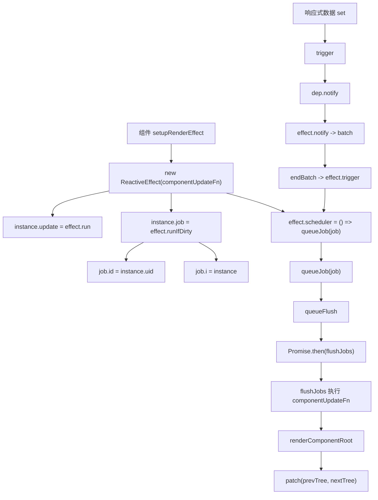
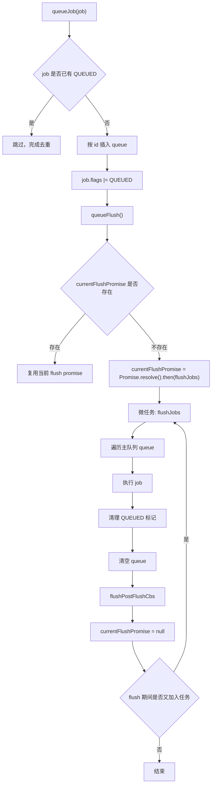
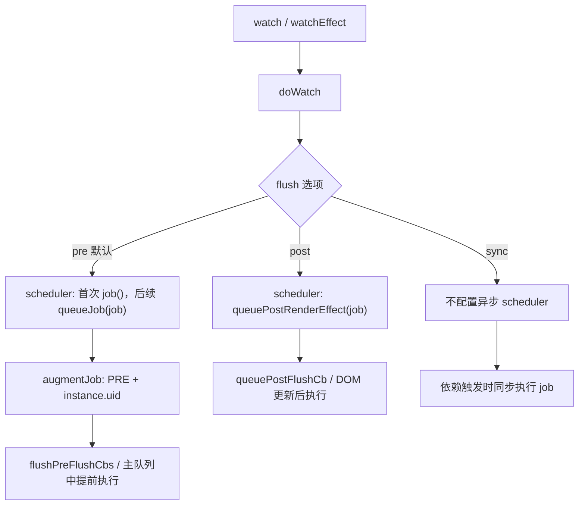

# Vue3 scheduler 调度机制源码深入分析

本文基于当前仓库 `vue3` 源码整理，重点分析 Vue3 scheduler 解决什么问题、`queueJob` / `queueFlush` / `flushJobs` 的执行流程、`nextTick` 的实现原理、job 去重、pre / post flush callback、组件更新任务如何进入调度器，以及 scheduler 与 `watch` 的 `flush` 选项之间的关系。

## 一、scheduler 核心源码文件

| 文件 | 作用 |
| --- | --- |
| `vue3/packages/runtime-core/src/scheduler.ts` | Vue3 runtime-core 调度器核心：job 队列、post flush 队列、`queueJob`、`queueFlush`、`flushJobs`、`nextTick` |
| `vue3/packages/runtime-core/src/renderer.ts` | 组件渲染 effect 创建位置；组件更新通过 `effect.scheduler = () => queueJob(job)` 进入 scheduler |
| `vue3/packages/runtime-core/src/apiWatch.ts` | `watch` / `watchEffect` 根据 `flush` 选项配置 scheduler |
| `vue3/packages/reactivity/src/effect.ts` | `ReactiveEffect` 的 `trigger()` 会调用 `effect.scheduler`；响应式层还有自己的 batch |
| `vue3/packages/reactivity/src/dep.ts` | 依赖触发入口，`trigger -> dep.trigger -> dep.notify -> effect.notify -> batch/endBatch` |
| `vue3/packages/runtime-core/src/componentPublicInstance.ts` | `$forceUpdate` 使用 `queueJob(i.update)`，`$nextTick` 绑定 `nextTick` |

## 二、scheduler 在 Vue3 中解决什么问题？

scheduler 主要解决四类问题：

1. **批量更新**

   多次状态变更不应该导致多次组件渲染。Vue 会把组件更新 job 放进队列，并在微任务中统一 flush。

2. **去重**

   同一个组件在同一轮 tick 内可能被多次 trigger，但它的更新 job 只需要执行一次。

3. **执行顺序**

   父组件应该先于子组件更新。组件 job 带有 `id = instance.uid`，scheduler 按 id 排序插入。

4. **副作用时机**

   `watch` 有 `flush: 'pre' | 'post' | 'sync'`，组件生命周期和 DOM 更新后回调也需要不同队列来控制时机。

一句话：

```text
scheduler 把“响应式依赖触发”转换成“有顺序、可去重、按时机批量执行的任务队列”。
```

## 三、job 队列数据结构

核心数据结构在 `scheduler.ts`：

```ts
export enum SchedulerJobFlags {
  QUEUED = 1 << 0,
  PRE = 1 << 1,
  ALLOW_RECURSE = 1 << 2,
  DISPOSED = 1 << 3,
}

export interface SchedulerJob extends Function {
  id?: number
  flags?: SchedulerJobFlags
  i?: ComponentInternalInstance
}

const queue: SchedulerJob[] = []
let flushIndex = -1

const pendingPostFlushCbs: SchedulerJob[] = []
let activePostFlushCbs: SchedulerJob[] | null = null
let postFlushIndex = 0

const resolvedPromise = Promise.resolve()
let currentFlushPromise: Promise<void> | null = null
```

### 1. 主队列 `queue`

```ts
const queue: SchedulerJob[] = []
```

主队列用于存放组件更新任务和 pre watcher 任务。

常见 job：

| job 类型 | 来源 | 特点 |
| --- | --- | --- |
| 组件更新 job | `renderer.ts` 的 `instance.job` | `job.id = instance.uid`，`job.i = instance` |
| pre watcher job | `watch(..., { flush: 'pre' })` 默认 | `job.flags |= PRE`，`job.id = instance.uid` |
| `$forceUpdate` job | `componentPublicInstance.ts` | `queueJob(i.update)` |

### 2. post flush 队列

```ts
const pendingPostFlushCbs: SchedulerJob[] = []
let activePostFlushCbs: SchedulerJob[] | null = null
```

post flush 队列用于 DOM 更新完成后的回调，例如：

```text
flush: 'post' watcher
mounted / updated 等 post render effect
Suspense resolve 后的 effects
```

### 3. job flags

| flag | 含义 |
| --- | --- |
| `QUEUED` | job 已经入队，用于去重 |
| `PRE` | pre flush job，通常是默认 flush 的 watcher |
| `ALLOW_RECURSE` | 允许 job 在执行期间再次触发自己，watch callback 和组件更新可用 |
| `DISPOSED` | job 已废弃，flush 时跳过 |

## 四、queueJob 是什么？

`queueJob` 是把任务加入主队列的函数。

源码：

```ts
export function queueJob(job: SchedulerJob): void {
  if (!(job.flags! & SchedulerJobFlags.QUEUED)) {
    const jobId = getId(job)
    const lastJob = queue[queue.length - 1]
    if (
      !lastJob ||
      (!(job.flags! & SchedulerJobFlags.PRE) && jobId >= getId(lastJob))
    ) {
      queue.push(job)
    } else {
      queue.splice(findInsertionIndex(jobId), 0, job)
    }

    job.flags! |= SchedulerJobFlags.QUEUED

    queueFlush()
  }
}
```

它做三件事：

1. 判断 job 是否已经有 `QUEUED` 标记，避免重复入队。
2. 根据 job id 决定是直接追加，还是二分查找插入位置。
3. 设置 `QUEUED` 标记，并调用 `queueFlush()` 安排异步 flush。

## 五、job 去重是如何实现的？

当前源码使用 `SchedulerJobFlags.QUEUED` 做去重。

入队前：

```ts
if (!(job.flags! & SchedulerJobFlags.QUEUED)) {
  // 入队
}
```

入队后：

```ts
job.flags! |= SchedulerJobFlags.QUEUED
```

执行完成后，清理标记：

```ts
if (!(job.flags! & SchedulerJobFlags.ALLOW_RECURSE)) {
  job.flags! &= ~SchedulerJobFlags.QUEUED
}
```

如果 flush 过程中发生错误，`finally` 里也会清理剩余 job 的 `QUEUED` 标记：

```ts
for (; flushIndex < queue.length; flushIndex++) {
  const job = queue[flushIndex]
  if (job) {
    job.flags! &= ~SchedulerJobFlags.QUEUED
  }
}
```

所以同一个 tick 内，多次调用：

```ts
queueJob(job)
queueJob(job)
queueJob(job)
```

只有第一次会把 job 放进队列。

## 六、queueJob 为什么要排序？

插入位置由 `findInsertionIndex` 决定：

```ts
function findInsertionIndex(id: number) {
  let start = flushIndex + 1
  let end = queue.length

  while (start < end) {
    const middle = (start + end) >>> 1
    const middleJob = queue[middle]
    const middleJobId = getId(middleJob)
    if (
      middleJobId < id ||
      (middleJobId === id && middleJob.flags! & SchedulerJobFlags.PRE)
    ) {
      start = middle + 1
    } else {
      end = middle
    }
  }

  return start
}
```

源码注释说明排序有两个目的：

1. **父组件先于子组件更新**

   父组件实例总是先创建，因此父组件 `uid` 更小。组件更新 job 的 `id` 是 `instance.uid`。

2. **父组件更新时如果卸载了子组件，可以跳过子组件更新**

   父先子后，能避免已卸载子组件继续执行无意义更新。

另外，pre watcher 的 id 和组件更新 job 相同，但需要插入到组件更新 job 前面：

```text
pre watcher -> component update
```

所以二分条件里有：

```ts
middleJobId === id && middleJob.flags! & SchedulerJobFlags.PRE
```

## 七、queueFlush 是什么？

`queueFlush` 负责安排一次微任务 flush。

源码：

```ts
function queueFlush() {
  if (!currentFlushPromise) {
    currentFlushPromise = resolvedPromise.then(flushJobs)
  }
}
```

核心点：

```text
currentFlushPromise 为空时，才创建 Promise.then(flushJobs)。
```

这保证同一轮同步代码中，多次 `queueJob` 只会安排一次微任务：

```ts
state.count++
state.count++
state.count++
```

大致效果：

```text
trigger 1 -> queueJob -> queueFlush -> 创建微任务
trigger 2 -> queueJob -> currentFlushPromise 已存在，不再创建微任务
trigger 3 -> queueJob -> currentFlushPromise 已存在，不再创建微任务

当前同步栈结束
  -> 微任务执行 flushJobs
```

## 八、flushJobs 是如何执行任务队列的？

`flushJobs` 是真正执行主队列的函数。

源码主干：

```ts
function flushJobs(seen?: CountMap) {
  if (__DEV__) {
    seen = seen || new Map()
  }

  const check = __DEV__
    ? (job: SchedulerJob) => checkRecursiveUpdates(seen!, job)
    : NOOP

  try {
    for (flushIndex = 0; flushIndex < queue.length; flushIndex++) {
      const job = queue[flushIndex]
      if (job && !(job.flags! & SchedulerJobFlags.DISPOSED)) {
        if (__DEV__ && check(job)) {
          continue
        }
        if (job.flags! & SchedulerJobFlags.ALLOW_RECURSE) {
          job.flags! &= ~SchedulerJobFlags.QUEUED
        }
        callWithErrorHandling(
          job,
          job.i,
          job.i ? ErrorCodes.COMPONENT_UPDATE : ErrorCodes.SCHEDULER,
        )
        if (!(job.flags! & SchedulerJobFlags.ALLOW_RECURSE)) {
          job.flags! &= ~SchedulerJobFlags.QUEUED
        }
      }
    }
  } finally {
    for (; flushIndex < queue.length; flushIndex++) {
      const job = queue[flushIndex]
      if (job) {
        job.flags! &= ~SchedulerJobFlags.QUEUED
      }
    }

    flushIndex = -1
    queue.length = 0

    flushPostFlushCbs(seen)

    currentFlushPromise = null

    if (queue.length || pendingPostFlushCbs.length) {
      flushJobs(seen)
    }
  }
}
```

执行流程：

1. 开发环境创建 `seen`，用于递归更新检测。
2. 从 `flushIndex = 0` 开始遍历主队列。
3. 跳过 `DISPOSED` job。
4. 开发环境检查递归更新是否超过限制。
5. 用 `callWithErrorHandling` 执行 job。
6. 执行后清理 `QUEUED` 标记。
7. finally 中清理剩余 job 的 `QUEUED` 标记。
8. 清空主队列。
9. 执行 post flush callbacks。
10. 清空 `currentFlushPromise`。
11. 如果 flush 期间又加入了新 job 或 post callback，递归继续 flush。

## 九、flushJobs 执行流程图

```text
queueJob(job)
  -> job 进入 queue
  -> queueFlush()
    -> currentFlushPromise = Promise.resolve().then(flushJobs)

microtask
  -> flushJobs()
    -> 遍历 queue
    -> 执行每个 job
    -> 清空 queue
    -> flushPostFlushCbs()
    -> currentFlushPromise = null
    -> 如果又有新 job，继续 flushJobs()
```

## 十、nextTick 是如何实现的？

源码：

```ts
const resolvedPromise = Promise.resolve() as Promise<any>
let currentFlushPromise: Promise<void> | null = null

export function nextTick<T, R>(
  this: T,
  fn?: (this: T) => R | Promise<R>,
): Promise<void | R> {
  const p = currentFlushPromise || resolvedPromise
  return fn ? p.then(this ? fn.bind(this) : fn) : p
}
```

`nextTick` 的核心是：

```text
如果当前有正在等待的 scheduler flush，就返回 currentFlushPromise。
否则返回一个已经 resolved 的 Promise。
```

这意味着：

```ts
count.value++
await nextTick()
```

当 `count.value++` 触发组件更新后：

```text
queueFlush 创建 currentFlushPromise
nextTick 返回 currentFlushPromise
await nextTick 等到 flushJobs 执行完成
此时 DOM 已经更新
```

如果当前没有任何待 flush 的 job：

```ts
await nextTick()
```

它本质上只是等待一个微任务。

## 十一、为什么 Vue3 更新不是每次 trigger 都同步执行渲染？

如果每次 trigger 都同步渲染，会有几个问题：

1. **重复渲染**

   ```ts
   count.value++
   count.value++
   count.value++
   ```

   如果同步执行，组件可能渲染三次。scheduler 可以把它合并成一次组件更新。

2. **父子顺序难以稳定**

   多个组件同时被触发时，需要保证父组件先于子组件更新。scheduler 通过 job id 排序处理。

3. **watch 和生命周期需要明确时机**

   有些 watcher 要在组件更新前执行，有些要在 DOM 更新后执行。同步 trigger 无法统一管理这些时机。

4. **递归更新需要保护**

   scheduler 通过 `checkRecursiveUpdates` 限制递归更新次数，避免无限循环。

源码链路说明：

```text
trigger
  -> dep.notify
  -> effect.notify
  -> reactivity batch
  -> ReactiveEffect.trigger
  -> 如果 effect.scheduler 存在，调用 scheduler
  -> 组件 effect.scheduler = () => queueJob(job)
```

响应式层的 `ReactiveEffect.trigger`：

```ts
trigger(): void {
  if (this.flags & EffectFlags.PAUSED) {
    pausedQueueEffects.add(this)
  } else if (this.scheduler) {
    this.scheduler()
  } else {
    this.runIfDirty()
  }
}
```

组件更新 effect 设置了 scheduler，因此不会在每次 trigger 时直接 render，而是进入 `queueJob`。

## 十二、组件更新任务是如何进入 scheduler 的？

组件 render effect 在 `renderer.ts` 的 `setupRenderEffect` 中创建：

```ts
const componentUpdateFn = () => {
  if (!instance.isMounted) {
    // 首次挂载
  } else {
    // 组件更新
  }
}

instance.scope.on()
const effect = (instance.effect = new ReactiveEffect(componentUpdateFn))
instance.scope.off()

const update = (instance.update = effect.run.bind(effect))
const job: SchedulerJob = (instance.job = effect.runIfDirty.bind(effect))
job.i = instance
job.id = instance.uid
effect.scheduler = () => queueJob(job)

update()
```

关键字段：

| 字段 | 含义 |
| --- | --- |
| `instance.effect` | 组件渲染对应的 `ReactiveEffect` |
| `instance.update` | `effect.run.bind(effect)`，首次挂载时同步执行 |
| `instance.job` | `effect.runIfDirty.bind(effect)`，后续更新任务 |
| `job.id` | `instance.uid`，用于排序 |
| `job.i` | 组件实例，用于错误处理和递归警告 |
| `effect.scheduler` | 响应式触发时调用 `queueJob(job)` |

首次挂载：

```text
setupRenderEffect
  -> update()
  -> effect.run()
  -> componentUpdateFn()
  -> render + patch
```

后续状态变更：

```text
响应式数据 set
  -> trigger
  -> ReactiveEffect.trigger
  -> effect.scheduler()
  -> queueJob(instance.job)
  -> 微任务 flushJobs
  -> instance.job()
  -> effect.runIfDirty()
  -> componentUpdateFn()
  -> render + patch
```

`$forceUpdate` 也是进入 scheduler：

```ts
$forceUpdate: i =>
  i.f ||
  (i.f = () => {
    queueJob(i.update)
  })
```

区别是 `$forceUpdate` 入队的是 `i.update`，而响应式触发入队的是 `instance.job`。

## 十三、queueJob 调用链

### 1. 组件响应式更新

```text
reactive/ref set
  -> trigger(target, type, key)
  -> dep.trigger()
  -> dep.notify()
  -> effect.notify()
  -> batch(effect)
  -> endBatch()
  -> ReactiveEffect.trigger()
  -> effect.scheduler()
  -> queueJob(instance.job)
  -> queueFlush()
  -> flushJobs()
  -> instance.job()
  -> componentUpdateFn()
```

### 2. watch 默认 flush: pre

```text
watch(source, cb)
  -> doWatch()
  -> baseWatchOptions.scheduler = (job, isFirstRun) => {
       if (isFirstRun) job()
       else queueJob(job)
     }
  -> augmentJob(job)
       job.flags |= PRE
       job.id = instance.uid
  -> source 变化
  -> queueJob(watcherJob)
```

### 3. `$forceUpdate`

```text
this.$forceUpdate()
  -> queueJob(instance.update)
  -> queueFlush()
  -> flushJobs()
```

## 十四、pre flush callback 是什么？

在当前源码里，pre flush callback 主要表现为带 `SchedulerJobFlags.PRE` 标记的 job，它们在主队列中，但会被 `flushPreFlushCbs` 提前取出执行。

`apiWatch.ts` 中默认 `flush` 是 pre：

```ts
if (flush === 'post') {
  // post
} else if (flush !== 'sync') {
  // default: 'pre'
  isPre = true
  baseWatchOptions.scheduler = (job, isFirstRun) => {
    if (isFirstRun) {
      job()
    } else {
      queueJob(job)
    }
  }
}
```

并在 `augmentJob` 中标记：

```ts
if (isPre) {
  job.flags! |= SchedulerJobFlags.PRE
  if (instance) {
    job.id = instance.uid
    job.i = instance
  }
}
```

`flushPreFlushCbs` 扫描主队列：

```ts
export function flushPreFlushCbs(instance?, seen?, i = flushIndex + 1): void {
  for (; i < queue.length; i++) {
    const cb = queue[i]
    if (cb && cb.flags! & SchedulerJobFlags.PRE) {
      if (instance && cb.id !== instance.uid) {
        continue
      }
      queue.splice(i, 1)
      i--
      cb()
      cb.flags! &= ~SchedulerJobFlags.QUEUED
    }
  }
}
```

组件更新前会有机会 flush pre watchers。比如组件更新流程中的 `updateComponentPreRender` 会调用：

```ts
flushPreFlushCbs(instance)
```

pre watcher 的特点：

```text
默认 watch / watchEffect 使用 pre。
它在组件 DOM 更新前执行。
它和所属组件有相同 id，但带 PRE 标记，会排在组件更新 job 前。
```

## 十五、post flush callback 是什么？

post flush callback 存在单独队列：

```ts
const pendingPostFlushCbs: SchedulerJob[] = []
let activePostFlushCbs: SchedulerJob[] | null = null
```

入队函数：

```ts
export function queuePostFlushCb(cb: SchedulerJobs): void {
  if (!isArray(cb)) {
    if (activePostFlushCbs && cb.id === -1) {
      activePostFlushCbs.splice(postFlushIndex + 1, 0, cb)
    } else if (!(cb.flags! & SchedulerJobFlags.QUEUED)) {
      pendingPostFlushCbs.push(cb)
      cb.flags! |= SchedulerJobFlags.QUEUED
    }
  } else {
    pendingPostFlushCbs.push(...cb)
  }
  queueFlush()
}
```

flush 函数：

```ts
export function flushPostFlushCbs(seen?: CountMap): void {
  if (pendingPostFlushCbs.length) {
    const deduped = [...new Set(pendingPostFlushCbs)].sort(
      (a, b) => getId(a) - getId(b),
    )
    pendingPostFlushCbs.length = 0

    if (activePostFlushCbs) {
      activePostFlushCbs.push(...deduped)
      return
    }

    activePostFlushCbs = deduped

    for (postFlushIndex = 0; postFlushIndex < activePostFlushCbs.length; postFlushIndex++) {
      const cb = activePostFlushCbs[postFlushIndex]
      if (!(cb.flags! & SchedulerJobFlags.DISPOSED)) cb()
      cb.flags! &= ~SchedulerJobFlags.QUEUED
    }
    activePostFlushCbs = null
    postFlushIndex = 0
  }
}
```

post callback 的特点：

```text
主队列 flush 完成后执行。
执行前用 Set 去重，并按 id 排序。
适合需要读取更新后 DOM 的逻辑。
```

`renderer.ts` 中还有：

```ts
export const queuePostRenderEffect = __FEATURE_SUSPENSE__
  ? queueEffectWithSuspense
  : queuePostFlushCb
```

所以在非 Suspense 特殊处理下，post render effect 本质上进入 `queuePostFlushCb`。

## 十六、scheduler 和 watch 的 flush 选项有什么关系？

`watch` / `watchEffect` 的 `flush` 选项在 `apiWatch.ts` 中被转换成不同 scheduler。

### 1. flush: 'pre'

默认值。源码条件是：

```ts
else if (flush !== 'sync') {
  // default: 'pre'
  isPre = true
  baseWatchOptions.scheduler = (job, isFirstRun) => {
    if (isFirstRun) {
      job()
    } else {
      queueJob(job)
    }
  }
}
```

行为：

```text
首次运行同步执行。
后续触发进入 queueJob。
job 带 PRE 标记。
组件更新前执行。
```

适合：

```text
根据响应式状态做副作用，但不依赖更新后的 DOM。
```

### 2. flush: 'post'

源码：

```ts
if (flush === 'post') {
  baseWatchOptions.scheduler = job => {
    queuePostRenderEffect(job, instance && instance.suspense)
  }
}
```

行为：

```text
watcher job 进入 post render effect。
组件 DOM patch 完成后执行。
```

适合：

```text
需要读取更新后的 DOM。
```

例如：

```ts
watch(
  count,
  () => {
    console.log(el.value!.textContent)
  },
  { flush: 'post' },
)
```

### 3. flush: 'sync'

源码里 `flush === 'sync'` 时不会给 `baseWatchOptions.scheduler` 设置异步 scheduler。

在 `reactivity/src/watch.ts` 中：

```ts
effect.scheduler = scheduler
  ? () => scheduler(job, false)
  : (job as EffectScheduler)
```

如果没有自定义 scheduler，触发时直接执行 watcher job。

行为：

```text
响应式依赖触发后同步执行 watcher。
不经过 queueJob。
不等待 nextTick。
```

适合非常少数需要同步观察状态变化的场景。它可能破坏批量更新收益，需要谨慎使用。

### flush 对比表

| flush | scheduler | 执行时机 | 是否进入主队列 | 是否适合读更新后 DOM |
| --- | --- | --- | --- | --- |
| `pre` | `queueJob(job)` | 默认，组件更新前 | 是，带 `PRE` 标记 | 否 |
| `post` | `queuePostRenderEffect(job)` | DOM 更新后 | 不进入主队列，进入 post 队列 | 是 |
| `sync` | 不配置异步 scheduler | 触发时同步执行 | 否 | 否，且不批量 |

## 十七、nextTick 与 post watcher 的区别

二者都和 DOM 更新后的时机有关，但语义不同。

```ts
count.value++
await nextTick()
// 这里可以读更新后的 DOM
```

`nextTick` 是等待当前 scheduler flush 完成。

```ts
watch(count, () => {
  // 这里默认不是 DOM 更新后
})

watch(count, () => {
  // 这里是 DOM 更新后
}, { flush: 'post' })
```

`flush: 'post'` 是把 watcher 本身放进 post flush 队列。

对比：

| 机制 | 本质 | 常见用途 |
| --- | --- | --- |
| `nextTick` | 等待当前 flush promise | 在代码中等待 DOM 更新完成后继续 |
| `flush: 'post'` | watcher job 加入 post 队列 | watcher 回调天然在 DOM 更新后执行 |

## 十八、Mermaid：组件更新进入 scheduler



## 十九、Mermaid：scheduler 队列执行流程



## 二十、Mermaid：watch flush 选项



## 二十一、写出示例代码

### 1. 多次状态变更只触发一次组件更新

```vue
<script setup>
import { nextTick, ref } from 'vue'

const count = ref(0)

async function update() {
  count.value++
  count.value++
  count.value++

  console.log('sync:', document.querySelector('#count')?.textContent)

  await nextTick()

  console.log('after nextTick:', document.querySelector('#count')?.textContent)
}
</script>

<template>
  <button @click="update">update</button>
  <div id="count">{{ count }}</div>
</template>
```

执行过程：

```text
count.value++ 三次
  -> 多次 trigger
  -> 同一个组件 job 多次 queueJob
  -> QUEUED 标记去重
  -> 一个微任务 flushJobs
  -> 组件只更新一次
```

### 2. pre / post / sync watch

```vue
<script setup>
import { nextTick, ref, watch } from 'vue'

const count = ref(0)
const el = ref()

watch(count, () => {
  console.log('pre:', el.value?.textContent)
})

watch(
  count,
  () => {
    console.log('post:', el.value?.textContent)
  },
  { flush: 'post' },
)

watch(
  count,
  () => {
    console.log('sync:', count.value)
  },
  { flush: 'sync' },
)

async function update() {
  count.value++
  await nextTick()
  console.log('nextTick:', el.value?.textContent)
}
</script>

<template>
  <button @click="update">update</button>
  <div ref="el">{{ count }}</div>
</template>
```

大致顺序：

```text
count.value++
  -> sync watcher 立即执行
  -> pre watcher 入主队列，组件更新前执行
  -> component update job 执行，patch DOM
  -> post watcher 在 post flush 队列执行
  -> await nextTick 后继续
```

### 3. 手写 render effect 的调度直觉

Vue 组件内部大致等价于：

```ts
const effect = new ReactiveEffect(componentUpdateFn)

const job = effect.runIfDirty.bind(effect)
job.id = instance.uid
job.i = instance

effect.scheduler = () => queueJob(job)

effect.run()
```

当 render 中读取的响应式数据变化：

```text
trigger effect
  -> effect.scheduler()
  -> queueJob(job)
  -> 当前同步逻辑结束后统一 flush
```

## 二十二、核心结论

1. Vue3 scheduler 的核心文件是 `runtime-core/src/scheduler.ts`。
2. scheduler 解决批量更新、job 去重、父子组件更新顺序、watch flush 时机和递归更新保护。
3. 主队列是 `queue: SchedulerJob[]`，post 队列是 `pendingPostFlushCbs: SchedulerJob[]`。
4. `queueJob` 负责把 job 去重后插入主队列，并调用 `queueFlush`。
5. 当前版本 job 去重依赖 `SchedulerJobFlags.QUEUED`。
6. `queueFlush` 通过 `currentFlushPromise = Promise.resolve().then(flushJobs)` 安排微任务。
7. `flushJobs` 遍历主队列，执行 job，清空队列，再执行 post flush callbacks。
8. `nextTick` 返回 `currentFlushPromise || resolvedPromise`，所以可以等待当前 scheduler flush 完成。
9. 组件更新任务在 `setupRenderEffect` 中创建，响应式触发后通过 `effect.scheduler = () => queueJob(job)` 入队。
10. 默认 `watch` 是 `flush: 'pre'`，会进入主队列并带 `PRE` 标记。
11. `flush: 'post'` 的 watcher 进入 `queuePostRenderEffect`，在 DOM 更新后执行。
12. `flush: 'sync'` 不走异步 scheduler，依赖触发时同步执行。
13. Vue3 不是每次 trigger 都同步渲染，是为了合并多次状态变更、稳定父子更新顺序，并统一管理副作用执行时机。

