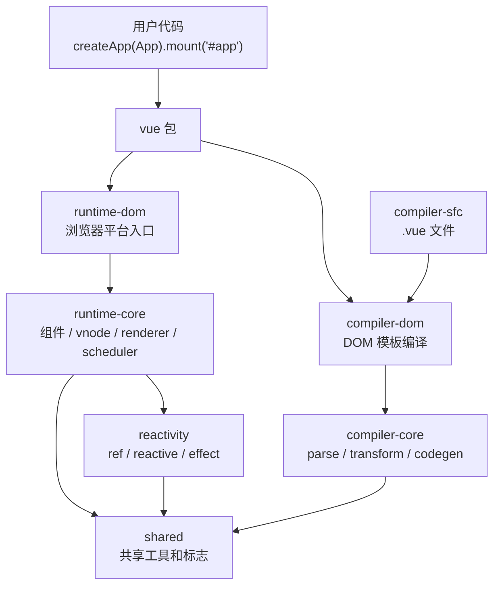
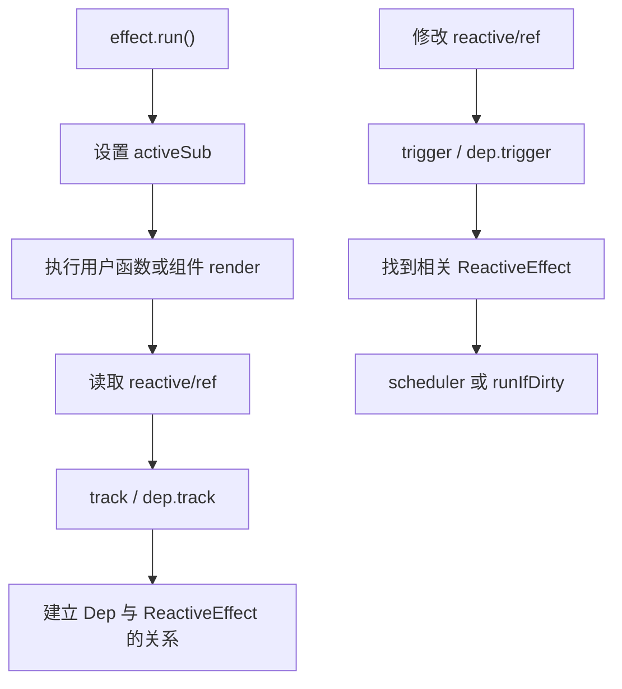
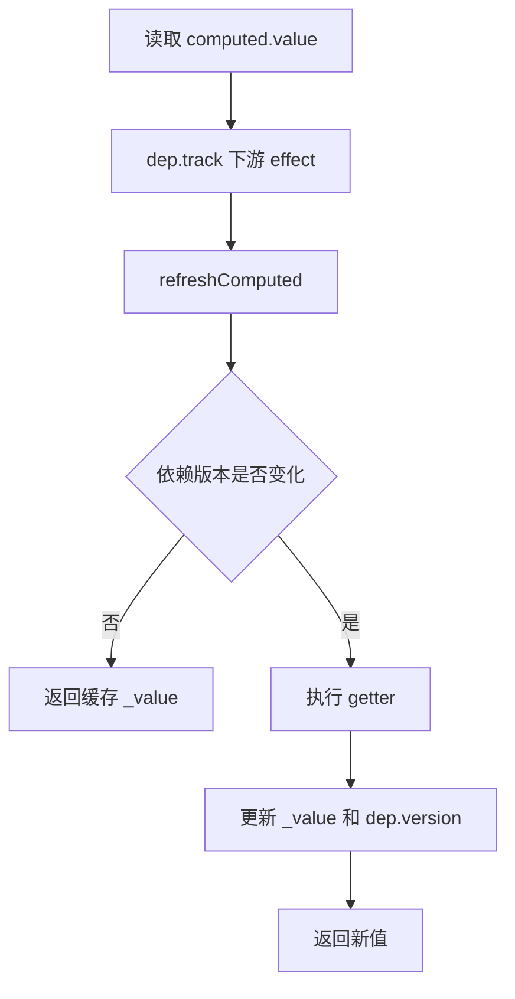
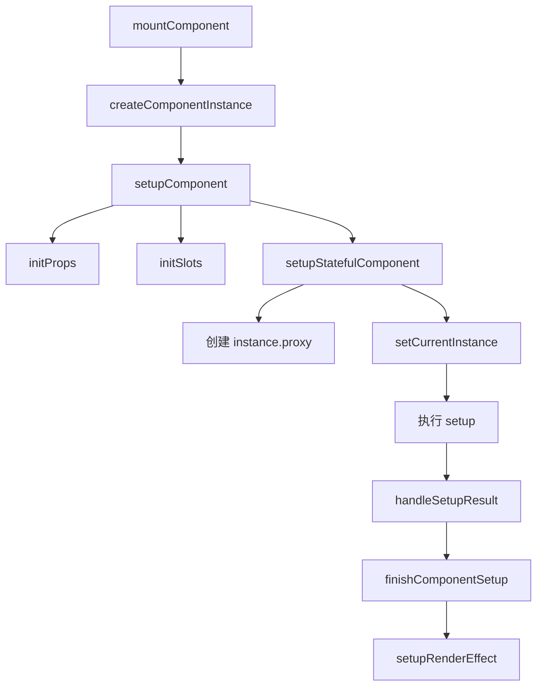
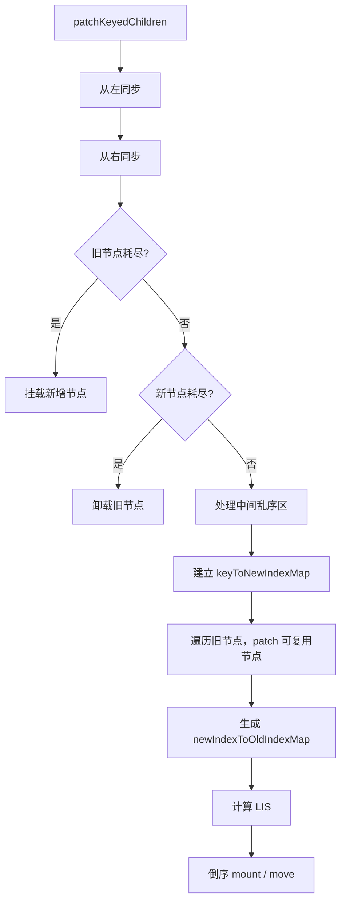
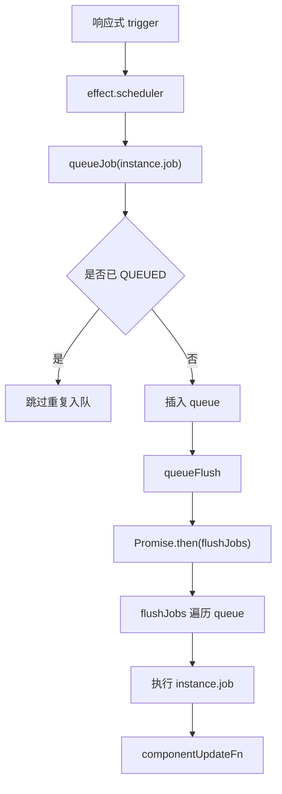

# Vue3 源码学习笔记

这份笔记是对前面 Vue3 源码分析文档的系统整理。它不追求把每个函数逐行展开，而是围绕“为什么这样设计、源码主线如何串起来、复习时抓哪些关键结构”来组织。

推荐配合这些专题文档复习：

- `docs/vue3-source-guide.md`
- `docs/vue3-reactive-deep-dive.md`
- `docs/vue3-effect-deep-dive.md`
- `docs/vue3-ref-deep-dive.md`
- `docs/vue3-computed-deep-dive.md`
- `docs/vue3-watch-watchEffect-deep-dive.md`
- `docs/vue3-first-render-flow.md`
- `docs/vue3-component-instance-deep-dive.md`
- `docs/vue3-vnode-deep-dive.md`
- `docs/vue3-patch-deep-dive.md`
- `docs/vue3-diff-patchKeyedChildren-deep-dive.md`
- `docs/vue3-scheduler-deep-dive.md`
- `docs/vue3-template-compile-deep-dive.md`
- `docs/vue3-composition-api-deep-dive.md`
- `docs/vue2-vue3-core-design-comparison.md`
- `docs/vue3-react-core-design-comparison.md`

## 1. Vue3 源码整体架构

Vue3 的源码不是一个“大而全”的单体 core，而是 monorepo 多包架构。这个设计背后的核心原因是：Vue3 想把“响应式”“运行时”“平台 DOM”“编译器”“SFC 编译”等能力拆成边界清晰、可独立测试、可独立复用的模块。

整体可以理解为三层：

```text
用户入口层
  vue
    -> 对外导出 createApp、ref、reactive、computed、watch 等 API

运行时层
  reactivity
  runtime-core
  runtime-dom

编译层
  compiler-core
  compiler-dom
  compiler-sfc
  compiler-ssr
```

核心关系图：



### 为什么要拆分 runtime-core 和 runtime-dom

`runtime-core` 不直接依赖浏览器 DOM。它只关心：

- vnode 怎么 patch
- 组件怎么创建
- effect 怎么调度
- 子节点怎么 diff

真实 DOM 操作由 `runtime-dom` 注入：

```text
runtime-core:
  hostCreateElement
  hostInsert
  hostPatchProp
  hostSetElementText

runtime-dom:
  document.createElement
  parent.insertBefore
  patch class/style/event/attr
  el.textContent = text
```

这样做的好处是：同一套 core renderer 可以服务 DOM，也可以服务自定义渲染器。

## 2. packages 核心包说明

| 包 | 核心职责 | 学习重点 |
| --- | --- | --- |
| `shared` | 跨包共享工具、枚举、标志位。 | `ShapeFlags`、`PatchFlags`、工具函数。 |
| `reactivity` | 响应式系统。 | `reactive`、`ref`、`computed`、`effect`、`watch`、`Dep`、`targetMap`。 |
| `runtime-core` | 平台无关运行时。 | vnode、组件实例、renderer、patch、scheduler、生命周期。 |
| `runtime-dom` | 浏览器平台运行时。 | DOM nodeOps、patchProp、DOM createApp。 |
| `compiler-core` | 平台无关编译核心。 | parse、transform、codegen、AST、patchFlag 生成。 |
| `compiler-dom` | DOM 平台模板编译扩展。 | DOM 指令转换，如 `v-model`、`v-on`、`v-show`。 |
| `compiler-sfc` | `.vue` 单文件组件编译。 | parse SFC、compileScript、compileTemplate、scoped CSS。 |
| `server-renderer` | SSR 渲染。 | vnode / component 到 HTML string。 |
| `vue` | 用户入口包。 | 整合 runtime-dom 和 compiler。 |
| `vue-compat` | Vue2 兼容构建。 | 迁移兼容层。 |

可以把核心包理解成：

```text
reactivity 解决“数据变化如何被感知”
runtime-core 解决“组件和 vnode 如何运行”
runtime-dom 解决“如何操作浏览器 DOM”
compiler-core 解决“模板如何变成 render”
compiler-dom 解决“DOM 模板语义如何编译”
compiler-sfc 解决“.vue 文件如何拆解和组合”
```

## 3. 响应式系统 reactivity

Vue3 响应式系统的核心不是“组件”，而是更底层的 effect 系统。

它要解决的问题是：

```text
当某个响应式数据被读取时，记录当前谁依赖了它。
当这个响应式数据被修改时，找到这些依赖并触发它们。
```

核心数据结构：

```text
targetMap: WeakMap<object, Map<key, Dep>>

target object
  -> key
     -> Dep
        -> ReactiveEffect / Computed / Watcher-like subscriber
```

响应式主线：



### 设计原因

Vue2 的响应式和组件 watcher 绑定较深。Vue3 把响应式抽成独立包后，`computed`、`watch`、组件 render、自定义 effect 都能复用同一套依赖收集机制。

这是一种很值得学习的设计：先抽象出通用 primitive，再让上层能力组合它。

## 4. reactive 实现原理

`reactive` 的入口在 `packages/reactivity/src/reactive.ts`，核心函数是 `createReactiveObject`。

简化伪代码：

```ts
function reactive(target) {
  return createReactiveObject(
    target,
    false,
    mutableHandlers,
    mutableCollectionHandlers,
    reactiveMap
  )
}

function createReactiveObject(target, isReadonly, baseHandlers, collectionHandlers, proxyMap) {
  if (!isObject(target)) return target

  const existingProxy = proxyMap.get(target)
  if (existingProxy) return existingProxy

  const proxy = new Proxy(
    target,
    isCollection(target) ? collectionHandlers : baseHandlers
  )

  proxyMap.set(target, proxy)
  return proxy
}
```

### 为什么用 Proxy

`Proxy` 能代理整个对象行为，而不是只劫持已有属性。这样 Vue3 可以更自然地处理：

- 新增属性
- 删除属性
- `in` 操作
- `Object.keys` / `for...in`
- 数组索引和 length
- `Map` / `Set`

### get 拦截器做什么

简化逻辑：

```text
get(target, key, receiver)
  -> 处理特殊标记，如 IS_REACTIVE / RAW
  -> Reflect.get(target, key, receiver)
  -> 如果不是 readonly，track(target, GET, key)
  -> 如果结果是 ref，按规则自动解包
  -> 如果结果是对象，懒转换为 reactive / readonly
  -> 返回结果
```

设计原因：深层对象不用初始化时递归代理，只有访问到时才代理，减少初始化成本。

### set 拦截器做什么

简化逻辑：

```text
set(target, key, value, receiver)
  -> 判断 key 是新增还是修改
  -> Reflect.set(target, key, value, receiver)
  -> 如果新增，trigger(target, ADD, key)
  -> 如果修改，trigger(target, SET, key)
```

设计原因：同一个 set 操作要区分“新增属性”和“修改属性”，因为它们触发的依赖范围不同。例如新增 key 可能影响迭代依赖。

## 5. ref 实现原理

`ref` 解决的问题是：基本类型没有属性可被 Proxy 代理，所以需要用一个对象包装值。

核心结构：

```ts
class RefImpl<T> {
  _value: T
  _rawValue: T
  dep: Dep = new Dep()

  get value() {
    this.dep.track()
    return this._value
  }

  set value(newValue) {
    if (hasChanged(newValue, this._rawValue)) {
      this._rawValue = newValue
      this._value = toReactive(newValue)
      this.dep.trigger()
    }
  }
}
```

### 为什么需要 `.value`

因为 JavaScript 不能拦截普通变量的读取和赋值：

```ts
let count = 0
count++ // 框架无法拦截
```

但可以拦截对象属性：

```ts
const count = { value: 0 }
count.value++ // get value + set value 可被拦截
```

Vue3 用 `.value` 给基本类型提供一个稳定的响应式访问点。

### ref 与 reactive 对比

| 维度 | `ref` | `reactive` |
| --- | --- | --- |
| 适合数据 | 基本类型、单个值、也可包对象。 | 对象、数组、集合。 |
| 访问方式 | JS 中需要 `.value`。 | 直接访问属性。 |
| 依赖容器 | `RefImpl.dep`。 | `targetMap -> target -> key -> Dep`。 |
| 模板表现 | 模板中自动解包。 | 直接访问。 |
| 替换整体值 | `ref.value = newValue`。 | 通常修改对象属性，不建议整体替换变量引用。 |

模板自动解包不是 ref 自己完成的，而是编译器和组件代理层配合完成，让模板写起来更自然。

## 6. computed 实现原理

`computed` 的核心是“懒求值 + 缓存 + 依赖失效”。

简化结构：

```ts
class ComputedRefImpl {
  _value
  dep = new Dep()
  flags
  globalVersion

  get value() {
    this.dep.track()
    refreshComputed(this)
    return this._value
  }

  notify() {
    this.flags |= DIRTY
    batch(this, true)
  }
}
```

### 为什么 computed 有缓存

因为 computed getter 不会在依赖变化时立刻执行，而是在读取 `.value` 时才判断是否需要刷新：

```text
依赖变化
  -> computed 被标记 dirty
  -> 不立即重新计算

读取 computed.value
  -> refreshComputed
  -> 如果 dirty 或版本变化，重新执行 getter
  -> 否则返回缓存 _value
```

流程图：



### computed 和 watch 的区别

| 维度 | computed | watch |
| --- | --- | --- |
| 目标 | 派生一个值。 | 响应变化执行副作用。 |
| 执行时机 | 懒执行，读取时求值。 | source 变化后由 scheduler 执行 job。 |
| 返回值 | 返回 computed ref。 | 返回 stop handle。 |
| 缓存 | 有缓存。 | 不缓存副作用结果。 |
| 使用场景 | `double = count * 2`。 | 请求、日志、手动操作 DOM、同步外部状态。 |

## 7. watch / watchEffect 实现原理

`watch` 和 `watchEffect` 都建立在 effect 之上，但目的不同。

| API | 依赖来源 | 是否有 callback | 是否自动收集 |
| --- | --- | --- | --- |
| `watch(source, cb)` | 显式 source。 | 有。 | source getter 内部收集。 |
| `watchEffect(effect)` | effect 函数中读取到的响应式数据。 | 无独立 cb。 | 自动收集。 |

`watch` 的主线：

```text
watch(source, cb, options)
  -> doWatch
  -> 标准化 source
  -> 生成 getter
  -> baseWatch
  -> 创建 ReactiveEffect(getter)
  -> source 变化后执行 job
  -> 计算 newValue / oldValue
  -> 执行 cleanup
  -> 执行 cb(newValue, oldValue, onCleanup)
```

`watchEffect` 的主线：

```text
watchEffect(fn)
  -> doWatch(fn, null, options)
  -> fn 自己就是 effect 逻辑
  -> 执行时自动 track 读取到的依赖
  -> 依赖变化后重新执行 fn
```

### deep watch 为什么需要 traverse

如果 watch 一个对象：

```ts
watch(obj, cb, { deep: true })
```

只读取对象本身不能收集深层属性依赖，所以需要递归访问：

```ts
function traverse(value, seen = new Set()) {
  if (!isObject(value) || seen.has(value)) return value
  seen.add(value)
  for (const key in value) {
    traverse(value[key], seen)
  }
  return value
}
```

设计原因：深度监听本质是“主动读取所有深层属性”，从而让这些属性都被 track。

### flush 选项

| flush | 时机 | 场景 |
| --- | --- | --- |
| `pre` | 组件更新前，默认。 | 根据状态变化准备逻辑。 |
| `post` | DOM 更新后。 | 读取更新后的 DOM。 |
| `sync` | 同步执行。 | 少数需要立即响应的场景，需谨慎。 |

## 8. createApp 首次挂载流程

用户代码：

```ts
import { createApp } from 'vue'
import App from './App.vue'

createApp(App).mount('#app')
```

完整主线：

```text
runtime-dom createApp
  -> ensureRenderer()
  -> createRenderer(rendererOptions)
  -> core createAppAPI(render, hydrate)
  -> 创建 app 对象
  -> 重写 app.mount

app.mount('#app')
  -> normalizeContainer
  -> 清空 container
  -> core mount
  -> createVNode(App)
  -> render(vnode, container)
  -> patch(null, rootVNode)
  -> processComponent
  -> mountComponent
  -> createComponentInstance
  -> setupComponent
  -> setupRenderEffect
  -> renderComponentRoot
  -> patch(null, subTree)
  -> processElement / mountElement
  -> hostCreateElement
  -> hostInsert
```

首次渲染最重要的关系：

```text
app._component -> App
rootVNode.type -> App
rootVNode.component -> instance
instance.subTree -> render 结果 vnode
instance.subTree.el -> 真实 DOM
container._vnode -> rootVNode
```

设计原因：Vue3 把“应用上下文 app”“组件描述 vnode”“组件运行实例 instance”“真实 DOM”分开，各自职责清楚。

## 9. 组件实例创建流程

组件实例由 `createComponentInstance` 创建。它不是用户能直接拿到的 proxy，而是内部运行时对象。

核心字段：

| 字段 | 作用 |
| --- | --- |
| `vnode` | 当前组件 vnode。 |
| `type` | 组件定义对象。 |
| `parent` / `root` | 父组件和根组件实例。 |
| `appContext` | 全局组件、指令、provide、config 等。 |
| `props` / `attrs` / `slots` | 组件输入。 |
| `setupState` / `data` / `ctx` | 暴露给 render / 模板的状态。 |
| `proxy` | 模板访问代理。 |
| `render` | 组件 render 函数。 |
| `subTree` | render 生成的 vnode 树。 |
| `effect` / `update` / `job` | 组件渲染 effect 和调度任务。 |
| 生命周期数组 | `bm`、`m`、`bu`、`u`、`bum`、`um` 等。 |

创建流程：



### proxy 为什么重要

模板里写：

```vue
<div>{{ count }} {{ title }}</div>
```

运行时会通过 `instance.proxy` 访问：

```text
setupState.count
props.title
data.xxx
ctx.xxx
```

代理层把多个来源统一成模板里的一个访问对象，这是 Options API 和 Composition API 能共存的重要原因。

## 10. vnode 数据结构

VNode 是 Vue 运行时描述 UI 的数据结构。它不是 DOM，也不是组件实例，而是 patch 的输入。

核心字段：

| 字段 | 作用 |
| --- | --- |
| `type` | 节点类型：字符串元素、组件对象、Text、Fragment 等。 |
| `props` | 属性、事件、class、style、ref 等。 |
| `children` | 文本、数组、slots 等。 |
| `key` | diff 复用节点的重要标识。 |
| `ref` | 模板 ref。 |
| `el` | 对应真实 DOM。 |
| `component` | 组件 vnode 对应的组件实例。 |
| `shapeFlag` | vnode 类型和 children 类型的位标记。 |
| `patchFlag` | 编译器生成的动态更新提示。 |
| `dynamicChildren` | block tree 收集的动态子节点。 |

### shapeFlag 与 patchFlag

`shapeFlag` 回答：

```text
这个 vnode 是什么类型？
它的 children 是什么类型？
```

例如：

```text
ELEMENT
STATEFUL_COMPONENT
TEXT_CHILDREN
ARRAY_CHILDREN
SLOTS_CHILDREN
```

`patchFlag` 回答：

```text
这个 vnode 哪些地方是动态的？
```

例如：

```text
TEXT
CLASS
STYLE
PROPS
FULL_PROPS
KEYED_FRAGMENT
UNKEYED_FRAGMENT
```

设计原因：`shapeFlag` 帮助运行时快速分发类型；`patchFlag` 帮助运行时快速定位动态更新点。

## 11. patch 流程

`patch` 是 renderer 的核心。它的职责是：

```text
把旧 vnode n1 更新成新 vnode n2，并同步到宿主平台。
```

主流程：

```text
patch(n1, n2, container)
  -> 如果 n1 和 n2 类型不同，卸载旧节点
  -> 根据 n2.type 处理 Text / Comment / Fragment / Static
  -> 根据 shapeFlag 分发 Element / Component / Teleport / Suspense
```

元素挂载：

```text
processElement(null, vnode)
  -> mountElement
     -> hostCreateElement
     -> mount children
     -> patch props
     -> hostInsert
```

元素更新：

```text
processElement(oldVNode, newVNode)
  -> patchElement
     -> n2.el = n1.el
     -> patch dynamicChildren 或 patchChildren
     -> 根据 patchFlag 更新 props / text
```

组件挂载：

```text
processComponent(null, vnode)
  -> mountComponent
  -> createComponentInstance
  -> setupComponent
  -> setupRenderEffect
```

组件更新：

```text
processComponent(oldVNode, newVNode)
  -> updateComponent
  -> instance.next = newVNode
  -> instance.update()
```

### patch 设计原因

`patch` 把各种节点统一到一个递归更新模型里，但又通过 `shapeFlag`、`patchFlag` 和平台 host API 保持性能和可扩展性。

## 12. diff 算法

Vue3 多节点 diff 的核心是 `patchKeyedChildren`。

它解决的问题：

```text
当两个 children 数组都是 keyed vnode 时，如何尽量复用旧节点、减少 DOM 创建和移动。
```

五大阶段：

| 阶段 | 作用 |
| --- | --- |
| 1. 从左同步 | 跳过相同前缀。 |
| 2. 从右同步 | 跳过相同后缀。 |
| 3. 新节点多 | 旧节点耗尽，挂载新增节点。 |
| 4. 旧节点多 | 新节点耗尽，卸载多余旧节点。 |
| 5. 中间乱序 | key map + patch 复用节点 + LIS 减少移动。 |

中间乱序区：

```text
keyToNewIndexMap:
  key -> newIndex

newIndexToOldIndexMap:
  newIndex 相对位置 -> oldIndex + 1
  0 表示新节点，需要 mount
```

LIS 的作用：

```text
在新序列中找出旧节点索引递增的最长子序列。
这部分节点相对顺序稳定，可以不移动。
不在 LIS 中的节点才 move。
```

流程图：



### 为什么 Vue3 不只用双端 diff

双端 diff 对头尾移动很友好，但在复杂乱序中不一定能减少移动。Vue3 引入 LIS，是为了在中间乱序场景尽量保留稳定节点，减少真实 DOM move。

## 13. scheduler 批量更新机制

Vue3 不会每次响应式数据变化都同步重新 render。原因有两个：

1. 同一轮同步代码里可能多次修改状态，应该合并。
2. 父子组件更新需要有顺序，避免子组件重复更新。

组件 render effect 的 scheduler：

```ts
effect.scheduler = () => queueJob(instance.job)
```

`queueJob` 做三件事：

```text
1. 用 QUEUED 标记去重
2. 按 job.id 插入队列，保证父组件先更新
3. queueFlush 安排微任务 flushJobs
```

主流程：



### nextTick 为什么能拿到更新后的 DOM

`nextTick` 本质上等待当前 flush promise：

```text
count.value++
  -> queueJob
  -> currentFlushPromise = Promise.then(flushJobs)

await nextTick()
  -> 等 flushJobs 完成
  -> DOM 已更新
```

## 14. template 编译流程

模板编译把 template 变成 render 函数。

三阶段：

| 阶段 | 输入 | 输出 | 作用 |
| --- | --- | --- | --- |
| parse | template 字符串 | AST | 把字符串解析成结构化语法树。 |
| transform | AST | 增强后的 AST / codegenNode | 处理指令、表达式、patchFlag、helper。 |
| codegen | AST | render 函数字符串 | 生成可执行的 render 代码。 |

主线：

```text
baseCompile(template)
  -> baseParse(template)
  -> transform(ast, preset)
  -> generate(ast)
```

示例：

```vue
<div :class="cls">{{ count }}</div>
```

大致会生成：

```ts
return (_openBlock(), _createElementBlock(
  "div",
  { class: _ctx.cls },
  _toDisplayString(_ctx.count),
  PatchFlags.TEXT | PatchFlags.CLASS
))
```

### 编译器为什么重要

Vue3 的运行时优化高度依赖编译器：

```text
编译器知道哪些节点静态
编译器知道哪些属性动态
编译器知道 children 是否稳定
编译器生成 patchFlag 和 block tree
运行时据此跳过无关节点
```

这就是 Vue3 “编译时 + 运行时结合”的核心设计。

## 15. Composition API 实现原理

Composition API 的设计目标是：按逻辑功能组织代码，而不是按 Options 类型拆散代码。

它依赖几个底层机制：

| 机制 | 作用 |
| --- | --- |
| `setup` | 组件初始化时执行组合式逻辑。 |
| `currentInstance` | 让生命周期、provide/inject 等 API 关联当前组件实例。 |
| `ref/reactive` | 提供响应式状态。 |
| `computed/watch` | 派生状态和副作用。 |
| `effectScope` | 组件卸载时统一清理 setup 中创建的 effect。 |
| `proxyRefs` | setup 返回对象时，模板访问 ref 可自动解包。 |

setup 执行流程：

```text
setupComponent
  -> initProps
  -> initSlots
  -> setupStatefulComponent
     -> instance.proxy = new Proxy(...)
     -> setCurrentInstance(instance)
     -> setup(props, setupContext)
     -> reset currentInstance
     -> handleSetupResult
     -> finishComponentSetup
```

生命周期注册：

```text
onMounted(fn)
  -> injectHook(MOUNTED, fn, currentInstance)
  -> instance.m.push(wrappedHook)
```

provide / inject：

```text
provide(key, value)
  -> instance.provides
  -> 首次 provide 时基于 parent.provides 创建新对象

inject(key)
  -> 从 parent.provides 或 appContext.provides 查找
```

### Composition API 和 React Hooks 的关键不同

Composition API 不靠调用顺序保存状态。`ref` 是普通响应式对象，`computed/watch` 是 effect。生命周期 API 需要在 setup 同步上下文中调用，是为了拿到当前组件实例。

## 16. Vue3 源码设计思想

### 1. 核心能力 primitive 化

`ReactiveEffect`、`ref`、`reactive`、`computed` 都是可以组合的底层 primitive。组件只是这些 primitive 的使用者。

### 2. 编译时信息反哺运行时

Vue3 不是让 runtime 盲目 diff，而是让 compiler 生成 `patchFlag`、`dynamicChildren`，告诉 runtime 哪里会变。

### 3. 平台无关 core

`runtime-core` 只描述渲染算法，不直接操作 DOM。平台能力由 `runtime-dom` 注入。这让核心逻辑可复用，也更容易测试。

### 4. 位运算表达类型和优化信息

`shapeFlag` 和 `patchFlag` 都使用位标记。这样一个整数就能表达多个布尔状态，分支判断更高效。

### 5. 调度与执行分离

响应式系统负责发现“谁需要更新”，scheduler 负责决定“什么时候更新”，renderer 负责执行“如何更新 DOM”。边界非常清晰。

### 6. 类型系统友好

Vue3 源码使用 TypeScript，`defineComponent`、`defineProps`、`defineEmits`、`<script setup>` 都围绕类型推导设计。

## 17. Vue2 / Vue3 / React 对比

| 维度 | Vue2 | Vue3 | React |
| --- | --- | --- | --- |
| 响应式 | `Object.defineProperty`。 | `Proxy` + effect。 | 无自动响应式追踪，显式 setState/dispatch。 |
| 依赖模型 | `Dep / Watcher`。 | `targetMap / Dep / ReactiveEffect`。 | Fiber update queue。 |
| 组件更新 | render watcher。 | component render effect。 | Fiber render / commit。 |
| diff | 双端 diff。 | 双端预处理 + 中间 LIS。 | child reconciliation + Placement。 |
| 调度 | watcher queue。 | scheduler job queue。 | Scheduler + Fiber + Lane。 |
| 编译优化 | 静态节点/静态根。 | patchFlag / block tree。 | JSX 运行时协调为主，React Compiler 是补充。 |
| API | Options API。 | Options + Composition API。 | Hooks + 函数组件。 |
| 类型 | 类型推导受 Options API 限制。 | TS-first 设计。 | TS 支持好，但 Hooks 有调用顺序约束。 |

一句话：

```text
Vue2: defineProperty + Watcher + 双端 diff + 静态优化
Vue3: Proxy + ReactiveEffect + patchFlag/block tree + LIS
React: setState/dispatch + Fiber/Lane + runtime reconciliation
```

## 18. 常见面试题

### 1. Vue3 为什么用 Proxy 替代 Object.defineProperty？

因为 Proxy 能代理整个对象操作，天然支持新增、删除、数组索引、集合类型等；`Object.defineProperty` 只能劫持已有属性，需要初始化递归和额外 API 处理新增/删除。

### 2. reactive 和 ref 有什么区别？

`reactive` 用 Proxy 代理对象，依赖存在 `targetMap`；`ref` 用 `.value` 包装单个值，依赖存在 `RefImpl.dep`。模板中 ref 会自动解包，JS 中需要 `.value`。

### 3. computed 为什么有缓存？

computed 不在依赖变化时立即重新计算，而是标记失效。读取 `computed.value` 时再根据 dirty/version 判断是否刷新，所以能避免重复计算。

### 4. watch 和 watchEffect 有什么区别？

`watch` 显式指定 source，并提供 oldValue/newValue；`watchEffect` 不指定 source，执行函数时自动收集依赖，适合依赖不固定或快速副作用。

### 5. createApp(App).mount('#app') 内部发生了什么？

先由 `runtime-dom` 创建 renderer 和 app，再在 `mount` 中创建根 vnode，调用 `render` 进入 `patch`，挂载根组件，执行 setup，建立 render effect，render 出 subTree，最后 mountElement 创建并插入 DOM。

### 6. 组件实例 instance 和 vnode 的关系是什么？

组件 vnode 是组件的描述，`instance` 是组件运行时状态。`vnode.component` 指向 instance，`instance.vnode` 指回 vnode，`instance.subTree` 保存 render 结果。

### 7. patch 是什么？

`patch(n1, n2)` 是把旧 vnode 更新成新 vnode 的过程。它会根据 vnode 类型分发到元素、组件、文本、Fragment 等处理逻辑。

### 8. Vue3 diff 为什么需要 key？

key 是判断新旧节点是否可复用的重要标识。没有稳定 key，列表 diff 只能按位置或类型猜测，可能造成错误复用或不必要 DOM 操作。

### 9. LIS 在 Vue3 diff 中解决什么问题？

LIS 用来找出中间乱序区里可以保持不动的最长稳定序列，从而减少真实 DOM move。

### 10. scheduler 为什么要异步批量更新？

同一轮同步代码可能多次修改状态，异步批量可以合并重复更新；按 job id 排序还能保证父组件先于子组件更新。

### 11. nextTick 的作用是什么？

等待 scheduler 当前 flush 完成。状态变更后同步读取 DOM 可能还是旧值，`await nextTick()` 后 DOM 已经完成更新。

### 12. patchFlag 有什么用？

patchFlag 是编译器给 runtime 的提示，告诉 runtime 哪些部分动态。比如 TEXT 只更新文本，CLASS 只更新 class，避免完整 diff。

### 13. dynamicChildren 有什么用？

block tree 会收集稳定结构中的动态子节点到 `dynamicChildren`。更新时 runtime 可以只 patch 动态节点，跳过大量静态节点。

### 14. Composition API 为什么适合逻辑复用？

因为它以函数和响应式 primitive 组织逻辑。一个 composable 可以返回状态、派生值和方法，不会像 mixin 那样存在来源不清和命名冲突。

### 15. Vue3 和 React 更新模型最大区别是什么？

Vue3 通过响应式依赖图自动知道哪些组件 effect 需要更新；React 通过显式 setState/dispatch 进入 Fiber 调度，再重新 render/reconcile 相关 Fiber 树。

## 19. 下一步学习计划

### 第一轮：打通主链路

目标：能说清楚从 `createApp` 到 DOM 更新的完整过程。

阅读顺序：

1. `packages/runtime-dom/src/index.ts`
2. `packages/runtime-core/src/apiCreateApp.ts`
3. `packages/runtime-core/src/renderer.ts`
4. `packages/runtime-core/src/component.ts`
5. `packages/runtime-core/src/componentRenderUtils.ts`
6. `packages/runtime-core/src/vnode.ts`

对应文档：

- `docs/vue3-first-render-flow.md`
- `docs/vue3-createApp-mount-deep-dive.md`
- `docs/vue3-component-instance-deep-dive.md`
- `docs/vue3-vnode-deep-dive.md`

### 第二轮：吃透响应式

目标：能手画 `targetMap`，能解释 `track/trigger/effect`。

阅读顺序：

1. `packages/reactivity/src/effect.ts`
2. `packages/reactivity/src/dep.ts`
3. `packages/reactivity/src/reactive.ts`
4. `packages/reactivity/src/baseHandlers.ts`
5. `packages/reactivity/src/ref.ts`
6. `packages/reactivity/src/computed.ts`
7. `packages/reactivity/src/watch.ts`

对应文档：

- `docs/vue3-reactive-deep-dive.md`
- `docs/vue3-effect-deep-dive.md`
- `docs/vue3-ref-deep-dive.md`
- `docs/vue3-computed-deep-dive.md`
- `docs/vue3-watch-watchEffect-deep-dive.md`

### 第三轮：掌握更新和调度

目标：能从 `count.value++` 追踪到 DOM 更新。

阅读顺序：

1. `packages/reactivity/src/ref.ts`
2. `packages/reactivity/src/dep.ts`
3. `packages/reactivity/src/effect.ts`
4. `packages/runtime-core/src/scheduler.ts`
5. `packages/runtime-core/src/renderer.ts`

对应文档：

- `docs/vue3-component-state-update-flow.md`
- `docs/vue3-scheduler-deep-dive.md`
- `docs/vue3-patch-deep-dive.md`

### 第四轮：深入 diff 和编译优化

目标：理解 Vue3 为什么能精准更新。

阅读顺序：

1. `packages/runtime-core/src/renderer.ts` 的 `patchChildren` / `patchKeyedChildren`
2. `packages/runtime-core/src/vnode.ts` 的 block tree
3. `packages/compiler-core/src/compile.ts`
4. `packages/compiler-core/src/transforms/transformElement.ts`
5. `packages/compiler-core/src/codegen.ts`

对应文档：

- `docs/vue3-diff-patchKeyedChildren-deep-dive.md`
- `docs/vue3-template-compile-deep-dive.md`
- `docs/vue3-compiler-core-deep-dive.md`

### 第五轮：横向对比和面试表达

目标：能从设计角度比较 Vue2、Vue3、React。

对应文档：

- `docs/vue2-vue3-core-design-comparison.md`
- `docs/vue3-react-core-design-comparison.md`

复习方法：

```text
每个专题都按三句话总结：
1. 它解决什么问题？
2. 它的核心数据结构是什么？
3. 它为什么这样设计？
```

如果这三句话能讲清楚，源码就不再是一堆函数名，而是一套可以复用的设计思路。
