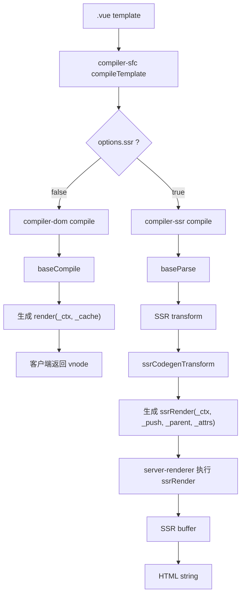
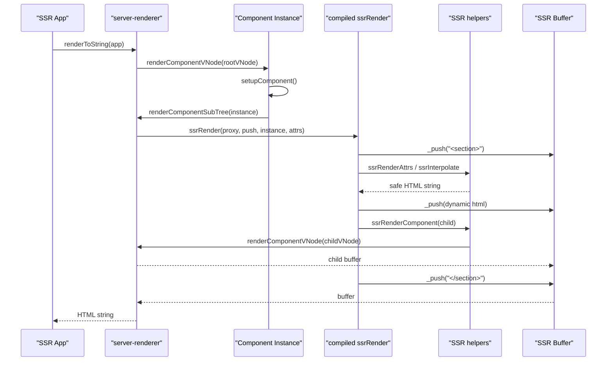

# Vue3 SSR 编译流程源码分析

本文从源码角度分析 Vue3 的 template 在 SSR 场景下如何被编译成服务端渲染函数。核心问题是：为什么客户端编译产物是 `render()` 返回 vnode，而 SSR 编译产物是 `ssrRender()` 向 `_push` 写入 HTML 字符串。

## 1. 核心源码文件

| 模块 | 文件 | 作用 |
| --- | --- | --- |
| SFC 编译入口 | `vue3/packages/compiler-sfc/src/compileTemplate.ts` | 根据 `ssr` 选项选择 `@vue/compiler-dom` 或 `@vue/compiler-ssr`。 |
| SSR 编译入口 | `vue3/packages/compiler-ssr/src/index.ts` | 对外导出 `compile`，配置 SSR 专用 transform。 |
| SSR 二次 codegen | `vue3/packages/compiler-ssr/src/ssrCodegenTransform.ts` | 把模板 AST 转成 `_push(...)` 为核心的 SSR JS AST。 |
| 元素 SSR transform | `vue3/packages/compiler-ssr/src/transforms/ssrTransformElement.ts` | 生成普通元素 HTML 字符串、属性拼接、children 处理。 |
| 组件 SSR transform | `vue3/packages/compiler-ssr/src/transforms/ssrTransformComponent.ts` | 生成 `_ssrRenderComponent(...)` 或 `_ssrRenderVNode(...)` 调用。 |
| `v-if` SSR transform | `vue3/packages/compiler-ssr/src/transforms/ssrVIf.ts` | 把 `v-if` 转成 JS `if / else if / else` 语句。 |
| `v-for` SSR transform | `vue3/packages/compiler-ssr/src/transforms/ssrVFor.ts` | 把 `v-for` 转成 `_ssrRenderList(source, fn)`。 |
| slot SSR transform | `vue3/packages/compiler-ssr/src/transforms/ssrTransformSlotOutlet.ts` | 把 `<slot>` 转成 `_ssrRenderSlot(...)`。 |
| SSR runtime helpers | `vue3/packages/server-renderer/src/helpers/*` | 运行编译产物依赖的字符串渲染 helper。 |
| SSR 组件渲染 | `vue3/packages/server-renderer/src/render.ts` | 执行组件的 `ssrRender`，将结果写入 SSR buffer。 |
| 运行时模板编译 | `vue3/packages/server-renderer/src/helpers/ssrCompile.ts` | CJS 环境下把字符串 template 即时编译成 `ssrRender`。 |

## 2. compiler-ssr 的职责

`compiler-ssr` 是专门面向服务端渲染的模板编译器。它复用 `compiler-dom` 的解析能力、表达式处理、部分 DOM transform，但输出目标完全不同：

客户端编译目标：

```js
function render(_ctx, _cache) {
  return _createElementVNode("div", null, _toDisplayString(_ctx.msg), 1)
}
```

SSR 编译目标：

```js
function ssrRender(_ctx, _push, _parent, _attrs) {
  _push(`<div>${_ssrInterpolate(_ctx.msg)}</div>`)
}
```

设计原因是服务端没有真实 DOM，也不需要 vnode diff。SSR 最重要的是尽快生成安全、稳定、可被客户端 hydration 接管的 HTML 字符串。因此 SSR 编译会尽量把静态 HTML、动态插值、动态属性直接拼成字符串写入 `_push`。

## 3. SSR 编译调用链

### SFC 构建期调用链

```text
compiler-sfc.compileTemplate({ ssr: true })
  -> doCompileTemplate()
    -> defaultCompiler = CompilerSSR
    -> CompilerSSR.compile(source, options)
      -> baseParse(source, options)
      -> transform(ast, SSR nodeTransforms / directiveTransforms)
      -> ssrCodegenTransform(ast, options)
      -> generate(ast, options)
      -> export function ssrRender(...)
```

### server-renderer 运行时兜底编译调用链

```text
renderComponentSubTree(instance)
  -> 如果组件没有 render / ssrRender 但存在 comp.template
  -> comp.ssrRender = ssrCompile(comp.template, instance)
    -> compiler-ssr.compile(template, finalCompilerOptions)
    -> Function('require', code)(fakeRequire)
    -> 返回 ssrRender 函数
```

注意：`server-renderer/src/helpers/ssrCompile.ts` 里的 `ssrCompile` 是运行时兜底，只支持 CJS build。真实项目更常见的是构建阶段由 bundler 调用 `compiler-sfc.compileTemplate({ ssr: true })` 提前生成 `ssrRender`。

## 4. 客户端编译 vs SSR 编译

| 对比项 | 客户端 template 编译 | SSR template 编译 |
| --- | --- | --- |
| 入口 | `compiler-dom/src/index.ts` 的 `compile` | `compiler-ssr/src/index.ts` 的 `compile` |
| 底层流程 | `baseCompile -> baseParse -> transform -> generate` | `baseParse -> transform -> ssrCodegenTransform -> generate` |
| 输出函数名 | `render` | `ssrRender` |
| 函数签名 | `render(_ctx, _cache)` | `ssrRender(_ctx, _push, _parent, _attrs)` |
| 输出结果 | 返回 vnode 树 | 调用 `_push` 写入 HTML 片段 |
| 主要 runtime helper | `openBlock`、`createElementBlock`、`toDisplayString` | `ssrInterpolate`、`ssrRenderAttrs`、`ssrRenderComponent`、`ssrRenderSlot` |
| 优化重点 | patchFlag、block tree、事件缓存、静态提升 | 字符串直出、安全转义、attrs 合并、SSR slot/component 协作 |
| DOM 相关 | 客户端创建 / patch 真实 DOM | 服务端不创建真实 DOM |
| patchFlag | 用于客户端更新优化 | SSR 首屏字符串生成不依赖 patchFlag |
| hoistStatic / cacheHandlers | 可开启 | `compiler-ssr` 内部关闭，因为服务端没有客户端 patch 热路径 |

## 5. ssrCompile 的入口在哪里

这里有两个容易混淆的入口：

| 名称 | 源码位置 | 含义 |
| --- | --- | --- |
| SSR 编译器入口 | `vue3/packages/compiler-ssr/src/index.ts` 的 `compile` | 真正的 SSR template compiler，对外生成 `ssrRender` 代码。 |
| 运行时即时编译入口 | `vue3/packages/server-renderer/src/helpers/ssrCompile.ts` 的 `ssrCompile` | server-renderer 在 CJS 环境下遇到字符串 template 时临时调用 `compiler-ssr.compile`。 |

`compiler-ssr/src/index.ts` 会强制设置：

```ts
options = {
  ...options,
  ssr: true,
  inSSR: true,
  prefixIdentifiers: true,
  cacheHandlers: false,
  hoistStatic: false
}
```

这说明 SSR 编译是独立目标，不是客户端编译的简单开关。

## 6. compiler-ssr 源码结构

```text
packages/compiler-ssr/src
├── index.ts                         # SSR compile 入口
├── ssrCodegenTransform.ts           # 第二轮 SSR codegen AST 转换
├── runtimeHelpers.ts                # 注册 server-renderer helper 名称
├── errors.ts
└── transforms
    ├── ssrTransformElement.ts       # 普通元素、属性、children
    ├── ssrTransformComponent.ts     # 组件、slot 函数、动态组件
    ├── ssrTransformSlotOutlet.ts    # <slot>
    ├── ssrVIf.ts                    # v-if
    ├── ssrVFor.ts                   # v-for
    ├── ssrVModel.ts                 # v-model SSR 属性
    ├── ssrVShow.ts                  # v-show SSR style
    ├── ssrTransformTeleport.ts
    ├── ssrTransformSuspense.ts
    ├── ssrTransformTransition.ts
    ├── ssrTransformTransitionGroup.ts
    ├── ssrInjectFallthroughAttrs.ts
    └── ssrInjectCssVars.ts
```

## 7. SSR 如何直接生成字符串拼接逻辑

关键在 `ssrCodegenTransform.ts`。

客户端 codegen 的 `ast.codegenNode` 通常是 vnode 创建表达式，例如 `createElementVNode(...)`。SSR 则额外跑一轮 `ssrCodegenTransform`：

```text
ssrCodegenTransform(ast)
  -> createSSRTransformContext()
  -> processChildren(ast, context)
  -> context.pushStringPart(...)
  -> context.pushStatement(...)
  -> ast.codegenNode = createBlockStatement(context.body)
```

`createSSRTransformContext` 内部维护两个核心状态：

| 字段 | 作用 |
| --- | --- |
| `body` | 最终 `ssrRender` 函数体里的语句数组。 |
| `currentString` | 当前正在合并的 template literal。连续静态字符串会被合并，减少 `_push` 次数。 |

当遇到普通文本、静态标签、插值时，会写成：

```js
_push(`<div>hello ${_ssrInterpolate(_ctx.msg)}</div>`)
```

当遇到控制流、组件、slot、teleport、suspense 这类不能简单拼进一个字符串的位置时，会关闭当前字符串，插入独立语句：

```js
if (_ctx.ok) {
  _push(`<span>ok</span>`)
} else {
  _push(`<!---->`)
}
```

## 8. template 到 ssrRender 的转换示例

模板：

```vue
<template>
  <section class="box" :id="id">
    <p v-if="ok">{{ msg }}</p>
    <ul>
      <li v-for="item in list" :key="item.id">{{ item.text }}</li>
    </ul>
    <Child :title="msg">
      <template #default="{ name }">
        <span>{{ name }}</span>
      </template>
    </Child>
  </section>
</template>
```

SSR 编译后的结构可以理解为：

```js
const { ssrInterpolate: _ssrInterpolate,
        ssrRenderAttr: _ssrRenderAttr,
        ssrRenderList: _ssrRenderList,
        ssrRenderComponent: _ssrRenderComponent } = require("vue/server-renderer")

return function ssrRender(_ctx, _push, _parent, _attrs) {
  const _component_Child = _resolveComponent("Child")

  _push(`<section class="box"${_ssrRenderAttr("id", _ctx.id)}>`)

  if (_ctx.ok) {
    _push(`<p>${_ssrInterpolate(_ctx.msg)}</p>`)
  } else {
    _push(`<!---->`)
  }

  _push(`<ul><!--[-->`)
  _ssrRenderList(_ctx.list, (item) => {
    _push(`<li>${_ssrInterpolate(item.text)}</li>`)
  })
  _push(`<!--]--></ul>`)

  _push(_ssrRenderComponent(_component_Child, {
    title: _ctx.msg
  }, {
    default: ({ name }, _push, _parent, _scopeId) => {
      if (_push) {
        _push(`<span${_scopeId}>${_ssrInterpolate(name)}</span>`)
      } else {
        return [_createVNode("span", null, name)]
      }
    }
  }, _parent))

  _push(`</section>`)
}
```

这段是源码行为的等价简化版，不是逐字输出。重点是：SSR 编译产物围绕 `_push`、`_ssrRenderList`、`_ssrRenderComponent`、slot 函数展开。

## 9. v-if 在 SSR 编译中如何处理

源码位置：`vue3/packages/compiler-ssr/src/transforms/ssrVIf.ts`

SSR 对 `v-if` 分两阶段处理：

1. 第一阶段复用 `compiler-dom` 的 `processIf`，把模板节点变成 `IfNode`。
2. 第二阶段 `ssrProcessIf` 把 `IfNode` 变成 JS `if` 语句。

示例：

```vue
<div v-if="ok">A</div>
<div v-else>B</div>
```

会变成类似：

```js
if (_ctx.ok) {
  _push(`<div>A</div>`)
} else {
  _push(`<div>B</div>`)
}
```

如果没有 `else`，SSR 会补一个注释占位：

```js
else {
  _push(`<!---->`)
}
```

这个注释对 hydration 很重要。客户端接管时需要稳定的 DOM 节点位置，否则 vnode 和服务端 DOM 对不上。

## 10. v-for 在 SSR 编译中如何处理

源码位置：`vue3/packages/compiler-ssr/src/transforms/ssrVFor.ts`

`v-for` 也是两阶段：

1. 第一阶段复用 `processFor` 得到 `ForNode`。
2. 第二阶段 `ssrProcessFor` 生成 `_ssrRenderList(source, renderItem)`。

示例：

```vue
<li v-for="item in list">{{ item.text }}</li>
```

会变成类似：

```js
_push(`<!--[-->`)
_ssrRenderList(_ctx.list, (item) => {
  _push(`<li>${_ssrInterpolate(item.text)}</li>`)
})
_push(`<!--]-->`)
```

这里的 `<!--[-->` 和 `<!--]-->` 是 fragment 边界。SSR 输出 HTML 后，客户端 hydration 可以用它们识别多根节点或列表片段的开始与结束。

## 11. dynamic props 在 SSR 中如何处理

源码位置：`vue3/packages/compiler-ssr/src/transforms/ssrTransformElement.ts`

SSR 处理动态属性时有几个分支：

| 场景 | 编译策略 |
| --- | --- |
| 静态属性 | 直接拼进 open tag，例如 ` class="box"`。 |
| `:class` | 编译成 `_ssrRenderClass(value)`，负责 normalize + escape。 |
| `:style` | 编译成 `_ssrRenderStyle(value)`，负责 normalize + escape。 |
| 静态 key 的 `v-bind:id` | 编译成 `_ssrRenderAttr("id", value)`。 |
| 动态 key 的 `v-bind:[key]` | 编译成 `_ssrRenderDynamicAttr(key, value, tag)`。 |
| `v-bind="obj"` | 进入 `_ssrRenderAttrs(mergedProps, tag)`，运行时遍历 props。 |
| 自定义指令 | 通过 `_ssrGetDirectiveProps` 合并指令产生的 SSR props。 |
| 原生事件监听 | 普通元素 SSR 不输出事件属性，事件在客户端 hydration 时补齐。 |
| 组件事件监听 | 组件 props 构建时仍保留 `v-on`，传给子组件。 |

设计原因是 HTML 字符串必须安全。所有动态属性都要经过安全属性名检查、布尔属性处理和 HTML escape，避免把不可信内容直接拼入 HTML。

## 12. slot 在 SSR 中如何渲染

slot 分两类：

### `<slot>` 出口

源码位置：`vue3/packages/compiler-ssr/src/transforms/ssrTransformSlotOutlet.ts`

`<slot name="header" :foo="bar">fallback</slot>` 会变成：

```js
_ssrRenderSlot(
  _ctx.$slots,
  "header",
  { foo: _ctx.bar },
  fallbackRenderFn,
  _push,
  _parent
)
```

默认情况下，SSR slot 会包 fragment 边界：

```html
<!--[-->slot content<!--]-->
```

### 组件 children 编译成 slot 函数

源码位置：`vue3/packages/compiler-ssr/src/transforms/ssrTransformComponent.ts`

组件插槽函数会生成两个分支：

```js
default: (props, _push, _parent, _scopeId) => {
  if (_push) {
    // SSR 优化分支：直接写 HTML
    _push(`<span${_scopeId}>...</span>`)
  } else {
    // vnode fallback 分支：给非 SSR 编译的调用方使用
    return [_createVNode("span")]
  }
}
```

这个设计很妙：同一个 slot 可以被 SSR helper 调用，也可以在需要 vnode 的场景回退到普通 vnode 分支。

## 13. component 在 SSR 中如何渲染

组件节点在编译阶段会变成 `_ssrRenderComponent`：

```js
_push(_ssrRenderComponent(_component_Child, props, slots, _parent))
```

运行时 helper 位于 `server-renderer/src/helpers/ssrRenderComponent.ts`：

```ts
ssrRenderComponent(comp, props, children, parentComponent)
  -> renderComponentVNode(createVNode(comp, props, children), parentComponent)
```

也就是说，SSR 编译不会直接展开子组件源码，而是生成组件渲染 helper 调用。真正进入子组件时仍然会：

```text
createVNode(Child)
  -> renderComponentVNode()
    -> createComponentInstance()
    -> setupComponent()
    -> renderComponentSubTree()
    -> 执行 child.ssrRender 或 fallback 到 renderVNode
```

动态组件稍微不同。因为 `resolveDynamicComponent` 可能解析成字符串元素、组件或 vnode，所以 SSR 会生成：

```js
_ssrRenderVNode(
  _push,
  _createVNode(_resolveDynamicComponent(_ctx.name), props, slots),
  _parent
)
```

## 14. SSR 编译如何和 server-renderer 协作

协作边界可以概括为：

```text
compiler-ssr 负责生成代码
server-renderer 负责执行代码并提供 helper
```

具体来说：

1. `compiler-ssr/runtimeHelpers.ts` 注册 helper 名称，例如 `ssrInterpolate`、`ssrRenderAttrs`、`ssrRenderComponent`。
2. `generate` 根据 `ast.ssrHelpers` 从 `vue/server-renderer` 导入 helper。
3. `server-renderer/render.ts` 在 `renderComponentSubTree` 中执行 `ssrRender(instance.proxy, push, instance, attrs, ...)`。
4. `ssrRender` 内部调用 `_push` 和 helper，把字符串片段写入 `createBuffer()` 管理的 buffer。
5. `renderToString` 最终把 buffer 展平成 HTML 字符串。

核心运行时链路：

```text
renderToString(app)
  -> renderComponentVNode(rootVNode)
    -> renderComponentSubTree(instance)
      -> ssrRender(instance.proxy, push, instance, attrs, ...)
        -> _push(`<div>`)
        -> _ssrRenderComponent(...)
        -> _ssrRenderSlot(...)
        -> _push(`</div>`)
      -> getBuffer()
  -> unrollBuffer(buffer)
  -> html string
```

## 15. Mermaid：SSR 编译流程



## 16. Mermaid：SSR 编译产物执行流程



## 17. 总结：SSR 编译的设计思想

Vue3 SSR 编译的核心思想是“同一份模板，不同的输出目标”。

客户端编译关心后续更新，所以要生成 vnode、patchFlag、block tree，让运行时更快 diff。SSR 编译关心首屏字符串生成，所以绕开 vnode 创建热路径，直接把模板变成 `_push` 调用和 server-renderer helper 调用。

这带来几个好处：

1. 服务端不需要创建真实 DOM，也不需要执行 DOM patch。
2. 静态 HTML 可以直接合并成 template literal，减少运行时代码。
3. 动态文本和动态属性统一经过 SSR helper，保证 escape 与属性安全。
4. `v-if`、`v-for` 被编译成原生 JS 控制流，执行成本低。
5. 组件、slot、teleport、suspense 交给 server-renderer runtime helper，保留组件抽象能力。
6. 输出的 HTML 会包含 fragment / comment 边界，方便客户端 hydration 精确接管。

一句话记忆：客户端编译生成“如何更新 DOM 的 vnode 描述”，SSR 编译生成“如何写出 HTML 的字符串程序”。
