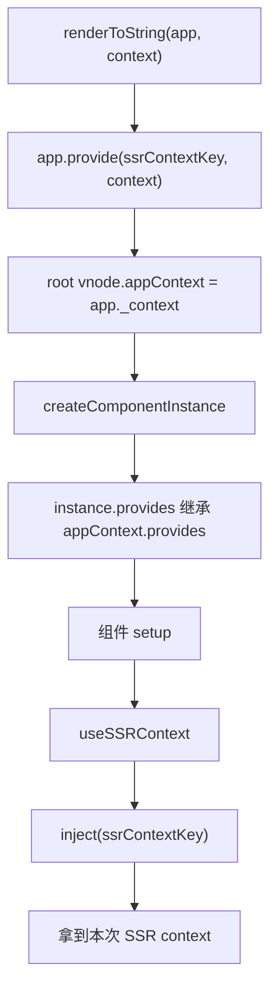
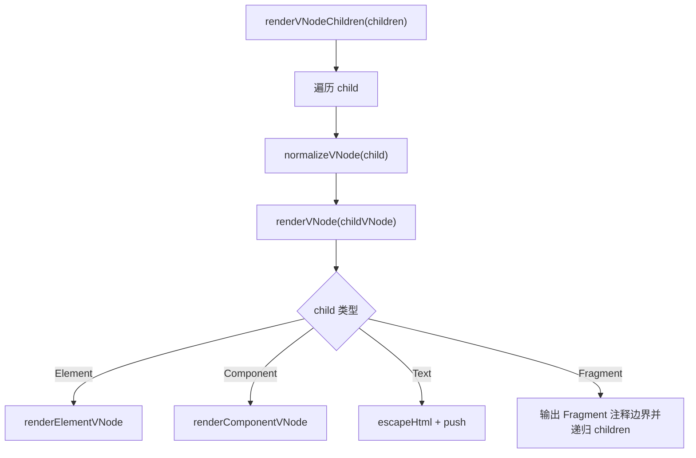
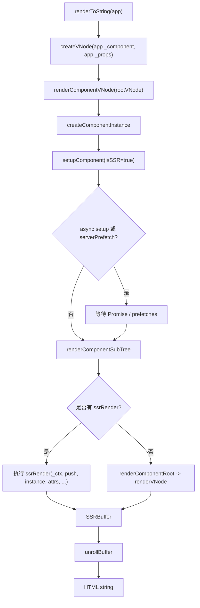
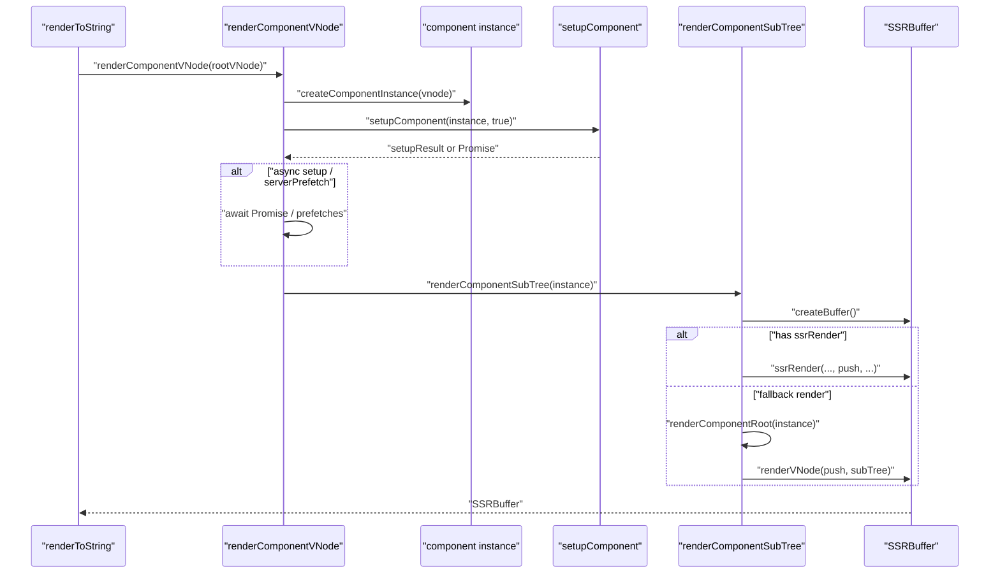

# Vue3 SSR renderToString 源码完整流程追踪

本文从下面这段 SSR 入口代码开始，追踪 Vue3 如何在服务端把组件渲染成 HTML 字符串：

```ts
import { createSSRApp } from 'vue'
import { renderToString } from 'vue/server-renderer'
import App from './App.vue'

const app = createSSRApp(App)
const html = await renderToString(app)
```

核心主线可以先记成一句话：

```text
createSSRApp 创建 SSR app，
renderToString 把 app 转成根 vnode，
server-renderer 创建组件实例并执行 setup，
再通过 ssrRender / renderVNode 生成 SSRBuffer，
最后 unrollBuffer 展开成 HTML 字符串。
```

## 一、核心源码文件

| 文件 | 作用 |
| --- | --- |
| `packages/runtime-dom/src/index.ts` | `createSSRApp` 入口，创建 hydration renderer，并重写 `app.mount`。 |
| `packages/runtime-core/src/apiCreateApp.ts` | `createAppAPI`，创建 app 对象，保存根组件和 appContext。 |
| `packages/server-renderer/src/renderToString.ts` | `renderToString` 入口，把 app/vnode 转成 HTML string。 |
| `packages/server-renderer/src/render.ts` | SSR 核心渲染逻辑：`renderComponentVNode`、`renderComponentSubTree`、`renderVNode`、`renderElementVNode`。 |
| `packages/server-renderer/src/helpers/ssrRenderComponent.ts` | SSR 编译产物中渲染组件的 helper。 |
| `packages/server-renderer/src/helpers/ssrRenderTeleport.ts` | Teleport SSR buffer 收集。 |
| `packages/server-renderer/src/helpers/ssrRenderSuspense.ts` | Suspense SSR helper。 |
| `packages/server-renderer/src/helpers/ssrRenderAttrs.ts` | 普通元素 attrs 字符串生成。 |
| `packages/runtime-core/src/component.ts` | `setupComponent(instance, true)`，SSR 下执行 setup。 |
| `packages/runtime-core/src/helpers/useSsrContext.ts` | `ssrContextKey` 和 `useSSRContext`。 |

## 二、完整调用链

```text
createSSRApp(App)
  -> runtime-dom createSSRApp
     -> ensureHydrationRenderer()
        -> createHydrationRenderer(rendererOptions)
        -> createAppAPI(render, hydrate)
     -> createAppAPI(...)(App)
        -> 创建 app
           app._component = App
           app._props = rootProps
           app._context = appContext
     -> 重写 app.mount，用于客户端 hydration
     -> return app

renderToString(app)
  -> createVNode(app._component, app._props)
  -> vnode.appContext = app._context
  -> app.provide(ssrContextKey, context)
  -> renderComponentVNode(vnode)
     -> createComponentInstance(vnode, parentComponent, null)
     -> setupComponent(instance, true)
        -> initProps
        -> initSlots
        -> setupStatefulComponent
        -> 执行 setup(props, setupContext)
        -> handleSetupResult
        -> finishComponentSetup
     -> 如果 async setup / serverPrefetch，等待完成
     -> renderComponentSubTree(instance)
        -> createBuffer()
        -> 如果有 ssrRender:
             ssrRender(instance.proxy, push, instance, attrs, props, setupState, data, ctx)
           否则:
             renderComponentRoot(instance)
             renderVNode(push, instance.subTree, instance)
        -> getBuffer()
  -> unrollBuffer(buffer)
  -> resolveTeleports(context)
  -> 清理 context.__watcherHandles
  -> return html
```

## 三、createSSRApp 的入口在哪里

源码位置：`packages/runtime-dom/src/index.ts`

```ts
export const createSSRApp = ((...args) => {
  const app = ensureHydrationRenderer().createApp(...args)

  const { mount } = app
  app.mount = (containerOrSelector) => {
    const container = normalizeContainer(containerOrSelector)
    if (container) {
      return mount(container, true, resolveRootNamespace(container))
    }
  }

  return app
})
```

`createSSRApp(App)` 本身并不会渲染 HTML。它只是创建 app 对象：

```text
app._component = App
app._props = rootProps
app._context = appContext
```

服务端真正开始渲染是在：

```ts
await renderToString(app)
```

## 四、createSSRApp 和 createApp 有什么区别

| 对比点 | `createApp` | `createSSRApp` |
| --- | --- | --- |
| renderer | `ensureRenderer()` | `ensureHydrationRenderer()` |
| 客户端 mount | 清空 container 后普通 mount。 | 不清空 container，hydrate 服务端 DOM。 |
| core mount 参数 | `mount(container, false, namespace)` | `mount(container, true, namespace)` |
| DOM 来源 | 客户端创建。 | 服务端 HTML 被浏览器解析后产生，客户端复用。 |
| 服务端 renderToString | app 只是根组件容器。 | app 同样只是根组件容器，SSR 关键在 server-renderer。 |

容易混淆的一点：

```text
服务端 renderToString 不会调用 app.mount。
createSSRApp 的 mount 重写主要服务客户端 hydration。
```

服务端用 `createSSRApp` 的价值主要是：

1. app 语义和客户端 SSR app 一致。
2. appContext、provide、插件等仍能正常工作。
3. 同构代码可以服务端和客户端都写 `createSSRApp(App)`。

## 五、renderToString 的入口在哪里

源码位置：`packages/server-renderer/src/renderToString.ts`

```ts
export async function renderToString(
  input: App | VNode,
  context: SSRContext = {},
): Promise<string> {
  if (isVNode(input)) {
    return renderToString(createApp({ render: () => input }), context)
  }

  const vnode = createVNode(input._component, input._props)
  vnode.appContext = input._context
  input.provide(ssrContextKey, context)
  const buffer = await renderComponentVNode(vnode)

  const result = await unrollBuffer(buffer as SSRBuffer)

  await resolveTeleports(context)

  if (context.__watcherHandles) {
    for (const unwatch of context.__watcherHandles) {
      unwatch()
    }
  }

  return result
}
```

`renderToString` 接收两类输入：

| 输入 | 处理方式 |
| --- | --- |
| `App` | 创建根组件 vnode，然后渲染组件 vnode。 |
| `VNode` | 包装成临时 app，再递归调用 `renderToString`。 |

## 六、app 如何转换成 vnode

服务端渲染 app 时，`renderToString` 会创建根 vnode：

```ts
const vnode = createVNode(input._component, input._props)
vnode.appContext = input._context
```

这一步和客户端 mount 很像：

```text
app._component
  -> root vnode.type

app._props
  -> root vnode.props

app._context
  -> root vnode.appContext
```

转换后的关系：

```text
app
  _component: App
  _props: rootProps
  _context: appContext

root vnode
  type: App
  props: rootProps
  appContext: appContext
```

设计原因：server-renderer 不直接渲染 app 对象，而是复用 Vue 的 vnode/component 体系。根组件先变成 vnode，后面就能统一走 `renderComponentVNode`。

## 七、SSR context 是如何传递的

`renderToString` 默认创建一个空 context：

```ts
context: SSRContext = {}
```

然后注入到 app：

```ts
input.provide(ssrContextKey, context)
```

`ssrContextKey` 在 `runtime-core/src/helpers/useSsrContext.ts`：

```ts
export const ssrContextKey: unique symbol = Symbol.for('v-scx')
```

组件里调用：

```ts
const ctx = useSSRContext()
```

本质是：

```ts
inject(ssrContextKey)
```

流程图：



设计原因：SSR context 是请求级别的数据，必须隔离每次请求。用 provide/inject 可以沿组件树传递，并避免模块级全局变量导致跨请求污染。

## 八、renderComponentVNode 做了什么

源码位置：`packages/server-renderer/src/render.ts`

核心逻辑：

```text
renderComponentVNode(vnode, parentComponent, slotScopeId)
  -> instance = vnode.component = createComponentInstance(vnode, parentComponent, null)
  -> setupComponent(instance, true)
  -> 判断 setup 是否异步
  -> 读取 instance.sp，也就是 onServerPrefetch hooks
  -> 如果 async setup 或 serverPrefetch:
       等待它们完成
       renderComponentSubTree(instance)
     否则:
       renderComponentSubTree(instance)
```

伪代码：

```ts
function renderComponentVNode(vnode, parentComponent, slotScopeId) {
  const instance = vnode.component = createComponentInstance(vnode, parentComponent, null)
  const res = setupComponent(instance, true)
  const hasAsyncSetup = isPromise(res)
  let prefetches = instance.sp

  if (hasAsyncSetup || prefetches) {
    return Promise.resolve(res)
      .then(() => {
        if (hasAsyncSetup) prefetches = instance.sp
        if (prefetches) {
          return Promise.all(prefetches.map(prefetch => prefetch.call(instance.proxy)))
        }
      })
      .then(() => renderComponentSubTree(instance, slotScopeId))
  }

  return renderComponentSubTree(instance, slotScopeId)
}
```

### 设计原因

SSR 必须等组件的数据准备好再输出 HTML。`async setup` 和 `onServerPrefetch` 都属于“服务端渲染前需要等待”的异步依赖。

## 九、组件 setup 在服务端如何执行

服务端仍然执行组件 setup，而且走的是 runtime-core 的组件初始化逻辑：

```text
setupComponent(instance, true)
  -> initProps
  -> initSlots
  -> setupStatefulComponent
     -> instance.proxy = new Proxy(instance.ctx, PublicInstanceProxyHandlers)
     -> setCurrentInstance(instance)
     -> setup(props, setupContext)
     -> reset currentInstance
     -> handleSetupResult
     -> finishComponentSetup
```

和客户端的区别：

| 对比点 | 客户端 mount | 服务端 renderToString |
| --- | --- | --- |
| 是否创建组件实例 | 是 | 是 |
| 是否执行 setup | 是 | 是 |
| 是否创建 render effect | 是 | 否 |
| 是否 patch DOM | 是 | 否 |
| setup 后做什么 | `setupRenderEffect` | `renderComponentSubTree` |

服务端 setup 可以创建响应式数据：

```ts
setup() {
  const count = ref(1)
  return { count }
}
```

但服务端不会通过响应式更新 DOM。SSR 是一次性渲染，最终输出字符串。

## 十、renderComponentSubTree 做了什么

`renderComponentSubTree` 的任务是把“一个组件实例”渲染成当前组件的 `SSRBuffer`。

它先创建 buffer：

```ts
const { getBuffer, push } = createBuffer()
```

然后分三种情况：

### 1. 函数组件

```text
isFunction(comp)
  -> renderComponentRoot(instance)
  -> renderVNode(push, instance.subTree, instance)
```

### 2. 有 ssrRender

SFC 在 SSR 编译后通常会有 `ssrRender`：

```text
const ssrRender = instance.ssrRender || comp.ssrRender
```

执行：

```ts
ssrRender(
  instance.proxy,
  push,
  instance,
  attrs,
  instance.props,
  instance.setupState,
  instance.data,
  instance.ctx,
)
```

这是 SSR 的优化路径。它通常直接 `_push("<div>...</div>")`，不需要先完整生成 vnode 再转字符串。

### 3. 没有 ssrRender，但有普通 render

```text
renderComponentRoot(instance)
  -> 得到 subTree vnode
renderVNode(push, subTree, instance)
```

这是一条兼容路径，适用于手写 render 函数、未 SSR 编译的组件等。

### 4. 缺少 template/render

输出空注释：

```text
<!---->
```

## 十一、vnode 如何被渲染成 HTML

`renderVNode` 是 vnode 到 HTML 的分发中心：

```text
renderVNode(push, vnode, parentComponent)
  -> Text
     push(escapeHtml(text))
  -> Comment
     push("<!--...-->")
  -> Static
     push(staticHTML)
  -> Fragment
     push("<!--[-->")
     renderVNodeChildren(...)
     push("<!--]-->")
  -> Element
     renderElementVNode(...)
  -> Component
     push(renderComponentVNode(...))
  -> Teleport
     renderTeleportVNode(...)
  -> Suspense
     renderVNode(vnode.ssContent)
```

### 为什么 Fragment 要输出注释边界

Fragment 没有真实外层元素。服务端需要给客户端 hydration 留下边界：

```html
<!--[-->
  ...
<!--]-->
```

客户端 hydration 可以通过这些注释定位 Fragment 的起止范围。

## 十二、renderElementVNode 如何处理普通元素

`renderElementVNode` 把普通元素 vnode 转成 HTML 标签字符串。

主线：

```text
renderElementVNode(push, vnode)
  -> tag = vnode.type
  -> openTag = `<${tag}`
  -> 如果有 props，拼接 ssrRenderAttrs(props, tag)
  -> 拼接 scopeId / slotScopeId
  -> push(openTag + `>`)
  -> 如果不是 void tag:
       如果 props.innerHTML，直接 push innerHTML
       否则如果 props.textContent，push 转义后的 textContent
       否则如果 textarea value，push value
       否则:
         TEXT_CHILDREN -> push(escapeHtml(children))
         ARRAY_CHILDREN -> renderVNodeChildren(...)
       push(`</${tag}>`)
```

伪代码：

```ts
function renderElementVNode(push, vnode) {
  const tag = vnode.type
  let openTag = `<${tag}`

  if (vnode.props) {
    openTag += ssrRenderAttrs(vnode.props, tag)
  }

  push(openTag + `>`)

  if (!isVoidTag(tag)) {
    if (vnode.props?.innerHTML) {
      push(vnode.props.innerHTML)
    } else if (vnode.shapeFlag & TEXT_CHILDREN) {
      push(escapeHtml(vnode.children))
    } else if (vnode.shapeFlag & ARRAY_CHILDREN) {
      renderVNodeChildren(push, vnode.children, parentComponent)
    }
    push(`</${tag}>`)
  }
}
```

重要点：

1. SSR 渲染普通元素不会创建 DOM。
2. 文本 children 会 `escapeHtml`，避免 HTML 注入。
3. `innerHTML` 会直接输出，责任在用户。
4. void tag 不输出 closing tag。
5. scoped CSS 相关的 `scopeId` 会作为属性输出。

## 十三、renderComponentVNode 如何处理组件

组件出现在两种地方：

### 1. 根组件

`renderToString` 直接调用：

```text
renderComponentVNode(rootVNode)
```

### 2. 子组件 vnode

`renderVNode` 发现：

```text
shapeFlag & ShapeFlags.COMPONENT
```

会执行：

```ts
push(renderComponentVNode(vnode, parentComponent, slotScopeId))
```

这里 `push` 的 item 可以是：

```text
SSRBuffer
Promise<SSRBuffer>
```

所以子组件如果是 async setup，父组件 buffer 里会保存一个 Promise。最终 `unrollBuffer` 会等待它。

编译后的 SSR render 函数中也可能直接使用 helper：

```ts
ssrRenderComponent(comp, props, children, parentComponent, slotScopeId)
```

这个 helper 本质也是：

```text
createVNode(comp, props, children)
  -> renderComponentVNode(...)
```

## 十四、renderVNodeChildren 如何处理 children

`renderVNodeChildren` 很直接：

```ts
for (let i = 0; i < children.length; i++) {
  renderVNode(push, normalizeVNode(children[i]), parentComponent, slotScopeId)
}
```

设计原因：

1. children 可能混合字符串、数字、数组、vnode。
2. `normalizeVNode` 可以把不同形态统一成 vnode。
3. 每个 child 再交给 `renderVNode` 递归处理。

children 递归流程：



## 十五、teleport / suspense / async component 在 SSR 中如何处理

### 1. Teleport

Teleport SSR 不会真的把 DOM 移动到目标，因为服务端没有 DOM。它会把 teleport 内容收集到 SSR context。

流程：

```text
renderVNode
  -> shapeFlag & TELEPORT
  -> renderTeleportVNode
  -> ssrRenderTeleport
     -> parentPush("<!--teleport start-->")
     -> 从 parentComponent.appContext.provides[ssrContextKey] 拿 context
     -> context.__teleportBuffers[target] 收集内容
     -> parentPush("<!--teleport end-->")
```

`renderToString` 最后调用：

```ts
await resolveTeleports(context)
```

它会把 `context.__teleportBuffers` 展开到：

```ts
context.teleports[target] = html
```

所以最终主 HTML 里有 teleport 占位注释，真实 teleport 内容在 `context.teleports` 中。

### 2. Suspense

服务端 Suspense 更偏向“等待内容后输出 default content”：

```text
renderVNode
  -> shapeFlag & SUSPENSE
  -> renderVNode(push, vnode.ssContent, ...)
```

`ssrRenderSuspense` helper：

```ts
if (renderContent) {
  renderContent()
} else {
  push(`<!---->`)
}
```

由于 `renderComponentVNode` 会等待 async setup 和 serverPrefetch，SSR 通常输出解析后的 default 分支。

### 3. async setup / async component

`renderComponentVNode` 会处理 async setup：

```text
setupComponent(instance, true)
  -> 返回 Promise
  -> renderComponentVNode 等待 Promise
  -> 再 renderComponentSubTree
```

如果某个子组件返回 `Promise<SSRBuffer>`，父组件 buffer 会把它作为异步 item 保存：

```ts
type SSRBufferItem = string | SSRBuffer | Promise<SSRBuffer>
```

最后：

```text
unrollBuffer
  -> 遇到 Promise
  -> await Promise<SSRBuffer>
  -> 继续展开
```

这就是 SSR 能自然支持异步组件树的原因。

## 十六、最终 HTML 字符串是如何拼接出来的

SSR 的中间结果不是立刻拼成一个大字符串，而是 `SSRBuffer`。

```ts
type SSRBuffer = SSRBufferItem[] & { hasAsync?: boolean }
type SSRBufferItem = string | SSRBuffer | Promise<SSRBuffer>
```

`createBuffer` 返回：

```text
push(item)
  -> 如果连续 push 字符串，合并到上一个字符串，减少碎片
  -> 如果 item 是 Promise 或 async child buffer，标记 buffer.hasAsync = true

getBuffer()
  -> 返回 buffer
```

`unrollBuffer` 展开：

```text
unrollBuffer(buffer)
  -> nestedUnrollBuffer(buffer, '', 0)
  -> 如果 buffer 没有 async:
       unrollBufferSync 递归拼接字符串
     如果有 async:
       遍历每个 item
       string 直接拼接
       Promise 等待后继续展开
       child buffer 递归展开
  -> 返回最终 HTML string
```

简化伪代码：

```ts
async function unrollBuffer(buffer) {
  let html = ''
  for (const item of buffer) {
    if (typeof item === 'string') {
      html += item
    } else if (isPromise(item)) {
      html += await unrollBuffer(await item)
    } else {
      html += await unrollBuffer(item)
    }
  }
  return html
}
```

## 十七、SSR vnode 到 HTML 的转换流程图



## 十八、组件 SSR 渲染流程图



## 十九、服务端生成 HTML 的关键设计思想

### 1. 服务端复用组件体系，但不复用 DOM patch

SSR 仍然创建 vnode 和组件实例，也会执行 setup。但它不会创建真实 DOM，而是输出字符串。

```text
复用:
  vnode
  component instance
  props / slots / setup
  appContext / provide / inject

不复用:
  mountElement
  hostCreateElement
  hostInsert
  patchElement
```

### 2. SSR 优先走编译优化路径

如果组件有 `ssrRender`，服务端直接执行它拼字符串。这比先生成 vnode 再递归转 HTML 更直接。

```text
template
  -> compiler-ssr
  -> ssrRender(_ctx, _push, ...)
  -> SSRBuffer
```

### 3. async 被放进 buffer 模型

`SSRBufferItem` 可以是 Promise，这让异步组件、async setup、serverPrefetch 可以自然参与渲染树，而不用把整个渲染模型改成一层层 await。

### 4. SSR context 是请求级上下文

`renderToString(app, context)` 通过 provide/inject 传递 context。Teleport、preload 信息、用户自定义 SSR 数据都可以写入 context，并且不会跨请求污染。

### 5. Teleport 不进主 HTML，而是进 context.teleports

服务端没有 DOM 目标可移动，所以 Teleport 内容被收集到 `context.__teleportBuffers`，最后解析成 `context.teleports`，由 SSR 框架决定插入到 HTML 的哪个位置。

## 二十、核心结论

1. `createSSRApp(App)` 只是创建 SSR app；服务端真正渲染从 `renderToString(app)` 开始。
2. `createSSRApp` 和 `createApp` 的关键差异在客户端 mount：前者 hydrate，后者普通 mount。
3. `renderToString` 会把 app 转成根 vnode，并把 appContext 赋给 vnode。
4. SSR context 通过 `app.provide(ssrContextKey, context)` 进入组件树。
5. `renderComponentVNode` 会创建组件实例，并以 SSR 模式执行 `setupComponent(instance, true)`。
6. 服务端会等待 async setup 和 `onServerPrefetch`。
7. `renderComponentSubTree` 优先执行 `ssrRender`；没有 `ssrRender` 才 fallback 到普通 render + `renderVNode`。
8. `renderVNode` 按 vnode 类型分发，Element 走 `renderElementVNode`，Component 递归 `renderComponentVNode`。
9. 普通元素通过字符串拼接生成 HTML，不创建真实 DOM。
10. children 通过 `renderVNodeChildren` 递归渲染。
11. Teleport 内容收集到 `context.teleports`。
12. Suspense 在服务端倾向输出 default content。
13. 最终 HTML 来自 `SSRBuffer -> unrollBuffer`。

一句话收束：

```text
Vue3 SSR 的 renderToString 不是“在服务端 mount 一次应用”，
而是“复用组件初始化逻辑，把组件树渲染成可异步展开的字符串 buffer”。
```
