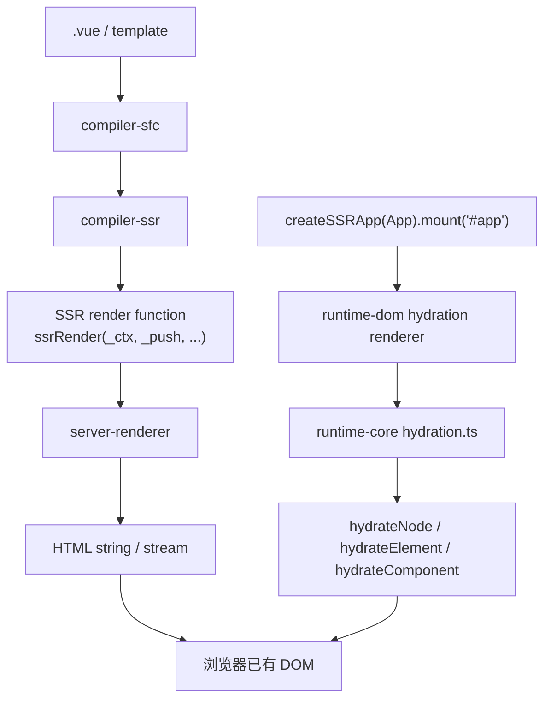
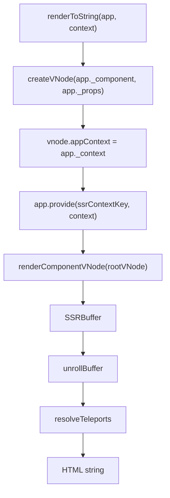
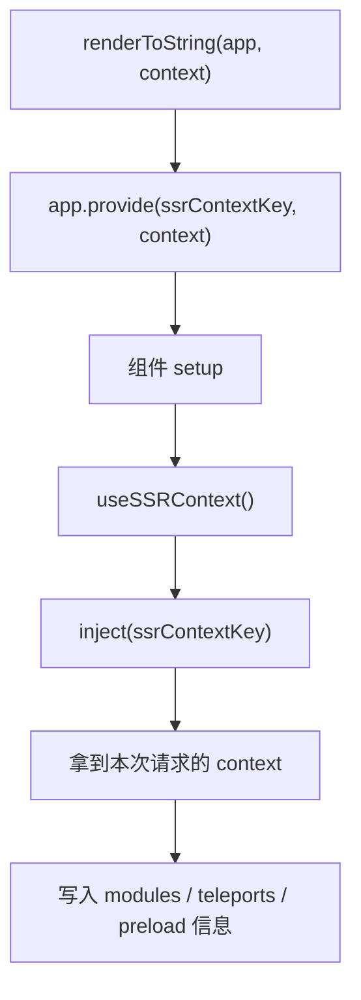
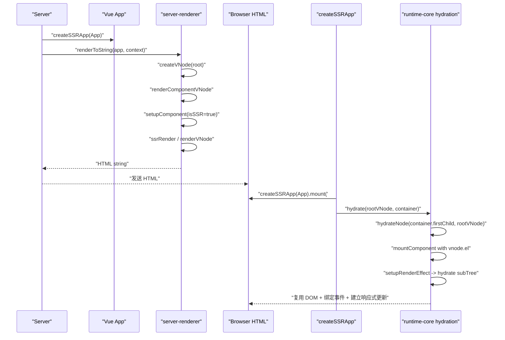

# Vue3 SSR 源码系统学习笔记

本文以“Vue3 框架源码讲解老师 + SSR 架构师”的视角，系统梳理 Vue3 SSR 的源码设计，重点覆盖 `server-renderer`、`createSSRApp`、`renderToString`、流式渲染、`useSSRContext` 与客户端 hydration。

## 一、Vue3 SSR 在整体架构中的位置

Vue3 SSR 不是一个孤立模块，而是由编译层、服务端渲染层、运行时核心层和客户端 hydration 层共同完成。



### 核心包职责

| 包 | SSR 中的职责 |
| --- | --- |
| `runtime-core` | 提供组件实例、vnode、setup 执行、hydration 核心算法、`useSSRContext`。 |
| `runtime-dom` | 提供浏览器端 `createSSRApp`，创建 hydration renderer，并把 DOM 操作注入 core。 |
| `server-renderer` | 服务端入口，把 app/vnode 渲染成 HTML string、Node stream 或 Web stream。 |
| `compiler-ssr` | 把 template 编译成 SSR 专用 render 函数，生成 `_push` 字符串拼接逻辑。 |
| `compiler-core` | 提供通用 AST、transform、codegen 基础能力。 |
| `compiler-dom` | 提供 DOM template parser options 和 DOM 指令转换能力，`compiler-ssr` 会复用它。 |

### 运行链路分成两半

SSR 要分成“服务端渲染”和“客户端激活”两条链路理解：

```text
服务端:
  createSSRApp(App)
  -> renderToString(app, context)
  -> 创建 vnode
  -> 创建组件实例
  -> 执行 setup / async setup / serverPrefetch
  -> 执行 ssrRender 或 render
  -> 输出 HTML 字符串

客户端:
  createSSRApp(App).mount('#app')
  -> hydrate(rootVNode, container)
  -> hydrateNode(container.firstChild, rootVNode)
  -> 复用服务端 DOM
  -> 绑定事件、建立组件实例、建立响应式更新 effect
```

## 二、核心源码文件

| 文件 | 作用 |
| --- | --- |
| `packages/runtime-dom/src/index.ts` | `createApp`、`createSSRApp`、`hydrate`、`ensureHydrationRenderer`。 |
| `packages/runtime-core/src/hydration.ts` | hydration 主算法：`hydrate`、`hydrateNode`、`hydrateElement`、mismatch 处理。 |
| `packages/runtime-core/src/renderer.ts` | `createHydrationRenderer`、组件 hydration 分支、`setupRenderEffect`。 |
| `packages/runtime-core/src/helpers/useSsrContext.ts` | `ssrContextKey` 与 `useSSRContext`。 |
| `packages/runtime-core/src/component.ts` | `setupComponent(instance, true)`，SSR 下执行 setup。 |
| `packages/server-renderer/src/renderToString.ts` | `renderToString` 主入口。 |
| `packages/server-renderer/src/renderToStream.ts` | `renderToNodeStream`、`renderToWebStream`、pipe API。 |
| `packages/server-renderer/src/render.ts` | `renderComponentVNode`、`renderComponentSubTree`、`renderVNode`、`renderElementVNode`。 |
| `packages/server-renderer/src/helpers/*` | SSR helper，如 `ssrRenderAttrs`、`ssrRenderComponent`、`ssrRenderTeleport`、`ssrRenderSlot`。 |
| `packages/compiler-ssr/src/index.ts` | SSR 编译入口，配置 SSR transform。 |
| `packages/compiler-ssr/src/ssrCodegenTransform.ts` | 把 template AST 转成 SSR codegen AST。 |

## 三、Vue3 SSR 核心 API

### 1. createSSRApp

源码位置：`packages/runtime-dom/src/index.ts`

`createSSRApp` 是客户端 hydration 入口，也是服务端创建 SSR app 时常用的 app 创建函数。

核心差异在 mount：

```ts
export const createSSRApp = ((...args) => {
  const app = ensureHydrationRenderer().createApp(...args)

  const { mount } = app
  app.mount = (containerOrSelector) => {
    const container = normalizeContainer(containerOrSelector)
    if (container) {
      return mount(container, true, resolveRootNamespace(container))
    }
  }

  return app
})
```

注意第二个参数是 `true`：

```text
mount(container, true, namespace)
```

它会让 `runtime-core` 的 `app.mount` 调用 `hydrate(vnode, rootContainer)`，而不是普通 `render(vnode, rootContainer)`。

### 2. renderToString

源码位置：`packages/server-renderer/src/renderToString.ts`

核心流程：

```text
renderToString(input, context)
  -> 如果 input 是 vnode，包装成 app
  -> createVNode(input._component, input._props)
  -> vnode.appContext = input._context
  -> input.provide(ssrContextKey, context)
  -> renderComponentVNode(vnode)
  -> unrollBuffer(buffer)
  -> resolveTeleports(context)
  -> 清理 SSR watcher handles
  -> return html
```

### 3. 流式渲染 API

源码位置：`packages/server-renderer/src/renderToStream.ts`

| API | 作用 |
| --- | --- |
| `renderToNodeStream(input, context)` | 返回 Node.js `Readable` stream。CJS 构建可直接使用。 |
| `renderToWebStream(input, context)` | 返回 Web `ReadableStream`。 |
| `pipeToNodeWritable(input, context, writable)` | 把 SSR 输出写入已有 Node.js Writable。 |
| `pipeToWebWritable(input, context, writable)` | 把 SSR 输出写入已有 Web WritableStream。 |

这些 API 最终都复用：

```text
renderToSimpleStream
  -> renderComponentVNode(vnode)
  -> unrollBuffer(buffer, stream)
  -> stream.push / writable.write
```

### 4. useSSRContext

源码位置：`packages/runtime-core/src/helpers/useSsrContext.ts`

```ts
export const ssrContextKey: unique symbol = Symbol.for('v-scx')

export const useSSRContext = <T = Record<string, any>>() => {
  const ctx = inject<T>(ssrContextKey)
  return ctx
}
```

`renderToString` 会做：

```ts
input.provide(ssrContextKey, context)
```

因此组件内部可以：

```ts
const ctx = useSSRContext()
ctx.modules.add('xxx')
```

设计原因：SSR context 是一次请求级别的数据容器，必须沿组件树传递，但又不应该污染全局状态。

## 四、createApp 和 createSSRApp 有什么区别

| 对比点 | `createApp` | `createSSRApp` |
| --- | --- | --- |
| renderer | `ensureRenderer()` | `ensureHydrationRenderer()` |
| mount 行为 | 清空 container，再普通挂载。 | 不清空 container，执行 hydration。 |
| core mount 参数 | `mount(container, false, namespace)` | `mount(container, true, namespace)` |
| 首次 DOM 来源 | 客户端创建真实 DOM。 | 复用服务端已经输出的 DOM。 |
| 适用场景 | 纯 CSR。 | SSR 客户端激活。 |

普通 `createApp` 的 mount 会：

```text
normalizeContainer
-> container.textContent = ''
-> mount(container, false, namespace)
-> render(vnode, container)
-> patch(null, vnode)
-> 创建并插入 DOM
```

`createSSRApp` 的 mount 会：

```text
normalizeContainer
-> mount(container, true, namespace)
-> hydrate(vnode, container)
-> 从 container.firstChild 开始复用 DOM
```

最重要区别：

```text
createApp: 客户端从零创建 DOM
createSSRApp: 客户端复用服务端 DOM 并绑定响应式更新能力
```

## 五、renderToString 如何把 vnode 渲染成 HTML

### 1. renderToString 主链路



### 2. renderComponentVNode

源码位置：`packages/server-renderer/src/render.ts`

```text
renderComponentVNode(vnode)
  -> createComponentInstance(vnode, parentComponent, null)
  -> setupComponent(instance, true)
  -> 如果 setup 是 async 或有 serverPrefetch，等待它们完成
  -> renderComponentSubTree(instance)
```

这里的 `true` 很关键：

```ts
setupComponent(instance, true /* isSSR */)
```

它告诉组件初始化逻辑当前处于 SSR 模式。

### 3. renderComponentSubTree

组件渲染有两条路径：

```text
路径一：有 ssrRender
  -> 执行 ssrRender(instance.proxy, push, instance, attrs, props, setupState, data, ctx)
  -> 直接 push HTML 字符串片段

路径二：没有 ssrRender，但有普通 render
  -> renderComponentRoot(instance)
  -> renderVNode(push, subTree)
```

也就是说，SSR 最优化路径不是生成 vnode 再转 HTML，而是通过 `compiler-ssr` 生成的 `ssrRender` 直接拼字符串。

### 4. renderVNode

`renderVNode` 根据 vnode 类型输出 HTML：

```text
Text
  -> escapeHtml(text)

Comment
  -> <!--comment--> 或 <!---->

Fragment
  -> <!--[--> children <!--]-->

Element
  -> renderElementVNode

Component
  -> renderComponentVNode

Teleport
  -> renderTeleportVNode

Suspense
  -> render ssContent
```

`renderElementVNode` 的核心是：

```text
openTag = "<tag"
-> ssrRenderAttrs(props, tag)
-> scopeId / slotScopeId
-> push(openTag + ">")
-> 渲染 children
-> push("</tag>")
```

### 5. SSRBuffer

服务端渲染不是每次都立即拼大字符串，而是先形成 buffer：

```ts
export type SSRBuffer = SSRBufferItem[] & { hasAsync?: boolean }
export type SSRBufferItem = string | SSRBuffer | Promise<SSRBuffer>
```

为什么这样设计？

1. 组件树可能包含 async setup、serverPrefetch、异步组件。
2. buffer 可以混合同步字符串、子 buffer、Promise。
3. 最后 `unrollBuffer` 统一展开，可以同时支持 string 和 stream。

## 六、服务端渲染是否创建真实 DOM

不会。

服务端渲染只创建：

- vnode
- component instance
- SSRBuffer
- HTML string / stream chunk

服务端不会调用：

```text
document.createElement
parent.insertBefore
el.textContent = ...
```

服务端的元素渲染是：

```text
renderElementVNode
  -> push("<div")
  -> push(ssrRenderAttrs(props))
  -> push(">")
  -> push(children string)
  -> push("</div>")
```

客户端普通渲染才会：

```text
mountElement
  -> hostCreateElement
  -> hostInsert
```

客户端 hydration 则是：

```text
hydrateElement
  -> 复用已有 el
  -> 对齐 children
  -> 补事件和必要 props
```

## 七、服务端如何执行 setup

SSR 仍然会创建组件实例并执行 setup。

调用链：

```text
renderComponentVNode
  -> createComponentInstance
  -> setupComponent(instance, true)
     -> initProps
     -> initSlots
     -> setupStatefulComponent
        -> setCurrentInstance(instance)
        -> setup(props, setupContext)
        -> handleSetupResult
        -> finishComponentSetup
```

区别在于：

```text
客户端 mount:
  setup 后创建 render effect，patch DOM

服务端 render:
  setup 后执行 ssrRender / renderVNode，输出字符串
```

### setup 在服务端能做什么

可以：

- 创建 `ref/reactive/computed`
- 读取 props
- 注册 `onServerPrefetch`
- 使用 `useSSRContext`
- 返回 setupState 给 SSR render 使用

不应该依赖：

- DOM API
- `onMounted` 里才可用的浏览器对象
- 客户端特有全局状态

## 八、服务端如何处理 async setup

`renderComponentVNode` 会判断：

```ts
const res = setupComponent(instance, true)
const hasAsyncSetup = isPromise(res)
let prefetches = instance.sp

if (hasAsyncSetup || prefetches) {
  return Promise.resolve(res)
    .then(() => Promise.all(prefetches.map(...)))
    .then(() => renderComponentSubTree(instance))
}
```

也就是说：

```text
async setup
  -> setupComponent 返回 Promise
  -> server-renderer 等 Promise resolve
  -> 再渲染组件子树
```

这也是 SSR 必须支持 async buffer 的原因。

## 九、服务端如何处理 Suspense

Vue3 SSR 中，Suspense 的服务端策略可以简化理解为：

```text
服务端尽量等待异步依赖完成，输出 default content。
```

在 `server-renderer/src/render.ts` 中：

```text
shapeFlag & SUSPENSE
  -> renderVNode(push, vnode.ssContent!, parentComponent, slotScopeId)
```

`ssrRenderSuspense` helper 也很直接：

```ts
export async function ssrRenderSuspense(push, { default: renderContent }) {
  if (renderContent) {
    renderContent()
  } else {
    push(`<!---->`)
  }
}
```

客户端 hydration 时，Suspense 有专门分支：

```text
hydrateNode
  -> shapeFlag & SUSPENSE
  -> SuspenseImpl.hydrate(...)
```

设计原因：

1. 服务端更适合等待数据，输出完整 HTML。
2. 客户端需要接管异步边界，处理未解析、fallback、激活等状态。

## 十、useSSRContext 如何传递上下文

`renderToString(app, context)` 会做：

```ts
input.provide(ssrContextKey, context)
```

`useSSRContext` 内部是：

```ts
inject(ssrContextKey)
```

所以它复用了 Vue 的 provide/inject 机制。

流程：



典型用法：

```ts
import { useSSRContext } from 'vue'

export default {
  setup() {
    const ctx = useSSRContext()
    if (ctx) {
      ctx.modules ||= new Set()
      ctx.modules.add('src/components/Foo.vue')
    }
  }
}
```

设计原因：SSR context 必须是请求级别隔离的，不能放在模块全局变量中。provide/inject 天然能沿组件树传递，并且每次 render 都可以传入不同 context。

## 十一、客户端 hydration 如何复用服务端 DOM

客户端代码：

```ts
createSSRApp(App).mount('#app')
```

会进入：

```text
runtime-dom createSSRApp
  -> ensureHydrationRenderer()
  -> app.mount(container)
  -> core mount(container, true, namespace)
  -> hydrate(vnode, container)
```

`hydrate` 的入口在 `runtime-core/src/hydration.ts`：

```text
hydrate(vnode, container)
  -> 如果 container 为空，退化为 patch(null, vnode, container)
  -> 否则 hydrateNode(container.firstChild, vnode)
  -> flushPostFlushCbs()
  -> container._vnode = vnode
```

### hydrateNode 如何分发

```text
hydrateNode(node, vnode)
  -> Text: 对比并修正文案
  -> Comment: 对齐注释节点
  -> Static: 认领静态内容
  -> Fragment: hydrateFragment
  -> Element: hydrateElement
  -> Component: mountComponent，但 initialVNode.el 已指向服务端 DOM
  -> Teleport: TeleportImpl.hydrate
  -> Suspense: SuspenseImpl.hydrate
```

### hydrateComponent 的关键

源码中没有单独叫 `hydrateComponent` 的函数名，组件 hydration 在 `hydrateNode` 的 component 分支中完成：

```text
shapeFlag & COMPONENT
  -> vnode.el = node
  -> 定位 nextNode
  -> mountComponent(vnode, container, ...)
```

关键点：`vnode.el` 已经指向服务端 DOM。后面 `setupRenderEffect` 会看到：

```ts
if (el && hydrateNode) {
  instance.subTree = renderComponentRoot(instance)
  hydrateNode(el, instance.subTree, instance, parentSuspense, null)
} else {
  patch(null, subTree, container)
}
```

所以组件 hydration 的主线是：

```text
服务端 DOM node
  -> root component vnode.el = node
  -> mountComponent 创建实例并执行 setup
  -> setupRenderEffect
  -> renderComponentRoot 得到客户端 subTree
  -> hydrateNode(el, subTree)
  -> 子树逐节点认领服务端 DOM
```

## 十二、hydrateElement 做了什么

`hydrateElement` 的职责不是创建 DOM，而是校验和接管已有 DOM：

```text
hydrateElement(el, vnode)
  -> vnode.el = el
  -> hydrate children
  -> 检查 text children mismatch
  -> 检查 props mismatch
  -> 必要时 patch 事件 / value / 特殊 props
  -> 执行 vnode/directive mounted hooks
  -> return el.nextSibling
```

它会处理：

- 子节点比客户端 vnode 多：删除多余 DOM。
- 子节点比客户端 vnode 少：用 `patch(null, vnode)` 挂载缺失节点。
- 文本不同：警告并修正文本。
- class/style/attribute 不同：开发环境或开启详细检查时警告。
- 事件监听：客户端必须重新绑定。

## 十三、hydration mismatch 如何处理

Vue3 mismatch 分几类：

```ts
enum MismatchTypes {
  TEXT,
  CHILDREN,
  CLASS,
  STYLE,
  ATTRIBUTE,
}
```

### 1. 文本 mismatch

服务端 DOM 文本和客户端 vnode 文本不一致：

```text
warn Hydration text mismatch
logMismatchError()
node.data = vnode.children
```

文本会被修正。

### 2. children mismatch

服务端 DOM 子节点更多：

```text
warn
remove(extraNode)
```

服务端 DOM 子节点更少：

```text
warn
patch(null, missingVNode, container)
```

### 3. node 类型 mismatch

例如服务端是 `<span>`，客户端期望 `<div>`：

```text
handleMismatch
  -> warn
  -> vnode.el = null
  -> remove(serverNode)
  -> patch(null, vnode, container, next)
  -> 更新父组件 vnode.el
```

这种 mismatch 会丢弃错误 DOM，并重新 mount 客户端 vnode。

### 4. class/style/attribute mismatch

`propHasMismatch` 会检查：

- class set 是否一致
- style map 是否一致
- attribute / boolean attr 是否一致

这些 mismatch 多数是 check-only：

```text
开发环境警告
生产环境通常不会为了性能去修正所有属性
提示应该修复源头
```

### 5. data-allow-mismatch

Vue3 支持通过：

```html
<div data-allow-mismatch="text"></div>
```

允许特定类型 mismatch。

可允许类型：

```text
text
children
class
style
attribute
```

如果 `data-allow-mismatch` 为空字符串，则表示允许所有类型。

## 十四、SSR 和普通 patch 流程有什么区别

| 阶段 | 普通 CSR patch | SSR 服务端 render | 客户端 hydration |
| --- | --- | --- | --- |
| 输入 | vnode | app/vnode | vnode + 服务端 DOM |
| 是否创建组件实例 | 是 | 是 | 是 |
| 是否执行 setup | 是 | 是 | 是 |
| 是否创建真实 DOM | 是 | 否 | 通常复用已有 DOM，缺失或 mismatch 时才创建 |
| 主要入口 | `render -> patch` | `renderToString -> renderComponentVNode` | `hydrate -> hydrateNode` |
| 元素处理 | `mountElement / patchElement` | `renderElementVNode` 拼 HTML | `hydrateElement` 认领 DOM |
| 组件处理 | `mountComponent` + render effect | `renderComponentVNode` + `ssrRender` | `mountComponent` + hydration render effect |
| 子节点处理 | `patchChildren` / diff | 递归 push 字符串 | `hydrateChildren` 对齐 DOM 与 vnode |
| 属性处理 | `hostPatchProp` 更新 DOM | `ssrRenderAttrs` 输出字符串 | 必要 props / event patch，mismatch 检查 |

一句话：

```text
CSR patch 是“从 vnode 创建/更新 DOM”；
SSR render 是“从 vnode/component 输出 HTML 字符串”；
hydration 是“用客户端 vnode 认领并激活服务端 DOM”。
```

## 十五、compiler-ssr 如何参与 SSR

`compiler-ssr` 的入口在 `packages/compiler-ssr/src/index.ts`。

它复用 `@vue/compiler-dom` 的 parse 和部分 transform，但配置为 SSR 模式：

```ts
options = {
  ...options,
  ...parserOptions,
  ssr: true,
  inSSR: true,
  prefixIdentifiers: true,
  cacheHandlers: false,
  hoistStatic: false,
}
```

为什么 SSR 禁用一些客户端优化？

- 服务端输出字符串，不需要 DOM patch 快路径。
- `hoistStatic` 主要服务客户端 vnode 复用，SSR 字符串拼接收益不同。
- SSR 更关心安全转义、attrs 输出、组件/slot/teleport/suspense 的字符串协议。

编译主线：

```text
compiler-ssr compile(template)
  -> baseParse
  -> transform with SSR nodeTransforms/directiveTransforms
  -> ssrCodegenTransform
  -> generate
  -> ssrRender function
```

`ssrCodegenTransform` 的设计原因：

```text
SSR 输出和客户端 render 输出完全不同。
客户端 render 生成 vnode 调用；
SSR render 更适合生成 _push(`...html...`) 和少量 helper 调用。
```

示意：

```vue
<div>{{ msg }}</div>
```

客户端 render 倾向生成：

```ts
return createElementVNode('div', null, toDisplayString(ctx.msg), TEXT)
```

SSR render 倾向生成：

```ts
_push(`<div>${ssrInterpolate(_ctx.msg)}</div>`)
```

## 十六、核心数据结构

### 1. SSRContext

```ts
type SSRContext = {
  [key: string]: any
  teleports?: Record<string, string>
  __teleportBuffers?: Record<string, SSRBuffer>
  __watcherHandles?: (() => void)[]
}
```

用途：

- 存放本次请求的 SSR 数据。
- 收集 teleports。
- 存放模块 preload 信息。
- 清理 SSR 中创建的 watcher。

### 2. SSRBuffer

```ts
type SSRBuffer = SSRBufferItem[] & { hasAsync?: boolean }
type SSRBufferItem = string | SSRBuffer | Promise<SSRBuffer>
```

用途：

- 支持嵌套组件的字符串输出。
- 支持 async setup / serverPrefetch。
- 同一结构可用于 string 输出和 stream 输出。

### 3. ComponentInternalInstance

SSR 仍然使用组件实例：

```text
instance
  -> vnode
  -> type
  -> parent
  -> appContext
  -> props / slots / attrs
  -> setupState
  -> ssrRender
  -> subTree
  -> sp: serverPrefetch hooks
```

### 4. Hydration renderer internals

`createHydrationFunctions` 接收 renderer internals：

```text
mountComponent
patch
patchProp
createText
nextSibling
parentNode
remove
insert
createComment
```

设计原因：hydration 和 renderer 深度耦合，需要复用普通 patch/mount 能力处理缺失节点和 mismatch。

## 十七、完整 SSR + hydration 总流程



## 十八、核心问题回答

### createApp 和 createSSRApp 有什么区别？

`createApp` 普通挂载会清空容器并创建 DOM；`createSSRApp` 会创建 hydration renderer，mount 时传入 `isHydrate = true`，复用服务端 DOM。

### renderToString 如何把 vnode 渲染成 HTML？

它创建根 vnode，注入 SSR context，调用 `renderComponentVNode` 创建组件实例并执行 setup，然后优先执行 `ssrRender` 输出字符串 buffer，最后 `unrollBuffer` 得到 HTML。

### 服务端渲染是否创建真实 DOM？

不创建。服务端只创建 vnode、组件实例和字符串 buffer。真实 DOM 由浏览器解析 HTML 后生成。

### 服务端如何执行 setup？

`renderComponentVNode` 调用 `setupComponent(instance, true)`，这会走和客户端相同的 props/slots/setup 初始化，只是处于 SSR 模式。

### 服务端如何处理 async setup？

如果 `setupComponent` 返回 Promise，`server-renderer` 会等待 Promise resolve 后再执行 `renderComponentSubTree`。

### 服务端如何处理 Suspense？

服务端倾向等待异步内容并渲染 default content。`renderVNode` 遇到 Suspense 会渲染 `vnode.ssContent`，客户端 hydration 再由 `SuspenseImpl.hydrate` 接管。

### useSSRContext 是如何传递上下文的？

`renderToString` 通过 `app.provide(ssrContextKey, context)` 提供上下文；组件中 `useSSRContext` 通过 `inject(ssrContextKey)` 获取。

### 客户端 hydration 如何复用服务端 DOM？

`createSSRApp().mount()` 调用 `hydrate(vnode, container)`，从 `container.firstChild` 开始，把已有 DOM 赋给 vnode.el，并递归校验 children、props、组件子树，同时绑定事件和建立响应式 effect。

### hydration mismatch 如何处理？

文本 mismatch 会警告并修正；children 多余会删除，缺少会 mount；节点类型不一致会移除旧 DOM 并重新 patch；class/style/attribute mismatch 多数是开发期检查提示，生产一般不全量修正。

### SSR 和普通 patch 流程有什么区别？

SSR 服务端不 patch DOM，而是输出 HTML；hydration 不是从零 mount，而是认领已有 DOM；只有 mismatch 或缺失节点时才退回普通 patch。

## 十九、Vue3 SSR 的设计思想总结

### 1. 服务端和客户端共享组件模型

SSR 仍然创建 vnode、组件实例、执行 setup。这保证了服务端和客户端使用同一套组件语义。

### 2. 服务端不模拟 DOM

Vue3 SSR 没有在服务端造一套虚拟 DOM 环境，也不调用 DOM API，而是直接把组件树渲染成 HTML string/buffer。这让 SSR 更轻、更快。

### 3. 编译器为 SSR 生成专用代码

客户端 render 生成 vnode，SSR render 生成字符串 push。两者目标不同，所以 Vue3 使用 `compiler-ssr` 生成专用 `ssrRender`。

### 4. hydration 是“认领”而不是“重建”

客户端不是把服务端 DOM 丢掉重来，而是用 vnode 对齐已有 DOM，复用节点、绑定事件、建立组件实例和响应式更新关系。

### 5. mismatch 处理兼顾正确性和性能

文本和结构问题会修正；属性类 mismatch 多数只警告，避免生产 hydration 做过重检查和修复。

### 6. SSR context 是请求级依赖注入

`useSSRContext` 复用 provide/inject，让每次请求有独立 context，避免跨请求污染。

### 7. async 是一等公民

`SSRBufferItem` 可以是 Promise，`renderComponentVNode` 会等待 async setup 和 serverPrefetch，流式 API 也基于同一 buffer 展开机制。

一句话总结：

```text
Vue3 SSR = 服务端用组件实例和 ssrRender 生成 HTML，
客户端用 createSSRApp + hydration 认领 HTML，
再恢复成可响应式更新的 Vue 应用。
```

## 二十、推荐阅读顺序

1. `packages/runtime-dom/src/index.ts`
   - 先看 `createSSRApp` 和 `hydrate` 如何接入。
2. `packages/server-renderer/src/renderToString.ts`
   - 理解服务端入口如何创建 vnode、注入 context、展开 buffer。
3. `packages/server-renderer/src/render.ts`
   - 理解组件 SSR、元素 SSR、vnode SSR。
4. `packages/runtime-core/src/component.ts`
   - 理解 SSR 下 setup 如何执行。
5. `packages/runtime-core/src/helpers/useSsrContext.ts`
   - 理解 SSR context 的注入和读取。
6. `packages/runtime-core/src/hydration.ts`
   - 理解客户端如何复用 DOM 和处理 mismatch。
7. `packages/runtime-core/src/renderer.ts`
   - 重点看 `setupRenderEffect` 里 `el && hydrateNode` 分支。
8. `packages/compiler-ssr/src/index.ts`
   - 理解 SSR 编译入口。
9. `packages/compiler-ssr/src/ssrCodegenTransform.ts`
   - 理解为什么 SSR codegen 和客户端 vnode codegen 不同。
